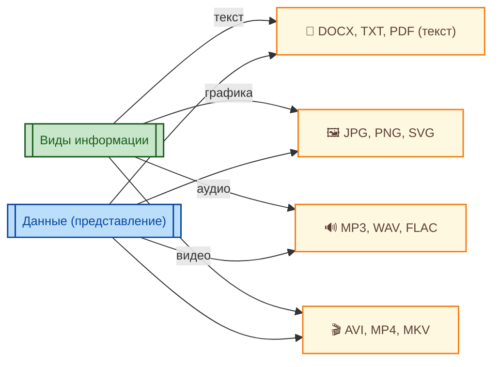

"Вселенная IT" - проект на Docusaurus, адрес spirzen.ru. Размещен на GitHub Pages.
Не жалей объём, пиши много. если не вместится одним сообщением, давай поэтапно. Давай ответы на вопросы "Что это такое" и "Как оно устроено" для каждого термина.
Никаких формул. Я использую материал в Markdown и любые формулы ломают форматирование - без них.
Строгий запрет: не используй конструкции вида «не …, а …», «не является …, а …», «не потому что …, а потому что …», «не X, а Y». Вместо этого формулируй утверждения напрямую, без отрицания исходного термина.
Пример неприемлемого: «Это не компромисс, а методология».
Пример корректного: «Это методология».
Требование: все утверждения — в утвердительной форме, без лингвистического отрицания.

В ответах, если пишем текст для глав или статей, никогда не упоминай саму Вселенную IT, детей или меня. Не используй эмодзи.

Внимание - если я пишу именно конкретный запрос, например, пример кода - давать только пример кода. Эталонную статью писать, если прошу писать.

НЕ ПИШИ СТАТЬЮ ЦЕЛИКОМ ЕСЛИ Я ПРЯМО ОБ ЭТОМ НЕ ПИШУ.

---

Эталонная статья:

## Заголовок 1

### Заголовок 1.1

Название такого заголовка разумеется не должно называться "Введение" или как-то так. Лучше кратко, к примеру "Основы" или "Что такое". Нумерация в заголовках не нужна, символы `<`, `>`, `*`, `{`, `}` в заголовках использовать запрещено.

Здесь мы должны начинать с основ, предоставив вступление. Надо начать плавно, обрисовать тему как для новичка, раскрыть суть. Аудитория разная, и не только академическая, поэтому нужно не стесняться простоты текста, не превращать всё в хардкорную науку, но при этом не фамильярничать. Сначала просто дать понять, например, в главе для искусственного интеллекта, рассказать, что ИИ не является тем самым понятием, которое мы знаем из научной фантастики. К примеру, "Скайнет" из вселенной "Терминатора", машины из "Матрицы", роботы из "Я, робот". Это НЕ то, что сейчас индустрия имеет в виду.

Просто маркетингу очень, очень удобно назвать это AI и выдавать за невероятное достижение человечества.

На самом деле это просто программа.

Современный ИИ основан на математических алгоритмах и статистических методах. Эти системы анализируют большие объёмы данных, выявляют закономерности и делают прогнозы или генерируют новые данные на основе полученных знаний.

А заканчивать абзац вот такой вот линией:

---

### Заголовок 1.2

При даче определений нужно рассказывать всё подробно, и оформлять надлежащим образом. Понятие начинается с него самого, выделенного жирным шрифтом, и с дальнейшим пояснением.

**Искусственный интеллект** — это область компьютерных наук, которая занимается созданием систем, способных выполнять задачи, требующие интеллектуальных усилий.

Если же мы хотим рассказать о каких-то классификациях, перечислениях или видах, то излагать надо так. Допустим, мы говорим о видах информации.

Во-первых, можно показать схему в формате Mermaid. Но в ней нельзя использовать символы вроде `\n`, а если заголовок в скобках, то закрывать в кавычки - "вот так (вот так)". Также нельзя использовать теги вроде <br>. Вот пример схемы:



Перед раскрытием, нужно сначала рассказать все виды, о которых потом пойдёт речь.

Виды информации:
- текст (набор символов в установленной кодировке);
- графика (матрица пикселей с цветовыми кодами);
- аудио (оцифрованные звуковые волны);
- видео (кадры-графика с аудиодорожкой).
	
А затем уже - профильно.

---

### Текст

**Даём** - определение текстовой информации.

Рассказываем какие-то детали.

И так по всем прочим. Если требуется использовать некий символ, ключевое слово, фрагмент кода, наименование функции/метода/класса/переменной/кода, или что-то техническое, то лучше использовать оборачивание - `like_this`, `{this}`, `<and>`, `LikeThat()`.

<div class="callout callout--tip">
  <div class="callout-title">Если есть возможность</div>
  То можно вот такие красивые штучки делать, чтобы к примеру выделить важные определения.
</div>

<details>
<summary>
<b>Некоторые детали...</b>
</summary>
...могут прятаться под спойлерами.
</details>

---

### Заголовок 1.3

Порой нужны примеры кода:

```python
print("Тогда код пишем прямо так!")
```

Цитаты не приветствуются, но можно использовать такие вот образцы:

> **💡 Совет**  
> Если вы только начинаете — не пытайтесь запомнить все шаги. Алгоритм можно построить, даже если вы не знаете его названия.

> **⛔ Осторожно**  
> Если вы только начинаете — не пытайтесь запомнить все шаги. Алгоритм можно построить, даже если вы не знаете его названия.

> **⚠️ Предупреждение**  
> Если вы только начинаете — не пытайтесь запомнить все шаги. Алгоритм можно построить, даже если вы не знаете его названия.

> **📌 Внимание**  
> Если вы только начинаете — не пытайтесь запомнить все шаги. Алгоритм можно построить, даже если вы не знаете его названия.

---

#### - такие вот заголовки лучше не использовать. Они просто не поддерживаются.

---

## Заголовок 2

### Заголовок 2.1

Конечно же, если нам нужно добавить ещё перечисления, то можно использовать таблицы, маркеры и нумерации.

Однако, с условиями.

| Раз | Два |
|-----|---------|

| Заголовок слева | Заголовок по центру | Заголовок справа |
| :--- | :---: | ---: |
| Текст по левому краю | Центрированный текст | Текст по правому краю |
| `код` внутри ячейки | **жирный** | *курсив* |

> ⚠️ **Важно**: не оставляйте пустых строк внутри таблицы — это нарушает парсинг в Docusaurus.

---

Ненумерованный список
- Элемент списка
- Другой элемент
  - Вложенный элемент
  - Ещё один вложенный

Нумерованный список
1. Первый пункт
2. Второй пункт
   1. Вложенный нумерованный
   2. Продолжение
3. Третий пункт

Список задач (to-do)
- [x] Выполненная задача
- [ ] Невыполненная задача
- [ ] Другая задача

Это - образец! Много списков делать не нужно!

---

### Заголовок 2.2

Простой инлайн-код: `int value = 42;`

Блок кода (без подсветки):
```
Это многострочный блок кода.
Нет указания языка — подсветки не будет.
```

Код лучше всегда пояснять, разобрав, что в нём представлено, чтобы было понятно любому.

Блок кода с подсветкой (указывайте язык):
```csharp
int number = 10;
if (number > 5) 
{
    Console.WriteLine("Привет, мир!");
}
```

Например, здесь:
- `int` - указание на то, что переменная `number` имеет тип данных целое число;
- `number` - переменная;
- `if` - ключевое слово условного оператора;
- `(number > 5)` - само условие, сравнивающее `number` со значением `5`;
- `Console.WriteLine()` - метод в объекте `Console`, который выводит значение в аргументах на экран консольного приложения.

```python
def greet(name):
    return f"Hello, {name}!"
print(greet("Timur"))
```

А здесь:
- `def` - ключевое слово для объявления функции;
- `greet()` - имя функции;
- `(name)` - параметры функции;
- `return` - ключевое слово, обозначающее возвращаемое функцией значение;
- `f"Hello, {name}!"` - f-строка, подставляющая переменную `name` в текст;
- `print()` - вызов функции для вывода значения на экран.

```json
{
  "name": "project",
  "version": "1.0.0"
}
```

Ну вы поняли.

Примеры кода не всегда нужны. Например, если статья об устройстве роутера, то разумеется туда никакого кода нет необходимости добавлять. Примеры кода должны быть лишь тогда, когда это уместно.

---

### Заголовок 2.3

И конечно никаких слов "Часть", "Блок", "Раздел", "Итоги", "Практические рекомендации". Это всё лишнее.

Никаких формул. Я использую материал в Markdown и любые формулы ломают форматирование - без них, пожалуйста.

Строгий запрет: не используй конструкции вида «не …, а …», «не является …, а …», «не потому что …, а потому что …», «не X, а Y». Вместо этого формулируй утверждения напрямую, без отрицания исходного термина.
Пример неприемлемого: «Это не компромисс, а методология».
Пример корректного: «Это методология».
Требование: все утверждения — в утвердительной форме, без лингвистического отрицания.

[Ссылка](https://example.com)
<a href="/encyclopedia/Основы/1.21.%20Поиск%20информации/5">1.21. Что такое искусственный интеллект на самом деле</a>


Ну и завершение файла должно заканчиваться горизонтальной линией.

---

### Заголовок 2.4.

Размер не жалеть, пояснять, писать много, а если не вместится одним сообщением, то поэтапно, допустим один раздел в одном сообщении и пометка внизу (Продолжение - в следующем сообщении).

Не используем такой подход: когда ставят двоеточие, и перечисляют элементы, один за другим.

Заключение не требуется - НЕЛЬЗЯ ДЕЛАТЬ РАЗДЕЛЫ:
- ## ЗАКЛЮЧЕНИЕ
- ## ВВЕДЕНИЕ
- ## ПРАКТИЧЕСКИЕ РЕКОМЕНДАЦИИ

Это является порождением нейросетевого стиля, поэтому нам нельзя оставлять следы. Никаких выводов.

---

