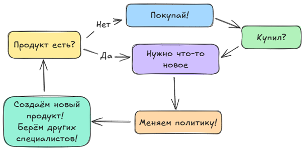
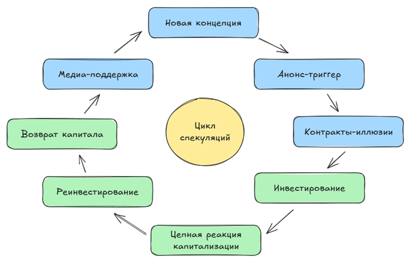

---
title: 1.05. Предупреждение
---

# 1.05. Предупреждение

## Реальность

IT - это бизнес, и специалистов нанимают, чтобы помогать «делать деньги». Вот реальная причина, и всё остальное неважно - кто вы, насколько хорошо разбираетесь в технологиях - это всё детали. Если думаете возразить, то представьте, что у вас проект на несколько сотен миллионов рублей. Вы будете нанимать новичков, или предподчтёте специалистов с большим опытом? 99%, что вы интуитивно и абсолютно справедливо выберете опытных, и ответ дали без учёта «софт-скиллов», личных качеств и прочих, как раз-таки деталей. Поскольку вы помогаете «делать деньги», важно понимать контекст, смысл которого зачастую теряется на фоне информационного потока, в котором мы живём. Давайте разберёмся.

Сейчас часто можно встретить панические настроения в СМИ по поводу сокращений и массовых увольнений в IT, а также новости, связанные с высоким уровнем безработицы, заменой людей на роботов, автоматизации и многое другое, что не внушает надежности. Это правда, но с условием. Как обычно - всегда есть «ньюанс».

Человеку, который мечтает стать «айтишником», становится страшно, возникают сомнения, он задаёт себе один и тот же вопрос «а точно ли стоит оно того?». Конечно, стоит, вдруг в будущем вы станете великим разработчиком, и подарите миру что-то прекрасное? Или вы хорошо заработаете, обеспечите себе и своей семье материальное благополучие. Определитесь с целями, и подумайте, что вы действительно желаете - заработать, попробовать себя в чём-то новом, прославиться, сделать жизнь лучше? Или у вас планы, долги, ипотека, и единственный выход - это повысить доход?

Когда вы определите цели, вы должны поставить четкую мотивацию. Если вам нужны деньги, вам придётся расти. Если нужна стабильность - лучше становиться более широкопрофильным, чтобы в случае смены курса развития отрасли вы не остались без работы. Словом, я предлагаю изучить вообще всё, а перед этим морально подготовиться. Переживать не стоит, если вы стараетесь - работа есть всегда, просто учитесь новому, старайтесь и слушайте сердце. Если вы начали поиск себя с данной сферы, но у вас что-то не получается, это не означает, что вы ничтожество, отнюдь - просто ваш путь проходит через эту цепочку событий. Многие успешные люди проходили череду бед и неудач, поэтому крепитесь, будьте сильными. 

И продолжая эту мысль, хотелось бы развеять иллюзии. Всё не так радужно, как кажется. Начнём с бизнеса и экономики. В каком обществе живём мы сейчас? Вокруг нас постоянный маркетинг - что-то нам «втюхивают», что-то постоянно в тренде. Если выпасть на год-два из новостей (допустим, на период службы в армии), то мир меняется до неузнаваемости - и так снова и снова.

В школе и университетах нам преподают основы социологии, обществознания, экономики, истории, политологии по старым методикам, без учёта реалий - а современные авторы всё равно традиционные и учат «базе», «фундаменту». Но кто учит реальности?

А чтобы было кому учить, давайте зададимся вопросом - а кто изучает реальность? 
Ученые-исследователи достаточно ли погружаются в отдельные сферы? Возможно, кто-то публикует свои наблюдения, но живёт со своим мировоззрением, в какой-то определённой стране, вырос под определённым влиянием. Чтобы сформировать правильное суждение реальности, нам нужно понять основы.

Всё идёт с экономики. Вы знаете закон спроса и предложения? Базовый экономический закон, говорящий о том, что снижение цены на товар увеличивает спрос и уменьшает предложение, и благодаря множеству условий вроде потребительских вкусов, моды, конкуренции, формируется некая картина с ценовой политикой. Но давно ли вы видели понижение цен? А уменьшение предложения? Вообще, существует ли спрос сейчас? В некоторых странах дефицит товаров, а в развитых профицит такого уровня, что люди уже абсолютно игнорируют правила жизни, из-за чего у них меняются потребности. Поэтому не ведитесь на общие исследования, учитывайте детали.

Что нужно человеку? Вода, питание, сон, крыша над головой. Словом, базовые потребности. А нужны ли ему такие товары, как видеокарта NVidia RTX 5090, Apple Watch, подписка на Netflix, маска для лица, кроссовки Nike, тональный крем или абонемент в премиум зал? Что общего у этих товаров? То, что бизнес создаёт искусственную нужду, нам внушают, мол, «все так делают», акцентируют на связи с продуктивностью, статусом, внешностью, продаются через тревожность, заменяя реальные решения.
Экономика сильно зависит от общества потребления, просто крупный бизнес привык ожидать только прибыль. Чтобы каждый год она удваивалась, а расходы уменьшались. Да, заменят работников на ИИ, роботов, автоматизированные системы. Но они лишают работы все больше людей, повышая доход оставшихся ценных сотрудников с десятками лет опыта. Со временем молодые так и не наберутся опыта, прогресс начнет останавливаться, а большое количество безработных и низко зарабатывающих людей снизят интерес к IT, что снова сделает сферу более нишевой, менее прибыльной, она потеряет свой престиж и растеряет потенциал. Прибыль упадет, так как у народа просто не будет денег. Почему? Давайте посмотрим на то, чем зарабатывают в IT.

1. Подписки. Компании предоставляют лицензию на пользование программным обеспечением на основе ежемесячных или ежегодных подписок, держат прибыль на увеличении количества подписчиков и увеличения цены. Со временем, народ просто перестанет пользоваться, сделав выбор в пользу бесплатных альтернатив. Все кто мог подписаться, подпишутся, после чего рост остановится. Для сохранения позитивной динамики, компании начнут повышать цены, из-за этого количество станет уменьшаться ещё сильнее, пока бизнес не сменит стратегию.

2. Микротранзакции и реклама. Без рынка азиатских стран и детей здесь не подняться, ведь детишки растут в условиях экономического неравенства и кризиса, не могут найти работу, следовательно, их дети уже не могут позволить себе столько тратить на те же микротранзакции. Со временем такая модель будет обречена на понижение, и потом компании усилят рекламу, чем вообще отсекут оставшуюся аудиторию. Плюс государства уже взялись за этот рынок за счёт регулирования влияния, что должно немного «оздоровить» рынок.

3. Интеграции и внедрения систем. Компании постоянно кому то что-то автоматизируют, устанавливают, модернизируют. Со временем всем ключевым заказчикам поставят всё, что нужно, и те, кто был способен заплатить, уже сами будут способны дальше поддерживать эти системы. И всё, интеграторы обречены на провал.

4. Государственные контракты. Государство уже автоматизировало большую часть задач, и все оставшиеся проекты в мире, в основном, идут в чей-то карман или являются лоббированием разных идей под призмой пропаганды. Это тоже приведет к плохому концу, но государственные деньги технически будут бесконечными, что делает эту часть самой перспективной и стабильной среди всех прочих.

Итог каков - всё, что мы видим, это жадность, которая возросла из-за хороших, прибыльных времён начала XXI века. Компании расслабились и сели на постоянный поток денег и клиентов, и когда поток начал уменьшаться, пошли увольнения и сокращения. Позже будет смена политики. Но технологии уже не растут так сильно, так что ещё не совсем ясно, чего ожидать. Ориентируйтесь на конец финансового года (март), учитывайте актуальность технологий и перспективу.

К чему это всё? Внимательнее. Изучайте рынок, знакомьтесь с решениями. Если вы выберете рискованную компанию, которая в перспективе потеряет стабильность, то и вы её потеряете.

## Иллюзия вечности

Прогресс не всегда идёт ровно, история показывает его волнообразность. Бывают периоды роста, но затем следуют и эпохи стагнации или застоев. Причины одни и те же - жадность, недальновидность, стремление следовать трендам. Система сама закапывает себя, закладывая семена собственного упадка.

Например, многие крупные корпорации сокращают сотрудников, но доходы все равно падают (да, Meta?). Крупная часть дохода держалась на рекламе, но она уже не приносит столько денег, так как средства имеют свойство заканчиваться.

Есть интересное будущее у криптовалюты - биткойн себя показывает хорошо, но это без пророческих способностей не оценишь рационально. Но это деньги из воздуха, которые, как и акции, создаются «из ничего», и так же падают «в никуда». Очень многие полноценно зарабатывают на создании прибыли «из ничего» - религиозные учения не просто так подчеркивали, что ростовщичество (заработок на воздухе) это грех, как раз потому что на этом построена вся экономика мира - на долгах. Изначально, условный ювелир решил «а почему бы не давать расписки вместо реального золота?», и со временем это выросло в громадную банковскую систему мира, где оборот денег держится за счёт эмиссий и долгов людей. Если все люди одновременно явятся за своими деньгами - у банков исчезнут деньги.

Как мы уже отметили, если классическая экономика в своих традиционных учениях внушает правила спроса, предложения, цены, то современная экономика давно на это наплевала. Теперь плевать на все - спрос абсолютно полностью искусственный, предложение уничтожено доступностью, торговаться уже невозможно, поэтому цены всегда ставятся продавцом и, что важно, почти никогда не снижаются.
Крупные корпорации заработали столько денег, что потери их уже не пугают, а мелкие компании просто не могут расти из-за монополизации рынка во всех сферах и областях. Как итог, со временем уже не будет «своего бизнеса» и уже не открыть «свою уютную кафешку». Не питайте себя иллюзиями, что вы сможете «открыть свою фирму». Время конкуренции прошло, теперь всем правит монополия.

Технологически тоже беда - как с части софта, так и железа. К примеру, Intel уже не конкурент никому, AMD очевидный лидер в процессорах, Nvidia в графике. И поскольку они монополисты, никто не может выйти с новым убийственным решением, что вынудит корпорации снижать цены. Завтра Nvidia может заявить, что видеокарты будут продаваться по минимальной цене в 100 тысяч долларов. И кроме потребителя, им ничего не помешает.

Вроде бы кажется, что потребитель может «наказать жадные корпорации кошельком», но нет - спрос разогнали до безумия, и маркетинговая машина работает на полную катушку вместе с другим страшным инструментом - банками. Если у человека нет денег, он возьмёт кредит. А потом новый кредит. Затем рефинансирует кредиты, взяв новый кредит. В итоге, закредитованность населения на беспрецедентном уровне, что лишь доказывает превращение спроса в абсолютную и нарисованную потребность, которую надо закрывать даже если у вас нет денег. Что ж, так ли вам нужен новый iPhone или видеокарта? Действительно ли вам нужна машина и собственная квартира в кредит на всю жизнь? 

Когда вы выступаете в роли специалиста IT, знайте - вы разгоняете эту машину. Вы помогаете зарабатывать корпорациям. Помните это - на вас всем плевать, на вашу личность, интересы, мнение и планы (как бы вам не внушали политики компаний), на самом деле вы лишь инструмент для получения прибыли. Один винтик в огромном устройстве. Будете работать слишком усердно - износитесь, и вас заменят. Недостаточно усердно - вас заменят. Вот, чего следует ожидать в этой отрасли.

Когда поступаешь в IT сферу, поначалу всё кажется радужным, как и в любой сфере. Начиная работать юристом, думаешь, что станешь честным борцом за справедливость, как Харви Дент, выбирая медицину, ожидаешь, что будешь заниматься лечением и помогать людям. На деле, и тот и другой занимаются заполнением бумажек. И всё, больше ничего. Бумага, отчёты, журналы. Информационные технологии внушили автоматизацию, как средство борьбы с этим, якобы цифровизация и перевод всего и вся в электронный вид поможет прогрессу. Но нет - если сервера рухнут или их взломают, то работа встанет (уже есть такие примеры, даже из недавних случаев). Надёжности нет. А на практике людям работать приходится даже больше, просто вместо заполнения 10 бумажек ручкой, людям нужно заходить в 10 систем, вбивать и заполнять 10 страниц. Если учитель раньше занимался обучением, то теперь он занимается вбиванием всякой ненужной ерунды в цифровые системы, которые будут создавать красивые цифры для руководства. А потом удивляемся - а почему вдруг престиж профессии педагогов и врачей так сильно падает?

Так вот. В IT престиж растет, потому что специалисты этой сферы занимаются тем, чем другим заниматься лень. В мире все ещё существует огромная часть человечества, которая ненавидит возню с бумагами, программами и всем прочим, и они лучше заплатят кому-то, чтобы он сделал эту грязную работу. Когда-то юристы и экономисты как раз были популярны по той же причине.

В IT сразу бросится забавная штука - дедовщина. Да, как бы странно ни звучало, но любой новичок сталкивается с тем, что над ним насмехаются из-за незнания стека, нехватки опыта, элементарных ошибок. А старички привыкли только негативить и поливать грязью, ведь для них это все штуки привычные. И им выгодно давить свежую кровь, ведь если эти новички укрепятся, они будут потенциально повышаться и могут затмить старичка, а этого нельзя допустить!

Порой старички собираются вместе и обсуждают, сплетничают, решают - кого же подставить следующим. Это правда. Не везде и не всегда, порой с различными особенностями, но факт - айтишники живут безнаказанно, работают, как правило, удаленно, и видят лишь «аватарки» своих коллег, и понимают, что у них в распоряжении лишь слова и никто им ничего не сделает, ведь далеко, а они дома, в тепле и под защитой. Не встречал ещё случаев, когда к наглому сеньору домой завалился джун и набил морду, как Джей с Молчаливым Бобом. Но и физически - программисты не бойцы, они сидят по 16 часов, пьют энергетики, редко выходят на улицу, не занимаются спортом, из-за чего и складывается понимание, что они слабые и не смогут навалять.

Но мир сложнее. Когда однажды, в будущем, вы станете опытным специалистом, прежде чем издеваться над новичком, не забывайте, что есть небольшой шанс, что он может запомнить это. 
Что ж, вот такая картина. Не так радужно, как кажется? IT не лучше других профессий, переносит старые проблемы в новую среду, здесь есть иерархии, дедовщина, презрение, безнаказанность, просто эта профессия ещё не утратила свой престиж. Пока мы относимся к новым поколениям, как к «отходам на входе», этот престиж будет угасать.

## Рекомендации

Чтобы выдержать всё это, давайте придериваться некоторых правил.

1. Не верьте новостям. Ни одной. Новости - это не информация, это маркетинг, пропаганда и повестка дня. Направление бизнеса или политика меняются - резко меняются и новости. Ещё в 2018 году была невероятно разгоняемая «экологическая повестка», в 2019 году защита меньшинств, в 2020 году коронавирус, в 2021 году вакцинация, а сейчас про это всё даже не вспоминают, так как политика сменилась. Словом, они не говорят, что происходит, они говорят, что мы должны чувствовать - страх, тревога, важность. Это целое искусство, и его качество сильно уменьшилось с годами. Всегда думайте - кому выгодна позиция, излагаемая в источнике.

2. Будьте скептичны к исследованиям. Это не истина, а аргументированная точка зрения, и часто она оплаченная. Фармацевтические компании публикуют «научные данные» о пользе своих препаратов. Техногиганты финансируют «независимые отчёты» о будущем ИИ. Климатические исследования — лоббируются и с той, и с другой стороны. Думайте о том, что могут скрывать, что не измеряли и о чём умолчали. Но важно - скептицизм не является отрицанием, это инструмент защиты разума.

3. Не верьте корпорациям. Никогда. Они не могут любить нас, заботиться, а может только использовать. «Мы ценим наших сотрудников» - пока они актуальные и дешевые. «Наш продукт меняет мир» - пока приносит прибыль. «Мы за устойчивое развитие» - пока идея продаётся. Это машина для создания прибыли, а мы лишь топливо, и когда топливо заканчивается - его заменят. Никакой «семьи», только расходный материал.

4. Изучайте тренды, но не бегите за ними. Модный костюм снимут через год. Если бежим за каждым трендом, то никогда не станем экспертами, будем вечным новичком. Вот если что-то вам действительно понравилось - можно углубляться.

5. Используйте скептицизм грамотно. Не осуждайте то, чего не изучили, не говорите «Это бред», пока не попробовали. Но и не ведитесь на «маст-хэв». Сначала ознакомьтесь, потом оцените и лишь после этого решайте. Разумный скептик отличается от циника.

6. Ищите скрытый смысл и выгоду. Каждое действие - это выгода для кого-то. Почему нам предлагают бесплатный курс? Чтобы собрать данные и продать подписку. Почему соцсеть внедряет новую функцию? Чтобы мы проводили там больше времени. Почему врач назначает анализ? Потому что клиника получает комиссию. Словом, нужно учиться определять - «Кто выигрывает?», «Кто теряет?» и «Что остаётся за кадром?».

7. Не инвестируйте в то, что не понимаете. Криптовалюта, NFT, акции, стартапы, всё это не способ обогащения, а поле для манипуляций. Если предлагают выйти на 1000% за месяц - это с наибольшей вероятностью мошенничество, а если все вокруг вкладываются - это пузырь.

Забавный пример - Hamster Kombat, криптовалютная компьютерная игра в жанре кликера, основанная внутри Telegram на блокчейне TON. Она резко взлетела, и люди массово начали ежедневно часами «тапать», нажимая на виртуального «хомяка» в надежде, что вскоре всё «накликанное» можно будет монетизировать и заработать хорошие деньги. Когда произошел выход токенов на рынок, люди заработали…реально копейки, которые позже обвалились до крайне низких позиций. А времени потрачено куча, и что самое ужасное - когда количество пользователей росло, создатели добавляли в игру рекламу, благодаря чему подняли очень хорошие деньги. Этой прибылью, разумеется, с пользователями никто не делился.

8. Развивайтесь шире, чем ваш текущий стек. Учите экономику, психологию, философию, историю, дизайн, этику, политологию, социологию, ведь когда (теоретически) ИИ заберет нашу работу, единственной ценностью будет способность мыслить. Навыки устаревают, фреймворки меняются, языки умирают, но умение видеть системно, понимать контекст, ставить правильные вопросы - вечное. Особенно важно задаваться вопросом «Может, лучше не делать?», который тот же ИИ себе не задаст - он не способен сомневаться, как живой человек. Робот сразу пойдёт в бой, а животное будет колебаться и бояться, преодолевать барьеры, прежде чем решится на поступок.

9. Будьте добрым. Особенно к новичкам. Все бывают начинающими, делают ошибки, не знают, куда нажать. Сильный не тот, кто силу показывает, а тот, кто сдерживает её, хотя может применить. Если вам важно чувствовать себя выше, огорчу, но это не сила.

10. Не стройте иллюзий насчёт «своего бизнеса». Как бы красиво не звучало, но в современных реалиях монополий, алгоритмизации и закредитованности открыть своё дело это подвиг. Если всё же решили стать предпринимателем, будьте готовы к многолетнему труду без прибыли, давлению со всех сторон и к тому, что вас никто не заметит.

В IT намного интереснее выбрать open source и сообщество, где люди объединяются, а не конкурируют.

11. Не забывайте о реальной жизни. К сожалению, у меня тоже был опыт, когда я годами работал по 12-16 часов перед монитором над задачами, чтобы завершить в срок и в полном объёме, но в ответ не получал того, чего ожидал - порой хочется хотя бы малейшего признания, но нет, ему не бывать. Именно в такие моменты оборачиваешься и понимаешь, что инвестировал свою личную жизнь, а она не имеет цены. Не губите здоровье, выходите, гуляйте, общайтесь с людьми, дышите, трогайте, смотрите в глаза, живите, ведь реальность вокруг нас.

А теперь представьте, что вы фронт разработчик, который несколько дней и ночей пыхтел и старался по 15 часов в сутки, чтобы…создать красивую кнопку на сайте. Или бэк-разработчик, который вовсе сделал так, чтобы кнопка выполняла действие не за 88 мс, а за 33! Звучит не так уж и солидно, да? Поэтому не питайте слишком больших иллюзий о вкладе «айтишников» в мир. Живите, наслаждайтесь, и будьте сильнее.

## Мыльный пузырь

XX век стал эпохой трансформации - экономика Запада почти полностью перешла от производства к финансам. Фабрики уступили место биржам, инженеры - аналитикам, реальные товары - акциям, опционам и капитализации. Это не плохо само по себе - рынок эффективен, но когда он попадает в руки жадных игроков, он превращается в машину по созданию иллюзий.

Экономисты отмечают, что это эпоха «финансиализации экономики». Финансиализация — это процесс, при котором финансовый сектор начинает доминировать над реальным производством, а прибыль генерируется не через создание товаров и услуг, а через перераспределение капитала, управление рисками и манипуляцию ожиданиями. В условиях глобализации и цифровизации капитал всё чаще концентрируется не в руках производителей, а в руках владельцев активов и платформ. Это создаёт структурное неравенство: доходы от капитала растут быстрее, чем доходы от труда.

Проще говоря, деньги теперь создаются из воздуха.

Если восточные страны, такие как Российская Федерация или Китай, не имеют зависимости от рынка и фондов, то Запад очень сильно «рисует» свои собственные правила, которые сам же и нарушает. Восток занял долю производства, Россия, вместе с африканскими и арабскими странами поставляют сырьё, а Индия и средняя Азия - рабочую силу. Но Запад лишь манипулирует рынком, фактически.
Компании больше не зарабатывают на продуктах — они зарабатывают на ожиданиях. На хайпе. На «потенциале». На «будущем». Особенно в IT, где реальный продукт часто появляется после того, как миллиарды уже вложены в его обещание. 

В этом контексте IT-индустрия — идеальный инструмент для спекуляции, ведь продукты нематериальны (софт, алгоритмы, API), их стоимость субъективна и зависит от ожиданий рынка, масштабируемость бесконечна, а спрос легко манипулируется через медиа и маркетинг.

Западная модель — финансово-спекулятивная, ориентирована на краткосрочную капитализацию, акционерную стоимость, медиа-повестку. Важнее не то, Что компания делает, а то, что она обещает.
Восточная модель — производственно-стратегическая, ориентирована на долгосрочное планирование, государственное регулирование, реальные активы и ресурсы. В Китае, например, даже технологические гиганты (Alibaba, Tencent) подвержены жёсткому государственному регулированию, чтобы не допустить «дикой» капитализации и отрыва от реальной экономики.

Почти все ключевые IT-корпорации — американские или западные. Они не просто создают технологии — они создают модели распространения, методологии, платформы, инструменты, языки, стандарты. И, что важнее — они создают повестку. Чего только мы не видели - экологическая, национальная, расовая, гендерная повестки, искусственный интеллект, криптовалюта, метавселенные, NFT, майнинг. Это всё не органический, а спекулятивный спрос, искусственно созданный через PR, инвестиции, слияния, анонсы и — что самое главное — взаимные финансовые потоки между дружественными компаниями.

Здесь стоит ввести понятие информационного пузыря — термина, который развил Роберт Шиллер (лауреат Нобелевской премии по экономике). В отличие от классических рыночных пузырей (типа тюльпаномании), информационные пузыри возникают вокруг технологий, идей, нарративов, которые подогреваются медиа, экспертами и инвесторами.

IT-индустрия — идеальная среда для таких пузырей, потому что технологии сложны для массового понимания, и легко манипулировать восприятием, продукты часто абстрактны и их ценность субъективна, рынок глобальный и мгновенный, хайп распространяется со скоростью света. И разумеется, инвесторы склонны к FOMO (Fear Of Missing Out), что дарит иррациональные вложения.
Как отмечает Карл Бенгер в «Экономике внимания», в цифровую эпоху главный ресурс — не нефть и не чипы, а внимание человека. ИИ — это не просто технология. Это нарратив, на котором держится внимание, а значит — и деньги.

Всё организовано по схеме. 

Это можно назвать экономической моделью замкнутого цикла спекулятивной капитализации, где включается:

•	анонс-триггер (создание нарратива);

•	контракт-иллюзия (подписание меморандумов и предварительных соглашений без обязательств);

•	цепная реакция капитализации (рост акций всех участников цепочки);

•	реинвестирование (возврат капитала к истоку, создание видимости «экосистемы»);

•	медиа-поддержка (усиление веры через СМИ, аналитиков, «экспертов»).

Такова финансовая алхимия по превращению воздуха в «ценность», через PR.

Пример - как сейчас финансируется ИИ. Согласно отчётам SEC и Bloomberg, более 60% роста капитализации Nvidia в 2023–2024 связано не с ростом продаж, а с ожиданиями рынка и спекулятивными контрактами.

Чтобы работали вычисления, нужно железо, так? И в огромных количествах, что требует построения гигантских кластеров. Вот как это работает на примере OpenAI — Nvidia — Oracle:

1. OpenAI анонсирует Stargate - «самый большой ИИ-кластер на планете». Планов, инфраструктуры нет, но благодаря новости, капитализация компании вырастает на 30%, просто потому что это «будущее».

2. OpenAI подписывает контракт с Oracle на $300 млрд. Акции Oracle взлетают.

3. Oracle бежит к Nvidia - нужны чипы! Контракт на $40 млрд, акции Nvidia бьют рекорды.

4. Nvidia инвестирует $100 млрд обратно в OpenAI, и деньги вернулись туда, откуда стартовали. 

Никакого нового завода, продукта, но зато капитализация увеличилась «из пустоты»!

Так владельцы компаний становятся богаче, инвесторы тоже. Но в реальности это лишь «тренд». Деньги не создают ценность — они создают видимость ценности. Пока все верят в эту видимость — пузырь живёт. Восточный рынок построен иначе, он абсолютно никак не реагирует на какие-то новости. Да, у нас есть фондовая часть, но она составляет лишь долю, а суммы капитализаций совершенно несопоставимы с американскими компаниями. А потом Дженсен Хуанг делает заявления, что по его прогнозу, вскоре понадобятся строители, монтажники, электрики, сантехники, так как будет строительный бум на 10-20 лет. Снова нарисованная востребованность?

Нам какое дело? А проблема в том, что пока компании занимаются своими делами, мы выступаем винтиками во всём этом. Люди верят в ложь, молодые разработчики бросают стабильные профессии, чтобы «войти в ИИ», не понимая, что «входить» некуда — есть только хайп. Компании перестраивают бизнес под «ИИ-трансформацию», тратя миллионы на консультантов и «prompt-инженеров», вместо того чтобы решать реальные задачи. Образование превращается в фабрику по производству «специалистов по трендам», а не профессионалов с глубокими знаниями.

Именно это и привело к перенасыщению рынка, из-за которого простые работяги не могут найти работу. Если вы решили выбрать IT, то развивайтесь шире. Не гонитесь за трендами. Гонитесь за смыслом. Технологии приходят и уходят. ChatGPT сегодня — завтра что-то другое. А Nvidia через 15 лет может быть никому не нужна (как когда-то была никому не нужна IBM). Нам нужно развивать профессионализм, софт-скиллы, самостоятельность и ценности.
Я много лет слежу за «трендами», новостями IT, экономики и бизнеса. Честно, каждый год все меняется, одна тенденция заменяет другую, и каждая «уверяет» в своей перспективности и надёжности.

Это называется «когнитивный капитализм» - эксплуатируется не только труд, но и внимание, знания, эмоции и надежды людей. Образование превращается в фабрику трендов — вместо фундаментальных дисциплин — курсы по «prompt-инжинирингу». Рынок труда перегружен «специалистами», обученными под временный спрос, который исчезнет через 2–3 года. Формируется FOMO-культура: страх упустить «будущее», которое может и не наступить. И стирается грань между развитием и манипуляцией. Технологии становятся не инструментом, а идеологией.

К чему я. Хотите ли вы быть тем, кто будет бесполезен через несколько лет?

## Возвращаемся!

Что ж, небольшого философского отступления должно быть достаточно, но впереди нас ждут знания, так что давайте вернёмся к предмету изучения.
