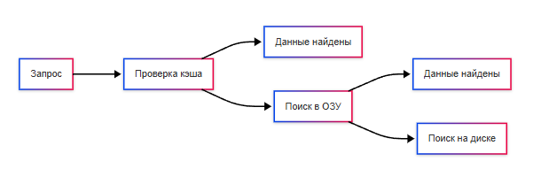

---
title: 1.10. Базовые операции с данными
---

# 1.10. Базовые операции с данными

Мы определили, что такое информация, данные, какие бывают их типы. Кроме того, мы усвоили, что они хранятся в постоянном или временном хранилище и обрабатываются процессором. Данные – «сырьё», но как именно производится обработка, что с ними можно делать? Мы разберём, как программы и системы взаимодействуют с данными: читают, изменяют, перемещают, удаляют их.

## Ввод и вывод

★ **Ввод-вывод** – процесс взаимодействия между программой и внешними устройствами. Когда вы нажимаете клавишу, сигнал передаётся в операционную систему, которая отправляет запрос в программу (допустим, текстовый редактор) для обработки сигнала и вывода символов на экран. К примеру, открывая файл двойным щелчком, вводится набор команд, выполняется процесс изучения инструкций, анализ выбранного файла, поиск закрепленной для формата программы, команда по её запуску, и соответствующий вывод на интерфейс.

Процесс ввода/вывода называют также I/O - Input/Output.

Ввод позволяет передавать данные в компьютер через устройства:
	- Клавиатура позволяет вводить текстовы данные. Символы передаются как коды клавиш (например, ASCII или Unicode).
	- Мышь передаёт координаты курсора и события (нажатия кнопок, прокрутка колеса). Это позволяет обрабатывать события в реальном времени.
	- Сканер преобразует изображения или текст в цифровой формат.
	- Микрофон записывает аудиосигналы - аналоговый сигнал преобразуется в цифровой.

Вывод получает данные из компьютера на устройство:
	- Монитор отображает визуальную информацию, использует видеопамять и графические процессоры для обработки. Видеокарта отправляет данные на монитор.
	- Принтер печатает данные на бумаге, материализуя информацию, но требует форматирования данных (к примеру, в PDF).
	- Акустическая система выводит звук - наушники, колонки. Цифровой сигнал преобразуется в аналоговый.

Двусторонние устройства могут как принимать, так и отправлять данные:
	- Жёсткий диск (HDD/SSD) хранит и читает данные, позволяя записывать информацию на него.
	- USB-накопители позволяют переносить данные между устройствами (есть и другие виды переносных устройств, к примеру, MicroSD или SD-карты, а также переносные жёсткие диски).
	- Сетевые карты обмениваются данными через интернет или локальную сеть, используя протоколы передачи данных.

По способу организации, выделяются следующие виды ввода-вывода:
	- программно-управляемый ввод-вывод, когда процессор непосредственно управляет передачей данных (чтение данных из порта ввода-вывода);
	- ввод-вывод с использованием прерываний, когда устройство сигнализирует процессору о готовности данных через прерывание (нажатие клавиши);
	- прямой доступ к памяти (DMA, Direct Memory Access) - передача данных происходит напрямую между устройством и оперативной памятью без участия процессора (чтение данных с жесткого диска).

В зависимости от типа передаваемых данных выделяют:
	- символьный ввод-вывод (ввод текста, вывод текста);
	- блочный ввод-вывод - передача данных блоками (фиксированными порциями) - чтение и запись файлов на жесткий диск;
	- потоковый ввод-вывод - передача данных непрерывным потоком (аудио- и видеопотоки).

По уровню абстракции выделяется низкоуровневый ввод-вывод (работа напрямую с аппаратными интерфейсами, допустим, программирование портов ввода-вывода) и высокоуровневый ввод-вывод (использование функций операционной системы или библиотек).

По режиму работы выделяется синхронный ввод-вывод (операция завершается только после полного выполнения) и асинхронный ввод-вывод (операция выполняется параллельно с работой программы). Но об этом позже мы поговорим отдельно.
Таким образом, ввод-вывод — это может быть и чтение-запись, а не только материализация и цифровизация.

## Чтение и запись

★ **Чтение и запись данных** – процедуры информационного обмена с источником данных. В этом «обмене» нужно запомнить несколько ключевых концепций – собственно, чтение и запись, а также указатель файла, буферизация и системные вызовы.

Операционная система рассматривает файл как линейную последовательность байтов, каждый из которых имеет свой номер (offset), начиная с 0. Допустим, файл Привет.txt содержит текст «Hello»:

Байт|	0	|1	|2	|3	|4|
|----------|-----------|-----------|----------|-----------|-----------|
Символ|	H	|e	|l	|l	|o|

В том же «Hello» спрятан интересный процесс кодировки – физически это набор сигналов, сгруппированных как файл, состоящий из байтов, а мы видим вполне себе текстовую часть – это происходит за счёт декодирования в установленной кодировке. Но как система понимает, в каком месте «e», допустим? Вот именно для этого и используется специальная переменная, которая называется **указатель файла** (`file pointer/file descriptor position`), хранящий текущую позицию в файле (номер байта, с которого начнётся следующая операция).

Это работает так:
	- файл открывается → указатель останавливается на первом – 0;
	- после каждой операции чтения/записи он автоматически сдвигается на количество обработанных байтов;
	- программа может вручную изменить позицию указателя (прочитать данные из середины файла);
	- файл можно открыть в разных программах, и указатель будет везде свой.

То есть, файлы – байтовые потоки данных, а указатель – «курсор», который двигается при чтении/записи. И когда программа читает файл, данные проходят некую «расшифровку» из формата хранения в язык запроса – при этом выполняется два этапа:
	- системный буфер (кэш ОС), когда данные копируются с диска в память ядра, а если следующему запросу понадобятся те же данные, они берутся не с диска, а с ядра, что ускоряет работу, словно «ящик около стола» вместо «хождения в архив»;
	- прикладной буфер (буфер программы), когда данные копируются из системного буфера в память программы.

Сложно? Давайте проще – если программа дважды читает один и тот же участок файла, второй запрос будет мгновенным – данные уже в системном буфере. Это и есть **буферизация** – помещение данных в буфер, чтобы «не бегать в архив», такой метод организации обмена ввода и вывода данных, который использует *буфер* для временного хранения данных, читая данные «порционно».

**Файлы** — это данные, которые хранятся на носителях: жёстких дисках (HDD), SSD, флешках и прочих. Но для удобства работы с ними операционная система использует файловую систему — специальную структуру, которая управляет тем, где, как и в каком порядке записываются данные.

**Файловая система** управляет хранением данных, следит за тем, какие части диска заняты, а какие свободны, хранит метаданные о файлах (имя, размер, дата создания, права доступа), и организует их в каталоги и папки. Данные расположены в древовидной иерархии, где всегда есть первый уровень - корень, и дочерние элементы - каталоги. Каталоги могут содержать в себе файлы и другие каталоги, что и порождает пути:

```
Корень/Каталог/Каталог/Каталог/Файл
```

Каждый файл и папка имеет свой уникальный путь от корня `/`.

В Linux и macOS каждому файлу присваивается inode — уникальный номер, который содержит информацию о правах, владельце, времени изменения, указателях на физические блоки на диске. Путь не определяет inode напрямую, но используется как ссылка на него через имена файлов и каталогов. Система ищет начиная с корня, и поэтапно идёт по элементам в адресе.

**Путь** — это способ указать местоположение файла или папки в иерархии файловой системы. Он похож на адрес вроде «улица Ленина, дом 5». Путь может быть абсолютным и относительным.

**Абсолютный путь** является полным, начиная от корневой директории файловой системы или диска, всегда однозначный и не зависит от текущего рабочего каталога программы. 
Примеры:
```
Windows - C:\Users\Timur\Documents\file.txt
```
```
Linux/macOS - /home/timur/Documents/file.txt
```

Такой путь всегда начинается от корня (/ в Unix-системах, C:\ в Windows) и точно указывает, где находится файл.

**Относительный путь** является путём относительно текущего рабочего каталога. Он короче и зависит от того, в какой директории работает (запущено) приложение:
```
Documents/file.txt
```
```
../Downloads/file.txt
```
Когда программа запускается, у неё есть текущий рабочий каталог — это место, от которого будут считаться относительные пути.

## Кэш

Когда есть несколько процессов, которым понадобятся данные, буферизация позволяет процессу положить данные, и переходить дальше, продолжая работу, не ожидая завершения обработки данных вторым процессом, обеспечивая многозадачность. Пример буферизации – кэширование.
★ Кэш – промежуточный буфер с быстрым доступом к нему, как раз для кэша используется память с большей скоростью доступа. Набор данных в основной памяти, как и в кэше, состоит из набора записей, где у каждой записи есть индекс (номер, идентификатор, как пункт в таблице), и кэш использует ещё один идентификатор, называемый «тег», который содержит номер индекса из основной памяти. Причем, основной памятью мы называем оперативную память, а временной – кэш-память.
Таким образом:
  - есть хранилище (диск), основная память (ОЗУ) и временная память (буфер, кэш);
  - основная память содержит индексы для каждой записи в наборе данных:
  
|Индекс основной памяти|	Данные|
| :--- | :---: |
|0	|Кот|
|1	|Собака|
|2	|Гусь|
	- временная память содержит тег, который равень индексу из основной памяти:
	
|Индекс кэша|	Тег (индекс основной памяти)	|Данные|
| :--- | :---: | ---: |
|0	|2	|Гусь|
|1	|0	|Кот|

  - кэш-память используется как дополнительный компонент процессоров, оперативной памяти, и многих других устройств.
Таким образом, читая книгу по страницам, вам проще все страницы держать у себя на столе, чем бежать за каждой страницей в библиотеку. Так и работает буфер.



### А чтение и запись?

★ **Чтение (Read)** – процесс получения данных из источника:
	- файла на диске;
	- оперативной памяти;
	- сети (например, загрузка веб-страницы).
	
★ **Запись (Write)** – процесс сохранения данных в определенное место:
	- в файл;
	- в базу данных;
	- на сервер.
	
## Манипуляции с данными

★ **Копирование (Copy)** – создание точной копии данных без удаления оригинала. При этом происходит чтение, и запись в другом месте точного аналога, причем что оригинал, что копия – будут индивидуальными наборами данных, но содержащими идентичную информацию. 

**Важно**: есть комбинация горячих клавиш для операции копирования выбранного набора данных – Ctrl+C.

Копировать можно текст, файлы, папки (каталоги), объекты, переменные и структуры данных в памяти. Есть несколько способов копирования:
	- через буфер обмена - данные временно перемещаются в специальную область памяти (буфер обмена), откуда их можно вставить в другое место;
	- непосредственное копирование - данные копируются напрямую через командную строку (cp в Linux);
	- копирование через сеть - передача данных между устройствами через сетевое соединение, к примеру с одного компьютера на другой.

Копирование может быть поверхностным (когда копируются только ссылки на данные или метаданные, к примеру - копирование ярлыка файла вместо самого файла) и глубоким (когда создаётся полная копия всех данных, включая вложенные элементы).

По целям использования выделяют:
	- резервное копирование - создание копии данных для защиты от потери или повреждения;
	- клонирование - создание точной копии устройства или системы (снимок);
	- копирование для обработки - создание копии данных для дальнейшего редактирования или анализа (допустим, копирование таблицы в Excel).

★ **Перемещение (Move)** – перенос данных из одного места в другое с удалением оригинала. В отличие от копирования, создаётся точная копия данных, но старая версия удаляется, а место – освобождается. Комбинация клавиш – Ctrl+M.

★ **Вырезание (Cut)** – аналог перемещения, но чуть более интуитивно для пользователя – когда есть возможность отметить набор данных, выгрузить его в буфер, а затем вставить из буфера в нужное место. Горячая клавиша – Ctrl+X.
Отличие перемещения от вырезания заключается в том, что вырезание сначала помещает данные в буфер обмена, а удаление оригинала происходит только после завершения операции вставки. Перемещение же сразу переносит данные из одного места в другое без использования буфера обмена. Поэтому перемещение больших файлов может быть быстрее.

★ **Вставка (Paste)** – генерация скопированного или вырезанного набора данных в выбранное место из буфера обмена. Копируя, или вырезая, мы помещаем данные во временную память, а вставляя – даём команду сгенерировать копию данных из буфера. Горячая клавиша – Ctrl+V.

★ **Удаление (Delete)** – освобождение места от набора данных, очистка данных из хранилища. Начинающие пользователи помнят, что есть обычное удаление, когда файл попадает в корзину с возможностью его восстановить, и полное удаление, когда происходит безвозвратная очистка без возможности восстановления. Но так работает только за счёт инструментов операционных систем. К примеру, если удалить запись из базы данных – корзины уже не будет, только другие инструменты восстановления. Аналоги – Стирание (Erase) или Очистка (Clear). Для удаления есть клавиша – Delete (Del).

**Удаление в корзину в Windows** — это логическое удаление. Физическое удаление — это полное уничтожение данных с носителя. Для удаления данных из оперативной памяти, как правило, применяют термин очистка и освобождение, а когда речь идёт об удалении фрагментов файла (допустим, абзац текста), то это стирание. Очистка также подразумевает удаление информации из каких-либо контейнеров, например, поля на странице.

По уровню сложности удаление бывает:
	- простое удаление - удаление одного объекта без учёта связей с другими данными;
	- массовое удаление - одновременное удаление большого количества данных;
	- каскадное удаление - удаление объекта вместе со всеми связанными с ними зависимыми данными.

Каскадное удаление применяется, примеру, в базах данных или операционной системе - при удалении родительского элемента, дочерние тоже удаляются. Каскадное удаление является более опасным, но и простое удаление может вызвать ошибки, когда удаляется один элемент, но все связанные элементы ссылаются на удалённый, из-за чего логика работы нарушается.

★ **Создание (Create)** – генерация новых данных, будь то файл или запись в базе данных. К табличным или списочным данным применяют термин Добавление (Add) – когда, допустим, добавляется запись, элемент.
 
★ **Изменение** – обновление существующих данных, файла или записи. У этой операции есть фактические синонимы, когда, по сути, процесс один и тот же:
	- Edit (изменение);
	- Update (обновление);
	- Modify (модификация).

Если вы новичок, то можете потренироваться, попробовав создать текстовый файл, изменить его, сохранить, сделать копию и удалить. Но, подозреваю, что процесс этот вам знаком. Важно: учитесь привыкать к использованию горячих клавиш, это ускорит процесс работы.

Операции с данными – основа работы компьютера. Понимая, как данные копируются, перемещаются, изменяются, а также запомнив горячие клавиши, вы глубже разберётесь в IT-системах. Далее мы изучим файловые системы, алгоритмы и софт.

