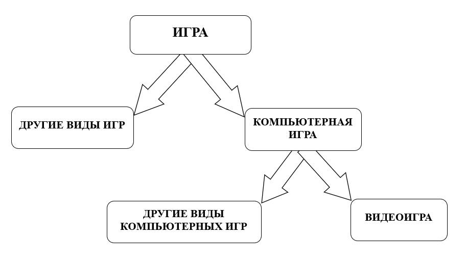

---
title: 1.18. Компьютерные игры
---

# 1.18. Компьютерные игры

# Раздел в разработке

## Понятия

Игра – занятие, которое развлекает пользователя.

Компьютерная игра – программа для ЭВМ, где вместо реальных предметов и действий игрок взаимодействует с компьютером, который предоставляет виртуальную реальность.

Видеоигра – специальный вид компьютерной игры, где виртуальный мир отображается на экране, а игрок управляет с помощью специальных устройств.

Компьютерные игры, которые не являются видеоиграми – это текстовые игры (они не содержат изображения, как такового), шахматы и шашки (которые реализованы без использования графики, т.е. текстовые), игры с голосовым управлением (к примеру, взаимодействие с голосовыми помощниками путем игры в «Города»). Это всё игры, компьютерные игры, но не видеоигры.



Игра – программа, выполняющая алгоритм действий в ответ на действия игрока. У игры есть свои особенности, такие как геймплей (то, как игрок взаимодействует с механиками игры, управляет персонажем, решает задачи, исследует мир), эмоциональное взаимодействие (что чувствует игрок во время игры – радость, гнев, страх, напряжение, удовлетворение), сценарная составляющая (основной сюжет, персонажи, события и диалоги, концовки), художественная составляющая (музыкальное сопровождение, звук, графика, дизайн мира, уровней и объектов), а также движок (набор технических средств, обеспечивающих работу программы).

Игроки – пользователи, основные субъекты, которые взаимодействуют с игрой, а также друг с другом, как в команде, так и в условиях соперничества. Здесь рождается не только управление и команды программе, но и координация действий, распределение ролей, взаимопомощь, общение в чате, голосовой связи. При обсуждении игр, под «игроком» могут подразумевать как самого человека, управляющего устройством, так и его виртуальный аватар, который правильнее называть героем, персонажем, но это относится лишь к отдельным жанрам. В более сложных жанрах игрок управляет целой сетью систем и механик – допустим, в стратегиях, как правило, игрок играет роль «командующего», при этом не обладая «аватаром». В любом случае, именно между игрой и игроком существует своеобразный диалог.

Разработчики – непосредственные создатели игры. Именно они написали код программы, скрипты взаимодействия, создали художественную, сценарную, техническую составляющую игры. Но не всегда разработчики отвечают за продажу и продвижение игры как продукта, тут часто возникают их отношения с издателем.

Издатели – лица, обеспечивающие распространение и реализацию игры как продукта, в том числе защиту прав, определение ценовой политики, а зачастую выступающие в роли заказчиков игровых продуктов. Немалая часть материала книги будет посвящена издателям, поэтому к ним мы ещё вернемся.

Видеоигровое устройство – бытовой радиоэлектронный аппарат, цель которого – получить вводные данные (к примеру, нажатие клавиш/кнопок при помощи периферийных устройств), и выполнять вывод данных (изображение, звук, и даже вибрация). Как правило, это компьютер или игровая приставка/игровой автомат, на котором загружена программа, а ввод осуществляется через клавиатуру, мышь и геймпад. 

Мы не будем погружаться в игры на данный момент, поэтому для начала этого достаточно. В целом, ясно – задача – развлекать игрока, а игроком является любой, кто участвует в игре. Видеоиграм я посвятил отдельную книгу, поэтому в данной книге мы рассмотрим более прикладные темы, рассмотрим то, что нужно для создания и разработки, так как разработка игр - тоже IT.

## Как работают игры?

Современные геймеры уже довольно чётко представляют себе картину индустрии, состоящей из платформ, разработчиков, издателей и геймеров. Это довольно незамудрённая система, где кто-то финансирует и продаёт игру, кто-то её разрабатывает, а кто-то где-то их покупает и играет. Но за такой вот кажущейся простотой игрового процесса скрывается сложная система взаимодействия между игроком, программой и оборудованием. Чтобы понять, как работает игра, нужно рассмотреть её внутреннюю структуру и принципы функционирования.

### Какие же основные компоненты у игры?

1. Цикл обработки событий (game loop) — это бесконечный цикл, который проверяет входящие данные от игрока (например, нажатия клавиш или движения мыши), обновляет состояние мира игры и выводит новое изображение на экран. Игра ведь должна реагироровать на получение ввода, обновлять логику игры и рисовать новые кадры.
2. Обработка ввода. Игра получает команды от пользователя через различные устройства: клавиатуру, мышь, геймпад, сенсорный экран или даже голосовые команды. Эти сигналы интерпретируются как действия: прыжок, стрельба, выбор меню и т.д.
3. Игровая логика. Здесь происходит обработка всех правил и механик: физика движений, поведение врагов, реакция на столкновения, выполнение заданий, управление инвентарём и так далее. Всё это реализуется через код, написанный разработчиками, и может быть дополнено искусственным интеллектом NPC (неигровых персонажей).
4. Графический движок отвечает за отрисовку всего того, что видит игрок: персонажей, окружения, эффектов и интерфейса. Современные графические движки умеют рендерить трёхмерные миры, учитывать освещение, тени, анимации и многое другое.
5. Физический движок имитирует законы физики внутри игры: падение предметов, столкновения, гравитацию, движение транспорта и так далее. Некоторые игры используют реалистичную физику, другие — упрощённую, чтобы сохранить игровость и скорость.
6. Звуковая система отвечает за воспроизведение музыки, диалогов, шумов окружающей среды и звуковых эффектов. Также может поддерживать 3D-звук, где направление источника влияет на то, как звук доходит до игрока.
7. Сохранение состояния - чтобы уметь запоминать прогресс игрока. Для этого используется локальное или облачное хранилище, куда записываются данные о состоянии мира, уровне персонажа, собранных предметах и других параметрах.

Когда игрок нажимает кнопку прыжка, сигнал передаётся в систему ввода, после чего игровая логика проверяет, находится ли персонаж на земле. Если да, то активируется прыжок - физический движок рассчитывает траекторию прыжка и силу гравитации, графический движок отрисовывает анимацию прыжка. Если персонаж приземляется на голову врага, то игровая логика определяет столкновение и уничтожает врага. Звуковой движок проигрывает звук победы над врагом, и все изменения сохраняются в файле.

Так работает каждое действие в игре - и логика может быть разнообразной и сложной, сочетая в себе программирование, математику, физику, искусство и психологию. Это полноценный программный продукт, работающий в реальном времени, с высокими требованиями к производительности, отзывчивости и надёжности. Именно поэтому создание игр требует знаний в области информационных технологий, о которых мы подробнее поговорим в следующих главах. Почему мы вообще выделяем им время? Ну, во-первых, некоторым людям проще понимать вещи через ассоциативное мышление с играми. Во-вторых, многие мечтают стать разработчиками игр - а без программирования этого не достичь.

```
Практическое задание
Поиграйте в видеоигру. В любую.
Представьте эту игру как программу - как думаете, как она работает? Разберите её логику в своём понимании.
```
