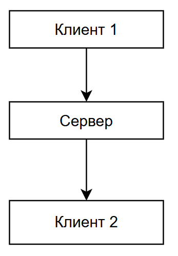
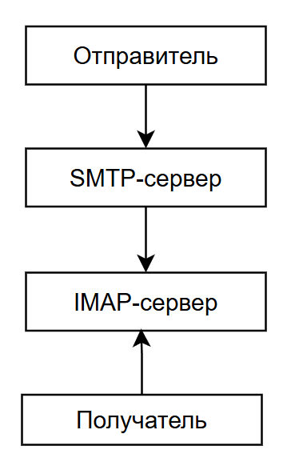

---
title: 1.22. Коммуникация и общение
---

# 1.22. Коммуникация и общение

Современная жизнь тесно связана с коммуникациями, поскольку связь стала обычным являением. Теперь нет нужды пользоваться без необходимости курьерами, почтой и даже можно отказаться от личных встреч. Но магия удалённого общения прячет в себе множество ньюансов.

Для начала – важно соблюдать золотые **правила общения**:
	- чёткость – формулировать мысли структурированно, избегая двусмысленностей;
	- вежливость – использовать «спасибо», «пожалуйста», «добрый день»/ «доброго дня», избегать CAPS LOCK СТИЛЯ ОБЩЕНИЯ и не проявлять пассивную агрессию;
	- контекст – учитывать уровень знаний собеседника, к примеру, не применять технические термины с клиентами;
	- обратная связь – подтверждать получение сообщений, уточнять.

Общение производится по разным каналам - устными каналами в виде встреч и звонков, или письменно, через электронную почту и чаты. Небольшие компании предпочитают традиционное общение, тогда как крупные корпорации используют свои собственные решения и правила.

## Чаты

В процессе работы, как при вступлении в команду, так и при сборе новой команды, происходит набор в группы в мессенджерах (чатах). Важно уметь их организовать, так как, если вы, допустим, важный специалист, вас могут добавлять в десятки групп, и нужно заботиться о порядке среди этого «массива». В настоящее время сложно подобрать достойную замену Telegram – он ушёл действительно далеко в своём удобстве и возможностях. Если раньше ещё звучали другие платформы, то сейчас уже мир меняется – Skype-эпоха ушла (Microsoft перешла в Teams), WhatsApp не развивался уже давно, а сотни аналогов не дарят чего-то уникального. Поэтому рекомендуется обучиться Telegram-возможностям, попробовать создать группу, изучить функционал. Но если в компании принята традиция работать в чём-то определённом – придётся привыкнуть.

Правила работы в чатах – важная часть:
	- треды – важно обсуждать одну тему в одной ветке;
	- форматирование – стараться использовать форматирование для наглядности – выделять жирным важные слова, код выделять в бэктиках или специальными тегами (`` ` ``, к примеру);
	- уведомления – не нужно писать просто имя человека при обращении, важно его именно упомянуть, особенно если вопрос срочный – почти везде это делается как `@username`;
	- спам – важно не засорять чат лишней информации;
	- флуд – важно не провлять излишнюю активность большим количеством сообщений;
	- оффтоп – важно придерживаться темы разговора;
	- серьёзность – не рекомендуется отправлять мемы в чат, когда там обсуждают «упавший» сервер.

Главный мессенджер, с которым нужно научиться работать - Telegram. Здесь есть целая куча технологий - от разметки текста в сообщениях, до видеозвонков. Разработчикам важно знать основы для работы с ним, так как часто могут быть задачи по интеграции с мессенджером или созданием ботов.

Мессенджеры — это сложные системы, которые объединяют несколько технологий для обеспечения быстрой и безопасной передачи данных между адресатами. 

Как устроены мессенджеры и как с ними работать?

1. Регистрация и авторизация. 

Большинство мессенджеров (например, Telegram, WhatsApp) используют номер телефона как уникальный идентификатор пользователя. После ввода номера телефон отправляет код подтверждения через SMS или звонок, и после успешной регистрации создается уникальный токен (ключ), который используется для авторизации на сервере. Этот токен хранится на устройстве пользователя и позволяет ему взаимодействовать с сервером без необходимости повторной авторизации.

2. Обмен сообщениями. Система обмена сообщениями в мессенджерах строится на следующих принципах:

- Протоколы передачи данных - WebSocket для постоянного соединения между клиентом и сервером, что позволяет серверу отправлять данные клиенту в реальном времени без необходимости постоянных запросов. HTTP(S) используется для API-запросов (например, отправка сообщений через ботов).
- Шифрование. В мессенджерах, таких как WhatsApp и Signal, все сообщения шифруются на устройстве отправителя и расшифровываются только на устройстве получателя. Серверы не имеют доступа к содержимому сообщений - такая технология называется End-to-End Encryption (E2EE). Telegram использует собственный протокол шифрования MTProto для защиты данных.
3. Хранение данных. Многие мессенджеры (например, Telegram) хранят историю сообщений на своих серверах. Это позволяет пользователям восстанавливать чаты на разных устройствах - благодаря облачному хранилищу. Некоторые мессенджеры (например, WhatsApp) хранят сообщения локально на устройстве пользователя.
4. Уведомления. Когда приложение закрыто, уведомления доставляются через службу push-уведомлений (например, Firebase Cloud Messaging для Android или Apple Push Notification Service для iOS). Если приложение открыто, уведомления передаются через активное WebSocket-соединение.

Для звонков используется VoIP — это технология, которая позволяет передавать голосовые данные через интернет вместо традиционных телефонных линий.

API (Application Programming Interface) — это интерфейс, который позволяет сторонним программам взаимодействовать с мессенджером. Например, вы можете создать бота для автоматической отправки сообщений или интегрировать мессенджер с CRM-системой. Под «созданием бота» подразумевается разработка программы, которая будет отправлять запросы на сервер мессенджера, позволяя выполнять соответствующие функции.

Telegram предоставляет открытый API для создания ботов - Telegram Bot API. WhatsApp имеет закрытый API для бизнеса, с платной подпиской.
И именно так создаются те самые «боты», которые могут как использоваться во благо (для корпоративных нужд, для выполнения удобных функций вроде поиска, агрегаций, вычислений или покупок с уведомлениями), так и для сбора данных о пользователях, взломов, или просто надоедливой рекламы. Существуют целые фермы ботов, которые включают в себя множество устройств, в реальном времени имитирующих работы пользователей и генерирующих одновременно тысячи сообщений.

Такие боты есть везде, и их миллиарды - от социальных сетей вроде Twitter (X), Facebook, Вконтакте - до мессенджеров. Это явление называют «мёртвый интернет».

## Электронная почта

Электронная почта – это более профессиональна переписка, система обмена сообщениями через интернет. В отличие от сообщений в мессенджерах и социальных сетях, письмо, отправленное по электронной почте, как правило, считается официальным.

Как устроена электронная почта? Алгоритм прост:

Вы пишете письмо → оно попадает на SMTP-сервер вашего провайдера (Mail.ru/ Gmail.com) → сервер ищет MX-запись домена получателя (через DNS) → сервер пересылает письмо на почтовый сервер получателя → адресат забирает письмо по IMAP/POP3.

Пользователь может отправлять письма с помощью веб-интерфейса провайдера (например, gmail.com) или почтового клиента (Outlook).
Почтовый сервер — это компьютер (сервер), который хранит письма и управляет их доставкой. DNS помогает находить почтовые серверы. Например, когда вы отправляете письмо на адрес example@gmail.com, DNS определяет, какой сервер отвечает за домен gmail.com.

★ **Почтовый клиент** – это программа, которая позволяет отправлять и получать письма. Самые распространённые – Outlook и Thunderbird. Чтобы клиент мог работать, необходимо указать свои данные, и данные сервера:
	- ввести email и пароль;
	- в ряде случаев пароль будет специфический – «пароль приложения» для клиентов;
	- выбрать тип сервера (IMAP / SMTP);
	- указать соответствующие порты из таблицы выше;
	- попробовать отправить тестовое сообщение самому себе.

При добавлении учетной записи почтового ящика в систему может возникнуть ошибка с проверкой на корректность введенных данных. Интеграция с большинством почтовых провайдеров требует установления безопасного соединения посредством использования пароля приложения. Пароль приложения и пароль для входа через веб-интерфейс отличаются — это разные пароли.

**Почтовый провайдер** — это организация или сервис, который предоставляет услуги электронной почты. Почтовый провайдер управляет серверами, которые хранят письма, обеспечивают их доставку и предоставляют интерфейс для работы с почтой (веб-интерфейс или подключение через почтовые клиенты).

Примеры популярных почтовых провайдеров:
	- Gmail (Google Mail);
	- Outlook/Hotmail (Microsoft);
	- Yahoo Mail;
	- ProtonMail;
	- Zoho Mail;
	- Яндекс.Почта;
	- iCloud Mail;
	- Mail.ru.

Какие протоколы используются в Email?

| Протокол | Порт | Для чего? |
| :--- | :---: | ---: |
|SMTP	|25, 587	|Отправка писем
|IMAP	|143, 993	|Хранение на сервере (синхронизация)
|POP3	|110, 995	|Скачивание на устройство

**IMAP (Internet Message Access Protocol)** — это протокол, предназначенный для получения и управления электронной почтой на сервере. Он позволяет пользователям просматривать, организовывать и управлять своими письмами прямо на сервере, не загружая их полностью на локальное устройство. 

Письма остаются на сервере, и все изменения (например, пометка письма как прочитанного или перемещение в папку) синхронизируются между всеми устройствами, на которых настроен доступ к почтовому ящику. IMAP поддерживает работу с папками (например, "Входящие", "Отправленные", "Черновики"), что позволяет организовывать письма на сервере. Клиенты IMAP изначально загружают только заголовки писем, а полное содержимое письма загружается только при необходимости.

Типичный порт для IMAP:
	- Без шифрования: 143
	- С шифрованием (IMAPS): 993

Когда вы открываете почту через веб-интерфейс Gmail или мобильное приложение, используя IMAP, ваши письма остаются на сервере Google, и любые действия (например, удаление письма) отражаются на всех устройствах.

**SMTP (Simple Mail Transfer Protocol)** — это протокол, используемый для отправки электронных писем с одного сервера на другой. Он отвечает за доставку писем от отправителя к получателю. 

SMTP используется исключительно для отправки писем. Он не предназначен для получения или хранения писем. Если письмо отправляется на адрес другого домена (например, с gmail.com на yahoo.com), SMTP-сервер отправителя передает письмо на SMTP-сервер получателя. Для предотвращения спама и несанкционированного использования SMTP-серверов часто требуется аутентификация (логин и пароль). Если сервер получателя временно недоступен, SMTP-сервер отправителя может временно сохранить письмо в очереди и повторить попытку доставки позже.

Типичные порты для SMTP:

	- Без шифрования: 25 (основной порт, но часто блокируется провайдерами для предотвращения спама)
	- С шифрованием:
		- 587 (для отправки через TLS/STARTTLS)
		- 465 (для отправки через SSL)

Когда вы нажимаете кнопку "Отправить" в почтовом клиенте (например, Outlook или Thunderbird), ваш клиент использует SMTP для передачи письма на сервер вашего почтового провайдера. Затем этот сервер доставляет письмо до сервера получателя.

**Настройка почтового сервера или почтового провайдера** - более сложная задача. Часто для этого используются готовые решения, к примеру, Microsoft Exchange.

**Microsoft Exchange** — это корпоративное решение для работы с электронной почтой, календарями, контактами и задачами. Exchange включает в себя почтовый серверь, календарь и контакты, ActiveSync (протокол для синхронизации с мобильными устройствами), Outlook Anywhere и EWS.

**EWS (Exchange Web Services)** — это API (программный интерфейс), который позволяет приложениям взаимодействовать с сервером Exchange через HTTP/HTTPS. Например, если у вас есть CRM-система, которая должна автоматически создавать задачи в календаре пользователя или отправлять уведомления о новых лидов, она может использовать EWS для взаимодействия с Exchange.

**Как настраивается почтовый сервер?**
1. Определяется программное обеспечение:
	- Microsoft Exchange Server;
	- Postfix + Dovecot;
	- Zimbra;
	- hMailServer.
2. Настраивается домен и DNS. Почтовый сервер работает через доменное имя (например, example.com), поэтому важно правильно настроить DNS-записи:
	- MX-запись (Mail Exchange) указывает, какой сервер отвечает за обработку почты для домена;
	- SPF (Sender Policy Framework) защищает от спуфинга (подделки отправителя);
	- DKIM (DomainKeys Identified Mail) добавляет цифровую подпись к письмам для проверки их подлинности;
	- DMARC (Domain-based Message Authentication) определяет, как обрабатывать письма, которые не прошли проверку SPF/DKIM.
3. Настройка сервера:
	- SMTP-сервер для отправки писем;
	- IMAP/POP3-сервер для получения писем;
	- Базы данных для хранения учётных записей пользователей и писем;
	- SSL/TLS-сертификаты для шифрования соединений.
4. Если используется Exchange, нужно настроить EWS:
	- URL для EWS;
	- методы аутентификации (например, OAuth, NTLM или Basic Auth);
	- права доступа и разрешения для работы с EWS.

Для защиты почтовых серверов используются различные методы аутентификации. Мы их изучим отдельно позднее.
 

## Встречи и звонки

**Проведение встреч** – другой важный элемент в коммуникации. Порой, без совещаний никуда прогресс не пройдёт, поэтому нужно будет собираться командой, либо проводить встречи с клиентами. И, если проводится удалённо – то неизбежны звонки. Звонки (аудио или видео) проводятся с использованием соответствующих сервисов – Zoom, Google Meet, Microsoft Teams, к примеру.

При подготовке к встрече, участникам нужно отправить «инвайт» - приглашение на участие, которое желательно отправлять за день. Такие приглашения можно отправлять через почтовые клиенты, комбинируя планирование совещаний в сервисе звонков с отправкой через почтовый клиент.

Перед подключением к встречам всегда нужно проверять оборудование:
	- камера (включать, если договорились об использовании);
	- микрофон (включать, если будете говорить) – лучше выключать, чтобы не засорять эфир;
	- чат – иногда в больших группах, или когда спикер единственный, лучше задавать вопросы письменно.

**Важно**: прежде, чем включать запись встречи, нужно предупредить участников. Если запись ведётся, то лучше следить за языком и вести себя сдержанно, чтобы не разгребать последствия, к примеру, если сорваться эмоционально.

Бизнес безжалостен, поэтому, общаясь с конкурентом, клиентом, контрагентом и даже порой с начальством или коллегами, нужно следить за своими словами и тщательно их подбирать, так как всё фиксируется, и сказанное будет использовано против вас. Кроме того, некоторые коллеги могут общаться "с нагоном", то есть, агрессивно и обвиняя, даже если вы ни в чём не виноваты, могут скидывать ответственность и даже повысить голос. Порой коллеги вроде бы вежливые, соблюдает все "золотые правила общения", но в их речи столько токсичности, что порой хочется, чтобы они перестали быть такими вежливыми. Так что, люди разные. Кто-то адаптируется, становясь таким же, а кто-то сохраняет выдержку и вежливость. Здесь всё зависит от вас и ситуации, могу лишь пожелать вам терпения и удачи!

Звонки на личные или рабочие телефоны – отдельная тема для разговоров. Во-первых, не следует настаивать на звонках – это отнимает больше времени, и является адом для интровертов, поэтому звонить нужно только по срочным вопросам или сложным темам, требующим обсуждения. Если же вопрос не срочный, требуется отправить файлы/ссылки, или решение требует размышлений – нужно именно писать.

Перед тем, как позвонить, всегда нужно предупредить, договориться, со звонком – представиться, а в окончании – резюмировать, о чём договорились.

Помните – хорошая коммуникация экономит часы работы, а также бережёт наше здоровье и нервы.
