---
title: UX UI
---

# Интерфейс, UX/UI

Важно отличать понятие «интерфейс» в объектно-ориентированном программировании и «пользовательский интерфейс». Понятия «пользовательский интерфейс» и «пользовательский опыт» всегда идут смежно, так как оба связаны с ощущением пользователя.

**Интерфейс (от англ. interface — поверхность взаимодействия)** — это точка соприкосновения или взаимодействия между двумя системами, объектами или процессами. В контексте технологий интерфейс представляет собой способ общения пользователя с устройством, программой или системой.

Поэтому мы часто встречаем интерфейс общения программ (к примеру, API), но для обычного пользователя, понятие интерфейс представляется именно как пользовательский интерфейс, ведь он не видит то, что происходит «под капотом».

Интерфейс может быть следующих видов:
	- *физический интерфейс* (кнопки на пульте, клавиатура, мышь);
	- *цифровой интерфейс* (экран смартфона, веб-сайт, приложение);
	- *голосовой интерфейс* (голосовые помощники).
	
Задача такого интерфейса - обеспечить эффективное и понятное взаимодействие между человеком и системой.

**Пользовательский интерфейс (UI, User Interface)** — это часть системы, которая отвечает за визуальное представление и функциональные элементы взаимодействия с пользователем. UI включает в себя всё, что пользователь видит, слышит и к чему обращается при работе с продуктом, это «лицо» продукта, которое должно быть интуитивно понятным, привлекательным и удобным для использования.

Можно сказать, что пользовательский интерфейс это просто вид интерфейса как точки соприкосновения между пользователем и системой.

Интерфейс состоит из нескольких ключевых компонентов:
1. *Визуальные элементы* - цветовая палитра, шрифты и типографика, иконки и символы, фоновые изображения и текстуры.
2. *Функциональные элементы* - кнопки, поля ввода, выпадающие списки, слайдеры, переключатели, чекбоксы, меню, панели навигации.
3. *Навигационные элементы* - хлебные крошки, пагинация, боковые панели и футеры.
4. *Элементы обратной связи* - уведомления, подсказки, тултипы, контекстное меню, анимации и переходы, сообщения об ошибках.
5. *Мультимедийные элементы* - аудио, видео, графики, диаграммы, виджеты.
6. *Адаптивность и макет* - расположение элементов на экране, ответ на разные размеры экранов (мобильные устройства, планшеты, десктопы).

**Пользовательский опыт (UX – User Experience)** – опыт, который получает пользователь в процессе взаимодействия с продуктом. Это совокупность эмоций, ощущений и реакций пользователя, поэтому UX охватывает все аспекты взаимодействия, включая восприятие, удобство использования, доступность и удовлетворённость. Отсюда главный принцип:

	- Хороший UI = Хороший UX
	- Плохой UX = Плохой UI

Словом, если вроде бы с точки зрения дизайнера всё выглядит роскошно, но пользователи в бешенстве – значит, UI, всё-таки не хороший.
UX и UI тесно связаны, но они выполняют разные функции. UX создаёт основу, UI её оформляет. UX отвечает за стратегию, исследование и проектирование взаимодействия, сосредоточен на том, чтобы понять, что нужно пользователю, и создать удобный путь для достижения его целей, задавая вопросы «Как пользователь доходит до цели?» и «Что он чувствует в процессе?». UI же реализует эту стратегию через визуальное и функциональное оформление, фокусируется на том, как продукт будет выглядеть и работать.

## Визуальные элементы
### Цвета

**Цветовая палитра** — это набор цветов, которые используются в интерфейсе для создания визуальной идентичности продукта.

*Основной цвет* - доминирующий цвет, который отражает бренд или стиль продукта.

*Второстепенные цвета* — это дополнительные оттенки, которые поддерживают основной цвет.

*Акцентные цвета* - яркие цвета, используемые для выделения важных элементов (например, кнопок и уведомлений).

*Нейтральные цвета* - белый, серый, чёрный, бежевый - используются для фона, текста и других ненавязчивых элементов.

**HEX (Hexadecimal Color Code)** — это способ представления цвета в виде шестнадцатеричного кода. Этот формат используется в веб-дизайне и программировании для задания цветов в HTML, CSS и других технологиях.

HEX начинается с символа #, за которым следуют 6 символов (например, #FFFFFF).

Первые два символа обозначают интенсивность красного (Red), следующие два — зелёного (Green), последние два — синего (Blue).

Примеры:
	- Белый: __ #FFFFFF (максимальная интенсивность всех трёх цветов).
	- Чёрный: __ #000000 (отсутствие всех цветов).
	- Красный: __ #FF0000 (только красный цвет на максимуме).
	- Синий: __ #0000FF (только синий цвет на максимуме).

**RGB (Red, Green, Blue)** — это модель цветопередачи, основанная на смешении трёх основных цветов: красного, зелёного и синего. Каждый цвет представлен числом от 0 до 255, где 0 означает отсутствие цвета, а 255 — максимальную интенсивность.

RGB записывается как три числа через запятую, заключённые в функцию rgb(). Например, rgb(255, 0, 0) — это красный цвет.

Примеры:
	- Белый: __ rgb(255, 255, 255).
	- Чёрный __: rgb(0, 0, 0).
	- Жёлтый: __ rgb(255, 255, 0) (красный + зелёный).
	- Фиолетовый: __ rgb(128, 0, 128) (красный + синий).

HEX и RGB — это два способа представления одного и того же цвета. Каждая пара символов в HEX соответствует значению одного из цветов в RGB. Можно разделить HEX-код на три пары символов (например, FF, 57, 33), преобразовать каждую пару из шестнадцатеричной системы в десятичную и получится RGM.

Например:
```
#FF5733 → rgb(255, 87, 51).
#00FF00 → rgb(0, 255, 0).
```

Сейчас нет нужды заучивать основные цвета. Существуют возможности в редакторах кода, которые автоматически могут подсветить цвет, к примеру, в Visual Studio Code - вы сразу увидите, какой цвет сейчас "спрятан" в коде.
 
Также на просторах сети можно найти интересные сайты, которые позволяют быстро подобрать нужный цвет и скопировать код из таблицы.

### Шрифт

**Шрифт (Font)** — это графическое представление символов, букв и цифр, которое используется для отображения текста.

**Типографика** — это искусство и наука выбора, комбинирования и расположения шрифтов в интерфейсе.

**Семейство шрифтов (font family)** это классификация шрифтов по стилю:
	- Serif (с засечками): Times New Roman, Georgia.
	- Sans-serif (без засечек): Arial, Helvetica, Roboto.
	- Monospace: Courier, Consolas (одинаковая ширина символов).

Шрифты играют ключевую роль в дизайне интерфейсов, брендинге и визуальной коммуникации. Они влияют на читаемость, стиль и восприятие текста. Рассмотрим самые популярные шрифты.

	- **Roboto** используется в Android, Google Docs, YouTube.
	- **Helvetica** используется в Apple, American Airlines, Panasonic.
	- **Arial** используется в Microsoft Office, Windows.
	- **Open Sans** используется в Google Fonts, сайтах, презентациях.
	- **Montserrat** используется в логотипах, заголовках, творческих проектах.
	- **Times New Roman** используется в печати, статьях, книгах и документах.
	- **Georgia** используется в веб-сайтах, блогах, онлайн-журналах.
	- **Baskerville** используется в книгах, журналах, логотипах.
	- **Playfair Display** используется для заголовков, логотипов, веб-дизайна.
	- **Courier New** используется для кода, текстовых файлов и сценариев фильмов.
	- **Consolas** используется в Visual Studio, Sublime Text, других IDE.
	- **Fira Code** используется для разработки ПО, в коде.
	- **Pacifico** используется для логотипов, открыток, творческих проектов.
	- **Dancing Script** используется для приглашений, визиток, декоративности.
	- **Lobster** используется в логотипах, заголовках, кафе и ресторанах.
	- **Bebas Neue** используется для постеров, баннеров, логотипов.

**Размер шрифта (font size)** определяет высоту символов (например, 10px для основного текста, 14px для заголовка второго уровня, 18px для заголовка первого уровня).

**Насыщенность (font weight)** — это толщина шрифта (light, regular, bold).

**Межстрочный интервал (line height)** — это расстояние между строками текста.

**Межбуквенный интервал (letter spacing)** — это расстояние между символами.

**Цвет текста** - контрастность относительно фона.

### Иконки и символы

**Иконки** — это графические элементы, которые заменяют или дополняют текст для передачи информации.

**Символы** — это более простые графические элементы, такие как стрелки ➡️, галочки ✅, крестики ❌.

Основные характеристики иконок и символов — это стиль, размер, цвет и универсальность.

Стиль может быть линейным (тонкие линии →), сплошным (закрашенные области ➞) или комбинированным (⇒).

Размер подразумевает, что иконки имеют определённое соотношение сторон, и они должны быть достаточно крупными для удобства взаимодействия (обычно 24x24 или 32x32).

Цвет обычно соответствует цветовой палитре интерфейса.

Универсальность подразумевает, что иконки должны быть понятны без текстового описания.

Грамотные иконки упрощают навигацию и взаимодействие с интерфейсом, экономят место на экране, к примеру, вместо слов «Конфигурация» или «Настройки» можно добавить иконку шестерёнки ⚙️, для сообщений - конверт ✉️ , для сохранения - дискета 💾 , для голосовой записи - микрофон 🎙, и это значительно освободит место.

Визуально иконки привлекательнее, чем текст.

Также в современных платформах, вроде iOS, Android, macOS, Windows, Linux и ChromeOS можно использовать эмодзи - 😊 👍 🌎 📁 🔗.

### Фоновые изображения и текстуры

**Фоновые изображения (background)** — это графические элементы, которые используются в качестве фона интерфейса или его частей. Это могут быть фотографии, иллюстрации, градиенты или абстрактные узоры.

В качестве фонового изображения можно добавлять фотографии, иллюстрации, геометрические узоры. Обычно важно, чтобы фоновое изображение занимало весь экран. Если, к примеру, поставить его фиксированно в центр и установить размер 800x600, то на мониторе с разрешением 4K это изображение покажется как иконка, а всё остальное место будет пустовать. Поэтому важна адаптивность - изображения должны корректно отображаться на всех устройствах (мобильных, планшетах, десктопах).

Фон должен сочетаться с остальными элементами интерфейса, поэтому иногда изображения делают полупрозрачными, чтобы текст был лучше читаем.
Хорошие изображения устанавливают настроение и атмосферу, привлекают внимание и могут даже служить ориентиром для разделения контента.

**Текстуры** — это графические элементы, которые имитируют поверхности реальных материалов (например, бумагу, дерево, металл, ткань). Они добавляют глубину и тактильность интерфейсу.

Текстура может быть растровой (например, фотография дерева) или векторной (например, геометрический узор). Они обычно нейтральные, чтобы не конфликтовать с основным содержимым, и часто накладываются с полупрозрачностью, чтобы не перегружать дизайн. Например, можно использовать имитацию старой бумаги, деревянного пола или камня, чтобы усилить атмосферу.

### Темы

**Темы** интерфейса — это набор визуальных и функциональных параметров, которые определяют внешний вид и поведение пользовательского интерфейса.

Темы позволяют настроить дизайн приложения или сайта в соответствии с предпочтениями пользователя, контекстом использования или брендовыми требованиями.

Фактически, темы охватывают весь визуал - от цветов до анимаций.

*Светлая тема (Light)* использует светлый фон и темный текст, создаёт ощущение простора и легкости.

*Темная тема (Dark)* использует тёмный фон и светлый текст, и уменьшает нагрузку на глаза в темноте.

*Корпоративная тема (Branded)* отражает фирменный стиль компании (цвета, логотипы, шрифты, анимации) и используется для узнаваемости бренда.

*Динамическая тема (Dynamic)* автоматически меняется в зависимости от времени суток или условий освещения.

*Пользовательская тема (Custom)* позволяет пользователю настраивать интерфейс под свои предпочтения (выбор цветов, шрифтов, иконок).

## Функциональные элементы

**Кнопки** — это элементы управления, которые позволяют пользователю выполнять определенные действия. Они обычно содержат текст или иконку и реагируют на клик пользователя.


**Поля ввода** — это элементы, предназначенные для ввода текстовой информации пользователем. Они могут быть однострочными (input) или многострочными (textarea).

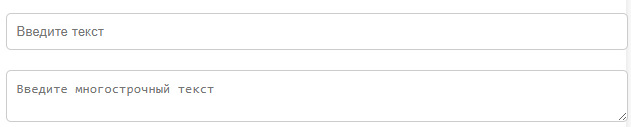

**Выпадающие списки (dropdowns)** позволяют пользователю выбирать один или несколько вариантов из предложенного списка. Они экономят место на экране и упрощают выбор.


**Слайдеры** — это элементы управления, которые позволяют пользователю выбирать значение из диапазона. Они часто используются для настройки параметров, таких как громкость или яркость.

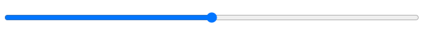

**Переключатели (toggle switches)** позволяют пользователю включать или выключать определенные функции. Они работают по принципу «вкл/выкл». Их также называют флагами.


**Чекбоксы** — это элементы управления, которые позволяют пользователю выбрать один или несколько вариантов из списка. Они представлены в виде маленьких квадратов, которые можно отметить. Их также называют галочками.

- [x] Выполненная задача
- [ ] Невыполненная задача
- [ ] Другая задача

**Меню** — это набор пунктов, организованных в виде списка или сетки, который позволяет пользователю выбирать действия или переходить на другие страницы.

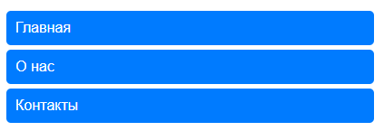

**Панели навигации** — это элементы интерфейса, которые помогают пользователю перемещаться между различными разделами приложения или сайта.


## Навигационные элементы

**Хлебные крошки (Breadcrumbs)** — это навигационный элемент, который показывает текущее положение пользователя в структуре сайта или приложения. Обычно они отображаются в виде цепочки ссылок, разделенных символом (например, /), и позволяют быстро вернуться на предыдущие уровни.


**Пагинация (Pagination, от слова Page - страница)** — это элемент управления, который разделяет контент на страницы для удобства просмотра. Она часто используется в списках, каталогах или поисковых результатах, чтобы избежать перегрузки интерфейса большим объемом информации.

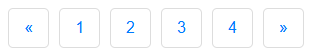

**Боковые панели (Sidebars, сайдбары)** — это вертикальные области, расположенные слева или справа от основного контента. Они используются для дополнительной навигации, фильтров, меню или второстепенной информации.


**Футеры (Footers)** — это нижняя часть страницы, которая содержит важную информацию, такую как контактные данные, ссылки на политику конфиденциальности, карту сайта или ссылки на социальные сети. Футеры помогают улучшить навигацию и предоставляют пользователю дополнительные возможности взаимодействия с сайтом.


## Элементы обратной связи

**Уведомления (Notifications)** — это визуальные сообщения, которые информируют пользователя о событиях или действиях. Они могут быть информационными, предупреждающими или подтверждающими.

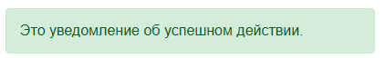

**Подсказки (Hints)** — это короткие текстовые фрагменты, которые помогают пользователю понять, как заполнить форму или выполнить действие. Обычно они отображаются рядом с полями ввода.

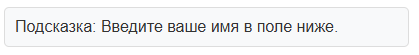

**Тултипы (Tooltips)** — это небольшие всплывающие окна, которые появляются при наведении курсора на элемент. Они содержат дополнительную информацию о данном элементе.


**Контекстное меню (Context Menu)** — это меню, которое появляется при щелчке правой кнопкой мыши или другом действии. Оно предоставляет пользователю варианты действий, связанных с текущим контекстом.

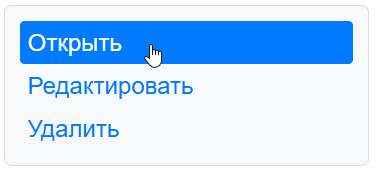

**Анимации и переходы (Animations and Transitions)** — это визуальные эффекты, которые делают интерфейс более динамичным и приятным для взаимодействия. Они могут использоваться для привлечения внимания или плавного изменения состояния элементов.

**Сообщения об ошибках (Error Messages)** — это уведомления, которые информируют пользователя о проблемах или неверных действиях. Они обычно выделяются красным цветом и содержат описание ошибки.

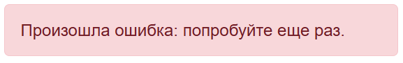

Кстати сами по себе сообщения об ошибках, фактически, это вариации диалоговых окон. Диалоговое окно подразумевает собой некое окно на интерфейсе, которое требует взаимодействия с пользователем.

**Окна (Windows)** — это основные контейнеры интерфейса, которые содержат контент и элементы управления. Они могут быть независимыми (например, браузерное окно) или встроенными в приложение. Окна обычно имеют заголовок, кнопки управления (закрыть, свернуть, развернуть) и контент.

**Диалоговые окна (Dialog Boxes)** — это вторичные окна, которые появляются поверх основного интерфейса для взаимодействия с пользователем. Они требуют выполнения определенного действия, например, подтверждения выбора или ввода данных. Пример: окно "Сохранить изменения?".

**Модальные окна (Modal Windows)** — это разновидность диалоговых окон, которые блокируют взаимодействие с остальной частью интерфейса до тех пор, пока пользователь не выполнит требуемое действие (например, закроет окно). Они используются для важных сообщений или действий.


**Немодальные окна (Non-modal Windows)** — это окна, которые не блокируют взаимодействие с основным интерфейсом. Они позволяют пользователю продолжать работу, не закрывая их. Пример: панель инструментов или плавающее окно настроек.

**Всплывающие окна (Pop-ups)** — это небольшие окна, которые появляются поверх основного контента. Они могут быть информационными, рекламными или содержать дополнительные элементы управления. Часто используются для уведомлений или рекламы.


**Окна предупреждений (Alerts)** — это простые диалоговые окна, которые информируют пользователя о важной информации или ошибке. Обычно они содержат текст и одну кнопку (например, "OK").

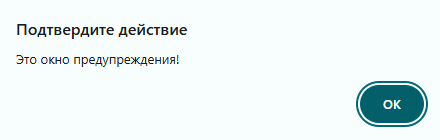

**Окна подтверждения (Confirmation Dialogs)** — это диалоговые окна, которые запрашивают у пользователя подтверждение действия. Они обычно содержат текст вопроса и две кнопки ("Да" и "Нет").

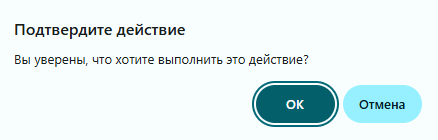

## Особенности и принципы UX и UI

**Юзабилити (Usability)** — это мера того, насколько легко и эффективно пользователь может взаимодействовать с интерфейсом для достижения своих целей. Хорошее юзабилити означает, что продукт полезен, эффективен, лёгок в обучении, удобен, и удовлетворяет пользователя.

**Удобство (Convenience)** — это характеристика интерфейса, которая отражает, насколько комфортно пользователю выполнять задачи. Удобство зависит от скорости выполнения задач, минимальных усилий для достижения результата и отсутствия лишних шагов или сложностей.

**Интуитивность (Intuitiveness)** — это способность интерфейса быть понятным пользователю без дополнительных объяснений или обучения. Интуитивный интерфейс предполагает очевидность действий, прогнозируемость поведения и знакомые паттерны (общепринятые стандарты).

**Адаптивность (Responsiveness / Adaptability)** — это способность интерфейса подстраиваться под различные условия использования, такие как размер экрана, контекст использования и скорость интернета. Адаптивный сайт автоматически меняет расположение элементов на маленьком экране.

**Поведение (Behavior)**. Поведение интерфейса описывает, как он реагирует на действия пользователя. Обычно поведение сочетаемо с удобством - поведение должно соответствовать ожиданиям, и интерфейс должен вести себя так, как это ожидает пользователь.

### Принципы проектирования интерфейса

**Согласованность (Consistency)** — это использование одинаковых шаблонов, стилей и правил во всем интерфейсе. Она помогает избежать путаницы у пользователя, ускорить обучение и запоминание, а также создать единый визуальный стиль.

**Читаемость (Readability)** — это способность текста быть легко воспринимаемым. Она зависит от размера шрифта, цвета текста и фона, а также межстрочного расстояния.

**Минимализм (Minimalism)** — это подход, при котором в интерфейсе остаются только самые важные элементы. Это помогает уменьшить когнитивную нагрузку и фокусировать внимание пользователя на ключевых задачах.

**Обратная связь (Feedback)** — это реакция интерфейса на действия пользователя. Она должна быть немедленной и чёткой, когда пользователь видит результат своего действия и понимает, что произошло.

**Доступность (Accessibility)** — это обеспечение возможности использования интерфейса для всех пользователей, включая людей с ограниченными возможностями. Она включает поддержку скринридеров, контрастные цвета, возможность управления с клавиатуры.

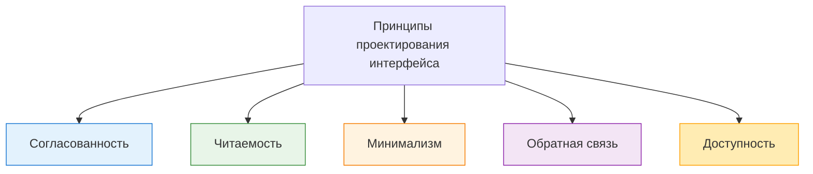