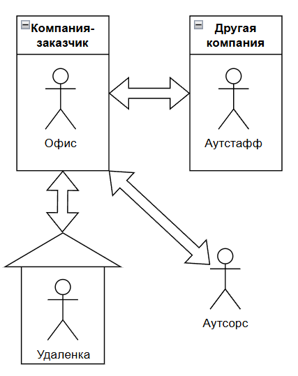

---
title: 1.26. Карьера в IT и мифы
---

# 1.26. Карьера в IT и мифы

## Обзор карьеры в IT

Как уже подчеркнул не раз, IT не только программирование и код. Именно поэтому в первом томе мы всё ещё не затрагивали код и языки программирования. К сожалению, СМИ и медиа пропагандировали долгое время именно обучение языкам и «быстрый путь к хорошим деньгам». Но важно усвоить несколько ключевых моментов.

1. Не мы нужны рынку, а рынок нам. Если мы не усвоим это, развития не будет. Не нужно считать, что обучившись языку программирования или новой трендовой технологии, за нами побегут, такому не бывать.
2. Работодатели прекрасно знают о лёгкости обучения и о том, что можно использовать нейросети. На практике нейросети вас не спасут, когда речь пойдёт о решении сложных задач, к примеру, когда проект огромен, и без знания контекста ИИ просто не справится с задачей.
3. IT является лабиринтом, а не линейной профессией. В отличие от традиционных профессий, где можно стать узким специалистом (юрист-договорник, стоматолог-хирург), здесь требуется гибкость и адаптация, а не приверженность чему-то одному. Думая, что вы «сначала изучите одну технологию в идеале, потом перейдёте к другой», вы рискуете застрять на этой технологии на всю жизнь. А время летит, нужно развиваться и изучать больше технологий.
4. Но не нужно прыгать с одного стека на другой и бежать за каждым трендом. Как было заметно из истории, если поначалу использовали одни инструменты, через несколько лет появлялись другие инструменты, и вроде бы создаётся впечатление «устаревания» и «замены старья». Но это работает немного сложнее, ведь представьте, после раздувания IT-пузыря на рынке, всех специалистов, следящих за трендами, стало много. Поэтому важно следить, изучать, но не переключаться полностью. Просто будьте в курсе.

Вот такая вот противоречивая ситуация получается, из-за которой новички и застревают в ужасе. Если представить себе развитие карьеры как движение по маршруту, то в большинстве случаев в IT этот маршрут не прямолинейный. Он извилистый, полон поворотов, ответвлений и иногда даже обратных путей. И это нормально.

Надо с чего-то начать, и для начала изучите базу - аналитику, разработку, тестирование. Именно поэтому в первом томе нет большого акцента на разработке, ведь не факт, что вы именно разработчик. Здесь у вас два пути.

Первый путь - линейный. Вы начинаете кодить/тестить/анализировать, развиваться в разных технологиях, повышать квалификацию и поступаете на первую должность ассистентом, стажером или, если повезёт, джуном. Дальше вам нужно просто работать, развиваться, набираться опыта, потом пройдёте карьерный рост с младшего к старшему, а потом станете лидом группы разработки/тестирования/аналитики на проекте. Вполне хорошо, почему бы и нет.

Второй путь - «графовый» и извилистый. Вы попробовали кодить и понимаете, что работать с документацией вам легче, но вот писать программы тяжко, постоянно ошибаетесь, и много времени тратите на анализы или тесты задач. Можно попробовать переквалифицироваться в тестировщики или аналитики, и если не подойдёт, пробовать себя дальше - продакт-менеджер, администратор, маркетолог, DevOps, технический писатель, преподаватель, и так далее. Вот лишь некоторые из них

| Профессия | Описание |
| :--- | :---: |
|Product Manager / Продакт-менеджер / Руководитель	|Отвечает за жизненный цикл продукта, взаимодействует между командой и бизнесом.
|Business Analyst / Бизнес-аналитик	|Исследует потребности клиентов, переводит их в технические требования.
|System Analyst / Системный аналитик	|Анализирует процессы, системы и данные, чтобы предлагать решения.
|Project Manager /  Scrum Master	|Управляет процессами, сроками, коммуникацией внутри команды.
|QA / Тестировщик ПО	|Обеспечивает качество продукта, находит баги, пишет тест-кейсы.
|DevOps / SRE (Site Reliability Engineer)	|Занимается инфраструктурой, деплоем, автоматизацией процессов.
|UI/UX Designer / Дизайнер / Веб-дизайнер / Графический дизайнер	|Создаёт интерфейсы, исследует пользовательское поведение, проектирует удобные продукты.
|Technical Writer / Технический писатель	|Пишет документацию, туториалы, справочные материалы.
|Support / Helpdesk Specialist / Техническая поддержка	|Консультирует пользователей, решает технические проблемы.
|Системный администратор	|Отвечает за установку программ, настройку серверов и железа.
|Data Analyst / Аналитик данных / Data Scientist / Data Engineer	|Работает с данными, строит отчёты, анализирует метрики.
|Cybersecurity Specialist / Кибербезопасник / Специалист по ИБ	|Защищает данные, системы, сети от угроз.
|IT Recruiter / HR в IT	|Нанимает специалистов, работает с рынком труда, рекрутинговыми платформами.
|IT Lawyer / Legal Counsel in Tech / IT юрист	|Занимается вопросами регулирования, защиты данных, лицензирования, GDPR, смарт-контрактов и многого другого.
|IT Marketing / Growth Hacker / Маркетолог / Менеджер по продажам	|Продвижение продукта, digital-маркетинг, SEO, контент, аналитика.
|IT Trainer / Mentor / Coach / Преподаватель	|Обучает других, проводит курсы, ведёт блоги, записывает видео.
|Tech Entrepreneur / Founder / Основатель чего-то своего	|Создаёт собственный стартап, управляет командой, ищет инвестиции.
|Blockchain Developer / Smart Contract Auditor / Специалист по криптографии	|Работает с децентрализованными системами, криптографией, смарт-контрактами.
|AI Ethicist / AI Engineer / Специалист по ИИ	|Занимается этическими аспектами использования искусственного интеллекта, либо изучением и развитием ИИ в принципе.

И таких можно считать и считать - их множество, и одна из них может быть вашей, и может быть даже не связана с кодированием. Главное — пробовать и находить своё. Карьера в IT — это не про идеальный план, а про эксперименты, адаптацию и поиск своего места.

## Специализации

Специализация — это когда вы сосредотачиваетесь на одной узкой области, становитесь экспертом в ней, знаете её глубоко, понимаете нюансы, ограничения, лучшие практики и умеете решать сложные проблемы, которые другие просто не видят.

Если обладать соответствующей компетенцией в определённой области, специалист становится незаменимым человеком в команде, его приглашают на сложные проекты, где требуется глубокое знание, он может претендовать на повышение и высокую зарплату. Узкая специализация, доведённая до высших ступеней, получает устойчивость к автоматизации - таких людей ИИ не заменит.

Какие есть основные специализации в IT?
1. Разработчики (Developers)
	- Frontend-разработчик: React, Vue, Angular, TypeScript, Webpack, CSS-архитектура, доступность (a11y), производительность фронтенда.
	- Backend-разработчик: Node.js, Python/Django, Java/Spring, Go, REST/GraphQL, архитектура микросервисов, масштабирование.
	- Mobile-разработчик: iOS (Swift), Android (Kotlin), Flutter, React Native.
	- Data Engineer: ETL-процессы, Apache Spark, Kafka, Airflow, хранилища данных (Snowflake, BigQuery).
	- ML-инженер / Data Scientist: TensorFlow, PyTorch, модели машинного обучения, обработка больших данных, A/B-тесты.
	- Game Developer: Unity, Unreal Engine, оптимизация под GPU, физические движки, сетевой гейминг.

2. Аналитики (Analysts)
	- Бизнес-аналитик (BA): Требования, пользовательские истории, BPMN, UML, работа с заинтересованными сторонами.
	- Данных (Data Analyst): SQL, Power BI, Tableau, Excel, статистика, визуализация KPI.
	- Продуктовый аналитик (Product Analyst): Аналитика поведения пользователей (Mixpanel, Amplitude), гипотезы, A/B-тесты, метрики удержания.
	- QA-аналитик: Понимание бизнес-логики, тест-кейсы, документирование требований, автоматизация тестирования.
3. Тестировщики (QA / SDET)
	- Ручной QA: Тест-планы, баг-репорты, юзабилити, регрессионное тестирование.
	- Автоматизатор (SDET): Selenium, Playwright, Cypress, Pytest, Jenkins, CI/CD, написание тестовых фреймворков.
	- QA-инженер по нагрузке/безопасности: JMeter, LoadRunner, OWASP, PenTest, fuzzing.
4. DevOps / Инженеры инфраструктуры
	- DevOps-инженер: Docker, Kubernetes, Terraform, Helm, CI/CD (GitLab CI, GitHub Actions), мониторинг (Prometheus, Grafana), логи (ELK, Loki).
	- SysAdmin / Linux-инженер: Настройка серверов, сети, безопасность, скрипты (Bash/Python), Ansible.
	- Cloud-инженер (AWS/Azure/GCP): Архитектура облака, IAM, VPC, Lambda, S3, Cost Optimization, Serverless.
	- Site Reliability Engineer (SRE): SLI/SLO, error budgets, автоматическое восстановление, chaos engineering.
5. Менеджеры и Руководители
	- Технический менеджер (Tech Lead): Управление командой разработчиков, код-ревью, распределение задач, технические решения.
	- Product Manager (PM): Продуктовая стратегия, roadmap, взаимодействие с клиентами, приоритизация задач.
	- Project Manager (PM): Agile/Scrum/Kanban, управление сроками, рисками, бюджетом.
	- CTO / IT Director: Техническая стратегия компании, выбор технологий, найм, масштабирование инфраструктуры.

Что такое Full-Stack?

Full-Stack (фуллстек) — это разработчик, который способен работать на всех уровнях веб-приложения:

	- Фронтенд (HTML/CSS/JS, фреймворки),
	- Бэкенд (сервер, API, БД),
	- Инфраструктура (деплой, базовые настройки сервера, CI/CD),
	- Иногда — даже дизайн или тестирование.

Что значит «уметь всё»?

Это не значит, что вы эксперт во всём. Это значит:
	- Вы можете создать MVP от нуля до продакшена.
	- Вы понимаете, как все части системы связаны между собой.
	- Вы можете общаться с frontend-разработчиком, backend-инженером и DevOps’ом — без языкового барьера.

T-shaped professional — золотая середина. Это современная модель профессионала в IT. Вы эксперт в одной области (например, Backend на Java), но при этом:
	- Понимаете, как работает фронтенд,
	- Знакомы с DevOps-процессами,
	- Знаете, как пишутся тесты,
	- Умеете объяснять технические вещи менеджерам и клиентам.

Такие люди — самые востребованные.

Как выбрать свой путь?

✅ Алгоритм для новичка:
	- Попробуйте всё — сделайте 2–3 мини-проекта: сайт, бэкенд, простой деплой.
	- Определите, что вам доставляет удовольствие — что вы делаете и забываете о времени?
	- Выберите одну область для глубины — пусть это будет даже не самая популярная, но та, где вы чувствуете «это моё».
	- Не переставайте учить смежные области — вы же не хотите, чтобы вас заменили ботом?
	- Через 1–2 года — переходите к T-shaped модели — развивайте широту.

## Этапы карьерного роста в IT
### Джуниор

Когда человек вот только-только начинает свой путь в IT, его называют джуниором. Это слово уже давно стало частью профессионального языка индустрии. Новичок в IT - это человек, который ещё не имеет практического опыта работы в команде, но уже обладает базовыми техническими знаниями. Он может уметь писать простые программы, понимает основы алгоритмов, знает хотя бы один язык программирования и умеет работать с Git. Обычно это выпускники курсов, студенты, или люди, которые самостоятельно освоили первые навыки. Иногда к новичкам относят даже тех, кто уже получил первую работу, но пока не прошёл этап адаптации и не начал решать задачи самостоятельно. В этот период он всё ещё остаётся «в обучении», хотя формально уже числится сотрудником.

Как люди себя чувствуют на первых порах? На старте многим кажется, что они знают слишком мало, и это нормально. Почти все, кто сейчас работает в IT, через это прошли.На первых порах легко потеряться в терминах, не понять многие вещи и как вообще начать работать с чужим проектом.

Часто возникает ощущение, что все вокруг говорят на другом языке, используют множество сложных англицизмов, сокращений. Страх сделать ошибку, получить критику, желание угодить коллегам, постоянное сравнение себя с другими - всё это естественные эмоции. Но важно помнить, что никто не ждёт от джуниора идеального знания, ведь его задача - учиться, задавать вопросы и не бояться просить помощи.

Слово junior пришло к нам из английского языка и буквально означает «младший». В IT-сфере так стали называть младших разработчиков, чтобы отделить их от более опытных специалистов - middle и senior.

Эта система деления на уровни возникла в крупных компаниях, где нужно было удобно распределять нагрузку и ответственность. Джуниор получает поддержку, миддл уже может работать почти самостоятельно, а сеньор берёт на себя стратегические решения и управление. Такие уровни помогают строить понятную карьерную лестницу и оценивать прогресс сотрудников. Поэтому junior - не просто должность, это этап, на котором учатся, ошибаются, растут и становятся лучше.

С чего обычно начинают карьеру? Большинство людей начинают с обучения - онлайн-курсов, книг, видеоуроков. Среди молодёжи популярно именно видеообразование, когда можно узнать по любому инструменту или понятию кучу уроков на YouTube. Сейчас существует множество доступных источников для изучения программирования, где можно пройти структурированное обучение.

После теории приходит практика - создание проектов, участие в open-source, хакатонах и прочем. Но это уже дело каждого, в основном люди просто пишут код и работают. Именно практика позволяет набраться опыта и собрать своё первое портфолио, после чего придёт время первого интервью и первой работы. Кто-то начинает с неоплачиваемых стажировок, кто-то с фриланса.

В IT огромное количество направлений, и джуниор может выбрать себе любую дорогу:
	- фронтенд-разработчик;
	- бэкенд-разработчик;
	- фуллстек-разработчик;
	- QA-инженер (тестировщик);
	- DevOps-инженер;
	- аналитик данных;
	- бизнес-аналитик;
	- системный аналитик;
	- разработчик мобильных приложений;
	- системный администратор.

Каждое из направлений требует разного набора знаний, но у всех джуниоров много общего - им всем нужно познать основы. В первую очередь, разбираться в протоколах, логике, и подкрепиться практикой.

Важно отметить, что в крупной серьёзной компании будут более строгие требования к программисту junior - базовые понимания языка программирования, опыт работы с Git, умение писать чистый и понятный код, знания основных принципов разработки, например SOLID, и даже участие в проектах. Но это обусловлено довольно высоким уровнем заработной платы - ведь никто не захочет платить большие деньги программисту, который не знает программирование?

Аналитикам, тестировщикам чуть проще - им больше нужно сфокусироваться на умениях анализировать, декомпозировать задачи и различных софт-навыках. Системным администраторам важно разбираться в операционных системах и уметь работать с железом.

Но так не везде - некоторые организации используют другой подход, высматривая именно хороших людей в первую очередь, ориентируясь на софт-скиллы, с перспективой обучить всем необходимым хард-скиллам. Такие могут не выставлять требования к знанию языков и опыту работы на проектах, поэтому новичку следует ориентироваться на такие компании, или повышать свои навыки.

На работе джуниоры выполняют более простые задачи, которые требуют меньше самостоятельности, и чему-то могут научить. Это небольшие баги, простые фичи по готовым техническим заданиям, тесты, документация, внедрение сторонних библиотек, а порой и выполнение задач вместе с ментором-наставником.

Джуниору не обязательно знать архитектурные паттерны, масштабирование сервисов, идеальный код, особенности деплоя или весь стек технологий компании. Всему этому можно научиться только со временем. Главное - не бояться спрашивать, учиться на ошибках и двигаться вперёд.
Переход на другую ступень обычно занимает около двух-пяти лет. Всё зависит от индивидуальных особенностей самого человека, его навыков, способностей, целей, везения и компании.

### Миддл

Когда человек проходит начальный этап карьеры и уже не джуниор, но ещё не сеньор - он становится миддлом. Это важный переходный этап в жизни разработчика, так как на этом уровне уже умеем работать почти самостоятельно, берём на себя ответственность за более сложные задачи и начинаем влиять на команду. Но при этом ещё далеко до эксперта и многое предстоит выучить.

Миддл - это специалист, который имеет 2-5 лет опыта работы и уже способен выполнять большинство задач без постоянного контроля. Он понимает, как устроен проект, может читать чужой код, писать свой - так, чтобы его было легко поддерживать. Миддл не только выполняет задачи, но и начинает видеть общую картину - как работает система, зачем нужна та или иная архитектура, и как принимаются технические решения. Он уже не новичок, но не руководит проектами, однако может взять на себя модуль, дать советы коллегам, и даже помочь джуниору освоиться.

Почему миддл не старший и почему не младший? Сеньор отвечает за стратегию, принимает ключевые решения и влияет на архитектуру, понимает бизнес-цели, тогда как миддл этим пока не занимается. Его задача - быть надёжным звеном в цепочке, делать то, что ему поручено, но уже с высоким качеством и пониманием контекста. В то же время миддл уже не зависит от постоянной помощи. Он не боится брать задачи, которые занимают несколько дней. Он знает, где найти информацию, как гуглить правильно, как читать документацию и объяснять свои решения. Он стал самостоятельным, но ещё не лидером.

На этом этапе часто возникает ощущение «я уже знаю достаточно, но ещё недостаточно», из-за чего возникает спектр эмоций - от парадокса до стыда. Это нормально, и многие миддлы задаются вопросами «Почему я всё ещё не сеньор?», «Чего мне не хватает?», «Как перейти дальше?». Это период роста и некоторого внутреннего напряжения, когда кажется, что недооценивают, иногда что слишком много давят. Важно понимать, что это естественный этап, когда расширяется кругозор, учатся смотреть на систему шире.

Становление миддлом не является формальной процедурой, здесь нет как таковых экзаменов, и обычно происходит постепенно - задачи всё более сложные, получают обратные связи, улучшают качество кода, начинают понимать, как работает команда.

Развитие миддла - это процесс глубокого погружения, когда начинают изучать не только языки программирования, но и более сложные темы, а код должен быть стабильным, масштабируемым и безопасным. На уровне миддла можно уже выбрать конкретное направление и развиваться в нём, к примеру, фронтенд или бэкенд. В зависимости от направления, требования и задачи будут отличаться, но общий уровень ответственности остаётся одинаковым.

На уровне миддла уже повсеместно ожидается знание языков, фреймворков, опыта работы, знания принципов чистого кода, участия в реальных проектах, умения читать чужой код. Как правило, общее, что требуется от джуниора - знание теории, а от миддла - практика.
Задачи миддла уже не ограничиваются простыми багами, часто это реализация крунпых фич, работа с несколькими компонентами одновременно, рефакторинг, код-ревью, внедрение сервисов, помощь джунам, и даже предложения по изменению в архитектуре. Это полноценная часть системы, которая влияет на качество продукта.

Не стоит переживать, если миддлом не знать, как масштабировать систему на миллион пользователей, как писать собственные ORM или фреймворки, варианты архитеткурных решений, теории управления, стратегических решений или деталей облачных платформ вроде AWS, GCP, Azure. Это задачи сеньора, а сейчас нужно просто уметь выполнять хорошо свою часть работы. 

### Сеньор

Когда человек проходит через этапы джуниора и миддла, накапливает опыт, знания и уверенность - он становится сеньором. Это уже не просто разработчик, а эксперт, на плечи которого ложится ответственность за техническую часть проекта, а иногда и за команду. Может быть, и даже за стратегию развития продукта.

Сеньором обычно называют специалиста с 5-10 годами опыта в индустрии, который понимает, как устроены системы в целом, может принимать решения, которые влияют на долгосрочное развитие продукта, умеет не только писать код, но и объяснять, почему выбрано именно такое решение, влияет на выбор технологий, архитектуру, процессы и подходы в команде, и главное - руководит людьми или хотя бы умеет делегировать задачи и помогать другим расти.

Важно понимать, что в IT не работает принцип других отраслей, где начальником или старшим может быть человек менее компетентный, чем нижестоящий, здесь сеньор это уровень, на котором человек перестаёт быть «исполнителем» и становится архитектором, наставником и стратегом.

Слово старший здесь означает не возраст, а уровень ответственности и влияния. Если джун отвечает за выполнение конкретной задачи, а миддл - за модуль или фичу, то сеньор несёт ответственность за всю систему. Он принимает участие в обсуждении архитектуры, оценивает риски и возможные проблемы заранее, делает так, чтобы система была не только рабочей, но и масштабируемой, поддерживаемой, безопасной, может работать напрямую с менеджерами, бизнес-аналитиками и руководителями.

Как себя чувствуют сеньоры? Буду сеньором, как правило, ощущается совсем другой уровень давления - теперь все ждут не только правильного выполнения задачи, но и правильных решений. Теперь уже зачастую не получится просто спросить «А как вы обычно делаете?» - теперь все вопросы задают уже сеньору. Многие сеньоры говорят, что чувствуют большую нагрузку из-за необходимости быть в курсе изменений, принимать сложные решения и брать на себя ответственность за ошибки. Но при этом они получают гораздо больше уважения, автономии и конечно финансовой стабильности. Также часто возникает чувство внутреннего конфликта между желанием писать код и необходимостью управлять процессами. Кто-то уходит в техническую экспертизу, кто-то в роль менеджера или техлида.

Становление сеньора не является прямой дорогой, и для этого нужно решать именно сложные задачи, учиться у других, читать код других людей, писать документацию, иметь опыт наставничества и изучения архитектуры. В какой-то момент можно заметить, что стали спрашивать совета, и что мнение учитывается при выборе технологий.

Поэтому здесь два основных пути:
	- технический путь - углубление в технологии, системное проектирование, облачные архитектуры, DevOps, безопасность, автоматизация;
	- лидерский путь - переход к управлению людьми, проектами, командами.

Должности бывают разные - от программистов до инженеров, архитекторов, проектировщиков, где-то это может быть просто должность разработчика с надбавкой уровня сеньора, а где-то руководитель департамента.

На уровне сеньора ждут глубоких знаний в одном или нескольких языках программирования, опыта работы с масштабируемыми системами или высоконагруженными проектами, знания архитектурных паттернов, понимания DevOps, контейнеризации, участия в проектировании систем, выборе технологий, опыта в управлении командой или хотя бы в наставничестве, умения читать и писать техническую документацию, коммуникационных навыков и понимания бизнес-задач.

Задачи соответствующие - это может быть разработка архитектуры нового сервиса, или рефакторинг существующего, настройка CI/CD и автоматизации тестирования, управление зависимостями и техническим долгом, обучение, согласование, прогнозирование и консультирование.

### Онбординг

Onboarding (онбординг) — это процесс адаптации нового сотрудника в компании.  Он включает в себя все мероприятия, направленные на то, чтобы помочь новому сотруднику быстро освоиться, понять корпоративную культуру, получить необходимые знания и инструменты для эффективной работы.
Крупные компании серьёзно относятся к этой процедуре, ведь если хорошо принять сотрудника, это увеличит его вовлечённость, снизить текучку кадров и создаст позитивное первое впечатление о компании.

Когда новичок попадает в новую среду, он сталкивается с множеством новых людей, процессов, инструментов и задач. Без должной поддержки этот период может быть стрессовым и привести к тому, что сотрудник уйдёт через несколько месяцев. Поэтому эффективный онбординг направлен на снижение времени выхода на продуктивность, укрепление доверия между сотрудником и работодателем, повышение удовлетворённости работой, создание культуры открытости и постоянного развития и конечно предотвращение преждевременного ухода ценных специалистов.

Как правило, онбординг включает несколько этапов:

1. Административная адаптация. Это самая формальная часть, когда новому сотруднику нужно пройти юридические и технические процессы, необходимые для начала работы:
	- оформление документов;
	- получение оборудования;
	- настройка учётных записей и доступа к ресурсам;
	- знакомство с внутренними системами и политиками компании.

Хорошие компании организовывают всё так грамотно, что заранее готовят всё необходимое к первому дню, чтобы сотрудник сразу мог сосредоточиться на работе, а не на поиске паролей или установке софта.

2. Знакомство с командой и продуктом. Важно, чтобы новый сотрудник понял, кто есть кто в команде, как работает компания и какие задачи решает её продукт.

Для этого проводят встречи с коллегами и руководителями, обзор структуры компании и роли своей команды в ней, изучение продуктовой стратегии, целевой аудитории и бизнес-модели, а также знакомство с текущим проектом. На этом этапе особенно важно пояснить контекст - зачем делается продукт, кто его использует, и как именно новый сотрудник будет влиять на его развитие.

3. Обучение и развитие. Новый сотрудник должен получить знания, необходимые для выполнения своих обязанностей:
	- технические навыки (кодовая база, регламенты, архитектура и используемые решения);
	- внутренние процессы (как создавать задачи, работать с Git);
	- работа с документаций (где хранится, как пользоваться и править);
	- возможности для обучения - доступ к курсам, книгам и тренингам.

4. Обратная связь и менторство. Компании, которые ценят своих сотрудников, вводят регулярные встречи с менеджером или ментором, так как получение обратной связи очень важно для быстрого развития.

Компания обозначает руководителя, и назначает ментора - опытного коллегу, который помогает разбираться с вопросами, объясняет тонкости и поддерживает. Кроме этого, проводятся регулярные встречи с руководством для обсуждения прогресса, трудностей и планов. На ошибки здесь важно указывать без мотивации, именно поэтому нужен наставник, который на ранних этапах поможет неуверенному новичку разобраться.
На практике онбординг используется по лучшим вариациям - с использованием чек-листа (подробного списка задач), временного напарника, набора материалов для новичка, а также обучающие видео и гайды.

Крупные корпорации зачастую создают именно иллюзию того, что работа в компании прекрасна, а все сотрудники приветливы и заботливы, будто на новичка не плевать.

### Стажировка

Первое, с чем столкнётся начинающий айтишник - с отсутствием опыта и требованием в вакансиях многих лет опыта с какими-то определёнными технологиями. После этого возникает вопрос - а где этот опыт набирать?

Ответ - набираться опыта стажёром или ассистентом. Если вы сорокалетний новичок, с семьей, которую надо кормить - будет сложно в финансовой части. Стажёрам либо не платят, либо платят совсем немного, поэтому здесь нужно иметь хотя бы какой-то запас средств для обеспечения существования.

Стаж - это период практической работы. Стаж может быть оплачиваемым и неоплачиваемым, и не обязательно придерживаться подхода указания в резюме только трудового стажа в соответствии с трудовой книжкой - нужно указывать и стажировки. Ведь это всё служит для приобретения опыта, развития навыков и понимания реального рабочего процесса.

Стажировка — это форма обучения на практике, когда человек (стажёр) временно работает в компании под руководством опытных специалистов. Это позволяет не только применить знания, полученные ранее, но и погрузиться в корпоративную культуру, увидеть, как работают настоящие проекты, и начать формировать свою профессиональную сеть. В IT-сфере стажировка особенно важна, потому что теория программирования — лишь малая часть того, что нужно знать для успешной работы. Реальные задачи, коммуникация в команде, использование Git, Jira, CI/CD, работа с чужим кодом — всё это можно по-настоящему понять только в условиях реальной разработки.

Зачем нужна стажировка и чем она полезна?

1. Получить реальный опыт, а не только учебные проекты.
2. Разобраться в технологиях, используемых в индустрии.
3. Узнать, как работают процессы, как выполняется планирование, анализ, разработка, тестирование, релиз, поддержка.
4. Понять, подходит ли сфера, направление или компания.
5. Наладить связи с коллегами, которые могут стать рекомендателями.
6. Укрепить портфолио, даже если проект закрытый - можно указать свой вклад, без раскрытия конфиденциальной информации.
7. Подготовиться к первому собеседованию, ведь стажировка будет уже в резюме.

Кроме того, стажировка поможет новичку упростить период адаптации, придаст психологическую уверенность, благодаря чему человек будет чувствовать себя частью сообщества, понимать язык профессионалов, и видеть, как выглядит развитие изнутри.
Формальная стажировка - это официально организованная программа, часто с контрактом, расписанным графиком, ментором и иногда с оплатой. Такие программы проводят крупные компании, стартапы, образовательные платформы и университеты.

Примеры - программы стажировок в Google, Яндекс, Т-Банк (Тинькофф), JetBrains, учебные центры, предлагающие стажировки после курсов, и программы вроде Яндекс Практикум, Stepik Internship и другие.

Формальная стажировка обеспечит официальное подтверждение опыта, чётко обозначенный план развития, даст высокий шанс остаться в компании после стажировки и даже возможность получения оплаты.

Неформальная стажировка же менее структурированный путь, подразумевающий, к примеру, участие в open source, помощь знакомым с проектами, волонтёрство, или стажировка «по знакомству» без формального оформления.

Это более гибко, без бюрократии и возможность начать всё максимально быстро, но не даёт гарантий, не подтверждается официально, а также имеет сложности в получении обратной связи.

Для многих стажировка становится первым шагом к трудоустройству. Особенно если человек показывает хорошие результаты, умеет работать в команде и хочет развиваться. Зачастую под «желанием развиваться» работодатели подразумевают готовность работать и учиться во внерабочее время, инвестируя личное время в саморазвитие.

Как стажировка может привести к постоянной работе?

1. Знание продукта и процессов - обучение уже не требуется.
2. Доказательство надёжности - уже знают, доверяют и ценят.
3. Есть внутренние рекомендации - коллеги могут дать положительный отзыв.
4. Экономия времени для HR - зачем искать нового кандидата, когда вот он!

Поэтому важно воспринимать стажировку как «пробный период», во время которого человек должен показать себя с лучшей стороны.

## Технические собеседования

**Собеседование** — это часть процесса найма, во время которой потенциальный работодатель оценивает кандидата на соответствие требованиям позиции. Это формальная процедура, в ходе которой HR-менеджеры и технические специалисты выясняют, подходит ли человек по уровню знаний, опыту, софт-скиллам и культурному соответствию.

**Цель собеседования** - проверить уровень квалификации, оценить коммуникабельность и поведение в стрессовых ситуациях, узнать мотивацию и цели кандидата и понять, насколько он готов к работе в команде и корпоративной культуре. Корпоративная культура есть, конечно, не везде, но всё же в высокооплачиваемых местах она присутствует.

Собеседование может быть одноэтапным или состоять из нескольких раундов, включая интервью с HR, технический этап, тестовое задание и финальное обсуждение с руководителем.

Процесс найма в IT-компаниях обычно состоит из нескольких этапов:

1. **Прелюдия** - иногда этот этап называют «скринингом» от HR, когда происходит первый контакт с рекрутером, в ходе которого проверяются базовые данные, соответствие резюме требованиям, наличие необходимого опыта и навыков, получение информации о том, какие у кандидата ожидания по зарплате и графикам работы. В этот момент важно чётко и лаконично рассказать о себе, своих компетенциях и мотивации. Как правило, HR не сильно разбирается в технологиях, поэтому углубляться в них здесь смысла нет.

Важно - кадровику плевать на вас лично, ваши эмоции и цели. Он работает по шаблону, по кадровой методике, и получаемые ответы просто сравниваются с «правильностью» на соответствие. Главное - изучить резюме и дать понять, что вы решите проблему работодателя.

2. **Техническое интервью** - самый ответственный этап, где оценивают по технической части. Сначала просят рассказать о себе - в этот момент важно не углубляться в свои размышления, а чётко перечислить опыт работы, рассказать о своих крупнейших проектах и также перечислить стек технологий. Важно понимать релевантность, и сообщать первой именно ту информацию, которая даст работодателю понимание что у соискателя есть и базовые, а для миддла или сеньора - продвинутые навыки.

Базовые навыки - это, как правило, понимание алгоритмов, структур данных, языков программирования и различных платформ. Продвинутые подразумевают сложные задачи, вопросы по системному проектированию, успешные проекты.
Не нужно путать техническое интервью с техническим собеседованиям. По своей сути, интервью проводит именно кадровик, а он далеко не профессионал в части технической, поэтому он максимум уточнит ваш опыт и проверит вас как человека. Ваши хард-скиллы будут проверяться именно на техническом собесе.

3. **Практическое задание**. Некоторые компании дают домашнее задание, чтобы оценить реальные навыки разработки - написать приложение, прочитать чужой код и доработать его, сделать pull request в существующий проект. Словом, на этом этапе проверяют, способен ли кандидат реально выполнять задачи. Важно отметить, что задания могут быть очень сложными и требовать нестандартного подхода - всё зависит от подхода собеседующих. Они могут быть изобретательными, потому что их цель не столько найти нужного человека, сколько отсеять ненужных.

4. **Финальное интервью**. Здесь уже оценивают культурное соответствие, софт-скиллы, опыт работы в команде, понимание бизнес-задач. Для синьоров и лидов может быть и ещё один раунд архитектурного интервью.

**Техническое собеседование** — это этап, где акцент делается на профессиональные навыки кандидата. Оно направлено на то, чтобы понять, насколько человек умеет решать задачи, знает язык программирования, принципы разработки и работает в условиях давления времени.
В отличие от обычного собеседования, здесь обсуждается именно профильная работа с технологиями, поэтому они длятся 45-90 минут, психологическая нагрузка здесь выше, требуется концентрация и навыки решения задач.

К сожалению, мне лично пришлось пройти множество технических собесов, пока я не разобрался в технологиях. Порой, после очередного собеседования, приходилось себе записывать очередной паттерн проектирования или библиотеку языка, о которой даже не слышал. Бывало и по три часа меня опрашивали по самым потёмкам технологий, с целью именно «завалить» и найти слабые места.

Для понимания - всё, что я изложил во всех томах, не поверите, но это всё и спрашивали. Либо мне так не везло, либо судьба так распорядилась. Поэтому я и решил рассказать как можно больше о вселенной IT, чтобы ничего не упустить.

Ещё много лет назад я собеседовался в разные места, и повидал разные подходы. Бывали даже трёхчасовые собеседования. Порой на место джуниора собеседовали такое, которое даже я даже не слышал. И главное, что я отметил из личного опыта - нередко спрашивают то, что на работе даже не пригодится. Допустим, ты понимаешь, что разработка в компании на проекте, к которому ты планируешь присоединиться, ведётся на Java, но могут спросить и C#, и JavaScript, и даже Python. Здесь всё зависит от техлида - порой они бывают довольно требовательными, поэтому рекомендую готовиться крайне ответственно, и изучать как можно больше технологий.

Если обычное собеседование можно пройти с хорошей самопрезентацией, то техническое требует реальных навыков. Без практики и подготовки пройти его сложно.

Что проверяют на техническом собеседовании?

Не поверите - всё. У вас могут спросить абсолютно случайные понятия.

К примеру, джуниора могут спросить, как работает принцип Барбары Лисков, что такое Kubernetes, что такое Garbage Collector. Хотя, скорее всего, это совсем не для новичка. А у сеньора могут спросить, что такое переменная или блок кода.

А может, и повезёт, и вопросы будут адекватными и более подходящими. Лично я сделал вывод, что лучше просто готовиться тщательно. Идеал - если перед собеседованиями вы пробежитесь по всем трём томам.

Но можно разделить на два ключевых момента - теория и практика (логично?).

1. Теория:
	- общее - индустрия, железо, ОС, навыки работы с ПК, инструменты и программы;
	- термины и сокращения, к примеру, что такое интеграция или протокол;
	- алгоритмы, структуры, типы данных;
	- фреймворки и библиотеки (здесь релевантно - нужно отталкиваться от того, что указано в вакансии);
	- методологии, принципы, жизненный цикл ПО;
	- языки - SQL обязательно и хотя бы один язык программирования;
	- ООП;
	- ORM.

Джуну придётся знать их в теории как минимум на пятёрку. Миддлу/сеньору придётся уже разбираться в потоках, асинхронности, оптимизации, управлении памятью и конечно, паттернах проектирования.

2. Практика. Здесь нужно уметь непосредственно работать - это может быть знание инструментов вроде Confluence, Jira, Azure, Git, Docker, а может быть и «ловящий вопрос», который можно ответить, поработав на практике.

Для совершенствования практики - надо поработать. Помимо стажировки, следует практиковаться задачами, пет-проектами, и конечно - регулярностью. В теории всё будет работать зашибись. А на практике приходится исправлять баги, сражаться с ошибками и заниматься отладкой.
Начать практику можно с тренажёров. 

Вот несколько вариантов:
	- платформы - LeetCode, Codewars, Learn Git Branching;
	- нейросети - можно использовать ChatGPT, DeepSeek или Qwen для того, чтобы ИИ дал задание, и проверил выполнение.

Лучше познакомиться со всеми бесплатными вариациями - попробовать, чтобы визуально запомнить. Но платные, конечно, получше.

## Работа с HR

**HR** переводится как **«Human Resources»** - человеческие ресурсы. Это кадровая служба - совокупность специализированных подразделений в структуре предприятия, призванных управлять персоналом. На начальном этапе рекрутеры оценивают соответствие кандидатов базовым требованиям компании, таким как наличие необходимых сертификаций, опыт работы с облачными платформами или понимание принципов.

**Как работает рекрутинг (подбор персонала) в IT?**

| Этап | Описание |
| :--- | :---: |
|Открытие вакансии	|Менеджер по найму получает одобрение на закрытие позиции от руководства
|Публикация вакансии	|Вакансия размещается на сайтах (HH.ru, LinkedIn, собственный сайт компании)
|Прием резюме через ATS	|Кандидаты отправляют отклики, система фильтрует их по ключевым словам
|Предварительный отбор	|Рекрутер или HR-специалист оценивает соответствие требованиям
|Техническое интервью / тестовое задание	|Оценка навыков, знаний, подхода к решению задач
|Финальное собеседование	|Обсуждение культуры компании, мотивации, ожиданий
|Оффер и адаптация	|Предложение работы, оформление, onboarding

**ATS (Applicant Tracking System)** — это программа, которая автоматически обрабатывает входящие резюме и отбирает тех кандидатов, которые соответствуют заданным критериям. Она используется почти всеми крупными компаниями и всё чаще — средними и даже стартапами.

Это упрощает обработку большого количества откликов, сокращает время на предварительный отбор, автоматизирует этапы коммуникации (к примеру, рассылка приглашений), интегрируется с системами управления проектами и HR-порталами.

**Как работает ATS?**

Когда кандидат загружает резюме, ATS:
	- Сканирует текст на наличие ключевых слов;
	- Сравнивает с шаблоном вакансии;
	- Присваивает рейтинг или баллы;
	- Отправляет наиболее подходящих кандидатов дальше.

Ключевые слова — это термины, технологии, навыки, которые указаны в вакансии.

Пример - Вакансия: «Ищу Python-разработчика с опытом 2+ года, знанием Django, REST API, PostgreSQL, Git». Ключевыми словами здесь будут:
	- Python
	- Django
	- REST API
	- PostgreSQL
	- Git
	- ООП
	- ORM
	- JSON / XML
	- Linux
	- SQL

Если этих слов нет в вашем резюме — ATS может его не пропустить.

Тогда как оформить резюме?

**Резюме** — это первый документ, который видит рекрутер. Оно должно быть чётким, акцентирующим внимание на ключевых навыках и без лишней информации.

| Раздел | Что включать |
| :--- | :---: |
|Контакты	|Имя, телефон, email, Telegram, GitHub, LinkedIn
|Цель / теглайн	|Краткая формулировка ваших намерений (не обязательно)
|Технические навыки	|Перечень языков, технологий, инструментов
|Опыт работы	|Компания, должность, период, обязанности и достижения
|Образование	|ВУЗ, факультет, год окончания
|Проекты	|Описание одного-двух значимых проектов (или ссылка на GitHub)
|Дополнительно	|Сертификаты, курсы, soft skills, уровень английского

В резюме лучше не использовать картинки, сложные дизайны, не писать «умею работать в команде», нужно указывать конкретные результаты (например: «оптимизировал скорость загрузки страницы на 40%»).

Как подготовиться и пройти собеседование успешно?
	- Подготовьтесь к вопросам по своим проектам.
	- Изучите компанию перед собеседованием.
	- Практикуйте алгоритмы, если это требуется.
	- Не бойтесь говорить вслух, даже если думаете.
	- Задавайте вопросы: это показывает заинтересованность.

Этапы собеседования:

| Этап | Описание |
| :--- | :---: |
|Вводная беседа	|Обсуждение цели, опыта, мотивации
|Техническое задание / тестирование	|Решение задач, ответы на вопросы
|Блиц-вопросы	|Быстрые вопросы по теории, коду, практике
|Поведенческие вопросы	|Как вы работаете в команде, решаете конфликты, принимаете решения
|Вопросы от кандидата	|Возможность задать свои вопросы о компании, проектах, культуре

## Профиль и свои проекты

**Профиль-витрина** - это совокупность онлайн-ресурсов (GitHub, LinkedIn, личный сайт, портфолио), которые представляют человека как специалиста, демонстрируя уровень экспертизы, стиль работы, мышления и достижения.

**Сайт-визитка** - это статический веб-сайт, который служит точкой входа для рекрутеров, коллег или клиентов. Он отвечает на вопросы «Кто я?», «Чем я занимаюсь?», «Что умею?», «Как со мной связаться?». Это не блог и не корпоративный портал, он является минималистичным, эстетичным и информативным. Его задача именно в произведении впечатления за 10-30 секунд.

Статический сайт не имеет базы данных, серверную логику или CMS. Он состоит из классических файлов:
	- index.html для главной страницы, 
	- styles.css для стилей, 
	- script.js для анимации и интерактива (опционально).

Дополнительно можно добавить ещё папки, ресурсы, но уже в зависимости от того, что хотим показать. Такая простота позволит грузиться сайту быстро, просто и информацию на нём легко обновлять.

**Статический хостинг** - это специальный вид хостинга, предназначенный для размещения HTML, CSS, JS, изображений и других статических файлов. Он не поддерживает серверные языки (C#, Java, PHP, Python, Node.js) и базы данных.

К примеру это GitHub Pages, Netlify, Vercel, Render, Cloudflare Pages. Новичку конечно лучше начать с GitHub Pages, он самый простой и удобный, к тому же и бесплатный.

При поиске работы, в IT также оформляется профиль в LinkedIn, это крупнейшая профессиональная социальная сеть. В России принято использовать HeadHunter для тех же целей. Принцип профиля на таком агрегаторе прост, нужно добавить фото, создать резюме с описанием и опытом работы, указать навыки, портфолио.

**GitHub** — платформа для хостинга IT-проектов с системой контроля версий Git. Открытость и бесплатность этой технологии позволяет не просто выкладывать код своих проектов, но и практически создавать своё портфолио, и использовать как инструмент для поиска работы. Поэтому профиль на GitHub это первое, что посмотрит технический рекрутер или тимлид. Нужно написать хотя бы несколько пет-проектов, оформить их и свой профиль (аватар, ник, биография). Обычно принято демонстрировать 6 своих лучших проектов, в том числе принимаются и учебные, открытые, личные проекты.

GitHub как раз и предоставляет специальный бесплатный статический хостинг GitHub Pages. В целом там всё просто:
1. Создаёте профиль на GitHub;
2. Создаёте репозиторий username.github.io - именно в таком формате (только вместо username - имя своего профиля на GitHub);
3. Заливаем туда index.html, CSS, JS;
4. Через несколько минут сайт автоматически развернётся и будет доступен по адресу https://username.github.io

И всё - останется лишь оформлять и улучшать. Обязательно попробуйте, даже если проектов у вас нет, это полезный опыт для умения работать с Git. В последующих книгах мы раскроем порядок работы с Git.

**Пет-проект** это проект для себя, ради интереса, обучения или экспериментов. Обычная цель такого проекта это освоение технологии, тренировка навыков, реализация идеи. К примеру, Telegram-бот.

**Сайд-проект** уже является проектом с потенциалом роста, может стать стартапом, продуктом или сервисом. У него цель может быть общественно полезной, к примеру, решение реальной проблемы, и его можно даже монетизировать в дальнейшем.
Как раз в портфолио учитывать надо пет-проекты и сайд-проекты.

В каждом проекте нужно формировать README.md, лицо проекта, файл, который открывается первым при заходе в репозиторий. Он должен отвечать на вопросы:
	- Что это? (описание проекта)
	- Зачем это? (цель, проблема, которую решает)
	- Как установить? (инструкция по запуску)
	- Как использовать? (скриншоты, гифки, демо-ссылка)
	- Что использовал? (технологии, библиотеки)
	- Что дальше? (планы)
	- Как помочь?

Причем использовать такие технологии для формирования портфолио не только разработчикам. Если программисты составляют портфолио из пет-проектов с исходным кодом, архитектурных решений, тестов, документации, результатов хакатонов и челленджей, то другие профессии тоже могут раскрывать себя через систему контроля версий. Аналитики представляют скриншоты BPMN, UML, ERD моделей, примеры ТЗ, дашборды, кейсы. Технические писатели показывают фрагменты документации, стилевые гайды, глоссарии, шаблоны, документы по ГОСТ. DevOps инженеры могут демонстрировать свой CI/CD опыт.

На hh.ru портфолио состоит из 20 картинок, поэтому всё нужно визуализировать, представив скриншоты, схемы, диаграммы, титульные листы документов.

Только все конфиденциальные данные нужно прятать, к примеру, персональные данные недопустимы для публикации. 

Порой возникает вопрос - а что если работали только в коммерческих проектах, где всё подпадает под NDA (соглашение о неразглашении конфиденциальной информации), а своих проектов нет, что тогда добавлять в портфолио?

1. Анонимизация решений - можно убрать названия компании, логотипы, реальные данные, с целью сделать акцент именно на архитектурных схемах, алгоритмах и подходах (без раскрытия запатентованных решений). Можно обойтись описанием или краткой сводкой.
2. Учебные кейсы - берётся реальный проект, но перерабатывается как гипотетический, к примеру, со своей версией развития событий.
3. Статьи и посты в блогах, к примеру, о том, как решали проблему масштабирования, без деталей.
4. Всё же выделить пару дней и сделать несколько пет-проектов, к примеру, клоны популярных существующих сервисов.

Главная задача именно показать, как вы декомпозируете задачи, пишете и работаете. Конкретный код не нужен никому, иначе зачем вам платить? Вот наймут, а там напишете.

Рассказывайте о том, какие проблемы решали, какие технологии освоили, какие ошибки допускали, каких результатов достигли.

Умалчивайте об именах клиентов, суммах и внутренних процессах. Не отзывайтесь о работодателях негативно, не хвастайтесь по мелочам и не говорите о политике, религии и личной жизни. Исключение - если у вас есть бренд, но тогда в помощи вы вряд ли будете нуждаться.

## Виды занятости

В каждой компании и на каждой должности могут быть свои особенности в части занятости. Здесь нам нужны два момента - форма, время и формат.

Форма занятости сейчас подразумевает в основном способ оформления:
	- как ИП (индивидуальный предприниматель);
	- как самозанятый;
	- через гражданско-правовой договор (ГПХ);
	- через трудовой договор.

Зарубежные работодатели и заказчики предпочтут ГПХ. Российские оформляют обычно через трудовой договор. В чём здесь особенности?
ИП - это физическое лицо, зарегистрированное в установленном законом порядке и осуществляющее предпринимательскую деятельность без образования юридического лица. Почему так?

Давайте погрузимся в основы. Когда человек получает прибыль на регулярной основе, это означает, что он осуществляет предпринимательскую или иную приносящую доход деятельность. Поскольку все граждане должны отчитываться о своих доходах перед государством и оплачивать часть из них в виде налогов, отчисляя в казну государства, то необходимо выполнять ряд обязательных процедур.

Все компании в мире являются юридическими лицами - это образования из нескольких физических лиц, которые имеют повышенные требования к отчётности, платят больше налогов, но при этом получают возможность получать больше денег. Именно поэтому в каждой компании есть бухгалтера, финансисты, экономисты, юристы и кадровики - все они занимаются в первую очередь именно «защитой» компании от ошибок при отчетности перед государством. Если юридическое лицо занимается какой-то приносящей доход деятельностью, то должно получить разрешение - к примеру, нельзя разрешать всем налево-направо производить медицинское оборудование или вооружение, так как от этого зависят жизни людей и благополучие общество. Для регулирования всего этого существует ряд процедур в виде лицензирования, разрешительных операций и сертифицирования.

Но в ряде случаев, человек (физическое лицо) может заниматься предпринимательством и даже нанимать сотрудников, но без необходимости разворачивать целое юридическое лицо. Для этого он просто сообщает государству, что будет заниматься такой-то деятельностью и регистрируется в качестве ИП, получает особый статус и за этот статус ему добавляется новая обязанность - отчитываться.

Обычный гражданин не задумывается о налогах и отчётности, так как это за него делает работодатель. При оформлении по трудовому договору, зарплата сначала начисляется, потом из неё вычитывается налог и все обязательные сборы, и «на руки» выдаётся именно сумма ПОСЛЕ вычета. Поэтому будьте внимательны - если указана сумма с пометкой «ДО ВЫЧЕТА», значит нужно вычесть как минимум 13% (процент налога на доход физического лица, НДФЛ). Другие сборы - это отчисления в пенсионный фонд, для формирования пенсии.

Таким образом, формат будет отличаться следующим:
	- ИП - специальный статус, ряд ограничений и самостоятельная отчётность;
	- самозанятый - специальный статус, самостоятельная отчётность с пониженным налогом;
	- ГПХ - без специального статуса, разовая временная работа или услуга;
	- трудовой договор - вся отчетность ложится на работодателя - от работника нужно лишь работать и выполнять свои обязанности перед работодателем.

Если работать по ГПХ на регулярной основе без оформления ИП или статуса самозанятого, можно получить штраф, так как регулярность это признак предпринимательской деятельности, а она без статуса ИП незаконна.

Раньше оформлялись через ИП или по трудовому договору, а ГПХ был своеобразным обходом налогов, и поэтому государством было введено новое понятие «самозанятого» как раз для того, чтобы был упрощённый режим с пониженным налогом. В таком статусе нет ограничений ИП, и не будет штрафов, остаётся лишь самостоятельно считать все налоги и уплачивать их.

Поэтому будьте аккуратны в юридическом плане.

Формат работы, в отличие от формы занятости, предполагает не оформление, а способ выполнения задач. Тут различают пять вариантов:

- Офис - когда предполагается посещение офиса компании в соответствии с рабочим временем по определённому адресу, указанному в договоре;
- Аутсорсинг - когда не предполагается посещения или учёта рабочего времени, лишь требуется результат в установленный срок;
- Аутстаффинг - другая компания предоставляет специалистов заказчику;
- Удалённая работа - когда нет нужды посещать офис, и можно выполнять работу в любом удобном для работника месте (предполагается, что дома);
- Гибридный формат - когда часть работы удалённая, а часть - в офисе.

Варианты могут и комбинироваться. К примеру, гибридный формат работы аутстаффинга. Или офисный аутсорсинг.

Думаю, здесь очевидно - либо сидим дома, либо ходим в офис и определяемся, на кого мы работаем. Вопросы могут возникнуть по поводу именно аутсорсинга. 

**Аутсорсинг** — это когда компания передаёт часть своих задач внешней организации. Например, заказывает разработку сайта или мобильного приложения сторонней IT-компании. Для специалиста это означает, что он работает в составе аутсорс-фирмы, а не напрямую в клиентской компании, при этом он может работать по ГПХ или как ИП. Суть в том, что он не подчиняется правилам компании, а лишь берёт задачу выполнять какую-то работу или оказывать услугу.

**Аутстаффинг** отличается от аутсорса тем, что специалист числится в одной компании, но фактически работает в другой. Например, человек заключает договор с IT-агентством, а затем направляется на проект клиента. Это позволяет работодателю быстро масштабировать команду, а сотрудникам — получать опыт в разных компаниях. Однако здесь тоже есть риски: нестабильность проектов, зависимость от контрактов между компаниями и ограничения в карьерном росте.

**Время работы** включает в себя полноту занятости.

**Фуллтайм** подразумевает стандартную 40-часовую рабочую неделю и чаще всего предполагает работу в офисе. Такой формат наиболее распространён в крупных компаниях и стартапах, где требуется постоянное присутствие сотрудника в команде.

**Парттайм** означает частичную занятость, например, 20–30 часов в неделю. Такой формат часто выбирают студенты, мамы в декрете, люди, совмещающие несколько видов деятельности или желающие плавно войти в профессию. 

**Фриланс** — это самостоятельная работа на себя. Фрилансер сам ищет клиентов, договаривается об условиях, составляет договоры и контролирует сроки. Плюсы такого формата — максимальная свобода, возможность выбирать проекты и устанавливать свою цену. Однако минусы — отсутствие стабильного дохода, необходимость самостоятельно решать юридические и финансовые вопросы, а также высокая конкуренция.

Сегодня рынок фриланса стал гораздо сложнее, чем раньше. Многие платформы, такие как Upwork, Freelancer и Fiverr, переполнены предложениями, и новичкам сложно выделиться. Кроме того, ИИ-инструменты начали автоматизировать многие задачи, которые ранее делали фрилансеры — от верстки до написания простых скриптов. Поэтому фриланс всё чаще требует глубоких знаний, уникальных навыков и узкой специализации.

Я бы сказал «о фрилансе не мечтайте», но кто знает, вдруг именно у вас это получится!

## Проблемы рынка труда и фриланса

А теперь давайте чуть ближе к реальности.

При поиске работы новичком придётся столкнуться с огромным количеством отказов. Как всё это работает?

Новичок решает сменить сферу, или только недавно закончил учёбу в высшем учебном заведении. Он создаёт необходимые профили, оформляет резюме максимально качественно, делает шикарный сайт-визитку и хорошие пет-проекты, всё выкладывает на GitHub, начинает поиск вакансий и откликается, к примеру на hh.ru.

Что потом? А потом отказы!

«Имя Отчество, здравствуйте!

Большое спасибо за интерес к вакансии! К сожалению, сейчас мы не готовы пригласить вас на следующий этап. Ценим ваше внимание и будем рады получать ваши отклики на другие позиции.»

Снова и снова, отказы и отказы. Потом новичок начинает разбираться, в чём же причина, ведь он вполне соответствует требованиям…

А ответ прост.

Рынок переполнен, а когда «товара» много и «ассортимент» обширный, «покупатель» имеет возможность выбирать. Представьте, что перед вами большой магазин с яблоками. Есть отличные, чистые и сочные яблоки, а есть ещё неспелые и жестковатые. Возьмёте вы первое попавшееся или повыбираете, учитывая что все они стоят одинаково?

Шанс того, что вам попадётся работодатель, готовый взять «первого попавшегося», крайне низок. И этот низкий процент и предполагает того единственного, который не откажет. Самое сложное это именно добиться собеседования, ведь вам будут отказывать независимо от того, какой вы человек, всем будут важны именно цифры в вашем резюме.

Если у вас нет 6 лет опыта программирования на C#, то вы недостойны. Работодатель попросту отклонит или проигнорирует, и будет искать дальше. Ведь вы аналогично ищете место работы? Что-то смутило, вы листаете дальше? Вот так же и работодатель ищет себе сотрудников.
Причиной такого «широкого ассортимента» является перепроизводство джуниоров. Сейчас любой школьник может посмотреть видеокурсы «Как начать программировать на Python» и написать свой первый скрипт в течение нескольких минут. К тому же, если ему понравится, он купит курсы и будет использовать нейросеть.

ИИ-ассистенты помогут ответить на вопросы с технического интервью и создать впечатление опытного специалиста. Можно собеседоваться через веб-камеру и с телефона читать ответы на вопросы. Поэтому доверия к нам как к знающим специалистам нет. Нужен проверенный опыт, что человек действительно работал и имеет релевантный опыт.

Сеньорам легче. Они имеют большой опыт, обладают нужными навыками, и знают, как решать множество задач, что позволяет им работать всего по 3-4 часа в день, и они могут работать в двух-трёх местах параллельно, и будут оставаться ценными сотрудниками. Как раз-таки senior-специалистов дефицит, не хватает архитекторов, мастеров своего дела, которые бы «озолотили» работодателей в перспективе.

Выбор для молодых специалистов только один - найти место любой ценой, вцепиться и набраться опыта. В свободное время учиться дополнительно, развить навыки до предела и быть по должности junior, а по знаниям и навыкам не ниже middle. Сложно, но иного пути нет.

Поэтому советы ИИ, интернет-коучей и продавцов онлайн-курсов по «быстрому заработку» уже не работают. Нужно не просто знать язык программирования, а иметь глубокие знания фреймворков, понимать бизнес-задачи и уметь продавать себя.

## Распространённые мифы

Существует множество мифов и ложных высказываний, которые создают некорректное впечатление о рынке. Давайте рассмотрим некоторые из них:
	- «Нужно знать математику»
	- «Без английского никак»
	- «В 30 лет поздно начинать»
	- «Python — лучший язык»
	- «ИИ заменит программистов»

### Миф 1: «Нужно знать математику»

Этот миф имеет исторические корни, так как программирование изначально было инженерной дисциплиной, всё писали вручную, ещё и в научных лабораториях. Большинство технических вузов до сих пор включают высшую математику в программу, так как это традиция, закалка ума и отбор. Но многие успешные разработчики являются самоучками, выпускниками курсов или вовсе гуманитарии. А есть математики с дипломом, которые не могут разобраться в CRUD-операциях. Поэтому в реальности всё чуток иначе.

Плюс, имидж. Фильмы показывают программистов как гениев, которые ломают Пентагон за пару секунд, однако в жизни…разработчики кнопочки красят, правят кривые элементы и пишут простенькие API для интернет-магазинов. Не так всё сложно в целом.

На самом деле, большинству разработчиков не требуется углублённое знание математики. Есть исключения, к примеру, когда нужно именно вычислать, в геймдеве, Data Science, криптография, безопасность и ML, однако математика нужно именно для корректного мышления, а не для разработки. Вычисляют сейчас машины, а если вам не интересна алгебра, то не факт, что вы будете сталкиваться в работе с ней. Хватит понимания сложения, вычитания, умножения, деления, процентов, пропорций, округления и сравнения чисел.

Где-то могут требовать высшее техническое образование и знания математики, но на практике вам крайне редко нужны знания логарифмов, интегралов, дифференциальных уравнений, тригонометрии, комбинаторики или сложных формул. Преимущественная часть рынка представляет собой именно различные коробочные системы или уже сформированные продукты, созданные другими людьми, и не хватает лишь рук для составления результата. Фактически, нужны специалисты для «конструкторов», чтобы они «собирали» нужный продукт.

А вот логика нужна обязательно. Условия, алгоритмы, цифры, булева алгебра. Но это не математика, а мышление, его развивать можно лишь практикой.

### Миф 2: «Без английского никак»
Хорошее знание английского повышает шансы на хорошую позицию, особенно в международных компаниях. Однако в России и странах СНГ много компаний, где достаточно базового уровня или даже переводчика. 

Английский является языком технологий, но на самом деле нужно знать лишь базу - названия, ключевые слова, понимать разницу между глаголами и существительными, да и всё. Предлогов, падежей, времён в программировании встретишь уже реже, поэтому лучше потратьте время на технологии, а не язык. Базу английского языка я добавлю в конце этой книги, чтобы было удобно.

Мы работаем в российских или локальных компаниях - банки, ритейл, госсектор, стартапы - вся коммуникация на русском, документация уже переведена или написана с нуля, тикеты, комментарии, всё не требует перевода.

Лично у меня множество знакомых сеньоров слабоваты в английском языке, знают его на уровне школьных программ, не более. Я работал с тоннами кода, и в каждом комментарии, названии переменных или методов, описаниях элементов были орфографические и лексические ошибки, хотя писали их опытные программисты. Невероятно умные люди, но с английским туго - а если нужно что-то перевести, просто закидывают в онлайн-переводчик или нейросеть. С современными инструментами отсутствие знания английского не проблема, и технологии стирают языковой барьер.

Где английский пригодится? В международных компаниях, в задачах по исследованию зарубежной практики и при работе с open-source проектами. Поэтому не тратьте деньги на репетиторов, если не планируете работать на международной арене.

### Миф 3: «В 30 лет поздно начинать»
Это абсолютный миф. Многие успешные разработчики начинали в 30, 40 и даже старше. Главное — мотивация, обучаемость и желание развиваться. Возраст не помеха, если вы готовы работать и учиться.

Такой миф существует, так как СМИ показывает молодых основателей стартапов, компании нанимают гениев с университета, а блогеры хвастаются своими доходами. Всё это создаёт иллюзию, что сфера для молодых, энергичных людей без обязательств. На самом деле они попросту дешевле для бизнеса - они будут более слепо исполнять задачи, не столь требовательны, у них нет семей и личной жизни, они быстрее учатся, будут работать 24/7. Да, это не совсем правда, но такой стереотип для бизнеса всё же есть.

Поэтому мысли «я слишком стар», «мне не хватит времени», «меня не возьмут» отгоняйте, это ваш внутренний голос, а не реальность. Не беспокойтесь. Средний возраст разработчика в мире - 33 года, по данным Stack Overflow Developer Survey. К тому же, возраст является жизненным опытом. А это софт-скиллы, которые не менее важны. Работа в команде, общение с клиентами, начальством, подчинёнными, умение договориться, мотивировать или решить конфликт, понимание бизнес-процессов, бюджетов и сроков, всё это полезно, дарит надёжность и зрелость.

Лично я уже успел отучиться, отслужить в армии, отработать в суде, банке, юристом и даже начальником, и только в 30 лет устроиться разработчиком. Мне давали задачи люди сильно младше меня, но это никаким образом не мешало работать. А системные администраторы, безопасники и архитектора в основном уже зрелые люди 40-50 лет, которые навидались на своем пути различных проблем и представляют из себя именно опытных людей. Так что это не препятствие, лучше поздно, чем никогда.

### Миф 4: «ИИ заменит программистов»
Нет. Хотя ИИ помогает писать код быстрее и находить ошибки, он не создаёт архитектуру, не принимает решения, не руководит командой и не понимает бизнес-задачи. Особенно в таких сферах, как финтех, где миллиарды долларов зависят от правильности кода, нужны именно люди.
ИИ - это тренд, финансируемый и продвигаемый корпорациями. Они зарабатывают миллиарды на контрактах по автоматизации, поэтому им крайне выгодно создавать иллюзию того, что «разработчики не нужны». Хайп вокруг такой технологии раздувают СМИ, потому что это кликбейты - люди читают, а громкие заголовки жёлтой прессы лишь усиливают эффект. Поэтому мы видим видео «Я создал сайт за 5 минут с помощью ИИ», «Я сделал приложение на Python без знания языка» и так далее. На практике это просто не работает.

Как инструмент? Прекрасно. Поможет проанализировать, найти проблемы, ускорит, к примеру, оформление в CSS или рефакторинг. ИИ сможет сгенерировать шаблонный код, CRUD-операции, простые функции, тестовые данные, может предложить варианты оптимизации, написать документацию, что-то объяснить.

Но ИИ не сможет исправить продакшн-ошибки, понять, зачем нужна фича, или предложить сбалансированное решение. ИИ не сможет использовать ошибки «во благо», принять ответственность за решение или сказать «нет, выхода тут нет, давай попробуем иначе» и развернуть архитектуру на 180 градусов. ИИ, как услужливый друг, всегда скажет «да, отлично - вот!». Он не поймёт эмоций, упустит контекст, не знает корпоративную политику или человеческую психологию. Он не сможет руководить командой, мотивировать разработчиков, судиться с клиентом или восстанавливать репутацию. Прорывы рождаются именно в головах людей. Технологии вроде Docker, Git, GPT придумали именно люди.

Люди в основной массе не понимают, как работает ИИ, потому боятся, а видя, как «ИИ делает всё», думают о собственной бессмысленности, и особенно страшно новичкам. Что реально изменилось, так это появились новые профессии - промпт-инженер, который правильно ставит задачи ИИ, ревьюер ИИ-кода, архитектор решений ИИ, интегратор и эксперт по качеству. Это актуально для тех мест, где используются ИИ-решения.

Есть сферы, где программисты могут не переживать. Это продуктовые компании (особенно финтех!), где ошибки стоят миллионы, а ИИ ошибается регулярно. В легаси-системах, написанных на старом, ужасающем коде без документации и тестов, где никто не помнит, как оно работает. ИИ здесь беспомощный ребенок, ведь человек порой полагается на интуицию, а не статистику.

Ну и конечно сложные, уникальные и кастомные решения, вроде интеграции с железом, высокая нагрузка, криптография. Дизайн, архитектура, отладка - всё здесь ложится на плечи двуногих кожаных мешков.

### Миф 5: «Python — лучший язык»
Python действительно популярен, но не универсален. Он медленный, плохо подходит для системного программирования и не самый эффективный в высоконагруженных системах. Java, C++, Go, Rust и другие языки имеют свои ниши, где Python не справится.
Это отличный язык для старта, но он имеет серьёзные ограничения. Почему же появился такой миф?

Python имеет очень дружелюбный и простой синтаксис. У него богатая экосистема, высокая применимость - он работает и в Data Science, и в веб-разработки, и в автоматизации, и в DevOps-решениях. Складывается решение, будто он решает всё. Для курсов, продаваемых различными компаниями, это очень удобно, так как рождается крайне эффективный для продаж слоган «Выучи Python за 30 дней - `подставить любое достижение`».

Но когда речь идёт о низкой задержке, высокой пропускной способности, системном программировании (драйвера, ОС), работе с памятью, железом и ресурсами на низком уровне, и конечно мобильной и игровой разработке, то Python уже не подходит. Нужны знания соответствующих языков - C++, Java, Rust.

На самом деле самый крутой язык мог бы быть C++, но он уже немного устарел, и для маркетинга не подойдёт, так как он безумно сложный, поэтому все и нацелены на простой язык Python. И да, он не молодой язык. Он старше Java. Но о языках мы поговорим позже.
Что можно сказать в итоге - не верьте всему, что видите в сети. Думайте своей головой, изучайте историю и работайте с каждым языком, будьте многофункциональными. Мифы рождаются снова и снова. Не беспокойтесь, просто развивайтесь.

## Что мешает росту?

***В разработке***
Что мешает росту?

Что мешает разработчику расти?

Нет понимания концепций и методологий

Нет структурного мышления

Копирование без вникания

Слабые коммуникационные навыки

Всё и сразу - неспособность расставлять приоритеты

Отказ от обучения и обратной связи
***В разработке***

Теперь давайте двинемся дальше.

У каждого разработчика, аналитика, тестировщика, может возникнуть ощущение, что он «топчется на месте». Работа может быть однообразной, рутинной, а для повышения требуется освоение нового стека. Знания получить негде, времени нет, и в итоге нет развития. Что же мешает росту?

1. Нет понимания концепций и методологий. Разработчик часто умеет писать код, но не понимает, зачем он это делает. Порой не хватает основ и фундамента, так как люди в основном погружаются в то, что требуют. Боятся загружать себя теорией, в стиле «мне бы код писать, а не книжки читать». Обучаются по кнопочкам, по курсам, где дают готовые решения, а не объяснения принципов.

И самое страшное - если отсутствует ментор (наставник), который бы задавал вопросы в стиле «Почему ты выбрал именно этот подход?». Порой именно такой вопрос ставит в ступор разработчика, скопировавшего код с предложенного нейросетью варианта.

В итоге рабочий код невозможно масштабировать, решения поверхностные, ломаются при изменении требований, а об обсуждении архитектурных решений и речи даже не может быть. Появляется зависимость от «старших» - «скажите как делать, я сделаю». В какой-то момент у меня тоже подобное было.

Исправляется очевидным:
	- Учить принципы и теорию;
	- Задавать вопросы «А почему здесь именно так?»;
	- Читать книги;
	- Обсуждать архитектуру.

2. Нет структурного мышления. Разработчик или аналитик не может декомпозировать задачи, видеть связи между компонентами, строить логические модели. Он берёт ТЗ и сразу бросается писать код. В итоге не оцениваются риски, не продумываются зависимости. Это из-за отсутствия опыта в проектировании, привычка делать быстро, чтобы быстрее закрыть задачу и отчитаться. Обычно так бывает после крупных компаний. Как-то у меня был опыт работы в корпорации, где нужно было работать с огромным массивом задач, и требовалось быстрее закрывать задачи.

А за ошибки всё равно спрашивают. В итоге, зачем торопиться, если в плохом тайм-менеджменте виноваты не младшие сотрудники, а архитекторы и руководство? Ну да ладно. Без культуры грамотного проектирования на всех уровнях, рождается страх показаться «медлительным». Легко допустить ошибки - дублирование кода, путаницы, отсутствие чёткой структуры. Могут возникать баги из-за непродуманных зависимостей, и задачу порой нельзя передать другому, ведь «только я понимаю эти каракули».

Исправляется рядом правил. Прежде, чем писать код, нужно рисовать схемы - диаграммы классов, последовательностей, состояний (UML или просто блок-схемы), изучать архитектуру. Задачи надо разбивать на подзадачи, использовать методологии и паттерны проектирования вроде SOLID, KISS, YAGNI, DRY.

3. Копирование без вникания. Разработчик находит решение на форуме, на другом проекте или получает от нейросети, копирует и вставляет, не вникая, как оно работает. Он не читает код, не задаётся вопросом «Почему это работает?», не изучает побочные эффекты и самое главное - «Можно ли лучше?».

Причины различные - может быть, давление сроков («надо вчера»), лень разбираться или отсутствует код-ревью. В итоге, получаем иллюзию правильного решения, ведь код работает. В перспективе - скрытые баги, уязвимости, утечки памяти, невозможность адаптировать решение под новые условия, и профессиональная деградация.

Никогда не копируйте код, не разобравшись. Переписывайте найденные решения своими словами и тестируйте, задумываясь, «почему оно работает?».
С этим поможет справиться код-ревью, крайне эффективная штука.

4. Слабые коммуникационные навыки. Здесь важно учитывать, что сферу IT часто выбирают люди в большинстве своём интроверты или холодные и расчётливые, не всегда это активный экстраверты, как этого ожидает бизнес. Разработчик может не уметь объяснить свои решения, вести переговоры, доносить идеи или работать в команде. Он молчит на встречах, пишет непонятные комментарии, не может защитить свою точку зрения.
Причины разные, могут быть стереотипы, воспитание или токсичные команды. К примеру, если сеньоры будут издеваться, или уничтожать каждый раз на код-ревью, то появится страх показаться глупым, «вдруг скажу ерунду?». Можно подумать, причиной может быть отсутствие обратной связи от команды, но часто именно негативная обратная связь и прямая критика ломают мотивацию развиваться.

Идеи в итоге не принимаются, карьерный рост останавливается, ведь это «не лидер», появляются конфликты в команде, переоценка задач.
Поэтому надо учиться говорить просто и ясно, писать документацию не для себя, а для людей, всегда стараться участвовать во всех встречах, практиковать презентации с демонстрацией экрана и читать книги по этой теме.

5. Всё и сразу — неспособность расставлять приоритеты. Разработчик пытается выучить всё, сделать всё, быть везде. Тут его сложно винить, ведь кушать хочется, а требуют постоянно. Он одновременно учит Kubernetes, читает про блокчейн, делает пет-проект на Rust, ходит на митапы, читает 5 книг, отвечает в 10 чатах — и ничего не успевает глубоко.

Такое явление называют FOMO (Fear of Missing Out) — «вдруг все выучат что-то новое, а я останусь без работы?». Результат - поверхностные знания, выгорание, нет глубокой экспертизы и хроническая неудовлетворённость.

Чтобы исправить, нужно ставить цель, составлять дорожную карту, и говорить «нет» технологии, которая отсутствует в дорожной карте.

6. Отказ от обучения и обратной связи. Разработчик считает, что «уже всё знает». Он игнорирует ревью, не читает книги, не ходит на митапы, не принимает критику. Он не развивается — и застревает на одном уровне годами. Это как спортсмен, который перестал тренироваться, но удивляется, почему проигрывает.

Почему так? Возможно, эго, страх, и зона комфорта. В итоге следует профессиональная деградация, потеря конкурентоспособности, уход из профессии и разрушение репутации.

Чтобы исправить, нужно…учиться. Вот и всё.

Технологии меняются. Инструменты устаревают. Но способность учиться, думать, общаться, структурировать — остаётся с вами навсегда. Именно она определяет ваш уровень — не язык, не фреймворк, не стаж. Да, поначалу пробиться будет сложно, будут смотреть на «цифры». Но в работе пригодится именно умение.

