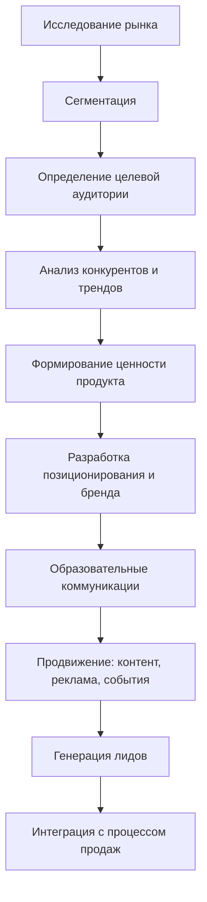
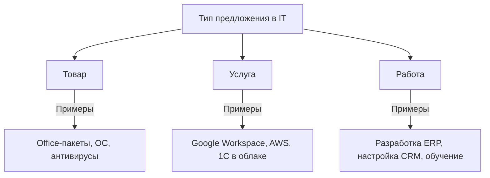
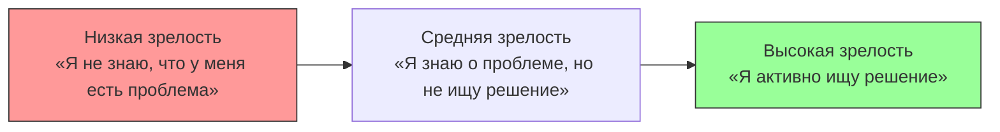

---
title: 1.28. Маркетинг и распространение
---

# 1.28. Маркетинг и распространение

# Раздел в разработке

## Общее о маркетинге

*** В разработке ***

Как продать?

Собираешь плюсы, даже неочевидные и мелкие

Убираешь из результатов собственную выгоду 

Оставляешь чужую 

Всё готово

Поэтому пропаганда и маркетинг всегда не говорит реальный смысл

*** В разработке ***

Маркетинг - это комплекс мероприятий по исследованию рынка, продвижения товаров и услуг. Маркетинг представляет собой многоаспектную дисциплину, которая выходит далеко за рамки простого сбыта товаров и услуг. В контексте информационных технологий маркетинг приобретает особую значимость, поскольку отрасль характеризуется высокой скоростью изменений, инновациями и специфическими особенностями продукта.

Главная задача маркетинга в IT — это не просто продажа программного обеспечения или технических решений, а создание ценности для клиента. Современный потребитель технологий ищет не просто продукт, а комплексное решение своей проблемы. Поэтому маркетинг в IT должен быть тесно интегрирован с процессом разработки и поддержки продукта.

Процесс продаж в IT-секторе существенно отличается от классической торговой модели. Здесь мы имеем дело с нематериальным продуктом, сложностью его демонстрации и оценки качества до момента покупки. Это приводит к необходимости создания особой системы доверия между производителем и клиентом.

Продажи процесс реализации товаров или услуг клиентам с целью получения пользы, выгоды (profit, профит).

Ценность IT-продукта часто определяется не столько его текущими характеристиками, сколько потенциалом развития, возможностью масштабирования и интеграции с другими системами. Поэтому маркетинг должен работать не только на продажу текущего продукта, но и на формирование долгосрочных отношений с клиентом.

В современной практике границы между маркетингом и продажами в IT становятся все более размытыми. Успешные компании строят свою деятельность вокруг потребностей клиента, где маркетинговые активности органично перетекают в процесс продаж и дальнейшего обслуживания.

Особенностью IT-маркетинга является необходимость постоянного образования целевой аудитории. Технологические решения часто требуют объяснения их сути и преимуществ, что делает образовательный компонент неотъемлемой частью маркетинговой стратегии.

При этом важно понимать, что профит в IT-бизнесе формируется не только за счет прямых продаж. Значительную роль играют послепродажное обслуживание, дополнительные услуги, развитие продукта и создание экосистемы вокруг основного решения.

Модель маркетинга в IT-сфере выглядит примерно так:

## Рынок

В основе любой маркетинговой стратегии лежит понимание потребностей клиентов. В IT-сфере потребности часто носят комплексный характер: они включают не только желание решить конкретную задачу, но и ожидания относительно удобства, безопасности, масштабируемости и поддержки. Например, бизнес может нуждаться в автоматизации процессов, но эта потребность трансформируется в запрос на программное обеспечение, которое будет интуитивно понятным, надежным и легко интегрируемым с существующими системами.

Потребности в IT могут быть как явными, так и скрытыми. Явные потребности выражаются в прямых запросах клиентов, таких как «нам нужно мобильное приложение для управления заказами». Скрытые потребности требуют более глубокого анализа: например, компания может не осознавать, что её проблемы с управлением данными можно решить с помощью облачного хранилища или CRM-системы. Задача маркетолога — выявить эти скрытые потребности и предложить решения, которые клиент ещё не осознал.

Спрос в IT-индустрии формируется под влиянием множества факторов: технологических трендов, экономической ситуации, изменений в законодательстве и поведения целевой аудитории. Особенностью спроса в этой сфере является его динамичность. Например, рост популярности удаленной работы в 2020-х годах значительно увеличил спрос на инструменты видеоконференций, системы управления проектами и облачные сервисы.
Предложение в IT-сфере характеризуется высокой конкуренцией и быстрым циклом обновления продуктов. Компании вынуждены постоянно совершенствовать свои решения, чтобы соответствовать меняющимся требованиям рынка. При этом важно учитывать, что предложение в IT часто опережает спрос. Например, технологии искусственного интеллекта или блокчейна могут быть разработаны задолго до того, как рынок полностью осознает их потенциал.

Баланс между спросом и предложением в IT достигается через образовательные кампании, демонстрацию кейсов успешного применения технологий и создание доверия к продукту. Это особенно важно, поскольку многие IT-решения требуют значительных инвестиций и изменений в бизнес-процессах.
Рынок в IT-сфере — это совокупность всех участников, взаимодействующих для обмена технологическими решениями, знаниями и ресурсами. Он характеризуется высокой степенью глобализации: продукты и услуги могут быть созданы в одной стране, проданы в другой и использоваться по всему миру.

Особенности IT-рынка включают:
	- Высокую конкуренцию - множество игроков предлагают схожие решения, что требует от компаний постоянного совершенствования.
	- Цикличность - технологии проходят этапы внедрения, роста, зрелости и устаревания.
	- Зависимость от инноваций - успех на рынке часто определяется способностью предложить что-то новое.
	- Нематериальность продукта - многие IT-решения нельзя «потрогать», что усложняет процесс продажи и требует дополнительных усилий для демонстрации ценности.

Сегментация рынка в IT позволяет разделить общую аудиторию на группы с похожими потребностями, характеристиками или поведением. Это помогает компаниям сосредоточить свои усилия на наиболее перспективных направлениях и предлагать решения, максимально соответствующие запросам каждой группы.

Основные критерии сегментации в IT:
	- Географические - регион, страна, город.
	- Демографические - возраст, пол, доход, уровень образования.
	- Отраслевые - сфера деятельности компании (финансы, здравоохранение, образование и т.д.).
	- Технологические - уровень технологической зрелости компании, используемые системы.
	- Поведенческие - частота использования технологий, готовность к внедрению инноваций.

Пример: компания, разрабатывающая CRM-системы, может выделить сегменты малого бизнеса, среднего бизнеса и крупных корпораций, предлагая каждому из них адаптированные решения.

Целевая аудитория — это группа людей или организаций, на которых ориентированы маркетинговые усилия и продукты компании. В IT определение целевой аудитории особенно важно, поскольку технологии часто требуют значительных вложений и изменений в бизнес-процессах.

Характеристики целевой аудитории в IT:
	- Роль в принятии решений - кто принимает решение о покупке? Это может быть IT-менеджер, руководитель компании или конечный пользователь.
	- Техническая грамотность - насколько аудитория знакома с технологиями.
	- Бюджет - какие средства выделяются на внедрение IT-решений.
	- Ожидания - что аудитория хочет получить от продукта (удобство, надежность, интеграция и т.д.).

Пример: для SaaS-платформы целевой аудиторией могут быть стартапы, которым важны низкая стоимость и простота внедрения, или крупные компании, для которых ключевыми факторами являются безопасность и масштабируемость.

Анализ рынка в IT — это процесс сбора, изучения и интерпретации данных о текущей ситуации на рынке, чтобы сделать обоснованные выводы и разработать эффективные стратегии. В условиях быстрого развития технологий анализ рынка становится особенно важным, так как позволяет компаниям оперативно реагировать на изменения и оставаться конкурентоспособными.

Основные этапы анализа рынка в IT:
1. Изучение целевой аудитории:
	- Кто ваши клиенты? (размер бизнеса, отрасль, география)
	- Какие задачи они хотят решить с помощью вашего продукта?
	- Какие ограничения (бюджет, техническая грамотность) влияют на их выбор?
2. Оценка конкурентов:
	- Какие компании работают в вашей нише?
	- Какие продукты они предлагают и каковы их преимущества/недостатки?
	- Какие стратегии они используют для привлечения клиентов?
3. Анализ трендов:
	- Какие технологии сейчас находятся на пике популярности?
	- Какие изменения происходят в законодательстве, которые могут повлиять на ваш бизнес?
	- Какие потребности клиентов пока остаются неудовлетворенными?
4. SWOT-анализ:
	- Strengths (сильные стороны): уникальные технологии, опыт команды, узнаваемый бренд.
	- Weaknesses (слабые стороны): ограниченный бюджет, зависимость от поставщиков, низкая узнаваемость.
	- Opportunities (возможности): новые рынки, партнерства, технологические тренды.
	- Threats (угрозы): усиление конкуренции, экономическая нестабильность, изменения в законодательстве.

Пример анализа рынка - компания, занимающаяся разработкой мобильных приложений, может провести исследование и выявить, что спрос на финтех-решения (банковские приложения, платежные системы) растет. При этом многие конкуренты предлагают стандартные функции, такие как переводы и оплата счетов, но игнорируют персонализацию и безопасность. Это открывает возможность для создания уникального продукта, который будет фокусироваться на этих аспектах.

## Товар, услуга, работа

В IT-сфере границы между товаром, услугой и работой часто стираются. Программное обеспечение, например, может рассматриваться как товар (продукт, который можно купить и использовать), услуга (например, SaaS-решение, предоставляемое по подписке) или работа (разработка индивидуального решения под заказ).

Товар в IT — это готовый продукт, который можно купить и использовать автономно. Примеры: операционные системы, офисные пакеты, антивирусное ПО. Такие товары характеризуются четко определенными функциями и возможностями.

Услуга в IT чаще всего связана с предоставлением доступа к технологиям или их поддержкой. Например, облачные сервисы, хостинг, техническая поддержка, консалтинг. Услуги в IT обычно имеют регулярную оплату и зависят от качества взаимодействия с клиентом.

Работа в IT — это выполнение специфических задач под заказ клиента. Это может быть разработка программного обеспечения, внедрение систем, настройка оборудования или обучение персонала. Работа в IT часто требует глубокой интеграции с бизнес-процессами клиента и длительного сотрудничества.

Ассортимент в IT-сфере представляет собой набор продуктов, услуг или решений, которые компания предлагает своим клиентам. В отличие от традиционных рынков, где ассортимент часто измеряется количеством товаров, в IT он может быть более сложным и многоуровневым. Это связано с тем, что IT-продукты часто дополняют друг друга, создавая экосистемы.

Основные характеристики ассортимента в IT:
	- Широта: количество различных категорий продуктов или услуг. Например, компания может предлагать облачные сервисы, программное обеспечение для бизнеса и кибербезопасность.
	- Глубина: разнообразие решений внутри одной категории. Например, в категории "CRM-системы" могут быть базовые версии для малого бизнеса и расширенные решения для корпораций.
	- Совместимость: насколько продукты взаимодействуют друг с другом. Например, Microsoft предлагает Office 365, Azure и Teams, которые легко интегрируются между собой.
	- Масштабируемость: возможность адаптировать продукты под нужды разных клиентов — от стартапов до крупных предприятий.
Формирование ассортимента требует стратегического подхода. Компания должна учитывать потребности своей целевой аудитории, конкурентную среду и собственные ресурсы. Например, молодой стартап может сосредоточиться на одном продукте, чтобы быстро завоевать нишу, тогда как крупная компания может предложить широкий спектр решений.

Товарный знак (или бренд) в IT играет ключевую роль, поскольку он становится символом доверия, качества и инноваций. В условиях высокой конкуренции и нематериальной природы IT-продуктов товарный знак помогает компании выделиться на рынке и создать долгосрочные отношения с клиентами.

Значение товарного знака в IT:
	- Узнаваемость: бренд помогает клиентам быстро идентифицировать продукт среди множества аналогов. Например, логотип Apple ассоциируется с инновациями и качеством.
	- Доверие: известный бренд снижает барьеры принятия решений о покупке. Клиенты чаще выбирают проверенные имена, особенно если речь идет о критически важных системах.
	- Защита интеллектуальной собственности: регистрация товарного знака защищает компанию от недобросовестной конкуренции и копирования её решений.
	- Эмоциональная связь: бренд может вызывать определенные эмоции у клиентов, формируя лояльность. Например, Google стал символом простоты и доступности информации.

В IT важно не только создать запоминающийся товарный знак, но и постоянно поддерживать его актуальность через маркетинговые кампании, обновления продуктов и обратную связь с клиентами. Кроме того, бренд должен соответствовать ценностям компании и ожиданиям целевой аудитории.

## Субъекты рынка

Поставщики в IT-сфере играют ключевую роль, так как от их работы зависит качество и своевременность предоставления продуктов или услуг. В контексте информационных технологий поставщиками могут выступать:
	- Разработчики программного обеспечения: компании или фрилансеры, создающие код, приложения или системы.
	- Производители оборудования: фирмы, выпускающие серверы, компьютеры, смартфоны, сетевое оборудование и другие устройства.
	- Поставщики инфраструктуры: облачные провайдеры (например, AWS, Google Cloud, Microsoft Azure), обеспечивающие доступ к вычислительным мощностям и хранилищам данных.
	- Лицензиары технологий: компании, предоставляющие права на использование патентов, API или других технологических решений.

Для успешного функционирования бизнеса важно поддерживать прочные отношения с поставщиками. Это особенно актуально в IT, где технологии быстро устаревают, а задержки в поставках могут привести к серьезным проблемам. Например, если облачный провайдер не справляется с нагрузкой, это может повлиять на работу всех клиентов, использующих его сервисы.

Кроме того, поставщики часто становятся партнерами в разработке новых решений. Например, крупные компании могут сотрудничать с производителями оборудования для создания эксклюзивных конфигураций или адаптированных решений.

Заказчики в IT — это те, кто инициирует процесс покупки или внедрения технологий. Однако важно понимать, что в B2B-сегменте (бизнес для бизнеса) заказчик — это не всегда тот, кто непосредственно пользуется продуктом. В процессе принятия решений участвуют несколько уровней:
	- Экономические лица: руководители компаний или финансовые директора, которые определяют бюджет и дают окончательное одобрение на покупку.
	- Технические специалисты: IT-менеджеры, системные администраторы или архитекторы, которые оценивают соответствие продукта техническим требованиям.
	- Конечные пользователи: сотрудники, которые будут работать с продуктом ежедневно. Их мнение может существенно повлиять на решение о покупке, особенно если продукт сложен в использовании.

Важно отметить, что в IT-сфере заказчики часто ожидают не просто продукт, а комплексное решение, включающее внедрение, обучение, поддержку и дальнейшее развитие. Например, заказчик может купить CRM-систему, но потребовать её интеграцию с существующими базами данных и обучение персонала.

Конкуренция в IT-сфере крайне высока, и она имеет свои особенности:
	- Глобальный характер - конкурентами могут быть как локальные компании, так и международные гиганты.
	- Быстрый цикл инноваций - новые технологии и продукты появляются постоянно, что требует от компаний постоянного совершенствования.
	- Низкий порог входа - в некоторых нишах (например, разработка мобильных приложений) создать продукт может даже небольшая команда, что увеличивает количество игроков на рынке.
	- Альтернативные решения - иногда конкурентами становятся не только прямые аналоги, но и продукты, решающие ту же задачу другими способами. Например, облачные хранилища конкурируют с локальными серверами.

Анализ конкурентов включает изучение их продуктов, стратегий ценообразования, маркетинговых активностей и отзывов клиентов. Это помогает выявить сильные и слабые стороны конкурентов, чтобы предложить более привлекательное решение. Например, компания может сфокусироваться на улучшении пользовательского интерфейса, если конкуренты предлагают сложные в освоении продукты.

Потребители в IT — это те, кто непосредственно взаимодействует с продуктом или услугой. Они могут быть как конечными пользователями (в случае B2C), так и сотрудниками заказчика (в случае B2B). Важно понимать, что потребители формируют восприятие продукта и влияют на его дальнейшее продвижение через отзывы, рекомендации и повторные покупки.

Особенности потребителей в IT:
	- Высокие ожидания - современные пользователи ожидают удобства, скорости и надежности. Например, мобильное приложение должно работать без сбоев, а облачный сервис — обеспечивать бесперебойный доступ.
	- Цифровая грамотность - уровень технологической подготовки потребителей варьируется. Некоторые пользователи легко осваивают новые инструменты, тогда как другим требуется подробная документация и обучение.
	- Социальное влияние - потребители часто полагаются на отзывы и рекомендации других пользователей. Это делает репутацию продукта ключевым фактором успеха.
	- Многоканальность - потребители взаимодействуют с продуктом через различные устройства и платформы (смартфоны, планшеты, компьютеры), что требует обеспечения кросс-платформенной совместимости.

Пример: для SaaS-продукта важно обеспечить простой и интуитивно понятный интерфейс, чтобы пользователи могли начать работу без длительного обучения. При этом необходимо учитывать обратную связь, чтобы постоянно улучшать продукт.

## Клиенты в коммерции

В IT-бизнесе, как и в любом другом, успех напрямую зависит от умения находить, привлекать и удерживать клиентов. Процесс продаж в технологических компаниях представляет собой сложную, выстроенную систему взаимодействий, образуя собой некий коммерческий цикл.

Лид — это потенциальный клиент, который проявил интерес к вашему продукту или услуге. Это может быть человек, заполнивший форму на сайте, подписавшийся на рассылку, запросивший демо или оставивший заявку. Лид — это начальная точка воронки продаж. Однако не каждый лид готов купить прямо сейчас: его нужно «прогреть» и квалифицировать.

Прогрев лидов — это процесс построения доверительных отношений с потенциальным клиентом до момента готовности к покупке. Он включает регулярные коммуникации: email-рассылки, полезный контент (кейсы, статьи, вебинары), персонализированные предложения. Цель — не давить, а помогать клиенту осознать свою проблему и увидеть в вашем решении путь к её решению.

Чтобы эффективно работать с лидом, важно обогащать его данные — собирать дополнительную информацию: должность, компанию, сферу деятельности, боли, поведение на сайте, историю взаимодействий. Современные CRM-системы и маркетинговые платформы автоматически дополняют профиль лида из открытых источников (например, через LinkedIn, базы компаний, аналитику поведения). Это позволяет персонализировать коммуникацию и повысить шансы на конверсию.

Успешный менеджер по продажам всегда проводит исследование перед встречей: изучает компанию клиента, его индустрию, возможные боли, текущие технологии, конкурентов. Это позволяет говорить на одном языке, задавать правильные вопросы и позиционировать решение как стратегическое, а не просто техническое.

Перед тем как тратить ресурсы на продажу, лид нужно квалифицировать — определить, насколько он соответствует идеальному портрету клиента (ICP). Используются фреймворки вроде BANT:
	- Budget (Бюджет): Есть ли у клиента средства?
	- Authority (Полномочия): Может ли принимать решение?
	- Need (Потребность): Есть ли реальная потребность?
	- Timeline (Сроки): Когда планируется внедрение?

Только квалифицированные лиды переходят в активную фазу продаж.

После того как лид стал «тёплым», наступает этап встреч и переговоров. Это уже личное (или онлайн) взаимодействие с представителем компании — менеджером по продажам, техническим консультантом или руководителем проекта. Цель встречи — понять потребности клиента, презентовать решение, ответить на вопросы и снять возражения. Успешные переговоры строятся на активном слушании и глубоком понимании бизнес-задач клиента.
Демонстрация продукта — один из самых важных этапов в IT-продажах. Это не просто показ функций, а целенаправленная демонстрация ценности решения в контексте конкретной задачи клиента. Хорошая демо — персонализированная, короткая (15–30 минут), сфокусированная на пользе, а не на технических деталях. Она должна вызывать реакцию: «Это именно то, что мне нужно».

TOP UP — это «подпитка» сделки: повторное обращение к клиенту после паузы, чтобы напомнить о себе, предложить новую информацию, обновлённое коммерческое предложение или актуальный кейс. Часто используется, если сделка «зависла».

FOLLOW UP — систематическое сопровождение клиента после первой встречи или демонстрации. Это могут быть письма с благодарностью, уточнение вопросов, отправка материалов, согласование следующих шагов. FOLLOW UP помогает не терять контакт и двигать сделку вперёд.

Не все клиенты одинаково готовы к покупке. 

Зрелость потребности — это степень осознания клиентом своей проблемы и готовности искать решение. 

Есть три уровня зрелости:
	- Низкая зрелость: клиент не знает, что у него есть проблема.
	- Средняя зрелость: знает о проблеме, но не ищет решение.
	- Высокая зрелость: активно ищет варианты, сравнивает предложения.

Компании должны адаптировать свои коммуникации под уровень зрелости клиента.

После успешных переговоров, происходит подготовка и согласование коммерческого предложения. 

Коммерческое предложение объясняет, какое решение предлагается, какие выгоды получит клиент, каковы сроки внедрения и этапы реализации, а также стоимость и условия оплаты. Хорошее КП должно быть чётким, персонализированным и ориентированным на ценность, а не на функции. После отправки начинается этап согласования — уточнение деталей, ответы на вопросы, возможные изменения в объёме или цене.

Сделка — это результат всего процесса: подписание договора и начало сотрудничества. Успешное закрытие сделки зависит от чёткого понимания потребностей, доверия между сторонами, ведения переговоров и адаптации к условиям. Особенно важно в IT, где часто речь идёт о долгосрочных проектах, интеграциях и внедрениях.

Успешная сделка влечёт за собой начало выполнения условий, а затем можно уже говорить об оплате, что является прибылью. Это будет успешная продажа.

Воронка продаж — это модель, описывающая путь клиента от первого контакта до заключения сделки. 

В IT она обычно включает этапы:
	- Генерация лидов
	- Квалификация
	- Демонстрация
	- Подготовка КП
	- Переговоры и согласования
	- Закрытие сделки

Каждый этап имеет свою конверсию, и задача компании — оптимизировать воронку, устраняя «утечки».

Это всё важно знать, так как значительная часть рынка компаний-работодателей в IT представляют собой интеграторов и поставщиков, которые как раз-таки реализуют ERP, CRM, SRM системы, в которых реализуется автоматизация всех этих этапов.
