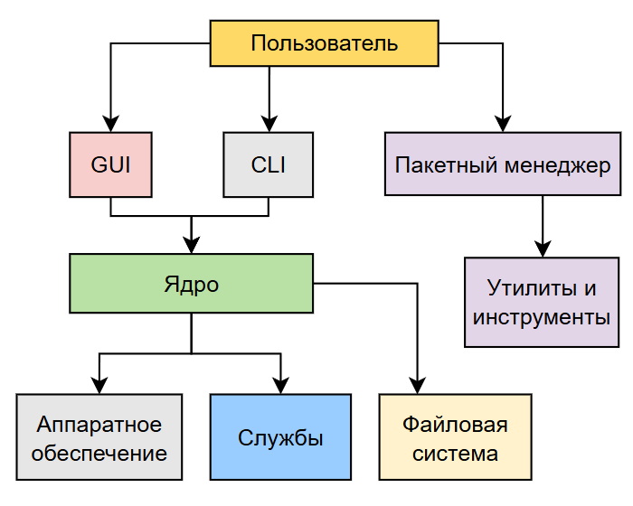

---
title: 2.01. Операционная система
---

# 2.01. Операционная система

## Что такое ОС?

★ **Операционная система** – самая главная программа, которая управляет всеми процессами в компьютере, обеспечивая работу оборудования, запуск приложений и взаимодействие пользователя с техникой. Без ОС компьютер – просто набор «железа», которое не понимает команд. Именно операционная система, словно душа, «оживляет» компьютер, превращая его в полезный инструмент.

ОС выполняет ключевые задачи:
	- *Управление железом* (процессором, памятью, дисками, ввод и вывод);
	- *Запуск и работа программ* (браузер, текстовый редактор, игры);
	- *Организация файлов* (хранение, поиск, копирование);
	- *Обеспечение безопасности* (разграничение прав пользователей, защита от вирусов);
	- *Сетевые функции* (подключение к сети).

## Как работает ОС?

ОС – посредник между пользователем, программами и железом, и состоит из следующих компонентов:
	- **Ядро** (Kernel) – сердце ОС, отвечает за базовые операции: управление памятью, процессами, драйверами;
	- **Драйверы** – программы для работы с устройствами (видеокарта, принтер, сетевая карта);
	- **Интерфейс** – позволяет пользователю взаимодействовать с системой, к примеру, вся возможность работать через графический интерфейс в Windows. Интерфейс может быть графическим (GUI – Graphic User Interface) и командным (Command Line Interface).
	- **Системные службы** – фоновые процессы (обновления, резервное копирование, сетевое соединение);
	- **Системные утилиты** – программы, которые позволяют выполнять базовые операции и обслуживать систему (форматирование диска, диспетчер задач, терминалы, архиваторы, антивирусы);
	- **Файловая система** – система связи с носителями информации, использующая API для доступа к файлам (NTFS, FAT32, ext4).

★ **Службы** – фоновые программы, которые работают без участия пользователя. Например, сетевые службы DHCP, DNS, службы печати для управления принтерами, или планировщик задач для автозапуска программ.

★ **Файловая система** определяет способ хранения данных на диске:
	- *FAT32* — старая, поддерживается везде, но не работает с файлами >4 ГБ.
	- *NTFS* (Windows) — поддерживает шифрование, большие файлы, права доступа.
	- *ext4* (Linux) — журналируемая, устойчивая к сбоям.
	- *APFS* (macOS) — оптимизирована для SSD, быстрая работа с файлами.
	- *exFAT* — для флешек и внешних дисков (поддержка больших файлов).


ОС контролирует процессы, при помощи встроенных **менеджеров**. Можно выделить четыре основных вида:
	- *Менеджер процессов* распределяет ресурсы CPU и RAM между программами;
	- *Планировщик задач* решает, какая программа будет выполняться в определенный момент;
	- *Менеджер памяти* следит, чтобы приложения не «съели» всю оперативную память;
	- *Диспетчер устройств* управляет подключенным оборудованием.

Операционная система работает с устройством при помощи инструкций. И в первую очередь, зависима от архитектуры процессора, от неё зависит скорость работы, энергопотребление и совместимость.


★ **Архитектура процессоров** бывает нескольких видов:

1. x86 – старая архитектура с разрядностью в 32 бита. Поддерживает меньше ОЗУ (до 4 ГБ), медленная, и встречается на старых моделях процессоров вроде Intel Pentium или AMD Athlon.
2. x64 – современная версия x86, с разрядностью в 64 бита, сейчас используется почти на каждом ПК, сервере или ноутбуке, где процессоры линейки Intel Core i3/i5/i7/i9 или AMD Ryzen.
3. ARM64 – более энергоэффективная архитектура с разрядностью в 64 бита, но используется на смартфонах, планшетах, Apple M1/M2, и на некоторых серверах.

**Важно**: программы собираются под определённую архитектуру, и не все поддерживают совместимость с разными версиями, к примеру, некоторые новые программы не запустятся на x86 без «танцев с бубном».

## Возможности ОС

Операционная система — это базовый программный уровень, управляющий аппаратными ресурсами компьютера и предоставляющий интерфейсы для взаимодействия с ними. Она служит мостом между пользователем или приложением и «железом», обеспечивая структурированный доступ к вычислительным мощностям. Мы уже вкратце упомянули некоторые задачи ОС. 

Но что же можно делать при помощи ОС?
	- использовать средства для взаимодействия пользователя с системой (графический или текстовый);
	- управлять процессором, памятью, дисками, сетевыми адаптерами и другими компонентами;
	- распределять ресурсы между выполняющимися задачами;
	- создавать изолированные окружения для программ, чтобы они не могли нарушить работу других частей системы;
	- работать с устройствами через стандартные вызовы, не заботясь о деталях железа;
	- загружать программы из долговременной памяти в оперативную, инициировать их выполнение, организуя обмен данными и завершение;
	- управлять пространством на диске, разрешать конфликты, обеспечивая целостность данных;
	- управлять подключениями, маршрутизацией, шифрованием и обработкой ошибок;
	- возможность добавления или удаления функциональных блоков (например, драйверов) без пересборки всей системы;
	- комбинировать маленькие, специализированные утилиты для решения сложных задач;
	- собирать информацию о состоянии системы, событиях, производительности;

## Виды операционных систем

```
Внимание! 
Приготовьтесь!
Страшные слова	
На самом деле, знать все системы не обязательно, и можно ограничиться Windows и Linux. Но для общего развития, мы вкратце пробежимся по самым разным видам ОС.

```
★ **Windows**

Разработчик: Microsoft.

Тип: Проприетарная (закрытый код).

Архитектуры: x86, x64, ARM64.

Windows – универсальная и распространённая система, которая подходит для дома, офиса, игр и разработки. Отличается удобным графическим интерфейсом, поддержкой большинства программ и игр. Есть основная версия (10, 11) и Windows Server с более широким набором инструментов администрирования (Active Directory, Hyper-V, SQL-серверы).

★ **Unix**

Разработчик: AT&T.

Тип: Проприетарная (но благодаря ей появились открытые системы).

Архитектуры: x86, x64, ARM

В основном Unix рассматривается как семейство систем – к примеру, Solaris (Oracle) для серверов, AIX (IBM) для мейнфреймов и HP-UX (Hewlett-Packard) для корпоративных решений.

★ **Linux**

Разработчик: Сообщество (автор ядра – Линус Торвальдс).

Тип: Открытый исходный код (Open Source).

Архитектуры: x86, x64, ARM64.

Это бесплатная ОС, которая не такая дружелюбная для новичка, как Windows, да и не весь софт работает по умолчанию, но пользуется популярностью благодаря своей гибкости, безопасности и свободы дистрибутивов. 

Популярные дистрибутивы (сборки-вариации Linux):
	- Ubuntu – для новичков;
	- Debian – стабильная основа для серверов;
	- Arch Linux – для продвинутых пользователей;
	- Fedora – тестовая площадка для новых технологий.
	
Их на самом деле довольно много, но мы ещё не раз поговорим о Linux, так что пойдёмте дальше.

★ **MacOS (пишется как macOS)**

Разработчик: Apple.

Тип: Проприетарная (кстати, на базе Unix).

Архитектуры: ARM64.

Это ОС, оптимизированная под железо Apple, элегантная, безопасная и интегрированная в экосистему iPhone, iPad. Закрытая, а совместимость довольно ограничена.

★ **Android**

Разработчик: Google (на базе Linux).

Тип: Открытый исходный код (потому так много смартфонов с этой ОС).

Архитектуры: ARM (мобильные устройства).

Самая популярная мобильная ОС, гибкая и с огромным набором совместимых приложений, однако имеет большое количество разных версий и модификаций от производителей смартфонов.

★ **iOS, iPadOS**

Разработчик: Apple.

Тип: Проприетарная (на базе Unix).

Архитектуры: ARM64.

Как и macOS, закрытая, оптимизированная под экосистему Apple. iOS – для iPhone, iPad OS – для iPad.


★ **FreeBSD**

Разработчик: Сообщество FreeBSD

Тип: Открытая.

Архитектуры: x86, x86_64 (основная), ARM, PowerPC, SPARC.

Произошла от BSD. Часто выступает и в качестве основы для других ОС, таких как TrueNAS. Поддерживает файловую систему с продвинутыми возможностями - ZFS, изоляцию процессов (jails) и систему управления пакетами (ports). Известна своей надёжностью и стабильностью. Применяется для серверов, встраиваемых систем.

★ **OpenBSD**

Разработчик: Тео де Раадт и сообщество OpenBSD.

Тип: Открытая.

Архитектуры: x86, x86_64 (основная), ARM, SPARC, MIPS.

Произошла от NetBSD, но с акцентом на безопасность. Считается одной из самых безопасных ОС в мире благодаря строгому кодированию, постоянному аудиту безопасности и интеграции механизмов защиты. Включает встроенный брандмауэр PF (Packet Filter), применяется для создания защищённых серверов, маршрутизаторов и файрволов.

★ **HarmonyOS**

Разработчик: Huawei

Тип: Проприетарная (с элементами открытого кода).

Архитектуры: ARM (основная).

Разработана как альтернатива Android после санкций США против Huawei. Оптимизирована для IoT-устройств, смартфонов и планшетов. Включает поддержку распределённных вычислений (например, связь между устройствами в экосистеме).

★ **ChromeOS**

Разработчик: Google.

Тип: Открытая (основанная на Linux, но с проприетарными компонентами).

Архитектуры: x86, x86_64 (основная), ARM.

Основана на Linux, построена вокруг браузера Chrome и облачных сервисов. Поддерживает приложения Android и Linux через контейнеры. Используется в образовательных учреждениях и для повседневных задач.

★ **SteamOS**

Разработчик: Valve Corporation

Тип: Открытая.

Архитектуры: x86_64 (основная).

Создана для игровой консоли Steam Deck и других устройств, вроде Steam Machine. Основана на Linux, оптимизирована для игр, поддерживает Proton, который обеспечивает совместимость с Windows-играми. Бесплатная и доступная для установки на любые совместимые устройства.

★ **Aurora OS**

Разработчик: ООО «Открытая мобильная платформа»

Тип: Проприетарная.

Архитектуры: ARM (мобильные устройства).

Российская адаптация Sailfish OS с добавлением локализации, поддержки отечественных сервисов и усиленной безопасностью. Sailfish OS изначально была создана финской компанией Jolla. Используется для мобильных устройств (смартфонов и планшетов).

★ **РОСА МОБАЙЛ**

Разработчик: РОСА Лабс.

Тип: Проприетарная.

Архитектуры: ARM (мобильные устройства).

Полностью российская разработка с акцентом на импортозамещение и безопасность. Имеется поддержка традиционных рабочих сред Linux, поддержка контейнеризации, интеграция с отечественными СУБД, офисными пакетами. Предназначена для мобильных устройств, но также может использоваться на десктопах.

★ **KasperskyOS**

Разработчик: Лаборатория Касперского.

Тип: Проприетарная.

Архитектуры: ARM, x86, x86_64.

ОС с акцентом на безопасность и защиту от кибератак. Ядро выполняет только базовые функции (управление процессами и памятью), все остальные компоненты - изолированные модули. Включает строгий контроль безопасности (например, защищённый загрузчик и мандатное управление доступом). Применяется в сетевых устройствах, IoT-устройствах и других системах, требующих высокой защиты от кибератак.

Есть и другие виды операционных систем, к примеру, Haiku, ReactOS, TempleOS и многие другие, но они менее популярны.

## Windows

```
Внимание! 
Приготовьтесь!
Страшные слова	
Сейчас будет много новых слов, связанных с ОС. Мы плавно изучим всё, не беспокойтесь. Важно сейчас выполнить краткий обзор этой ОС, её особенностей и компонентов. По такой же аналогии мы рассмотрим и другие ОС.
```

### Понятие и версии

★ **Windows** – семейство проприетарных операционных систем от Microsoft, ориентированных на широкий спектр устройств: от персональных компьютеров до серверов, мобильных устройств и даже игровых приставок (Xbox). 

Наиболее известны версии:
	- Windows 95
	- Windows XP
	- Windows 7
	- Windows Vista
	- Windows 8 (а также Windows 8.1)
	- Windows 10
	- Windows 11
	- Windows Server

Windows поставляется в различных вариациях и модификациях.

По назначению:
	- Windows 10/11 Home – домашнее использование;
	- Pro – дополнительные возможности (BitLocker, Remote Desktop);
	- Enterprise – корпоративные функции (MDM, AppLocker);
	- Education – аналог Enterprise для образовательных учреждений;
	- IoT – специализированные версии для устройств IoT (интернет вещей);
	- S Mode – ограничения по безопасности и производительности.

По типу:
	- Windows Desktop – классические ПК;
	- Windows Server – серверные версии с ролью Active Directory, Hyper-V, DNS/DHCP и прочее;
	- Xbox OS – модифицированная версия Windows NT для игровых консолей;
	- Windows Mobile / Windows Phone – устаревшие мобильные ОС.

Многие начали свой путь с этой ОС, научились щёлкать мышкой, запускать программы, сохранять файлы, создавать документы, играть, общаться. Если UNIX стала основой серверов, то Windows стала народной, породив целую культуру, расширив влияние с учёных и инженеров на школы, офисы и дома. Люди играли в сапёра, любовались рабочим столом, и проклинали синий экран смерти. Но как она устроена?

### Компоненты

★ **Основные компоненты Windows**:
1. ★ Ядро (Kernel) – NT-ядро. Windows использует микрогибридное ядро, сочетающее в себе элементы микроядра и монолитного, что позволяет гибко управлять ресурсами и обеспечивает высокую производительность.

Архитектура Windows NT (слои):
	- User Mode (пользовательский режим) – приложения, службы, интерфейс;
	- System Support Processes – службы, например, csrss.exe;
	- Wind32 subsystem (csrss.exe) – отвечает за GUI и консоль;
	- Environment subsystems – подсистемы окружения (POSIX, OS/2, Win32);
	- Kernel mode (режим ядра) – управление памятью, процессором, драйверами.
	- Hardware Abstraction Layer (HAL) – адаптация к разным аппаратным платформам.
	


Ядро же состоит из следующих компонентов:
	- Executive: управляет процессами, памятью, I/O, безопасностью;
	- Kernel: низкоуровневые функции планирования и синхронизации;
	- Device Drivers: загружаемые модули для работы с железом;
	- Windowing and Graphic System (Win32k.sys): графическая подсистема.

2. ★ **Интерфейс** может быть **графическим** (GUI – Graphic User Interface) и **командным** (Command Line Interface).

**GUI**:
	- Desktop Environment – проводник, меню «Пуск», панель задач;
	- Shell – Explorer.exe, Taskbar, Start Menu;
	- DWM (Desktop Window Manager) – отрисовка окон, эффекты Aero;
	- DirectX – API для графики и игр;
	- WinUI / UWP / WPF – современные фреймворки интерфейсов.

**CLI**:
	- Command Prompt (CMD) – старый CLI, ограниченный;
	- PowerShell – мощная оболочка с доступом к .NET и объектами;
	- Windows Terminal – современный терминал с несколькими профилями.

Графический интерфейс как раз и представляет собой тот самый «Проводник» (которые многие помнят как «Мой компьютер»), дружелюбные иконки, панели задач, меню «Пуск» и «Рабочий стол». Это основа, которая позволяет интуитивно работать с компьютером, но для работы с системой можно использовать и консоль (командный интерфейс), которая позволяет вводить команды традиционно - текстом, без использования мыши.

3. ★ **Службы (Services)** – фоновые процессы системы, которые запускаются автоматически и не требуют пользовательского интерфейса.

Управление службами:
	- `services.msc` – графический редактор служб;
	- `sc` – команда для управления из CMD;
	- `Get-Service` – PowerShell.

```
Практическое задание
1. Нажмите Win+R или Пуск - Выполнить.
2. Введите services.msc
3. Ознакомьтесь со списком служб, которые работают в данный момент.

```

Ключевые службы:
	- Windows Update;
	- DHCP Client;
	- DNS Client;
	- Print Spooler;
	- Background Intelligent Transfer Service (BITS);

Службы нужны для того, чтобы система функционировала в полном объёме, независимо от действий пользователя. К примеру, учитывая аудиторию Windows, это важные процессы, которые обеспечивают работу офиса - сетевые службы, службы печати, центр обновления.

4. ★ **Утилиты** являются более профильным, и даже прикладным инструментом. Обычному пользователю они могут не пригодиться, но порой нужно настроить рабочее место (силами администратора), или исправить какие-то неполадки устройства/системы, выполнить какие-то простые задачи. Тут и приходят на помощь различные средства, которые встроены в ОС.

Стандартные:
	- Task Manager (taskmgr) – управление процессами;
	- Resource Monitor (resmon) – детали использования ресурсов;
	- Disk Management (diskmgmt.msc) – управление дисками;
	- Registry Editor (regedit) – реестр Windows;
	- Group Policy Editor (gpedit.msc) – политики.
	
```
Практическое задание
1. Нажмите Win+R или Пуск - Выполнить.
2. Введите regedit
3. Ничего не меняйте, но ознакомьтесь — это реестр Windows, а открывшаяся программа - редактор реестра.

```

Сетевые:
	- Network and Sharing Center;
	- Wi-Fi Direct;
	- Bluetooth;
	- Internet Options;
	- ipconfig;
	- ping;
	- tracert;
	- netstat;
	- nslookup;
	- Windows Firewall with Advanced Security;
	- Routing and Remote Access (RRAS) для машрутизации и VPN-сервера;
	- netsh – CLI для настройки сети.

Сетевые утилиты используются для, как можно понять, решения проблем с сетевыми неполадками - пропало соединение, нужна первичная настройка, проверка доступа к серверу, анализ и маршрутизация.

5. ★ **Файловая система** используется в ОС для хранения файлов, поэтому под тем самым «Проводником» скрывается сложный комплекс программ, который обеспечивает корректную работу при взаимодействии с хранилищем. Здесь всё не ограничено базовым «складом» файлов, нужна оптимизация занимаемого места, ускорение доступа к диску, шифрование, индексация и многое другое.

Наиболее популярные файловые системы:
	- NTFS – современная, поддерживает шифрование, ACL, жёсткие ссылки;
	- FAT32 – устаревшая, имеет ограничение – 4 ГБ на файл;
	- exFAT – для Flash-карт (флешек), нет ограничений FAT32;
	- ReFS – надёжная файловая система для серверов (Resilient File System);
	- APFS (через WSL2) – только в эмуляции.

Инструменты по работе с файловой системой:
	- CHKDSK – проверка диска;
	- DISM / SFC – восстановление системных файлов;
	- Defragmentation Tool – дефрагментация и оптимизация дисков.

6. ★ **Менеджеры ресурсов и процессов** занимают место между службами и утилитами, поэтому лучше их отметить отдельно. Они нужны для управления системой.

**Диспетчер задач (Task Manager)** – позволяет работать с процессами, производительностью, запускать приложения, и просматривать сведения о пользователях.

Диспетчер задач позволяет отобразить список всех запущенных приложений, фоновых процессов и служб, показывает потребление ресурсов каждым процессом - ЦП, ОЗУ, диск, сеть. графический процессор. Самое распространённое использование диспетчера задач - завершение задачи. Когда программа «зависла» и не отвечает, диспетчер позволяет завершить задачу (End Task) - такой процесс называется kill - убийством процесса.

Горячие клавиши - Ctrl+Shift+Esc для запуска диспетчера задач.

Альтернативный способ запуска - Ctrl+Alt+Delete - и выбрать диспетчер задач.

```
Практическое задание
1. Откройте любую простую программу.
2. Запустите диспетчер задач.
3. Найдите запущенную в п.1 программу в диспетчере задач.

```

**Монитор ресурсов (Resource Monitor)** предоставляет более детальную информацию о потреблении ресурсов, сетевых подключениях и использовании диска. Можно детально проверить, какие процессы используют процессор, получить информацию о потоках, модулях и обработке данных, просмотреть использование оперативной памяти, проанализировать активность чтения/записи на дисках. В части сети отображаются подключения, включая IP-адреса и порты, что позволяет выявить несанкционированные или подозрительные соединения.
Перейти можно, запустив через поиск (resmon или Монитор ресурсов) либо из диспетчера задач, с вкладки «Производительность».

**Диспетчер устройств (devmgmt.msc)** управляет оборудованием и драйверами. Все устройства организованы по категориям. Можно обновлять драйвера (автоматически и вручную из файла), удалять устройства, настраивать параметры. Если устройство работает некорректно, рядом с ним появится значок предупреждения.

Запускается через поиск (devmgmt.msc или Диспетчер устройств) или через контекстное меню - Пуск - Система - Диспетчер устройств.

7. ★ **Среда и ключевое ПО, службы, инструменты**.

Сетевые технологии:
	- SMB/CIFS – протокол для сетевых ресурсов;
	- Remote Desktop Protocol (RDP) – удалённый доступ;
	- NetBIOS/WINS – устаревший способ именования хостов;
	- IPSec – безопасные соединения;
	- VPM (PPTP, L2TP, SSTP, IKEv2).

Важные инструменты:
	- PowerShell – мощная оболочка и язык скриптования;
	- WSL (Windows Subsystem for Linux) – запуск Linux внутри Windows;
	- Sysinternals Suite – диагностические утилиты (Process Explorer, TCPView и др.);
	- ProcMon / RegMon – мониторинг файловой и реестровой активности;
	- Windows Sandbox – легковесная среда для безопасного запуска приложений;
	- Task Sheduler – планировщик расписания выполнения задач;
	- Docker Desktop – контейнеризация;
	- Hyper-V, QEMU, VirtualBox, VMware – виртуальные машины;
	- Android Emulator – эмуляция Android;
	- Cygwin, MSYS2 – Unix-подобная среда.

Разумеется, операционная система позволяет работать по разному, и могут понадобиться дополнительные возможности для продвинутых пользователей. Вышеприведённые программы, на первый взгляд, кажутся простым перечислением каких-то наименований, но если присмотреться - это возможность запуска технологий, которые изначально и не рассчитаны для работы с Windows - к примеру, Docker, Android, Linux. А это означает, что можно развернуть Linux прямо внутри Windows.

## Linux

★ **Linux** – семейство открытых ОС, основанных на ядре Linux (Linux kernel), созданном Линусом Торвальдсом в 1991 году. В отличие от Windows и macOS, Linux не принадлежит одной компании. Это проект с открытым исходным кодом, который развивается сообществом разработчиков по всему миру. Само ядро Linux – лишь часть ОС, а полноценная система включает в себя множество программ из проектов GNU, X Window System, драйверов, утилит и т.д.

1. ★ **Как устроен Linux?**

Архитектура Linux включает в себя следующие компоненты:
	- Ядро (Kernel) – управляет взаимодействием с оборудованием;
	- Оболочка (Shell) – интерфейс командной строки;
	- Утилиты GNU – стандартные инструменты работы с системой;
	- Файловая система – структура хранения данных;
	- Менеджер окон / DE (Desktop Environment) – графическая оболочка;
	- Пакетный менеджер – установка и удаление ПО;
	- Службы (system, init) – запуск и управление процессами.

Первое, что заметит пользователь Windows – обилие команд через CLI, а также крайне большое сокращение всего, что можно. Если Windows рассчитана на простых пользователей, в том числе офисных, которым проще пояснить полное название, с подсказками и подробностями, а также на родном языке, в графическом интерфейсе, то в Linux расчёт идёт на простоту и удобство для разработчиков.

А разработчики люди другие – им важно, чтобы пришлось «писать меньше букв», они работают по-другому. Поэтому, в Linux, даже открыв файловую систему, можно увидеть, что все стандартные директории называются кратко вроде «root», «home». Никаких длинных путей, всё просто и быстро.
Аналогично и работа с программами – чтобы что-то скачать и установить, порой не придётся идти на сайт дистрибутива и долго мучаться с пользовательским интерфейсом. Разработчики привыкли к коду, поэтому им проще найти гайд, вбить нужную команду в консоль и всё установится автоматически. А в использовании, проще опять же – вбить команду в консоль и выполнять, чем сидеть и настраивать кнопочки, галочки и прочие элементы в интерфейсе.



2. ★ **Ядро Linux** – сердце системы. Отвечает за управление процессором (планировщик задач), управление памятью, работу с дисками и файловыми системами, сетевые подключения, драйверы устройств, безопасность. Выпускается регулярно, каждые 2-3 месяца. Существуют, конечно, и долгосрочные версии (LTS, Long Term Support) – поддерживаются 2-4 года.

3. ★ **Linux** – не одна ОС, а семейство ОС, называемых дистрибутивами (distributions). Они различаются по цели использования, простоте, стабильности и другим параметрам.

**Классификация дистрибутивов**.

По типу пакетного менеджера:
	- Debian / Ubuntu - .deb, apt;
	- Red Hat / CentOS / Fedora - .rpm, dnf / yum;
	- Arch Linux – pacman;
	- SUSE / openSUSE – zipper.

По назначению:
	- для начинающих: Ubuntu, Linux Mint, Elementary OS;
	- для серверов: CentOS, RHEL, Debian;
	- для разработчиков: Arch Linux, Fedora Workstation;
	- Live-CD дистрибутивы: Kali Linux (безопасность), Tails (анонимность), Knoppix.

Говоря о дистрибутивах, их просто великое множество - всё из-за открытости ОС. Есть и общепринятые качественные оболочки, есть и простые, а можно встретить всякое - ОС с жесточайшим контролем, используемые в определённых странах (допустим, Северная Корея), оболочки в стиле аниме, различных звёзд. Есть игровые вроде SteamOS, есть и безумные - к примеру, Suicide Linux удаляет все файлы при любой ошибке в терминале.

4. ★ **Среда и ключевое ПО, службы**.

Графическая среда (DE):
	- GNOME – современный, официальный для Fedora, Ubuntu;
	- KDE Plasma – мощный, гибкий, красивый;
	- XFCE – легковесный, подходит для старых машин;
	- LXQt / MATE / Cinnamon – альтернативы.

Графическую среду можно установить отдельно, через командную строку.

Службы (services). Linux использует:
	- systemd – современная система инициализации и управления службами;
	- init – старая система (SysVinit).

Зачем это всё нужно? И почему мы снова перешли в перечисления? Что за странные названия и сокращения?

Смысл в том, что Linux, в отличие от Windows, не ограничена правами одной корпорации, а развивается целым сообществом разработчиков. Каждый делает что-то, изобретает инструменты, делится с другими, и совместными усилиями «рождаются» новые службы, оболочки, утилиты. А ядро Linux и система пакетов позволяет просто взять и поставить себе любой из них, собрав из всех компонентов своего «монстра Франкенштейна».

5. ★ **Полезные инструменты в Linux**
	- top / htop – мониторинг процессов;
	- df / du – информация о дисковом пространстве;
	- ls / cp / mv / rm – работа с файлами;
	- grep / sed / awk – обработка текста;
	- find – поиск файлов;
	- chmod / chown – управление правами доступа;
	- tar / zip / gzip – архивирование;
	- curl / wget – загрузка данных из интернета;
	- ssh / scp / rsync – удалённый доступ и копирование;
	- nmcli / ip / ifconfig – сетевые настройки;
	- apt / dnf / pacman – пакетные менеджеры.

6. ★ **Работа с сетью.**

Управление сетью выполняется через:
	- NetworkManager – графический менеджер подключений;
	- system-networkd – для серверов;
	- nmcli – CLI для NetworkManager.

Примеры работы с сетью:

```
ip a                                # информация о IP-адресах
ping google.com                     # проверка связи
traceroute google.com               # маршрут до сервера
netstat -tuln                       # активные порты
ss -tuln                            # более быстрая замена netstat
nmap -p 1-1000 192.168.1.1           # сканирование портов
dig example.com                     # DNS-запросы

```

Далее, в главе, посвящённой системному администрированию, мы ещё погрузимся в Linux. На текущий момент продолжим изучение других ОС.

## macOS

★ **macOS** – проприетарная ОС, разработанная Apple Inc., предназначенная для компьютеров Macintosh (Mac). Она основана на Darwin, который, в свою очередь, является производным от Unix-подобной системы BSD и ядра XNU. Это не просто пользовательский интерфейс, а полноценная система с мощными инструментами, которая сочетает удобство использования с высокой надёжностью и безопасностью.

Основные компоненты macOS:
	- Ядро (XNU) – управляет взаимодействием с оборудованием;
	- UNIX Layer – слой BSD, реализующий стандарты POSIX;
	- Cocoa / AppKit / SwiftUI – фреймворки для GUI-приложений;
	- Finder – файловый менеджер и оболочка;
	- Launchd / System Settings – запуск и управление службами;
	- Файловая система APFS;
	- Средства командной строки (bash, zsh, Terminal.app).

1. ★ **Ядро macOS (XNU)** – гибридное ядро, сочетающее элементы монолитного ядра и микроядра. Оно поддерживает программную защиту памяти (PAC), ASLR, SMEP и другие технологии безопасности и используется также в iOS, iPadOS, watchOS, tvOS – других устройствах Apple.

Компоненты XNU:
	- Mach – микроядро, отвечает за управление памятью и IPC (межпроцессное взаимодействие);
	- BSD Subsystem – реализация UNIX API, процессы, файловые системы, сетевые протоколы;
	- I/O Kit – объектно-ориентированная библиотека для драйверов устройств (на C++).

2. ★ **Эксклюзивность**. macOS выпускается только для оборудования Apple. Каждый выпуск получает собственное имя и номер версии, к примеру, 14 Sonoma. Apple регулярно прекращает поддержку старых версий, поэтому пользователям важно обновляться. К сожалению, исходя из политики Apple, работа там ведётся для своей экосистемы, поэтому и разработка, тестирование производится на устройствах этой компании.

3. ★ **Среда и ключевое ПО, службы**.

Графическая среда:
	- Aqua UI – фирменный интерфейс macOS;
	- Finder – главный файловый менеджер;
	- Dock – панель запуска программ;
	- Mission Control – управление окнами и рабочими столами.

Интеграция с Apple экосистемой:
	- iCloud – синхронизация данных;
	- AirDrop, Handoff, Universal Clipboard;
	- Continouity Camera – использование iPhone как веб-камеры.

Ключевые приложения:
	- Safari – браузер по умолчанию;
	- Mail, Messages, Calendar;
	- Photos, GarageBand, iWork Suite (Pages, Numbers, Keynote);
	- Final Cut Pro, Logic Pro – профессиональные приложения.

Службы:
	- launchd – система запуска и управления процессами (заменяет init и systemd);
	- systemsettingsd – управление системными настройками.

4. ★ **Полезные инструменты macOS**

Стандартные CLI-инструменты:
	- Terminal.app – терминал macOS;
	- top / htop (brew) - Мониторинг процессов;
	- df / du - Информация о диске;
	- ls / cp / mv / rm - Работа с файлами;
	- grep / sed / awk - Обработка текста;
	- curl / wget (brew) - Загрузка из интернета;
	- ssh / scp / rsync - Удалённый доступ;
	- networksetup / ifconfig - Сетевые настройки;
	- pmset - Настройка энергопитания;
	- osascript - Выполнение AppleScript скриптов.

Homebrew – пакетный менеджер.

5. ★ **Работа с сетью** в macOS выполняется через:
	- System Preferences – Network – графический интерфейс;
	- networksetup – CLI-инструмент;
	- Wi-Fi Diagnostics (Option + клик по значку Wi-Fi) – углублённая диагностика.

Пример:
```
ifconfig                     # информация о сетевых интерфейсах
ipconfig getpacket en0     # получить DHCP-ответ
ping google.com            # проверка соединения
traceroute google.com      # маршрут до сервера
netstat -tuln              # активные порты
dig example.com            # DNS-запросы
arp -a                     # таблица ARP

```

## Ключевые отличия Windows, Linux и macOS

| Критерий | Windows | Linux | macOS |
| :--- | :---: | ---: | ---: |
|Лицензия	|Проприетарная	|Открытая	|Проприетарная
|Ядро	|NT (гибридное)	|Linux (монолитное)	|XNU (гибридное)
|Пакетный менеджер	|MS Store, Chocolatey, Winget	|APT, YUM, Pacman	|Homebrew
|Совместимость ПО	|Широкая (игры, офис, бизнес)	|Разработчики, open-source	|Офис, профессиональные приложения
|Стабильность	|Выше в новых версиях	|Высокая	|Очень высокая
|Безопасность	|Есть уязвимости	|Лучшая защита (при правильной настройке)	|Отличная изоляция и контроль
|Сетевая модель	|SMB, NetBIOS	|TCP/IP, NFS	|TCP/IP, Bonjour
|Файловая система	|NTFS, exFAT	|ext4, Btrfs, ZFS	|APFS, HFS+

## iOS

★ **iOS** – мобильная операционная система, разработанная Apple Inc., предназначенная для работы на iPhone, iPad и iPodTouch. Она основана на той же ядерной основе, что и macOS – ядре XNU, и является частью более широкой экосистемы Apple, включающей также iPadOS, watchOS, tvOS, macOS.

1. ★ Как устроена iOS?
Архитектура iOS включает в себя следующие компоненты:
	- Ядро (XNU) – управляет взаимодействием с оборудованием;
	- UNIX Layer (Darwin) – BSD API, процессы, файловая система, сетевые протоколы;
	- UIKit / SwiftUI – фреймворки для пользовательского интерфейса;
	- SpringBoard – системная оболочка (заменяет Finder);
	- App Store и Sandboxing – безопасность и изоляция приложений;
	- Файловая система APFS;
	- Средства командной строки (в jailbroken-устройствах).

2. ★ Ядро, как и в macOS, используется гибридное – XNU, которое сочетает элементы монолитного и микроядра. Компоненты – Mach для управления памятью, IPC; BSD Subsystem для реализации UNIX API; I/O Kit, библиотека драйверов на C++.

Особенности ядра в iOS:
	- Secure Virtual Memory (SVM) – защита данных в памяти;
	- Address Space Layout Randomization (ASLR) – усложняет эксплойты;
	- Code Signing Enforcement – запуск только подписанного кода;
	- Pointer Authentication Codes (PAC) – защита указателей (на чипах A12 и выше);
	- Application Sandbox – изоляция приложений друг от друга.

3. ★ Эксклюзивность. Как и в macOS, iOS выпускается только для устройств Apple, а каждый выпуск получает собственное имя и номер версии, старые версии прекращают поддержку. Следовательно, политика Apple связана с множеством ограничений, в первую очередь обоснованных безопасностью.

Процесс снятия ограничений, наложенным на устройство (в основном iOS), называют джейлбрейк (Jailbreak). Он позволяет получить root-доступ (права суперпользователя) и устанавливать неподписанные приложения, изменять системные файлы и настраивать ОС глубже, чем это разрешено по умолчанию.

Это, конечно, выполняется для установки неофициальных (и пиратских) приложений, кастомизации интерфейса, удаления предустановленных приложений, доступа к скрытым функциям. И такой процесс – нарушение лицензионного соглашения, который приведёт к юридическим проблемам, потере гарантии и поддержки, а также проблемам со стабильностью и безопасностью.

4. ★ Среда и ключевое ПО, службы
Графическая среда:
	- SpringBoard – главный интерфейс iOS (экран с иконками);
	- NotificationCenter – центр уведомлений;
	- Control Center – быстрые настройки;
	- Dock (на iPad) – аналог рабочего стола.

Интеграция с Apple экосистемой:
	- iCloud – синхронизация данных;
	- AirDrop, Handoff, Universal Clipboard;
	- Find My iPhone, Find My Network.

Ключевые приложения:
	- Safari, Messages, FaceTime, Photos, Notes;
	- App Store – центр загрузки приложений;
	- Health, Wallet, Maps, Music;
	- Shortcuts – автоматизация задач.

Службы:
	- launchd – система запуска и управления процессами (как в macOS);
	- backboardd – управление экраном и кнопками;
	- mediaserverd – работа с медиафайлами.

5. ★ Полезные инструменты iOS

На уровне пользователя:
	- Shortcuts – мощная система автоматизации;
	- Files – файловый менеджер (начиная с iOS 11);
	- Screen Recording – запись экрана;
	- Accessibility Features – голосовое управление, увеличение, VoiceOver.

Для разработчиков и продвинутых пользователей:
	- Xcode – официальная IDE Apple;
	- Instruments – профилирование производительности;
	- Console.app – просмотр логов;
	- Simulator – тестирование приложений без устройства;
	- TestFlight – бета-тестирование.

Для джейлбрейкнутых устройств имеются отдельные средства, которые позволяют получить расширенный доступ к ОС.

6. ★ Работа с сетью в iOS.

Wi-Fi и Bluetooth:
	- Wi-Fi Settings – выбор сети, заблокированные сети, DNS;
	- Bluetooth – подключение аксессуаров;
	- Personal Hotspot – раздача интернета.

Инструменты диагностики:
	- Network Link Conditioner – имитация плохого соединения (требуется установка через Xcode);
	- Settings > General > About > Diagnostics & Usage;
	- Wi-Fi Assist – переключение на мобильный интернет при слабом Wi-Fi.

Удалённый доступ:
	- Remote Debugging – через Xcode;
	- SSH (при джейлбрейке) – для низкоуровневого доступа.

7. ★ Запуск iOS на Windows, Linux, macOS.

Запустить iOS как полноценную ОС на обычном ПК невозможно из-за привязки к Apple-аппаратуре, но существуют способы её эмуляции и тестирования – Xcode Simulator на macOS, iPadian, Corellium, VirtualBox / QEMU на других ОС.

## Android

★ **Android** – мобильная ОС с открытым исходным кодом, основанная на ядре Linux и разработанная Google. Она предназначена в первую очередь для смартфонов и планшетов, но также используется в телевизорах (Android TV), часах, автомобилях и других устройствах. Но это не просто мобильный Linux, это полноценная многозадачная ОС с мощными возможностями разработки, изоляции приложений и интеграции с Google-сервисами.

1. ★ Как устроена Android?

Основные компоненты Android:
	- Ядро Linux – управляет взаимодействием с железом;
	- Hardware Abstraction Layer (HAL) – интерфейс между драйверами и системой;
	- Android Runtime (ART) – среда исполнения приложений;
	- Framework API – набор классов и сервисов для разработки;
	- Пользовательский интерфейс – launcher, System UI;
	- Google Mobile Services (GMS) – дополнительные функции от Google.

2. ★ Ядро Android – это Linux, но сильно модифицированное под мобильные устройства, с возможностями управления процессами, памятью, файловой системой, поддержкой драйверов Wi-Fi, Bluetooth, GPS, камер, а также многозадачности и безопасности. Производители могут использовать разные версии ядра Linux, что влияет на обновления безопасности и совместимость.

3. ★ Открытость. Android имеет множество вариаций, где часть – официальные, от Google, а часть – по производителям.

По произвоодителям есть следующие вариации Android (оболочки):
	- OnePlus OxygenOS;
	- Samsung One UI;
	- Xiaomi MIUI;
	- OPPO ColorOS;
	- Sony Xperia UI;
	- Realme UI;
	- Pixel Experience (чистый Android от Google).

Кроме того, имеются и альтернативные прошивки:
	- LineageOS – самая популярная "чистая" замена;
	- Pixel Experience, crDroid, Evolution X;
	- GrapheneOS – фокус на безопасности;
	- PostmarketOS – экспериментальная Unix-подобная ОС на базе Linux.

4. ★ Среда и ключевое ПО, службы.

Графическая среда:
	- Launcher – пользовательская оболочка (например, Nova Launcher);
	- System UI – отвечает за статусбар, навигацию, блокировку;
	- Settings App – центр управления.

Интеграция с Google:
	- Google Play Services – API для карт, геолокации, оплаты;
	- Google Assistant, Voice Typing, Lens;
	- Google Photos, Drive, Gmail.

Ключевые приложения:
	- Google Messages, Phone, Browser;
	- Camera, Gallery, Clock, Calculator;
	- Play Store, YouTube, Chrome, Maps.

Службы:
	- Zygote – запуск новых приложений;
	- SurfaceFlinger – управление отображением;
	- AudioFlinger – звуковая система;
	- PackageManagerService – управление приложениями;
	- ActivityManagerService – жизненный цикл приложений.

5. ★ Полезные инструменты Android

На уровне пользователя:
	- Google Assistant – голосовое управление;
	- Digital Wellbeing – контроль времени использования;
	- Split Screen, Picture-in-Picture;
	- Files by Google, Gallery Go, Camera Go.

Для разработчиков и продвинутых:
	- ADB (Android Debug Bridge) – CLI-инструмент для работы с устройством;
	- Fastboot – загрузка в режим восстановления и перепрошивка;
	- Logcat – просмотр логов системы;
	- Android Studio / IntelliJ IDEA – IDE;
	- Termux – Linux-терминал на Android.

Примеры ADB-команд:
```
adb devices                 # список подключенных устройств
adb shell                   # вход в shell
adb install app.apk         # установка приложения
adb logcat                  # просмотр логов

```

6. ★ Работа с сетью в Android

Wi-Fi и Bluetooth:
	- Wi-Fi Settings – выбор сети, DNS, заблокированные сети;
	- Bluetooth Pairing – подключение аксессуаров;
	- Hotspot & Tethering – раздача интернета.

Инструменты диагностики:
	- Settings > Network & Internet > Data Usage;
	- Wi-Fi Diagnostics Mode (на некоторых устройствах);
	- Ping via Termux / Terminal Emulator;
	- IPerf3 – тестирование скорости сети.

Удалённый доступ:
	- Scrcpy – управление Android с ПК через USB;
	- Vysor, AirDroid, TeamViewer – удалённый доступ;
	- SSH (через Termux или root).

7. ★ Запуск с других ОС и других ОС.

Запуск с других ОС:
	- Android Emulator (входит в Android Studio);
	- Genymotion;
	- Bluestacks, Nox Player, LDPlayer;
	- VirtualBox / QEMU;
	- Phoenix OS / PrimeOS / AnLinux.

Запуск других ОС на Android:
	- ExaGear, Parallels Access – Windows;
	- Termux, UserLAnd, AnLinux, Debian Noroot, PRoot – Linux;
	- RetroArch, PPSSPP, Dolphin, ePSXe, Mupen64Plus, Gambatte, Nestopia – эмуляторы игровых консолей.


