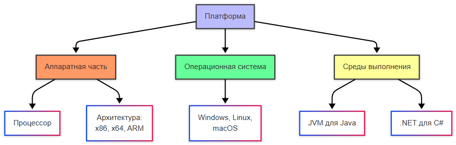
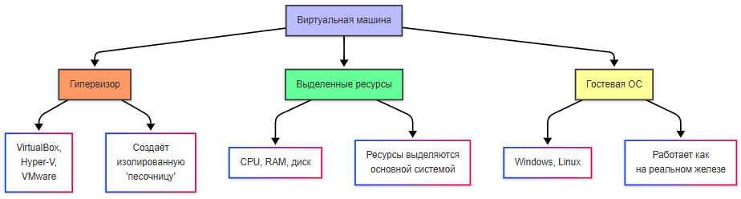
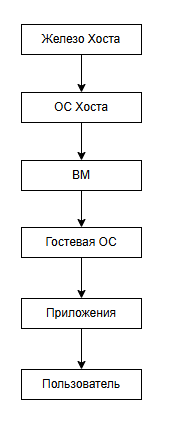
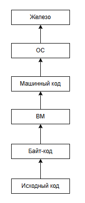

---
title: 2.02. Платформы
---

# 2.02. Платформы

*** В разработке ***

Окружение

DEV/TEST-окружения

PROD-окружения

Окружение с доступом в интернет и встроенными базами данных

*** В разработке ***

ОС является программным комплексом, который управляет ресурсами компьютера и обеспечивает взаимодействие между пользователем, приложениями и «железом». Но чтобы программа вообще могла запуститься, одного лишь присутствия ОС недостаточно.

Представим себе идеальное приложение, красивое, быстрое, удобное. Но на каком устройстве оно будет работать? На старом ноутбуке с процессором Intel Pentium? На MacBook с Apple M2? На смартфоне Samsung с процессором Snapdragon? Или на сервере в облаке? Каждое из этих устройств имеет:
	- свою архитектуру процессора (x86, x64, ARM);
	- свою операционную систему (Windows, macOS, Android);
	- свои способы взаимодействия с пользователем и оборудованием;
	- свои ограничения по энергопотреблению, памяти, драйверам.
	
Оборудование старого поколения не могут обеспечивать достаточным количеством ресурсов современные программы, так как их платформы, как и программы того же времени, создавались с расчётом на меньшую производительность.

Поэтому и существуют платформы как единый контекст, в котором приложение сможет существовать и корректно функционировать.

★ **Платформа** – сочетание аппаратной части и программной среды, на которой работает приложение. Она включает:
	- Аппаратную часть (процессор, архитектура: x86, x64, ARM);
	- Операционную систему;
	- Среды выполнения (JVM для Java, .NET для C#).
	


Платформы существуют из-за технических ограничений и бизнес-интересов компаний, ведь мир технологий не является единым монолитом, и устройства создаются разными компаниями под свои задачи:
	- настольные ПК - мощные, универсальные, но энергозатратные;
	- мобильные устройства - компактные, требуют энергоэффективности;
	- серверы в первую очередь должны быть надежными и стабильными.

Компании вроде Apple, Microsoft и Google создают собственные платформы, потому что это бизнес:
	- контроль качества обеспечит то, что программа, написанна специально под iPhone, будет работать лучше, чем портированная с Android;
	- создаётся экосистема - пользователь покупает iPhone, потом Mac, потом AirPods и всё будет работать вместе;
	- экономическая выгода - продажа устройств, подписок, сервисов внутри своей платформы.

Apple не хочет, чтобы на её чипах работала Android - потому что тогда исчезнет уникальность её платформы. Microsoft не выпускает Windows для ARM-смартфонов, потому что это не её целевой рынок. Конкуренция формирует границы платформ.

Это и есть первоочередная причина существования платформ - конкуренция. Apple первыми вышли на рынок смартфонов, представив революционный iPhone, вот и держатся. Корпораций множество - Microsoft, Apple, Google, Amazon, Nvidia, Oracle, IBM, HP, Dell, CISCO, Samsung, Xiaomi, Huawei, Sony, и прочие - все они формируют мировой рынок технологий.

Устройства представляют собой аппаратную часть - это физическая основа, процессор, память, шины, контроллеры. Архитектура определяет, какие инструкции понимает процессор, сколько данных он может обрабатывать за такт, как работает с памятью. Сейчас имеется три главные архитектуры, которые мы рассматривали ранее - x86, x64 и ARM. Современные программы не поддерживают x86, так как она даёт мало памяти и не имеет новейших инструкций. А программа, скомпилированная под x64, не запустится на ARM без специальных прослоек - Rosetta2 (Apple), QEMU, Proton (Valve). Это называется портированием.

Портирование ПО представляет собой адаптацию программы так, чтобы она работала в другой среде. Результат называется портом. Простейший пример - «DOOM», игра, разработанная для старых персональных компьютеров, модифицируется так, чтобы могла запускаться на смартфоне.
Допустим, приложение, которые было изначально под Windows, но потом воспроизведённое на Linux при помощи инструментов (Proton, например), не будет нативным – оно будет портированным. Игра из Steam, запущенная на Linux через Proton будет работать, но медленнее, так как является «не родным».

Программа, написанная изначально под определённую платформу, будет нативной - иными словами, «родной».

★ **Нативные приложения** – приложения, написанные специально для конкретной платформы на родном языке. К примеру, Microsoft Word для Windows – нативное, использует Win32 API и оптимизировано под x64.

Мультиплатформенность и кроссплатформенность – разные понятия. Мультиплатформенность подразумевает то, что программа может развернуться и запуститься на разных платформах, а кроссплатформенность – что программа работает единым кодом для разных платформ. К примеру, Telegram работает на разных устройствах отдельными клиентами, а Spotify работает по единой кодовой базе.

Если аппаратная часть предоставляет физическое «тело», то программная среда будет «душой» платформы, включая всё, что позволяет приложению получать доступ к ресурсам, взаимодействовать с пользователем, работать с оборудованием и безопасно выполнять код.

В программную среду входит:
	- ОС - ядро, драйверы, файловая система, планировщики задач;
	- API (Application Programming Interface) - интерфейсы, через которые приложение обращается к ОС (Win32 API, POSIX, Cocoa);
	- SDK (Software Development Kit) - набор инструментов для разработки (библиотеки, отладчики, документация);
	- UI-фреймворки - средства для построения пользовательского интерфейса (UIKit на iOS, SwiftUI, Android Views, Qt, GTK);
	- Стартовое ПО / системные службы - фоновые процессы, менеджеры, службы безопасности.

К примеру, чтобы приложение сохранило файл на диск, оно не пишет напрямую на жёсткий диск - оно вызывает функцию API ОС (WriteFile в Windows, write() в Linux). ОС уже через драйвер передаёт команду контроллеру диска. Так обеспечивается безопасность и совместимость.

## Виды платформ

Основные комбинации:

| Платформа | Аппаратная часть | Программная среда |
| :--- | :---: | ---: |
|Windows + x86/64	|Процессоры Intel/AMD	|Win32 API, .NET
|macOS + ARM/x86	|Apple Silicon/Intel	|Cocoa, SwiftUI
|Android + ARM	|Процессоры ARM	|Android SDK, NDK
|iOS + ARM	|Apple Silicon	|UIKit, Swift
|Web + JavaScript	|Любой процессор	|Браузер
|Linux + x86/ARM	|Intel/ARM	|GTK/Qt, Wayland

*Среда выполнения (runtime environment)* – программный слой, который обеспечивает работу приложения на целевой платформе. Программная среда - это всё окружение (ОС, API, драйверы, UI), среда выполнения же более узкое понятие, специфический механизм, который непосредственно выполняет код. 

Можно выделить следующие типы сред выполнения:

| Тип среды | Примеры | Особенности |
| :--- | :---: | ---: |
|Виртуальная машина	|JVM (Java), CLR (.NET)	|Исполняет байт-код
|Интерпретатор	|Python, Node.js	|Выполняет код построчно
|Нативная среда	|Android Runtime (ART)	|Компиляция в машинный код

Допустим, Java-приложение работает на любом устройстве с JVM благодаря байт-коду, а веб-приложение в браузере использует среду выполнения JavaScript. Языки программирования зачастую имеют свои виртуальные машины, которые и обеспечивают коррекность работы на конкретном языке. Мы ещё обязательно изучим их, а сейчас нам важно запомнить главное - алгоритм работы. 

Допустим, пользователь кликнул мышью по кнопке «Сохранить» в Photoshop.

1. Устройство ввода генерирует сигналы, отправленные пользователем, и драйвера в ОС их распознают.
2. ОС передаёт события ввода графической подсистеме - оконному менеджеру.
3. Оконный менеджер определяет, какое приложение под курсором, и передаёт событие ему.
4. Приложение, получает событие и вызывает свою логику сохранения.
5. Приложение обращается к API ОС, для сохранения файла в папку X.
6. ОС проверяет права, вызывает файловую систему, драйвер диска и данные записываются на жесткий диск.

Все эти шаги возможны только потому, что приложение работает в рамках платформы, знает API и имеет доступ к среде исполнения, совместимой с архитектурой. Никакого прямого доступа к железу нет, только через посредников. Именно это и обеспечивает стабильность всей системы.

## Виртуализация

★ **Виртуальная машина** – это программная среда, которая эмулирует реальный компьютер с собственной ОС, процессором, памятью и диском, но при этом работает внутри основной системы. ВМ выступает как «контейнер» для ОС.

ВМ позволяет запускать гостевые операционные системы (к примеру, Linux на Windows, macOS на Linux, Windows 11 на Mac) без изменения основной системы. Это как «компьютер в компьютере», но полностью изолированный, управляемый и безопасный. Разумеется, если основная система выключится, то выключится и гостевая.

- **Хост (Host)** - это основная ОС и физическое устройство, на котором запущен гипервизор и ВМ;
- **Гостевая ОС (Guest OS)** - это ОС, которая работает внутри ВМ. Она «не знает» о том, что она является ВМ. Всё эмулируется как настоящее.

На аппаратные ВМ можно установить любую ОС, для которой есть образ - Windows, Linux, FreeBSD, даже старые DOS или OS/2. Главное, чтобы гипервизор поддерживал архитектуру и был достаточно мощный хост.

ВМ работает следующим образом:
	- *Гипервизор* (VirtualBox, Hyper-V) создаёт изолированную «песочницу»;
	- ВМ получает выделенные ресурсы (CPU, RAM, диск);
	- Гостевые ОС (Windows, Linux) работают так, будто они на реальном железе.

**Гипервизор** - это специальное ПО или встроенный компонент ОС, которое создаёт, управляет и распределяет ресурсы между виртуальными машинами. Он работает так:
	- перехватывает запросы от гостевой ОС к «железу»;
	- эмулирует или перенаправляет эти запросы на физическое оборудование хоста;
	- изолирует ВМ друг от друга, чтобы одна ВМ не могла сломать другую или основную систему;
	- распределяет ресурсы - CPU, RAM, дисковое пространство и сеть.

Гипервизор бывает двух типов:
	- **Тип 1** - Native / Bare-metal, устанавливается напрямую на железо, без основной ОС, что даёт максимальную производительность;
	- **Тип 2** - Hosted, работает как приложение внутри основной ОС. Медленнее, но проще в использовании.

Например, **VirtualBox**, запускаемая на Windows будет гипервизором типа 2, а ESXi на сервере будет типом 1.

VirtualBox распространяется компанией Oracle, имеет Тип 2, бесплатный, с открытым исходным кодом. Он поддерживает множество гостевых ОС, прост и очень удобен для обучения, тестирования и даже разработки.

**VMware Workstation / Fusion** гипервизоры Типа 2, платные, имеют более высокую производительность, профессиональные функции и отличную поддержку.

**ESXi** - профессиональный гипервизор Типа 1, для серверов, есть бесплатная версия.

**Hyper-V** встроен в Windows 10/11 Pro и Windows Server. Это гипервизор типа 1, но работает поверх Windows, технически как разделённое ядро, очень производительный и рекомендуемый для .NET/Windows разработки.

В Linux-среде можно встретить типичный стек - **libvirt+virt manger + KVM + QEMU**.

**QEMU (Quick Emulator)** - эмулятор процессоров и устройств, может имитировать любую архитектуру, работает самостоятельно или с KVM.

**KVM (Kernel-based Virtual Machine)** - это особый модуль ядра Linux, который превращает Linux в гипервизор Типа 1. Требует поддержки процессора (Intel VT-x / AMD-V) и работает в паре с QEMU.

**libvirt** - набор библиотек и API для управления ВМ через virt-manager (графический интерфейс) или virsh (консоль).

Когда создаётся ВМ, ей выделяются ресурсы из ресурсов хоста:
	- процессор - 1, 2, 4 ядра из общего пула;
	- оперативная память - например, 4 ГБ из 16 ГБ физической памяти;
	- дисковое пространство - создается виртуальный диск (файл .vdi, .vmdk), который эмулирует SSD/HDD;
	- сеть - виртуальный сетевой адаптер, работающий в режиме NAT, моста или изолированной сети.

Ресурсы резервируются статически, если задаются жёсткие лимиты (2 ядра, 4 ГБ, и ВМ не может выйти за эти рамки) и динамически, когда ресурсы могут расширяться и сжиматься в зависимости от нагрузки.

Если выделить слишком много ресурсов ВМ, то основная система (хост) начнёт «тормозить». Виртуализация перераспределяет ресурсы, а не создаёт из воздуха.

Виртуальные машины могут быть следующих типов:
	- **Аппаратные (системные)** для запуска целых ОС, к примеру, VirtualBox, VMware, Hyper-V;
	- **Программные ВМ** (для выполнения кода) – JVM, CLR, BEAM.




### Аппаратная ВМ

Аппаратные (системные) ВМ предназначены для запуска целых операционных систем. Они эмулируют или виртуализируют всё железо - процессор, память, диски, видеокарту, сеть.

Сама по себе виртуализация тоже бывает нескольких типов:

- **Полная виртуализация** подразумевает, что гостевая ОС «не знает», что работает в ВМ, а гипервизор эмулирует всё железо. Это VirtualBox, VMware Workstation.

- **Паравиртуализация** - гостевая ОС «знает», что работает в ВМ, и оптимизирована для этого, используя специальные драйвверы. Примеры - Xen, KVM с гостевыми драйверами.

Аппаратная виртуализация - процессор (Intel VT-x, AMD-V) помогает гипервизору ускорять работу ВМ. Это и ускоряет работу.

Технология виртуальных машин позволяет, к примеру, протестировать какую-то программу без необходимости приобретать ещё один компьютер, а также изучать другие операционные системы, виртуализировать серверы. Вот примеры:

1. Представим, что у нас организация, в которой есть 10 отделов, и у каждого свои системы, настройки и наборы инструментов. Хотелось бы для каждого иметь свои настройки, ресурсы, и для этого мы можем на один сервер установить 10 виртуальных машин, и никто не будет друг другу мешать, главное, чтобы у основного сервера хватило ресурсов на разделение между 10 гостями.
2. Представим, что у нас на сервере Windows появилась необходимость установить программу, которая работает на Linux, но возможности выделить ещё сервер нет. Можно создать на Windows новую виртуальную машину и установить туда Linux.
3. Нужно развернуть программу, однако она подозрительная, и запуск на основном компьютере несёт риски. Можно создать ВМ, и попробовать работу программы там. В таком случае даже заражение ВМ вирусами или поломка системы не страшна – ведь для основной системы ВМ – просто файл.

**Важно**: виртуализация не подходит для игр – производительность куда ниже.



Пользователь работает с программами внутри гостевой ОС, которая, в свою очередь, работает внутри виртуальной машины, запущенной на основной (хостовой) ОС, которая использует физическое железо.

### Программная ВМ

Программная виртуальная машина имеет совсем другие цели. Это среда выполнения, которая интерпретирует или компилирует промежуточный код (байт-код), а не эмулирует железо. Она работает внутри ОС, а не вместо неё.

Они нужны для обеспечения кроссплатформенности, безопасности и упрощения управления памяти. Это своего рода результат эволюции программирования, позволяющий писать не прямые инструкции в процессор, а код на своём языке программирования со своим синтаксисом.

**Важно**: программные ВМ используются не только в компилируемых языках, но и в интерпретируемых. Главное — наличие промежуточного представления кода (байт-кода).



Программист пишет код на языке высокого уровня → компилятор/интерпретатор превращает его в байт-код → программная ВМ (например, JVM) интерпретирует или JIT-компилирует его в машинный код, который выполняется на ОС и железе.

Можно выделить несколько важных для знания программных ВМ.

1. **JVM** — Java Virtual Machine, используется в Java. Она запускает байт-код Java, управляет памятью, безопасностью, многопоточностью. Это позволяет Java-приложениям, скомпилированным на Windows, запускаться на Linux, потому что JVM на Linux «понимает» тот же байт-код.
2. **CLR** - Common Language Runtime (.NET) используется в языках .NET (C#, F#, VB.NET), компилирует IL-код в машинный код через JIT (Just-In-Time), управляет памятью, безопасностью, исключениями.
3. **BEAM** - Erlang Virtual Machine запускает код языков Erlang и Elixir, создана для высоконагруженных, отказоустойчивых систем (телеком, чаты, БД), поддерживает миллионы легковесных процессов и «горячее» обновление кода.
4. **V8** — JavaScript Engine (Google), технически это движок, а не полноценная ВМ, но выполняет ту же роль, компилируя язык JavaScript в машинный код. Используется в Chrome, Node.js, Deno.
5. **Python Virtual Machine (CPython)**, интерпретатор языка Python, компилирует код в байт-код (.pyc) и выполняет его на виртуальной машине.
6. **Dalvik / ART. Dalvik** — интерпретатор, ART — компилятор в нативный код (AOT/JIT). Запускают приложения Android.
7. **Lua VM**, язык Lua, легкая, встраиваемая ВМ для игр, скриптов.

Когда мы будем изучать конкретные языки программирования, мы ещё вернёмся к программным ВМ.

```
Практическое задание
Убедитесь, что у вас имеется в распоряжении более, чем 8 ядер процессора и более, чем 16 ГБ ОЗУ.
Если меньше - лучше не пытайтесь выполнять это задание.
Установите себе VirtualBox.
Попробуйте установить Ubuntu.
Если возникнут проблемы, можете отложить установку до главы с системным администрированием.

```

## Платформы программных продуктов

В ряде случаев под платформой может пониматься не то, что мы рассмотрели выше, а именно некая совокупность ПО и инструментов, на базе которого собирается определённый функционал. В таком случае программа как таковая остаётся в ядре своём той же, но её возможности адаптируются под пользователя. Всё равно, что сайт остаётся сайтом, но у каждого пользователя интерфейс будет свой – это называется платформы программных продуктов:
	- Коробочные решения – готовые продукты, которые устанавливаются локально (1C: Предприятие, Adobe Photoshop);
	- Облачные SaaS технологии- Google Workspace, Microsoft 365;
	- Облачные PaaS платформы – Heroku, Google App Engine;
	- Гибридные решения – десктоп-приложения на веб-технологиях, мобильные приложения с веб-интерфейсом.

Их называют платформами, потому что это основа, на которой строится функционал, экосистема, включающая сервисы, API, настройки, интеграции. Это гибкая среда, адаптируемая под нужды разных пользователей или компаний, и не является статичным продуктом - скорее это динамическая система, которую можно расширять, кастомизировать и масштабировать. Например, 1С:Предприятие: ядро одно, но конфигурации (бухгалтерия, торговля, ЗП) — разные.

**Программный продукт** — это законченное, сертифицированное, поддерживаемое программное обеспечение, предназначенное для решения определённого класса задач у конечных пользователей или организаций. Он не требует написания кода с нуля, поддерживается вендором, лицензируется и масштабируется.

**Вендор (Vendor)** — компания-разработчик и поставщик программного обеспечения, которое приобретают другие компании или пользователи для решения своих задач. Именно вендор продаёт, арендует, распространяет свой продукт по подписке, и поставляет обновления, исправления, документацию.

Примеры - Microsoft, Google, Oracle, SAP, Adobe, Autodesk, 1C, Amazon. Крупнейшие корпорации мира стали богатейшими в первую очередь благодаря тому, что они разработали или выкупили успешный программный продукт, развили его как платформу и теперь просто получают пассивный доход.

**Коробочное ПО (Boxed Software / On-Premises Software)** — программный продукт, который поставляется в виде готового пакета для установки на локальное устройство или сервер компании. Пользователь или компания покупает лицензию (разовую или бессрочную), скачивает или получает на физическом носителе установочный пакет, устанавливает ПО на своё оборудование и настраивает под свои нужды. Это даёт полный контроль над данными и инфраструктурой, но требует своих ресурсов для установки, настройки и обновления.

Часто можно встретить понятие **«On-Premise»** или **«On-Premises»**, модель развёртывания программного обеспечения, при которой всё ПО, данные и инфраструктура размещаются и управляются на собственных серверах и в помещениях организации, а не в облаке у стороннего провайдера. Это как раз и подразумевает, что программный продукт передаётся компании. On-Premises — это локальная модель, где вся ответственность лежит на компании-пользователе.

**SaaS (Software as a Service)** — модель доставки программного обеспечения, при которой приложение размещается в облаке, доступно через интернет, и оплачивается по подписке. Вендор развёртывает и поддерживает приложение на своих серверах, пользователь заходит туда через браузер или мобильное приложение, а данные хранятся в облаке вендора (или в доверенном облаке). Остаётся лишь оплачивать ежемесячно/ежегодно. Не нужно ничего устанавливать, обслуживать, и доступ откуда угодно.


**PaaS (Platform as a Service)** — облачная платформа, предоставляющая среду для разработки, тестирования и развёртывания приложений, без необходимости управлять серверами, ОС, сетями. Разработчик пишет код (веб-приложение, API, бот), загружает его на платформу, которая автоматически выбирает среду выполнения, запускает приложение, масштабирует нагрузку, обеспечивает БД, кеши, очереди и прочее. Разработчик лишь платит за эти ресурсы, процессорное время, память и трафик. Можно назвать «облачной мастерской».

Есть и другие «…aaS»:

	- IaaS (Infrastructure as a Service) - это предоставление виртуальных серверов, дисков, сетей и балансировщиков. Примеры - AWS EC2, Azure Virtual Machines, Google Compute Engine.
	- DaaS (Desktop as a Service) - виртуальный рабочий стол в облаке. Примеры - Amazon WorkSpaces, Windows 365 Cloud PC.
	- FaaS (Function as a Service) - запуск отдельных функций по событию (serverless). Примеры - AWS Lambda, Azure Functions, Google Cloud Functions.
	- CaaS (Containers as a Service) - управление контейнерами (Kubernetes в облаке). Примеры - AWS ECS, Google Kubernetes Engine, Azure Kubernetes Service.
	- DBaaS (Database as a Service) - облачные базы данных. Примеры - Amazon RDS, Firebase, MongoDB Atlas.

Эта классификация пошла от NIST (Национальный институт стандартов и технологий США) и закрепилась в индустрии как стандарт описания облачных моделей, потому существуют такие понятия.

Гибридные же продукты возникают, когда пользователи хотят быстродействие и оффлайн-доступ (десктоп) + синхронизацию и доступ отовсюду (облако), а компании хотят контроль над данными (локально) + гибкость и масштабируемость (облако). Так мы и получаем, к примеру, Telegram, Steam, и прочие приложения, которые совмещают в себе элементы разных моделей.

Платформы создаются под разные цели — и это важно понимать при выборе решения:
	- разработка, ускорение создания ПО (такие решения имеют SDK, API, шаблоны, хостинг и отладку);
	- бизнес-задачи для автоматизации процессов компании (имеют модули под разные отделы, интеграции и отчётность);
	- работа с клиентами - привлечение, удержание и обслуживание (имеют CRM, чат-боты, аналитику и уведомления);
	- управление компаниями - сквозное управление ресурсами, проектами, командами (совместная работа, календари, задачи, документы, видеоконференции).
