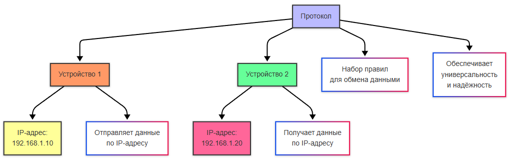
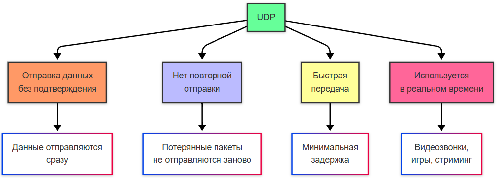
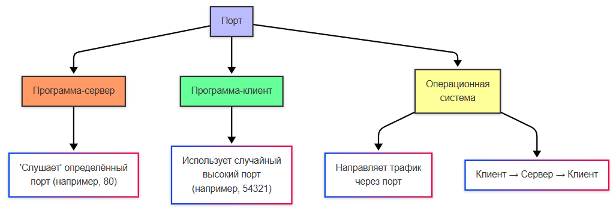
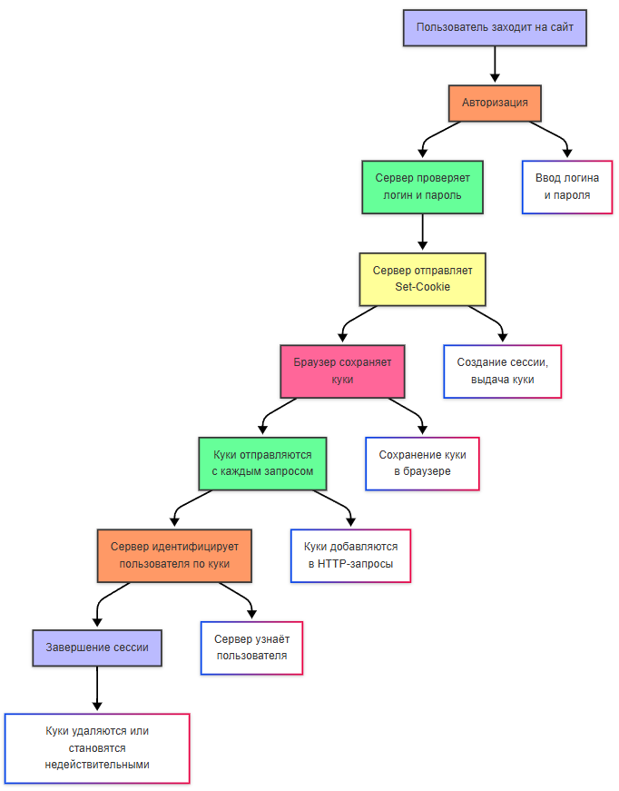
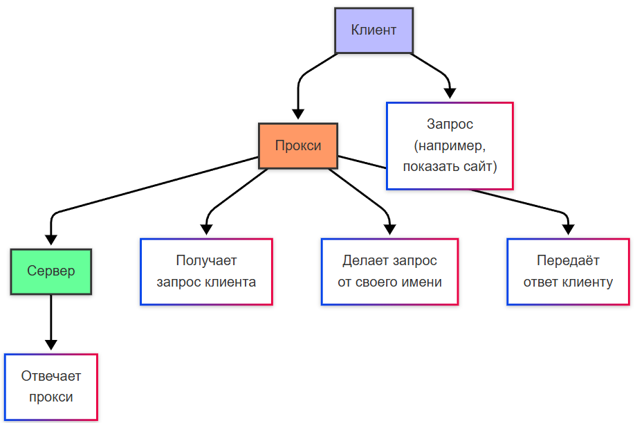

---
title: 2.03. Сеть и интернет
---

# 2.03. Сеть и интернет

## Общее о сетях

Сейчас мы уже привыкли к такому явлению, как сеть. Мы всё время онлайн, как с телефона, так и с компьютера – работаем и играем с постоянным Интернет-соединением, общаемся и обмениваемся информацией, даже не задумываясь порой о том, какой путь прошли эти технологии, прежде чем дать нам возможность смотреть фильмы в 4K.

Люди веками искали способы передавать информацию на расстоянии (да, можно пошутить про голубиную почту – можете даже для интереса посмотреть, как это работало – приходилось действительно идти в «голубятню» и разбирать привязанные к ножкам птиц сообщения). 

★ **Сеть** – это просто система соединённых между собой устройств, которые могут обмениваться данными.

Для начала мы определим основные понятия:

★ **Локальная сеть (LAN, Local Area Network)** – когда компьютеры в одном здании связаны кабелями, допустим, в одном кабинете или офисе.

★ **Интернет** – глобальная сеть сетей, где миллиарды устройств общаются через провода, радиоволны и даже спутники.

★ **Мобильная связь** – сеть без проводов, использующая радиоволны и вышки.

★ **Радиосвязь** – передача данных через эфир (радио, телевидение и Wi-Fi).

★ **Пропускная способность** – количество данных, передаваемых за секунду, принято её называть скоростью (Dial-up – 56 Кбит/с, DSL – 10-100 Мбит/с, оптоволокно – 1-10 Гбит/с).

★ **Задержка (пинг)** – время отклика сети, измеряется в миллисекундах (телефонные линии – 50-100 мс, оптоволокно – 1-10 мс). Почему пинг? Потому что пинг-понг. Одна сторона словно отправляет «мячик» другой стороне, приговаривая «пинг!», а другая отвечает «понг!» и ударяет по мячику – именно то, сколько времени проходит между «пинг» и «понг» и будет задержкой.

★ **Протокол** – язык, на котором общаются устройства друг с другом.

★ **IP-адрес** – адрес устройства в сети (как адрес дома в городе).

★ **Порт** – числовой идентификатор (от 0 до 65535), который помогает программам на одном устройстве разделять сетевой трафик, словно номер квартиры в доме.

## История сетевых технологий

```
Внимание! 
Приготовьтесь!
Страшные слова	
Сетевые технологии во многом нужны не всем. Особенности кабельной, сигнальной и провайдерской работы – это тема сетевых инженеров, так что не пугайтесь и не углубляйтесь, если не интересно.
```

До появления телефонов люди, как мы ранее упомянули, передавали сообщения с помощью голубиной почты, и причем долгое время. Позднее появились специальные семафорные башни с флагами – оптические телеграфы, и электрический телеграф (Морзе) – первый самый быстрый способ связи, через точки и тире. Именно тогда стали передавать информацию, зашифрованную в сигналах. В 1858 году США и Великобританию связали первым трансатлантическим кабелем, передающим точки и тире Морзе. Так соединили континенты.

Сейчас азбука Морзе кажется чем-то романтическим из прошлого, но настолько важен вклад – именно это способ разбора сигналов на информацию. Но ещё более важным изобретением был **телефон** (1876, Белл). 

Но как работала телефонная линия?

	- человек говорил в микрофон, мембрана устройства дрожала и меняла ток, вследствие чего **голос преображался в колебания электричества в медном проводе**, таким образом получая **аналоговый сигнал**;
	- **операторы вручную соединяли абонентов**, перетыкая провода – это ручные коммутаторы;
	- позднее появились **автоматические АТС**, дисковые телефоны с номерами, которые управляли электромеханическими коммутаторами (то есть, процесс переключения абонентов просто автоматизировали, а каждый абонент получал свой уникальный номер).

Но аналоговый сигнал – не данные, а голос, превращённый в колебания электричества. Именно поэтому важно отделять «цифровые сигналы» от «аналоговых». Проблема голоса в том, что к нему добавляются шумы, искажения, и требуются специальные усилители и фильтры, но к ним люди пришли позднее. Аналоговый сигнал – это непрерывный, постоянный сигнал, а цифровой – набор из «есть сигнал – нет сигнала», 0 и 1. И компьютеры как раз работают с цифровыми данными.

| Аналоговый сигнал | Цифровой сигнал |
| :--- | :---: |
Непрерывный; Плавный, волнообразный; Чувствителен к помехам. Виниловая пластинка – аналоговая, слышны каждые царапины.	|Дискретный (0 и 1). Помехоустойчив (можно восстановить даже с ошибками). CD (компакт-диск) – цифровой, царапины не портят звук.

Преобразовать аналог в цифру удалось через **модем** (**МО**дулятор-**ДЕМ**одулятор). Первые модемы превращали цифровые сигналы компьютера в звук, который мог передаваться по телефонной линии. Как это работало?
	- компьютер посылал *данные* (0010101);
	- модем преобразовывал их в тоны разной *частоты* (например, 0 = 1000 Гц, 1 = 2000 Гц);
	- получался аналоговый *сигнал*, адаптированный под *цифру*;
	- на другом конце модем *расшифровывал* эти звуки обратно в *цифру*.

И поэтому старые модемы пищали, это и был язык передачи данных. Модемы договаривались о скорости соединения (рукопожатие **Dial-up**). Но при этом, поскольку сигнал шёл по той же линии, она становилась занятой – нельзя было одновременно сидеть в интернете и звонить одновременно, да и сигнал был очень медленным (загрузка картинки могла отнять долгие минуты со скоростью 56 Кбит/с).

Позднее, в конце 1990-х, проблемы занятой линии решили при помощи технологии **DSL (Digital Subscriber Line)**, когда DSL стал использовать высокие частоты, которые не мешали голосу, благодаря чему телефон и интернет стали работать одновременно, и не нужен был «аналоговый разговор» как в Dial-Up, данные шли в чисто цифровом виде. 

Прокладывая *подводные кабели*, их сначала проектируют, выбирают маршруты, избегая разломы и рыболовные зоны. Корабли-кабелеукладчики медленно плывут, разматывая кабель с барабана. На мелководье кабель зарывают в дно, чтобы не порвать якорями и чем-то ещё. Причем каждые 50-100 км сигналы усиливают при помощи репитеры (репетиров). Самый длинный кабель – SEA-ME-WE 3 (39 тысяч километров, соединяет 33 страны). Их ремонтируют подводные роботы. Но мир не сразу пришёл к таким технологиям соединения проводами и образуя сеть. Что произошло потом, после появления цифровой связи?

Первые локальные сети использовали коаксиальный кабель (мы могли увидеть подобный в старых телевизионных антенных кабелях) – толстый, негибкий, сложный для прокладки. Но позднее технология изменилась на *витую пару* (**UTP** – Unshielded Twisted Pair) – более дешевый, удобный и тонкий, гибкий кабель, в котором пары проводов скручиваются, что позволяет эффективно гасить помехи. В итоге как раз UTP в дальнейшем стал стандартом для технологии – **Ethernet**. 

Ранний Ethernet использовал единый коаксиальный провод, который называли общим кабелем (*шиной*). Компьютер «слушал», свободен ли кабель, если свободен – отправлял данные, а если компьютеры отправляли данные одновременно – возникала коллизия, и приходилось ждать время для повторной отправки. Сеть тормозила при большом количестве устройств.

Устройства требовали специальные адаптеры для связи с кабелями – это сетевые карты. Сетевая карта имеет свой уникальный **MAC-адрес** (например, 00:1A:2B:3C:4D:5E) – это физический адрес, прошитый в оборудовании.

Соединяя множество компьютеров, использовали технологию «хабов» (**Hub**), который получал сигнал и отправлял его всем в сети. Позднее эту технологию заменили «свитчами» (**Switch**) – специальными «умными» коммутаторами, которые запоминали MAC-адреса и отправляли данные только нужному получателю, что позволило избавиться от коллизий и увеличить скорость. Так свитчи убили сетевые хабы.

Хабы


Свитчи


**Локальная сеть** (немного в другом виде, конечно) была еще давно, когда в одной организации научились соединять устройства и обмениваться данными, поначалу использовались «мейнфреймы» - древние огромные компьютеры, к которым подключались терминалы, и все вычисления делались на центральной машине. Мейнфрейн был своего рода прототипом сервера. Но, как мы помним, в 1980-х появились компьютеры, что позволило использовать компьютеры по специализации, превращая их в «сервер». На английском языке «сервис» (service) это услуга, а «сервер» - обслуживающий (server), к примеру, официант. 

Вот сервер это как раз и есть специальный «служащий» компьютер, у которого есть определенная цель:
	- **файл-сервер** хранит общие документы;
	- **почтовый сервер** обрабатывает электронную почту;
	- **веб-сервер** обеспечивает работу сайтов.

Так, конечно же, компании стали использовать технологию использования своих серверов, расширяя и расширяя количество устройств, породив два важных понятия:
	- **Интранет** – «частный интернет», когда существует локальная сеть компании с внутренними сайтами, почтой, базами данных, словно свой маленький закрытый клуб;
	- **Интернет** – глобальное объединение сетей через TCP/IP, словно город, состоящий из клубов.
	
## URL, URI, URN

В обыденной жизни мы практически каждый день используем термин «ссылка» и «URL». Более технически продвинутые могут конечно и использовать каталоги, пути и прочее, но давайте в этой части остановимся подробнее.

Собственно, что такое путь (англ. path)? Это часть адреса, указывающая на расположение ресурса на сервере. Он следует после домена и показывает, в какой директории находится нужный файл или страница. Например, в адресе https://example.com/blog/post.html путь — это /blog/post.html.

Но это путь в контексте сети. На самом деле путь может быть у чего угодно, даже `C:\Program Files\` или `127.0.0.1` - всё это пути, которые определяют «узлы», разделяемые некими символами - разделителями. К примеру, в классическом пути мы знаем, что разделители это «/» или «\», а какой именно - вопрос контекста. И весь адрес, от корня до конечной точки и будет путём - path. Этот термин применяется в различном контексте - как в файловой системе и сети, так и даже в структурах и сайтах. Но к этому позже не раз вернёмся, главное запомнить суть понятия.

**Ссылка** — это общий термин, обозначающий любой указатель. В контексте сети, разумеется, это указатель на ресурс в интернете. Чаще всего под ссылкой подразумевают URL, но технически это может быть и любой URI. Понятие URL пользователю привычнее, но на самом деле нам нужно запомнить именно URI.

**URI (Uniform Resource Identifier, унифицированный идентификатор ресурса)** - это строка символов , которая уникально идентифицирует абстрактный или физический ресурс. То есть URI служит для обозначения чего-либо — будь то веб-страница, изображение, файл, имя человека или даже понятие. Главное — URI называет ресурс, но не обязательно говорит, как его получить.

Структура URI определяется стандартом (RFC 3986) и может включать следующие компоненты:
```
[схема:][//авторитет][путь][?запрос][#фрагмент]
```

Пример: `https://example.com:8080/api/users?id=123#profile`
	- `https` — схема (протокол)
	- `example.com:8080` — авторитет (домен и порт)
	- `/api/users` — путь
	- `?id=123` — строка запроса (параметры)
	- `#profile` — фрагмент (якорь)

Существует два основных типа URI:
	- URL (Uniform Resource Locator) — указывает где находится ресурс и как к нему обратиться.
	- URN (Uniform Resource Name) — даёт ресурсу уникальное имя в глобальном пространстве, независимо от его местоположения.

**URL (Uniform Resource Locator, унифицированный указатель ресурса)** - это частный случай URI (или тип URI), который не только идентифицирует ресурс, но и указывает способ получения этого ресурса — другими словами, определяет его местоположение в сети и протокол доступа к нему.
Давайте наглядно:
| URI | URL |
| :--- | :---: |
|`https://learn.microsoft.com/ru-ru//`	|`https://learn.microsoft.com/ru-ru//`
|`mailto:support@example.com`	|`ftp://files.example.net/document.txt`
|`urn:isbn:0451450523`	|`http://www.example.org/index.html`
Таким образом, URI более широкое понятие, чем URL. URI не обязательно указывает, где он находится или как его получить, А URL указывает путь к ресурсу в интернете, включая информацию о протоколе, сервере.
URL состоит из нескольких ключевых частей:
	- Протокол (схема) — определяет способ доступа к ресурсу. Примеры: `http, https, ftp, ws, mailto, file`.
	- Домен (или IP-адрес) — имя сервера, где находится ресурс. Пример: `example.com`, `api.github.com`.
	- Порт — опциональная часть, указывающая, на какой порт сервера идёт запрос. По умолчанию: `80` для HTTP, `443` для HTTPS. Пример: `example.com:8080`.
	- Путь (path) — путь к конкретному ресурсу на сервере. Может указывать на:
		- API-приставки — например, `/api/v1/users` (используется в REST-сервисах),
		- Папки/каталоги — `/images/gallery/`,
		- Файлы с расширениями — `/documents/report.pdf`, `/index.html`.
	- Параметры (query string) — начинаются с `?`, передают данные на сервер. Пример: `?search=cat&limit=10`. Часто используются в поиске, фильтрации, аналитике.
	- Якорь (fragment, anchor) — начинается с `#`, указывает на часть страницы (например, заголовок или элемент). Пример: `#section-3`. Не отправляется на сервер, обрабатывается браузером локально.

**URN (Uniform Resource Name, унифицированное имя ресурса)** — это тип URI, который называет ресурс уникальным и постоянным образом, независимо от его местоположения. Он не указывает, где взять ресурс, а только кто или что это за ресурс. Пример: `urn:isbn:0451450523` — уникальный номер книги, который остаётся неизменным, где бы она ни находилась.

Структура URN:
```
urn:<namespace>:<identifier>
	- urn — обязательная схема.
	- <namespace> — пространство имён (например, isbn, uuid, musicbrainz).
	- <identifier> — уникальный идентификатор внутри этого пространства.
```

## Протоколы, порты и процесс соединения

Теперь мы плавно подойдём к теме портов протоколов. Понятно, как компьютеры соединяются, и что они обмениваются чередой сигналов 1 и 0. Но как они определяют, в какой последовательности кодировки расшифровывать сигналы? Вот для того, чтобы все устройства разговаривали на общем языке, и произошла стандартизация протоколов.

★ **Протокол** – это набор правил, по которым устройства обмениваются данными. Без них интернет был бы разговором на сотнях разных языков одновременно, но благодаря стандартизации мы получаем универсальность, независимость от ОС, надёжность передачи данных, и, конечно, эффективность. Иначе говоря, протокол = язык общения.

И если сеть – это «клуб» или «город», то у каждого члена клуба есть свой номер, свой адрес, свой некий идентификатор, который и делает его членом клуба. Это IP-адрес, словно почтовый адрес дома в городе. IP-адрес – это уникальный числовой идентификатор устройства в сети. Чтобы указать, куда отправить данные, нужно сообщить адрес.



IP-адрес может быть двух версий – IPv4 и IPv6. Почему появился IPv6? Потому что адреса закончились, устройств стало слишком много.

| Характеристика | IPv4 | IPv6 |
| :--- | :---: | ---: |
|Формат	|32 бита (4 числа, например, `192.168.1.1`)	|128 бит (8 групп, например `2001:0db8:85a3::8a2e:0370:7334`)
|Адреса	|Около 4,3 миллиардов	|340 секстиллионов (короче, бесконечно)

И в роли «почтальонов», распределяющих данные между владельцами IP-адресов, работают маршрутизаторы – именно они решают, куда отправить пакет данных. Для эффективной работы составляются таблицы маршрутизации, содержащие кратчайший путь до устройства. То есть, вы не напрямую отправляете данные с компьютера на компьютер. 

Схема приблизительно такова:
```
Компьютер → Роутер → Провайдер → Сервер
```

Именно тут появляется такой персонаж, как провайдер – поставщик услуг соединения, организация, которая зарабатывает как раз на том, что осуществляет прокладку сети от серверов и распределяющих центров к целевым пользователям – абонентам. Провайдер отвечает за линию, которая подключается к роутеру, а роутер уже может быть в роли «главного» в своей локальной сети, но для того, чтобы выбраться в «глобальную сеть», придется подружиться с провайдером. Схема может быть и сложнее – провайдеров может быть несколько, и один передаёт пакет данных другому, прежде чем пакет доберётся до адресата, но суть такова.

Чтобы стандартизировать и упростить понимание процессов передачи данных в сетях, была разработана модель OSI (Open Systems Interconnection) — эталонная семиуровневая модель, описывающая, как данные перемещаются между устройствами по сети. Каждый уровень отвечает за конкретную задачу и взаимодействует с уровнями выше и ниже.

1. Физический уровень (Physical Layer). Этот уровень отвечает за передачу неструктурированных битовых потоков через физическую среду. Он определяет тип кабеля (витая пара, коаксиальный, оптоволокно), тип разъёмов (RJ-45, DB-25), сигналы (электрические, оптические, радио), стандарты (EIA/TIA-232. V.35, Ethernet).

Пример физического уровня - передача единиц и нулей через медный кабель.

2. Канальный уровень (Data Link Layer). Обеспечивает надежную передачу данных между двумя узлами сети на физическом уровне. Включает физическую адресацию (MAC-адреса), обнаружение ошибок, управление доступом к среде, стандарты и протоколы (IEEE 802.3 (Ethernet), IEEE 802.11 (Wi-Fi), PPP, HDLC). 

Пример канального уровня - коммутатор направляет пакеты по MAC-адресам.

3. Сетевой уровень (Network Layer). Отвечает за маршрутизацию и логическую адресацию. Определяет, как передавать данные между сетями, и включает протоколы: IPv4, IPv6, ICMP, ARP, IPsec.

Пример сетевого уровня - маршрутизатор (роутер) выбирает путь, по которому пакет дойдёт до цели.

4. Транспортный уровень (Transport Layer). Гарантирует надежную доставку данных между конечными точками. Может обеспечивать установку соединения (TCP), контроль потока и ошибок, сегментацию данных. Включает протоколы TCP, UDP, SPX.

К примеру, TCP как раз гарантирует, что все части файла будут получены и восстановлены в правильном порядке.

5. Сеансовый уровень (Session Layer). Управляет сеансами связи между приложениями, отвечает за установление, поддержание и завершение сеанса, синхронизацию обмена. Включает протоколы NetBIOS, RPC, Named Pipes.

Пример сеансового уровня - организация видеозвонка между двумя пользователями.

6. Уровень представления (Presentation Layer). Занимается преобразованием данных в формат, понятный приложению и выполняет шифрование/расшифровку (SSL/TLS), сжатие/распаковку, преобразование кодировок.

Пример уровня представления - браузер получает зашифрованный HTTPS-ответ и расшифровывает его.

7. Прикладной уровень (Application Layer) - самый верхний уровень, с которым взаимодействует пользователь напрямую. Он предоставляет сетевые сервисы приложениям. Включает протоколы HTTP, FTP, SMTP, DNS, Telnet, SNMP.

Пример прикладного уровня - открывается сайт в браузере, при этом используется HTTP или HTTPS.

OSI модель важно знать для понимания сетевой архитектуры.

Есть такие протоколы, как TCP и UDP:

★ **TCP (Transmission Control Protocol)** – надёжный протокол, который устанавливает соединение (через рукопожатие), разбивает данные на пакеты, подтверждает получение и повторно отправляет потерянные пакеты. Используется в:
	- веб-страницах (HTTP/HTTPS);
	- электронной почте (SMTP);
	- файлах (FTP).


★ **UDP (User Datagram Protocol)** – более быстрый, но ненадёжный протокол, в котором данные отправляются без подтверждения, и нет повторной отправки. Такой протокол используется в видеозвонках (Zoom, Skype, VoIP), онлайн-играх и стриминге (видеотрансляциях). Именно поэтому соединение в этих примерах – нестабильное, но быстрое.



★ **HTTP (HyperText Transfer Protocol)** – специальный протокол, при котором данные идут открытым текстом (нет защиты), работает через порт 80 по принципу запрос-ответ. Клиент (браузер) отправляет HTTP-запрос на сервер, а сервер обрабатывает запрос и возвращает HTTP-ответ.

В процессе работы HTTP используются такие понятия, как:
	- метод запроса – определённая команда, которая определяет поведение при обработке запроса – GET, POST, PUT, DELETE и другие;
	- путь к ресурсу – к примеру, после указания URL (ссылки) сайта, можно указать `/index.html` – это будет путь к конкретному файлу, который должен к нам прийти в ответ, допустим;
	- версия протокола – к примеру, `HTTP/1.1`, определяющая версию языка;
	- статус-код (код состояния);
	- тип данных (content-type) – характеристика содержимого, допустим HTML, JSON или изображение. 
	
Но в HTTP нет шифрования, и злоумышленник может перехватить логины, пароли, банковские данные, а без проверки можно попасть на фейковый сайт.

★ **HTTPS (HTTP + SSL/TLS)** – зашифрованный протокол с защитой от перехвата, работающий через порт 443, и использующий сертификаты. Отличается наличием шифрования и аутентификации. Шифрование позволяет защитить от чтения, а аутентификация подтвердит, что сайт настоящий.

HTTPS/HTTP работает по принципу:
1. Запрашивающая сторона формирует запрос, и выполняет команду по отправке пакета данных определённому адресату по IP-адресу с использованием TCP (это и есть комбинация TCP/IP);
2. в HTTPS браузер дополнительно спрашивает сертификат сайта – специальный файл, содержащий уникальный набор сведений, проверяет подлинность этого сертификата, устанавливает шифрованное соединение, кодирует данные и только потом их отправляет. Сертификаты подписываются специальными центрами сертификации, поэтому клиент будет проверять сертификат с доверенными центрами, и только потом генерировать сеансовый ключ, который тоже будет шифровать;
3. Отправленный запрос отслеживается в процессе маршрутизации и получает определённый статус, к примеру успешно, нет такого адресата или адресат отклонил запрос, и в соответствии с общепринятым стандартом выдает код ответа (200, 404);
4. Запрашивающая сторона получает код ответа, и принимает к сведению – теперь мы знаем, что с нашим запросом, дошёл ли он до адресата. В HTTPS сервер также при приеме будет расшифровывать сеансовый ключ и только потом начинать шифрованный обмен данными; 
5. Получающая сторона получает пакет данных по протоколу TCP/IP, обрабатывает их по своей разработанной логике, формирует ответ (если вообще требуется ответ), и отправляет по адресу запрашивающей стороне.

Вот что происходит под капотом, когда вы открываете сайт – вы отправляете HTTPS-запрос к сертифицированному сайту, который лежит на сервере, обрабатывает ваш запрос и даёт вам в ответ определённый набор файлов сайта – веб-страницы, которые уже могут включать в себя логику дополнительных HTTPS-запросов, допустим, для загрузки изображений или иного контента. Именно на эту всю совокупность «запросов и ответов» у нас уходит трафик – массив действий по отправке и получению данных в сети.

И когда мы открываем страницу в интернете, то как раз таки каждый ресурс на ней подгружается через HTTP-запросы, потому если мы откроем вкладку Network в консоли разработчика, увидим так много запросов. Страница, стили, картинки, видео - всё получаем при помощи запросов.
В третьем томе мы ещё погрузимся в HTTP и запросы. Сейчас достаточно этого. 

Подробнее, кстати, можно прочитать здесь:
https://developer.mozilla.org/ru/docs/Web/HTTP


Кстати говоря, это MDN - веб-документация Mozilla Developer Network, обучающая платформа о веб-технологиях и ПО, на котором работает интернет. В дальнейшем мы не раз ещё будем упоминать веб-технологии, поэтому не забудьте посещать этот ресурс для получения подробностей.

★ **Порт**. Что же такое порт? Как мы поняли, это числовой идентификатор для трафика программы. Как это работает:
	- программа-сервер «слушает» определённый порт (допустим, 80);
	- программа-клиент подключается к IP через порт 80;
	- ОС направляет трафик в нужную программу через порт;
	- в программе задан нужный порт, поэтому она по этому порту сигнал принимает, обрабатывает и отправляет ответ.



Клиент использует случайный высокий порт (например, 54321), а сервер использует фиксированный порт (например, 80 для HTTPS). Какие бывают типы портов:

| Диапазон | Назначение | Примеры |
| :--- | :---: | ---: |
|0 - 1023	|Системные (требуют прав root)	|80 (HTTP), 443 (HTTPS), 22 (SSH)
|1024 - 49151	|Пользовательские (для приложений)	|3306 (MySQL), 8080 (альтернативный HTTP)
|49152 - 65535	|Динамические (для клиентов)	|Временные порты для работы браузеров

TCP, основные протоколы и порты

| Порт | Протокол | Описание |
| :--- | :---: | ---: |
|20/21	|FTP	|Передача файлов
|22	|SSH	|Безопасное управление сервером
|25	|SMTP	|Отправка почты
|80	|HTTP	|Веб-трафик
|443	|HTTPS	|Зашифрованный веб-трафик
|3389	|RDP	|Удалённый рабочий стол (Windows)

UDP, основные протоколы и порты

| Порт | Протокол | Описание |
| :--- | :---: | ---: |
|53	|DNS	|Преобразование доменных имён
|67/68	|DHCP	|Автоназначение IP-адресов
|123	|NTP	|Синхронизация времени
|161	|SNMP	|Мониторинг сетевых устройств

Как проверить открытые порты?

Linux/macOS:
```
sudo netstat -tulnp
или
sudo ss -tulnp
```


Windows:
```
netstat -ano
```

## WebSocket

★ Другой протокол, который важно изучить, это **WebSocket**. В отличие, от HTTP, Websocket работает иначе, и используется для других целей. Представьте, что в HTTP вы отправляете курьера с посылкой, и ждёте сначала уведомления о доставке, а потом ответа. 

Вебсокет – это если бы вы позвонили адресату и поговорили с ним на прямой линии. 

В этом и разница:

- **HTTP** – запрос-ответ (отправил сообщение и ждёт ответ);

- **WebSocket** – устанавливается **постоянное соединение** для обмена данными.

WebSocket работает в следующем порядке:
	- клиент отправляет HTTP-запрос с заголовком, содержащим upgrade: websocket;
	- сервер отвечает подтверждением (это и называется рукопожатием);
	- после того как клиент и сервер «договорились», соединение «апгрейдится» до WebSocket и все данные в дальнейшем обмениваются по бинарному протоколу;
	- обмен данными идёт не по HTTP-запросам, а через «фреймы» - текст (0x1), бинарные данные (0x2), пинг-понг (0x9, 0xA) для проверки связи.
	
WebSocket, благодаря стабильности, используется в онлайн-чатах, многопользовательских играх, биржевых котировках, когда требуется синхронизация между клиентом и сервером.

Как HTTPS для HTTP, защищённым вариантом является WSS (WebSocket Secure), использующий TLS-шифрование.


## Что происходит при загрузке сайта?

```
Практическое задание
Выполните нижеследующее задание (повторите действия клиента).
```

1. Клиент вводит ёhttps://google.comё → браузер проверяет кеш DNS (чтобы найти IP-адрес сайта);
2. Устанавливается TCP-соединение (тройное рукопожатие);
3. Происходит рукопожатие защищённого соединения (HTTPS);
4. Браузер отправляет HTTP-запрос с методом GET;
5. Сервер отвечает HTML-страницей и статусом 200 OK;
6. Браузер получает HTML, обрабатывает (парсит) страницу, видит ссылки на стили, скрипты и изображения – и для каждого требуемого элемента делает дополнительный HTTP-запрос;
7. Сайт загружается полностью только после получения всех ресурсов.

Попробуйте поэкспериментировать – откройте браузер, откройте консоль разработчика (F12) и нажмите на вкладку Network (Сеть) и перейдите на google.com. Вы увидите следующее:


Мы видим целую кучу HTTP-запросов для каждого контента, видим статус, тип, инициатора, размер, и время. Именно так и происходит загрузка сайта. Пользуясь случаем, вы можете пройтись по прочим вкладкам консоли разработчика – там будет отображаться почти всё, что происходит «под капотом».

Коды статусов HTTP – результаты запроса:

| Код | Пример | Описание |
| :--- | :---: | ---: |
|1xx	|100 Continue	|Информационные
|2xx	|200 OK	|Успешный запрос
|3xx	|301 Moved Permanently	|Перенаправление
|4xx	|404 Not Found, 403 Forbidden	|Ошибка клиента (на запрашивающей стороне – страница не найдена, нет доступа или доступ запрещен)
|5xx	|500 Internal Server Error, 502 Bad Gateway	|Ошибка сервера (на получающей стороне, что-то сломалось на сервере, прокси-сервер не получил ответ от основного сервера или программа упала)

## DNS

Но мы набираем google.com – как он превращается в IP-адрес сервера? Как мы ранее упомянули, есть целая сеть адресов, и, разумеется, есть адресная книга, эта книга – DNS (Domain Name System) – именно это система переводит удобные человеку домены (google.com) в машиночитаемые IP-адреса (например, 142.250.185.46). 

При переходе на сайт, браузер проверяет кеш DNS на компьютере (если вы уже открывали этот адрес), затем на роутере (у которого тоже есть кеш DNS), и если адрес не найден, то запрос идёт к DNS-серверу провайдера. 

Так ведётся поиск адресата – в корневых DNS-серверах (которые покажут, где лежит .com, .net, .ru), затем к серверам домена (.com), и наконец, к DNS-серверам Google, которые и скажут – ага, сервер имеет такой IP-адрес.
```
google.com → кеш DNS на ПК → кеш DNS роутера → запрос к корневым серверам → серверы .com → DNS Google → 142.250.185.46
```


★ Именно благодаря **DNS-кешированию** (записи сайтов, которые вы уже посещали) ускоряется загрузка сайтов, и, если вы в первый раз посещаете сайт, он так долго открывается.

Тут мы затронули домены и хостинг. Здесь всё просто – сеть распределена организованно. Домен (domain) – «имя» сайта, которое арендуется у регистратора. Домен состоит из уровней:
	- домен первого уровня (TLD) - .com, .org, .ru;
	- домен второго уровня (SLD) – google.
	
| google | .com |
| :--- | :---: |
|домен второго уровня	|домен первого уровня

FQDN (Fully Qualified Domain Name) — это полное доменное имя, которое однозначно идентифицирует хост в сети. Оно состоит из имени хоста и домена. FQDN используется в DNS для разрешения имен в IP-адреса.


★ **Хостинг** (от английского host) – сервер, где физически хранятся файлы сайта, которые отправятся в ответ – все веб-страницы, стили, скрипты, изображения. Они бывают нескольких видов:
	- Shared (share – делиться), общий сервер для многих сайтов;
	- VPS – виртуальный выделенный сервер – как раз ВМ;
	- Dedicated – физический сервер, буквально самостоятельное устройство.

То есть, чтобы сайт заработал, нужно сначала купить домен (тот самый удобный адрес), затем настроить DNS (указав IP хостинга), загрузить свои файлы сайта на хостинг. И да, всё нужно покупать.

При регистрации домена, нужно найти «регистратора» - к примеру, Reg.ru, Namecheap, GoDaddy, проверить доступность доменного имени, проверить сроки продления и оформить покупку. Если домен доступен – значит, права предоставит регистратор. Если домен занят кем-то – придётся договориться с владельцем.

Существуют сервисы DNS, которые включат в себя набор услуг по защите от DDoS – к примеру, Cloudflare, AWS Route 53.

## Cookie

★ В процессе работы сайта используется ещё одна технология – куки (Cookies) – это небольшие текстовые файлы, которые сайт сохраняет в вашем браузере, что позволяет сайтам «узнавать вас». При первом посещении сервер отправляет Set-Cookie, определяя сессию. Браузер сохраняет эти куки, и отправляет их обратно при каждом новом HTTP-запросе. Именно так сервер понимает, что все запросы идут от вашего имени.



То есть:
	- Открыв сайт, вы встретите технологию входа (авторизацию) – это будет началом сеанса;
	- Затем вы введёте логин, пароль и отправите на сервер;
	- Сервер проведёт аутентификацию (проверку) и выдаст «куки» - временные служебные данные, определяющие сессию;
	- Сессия – тот самый сеанс, период работы пользователя после авторизации, от своего имени;
	- Браузер сохраняет куки и отправляет их каждый раз, в дополнение к своему запросу;
	- Если сессия будет завершена (по истечению времени или когда будет команда для завершения – «Выйти»), куки будут уже недействительны;
	- При попытке продолжения сеанса, сервер будет знать, что эти запросы уже не имеют полномочий, и будет отклонять, требуя авторизации.

Куки бывают сессионные и постоянные, которые могут храниться месяцы и годы («Запомнить меня»).

Есть ещё одна технология, которую чуть ранее мы уже затрагивали – кеширование. Это использование хранилища, которое позволит не отправлять запросы за вспомогательными элементами каждый раз. Допустим, действительно, зачем каждый раз скачивать одно и то же изображение, если вы его уже на компьютер скачали? Ведь можно отображать его же? Так и работает механизм кеша в браузере. Если данные не изменились, браузер берёт HTML, CSS, JS, изображения и прочую информацию из локального кеша. К кешу относятся и DNS-записи, чтобы и IP каждый раз не запрашивать. Файлы имеют свой хеш (мы это помним с прошлых глав), и браузер проверяет хеш каждого файла, чтобы убедиться, совпадает ли он. Если совпадает – обновление не требуется, и всё работает быстрее. Пример – при повторном посещении сайта CSS и шрифты грузятся мгновенно – они уже в кеше.


## Прочие технологии сети

Часто в процессе работы с сетями сталкивается такое понятие как «прокси». Прокси (посредник) – это промежуточный сервер между пользователем и интернетом/другим сервером. То есть, связь будет «клиент-прокси-сервер». Прокси работает так:
	- клиент подключается к прокси;
	- прокси получает запрос (показать сайт);
	- прокси делает запрос от своего имени (может и изменить имя);
	- сервер отвечает прокси;
	- прокси передаёт ответ клиенту.




★ Прокси – базовая технология для:
	- анонимизации (скрытия реального IP пользователя, словно «сделка через агента»);
	- кеширования (ускорения загрузки сайтов за счёт работы через посредника);
	- фильтрации трафика (прокси может блокировать соцсети в офисе, к примеру);
	- балансировки (распределения нагрузки на сервера, «принимая на себя удар»);
	- безопасности (защита от DDoS, сокрытие структуры сети).

Именно поэтому вы можете встретить на просторах интернета проверку капчи или переадресации – так и работает прокси-сервер. Прокси бывают нескольких видов, в зависимости от классификации:

1) по уровню прозрачности:
	- прозрачный прокси (не скрывает IP клиента);
	- анонимный прокси (скрывает IP, но выдаёт прокси);
	- элитный (полностью скрывает факт – и IP и прокси).

2) по протоколу:
	- HTTP-прокси (для веб-трафика);
	- SOCKS5 – для любого трафика (игры, VoIP, Tor);
	- SSL/TLS-прокси – для защищённых соединений.

С развитием технологий и версий HTTP (HTTP/2, HTTP/3) скорость эволюционировала – появилось мультиплексирование (несколько запросов в одном TCP-соединение), сжатие заголовков, приоретизация загружаемых ресурсов, встроенное шифрование и устойчивость к потере пакетов. Именно поэтому сайты грузятся в разы быстрее, чем в начале 2000-х, даже при той же скорости соединения.

Мы упомянули ещё несколько технологий, которым тоже следует выделить место.

★ **VoIP (Voice over IP)** – звонки через интернет, специальная технология, использующая UDP для минимальных задержек – нам ведь важно видеть/слышать собеседника в реальном времени.

★ **P2P** – прямое соединение между пользователями. Именно это нам кажется, когда мы работаем в интернете, но это специфическая технология, которая на практике работает с торрентами – файлы качаются напрямую между пользователями, без использования центрального сервера. К примеру, вы скачиваете .torrent-файл или магнитную ссылку (magnet), клиент находит других пользователей (пиров), и файл качается по кусочкам от разных источников.

После доказательства существования электромагнитных волн была изобретена радиопередача, которая произвела революцию – до этого связь была возможно только по проводам (телеграф и телефон), но радио сделало передачу информации мгновенной, без проводов и массовой (один передатчик – много слушателей).

★ **Электромагнитные волны** - колебания электрического и магнитных полей, и то, сколько раз волна колеблется в секунду, называется частотой (Гц, герц). Разделяют следующие виды частот:
	- низкие частоты (например, 100 кГц) – дальнобойные, но медленные;
	- высокие частоты (например, 5 ГГц) – быстрые, но с меньшей дальностью.

Также следует отметить такой термин, как модуляция – особенность кодирования информации в радиосигнал:
	- **AM** (амплитудная модуляция) – информация кодируется в силе сигнала – это используется в длинноволновом радио, но чувствительно к помехам;
	- **FM** (частотная модуляция) – информация кодируется в частоте сигнала – меньшая дальность, но большая устойчивость к помехам и лучшее качество звука.
	
И именно эти технологии стали основой для грядущих – мобильной связи и Wi-Fi.

★ **Wi-Fi**, или Wireless LAN появился в 1997 году и использовал частоты 2,4 ГГц и 5 ГГц. Здесь маршрутизатор преобразует интернет-сигнал в радиоволны, а устройства (ноутбук, телефон) ловят сигнал через специальный Wi-Fi адаптер, и данные передаются пакетами с использованием протоколов TCP/IP. То есть Wi-Fi адаптер выступает в роли сетевого адаптера, который переводит сигналы с языка радиоволн на язык сети, и наоборот.

★ **Bluetooth** – технология для короткодистанционной связи (10-100 метров) между устрйоствами. Сейчас используется для телефонов, наушников, колонок, умных часов. В отличие от Wi-Fi, имеет низкую дальность, более низкую скорость и в то же время низкое энергопотребление.

★ **Инфракрасная передача (IrDA)** работает по-другому, через инфракрасные лучи, более безопасная (не проникает через стены), но требует прямой видимости. До эпохи Bluetooth использовалась для обмена данными между телефонами, но некоторые смартфоны и сейчас оснащены этой технологией, что позволяет выступать в роли пульта для телевизоров и прочей техники.

★ **Сотовая связь** называется так, поскольку делится на «соты» (ячейки с базовыми станциями, как у пчёл). Территория делится на соты, телефон подключается к ближайшей вышке, и при движении связь переключается между сотами, от одной к другой. Поколения связи обозначаются условной G:

| Поколения | Год | Особенности |
| :--- | :---: | ---: |
|1G	|1980-е	|Аналоговая связь (только голос)
|2G	|1990-е	|Цифровая (SMS, WAP, GPRS-WAP, 50 Кбит/с)
|3G	|2000-е	|Полноценный интернет (до 2 Мбит/с)
|4G	|2010-е	|100 Мбит-1 Гбит/с
|5G	|2020-е	|до 10 Гбит/с, минимальная задержка (1 мс)

Сотовая связь – не спутники. 

Спутниковая связь, как понятно из названия, прибегает к помощи спутников, но получая задержку сигнала и необходимость использовать антенны. Используется там, где нет кабелей (моря, пустыни, авиация), и поэтому спутниковый телефон работает совсем иначе. Бывают следующие типы спутников:

	- Низкоорбитальные (LEO, 500-2000 км) – Starlink, OneWeb – могут предоставлять быстрый интернет при работе через спутник (20-100 Мбит/с);
	- Геостационарные (GEO, 35786 км) – телевидение, GPS (но очень большая задержка).

Беспроводные технологии можно считать на текущий момент пиком сетевых технологий, объединивших мир, сделавших связь мгновенной и доступной.
