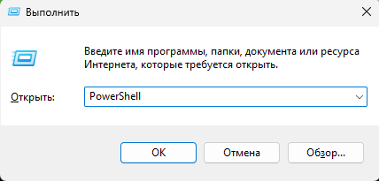
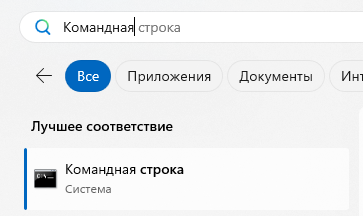
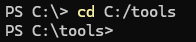
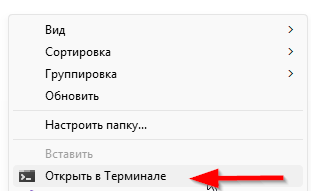
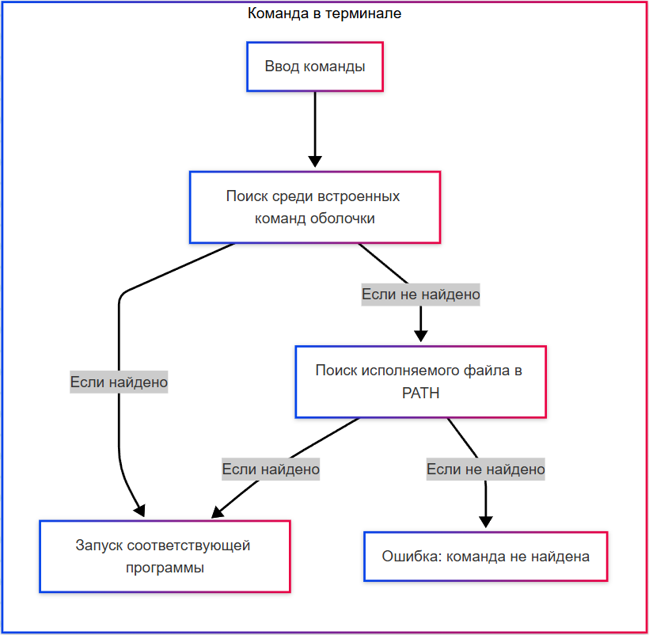

---
title: 2.05. Терминал
---

# 2.05. Терминал

## Что такое консоль?

★ **Консоль (CLI)** – интерфейс командной строки для взаимодействия с операционной системой или приложениями. В Windows и Linux они отличаются, но смысл тот же.

CLI предоставляет возможности:
	- напрямую отправлять инструкции системе в виде текстовых команд;
	- получать мгновенную обратную связь от системы — вывод результатов, ошибок, информаци;
	- возможность запуска любых исполняемых файлов, утилит, скриптов и сервисов;
	- управлять параметрами запуска, окружением, приоритетами;
	- получать доступ к текущему состоянию: информация о процессах, сетевых соединениях, загруженности ресурсов;
	- изменять состояние: запуск/остановка служб, изменение конфигураций, перезагрузка;
	- навигация по структуре каталогов, просмотр содержимого, создание, удаление, перемещение файлов;
	- управление правами доступа, атрибутами, метаданными;
	- проверки соединений, прослушивания портов, передачи данных между машинами;
	- управление окружением, настройкой временных и постоянных параметров работы программы или системы.

Командная строка работает из следующих компонентов:
	- Оболочка – интерпретирует введенные пользователем команды и передает ядру;
	- Ядро ОС (Kernel) – выполняет операции.

Команды вводятся вручную или запускаются из скриптов. 

**Скрипт** – это набор команд, собранных и сохранённых в исполняемый файл. Скрипт можно отредактировать в текстовом редакторе, но запуск скрипта – это выполнение команд из кода.

Синтаксис командных строк прост:
	- команда опции аргументы
	- допустим «`ipconfig /all`».
	
Допустим, можно разово выполнить команду копирования нужного файла, и архивацию этой копии. Это будет разовое выполнение команды. А можно сделать скрипт, который будет содержать в себе команды копирования и архивации. Тогда, для выполнения этой задачи, не придется набирать команду – достаточно будет просто запустить скрипт. Потом такой скрипт можно поставить в автозапуск в планировщике задач и таким образом организовать автоматический запуск скрипта по копированию и архивации – в основном, так автоматический бэкап и делают.

В скриптах часто можно встретить команду `echo` – команда, которая выводит текст или значение переменных в терминал/файл. Допустим `echo Привет, мир!`

★ В **Windows** командная строка имеет три итерации:
	- *CMD (Command Prompt)* – запускается через Win+R → cmd – это файл cmd.exe. Скрипты этой оболочки в формате .bat;
	- *PowerShell* – более мощная альтернатива CMD, скрипты этой оболочки в формате .ps1;
	- *Windows Terminal* – современная оболочка, поддерживает вкладки, темы, CMD и PowerShell.
	
★ В **Linux** командная строка – shell, имеет тоже три итерации:
	- *Bash (Bourne Again Shell)* – стандартная оболочка, скрипты этой оболочки в формате .sh;
	- *Zsh (Z Shell)* - улучшенный Bash;
	- *Fish (Friendly Interactive Shell)* – более интуитивный синтаксис.

## Как запустить командную строку?

```
Практическое задание
Попробуйте запустить командную строку одним из нижеперечисленных способов.
Попробуйте запустить командную строку от имени администратора.
```

Любой администратор или разработчик должен уметь пользоваться командной строкой. Важно знать текстовый интерфейс, взаимодействовать с операционной системой через ввод текстовых команд.

Командную строку можно запустить первично, или в конкретной директории.

★ **Запуск в Windows**:

`Пуск - Выполнить - cmd.exe` либо `Пуск - выполнить - PowerShell`:




Но при этом будет стандартный запуск, без прав администратора. Зачастую многие действия вроде конфигураций и установок, требуют именно админских полномочий, поэтому лучше прямо запустить от имени администратора, либо открыв файл утилиты, либо через поиск, к примеру, в Windows 11 можно написать «Командная строка» и выбрать способ:




Это важно. Если в инструкции к какой-то утилите указано именно запустить от имени администратора - ровно так и нужно запустить, иначе не получится.

Но простейший способ:

Правой кнопкой мыши по значку «`Пуск`» - «`Windows PowerShell (администратор)`», «`Командная строка (администратор)`» или «`Терминал (администратор)`».

★ В **Linux**, терминал запускается с графического интерфейса через запуск на панели задач, или через сочетание клавиш:
	- ввести «Терминал» в поиске;
	- Ctrl+Alt+T;
	- выбрать терминал из меню приложений:


Однако, это стандартный запуск. Он используется для каких-то общих и базовых команд. Но если нужно работать с определенными файлами в каталоге, то нужно перейти в директорию. Это можно сделать несколькими способами, во всех ОС:

	- если уже запустили командную строку - перейти в нужную директорию через команду `cd <путь>` - `cd` это Change Directory:



	- или изначально запустить в нужной папке:
	



Так мы будем работать с конкретным каталогом.

## Основные принципы работы

★ **Команда** - ключевое слово, которое указывает системе, что делать, например ls в Linux показывает содержимое текущей директории.

★ **Аргументы** - дополнительные параметры, которые передаются команде. Например, ls -l выводит содержимое директории в виде списка.

★ **Переменные окружения** - специальные настройки, которые определяют, где система будет искать исполняемые файлы (например, переменная PATH).

**Ключевые слова-команды** включены по умолчанию в состав операционной системы, но только в базовой части - системные утилиты. Это программы, которые позволяют выполнять базовые задачи, такие как работа с файлами, управление процессами, настройка сети, управление пакетами.

★ **Системные утилиты** использовать легко - достаточно просто ввести в командной строке нужное ключевое слово, к примеру, та же cd для перехода в нужную директорию.

★ **Сторонние утилиты** – это программы, которые не входят в состав ОС по умолчанию. Их нужно устанавливать дополнительно (с сайта вручную или через менеджер, вроде PowerShell, Chocolatey или apt). После установки они могут быть использованы через командную строку, если правильно настроены переменные окружения.

Как использовать сторонние утилиты?
	- установка - через менеджер пакетов или вручную;
	- настройка переменных окружения - добавление пути к исполняемому файлу утилиты в переменную PATH;
	- использование - вызов утилиты через командную строку.

Если хотите погрузиться в искусство командной строки, есть интересные статьи в интернете, например вот тут:
https://github.com/jlevy/the-art-of-command-line/blob/master/README-ru.md

Давайте рассмотрим на примере самых важных для разработчиков - Git, Docker и Java. Это, конечно, мы будем подробно разбирать позже, но нам сейчас нужно понять, как работает это всё. В нашем случае – это сторонние утилиты, которые можно установить через пакеты, допустим Chocolatey на Windows и apt на Linux. Для Git и Docker достаточно просто установить и уже можно использовать. А для Java требуется настройка переменных окружения.
1. ★ **Git**

установка:
	- Linux - `sudo apt install git`
	- Windows - `choco install git `
	
использование:
	- Инициализировать репозиторий - `git init`
	- Клонировать репозиторий - `git clone <url>`
	
2. ★ **Docker**

установка:
	- Linux - `sudo apt install docker.io`
	- Windows - `choco install docker-desktop`

использование:
	- Показать запущенные контейнеры - `docker ps`
	- Запустить тестовый контейнер - `docker run hello-world`
	
3. ★ **Java (JDK)**

установка:
	- Linux - `sudo apt install default-jdk`
	- Windows - `choco install jdk8`
	
настройка переменной `JAVA_HOME`:
	- Linux - `export JAVA_HOME=/usr/lib/jvm/default-java`
	- Windows - `set JAVA_HOME=C:\Program Files\Java\jdk1.8`
	
использование:
	- Проверить версию Java - `java -version`
	- Скомпилировать Java-файл - `javac file.java`
	
Когда мы вводим команду в терминале, система выполняет следующие шаги:
	- поиск команды - проверка, есть ли команда среди встроенных команд оболочки;
	- если не найдено - ищет исполняемый файл в директориях, перечисленных в переменной PATH;
	- если найдено - система запускает соответствующую программу;
	- если команда всё же не найдена - получим ошибку.



## Основные команды

### Linux: Важнейшие команды командной строки 

| Команда | Назначение |
| :--- | :---: |
|ls	|Список файлов
|cd	|Переход по папкам
|pwd	|Показать текущую директорию
|mkdir	|Создать папку
|rm	|Удалить файл или папку
|cp	|Копировать файлы
|mv	|Переместить или переименовать
|cat	|Просмотреть содержимое файла
|nano, vim	|Редактирование файлов
|grep	|Поиск по тексту
|chmod	|Изменить права доступа
|chown	|Изменить владельца
|df	|Состояние диска
|du	|Размер папок
|top, htop	|Мониторинг процессов
|ps	|Список процессов
|kill	|Остановка процесса
|ping	|Проверить соединение с хостом
|curl, wget	|Сетевые команды
|shutdown	|Выключение системы
|reboot	|Перезагрузка системы
|env, printenv, echo $VAR	|Просмотр переменных окружения
|export VAR=value	|Установить переменную окружения
|history	|Посмотреть историю введённых команд
|man команда	|Получить справку по команде
|which, locate, find	|Поиск файлов и программ
|alias, unalias	|Создать/удалить псевдоним для команды
|tar, zip, unzip	|Архивация и распаковка файлов
|apt, dnf, pacman, snap, flatpak	|Установка и удаление программ
|sudo	|Выполнить команду от имени root
|su	|Переключиться на другого пользователя
|clear	|Очистить терминал
|touch	|Создать пустой файл
|ln	|Создать символическую или жёсткую ссылку
|date, timedatectl	|Показать или изменить дату и время
|whoami	|Показать имя текущего пользователя
|id	|Показать ID пользователя и группы
|groups	|Показать группы, в которых состоит пользователь
|passwd	|Изменить пароль
|systemctl	|Управление службами (включить/отключить/перезапустить)
|journalctl	|Просмотр логов системы (на systemd)

### Windows: Важнейшие команды командной строки

| Команда в CMD | Команда в PowerShell | Назначение |
| :--- | :---: | ---: |
|dir	|Get-ChildItem	|Список файлов и папок
|cd	|Set-Location	|Перейти в другую директорию
|cd	|Get-Location	|Показать текущую директорию
|md, mkdir	|New-Item -ItemType Directory	|Создать директорию
|rd /s /q	|Remove-Item -Recurse -Force	|Удалить папку рекурсивно
|copy	|Copy-Item	|Копировать файлы
|move	|Move-Item	|Переместить файлы
|type	|Get-Content	|Прочитать содержимое файла
|findstr "text" file.txt	|Select-String "text" file.txt	|Искать текст в файле
|—	|icacls file.txt /grant user:F	|Изменить права доступа
|wmic logicaldisk get size,freespace,caption	|Get-PSDrive	|Показать информацию о дисках
|tasklist	|Get-Process	|Список активных процессов
|taskkill /PID PID /F	|Stop-Process -Id PID	|Остановить процесс
|ping google.com	|Test-Connection google.com	|Проверить связь с сервером
|curl https://example.com	|Invoke-WebRequest https://example.com	|Загрузить данные
|bitsadmin /transfer job /download /priority normal https://example.com/file.txt  C:\file.txt	|Invoke-WebRequest https://example.com/file.txt  -OutFile file.txt	|Скачать файл
|shutdown /s /t 0	|Stop-Computer	|Выключить компьютер
|shutdown /r /t 0	|Restart-Computer	|Перезагрузить компьютер
|set	|Get-ChildItem Env:	|Показать переменные окружения
|set MY_VAR=123	|$env:MY_VAR = "123"	|Установить переменную окружения
|doskey /history	|Get-History	|Показать историю команд
|—	|Get-Help Get-ChildItem	|Получить помощь по команде
|dir /s *.txt	|Get-ChildItem -Recurse *.txt	|Поиск файлов
|cls	|Clear-Host	|Очистить терминал
|type nul > file.txt	|New-Item file.txt	|Создать пустой файл
|mklink link source	|New-Item -ItemType SymbolicLink -Path "link" -Target "source"	|Создать символическую ссылку
|—	|Expand-Archive archive.zip -DestinationPath .	|Распаковать архив
|—	|winget install package, Install-Package	|Установить программу
|—	|Start-Process cmd -Verb RunAs	|Выполнить от администратора
|whoami	|whoami	|Показать имя текущего пользователя
|net user %username%	|—	|Показать группы пользователя
|net start service	|Start-Service service	|Запустить службу
|eventvwr	|Get-EventLog -LogName System	|Просмотр логов системы
|date	|Get-Date	|Показать текущую дату и время

Чит-лист PowerShell - https://cheatsheets.zip/powershell

```
Практическое задание
Потренируйтесь с командной строкой - выполняйте любые команды.
Попробуйте выключить компьютер через консоль.
```
