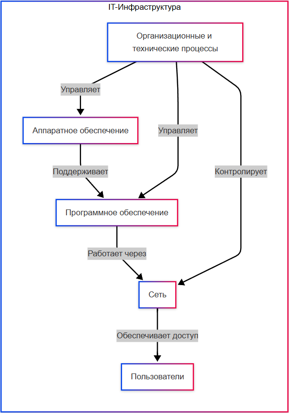
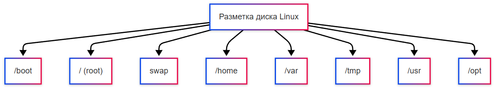

---
title: 2.06. Системное администрирование
---

# 2.06. Системное администрирование

```
Внимание! 
Приготовьтесь!
Страшные слова	
Системное администрирование – узкая специализация. Если вам не интересно, можете не углубляться слишком и вернуться при необходимости.
```

## Администрирование

★ **Администрирование** – управление системой, сетью или сервисом, включающее настройку, обслуживание, контроль доступа и обеспечение стабильной работы. Администрирование может относиться к управлению базами данных, облачными сервисами, или корпоративными сервисами (к примеру, ERP или Active Directory).

★ **Администратор (Admin)** – человек, который управляет доступом, настройками и работой системы. В его обязанности входит настройка прав доступа, контроль безопасности, устранение неполадок, обновление и обслуживание. Примеры:
	- сетевой администратор, настраивает маршрутизаторы, сеть, VPN, Wi-Fi;
	- администратор БД – управляет базами данных и СУБД;
	- системный администратор – работает с серверами, ОС и инфраструктурой.
	
★ **Пользователь (User)** – человек (или программа), который взаимодействуюет с системой в рамках предоставленных прав. Типы пользователей:
	- Обычный пользователь – обладает базовыми правами (работа с файлами, запуск программы, чтение данных или изменение данных);
	- Привилегированный пользователь – обладает расширенными правами, может настраивать систему, но не имеет полного доступа;
	- Администратор – имеет полный контроль (да, админ – тип юзера).

Права, их объем и особенности, являются для каждой системы и организации специфическими, согласно ролевой модели (Role-Based Access Control, RBAC). Примеры набора прав:
	- Чтение (Read only) – только просмотр данных;
	- Редактирование (Edit) – чтение и изменение;
	- Полный доступ – чтение, изменение и удаление.

★ **Права доступа** – это набор правил, определяющих, какие действия пользователь или программа могут выполнять в системе. Они реализуются через механизмы контроля доступа и включают операции (чтение, запись, удаление), объекты (файлы, базы данных, настройки) и условия (время доступа, IP-адрес).

Права доступа нужны для безопасности (защиты от несанкционированных действий), минимизации рисков (ограничение ошибок пользователей), соответствия требованиям (законов и корпоративных политик), и конечно аудита (логирования действий для расследования инцидентов). Причём, директора и руководители, как правило, не становятся администраторами, так как не вникают в технические тонкости, так что администратором является специально выделенный сотрудник.

Однако, важно отметить, что права назначаются не всегда конкретным пользователям, они могут быть назначены ролям (группам пользователей). К примеру, пользователь = бухгалтер, отдел бухгалтерии = роль «финансы».

**Ролевая модель** — это концепция, используемая в системах управления доступом (например, в информационных системах, программах или организациях), которая позволяет определять права и обязанности пользователей на основе их ролей. Вместо того чтобы назначать права каждому пользователю индивидуально, система группирует пользователей по ролям, а затем назначает права и ограничения для каждой роли. Обычно выделяют три роли - «Администратор» (полный доступ к системе), «Пользователь» и «Гость».

**Формирование ролевой модели** — это процесс анализа требований системы и определения ролей, которые будут использоваться для управления доступом. Обычно этим занимаются специальные люди, специалисты по информационной безопасности или руководство, однако такая задача может быть возложена и на системного администратора.

Первое, что нужно сделать - сгруппировать пользователей по их обязанностям и уровням доступа, и каждой группе присвоить уникальную роль. Затем нужно определить, какие действие выполняет каждая группа (создание, чтение, обновление, удаление) и с какими данными она работает. Самое главное - убедиться, что пользователи могут выполнять свои задачи, не нарушая безопасность системы.

**Группы пользователей** — это логические объединения пользователей, которые имеют общие характеристики или выполняют схожие задачи. Группы часто используются для упрощения управления доступом в системах, где много пользователей.

Это процесс администрирования в части прав и доступа. Кроме этого, есть и необходимость выполнения настроек и определения конфигураций. И в части этого есть такое направление, как системное администрирование.

★ **Системное администрирование** – поддержка компьютерных систем, серверов, сетей или программного обеспечения. 

★ **Системный администратор** – специалист, который обеспечивает работу IT-инфраструктуры: серверов, сетей, ОС и ПО. В его задачи входит:
	- установка, настройка, обновление ОС;
	- управление пользователями и группой;
	- мониторинг ресурсов и оптимизация системы;
	- развёртывание серверов (веб, почта, файловые);
	- настройка виртуальных машин;
	- резервное копирование и аварийное восстановление;
	- установка и обновление программ;
	- лицензирование;
	- настройка сетевой инфраструктуры – DNS, DHCP, VPN;
	- контроль трафика и безопасности (фаерволы).

## Установка операционной системы

```
Внимание! 
Приготовьтесь!
Страшные слова	
Если вы не планируете переустанавливать систему, или разбираться в том, как это работает – можете лишь пробежаться и вернуться к этому разделу позднее, по мере необходимости.
```

★ **Подготовка перед установкой**

1. Скачать образ ОС – дистрибутив, содержащий в себе установщик ОС:
	- Windows – через Media Creation Tool;
	- Linux – через соответствующие дистрибутивы (Ubuntu, Fedora, Mint и тд).
	
На этом шаге важно понять, что установка ОС – это не просто скачивание пакета и запуск, но и подготовка установочных материалов. Тут важно выбрать ОС, оболочку (вариацию) и скачать. Для Windows важно обзавестись лицензионным ключом.

2. Создать загрузочную флешку:
	- Rufus (Windows) или BalenaEtcher на других платформах;
	- размер флешки – от 4 ГБ на Linux, от 8 ГБ для Windows.
	
Поскольку установка ОС подразумевает очистку старой ОС, производится она со стороннего устройства, поэтому нужно подготовить ISO или иной формат образа, который нужно монтировать на переносное USB-устройство.

Загрузочная флешка представляет собой готовый портативный набор инструментов, который вставляется в целевой компьютер, и автоматически запускает программу установки через BIOS.

Сейчас у Windows есть возможность обновить систему без внешнего устройства, но обновление – это сохранение всех параметров, файлов и настроек, что не всегда даст результаты, которые ожидаются от переустановки.

Установка первичная позволяет очистить (форматировать) данные и установить систему «с нуля», тогда как переустановка может производиться поверх существующей ОС.

Важно также учесть, что нужно выбрать и тип таблицы разделов при установке.

Как мы ранее изучили, есть MBR и GPT. Какой выбрать?

	- Если компьютер использует BIOS, размер диска меньше 2 ТБ и нужна совместимость со старыми системами - MBR.
	- Если UEFI, размер диска больше 2 ТБ и нужны современные функции - GPT.
	
3. Сделать бэкап данных, если идёт переустановка.

Бэкап – это создание резервной копии всех файлов и программ, которые понадобятся. Система будет очищать хранилище, поэтому, чтобы не потерять, всегда нужно сохранить важные данные на внешних устройствах или в облаке.

4. Освободить место на диске, куда будет устанавливаться ОС, желательно 100+ ГБ.

ОС – это набор софта, который будет установлен на ПК, и современные системы требуют много места, поэтому, после бэкапа, нужно будет подготовить пространство для хранения системных файлов.

5. Перезагрузить ПК. Перезагрузка нужна для того, чтобы запустить «загрузчик операционных систем» - BIOS.

★ **Установка**

6. Войти в BIOS/UEFI (клавиша F2/Del/F12);

На каждом устройстве есть свой алгоритм «входа в BIOS», поэтому тут только один вариант – узнать, какая модель материнской платы на устройстве, и как войти в BIOS на нём. Нужно успеть перейти в BIOS до того, как загрузится старая ОС.

7. Выбрать в меню загрузки (Boot Menu) флешку как загрузочное устройство. Обычно это просто раздел Boot, где будут отображены все устройства со свойством «загрузочное» (bootable) – USB, CD/DVD, SSD, HDD. Среди них нужно будет найти свою загрузочную флешку с установщиком ОС.

Обычно имеется порядок загрузки. Когда устройств с ОС несколько, система будет запускаться с первого устройства в приоритете. Поэтому нужно переместить свою флешку в верх очереди (первым пунктом в списке).

8. Перезагрузить ПК – запуск должен начаться с флешки. После того, как мы выбрали флешку как первое загрузочное устройство, если мы правильно установили на неё установщик ОС, то запустится установка.

9. Выбрать язык и раскладку клавиатуры и следовать указаниям установщика. Обычно это простейшие настройки вроде выбора диска для установки, языка, вариации (оболочки), после чего установка происходит автоматически – это распаковка файлов и произведение настроек.

Там же, на этапе установки, производится очистка пространства (при необходимости).

Важно – на Linux лучше сразу ставить английскую раскладку, иначе при запуске не получится ввести имя пользователя и пароль (так может быть, к примеру, на Ubuntu).

10. При установке Windows может возникнуть необходимость удалить старые разделы или объединить их – требуется основной раздел (под файлы и программы, NTFS) и системный раздел (100-500 МБ, для UEFI – FAT32).

11. Запустить и выполнить первичную настройку, установить софт. Рекомендуется убрать лишнюю телеметрию, и проверить настройки учётной записи.

12. Обновить систему, установить необходимые драйверы с сайтов производителя.

Важно: имеется возможность «двойной загрузки», когда можно установить и Windows, и Linux на разных дисках, и при запуске можно будет выбрать, какую ОС запускать.

## Инфраструктура

Инфраструктура в IT — это совокупность взаимосвязанных компонентов, которые обеспечивают функционирование информационных систем и технологий. 
Она включает аппаратное обеспечение (серверы, сетевое оборудование, устройства хранения данных), программное обеспечение (операционные системы, базы данных, приложения), а также организационные и технические процессы, поддерживающие работу этих элементов. 

Инфраструктура может быть как локальной (физически расположенной на территории организации), так и облачной (предоставляемой удалённо через интернет). 

Её основная цель — создать надёжную, масштабируемую и эффективную среду для выполнения бизнес-задач и предоставления услуг пользователям.

Схематично, инфраструктура выглядит так:



В первую очередь, системное администрирование включает в себя управление и настройку внутренней инфраструктуры компании. Представим, что у нас маленький кабинет, в котором есть Windows 10, Windows 7 и Windows Server.

Компания может создать внутреннюю сеть в виде домена или рабочей группы. У такого домена должен быть некий «главный», который именуется контроллер домена – основной сервер, к которому все будут присоединяться.

Физически, схема построения должна быть такой:

```
Сеть → Маршрутизатор → Хост → Гости
```

Маршрутизатор (роутер) обеспечивает возможность создания локальной сети, и фактически, каждый, кто присоединится к роутеру, получает свой уникальный адрес в локальной сети. Допустим, если роутер имеет адрес 192.168.0.1, то все другие будут обладать адресами 192.168.0.100-192.168.0.200. Это будет DHCP-диапазон. Изначально все адреса для подключающихся гостей задаются автоматически из этого перечня. Если выключить DHCP, то каждому устройству в сети придется задать свой адрес.

| Категория устройств | IP-адрес и DHCP-диапазон |
| :--- | :---: |
|Интернет	|внешний IP-адрес
|Маршрутизатор	|192.168.0.1
|Коммутатор	|не имеет IP-адреса, так как служит физической «возможностью» добавить больше узлов к сети
|Сервер (основной сервер организации)	|рекомендуется задать 192.168.0.2 
|Важные устройства (принтеры, сетевые хранилища NAS и другие сервера)	|192.168.0.3-192.168.0.99
|Клиенты и пользователи	|192.168.0.100-192.168.0.200

DHCP работает таким образом, что при подключении нового клиента к сети (физического присоединения), новый клиент получает первый свободный IP-адрес из диапазона. Допустим, Вася Пупкин включил компьютер, присоединился и получил по умолчанию автоматический адрес. В настройках своей сети он увидит, что установлено «получить IP-адрес автоматически», а если попробует получить точное значение – увидит, к примеру, 192.168.0.165. Это будет его внутренний адрес. Если отключить его от сети в этой организации, установить фиксированный IP-адрес и перевезти компьютер в другую, где уже есть клиент с адресом 192.168.0.165, то у Васи Пупкина не будет доступа к сети – так как роутер уже видит, что клиент с адресом использует сеть. В таком случае придется менять адреса. 

Важно отметить, что IP-адреса и диапазоны устройств в каждой организации свои – тут уж как первый сисадмин настроил. При этом нет нужды их всех подключать к роутеру, для промежуточных соединений используются коммутаторы. Таким образом, от маршрутизация идёт цепочка:
```
Маршрутизатор → Коммутатор → Пользователи
```
Узел сети – это часть компьютерной сети, будь то компьютер, телефон, коммутатор, концентратор или даже сам роутер. То есть, иными словами, сеть выглядит так:
```
Узел --- Узел --- Узел --- Узел
```
Причем, компьютеры и сервера тоже могут выступать в качестве коммутатора (свича).

## Настройка сервера

Начать следует с контроллера, то есть, сервера. В нашем примере, это будет компьютер, на котором установлена Windows Server. Нужно выполнить следующие шаги:

1. Авторизоваться от имени администратора.

2. Начать с сетевых настроек:
 
	- если есть необходимость соединяться по IP-адресам (важен стабильный адрес внутри сети) указать статический IP (в нашем случае это 192.168.0.2), маску (255.255.255.0), шлюз (192.168.0.1). DNS-сервер указать 127.0.0.1 или внешний (допустим 8.8.8.8) и настроить DNS-суффикс в настройках сети (допустим ourcabinet.ru).;
	- если нет необходимости привязывать к IP-адресу, то можно оставить его автоматическим, лишь настроить DNS-суффикс в настройках сети (допустим ourcabinet.ru).
	
Указанный IP-адрес будет внутренним для сети, и не повлияет на внешний IP-адрес в Интернете.

3. Придумать и задать имя компьютера (это будет имя сервера, допустим HOSTSERVER). Имена компьютеров должны быть уникальны внутри своей сети.
Имя компьютера можно задать в панели управления, или через командную строку, в PowerShell это будет:

```
Rename-Computer -NewName "HOSTSERVER" -Restart
```

Соединяться можно друг к другу через имена компьютера или по IP-адресам.

4. Установить службы Active Directory (только на Windows) как дополнительные компоненты через панель управления, или через PowerShell:

```
Install-WindowsFeature AD-Domain-Services -IncludeManagementTools
```

5. Повысить компьютер до контроллера домена:
	- придумать имя домена (это будет имя сети, допустим CABINET);
	- настроить имя домена:
		- через панель управления;
		- через PowerShell:
```
Install-ADDSForest -DomainName "CABINET.local" -DomainNetbiosName "CABINET" -InstallDNS
```

	- перезагрузить компьютер (сервер).

Когда задается имя домена в настройках системы, система автоматически считает текущий компьютер частью указанного домена.

6. Создать в Active Directory учетные записи администраторов и пользователей (в нашем случае, это будут пользователи в кабинете). Это будут пользователи домена. Их можно разделить по группам, но важно добавить администратора. У каждого будет свой псевдоним, допустим Ivanov.

7. При необходимости использования общего хранилища – создать на нужном диске каталог (папку) и в свойствах включить общий доступ (указав права чтение и/или запись) для указанных пользователей (из числа созданных). К примеру, назовём её Shared. Путь к ней будет:
```
\\HOSTSERVER\Shared
```
На этом сервер станет готовым к работе. 

## Настройка компьютеров

Потом нужно приступить к настройкам компьютеров, на каждом из них нужно:

1. Авторизоваться от имени администратора.
2. Настроить IP-адрес и DNS-суффикс в настройках сети.
3. Придумать и задать имя компьютера (каждому уникальное).
4. Подключить компьютер к домену (указав имя домена/рабочей группы):
```
Панель управления → Система → Изменить параметры → Изменить → Введите CABINET.local
```
При этом система запросит учетные данные администратора домена.

5. Перезагрузить компьютер и авторизоваться под одним из доменных пользователей (для применения настроек). Авторизация будет по принципу `ДОМЕН\псевдоним@DNS-суффикс`:
```
CABINET\ivanov@ourcabinet.ru
```
6. Если понадобятся другие настройки, требующие прав администратора, то придется перезагрузить компьютер и снова войти от имени администратора, чтобы их сделать. Например, если Иванова нужно сделать администратором компьютера.

Важно понимать – локальный администратор и администратор домена, локальный пользователь и пользователь домена – разные пользователи. 

Пользователь домена может существовать на любом устройстве в сети, а локальный пользователь только на конкретном устройстве.

Если же в нашей ситуации речь идёт о Linux (допустим, Ubuntu Server, Debian, CentOS), то вместо Active Directory можно использовать Samba или FreelPA (есть и другие). Отличие будет в том, что практически всё настроится через консольные команды:
	- назначение статического IP – нужно будет изменить настройки в конфигурационном файле сети, и применить:
```
sudo nano etc/netplan/01-netcfg.yaml 
sudo netplan apply
```
	- установить Samba и зависимости;
	- запустить Samba в режиме AD DC (контроллера домена):
```
sudo samba-tool domain provision --realm=CABINET.LOCAL --domain=CABINET --server-role=dc --dns-backend=SAMBA_INTERNAL --adminpass=SuperSecretPass123
```
	- запустить службы и проверить работу.

При этом, подключаться клиенты будут даже через Windows, лишь подключившись к домену CABINET.LOCAL и введя логин-пароль. Если планируется соединение клиентов с Windows, рекомендуется именно Samba. В FreelPA прямой поддержки Windows нет, да и домен настраивается иначе:
```
sudo ipa-server-install --setup-dns --domain=cabinet.local --realm=CABINET.LOCAL
```

Таким образом, если планируется использовать Windows-машины – устанавливайте на сервер Samba, а если сеть чисто для Linux – FreelPA.

## Сеть и соединения

Никакой сервер не сможет раскрыть свой потенциал без выполнения сетевых настроек. Даже если мы разобрались в том, как создать приложение, без навыков развёртывания, конфигурации серверов, мы не сможем запустить это всё в сети. Какие устройства находятся в сети?
	- компьютеры и серверы – узлы сети;
	- маршрутизаторы (роутеры) – соединяют узлы, направляют трафик;
	- коммутаторы (свитчи) объединяют устройства в локальной сети (LAN);
	- МФУ (многофункциональные устройства) – принтеры, сканеры, копировальные устройства с сетевым интерфейсом.


Для всех участников сети важно предусмотреть наличие автоматического или ручного определения IP-адресов. Для небольшого офиса вполне можно просто создать журнал-таблицу с IP и присвоить каждому устройству в сети свой адрес – по манере 192.168.0.XXX. Для сервера лучше определять статический (постоянный) IP-адрес, и это важно решить с провайдером, так как они используют технологию динамических адресов, выдавая новый адрес при каждом подключении – так, после перезагрузки роутера, внешний IP-адрес изменится. 

**SSH (Secure SHell - безопасная оболочка)** является сетевым протоколом, который позволяет производить удалённое управление ОС и туннелирование TCP-соединений. Он шифрует весь трафик, включая передаваемые пароли. SSH-клиенты и SSH-серверы доступны почти для всех ОС.

**Telnet (TELetype NETwork)** - другой сетевой протокол для реализации текстового терминального интерфейса по сети (сейчас TCP). Также telnet называют и утилиту для клиентской части работы с протоколом.

Этих протоколов так много, что можно и запутаться. Обычно их делят по уровням:
	- Прикладной (уровень приложений, Application Layer) - HTTP, FTP, DNS, SSH, Echo, IMAP, HTTPS, NTP, POP3, RTSTP, SNMP, Telnet, XDMCP и ещё некоторые другие;
	- Транспортный - TCP, UDP - именно они используют порт (число);
	- Сетевой (или межсетевой) - IP;
	- Канальный - физический - Ethernet, WLAN, ATM, и прочие.
	
Есть разные деления протоколов, к примеру, модель OSI и модель TCP/IP - а бывают и «гибридные» деления. Для понимания, можно либо выучить особенности OSI и подходы в технической литературе, либо просто погрузиться в каждый протокол. Здесь уж не пугайтесь - поначалу будет страшно понимать все эти тонкости, но начать нужно с того, с чем работаете, к примеру, HTTP, HTTPS, SSH, IMAP, POP3, FTP, DNS, TCP, UDP, IP. А дальше уже по мере столкновения с технологией.

Для обеспечения сетевой работы сервера, нужно также установить важные компоненты. Для Linux это:
	- SSH-сервер (openssh-server) для удалённого управления;
	- Firewall (ufw/ iptables / firewalld) – защита от нежелательного трафика;
	- Мониторинг (htop, nmon, netdata) – контроль нагрузки;
	- Логирование (rsyslog, journald) – запись событий.

Для Windows:
	- Active Directory (если сервер – доменный контроллер);
	- DNS-сервер (для внутреннего разрешения имён);
	- DHCP-сервер (автоназначение IP);
	- Hyper-V (виртуализация).

Специфические компоненты (зависят от того, что будет на сервере):
	- сервер приложений (IIS в Windows, Nginx/Apache в Linux);
	- прокси-сервер (Nginx, Squid, HAProxy, 3proxy);
	- компоненты для выполняемой среды (Java, .NET);
	- сервер баз данных (СУБД, к примеру, SQL Server, PostgreSQL, MySQL);
	- сервер кеширования (Redis, Memcached);
	- средства мониторинга (Prometheus);
	- средства контейнеризации и оркестрации (Docker, Kubernetes).


Сервер приложений на Windows устанавливается через IIS (Диспетчер IIS), а в Linux – через Nginx/Apache. Это своего рода программная среда для обеспечения бесперебойной работы сайта, путем «включения доступа» и перенаправления трафика на соответствующие папки с сайтом+приложением. Если сервер приложений «упадёт», то и сайт будет недоступен. Словом, это ключевой элемент для веб-составляющей.

DNS-сервер нужен, если локальная сеть с множеством устройств (серверов, принтеров), и нужно разрешать имена типа server.local вместо IP. Вообще, глубокие настройки DNS, CDN, Anycast/Multicast, QoS (приоретизация трафика) выполняет сетевой инженер, а не системный администратор. Как правило, для настроек сети, IP и DNS, админы обращаются к провайдеру – часто они самостоятельно выполняют определённую часть настроек – ибо их задача – дать доступ к сети. Провайдеры предоставляют, как правило, услугу по аренде статического IP.

Важно: если роутер один, а клиентов много, и один из клиентов будет «качать торренты», то он заберёт всю скорость, что сильно урежет производительность сервера. Поэтому, если нужна стабильная и быстрая работа сервера, лучше обеспечить выделенный канал для сервера, наилучшую скорость и, конечно, хороший роутер.

Nginx – мощный веб-сервер и обратный прокси-сервер, который умеет:
	- раздавать сайты (как IIS и Apache);
	- балансировать нагрузку между несколькими серверами;
	- защищать от DDoS и перегрузок;
	- кешировать данные (ускорять загрузку страниц).
	
★ **Балансировщик нагрузки (Load Balancer)** – это диспетчер, который принимает запросы от пользователей, распределяет их между несколькими серверами, и следит, чтобы ни один сервер не перегрузился. Когда пользователь «стучится» на сайт, балансировщик отправляет, на какой сервер отправить запрос, и в случае перегруженности, к примеру, сервера №1, отправит на сервер №2. Это важно, когда пользователей много.

## NAT и проброс портов

В работе используется такое понятие, как проброс портов (port forwarding) – перенаправление внешнего порта роутера на внутренний IP/порт. Это обязательная процедура, когда надо сделать, чтобы сервер из локальной сети был доступен с интернета.

★ NAT (Network Address Translation) – это технология, которая позволяет множеству устройств в локальной сети использовать один публичный IP-адрес для выхода в интернет. Это работает так:
	- роутер имеет публичный IP (от провайдера, например, 95.123.45.67);
	- в локальной сети устройства имеют частные IP (192.168.1.2, 192.168.1.3 и тд);
	- когда устройство отправляет запрос в интернет, роутер подменяет частный IP на свой публичный, запоминает, какой внутренний IP запросил данные, и когда приходит ответ – перенаправляет на нужное устройство.

**Типы NAT**

| Тип NAT | Описание | Примеры |
| :--- | :---: | ---: |
|Full Cone NAT	|Любой из интернета может подключиться к открытому порту.	|Редко, небезопасно
|Restricted Cone NAT	|Только устройства, к которым подключались, могут ответить.	|Домашние роутеры
|Port-Restricted Cone NAT	|Только устройства, к которым подключались, могут ответить, а также проверяется и порт.	|Корпоративные сети
|Symmetric NAT (строгий NAT)	|Для каждого внешнего IP и порта – свой внутренний порт. Сложен для проброса.	|Игровые консоли, VoIP

К примеру, если веб-сервер должен быть доступен в интернете, нужно создать игровой сервер или обеспечить удалённый доступ (RDP, SSH), то требуется выполнить проброс портов. Как сделать проброс портов:

1. Настроить сервер, убедиться, что сервер слушает нужный порт (если нет – настроить, через nginx, к примеру);
2. Открыть веб-интерфейс роутера (192.168.1.1 или 192.168.0.1);
3. В зависимости от модели роутера, найти NAT или переадресацию портов;
4. Добавить правило, указав:
	- внешний порт (к примеру, 8080);
	- внутренний IP (устройства или сервера, к примеру, 192.168.1.100);
	- внутренний порт (порт сервера, допустим 80);
	- протокол TCP/UDP (или оба).
5. Проверить, указав в браузере http://публичный-IP:8080 или через специальную утилиту telnet:
telnet публичный-IP 8080

Важно: определяя порты, не используйте стандартные порты и не открывайте все порты подряд. Помните, что чем больше портов открыто, тем проще пропустить атаку по порту.


## Планирование задач

Представьте, что у вас есть исполняемый файл (скрипт), который каждый день в 8 утра пользователь или администратор запускает вручную - например, для резервного копирования важных файлов или запуска какой-то системы. Каждый раз открывается ярлык на рабочем столе, кликаем по нему и ждём завершения. Это работает, но неэффективно. А если забыть, или не будет возможности нажать? А если таких задач десятки?

Именно для этого и существует планирование задач - автоматическое выполнение программ, скриптов или команд в заданное время или при наступлении определённых условий. Это позволяет:
	- освободить пользователя от рутинных действий;
	- гарантировать регулярность выполнения (например, резервное копирование каждую ночь);
	- оптимизировать использование ресурсов (запускать тяжёлые задачи ночью, когда система простаивает);
	- обеспечить надёжность и предсказуемость поведения системы.
	
Так зачем запускать вручную, если можно автоматизировать?

Автоматический запуск - это выполнение программы без прямого участия пользователя. Например, антивирус сам обновляется, а веб-сервер стартует при включении компьютера.

Планирование задач - это процесс настройки автоматического запуска задач в определённое время или по определённому расписанию.

Планировщик задач - это компонент операционной системы, отвечающий за хранение, управление и выполнение запланированных задач. Он следит за временем, условиями и запускает нужные программы.

Расписание задачи - набор правил, определяющих, когда и при каких условиях задача должна быть выполнена (например «каждый день в 2:00», «при запуске системы», «каждые 10 минут»).

Очередь планировщика задач - внутренняя структура, в которой хранятся запланированные задачи в порядке их приоритета или времени выполнения. Планировщик просматривает очередь и запускает задачи по мере наступления их времени.
 
Планировщик задач - это фоновый процесс (демон в Linux, служба в Windows), которой работает постоянно и следит за временем и событиями. Вот как это происходит в общих чертах:
1. Регистрация задачи. Пользователь или системный администратор добавляет задачу в планировщик, указывая:
	- что запускать (путь к скрипту, программе, исполняемому файлу);
	- когда запускать (время, дата, периодичнось);
	- при каких условиях (при запуске системы, при простое, с правами администратора и т.д.).
2. Хранение расписания. Планировщик сохраняет эту информацию в специальной базе данных или конфигурационном файле.
3. Мониторинг времени. Планировщик периодически проверяет системное время и сравнивает его с расписаниями задач.
4. Запуск задачи. Когда наступает нужное время (или выполняется условие), планировщик запускает указанную программу с заданными параметрами.
5. Логирование. Многие планировщики ведут журнал выполнения - чтобы можно было проверить, успешно ли выполнилась задача, в какое время, были ли ошибки.

Примеры - в Windows используется планировщик заданий (Task Scheduler), в Linux - cron и system timers. Несмотря на различия в реализации, оба подхода решают одну и ту же задачу: автоматизировать выполнение команд по расписанию.

Возможно, вы сталкивались с автозапуском в Windows. Автозапуск - это не планировщик, а частный случай автоматического запуска, который не всегда подчиняется расписанию. Он происходит при других случаях:
	- при входе пользователя в систему (через папку Автозагрузка);
	- при запуске самой ОС (через службы или реестр);
	- при подключении устройства.
	
Ключевое отличие от планировщика задач в том, что автозапуск не позволяет гибко настраивать время (например, каждый понедельник в 7:30), не поддерживает сложные условия, и не ведёт детального лога выполнения.

Планировщик же включает в себя функции автозапуска, но даёт гораздо больше контроля. Например, вы можете настроить задачу «запускать скрипт при входе пользователя в систему», но при этом добавить условия: только если сеть активна, и только если система не на батарейке.

CRON - это утилита в UNIX-подобных системах (Linux, macOS), предназначенная для планирования выполнения команд по расписанию. Название происходит от греческого слова chronos (время). Есть популярный миф, что CRON это аббревиатура Command On Run - но это не так. 😉

CRON работает как фоновый демон (crond), который постоянно запущен и каждую минуту проверяет конфигурационные файлы, чтобы понять, какие задачи нужно выполнить. Каждый пользователь может иметь свой crontab-файл, специальный файл с расписанием задач. Системные задачи могут быть определены в `/etc/crontab` или в папке `/etc/cron.d/`

CRON нужен для автоматического резервного копирования, очистки временных файлов, обновления программ, отправки отчетов по почте, мониторинга системы.

Управляется он при помощи CRON-выражений. Это строка из пяти полей, определяющих, когда должна выполняться команда. Пишутся они подряд, и приблизительно структура такова:
```
1 2 3 4 5 команда
```

| Номер | Поле | Допустимые значения | Пример |
| :--- | :---: | ---: | ---: |
|1	|Минуты	|0–59	|0, 30, */15 (каждые 15 минут)
|2	|Часы	|0–23	|2, 14, */6 (каждые 6 часов)
|3	|День месяца	|1–31	|1, 15, * (каждый день)
|4	|Месяц	|1–12	|1 (январь), 6, *
|5	|День недели	|0–7	|0 или 7 (воскресенье), 1 (понедельник), * (все дни)

Важно: день недели и день месяца связаны логическим ИЛИ, если указаны оба — задача выполнится, если совпадает хотя бы одно условие. Но обычно используют только один из них.

Специальные символы:
	- * — любое значение («каждый»).
	- , — список значений (например, 1,3,5).
	- - — диапазон (например, 9-17 — с 9 до 17).
	- */n — каждые n единиц (например, */5 в минутах — каждые 5 минут).

Допустим, у нас есть скрипт для резервного копирования, который нужно запускать каждый день в 2:30 утра. Скрипт находится по пути: `/home/user/scripts/backup.sh`

Шаг 1: Открываем crontab для редактирования:
```
crontab -e
```
Шаг 2: Добавляем строку:
```
30 2 * * * /home/user/scripts/backup.sh >> /home/user/logs/backup.log 2>&1
```

Здесь мы указали:
	- 30 — минута 30.
	- 2 — час 2 (2:30 утра).
	- * — любой день месяца.
	- * — любой месяц.
	- * — любой день недели.

Команда: запуск скрипта.

`>> /home/user/logs/backup.log` — запись вывода в лог-файл.

`2>&1` — перенаправление ошибок туда же.

## Обработка ошибок

*** В разработке ***

Что такое ошибка

Виды ошибок

Исключения

Вылеты

Зависания

Тормоза

Лаги

Троттлинг, фризинг

Коды ошибок и непонятный набор символов

Коды ошибок в разных языках программирования

Что за 0xКОДОШИБКИ, утилита certutil в CLI и как читать ошибки

*** В разработке ***

## Данные и СУБД

**Сервер БД** требует установки, администрирования, и настройки, поэтому, если на сервере для работы приложений будет использоваться база данных, необходимо определить систему управления базами данных – СУБД – это ПО для создания, хранения и управления базами данных.

**СУБД** предоставляет набор инструментов, позволяющих проектировать БД, работать с таблицами, выполнять запросы, синхронизировать данные и даже выполнять резервное копирование.

СУБД бывают **реляционные** и **нереляционные**. 

**Реляционные**:

| СУБД | Особенности | Применение |
| :--- | :---: | ---: |
|MySQL	|Бесплатный;популярен для веб-решений	|WordPress, веб-сайты, интернет-магазины
|PostgreSQL	|очень мощный; поддерживает GIS/JSON	|сложные аналитические системы;
|MS SQL	|платная; плотная интеграция с Windows; имеет расширение T-SQL	|корпоративные системы на Windows
|Oracle	|считается лидером для корпоративных решений	|Банки и госучреждения

Нереляционные:

| СУБД | Модель данных | Применение |
| :--- | :---: | ---: |
|MongoDB	|Документная (JSON-подобная)	|Каталоги товаров; логи
|Redis	|Ключ-значение (в памяти)	|кеширование; сессии
|Cassandra	|Колоночная	|Big Data (метрики)

Чтобы установить СУБД на сервер, нужно получить инсталляционные файлы с официального сайта и выполнить установку – при этом все компоненты для работы будут готовы к работе. После установки можно запустить и приступить к настройке.

При первоначальной настройке, первое, что нужно сделать – обеспечить администрирование и задать сложный пароль для входа администратора СУБД. В одной СУБД на сервере может быть много баз данных для разных приложений – важно давать доступ только доверенным пользователям. Данные – самая важная часть программ. Представьте, если доступ к базам получит неуполномоченное лицо, а там хранятся, к примеру, персональные данные – гарантированно произойдёт утечка и последствия.

Что важно уметь системному администратору при работе с БД?

1. Установка и развёртывание СУБД;
2. Подключение к СУБД (как правило, просто запускается программа);
3. Создание БД. Создать базу можно двумя способами:
	- создать с нуля и наполнить данными;
	- восстановить из резервной копии (выбирается файл, к примеру, bak, и все данные, содержащиеся в нём, включая название базы, таблиц, и всего содержимого, будут восстановлены автоматически).
4. Создание пользователей и настройка доступа – в каждой СУБД принцип прост – нужно определить, кому будет предоставлен полный доступ (админ), а кому – чтение/изменение. Под полным доступом подразумевается создание таблиц, удаление данных и даже создание пользователей. Будьте внимательны!

СУБД управляется при помощи специальных инструментов, к примеру, у PostgreSQL это pgAdmin – специальный интерфейс администратора, позволяющий выполнить все настройки. Благо, для создания БД и всех настроек – знать языки SQL не нужно. Всё выполняется в интерфейсе.

## Метрика, мониторинг и логирование

Системный администратор обеспечивает стабильность системы. Стабильность – это способность системы:
	- оставаться доступной для пользователей;
	- работать без сбоев (критических ошибок);
	- выдерживать нагрузку;
	- быстро восстанавливаться после инцидентов.

Мониторинг - процесс отслеживания работы системы для обеспечения её стабильности. Для измерения стабильности используются метрики – единицы измерения. Основные метрики:

| Категория | Объект мониторинга | Инструменты |
| :--- | :---: | ---: |
|Железо	|CPU, RAM, диски, сеть	|Prometheus, Zabbix, Netdata
|Сервисы	|Доступность БД, веб-сервера	|Grafana, Nagios
|Бизнес-логика	|Количество заявок, заказов, ошибки	|ELK Stack (Elasticsearch, Kibana)

Данные собираются при помощи:
	- агентов (специальных программ);
	- SNMP (для сетевого оборудования);
	- логов (текстовых записей о событиях).

В случае наступления определённых событий, можно настроить автоматизацию отправки предупреждений – «алертинг», к примеру, настроив в Prometheus отправку на электронную почту.

Помимо нагрузки, важно фиксировать, кто, что и когда делал. Допустим, что делали пользователи, как себя вела программа, или в какое время возникла ошибка. Эта фиксация осуществляется в логах (от английского log – журнал). Представьте, что у вас есть персональный секретарь, который записывает всё, что происходит – это логгер.

Логирование – процесс записи и детализации событий. Логи бывают следующих типов:
	- системные логи (содержат сведения об ОС, драйверах);
	- логи приложений (ошибки сервера, к примеру);
	- логи аудита (попытки входа, авторизации, SSH, sudo).

Но работать с массивами логов удобнее при помощи инструментов, допустим, Grafana Loki для агрегации логов.

Пример, как с этим работать:
	- разворачиваете ПО на сервере и устанавливаете все компоненты;
	- устанавливаете системы мониторинга и логирования;
	- запускаете систему и ПО;
	- возникла проблема – сервер «лёг» или диск заполнен;
	- в первую очередь проверяем логи и изучаем, что произошло;
	- определяем временной промежуток, собираём всё, что нужно;
	- исправляем проблемы и мониторим работу системы.

## Работа с Linux

Linux включает в себя ядро, среду рабочего стола, пакетный менеджер, предуставленное ПО.

Официальный сайт с документацией по ядру - https://www.kernel.org/

В Lunix, «bash» – это командный интерпретатор, а gcc - компилятор. Почти всё остальное - определённые программы, которые можно вызвать через командную строку, используя тот самый bash.

### Дистрибутивы и оболочки

Ubuntu - один из самых популярных дистрибутивов, основанный на Debian. Активно развивается Canonical. Пакетный менеджер: APT (apt, apt-get). По умолчанию нет пароля root, используется sudo. Широко применяется как на десктопах, так и в серверных средах, а также в образовательных целях.

Debian - стабильный, проверенный временем дистрибутив, разрабатываемый сообществом. Считается фундаментом для множества других систем. Пакетный менеджер: APT (apt, aptitude, dpkg). Требует ручной настройки прав суперпользователя: можно использовать su или настроить sudo. Подходит для опытных пользователей и серверных установок.

Arch Linux - дистрибутив, ориентированный на опытных пользователей. Система строится самим пользователем. Пакетный менеджер: Pacman. Нет sudo по умолчанию, но его можно установить и настроить. Минимальная система позволяет глубоко настраивать каждую часть ОС.

Lindows (Linspire) - коммерческий дистрибутив, ориентированный на простоту использования для новичков. Основан на Debian. Использует .deb пакеты и APT как пакетный менеджер. В интерфейсе предполагается минимальное взаимодействие с терминалом, но при необходимости доступны стандартные команды, включая sudo.

Linux Mint - дистрибутив, созданный как удобная замена Windows на десктопе. Основан на Ubuntu (или иногда на Debian). Пакетный менеджер: APT. Предустановленный sudo, используется активно в терминале. Дружелюбный интерфейс, хорош для начинающих, но не ограничивает продвинутых пользователей.

Fedora разрабатывается сообществом Red Hat, служит тестовой платформой для будущих технологий RHEL. Пакетный менеджер: DNF. Используется sudo или su для выполнения привилегированных команд. Часто выбирается разработчиками и теми, кто следит за новыми возможностями ядра и ПО.

openSUSE существует в двух версиях: Leap (стабильная) и Tumbleweed (rolling release). Разрабатывается SUSE. Пакетный менеджер: Zypper и RPM. Управление через терминал возможно с использованием sudo или su. Подходит как для десктопа, так и для сервера, имеет мощные инструменты настройки.

Kali - дистрибутив, предназначенный для тестирования на проникновение и цифровой форензики. Основан на Debian. Пакетный менеджер: APT. По умолчанию использует root-пользователя, но может быть настроен под sudo. Содержит большое количество предустановленных инструментов безопасности.

Mandriva - дистрибутив, разработанный во Франции, позиционировался как удобный для пользователей Windows, переходящих на Linux. Сейчас почти не используется. Пакетный менеджер: RPM + urpmi (в прошлом), затем перешёл на DNF в более новых версиях. Команды в терминале требуют su или sudo, в зависимости от настройки системы.

Mageia - форк Mandriva, поддерживающий те же принципы, но развиваемый сообществом. Пакетный менеджер: DNF (в новых версиях), ранее — urpmi. Работа в терминале предполагает использование su или sudo. Хорош как для домашнего использования, так и для офисных задач.

Pop!_OS - hазработан компанией System76, основан на Ubuntu. Создан с учётом потребностей разработчиков и пользователей оборудования System76. Пакетный менеджер: APT. Использует sudo аналогично Ubuntu. Имеет специальные версии с поддержкой NVIDIA GPU и оптимизациями под рабочие станции.

Manjaro - упрощённая версия Arch Linux, подходящая для более широкого круга пользователей. Пакетный менеджер: Pacman. Использует sudo по умолчанию. Обеспечивает стабильность благодаря тестированию пакетов перед выпуском.

elementary OS - дизайн-ориентированный дистрибутив, вдохновлённый macOS. Основан на Ubuntu. Пакетный менеджер: APT. Использует sudo в терминале. Подходит для пользователей, ценящих эстетику и простоту интерфейса.

Zorin OS - дистрибутив, созданный для тех, кто переходит с Windows. Интерфейс напоминает Windows 10/11. Пакетный менеджер: APT. Полагается на sudo для администрирования. Нацелен на максимальную совместимость с Windows-подобным UX.

Astra Linux - ОС на основе Linux, разработанная для использования в государственных структурах Российской Федерации. Создана с акцентом на информационную безопасность и соответствие требованиям российского законодательства. Используется в том числе в военных и бюджетных организациях. Включает модули доверенной загрузки, усиленный контроль доступа и поддержку отечественных стандартов шифрования. Существует несколько версий — "Орёл", "Смоленск" и другие, ориентированные на разные уровни защищённости. Пакетный менеджер - APT (apt, apt-get). Работа в терминале возможна через обычного пользователя с использованием sudo или напрямую через root. Настройки ограничений зависят от уровня безопасности системы.

ALT Linux - дистрибутив, разрабатываемый российской компанией «Альт Линукс», предназначенный для широкого круга пользователей — от домашних до корпоративных. Содержит локализованные компоненты и поддерживает русский язык "из коробки". Активно используется в образовательных учреждениях и бюджетном секторе РФ. Основан на Sisyphus (пакетное дерево собственной сборки). Включает коммерческие и community-версии. Наличие преднастроенных решений для школ, университетов и офисов. Пакетный менеджер - RPM + apt-rpm или urpmi. Поддерживает как su, так и sudo. По умолчанию может быть настроен на использование root-аккаунта, особенно в серверных установках.

ОС «ЭЛАЙ» - разработка компании «Ростелеком-Солар», созданная как замена Windows для перехода на отечественные ОС в госструктурах. Базируется на Astra Linux, адаптирована под современные задачи администрирования и работы с офисными приложениями. Ориентирована на массовое внедрение в государственных учреждениях. Поддерживает работу с электронной подписью, документами формата PDF/A, содержит интеграцию с сервисами Госуслуг. Пакетный менеджер - APT. Как и в Astra Linux, возможны оба варианта: sudo или su. Конкретная настройка зависит от политики безопасности конкретной организации.

SteamOS - специализированный дистрибутив Linux, созданный компанией Valve для запуска игр и работы с платформой Steam. Оптимизирован под игровые задачи, включает специальную версию интерфейса Big Picture Mode. Может работать как полноценная ОС на игровых приставках Steam Machine или ПК. Может запускаться как основная ОС или в виде загрузочного окружения поверх другой системы. Интегрирован с библиотекой Steam, имеет поддержку Proton для запуска Windows-игр. Пакетный менеджер - APT — поскольку основан на Debian. Предоставляет доступ к терминалу, где можно использовать sudo. Для большинства пользователей интерфейс скрыт, но опытные могут модифицировать систему как обычный Linux.

### Особенности работы с Linux

1. ★ Установку ОС ранее мы уже рассмотрели – она включает выбор дистрибутива, создание загрузочной флешки, загрузка с USB/CD/DVD, настройка разделов диска (partitions), установка системы, перезагрузка.

При выборе дистрибутива следует в первую очередь руководствоваться требованиями к безопасности - для сервера нужны специальные оболочки, а в случае, если будет хранение и обработка персональных данных, лучше устанавливать сертифицированные, к примеру, Astra Linux. Но познакомиться стоит с Fedora, CenOS, Ubuntu и Debian.

Для знакомства рекомендую Ubuntu последней версии.

В старых версиях (к примеру, 9) используется очень мало ресурсов, и они подойдут для установки на старые компьютеры с ограниченными возможностями, однако некоторые вещи там работают по-другому. К примеру, в старых версиях нет sudo, но есть admin, нет apt, но есть apt-get.

В самом процессе установки всё так же:
	- скачать дистрибутив и подготовить ISO-файл;
	- создать загрузочный носитель (через Rufus);
	- при формировании загрузочного носителя выбрать MBR схему раздела, файловую систему FAT32, размер кластера - 4096;
	- подключить носитель к целевому компьютеру, перезагрузить;
	- войти в BIOS, выбрать загрузочный носитель как Boot-устройство;
	- сохранить настройки BIOS и перезагрузить.

В самом начале, при запуске, будет открыто меню загрузчика ОС - GRUB. В зависимости от оболочки, может быть и графический интерфейс (допустим, установщик Astra Linux откроет специальное меню загрузчика).

Какие проблемы могут возникнуть на этапе установки?

В первую очередь, можно столкнуться с «кривым» образом или несоответствием системным требованиям. Как бы ни казалось, что Linux «легче», но если установка идёт на слабую машину (4 ГБ ОЗУ и меньше), то если ставить свежую версию, допустим последнюю Ubuntu, то возникнуть проблемы. Поэтому для слабых компьютеров, лучше взять старые версии дистрибутивов, к примеру, Ubuntu 9.

Второе - разметка диска. На жестком диске не должно быть разделов от других ОС - в идеале, лучше форматировать.

Раздел диска – это логическая часть физического жесткого диска, которая может быть использована независимо от других частей диска. То есть, физически диск один, логически - их несколько, потому это именуется разделом. Такие разделы создаются с помощью инструментов разметки дисков (например, fdisk, gparted, parted) и позволяют организовать данные на диске более эффективно. Каждый раздел может быть отформатирован под определённую файловую систему (например, ext4, btrfs, xfs, vfat), а затем смонтирован в определённую точку монтирования (/, /home, /boot).

Точка монтирования – это каталог в дереве файловой системы Linux, куда привязывается (монтируется) раздел диска. Например, раздел с файловой системой ext4 можно смонтировать в корневой каталог /, другой раздел можно смонтировать в /home, чтобы хранить пользовательские данные. Так, /home может быть как просто папкой внутри корневой файловой системы, так и разделом диска. Это зависит от разметки диска.

Разметка включает в себя разделение диска на несколько разделов для изолирования данных, безопасности, гибкости и оптимизации производительности. Пример типичной разметки диска:

Обязательные:
	- / (корневой раздел) - основной раздел для ОС, программ, конфигурации;
	- swap (раздел подкачки) - для расширения ОЗУ, когда её недостаточно.

Рекомендуемые:
	- /boot - загрузочные файлы ядра и конфигурация загрузчика;
	- /home - пользовательские данные;
	- /var - переменные данные (логи, кэши, базы данных);
	- /tmp - временные файлы;
	- /usr - программы и библиотеки, установленные системой;
	- /opt - дополнительное ПО.



Пример, как распределить место:
	- /boot - 1 ГБ;
	- / - 20-50 ГБ (в зависимости от оболочки);
	- swap - не менее, чем размер ОЗУ;
	- /home - всё остальное место.

Но, можно доверить разметку и сделать её автоматически (установщик ОС самостоятельно разметит и разделит по умолчанию).

Ручная разметка представляет собой процесс создания разделов, выделения размеров и использование меток томов.

2. ★ Оболочка (shell) – интерфейс между пользователем и ядром. Она позволяет управлять системой через командную строку. Наиболее популярные оболочки – bash, zsh, fish, dash, tcsh / csh. Оболочку можно изменить.


3. ★ Установка пароля и администрирование Linux.

В Linux есть два уровня доступа:
	- обычный пользователь;
	- root (администратор).

Установка пароля root:
```
sudo passwd root
```

В некоторых дистрибутивах, например, Ubuntu, root отключен по умолчанию. Это сделано в целях безопасности, поэтому создаётся специальный администратор, которому разрешено выполнять команду sudo для получения максимальных полномочий.

Почему убрали root? Потому что злоумышленник уже знает, как зовут «максимального» пользователя, и ему останется лишь подобрать пароль.

Поэтому нужно создать своего пользователя, добавить ему пароль и поместить в группу sudo - максимальные полномочия. Тогда через sudo часть функций будет недоступна, а злоумышленнику придётся выяснить и имя пользователя.

Создание нового пользователя:
```
sudo adduser username
```

Добавление пользователя в группу sudo:
```
sudo usermod -aG sudo username
```

В дальнейшем, при запуске придется авторизоваться. При вводе пароля через консоль, он не отображается, поэтому не стоит пугаться. 

4. ★ Вход в консоль Linux может быть выполнить через графическую оболочку (GUI) или текстовый терминал (CLI). Для переключения между GUI и CLI можно использовать горячие клавиши:

	- Ctrl+Alt+F1…F6 – вход в TTY (текстовую консоль);
	- Ctrl+Alt+F7 или F2 – обратно в графическую оболочку.

5. ★ Установка программ на Linux.

Вместо setup.exe, Linux использует пакетные менеджеры.

Типы пакетных форматов:

| Формат | Используется в |
| :--- | :---: |
|.deb	|Debian, Ubuntu
|.rpm	|Red Hat, CentOS, Fedora
|.pkg.tar.zst	|Arch Linux
|.flatpak	|Flatpak
|.snap	|Snapcraft (Ubuntu)

Популярные пакетные менеджеры:

| Команда | Используется в |
| :--- | :---: |
|apt, apt-get	|Debian/Ubuntu
|dnf, yum	|RHEL/Fedora
|pacman	|Arch Linux
|zypper	|openSUSE

Примеры:
```
sudo apt update && sudo apt install firefox
sudo pacman -Syu vlc
sudo dnf install libreoffice
```

Альтернативы:
	- Flatpak – кроссплатформенный магазин;
	- Snap – от Canonical, работает почти везде;
	- AppImage – самодостаточные исполняемые файлы.
	
6. ★ Файловая система Linux отличается от Windows.

Стандартная структура:

| Каталог | Назначение |
| :--- | :---: |
|/	|Корневой каталог
|/home	|Домашние директории пользователей
|/etc	|Конфигурационные файлы
|/var	|Временные данные, логи
|/usr	|Программы и библиотеки
|/tmp	|Временные файлы
|/opt	|Дополнительные приложения
|/dev	|Устройства
|/proc	|Информация о системе в реальном времени
|/sys	|Информация о оборудовании
|/boot	|Загрузочные файлы
|/lib	|Библиотеки системы

7. ★ Прочие важные фичи при настройке Linux.

Автомонтирование устройств – через udisk2, fstab или GUI-менеджеры.

Автозапуск программ:
	- .bashrc, .zshrc;
	- ~/.config/autostart/ (для GUI);
	- cron @reboot (для фоновых задач).
	
Темы и оформление:

GNOME Tweaks, KDE System Settings;
Темы для GTK, KDE, Shell Extensions.

Многоязычность и раскладки клавиатуры:
```
setxkbmap us,ru -option grp:alt_shift_toggle
```

Как запускать программы Windows на Linux:
	- Wine – эмулятор Windows API;
	- CrossOver – коммерческая версия Wine;
	- Proton – в Steam Play;
	- VirtualBox / QEMU / VMware – виртуальная машина.
	
Управление процессами.

Список активных процессов:
```
ps aux
top
htop
```

Остановка процесса:
```
kill PID
killall process_name
pkill partial_name
```

Приоритеты:
```
nice -n 10 myprogram       # запуск с приоритетом
renice -n 5 -p PID         # изменить приоритет

```

8. Сеть.

Проверка подключения:
```
ping google.com
```

Получение IP-адреса:
```
ip a
hostname -I

```

Настройка сети:
	- NetworkManager (GUI и CLI nmcli);
	- netplan (в новых Ubuntu);
	- interfaces (/etc/network/interfaces);
	- systemd-networkd.

Брандмауэр - ufw, iptables, firewalld. Пример:
```
sudo ufw status
sudo ufw enable
sudo ufw allow ssh
```

