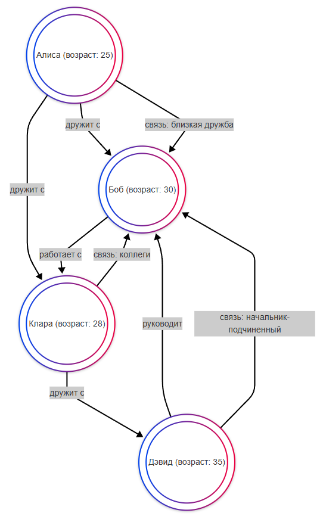

---
title: 3.06. NoSQL
---

# 3.06. NoSQL

## История NoSQL

```
История NoSQL
Откуда появилось NoSQL и кто был первооткрывателем
История документных NoSQL БД
История in-memory хранения и как оно перекочевало в NoSQL
История колоночных БД
История графовых БД
Как NoSQL повлияло на развитие ML, BigData, IoT и конечно же алгоритмов рекомендаций

История MongoDB
История Redis
История Memcached
История Cassandra
История Neo4j
```


## Основы NoSQL

Мы уже рассматривали основы баз данных. Сейчас придётся углубиться.

Представим себе библиотеку, где книги распределены по полочкам, упорядочены по алфавиту, с указателями, номерами, сгруппированы по авторам, жанрам и году изданию. Это порядок - SQL.

А теперь представим, что кто-то принёс старую тетрадь с заметками, огромный плейлист с музыкой из Spotify, коллекцию фотографий с телефона и попросил всё это хранить аккуратно. Но как это всё хранить, если нет какой-то единой структуры? Ведь это всё не поместить по полочкам, в строчки и таблицы - вот тут и нужна нереляционная модель хранения данных. Эта тема появилась, когда стандартных возможностей стало недостаточно, и XXI век стал эпохой больших данных, с кучей социальных сетей, мессенджеров, онлайн-магазинов и устройств. Информация очень туго подстравивалась под табличную модель либо не подстраивалась вовсе. Тогда и изобрели гибкие NoSQL-системы, которые не требуют строгих схем, умеют масштабироваться, работают быстро и хранят любые форматы, чтобы хранить данные «как есть».

Поскольку NoSQL появился позже SQL, поначалу может быть не совсем понятно, как эта технология работает, но я уверен, что мы справимся.

★ **NoSQL (Not Only SQL)** – базы данных, которые не используют таблицы (как SQL), а хранят данные в других форматах:
	- Документы (MongoDB);
	- Ключ-значение (Redis);
	- Колоночные (Cassandra);
	- Графовые (Neo4j).
	
Какие возможности предоставляет NoSQL?
	- работать с данными, которые не имеют строгой схемы;
	- добавлять, изменять и удалять поля без перестроения всей схемы;
	- выполнять горизонтальное масштабирование - данные могут распределяться по множеству серверов;
	- работа с большими объемами информации и высокими нагрузками;
	- автоматическое реплирование данных между узлами;
	- работа с документами, ключами/значениями, графами, колонками и другими структурами;
	- использование кэширования для ускорения доступа к данным.

В зависимости от необходимости решения конкретных задач, подбирается соответствующая NoSQL-технология. Давайте разбёрем их.

## Знаки препинания

Два важных вопроса, которые мучают начинающих программистов:
1. Когда использовать кавычки двойные ("), одинарные ('), а когда апострофы (’)?
2. Когда использовать точки (.), запятые (,) и точку с запятой (;)?

NoSQL может быть представлен в виде:
	- JavaScript-like синтаксиса (MongoDB shell): здесь работают правила JS.
	- JSON/BSON: тогда действуют правила JSON.

Если вы работаете с JSON (например, REST API), то только двойные кавычки. JSON всегда требует двойных кавычек для ключей и строковых значений:

```json
{
  "name": "Джайна",
  "quote": "Я в порядке."
}
```

Одинарные кавычки недопустимы в JSON, так как это нарушает формат. Апострофы можно использовать внутри строк, если они не нарушают синтаксис. Несоблюдение правил кавычек приведёт к ошибке парсинга JSON.

Точка (.) : не используется в синтаксисе JSON.

Запятая (,) : разделяет пары ключ-значение и элементы массива:

```json
{
  "name": "Артас",
  "age": 25
}
```

Точка с запятой (;) : запрещена , только запятые.

Важно: Запятая после последнего элемента вызывает ошибку в большинстве парсеров JSON.

## MongoDB

```
Документ, Коллекция, База данных, _id и ObjectId.
что такое BSON и как он отличается от JSON.
CRUD-операции: Детально опишите методы insertOne, insertMany, updateOne, updateMany, deleteOne, deleteMany, findOne, find.
Запросы и курсоры: Как строить сложные запросы с операторами $gt, $lt, $in, $or, $and и т.д. Как работать с курсорами, ограничивать (limit), пропускать (skip) и сортировать (sort) результаты.
Зачем нужны индексы и как они работают.
Агрегация данных/ Объясните концепцию конвейеров (pipeline) и этапов ($match, $project, $group, $sort, $unwind).
что такое транзакции в MongoDB
```

★ **MongoDB** – документо-ориентированная БД. Документы хранятся в JSON-подобном формате (BSON, Binary JSON - бинарное представление JSON). Благодаря хранению данных в BSON и использованию индексов, MongoDB обеспечивает высокую скорость чтения и записи.Данные хранятся частично в кэше, частично на диске. В отличие от SQL, документ не придётся разбивать на несколько таблиц и можно изложить так:

```json
{
  "_id": "507f191e810c19729de860ea",
  "name": "Виктор",
  "age": 28,
  "hobbies": ["гитара", "программирование"],
  "address": {
    "city": "Москва",
    "street": "Ленина, 42"
  }
}
```

Это применимо для соцсетей (посты, комментарии), каталогов товаров интернет-магазина, логов и аналитики. 

MongoDB не требует строгой схемы данных, что позволяет легко адаптироваться к изменениям в структуре данных.  Также MongoDB может обрабатывать большие объёмы данных и высокие нагрузки и поддерживает горизонтальное масштабирование через шардирование (разделение данных между несколькими серверами), а также позволяет выполнять репликацию данных на несколько серверов через Replica Sets.

Каждый документ имеет уникальный идентификатор _id, который автоматически генерируется MongoDB, если не указан явно.

База данных MongoDB содержит одну или несколько коллекций.

Коллекция — это группа документов, аналог таблицы в реляционных базах данных. Коллекции могут содержать документы с разной структурой (схема не фиксирована).

Установка и развёртывание:
	- скачать MongoDB с официального сайта;
	- запустить сервер командой «mongod»;
	- подключиться через консоль - «mongo».

Администрирование производится через GUI (графический интерфейс):
	- MongoDB Compass (официальный);
	- Robo 3T (альтернативный).

MongoDB поддерживает аутентификацию и авторизацию пользователей. Можно настроить контроль доступа (RBAC — Role-Based Access Control) и включать SSL/TLS для шифрования данных при передаче.

В языках программирования есть специальные фреймворки и библиотеки для работы (Mongoose, PyMongo, Spring Data MongoDB и т.д.).

Официальный сайт MongoDB - https://www.mongodb.com/

Чит-лист - https://cheatsheets.zip/mongodb

## Redis

```
STRING, LIST, SET, HASH, ZSET (Sorted Set)
Короткие структуры (ziplist, intset)
Упаковка данных в STRING
Пайплайны (Pipelining): Как группировка команд в один сетевой запрос может кардинально повысить производительность.
Серверные скрипты: Как Lua позволяет выполнять сложную логику прямо на стороне сервера Redis, атомарно и с высокой производительностью.
Построение компонентов - автозаполнение, распределенные блокировки, семафоры, очереди задач (FIFO, отложенные), системы обмена сообщениями (pull/push), распределение файлов.
Репликация (Master/Slave)
Сохранение данных (Persistence): Разница между RDB (снимки) и AOF (журнал), их плюсы, минусы и настройки.
Шардирование (Sharding)

Redis = Remote Dictionary Server — буквально «удалённый сервер словаря»
распределённое хранилище типа ключ → значение, к которому можно обращаться по сети.
Название подчёркивает идею удалённого доступа к структурам данных, как к словарю (ассоциативному массиву).
Резидентная СУБД. Резидентная — означает, что данные постоянно находятся в оперативной памяти (RAM) во время работы.
Redis — это in-memory data store: все данные хранятся в RAM для максимальной скорости доступа. Однако Redis не теряет данные при перезапуске, если включена персистентность (RDB/AOF) — так что это не просто временное хранилище. Правильнее говорить: «In-memory data structure store» — так Redis себя называет официально.

Хотя часто используется как кэш, Redis может быть:
Основной базой данных (если данные помещаются в RAM).
Брокером сообщений (через PUB/SUB, Streams).
Хранилищем сессий, очередей, временных данных.
Поддерживает реальное время: например, онлайн-чаты, уведомления, активность пользователей.

Помимо базовых типов, Redis поддерживает:
HyperLogLog — для оценки уникальных значений (например, уникальные посетители).
Bitmaps — эффективное хранение бинарных флагов (например, активность пользователя по дням).
Geospatial indexes — работа с географическими координатами (GEOADD, GEORADIUS).
Streams — логи событий в реальном времени (аналог Kafka в миниатюре).
JSON — через модуль RedisJSON, теперь можно хранить и запрашивать JSON-объекты.
Vectors — для работы с эмбеддингами в AI/ML (поиск по схожести текстов, изображений и т.п.).

Redis можно расширять с помощью модулей:
RedisJSON — работа с JSON.
RediSearch — полнотекстовый поиск и индексация.
RedisAI — выполнение ML-моделей прямо в Redis.
RedisGraph — графовая база данных.
RedisBloom — фильтры Блума, Count-Min Sketch.

Кластеризация и высокая доступность
Redis Cluster — встроенная поддержка шардирования и отказоустойчивости.
Автоматическое распределение ключей по нодам.
Поддержка master-slave репликации внутри кластера.
Переключение на реплику при падении мастера (failover).
На сайте: "Automatically split your data across multiple nodes to improve uptime."

Active-Active Geo-Distribution (CRDT)
Через Redis Enterprise доступна мультимастерная репликация между дата-центрами.
Данные синхронизируются в реальном времени между регионами.
Гарантируется локальная задержка <1 мс и 99.999% uptime.
Полезно для глобальных приложений (SaaS, fintech, e-commerce).

Производительность и масштабируемость
Все операции — в памяти → микросекундная задержка.
Поддерживает десятки тысяч операций в секунду на одном узле.
Горизонтальное масштабирование через шардирование (ручное или кластер).
Поддержка pipelining и массовых команд (MGET, MSET) — снижает сетевые задержки.

Работа с окружениями и облачными платформами
Как указано на redis.io: работает с:
AWS, Google Cloud, Azure
Kubernetes, Docker
Vercel, Heroku
Можно развернуть:
On-premise (свои серверы)
В облаке (Redis Cloud, Amazon ElastiCache, Azure Cache for Redis)
В контейнерах

Lua-скрипты: атомарность и скорость
Lua-скрипты выполняются атомарно — никакие другие команды не вклиниваются.
Полезно для:
Условных операций («если X, то Y»).
Реализации сложной логики без сетевых задержек.
Атомарных транзакций (аналог MULTI/EXEC, но мощнее).
Пример: реализация rate-limiting (ограничение запросов) за один вызов.

Транзакции (MULTI/EXEC)
Redis поддерживает простые транзакции:
MULTI — начинает блок команд.
EXEC — выполняет все команды атомарно.
Но: нет rollback, если одна команда упадёт.
Лучше использовать Lua-скрипты для сложной логики.

Pub/Sub и Streams — брокер сообщений
PUB/SUB — простая модель publish-subscribe (один-ко-многим).
Используется для чатов, уведомлений.
Минус: нет сохранения сообщений (если подписчик offline — пропустит).
Redis Streams — более продвинутый аналог:
Хранит историю сообщений.
Поддерживает группы потребителей (consumer groups).
Аналог Kafka, но проще и легче.

Безопасность
Поддержка:
Парольной аутентификации (requirepass).
Шифрования (TLS/SSL) — в новых версиях.
ACL (Access Control Lists) — с версии 6.0:
Разные пользователи с разными правами.
Например: readonly-пользователь для кэша, admin — для управления.

Инструменты и экосистема
RedisInsight — официальный GUI от Redis Inc.
Визуализация данных, мониторинг, отладка, работа с JSON, поиск.
Поддержка Redis Stack (все модули).
CLI (redis-cli) — мощный интерактивный клиент.
Клиентские библиотеки:
Python: redis-py
Node.js: ioredis, node-redis
Java: Jedis, Lettuce
Go: go-redis
.NET: StackExchange.Redis

Redis Stack
Сборка от Redis Inc., включающая:
Redis + модули (JSON, Search, AI, Bloom, Timeseries).
RedisInsight.
CLI и SDK.
Позволяет быстро строить приложения с полнотекстовым поиском, AI, аналитикой.

Интеграция с AI
Как указано на сайте: "Build AI apps with more speed, memory, and accuracy."
Redis используется в AI-приложениях для:
Хранения эмбеддингов (векторов).
Поиска по схожести (similarity search).
Кэширования ответов LLM.
Хранения контекста диалога.
Интеграция с LangChain, LlamaIndex и др.

Производительность vs. SQL
SQL-базы: медленнее, потому что данные на диске, нужен парсинг запросов, транзакции, индексы.
Redis: всё в RAM → быстрее в 10–1000 раз.
Но: ограничен объёмом памяти, нет JOIN’ов, сложных запросов.
Идеален для горячих данных, которые нужны постоянно.

```

★ **Redis** хранит данные в виде ключ-значение, причём в оперативной памяти (RAM), поэтому он очень быстрый. Это идеальный пример механизма кэширования. Применяется в кэшировании (ускорении сайтов), сессиях пользователей, очередях задач, чат-приложений, чтобы обеспечить высокую скорость работы, не обращаться лишний раз к SQL, так как хранилище SQL хранится на диске, и при каждом запросе идёт чтение с диска.

Ключ — это строка (например, user:1000).

Значение может быть различных типов:
	- Строка (string): `"JohnDoe"`.
	- Хэш (hash): `{"name": "John", "age": 30}`.
	- Список (list): `["task1", "task2", "task3"]`.
	- Множество (set): уникальные элементы, например, `{"apple", "banana", "cherry"}`.
	- Упорядоченное множество (sorted set): элементы с приоритетами, например, `{("task1", 1), ("task2", 2)}`.
	
Создание данных:

```
SET user:1000 "Solid Snake"
```

Чтение данных:
```
GET user:1000
```

Обновление данных:
```
SET user:1000 "Big Boss"
```

Удаление данных:
```
DEL user:1000
```

Redis также поддерживает персистентность (сохранение данных на диск):
	- RDB (Redis Database File) : создание моментальных снимков данных через определённые интервалы.
	- AOF (Append-Only File) : запись всех операций в файл для восстановления данных после перезапуска.
	
Устанавливается Redis как на Windows, так и на Linux.

Для администрирования используются графические инструменты:
	- RedisInsight (официальный GUI, в комплекте);
	- Another Redis Desktop Manager.
	
Специальные фреймворки и библиотеки для работы – ioredis, redis-py, Jedis и другие.

Redis часто используется как кэш для ускорения веб-приложений, к примеру в JavaScript можно работать с таким кэшем:

```JavaScript
const redis = require('redis');
const client = redis.createClient();

// Проверяем, есть ли данные в кэше
client.get('user:1000', (err, data) => {
  if (data) {
    console.log('Данные из кэша:', data);
  } else {
    // Если данных нет, получаем их из базы данных
    const userData = { name: 'Max', age: 30 };
    client.set('user:1000', JSON.stringify(userData));
    console.log('Данные сохранены в кэш');
  }
});

```

Redis можно использовать для управления очередями задач, для хранения сессий в веб-приложениях, для реализации чатов. Он также поддерживает аутентификацию через пароль, репликацию (копирование данных между серверами) и шардирование (разделение данных между несколькими узлами). Все операции выполняются атомарно, что гарантирует целостность данных.

Официальный сайт Redis - https://redis.io/

Чит-лист - https://cheatsheets.zip/redis

## Cassandra

★ **Cassandra** хранит данные в колонках, а не в строках. Подходит для огромных объёмов данных (в основном, Big Data). Данные хранятся на диске. На первый взгляд может показаться, что это такие же таблицы, как в SQL, но это не так. Применяется эта технология в аналитике (логи), интернете вещей (данные с датчиков), соцсетях. Сама по себе колоночная структура - вещь сложная, мы сначала рассмотрим SQL, а затем, в разделе по ClickHouse, посмотрим на колоночную структуру.

Для того, чтобы не путать эти три понятия:
	- Cassandra является нереляционной NoSQL базой с колоночной структурой;
	- ClickHouse является реляционной SQL-подобной базой с колоночной структурой;
	- SQL-базы данных являются реляционными со строчной структурой.
	
Cassandra использует ширококолоночную модель данных (wide-column store), которая отличается от традиционных таблиц SQL. Данные организованы в виде ключей строк (row keys) , столбцов (columns) и значений (values). В отличие от реляционных баз данных, данные в Cassandra могут быть спроектированы для оптимизации чтения или записи.

```
Row Key: user123
Columns: name="Peter", age=30, city="New York"
```

Установка с официального сайта, а подключение идёт через консоль (cqlsh).

Администрирование выполняется при помощи графических инструментов:
	- DataStax DevCenter;
	- DBeaver (там есть поддержка Cassandra).
	
Фреймворки: cassandra-driver, Spring Data Cassandra.

Это распределённая NoSQL база данных, которая хранит данные на нескольких узлах (серверах) в кластере, и использует децентрализованную архитектуру без единой точки отказа (masterless architecture). Каждый узел в кластере может обрабатывать запросы на чтение и запись.
Схема данных в Cassandra не фиксирована, что позволяет легко адаптироваться к изменениям в структуре данных. Cassandra оптимизирована для операций записи. Запись данных происходит очень быстро благодаря логической структуре commit log и memtable.

Для работы с данными используется CQL (Cassandra Query Language). Он очень похож на SQL, но в нём нет JOIN-ов, поддержки транзакций и имеется поддержка только первичных ключей для выборки данных. А так, в целом, основные операции там такие же (CRUD, агрегатные функции, к примеру). Мы рассмотрим SQL отдельно, так что особенности языка узнаем оттуда.

Официальный сайт Cassandra - https://cassandra.apache.org/

## Графовые БД

**Neo4j** — это графовая СУБД с открытым исходным кодом, реализованная на Java. Графовые базы данных (Graph Databases) используют графы для хранения и обработки данных. В них данные представлены в виде узлов (nodes), ребер (edges) и свойств (properties). Узлы представляют объекты или сущности, ребра — связи между ними, а свойства — дополнительные атрибуты узлов и ребер.



Узлы представляют сущности, например, людей (Алиса, Боб, Клара, Дэвид). 

Узлы могут иметь свойства, такие как возраст (возраст: 25). 

Ребра показывают связи между узлами.

Например, «Алиса дружит с Бобом» или «Дэвид руководит Бобом».

Ребра также могут иметь свойства, например, тип связи (близкая дружба, коллеги, начальник-подчиненный).

К примеру, если обратиться по запросу:
```
MATCH (a:Person)-[r:дружит_с]->(b:Person)
WHERE a.name = "Алиса"
RETURN b.name
```

То такой запрос (на языке Cypher) вернет всех друзей Алисы.

Официальный сайт Neo4j - https://neo4j.com/

Чит-лист - https://cheatsheets.zip/neo4j

**Cypher** — это декларативный язык запросов, созданный для работы с графовыми базами данных. Основная идея Cypher заключается в том, чтобы сделать работу с графами интуитивно понятной. Вместо сложных SQL-подобных запросов, Cypher использует синтаксис, который напоминает ASCII-графику: узлы обозначаются кругами (), а связи между ними — стрелками `-->` или `<--`. Основные элементы:

	- Узлы представляют сущности в графе. Они могут иметь метки (labels), которые определяют тип узла, и свойства (properties), которые хранят данные.
	- Связи (или ребра) соединяют узлы и описывают отношения между ними. Связи имеют направление (`-->` или `<--`) и могут содержать свойства.
	- Метки используются для группировки узлов одного типа.
	- Свойства — это пары ключ-значение, которые хранятся как в узлах, так и в связях.
	
Операции в Cypher:
1. Создание данных. Чтобы создать узлы и связи, используется команда CREATE.
```
CREATE (a:Person {name: "Alice", age: 30}),
       (b:Person {name: "Bob", age: 25}),
       (a)-[:FRIENDS_WITH]->(b);
```
Здесь создаются два узла - Alice и Bob, и между ними создается связь FRIENDS_WITH.

2. Чтение данных. Для чтения данных используется команда MATCH.
```
MATCH (a:Person)-[:FRIENDS_WITH]->(b:Person)
RETURN a.name, b.name;
```

Этот запрос находит всех людей, связанных отношением FRIENDS_WITH, и возвращает их имена.

3. Обновление данных. Для изменения свойств узлов или связей используется команда SET.
```
MATCH (a:Person {name: "Alice"})
SET a.age = 31;

```
Возраст Alice обновляется на 31.

4. Удаление данных. Для удаления узлов или связей используется команда DELETE.
```
MATCH (a:Person {name: "Alice"})-[r:FRIENDS_WITH]->(b:Person {name: "Bob"})
DELETE r;

```

Удаляется связь FRIENDS_WITH между Alice и Bob.

5. Поиск с условиями. Cypher поддерживает фильтрацию данных с помощью условий (WHERE).
```
MATCH (a:Person)
WHERE a.age > 25
RETURN a.name, a.age;

```

Этот запрос находит всех людей старше 25 лет и возвращает их имена и возраст.

Такие базы данных используются для социальных сетей, рекомендательных систем, анализа связей, сетей знаний.

```
Практическое задание
Установите Redis и Redis Insight.
Установите MongoDB и MongoDB Compass.
Попробуйте создать базу данных и добавить туда данные через интерфейс.
```


