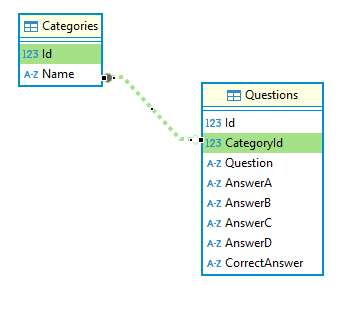
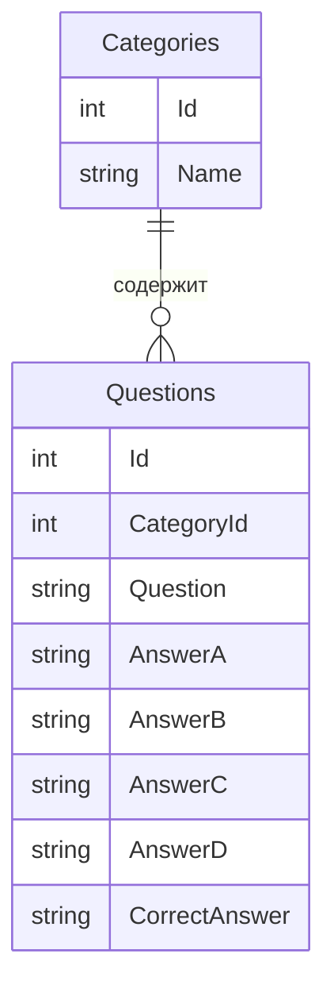
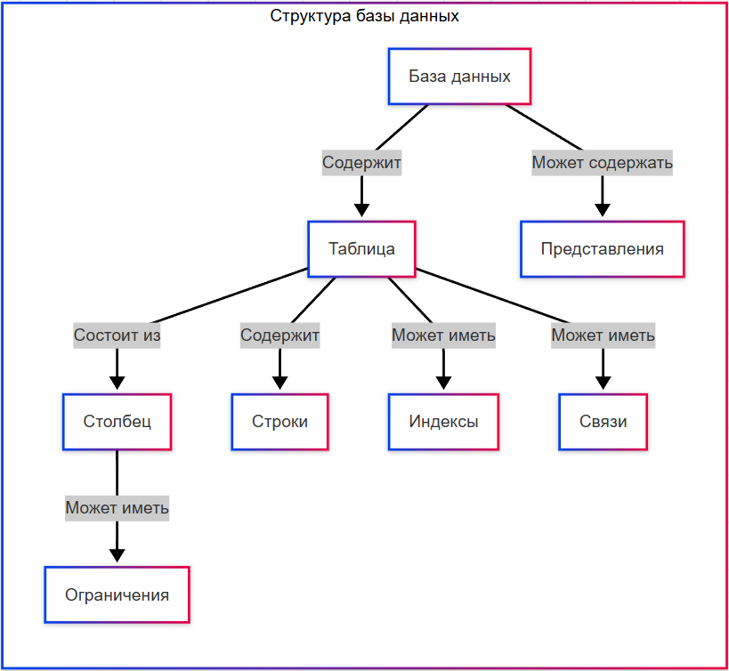
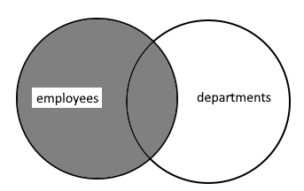
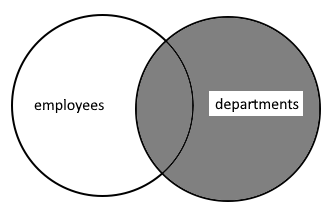
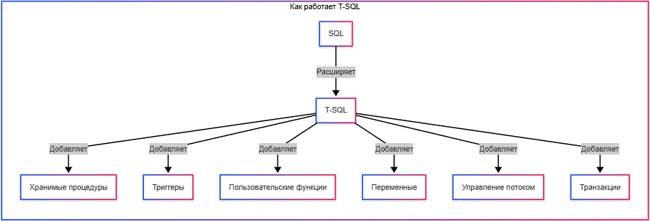

---
title: 3.07. SQL
---

# 3.07. SQL

## Основы SQL

★ **SQL (Structured Query Language)** – язык структурированных запросов для работы с реляционными (табличными) базами данных. Это не язык программирования, это декларативный язык – мы говорим «что нужно сделать», а СУБД сама решает, «как это сделать».

Какие возможности предоставляет SQL?
	- *создавать, изменять и удалять таблицы, поля, ограничения;*
	- *организовать данные в понятную, согласованную и контролируемую структуру;*
	- *хранение информации с гарантией целостности: каждое значение соответствует своей структуре, типу и ограничениям;*
	- *добавлять, изменять, удалять и извлекать данные по заданным условиям;*
	- *выбирать данные на основе условий, связей между таблицами, агрегатных функций;*
	- *обеспечение связи «один-к-одному», «один-ко-многим», «многие-ко-многим»;*
	- *выполнение операций в рамках транзакций: всё либо выполняется целиком, либо откатывается;*
	- *определять, кто может читать, писать, изменять или управлять данными;*
	- *вычисление сумм, средних, максимумов, группировок, подсчёт уникальных значений и другие статистические операции;*
	- *создавать виртуальные таблицы, которые представляют собой результат сложного запроса;*
	- *выполнять промежуточные вычисления внутри одного запроса или сессии.*

```
Интересный факт:
Изначально, для того чтобы люди могли запрашивать данные из баз на английском языке, вместо написания сложных программ, Дональд Чэмберлин и Рэймонд Бойс в 1970 году разработали SEQUEL (Structured English Query Language), но оказалось – SEQUEL уже был зарегистрирован торговой маркой авиакомпании, поэтому название сократили до SQL.

```

```
SQL-89, SQL-93 (SQL-2), SQL-99, SQL-2003, SQL-2006, SQL-2008, SQL-2011, SQL-2016
```

Пример запроса:

```sql
SELECT name FROM users WHERE age > 25;
```

В SQL данные хранятся в таблицах, словно в Excel, и эти таблицы связаны между собой. То есть, база – это не одна таблица, а их совокупность. В одной базе может быть много таблиц, где одна может хранить в себе сведения о пользователях, другая о городах, третья о продуктах, четвертая о заказах, и так далее. Каждая таблица хранит информацию об одном типе сущности. И они могут быть между собой связаны:



На примере выше есть две таблицы – *Questions* и *Categories*. В *Questions* есть *CategoryId*, которая связана с *Id* в таблице *Categories*. Так данные могут разделяться, организовывая структуру и связывая таблицы между собой.

Диаграмма таких связей называется **Entity Relationship Diagram** - ERD.



**Таблица Categories**

| Id | Name |
| :--- | :---: |
|1	|Science
|2	|Literature


**Таблица Questions**

| Id | CategoryId | Question |
| :--- | :---: | ---: |
|1	|1	|Что такое гравитация?
|2	|2	|Кто написал «Гамлета»?

Вот SQL как раз обеспечивает такую связь и это главное отличие реляционных БД - **реляции (relations)**, что означает «связи».

Таблицы состоят из:
1. ★ **Строк** (records, не путать со строковым типом данных) – отдельные записи (к примеру, один пользователь = 1 строка).
2. ★ **Столбцов** (fields) – поля, это свойства записей (имя, возраст, email). 
3. ★ **Ключей** – уникальных полей, которые связывают таблицы между собой (на примере выше это *CategoryId* и *Id*):
	- *id* для *Questions*, и *id* для *Categories* будут **первичными ключами** (Primary Key, PK), определяющий её связь с другими;
	- *CategoryId* для *Questions* будет **внешним ключом** (Foreign Key, FK), определяющий связь с определённой таблицей.

Таким образом, можно определить что есть какие-то виды ключей, так?

**Первичный ключ** - это уникальный идентификатор для каждой строки (записи) в таблице. Он должен быть уникальным (никакие две строки не могут иметь одинаковое значение первичного ключа), не может быть пустым (NULL) и обязательно должен иметь значение.

В таблице может быть только один первичный ключ.

**Внешний ключ** - это поле (или набор полей) в одной таблице, которое ссылается на первичный ключ другой таблицы. Используется для установления связей между таблицами. Что-то вроде указателя, но в качестве «стрелки» использует идентификатор. Он может содержать повторяющиеся значения (к примеру, автор может иметь несколько книг, а значит, в таблице с книгами внешний ключ, указывающий на id автора будет совпадать). Он может быть NULL, если это разрешено, и обеспечивает целостность ссылок.

**Суперключ** - это любой набор атрибутов (столбцов), который однозначно идентифицирует каждую строку в таблице. Суперключ может содержать лишние атрибуты (то есть не все его части необходимы для уникальности). 

Первичный ключ — это **минимальный суперключ** (то есть суперключ без лишних атрибутов). К примеру, id уникален, а значит однозначно идентифицирует строку, и является суперключом.

Имя, например, может быть не уникальным, поэтому не является суперключом. А вот `{id, Имя}` будет уже уникальной комбинацией, а значит - суперключ. Но уникальность обеспечивается именно id, а «Имя» теперь избыточно. Это называется **суперключ с избыточностью**.

Поэтому можно сказать, что суперключом является любое описание, по которому мы точно найдём нужную запись.

**Поле** — это один столбец в таблице, представляющий определённый атрибут (характеристику) сущности. Каждое поле имеет имя, тип данных и ограничения. Поле иногда называют атрибутом. Важно не путать со строкой (записью), которая представляет собой одну сущность.

Если приводить в пример Excel-таблицы, то:
	- Таблица - отдельный лист;
	- Поле - заголовое столбца;
	- Запись - одна строка в таблице.


### ★ Как работает SQL?

1. Порядок работы с данными:
	- выполняется подключение к БД (логин/пароль, адрес сервера);
	- отправляется запрос (например, выбрать все записи из таблицы №1);
	- выполняется обработка запроса в СУБД;
	- СУБД парсит (разбирает запрос);
	- СУБД строит план выполнения запроса (как найти данные быстрее);
	- СУБД читает или записывает данные;
	- СУБД возвращает результат (таблица, число, статус).

2. Чтение SQL-запроса процессором:
	- сначала запрос разбирается на части;
	- определяется, что нужно сделать (SELECT);
	- определяется какие столбцы нужно обработать (* - все поля);
	- определяется, откуда – из какой таблицы это взять (FROM);
	- каким условиям должны соответствовать данные (WHERE);
	- как вывести результат (группировка, сортировка, вычисления);
	- проверяются права доступа к таблице для выполнившего запрос;
	- выполняется оптимизация запроса;
	- запрос исполняется и возвращается результат.

**Интересный факт:**
В SQL порядок слов не соответствует порядку выполнения. И если запрос будет выглядеть так:
```sql
SELECT name, COUNT(*) 
FROM users 
WHERE age > 18 
GROUP BY name 
HAVING COUNT(*) > 5 
ORDER BY name;
```

на самом деле порядок будет такой:
```sql
FROM users 
WHERE age > 18 
GROUP BY name 
HAVING COUNT(*) > 5 
SELECT name, COUNT(*) 
ORDER BY name;
```

Порядок чтения здесь не построчный.

| № | Команда | Смысл |
| :--- | :---: | ---: |
|1	|FROM и JOIN	|Определение - откуда брать данные. Обрабатываются таблицы, указанные в FROM, а также все JOIN (включая INNER, LEFT, RIGHT и т.д.). В результате создаётся временная таблица, виртуальный набор строк из объединенных таблиц.
|2	|WHERE	|Фильтрация строк до группировки. Применяются условия к отдельным строкам, удаляются строки, не удовлетворяющие условиям. На этом этапе агрегировать (SUM, COUNT) не получится.
|3	|GROUP BY	|Группировка строк по значениям - строки объединяются в группы по указанным столбцам, и каждая уникальная комбинация значений становится одной строкой в результирующем наборе на этом этапе. Именно после группировки можно использовать агрегатные функции (COUNT, SUM, AVG).
|4	|HAVING	|Фильтрация групп после группировки, аналог WHERE, который применяется к группам, а не отдельным строкам. Можно использовать агрегатные функции - в итоге удаляются группы, не удовлетворяющие условиям. К примеру, можно оставить те группы, где больше 5 сотрудников.
|5	|SELECT	|Выбор и вычисление столбцов - на этом этапе определяется, какие столбцы попадут в результат, выполняются вычисления - арифметические выражения, вызовы функций, псевдонимы. Именно здесь можно ссылаться на псевдонимы, но в других частях запроса использовать псевдонимы нельзя, потому что SELECT выполняется позже.
|6	|DISTINCT	|Удаление дубликатов. Если указано SELECT DISTINCT, то дублирующиеся строки удаляются. Проверка дубликатов идёт по финальным выбранным столбцам, потому что после SELECT.
|7	|UNION / INTERSECT / EXCEPT	|Операции над множествами. Объединяют результаты нескольких SELECT-запросов, выполняются после формирования каждого отдельного набора. UNION объединяет, INTERSECT пересекает, EXCEPT - разность.
|8	|ORDER BY	|Сортировка результата. Сортирует финальный набор строк по указанным столбцам или выражениям. Можно использовать псевдонимы, так как SELECT уже выполнен, и сортировка никак не влияет на логику группировки или фильтрации.
|9	|LIMIT и OFFSET	|Ограничение количества строк. Выполняется в самом конце.

Подробности об SQL можно получить на W3 - https://www.w3schools.com/sql/


## Типы SQL-команд

В ходе развития SQL сложилась устоявшаяся практика деления команд языка на несколько логических групп, каждая из которых отвечает за определённый аспект работы с данными и структурами базы данных. Это деление принято называть подъязыками SQL (на английском звучит лучше - sublanguages), хотя в повседневной практике чаще говорят «типы SQL-команд». Такая классификация не является строгой, поэтому скорее вольное деление.

1. **DDL - Data Definition Language** (язык определения данных), используется для создания, изменения, удаления объектов структуры данных (таблиц, индексов, схем и т.д.). 

Основные команды DDL:
	- `CREATE` - создание объекта (таблица, индекс);
	- `ALTER` - изменение структуры существующего объекта;
	- `DROP` - удаление объекта из базы данных;
	- `TRUNCATE` - удаление всех данных из таблицы с сохранением её структуры (иногда относят к DML, но чаще к DDL из-за эффекта на метаданные);
	- `RENAME` - переименование объекта (не во всех СУБД).

DDL-команды обычно неявно фиксируют транзакции, то есть COMMIT происходит автоматически после выполнения. О транзакциях мы поговорим отдельно.

2. **DML - Data Manipulation Language** (язык манипулирования данными), предназначен для работы с данными внутри таблиц - добавления, изменения, удаления записей. 

Основные команды DML:
	- `INSERT` - добавление новых строк;
	- `UPDATE` - изменение существующих строк;
	- `DELETE` - удаление строк;
	- `MERGE` (или `UPSERT`) - условное обновление или вставка данных (в зависимости от наличия записи).

DML-операции выполняются в рамках транзакций и могут быть отменены (ROLLBACK) или зафиксированы (COMMIT).

3. **DQL - Data Query Language** (язык запросов к данным), используется для выборки из базы данных. Это основной инструмент для получения информации. Здесь одна основная команда - `SELECT` для извлечения данных по заданным критериям. Некоторые источники считают SELECT частью DML, поскольку он «манипулирует данными», извлекая их.

4. **DCL - Data Control Language** (язык управления доступом к данным), управляет правами доступа пользователей и ролям в базе данных. 

Основные команды DCL:
	- `GRANT` - предоставление привилегий.
	- `REVOKE` - отмена ранее выданных привилегий.

DCL нужен для обеспечения безопасности и аудита в многопользовательских системах.

5. **TCL - Transaction Control Language** (язык управления транзакциями), управляет группами операций как единой транзакцией с возможностью подтверждения или отката изменений. 

Основные команды TCL:
	- `COMMIT` - фиксация всех изменений текущей транзакции.
	- `ROLLBACK` - откат всех изменений текущей транзакции.
	- `SAVEPOINT` - установка точки отката внутри транзакции (позволяет откатиться не ко всему началу, а к промежуточному состоянию).

TCL особенно важен при работе с DML-операциями, где требуется атомарность (все или ничего).

Такое деление возникло не в самом стандарте SQL, а в учебных и методичеких материалах, а также в документации вендоров (Oracle, IBM, Microsoft и др.). Оно помогает структурировать обучение и понимание SQL, разделяя его функциональность по назначению. Поэтому граница между подъязыками не всегда чёткие (примеры - TRUNCATE и SELECT, о которых я упомянул ранее). Плюс, некоторые СУБД расширяют функциональность, добавляя новые команды, что усложняет такое деление на команды.


## Знаки препинания

Два важных вопроса, которые мучают начинающих программистов:
1. Когда использовать кавычки двойные (`"`), одинарные (`'`), а когда апострофы (`’`)?
2. Когда использовать точки (`.`), запятые (`,`) и точку с запятой (`;`)?

Для строк всегда используются одинарные кавычки (`'`) :
```sql
SELECT * FROM users WHERE name = 'Клементина';
```

Двойные кавычки (`"`) могут использоваться для имен таблиц, столбцов и т. д., если СУБД поддерживает:
```sql
SELECT * FROM "Users" WHERE "id" = 1;
```
Это полезно, если имя содержит пробелы или совпадает с ключевым словом.

Апострофы (`’`) — не поддерживаются в SQL как часть синтаксиса. Используйте обычный `'`.

Точка (`.`) : используется для указания столбцов в формате таблица.столбец:
```sql
SELECT users.name FROM users;
```
Запятая (`,`) : разделяет поля в запросах:
```sql
SELECT id, name, email FROM users;
```
Точка с запятой (`;`) : часто используется для завершения запроса:
```sql
SELECT * FROM users;
INSERT INTO users (name) VALUES ('Клементина');
```
Точка с запятой не обязательна во всех СУБД (например, MySQL), но является хорошей практикой при работе с несколькими запросами.


## Типы данных в SQL

Типы данных определяют, какая информация может храниться в столбце таблицы: числа, текст, даты и т.д. Каждая СУБД поддерживает свои типы, но есть общая классификация.

### 1. Числовые типы

★ **Числовые типы** – используются для хранения чисел.

Целые числа:

| Тип | Диапазон | Пример использования |
| :--- | :---: | ---: |
|INT, INTEGER	|От -2³¹ до 2³¹-1 (~±2.1 млрд)	|Возраст (age INT)
|SMALLINT	|От -32,768 до 32,767	|Количество товаров на складе
|BIGINT	|От -2⁶³ до 2⁶³-1 (огромные числа)	|ID в крупных системах
|TINYINT	|От -128 до 127 (или 0 до 255)	|Логический флаг (is_active TINYINT(1))

Числа с плавающей точкой:

| Тип | Описание | Пример использования |
| :--- | :---: | ---: |
|FLOAT	|Приблизительное число (~7 знаков)	|Температура
|DOUBLE	|Более точное число (~15 знаков)	|Координаты на карте
|DECIMAL(p, s)	|Точное число (p — всего цифр, s — после запятой)	|Деньги (DECIMAL(10, 2))

### 2. Строковые типы

★ **Строковые типы** – для хранения текстов и бинарных данных.

Текстовые типы:

| Тип | Описание | Пример использования |
| :--- | :---: | ---: |
|VARCHAR(n)	|Строка переменной длины (до n символов)	|Имя (VARCHAR(50))
|CHAR(n)	|Строка фиксированной длины (дополняется пробелами)	|Код страны (CHAR(2))
|TEXT	|Большой текст (до 65,535 символов)	|Описание товара
|LONGTEXT	|Очень большой текст (до 4 ГБ)	|Статьи, книги

Бинарные данные:

| Тип | Описание |
| :--- | :---: |
|BLOB	|До 65 КБ бинарных данных (изображения, PDF)
|LONGBLOB	|До 4 ГБ бинарных данных

### 3. Дата и время

★ Дата и время – для хранения временных меток.

| Тип | Формат | Пример использования |
| :--- | :---: | ---: |
DATE	YYYY-MM-DD	Дата рождения
TIME	HH:MM:SS	Время события
DATETIME	YYYY-MM-DD HH:MM:SS	Дата и время заказа
TIMESTAMP	YYYY-MM-DD HH:MM:SS (с учётом часового пояса)	Время последнего входа

### 4. Логический тип

★ Логический тип всегда один:

BOOLEAN – TRUE или FALSE (истина или ложь).

### 5. Особые типы

★ Особые типы:

JSON – хранение данных в JSON поддерживается в некоторых СУБД (MySQL, PostgreSQL):
```sql
CREATE TABLE products (
    attributes JSON  -- Например, {"color": "red", "size": "XL"}
);
```

ENUM – столбец с предопределёнными значениями (из списка имеющихся):
```sql
CREATE TABLE users (
    gender ENUM('male', 'female')
);
```
Соответственно, в зависимости от планируемого содержания, нужно изначально выбрать тип данных для каждого столбца:
	- числа – INT;
	- деньги – DECIMAL;
	- проценты – FLOAT;
	- текст фиксированной длины – CHAR;
	- переменная длина (имена, описания) – VARCHAR;
	- большие тексты – TEXT;
	- дата – DATE;
	- дата и время – DATETIME.

Пример создания таблицы с разными типами:
```sql
CREATE TABLE employees (
    id INT PRIMARY KEY,
    name VARCHAR(50),
    birth_date DATE,
    salary DECIMAL(10, 2),
    is_manager BOOLEAN,
    working_hours TIME,
    hire_date TIMESTAMP,
    bio TEXT
);
```
Важно: размер имеет значение. VARCHAR(255) занимает меньше места, чем VARCHAR(1000), даже если в нём короткие строки. Это важно при оптимизации работы и ресурсов. Именно поэтому типов данных так много – под разные цели.


## Работа с СУБД

★ **СУБД** – система управления базами данных, программный комплекс, включающий не просто набор языковых инструментов, но и средства для администрирования.

Современные СУБД опираются на набор взаимосвязанных **объектов**, которые образуют структурированную среду для хранения и обработки информации. **Таблицы** выступают центральными элементами, хранящими данные в **строках** и **столбцах**, где каждое **поле** обладает определённым **типом данных**, задающим характер хранимой информации и допустимые операции. Для ускорения доступа к данным создаются **индексы** – специальные структуры, оптимизирующие поиск подобно оглавлению в книге. **Процедуры** и **функции** инкапсулируют бизнес-логику, позволяя выполнять сложные операции непосредственно на сервере. Система безопасности реализуется через **пользователей** и **права доступа**, где каждому субъекту назначаются конкретные привилегии на определённые объекты.

Эти компоненты образуют **иерархическую систему**: от простых типов данных к таблицам, связанным отношениями, от индексов, ускоряющиз запросы, до процедур, автоматизирующих обработку, и пользовательских ролей, обеспечивающих безопасность. Такая организация позволяет СУБД эффективно балансировать между гибкостью (благодаря настраиваемым структурам) и производительностью (за счёт оптимизированных механизмов хранения и доступа), удовлетворяя требованиям как небольших приложений, так и корпоративных систем. 

Ключевая особенность – **декларативность**: разработчик описывает что нужно (структуру данных, правила доступа), а СУБД решает, как это оптимально реализовать. Но это мы забегаем к SQL. Начнём с NoSQL.

Пользователи – это учётные записи для доступа к БД. Они не всегда люди, часто под пользователем может быть программа (в коде программы будет авторизация).


**Кто использует СУБД?** Программисты, обычные пользователи и администраторы. Конечно, ролевая модель может быть шире, но общий принцип такой:
	- программисты пишут программы, работающие с БД, создают таблицы, изменяют данные, либо только читают и обновляют их;
	-обычные пользователи пользуются программой и часто не пользуются БД, а если и пользуются, то исключительно для чтения, без права изменения и удаления;
	- администраторы же создают и настраивают БД, и предоставляют права доступа.
	
В SQL, для работы с БД используются команды управления доступом.

### Работа с правами

1. Создание пользователей:
```sql
-- Создаём нового пользователя
CREATE USER 'менеджер'@'localhost' IDENTIFIED BY 'password123';
```
С созданием всё просто – это команда, используемая для добавления нового пользователя с указанным именем и паролем.

2. Выдача прав (GRANT):
```sql
-- Разрешаем чтение таблицы товаров
GRANT SELECT ON магазин.товары TO 'менеджер'@'localhost';
```
```sql
-- Разрешаем добавление новых заказов
GRANT INSERT ON магазин.заказы TO 'менеджер'@'localhost';
```
Выдача прав подразумевает расширение перечня прав пользователя и предоставления доступа к объекту. В данном случае к заказам и товарам.


3. Запрет прав (REVOKE):
```sql
-- Забираем право удалять товары
REVOKE DELETE ON магазин.товары FROM 'менеджер'@'localhost';
```
Если у кого-то слишком много прав – можно их отозвать. В данном случае выполняется отзыв прав на товары.

4. Просмотр выданных прав:
```sql
-- Какие права у пользователя?
SHOW GRANTS FOR 'менеджер'@'localhost';
```

Права в СУБД – разрешения на действия, именуются также привилегиями.

**Какие бывают права в SQL?**

| Право | Дозволенные действия | Пример |
| :--- | :---: | ---: |
|SELECT	|Читать данные	|Просмотр каталога товаров
|INSERT	|Добавлять новые записи	|Оформление нового заказа
|UPDATE	|Изменять существующие данные	|Обновление цены товара
|DELETE	|Удалять данные	|Удаление отменённого заказа
|ALL	|Все возможные права	|Только для администраторов
|CREATE	|Создавать новые таблицы	|Разработчикам для создания объектов
|EXECUTE	|Запуск хранимых процедур	|Вызов процедуры формирования отчёта
|ALTER	|Изменение структуры объектов	|Изменение таблиц (столбцов)
|DROP	|Удалять объекты	|Удаление таблицы целиком
|GRANT	|Назначение прав другим	|Дать права на удаление кому-то

При администрировании СУБД **важно придерживаться принципа минимальных прав** – давать только необходимые разрешения, не давать права админа, регулярно проверять права и использовать сложные пароли для всех пользователей.

**Данные – это серьёзно**. Если программу можно написать заново, то данные не восстановить, если нет резервных копий.


## Виды СУБД

Рассмотрим основные реляционные СУБД, их особенности, инструменты для работы и ключевые отличия в синтаксисе.

### SQLite

★ **SQLite** – встраиваемая СУБД (не требует сервера). Вся база данных хранится в одном файле (формат .db или .sqlite), благодаря чему можно просто обмениваться базой, переносить её и хранить где угодно (потому и прозвали «лайт»). Однако у неё нет сетевого доступа, только локальное использование. Но она достаточно мощная, несмотря на минималистичность.

Для работы с SQLite используются клиенты:
	- DB Browser for SQLite (графический интерфейс);
	- SQLite CLI (командная строка);
	- DBeaver;
	- Расширения для VS Code (SQLite).

SQLite оправдывает «лайт» в своём названии, не обладая чем-то уникальным, скорее наоборот, данная СУБД ограничена по сравнению с другими. Какие особенности у SQLite?

Вся БД - один файл. Можно просто скопировать файл .db и данные готовы к использованию на любой другой машине, можно прикрепить к письму, залить на Git, и открыть на другом устройстве. У других СУБД аналогов нет, они требуют сервера, конфигурации, дампов/восстановлений. 

Поскольку нет сервера, нет конфигурации и нет администрирования, этот формат отлично подходит для новичков - не нужно париться о портах, демонах, правах доступа, пользователях и ролях. Просто подключаемся к файлу и работаем. Мобильные приложения и некоторые игры часто используют SQLite именно поэтому, ведь можно встроить файл БД прямо в приложение.

SQLite полностью встраиваемая. Это библиотека на C, которая связывается прямо с приложением, работает в том же процессе. Поддерживается в огромном количестве языков и платформ. Размер на диске маленький, работать может даже на устройствах с 1 МБ ОЗУ, поэтому можно встретить в спутниках, роутерах и медицинских устройствах.

Поскольку SQLite работает без сервера, то и ACID-транзакции здесь работают даже при сбоях питания, на уровне файловой системы. Обычные текстовые файлы, к примеру, так не смогут, поэтому данные будут в безопасности, и то, что это один файл, не страшно.

Но всё же, есть минусы такой «лёгкости». Когда речь идёт о высокой нагрузки, сложных запросах и тысячах пользователей, SQLite «захлебнётся». Здесь нет сетевого доступа, нет ролевой модели, нет хранимых процедур, триггеров, нет параллелизма, репликации, кластеризации, шардинга. Использовать для себя или узкого круга - пожалуйста, но в промышленном масштабе лучше взять «серьёзную» СУБД.

К примеру, параллелизм. В контексте СУБД это подразумевает параллельный доступ к базе данных и параллельное редактирование. То есть, одновременно несколько пользователей могут работать - в SQLite это не работает так, как ожидается - производится только одна запись в момент времени, и при этом блокируется вся БД.

Пример синтаксиса:
```sql

-- Автоинкремент
CREATE TABLE users (
    id INTEGER PRIMARY KEY AUTOINCREMENT,
    name TEXT
);

-- Вставка
INSERT INTO users (name) VALUES ('Нико');

-- Лимит
SELECT * FROM users LIMIT 10;

```

Официальная документация SQLite здесь - https://www.sqlite.org/

```
Практическое задание
Установите DB Browser for SQLite.
```


### MySQL

★ **MySQL** – самая популярная open-source СУБД, с поддержкой репликации и кластеризации, оптимизированная для веб-приложений, поддерживает движки.

Чит-лист - https://cheatsheets.zip/mysql

и ещё один - https://learnsql.com/blog/mysql-cheat-sheet/


Клиенты:
	- MySQL Workbench (официальный GUI);
	- HeidiSQL (лёгкий клиент);
	- DBeaver (универсальный);
	- SQL Manager;
	- phpMyAdmin (веб-интерфейс).

MySQL можно поставить на второе место по «лёгкости» после SQLite. Здесь требуется наличие запущенного сервера, и одним файлом не обойтись. В основном, всё что умеет MySQL, умеют и другие СУБД - Oracle, PostgreSQL, MS SQL, но всё равно есть и уникальные вещи.

К примеру, только в MySQL можно выбирать движок для каждой таблицы (поддержка смены движков хранения на уровне таблиц). В одной базе можно создать таблицы на разных движках, например, одну на InnoDB, другую на MyISAM, третью на Memory, Archive, CSV и т.д.

**Движок хранения** - это модуль СУБД, который отвечает за то, как и где хранятся данные (в памяти/на диске), как обрабатываются запросы, как работают транзакции, блокировки, индексы, внешние ключи, восстановление, и конечно за производительность чтения/записи. Словом, это основной «исполнитель».

InnoDB - основной и рекомендуемый, поддерживает ACID-транзакции, внешние ключи, блокировки, краш-устойчивость, многоверсионность (дла параллельных чтений).

MyISAM уже устаревший, не поддерживает транзакции, внешние ключи, блокировки на уровне строк, надежное восстановление, но очень быстрый для SELECT, INSERT.

MEMORY (другое название HEAP) - хранение в оперативной памяти, из-за этого очень быстрый, так как данные не пишутся на диск. При перезагрузке сервера данные исчезают, транзакций нет, и таблицы пересоздаются при старте.

CSV - хранение в виде CSV-файлов, которые можно редактировать через Excel. Для импорта может быть очень удобным, но не будет индексов, транзакций, и работа довольно медленная.

ARCHIVE - для архивных и редко читаемых данных, предполагает сильное сжатие данных, чтобы хранить логи, историю, архивы. Здесь только INSERT и SELECT, индексов нет, а SELECT очень медленный.

BLACKHOLE - «проглатывает» всё, то есть принимает данные, но ничего не хранит, буквально с перевода «чёрная дыра», подходит для тестирования или репликации. Такой вот «фейковый» движок для специфичных сценариев.

FEDERATED/FEDERATEDX предоставляет доступ к таблицам на удалённом сервере. Таблица в локальной БД ссылается на таблицу на другом MySQL-сервере, как «внешняя таблица». Медленный, устаревший движок.

MERGE тоже устарел, и работает только с MyISAM. Можно делать «виртуальную» таблицу, которая объединит несколько таблиц с одинаковой структурой, допустим, для партиционирования.

**В других СУБД нет подобной системы движков хранения. Везде один движок**. Поэтому такая особенность и все эти движки характерны именно для MySQL.

В MySQL имеются очень быстрые операции INSERT и SELECT, если правильно настроить. Исторически данная СУБД оптимизирована под высокую пропускную способность чтения и записи, что и сделало её лучшим выбором для веб-сайтов.

MySQL одной из первых предложила простую и надёжную репликацию, с необычным способом разделения на MASTER и SLAVE (хозяин и раб, дословным переводом). Пример:
```sql
CHANGE MASTER TO MASTER_HOST='...', MASTER_USER='...', MASTER_PASSWORD='...';
START SLAVE;
```
MySQL также позволяет выдавать права не только на таблицы, но и на отдельные столбцы. В других СУБД этого нельзя делать напрямую. Можно, к примеру, ограничить видимость, чтобы пользователь не видел столбец «Phone».

Имеется также пара функций, которые уникальны для этой СУБД:
	- ON DUPLICATE KEY UPDATE - обновление только если запись существует;
	- REPLACE INTO - если запись с таким первичным ключом или UNIQUE существует, то удаляет и вставляет новую.

Если говорить об ограничениях MySQL, то они были в основном до версии 8.0. Раньше в MySQL не было полноценных оконных функций, полной поддержки CTE (WITH), встроенной поддержки JSON-индексов и операций.

Можно сказать, что MySQL - классическая РСУБД (реляционная СУБД), без каких-то особых «эксклюзивных» возможностей.

Пример синтаксиса:
```sql
-- Автоинкремент
CREATE TABLE users (
    id INT PRIMARY KEY AUTO_INCREMENT,
    name VARCHAR(50)
);

-- Вставка с возвратом ID
INSERT INTO users (name) VALUES ('Гордон');
SELECT LAST_INSERT_ID();

-- Лимит
SELECT * FROM users LIMIT 10 OFFSET 5;
```

Из полезных ресурсов по MySQL можно отметить два:
	- официальная документация - https://dev.mysql.com/doc/
	- форум сообщества на русском языке - http://www.mysql.ru/docs

### Microsoft SQL Server

★ **Microsoft SQL Server** – проприетарная СУБД от Microsoft, интегрированная с Windows и .NET, поддерживает специфический язык T-SQL (расширенный SQL), обладает мощными инструментами аналитики (SSAS, SSRS).

Чит-лист - https://learnsql.com/blog/sql-server-cheat-sheet/

Клиенты:
	- SQL Server Management Studio (SSMS) – основной GUI;
	- Azure Data Studio (кросс-платформенный клиент);
	- SQL Manager;
	- DBeaver.

SQL-сервер является очень мощной СУБД. Здесь используется сервер, и для управления, администрирования и конфигурирования сервера есть стандартная утилита **SQL Server Management Studio (SSMS)**.

Главная особенность  MS SQL - T-SQL, полноценный процедурный язык. Можно отметить следующие уникальные операции и конструкции:
MERGE - команда «всё в одном», UPDATE+INSERT+DELETE. 

Пример:

```sql
MERGE TargetTable AS target
USING SourceTable AS source
ON target.ID = source.ID
WHEN MATCHED THEN
    UPDATE SET Name = source.Name
WHEN NOT MATCHED THEN
    INSERT (ID, Name) VALUES (source.ID, source.Name)
WHEN NOT MATCHED BY SOURCE THEN
    DELETE;
```
OUTPUT - возврат изменённых строк в том же запросе. Показывает, какие строки были удалены. Пример:
```sql
DELETE FROM Orders
OUTPUT deleted.OrderID, deleted.CustomerID
WHERE Status = 'Cancelled';
```
FILESTREAM позволяет хранить большие файлы (BLOB) не в базе, а в файловой системе, и управлять ими через SQL-запросы. Файлы хранятся на диске, но доступны через SELECT/UPDATE.

FileTable позволяет открывать сетевую папку через Windows Explorer и копировать файлы прямо туда, а SQL Server будет автоматически создавать записи в таблице:
```sql
CREATE TABLE MyFiles AS FileTable;
```
В MS SQL есть интегрированные BI-инструменты для аналитики:

	- SSIS (SQL Server Integration Services) — ETL-платформа, визуальный конструктор пакетов переноса/очистки/преобразования данных. Поддерживает сотни источников (Excel, Oracle, CSV, API и т.д.).
	- SSAS (SQL Server Analysis Services) — OLAP и семантические модели. Включает в себя многомерные кубы и табличные модели, интегрирован с Power BI, Excel. Имеет особый уникальный язык DAX (Data Analysis Expressions).
	- SSRS (SQL Server Reporting Services) для отчётности. Визуализирует, позволяет экспортировать и даже использовать встроенный веб-портал. Ни одна другая СУБД не предоставляет такой комплексной, «коробочной» BI-платформы.

Поскольку Microsoft курирует и .NET платформу, то имеется тесная интеграция с ней. Например, имеется **SQLCLR** — выполнение .NET-кода внутри SQL Server. Можно писать функции, триггеры, агрегаты на C#/VB.NET и вызывать их из SQL. Это уникально, ни одна другая СУБД так не может. Сейчас SQLCLR отключён по умолчанию (из соображений безопасности), но возможность остаётся.

Пример синтаксиса (T-SQL):
```sql
-- Автоинкремент
CREATE TABLE users (
    id INT IDENTITY(1,1) PRIMARY KEY,
    name NVARCHAR(50)
);

-- Вставка с возвратом ID
INSERT INTO users (name) VALUES ('Клауд');
SELECT SCOPE_IDENTITY();

-- Лимит (с 2012 года)
SELECT * FROM users ORDER BY id OFFSET 5 ROWS FETCH NEXT 10 ROWS ONLY;
```

Документация доступна у Microsoft - https://learn.microsoft.com/ru-ru/sql/

```
Практическое задание
Установите SQL Server Express
Установите SSMS (SQL Server Management Studio)
Подключитесь к локальному серверу.

```

### PostgreSQL

★ **PostgreSQL** – самая продвинутая open-source СУБД (хотя есть версия Pro), поддержка JSON, GIS, полнотекстового поиска. Расширяемая (можно писать функции на Python, LO/pgSQL), имеет строгую поддержку стандартов SQL.

Чит-лист - https://cheatsheets.zip/postgres

и ещё один - https://learnsql.com/blog/postgresql-cheat-sheet/

Клиенты:
	- pgAdmin (официальный GUI);
	- DBeaver;
	- SQL Manager;
	- Postico (macOS).

Основной процедурный язык PostgreSQL - PL/pgSQL. Можно сказать, что это аналог T-SQL. Существуют расширения, вроде PL/Python, PL/Perl, PL/Java, PL/V8(JS), позволяющие писать функции на соответствующих языках программирование.

Расширений в PostgreSQL много. Они являются расширением функционала:
	- postgis - поддержка геоинформационных данных (GIS) для карт, маршрутов, геозон;
	- pg_trgm - триграммный поиск, для нечёткого сравнения;
	- hstore - хранение пар «ключ-значение»;
	- uuid-ossp - генерация UUID (уникальных идентификаторов);
	- pg_cron - запуск задач по расписанию внутри PostgreSQL;
	- timescaledb - оптимизация для временных рядов;
	- pgvector - хранение и поиск векторов;
	- pg_partman - автоматическое партиционирование таблиц.
	
Другие СУБД требуют установки отдельных продуктов или вовсе не поддерживают такие «плагины». 

Особенно важно выделить PostGIS, имеющую лучшую поддержку геоданных среди всех СУБД. Позволяет хранить точки, линии, полигоны и выполнять пространственные запросы, поддерживает CRS (системы координат), геоиндексы, функции, и всё это делает де-факто стандартом в ГИС-индустрии.
В PostgreSQL имеется качественный полнотекстовый поиск, с поддержкой различных возможностей - стемминг (приведение слов к основе), стоп-слов, ранжирования, фраз, весов полей, словарей. В других СУБД такой функционал сильно слабее.

Важная особенность PostgreSQL - материализованные представления. Мы их будем изучать в разделе, посвящённом представлениям, просто сейчас запомним что они уникальны. В MySQL такого нет, в SQL Server называются иначе и имеют ограничения (Indexed Views), в Oracle намного сложнее в использовании.

Пример синтаксиса:
```sql
-- Автоинкремент
CREATE TABLE users (
    id SERIAL PRIMARY KEY,
    name VARCHAR(50)
);

-- Вставка с возвратом ID
INSERT INTO users (name) VALUES ('Кратос') RETURNING id;

-- Лимит
SELECT * FROM users LIMIT 10 OFFSET 5;
```

Погрузиться в PostgreSQL можно:
	- на официальном сайте - https://www.postgresql.org/;
	- на сайте Postgres Professional - https://postgrespro.ru/docs

### Oracle

★ **Oracle Database** – проприетарная СУБД для корпоративного использования, с высокой производительностью и масштабируемостью, поддержкой PL/SQL, однако имеет непростую лицензионную политику.

Клиенты:
	- Oracle SQL Developer (официальный GUI);
	- TOAD for Oracle;
	- SQL Manager;
	- DBeaver.

Уникальная возможность Oracle DB - масштабирование «по горизонтали», Real Application Clusters (RAC). При этом несколько серверов (узлов) работают с одной и той же БД одновременно, и если один упадёт, другие продолжают работать. К примеру, если есть 4 сервера, и все подключены к общему хранилищу, при падении одного, клиенты даже не заметят. В PostgreSQL нет нативного RAC, в SQL Server и MySQL имеются ограничения, поэтому сейчас в Oracle единственный полноценный мульти-кластер для таких нагрузок на уровне ядра СУБД.

В Oracle DB есть возможность Flashback Technology, при помощи которой можно вернуть базу (или её отдельные таблицы/строки) в определённое состояние, например «на вчера в 15:00», без бэкапов и остановки. 

Пример:
```sql
FLASHBACK TABLE employees TO TIMESTAMP TO_TIMESTAMP('2025-04-01 14:00:00');
```
Или отмена DROP:
```sql
FLASHBACK TABLE deleted_table TO BEFORE DROP;
```

Другие СУБД не позволяют так легко и быстро откатываться. 

Также здесь имеется встроенное машинное обучение (Oracle Data Mining), продвинутая аналитика, что позволяет строить и применять модели ML прямо в SQL без выгрузки данных.

Здесь тоже есть материализованные представления с автоматическим обновлением и использованием вместо исходных таблиц для ускорения запросов. В PostgreSQL они обновляются вручную, через REFRESH MATERIALIZED VIEW. Здесь же можно к примеру выполнить REFRESH FAST (только измененные строки), ON COMMIT (при каждом коммите):

```sql
CREATE MATERIALIZED VIEW sales_summary
REFRESH FAST ON COMMIT
AS
SELECT product_id, SUM(amount) AS total
FROM sales GROUP BY product_id;
```
PL/SQL здесь работает в чистом виде. Главное не путать:
	- SQL Server использует T-SQL;
	- PostgreSQL использует PL/pgSQL;
	- Oracle DB использует PL/SQL.

Можно сказать, что PL/SQL это полноценная среда разработки внутри базы, с пакетами, коллекциями, исключениями, триггерами, объектами и типами. Пакеты похожи на классы, коллекции используются для массивов и вложенных таблиц. Компиляция производится нативно (средствами базовой СУБД), и довольно быстрая.

Имеется здесь также In-Memory Column Store, хранение данных одновременно в строковом и колоночном формате, для оптимизации работы аналитических запросов. Для приложения ничего не меняется, работает «магически».

Пример синтаксиса (PL/SQL):
```sql
-- Автоинкремент через SEQUENCE
CREATE SEQUENCE user_seq;
CREATE TABLE users (
    id NUMBER DEFAULT user_seq.NEXTVAL PRIMARY KEY,
    name VARCHAR2(50)
);

-- Вставка с возвратом ID
INSERT INTO users (name) VALUES ('Джилл') RETURNING id INTO :new_id;

-- Лимит (через ROWNUM)
SELECT * FROM users WHERE ROWNUM <= 10;
```

### Прочие СУБД SQL

| СУБД | Особенности | Клиенты |
| :--- | :---: | ---: |
|MariaDB	|Форк MySQL с улучшениями	|MySQL Workbench, HeidiSQL
|Firebird	|Компактная, для встраиваемых систем	|FlameRobin, DBeaver
|DB2	|Корпоративная СУБД от IBM	|IBM Data Studio, DBeaver

Однако, мы не затронули одну важную СУБД - ClickHouse. Давайте рассмотрим её отдельно.

## ClickHouse и колоночная архитектура

ClickHouse - это и не NoSQL, и не SQL. Но всё же ближе к SQL.

★ **ClickHouse** - высокопроизводительная колоночная (column-oriented) СУБД с открытым исходным кодом. Используется для обработки аналитических запросов в режиме реального времени. Разработчиком является «Яндекс» - изначально как эксперимент для Яндекс Метрика. Но затем спрос на функционал вырос и она стала открытой для общественности под лицензией Apache 2. Она подходит для работы с большими объёмами данных и сложными аналитическими запросами - бизнес-аналитика, логирование, мониторинг и обработка событий.

ClickHouse не является NoSQL-базой данных в классическом понимании. Она поддерживает SQL-подобный язык запросов, таблицы, индексы и другие элементы, характерные для реляционных баз данных. Поэтому ClickHouse можно назвать гибридом.

В отличие от традиционных строковых БД, ClickHouse имеет колоночную архитектуру, и хранит данные по столбцам. Это позволяет эффективно читать только те столбцы, которые нужны для выполнения запроса, что уменьшает объем обрабатываемых данных. Колоночное хранение также способствует лучшему сжатию данных за счёт их однородности.

ClickHouse очень оптимизирован и может обрабатывать миллиарды строк за секунды, благодаря параллельной обработке данных и эффективному использованию аппаратных ресурсов. Однако ClickHouse не предназначен для операций с частыми обновлениями данных вроде UPDATE или DELETE, он лучше работает со вставкой новых данных.

В ClickHouse используется SQL-подобный язык запросов. Он очень похож и поддерживает большинство операций, но имеется ряд особенностей, которые сближают с NoSQL-системами:

	- колоночная архитектура;
	- ограниченная поддержка транзакций (ACID не поддерживается в полном объеме), операции UPDATE и DETELE выполняются медленно и не рекомендуются;
	- поддержка распределенных таблиц и шардирования, что типично для NoSQL - можно масштабировать систему на сотни серверов, что недоступно для SQL БД;
	- отсутствие строгой схемы данных , можно добавлять данные без строгой проверки типов.

ClickHouse поэтому не так легко встретить в списках популярных СУБД. ClickHouse называют аналитической СУБД или OLAP-системой (On-Line Analytical Processing) — это промежуточное положение между SQL и NoSQL.

Такая система актуальна для дата-инженеров (обработка данных), аналитиков данных, бизнес-аналитиков и DevOps-инженеров (мониторинг).
Давайте остановимся на формате хранения в виде столбцов.

### Что такое колоночная архитектура?

Как мы рассмотрели ранее, обычные реляционные базы данных (MySQL или PostgreSQL, например) хранят данные в строках. Это означает, что все значения одной строки записываются в блоке подряд. Например:

| ID | Name | Age | City |
| :--- | :---: | ---: | ---: |
|1	|Айнур	|20	|Уфа
|2	|Ильнур	|25	|Стерлитамак
|3	|Фанур	|30	|Сибай

В строковой архитектуре эти данные хранятся так:
```
[1, "Айнур", 20, "Уфа"], [2, "Ильнур", 25, "Стерлитамак"], [3, "Фанур", 30, "Сибай"]
```

И если мы захотим прочитать аналитическим запросом, к примеру:
```sql
SELECT AVG(Age) FROM users;
```
То база данных будет читать все строки целиком, хотя нас интересует столбец Age.

Колоночная архитектура хранит данные по столбцам, а не строкам, и каждый столбец хранится отдельно. В нашем случае:
```
ID : [1, 2, 3]
Name : ["Айнур", "Ильнур", "Фанур"]
Age : [25, 30, 22]
City : ["Уфа", "Стерлитамак", "Сибай"]
```
И теперь, если мы выполним тот же SQL-запрос, ClickHouse прочитает только столбец Age, игнорируя остальные данные. Это значительно уменьшает объём чтения и ускоряет выполнение запроса.

В типичном аналитическом запросе используются только несколько столбцов из всей таблицы. И если в строковой архитектуре пришлось бы читать все строки целиком, включая ненужные столбцы, то в колоночной читается только нужный столбец — это значительно уменьшает нагрузку на диск и память.

Кроме этого, колоночная архитектура позволяет распараллелить операции. Например, если нужно посчитать сумму значений в столбце Age, каждую часть столбца можно обработать на разных процессорах или серверах.

**Какие есть недостатоки у колоночной архитектуры?**

1. Медленная запись данных. Вставка новых строк требует обновления всех столбцов, что значительно медленнее чтения.
2. Сложность обновления данных. Изменение одной строки затрагивает несколько столбцов, что усложняет операции UPDATE и DELETE.
3. Не подходит для OLTP (On-Line Transaction Processing). Если нужно часто читать и изменять отдельные строки, строковая архитектура будет эффективнее.

Именно из-за процесса изменения данных зачастую везде и выбирают строковую архитектуру, а колоночная используется именно в анализе.

Подробности о ClickHouse можно получить здесь - https://clickhouse.com/docs


## DDL в SQL

★ **DDL (Data Definition Language)** – подмножество SQL, отвечающее за определение и изменение структуры базы данных. DDL-операции работают с метаданными: создают, изменяют и удаляют таблицы, индексы, связи между таблицами и другие объекты БД.
DDL как «скелет» БД – таблицы, связи и ограничения.

Структура данных включает в себя таблицы, представления, столбцы, строки, индексы, связи и ограничения. Конечно, ещё есть триггеры, хранимые процедуры, последовательности и права доступа - но об этом позже. Сначала запомним основую структуру:



★ **Таблица** – основа базы данных, структура, где данные хранятся в виде строк (записей) и столбцов (полей). Имя таблицы должно быть уникальным в пределах базы данных.

★ **Столбец (поле)** это атрибут таблицы, определяет тип данных, которые можно хранить в таблице. У каждого столбца есть свой тип данных. Столбец может иметь ограничения (например, NOT NULL – обязательное поле).

★ **Ограничения (Constraints)** – «правила» для данных, которые контролируют допустимые значения в столбцах. Они защищают от некорректных данных (например, возраст не может быть отрицательным), и обеспечивают целостность базы данных.

### ★ Типы ограничений

1. **PRIMARY KEY (Первичный ключ)** – уникально идентифицирует каждую строку в таблице. Не может быть NULL. В одной таблице может быть только один PRIMARY KEY.
```sql
CREATE TABLE users (
    id INT PRIMARY KEY,  -- Столбец id — первичный ключ
    name VARCHAR(50)
);
```
2. **FOREIGN KEY (Внешний ключ)** – связывает данные между таблицами. Обеспечивает ссылочную целостность (нельзя удалить запись, на которую есть ссылки).
```sql
CREATE TABLE orders (
    id INT PRIMARY KEY,
    user_id INT,
    FOREIGN KEY (user_id) REFERENCES users(id)  -- user_id должен существовать в users(id)
);
```

3. **UNIQUE (Уникальность)** – значения в столбце не должны повторяться. В отличие от PRIMARY KEY, может быть NULL (но только один раз).
```sql
CREATE TABLE users (
    email VARCHAR(100) UNIQUE  -- email должен быть уникальным
);
```
4. **NOT NULL (Запрет пустых значений)** – столбец не может содержать NULL.
```sql
CREATE TABLE users (
    name VARCHAR(50) NOT NULL  -- имя обязательно
);
```
5. **CHECK (Проверка условия)** – проверяет значение по условию.
```sql
CREATE TABLE users (
    age INT CHECK (age >= 18)  -- возраст ≥ 18
);
```
6. **DEFAULT (Значение по умолчанию)**, если значение не указано, подставляется DEFAULT:
```sql
CREATE TABLE users (
    created_at TIMESTAMP DEFAULT CURRENT_TIMESTAMP  -- дата создания (текущая)
);
```

### ★ Индексы 

★ **Индексы** – ускорители поиска. Индекс – это дополнительная структура, которая ускоряет поиск данных в таблице (как оглавление в книге). Без индекса СУБД проверяет каждую строку (полный перебор), что медленно. А с индексом – сразу переходит к нужным данным. К примеру, вот поиск по email без индекса и с индексом:
```sql
-- Без индекса (медленно)
SELECT * FROM users WHERE email = 'test@mail.com';

-- Создаём индекс
CREATE INDEX idx_email ON users(email);

-- Теперь поиск по email быстрый
```
Индекс создаёт отсортированную копию столбца с указателями на строки. При поиске СУБД использует индекс (бинарный поиск), а не сканирует всю таблицу. Это можно использовать допустим, при частом поиске по столбцу, сортировке и JOIN между таблицами.

**Важно**: Индексы замедляют вставку новых данных и обновление данных в индексируемом столбце. При INSERT, UPDATE, DELETE СУБД должна обновлять все индексы, связанные с затронутыми столбцами.

Индекс в SQL — это структура данных, которая создается для одного или нескольких столбцов таблицы с целью повышения производительности запросов. Индекс помогает механизму базы данных (БД) находить строки, соответствующие определенному запросу, обеспечивая быстрый доступ к данным. Это ускоряет операции поиска и фильтрации (WHERE, JOIN, ORDER BY). 

Без индекса СУБД выполняет полное сканирование таблицы (Full Table Scan) — перебор всех строк. С индексом — поиск становится похож на бинарный поиск в отсортированной структуре, что значительно ускоряет выборку.

С индексом:
	- Фильтрация (WHERE) быстро находит нужные строки;
	- Сортировка (ORDER BY) не требуется, если есть индекс по этим полям;
	- Соединение (JOIN) ускоряет связывание таблиц;
	- Уникальность (UNIQUE) - индекс позволяет проверять уникальность быстро.
	
Индексы работают путем создания отдельной структуры данных, которая содержит копии индексируемых столбцов в отсортированном порядке. При выполнении запроса механизм БД ищет в индексе строки, соответствующие условиям запроса, а затем извлекает фактические данные из таблицы. Индексы хранятся отдельно от таблиц и могут быть довольно большими, поэтому важно учесть, что они занимают место на диске.

Важно следить за тем, какие индексы используются, а какие — нет. Поэтому важно не создавать лишних индексов, особенно если запросы к определённым столбцам редки. Не нужно индексировать всё подряд - только те столбцы, которые реально участвуют в запросах. Для убеждения в том, что индекс действительно используется, нужно использовать оптимизацию и проверку плана выполнения.

Но об оптимизации и планах мы поговорим позже.

####  Какие бывают виды индексов?
1. Одностолбцовые индексы создаются по одному столбцу, к примеру:
```sql
CREATE INDEX idx_name ON users(name);
```
2. Многостолбцовые / составные индексы (Composite Indexes) создаются по нескольким столбцам:
```sql
CREATE INDEX idx_name_age ON users(name, age);
```
Порядок столбцов в составном индексе важен. 

Например, индекс (name, age) поможет при запросах типа:
```sql
SELECT * FROM users WHERE name = 'Хлоя' AND age > 30;
```
но может не помочь, если запрос будет таким:
```sql
SELECT * FROM users WHERE age > 30;
```
3. Кластеризованный индекс определяет физический порядок хранения данных в таблице. В одной таблице только один такой индекс. Если часто запрашиваются данные по какому-то диапазону (например, по дате), то кластеризованный индекс по этой колонке может существенно ускорить выполнение запроса.

4. Некластеризованный индекс хранит указатель на данные, но не влияет на их расположение. В одной таблице их может быть несколько.

5. Временный индекс используется для разовых задач (например, месячных отчётов), при ETL-процессах, где нужно временно ускорить выборку и после окончания задачи - удалить индекс, чтобы не замедлять операции записи.

К примеру, можно создать индекс, использовать его и удалить после использования - и всё в одном запросе:
```sql
-- Создать индекс
CREATE INDEX idx_temp_report ON sales(report_date);

-- Использовать его
SELECT * FROM sales WHERE report_date BETWEEN '2025-01-01' AND '2025-01-31';

-- Удалить после
DROP INDEX idx_temp_report;
```

### ★ Основные команды DDL:

| Команда | Описание |
| :--- | :---: |
|CREATE	|Создаёт объекты БД (таблицы, индексы, представления и т. д.)
|ALTER	|Изменяет структуру существующих объектов
|DROP	|Удаляет объекты из БД
|TRUNCATE	|Удаляет все данные из таблицы, но сохраняет её структуру
|RENAME	|Переименовывает объекты (не во всех СУБД)

### ★ Создание объектов

Создание базы данных:
```sql
CREATE DATABASE MyDB;
```
Создание таблицы:

Представим, что мы хотим создать таблицу, и зададим:
	- `id` – первичный ключ с автоинкрементом (автоувеличением идентификатора);
	- `username` – обязательное поле (NOT NULL);
	- `email` – уникальное значение (UNIQUE);
	- `age` – проверка, что возраст `>= 18` (CHECK);
	- `created_at` – дата создания (по умолчанию текущая).

Запрос будет следующим:
```sql
CREATE TABLE users (
    id INT PRIMARY KEY AUTO_INCREMENT,
    username VARCHAR(50) NOT NULL,
    email VARCHAR(100) UNIQUE,
    age INT CHECK (age >= 18),
    created_at TIMESTAMP DEFAULT CURRENT_TIMESTAMP
);
```

Для ускорения поиска, мы сделаем индекс по полю username:
```sql
CREATE INDEX idx_username ON users(username);
```

### ★ Изменение структуры

Добавление столбца:
```sql
ALTER TABLE users 
ADD COLUMN phone VARCHAR(20);
```
Удаление столбца:
```sql
ALTER TABLE users 
DROP COLUMN age;
```
Изменение типа данных столбца:
```sql
ALTER TABLE users 
MODIFY COLUMN email VARCHAR(150);
```
Добавление ограничения (constraint):
```sql
ALTER TABLE users 
ADD CONSTRAINT chk_age CHECK (age >= 16);
```
Добавление первичного ключа (на столбец Id):
```sql
ALTER TABLE Users
ADD CONSTRAINT PK_Users_Id PRIMARY KEY (Id);
```
Добавление внешнего ключа (из таблицы Orders в таблицу Users):
```sql
ALTER TABLE Orders
ADD CONSTRAINT FK_Orders_Users
FOREIGN KEY (UserId) REFERENCES Users(Id);
```
Переименование таблицы:
```sql
ALTER TABLE Users
RENAME TO Users_old;
```

### ★ Удаление объектов

Удаление базы данных:
```sql
DROP DATABASE MyDB;
```
Удаление таблицы:
```sql
DROP TABLE users;
```
Удаление индекса:
```sql
DROP INDEX idx_username ON users;
```

Удаление ограничений (включая ключи):
```sql
ALTER TABLE Orders
DROP CONSTRAINT FK_Orders_Users;
```
Очистка таблицы(удаление всех записей, но не самой таблицы):
```sql
TRUNCATE TABLE users;
```
```
Практическое задание
Создайте базу данных и придумайте ей имя.
Создайте таблицу с минимум трёмя столбцами.
```

## CRUD и DML

★ **DML (Data Manipulation Language)** в отличие от DDL, выполняет работу не со структурой БД, а непосредственно с данными. В DML SQL оперирует четырьмя главными действиями, известными как **CRUD**:
	- ★ **C**reate – создание;
	- ★ **R**ead – чтение;
	- ★ **U**pdate – обновление;
	- ★ **D**elete – удаление.

Возьмём для примера таблицу users:

| id | name | age | email |
| :--- | :---: | ---: | ---: |
|1	|Том	|25	|tom@mail.com
|2	|Артур	|30	|arthur@mail.com

### CREATE

★ **CREATE: Добавление данных.**

Добавление данных выполняется путём добавления записи в таблицу, через команду **INSERT** – нужно указать «INSERT INTO»
```sql
INSERT INTO table_name (column1, column2) 
VALUES (value1, value2);
```
Шаблон построения:
```sql
INSERT INTO Куда? (Колонки) 
VALUES (Значения);
```
Пример:
```sql
INSERT INTO users (name, age, email) 
VALUES ('Мария', 22, 'maria@yandex.ru');
```
В итоге мы получим новую строку:

| id | name | age | email |
| :--- | :---: | ---: | ---: |
|1	|Том	|25	|tom@mail.com
|2	|Артур	|30	|arthur@mail.com
|3	|Мария	|22	|maria@yandex.ru

### READ

★ **READ: Чтение данных.**

Чтение данных выполняется путем выбора данных (получения) через команду **SELECT**:
```sql
SELECT column1, column2 FROM table_name 
WHERE condition;
```
Шаблон построения:
```sql
SELECT Колонки FROM Таблица 
WHERE Условие;
```
Пример:
```sql
SELECT * FROM users;
```
`*` это выбор всех колонок, результат – будут отображены все строки таблицы. Если мы, к примеру, хотим получить только имена и адреса электронной почты, то:
```sql
SELECT name, email FROM users;
```
Если хотим добавить условие, к примеру, старше 25 лет:
```sql
SELECT * FROM users WHERE age > 25;
```

### UPDATE

★ **UPDATE: Обновление данных.**

Обновление данных не добавляет новые записи, а работает с существующими, путем выполнения команды **UPDATE**:
```sql
UPDATE table_name 
SET column1 = new_value1, column2 = new_value2
WHERE condition;
```
Шаблон построения:
```sql
UPDATE Таблица 
SET Колонка = Значение
WHERE Условие;
```
Пример:
```sql
UPDATE users 
SET email = 'tom_new@mail.com' 
WHERE id = 1;
```
После выполнения, у Тома (так как у него `Id = 1`) изменится запись в столбце email.

**Опасно: если забыть WHERE, то обновятся все строки. Так можно сломать базу.**

### DELETE

★ **DELETE: Удаление данных.**

Команда DELETE удаляет записи из таблицы:
```sql
DELETE FROM table_name 
WHERE condition;
```
Шаблон построения:
```sql
DELETE FROM ТАБЛИЦА
WHERE УСЛОВИЕ;
```
Пример:
```sql
DELETE FROM users 
WHERE id = 3;
```
После такой операции, удалится полностью строка с данными Марии.

**Опасно: если забыть WHERE, удалятся все строки таблицы.**

```
Практическое задание
Вставьте три записи в вашу созданную таблицу.
Попробуйте сделать выбор всех записей в таблице.
Обновите одну запись новым значением в любом столбце.
Удалите одну из записей.

```

## Алиасы и объединения

### Алиасы

★ **Алиасы (AS)** используются для временного переименования таблиц или столбцов в запросе SQL. Они делают запросы более читаемыми и позволяют избежать конфликтов имён. 

Пример для столбцов (AS employee_name):
```sql
SELECT 
    name AS employee_name,
    salary * 12 AS annual_salary
FROM employees;
```
Немного английского - employee это работник, employer работодатель.

Пример для таблиц:
```sql
SELECT 
    e.name,
    d.name AS department_name
FROM employees AS e
JOIN departments AS d ON e.department_id = d.id;
```
Здесь мы видим, что таблица employees получила алиас (псевдоним) e, а departments получила алиас d. Это позволяет обращаться к ним не традиционно 
```
<имя таблицы>.<имя столбца>
```
а так:
```
<алиас>.<имя столбца>. 
```

Если имя столбца длинное и страшное, к примеру, `UltraHardMegaBigNameOfThisHugeDepartment`, можно уменьшить, используя алиас «u» - и запрос станет более читабельным.

Помните, в начале главы я говорил о том, что запрос работает по порядку сначала FROM, а потом SELECT, хотя код пишется так, что первым пишут SELECT? Вот как раз с алиасами это становится понятно, потому что сначала идёт `FROM Table AS t`, а лишь затем `SELECT t.name, t.id`.

Ключевые моменты:
	- алиасы существуют только в момент выполнения запроса;
	- SQL-процессор сначала читает FROM, и только потом SELECT, поэтому можно изначально в SELECT уже указывать по формату `«алиас_таблицы.столбец»` еще до `FROM таблица AS алиас_таблицы`;
	- ключевое слово `AS` можно опустить:
```sql
SELECT e.name FROM employees e
```

### Объединения (JOIN)

★ **Объединения (JOIN)** используются для объединения данных из двух и более таблиц на основе связанных столбцов.

Хорошая шпаргалка по объединениями есть здесь:

https://learnsql.com/blog/sql-join-cheat-sheet/

Представим, что нам надо объединить таблицы employees и departments:


У нас есть несколько вариантов объединения. Практически это нужно, к примеру, когда у вас данные раскиданы по нескольким таблицам, а вы хотите получить какой-то общий результат с данными из этих разных таблиц.

Основные типы JOIN: **INNER, OUTER (LEFT, RIGHT, FULL), CROSS**.

#### INNER JOIN

★ INNER JOIN (внутреннее соединение) – возвращает только строки, где есть соответствие в обеих таблицах:
```sql
SELECT 
    e.name AS employee_name,
    d.name AS department_name
FROM employees e
INNER JOIN departments d ON e.department_id = d.id;
```
Пример:


Есть также внешние соединения (OUTER JOIN). Выделяют LEFT OUTER JOIN, RIGHT OUTER JOIN и FULL OUTER JOIN.

#### LEFT JOIN

★ **LEFT JOIN или LEFT OUTER JOIN (Левое соединение)** возвращает все строки из левой таблицы и соответствующие из правой. 

Если соответствия нет – NULL:
```sql
SELECT 
    e.name AS employee_name,
    d.name AS department_name
FROM employees e
LEFT JOIN departments d ON e.department_id = d.id;
```
Пример:



#### RIGHT JOIN 

★ **RIGHT JOIN или RIGHT OUTER JOIN (Правое соединение)** возвращает все строки из правой таблицы и соответствующие из левой. Если соответствия нет – NULL.
```sql
SELECT 
    e.name AS employee_name,
    d.name AS department_name
FROM employees e
RIGHT JOIN departments d ON e.department_id = d.id;
```

Пример:



#### FULL JOIN

★ **FULL JOIN или FULL OUTER JOIN (Полное соединение)** возвращает все строки из обеих таблиц. Если соответствия нет – NULL:
```sql
SELECT 
    e.name AS employee_name,
    d.name AS department_name
FROM employees e
FULL JOIN departments d ON e.department_id = d.id;
```

Пример:


#### CROSS JOIN

★ **CROSS JOIN (Декартово произведение)** возвращает все возможные комбинации строк из обеих таблиц:
```sql
SELECT 
    e.name AS employee_name,
    d.name AS department_name
FROM employees e
CROSS JOIN departments d;
```

#### Прочее о джойнах

**Эквисоединение (Equal Join)** - соединение, в котором условие ON основано на равенстве значений в столбцах двух таблиц. INNER JOIN, LEFT JOIN и т.д. с условием ON t1.col = t2.col — это и есть эквисоединения. Подавляющее большинство JOIN в реальных запросах — эквисоединения.

**Естественное соединение (NATURAL JOIN)** - автоматически объединяет таблицы по всем одноимённым столбцам. Не требует явного указания условия ON. Если в обеих таблицах есть столбцы с одинаковыми именами (например, id, department_id), то NATURAL JOIN использует их для соединения по равенству. Столбец, по которому происходит соединение, отображается только один раз в результате.

На практике NATURAL JOIN редко используется, потому что легко ошибиться, запрос становится хрупким (изменение имени столбца может непреднамеренно повлиять на JOIN) и не видно сразу, по каким полям происходит соединение.

### UNION

Ключевое слово **UNION** позволяет выполнить один или несколько дополнительных запросов SELECT и добавить их результаты к исходному запросу. То есть, это SQL-оператор, который позволяет объединять результаты двух или более запросов SELECT в один результирующий набор. Это очень удобно, когда нужно собрать данные из разных таблиц или условий, но с одинаковой структурой.


UNION ALL — повторяющиеся строки включаются (объединяет результаты, сохраняя все строки, включая дубли (работает быстрее)).
```sql
UNION ALL
```

UNION — повторяющиеся строки исключаются (объединяет результаты, удаляя дубликаты (работает медленнее)).
```sql
UNION
```

Основное правило UNION - все объединяемые запросы должны возвращать одинаковое количество столбцов, и типы данных в соответствующих столбцах должны быть совместимыми.

Операция UNION отличается от операции JOIN. В результате операции UNION сцепляются результирующие наборы двух запросов. При этом операция UNION не создает отдельные строки для столбцов, полученных из двух таблиц. Операция JOIN сравнивает столбцы из двух таблиц и создает результирующие строки, которые состоят из столбцов из двух таблиц.

На что обращать внимание при использовании UNION?

1. Совпадение количества и порядка столбцов. При использовании UNION, если в одном запросе 3 столбца, а в другом — 2, будет ошибка.
2. Совместимость типов данных. Например, нельзя сложить число и строку: `SELECT id FROM table1 UNION SELECT name FROM table2` — ошибка.
3. Использование ORDER BY. Чтобы отсортировать итоговый результат, ORDER BY указывается в самом конце, после всех UNION.
4. Производительность. UNION требует дополнительной работы — удаления дубликатов. Поэтому, если дубли не важны, лучше использовать UNION ALL.

Поэтому команду UNION нужно использовать тогда, когда нужно объединить данные из разных таблиц/запросов с одинаковой структурой, к примеру, при построении отчётов, где требуется выборка из нескольких источников или для создания сводных списков, например, «все клиенты», независимо от типа.

## Другие операции в SQL

Но SQL не ограничивается вышеуказанными командами. Дополнительные операции охватывают работу с таблицами, колонками, а также более продвинутыми задачами.

### LIMIT

LIMIT — это ключевое слово в SQL, которое используется для ограничения количества строк, возвращаемых запросом. Оно полезно, когда нужно получить только определенное число строк из результата запроса, например, топ-N записей или выборку для пагинации.

```sql
SELECT * FROM users LIMIT 10;
```

Порой требуется получить только часть результатов — например, для постраничного вывода или отладки. Синтаксис может варьироваться в зависимости от диалекта SQL: в PostgreSQL и MySQL LIMIT n указывает максимальное число строк; в стандарте SQL и в некоторых других СУБД, таких как SQL Server, используется конструкция TOP или OFFSET ... FETCH. В SQLite и MySQL LIMIT также поддерживает смещение: LIMIT offset, count или LIMIT count OFFSET offset.

### Фильтрация

★ **Фильтрация данных** – одна из самых важных операций в SQL, позволяет выбирать только нужные данные из таблиц. Оператор WHERE используется для указания условий отбора записей.

Примеры простых условий:
```sql
-- Выбрать всех пользователей старше 25 лет
SELECT * FROM users WHERE age > 25;

-- Выбрать товары с ценой от 100 до 500 рублей
SELECT * FROM products WHERE price BETWEEN 100 AND 500;

-- Выбрать заказы, сделанные сегодня
SELECT * FROM orders WHERE order_date = CURRENT_DATE;
```

### Операторы SQL

Основные операторы в SQL сравнительные и логические. Рассмотрим их в таблице:

| Оператор | Описание | Пример |
| :--- | :---: | ---: |
|`=`	|Равно	|`WHERE age = 30`
|`<>` или `!=`	|Не равно	|`WHERE status <> 'active'`
|`>`	|Больше	|`WHERE price > 1000`
|`<`	|Меньше	|`WHERE rating < 3.5`
|`>=`	|Больше или равно	|`WHERE quantity >= 10`
|`<=`	|Меньше или равно	|`WHERE age <= 18`
|`BETWEEN`	|В диапазоне (включительно)	|`WHERE price BETWEEN 50 AND 100`
|`IN`	|В списке значений	|`WHERE id IN (1, 5, 10)`
|`NOT IN`	|Не в списке значений	|`WHERE country NOT IN ('US', 'UK')`
|`IS NULL`	|Проверка на NULL	|`WHERE email IS NULL`
|`IS NOT NULL`	|Проверка на не-NULL	| `WHERE phone IS NOT NULL`
|`AND`	|И	|`WHERE country = 'Russia' AND age > 25`;
|`OR`	|ИЛИ	|`WHERE price < 100 OR price > 1000`;
|`NOT`	|НЕ	|`WHERE NOT status = 'cancelled'`;
|`LIKE`	|Похоже на % - любое количество символов, _ - ровно один символ	|`WHERE name LIKE 'Ан%'; WHERE email LIKE '%@gmail.com'; WHERE name LIKE '____'`;

### Сортировка

★ **Сортировка** – ключевая операция, которая сортирует результаты запроса по указанным столбцам (по возрастанию или убыванию), путём выполнения **ORDER BY**:
```sql
SELECT column1, column2
FROM table_name
ORDER BY column1 [ASC|DESC], column2 [ASC|DESC];
```

**ASC** (по умолчанию) – сортировка по возрастанию (A-Z, 0-9);
```sql
SELECT name, salary FROM employees ORDER BY salary ASC;
```


**DESC** – по убыванию (Z-A, 9-0).
```sql
SELECT name, salary FROM employees ORDER BY salary DESC;
```

### Группировка

★ **Группировка** объединяет строки с одинаковыми значениями в группы – **GROUP BY**. Для каждой группы может быть вычислено агрегированное значение с использованием функций, таких как COUNT, SUM, AVG, MIN, MAX. Это агрегатные функции - о них мы поговорим отдельно.

Структура запроса с группировкой:
```sql
SELECT column, AGG_FUNC(expression)
FROM table
WHERE condition
GROUP BY column
HAVING group_condition
ORDER BY column;
```

Предложение GROUP BY определяет, по каким признакам производится объединение строк. Все уникальные комбинации значений в указанных столбцах формируют отдельную группу.
```SQL
SELECT department_id, COUNT(*) AS employee_count
FROM employees
GROUP BY department_id;
```
Запрос возвращает количество сотрудников в каждом отделе.

Если в списке выборки присутствуют неагрегированные столбцы, они должны входить в GROUP BY. В противном случае запрос будет некорректным (за исключением некоторых диалектов, допускающих функциональную зависимость).

Можно группировать по нескольким столбцам:
```SQL
SELECT department_id, job_title, AVG(salary)
FROM employees
GROUP BY department_id, job_title;
```
Это позволяет получить среднюю зарплату по каждой должности внутри отдела.

Кроме этого, фильтрация может быть не только через WHERE, но и через **HAVING**.
Предложение HAVING используется для фильтрации групп, в отличие от WHERE, которое фильтрует отдельные строки до группировки. 

WHERE применяется **до GROUP BY — фильтрует строки таблицы**. 

HAVING применяется **после GROUP BY — фильтрует результаты по агрегированным значениям**.


```sql
-- Отделы, где средняя зарплата > 100000
SELECT department, AVG(salary) as avg_salary
FROM employees
GROUP BY department
HAVING AVG(salary) > 100000;
```

```SQL
-- Только активные сотрудники (фильтр до группировки)
SELECT department_id, AVG(salary) AS avg_salary
FROM employees
WHERE status = 'active'
GROUP BY department_id
HAVING AVG(salary) > 80000; -- Фильтр по средней зарплате (после группировки)
```
Здесь:

`WHERE status = 'active'` исключает уволенных до формирования групп.

`HAVING AVG(salary) > 80000` оставляет только те отделы, где средняя зарплата превышает 80 000.

В HAVING можно использовать агрегатные функции (AVG, SUM, COUNT и т.д.), так как они рассчитываются на уровне групп. Строки с NULL в столбце группировки формируют отдельную группу. Все NULL значения считаются равными друг другу в контексте GROUP BY. Некоторые СУБД поддерживают расширенные формы группировки:

	- `GROUP BY ROLLUP(...)` — формирует итоговые строки по иерархии.
	- `GROUP BY CUBE(...)` — все возможные комбинации группировок.

### Вложенные запросы (подзапросы)

**Вложенный запрос** — это SQL-выражение, встроенное в другое выражение (обычно в SELECT, FROM, WHERE или HAVING). Подзапрос выполняется первым, и его результат используется во внешнем запросе.

#### Классификация подзапросов

##### Скалярный подзапрос

Возвращает ровно одно значение (одну строку и один столбец). Может использоваться в списке выборки или условиях.

Пример:
```sql
SELECT name, salary, 
       (SELECT AVG(salary) FROM employees) AS avg_salary
FROM employees;
```
Здесь подзапрос возвращает среднюю зарплату по всем сотрудникам и дублирует её в каждой строке результата.

##### Строчный подзапрос

Возвращает одну строку с несколькими столбцами. Используется, например, при сравнении составных значений.

Пример:
```sql
SELECT * FROM employees 
WHERE (name, salary) = (
    SELECT name, salary FROM employees 
    WHERE id = 101
);
```

##### Табличный подзапрос

Возвращает набор строк и столбцов. Может использоваться в предложении FROM или WHERE.

Пример:

```sql
SELECT e.name, e.salary 
FROM (SELECT * FROM employees WHERE salary > 50000) AS e;
```

Подзапрос формирует временную таблицу «e» с сотрудниками, получающими более 50 000.

#### Подзапросы с оператором ALL

Оператор ALL используется для сравнения значения с каждым элементом результата подзапроса. Условие считается истинным, только если оно выполняется для всех значений.

Пример:
```SQL
SELECT name, salary 
FROM employees 
WHERE salary > ALL (
    SELECT salary FROM employees WHERE department_id = 5
);
```

Запрос возвращает сотрудников, чья зарплата выше любой зарплаты в отделе 5 (то есть выше максимальной в этом отделе).

Аналогичный результат можно получить с помощью MAX, но ALL полезен в контексте обобщённых условий.

#### Многостолбцовые подзапросы

Многостолбцовые подзапросы позволяют сравнивать несколько столбцов одновременно. Часто используются с операторами `IN`, `EXISTS`, `=`, `>`, `<` и `ALL`.

Пример:
```SQL
SELECT * FROM employees 
WHERE (department_id, salary) IN (
    SELECT department_id, MAX(salary)
    FROM employees 
    GROUP BY department_id
);
```

Запрос находит сотрудников с максимальной зарплатой в каждом отделе.

#### Коррелированные и некоррелированные подзапросы

**Некоррелированный подзапрос** — выполняется независимо от внешнего запроса. Его можно вычислить один раз.

Пример:
```SQL
SELECT name FROM employees 
WHERE salary > (SELECT AVG(salary) FROM employees);
```

**Коррелированный подзапрос** — зависит от внешнего запроса и выполняется для каждой строки внешнего результата. Содержит ссылки на столбцы из внешнего запроса.

Пример:
```sql
SELECT e1.name, e1.salary, e1.department_id
FROM employees e1
WHERE e1.salary = (
    SELECT MAX(e2.salary)
    FROM employees e2
    WHERE e2.department_id = e1.department_id
);
```

Для каждого сотрудника (e1) подзапрос находит максимальную зарплату в его отделе. Затем проверяется, равна ли зарплата сотрудника этому максимуму.

Такой подход позволяет находить топовых сотрудников по зарплате в каждом отделе, но требует осторожности из-за потенциальной нагрузки на производительность.

## Сложные типы

Разумеется, стандартными типами данных вроде текста, чисел и идентификаторов работа с SQL не ограничивается. Но важно понимать, что относится к «ванильному» SQL, который работает во всех СУБД, и что относится к конкретным возможностям, предоставляемым какими-то отдельными СУБД.

Самыми продвинутыми СУБД можно считать PostgreSQL и MSSQL, но давайте посмотрим, что можно в SQL еще сделать.

### Массивы 

**Массивами** являются структуры данных, которые хранят несколько значений одного типа в одном поле (ячейке) таблицы. Они похожи на списки в языках программирования, и выглядят именно как `[1, 2, 3]` или `['яблоко', 'банан', 'апельсин']`.

Не все БД поддерживают массивы, поэтому это расширение.

MySQL не поддерживает, SQLite не поддерживает, Oracle частично (там есть тип VARRAY и Nested Tables, но это сложные объектные типы, а не классические массивы).

PostgreSQL полноценно поддерживает массивы как встроенный тип данных:
```sql
CREATE TABLE products (
    id SERIAL PRIMARY KEY,
    tags TEXT[],
    ratings INTEGER[]
);

INSERT INTO products (tags, ratings) VALUES
    (ARRAY['electronics', 'gadget'], ARRAY[5, 4, 5]),
    ('{book,fiction}', '{4,5}');
```

В данной команде мы создали массив tags с типом данных - массив текста `(TEXT[])`, а также массив ratings с типом данных - массив целых чисел `(INTEGER[])`. То есть, массив в данном случае обозначается квадратными скобками `[]`.

Из интересных команд по работе с массивами можно отметить:
	- доступ к элементу: `tags[1]`, `ratings[2]`;
	- диапазон: `tags[1:2]`;
	- длина массива: `ARRAY_LENGTH(tags, 1)`;
	- развернуть в строки: `UNNEST(tags)`;
	- конкатенация: `tags || ARRAY['new']`;
	- проверка наличия элемента: `tag = ANY(tags)`.

На практике может пригодиться интересная команда UNNEST, которая превращает массив (ведь массив хранится в одной ячейке) в несколько ячеек. К примеру, если у нас tags имеет массив `[‘electronics’, ‘gadget’]`, то команда UNNEST сделает из массива две строки - `‘electronics’` и `‘gadget’`. То есть, «разбивает» массив на строки.

MSSQL не имеет встроенного типа ARRAY, поэтому массивы там эмулируют через XML, JSON, таблицы или строки с разделителями. Давайте теперь рассмотрим эти возможности.

Но MSSQL может разбивать строку на элементы через `STRING_SPLIT(str, ',')`.

Хотя массивы удобны, они нарушают 1НФ (первую нормальную форму) реляционной модели — потому что в одной ячейке хранится несколько значений. Из-за них сложнее делать JOIN, индексация ограничивается, и нарушается принцип «одно значение - одна ячейка». Альтернативой массивам используют JSON.

### JSON и JSONB.

PostgreSQL имеет два типа: `JSON` и `JSONB`. 

Первый хранит текст как есть, без индексации, а второй - бинарный, поддерживает индексы (что быстрее для поиска).
```sql
CREATE TABLE users (
    id SERIAL PRIMARY KEY,
    profile JSONB
);

INSERT INTO users (profile) VALUES
    ('{"name": "Alice", "hobbies": ["reading", "coding"]}');
```

Здесь создаётся JSONB. С ним можно выполнять операции:
	- `->` — получить JSON-объект
	- `->>` — получить текстовое значение
	- `#>` — путь по вложенным ключам
	- `@>` — содержит (для поиска)
	- `?` — содержит ключ
	- `jsonb_set()`, `jsonb_insert()` — модификация

```sql
SELECT profile->>'name' FROM users;  -- "Alice"
SELECT * FROM users WHERE profile @> '{"hobbies": ["coding"]}';
```

MSSQL поддерживает JSON не как отдельный тип, но имеет встроенные функции для работы с текстовыми полями как с JSON. То есть, MSSQL не хранит JSON как отдельный тип — это `NVARCHAR(MAX)`, и индексы нужно создавать вручную (через вычисляемые столбцы).
```sql
DECLARE @json NVARCHAR(MAX) = N'{"name": "Bob", "age": 30}';

SELECT 
    JSON_VALUE(@json, '$.name') AS name,
    JSON_QUERY(@json, '$.hobbies') AS hobbies;
```

Основные функции:
	- `JSON_VALUE()` — извлечь скаляр (строку, число)
	- `JSON_QUERY()` — извлечь объект/массив
	- `ISJSON()` — проверить валидность
	- `OPENJSON()` — развернуть JSON в таблицу
	- `FOR JSON AUTO / PATH` — формировать JSON из результата

### XML

В PostgreSQL есть поддержка XML, есть отдельный тип данных, и функции `XMLPARSE`, `XMLSERIALIZE`, `XMLELEMENT`, `XMLATTRIBUTES`, XPath через `xpath()`.

MSSQL тоже поддерживает XML, имеет отдельный тип с полной валидацией, индексами, XQuery (язык запросов). Пример:
```sql
DECLARE @x XML = '<person name="Alice" age="25"/>';

SELECT @x.value('(/person/@name)[1]', 'VARCHAR(50)');
SELECT @x.query('/person');
```

Возможности:
	- `value()` — извлечь скаляр
	- `query()` — вернуть XML-фрагмент
	- `nodes()` — развернуть XML в строки (аналог UNNEST)
	- `modify()` — изменять XML (редактирование)


Словом, могут на практике возникать ситуации, когда нужно хранить результат, допустим, запроса или ответа в интеграциях. Когда одна система отправляет в другую некий запрос, и во вложениях будет XML/JSON или какой-то массив. И тут либо принимающая система парсит текст, читая, разбивая и распределяя по таблицам, либо просто закидывает вложение целиком в отдельный столбец в БД. Тогда допустим у нас будет в PostgreSQL отдельное поле, с которым можно работать.

Далее уже всё зависит от архитектурного решения - приложение может либо получать значение вложения целиком, а потом работать в коде (допустим парсинг в Java/C# соответственного XML/JSON/массива), либо использовать инструменты СУБД, но тогда можно упереться в возможности такой системы - для наибольшего функционала, конечно, лучше использовать PostgreSQL.

## Агрегатные функции SQL

В SQL есть множество видов функций - агрегатные, оконные, текстовые функции, числовые функции, функции даты и времени, функции преобразования типов данных, системные функции.

★ **Агрегатные функции** – это специальные функции в SQL, которые выполняют вычисления над группой значений, и возвращают одно (итоговое) значение. Они используются для анализа данных: подсчёт, суммирование, усреднение, нахождение максимума/минимума среди набора и другое.

Обычно агрегатные функции применяются так:
	- вместе с SELECT;
	- с GROUP BY для группировки результатов;
	- игнорируют значения NULL, если специально не указано иное.

Основные агрегатные функции:

| Функция | Назначение | Пример |
| :--- | :---: | ---: |
|`COUNT()`	|Считает количество записей	|`SELECT COUNT(*) FROM Users;`
|`SUM()`	|Суммирует значения столбца	|`SELECT SUM(Price) FROM Orders;`
|`AVG()`	|Вычисляет среднее значение	|`SELECT AVG(Age) FROM Users;`
|`MIN()`	|Находит минимальное значение	|`SELECT MIN(Price) FROM Products;`
|`MAX()`	|Находит максимальное значение	|`SELECT MAX(Age) FROM Users;`


Примеры использования:
1. Подсчёт всех пользователей:
```sql
SELECT COUNT(*) AS TotalUsers FROM Users;
```
COUNT, наверное, сама часто используемая функция из агрегатных. Часто нужно посчитать, сколько в таблице записей, особенно если нужно добавить фильтрацию, к примеру, сколько у нас есть несовершеннолетних пользователей.

2. Средний возраст пользователей:
```sql
SELECT AVG(Age) AS AvgAge FROM Users;
```
3. Общая сумма продаж:
```sql
SELECT SUM(Amount) AS TotalSales FROM Orders;
```
4. Минимальная и максимальная зарплата:
```sql
SELECT MIN(Salary), MAX(Salary) FROM Employees;
```
5. Использование с GROUP BY – количество вопросов по категориям:
```sql
SELECT CategoryId, COUNT(*) AS QuestionCount
FROM Questions
GROUP BY CategoryId;
```

**Важно**:
	- COUNT(*) считает все строки;
	- COUNT(column) считает только непустые (NOT NULL) значения в указанном столбце;
	- Агрегатные функции обычно нельзя использовать напрямую в WHERE, но можно в HAVING (при использовании GROUP BY). Агрегатные функции работают после фильтрации строк, поэтому для них нужно HAVING.
	- В запросах с GROUP BY в SELECT должны быть либо агрегатные функции, либо поля из GROUP BY - если в SELECT есть агрегатная функция, все неагрегированные столбцы должны быть в GROUP BY.


## Оконные функции

★ **Оконные функции** – мощный инструмент, который позволяет выполнять сложный анализ данных без сложных подзапросов или группировок, сохраняя при этом все исходные строки.

Оконная функция – функция, которая вычисляет значения по группе строк, относящихся к текущей строке, не сводя всё к одной строке (как делает GROUP BY), а сохраняя контекст всех строк.

Хорошая шпаргалка по оконным функциям есть здесь:

https://learnsql.com/blog/sql-window-functions-cheat-sheet/

Допустим, у нас есть таблица Sales:

| SaleID | Product | Amount |
| :--- | :---: | ---: |
|1	|Apple	|100
|2	|Banana	|50
|3	|Apple	|80
|4	|Banana	|70

Для каждой продажи мы хотим показать её сумму и общую сумму по продукту. Без оконных функций нам придётся делать JOIN между исходной таблицей и результатом агрегации – громоздко. С оконной функцией:
```sql
SELECT 
    Product,
    Amount,
    SUM(Amount) OVER (PARTITION BY Product) AS TotalPerProduct
FROM Sales;
```

Результат:

| Product | Amount | TotalPerProduct |
| :--- | :---: | ---: |
|Apple	|100	|180
|Banana	|50	|120
|Apple	|80	|180
|Banana	|70	|120

Все строки на месте, но каждая содержит агрегированное значение по своей группе.

Синтаксис:
```sql
function_name(...) OVER (
    [PARTITION BY ...]
    [ORDER BY ...]
    [frame_clause]
)
```

	- `function_name(...)` – агрегатная или специальная оконная функция (SUM, ROW_NUMBER, RANK).
	- `OVER (...)` – указывает, что это оконная функция.
	- `PARTITION BY ...` – аналог GROUP BY, но не сворачивает данные. Разбивает данные на группы (партиции), но не объединяет строки в одну, все исходные строки остаются на месте, а внутри каждой партиции работает сама функция:
```sql
SUM(Amount) OVER (PARTITION BY Product)
```
ORDER BY ... – определяет порядок строк внутри окна, нужен для расчёта накопленных итогов, присвоения рангов, работы с фреймами:
```sql
AVG(Amount) OVER (PARTITION BY Product ORDER BY SaleDate)
```
frame_clause – определяет, какие строки включаются в окно. Необязательный. Частые варианты - ROWS BETWEEN UNBOUNDED PRECEDING AND CURRENT ROW (от начала до текущей строки), ROWS BETWEEN 2 PRECEDING AND CURRENT ROW (три последние строчки), RANGE (диапазон значений):
```sql
SUM(Amount) OVER (
    PARTITION BY Product 
    ORDER BY SaleDate 
    ROWS BETWEEN UNBOUNDED PRECEDING AND CURRENT ROW
) AS RunningTotal
```

### Прочие функции

★ **Функции ранжирования** возвращают позицию/ранг внутри окна:

1. ROW_NUMBER() нумерует строки в порядке сортировки:
```sql
ROW_NUMBER() OVER (ORDER BY Salary DESC)
```
2. RANK() назначает ранг, пропуская следующие числа при совпадении:
```sql
RANK() OVER (PARTITION BY Department ORDER BY Salary DESC)
```
3. DENSE_RANK() аналогичен RANK, но без пропусков.
4. NTILE(n) – делит набор на n равных частей:
```sql
NTILE(4) OVER (ORDER BY Score DESC)
```

★ **Функции смещения** позволяют обращаться к соседним строкам:

1. LAG(column, offset, default_value) возвращает значение из предыдущей строки:
```sql
LAG(Salary, 1, 0) OVER (ORDER BY Date)
```

2. LEAD(column, offset, default_value) возвращает значение из следующей строки:
```sql
LEAD(Score) OVER (PARTITION BY StudentId ORDER BY ExamDate)
```

## Транзакции и блокировки

### О блокировках

Блокировки в базах данных применяются для обеспечения согласованности данных при параллельном доступе нескольких транзакций. Уровень блокировки определяет объём ресурса, который изолируется от конкурентных изменений. Основные уровни блокировок — блокировка таблицы, страницы и записи (строки). Каждый из них представляет собой компромисс между производительностью, параллелизмом и накладными расходами.

#### 1. Блокировка записи (Row-level locking)

На этом уровне блокируется отдельная строка таблицы. Это наиболее гранулярный тип блокировки, обеспечивающий высокий уровень параллелизма.

Пример использования:
```sql
UPDATE employees SET salary = salary * 1.1 WHERE id = 101;
```

СУБД заблокирует только строку с id = 101, остальные строки остаются доступны для изменений.

Поддержка: InnoDB (MySQL), PostgreSQL, Oracle, SQL Server.

#### 2. Блокировка страницы (Page-level locking)

Страница — это минимальная единица хранения данных на диске (обычно 8 КБ или 16 КБ). При блокировке страницы все строки, находящиеся на этой странице, становятся недоступными для модификации конкурентными транзакциями.

Реже встречается в современных СУБД. Например, некоторые режимы работы в SQL Server или устаревшие движки MySQL (MyISAM не поддерживает блокировку строк).

#### 3. Блокировка таблицы (Table-level locking)

При этом виде блокировки вся таблица целиком становится недоступной для изменений (или чтения, в зависимости от типа блокировки) для других транзакций.

Пример:
```SQL
LOCK TABLES employees WRITE;
UPDATE employees SET salary = salary + 1000;
UNLOCK TABLES;
```

Также неявная блокировка таблицы может происходить при выполнении DDL-операций (ALTER TABLE) или при использовании движков, не поддерживающих блокировку строк (например, MyISAM в MySQL).

Современные системы стремятся использовать блокировку строк как стандарт для транзакционных систем, так как она обеспечивает наилучший баланс между масштабируемостью и целостностью данных. Блокировка таблицы допустима в случаях массовой загрузки или обслуживания, но не рекомендуется в активных OLTP-средах.

### О транзакциях

**Транзакции** – это фундаментальная концепция баз данных, которая обеспечивает надёжную обработку данных. ACID – это набор свойств, гарантирующих корректность операций даже при сбоях.

★ **Транзакция** – это последовательность SQL-операций, которая выполняется как единое целое. Либо все операции выполняются успешно, либо одна из них не применяется.

Особенность в том, что БД – набор данных, и кода мы поработаем, внесём изменения, они не будут видны другим, пока мы не нажмём «Сохранить» (в SQL это COMMIT). Если мы хотим отменить изменения – ROLLBACK, и правки исчезнут. Это нужно, чтобы не было хаоса, пока два и более человека меняют одни данные одновременно, или если произойдёт сбой во время важной операции.

Большинство СУБД и инструментов по умолчанию используют автокоммит – каждый наш SQL-запрос (INSERT, UPDATE, DELETE) автоматически становится отдельной транзакцией и сразу применяется (COMMIT). Пример:
```sql
UPDATE users SET name = 'Анна' WHERE id = 1;  -- СУБД сама делает COMMIT
```

В GUI СУБД (Oracle, DBeaver, DataGrip) есть кнопки, к примеру, Commit или Rollback – ручное управление транзакциями. Пока мы не нажмём на Commit, другие пользователи не увидят наших изменений. Когда мы пишем сторонний код, допустим, на C#, то по умолчанию автокоммит тоже включен.

Автокоммит не подходит для связанных операций, где важно, чтобы:
	- либо выполнились все шаги, либо ни один;
	- другие пользователи не видели «промежуточных» данных.

Примеры:

Без транзакции:
```sql
-- Шаг 1: Списать 100₽ счёта А
UPDATE accounts SET balance = balance - 100 WHERE id = 1;

-- Шаг 2: Зачислить 100₽ на счёт Б
UPDATE accounts SET balance = balance + 100 WHERE id = 2;
```
С транзакцией:
```sql
BEGIN TRANSACTION;  -- Отключаем автокоммит

UPDATE accounts SET balance = balance - 100 WHERE id = 1;
UPDATE accounts SET balance = balance + 100 WHERE id = 2;

COMMIT;  -- Подтверждаем оба изменения
-- или ROLLBACK; в случае ошибки
```

Таким образом, транзакции - «безопасный режим» для важных операций. Если вам, в целом, нужно просто обучение на SQL, вы и не столкнётесь с транзакциями, когда просто надо сделать, к примеру, обычные SELECT/INSERT. Но когда дело касается сложных вычислений и огромных операций, то, чтобы избежать «частичных изменений», конфликтов и промежуточных правок, нужно выполнять всё целиком – тогда и нужны транзакции.

### ACID

★ **ACID** – это расшифрока из четырёх ключевых свойств:

| Свойство | Описание |
| :--- | :---: |
|**A**tomicity (Атомарность)	|Все операции в транзакции выполняются как единое целое. Если одна операция отменена, отменяются все.
|**C**onsistecy (Согласованность)	|Данные переходят из одного корректного состояния в другое. Баланс счетов не может быть отрицательным, например.
|**I**solation (Изолированность)	|Параллельные транзакции не мешают друг другу. К примеру, два перевода одних денег не создают конфликт.
|**D**urability (Долговечность)	|Результаты завершённых транзакций сохраняются даже при сбоях. Пример – после подтверждения перевод не пропадёт при отключении питания.

Пример синтаксиса:
```sql
START TRANSACTION;  -- Начало транзакции

-- SQL-операции
UPDATE accounts SET balance = balance - 100 WHERE user_id = 1;
UPDATE accounts SET balance = balance + 100 WHERE user_id = 2;

-- Завершение транзакции
COMMIT;  -- Подтверждение изменений
-- или
ROLLBACK;  -- Отмена всех изменений в транзакции
```

Разные СУБД поддерживают различные уровни изоляции (от самого слабого к самому строгому:
	- Read Uncommited – можно читать «грязные» (незафиксированные) данные;
	- Read Commited – читаются только подтверждённые данные (стандарт PostgreSQL);
	- Repeatable Read – гарантирует, что повторное чтение даст те же данные (стандарт MySQL);
	- Serializable – полная изоляция, как последовательное выполнение.
	
MySQL/InnoDB поддерживают все уровни ACID;

PostgreSQL поддерживает все уровни ACID;

SQL Server имеет расширенные возможности;

SQLite – ACID поддерживается, но весь файл БД блокируется при записи.

## Представления SQL

### О представлениях

Порой бывает так, что для просмотра данных нам нужно несколько таблиц, мы, допустим, группируя, объединяя через JOIN, UNION, собираем, агрегируем и делаем каждый раз запрос. К примеру - начальству нужен отчёт, и мы выполняем запрос - но если такой запрос нужен каждый день, нам не обязательно выполнять такой запрос снова и снова - можно сохранить его как представление.

**Представления (Views)** – это виртуальные таблицы, которые не хранят данные, а только отображают результаты SQL запроса.

Представление – это сохранённый SQL-запрос, который ведёт себя как таблица:
	- не содержит данных (только определение запроса);
	- всегда показывает актуальные данные из базовых таблиц;
	- можно использовать в SELECT, JOIN, WHERE как обычную таблицу.

Это снимок данных, который автоматически обновляется при изменении исходных таблиц.

Это нужно, когда необходимо упростить сложные запросы, и можно скрыть сложную логику за простым именем представления. К примеру, вы написали сложный запрос с вычислением, функциями, джойнами и вывели результат таблицей. Сохранив это как представление с именем, можно будет потом просто обращаться к нему как к таблице, указывая поля из результата. Представления также позволяют дать пользователям доступ только к определённым столбцам или строкам, «скрывая» оригинальные таблицы. И не нужно каждый раз писать один и тот же сложный запрос, просто сохранив его. Если структура таблиц меняется, то можно оставить View со старым именем или структурой.

Синтаксис:
```sql
CREATE VIEW view_name AS
SELECT column1, column2, ...
FROM table_name
WHERE condition;
```
Пример, создание простого представления:
```sql
CREATE VIEW active_users AS
SELECT id, name, email
FROM users
WHERE is_active = TRUE;
```
Теперь можно запрашивать:
```sql
SELECT * FROM active_users;
```
Представления не хранят данные, а всегда выполняют базовый запрос при обращении. Их можно обновлять, они могут быть вложенными, и могут иметь собственные разрешения, независимо от базовых таблиц.

### Материализованные представления

В некоторых СУБД (PostgreSQL, Oracle) есть **материализованные представления (Materialized Views)**, которые физически хранят данные, требуют явного обновления, но работают быстрее для сложных запросов:
```sql
CREATE MATERIALIZED VIEW monthly_sales AS
SELECT product_id, SUM(amount) as total
FROM sales
GROUP BY product_id;

-- Обновление данных
REFRESH MATERIALIZED VIEW monthly_sales;
```

**Обычное представление** - это виртуальная таблица, которая не хранит данные, а каждый раз при запросе выполняет свой SQL-набор команд. Это удобно, когда скрывается сложность или обеспечивается безопасность. Но есть проблема, когда запрос внутри представления будет тяжелый (множество JOIN, агрегаций, подзапросов, миллионы строк) - тогда каждый вызов View будет медленным. Иногда просто не можем позволить себе пересчитывать сложную аналитику каждый раз, когда кто-то захочет посмотреть отчёт. Вот тут на помощь и приходит материализованное представление.

**Материализованное представление** — это физически сохранённый результат SQL-запроса. В отличие от обычного View, оно хранит данные на диске, как настоящая таблица. Оно не пересчитывается при каждом обращении — оно просто отдаёт уже готовые данные. Но при этом сохраняет идею View: это не просто таблица, а сохранённый запрос, который можно обновить, когда данные в исходных таблицах изменятся.

Давайте рассмотрим отличия:

| Характеристика | Обычное представление | Материализованное представление |
| :--- | :---: | ---: |
|Хранит данные?	|Нет. Только определение запроса.	|Да. Данные физически сохранены на диске.
|Скорость чтения	|Зависит от сложности запроса (может быть медленной).	|Очень быстрая — как у таблицы с индексами.
|Актуальность	|Всегда актуальна (выполняет запрос при обращении).	|Устаревает со временем — нужно обновлять вручную.
|Использование в SELECT, JOIN	|Да, как обычная таблица.	|Да, как обычная таблица.
|Поддержка индексов	|Нет (индексы работают на базовых таблицах).	|Да. Можно создавать индексы на самом MV.
|Ресурсы	|Лёгкое, но нагрузка при каждом вызове.	|Требует дискового пространства и времени на обновление.


Материализованные представления решают одну главную задачу - ускорение сложных запросов за счёт предварительного расчёта. Это стоит использовать для следующих ситуаций:
1. Аналитика и отчёты. Вы каждый день строите отчёт «Продажи по регионам за последние 6 месяцев с группировкой по категориям и агрегацией по среднему чеку». Запрос выполняется 8 секунд. Сделайте материализованное представление и обновляйте его раз в ночь, и отчёт будет грузиться за 0.1 секунды.
2. Сложные JOIN’ы и агрегации. У вас 5 таблиц, связанных через JOIN, и вы каждый раз считаете SUM, AVG, и прочее. Вынесите это в MV. Добавьте индексы на ключевые поля.
3. Интеграции и внешние системы. Внешняя система (например, BI-панель) вредит производительности, если каждый раз дергает сложный запрос. Подайте ей MV. Она читает быстро, а вы контролируете актуальность.
4. Кеширование тяжёлых вычислений. Например, рекурсивные запросы (WITH RECURSIVE), работа с иерархиями (деревья, графы), сложные JSON-обработки. Результат можно материализовать и обновлять по расписанию.


Словом, если чувствуете, что работа скрипта медленная, попробуйте вариант с MV.

Разберём на PostgreSQL.

Для создания используется команда `CREATE MATERIALIZED VIEW`, затем нужно указать SELECT, FROM, JOIN и прочее - результат запроса будет представлять собой то самое представление:
```sql
CREATE MATERIALIZED VIEW sales_summary AS
SELECT 
    region,
    product_category,
    SUM(sales_amount) AS total_sales,
    AVG(order_value) AS avg_order,
    COUNT(*) AS order_count
FROM 
    sales 
    JOIN products ON sales.product_id = products.id
    JOIN regions ON sales.region_id = regions.id
GROUP BY 
    region, product_category;
```

После этого с такой sales_summary можно работать как с полноценной таблицей:
```sql
SELECT * FROM sales_summary WHERE region = 'Москва';
```

Поскольку MV — это настоящая таблица, вы можете ускорить её ещё сильнее:
```sql
CREATE INDEX idx_sales_summary_region ON sales_summary (region);
CREATE INDEX idx_sales_summary_sales ON sales_summary (total_sales DESC);
```

Теперь даже сложные WHERE, ORDER BY, JOIN будут работать мгновенно. 

Чтобы обновлять данные, используется команда `REFRESH MATERIALIZED VIEW`. Поскольку данные в MV не обновляются автоматически, нужно вручную синхронизировать их с источником. `CONCURRENTLY` требует уникального индекса на MV (например, по первичному ключу или уникальному полю). Без него — ошибка.
```sql
-- Полное перестроение (блокирует чтение на время обновления)
REFRESH MATERIALIZED VIEW sales_summary;

-- Без блокировки (доступно для чтения во время обновления)
REFRESH MATERIALIZED VIEW CONCURRENTLY sales_summary;
```
Удаляется материализованное представление через команду DROP. CASCADE — удаляет зависимости, например, индексы и другие View, которые на него ссылаются:
```sql
DROP MATERIALIZED VIEW sales_summary;

-- Или, если хотите сохранить данные, но убрать MV:
DROP MATERIALIZED VIEW IF EXISTS sales_summary CASCADE;
```

Можно создавать триггеры на одну из базовых таблиц, которые будут вызывать REFRESH при изменении данных. К примеру, при любом изменении в таблице employees (вставка, обновление, удаление) MV автоматически будет обновляться. Для этого создаётся функция-обновление:
```sql
CREATE OR REPLACE FUNCTION refresh_employee_hierarchy()
RETURNS TRIGGER AS $$
BEGIN
    -- Обновляем MV без блокировки (если есть уникальный индекс)
    REFRESH MATERIALIZED VIEW CONCURRENTLY employee_hierarchy;
    RETURN NULL; -- Для триггеров AFTER не нужен возврат
END;
$$ LANGUAGE plpgsql;
```
А затем добавляется триггер на таблице:
```sql
CREATE TRIGGER trigger_refresh_employee_hierarchy
AFTER INSERT OR UPDATE OR DELETE ON employees
FOR EACH STATEMENT
EXECUTE FUNCTION refresh_employee_hierarchy();
```
В итоге при любом INSERT, UPDATE, DELETE в employees — employee_hierarchy автоматически обновится. Актуальность данных — почти в реальном времени. Но REFRESH — тяжёлая операция, особенно для больших MV. Если у вас высокая частота изменений — лучше обновлять по расписанию, а не на каждое изменение.

### Другие виды представлений

#### Групповое представление

**Групповое представление** — это представление, которое содержит агрегатные функции (SUM, COUNT, AVG и т.д.) и/или предложение GROUP BY. Оно позволяет абстрагировать сложную логику агрегации и предоставлять упрощённый доступ к сводным данным.

Пример:
```SQL
CREATE VIEW department_stats AS
SELECT 
    department_id,
    COUNT(*) AS employee_count,
    AVG(salary) AS avg_salary
FROM employees
GROUP BY department_id;
```
Такое представление может использоваться для аналитики:
```SQL
SELECT * FROM department_stats WHERE avg_salary > 80000;
```

Особенность групповых представлений — они не являются обновляемыми (см. ниже), так как основаны на агрегированных данных, не отражающих исходные строки напрямую.

#### Ограничения представлений

Представления имеют ряд ограничений, зависящих от СУБД, но общие принципы следующие:

1. Нельзя напрямую модифицировать агрегированные данные. Представления с GROUP BY, DISTINCT, агрегатами нельзя обновлять.
2. Ограничения на состав запроса. Наличие подзапросов в SELECT может сделать представление необновляемым.Использование UNION, LIMIT, HAVING часто исключает возможность обновления.
3. Зависимость от базовой структуры. Если изменяется структура базовой таблицы (например, удаляется столбец), представление может перестать работать.
4. Производительность. Представления не хранят данные физически (если только это не материализованные представления). Каждый вызов выполняет исходный запрос, что может быть медленно при сложной логике.
5. Безопасность. Представления могут использоваться для ограничения доступа к данным (например, скрытие конфиденциальных столбцов), но сами по себе не заменяют полноценного управления правами.

#### Обновляемые представления

**Обновляемое представление** — такое, через которое можно выполнять операции INSERT, UPDATE, DELETE, и изменения применяются к базовой таблице.

Условия, при которых представление считается обновляемым (в общем случае):
	- Не содержит GROUP BY, DISTINCT, агрегатных функций.
	- Не использует UNION, INTERSECT, EXCEPT.
	- Включает все обязательные столбцы базовой таблицы (например, NOT NULL без DEFAULT).
	- Основано на одной таблице или на соединении, допускающем однозначное сопоставление строк.

Пример:
```SQL
CREATE VIEW active_employees AS
SELECT id, name, salary, department_id
FROM employees
WHERE status = 'active';
```

Теперь можно обновлять:
```sql
UPDATE active_employees SET salary = 90000 WHERE id = 101;
```

Изменение применится к строке в таблице employees.

Если представление основано на нескольких таблицах, оно может быть обновляемым только при условии, что изменение затрагивает столбцы одной таблицы, и СУБД может однозначно определить целевую строку.

#### Проверка представлений (WITH CHECK OPTION)

Ключевая фраза WITH CHECK OPTION гарантирует, что любые изменения через представление не нарушают условия его фильтрации.

Пример:
```SQL
CREATE VIEW senior_employees AS
SELECT id, name, salary, experience
FROM employees
WHERE experience >= 5
WITH CHECK OPTION;
```

Попытка:
```sql
INSERT INTO senior_employees (id, name, salary, experience) 
VALUES (200, 'Ivan', 70000, 3);
```

...будет отклонена, так как `experience = 3` не удовлетворяет условию `experience >= 5`. Это обеспечивает целостность данных, особенно при использовании представлений как интерфейса ввода.

#### Исключаемые поля

Под термином "исключаемые поля" в контексте представлений обычно понимаются столбцы базовой таблицы, которые намеренно не включены в представление. Это делается для:
	- Сокрытия чувствительных данных.
	- Упрощения интерфейса. Исключение технических полей (created_at, updated_by, version) от пользователей, которым они не нужны.
	- Оптимизации производительности. Исключение больших полей (BLOB, TEXT), если они не требуются в текущем контексте.
	
Пример:
```sql
CREATE VIEW public_employee_view AS
SELECT id, name, department_id
FROM employees; -- salary, email, phone скрыты
```

**Важно**: если представление исключает столбец, который является NOT NULL и не имеет значения по умолчанию, то вставка через это представление будет невозможна, если только представление не определено как обновляемое с явным указанием способа заполнения пропущенных полей (что зависит от СУБД).

## Процедуры SQL

### О процедурах 

В контексте SQL и реляционных баз данных термин «процедура» почти всегда означает хранимую процедуру (stored procedure) — программный объект, хранящийся в каталоге СУБД и выполняемый на сервере. Понятия «нехранимой процедуры» в классическом смысле не существует, поскольку ключевая характеристика процедуры в СУБД — её сохранение в базе данных для повторного использования. Временные или динамические блоки кода, не сохранённые в виде объекта БД, не считаются процедурами. Хранимые процедуры (Stored Procedures) – мощный инструмент SQL для для создания предопределённых операций, которые выполняются непосредственно на сервере базы данных.

Хранимые процедуры можно классифицировать по нескольким признакам:

1. **По типу реализации**
	- SQL-процедуры — написаны на диалекте SQL (PL/pgSQL, T-SQL, PL/SQL и т.д.), используют стандартные SQL-операторы и расширения (циклы, условия).
	- Процедуры на языках общего назначения — в некоторых СУБД (например, SQL Server с CLR, PostgreSQL с функциями на C/Python) допускается реализация на внешних языках.
2. **По способу вызова**
	- Именованные процедуры — создаются с помощью CREATE PROCEDURE и вызываются по имени.
	- Анонимные блоки — в PL/SQL (Oracle) поддерживаются блоки без имени, но они не являются «процедурами» в строгом смысле.
3. **По уровню доступа**
	- Системные процедуры — предоставляемые СУБД для администрирования (например, sp_help, sp_rename в SQL Server).
	- Пользовательские процедуры — созданные разработчиком под конкретную логику.
4. **По параметрам**. Процедуры могут принимать:
	- Входные параметры (IN)
	- Выходные (OUT)
	- Входные и выходные (INOUT / IN OUT)

Пример (PostgreSQL):
```SQL
CREATE PROCEDURE transfer_funds(
    IN from_account INT,
    IN to_account INT,
    IN amount DECIMAL,
    OUT status TEXT
)
AS $$
BEGIN
    -- Логика перевода
    UPDATE accounts SET balance = balance - amount WHERE id = from_account;
    UPDATE accounts SET balance = balance + amount WHERE id = to_account;
    status := 'OK';
END;
$$ LANGUAGE plpgsql;
```

★ **Хранимая процедура** – это набор SQL-операций, сохранённый в БД, именованный блок кода, который можно вызывать по имени. Это объект БД, который может принимать параметры и возвращать результаты, аналог функций в языках программирования, но работающий внутри СУБД.

Хранимые процедуры нужны для следующих целей:
	- повторное использование кода – один раз написал, много раз вызвал;
	- безопасность – можно давать права на выполнение процедуры без доступа к таблицам;
	- производительность – выполняются на сервере, минимизация сетевого трафика;
	- централизованная логика – изменение в одном месте влияет на все приложения;
	- сокращение SQL-инъекций – параметры передаются безопасно.

Общая структура процедур:
```sql
CREATE [OR REPLACE] PROCEDURE procedure_name ([параметры])
[характеристики]
BEGIN
    -- SQL-операции
END;
```
Пример:
```sql
DELIMITER //
CREATE PROCEDURE GetEmployee(IN emp_id INT)
BEGIN
    SELECT * FROM employees WHERE id = emp_id;
END //
DELIMITER ;
```
Параметры – значения, которые принимаются процедурами:

| Тип параметра | Описание | Пример |
| :--- | :---: | ---: |
|IN	|Входной параметр (по умолчанию)	|IN emp_name VARCHAR(100)
|OUT	|Выходной параметр (возвращает значение)	|OUT total_employees INT
|INOUT	|Входной и выходной одновременно	|INOUT counter INT

Пример с параметрами:
```sql
CREATE PROCEDURE UpdateSalary(
    IN emp_id INT,
    IN increase_amount DECIMAL(10,2),
    OUT new_salary DECIMAL(10,2)
BEGIN
    UPDATE employees 
    SET salary = salary + increase_amount 
    WHERE id = emp_id;
    
    SELECT salary INTO new_salary FROM employees WHERE id = emp_id;
END;
```

Вызов процедур – обращение к уже существующей процедуре, с целью получить результат. Синтаксис вызова зависит от СУБД:

MySQL:
```sql
CALL GetEmployee(123);
```
SQL Server:
```sql
EXEC GetEmployee @emp_id = 123;
```
Oracle:
```sql
BEGIN
    GetEmployee(123);
END;
```

Вызов с выходными параметрами:
```sql
-- MySQL
CALL UpdateSalary(123, 5000, @new_salary);
SELECT @new_salary;

-- SQL Server
DECLARE @result DECIMAL(10,2);
EXEC UpdateSalary @emp_id=123, @increase_amount=5000, @new_salary=@result OUTPUT;
SELECT @result;
```
Таким образом, хранимая процедура имеет три ключевых особенности: упрощение кода, безопасность и производительность.

Для выполнения хранимой процедуры вызывается команда `EXEC` или `EXECUTE`.

### Отличие от функций

Несмотря на схожесть (оба — хранимые программные объекты), между процедурами и функциями есть принципиальные различия:

| Характеристика                     | Процедура                                      | Функция                                          |
|------------------------------------|------------------------------------------------|--------------------------------------------------|
| **Возвращаемое значение**          | Не обязана возвращать значение. Может использовать `OUT`-параметры. | Должна возвращать одно значение (скалярное, таблицу и т.д.). |
| **Вызов в выражениях**             | Нельзя вызывать внутри `SELECT`, `WHERE`.     | Можно вызывать в `SELECT`, если не модифицирует данные. |
| **Оператор `RETURN`**              | Может использоваться для раннего выхода, но не возвращает выражение. | Используется для возврата значения: `RETURN expr;` |
| **Модификация данных**             | Разрешена.                                     | В большинстве СУБД запрещена в контексте `SELECT` (например, в PostgreSQL скалярные функции не должны изменять состояние). |
| **Использование в DML**            | Может содержать `COMMIT`, `ROLLBACK` (в некоторых СУБД). | Обычно не может управлять транзакциями.         |
| **Табличные возвращаемые значения**| Поддерживается не везде (например, в SQL Server — да, через `OUTPUT`). | Часто используется: табличные функции (`RETURNS TABLE`) работают как виртуальные таблицы. |


Пример функции с возвращаемым значением:
```SQL
CREATE FUNCTION get_employee_count(dept_id INT) 
RETURNS INT
AS $$
DECLARE cnt INT;
BEGIN
    SELECT COUNT(*) INTO cnt FROM employees WHERE department_id = dept_id;
    RETURN cnt;
END;
$$ LANGUAGE plpgsql;

-- Использование в запросе:
SELECT get_employee_count(5);
```

Функции используются для вычислений и преобразований, особенно когда результат нужен в рамках SQL-запроса. Процедуры подходят для выполнения сложных бизнес-операций: пакетная обработка, транзакции, вызов нескольких операторов, работа с курсорами.

### Триггеры

★ **Триггер** – специальный вид хранимой процедуры, который автоматически выполняется при наступлении определённого события в базе данных. То есть, когда выполняется INSERT, UPDATE, DELETE в какой-то таблице, триггер может автоматически сделать что-то ещё.

Примеры использования – логирование изменений, каскадные обновления и удаления, обновление связанных таблиц, валидация данных до их вставки, автоматическое обновление поля.

Структура триггера включает:
	- Событие – когда запускается триггер (INSERT, UPDATE, DELETE);
	- Таблица – к какой таблице относится;
	- Функция / тело – какие действия выполняются;
	- Момент – до или после события (BEFORE / AFTER).

Пример триггера в PostgreSQL:
```sql
CREATE OR REPLACE FUNCTION log_user_update()
RETURNS TRIGGER AS $$
BEGIN
    INSERT INTO user_log(user_id, action, change_time)
    VALUES (OLD.id, 'update', NOW());
    RETURN NEW;
END;
$$ LANGUAGE plpgsql;

CREATE TRIGGER trigger_user_update
AFTER UPDATE ON users
FOR EACH ROW
EXECUTE FUNCTION log_user_update();
```

★ **Виды триггеров**:

| Вид | Когда вызывается | На что реагирует |
| :--- | :---: | ---: |
|BEFORE INSERT	|До вставки новой строки	|Может изменить данные перед вставкой
|AFTER INSERT	|После вставки	|Для обновления другой таблицы
|BEFORE UPDATE	|Перед обновлением	|Можно изменить новые значения
|AFTER UPDATE	|После обновления	|Логирование, синхронизация
|BEFORE DELETE	|Перед удалением	|Может предотвратить данные
|AFTER DELETE	|После удаления	|Чистка, каскадное удаление

Триггеры весьма непростой инструмент, и часто может замедлить операции.


### Операторы управления потоком в SQL-процедурах

| Оператор | Синтаксис | Описание | СУБД |
| :--- | :---: | ---: | ---: |
|`DECLARE`	|`DECLARE var_name TYPE [DEFAULT value]`	|Объявляет переменную	|MySQL, SQL Server, PostgreSQL, Oracle
|`SET`	|`SET var_name = value`	|Присваивает значение переменной	|Все основные СУБД
|`IF-THEN-ELSE`	|`IF condition THEN statements [ELSEIF condition THEN statements] [ELSE statements] END IF;`	|Условное выполнение кода	|Все основные СУБД
|`CASE`	|`CASE WHEN condition THEN statements [WHEN condition THEN statements]  [ELSE statements] END CASE;`	|Множественное ветвление	|Все основные СУБД
|`WHILE`	|`WHILE condition DO statements END WHILE;`	|Цикл с предусловием	|MySQL, SQL Server, PostgreSQL
|`REPEAT`	|`REPEAT statements UNTIL condition END REPEAT;`	|Цикл с постусловием	|MySQL, PostgreSQL
|`LOOP`	|`LOOP statements [LEAVE label;]  [ITERATE label;] END LOOP;`	|Бесконечный цикл с ручным управлением	|MySQL, PostgreSQL
|`LEAVE`	|`LEAVE label;`	|Выход из цикла или блока (аналог break)	|MySQL, PostgreSQL
|`ITERATE`	|`ITERATE label;`	|Переход к следующей итерации цикла (аналог continue)	|MySQL, PostgreSQL
|`FOR`	|`FOR var_name IN [REVERSE] start..end [BY step] LOOP statements END LOOP;`	|Цикл с счётчиком	|PostgreSQL, Oracle
|`TRY-CATCH`	|`BEGIN TRY statements END TRY BEGIN CATCH statements END CATCH`	|Обработка ошибок	|SQL Server
|`DECLARE HANDLER`	|`DECLARE handler_type  HANDLER FOR condition  handler_statements`	|Обработка исключений	|MySQL
|`RETURN`	|`RETURN value;`	|Возврат значения из функции	|Все основные СУБД
|`GOTO`	|`GOTO label;`	|Безусловный переход	|SQL Server, Oracle

## Оптимизация, план и хинты

А теперь остановимся на таких особенностях, как оптимизация и план выполнения.

Когда мы отправляем SQL-запрос в СУБД, сама СУБД должна понять, как наиболее эффективно выполнить этот запрос. Именно это делает компонент СУБД, называемый оптимизатором запросов (Query Optimizer). Оптимизатор анализирует несколько возможных способов извлечения данных и выбирает тот, который, по его мнению, будет выполнен быстрее всего.

То, как именно СУБД собирается выполнять наш запрос, детально описывается в плане выполнения запроса (execution plan). Самый простой пример:
```sql
SELECT * FROM orders WHERE customer_id = 123;
```
План покажет:
	- использование индекса на поле customer_id;
	- последовательное сканирование таблицы (если индекса нет);
	- соединение с другой таблицей (JOIN);
	- использование временных таблиц;
	- какие ресурсы будут задействованы (время, память).
Для этого мы просто добавим ключевое слово EXPLAIN («объяснить») перед SELECT и увидим результат.
```sql
EXPLAIN SELECT * FROM orders WHERE customer_id = 123;
```
В результате мы увидим план запроса, к примеру:

| addr | opcode | p1 | p2 | p3 | p4 | p5 | comment |
| :--- | :---: | ---: | ---: | ---: | ---: | ---: | ---: |
|0	|Init	|0	|11	|0	|	|0	
|1	|OpenRead	|0	|4	|0	|3	|0	
|2	|Rewind	|0	|10	|0	|	|0	
|3	|Column	|0	|2	|1	|	|0	
|4	|Ne	|2	|9	|1	|BINARY-8	|84	
|5	|Rowid	|0	|3	|0	|	|0	
|6	|Column	|0	|1	|4	|	|0	
|7	|Column	|0	|2	|5	|	|0	
|8	|ResultRow	|3	|3	|0	|	|0	
|9	|Next	|0	|3	|0	|	|1	
|10	|Halt	|0	|0	|0	|	|0	
|11	|Transaction	|0	|0	|18	|0	|1	
|12	|Integer	|123	|2	|0	|	|0	
|13	|Goto	|0	|1	|0	|	|0	|

Такой вывод EXPLAIN QUERY PLAN показывает SQLite план выполнения запроса.
	- addr — это адрес инструкции в байт-коде виртуальной машины SQLite.
	- opcode — это код операции, выполняемой на данном шаге.
	- p1, p2, p3, p4, p5 - операнды для кода операции, их значение и смысл зависят от opcode;
	- comment - дополнительные комментарии к операции.
	- Init (0) - инициализация выполнения запроса.
	- OpenRead (1) - открытие таблицы orders для чтения (p2=4 — это номер файла таблицы), p3=3 указывает на индекс, который будет использоваться (если есть), а p1 - номер открываемого курсора (в данном случае 0).
	- Rewind (2) - перемещение указателя чтения в начало таблицы orders.
	- Column (3) - загрузка значения столбца customer_id(p2=2 - номер столбца, p3=1 - номер курсора).
	- Ne (4) - сравнение (Not Equal) значения customer_id (p1=2) с константой 123 (p4=”BINARY-8 84” - представление числа 123 в бинарном формате). Если не равно, то переходит к следующей инструкции.
	- Rowid (5) - получение значения rowed (уникального идентификатора строки) текущей строки.
	- Column (6) - загрузка значения первого столбца (p2=1).
	- Column (7) - загрузка значения второго столбца (p2=2).
	- ResultRow (8) - формирование результирующей строки из полученных значений столбцов.
	- Next (9) - перемещение указателя чтения на следующую строку. p3=3 указывает, что нужно проверять условия WHERE для этой строки.
	- Halt (10) - завершение выполнения запроса, если больше строк нет.
	- Transaction (11) - начало (или окончание, тут неявно) транзакции, 18 - флаги.
	- Integer (12) - загрузка целого числа 123 (p1=123) в регистр (p2=2), это константа из условия WHERE.
	- Goto (13) - переход к инструкции по адресу 1 (OpenRead), это цикл, который повторяется, пока есть строки, удовлетворяющие условию.

Словом, SQLite выполняет запрос, используя сканирование таблицы. Он последовательно перебирает строки в таблице orders, сравнивает значение customer_id с 123, и если значение совпадает, возвращает строку. Цикл Rewind, Next, Ne, Goto отражает этот процесс итерации по строкам. Если таблица orders имеет индекс по столбцу customer_id, то план выполнения мог бы быть более эффективным (было бы меньше операций Next). 

Типы планов:
	- EXPLAIN – показывает логический план (что будет сделано);
	- EXPLAIN ANALYZE : Выполняет запрос и показывает фактическое время выполнения шагов.

Чтобы оптимизировать запрос, нужно убедиться что используется индекс по столбцу, и вообще существует ли он. Чтобы узнать, есть ли индекс, в SQLite можно использовать:
```sql
SELECT name 
FROM sqlite_master 
WHERE type='index' 
AND tbl_name='orders';
```
Выполнив эту команду, выйдет таблица со списком индексов - в нашем случае она пустая, ведь индексов нет. Также есть команда `SHOW INDEX FROM <имя_таблицы>`, но это не стандартная команда для SQLite, так что в нашем случае она не сработает.
Поэтому мы создаём новый индекс:
```sql
CREATE INDEX idx_customer_id 
ON orders (customer_id);
```
Теперь, повторив запрос на поиск индекса, мы увидим «idx_customer_id». 
Хоть мы и не заметили, но повторный запрос станет эффективнее после создания индекса. Можно конечно оптимизировать, выбрав не все столбцы в таблице (SELECT *), а выбрав конкретные (например, SELECT customer_name, order_date, order_total). Но посмотрим тот же запрос. Повторив EXPLAIN:
```sql
EXPLAIN SELECT * FROM orders WHERE customer_id = 123;
```
Мы увидим уже другую таблицу:

| addr | opcode | p1 | p2 | p3 | p4 | p5 | comment |
| :--- | :---: | ---: | ---: | ---: | ---: | ---: | ---: |
|0	|Init	|0	|13	|0	|	|0	
|1	|OpenRead	|0	|4	|0	|3	|0	
|2	|OpenRead	|1	|5	|0	|k(2,,)	|2	
|3	|Integer	|123	|1	|0	|	|0	
|4	|SeekGE	|1	|12	|1	|1	|0	
|5	|IdxGT	|1	|12	|1	|1	|0	
|6	|DeferredSeek	|1	|0	|0	|	|0	
|7	|IdxRowid	|1	|2	|0	|	|0	
|8	|Column	|0	|1	|3	|	|0	
|9	|Column	|1	|0	|4	|	|0	
|10	|ResultRow	|2	|3	|0	|	|0	
|11	|Next	|1	|5	|1	|	|0	
|12	|Halt	|0	|0	|0	|	|0	
|13	|Transaction	|0	|0	|19	|0	|1	
|14	|Goto	|0	|1	|0	|	|0	

Первый план выполнения (без индекса) использовал полное сканирование таблицы orders. База данных проверяла каждую строку в таблице, сравнивая значение customer_id с 123. Это очень неэффективно для больших таблиц.

Второй план выполнения (с индексом) использует, как видно из результата, другие методы:
	- SeekGE (4) - SQLite ищет первую запись в индексе, где customer_id больше или равно 123. Это бинарный поиск, который значительно быстрее, чем полное сканирование. После нахождения записи с customer_id больше или равного 123, SQLite проверяет, равно ли это значение точно 123. Если да, то эта запись подходит для запроса.
	- IdxGT (5) - выполняется дополнительная проверка для того, чтобы быть уверенными, что текущая запись соответствует условию = 123.
	- DeferredSeek (6) - здесь инициируется поиск по индексу для последующих записей с тем же значением customer_id, если найдена запись, удовлетворяющая условию = 123. Это не всегда используется.
	- IdxRow (7) получает rowid из индекса для найденной записи.
	- Column (8, 9) извлекает необходимые столбцы из основной таблицы с помощью rowid.
	- ResultRow (10) формирует результат (строку) из извлечённых столбцов.
	- Next (11) переходит к следующей записи в индексе, чтобы найти другие совпадения, если они есть.
	- Halt (12) завершает поиск, когда больше подходящих записей нет.

План выполнения использует индекс для поиска, но только для нахождения первой записи. Он итерирует по результатам поиска, что, в случае, если совпадений много, может быть неэффективно по сравнению с простым EQUAL сравнением. Ключевой фактор, определяющий эффективность — это количество совпадений. Если совпадений много, то итерация по ним может стать узким местом.

В целом, индекс в нашем случае используется, но всё ещё не так эффективно. Почему? Индекс используется для быстрого поиска, но при условии `=` он фактически превращается в последовательный поиск среди результатов, возвращаемых SeekGE. Индекс помогает найти первую запись с `>=` (больше или равно), а затем SQL-движок проверяет, равно ли значение 123. И плохо как раз будет, если таких совпадений много.

Идеальный индекс для нашего запроса должен содержать все столбцы, возвращаемые запросом. Это позволит SQL-движку получить все необходимые данные прямо из индекса, минуя обращение к основной таблице.

Как можно ещё оптимизировать запрос? Можно настроить ORDER BY или LIMIT - если нужен не весь результат, а только несколько записей с customer_id = 123, добавьте LIMIT — это сигнализирует движку, что он не должен искать все совпадения. А если важно упорядочивание результатов, используя ORDER BY. Как только SQL-движок найдёт нужное количество строк, он прервёт поиск.

Если вы обратили внимание, в индексированном плане пунктов больше. Количество пунктов в плане выполнения не всегда показывает скорость - он показывает последовательность операций, выполняемых SQL-движком. Главное - не количество пунктов, а время, потраченное для выполнения каждой операции. Можно иметь 15 пунктов, но потраченное время на поиск в индексе может быть очень маленьким, в то время как работа с основной таблице будет медленнее.

Оптимизация — это процесс выбора наиболее эффективного способа выполнения SQL-запроса. Здесь важно учитывать - какие индексы доступны, какие таблицы участвуют (JOIN), какие фильтры применяются (WHERE), сколько строк может вернуть запрос, сколько памяти и CPU используется, и какая статистика по данным. Цель - минимизировать затрату ресурсов (время, дисковые операции, память) для получения тех же результатов.
План выполнения представляет собой пошаговое описание того, как СУБД собирается выполнять запрос, показывая какие таблицы читаются, как соединяются данные, какие индексы используются, как фильтруются строки и в каком порядке выполняются операции.

Зачем вообще это нужно? Это позволяет, как мы поняли выше, выявить узкие места, оценить влияние индексов, прогнозировать нагрузку, диагностировать проблемы. Если запрос тормозит - смотрим план и ищем причину, пробуем разные варианты написания SQL и сравниваем планы.
В SQLite, как и в других СУБД, план выполнения содержит определённые ключевые слова, которые обозначают типы операций. 

Вот основные из них:

| Операция | Значение |
| :--- | :---: |
|EXPLAIN / EXPLAIN QUERY PLAN	|Показывает логический план выполнения запроса
|SCAN TABLE / FULL SCAN	|Полное сканирование таблицы (медленно, особенно при больших объёмах данных)
|SEARCH TABLE / INDEX SCAN / INDEX SEEK	|Поиск через индекс (гораздо быстрее полного сканирования)
|USE TEMP B-TREE / USE TEMP INDEX	|Использование временной структуры данных (может быть медленным)
|COMPOUND SELECT	|Выполняется объединение нескольких SELECT'ов (UNION, INTERSECT и т.п.)
|OPEN CURSOR / CLOSE CURSOR	|Открытие/закрытие курсора для чтения данных
|COLUMN	|Получение значения конкретной колонки
|COMPARE / NE / EQ / GT / LT	|Операции сравнения (не равно, равно, больше, меньше) Not Equal, Equal, Greater Then, Less Then.
|ROWID / IDXROWID	|Обращение к уникальной строке через её rowid
|NEXT / PREV	|Переход к следующей/предыдущей строке (чаще всего в цикле)
|RESULT ROW	|Формирование строки результата
|HALT	|Окончание выполнения запроса
|GOTO	|Перепрыгивание на другую инструкцию (цикл, условный переход)

К примеру, SeekGE означает «искать первую запись которая больше или равна» (Greater or Equal).

Чтобы расшифровать план выполнения, нужно смотреть на шаги с большими числами строк или стоимости — это потенциальные проблемы, искать fullscan (полное сканирование, если видим Table Scan или Seq Scan — это означает, что происходит полный просмотр таблицы. Такой способ может быть медленным, особенно при большом объёме данных.), проверять использование индексов (к примеру SEARCH, INDEX, Seek), и следить за временем. Запрос EXPLAIN ANALYZE будет указывать время выполнения каждого шага. И обратите внимание на временные таблицы и сортировки - если они излишние, тоже могут замедлить работу. 

Словом, чтобы оптимизировать, нужно:
	- выбирать только нужные столбцы;
	- добавлять составные индексы, если используется несколько условий;
	- использовать LIMIT и OFFSET для ограничения количества возвращаемых строк;
	- использовать ORDER BY с индексом - если сортировка часто встречается в запросах;
	- избегать подзапросов в WHERE, если можно использовать JOIN;
	- нормализовывать или денормализовывать данные в зависимости от задачи.

★ **Как работает оптимизатор?**
1. Парсинг запроса – разбирается структура SQL;
2. Семантический анализ – проверяются названия таблиц, столбцов, права пользователя;
3. Генерация возможных планов – оптимизатор создаёт десятки или даже тысячи вариантов выполнения одного и того же запроса.
4. Оценка стоимости каждого плана – учитывается количество строк, наличие индексов, размер таблиц, статистика БД и т.д.;
5. Выбор оптимального плана – физическое выполнение запроса по выбранному плану;
6. Исполнение плана – физическое выполнение запроса по выбранному плану.

Факторы, влияющие на оптимизацию:

| Фактор | Влияние |
| :--- | :---: |
|Индексы	|Ускоряют поиск нужных записей
|Статистика	|Помогает оптимизатору правильно оценить стоимость операций
|Размер таблиц	|Влияет на выбор между последовательным сканированием и использованием индекса.
|JOIN	|Оптимизатор решает порядок соединений.
|Подзапросы	|Могут быть переписаны в JOIN
|Query Hints	|Подсказывают оптимизатору, как работать с запросом.

★ **Хинты** – специальные директивы, подсказки запроса, которые программист может добавить в SQL-запрос, чтобы повлиять на поведение оптимизатора.

Хинты позволяют:
	- принудительно использовать определённый индекс;
	- изменить тип соединения;
	- отключить определённые оптимизации;
	- указать движку, как обрабатывать данные.

Примеры хинтов в разных СУБД:

Oracle:
```sql
SELECT /*+ INDEX(employees emp_last_name_idx) */ *
FROM employees
WHERE last_name = 'Smith';
```
SQL Server:
```sql
SELECT * FROM customers WITH (NOLOCK)
```
PostgreSQL не имеет прямых хинтов, но можно влиять через:
```sql
SET LOCAL statement_timeout = '30s';
```
MySQL:
```sql
SELECT * FROM table USE INDEX (index_for_column)
WHERE column = 1;
```
Кстати говоря, а что такое RowID? Чем он отличается от обычной записи с ID? В SQLite, к примеру, это уникальный 64-битный целочисленный идентификатор, автоматически назначаемый каждой строке в таблице. Он используется СУБД для быстрого доступа к строкам и присутствует неявно во всех таблицах, кроме тех, что созданы с ключевым словом WITHOUT ROWID. Если просто создать таблицу, то id (первичный ключ) будет работать как RowID.

Давайте изучим виды оптимизаций:
	- SQL-оптимизация подразумевает переписывание запросов (уменьшение количества данных в SELECT/WHERE), использование EXISTS вместо IN, оптимизацию JOIN-ов и подзапросов;
	- Индексная оптимизация включает создание правильных индексов, избегание лишних индексов, использование составных индексов;
	- Оптимизация на уровне СУБД — это настройка конфигурации сервера (буферный пул, количество соединений), обновление статистики, использование партиционирования;
	- Аппаратная или системная оптимизация включает в себя шардинг (разделение БД на части для уменьшения нагрузки), репликацию (чтение с реплик, запись на мастер), использование SSD, увеличение ОЗУ, горячее или холодное хранение данных;
	- Кэширование включает в себя запись результатов в кэш, использование Redis/Memcached (это реализация через прикладной уровень) и кэш запросов (в некоторых СУБД).
	
Почему EXISTS оптимизированнее, чем IN? Потому что EXISTS проверяет существование хотя бы одной строки (а IN сравнивает с множеством), останавливается после первого совпадения, NULL не вызовет неожиданного поведения.

Для упрощения сложных запросов, объединения нескольких таблиц, ограничения доступа к данным (например, скрыть некоторые столбцы) можно использовать View (представления). К примеру, у нас есть таблица, где 10 столбцов, из них 2 - секретные (допустим, данные клиентов). И мы не хотим показывать их аналитику - тогда мы создаём представление которое содержит лишь 8 открытых столбцов (`CREATE VIEW <имя> AS SELECT <только нужные 8 столбцов>`), даём доступ к этому представлению аналитику, а к основной таблице - закрываем доступ. Итого - аналитик не сможет сделать `SELECT *` в основную таблицу, и даже может и не знать о существовании других столбцов.

Также можно использовать секционированные таблицы — это разделение таблицы на несколько частей (секций) по какому-то признаку (например, по дате), что позволяет эффективно управлять большими объёмами данных и при выборке по диапазону секций улучшает производительность. К примеру, логи за разные месяцы — каждая часть таблицы соответствует одному месяцу.

Временные таблицы - ещё одно средство, они существуют только в рамках одного сеанса или транзакции, полезны для промежуточных вычислений (могут кстати иметь индексы, триггеры и прочее) - для этого используем команду `CREATE TEMPORARY TABLE temp_results AS SELECT ...;` и можем временно туда что-то положить и сравнивать, работать, анализировать в одном запросе. К примеру, делаем запрос в одну таблицу, сохраняем во временную, а из второй таблицы удаляем все, что NOT IN временной таблице. Темпоральные таблицы хранятся в базе данных tempdb. Существует два вида временных таблиц: локальные и глобальные. Они отличаются друг от друга именами, видимостью и доступностью. В качестве первого символа имен локальных временных таблиц в качестве первого символа в именах имеется единый знак чисел (`#`); Они видны только текущему подключению для пользователя и удаляются, когда пользователь отключается от экземпляра SQL Server. Глобальные временные таблицы имеют два числовых знака (`##`) в качестве первых символов их имен; Они видны любому пользователю после создания и удаляются, когда все пользователи, ссылающиеся на таблицу, отключаются от экземпляра SQL Server.

В оптимизации частую проблему вызывает широкая таблица - которая содержит много столбцов (это возникает при денормализации). Такие таблицы сложнее обслуживать, работают они медленно, но всё же часто применяются. Задачи порой могут прилететь в стиле «почему всё так долго», хотя используется огромная широкая таблица 😊

Существуют, кстати и системные таблицы. Они хранят метаданные о структуре СУБД - список таблиц, столбцов, индексов и т.д. Например, в SQLite это sqlite_master, information_schema в MySQL/PostgreSQL.

## Процедурные расширения – PL/SQL и T-SQL

### О процедурных расширениях

Хранимые программы в SQL представляют собой блоки кода, хранящиеся непосредственно в базе данных и выполняемые на сервере. Они реализуются с помощью процедурных расширений языка SQL, таких как PL/SQL (Oracle) и T-SQL (Microsoft SQL Server). Эти языки позволяют использовать переменные, циклы, условные конструкции, обработку исключений и другие элементы императивного программирования, расширяя возможности декларативного SQL.

**T-SQL (Transact SQL)** это процедурное расширение SQL от Microsoft, используемая в Microsoft SQL Server, Sybase.

**PL/SQL** – процедурное расширение SQL от Oracle для Oracle Database.

Основная задача – предоставление дополнительных возможностей и инструментов. Вместо того, чтобы углубляться в какой-то один, мы рассмотрим сразу оба в сравнении.

Как оно работает? Давайте рассмотрим на примере T-SQL:



SQL – это стандартный язык запросов, используемый для работы с реляционными базами данных. Расширение же добавляет дополнительные возможности, которые позволяют писать более сложные и гибкие запросы, а также управлять бизнес-логикой непосредственно в базе данных.

PL/SQL использует пакеты:
```sql
CREATE OR REPLACE PACKAGE emp_pkg AS
  PROCEDURE hire_employee(...);
  FUNCTION calculate_salary(...) RETURN NUMBER;
END emp_pkg;

CREATE OR REPLACE PACKAGE BODY emp_pkg AS
  -- Реализация
END emp_pkg;
```

T-SQL не имеет прямого аналога пакетов, но можно использовать группировку процедур по схемам, и сборки (assemblies) в SQL Server.

#### Особые возможности

| Только в PL/SQL | Только в T-SQL |
| :--- | :---: |
|Пакеты (Packages)	|Оконные функции (более продвинутые)
|Триггеры на схемном уровне	|TOP вместо LIMIT
|Коллекции (VARRAY, Nested Tables)	|TRY/CATCH блоки
|Оператор %ROWTYPE и %TYPE	|Табличные переменные


### Структура блока PL/SQL

Блок PL/SQL — это основная структурная единица кода. Он состоит из нескольких необязательных и обязательных разделов:
```SQL
[ <<метка>> ]
[ DECLARE
  -- объявления переменных, констант, курсоров, пользовательских типов ]
BEGIN
  -- исполняемые операторы (обязательный раздел)
[ EXCEPTION
  -- обработка исключений ]
END;
```

	- `DECLARE` — опциональный раздел для объявления переменных, констант, курсоров, подпрограмм и типов данных. Присутствует только в анонимных блоках или внутренних блоках.
	- `BEGIN ... END` — обязательный раздел, содержащий исполняемые операторы.
	- `EXCEPTION` — опциональный раздел для перехвата и обработки исключений (ошибок времени выполнения).

Каждый блок завершается точкой с запятой после END.

### Именованные и анонимные блоки

**Анонимные блоки** — не сохраняются в базе данных, выполняются однократно. Используются для разовых задач.

Пример:
```sql
DECLARE
  v_name VARCHAR2(50) := 'Тимур';
BEGIN
  DBMS_OUTPUT.PUT_LINE('Привет, ' || v_name);
END;
```

**Именованные блоки** — это хранимые процедуры, функции, пакеты, триггеры. Они компилируются и сохраняются в словаре данных, могут вызываться многократно.

Пример создания процедуры:
```sql
CREATE OR REPLACE PROCEDURE greet_user(p_name IN VARCHAR2) IS
BEGIN
  DBMS_OUTPUT.PUT_LINE('Привет, ' || p_name);
END;
```

### Переменные и константы

Как и в любом языке программирования, процедурные расширения SQL позволяют объявить переменную, выделив область памяти, куда запишется значение. Для этого используется ключевое слово DECLARE.

Пример на PL/SQL:
```sql
DECLARE
  v_name VARCHAR2(100) := 'John';
  v_age NUMBER := 30;
BEGIN
  -- Код
END;
```

	- DECLARE - необязательная секция объявления переменных. Здесь можно определять локальные переменные, которые будут использоваться внутри блока.
	- BEGIN - обязательная секция исполняемого кода;
	- END; - завершение блока.

В данном случае блок анонимный, то есть не сохраняется в базе как процедура или функция, и выполняется на лету.

	- v_name и v_age - это имена переменных;
	- VARCHAR2(100) и NUMBER - типы данных;
	- := - оператор присваивания;
	- 'John' и 30 соответственно, значения.

T-SQL:
```sql
DECLARE @name VARCHAR(100) = 'John';
DECLARE @age INT = 30;
BEGIN
  -- Код
END
```

	- DECLARE - ключевое слово для объявления переменной;
	- @name и @age - переменные. В T-SQL все переменные начинаются с @ — это обязательное соглашение.
	- VARCHAR(100) и INT - типы данных;
	- = 'John' и = 30 присваивание значения.


Объявление переменных происходит в разделе `DECLARE` или в заголовке подпрограммы. 

Формат:

```sql
идентификатор [CONSTANT] тип_данных [NOT NULL] [:= значение];
```

Примеры:
```sql
v_count NUMBER := 0;
c_app_name CONSTANT VARCHAR2(20) := 'ELMA365';
v_is_active BOOLEAN NOT NULL := TRUE;
```

Типы данных включают скалярные (VARCHAR2, NUMBER, DATE, BOOLEAN) и составные (записи, коллекции).

Можно использовать атрибуты %TYPE и %ROWTYPE для согласования типов с колонками таблиц:
```sql
v_employee_name employees.last_name%TYPE;
v_employee_record employees%ROWTYPE;
```

### Условные команды

Условные ветвления позволяют выполнять определённые действия строго при соответствии установленным условиям. Это классические IF THEN ELSE. 

Получается, условное ветвление реализуется через IF и CASE.

#### IF-THEN-ELSIF-END IF
```sql
IF condition1 THEN
  -- действия
ELSIF condition2 THEN
  -- действия
ELSE
  -- действия
END IF;
```

В PL/SQL IF condition THEN - это начало условного оператора. Проверяется логическое выражение condition — если оно истинно (TRUE), выполняются команды после THEN. Условие должно возвращать логическое значение: TRUE, FALSE или NULL. Если условие NULL — считается как FALSE.

В T-SQL IF condition - начало условного оператора. Проверяется логическое выражение condition — если оно истинно (не NULL и не 0), то выполняется следующий за ним блок. В T-SQL условие может быть любым выражением, возвращающим число или логическое значение. Если результат 0 → FALSE. Если NULL → тоже считается как FALSE. Если 1 (или любое ненулевое число) → TRUE.

Пример:
```sql
IF v_salary > 10000 THEN
  v_bonus := 1000;
ELSIF v_salary > 5000 THEN
  v_bonus := 500;
ELSE
  v_bonus := 100;
END IF;
```

#### CASE

Поддерживается CASE в двух формах: простом и выражаемом.

```sql
CASE grade
  WHEN 'A' THEN DBMS_OUTPUT.PUT_LINE('Отлично');
  WHEN 'B' THEN DBMS_OUTPUT.PUT_LINE('Хорошо');
  ELSE DBMS_OUTPUT.PUT_LINE('Нужно улучшить');
END CASE;
```

#### Циклы

Циклы позволяют повторять действия снова и снова, пока условие истинно (WHILE, пока) и для каждого элемента в наборе данных (FOR).

В PL/SQL доступны три типа циклов:

1. Простой цикл (LOOP). Выполняется до явного выхода через EXIT или EXIT WHEN.

```sql
LOOP
  -- операторы
  EXIT WHEN условие;
END LOOP;
```

2. Цикл с условием (WHILE):
```sql
WHILE условие LOOP
  -- операторы
END LOOP;
```

WHILE ... LOOP ... END LOOP; - цикл с предусловием. Цикл выполняется пока условие истинно (TRUE). Проверка условия происходит перед каждой итерацией. Если условие изначально FALSE или NULL — цикл не выполнится ни разу. Если забыть изменить переменную внутри цикла — получится бесконечный цикл. Условие может быть любым логическим выражением. В PL/SQL NULL в условии = FALSE.

WHILE ... BEGIN ... END это цикл, который выполняется, пока условие истинно. Проверка условия происходит перед каждой итерацией. Условие может быть любым выражением, возвращающим число или логическое значение.

3. Цикл со счётчиком (FOR). Автоматически управляет счётчиком.
```sql
FOR i IN 1..10 LOOP
  DBMS_OUTPUT.PUT_LINE('Итерация: ' || i);
END LOOP;
```

FOR ... IN ... LOOP ... END LOOP; - цикл с фиксированным числом итераций. Цикл выполняется фиксированное число раз — от начального до конечного значения (включительно). Переменная цикла объявляется автоматически — не нужно её объявлять в DECLARE. Переменная цикла (i) доступна только внутри цикла.

Для обратного порядка:
```sql
FOR i IN REVERSE 1..10 LOOP
  -- ...
END LOOP;
```

В отличие от Oracle (PL/SQL) или PostgreSQL (PL/pgSQL), T-SQL не имеет встроенного цикла FOR. Поэтому для перебора диапазона (например, от 1 до 10) используют WHILE с ручным управлением счётчиком. Переменную цикла нужно объявить и инициализировать вручную (DECLARE @i INT = 1). Можно использовать любые шаги: +2, *2, -1 — в зависимости от задачи.

### Обработка исключений

В случае, если логика программы пошла «не по плану», есть возможность обработки ошибок с добавлением сценария. Можно перехватывать разные типы ошибок по отдельности.

Исключения перехватываются в разделе EXCEPTION. Поддерживаются предопределённые и пользовательские исключения.

Пример:
```sql
BEGIN
  SELECT salary INTO v_salary FROM employees WHERE id = p_id;
EXCEPTION
  WHEN NO_DATA_FOUND THEN
    DBMS_OUTPUT.PUT_LINE('Сотрудник не найден');
    v_salary := 0;
  WHEN TOO_MANY_ROWS THEN
    DBMS_OUTPUT.PUT_LINE('Найдено более одной записи');
  WHEN OTHERS THEN
    DBMS_OUTPUT.PUT_LINE('Неизвестная ошибка');
END;
```

	- BEGIN - начало исполняемой части блока;
	- EXCEPTION - начало секции обработки исключений. Эта секция необязательна, но крайне полезна для надёжного кода. Секция EXCEPTION должна идти после BEGIN и перед END. Если ошибки не было — секция EXCEPTION не выполняется.
	- WHEN NO_DATA_FOUND THEN это уже обработка конкретного исключения, в данном случае, когда SQL-запрос (например, SELECT ... INTO) не нашёл ни одной строки.
	- END; является завершением блока.


Предопределённые исключения включают:
	- NO_DATA_FOUND
	- TOO_MANY_ROWS
	- DUP_VAL_ON_INDEX
	- INVALID_NUMBER
	
Пользовательские исключения объявляются и связываются с кодами ошибок через PRAGMA EXCEPTION_INIT.

T-SQL имеет схожую функциональность, но синтаксически отличается:
	- Нет блочной структуры с DECLARE/BEGIN/END в чистом виде; вместо этого используются BEGIN...END блоки внутри хранимых процедур.
	- Переменные объявляются через DECLARE @variable TYPE, присвоение — SET или SELECT.
	- Условия: IF...ELSE, циклы: WHILE.
	- Обработка ошибок — через TRY...CATCH (начиная с SQL Server 2005).
	- Хранимые процедуры создаются с CREATE PROCEDURE.
	
Пример на T-SQL:
```SQL
DECLARE @counter INT = 1;
WHILE @counter <= 5
BEGIN
    PRINT 'Итерация ' + CAST(@counter AS VARCHAR);
    SET @counter = @counter + 1;
END
```

Внутри TRY размещается основная логика - SQL-запросы, вызовы хранимых процедур, присваивания, вычисления. Если в этом блоке не возникает ошибок — блок CATCH не выполняется.
BEGIN CATCH ... END CATCH это начало и конец блока обработки ошибок. Выполняется только если в блоке TRY произошла ошибка. В данном примере внутри CATCH — вывод информации об ошибке через функции.

### Хранимые процедуры

О хранимых процедурах мы говорили ранее. Вот примеры таких процедур в расширениях.

PL/SQL:
```sql
CREATE OR REPLACE PROCEDURE update_salary(
  p_emp_id IN NUMBER,
  p_amount IN NUMBER
) AS
BEGIN
  UPDATE employees 
  SET salary = salary + p_amount 
  WHERE emp_id = p_emp_id;
  COMMIT;
EXCEPTION
  WHEN OTHERS THEN
    ROLLBACK;
    RAISE;
END;
```
	- CREATE OR REPLACE PROCEDURE update_salary(...) создаёт или заменяет хранимую процедуру с именем update_salary. По соглашению, имя часто начинается с глагола — что она делает.
	- CREATE OR REPLACE — если процедура уже существует, она будет перезаписана, а не вызовет ошибку. Это удобно при разработке.
	- (p_emp_id IN NUMBER, p_amount IN NUMBER) - объявление параметров процедуры. p_emp_id, p_amount — имена параметров. Префикс p_ означает "parameter" — это соглашение о стиле. IN — параметр только для входа (по умолчанию, можно не писать). Есть ещё OUT (выходной) и IN OUT (вход-выход). NUMBER — тип данных (число — целое или дробное).
	- AS (или IS) является началом тела процедуры. В Oracle можно использовать AS или IS — разницы нет. После этого можно было бы объявить локальные переменные, но здесь их нет — сразу идёт BEGIN.
	- BEGIN ... END; - исполняемая часть процедуры;
	- UPDATE employees SET salary = salary + p_amount WHERE emp_id = p_emp_id; обновляет зарплату сотрудника, прибавляя p_amount к текущей зарплате.
	- COMMIT; фиксирует транзакцию, делает изменения постоянными в БД. В Oracle (в отличие от некоторых других СУБД) транзакция не фиксируется автоматически после DML-запросов (INSERT, UPDATE, DELETE) — нужно явно вызывать COMMIT. Здесь COMMIT стоит после UPDATE — значит, если UPDATE выполнился успешно — изменения сохраняются.
	- EXCEPTION ... WHEN OTHERS THEN ... - блок обработки ошибок, перехватывает все исключения, которые не были обработаны явно.
	- ROLLBACK; откатывает транзакцию, если произошла ошибка, все изменения (в данном случае — UPDATE) отменяются.
	- RAISE пробрасывает исключение дальше, вызывающий код (например, приложение или другая процедура) узнает, что произошла ошибка. Без RAISE ошибка была бы «проглочена» — и вызывающая сторона не узнала бы о проблеме.

T-SQL:
```sql
CREATE PROCEDURE update_salary
  @emp_id INT,
  @amount DECIMAL(10,2)
AS
BEGIN
  BEGIN TRY
    BEGIN TRANSACTION;
    
    UPDATE employees 
    SET salary = salary + @amount 
    WHERE emp_id = @emp_id;
    
    COMMIT TRANSACTION;
  END TRY
  BEGIN CATCH
    ROLLBACK TRANSACTION;
    THROW;
  END CATCH
END
```

Этот код выполняет абсолютно ту же логику.

CREATE PROCEDURE update_salary создаёт хранимую процедуру с именем update_salary. В отличие от Oracle, в SQL Server нет OR REPLACE — если процедура уже существует, нужно сначала удалить её:
```sql
DROP PROCEDURE IF EXISTS update_salary;
GO
CREATE PROCEDURE update_salary ...
```
	- @emp_id INT, @amount DECIMAL(10,2) - объявление параметров процедуры. В T-SQL все переменные и параметры начинаются с @.
	- AS BEGIN ... END - начало тела процедуры. Всё, что между AS и END — исполняемый код.
	- BEGIN TRY ... END TRY - начало и конец блока, защищённого от ошибок. Если внутри возникнет ошибка — управление перейдёт в CATCH.
	- BEGIN TRANSACTION; COMMIT TRANSACTION; и ROLLBACK TRANSACTION; - соответствующее управление транзакцией.

### Функции

PL/SQL:
```sql
CREATE OR REPLACE FUNCTION calculate_bonus(
  p_salary IN NUMBER
) RETURN NUMBER AS
  v_bonus NUMBER;
BEGIN
  v_bonus := p_salary * 0.15;
  RETURN v_bonus;
END;
```
	- CREATE OR REPLACE FUNCTION calculate_bonus(...) - создаёт или заменяет функцию с именем calculate_bonus. Если функция уже существует, она будет перезаписана, а не вызовет ошибку. 
	- p_salary — имя параметра. Префикс p_ означает «parameter» — это соглашение о стиле (не обязательно, но рекомендуется для читаемости).

В PL/SQL каждая функция должна явно указывать тип возвращаемого значения. Поэтому RETURN NUMBER обязательная часть, нужно указывать, какой тип данных возвращает функция — в данном случае NUMBER. Функция должна вернуть значение — иначе будет ошибка при выполнении.

T-SQL:
```sql
CREATE FUNCTION calculate_bonus(
  @salary DECIMAL(10,2)
RETURNS DECIMAL(10,2)
AS
BEGIN
  DECLARE @bonus DECIMAL(10,2);
  SET @bonus = @salary * 0.15;
  RETURN @bonus;
END
```


	- CREATE FUNCTION calculate_bonus(...) создаёт скалярную функцию с именем calculate_bonus. В SQL Server нет OR REPLACE — если функция уже существует, нужно сначала удалить её через DROP FUNCTION IF EXISTS.
	- @salary — параметр. В T-SQL все переменные и параметры начинаются с @ — это обязательный синтаксис.
	- RETURNS DECIMAL(10,2) указывает, какой тип данных возвращает функция — здесь DECIMAL(10,2). Это обязательно — в T-SQL каждая функция должна явно указывать тип возвращаемого значения.
	

### Работа с датами

PL/SQL:
```sql
v_date := TO_DATE('2023-01-15', 'YYYY-MM-DD');
v_tomorrow := v_date + 1;
```
TO_DATE(string, format) - стандартная функция Oracle для преобразования строки в дату. Формат 'YYYY-MM-DD' точно соответствует входной строке — это важно, иначе будет ошибка.

Переменные v_date и v_tomorrow должны быть предварительно объявлены.

В Oracle можно прибавлять число к дате — это означает прибавить N дней. v_date + 1 соответственно дата + 1 день. Дата — это число дней от условной точки отсчёта.

T-SQL:
```sql
DECLARE @date DATE = '2023-01-15';
DECLARE @tomorrow DATE = DATEADD(day, 1, @date);
```

Здесь объявляется переменная @date типа DATE и сразу инициализирует её значением '2023-01-15'. В SQL Server строки в формате 'YYYY-MM-DD' автоматически преобразуются в DATE — если формат корректен. @ — обязательный префикс для переменных в T-SQL.
Для прибавления 1 дня к дате используется функция DATEADD.

Нельзя просто писать @date + 1 — это вызовет ошибку (если @date типа DATE). Нужно использовать специальные функции: DATEADD, DATEDIFF, EOMONTH и т.д. Это более строгий и явный подход — меньше «магии», больше контроля.

### ★ Работа со строками

Приведём примеры конкатенации  (объединения имени и фамилии через пробел) и извлечения подстроки (первые 5 символов из строки). 

PL/SQL:
```sql
v_full_name := v_first_name || ' ' || v_last_name;
v_substr := SUBSTR(v_string, 1, 5);
```
`||` — оператор конкатенации строк в Oracle (и в стандартном SQL). Можно объединять сколько угодно строк: `'a' || 'b' || 'c' → 'abc'`.
SUBSTR(string, start_position, `[length]`) - стандартная функция Oracle для извлечения подстроки. Нумерация символов начинается с 1 (не с 0, как в Python или C#). Если length не указан — берётся до конца строки.

T-SQL:
```sql
DECLARE @full_name VARCHAR(200) = @first_name + ' ' + @last_name;
DECLARE @substr VARCHAR(5) = SUBSTRING(@string, 1, 5);
```

В T-SQL конкатенация строк делается через + (в отличие от `||` в Oracle). @ — обязательный префикс для переменных. Переменные @first_name, @last_name должны быть объявлены ранее или инициализированы в том же выражении.

### Возврат результатов

PL/SQL:
```
OPEN p_result FOR SELECT * FROM employees;
```
T-SQL:
```
SELECT * FROM employees; -- Неявный возврат
-- или
RETURN @value; -- Для функций
```

PL/SQL и T-SQL предоставляют схожие возможности, но с важными синтаксическими различиями. PL/SQL более структурирован и модулен (благодаря пакетам), в то время как T-SQL предлагает более тесную интеграцию с платформой Microsoft и продвинутые аналитические функции.


