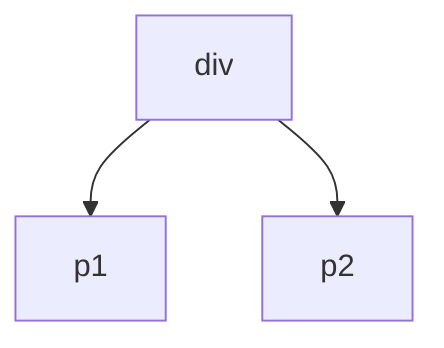
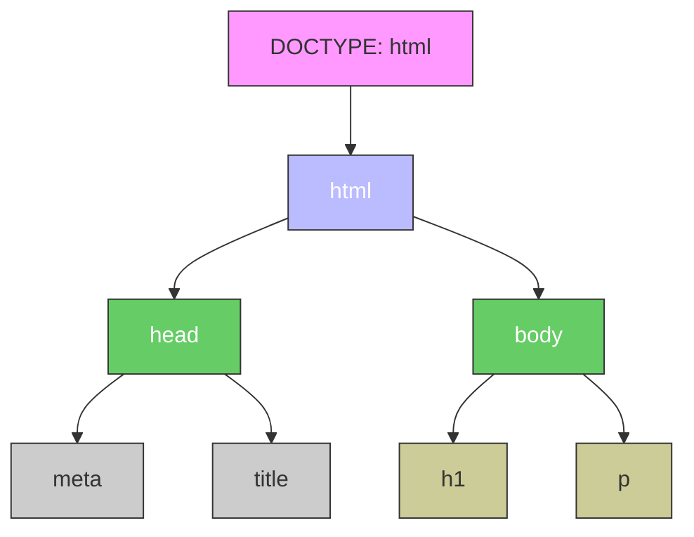
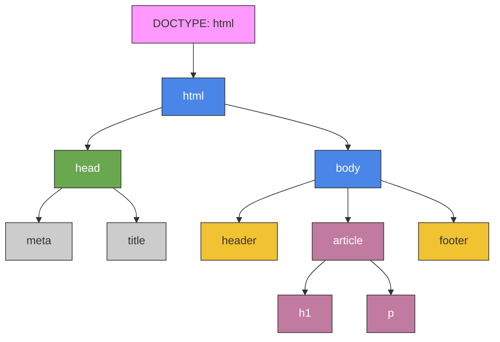

---
title: 3.09. HTML
---

# 3.09. HTML

## HTML – что это?

★ **HTML (HyperText Markup Language)** – язык разметки, который сообщает браузеру, отображать содержимое: где текст, где заголовки, где ссылки, где изображения. 

HTML предоставляет следующие возможности:
	- организовать данные в логические блоки: заголовки, абзацы, списки, таблицы, формы и другие элементы;
	- создать иерархическую структуру документа, где каждый фрагмент имеет своё место и назначение;
	- возможность описать значение содержимого, а не только его внешний вид;
	- позволяет браузерам, поисковым системам и другим инструментам лучше понимать, что находится на странице;
	- гипертекстовое соединение — возможность ссылаться на другие документы, изображения, медиа и сервисы;
	- поддерживает элементы, которые становятся точками взаимодействия с пользователем: кнопки, поля ввода, меню;
	- выступает платформой, на которой работают CSS (для стилей) и JavaScript (для поведения);
	- предоставляет структуру, которую можно адаптировать под экраны разных размеров и типов устройств.

Для ясности, можно представить себе простую картину – вы хотите вывести текст с заголовком, ссылкой и изображением. Тогда в голове мы бы сразу структурировали информацию:
***
# Заголовок

Некое содержание

[Ссылка](https://example.com)
***
И как раз, чтобы браузер выполнял распределение всех элементов, компоновал, отрисовывал и отображал в нужном порядке, информацию структурируют разметкой.

★ **Разметка** – это способ структурирования информации с помощью специальных меток (тегов). 
★ **Теги** – это строительные блоки HTML, команды в угловых скобках «`<`» и «`>`». Они бывают:
	- парные: `<тег>…</тег>` (например, `<p>Текст</p>`);
	- одиночные: `<тег>` (например, `` для изображений).

Браузер видит тег – ключевое слово, размеченное угловыми скобками, и понимает, что в этом месте нужен специфический объект, тип которого определён ключевым словом. Теги позволяют структурировать информацию, вкладывая их друг в друга, словно матрёшку, благодаря чему выстраивается иерархическая структура-дерево DOM.

```html
<div>
  <p>Текст внутри блока</p>
  <p>Текст внутри блока</p>
</div>
```



```
Интересный факт:
HTML родился из-за документов по физике. Физик Тим Бернерс-Ли работал в Европейском центре ядерных исследований, и столкнулся с проблемой – ученые писали документы на разных форматах, и было сложно делиться информацией, тогда он и собрал ENQUIRE – прототип будущего веба – HTML, HTTP, URL. Поэтому HTML был нужен не для создания сайтов, а чтобы физики могли обмениваться научными статьями. Так, ученые в очередной раз сделали нашу жизнь интереснее.

```

★ **DOM-дерево (Document Object Model, коротко DOM)**, где каждый HTML-тег является объектом. То есть, в работе не стоит пугаться этого слова – DOM – это просто «дерево тегов», где каждый – элемент, то есть объект. Вложенные теги будут являться «детьми» родительского элемента. И всё это DOM-дерево именуется «document» в JavaScript. Но к JS мы придём гораздо позже.

Первый тег в парном теге является открывающим, второй – закрывающий. То есть:
	- `<div>` будет открывающим тегом;
	- `</div>` закрывающим.
	
В одиночном теге он единственный, так что он и открывающий, и закрывающий.

★ **Атрибуты** – настройки тегов, которые добавляют к тегам дополнительную информацию (значение атрибута), и указываются внутри открывающего тега:

```html

```

	- тег - ``;
	- src – атрибут, указывающий путь к изображению;
	- ”test.jpg” – значение, которому равен src;
	- alt – атрибут, указывающий альтернативный текст;
	- ”Тест” – значение, сам альтернативный текст.
	
На первый взгляд, язык разметки HTML схож с XML. Однако, у них есть существенные отличия.

| HTML | XML |
| :--- | :---: |
|Фиксированный набор тегов;	|Теги придумывает сам разработчик;
|Теги предназначены для отображения контента в браузере;	|Теги предназначены для хранения и передачи данных;
|Можно пропускать некоторые закрывающие теги.	|Строгий синтаксис – все теги должны быть закрыты.

Давайте попробуем сразу на практике – создайте первую страницу, открыв Блокнот (Windows) или иной текстовый редактор (VS Code, Notepad++) и добавив в него следующее:

```HTML
<!DOCTYPE html>
<html lang=”ru”>
  <head>
    <meta charset=”UTF-8”>
    <title>Моя страница</title>
  </head>
  <body>
    <h1>Привет, мир!</h1>
    <p>Это моя первая HTML-страница.</p>
  </body>
</html>

```

После этого попробуйте сохранить с расширением файла .html и открыть файл при помощи любого браузера.

#### Из чего состоит веб-страница на HTML

1. Пролог (DOCTYPE и корневой тег), включающий:

	- `<!DOCTYPE>` - тег, объявляющий тип документа (HTML).
	- `<html>` - корневой тег всей страницы, словно самый главный родитель всего дерева.

Корневой тег html имеет атрибут lang, который указывает язык (в нашем случае, это ru – русский).

2. Обязательные и базовые теги

Всегда есть ряд обязательных тегов:
	- `<head>` - голова документа, которая хранит служебную информацию:
		- `<meta charset=”UTF-8”>` - кодировка текста;
		- `<title>` - заголовок вкладки браузера;
		- опционально - `<style>` и `<script>`, но мы пока не будем их затрагивать.
		- `<body>` - тело документа, то, что отобразится на странице – текст, изображения, ссылки.
		
`<title>` будет отображаться только на вкладке (заголовке окна):


а `<body>` покажет внутренности:


DOM-дерево будет выглядеть так:



Этих тегов уже достаточно для работы HTML. Попробуйте поэкспериментировать с текстом, если вам интересно. Замените текст заголовка, содержимое, можете добавить и ещё собственный фрагмент текста с заголовком (жирным шрифтом), закрытым в `<h1>`, и основным текстом (более мелкий шрифт), закрытым в `<p>`.

Необязательные теги же используются для улучшения структуры:
	- `<header>` - шапка сайта, верхняя часть сайта;
	- `<footer>` - подвал, нижняя часть сайта;
	- `<nav>` - навигационное меню;
	- `<article>`, `<section>` - смысловые блоки.

Давайте попробуем расширить нашу часть с новыми тегами – замените ваш тег `<body>` на новый со следующим содержимым:

```HTML
<body>
  <header>Логотип и меню</header>
  <article>
    <h1>Статья</h1>
    <p>Текст...</p>
  </article>
  <footer>Контакты</footer>
</body>

```

Это и есть самый базовый шаблон структуры сайта – уже обладая этими знаниями, можно собрать свою структуру.

DOM-дерево будет следующим:



Помимо обязательных тегов, можно выделить универсальные атрибуты – это такие атрибуты, которые характерны не для определённого тега, а работают почти с любыми тегами:
	- id – уникальный идентификатор, который делает элемент «единственным» на странице;
	- class – определяет класс для группировки элементов, к примеру, если нужно сделать фрагмент «вкладкой» или «контентом вкладки»;
	- style – определяет стиль (CSS-стиль, но об этом позже);
	- title – всплывающая подсказка при наведении.


## Кавычки и запятые

Два важных вопроса, которые мучают начинающих программистов:
1. Когда использовать кавычки двойные (`"`), одинарные (`'`), а когда апострофы (`’`)?
2. Когда использовать точки (`.`), запятые (`,`) и точку с запятой (`;`)?

В HTML, двойные кавычки — стандартное и рекомендуемое использование для значений атрибутов:
```html
<div class="main-content"></div>
```
Одинарные кавычки допускаются, но лучше использовать их только если внутри значения есть двойная кавычка:
```
<p title='He said "Hello"'>Some text</p>
```
Апострофы (`’`) — не используются в HTML как часть синтаксиса, но могут быть частью текста (например, в `&rsquo;`, `&#8217`; или Unicode).

Если вы используете фреймворки (React, Vue и т. д.), то часто предпочитают двойные кавычки для соответствия JSX/TSX.

Точка (`.`) : не используется в синтаксисе HTML.

Запятая (`,`) : может использоваться внутри атрибутов, если это часть значения:
```html
<div data-coords="100,200"></div>
```
Точка с запятой (`;`) : не используется в HTML, но встречается в URL (например, в параметрах):
```html
<a href="page.php?id=1;mode=dark">Link</a>
```
В чистом HTML эти символы не имеют специального значения для языка разметки, но могут быть частью значений.


## Форматирование текста

HTML позволяет своими встроенными инструментами менять вид текста:

| Тег | Описание |
|-----|---------|
| `<b>` | Жирный шрифт |
| `<i>` | Курсив |
| `<u>` | Подчёркивание |
| `<br>` | Перенос строки |
| `<hr>` | Горизонтальная линия |
| `<p>` | Абзац HTML (в отличие от переноса, выделяет набор данных отдельно) |
| `<h1>`, `<h2>`, …, `<h6>` | Заголовки. Отличаются встроенным форматированием, которое делает шрифт больше, жирнее и более выдающимся. В отличие от простого размера и формата, присваивает тексту «статус» заголовка, что позволяет работать с объектом |
| `<ul>` | Неупорядоченный (маркированный) список:`• раз`; `• два` |
| `<ol>` | Упорядоченный список: `1. раз`; `2. два` |
| `<li>` | Элемент списка:`<li>раз</li>` `<li>два</li>` |

```
Интересный факт:
HTML не требует точек с запятой, фигурных скобок и вообще почти ничего. Сделайте пустую страницу, наберите любой текст – всё отобразится, а некоторые части исправит сам браузер – в этом и проявляется гибкость языка.

```

## Ссылки и изображения

`<a>` - Гипертекстовая ссылка (гиперссылка) – текст, который позволяет при клике перейти по ссылке, указанной в атрибуте. Она будет выведена по умолчанию как подчёркнутый текст. 

Сама ссылка будет скрыта, но отображаться будет в виде текста, который называется анкор (anchor) – потому этот тег и называется «а». Пример ссылки:
```html
<a href="ссылка">анкор</a>
```

У тега `<a>` есть атрибуты:
	- charset – кодировка символов документа, на который ведёт ссылка;
	- coords – координаты ссылки в карте изображений;
	- download – документ по ссылке будет загружаться;
	- href – ссылка (URL страницы);
	- hreflang – язык документа по ссылке;
	- media – устройство вывода документа по ссылке;
	- name – имя анкора;
	- rel/rev – отношение с документом;
	- shape – форма ссылки в карте изображений;
	- target – где открывать документ по ссылке;
	- type – медиа тип документа по ссылке.

На практике, конечно, для `<a>`, используют в основном только href атрибут, так что на текущий момент достаточно запомнить лишь его – он обязательный.

Другой тег, похожий на `<a>` - ``.

`` - изображение, которое нужно отобразить на странице, и имеет атрибуты:
	- align – горизонтальное выравнивание содержимого;
	- alt – альтернативный текст (отображается, если элемент недоступен);
	- border – толщина границы (рамки) элемента;
	- height – высота изображения;
	- hspace – величина отступов слева и справа;
	- longdesc – гиперссылка на подробное описание изображения;
	- src – URL изображения;
	- vspace – величина отступов сверху и снизу от изображения;
	- width – ширина изображения.
	
Как и href у тега `<a>`, для `` атрибут src – путь к картинке, обязательный атрибут.

## Формы и айфреймы

Формы - `<form>` нужны для создания фрагмента страницы, в которой будет выполняться ввод данных – логины, поиск, опросы.
Попробуйте добавить в нашу страницу перед `<footer>` следующий фрагмент:
```html
<form action="/submit" method="POST">
  <label>Имя:</label>
  <input type="text" name="username" placeholder="Введите имя">
  <input type="submit" value="Отправить">
</form>
```
После обновления мы увидим:


Здесь: 
	- `<form>` - сама форма;
		- action - действие, к примеру, куда отправлять данные (`/submit` в нашем случае, разумеется никуда не отправится – обязательный атрибут;
		- method – метод HTTP-запроса (GET или POST, допустим);
	- `<input>` - поле для ввода;
		- type – тип, к примеру, text, password, email;
		- placeholder – подсказка в поле.
		
Также, элемент формы может содержать теги `<textarea>`, `<button>`, `<select>`, `<option>`, `<optgroup>`, `<fieldset>`, `<label>`.

`<input>` бывает нескольких типов, (type):
	- text – стандартное текстовое поле, можно добавить атрибут value, который будет содержать текст по умолчанию;
	- password – текстовое поле, но вводимые символы будут скрыты;
	- checkbox – поле флажков (чекбоксов), или «галочек», которые можно включить или выключить – добавляется атрибут checked, который задаёт начальное состояние – включен или выключен (checked/unchecked);
	- radio – переключатели (radiobuttons), которые работают по принципу checked/unchecked, но имеет два объекта, где выбирается или первый, или второй;
	- file – поле загрузки файла;
	- submit – кнопка отправки данных;
	- image – изображение вместо кнопки отправки, потребуется дополнительный атрибут src;
	- button – кнопка;
	- reset – кнопка сброса значений по умолчанию;
	- hidden – скрытое поле (скрытое от пользователя).
	
Кроме форм, можно встроить также «айфрейм» при помощи тега `<iframe>`, который позволяет встроить на другую страницу видео или карту. К примеру, на сервисе ВК Видео (Вконтакте) можно не просто поделиться ссылкой на видео, а скопировать код для вставки, и напрямую вставить в код своей страницы. 

`<iframe>` использует атрибуты:
	- src – ссылку на ресурс;
	- width / height – размеры областы (ширина и высота);
	- title – заголовок.

Так, к примеру, я могу добавить на свою страницу видео с котом:


Купились? Но так можно. Поверьте на слово :)

Айфрейм позволяет встроить виджеты на свою страницу, но при этом виджет становится зависимым от доступности ресурса по ссылке в src – если сервис, к примеру, будет заблокирован в стране просмотра, или недоступен – то он не будет отображаться на странице.

## Таблицы

Таблицы `<table>` используются для сетки данных, когда нужно разделить всё на строки, таблицы и ячейки:
```html
<table border="1">
  <tr>
    <th>Имя</th>
    <th>Возраст</th>
  </tr>
  <tr>
    <td>Анна</td>
    <td>25</td>
  </tr>
</table>
```

Мы увидим простую таблицу:

| Имя | Возраст |
|-----|---------|
| Анна | 25 |

Здесь:
	- `<table>` - таблица, border – атрибут для границ;
	- `<tr>` - строка таблицы;
	- `<th>` - заголовок колонки (столбца), по умолчанию жирный;
	- `<td>` - ячейка с данными.
	


## Работа с тегами и события

Сейчас мы рассмотрим некоторые новые теги, а также изучим особенности работы с ними.

В HTML, как и в других языках, есть комментарии – текст внутри кода, который игнорируется браузером и нужен для разработчиков, «читающих код». Если вы работали хоть раз с кодом с ИИ, то замечали, как он комментирует чуть ли не каждый шаг. Синтаксис представляет собой открывающий тег `<!-- и закрывающий -->`. Всё, что указано между открывающим и закрывающим, не будет отображено на странице. Комментарии нужны для пояснений к коду, временного отключения сомнительного кода и разметки секций. Их нельзя вкладывать друг в друга, они не работают внутри тегов и содержимое комментариев видно в исходном коде страницы на стороне клиента, так что – лучше не баловаться.

```html
<!-– это комментарий -->
```

	- `<span>` - тег для группировки строчных элементов и задания им определенных атрибутов, к примеру, если посреди текста нужно `<span style="color:blue;font-weight:bold">синий</span>` текст.
	- `<div>` - тег для выделения раздела или блока кода. Он нужен особенно в случаях, когда для определённой части кода используется особый CSS-стиль, к примеру, нужно определить, что есть вкладка, а что – контент вкладки.
	- `<meta>` - метаданные о HTML-документе, которые находятся внутри тега `<head>` - они используются для указания информационного набора общих сведений о странице.
	
То есть, `<div>` и `<span>` это «коробки» для структуры и текста, а `<meta>` - служебная информация о странице.

Для того, чтобы вместо простого текста была именно кнопка (специальный тип элемента), используется тег `<button>` - просто кликабельный и активный элемент, который позволяет обрабатывать события. К примеру, кнопка «Войти» на форме авторизации, или «Перейти» для перехода по ссылке (по аналогии с гиперссылкой). Кнопка может работать как тег `<a>`, а может обрабатывать событие.

В HTML есть такое понятие, как события – когда что-то происходит на странице с элементом:
	- onblur – когда элемент формы теряет фокус;
	- onchange – при изменениях в элементе;
	- onclick – клик мышью (левой кнопкой мыши);
	- ondblclick – двойной клик мышью;
	- onfocus – когда элемент получает фокус;
	- onkeydown – при нажатии клавиши;
	- onkeypress – при нажатии и отпускании клавиши;
	- onkeyup – при отпускании клавиши;
	- onload – когда загружены элементы (допустим в теге body);
	- onmousedown – при нажатии на кнопку мыши;
	- onmousemove – при движении указателя мыши;
	- onmouseout – при покидания указателя мыши района элемента;
	- onmouseover – при попадании указателя мыши в район элемента;
	- onmouseup – при отпускании кнопки мыши;
	- onreset – при сбросе элементов;
	- onsubmit – при отправке данных;
	- onunload – при закрытии страницы (в теге body).

При наступлении событий можно указать в значении такого атрибута ссылку на файл скрипта или название функции скрипта, которая будет выполняться. Эти функции пишутся на языке JavaScript и могут как быть включены в документ, так и выведены в отдельный файл.

Пример:

```html
<button onclick="/* скрипт или ссылка на него */">Текст кнопки</button>
```

Скрипт, встроенный в страницу, содержится как вложенный контент в элементе `<script>`. У тега `<script>` тоже есть атрибуты:
	- async – асинхронный режим работы скрипта;
	- charset – кодировка символов скрипта;
	- defer – отложенный режим запуска, до окончания загрузки страницы;
	- src – URL файла скрипта (для внешнего);
	- type – медиа-тип скрипта.
	
Но, для случаев, когда в браузере отключено отображение скриптов, или работает старый браузер, можно добавить резервный тег `<noscript>`, который выведет текст на случай, если скрипты отключены. Но JavaScript мы изучим чуть позже, ведь там уже идёт работа на языке программирования, а не разметки.

Если возникло желание погрузиться в HTML, то рекомендую ознакомиться с MDN - https://developer.mozilla.org/ru/docs/Web/HTML

Чит-лист - https://cheatsheets.zip/html

## Практика

```
Практическое задание
Выполните нижеуказанное задание.

```

Сейчас попробуйте сделать проект-калькулятор на HTML, базовый HTML-шаблон с полями для ввода чисел, кнопками операций (`+, -, , /, =`) и полем для отображения результата:
	- для ввода чисел используйте `input type="number"`;
	- кнопки – `<button>`, создайте кнопки операций +, -, *, /. =.
	- поле результата - `<div>`;
	- контейнер для калькулятора сделать как `<div class="calculator">`;
	- в качестве события используйте `<onclick>`;
	- обратите внимание на идентификаторы и классы – мы предусмотрим их заранее;
	- можете добавить комментарии на свой вкус;
	- можете разбавить страницу своими тегами и элементами для тренировки.

Подсказка:

```html
<div class="calculator">
  <input type="number" id="num1" placeholder="Первое число">
  <input type="number" id="num2" placeholder="Второе число">

  <button onclick="/* скрипт для суммирования*/">+</button>
  <button onclick="/* скрипт для вычитания */">-</button>
  <button onclick="/* скрипт для умножения */">*</button>
  <button onclick="/* скрипт для деления */">/</button>
  <button onclick="/* скрипт для вывода результата */">=</button>

  <div id="result">Результат: </div>

  <noscript>
    <p>Калькулятор требует JavaScript. Включите его в настройках браузера.</p>
  </noscript>
</div>
```


