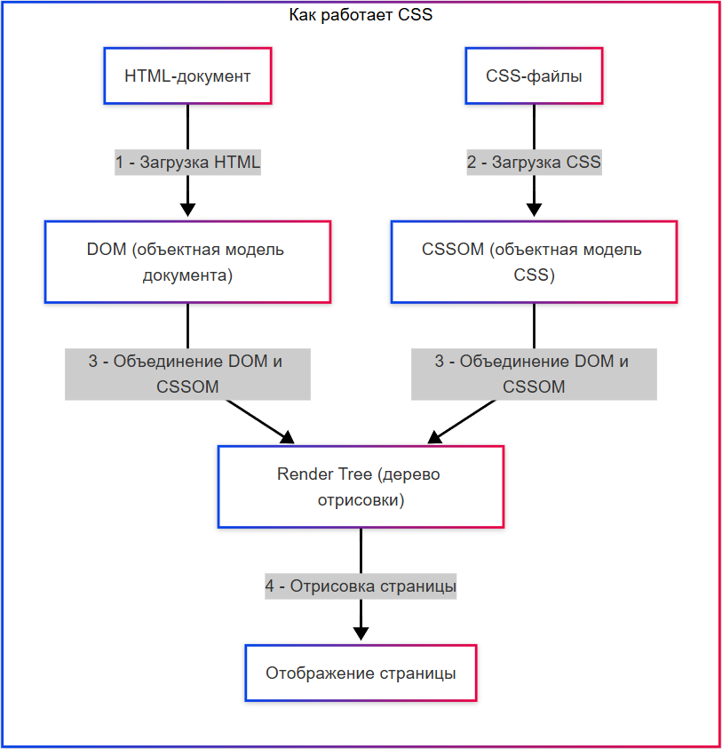

---
title: 3.10. CSS
---

# 3.10. CSS

## Общее о стилях

### Что такое CSS?

★ **CSS (Cascading Style Sheets)** – язык стилей, который определяет внешний вид HTML-документа, отвечающий за цвета, шрифты, расположение элементов, визуальные эффекты на веб-странице.

Какие возможности предоставляет CSS?
	- *задавать внешний вид элементов: цвета, шрифты, размеры, формы, тени, прозрачность*;
	- *превращает «голый» текст в графически оформленный документ*;
	- *управляет тем, где и как элементы будут отображаться относительно друг друга*;
	- *поддерживает гибкие и адаптивные макеты, которые меняются под разные устройства и ориентации экрана*;
	- *возможность создавать плавные переходы между состояниями элементов*;
	- *добавлять движения, трансформации, эффекты при взаимодействии пользователя*;
	- *реакции на действия пользователя (наведение, клик, фокус) и изменение внешнего вида в ответ*;
	- *управление начертанием текста: размер, межстрочный интервал, гарнитура, вес, стиль*;
	- *возможность рисовать фигуры, градиенты, тени, рамки, маски и другие визуальные элементы без изображений*;
	- *скрывать элементы или убирать их из потока документа, не удаляя из разметки*.

При работе с CSS можно встретить и LESS – препроцессор CSS, который расширяет возможности CSS, добавляя переменные, вложенные правила, функции и миксины, что упрощает написание и поддержку стилей. LESS-код компилируется в обычный CSS перед использованием в браузере.

К примеру, можно детально настроить оформление и сделать кнопку красивой, добавив цветов, теней и других особенностей:


CSS состоит из:
	- стилей – наборов свойств (например, `color: red;` )
	- селекторов – указателей, какие элементы стилизовать (`h1`, `.class`, `#id`);
	- правил – комбинаций селекторов и стилей.

CSS называется каскадным, потому что стили применяются по определённому порядку:
1. Приоритет источника (стиль браузера – авторские стили - `!important`);
2. Специфичность селектора (например, `#id` важнее `.class`);
3. Порядок объявления (поздние стили переопределяют ранние).

Представим, что HTML — это каркас дома, а CSS — всё то, что делает этот дом красивым, удобным и живым: краска, мебель, свет, оформление.

Давайте разберёмся, как с помощью CSS «добраться» до нужных частей этого дома, чтобы их изменить.

Когда вы пишете HTML, вы используете теги, например:
```HTML
<h1>Заголовок</h1>
<p>Абзац текста</p>
<a href="#">Ссылка</a>
```
Каждый тег — это элемент: `<h1>`, `<p>`, `<a>` и т.д.

Элемент — это основной строительный блок страницы. В CSS вы можете выбирать элементы по их имени и задавать им стиль.

Пример:
```CSS
p {
    color: blue;
}
```

— это значит: «все абзацы (`<p>`) сделай синими».

Иногда нужно стилизовать не все одинаковые элементы, а только некоторые. Например, не все ссылки должны быть красными, а только особые.

Для этого в HTML есть атрибут class:
```CSS
<a href="#" class="button">Нажми меня</a>
<a href="#">Обычная ссылка</a>
```

Теперь в CSS можно выбрать только те элементы, у которых есть класс button:
```css
.button {
    background-color: red;
    padding: 10px;
    text-decoration: none;
}
```


★ **Класс (например, .button)** – именованный стиль, который можно применять к разным элементам.  Это как ярлык или бирка, которую вы прикрепляете к элементу, чтобы потом легко найти его и применить нужный стиль. Один и тот же класс может быть у нескольких элементов. Класс начинается с точки: .button. 

★ **Стиль** – конкретное свойство (например, `font-size: 16px`).

CSS применяется к элементам HTML через селекторы. 

Селекторы (англ. select – выбор), «выборщики», определяют к каким элементам DOM применять стили. 

Примеры:
	- по тегу – `p {…}`;
	- по классу - `.header {…}`;
	- по идентификатору - `#main {…}`;
	- по атрибуту – `[type= "text"] {…}`;
	- комбинированные – 
		- `div.button.active {…}`, 
		- `div > p` (дочерний), 
		- `h1 + p` (соседний).
То есть, исходные данные для селекторов – это:
	- теги (`<p>`, `<div>`, `<h1>`) – `p { color: red; }`;
	- классы (атрибут `class="button"`) - `.button { … }`’
	- идентификаторы (атрибут `id="header"`) - `#header { … }`;
	- атрибуты (значения атрибутов).

Соответственно, выбираются данные так - `#id`, `.class`, тег.
Пример: у нас есть HTML для стилизации:
```html
<div class="box" id="main-box">Привет, мир!</div>
```
Подключаем CSS к этому элементу:
```html
/* По тегу, напрямую */  
div { font-size: 16px; }  
```
```css
/* По классу, через точку*/  
.box { background: yellow; }  

/* По ID, через # */  
#main-box { border: 1px solid black; }  
```
Логика написания самого селектора и свойств такова:
1) выбираем элемент (селектор);
2) пишем свойства (параметры стиля).
```css
  селектор {
    свойство: значение;
    свойство: значение;
}
```

### Как работает CSS?

#### Порядок работы

★ Как работает CSS?
	- Браузер загружает HTML и строит DOM (объектную модель документа);
	- Браузер загружает CSS и формирует CSSOM (объектную модель CSS);
	- DOM и CSSOM объединяются в Render Tree – дерево отрисовки, где каждому элементу присваиваются стили;
	- Браузер отображает страницу на основе дерева отрисовки.



CSS предоставляет мощные инструменты для управления внешним видом и поведением элементов:
	- Трансформации и анимации — добавляют движение.
	- Блочная модель — основа компоновки.
	- Позиционирование — контроль над расположением.
	- Фон и текст — визуальная выразительность.
	- Эффекты — завершающие штрихи.

#### Добавление

★ **Как добавить CSS в HTML?**

1. Встроенные стили (в теге через `style=`);
2. Внутри HTML (добавив тег `<style></style>`);
3. Внешний файл:
```html
<link rel="stylesheet" href="style.css">
```

```
Интересный факт:
До появления HTML5 и CSS3 анимации и интерактивность реализовывались через Flash. Сегодня всё это можно сделать даже в CSS, что делало его даже не просто языком стилей, а движком интерфейсов.

````


### Flex и Grid

Первоначально вёрстка была довольно сложной, и разработчики использовали float, inline-block, таблицы в HTML. Однако, после появления Flexbox (в 2009 году), и Grid (2017), подход к расположению блоков на странице изменился.

★ **Flexbox** – гибкая раскладка, модель CSS для создания гибких одномерных макетов (распределение элементов в строке или столбце). Используется для выравнивания элементов в строке / столбце, или для динамического распределения пространства.

Основные свойства Flexbox:
	- контейнер (display: flex)
```css
  .container {
    display: flex;
    flex-direction: row | column; /* Направление */
    justify-content: center | space-between; /* Выравнивание по главной оси */
    align-items: center | stretch; /* Выравнивание по поперечной оси */
    gap: 10px; /* Расстояние между элементами */
  }
```
	- элементы (flex-grow, flex-shrink, order)
```css
  .item {
    flex-grow: 1; /* Растягивание элемента */
    order: 2; /* Порядок в контейнере */
  }
```
★ **Grid** – двумерная сетка, мощная система для создания сложных двумерных макетов (строки + столбцы). Используется для сложных макетов (лендинги, таблицы), и когда нужен контроль и по строкам, и по столбцам.

Основные свойства:
	- контейнер (display: grid)
```css
  .container {
    display: grid;
    grid-template-columns: 1fr 2fr 1fr; /* Колонки */
    grid-template-rows: 100px auto; /* Строки */
    gap: 20px; /* Отступы */
  }
```
	- элементы (grid-column, grid-row)
```css
  .item {
    grid-column: 1 / 3; /* Занимает 1-2 колонки */
    grid-row: 1; /* Первая строка */
  }
```

## Адаптивность

★ **Адаптивный дизайн** – возможность подстраивать дизайн сайта под разные устройства. 

Адаптивный дизайн CSS включает в себя медиа-запросы (@media), а в HTML добавляют метатег для мобильных. Это позволяет решать проблемы масштабирования на мобильных, и использовать для мобильной и десктопной версии сайта, чтобы элементы меняли размеры/расположения на разных экранах.

★ Медиа-запросы (@media) в CSS

Медиа-запросы (@media) в CSS представляют собой механизм, позволяющий применять стили условно, в зависимости от характеристик устройства или окна просмотра (viewport), таких как ширина, высота, разрешение, ориентация и другие.

Синтаксис @media позволяет определять правила стилизации, которые активируются только при выполнении указанных условий. Это ключевой инструмент для реализации адаптивного и отзывчивого веб-дизайна.

```CSS
@media <медиа-тип> and (<условие>) {
    /* CSS-правила */
}
```

На практике чаще всего используется только условие по размеру экрана, а медиа-тип (например, screen, print) часто опускается — по умолчанию предполагается screen.

Примеры использования

```css
/* Только для экранов от 768px до 1024px */
@media (min-width: 768px) and (max-width: 1024px) {
    .grid { grid-template-columns: 1fr 1fr; }
}

/* Для мобильных устройств (до 768px) */
@media (max-width: 767.98px) {
    body { font-size: 14px; }
    .menu { display: none; }
}

/* Для печати */
@media print {
    .sidebar { display: none; }
    body { font-size: 10pt; }
}
```

Порядок медиа-запросов имеет значение при каскадировании. Обычно рекомендуется располагать их от меньших к большим размерам (mobile-first) или наоборот, но важно соблюдать согласованность.

Граничные значения (breakpoints) должны соответствовать реальным устройствам или дизайну макета. Распространённые точки: 320px, 768px, 1024px, 1200px.

Вместо фиксированных значений можно использовать переменные (через CSS custom properties) для централизованного управления breakpoints.

Медиа-запросы могут быть вложены внутрь других CSS-правил (начиная с CSS3), что улучшает читаемость:
```CSS
.component {
    display: block;

    @media (min-width: 768px) {
        display: flex;
    }
}
```

★ **Viewport** (метатег для мобильных) в HTML

Viewport — это область отображения веб-страницы, доступная пользователю для просмотра контента. В контексте веб-разработки термин «viewport» имеет особое значение при работе с мобильными устройствами и адаптивным дизайном.

Физический viewport — это фактическое разрешение экрана устройства (например, 360×640 пикселей). Определяется аппаратно.

Виртуальный (или layout) viewport — это область, которую браузер использует для отрисовки страницы. На мобильных устройствах по умолчанию он шире физического (обычно около 980px), чтобы обеспечить совместимость с сайтами, не предназначенными для мобильных устройств. Это приводит к необходимости масштабирования.

Без управления viewport содержимое может отображаться уменьшенным, требуя ручного масштабирования со стороны пользователя, что ухудшает UX.

Чтобы корректно управлять отображением на мобильных устройствах, используется метатег:

```html
<meta name="viewport" content="width=device-width, initial-scale=1.0">
```

Параметры атрибута content:
	- width=device-width — устанавливает ширину виртуального viewport равной ширине экрана устройства.
	- initial-scale=1.0 — задаёт начальный коэффициент масштабирования, равный 1 (без увеличения).
	- user-scalable=yes|no — разрешает или запрещает пользователю масштабировать страницу.
	- minimum-scale, maximum-scale — ограничивают диапазон масштабирования.
	- height — аналогично width, но для высоты (используется редко).

Пример расширенного метатега:

```HTML
<meta name="viewport" content="width=device-width, initial-scale=1.0, user-scalable=no, minimum-scale=1.0, maximum-scale=2.0">
```
Примечание: запрет масштабирования (user-scalable=no) может снижать доступность и не рекомендуется без веской причины.

После установки width=device-width медиа-запросы начинают работать относительно реальной ширины экрана.

Например:
```css
@media (max-width: 768px) {
    /* Применится, когда ширина viewport ≤ 768px */
}
```

Такой подход позволяет строить адаптивные макеты, где структура и стиль изменяются в зависимости от размера устройства.

На некоторых смартфонах (например, iPhone с notch) существуют так называемые unsafe areas — зоны, перекрытые элементами корпуса (вырезом, скруглениями). Для их учёта используются env() переменные:
```css
body {
    padding-top: env(safe-area-inset-top);
    padding-left: env(safe-area-inset-left);
    padding-right: env(safe-area-inset-right);
    padding-bottom: env(safe-area-inset-bottom);
}
```

Это предотвращает обрезание контента в угловых зонах экрана.

★ Переменные в CSS (custom properties) – свойства, которые позволяют хранить и переиспользовать значения (цвета, отступы, к примеру). Они упрощают поддержку кода и позволяют динамически менять их (например, через JavaScript). Таким образом, можно указать не конкретное значение, допустим, цвета, а дать указание на использование значения переменной через var(). Вот как их можно объявить и использовать:

```CSS
  :root {
    --primary-color: #3498db;
    --spacing: 20px;
  }
  
  .button {
    background: var(--primary-color);
    padding: var(--spacing);
  }

```

## Кавычки и запятые

Два важных вопроса, которые мучают начинающих программистов:
1. Когда использовать кавычки двойные (`"`), одинарные (`'`), а когда апострофы (`’`)?
2. Когда использовать точки (`.`), запятые (`,`) и точку с запятой (`;`)?

В CSS можно использовать оба типа кавычек в значениях, где они требуются (например, в url() или content):
```css
background-image: url("image.jpg");
content: 'Chapter 1';
```
Разницы между `'` и `"` нет , но важно соблюдать консистентность (согласованность).

Апострофы — не являются частью синтаксиса CSS, но могут встречаться в строках (например, в content).

Используйте один стиль во всем проекте для лучшей читаемости.

Точка (`.`) : используется для выбора классов:
```css
.container { width: 100%; }
```
Запятая (`,`) : разделяет селекторы:
```css
h1, h2, h3 { color: red; }
```
Точка с запятой (`;`) : обязательна после каждого свойства:
```css
p {
  font-size: 16px;
  color: black;
}
```
Последнее свойство в блоке можно без точки с запятой, но лучше всегда ставить — так проще редактировать код.

## Псевдо-селекторы

Псевдо-селекторы (псевдоклассы и псевдоэлементы) позволяют стилизовать элементы в особых состояниях или определённых частях документа без добавления лишних классов или HTML-разметки, чтобы точечно управлять стилями.

Псевдоклассы ( `:pseudo-class`) в определённом состоянии. Псевдоклассы пишутся с одним двоеточием.
Помните, что такое классы? Теперь представьте, что вы хотите изменить элемент не всегда, а только в определённой ситуации.

Например:
	- Когда пользователь наводит мышку на кнопку.
	- Когда ссылка уже была посещена.
	- Когда это первый элемент в списке.
Для этого используются псевдоклассы.

Они записываются через двоеточие после селектора:
```CSS
a:hover {
    color: orange;
}
```
— это значит: «когда на ссылку наводят мышкой — сделай её оранжевой».

Ещё примеры:
```CSS
p:first-child {
    font-weight: bold;
}
```
— «если абзац — первый среди своих "братьев и сестёр" (соседей), сделай его жирным».

```css
input:focus {
    border: 2px solid green;
}
```
— «когда поле ввода активно (на нём курсор), обведи его зелёной рамкой».

Это способ сказать: «примени стиль, если элемент находится в каком-то особом состоянии или занимает особое положение».


★ **Динамические (взаимодействие с пользователем)**

| Псевдокласс | Описание | Пример |
| :--- | :---: | ---: |
|`:hover`	|При наведении курсора	|`a:hover { color: red; }`
|`:active`	|В момент клика	|`button:active { opacity: 0.8; }`
|`:focus`	|При фокусе (например, input)	|`input:focus { border-color: blue; }`
|`:visited`	|Посещённая ссылка	|`a:visited { color: purple; }`

★ **Структурные (положение в DOM)**

| Псевдокласс | Описание | Пример |
| :--- | :---: | ---: |
|`:first-child`	|Первый дочерний элемент	|`li:first-child { font-weight: bold; }`
|`:last-child`	|Последний дочерний элемент	|`div:last-child { margin-bottom: 0; }`
|`:nth-child(n)`	|Элемент под номером n	|`tr:nth-child(2n) { background: #f5f5f5; }`
|`:not(selector)`	|Все элементы, кроме указанных	|`p:not(.warning) { color: black; }`

★ **Состояния элементов**

| Псевдокласс | Описание | Пример |
| :--- | :---: | ---: |
|`:checked`	|Выбранный чекбокс / радио-кнопка	|`input:checked + label { color: green; }`
|`:disabled`	|Отключённый элемент формы	|`button:disabled { opacity: 0.5; }`
|`:empty`	|Пустой элемент (без детей)	|`div:empty { display: none; }`

Псевдоэлементы `(::pseudo-element)` стилизуют части элемента (например, первую букву или строку). Псевдоэлементы пишутся с двумя двоеточиями.

А теперь представьте, что вы хотите добавить что-то новое, чего нет в HTML. 

Например:
	- Маленькую иконку после каждой ссылки.
	- Кавычки в начале цитаты.
	- Стилизовать только первую букву абзаца.

Вы не хотите ради этого писать лишние теги. Вот тут и помогают псевдоэлементы. Они создают виртуальные части элемента — как будто они есть, но в коде их нет. Записываются через два двоеточия:
```CSS
.quote::before {
    content: "“";
    font-size: 1.5em;
}

.quote::after {
    content: "”";
    font-size: 1.5em;
}
```
— это добавит кавычки в начало и конец любого элемента с классом .quote.

Ещё пример:
```CSS
p::first-letter {
    font-size: 2em;
    float: left;
    margin-right: 5px;
}
```
— «сделай первую букву абзаца большой и обтекаемой».

```CSS
li::marker {
    color: red;
}
```
— «сделай маркер списка (точку или цифру) красным».

Это способ добавить или изменить часть элемента, не меняя HTML. Это как волшебная кисточка, которая рисует что-то сверху, снизу, внутри — там, где физически нет отдельного тега.

Эти инструменты вместе дают полный контроль над тем, как выглядит ваш сайт — от общих форм до мельчайших деталей.


★ Основные псевдоэлементы

| Псевдокласс | Описание | Пример |
| :--- | :---: | ---: |
|`::before	||Вставляет контент перед элементом	|`.quote::before { content: ""; }`
|`::after	|Вставляет контент после элемента	|`.link::after { content: ""; }`
|`::first-letter`	|Первая буква элемента	|`p::first-letter { font-size: 2em; }`
|`::first-line`	|Первая строка элемента	|`article::first-line { font-weight: bold; }`
|`::selection`	|Стиль выделенного текста	|`::selection { background: yellow; }`


## Анимации и трансформации

Эти свойства позволяют делать веб-страницу динамичной — добавлять движение, плавные переходы и визуальные эффекты. 

animation – создаёт сложные анимации с ключевыми кадрами (@keyframes)/ Позволяет создавать многокадровые анимации, задавая ключевые точки («кадры») во времени.:
```css
  @keyframes slide {
    from { transform: translateX(0); }
    to { transform: translateX(100px); }
  }
  .box {
    animation: slide 2s infinite;
  }
```
Сначала определяется анимация с помощью @keyframes, это означает: «анимация slide начинается с позиции 0 и заканчивается на 100px вправо». Затем она присваивается элементу. 
	- slide — имя анимации.
	- 2s — длительность одного цикла.
	- infinite — повторять бесконечно.

Другие значения:
	- alternate — менять направление после каждого цикла.
	- paused / running — управлять воспроизведением.
	- ease-in, linear — функция сглаживания.

Можно использовать проценты вместо from/to:
```CSS
@keyframes pulse {
    0%   { opacity: 1; }
    50%  { opacity: 0.5; }
    100% { opacity: 1; }
}
```

transform – изменяет форму/положение элемента. Позволяет масштабировать, поворачивать, перемещать или наклонять элемент без изменения потока документа (остальные элементы ведут себя так, будто он на месте):
```css
  .element {
    transform: rotate(45deg) scale(1.2) translate(10px, 20px);
  }
```
— элемент повернётся на 45°, увеличится в 1.2 раза и сместится на 10px вправо и 20px вниз.
Основные функции:
	- translate(x, y) — сдвигает элемент по осям X и Y.
	- rotate(angle) — поворачивает (в градусах: 45deg, -90deg).
	- scale(factor) — увеличивает/уменьшает (scale(1.5) — в 1.5 раза больше).
	- skew(ax, ay) — наклоняет по осям.


transition – плавное изменение свойств. Делает изменение CSS-свойств плавным при смене состояния (например, при наведении курсора):
```css
  .button {
    transition: background 0.3s ease;
  }
  .button:hover {
    background: red;
  }
```
— при наведении фон изменится от синего к красному за 0.3 секунды с плавным ускорением/замедлением.

Синтаксис:
```
transition: <свойство> <длительность> <функция сглаживания>;
```
	- `<свойство>` — какое свойство анимировать (background, color, opacity, transform и др.).
	- `<длительность>` — сколько длится переход (0.3s, 2s).
	- `<функция сглаживания>` — как проходит анимация (ease, linear, ease-in-out).

animation мощнее transition: позволяет описывать много шагов, повторы, задержки (animation-delay), состояние паузы.


## Блочная модель (Box Model)

Каждый элемент на странице — это прямоугольная «коробка». Эта коробка состоит из нескольких слоёв:
```
     МАРЖИНЫ (margin)
┌─────────────────────────────┐
│       ПАДДИНГИ (padding)    │
│  ┌─────────────────────┐    │
│  │      КОНТЕНТ         │    │
│  │                     │    │
│  └─────────────────────┘    │
│        border               │
└─────────────────────────────┘
```

content — содержимое. То, что внутри: текст, изображение, вложенные элементы.

margin – внешние отступы. Пространство вне границы, отделяющее элемент от других. Не имеет фона, всегда прозрачное:
```css
  div {
    margin: 10px;       /* Все стороны */
    margin-top: 20px;   /* Индивидуально */
  }
```

margin управляет расстоянием до соседних элементов. Может "схлопываться" (collapse) между вертикальными блоками.

padding – внутренние отступы. Пространство между содержимым и границей (border). Увеличивает общую занимаемую площадь:
```css
  div {
    padding: 15px;
  }
```
padding находится внутри границы и имеет фон того же цвета, что и элемент.


border: видимая граница (входит в размер элемента). Включает:
	- ширину (2px),
	- стиль (solid, dashed, dotted),
	- цвет (black).
border входит в общую ширину и высоту элемента (если не используется box-sizing: border-box).

outline: контур вокруг элемента (не влияет на размер):
```css
  .box {
    border: 2px solid black;
    outline: 1px dashed red;
  }
```
Похож на border, но не входит в размеры элемента, рисуется вокруг margin, не может быть скруглён через border-radius, обычно используется для фокуса (accessibility). Используется браузером по умолчанию при tab-навигации.

## Размеры и позиционирование

width и height задают ширину и высоту содержимого (если не указано иное).

width – ширина;

height – высота:
```css
  .container {
    width: 100%;
    min-height: 200px;
  }
```

Поддерживают:
	- абсолютные значения: px, cm, in,
	- относительные: %, em, rem, vw, vh.

Важно: реальный размер зависит от box-sizing. По умолчанию — content-box (размер без padding и border). Лучше использовать border-box: 
```css
* {
    box-sizing: border-box;
}
```

position – позиционирование, бывает следующих типов:
	- static (по умолчанию);
	- relative (сдвиг относительно себя);
	- absolute (относительно ближайшего positioned-родителя);
	- fixed (относительно окна браузера);
	- sticky (гибрид relative + fixed).
```css
.header {
    position: fixed;
    top: 0;
    left: 0;
    width: 100%;
}
```
— хедер будет всегда сверху экрана при прокрутке.


## Фон и цвет

background – фон, может включать цвет, изображение, положение, размер, повторение:
```css
  body {
    background: url("image.jpg") no-repeat center / cover;
  }
```
— фоновое изображение по центру, без повтора, растянуто на весь блок.

color – цвет текста. Задаёт цвет символов внутри элемента:
```css
  h1 {
    color: #FF5733;
  }
```
Форматы:
	- HEX: #FF5733
	- RGB: rgb(255, 87, 51)
	- RGBA: rgba(255, 87, 51, 0.8) — с прозрачностью.
	- Названия: red, blue (ограниченный набор).


## Текст и шрифты

font – шрифт:
```css
  p {
    font-family: "Arial", sans-serif;
    font-size: 16px;
    font-weight: bold;
  }
```

font-family — семейство шрифтов. Список шрифтов через запятую. Браузер использует первый доступный.
```css
font-family: "Arial", "Helvetica", sans-serif;
```
	- "Arial" — желаемый шрифт.
	- sans-serif — запасной вариант (шрифт без засечек).

font-size — размер шрифта. Единицы:
	- px — фиксированный размер.
	- em — относительно размера родителя.
	- rem — относительно корневого (`<html>`) элемента.
	- vw — относительно ширины окна.

font-weight — жирность. От 100 до 900 (400 = normal, 700 = bold).

text-align — выравнивание текста
	- left, right, center, justify (по ширине).

text-decoration — декоративные линии
	- underline — подчёркивание,
	- overline — надчёркивание,
	- line-through — зачёркивание.
	
line-height — межстрочный интервал. Задаёт высоту строки. Рекомендуется значение 1.4–1.6 для читаемости.


text – свойства текста:
```css
  .text {
    text-align: center;
    text-decoration: underline;
    line-height: 1.5;
  }
```

## Специальные эффекты

box-shadow – тень элемента:
```css
  .card {
    box-shadow: 0 4px 8px rgba(0,0,0,0.1);
  }
```
— тень смещена на 4px вниз, размытие 8px, полупрозрачная.

column-count – мультиколоночность. Разбивает текст на несколько колонок, как в газете:
```css
  .article {
    column-count: 3;
    column-gap: 20px;
  }
```

Если возникло желание погрузиться в CSS, то рекомендую ознакомиться с MDN - https://developer.mozilla.org/ru/docs/Web/CSS

Чит-лист - https://cheatsheets.zip/css3

## Практика

```
Практическое задание
Выполните нижеуказанное задание.

```

В предыдущей главе мы создавали свой мини-проект - калькулятор на HTML, добавим стили с помощью CSS-файла, чтобы сделать калькулятор более привлекательным:
	- создайте файл style.css и выведите стили туда;
	- добавим визуальные и текстовые подсказки при наведении на поля и кнопки;
	- добавим плейсхолдеры в полях ввода;
	- добавим сообщение об ошибке;
	- добавим чёткое обозначение места для результата;
	- добавим адаптивный дизайн для мобильных устройств
	- добавьте основные стили - calculator, calculator:hover;
	- поля ввода с подсказками:
		- input-group, 
		- input-group input, 
		- input-group input:focus, 
		- input-group .tooltip, 
		- input-group:hover .tooltip
	- кнопки операций:
		- buttons;
		- button;
		- button:hover;
		- button:active;
	- блок результата: result;
	- сообщение об ошибке – error-message;
	- элементы адаптивности - @media для calculator.


Проверьте html:

1.  добавьте в head:
```html
<link rel="stylesheet" href="style.css">
```
2.  адаптируйте body под наш CSS:
```html
<div class="calculator">
  <div class="input-group">
    <input type="number" id="num1" placeholder="Введите число">
    <span class="tooltip">Первое число для операции</span>
  </div>
  <div class="input-group">
    <input type="number" id="num2" placeholder="Введите число">
    <span class="tooltip">Второе число для операции</span>
  </div>
  <div class="buttons">
    <button title="Сложение">+</button>
    <button title="Вычитание">-</button>
    <button title="Умножение">×</button>
    <button title="Деление">÷</button>
  </div>
  <button class="equals" title="Вычислить результат">=</button>
  <div class="result" id="result">Здесь будет результат</div>
  <div class="error-message" id="error"></div>
  <noscript>
    <div class="error-message">
      Для работы калькулятора требуется JavaScript. Пожалуйста, включите его в настройках браузера.
    </div>
  </noscript>
</div>
```

3.  вот как должен будет выглядеть CSS:
```css
.calculator {
    background: white;
    border-radius: 20px;
    box-shadow: 0 10px 30px rgba(0, 0, 0, 0.1);
    padding: 30px;
    width: 320px;
    margin: 40px auto;
    transition: transform 0.3s ease;
  }
  
  .calculator:hover {
    transform: translateY(-5px);
  }
  
  .input-group {
    position: relative;
    margin: 15px 0;
  }
  
  .input-group input {
    width: 100%;
    padding: 12px 15px;
    border: 2px solid #e0e0e0;
    border-radius: 10px;
    font-size: 16px;
    transition: all 0.3s;
  }
  
  .input-group input:focus {
    border-color: #6c63ff;
    outline: none;
    box-shadow: 0 0 0 3px rgba(108, 99, 255, 0.2);
  }
  
  .input-group .tooltip {
    visibility: hidden;
    width: 120px;
    background-color: #555;
    color: #fff;
    text-align: center;
    border-radius: 6px;
    padding: 5px;
    position: absolute;
    z-index: 1;
    bottom: 125%;
    left: 50%;
    transform: translateX(-50%);
    opacity: 0;
    transition: opacity 0.3s;
  }
  
  .input-group:hover .tooltip {
    visibility: visible;
    opacity: 1;
  }
  
  .buttons {
    display: grid;
    grid-template-columns: repeat(4, 1fr);
    gap: 10px;
    margin: 20px 0;
  }
  
  button {
    background: #6c63ff;
    color: white;
    border: none;
    padding: 15px 0;
    border-radius: 10px;
    font-size: 18px;
    cursor: pointer;
    transition: all 0.3s;
  }
  
  button:hover {
    background: #5a52e0;
    transform: translateY(-2px);
  }
  
  button:active {
    transform: translateY(0);
  }
  
  .result {
    margin-top: 20px;
    padding: 15px;
    background: #f8f9fa;
    border-radius: 10px;
    font-size: 18px;
    text-align: center;
    border: 1px dashed #dee2e6;
    min-height: 20px;
  }
  
  .error-message {
    color: #dc3545;
    font-size: 14px;
    margin-top: 5px;
    display: none;
  }
  
  @media (max-width: 400px) {
    .calculator {
      width: 100%;
      padding: 20px;
    }
  }
```


