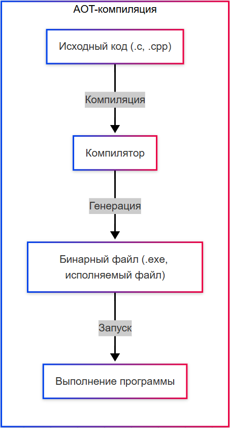
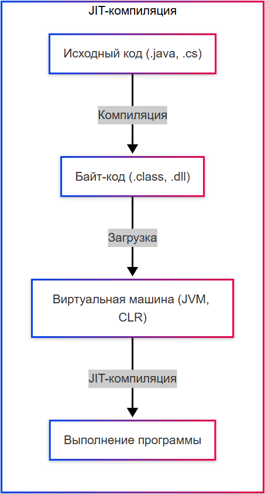
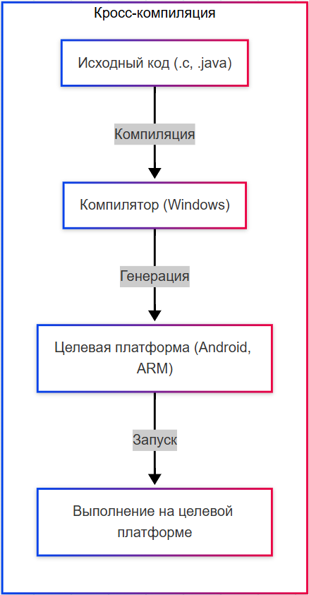
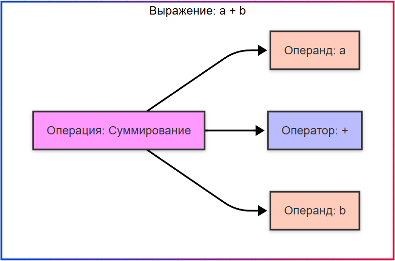

---
title: 4.02. Что такое код и как он работает
---

# 4.02. Что такое код и как он работает

## Теория кодирования

```
Код - понятие широкое, подразумевает закодированную информацию.
Чем бывает код?
QR-коды, штрихкоды, номера, текст, машинный, байт, шифрованный код.
А код в программировании?
Кодирование - это защита от ошибок, сжатие и структурирование информации.
Зачем кодировать информацию?
Бит, байт, символ, алфавит, бинарность
Канал связи - идеальный и реальный (с шумом)
Кодовое слово, кодовая книга, длина и мощность кода
Скорость кода
коды сжатия (источниковые коды)
Код Хаффмана
Арифметическое кодирование
LZ77, LZ78, LZW - словарные методы
Энтропия Шеннона и Теорема Шеннона - пропускная способность
Корректирующие (помехоустойчивые) коды
Контрольная сумма
Код Хэмминга и расстояние Хэмминга
Линейные коды, циклические коды
Коды Рида-Соломона
LDPC и Turbo-коды
Как работает QR-код и штрих-код
Исходный код и то, что программисты подразумевают под «кодированием» - написание кода

```

## Понятие кода

Прежде, чем перейдём к коду, давайте сразу подчеркнём важнейший момент.

Существует два подхода к логике работы программ - алгоритмический язык и собственно реальный язык кода или программирования.

В голове мы рисуем себе некий алгоритм, когда формируем и декомпозируем задачу. На бумаге (в коде) же мы отражаем уже готовый код, который мы пишем строго на условиях и правилах, принятых в соответствующем языке программирования. И да, программирование выполняется на английском языке, и большинство выражений в языках означают прямо то, что они подразумевают в прямом переводе (например, «if» - «если»). Поэтому знание английского языка будет не лишним в IT, и значительно поможет формулировать логику.

Алгоритмический язык же пишется в том порядке, как мы изучили алгоритмы - мы пишем всё так, как понимаем - определяем шаги, и пишем на языке понимания, к примеру `ЕСЛИ <условие> ТО <действие> ИНАЧЕ <другое действие>`. Потом мы превращаем это в код - `IF <условие> THEN <действие> ELSE <другое действие>` (с учётом правил соответствующего языка).

★ **Код** – это набор инструкций, написанных на языке программирования, который преобразуется в действия компьютера.

★ **Блок кода** – логически связанная группа инструкций. Обычно выделяется отступами (Python) или фигурными скобками (Java/C#):

```Java
{ всё что между скобками – блок кода }
```
```python
или так:
	это начало блока
	это конец блока
	
```

```
Практическое задание
Попробуйте составить блок кода. Не важно, что вы напишете внутри. Главное - запомнить, где у него начало, а где - конец.
```

Блок может быть частью условия, цикла, функции или любого другого контекста.

Вложенность (nesting) — это ситуация, когда один блок находится внутри другого - так можно выполнять одни, к примеру, условные действия, внутри других условий, для обработки данных внутри циклов, чтобы строить сложную логику «если А, то проверь Б, и если Б верно, сделай В».

```Java
{
    блок кода {
        ещё блок {
            ещё блок {
                ...и так сколько угодно;
            }
        }
    }
}
```

Разные языки используют разные способы указания начала и конца блока, к примеру, в большинстве языков блок выделяется символами `{` и `}`, а Python - отступами.

★ **Кодирование** – процесс написания исходного кода по определённым правилам языка. Код может писаться в любом текстовом редакторе, либо сразу в специальных программах, которые обладают дополнительными возможностями для удобной работы с кодом.

Важно отличать кодирование/декодирование от кодирования в контексте программирования. Само по себе кодирование — это широкое понятие, включающее в себя простой процесс - превращения чего-то исходного в код. Декодирование - наоборот, превращение кода во что-то другое.

И в нашем случае, мы говорим о том, что кодирование — это написание исходного кода на конкретном языке программирование. Код пишется на языке, понятном программисту. Но как машина понимает этот код, она что, знает английский? Не совсем. Специальный инструмент, называемый компилятором, превращает этот код, понятный программисту, в код, понятный машине - машинный код.

★ **Компиляция** – преобразование всего исходного кода в машинный код до запуска программы по принципу:
```
Исходный код → Компилятор → Исполняемый файл → Процессор
```

Виды и особенности компиляции:

	- AOT-компиляция (Ahead Of Time) – код компилируется перед запуском полностью (C, C++);
	- JIT-компиляция (Just In Time) – код компилируется во время выполнения (Java, C#);
	- Кросс-компиляция – компиляция кода для другой платформы, например, при компиляции кода для среды Android в Windows.

Таким образом, компилятор берёт исходные данные (код - исходный код) и выполняет свою собственную задачу - конвертацию (преобразование), превращение. Компилятор — это тоже программа.







★ **Интерпретация** – построчное выполнение кода без предварительной компиляции, когда интерпретатор читает и выполняет код строку за строкой. Это медленнее компиляции (из-за построчного выполнения и отсутствия оптимизации на этапе компиляции), но не требует отдельного этапа компиляции, работая по принципу:
```
Исходный код → Интерпретатор → Выполнение
```

Виды и особенности интерпретации:
	- Полная интерпретация – каждая строка переводится в машинный код при каждом запуске (на старых версиях BASIC);
	- Байт-код + Виртуальная машина – код сначала компилируется в байт-код, а затем выполняется виртуальной машиной (Python);
	- JIT-интерпретация (Just In Time) – байт-код компилируется в машинный код на лету (например, JavaScript в V8 – специальном движке в Google).


Многие языки используют гибридный подход. В Java код компилируется в байт-код, а затем интерпретируется виртуальной машиной. Это распространённый способ.

Интерпретируемый язык выполняет свои операторы в порядке «строка за строкой». Такие языки, как Python, Javascript, R, PHP и Ruby, являются яркими примерами интерпретируемых языков. Программы, написанные на интерпретируемом языке, запускаются непосредственно из исходного кода, без промежуточного этапа компиляции.

★ **Трансляция** – общее название для преобразования кода из одной формы в другую. Включает компиляцию в машинный код и транспиляцию (из языка в язык, например TypeScript → JavaScript).

Здесь важно отметить, что это понятие не нужно путать с компиляцией и интерпретацией. В ряде случев, может существовать некая «надстройка» над языком, которая проверяет сначала свои правила, а затем уже выполняет интерпретацию или компиляцию. Как раз TypeScript сам по себе не язык программирования, а надстройка над JavaScript, и имеет свои требования к синтаксису. TS сначала проверяет по своим правилам, а затем выполняется транспиляция в JavaScript, который уже выполняется как обычно.

Такие надстройки называют суперсет (superset), которые расширяют базовый язык, добавляя новые возможности, но оставаясь совместимым с ним, имея при этом свои собственные правила и синтаксис.

★ **Машинный код** – текст программы, понятный компьютеру. Фактически, там уже вовсе не текст, а набор сигналов. Программа понимает по принципу «есть сигнал» или «нет сигнала».

★ **Байт-код** – компактное представление программы, но читаемое не процессором, в отличие от машинного кода, а виртуальной машиной – интерпретатором. Длина каждого кода операции составляет один байт.

★ **Исходный код** – текст программы, написанный программистом, который затем преобразуется в исполняемый файл.


Если сравнить их, то будет такая картина:

| Код | Кому предназначен |
| :--- | :---: |
|Машинный код 💻	|Предназначен для устройства – процессора
|Байт-код 🔩	|Предназначен для движка, платформы или виртуальной машины
|Исходный код 📝	|Предназначен для чтения программистом

Когда компилятор или интерпретатор анализирует исходный код, он сначала строит **конкретное синтаксическое дерево (КСД)** — точное отражение грамматики языка. Но оно слишком детализировано и содержит много лишней информации, не влияющей на смысл программы.

**Абстрактное синтаксическое дерево (АСД)** — это структура данных, представляющая семантическую структуру исходного кода программы после его разбора (парсинга), без учёта синтаксических деталей, таких как скобки, точки с запятой, ключевые слова. АСД — это упрощённая, «очищенная» версия КСД, в которой остаются только существенные для семантики элементы: операторы, выражения, переменные, вызовы функций и т.д.

У каждого кода есть некий набор заранее подготовленных слов, которые являются синтаксическими конструкциями, иначе – синтаксисом – это правила, которые определяют, как писать код на определенном языке.

Синтаксис включает в себя ключевые слова, операторы, символы и структуры данных. Правила синтаксиса **очень важны**. 

**Ключевые слова** — это зарезервированные слова, которые имеют специальное значение в языке. Например, if используется для условных выражений, а for для циклов. Эти слова нельзя использовать для других целей, таких как имена переменных или функций, так как они уже заняты самим языком. Если использовать неверное ключевое слово - будет ошибка.

**Символы** — это важный элемент любого кода. Например, угловые скобки где-то могут означать сравнения (`<`, `>`), а где-то - начало и конец тега (`<это тег>`). Но самые важные символы в коде — это запятая (,) и точка с запятой (;). Если нарушить правила синтаксиса и забыть поставить точку с запятой в коде, программа не скомпилируется или завершится с ошибкой.

Операторы — это специальные выражения, которые определяют поведение или условие. Соответственно, оператор с условием — это условный оператор. В различных языках используются условные операторы.

★ **Условный оператор** – контроль потока выполнения программы, позволяющий выбрать действие в зависимости от условия. Важно понимать, что такое оператор, операция и операнд.



★ **Операция** – действие, например, суммирование.

★ **Операнд** – данные, над которым выполняется операция (в `a+b`, a и b – операнды).

★ **Оператор** – символ или ключевое слово, выполняющее операцию (if, for, =, +).

Таким образом, в выражении «a + b»:
	- `a+b` это операция суммирования;
	- a и b это операнды;
	- + это оператор.

Структуры данных мы уже изучили ранее, поэтому на них мы останавливаться не будем.

И между ключевыми словами, которые зарезервированы в языках, есть некие указатели данных - ведь в нашем примере a и b — это не сами данные, а лишь именованные элементы. Мы не суммируем буквы переменных, мы суммируем то, чему равняется a и b. Это - переменные.

★ **Переменные** – именованная область памяти, которая хранит данные. Её можно представить как коробку с названием, в которой лежит значение. Это основной инструмент для работы с данными в программировании. Например, мы можем создать переменную age и сохранить в неё возраст пользователя и использовать это значение в дальнейших вычислениях.

★ **Имя переменной (идентификатор)** – должно быть уникальным, часто регистрозависимым (например, name и Name – разные переменные). Имя может состоять из букв, цифр и символов подчёркивания, но не может начинаться с цифры.

★ **Тип данных** – переменные могут хранить числа, строки, логические значения и другое. Их можно разделить на:
	- Числа - целые числа, числа с плавающей точкой, комплексные числа.
	- Строки - текстовые данные, заключённые в кавычки.
	- Логические значения - true или false, для проверки условий.
	- Списки, массивы, словари - структуры для хранения множества значений.
	- Объекты - более сложные структуры.
	
★ **Область видимости** – часть кода, где переменная доступна (например, внутри функции или внутри всей программы). Переменные могут называться одинаково, и чтобы не конфликтовать друг с другом, определяется их рамки «влияния» - видимости.

Область видимости может быть:
	- Глобальной - переменная доступна во всей программе, если объявляется вне всех функций;
	- Локальной - переменная доступна только внутри определённой функции (блока кода) - за пределами она будет недоступна, и при использовании извне будет ошибка.
	


```
Практическое задание
Попробуйте составить два блока кода.
В блоке 1 напишите x=1.
В блоке 2 напишите y=2.
x и y будут переменными, которые находятся в разных областях видимости.

```

На техническом уровне переменная — это ссылка на область памяти компьютера, где хранится её значение. Когда объявляется переменная, ОС выделяет для неё место в памяти (не при написании кода, а при выполнении), и размер этой области зависит от типа данных. Когда изменяется значение переменной, старое значение удаляется, а новое записывается в ту же область памяти. Именно поэтому многие языки используют строгую типизацию - когда обязательно нужно указывать тип данных соответствующей переменной.

Переменные можно использовать для различных целей:
	- фиксированное значение, когда значение не будет меняться;
	- счётчик, который увеличивается или уменьшается на 1 (к примеру, количество попыток или запросов);
	- флаг или признак, логическое значение (в основном с булевым значением);
	- хранение нужного значения (к примеру, получив данные, мы для удобства записываем их в переменную);
	- контейнер - структурированный набор данных (списки, массивы);
	- временная переменная, нужная лишь на короткое время.

*Прямое хранение значений* (обычные переменные) подразумевает выделение места в памяти для конкретного типа данных, где будет храниться значение. К примеру, указав тип переменной a с типом int, мы выделим 4 байта и сохраним в них число 10. Если мы изменим значение переменной, старое значение будет переписано новым (допустим, a =20). Такой подход называется передачей по значению. Когда копируется переменная, создаётся её полная копия, и изменения в одной переменной не влияет на другую. Копирование выполняется приравниванием. Пример:
```JavaScript
int b = a; // Создаётся копия значения a (b = 10)
a = 30;    // Изменение a не влияет на b
// b всё ещё равно 10
```

Некоторые языки программирования (например, Python) работают через *механизм ссылок*, что означает, что переменная не хранит само значение, а указывает на объект в памяти. И изменение объекта через одну переменную автоматически отразится на другой, потому что они указывают на один и тот же объект в памяти. Это передача по ссылке.
```python
a = [1, 2, 3]
b = a  # b ссылается на тот же объект, что и a
b.append(4)
print(a)  # Выведет: [1, 2, 3, 4]
```

Механизм ссылок более эффективно использует память, и если элементов миллионы, копирование ссылки занимает гораздо меньше ресурсов, чем создание полной копии объекта данных. Но изменения через одну переменную могут повлиять на другую, и бывает сложно отследить, какие переменные ссылаются на один объект.

Некоторые языки программирования комбинируют подходы, к примеру, в Java примитивные типы данных передаются по значению, а объекты - по ссылке. Но это уже особенности объектно-ориентированного программирования, о котором мы поговорим позже. Сейчас давайте разберёмся, что такое языки программирования.

★ **Языки программирования** – это формальные языки для написания инструкций, которые выполняет компьютер. Они бывают следующих категорий:
	- Компилируемые – C, C++, Go – код преобразуется в машинный перед запуском;
	- Интерпретируемые – Python, JavaScript – код выполняется построчно без предварительной компиляции;
	- Универсальные – Java, C# - компилируются в промежуточный код, который выполняется виртуальной машиной.

В интерпретируемых языках код выполняется по строкам, по мере чтения, и поэтому ошибки находятся во время выполнения (runtime) — то есть только тогда, когда программа доходит до строки с проблемой, после начала работы программы.

Компилируемые языки отличаются в корне - перед запуском весь код сначала компилируется в машинный код или байт-код. Если есть синтаксическая ошибка, программа не скомпилируется, и запуск будет невозможен. Программа не запустится, пока вы не исправите ошибку.

**IDE** (например, PyCharm, VS Code, IntelliJ IDEA, Visual Studio) объединяют лучшее из обоих миров - подсвечивают синтаксические ошибки ещё до запуска, предлагают автодополнение, показывают подсказки по типам и параметрам, автоматически форматируют код, проверяют стиль и качество кода. Если мы напишем код в простом текстовом редакторе и сохраним файл, потом запустим - можем получить ошибку в терминале. А IDE сразу покажет нам ошибку ещё до запуска. В отличие от компилируемых языков, где ошибки находятся заранее, ещё до запуска программы, интерпретируемые языки могут работать частично — и упасть только тогда, когда дойдут до строки с ошибкой. Но современные IDE делают эту границу размытой: они проверяют код на лету, предупреждают о возможных проблемах и помогают писать качественный код даже новичкам.

Также языки делят на *декларативный* и *императивный* стиль.

**Императивный** (от латинского imperare - приказывать) подразумевает, что программа говорит «как именно делать», включая последовательное описание шагов, работу с состоянием, переменными, циклами, условиями. Это C, Java, Python, JavaScript, к примеру. Мы явно указываем как и что делать.

**Декларативный** же (от латинского declarare - объявлять) подразумевает, что программа говорит «что должно быть сделано», без внимания к деталям реализации, а акцент будет на результате, не процессе. Примеры - SQL, HTML, CSS, XSLT, регулярные выражения. Мы говорим, что нам нужно, а программа сама решит, как это сделать — это не наша забота.

★ **Языки разметки** описывают структуру и оформление данных, но не выполняют вычислений, к примеру, HTML – разметка веб-страниц.

★ **Языки запросов** используются для работы с базами данных, к примеру, SQL и GraphQL.

★ **Комментарий** – текст в коде, который не исполняется, а служит для пояснения. То, что внутри комментария – игнорируется. 


Синтаксис комментария в разных языках:

| Язык | Однострочный комментарий | Многострочный комментарий |
| :--- | :---: | ---: |
|C / C++ / Java / C# / JavaScript / Swift / Go / Rust	|`//`	|`/*…*/`|
|Python	|`#`	|`'''`или`"""`(для документации)
|PHP	|`//` или `#`	|`/*…*/`
|Ruby	|`#`	|`=begin ... =end`
|HTML	|`<!-- ... -->`	|`<!-- ... -->`
|XML	|`<!-- ... -->`	|`<!-- ... -->`
|JSX / React	|`{/* ... */}`	|`{/* ... */}`
|YAML	|`#`	|не поддерживается
|JSON	|не поддерживается	|не поддерживается
|CSS	|`/*…*/`	|`/*…*/`
|SQL	|`--`	|`/*…*/`
|Bash / Shell	|`#`	|не поддерживается
|Dockerfile	|`#`	|не поддерживается

## Ключевые слова

Программирование включает в себя не просто указание инструкций, а целую комбинацию инструментов, среди которых главным является использование ключевых слов.

**Ключевые слова (keywords)** — это зарезервированные слова в языке программирования, которые имеют специальное значение и не могут использоваться как имена переменных или функций.

Каких они бывают видов?

1. Инструкции и команды управления модулями / пространствами имён. Эти ключевые слова используются для подключения библиотек, модулей, файлов и пространств имён.

| Ключевое слово | Язык | Назначение |
| :--- | :---: | ---: |
|import	|Python, JS	|Импорт модуля
|from ... import ...	|Python	|Импорт конкретной части модуля
|require	|JavaScript (Node.js)	|Подключение модуля
|using	|C#	|Использование пространства имён
|namespace	|C++, C#	|Объявление пространства имён

2. Определение переменных и констант. Эти ключевые слова указывают, что мы создаём переменную или константу.

| Ключевое слово | Язык | Назначение |
| :--- | :---: | ---: |
|let	|JavaScript	|Переменная с блочной областью видимости
|var	|JavaScript	|Устаревшая переменная
|const	|JavaScript, C++	|Константа
|def	|Python	|Определение функции
|val,var	|Kotlin	|Неизменяемая/изменяемая переменная
|Dim	|VB.NET	|Объявление переменной

3. Типы данных. Эти ключевые слова обозначают типы данных, с которыми работает переменная.

| Ключевое слово | Язык | Назначение |
| :--- | :---: | ---: |
|int	|Java, C, C#	|Целое число
|float, double	|Java, C, C#	|Число с плавающей точкой
|string	|C#, TypeScript	|Строка
|bool	|C#, C++	|Логический тип
|void	|Java, C, C#	|Отсутствие значения
|any	|TypeScript	|Любой тип
|object	|C#, JS	|Объект

4. Определяющие модификаторы (modifiers). Эти ключевые слова задают свойства классов, методов, переменных и т.д.

| Ключевое слово | Язык | Назначение |
| :--- | :---: | ---: |
|private	|Java, C#	|Приватный доступ
|public	|Java, C#	|Публичный доступ
|protected	|Java, C#	|Защищённый доступ
|static	|Java, C#	|Статический элемент
|final	|Java	|Константа / неизменяемый объект
|readonly	|C#	|Только для чтения
|override	|Java, C#	|Переопределение метода
|abstract	|Java, C#	|Абстрактный класс / метод
|sealed	|C#	|Запрет наследования

5. Условные операторы. Эти ключевые слова управляют логикой выполнения программы.

| Ключевое слово | Язык | Назначение |
| :--- | :---: | ---: |
|if	|Все	|Условие
|else	|Все	|Альтернатива
|elif / elsif	|Python, Perl	|Дополнительное условие
|switch / case	|Java, C#, JS	|Множественный выбор
|default	|Java, C#	|Блок по умолчанию
|match	|Python	|Замена switch-case

6. Циклы. Эти ключевые слова используются для повторного выполнения блоков кода.

| Ключевое слово | Язык | Назначение |
| :--- | :---: | ---: |
|for	|Все	|Цикл со счётчиком
|while	|Все	|Цикл с условием
|do ... while	|Java, C#	|Цикл с постусловием
|foreach	|C#, PHP	|Перебор коллекций
|in	|Python, JS	|Проверка принадлежности / итерация

7. Функции и методы. Эти ключевые слова служат для объявления функций и методов.

| Ключевое слово | Язык | Назначение |
| :--- | :---: | ---: |
|function	|JavaScript, PHP	|Объявление функции
|def	|Python	|Объявление функции
|lambda	|Python, Java	|Анонимная функция
|return	|Все	|Возврат значения
|void	|Java, C#	|Функция без возвращаемого значения

8. Классы и объекты. Эти ключевые слова используются при работе с ООП.

| Ключевое слово | Язык | Назначение |
| :--- | :---: | ---: |
|class	|Все	|Объявление класса
|extends	|Java, JS	|Наследование
|implements	|Java	|Реализация интерфейса
|interface	|Java, C#	|Интерфейс
|new	|Java, C#	|Создание объекта
|this	|Java, JS	|Ссылка на текущий объект
|super	|Java, JS	|Вызов родительского метода

9. Обработка исключений. Эти ключевые слова отвечают за обработку ошибок.

| Ключевое слово | Язык | Назначение |
| :--- | :---: | ---: |
|try	|Все	|Блок, где может быть ошибка
|catch	|Java, C#	|Обработка ошибки
|finally	|Java, C#	|Выполняется всегда
|throw	|Java, C#	|Генерация исключения
|except	|Python	|Обработка ошибки
|finally	|Python	|Выполняется всегда

## Операторы

### Приоритеты и ассоциативность

В коде есть одна важная штука - операторы. К примеру, мы ранее уже упомянули условные операторы. Но сами по себе операторы бывают разными, и они есть всегда.

Каждое действие, технически - это операция. Операция производится при помощи оператора, между операндами. Самое необычное, кстати, по части операторов, наблюдается в языке программирования JavaScript, поэтому мы порой будем наблюдать примеры оттуда.

Оператор - это символ или ключевое слово, которое указывает компилятору или интерпретатору выполнить определённое действие над одним или несколькими операндами. Пример - a + b, где + - оператор, a, b - операнды.

Операторы работают с данными, и этими данными и являются операнды. Количество операндов определяет арность оператора, то есть сколько аргументов он принимает.

Унарные операторы (один операнд) действуют на одно значение. Они часто используются для изменения знака, инкремента, проверки логического значения и т.п.

К примеру:
	- `-x` — унарный минус: меняет знак числа.
	- `+x` — унарный плюс: приводит значение к числу (в JS: +'5' → 5).
	- `!x` — логическое отрицание: !true → false.
	- `++x` или `x++` — инкремент (увеличение на 1).
	- `--x или `x--` — декремент.
	- `typeof x` (в JavaScript) — возвращает тип операнда.
	- `~x` — побитовое отрицание (инвертирует все биты).

Унарные операторы могут быть префиксными (`++x`) или постфиксными (`x++`). В C/JS/Java и других языках постфиксная форма возвращает старое значение, префиксная — новое.

Бинарные операторы (два операнда) это наиболее распространённый тип. Оператор «связывает» два значения.

Примеры:
	- Арифметика: `a + b`, `x * y`
	- Присваивание: `a = 5`
	- Сравнение: `x > y`, `a == b`
	- Логика: `a && b`, `x || y`
	- Побитовые: `a & b`, `x ^ y`
	- Конкатенация строк: `"Hello" + "world"` (в JS, Python)
	
Порядок операндов может влиять на результат, к примеру, деление.

Тернарный оператор (три операнда), в большинстве языков только один - условный:

```
условие ? значение_если_истина : значение_если_ложь
```

Некоторые языки (например, Ruby) не имеют тернарного оператора в таком виде, но поддерживают сокращённые формы (if в выражениях).

Когда в выражении несколько операторов, важно знать порядок их выполнения. Это регулируется двумя правилами: приоритетом и ассоциативностью.

Почему `a + b * c ≠ (a + b) * c`?

Потому что у оператора `*` приоритет выше, чем у `+`. Следовательно, `a + b * c` интерпретируется как `a + (b * c)`. Если сомневаетесь в порядке - всегда ставьте скобки.

Можно сделать некую обобщённую таблицу приоритетов операторов:

| Уровень | Операторы | Описание |
| :--- | :---: | ---: |
|1 (высший)	|`() [] . ?. new`	|Вызов, доступ, создание
|2	|`++ -- + - ! ~ typeof`	|Унарные операторы
|3	|`**`	|Возведение в степень (справа налево)
|4	|`* / %`	|Умножение, деление, остаток
|5	|`+ -`	|Сложение, вычитание
|6	|`<< >> >>>`	|Побитовые сдвиги
|7	|`< <= > >= in instanceof`	|Сравнение, проверка
|8	|`== != === !==`	|Равенство
|9	|`&`	|Побитовое И
|10	|`^`	|Побитовое XOR
|11	|`|`	|Побитовое ИЛИ
|12	|`&&`	|Логическое И
|13	|`||`	|Логическое ИЛИ
|14	|`?:`	|Тернарный оператор
|15	|`= += -=`	|Присваивание
|16 (низший)	|`,`	|Запятая (разделение выражений)

Важно: приоритет может отличаться в разных языках. Например, в Python ** имеет более высокий приоритет, чем унарный -: -2**2 → -4, а не 4.
Ассоциативность определяет, в каком порядке выполняются операторы одинакового приоритета.

Пример левой ассоциативности: a - b - c. Выполняется как (a - b) - c — слева направо.

Пример правой ассоциативности: a = b = c. Выполняется как a = (b = c) — справа налево, потому что присваивание правоассоциативно.

Почему это важно?

```JavaScript
let a, b, c;
a = b = c = 5; // Все получат 5
```

Если бы = было левоассоциативным, это было бы (a = b) = c, что невозможно, потому что результат a = b — значение, а не lvalue.

Другие правоассоциативные операторы:
•	Тернарный: `a ? b : c ? d : e → a ? b : (c ? d : e)`
•	Возведение в степень (в JS): `2 ** 3 ** 2 → 2 ** (3 ** 2) = 2 ** 9 = 512`

### Символы и арифметика

На первый взгляд, операторы — это просто символы. Но на самом деле, многие операторы эквивалентны вызову функций. Это особенно заметно в языках с возможностью перегрузки операторов.

Во многих языках выражение a + b можно представить как вызов функции:
```c++
// C++
operator+(a, b)
```
В функциональных языках (например, Haskell) операторы — это обычные функции, просто с инфиксным синтаксисом:
```haskell
(+) a b   -- то же, что a + b
```

Даже в Python:
```python
import operator
result = operator.add(a, b)  # вместо a + b
```

Некоторые языки позволяют переопределять поведение операторов для пользовательских типов.
```Java
class Vector {
public:
    int x, y;
    Vector(int x, int y) : x(x), y(y) {}
    
    // Перегрузка оператора +
    Vector operator+(const Vector& other) {
        return Vector(x + other.x, y + other.y);
    }
};

Vector a(1, 2), b(3, 4);
Vector c = a + b; // Работает как будто встроенный тип!
```

Зачем это нужно? Чтобы пользовательские типы вели себя интуитивно, как встроенные: складывать векторы, сравнивать даты, умножать матрицы.

Где нельзя перегружать операторы?

	- В Java: нельзя (кроме + для строк — это особое поведение).
	- В JavaScript: нельзя (но можно эмулировать через методы).
	- В C#: можно, но с ограничениями (например, нельзя создавать новые символы).

Некоторые операторы не могут быть выражены как функции, потому что изменяют поток выполнения (if, return, throw), создают контекст (new, await), или требуют специальной обработки компилятором.

Операторы — это синтаксический интерфейс к действиям. Они делают код короче, читаемее, выразительнее. Но за этим синтаксисом стоит логика, которую важно понимать. Знание того, что оператор может быть функцией, помогает глубже понять, как работает язык.

**Арифметические операторы** — это основа вычислений. Они работают с числами и возвращают числовое значение.

| Оператор | Значение | Пример |
| :--- | :---: | ---: |
|`+`	|Сложение	|`5+3=8`
|`-`	|Вычитание	|`5-3=2`
|`*`	|Умножение	|`5*3=15`
|`/`	|Деление	|`6/3=2`
|`%`	|Остаток от деления	|`7%3=1`
|`**`	|Возведение в степень (JS, Python)	|`2**3=8`
|`^`	|Не степень! В большинстве языков — побитовое XOR (C, Java, JS)	|`5^3=6`

В большинстве языков при попытке деления на ноль возникает ошибка времени выполнения или исключение. Кроме JavaScript, там не ошибка, а специальное значение - NaN.

### Присваивание

**Присваивание** — это не просто «сохранить значение». Это оператор, который возвращает значение.

Базовое присваивание: `=` - когда объявляется переменная, единичный знак = означает присваивание ей значения.

```JavaScript
let x = 10;
```

**Составные операторы** - это присваивающие операторы, которые немного усложняют логику, выполняя дополнительное вычисление с присвоением результата как значения:

| Оператор | Аналог | Пример |
| :--- | :---: | ---: |
|`+=`	|`a = a + b`	|`x += 5`
|`-=`	|`a = a - b`	|`x -= 3`
|`*=`	|`a = a * b`	|`x *= 2`
|`/=`	|`a = a / b`	|`x /= 4`
|`%=`	|`a = a % b`	|`x %= 3`
|`**=`	|`a = a ** b`	|`x **= 2`

```JavaScript
let x = 10;
x *= 3;  // x = 30
x %= 7;  // x = 2
```

В C, C++, JavaScript, PHP и других языках оператор = возвращает присвоенное значение. Это позволяет писать:

```JavaScript
let a, b, c;
a = b = c = 5; // Все получат 5
```

Но будьте осторожны:

```JavaScript
if (x = 5) { ... } // ОШИБКА? Нет, но x станет 5, и условие true!
```

Частая ошибка новичков: = вместо ==. Современные линтеры это ловят.

### Сравнение

Операторы сравнения - ещё один вид операторов. Сравнивают два значения и возвращают булево значение: true или false.

| Оператор | Аналог |
| :--- | :---: |
Оператор	Значение
|`==`	|Равно (с приведением типов)
|`!=`	|Не равно
|`===`	|Строгое равенство (без приведения)
|`!==`	|Строгое неравенство
|`<`	|Меньше
|`>`	|Больше
|`<=`	|Меньше или равно
|`>=`	|Больше или равно

JavaScript — классический пример, где разница критична. Потому что == выполняет приведение типов (type coercion). А вот === сравнивает значение и тип.

```JavaScript
0 == ''     // true
0 == false  // true
'' == false // true
0 === ''     // false (число vs строка)
0 === false  // false
'' === false // false
```

Как работает приведение? 
	- Строки преобразуются в числа: '5' == 5 → true
	- false → 0, true → 1
	- null → 0 (в числовом контексте), undefined → NaN
	- Объекты → их примитивное значение (через toString() или valueOf())

Логические операторы работают с булевыми значениями, но возвращают оригинальные значения, а не только true/false.

| Оператор | Значение |
| :--- | :---: |
|&&	|Логическое И
|||	|Логическое ИЛИ
|!	|Логическое НЕ

В JavaScript и Python логические операторы возвращают один из операндов:

```JavaScript
null || 'default'        // → 'default'
'hello' || 'world'       // → 'hello'
0 && 'text'              // → 0
'hello' && 'world'       // → 'world'
```

Это позволяет писать:

```JavaScript
const name = username || 'Аноним';
```

Побитовые операторы работают с числами на уровне битов. Числа временно преобразуются в 32-битные целые со знаком (в JS), затем обратно.

| Оператор | Значение | Пример |
| :--- | :---: | ---: |
|`&`	|Побитовое И	|`5 & 3 → 1`
|`\|`	|Побитовое ИЛИ	|`5 \| 3 → 7`
|`^`	|Исключающее ИЛИ (XOR)	|`5 ^ 3 → 6`
|`~`	|Побитовое НЕ	|`~5 → -6`

### Сдвиг и управление потоком

Операторы сдвига сдвигают биты числа влево или вправо.

| Оператор | Значение |
| :--- | :---: |
|`<<`	|Левый сдвиг (умножение на 2^n)
|`>>`	|Арифметический правый сдвиг (деление, с сохранением знака)
|`>>>`	|Логический правый сдвиг (заполняет нулями)

Примеры:

```
8 << 1  // 16 (8 * 2)
8 >> 1  // 4  (8 / 2)
-8 >> 1 // -4 (знак сохраняется)
-8 >>> 1 // 2147483644 (в JS: заполняет нулями, становится положительным!)
```

В JavaScript все числа — 64-битные double, но побитовые операции работают с 32-битными целыми. `>>>` используется, чтобы получить беззнаковое представление.

Операторы управления потоком. Хотя некоторые не считают их «операторами» в строгом смысле, по сути — это инструкции, управляющие ходом выполнения программы.

| Оператор | Значение |
| :--- | :---: |
|if, else	|Условное выполнение
|switch	|Множественный выбор
|for, while, do-while	|Циклы
|break	|Выход из цикла/switch
|continue	|Пропуск итерации
|return	|Возврат из функции
|throw	|Генерация исключения

Важно - они не являются функциями. К примеру, if - он не возвращает значение, управляет потоком, а не вычисляет выражение, его нельзя передать как аргумент.

Операторы управления потоком ломают линейность программы:
	- if — ветвление
	- for — повторение
	- return — досрочный выход
	- throw — переход к обработчику исключений

### Специальные операторы

Существуют также специальные операторы, отвечающие за доступ, вызов, безопасность. Эти операторы — не просто инструменты вычислений, а архитектурные элементы, позволяющие работать с объектами, функциями и null-значениями безопасно и элегантно.

Оператор () — один из самых важных в любом языке. Он выполняет функцию.
```JavaScript
func();           // вызов функции без аргументов
func(a, b);       // с аргументами
obj.method();     // вызов метода объекта
```
В JavaScript функции — объекты первого класса:
```JavaScript
function greet() { return "Hello"; }
console.log(greet);     // [Function: greet] — сама функция
console.log(greet());   // "Hello" — результат вызова
```
() — это оператор вызова, он применяет функцию к аргументам. Без () функция не выполняется — только передаётся. А new + () — создание объекта:
```JavaScript
const date = new Date();        // вызов конструктора
const user = new User(name);    // создание экземпляра
```
new — унарный оператор, который создаёт новый объект и вызывает функцию-конструктор.
() — передаёт аргументы конструктору.

Операторы доступа к свойствам: . и [] позволяют получать доступ к свойствам объектов, полям классов, элементам структур.

Точка: obj.property — статический доступ. Используется, когда имя свойства известно заранее. Такой подход используется практически повсеместно - можно написать путь к методу или свойству, разделяя точками:
```JavaScript
user.name
car.engine.power
Math.PI
```
Квадратные скобки: obj["property"] — динамический доступ. Имя свойства — выражение (строка, переменная, результат функции). Полезно, когда имя содержит спецсимволы или определяется во время выполнения.
```JavaScript
let key = "name";
user[key];                    // эквивалент user.name

user["first-name"];           // допустимо, а user.first-name — ошибка (минус)

let dynamicKey = "age" + suffix;
user[dynamicKey];
```
А длинные пути называются цепочками доступа - user.profile.settings.theme.

Оператор опциональной цепочки: ?. можно наблюдать в JavaScript (ES2020), C#, Swift и других языках. Решает проблему безопасного доступа к вложенным свойствам.
```JavaScript
user?.profile?.settings?.theme
```
Если user — null или undefined, выражение немедленно возвращает undefined, не пытаясь читать profile. Аналог ручной проверки:
```JavaScript
user && user.profile && user.profile.settings && user.profile.settings.theme
```
Работает только с null и undefined. Если user — примитив (42, true), будет ошибка. Не защищает от user как строки или числа. 
Варианты использования:
	- Методы: user?.getName?.() — безопасный вызов метода
	- Массивы: users?.[0]?.name
	- Функции: callback?.(data) — вызов, только если callback существует

Оператор нулевого слияния: ?? решает проблему установки значения по умолчанию, но только если значение — null или undefined.
```JavaScript
a ?? b
```
Возвращает a, если a не null и не undefined. Иначе возвращает b.

Пример:
```JavaScript
const name = username ?? "Аноним";
```
	- Если username = null → "Аноним"
	- Если username = "" → "" (не null, значит, возвращается пустая строка)
	- Если username = 0 → 0

Когда использовать ???

При работе с настройками:
```JavaScript
const timeout = config.timeout ?? 5000;
```
При обработке пользовательского ввода:
```JavaScript
const age = user.age ?? 0; // если age не задан — 0, но если 0 — оставить
```
Оператор присваивания нулевого слияния: ??= - еще один современный оператор (JS, C#), позволяющий присвоить значение только если текущее — null или undefined.
```JavaScript
a ??= b;
```
Если a — null или undefined, присвоить b. Иначе — ничего не делать.

Пример
```JavaScript
let cache;
cache ??= initializeCache(); // вызовется только при первом обращении
```
Эквивалент
```JavaScript
if (a == null) {
  a = b;
}
```

Форма оператора — это не просто стиль. Она влияет на читаемость, краткость и семантику. 

Операторы-символы используют специальные символы для обозначения действий. Это как раз `+, -, *, /, &, %, |, ^, ~, !, <, >, =, +=, ==, ===, ?, :, ., [], (), {}`. Они краткие, универсальные, знакомые всем, интуитивно понятны благодаря математике, однако могут быть неочевидными, и сложны для новичков.
Операторы-слова (ключевые слова) используют ключевые слова вместо символов. Чаще в языках, ориентированных на читаемость. Это, к примеру, `and, or, not, is, is not, in, not in, as`.
Некоторые операторы — на грани между символами и словами. К примеру, `==`, означает «равно», а `=>` это стрелочная функция (лямбда), читается как «тогда», «возвращает».

### Null, Undefined, Nothing, None

null — это явное указание на отсутствие значения. Это не «ничего», а специальное значение, означающее: «здесь должно быть что-то, но сейчас — пусто». Не объект, не число, не строка — это отдельное состояние. Можно явно его присвоить - программист говорит: «я знаю, что здесь пока нет значения».

Пример:
```JavaScript
let user = null; // известно, что пользователь не выбран
```
Чтобы не путать с различными значениями, которые логически - ничего, давайте сделаем таблицу.

| Значение | Что на самом деле означает |
| :--- | :---: |
|null	|«Нет значения»
|0	|«Число ноль»
|""	|«Пустая строка»
|false	|«Ложное значение»
|undefined	|«Не определено» (JS)

Возраст null → неизвестен, а возраст 0 → новорождённый. Это разные смыслы, и их нельзя путать.

undefined — это состояние «ещё не определено». Оно возникает, когда переменная объявлена, но не инициализирована, свойство объекта не существует, функция ничегоне возвращает, или параметр не передан.

Поэтому используйте null, когда намеренно хотите сказать «нет значения», а в JS сравнивайте с ===, чтобы избежать путаницы.

А теперь немного о страшном. В 2009 году Тони Хоар, создатель null в языке ALGOL, назвал это «миллиард-долларовой ошибкой». Почему null так опасен? NullPointerException (NPE) — одна из самых частых ошибок в Java, C#, JavaScript.

null не имеет методов, неявно проникает в логику программы, и если где-то логика должна, к примеру, получать объект, передавать его дальше, использовать его свойства или методы, но вместо объекта ничего не придёт - то будет та самая ошибка NPE. Поэтому нужно всегда выполнять проверку на null - это просто if (что-то == null) то, к примеру, return. Или наоборот, оборачивать нужную логику в if (что-то !== null). 

Логически - «делай, только если данные есть». Искусство проверки на null в разных языках и проектах отличается, кто-то выделяет отдельные классы для проверок, кто-то использует nullable-типы (которые могут быть null).


## Функции

★ **Функция** – блок кода, который можно вызывать по имени. Это фундаментальный элемент программирования, который представляет собой выполнение определённой задачи. 

Поначалу код был алгоритмическим и линейным:
```
действие1;
действие2;
действие3;
действие4;
действие5
```

Но позже, код разрастался:

```
действие1;
действие2;
действие3;
действие4;
действие5;
действие1;
действие2;
действие3;
действие4;
действие5;
действие1;
действие2;
действие3;
действие4;
действие5
```

И тогда, в целях избежания однотипных действий, решили упаковать действия в функцию и дать ей имя, чтобы просто её вызывать:

```
функция Делать() {
    действие1;
    действие2;
    действие3;
    действие4;
    действие5
}
Делать();
Делать();
```

Главное преимущество функций заключается в том, что они позволяют избежать повторений в коде. Вместо того, чтобы писать один и тот же код несколько раз, можно вынести его в функцию и вызывать по имени. Это помогает организовать программу, делая её более читаемой и управляемой. 

Например, не обязательно каждый раз писать код для суммирования двух чисел (a+b), можно создать функцию, назвать её sum. Такая функция должна будет принимать два аргумента (числа), и будет возвращать их сумму. 

И вместо того, чтобы каждый раз приравнивать a=10, a=11, a=15, и писать процедуру, можно вызывать функцию sum(10, 20). Поскольку функция представляет собой шаблон sum(a, b), в самом блоке мы просто пишем a+b, и просто вызываем с передачей аргументов:
```
sum(a, b) 
{
    return a+b
}
sum(10, 20)
```
Здесь a и b - параметры, а sum - функция. Функция может не иметь аргументов, и именно поэтому все функции пишутся как имяФункции() - скобки являются характерной чертой функций.

Важный момент - порой люди называют аргументы параметрами, а параметры - аргументами. Это не то же самое.

**Параметр** - это переменная, которую мы передаём в функцию.

**Аргумент** - это значение переменной которое передаём.

То есть, в функции sum(a, b), a и b это параметры, а 10 и 20 (значения a и b соответственно) являются аргументами.

Стадии работы функции:
	- определение (функция создаётся с помощью уникального имени, определяются входные данные (аргументы));
	- вызов - указание имени функции и передача аргументов (при необходимости);
	- результат - функция выполняет свою задачу и возвращает результат, который можно использовать дальше в программе.
	
Переменные и функции можно комбинировать, к примеру, сделав так, что c = sum(a, b), обозначив, что результат выполнения функции будет являться значением переменной.

Функции могут быть встроенными (частью языка программирования) или пользовательскими (созданными программистом). Встроенные функции предоставляют готовые решения для распространённых задач, к примеру, вывод текста на экран или работа с файлами.

Функции могут быть реализованы по-разному в зависимости от их назначения, способа определения и использования. Вот основные виды функций:

1. **Анонимные функции** — это функции без имени. Они часто используются для выполнения небольших операций, которые не требуют отдельного определения.
```
функция(x, y) -> x * y
```
Эта анонимная функция принимает два аргумента x и y и возвращает их произведение. Её можно использовать сразу, например, передав в качестве аргумента в другую функцию. Анонимные функции полезны, когда нужно быстро выполнить операцию без создания полноценной функции.

2. **Лямбда-функции (анонимные функции)** — это короткие, одноразовые функции, которые не имеют имени. Они используются для выполнения простых операций, которые не требуют создания полноценной функции. Это частный случай анонимной функции.
```
лямбда(x, y) -> x + y
```
Здесь мы создали анонимную функцию, которая принимает два аргумента x и y и возвращает их сумму. Такую функцию можно использовать сразу, например, передав её в качестве аргумента в другую функцию. А слово лямбда указывает, что эта функция именно такого типа. Лямбда-функции удобны, когда нужно выполнить небольшую операцию, которую нет смысла выносить в отдельную функцию.

Все лямбда-функции являются анонимными функциями, но не все анонимные функции обязательно являются лямбда-функциями.

Лямбда — это математическая концепция, которая описывает анонимную функцию. Она была впервые введена в лямбда-исчислении (λ-calculus), которое является основой функционального программирования.

Лямбда-выражение — это реализация лямбда-функции в программировании. Оно представляет собой компактный способ записи анонимной функции.

3. **Стрелочные функции** — это упрощённый синтаксис для записи функций.
```
sum(a, b) => a + b
```
Здесь мы определили функцию sum, которая принимает два аргумента a и b и возвращает их сумму. Символ `=>` указывает, что это стрелочная функция. Стрелочные функции делают код короче и читаемее, особенно если функция выполняет простую операцию — это позволяет не создавать блок кода, а писать «тело» функции сразу после `=>`, в одну строку.

4. **Функции высшего порядка** — это функции, которые могут принимать другие функции в качестве аргументов или возвращать функции как результат.
```
applyOperation(operation, x, y) -> operation(x, y)
```
Здесь функция applyOperation принимает три аргумента: функцию operation и два числа x и y. Она вызывает переданную функцию operation с аргументами x и y. 

Теперь мы можем использовать эту функцию с разными операциями:
```
sum(a, b) -> a + b
multiply(a, b) -> a * b
result1 = applyOperation(sum, 5, 3)      // Результат: 8
result2 = applyOperation(multiply, 5, 3) // Результат: 15
```

Здесь мы создали ещё две функции - sum, multiply и обе являются аргументами в applyOperation.

Функции высшего порядка могут сочетать оба свойства - и принимать функции как аргументы, и возвращать функцию как результат.

5. **Рекурсивные функции** — это функции, которые вызывают сами себя. Они полезны для решения задач, которые можно разбить на подзадачи того же типа.
```
factorial(n) ->
    если n == 0
        вернуть 1
    иначе
        вернуть n * factorial(n - 1)
```

Здесь функция factorial вычисляет факториал числа n. Она вызывает саму себя с уменьшенным значением n, пока не достигнет базового случая (n == 0).

Рекурсивные функции позволяют решать сложные задачи, такие как обход деревьев или вычисление факториала, в компактной форме. Если вы не знаете, что такое факториал, можете не углубляться — это математическая операция.

Теоретически, любая функция может быть рекурсивной, если она вызывает сама себя. Но функция должна иметь условие выхода из рекурсии, чтобы избежать бесконечного цикла. Для, собственно, бесконечной обработки есть специальные средства - циклы. Каждый рекурсивный вызов должен приближать задачу к базовому случаю, иначе стек будет переполнен.

6. Встроенные функции — это функции, которые уже реализованы в языке программирования. Они предоставляют готовые решения для распространённых задач.

7. Чистые функции — это функции, которые всегда возвращают один и тот же результат при одинаковых входных данных и не имеют побочных эффектов (например, изменения глобальных переменных).
```
add(a, b) -> a + b
```
Функция add является чистой, так как она всегда возвращает сумму a и b и не изменяет ничего вне своей области видимости.

Функции, которые ничего не возвращают, не могут быть чистыми (к примеру, функции типа void).

```
Практическое задание
Напишите любую функцию. Это будет функция 1.
Придумайте имя для функции.
Напишите другую функцию с другим именем. 
Это будет функция 2.
Вызовите функцию 1 из функции 2.

```

### Методы

★ **Метод** – функция, привязанная к объекту. 

Это особый тип функций, который связан с конкретным объектом, где объект — это структура данных, которая может хранить информацию и выполнять действия. 

Методы позволяют объектам «делать что-то» с их данными. Например, если у нас есть объект строки (текст), метод length может вернуть длину этой строки, а метод toUpper преобразует все символы в верхний регистр.

```

функция Делать {
    действие1;
}

некийОбъект {
    метод Делать {
        действие1;
    }
}
```

Основное отличие методов от обычных функций заключается в том, что методы всегда работают с конкретным объектом. Они «знают», к какому объекту относятся. и могут использовать его данные для выполнения задач. Но методы являются характерной частью объектно-ориентированного программирования, поэтому о них мы поговорим позже.

### Циклы

★ **Циклы** – повторяемый блок кода. Это не метод, и не функция, это конструкция, которая позволяет выполнять блок кода несколько раз подряд. 
Циклы полезны, когда нужно выполнить одну и ту же операцию для большого количества данных или повторять действие до тех пор, пока не будет выполнено определённое условие. Они помогают избежать ручного дублирования кода. Если нужно вывести на экран числа от 1 до 10, мы можем написать цикл, который автоматически переберёт эти числа и выполнит нужную операцию для каждого из них. Это делает программы компактнее и эффективнее.

Типы циклов:
	- Цикл с фиксированным числом повторений - выполняется заранее известное количество раз (к примеру, вывести числа от 1 до 10);
	- Цикл с условием - выполняется до тех пор, пока условие истинно (продолжать вывод данных, пока пользователь не введёт стоп);
	- Цикл для обработки коллекций - проходит по всем элементам списка, массива или другой структуры данных (например, найти сумму всех чисел в списке).
	
Циклы могут быть и вложенными, то есть один цикл может содержать себя внутри другой.

Аналогично - методы  и функции. Функция может вызывать другие функции. Именно такой подход и упрощает написание кода, особенно когда логика становится большой и сложной.

Но методы, циклы, функции – это всё мы обязательно будем повторять и изучать в каждом языке. Поэтому – пора двигаться дальше!

## Уровень языка и виды кода

Часто в программировании, начиная работать с языками, сразу, ещё в понятиях языков, можно увидеть такие понятия, как «уровень» языка.

★ **Уровень языка** – степень его близости к машинному коду (нулям и единицам) или к человеческому языку.
	- Чем ниже уровень – тем ближе к железу (процессору, памяти), сложнее для человека, но быстрее выполняется;
	- Чем выше уровень – тем ближе к человеческой логике, проще писать, но медленнее выполняется (из-за дополнительных слоёв абстракции).
	
★ **Низкоуровневые языки** работают почти напрямую с процессором и памятью, требуют ручного управления ресурсами (например, выделение памяти, код сложный, но очень эффективный, и используются там, где важна скорость и контроль (ОС, драйверы, микроконтроллеры).

Примеры низкоуровневых языков – Ассемблер и C. Вот пример кода на Си:
```c
#include <stdio.h>

int main() {
    int a = 5;
    int b = 10;
    int sum = a + b;
    printf("Sum: %d", sum);
    return 0;
}
```

★ **Высокоуровневые языки** ближе к человеческому (английскому, математике), имеют автоматическое управление памятью (сборка мусора), меньший контроль над железом. Но их проще писать, потому они используются для веб-приложений, мобильных приложений, скриптов.

Примеры – Python, Java, JavaScript, C#.

Программистам проще работать с высокоуровневыми языками, а современные компьютеры настолько мощные, что потери скорости по сравнению с низкоуровневыми уже не критичны. Кроме того, в высокоуровневых языках сложнее «выстрелить себе в ногу», что делает их безопасными по отношению к устройству и данным.

Есть и средний уровень – C++, Rust, Go – это некий компромисс между скоростью и удобством.

Код может быть управляемым и неуправляемым.

**Управляемый код (Managed Code)** — это код, который выполняется под управлением среды выполнения (runtime environment), которая берёт на себя задачи управления ресурсами, такими как выделение и освобождение памяти, обработка исключений и безопасность. К примеру, это C#, Java, Python, JavaScript. Примеры среды выполнения - CLR (Common Language Runtime) в .NET и JVM (Java Virtual Machine) в Java.

**Неуправляемый код** — это код, который выполняется непосредственно на уровне операционной системы без участия среды выполнения. Разработчик сам отвечает за управление ресурсами. Примеры - C, C++, Assembly. В таком случае среды выполнения нет, код компилируется напрямую в машинный.

Соответственно, управляемый код называют также **безопасным**, а неуправляемый - **небезопасным**.

## Особенности кода

### Строки и инструкции

Как мы ранее определили, есть интерпретируемость (построчность) и компилируемость кода. Но собственно, что такое строка кода?

**Строка** кода (code line) — это одна физическая строка в тексте программы. Это аналог строки в книге: вы начинаете слева, пишете код, и заканчиваете справа. В большинстве редакторов каждая такая строка имеет свой номер строки.

Важно - не путайте строку кода с типом данных «Строка» (String)!

**Номер строки (line number)** — это позиционный идентификатор, который помогает ориентироваться в тексте программы. Он особенно важен:
	- При отладке (например, сообщения об ошибках указывают номер строки).
	- При чтении кода (можно быстро находить нужные участки).
	- При работе в команде (ссылаться на конкретную строку).
	
К примеру, новичок когда отлаживает код с более опытным программистом, с этим и столкнётся - «у тебя на 176-ой строке ошибка», «поставь точку остановы на строку 243», «перейди на 78-ю строку». В некоторых средах (IDE) нумерация строк включена по умолчанию. В других её нужно включать вручную.

**Инструкция (statement)** — это минимальная логическая единица программы, которая выполняет какое-то действие. Допустим, объявление функции, присваивание значения переменной, вызов функции. Строка — это физическая часть текста, а инструкция - логическая единица (она может занимать несколько строк).

Иногда одна инструкция может быть разбита на несколько строк для удобства чтения. Это делается через:
	- Скобки : `()`, `{}`, `[]` — внутри них можно переходить на новую строку.
	- Обратный слэш \ — явный символ продолжения строки.
	
Некоторые языки позволяют писать несколько инструкций в одной строке, разделяя их точкой с запятой:

```python
x = 5; y = 10; print(x + y)
```
Три инструкции в одной строке. Но это считается плохим стилем, потому что снижает читаемость. Если разбить на строки, то будет так:
```python
x = 5;
y = 10;
print(x + y)

```

### Регистр

**Регистр (case)** — это характеристика букв, указывающая, являются ли они заглавными (прописными) или строчными (маленькими). С помощью регистра выполняется различение символов как заглавных (A–Z) или строчных (a–z).

	- Заглавные буквы: A, B, C, ..., Z
	- Строчные буквы: a, b, c, ..., z
К примеру, здесь две разные переменные:
```JavaScript
name = "Локи"
Name = "Танос"
```
В большинстве языков программирования регистр имеет значение, к примеру, C#, Java, JavaScript, Python, C++, Ruby, PHP, Go. То есть:
```
myVariable != MyVariable != MYVARIABLE != myvariable
```
Это четыре разные переменные с точки зрения интерпретатора или компилятора.

Есть и регистронезависимые языки, там язык не важен (частично) - SQL, Visual Basic, Pascal. Но даже в них часто рекомендуют придерживаться стиля ради читаемости.

К примеру в SQL:
```
SELECT name FROM users WHERE NAME = 'Snake';
-- Все эти слова могут быть написаны в любом регистре
```
Однако в SQL таблицы и столбцы могут быть регистрозависимыми в зависимости от системы управления БД (например, PostgreSQL). Так что тут следует придерживаться соглашений об именовании - о них мы поговорим позже отдельно.

### Знаки препинания

Кто-то с детства использует знаки препинания при написании текста (они и становятся хорошистами-отличниками в школе), а кто-то привык писать лениво, не расставляя запятые, а про точку с запятой и вовсе не слышали.

В отличие от естественных языков, где знаки препинания нужны для интонации и пауз, в программировании они служат синтаксическим элементам:
	- разделение выражений;
	- обозначение блоков;
	- работа с данными;
	- определение типов.
	
Запятая (,) разделяет элементы в списке, аргументы функций, параметры. В некоторых языках может использоваться как оператор (например, в C-like языках).
```c
numbers = [1, 2, 3]
```
Точка (.) используется для обращения к свойствам и методам объектов (что такое объект, мы ещё поговорим). В некоторых языках точка используется как часть чисел с плавающей точкой. Также точка может быть частью импортов или пространств имён.
```Java
System.out.println("Привет");
const person = { name: "Snake" };
console.log(person.name);
```
Кавычки " и ' используются для обрамления строковых литералов (значения переменных в коде). Некоторые языки различают одинарные и двойные кавычки, в других они взаимозаменяемы.
```JavaScript
let greeting = "Привет";
```
В некоторых языках (JavaScript, PHP) двойные кавычки позволяют интерполировать переменные внутри строки. Интерполяция позволяет подставлять значение переменных в текст. 

**Переменная** — это контейнер, в котором хранится значение. Её можно использовать в разных частях программы, в том числе внутри строк. Но в современных языках есть более удобный способ: интерполяция строк. Это возможность вставлять значения переменных прямо внутрь строки, без необходимости конкатенации (`+`) или вызова функций. Такой синтаксис делает код чище и понятнее.

Обратные кавычки: позволяют создавать многострочные строки и использовать интерполяцию, поддерживают переносы строк, и выражения вставлять очень удобно, к примеру, `${2 + 2}`. Вот пример в JavaScript:
```JavaScript
let user = "Довакин";
let greeting = `Привет, ${user}!
Как у тебя дела?`;

console.log(greeting);
// Привет, Довакин!
// Как у тебя дела?
```
PHP не использует ${}, но поддерживает интерполяцию внутри двойных кавычек:
```php
$name = "Ульфрик";
echo "Привет, $name";  // Привет, Ульфрик
```

Точка с запятой (;) используется для завершения инструкции. К примеру, в C, C++, Java она обязательна, а в JavaScript не всегда обязательна. В Python и Ruby точка с запятой не нужна, но может использоваться для разделения нескольких инструкций в одной строке.

Двоеточие (:) используется в разных языках по разному для обозначения начала блока, типизации (в языках со статической типизацией) и для срезов (slicing) в некоторых языках. К примеру, TypeScript прямо требует указание типа:
```TypeScript
let count: number = 10;
function greet(name: string): void {
    console.log("Hello, " + name);
}
```
Не игнорируйте знаки препинания — их отсутствие или избыток может привести к ошибкам. Можете изучить стандарты написания кода, чтобы правильно расставлять запятые, но это знаете, штука интуитивная. На практике проще, чем кажется - но новички в основном то путают кавычки, то забывают точку с запятой или запятую, после чего всё и ломается.

Пользуйтесь подсветкой синтаксиса — она поможет увидеть, где вы что написали. Если используете язык с обязательным завершением строк точкой с запятой (Java, C++) — не забывайте её ставить.

### Скобки

Скобки — это символы, которые всегда используются парами: открывающая `((, {, [, <)` и закрывающая `(), }, ], >)`.

Они служат для группировки выражений, определения блоков кода, объявления структур данных, указания типов или шаблонов, управления приоритетом операций.

Круглые скобки `()`:
	- вызов функций и методов;
	- передача параметров;
	- изменение порядка выполнения операций;
	- создание кортежей.
	
Это те самые скобки для функции(и, её, параметров). Если вы забудете скобку — это приведёт к синтаксической ошибке, наверняка ещё с математики мы помним правило - скобка открывающая требует закрывающую. Возможно, учителя в начальных классах вам даже дописывали красной ручкой забытую скобку. Так и будет в программировании.

Фигурные скобки `{}`, как мы уже говорили ранее, обозначают блок кода (тело функции, условия, циклы). Они создают объекты (в JS), создают множества и словари. В Python фигурные скобки не нужны для блоков — вместо них используется отступ. Но к этому опять же, вернёмся.
Квадратные скобки `[]` используются для доступа к элементам по индексу (списки, массивы), срезов, создания списков и массивов, и в некоторых языках для индексации.

Угловые скобки `<>` представляют собой обобщённые типы (generics), шаблоны (templates), и теги (в HTML/XML).
```html
<p>Это абзац в HTML</p>
```
```cpp
// C++: шаблон
std::vector<int> numbers;
```
```java
// Java: обобщённый тип
List<String> names = new ArrayList<>();
```
Открывающие и закрывающие скобки — почему важна пара? Каждая открывающая скобка должна иметь соответствующую закрывающую, иначе программа не будет работать - программа будет ожидать, что она всё ещё в скобках, и не воспримет следующую инструкцию. 

Не забывайте закрывать скобки — это самая частая ошибка новичков. Редакторы кода часто подсвечивают парные скобки и помогают находить незакрытые. Используйте автоформатирование в редакторе — он поможет расставить скобки правильно. Пишите отступы внутри фигурных скобок — это улучшает читаемость. Разбирайтесь, где какой тип скобок нужен — например, в JSON всегда используются фигурные скобки для объектов. Дуамю, вы ещё освоитесь с такими особенностями.

### Специальные символы

Специальные символы — это знаки, которые не являются буквами или цифрами, но имеют семантическое значение в коде. Они могут быть:

	- Операторами (+, -, *, /, =, ==, !=, &&, ||)
	- Метасимволами (например, _, #, @)
	- Частью конструкций : аннотаций, указания типов, условий
	- Инструментами для работы с данными
	
Давайте рассмотрим в форме таблицы.

| Символ | Название | Использование | Примеры |
| :--- | :---: | ---: | ---: |
|`_` 	|Подчеркивание	|Приватные переменные, игнорирование значений, разделение чисел	|`int _x; 1_000_000`
|`*`	|Звёздочка	|Умножение, указатель, распаковка, повторение	|`a * b` `*ptr` `"-" * 5`
|`#`	|Октоторп / решётка	|Комментарии (Python), препроцессор (C), метаданные	|`# комментарий` `#include <stdio.h>`
|`@`	|"Собака"	|Декораторы (Python), аннотации (Java), email/метки	|@decorator @Override
|`/`	|Косая черта	|Деление, пути файлов, регулярные выражения	|`5 / 2` `path/to/file` `/regex/`
|`?`	|Вопросительный знак	|Nullable-типы (Kotlin), тернарный оператор, Элвис-оператор	|`String? name` `age > 18 ? "ok" : "no"`
|`!`	|Восклицательный знак	|Отрицание, ненулевые значения	|`if (!valid)` `value!!`
|`-`	|Дефис / минус	|Вычитание, отрицательные числа, флаги	|`x = -5`, `5 - 3` `--verbose`
|`+`	|Плюс	|Сложение, конкатенация	|`1 + 2`, `"Hello" + "World"`
|`\|`	|Вертикальная черта	|Логическое ИЛИ, пайплайн, разделение типов	|`a \|\| b` 
|`~`	|Тильда	|Побитовое НЕ, деструкторы (C++), домашняя директория |`(~user)`	`~x` `~MyClass()` `~/Documents`
|`=`	|Равно	|Присваивание, сравнение `(==, !=)`	|`x = 5` `if (x == 5)`
|`</>`	|Меньше / Больше	|Сравнение, обобщённые типы (generics), HTML/XML	|`if (a < b)` `List<String>` `<div>`
|`&`	|Амперсанд	|Логическое И, ссылки (C++), битовые операции	|`a && b` `int& ref` `flags & mask`
|`%`	|Процент	|Остаток от деления, форматирование строк	|`5 % 2` `"%.2f" % value`
|`$`	|Доллар	|Переменные (Bash), интерполяция (JS), шаблоны	|`$x` `${name}` `$(ls)`


Не все символы одинаково используются во всех языках — всегда уточняйте контекст, поэтому тут важно рассматривать каждый язык отдельно. Узнайте, какие символы часто используются в вашем языке — это поможет читать и писать код быстрее. Пользуйтесь автодополнением в IDE — оно подскажет, что может означать символ. Избегайте перегрузки символов без причины — это снижает читаемость кода.

### Экранирование

Экранирование (escaping) — это способ указания, что определённый символ должен интерпретироваться не как обычный текст , а как литерал , либо наоборот, как специальный управляющий символ.

Для этого перед таким символом ставится символ экранирования — чаще всего это обратный слэш \ .

Зачем нужно экранирование?

Потому что некоторые символы уже зарезервированы для выполнения определённых функций - к примеру, кавычки (" и ') обозначают начало и конец строки, а символы \n, \t — это спецсимволы: перенос строки и табуляция. В регулярных выражениях символ . означает «любой символ», но если вы хотите использовать точку буквально — её нужно экранировать.

Примеры экранирования:
```Python
print("Он сказал: \"Привет!\"") 
# Результат: Он сказал: "Привет!"
print("Первая строка\nВторая строка")
# \n — это спецсимвол перевода строки
print("C:\\Program Files\\MyApp")  
# Чтобы показать один \, нужно написать \\
```
Где ещё используется экранирование?

1. URL и пути. Символы вроде пробела, #, & в URL нужно кодировать:
```
https://example.com/hello  world → https://example.com/hello%20world 
```
2. JSON / XML / HTML. Нужно экранировать символы `<`, `>`, `&`:

3. Командная строка / Shell - там требуется экранировать кавычки.

### Отступы

Отступы (indentation) — это сдвиг текста относительно левого края. Они нужны для улучшения читаемости и определения логических блоков кода (например, тело цикла или условие). В большинстве языков отступы — вопрос стиля, но в Python они часть синтаксиса (к примеру, если убрать отступ в Python после if, то будет ошибка).
```
блок кода {
    тело <- обратите внимание на оступ;
    ещё один блок кода {
       <-обратите внимание на ещё один отступ;
    }
}

```

Табуляция (\t) представляет собой один символ, который говорит «Сделай отступ». Это клавиша Tab. Длина отступа зависит от настройки среды (часто 4 или 8 пробелов) - внешне это выглядит как один большой пробел.

Пробелы, в отличие от табуляции, являются литералом - каждый пробел будет отдельным символом. Они используются, чтобы контролировать размер отступа.

В проекте нужно выбирать один стиль - часто рекомендуют использовать четыре пробела вместо табуляции, так что здесь единообразия нет.
Нажатие Enter ⏎ в редакторе создаёт новую строку кода , то есть физически делит текст программы на строки. Код не реагирует на простой Enter, если инструкция не закончена. Но если вы начали блок (например, if), то новая строка должна иметь правильный отступ.

Большинству языков программирования всё равно на пробелы и переводы строк, кроме случаев, когда они разделяют ключевые слова, операторы или идентификаторы. Исключение - Python, там отступы обязательны. Но обычные пробелы внутри строки или вокруг операторов — не влияют на выполнение.

Используйте автоформатирование в IDE (VS Code, PyCharm и др.) — он поможет соблюдать стиль.


