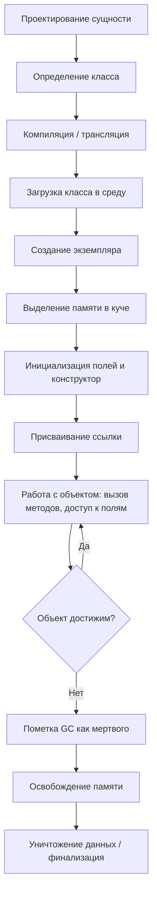
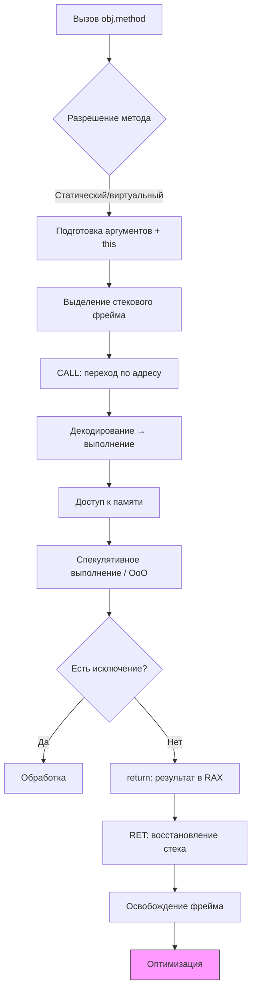
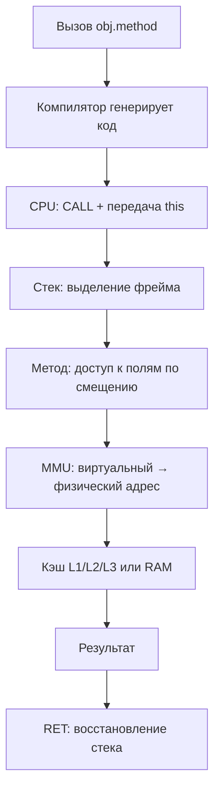
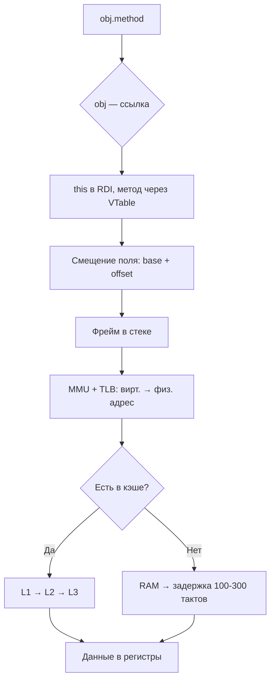
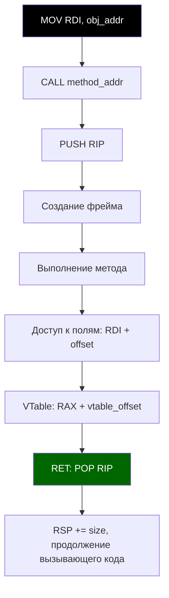

---
title: 4.03. Выполнение кода
---

# 4.03. Выполнение кода

## Работа на низком уровне

А сейчас мы погрузимся в низкоуровневое исследование того, что происходит при выполнении кода.

К слову, я с этим и столкнулся поначалу - когда познал основы на разных языках, взяв за основу лишь всё то, что было в учебниках, курсах, лекциях и на моей практике, но столкнувшись со сложностями понимания тонкостей - если в самом начале пути ещё можно разбираться в том, что такое функции, переменные, классы, методы и прочее, то в технической плоскости можно утонуть.

Давайте же изучим сложный путь данных в программировании.

Так, представим, что у нас есть некая сущность - те самые данные. Они поначалу проектируются, в ходе чего определяется, какой же у них тип, смысл, логика, потом записываются, читаются и обрабатываются - этот путь происходит буквально со всей информацией - её ведь, по сути, нужно просто проектировать, а потом можно хранить, читать, записывать и обрабатывать, и вот и весь смысл.
```
Спроектировал - записал - сохранил - прочитал - обработал - очистил.
```
Но если погрузиться на уровень ближе к железу, как профессионалы, то увидим более сложную схему.

| № | Название этапа | Описание |
|---|----------------|--------|
| 1 | Проектирование сущности | Чтобы что-то создать, нужно сначала понять, что это такое. На этапе проектирования определяется концепция сущности: её назначение, поведение, атрибуты, связи с другими объектами. Создаются диаграммы (например, UML), описывающие класс, его поля, методы, наследование, агрегацию. Это абстрактная модель, ещё не привязанная к коду. Определить нужно: свойства и их типы данных (строки, числа, и иные); поведение (методы); цель и задачи; связи с другими сущностями. |
| 2 | Определение шаблона (класса) | Класс как шаблон (чертёж) сущности реализуется в коде. Включает объявление имени, полей (атрибутов), методов, конструкторов, деструкторов, модификаторов доступа. Грубо говоря, мы воплощаем проект в код, превращая диаграмму сущностей в текстовую информацию — занимаемся написанием кода. Итоговый код оформляется как класс — шаблон построения сущности. Класс не занимает память — он лишь описывает структуру будущих экземпляров. |
| 3 | Компиляция / трансляция класса | При компиляции написанный класс преобразуется в байт-код (в языках с виртуальной машиной) или машинный код (в компилируемых языках). Исходный код на языке программирования преобразуется в машиночитаемый формат. Информация о структуре класса, сигнатурах методов, типах полей сохраняется в метаданных (например, таблица виртуальных методов, VTable). |
| 4 | Загрузка класса в среду выполнения | При запуске программы класс загружается в память среды выполнения (например, JVM, CLR). Происходит разрешение зависимостей, проверка доступности родительских классов и интерфейсов. Класс инициализируется: выполняются статические блоки, инициализируются статические поля. |
| 5 | Объявление переменной-ссылки | Объявляется переменная, которая будет указывать на экземпляр сущности. На основе типа данных определяется объём требуемой памяти. На этом этапе выделяется память под ссылку (указатель), но она ещё не указывает на объект. Например: `MyClass obj;` — ссылка `obj` создана, но объект не создан. |
| 6 | Выделение памяти под объект (куча) | При создании экземпляра (`new MyClass()`) среда выполнения запрашивает память в куче (heap). Выделяется блок памяти, достаточный для хранения всех полей объекта и служебной информации (указатель на VTable, lock-объект, хэш-код). |
| 7 | Инициализация объекта | Поля объекта инициализируются значениями по умолчанию (0, null, false), затем выполняется конструктор. Конструктор может вызывать цепочку инициализации родительских классов (через `super()` или `base()`), устанавливать начальные значения полей, выполнять проверки. |
| 8 | Присваивание ссылки | Ссылка (объявленная ранее переменная) получает адрес созданного объекта в куче. Теперь переменная указывает на конкретный экземпляр. Ссылка хранится в стеке (если локальная) или в куче (если поле другого объекта). |
| 9 | Запись ссылки в стек вызовов | Если объект создаётся внутри метода, ссылка помещается в стек вызовов (stack frame) текущего потока. Это позволяет быстро обращаться к объекту в рамках текущего контекста. Стек управляется процессором через указатель стека (ESP/RSP). |
| 10 | Обращение к полям и методам | При доступе к полям (`obj.field`) или вызове методов (`obj.method()`) процессор или виртуальная машина вычисляет смещение от базового адреса объекта в куче. Для методов происходит разрешение через таблицу виртуальных методов (VTable) при динамическом полиморфизме. |
| 11 | Чтение данных из памяти | Процессор по физическому адресу (полученному из виртуального через MMU) читает данные из ОЗУ. Данные могут быть сначала загружены в кэш L1/L2/L3 для ускорения доступа. Читаемые байты интерпретируются согласно типу (int, float, ссылка и т.д.). |
| 12 | Работа с данными на уровне битов | Все данные хранятся в виде битов (0 и 1). При операциях (арифметических, побитовых) процессор выполняет манипуляции с регистрами. Например, сложение инкрементирует биты, сдвиги (`<<`, `>>`) перемещают биты влево/вправо. Битовые маски используются для флагов. |
| 13 | Модификация данных (запись) | При изменении поля объекта (`obj.value = 42`) новое значение записывается по смещённому адресу в куче. Процессор использует шину данных для записи байтов в ОЗУ. Кэш-память может быть обновлена (write-back или write-through). |
| 14 | Кэширование данных | Часто используемые данные объекта могут кэшироваться на уровне CPU. Это ускоряет доступ, но требует синхронизации при многопоточности (например, через `volatile` или блокировки). Когерентность кэша поддерживается протоколами (MESI). |
| 15 | Фрагментация кучи | При частом выделении и освобождении объектов память в куче может фрагментироваться: остаются мелкие «дыры» между выделенными блоками. Наличие таких дыр снижает эффективность выделения памяти. Сборщик мусора может выполнять дефрагментацию (compact). |
| 16 | Вызов методов и переходы по адресам | При вызове метода адрес возврата, параметры и локальные переменные помещаются в новый фрейм стека. Процессор выполняет команду перехода (jump) на адрес метода. В случае виртуальных методов адрес определяется динамически через VTable. |
| 17 | Обработка данных (логика) | Внутри методов выполняется бизнес-логика: вычисления, ветвления, циклы. Процессор выполняет инструкции из машинного кода: загружает операнды, выполняет ALU-операции, записывает результаты. |
| 18 | Построение модели на основе данных | Объект может агрегировать или ссылаться на другие объекты, формируя сложную структуру данных (например, дерево, граф). Эти связи определялись на этапе проектирования. Ссылки между объектами создают граф достижимости, критичный для сборки мусора. |
| 19 | Использование объекта (взаимодействие) | Объект участвует в работе программы: передаётся как параметр, возвращается из метода, используется в коллекциях, сериализуется, участвует в событиях. Его состояние может изменяться многократно. |
| 20 | Поиск объекта (по ссылке или значению) | При поиске (например, в коллекции) выполняется обход ссылок или сравнение значений. Хэширование (`hashCode`) ускоряет поиск. При сравнении (`equals`) могут сравниваться поля объекта побитово или по ссылке. |
| 21 | Сериализация / передача данных | Объект может быть сериализован в поток байтов (например, JSON, бинарный формат). Поля преобразуются в последовательность битов, сохраняются порядок байтов (endianness), типы, структура. Это необходимо для хранения или передачи по сети. |
| 22 | Десериализация / восстановление | Из потока байтов воссоздаётся объект. Выделяется память, поля инициализируются из данных, восстанавливаются ссылки (при поддержке графов). Может вызываться специальный конструктор или метод восстановления. |
| 23 | Проверка достижимости (reachability) | Сборщик мусора (GC) определяет, доступен ли объект из корней (статические поля, локальные переменные в стеке, регистры). Объект считается живым, если существует путь по ссылкам от корня. |
| 24 | Пометка (mark phase) | На этапе сборки мусора GC проходит по всем достижимым объектам, помечая их как «живые». Это делается обходом графа ссылок (обычно в глубину или ширину). Пометка хранится в служебных битах объекта или отдельной структуре. |
| 25 | Сборка (sweep / compact) | Недостижимые объекты (не помеченные) освобождаются. При sweep — память помечается как свободная. При compact — живые объекты сдвигаются в одну область, устраняя фрагментацию. Указатели (ссылки) обновляются (ремаппинг). |
| 26 | Очистка ресурсов (деструктор / финализатор) | Перед уничтожением объекта может быть вызван финализатор (если определён). Он позволяет освободить неуправляемые ресурсы (файлы, сокеты, память вне кучи). Однако финализаторы ненадёжны и медленны — предпочтительнее использовать RAII или using/dispose. |
| 27 | Освобождение памяти в куче | Память, занимаемая объектом, возвращается в пул свободной памяти. Менеджер памяти обновляет метаданные (списки свободных блоков, битовые карты). |
| 28 | Освобождение ссылки в стеке | При выходе из метода фрейм стека удаляется. Ссылки, хранящиеся в нём, уничтожаются. Это может сделать объект недостижимым, если других ссылок на него нет. |
| 29 | Уничтожение данных (обнуление) | Освобождённая память может быть явно обнулена (в безопасных средах) или оставлена «как есть» (для производительности). Данные физически остаются до перезаписи, что может быть угрозой безопасности. |
| 30 | Анализ использования (профилирование) | Инструменты профилирования отслеживают создание, время жизни, размер, частоту сборки мусора для объектов. Это помогает находить утечки памяти, оптимизировать аллокации, выбирать оптимальные структуры данных. |
| 31 | Оптимизация компилятором / JIT | Современные среды (например, JVM, .NET) применяют JIT-компиляцию: часто вызываемые методы компилируются в нативный код. Применяются оптимизации: inlining, escape analysis (чтобы выделить объект на стеке вместо кучи), устранение синхронизации. |
| 32 | Управление жизненным циклом (ручное / автоматическое) | В некоторых языках (C++, Rust) управление памятью ручное или определяется владением. В других (Java, C#, Python) — автоматическое через GC. Выбор влияет на производительность, предсказуемость и сложность. |

Важно понимать, что вышеприведенный алгоритм выполнения кода является скорее инженерной памяткой, применимой для объектно-ориентированного программирования. И как раз проектирование сущности и определение класса являются высокоуровневой работой, а всё остальное - низкоуровневой.

Представляете теперь, какова работа на современных языках (первые два пункта) и какова была работа на первых устройствах? Технически, мы уже выполняем не все 32 пункта, а лишь 2, причем серьезность никуда не ушла - мы должны проектировать и писать эти 2 пункта так, чтобы учитывать все последующие 30. Какие-то ньюансы за нас заботливо рассчитывает компьютер, а что-то продумывать придётся нам.

Схематично:


## Как выполняется код?

Что забавно, это лишь верхушка айсберга. И в этом списке был у нас такой шаг, когда выполняется вызов или обращение к другим элементам. Поэтому, можно погрузиться ещё глубже в то, как работает именно механика выполнения кода.

Представим, что мы вызываем метод (пункт 10 в прошлой таблице), обращаемся к объекту. Что происходит?

| № | Этап | Описание |
|---|------|--------|
| 1 | Вызов метода (синтаксис) | Программист пишет `obj.method(arg)`. На уровне языка это вызов метода на экземпляре. Компилятор или интерпретатор проверяет сигнатуру, типы аргументов, доступность метода (public/private). |
| 2 | Разрешение имени метода | На этапе компиляции или выполнения определяется, какой именно метод вызывается: статический, виртуальный, переопределённый. Для виртуальных методов используется таблица виртуальных функций (VTable) — массив указателей на реализации методов. |
| 3 | Подготовка аргументов | Аргументы (включая `this` — ссылку на объект) помещаются в стек или регистры в соответствии с соглашением о вызове (calling convention), например cdecl, fastcall, thiscall. Объекты передаются по ссылке, примитивы — по значению. |
| 4 | Выделение фрейма стека | Под вызов метода выделяется стековый фрейм (stack frame). В нём хранятся: параметры, локальные переменные, адрес возврата, сохранённые регистры. Указатель стека (RSP на x86-64) сдвигается вниз. |
| 5 | Сохранение контекста | Перед переходом сохраняются регистры, если они используются в вызывающем коде. Это обеспечивает корректность при возврате. В некоторых архитектурах используется регистровое окно (SPARC), в других — только стек. |
| 6 | Переход по адресу (jump/call) | Процессор выполняет команду CALL, которая: помещает адрес возврата в стек, загружает в счётчик команд (RIP) адрес начала метода. Управление передаётся новому участку кода. |
| 7 | Декодирование инструкций | CPU декодирует байт-код (в JVM) или машинный код (в нативных системах) в микрооперации (μops). Современные процессоры используют конвейер (pipeline): fetch → decode → execute → memory → writeback. |
| 8 | Выполнение операций (ALU / FPU) | Арифметико-логическое устройство (ALU) выполняет операции: сложение, сдвиг, сравнение. FPU — операции с плавающей точкой. Результаты временно хранятся в регистрах. |
| 9 | Работа с памятью (load/store) | При доступе к полям объекта процессор: вычисляет физический адрес как base + offset, читает/пишет данные через шину памяти, использует кэш (L1/L2/L3) для ускорения. Промах кэша (cache miss) может стоить сотен тактов. |
| 10 | Контроль зависимостей (data hazards) | Процессор анализирует зависимости между инструкциями. Если одна инструкция зависит от результата другой, может быть вставлена задержка (stall) или использовано переименование регистров и исполнение вне порядка (out-of-order execution). |
| 11 | Спекулятивное выполнение | Современные CPU предсказывают ветвления (например, `if (x > 0)`). Если предсказание верно — выигрыш времени. Если нет — результаты отбрасываются (pipeline flush), что связано с потерей производительности. |
| 12 | Обработка исключений | При ошибках (деление на ноль, NullPointerException) генерируется исключение. Управление передаётся обработчику (`try/catch`). На низком уровне — это прерывание (interrupt) или trap, переход к обработчику в ядре или среде выполнения. |
| 13 | Возврат из метода (return) | При `return value`: результат помещается в регистр (например, RAX), фрейм стека освобождается (указатель стека возвращается), выполняется RET — извлекается адрес возврата, и RIP на него указывает. |
| 14 | Восстановление контекста | Восстанавливаются регистры, если они были сохранены. Управление возвращается в вызывающий код. Локальные переменные фрейма становятся недоступными (но память пока не очищена). |
| 15 | Оптимизация выполнения (JIT / AOT) | В средах с JIT (Java, .NET): часто вызываемые методы компилируются в нативный код, применяется профиль-управляемая оптимизация (например, inlining виртуальных вызовов, если тип известен). |
| 16 | Escape Analysis | JIT-компилятор анализирует, «уходит ли» объект за пределы метода. Если нет — объект может быть выделен на стеке, а не в куче, что ускоряет работу и снижает нагрузку на GC. |
| 17 | Thread-local execution | Каждый поток имеет свой стек. Выполнение метода происходит в контексте потока. При многопоточности возможны гонки, требующие синхронизации (блокировки, атомарные операции). |
| 18 | Memory Barriers / Fences | При работе с общими данными между потоками используются барьеры памяти, чтобы гарантировать порядок чтения/записи и видимость изменений (иначе кэши CPU могут держать устаревшие значения). |
| 19 | Сигналы и прерывания | Выполнение может быть прервано внешними событиями: таймер, ввод-вывод, сигнал от ОС. Процессор приостанавливает выполнение, сохраняет состояние, переходит к обработчику прерывания. |
| 20 | Power Management & Throttling | Современные CPU динамически изменяют частоту (Turbo Boost, throttling). Это влияет на время выполнения кода — один и тот же метод может выполняться с разной скоростью в разные моменты. |

Схематично:



## Сложное железо

Если вы подзабыли, что такое процессор, память, диск - перечитайте, ведь сейчас мы погрузимся ещё ниже. Что нужно знать ещё о железе?
К слову, это уже называется системное программирование. Собственно, за всю такую работу и отвечает операционная система, со всеми своими службами, утилитами, менеджерами и драйверами. Но тем не менее, это знать тоже нужно.

Начнём с памяти.

Память - иерархия, а не плоское пространство. Доступ к данным идёт по иерархии:

```
Регистры CPU → 
	L1 кэш (3-4 такта) → 
		L2 → 
			L3 → 
				RAM (100-300 тактов) → 
					SSD/HDD (миллионы тактов).
```

И эти такты как раз и образуют собой работу процессора, скорость которого измеряется частотой.

Ссылки - это указатели на адреса в памяти. Когда вы пишете obj.method(), на низком уровне obj - это указатель (тот самый адрес в куче), method() - вызов по смещению в VTable, а this - неявный первый аргумент (передается как this-указатель).

Выполнение, кстати, производится не только центральным процессором - также может выполнять код и GPU (графический процессор), TPU/NPU (для ИИ), DMA (прямой доступ к памяти без CPU). Но в это пока не погружаемся.

Каждый язык и архитектура имеют модель памяти, которая определяет, что значит «память видна» между потоками, можно ли переупорядочивать операции, как работает атомарность, волатильность, синхронизация. Если нарушить модель - будут гонки, глюки и неопределённое поведение. Поэтому и существует совместимость, и иногда что-то работает с другим языком или на другой архитектуре, но не так, как ожидается.

Стек - это сегмент памяти, работающий по принципу LIFO (Last In, First Out). Он используется для хранения локальных переменных, параметров функций, адресов возврата и сохранённых регистров.

В стеке выделяется фиксированный размер на поток, доступ к нему очень быстрый (через операции push - толкать, pop - выталкивать). В нём используется автоматическое управление (он освобождается при выходе из функции). Стек расположен в верхней части виртуального адресного пространства (растёт вниз).

Куча - область памяти для динамического выделения объектов (те самые new, maioc). Управление кучей уже выполняется либо вручную, либо через сборщик мусора.

Куча обладает менее предсказуемой производительностью (из-за фрагментации), может расти или сжиматься в процессе выполнения. Она располагается ниже стека в адресном пространстве и управляется через менеджер памяти.

Ссылка (Reference) - это абстракция указателя в высокоуровневых языках, хранящая адрес объекта в памяти. Она не позволяет прямых арифметических операций (в отличие от указателей в C++, именно поэтому ссылка это уже не указатель).

Память поделена на ячейки, ведь представляет собой линейную последовательность байтов, каждый из которых имеет уникальный адрес (номер). А адрес это как раз смещение от начала памяти.

При выделении памяти (в куче) выделяется блок нужного размера. Блоки управляются через списки свободных/занятых областей.
Смещение (Offset) - это разница между базовым адресом структуры (например, объекта) и адресом конкретного поля. К примеру, если объект начинается по адресу 0x1000, а поле value - восьмой байт, то смещение = 8. Доступ будет как-то так *(obj_addr + 8).

Базовый адрес - это начальный адрес области памяти (объекта, массива или сегмента). Все остальные адреса вычисляются относительно него.
Физический адрес же является реальным адресом в оперативной памяти, по которому данные хранятся на физической микросхеме.
Виртуальный адрес - это адрес, используемый программой. MMU преобразует его в физический.

MMU (Memory Management Unit) это аппаратный компонент CPU, который отвечает за преобразование виртуальных адресов в физические. Он использует таблицы страниц, поддерживает виртуальную память, защиту доступа, кэширование TLB и позволяет каждому процессу иметь изолированное адресное пространство.

TLB (Translation Lookaside Buffer) это кэш MMU, который хранит соответствия виртуальных и физических адресов.

Стек вызовов (Call Stack) это просто специализированное использование того самого стека в памяти, для отслеживания активных функций (методов). Тот же стек, просто используется для хранения контекста вызовов.

Фрейм стека (Stack Frame) это блок данных в стеке, выделенный для одного вызова функции. Он содержит параметры, локальные переменные, адрес возврата, сохранённые регистры, указатель на предыдущий фрейм. При выходе из функции фрейм удаляется - это и будет команда pop.

Указатель стека (Stack Pointer) критически важный инструмент управления стеком. При push он уменьшается, при pop - увеличивается (причем растёт вниз).

ESP (x86, 32-bit) указывает на верх стека (последний занесённый элемент.

RSP (x86-64) это 64-битная версия ESP.

Указатель фрейма (Frame Pointer, EBP/RBP) указывает на начало текущего фрейма, используется для доступа к параметрам и локальным переменным по фиксированному смещению.

То есть, обращение к стеку происходит через RSP/ESP, управляемое процессором.

А стек бывает стеком вызовов (основной, используется всеми функциями), и стеком потока (каждый поток имеет свой стек).

Такт (Clock Cycle) это один импульс тактового генератора, базовая единица времени для CPU - да, время у него измеряется иначе, и все операции синхронизированы тактом. Как сердцебиение - и поэтому процессор является сердцем - тем самым моторчиком.

Частота (Clock Frequency) определяет количество тактов в секунду (Гц), например, 3.5 GHz = 3.5 миллиарда тактов/сек. Да, у процессоров такая скорость. Это определяет максимальную скорость выполнения инструкций (но не всегда, из-за конвейера, простоя и т.д.).

Регистры же являются очень быстрой памятью внутри CPU, и используются для хранения данных, адресов, состояния. К примеру, RAX - аккумулятор (результаты операций), RIP - счётчик команд, RSP - указатель стека, RDI, RSI - аргументы функций. Это всё регистры.

Регистровые окна - это архитектурный приём (в SPARC), при вызове функции автоматически переключается набор регистров. Это для ускорения вызовов, избегая push/pop в стек. Современные CPU используют переименование регистров вместо этого.

Счётчик команд (Program Counter, RIP) это регистр, хранящий адрес следующей инструкции для выполнения. При каждом шаге он увеличивается, а при jmp/call изменяется.

Инструкции являются элементарными командами, понятными процессору (MOV, ADD, CALL, JMP). Они хранятся в памяти как машинный код, в байтах и декодируются процессором в микрооперации.

Ассемблерные команды - это самый низкий уровень управления процессором. Они напрямую соответствуют машинному коду, который выполняет процессор.

MOV - копирует данные из источника в приёмник. Это не арифметика, а просто перемещение, одна из самых частых операций - загрузка значений, параметров, адресов.

ADD / SUB - сложение и вычитание, которые изменяют флаги (Zero Flag, Carry Flag), используются в арифметике, инкременте, адресации.

CALL - вызов функции или метода. Помещает адрес возврата (следующую инструкцию) в стек (PUSH RIP), затем загружает в счетчик команд (RIP) адрес функции, переходя к телу функции.

RET - возврат из функции. Извлекает адрес возврата из стека и загружает его в RIP, после чего продолжает выполнение с того места, откуда была вызвана функция. Это автоматический финал любого метода.

JMP - безусловный переход, мгновенно переходит на указанный адрес. Используется в циклах, GOTO, оптимизациях.

JE / JNE / JL / JG - условные переходы, работают после CMP или арифметики. Они реализуют if, while, for.

PUSH / POP - работа со стеком. PUSH кладёт значение на стек, RSP уменьшается, POP забирает значение со стека, RSP увеличивается. Используются при вызовах, сохранении регистров, локальных данных.

CMP - сравнение, вычитает два значения, обновляет флаги, но не сохраняет результат. Нужен перед условными переходами.

TEST - побитовое И (для флагов), используется для проверки на ноль.

LEA -Load Effective Address, вычисляет адрес, но не обращается к памяти. Используется для арифметики указателей, смещений.

XOR / AND / OR / NOT - побитовые операции, используются в манипуляциях с флагами, хэшах, оптимизациях.

NOP - No Operation, ничего не делает, 1 такт простоя. Используется для выравнивания, отладки задержек.

Важное уточнение - то, что работает на x86-64, не сработает на ARM (там другие инструкции - MOV, BL, LDR, STR и пр).

Компилятор автоматически генерирует эти команды из C++, Java, Rust, .NET. Оптимизатор может менять порядок, удалять, заменять команды.

```
Интересная задумка - можете поиграться с нейросетями в интерактиве - вы пишете в чат код на каком-либо языке, а нейросеть в ответ будет писать ассемблер. Так вы можете изучать низкий уровень работы команд.
```

Микрооперации (Micro-ops, μops) это внутренние команды, на которые CPU разбивает сложные инструкции. Они позволяют выполнять инструкции вне порядка (как раз out-of-order execution) и параллельно.

Адрес возврата (Return Address) это адрес в коде, куда нужно вернуться после завершения функции. Он сохраняется в стеке при выполнении CALL.

VTable (Virtual Method Table) это таблица указателей на реализации виртуальных методов для конкретного класса. Каждый объект с виртуальными методами содержит скрытое поле - указатель на VTable. При вызове виртуального метода происходит `obj->vtable[METHOD_INDEX]()` — динамическое разрешение.

Виртуальный метод - это метод, поведение которого может быть переопределено в наследнике. Вызов разрешается во время выполнения (dynamic dispatch) через VTable. К примеру, @Override в Java (ещё вернёмся).

Инициализация, кстати - это процесс установки начального состояния объекта или переменной. Она включает присвоение значений полям, вызов конструктора, выполнение статических инициализаторов, загрузку класса. На низком уровне происходит запись байтов в память по нужным смещениям.

Контекст выполнения (Execution Context) - это совокупность данных, необходимых для выполнения кода, как раз стек вызовов, регистры, локальные переменные, объект this. У каждого потока свой контекст.

this (или self) это неявный параметр метода, который указывает на текущий экземпляр объекта. На низком уровне это первый аргумент метода (в RDI на x86-64).

Поток (Thread) является потоком выполнения внутри процесса. Он имеет свой стек, свои регистры, счётчики команд, но (!) общую память (кучу) с другими потоками. Он позволяет выполнять несколько задач параллельно.

Контекст потока (Thread Context) представляет собой набор регистров, стека, состояния, сохранённых при переключении потоков. Сохраняется ядром ОС при переключении контекста (context switch).

У процессора есть кэши. Мы вкратце о них упоминали - это быстрая память внутри CPU, которая хранит копии часто используемых данных и инструкций.
	- L1: самый быстрый (~3 такта), разделён на data и instruction.
	- L2: медленнее (~10 тактов), общий для ядра.
	- L3: ещё медленнее (~40 тактов), общий для всех ядер.

Если будет промах кэша (cache miss), то потеряем такты.

Можно построить некую обобщённую схему:

Текстом:
```
[Программа: obj.method()]
		↓
[Компилятор: генерирует вызов, использует VTable]
		↓
[CPU: RSP управляет стеком, RIP — счётчик команд]
		↓
[Вызов: push аргументов, CALL → RIP = адрес метода]
		↓
[Метод: фрейм в стеке, доступ к this, полям по смещению]
		↓
[Память: MMU преобразует виртуальный → физический адрес]
		↓
[Кэш: L1/L2/L3 ускоряют доступ к данным]
		↓
[Возврат: RET, RSP++, RIP = адрес возврата]

```

Схематично:


Но пример выше он скорее верхнеуровневый, показывает лишь сквозной путь от вызова до возврата, с акцентом на взаимодействие программного и аппаратного уровней. Если же хотим погрузиться чуть ниже, на более системный уровень, то получим уже такую схему:



Теперь уже видим иерархию памяти и механизмы адресации, с TLB, смещением, MMU. Можно ещё ниже:



Сложнее, наверное, уже не получится - технически, так и работает регистр, стек, вызов и возврат.