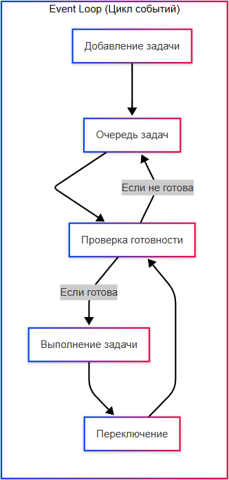
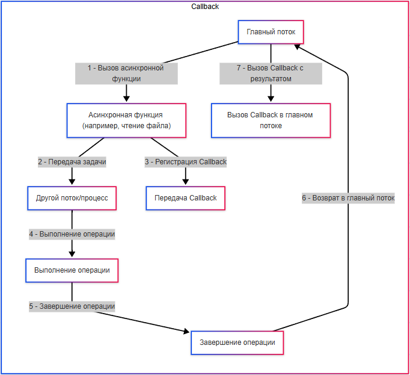
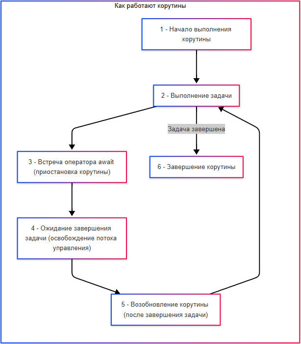
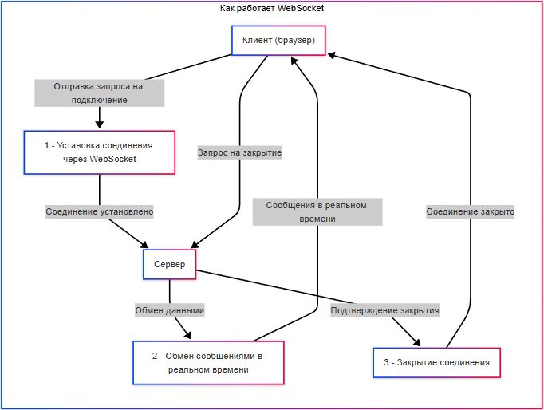
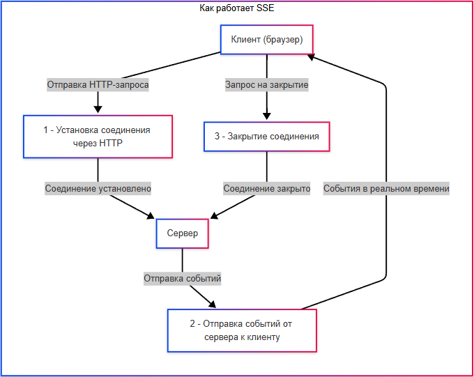

---
title: 4.05. Асинхронность
---

# 4.05. Асинхронность

## Процессы и потоки

Ранее мы рассмотрели, что такое процессы и потоки. Сейчас немного углубимся в их управление. Это важно!

★ **Процесс** – это экземпляр запущенной программы. У каждого процесса есть собственное адресное пространство (память), файловые дескрипторы и системные ресурсы.

★ **Поток** – это единица выполнения внутри процесса. Все потоки одного процесса разделяют общее адресное пространство.

Программа, работающая в одном потоке, выполняется последовательно, без параллелизма. То есть, программа выполняет одно действие за другим. Представим, что у нас есть задача обработать большой массив данных: прочитать данные, преобразовать их, выполнить вычисления, снова преобразовать и вывести результат. Однопоточная программа выполнит это так:

```
Единый поток: 
Прочитать - преобразовать - вычислить - преобразовать - вывести на экран.
```

Многопоточные же программы могут выполнять несколько задач одновременно:
```
Поток 1 : Читает данные из файла.
```
```
Поток 2 : Преобразует данные, которые уже прочитаны Потоком 1.
```
```
Поток 3 : Выполняет вычисления на основе преобразованных данных.
```
```
Поток 4 : Преобразует результаты вычислений в конечный формат.
```
```
Поток 5 : Выводит результаты на экран или записывает их в файл.
```

Потоки работают одновременно, но координируют свои действия через общую память. Например, Поток 2 начинает преобразование только после того, как Поток 1 завершил чтение очередной порции данных. Если один поток ждёт (например, Поток 1 ждёт чтения данных с диска), другие потоки продолжают работу.

Многопроцессорные программы создают несколько процессов, каждый из которых работает независимо. Они не разделяют память, что делает их более безопасными, но усложняет обмен данными. Здесь каждый процесс выполняется независимо.

Та же задача - обработка большого массива данных, но теперь каждый процесс выполняет свою часть работы независимо:

```
Процесс 1 : Читает данные из файла и передает их в очередь или файл.
```
```
Процесс 2 : Преобразует данные, полученные от Процесса 1, и сохраняет результат в другую очередь или файл.
```
```
Процесс 3 : Выполняет вычисления на основе преобразованных данных.
```
```
Процесс 4 : Преобразует результаты вычислений в конечный формат.
```
```
Процесс 5 : Выводит результаты на экран или записывает их в файл.
```

Каждый процесс работает независимо и не разделяет память с другими процессами. Для обмена данными между процессами используются механизмы, такие как очереди, файлы или сокеты. Например, Процесс 1 записывает данные в файл, а Процесс 2 читает их оттуда.


Разница между процессом и потоком:

| Аспект | Процесс | Поток |
| :--- | :---: | ---: |
|Адресное пространство	|У каждого процесса свое адресное пространство (память).	|Все потоки одного процесса разделяют общее адресное пространство.
|Обмен данными	|Обмен данными между процессами сложнее (через файлы, сокеты, очереди).	|Обмен данными между потоками проще (через общую память).
|Безопасность	|Более безопасны, так как процессы изолированы друг от друга.	|Менее безопасны, так как общая память может привести к гонкам данных.
|Создание/уничтожение	|Создание и уничтожение процессов дороже (затраты на ресурсы).	|Создание и уничтожение потоков дешевле.
|Параллелизм	|Может выполняться на разных процессорах (истинный параллелизм).	|Может выполняться параллельно на одном процессоре (через переключение).

Потоки – это легковесные единицы выполнения внутри процесса. Они разделяют общую память, что позволяет им быстро обмениваться данными. Операционная система управляет потоками, переключая их между задачами (контекстное переключение).


## Управление потоками

### Как узнать, какие потоки у приложения?

Разработчикам важно определять использование ресурсов. Да, сейчас, с современным «железом» и мощностями, уже не так актуально грамотно их распределять, но всё же, во время отладки, важно уметь использовать инструменты (к примеру, окно Threads (Потоки) в IDE - Visual Studio), которые показывают список всех потоков, их состояние (работающий, ожидающий) и стек вызовов. При отладке можно приостановить выполнение программы и проверить, какой код выполняется в каждом потоке. При работе же с JavaScript, работает браузер, и используются инструменты разработчика в этом браузере (DevTools), где на вкладке «Производительность» (Perfomance) показано использование потоков и их активность. В JS, WebWorkers - отдельные потоки, которые можно там отслеживать. Так можно видеть, какие потоки активны, какие ожидают, и какие ресурсы они используют. Разработчики анализируют стек вызовов каждого потока, чтобы выявить конфликты доступа к данным. 

Сложно? А вот так - разработчики - не просто те, кто пишут код. Им важно ещё и отслеживать потребление ресурсов и стабильность. Именно поэтому можно встретить «тормозящие», «зависающие» и «вылетающие» программы - когда есть куча ошибок, неграмотное потребление ресурсов. Но особенности работы языков мы лучше отложим, сейчас достаточно лишь этих примеров.

### Гонки данных и механизмы синхронизации

★ Потоки разделяют память, что упрощает обмен данными между ними, но также увеличивает риск **гонок данных** (race conditions).

Гонки данных возникают, когда несколько потоков обращаются к одним и тем же данным одновременно, и хотя бы один из них изменяет эти данные. Это может привести к непредсказуемым результатам. К примеру, если два потока выполняют функцию, и гоняются за доступом к переменной - результат вычисления одной из функций может быть не соответствующим ожиданиям, потому что потоки могут читать и записывать значение одновременно. Состояние гонки будет означать ситуацию, когда результат зависит от непредсказуемого порядка выполнения потоков. Решением такой проблемы являются механизмы синхронизации, такие как:

	- ★ **Мьютексы (Mutex)**, блокирующие доступ к данным для других потоков;
	- ★ **Семафоры**, ограничивающие количество потоков, которые могут одновременно выполнять определенную операцию;
	- ★ **Атомарные операции**, гарантирующие, что операция будет выполнена целиком, без прерывания.

В контексте механизмов синхронизации, ключевое понятие - блокировка. Она используется для предотвращения одновременного доступа к общим ресурсам из нескольких потоков или процессов.

**Блокировка** временно запрещает доступ к ресурсу (например, переменной, файлу или устройству) для одного или нескольких процессов, чтобы избежать конфликтов при одновременном доступе. Потоки или процессы, которые пытаются получить доступ к заблокированному ресурсу, переходят в состояние ожидания, пока блокировка не будет снята.

★ **Как работает блокировка?**

1. Захват блокировки - поток или процесс пытаются захватить блокировку на ресурс. Если блокировка свободна, он её захватывает и получает доступ к ресурсу. Если блокировка занята, поток переходит в режим ожидания.
2. Работа с ресурсом - поток выполняет операции с ресурсом, зная, что другие потоки не могут вмешаться.
3. Освобождение блокировки - после завершения работы с ресурсом, поток освобождает блокировку. Один из ожидающих потоков может захватить блокировку и продолжить работу.


Простейший тип блокировки – это мьютекс.

★ **Мьютекс** – это механизм, который позволяет только одному потоку за раз получить доступ к общему ресурсу. Если один поток «захватил» мьютекс, другие потоки должны ждать, пока он освободился.

1. Поток 1 пытается выполнить операцию, которая требует доступа к общим данным.
2. Перед началом работы поток «захватывает» мьютекс (например, поднимает флаг).
3. Все остальные потоки, которые хотят получить доступ к тем же данным, видят, что мьютекс занят (флаг поднят), и переходят в режим ожидания.
4. Когда поток 1 завершает работу с данными, он «освобождает» мьютекс (опускает флаг).
5. Один из ожидающих потоков получает доступ к данным, захватывая мьютекс.


Пример на алгоритмическом языке.

У нас есть общий ресурс - банковский счёт. Два потока одновременно пытаются изменить баланс счёта:
	- Поток 1 хочет добавить 100 рублей;
	- Поток 2 хочет снять 50 рублей.

Без мьютекса может возникнуть гонка данных, и баланс будет неправильным.

С мьютексом:
	- Поток 1 захватывает мьютекс, добавляет 100 рублей и освобождает мьютекс.
	- Поток 2 захватывает мьютекс, снимает 50 рублей и освобождает мьютекс.

Или другой пример - в офисе общий принтер, и когда один сотрудник начинает печатать документ, принтер блокируется, а другие должны ждать, пока первый не закончит печать и не освободит принтер. Такая блокировка и есть мьютекс.

Таким образом, мьютекс это некий «флаг», показатель того, что ресурс занят. Ресурсом может быть переменная, некий объект с данными. Мьютекс применим для защиты критических секций кода (например, работа с общими переменными).

★ **Семафор** – это механизм, который ограничивает количество потоков, которые могут одновременно выполнять определённую операцию. В отличие от мьютекса, семафор может позволить нескольким потокам работать параллельно, но в пределах заданного лимита.

1. Семафор имеет счётчик (например, 3), который показывает, сколько потоков могут одновременно получить доступ к ресурсу.
2. Когда поток хочет выполнить операцию, он проверяет счётчик:
	- Если счётчик больше 0, поток уменьшает его на 1 и начинает работу;
	- Если счётчик равен 0, поток переходит в режим ожидания.
3. Когда поток завершает работу, он увеличивает счётчик на 1, освобождая место для других потоков.

Пример на алгоритмическом языке.

У нас есть ограниченное количество мест в очереди к банкомату (3 места). Несколько человек (потоки) хотят воспользоваться банкоматом.

Семафор:
	- первые три человека занимают места и начинают использовать банкомат;
	- остальные люди ждут, пока кто-то из первых троих не закончит;
	- когда один челвоек освобождает место, следующий в очереди занимает его.

Таким образом, семафор – это счётчик максимального количества одновременных потоков.

Семафор применим для управления доступом к ресурсам с ограниченной пропускной способностью (например, база данных).

Ридер-райтер блокировка (Reader-Writer Lock) – это тип блокировки, который позволяет нескольким читателям одновременно работать с ресурсом, но только одному писателю. Простой пример - общая электронная таблица. Несколько одновременно могут читать данные, но, если один хочет изменить данные (писатель), все остальные пользователи (читатели) должны подождать, пока он закончит.


**Спинлок (Spinlock)** – это блокировка, при которой поток активно ожидает освобождения ресурса, постоянно проверяя его состояние. Пример - у нас есть дверь в комнату. Если дверь закрыта, человек стоит перед ней и периодически пытается открыть её, пока она не станет доступной. Это полезно, когда ожидание длится недолго, но может быть расточительно, если ресурс занят надолго.

★ **Атомарные операции** – это операции, которые выполняются целиком, без прерывания другими потоками. Она гарантирует, что даже если несколько потоков выполняют одну и ту же операцию одновременно, результат будет корректным.

1. Операция выполняется как единое действие, которое нельзя разделить.
2. Операционная система или процессор обеспечивают, чтобы никакой другой поток не мог вмешаться в середине выполнения атомарной операции.

Пример на алгоритмическом языке.

У нас есть счётчик, который увеличивается на 1 каждый раз, когда поток выполняет операцию. Без атомарности:
	- Поток 1 читает значение счётчика (например, 5);
	- Поток 2 читает значение счётчика (тоже 5);
	- Оба потока увеличивают значение на 1 и записывают его обратно;
	- в результате счётчик становится 6, хотя по идее должен быть 7.

С атомарностью:
	- Поток 1 выполняет операцию «увеличить на 1» как одно действие: значение меняется с 5 на 6.
	- Поток 2 выполняет ту же операцию - значение меняется с 6 на 7.
	- Результат - 7, корректен.

Таким образом, атомарная операция гарантирует, что операция выполнится целиком, без прерывания. Она применима как инкремент или декремент счётчиков, простые операции с общими данными. Это не вид блокировки, но механизм работы с синхронизацией потоков.

Хотя блокировки и помогают решить проблемы параллельного доступа, они также могут привести к новым проблемам.

1. **Deadlock (взаимная блокировка)** - возникает, когда два или более потока блокируют друг друга, ожидая освобождения ресурсов.

Пример:
	- Поток 1 захватил ресурс А и ждёт ресурс Б.
	- Поток 2 захватил ресурс Б и ждёт ресурс А.
	- Оба потока бесконечно ждут друг друга.

Это и есть дэдлок - они заблокированы намертво, навсегда.

2. **Starvation (голодание)** - происходит, когда некоторые потоки никогда не получают доступ к ресурсу, потому что другие потоки постоянно захватывают его.

Пример - в очереди к банкомату всегда первыми обслуживаются VIP-клиенты. И если их будет много, и они будут обслуживаться часто - обычные клиенты могут никогда не получить доступ к банкомату. Так и работает голодание - поток не получает ресурс.

3. **Live-lock** возникает, когда потоки активно пытаются разрешить конфликт, но их действия мешают друг другу, и задача так и не завершается.

Пример - два человека встречаются в коридоре и одновременно уступают друг другу дорогу. Они продолжают уступать, и никто так и не может пройти.

В отличие от Deadlock, где ресурс никто не получает, Live-lock - ресурс никем не захвачен, потому что все уступают друг другу в силу своих активных действий.

Разработчики, работая с блокировками, используют инструменты и профилировщики, чтобы отслеживать использование блокировок и выявлять deadlock-и. Оптимизация этих процессов включает в себя минимизацию времени удержания блокировок, чтобы уменьшить задержки, и использовании более эффективных механизмов (например, атомарные операции вместо мьютексов, если возможно). А при тестировании выполняются стресс-тесты, которые проверяют поведение программы при высокой нагрузке и выявляют потенциальные проблемы с блокировками.

### Конкурентность и параллельность

Конкурентность и параллельность — это разные, хотя и связанные понятия:

**Конкурентность** — это способность системы управлять несколькими задачами одновременно, то есть они могут переключаться друг с другом, но не обязательно выполняются в один момент времени. Например, одна задача может приостанавливаться, чтобы дать ресурсы другой, и так поочерёдно.

**Параллельность** — это одновременное выполнение нескольких задач в один и тот же момент времени, например, когда есть несколько процессорных ядер, и каждое ядро выполняет свою задачу одновременно.


## Очереди, сообщения и события

### Очереди

Задачи, сообщения, выполняемые в потоках и процессах, должны быть каким-то образом структурированы, в каком-то определённом порядке. И если люди на инстинктивном уровне понимают, как работет очередь, то в части задач нужно определить порядок.

★ **Очередь** – это структура данных, которая организует задачи или сообщения в порядке их поступления. Этот порядок - FIFO (First In, First Out), самый распространённый - первый вошёл в очередь, первым вышел. В контексте асинхронности очереди используются для управления задачами, которые должны быть выполнены последовательно или параллельно.

★ **Как работает очередь?**

1. Задачи добавляются в очередь (enqueue).
2. Задачи извлекаются из очереди (dequeue) и выполняются.
3. Если задач много, они обрабатываются по порядку или распределяются между потоками/процессами.

Давайте разберём очереди на алгоритмическом языке.

У нас есть система обработки заказов в интернет-магазине:
	- Пользователь 1 делает заказ на товар А.
	- Пользователь 2 делает заказ на товар Б.
	- Пользователь 3 делает заказ на товар В.

Заказы добавляются в очередь, и она выглядит как некий массив:

Очередь: `[Заказ А, Заказ Б, Заказ В]`.

Система приступает к обработке заказов по порядку:
	- заказ А обрабатывается первым;
	- после завершения заказ А удаляется из очереди;
	- заказ Б становится следующим.

Так происходит управление задачами в многопоточных системах, обработка запросов в веб-серверах, распределение задач между процессами (например, в очередях RabbitMQ или Kafka).

### Сообщения

В нашем понимании, **сообщения** – это информация, используемая в общении, предоставление сведений в каком-то виде. В информатике это так и есть - форма представления информации, имеющая признаки начала и конца и предназначенная для передачи через среду связи. Но в программировании, особенно в объектно-ориентированном программировании, это средство взаимодействия объектов, где передача сообщения объекту – это процесс вызова метода этого объекта с содержимым сообщения или без такового, при условии, что он готов его принять.

Сложно звучит? Это просто процесс обмена какими-то данными - запрос, вопрос, ответ, команда, уведомление. Мы ранее уже изучили, что такое сигнал, и поняли, что сигналами общаются устройства. Так вот, сигнал – это материальное воплощение сообщения при передаче, переработе и хранении информации. Сообщение - сама информация в определённой форме, а сигнал - физическая часть нашего материального мира. Для понимания, можно их называть техническими сообщениями, чтобы не путать их с сообщениями из мессенджеров и почты.

★ **Сообщения** – это абстрактная единица данных, которая передаётся между компонентами системы (например, между потоками, процессами или серверами). В асинхронных системах сообщения используются для координации задач.

Все мы в жизни сталкивались с коммуникацией и сообщениями - в мессенджерах, электронных и почтовых письмах - и понимаем, что всегда есть основные компоненты - отправитель, содержимое сообщения и адресат-получатель.

Как работают сообщения? А так же, как и в жизни.
1. Отправитель создаёт сообщение и отправляет его получателю.
2. Получатель получает сообщение и обрабатывает его.
3. Если нужно, получатель может отправить ответное сообщение.

Пример на алгоритмическом языке.

У нас есть чат-приложение. 

Пользователь 1 отправляет сообщение «Привет!» Пользователю 2. 

Сообщение помещается в очередь обработки, а сервер доставляет сообщение Пользователю 2. 

Пользователь 2 получает сообщение и отвечает «Привет!» - ответное сообщение отправляется обратно в очередь и доставляется Пользователю 1.


Сообщения - не только переписка, они применяются в качестве обмена данными, к примеру, между микросервисами, являются реализацией шаблона «производитель-потребитель» (Producer-Concumer, но об этом поговорим позже), и являются ключевым элементом работы брокеров сообщений (RabbiMQ, Kafka).

### Событие

★ **Событие (Event)** – это сигнал о том, что что-то произошло в системе. Оно может быть вызвано пользователем, системой или внешними факторами.

Чем событие отличается от сообщения?

Событие описывает факт того, что что-то произошло, например, пользователь нажал на кнопку «Отправить». Событие может быть обработано несколькими компонентами системы.

Сообщение же передаёт конкретные данные от одного компонента к другому и является более направленным, на конкретного адресата. Система может отправить данные на сервер с определённым адресом.

И сообщение с событием связано будет именно том, что сообщение может быть отправлено как результат наступления события - когда пользователь нажал на кнопку «отправить», сообщение будет отправлено конкретному адресату.


Здесь важно подчеркнуть, что на таком принципе есть целый подход.
★ **Событийно-ориентированная архитектура (Event-Driven Architecture, EDA)** - подход к проектированию систем, где компоненты взаимодействуют через события.

Происходит событие - событие публикуется в системе - все заинтересованные компоненты (подписчики) получают уведомление и реагируют на событие.

Пример - интернет-магазин:
	- Событие - «Пользователь создал заказ»;
	- Подписчики:
		- Модуль оплаты - проверяет платёжные данные;
		- Модуль доставки - готовит данные для отправки;
		- Модуль аналитики - записывает статистику.

Итого - мы получаем одно событие, и кучу компонентов, которые могут добавляться, изменяться, и система легко расширяется - масштабируется, без изменения всей системы.

★ Событийно-ориентированное программирование – это стиль программирования, где программа реагирует на события, происходящие во время её выполнения.

Программа регистрирует обработчики событий, а когда событие происходит - вызывается соответствующий обработчик.

Это может быть в разных проектах. Простой пример - в графическом интерфейсе, когда добавляется кнопка «Закрыть», ей присваивается обработчик - логика работы после нажатия на кнопку. Итого, когда пользователь нажимает кнопку «Закрыть» - обработчик выполняет команду - закрыть окно.

## Асинхронность и синхронность

### Понятие асинхронного выполнения

★ **Задачи** – это части программы, могут быть как методами, функциями, так и частями-этапами этих функций/методов. Каждая задача не запускается сама по себе, она либо автоматически запускается обработчиком (по событию), либо вызывается кем-то. Причём обработчик как раз вызывает выполнение задачи.

★ **Вызов** – это действие, при котором одна часть программы (например, функция или метод) запрашивает выполнение другой части программы.

Вызов может быть синхронным, или асинхронным. Давайте разберёмся.

★ **Синхронность и асинхронность**. Синхронное выполнение задач – выполнение инструкций строго по порядку, ожидая завершения каждой операции перед переходом к следующей. К примеру, официант ждёт, пока повар приготовит блюдо, ждёт, пока клиент поест, и лишь потом убирает тарелку. И новый заказ он не принимает, пока не уберёт тарелку:

1. Задача 1 начата.
2. Задача 1 завершена.
3. Задача 2 начата.
4. Задача 2 завершена.

★ **Асинхронное выполнение** – программа не блокируется на операциях, и пока одна задача ждёт результата, процессор сразу переключается на вторую задачу. По аналогии с предыдущим примером, официант примет заказ, даст задачу поварам, и тут же пойдёт принимать следующий заказ, не ожидая готовности приготовления блюд.

1. Задача 1 начата.
2. Задача 2 начата.
3. Задача 2 завершена.
4. Задача 1 завершена.

То есть, асинхронное выполнение превращает один поэтапный алгоритм в несколько параллельных алгоритмов, таким образом значительно ускоряя работу.

Асинхронность представляет собой способ выполнения задач, при котором программа не блокируется (не ожидает завершения длительной операции), а продолжает выполнять другие действия. Когда результат становится доступен, программа обрабатывает его. Так, ключевыми характеристиками асинхронности является неблокирующий характер и уведомления.

Где применяется асинхронность? Конечно, это IO-bound задачи.

★ **IO-bound задачи (Input/Output)** – это задачи, ограниченные скоростью ввода-вывода (чтение/запись на диск, сетевые запросы). В таких задачах процессор часто простаивает, ожидая завершения операций. И именно IO-bound задачи особенно нуждаются в асинхронности, так как это позволяет программе продолжать выполнение других задач, пока одна операция ожидает завершения.

Пример - задачи - загрузить файлы А, Б, В - асинхронное выполнение будет в загрузке всех трёх файлов одновременно. Такие подходы особенно актуальны, когда важно не «замораживать» интерфейс пользователя.

★ **Асинхронный ввод-вывод** – это способ выполнения операций чтения-записи, при котором программа не блокируется, ожидая завершения операции. Именно так и решается проблема IO-bound задач.

Каналы ввода-вывода – это абстракции, которые позволяют программам взаимодействовать с устройствами (например, файлами, сетью). Они бывают блокирующими и неблокирующими.

**Блокирующий режим** - программа, которая останавливается и ждёт завершения операции.

**Неблокирующий режим** - программа продолжает работу, пока операция выполняется в фоне.

**Порты завершения** – это механизм операционной системы (например, Windows IOCP), который используется для эффективного управления асинхронными операциями ввода-вывода.

1. Операция ввода-вывода запускается асинхронно.
2. Когда операция завершается, результат помещается в порт завершения.
3. Программа проверяет порт завершения и обрабатывает результат.

Порты завершения и каналы ввода-вывода обеспечивают низкоуровневую поддержку асинхронности. Но нас интересует больше высокоуровневая часть.

★ **Асинхронный способ доставки данных** – это метод передачи данных, при котором отправитель не ждёт подтверждения получения данных от получателя. Пример - уведомления в мобильных приложениях, когда приложение отправляет уведомление на сервер, а сервер доставляет уведомление устройству пользователя, когда оно становится доступным.

Асинхронным может быть сетевой вызов (HTTP-запросы, взаимодействие с API), работа с диском (чтение и запись файлов), таймеры (задержки, периодические задачи), работа с данными (запросы к SQL или NoSQL базам).

★ **Асинхронные запросы и ответы** – это механизм, при котором клиент отправляет запрос серверу и продолжает работу, не дожидаясь ответа - когда ответ приходит, клиент обрабатывает его. Веб-приложение отправляет запрос на сервер для получения данных, а пока данные грузятся, приложение показывает индикатор загрузки. Когда данные приходят, приложение обновляет интерфейс.

Важно: не путайте асинхронность и асинхронизм. Асинхронизм - более широкое философское понятие, отсутствие жёсткой сихронизации, применяется в физике, биологии, социологии и других областях, допустим, когда люди в команде выполняют задачи независимо друг от друга. Асинхронность - конкретная реализация, и нас интересует именно её айти-часть.

**Как работает асинхронность «под капотом»?**

### Event Loop

★ **Event Loop (Цикл событий)** – происходит бесконечный цикл проверки готовности задач, словно официант регулярно проверяет, закончили ли повара готовить блюдо.

Это механизм, который проверяет, какие задачи готовы к выполнению, и запускает их по мере готовности.

1. Задачи добавляются в очередь (например, сетевой запрос или таймер).
2. Проверка готовности (проверка, готовы ли задачи к выполнению).
3. Выполнение задачи (если задача готова, например, ответ от сервера получен - она выполняется).
4. Переключение (после выполнения задачи продолжается проверка других задач).



Пример - у нас есть веб-сервер. Пользователь отправляет запрос на загрузку файла, Event Loop добавляет задачу в очередь и продолжает обрабатывать другие запросы. Когда файл загружен, Event Loop выполняет функцию обратного вызова для обработки результата.

### Callback

★ **Callback (функция обратного вызова)** – выполняется после завершения операции, то есть, ответ на вопрос, «а что делать, как Задача 1 завершится?», специально добавляется, если повара сами должны будут уведомить, что закончили готовить блюдо.

Коллбэк – это функция, которая передаётся как аргумент в другую функцию и вызывается после завершения операции. Она определяет, что делать, когда задача завершена.

1. Вызывается асинхронная функция (например, чтение файла).
2. Передача Callback, который будет выполнен после завершения операции.
3. Когда операция завершена, Callback вызывается с результатом.

Пример на JavaScript:
```JavaScript
setTimeout(() => {
    console.log("Прошло 2 секунды");
}, 2000);
```
Здесь у нас есть функция setTimeout, которая запускает таймер на 2 секунды (2000), и когда таймер завершается, вызывается Callback, который выводит сообщение «Прошло 2 секунды». Callback здесь будет действие - console.log(). Но к JavaScript и другим языкам мы ещё вернёмся, так что, пока обойдёмся таким примером.

Как вы, наверное, заметили - прочесть даже такую простую функцию не так просто - а если таких коллбэков будет очень много, код вовсе становится сложным для чтения, из-за чего возникает Callback Hell - «ад коллбэков». Да и в целом, в цепочке таких коллбэков обрабатывать ошибки сложно.



### Корутины

★ **Corouines (Корутины)** – специальные функции, которые могут приостанавливаться – повар сам ведет список заказов, проверяет, готова ли, допустим, пицца в печи, отдавая по готовности, благодаря чему может переключиться на другую задачу. На практике это переключение между задачами, пока ждём результата. Допустим, отправили запрос и не ждём ответ.

Корутина может приостанавливаться и возобновляться. Она позволяет выполнять несколько задач одновременно, переключаясь между ними.

1. Корутина начинает выполнение.
2. При встрече оператора await она приостанавливается и освобождает поток управления.
3. Когда задача, связанная с await завершается, корутина возобновляется.




### Async/await

Что такое async/await?

★ **Async/await** – это синтаксический сахар над корутинами, который делает код более читаемым. Async объявляет асинхронную функцию, а await приостанавливает её выполнение до завершения задачи.

1. Объявляется асинхронная функция с помощью ключевого слова async;
2. Тело функции выполняется как обычно.
3. Однако для обозначения момента, когда нужно ждать завершения задачи, используется ключевое слово await.
4. Когда задача, помеченная await, завершается, выполнение функции возобновляется.

Пример:
```JavaScript
async function() {
    действие1;
    действие2;
    await действие3;
    действие4;
}
```

Мы ещё не раз затронем асинхронность в разных языках, но этот подход, в основном, един для всех.

### Фоновый обмен данными

★ **Фоновый обмен данными** – это процесс, при котором браузер взаимодействует с веб-сервером для получения или отправки данных без необходимости полной перезагрузки страницы. Это позволяет создавать более отзывчивые и динамические веб-приложения.

К примеру, пользователь заполняет данные на сайте, браузер отправляет данные на сервер в фоновом режиме - сервер обрабатывает запрос и получает результат. Браузер при этом обновляет часть страницы - показывает сообщение об успехе.

Сначала рассмотрим устаревшие технологии, затем перейдём к актуальным.

★ **Adobe Flash** - устаревшая мультимедийная платформа для создания анимаций, насыщенных интернет-приложений, прикладного ПО, мобильных приложений и мобильных игр, встроенных в браузер проигрывателей видео, пользовательского интерфейса. Flash показывает текст, векторную графику и растровую графику, компилируя flash-файлы в форматы SWF, FLV, F4v. Эти технологии интерактивной веб-анимации были разработаны компанией Macromedia и были довольно популярны. Flash Player представляет собой виртуальную машину, которая выыполняет загруженный код программы Flash.

Летом 2020 года компания Adobe объявила, что прекращает обновление и поддержку Adobe Flash Player. Теперь используются другие технологии - HTML5, WebGL, WebAssembly. Браузеры интегрировали более современные решения и отказались от большинства подобных плагинов, содержимое Flash было заблокировано, а пользователи получили уведомление с предложением удалить устаревшую платформу с устройства. Flash-приложения очень сильно нагружают процессор - виртуальная машина неэффективно распределяет ресурсы.

★ **Java-апплеты** – это небольшие программы, написанные на языке Java, которые выполняются в браузере. Они позволяли создавать интерактивные элементы на веб-страницах, такие как игры, графики и формы.

1. Апплет загружается в браузер через HTML-тег `<applet>` или `<object>`.
2. Апплет выполняется в виртуальной машине Java (JVM), встроенной в браузер.
3. Апплет может взаимодействовать с сервером через сокеты или HTTP-запросы.

Однако, апплеты могли быть уязвимы, и зависимы от JVM на клиентской машине, поэтому современные браузеры больше не поддерживают Java-апплеты.

★ **Silverlight** - фреймворк от Microsoft, который позволяет создавать мультимедийные и интерактивные веб-приложения. Он был прямым конкурентом и альтернативой Adobe Flash.

1. Приложение загружается в браузер через плагин.
2. Silverlight использует XAML (язык разметки) для создания пользовательского интерфейса.
3. Приложение может взаимодействовать с сервером через HTTP или WebSocket.

И эта технология тоже устарела. Microsoft прекратила поддержку в 2021 году.

Какие же технологии актуальны сейчас?

**Важно**: все перечисленные далее технологии успешно реализуются с помощью JavaScript. Именно JS отвечает за логику использования этих технологий, вызывая соответствующие функции, используя модули. Этот язык программирования мы обязательно изучим позднее, но сейчас мы акцентируемся на общей часвти этих технологий.

★ **HTML5** - последняя версия языка разметки HTML (мы отдельно будем рассматривать особенности этого языка), которая предоставляет множество новых возможностей для создания современных веб-приложений. 

HTML5 получило асинхронные особенности:
	- локальное хранилище (LocalStorage, SessionStorage), которое позволяет хранить данные на стороне клиента, что снижает количество запросов к серверу. Пример - сохранение состояния формы, чтобы пользователь мог продолжить заполнение после перезагрузки страницы. Именно так используется кэширование данных.
	- Web Workers - позволяют выполнять тяжелые вычисления в фоновом потоке, не блокируя основной поток. Пример - обработка больших массивов данных или выполнение сложных математических расчётов. Так выполняются ресурсоёмкие задачи.
	- File API - работа с файлами на стороне клиента (чтение содержимого файла перед отправкой на сервер). Пример - предварительный просмотр изображений перед загрузкой.
	- Offline Applications - использование манифеста для работы приложения оффлайн.
	
HTML5 настолько «прокачался», особенно в комбинации с JavaScript, что возможности Flash просто не выдержали конкуренции. Именно поэтому новые сайты стали такими функциональными и производительными.

★ **AJAX (Асинхронный JavaScript и XML)** – это технология, которая позволяет браузеру обмениваться данными с сервером в фоновом режиме, без перезагрузки страницы.

1. JavaScript отправляет HTTP-запрос на сервер.
2. Сервер обрабатывает запрос и возвращает данные (например, JSON или XML).
3. JavaScript обновляет часть страницы, используя полученные данные.

При таком подходе, происходит динамическое обновление контента и снижение нагрузки на сервер (только необходимые данные передаются). 

JavaScript, к примеру, добавляет новый комментарий, обновляет список товаров, загружает новые сообщения в чате.


Однако это подходит лишь для работы с обновлением контента разово - для реального времени, когда обновление происходит очень часто и постоянно - используется WebSocket или SSE.

★ **WebSocket** - протокол, который обеспечивает двустороннюю связь между браузером и сервером в реальном времени. В отличие от HTTP, WebSocket сохраняет соединение открытым, что позволяет серверу отправлять данные клиенту в любое время.

1. Клиент устанавливает соединение с сервером через WebSocket.
2. Сервер и клиент могут обмениваться сообщениями в реальном времени.
3. Соединение остаётся открытым до тех пор, пока одна из сторон его не закроет.

Этот подход отличается от принципов работы с сообщениями. В такой ситуации выполняется первичное «рукопожатие» и устанавливается постоянное соединение.

Мы уже ранее затрагивали это понятие, и повторяем здесь, так как это один из способов обеспечения фонового обмена данными в реальном времени, который подходит для чатов, онлайн-игр, трансляций.



★ **WebGL** – это JavaScript API для рендеринга 2D и 3D графики в браузере без использования плагинов. Он основан на OpenGL ES и работает через HTML5 (`<canvas>`). Асинхронные возможности WebGL:

Загрузка ресурсов - текстуры, модели, шейдеры загружаются асинхронно. Пример - загрузка текстур для игры, пока пользователь видит индикатор загрузки.

Анимация - WebGL использует цикл рендеринга, который постоянно обновляет сцену. Пример - игра, где объекты движутся в реальном времени.
WebGL позволяет обрабатывать пользовательский ввод (например, клики, движение мыши) асинхронно, что используется для взаимодействия с объектами.

Как можно было понять, это используется в играх и 3D-приложениях, а также в визуализации данных (графики, карты, модели). Да, браузеры прокачались так, что даже игры и полноценная трёхмерная графика с текстурами и моделями уже используется прямо онлайн.

**OpenGL** (Open Graphics Library) - кроссплатформенный API для рендеринга 2D и 3D графики. Он используется в десктопных приложениях и играх, поэтому мы его и не затронули. А OpenGL ES (OpenGL for Embedded Systems) — это подмножество OpenGL, оптимизированное для мобильных устройств и встраиваемых систем.

WebGL работает в браузере, в отличие от OpenGL, и использеут JavaScript для взаимодействиях.

★ **WebAssembly (Wasm)** – это бинарный формат для выполнения кода в браузере. Он позволяет запускать программы, написанные на языках (C, C++, Rust) с высокой производительностью.

WebAssembly поддерживает загрузку модулей асинхронно (пример - загрузка игрового движка в браузер) и выполнение ресурсоёмких задач параллельно с JavaScript. Это позволяет создавать гибридные приложения, где часть логики выполняется в Wasm, а часть - в JS.

Опять же, применение - игры, а также видеообработка и научные вычисления. Можно запускать игровые движки в браузере, выполнять кодирование и декодирование видео, моделировать и работать с машинным обучением.

★ **SSE (Server-Sent Events)** - односторонний поток данных от сервера к клиенту. Используется для обновления контента в реальном времени.

1. Клиент устанавливает соединение с сервером через HTTP.
2. Сервер отправляет события (сообщения) клиенту по мере их возникновения.
3. Соединение остаётся открытым до тех пор, пока клиент его не закроет.

Применяется в уведомлениях, лентах новостей, обновлении статистики. Но здесь, в отличие от WebSocket, соединение только одностороннее (сервер → клиент). И нет поддержки двунаправленного обмена данными.



★ **GraphQL Subscriptions** - расширение GraphQL для подписки на события в реальном времени. Это часто используется с WebSocket для обновления данных.

GraphQL – это язык запросов для API, который позволяет запрашивать клиентам только те данные, которые им нужны. Но про API мы ещё поговорим позже.

Сейчас важно понять, что GraphQL используется для запросов (и мутаций, но об этом позже), для однократного запроса к серверу. А GraphQL Subscriptions используется для подписки на события, в комбинации с длительным соединением (WebSocket) для получения данных в реальном времени.

1. Клиент подписывается на событие (например, «новое сообщение»).
2. Сервер отправляет данные клиенту, когда событие происходит.
3. Подписка остается активной до тех пор, пока клиент её не отменит.

Применяется в чатах, уведомлениях, обновлении данных в реальном времени.

★ **gRPC** - современный протокол для обмена данными между сервисами, поддерживает асинхронные вызовы и стриминг данных.

gRPC поддерживает однонаправленный и двунаправленный стриминг, а также асинхронные вызовы (когда клиент может отправлять запросы и получать ответы асинхронно).

Однонаправленный стриминг - сервер отправляет данные клиенту по мере их возникновения.

Двунаправленный стриминг - клиент и сервер могут одновременно отправлять данные друг другу.

gRPC применяется в микросервисах, стриминге данных и реальном времени.

Всё, что мы изучили – это мощные технологии, которые позволяют реализовать асинхронный обмен данными в приложениях. Но теперь пришло время углубиться в конкретные языки.


