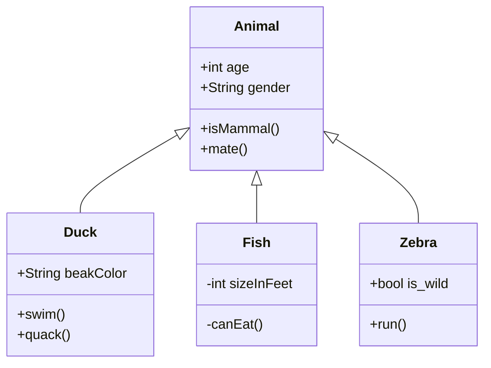
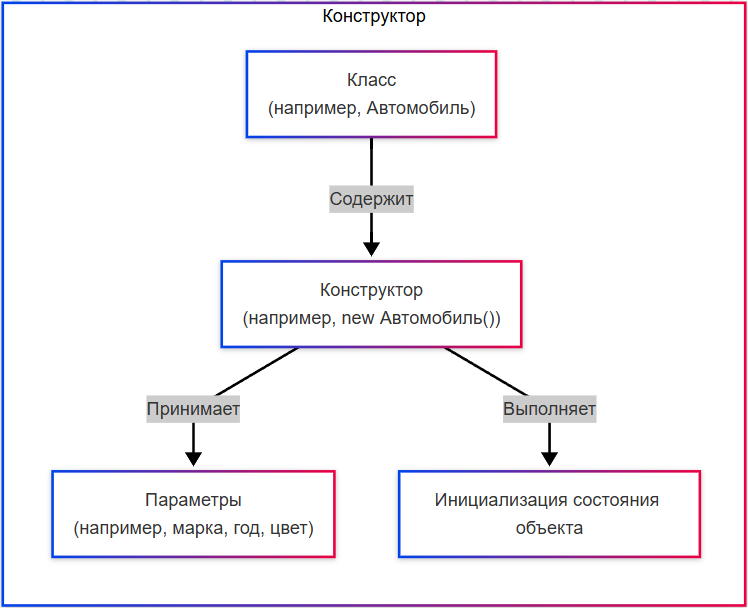
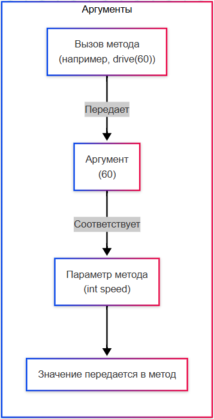
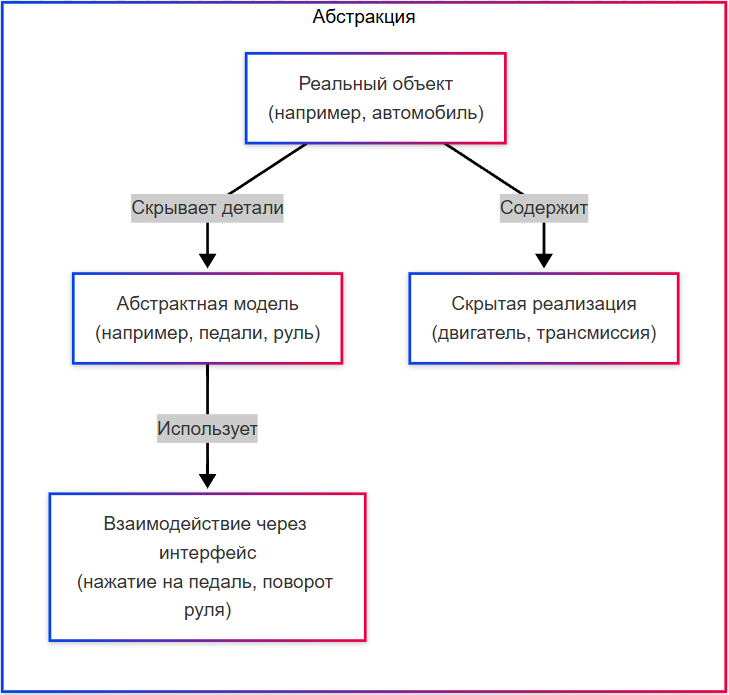
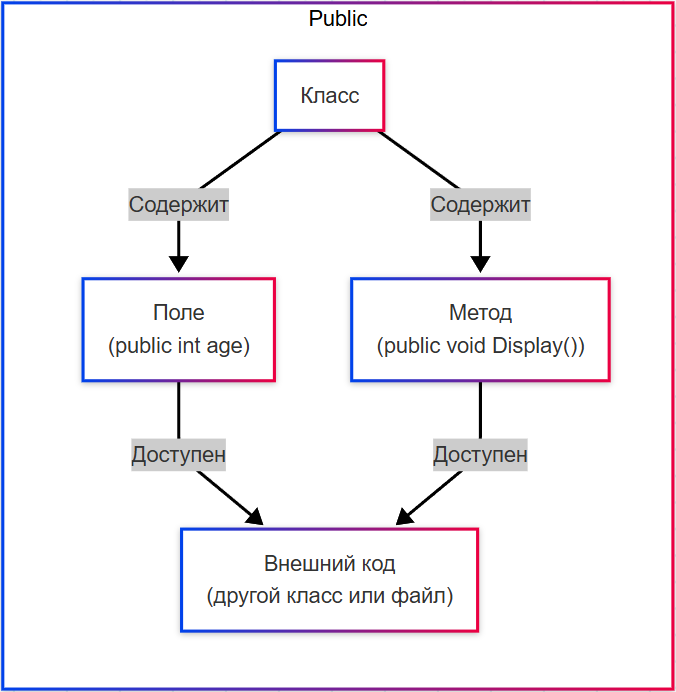
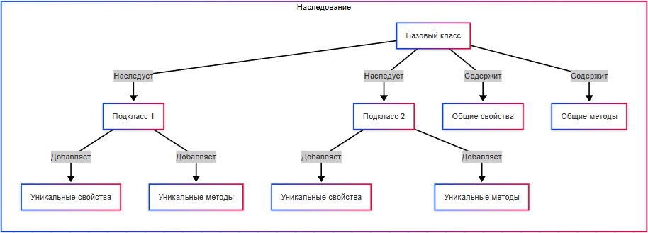
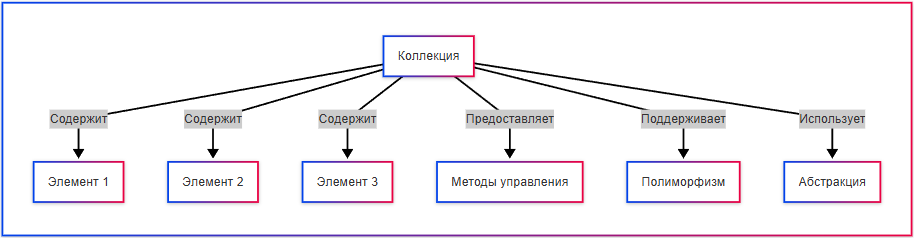
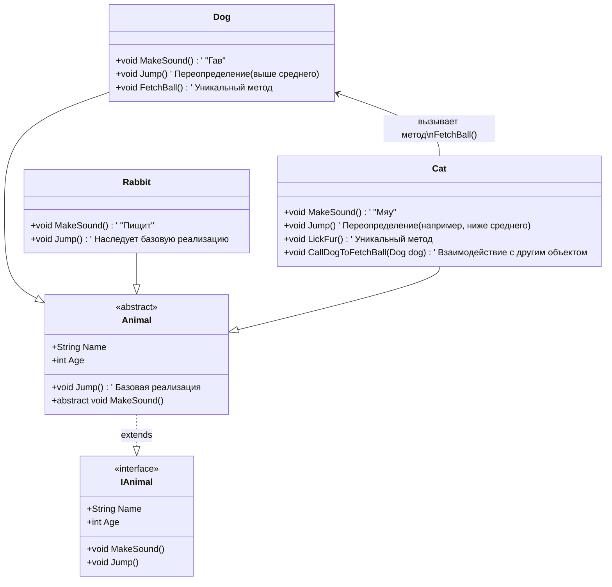

---
title: 4.08. ООП
---

# 4.08. ООП

Давайте начнём с популярной схемы.



Что мы видим здесь?

Animal - животное. Duck - утка, Fish - рыба, Zebra - зебра. Что их всех объединяет? Они все являются животными, представителями какого-то единого царства. Принадлежность к "царству" определяется рядом свойств. Объектно-ориентированное программирование строится как раз на основе определения всего вокруг как объектов со своими свойствами.

```
Интересный факт:
Первый объектно-ориентированный язык – Simula 67 – был создан для моделирования судов в порту, поэтому ООП началось с контейнеров, очередей и имитации движения кораблей.
```

## Как работает ООП?

Код в ООП - не просто алгоритм на словах. Это совокупность классов, содержащих в себе определённые элементы, и объектов, которые создаются на основе этих классов словно машины по чертежу, где класс — это кодовый шаблон, а объект — это данные по этому шаблону. Это позволяет делать большой, структурированный код, распределённый в определённой архитектуре проекта, где каждый класс может содержать определённую логику, и каждому объекту будет выделена отдельная часть памяти.


**Класс** - некий блок кода, который выступает в качестве структуры для постройки объектов.

**Что же такое объект?** 

★ **Объект** – единица, сочетающая в себе данные (атрибуты) и действия (методы), которые могут быть выполнены с этими данными. Объект - экземпляр класса, который:
	- хранит данные (атрибуты, свойства);
	- выполняет действия (методы).

Часто новичку при объяснении приводят в пример кота. Да и ранее мы уже упоминали во введении. Представим себе кота, и разберём его как объект:
	- Атрибуты (данные): имя, возраст, цвет.
	- Методы (действия): мурлыкать(), царапать().

Если бы мы писали код, мы бы представили кота так:
```
класс Кот {
  атрибут имя;
  атрибут возраст;
  атрибут цвет;

  метод мяукать() {
    сказать("Мяу!");
  }
  метод царапать() {
    //логика царапания
  }
}
```

Но, как мы заметили, у этого кота есть просто атрибуты и методы, но нет конкретики – как его зовут, сколько ему лет, какой у него цвет. Это потому, что мы создали класс – шаблон для создания объекта. То есть, это некий «чертёж» кота. Сам по себе класс – просто код. Но когда мы создаём объект, мы:
	- выделяем блок памяти под его данные (атрибуты);
	- записываем тип объекта (чтобы программа понимала, какие методы можно вызывать).

**Объект** – экземпляр класса, реальный «кот», созданный по шаблону:
```
Кот мойКотяра = new Кот("Барсик", 3, "рыжий");
```

При этом мы создали нового рыжего трёхлетнего кота, назвав его «Барсик» - мы заполнили данными его атрибуты, благодаря чему в оперативной памяти выделился блок, в котором физически появился этот объект. Теперь объект зовут «мойКотяра», потому что, когда мы создавали объект, мы его так назвали. Конечно, мы его писали в стиле C#, но смысл похож во всех ООП-языках. В нашем случае:
	- new – выделяет память;
	- Кот – указывает тип (класс, словно шаблон);
	- мойКотяра – ссылка на объект в памяти.

А теперь давайте подумаем, а зачем мы это сделали? У нас имеется в распоряжении мойКотяра, трёхлетний рыжий кот Барсик, который умеет царапать и мяукать. Представим. что в дальнейшем, в коде, нам пригодилась помощь Барсика:
```
если (время = 5:00) {
  мойКотяра.мяукать();
}
```

Поскольку у нашего кота есть метод мяукать(), мы можем его попросить мяукнуть. В данном случае, кот-помощник послушно выполнит мяукать() если время будет равно 5 утра, и, поскольку метод мяукать() содержит действие сказать("Мяу!"), то он и скажет «Мяу». А «сказать()» - тоже метод, который определён в каком-то другом классе, стандартном.

Другой пример – класс:
```
public class Car {  
    String model;  // атрибут  
    int year;      // атрибут  

    void drive() {  // метод  
        System.out.println("Врум-врум!");  
    }  
}  
```
объект:
```
Car myCar = new Car();  
myCar.model = "Toyota";  
myCar.drive();  
```

Таким образом, благодаря объектам, имеется возможность группировки логики в классы. Классы могут быть любыми, это лишь инструмент, который позволяет красиво структурировать свой код.

```
КЛАСС: Car
│
├── ПОЛЯ (атрибуты, состояние):
│   - model: String
│   - year: int
│   - color: String
│
├── МЕТОДЫ (поведение):
│   + startEngine()
│   + stopEngine()
│   + accelerate(speed: double)
│
└── ОБЪЕКТЫ (экземпляры):
    - Car { model="Toyota", year=2020, color="Silver" }
    - Car { model="BMW", year=2025, color="Black" }
```

★ **Класс** — это чертёж, шаблон, который описывает, какими свойствами и действиями должен обладать объект. Класс определяет структуру данных (атрибуты) и поведение (методы), которые будут у всех объектов, созданных на его основе.

★ **Объект** — это конкретный экземпляр класса. Если класс — это чертёж, то объект — это реальная вещь, созданная по этому чертежу. У каждого объекта есть свои уникальные значения атрибутов, но методы остаются одинаковыми для всех объектов одного класса.

★ **Атрибуты (или поля)** — это переменные, которые хранят данные объекта. Они описывают состояние объекта. Для класса «Автомобиль» мы бы определили атрибуты «модель», «год», «цвет».

★ **Поля** представляют собой «сырые» данные, которые могут быть доступны напрямую или через специальные механизмы. Они не содержат сами по себе никакой дополнительной логики для чтения или записи данных.

```
class Автомобиль {
    string model;  // Поле
    int year;      // Поле
}
```

Здесь model и year — это поля класса. К ним можно обращаться через точку «объект.поле»:

```
Автомобиль car = new Автомобиль();
car.model = "Toyota";  // Прямое изменение поля
car.year = 2020;       // Прямое изменение поля
```

★ **Свойства** — это механизм доступа к атрибутам объекта. Они позволяют контролировать, как данные читаются или изменяются. Свойства часто используются для защиты данных от некорректных значений.

Свойства предоставляют интерфейс для работы с полями, но сами поля остаются скрытыми. Внутри свойств можно добавить проверки, вычисления и другие действия при чтении или записи данных. Свойства помогают скрыть внутреннюю реализацию объекта и защитить данные от некорректного использования. Пример:
```csharp
class Автомобиль {
    private string _model;  // Приватное поле
    private int _year;      // Приватное поле

    public string Model {   // Свойство для поля _model
        get { return _model; }
        set {
            if (value == "") {
                throw new Exception("Модель не может быть пустой!");
            }
            _model = value;
        }
    }

    public int Year {       // Свойство для поля _year
        get { return _year; }
        set {
            if (value < 1900) {
                throw new Exception("Год выпуска не может быть меньше 1900!");
            }
            _year = value;
        }
    }
}
```

Здесь `_model` и `_year` — это приватные поля, которые хранят данные, а Model и Year — это свойства, которые управляют доступом к этим полям.
Использование аналогично, но свойство будет с проверкой:
```
Автомобиль car = new Автомобиль();
car.Model = "Toyota";  // Установка значения через свойство
car.Year = 2020;       // Установка значения через свойство

// Если попробовать установить некорректное значение:
car.Year = 1800;       // Выбросится исключение: "Год выпуска не может быть меньше 1900!"
```

Добавление символа подчёркивания (_) в начале имён полей — это соглашение об именовании, которое используется для различения приватных полей и свойств. Если бы имена полей и свойств совпадали, это могло бы вызвать путаницу, например:
```
private string model; // Поле
public string Model { get; set; } // Свойство
```
Здесь model и Model отличаются только регистром, что может быть непонятно или запутанно.

Чтобы избежать этой путаницы, к именам полей добавляют префикс _. Например:
```
private string _model; // Поле
public string Model { get; set; } // Свойство
```
Многие языки программирования (C#, Java) имеют соглашения об именовании, которые рекомендуют использовать префиксы для приватных полей. 

Различия между полями и свойствами:

| Характеристика | Поля | Свойства |
| :--- | :---: | ---: |
|Понятие	|Простые переменные	|Механизм управления доступом
|Доступ	|Прямой доступ к данным	|Косвенный доступ через методы get и set
|Логика	|Нет дополнительной логики	|Можно добавить проверки, вычисления и т.д.
|Инкапсуляция	|Не защищают данные	|Защищают данные, скрывая их от прямого доступа
|Использование	|Просто хранят данные	|Управляют доступом к данным
|Пример	|`int year;`	|`public int Year { get; set; }`

О том, что такое инкапсуляция, мы поговорим отдельно. Сейчас важно понять, что в отличие от полей, свойства предоставляют гибкость и контроль над данными.

★ **Методы** — это функции, которые описывают действия, которые может выполнять объект. Они определяют поведение объекта. Для класса «Автомобиль» мы бы добавили методы «завестиДвигатель()», «начатьДвижение()», «остановиться()».

Так, если класс является шаблоном или чертежом, по которому создаются объекты, определяя, какие поля (состояние) будут у объекта, какие методы (поведение) он может выполнить, но сам по себе класс лишь описание, а объект - уже существующие данные, то нужно как-то провести инициализацию.

За инициализацию отвечает конструктор.

★ **Конструктор** — это специальный метод, который вызывается автоматически при создании нового объекта. Конструктор — это особый тип функциональных членов класса, который имеет то же имя, что и класс. Он автоматически вызывается всякий раз, когда создается новый экземпляр объекта класса, и этот процесс также вызывает элементы данных класса. Это может включать передачу параметров в конструктор класса, если он параметризован. Конструктор для «Автомобиля» выглядел бы так:
```
Автомобиль myCar = new Автомобиль("Toyota", 2020, "синий");
```

И здесь «new Автомобиль» - конструктор. Он принимает три параметра - "Toyota", 2020, "синий", они и устанавливаются как начальные значения атрибутов объекта.

Конструктор инициализирует состояние объекта (данные класса), обеспечивает контроль над тем, как создаются экземпляры класса и может быть использован для установки начальных значений полей объекта через параметры.



Во многих ООП-языках принято соглашение о том, что конструктор называется так же, как и класс. Если класс Cat, то и конструктор будет Cat().
Помню, мой мозг взрывало по началу обучение ООП в стиле примеров:
```
Cat cat = new Cat()
```
Представьте, каково новичку без разжёвывания понимать, что это вообще такое и почему тут целых три повторения одного и того же слова Cat?

И почему есть Cat с большой буквы, cat с маленькой, и Cat со скобками?

Если же писать это в IDE, будет немного понятнее:
```java
Cat cat = new Cat();
```
	- Cat - название класса (как раз шаблон);
	- cat - название переменной (область памяти, куда мы «засунем» объект);
	- new - ключевое слово для инициализации конструктора;
	- Cat() - метод-конструктор, который имеется в классе Cat и позволяет создавать объекты по шаблону.

Такое вот соглашение. Называя так же, как класс, мы показываем, что это часть класса, что он связан с процессом создания объекта и это не просто обычный метод. Такой подход делает код более понятным и предсказуемым.

Конструктор нужен для выделения памяти под объект, инициализации полей и свойств, настройки начального состояния объекта, выполнения обязательной логики перед началом использования объекта. Без конструктора объект можно создать, но он будет иметь неопределённое или неполное состояние. Однако, если вы не напишете конструктор самостоятельно, то компилятор/интерпретатор может создать его автоматически (конструктор по умолчанию, без параметров). Если нужно установить начальные значения полей, то конструктор лучше добавить. Если же объект простой и не требует инициализации, можно обойтись без явного конструктора.

Конструктор принимает те же данные, которые нужны для инициализации полей. Если у класса есть поля name, age, то конструктор часто принимает эти же значения. Это не обязательно, можно принимать меньше или больше значений, а можно и вовсе ничего не принимать. Конструкторов может быть и несколько, это называется перегрузкой конструкторов:
	- constructor() → создает объект с дефолтными значениями
	- constructor(name) → задаёт имя
	- constructor(name, age) → задаёт имя и возраст

Это удобно, когда объект может быть создан разными способами.

Если же имеется наследование, то сначала вызывается конструктор родительского класса, затем дочернего. Это гарантирует, что объект будет правильно инициализирован «снизу вверх».

Конструктор, иными словами, это то, что превращает класс в объект. Он обеспечивает корректную инициализацию, позволяет задать начальное состояние и сделать объект готовым к использованию.

Конструкторы бывают некоторых видов.

1. **Конструктор по умолчанию (Default Constructor)** - без параметров, инициализирует объект со значениями по умолчанию. Используется, если программист не определил ни одного конструктора, многие языки (например, Java, C#) автоматически создают конструктор по умолчанию; а если же определён хотя бы один конструктор, автоматический конструктор по умолчанию не создаётся, и его нужно добавлять вручную, если он нужен.
Это нужно, чтобы можно было создавать объекты без передачи параметров, особенно при работе с коллекциями, сериализацией или фреймворками.
2. **Параметризованный конструктор (Parameterized Constructor)**, принимающий один или несколько параметров для инициализации полей объекта конкретными значениями. Используется, когда важно создать объект в полностью инициализированном состоянии, с заданными данными. Это позволяет контролировать начальное состояние объекта и избегать «полуинициализированных» экземпляров. Если у объекта Person есть name и age, то при создании экземпляра нужно передавать name и age.
3. **Конструктор копирования (Copy Constructor)** создаёт новый объект как копию существующего объекта того же класса. Используется при необходимости создать независимую копию объекта, чтобы избежать ситуации, когда несколько переменных ссылаются на один и тот же объект (что может привести к нежелательным изменениям).

Пример:
```java
Person original = new Person("Борис", 35)
Person copy = new Person(original)
```

**Поверхностная копия** — копируются только значения полей. Если поля — ссылки на объекты, копируется ссылка, а не сам объект.

**Глубокая копия** — создаются копии всех вложенных объектов, чтобы копия была полностью независимой.

Это нужно для безопасного клонирования объектов, особенно в системах, где важна целостность данных. Не во всех языках есть встроенная поддержка конструктора копирования (например, в Java его нет «из коробки», но можно реализовать вручную).

4. **Конструктор с переменным числом аргументов (Varargs Constructor)**, принимающий переменное количество значений одного типа, которые внутри обрабатываются как массив. Когда количество входных данных заранее неизвестно, но они однотипны.
```csharp
new NumbersCollection(1, 2, 3, 4)
new NumbersCollection(10, 20)
```

Нужно для гибкой инициализации объектов, особенно коллекций, списков, настроек и т.п., поддерживается не во всех языках, но в тех, где есть (например, Java, C#), очень удобен.

5. **Статический конструктор / Фабричный метод (по смыслу)**. Собственно «статический конструктор» — это скорее реализация в конкретных языках (например, в C#), но по сути речь часто идёт о фабричных методах — альтернативе обычным конструкторам.

Вместо прямого вызова new, объект создаётся через статический метод, который может выбирать нужный подтип, кэшировать объекты, выполнять сложную логику инициализации. К примеру:
```csharp
Point origin = Point.createOrigin()
User admin = User.createAdmin("admin@example.com")
```

Нужно для улучшения читаемости кода, реализации паттернов проектирования (Фабрика, Одиночка), и когда конструкторы не могут возвращать разные типы или выполнять кэширование.

Мы упомянули, что метод может «принимать» какие-то значения. Давайте вернёмся к этому.

★ **Сигнатура** — это описание метода, которое включает его имя, типы параметров и возвращаемое значение. Она помогает программе понять, какой именно метод нужно вызвать.

★ **Аргументы** — это значения, которые передаются в метод или конструктор при его вызове. Они используются для выполнения действий или установки начальных значений.

К примеру, мы создаём метод drive(speed):
```java
void drive(int speed)
```
В этом случае, указывается сигнатура:
	- void - возвращаемый тип (ничего не возвращает);
	- drive - имя метода;
	- int speed - параметр метода с типом целое число.

При вызове метода drive(60) мы передадим аргумент «60», который укажет на скорость автомобиля (соответствующий int speed).

Тип метода зависит от того, что он возвращает. К примеру, если бы метод был не void, а int - значит тип возвращаемого значения был бы «int», целое число.

Однако, важно отметить, что во многих языках программирования в сигнатуру не входит возвращаемое число метода. В основном, сигнатурой принято считать имя метода, типы параметров (и их порядок), а также количество параметров.



Но о том, как это использовать, мы поговорим позже.

```
Практическое задание
Придумайте и напишите любой класс по образцу выше.
Добавьте к классу два свойства и два метода.

```

**★ Какими бывают классы?**

1. **Обычный класс** – базовая структура с полями и методами:
```java
class Car {
    String model;
    void drive() { ... }
}
```
2. **Абстрактный класс** – его экземпляр создать нельзя, только унаследовать (позже мы ещё поговорим об этом):
```java
abstract class Animal {
    abstract void makeSound();
}
```
3. **Статический класс** (в некоторых языках, например, C#) – нельзя создать экземпляр, все методы/поля статические:
```csharp
static class MathUtils {
    public static int Add(int a, int b) => a + b;
}
```

Статические члены используют ключевые слова static. Их можно вызывать с помощью имени класса.

4. **Интерфейс** – контракт, который класс обязуется выполнить (реализовать его методы), то есть в интерфейсе ещё не понятно, что делает метод, но в классе, который создаётся по интерфейсу, должна быть реализация метода:
```java
interface Flyable {
    void fly();
}

class Bird implements Flyable {
    public void fly() { System.out.println("Летит!"); }
}
```

Методы – какие-то действия. И функции – какие-то действия. Что такое методы и чем они отличаются от функций?

| Метод | Функция |
|-----|---------|
|Привязан к объекту/классу.	|Существует независимо.
|Вызывается через объект: obj.method()	|Вызывается напрямую: func()
|Может работать с данными объекта (self/this).	|Обычно принимает всё через аргументы.

Метод вызывается по шаблону «объект.метод», как ранее – мойКотяра.мяукнуть().

Ранее, мы уже затрагивали тему переменных. Как мы уже заметили здесь. переменная – это указатель на объект в памяти – «мойКотяра».

★ **Класс** – просто описание (чертёж автомобиля);

★ **Экземпляр класса** – конкретный объект в памяти (реальный автомобиль);

★ **Переменная** – ссылка на объект в памяти (документы на автомобиль).
```java
Car tesla;  // tesla – переменная, хранящая объект Car в памяти
```
Давайте взглянем более сравнительно:

| Термин | Что это? | Аналог из жизни | Пример в коде |
|-----|---------|---------|---------|
|Класс	|Шаблон, описание объекта.	|Чертеж автомобиля.	|`class Car { ... }`
|Объект	|Конкретный экземпляр класса в памяти, «живая» сущность, созданная через new или вызов конструктора.	|Реальный автомобиль.	|`Car myCar = new Car();`
|Экземпляр	|То же, что и объект (обычно в Python/Java говорят "экземпляр"). Синоним.	|Конкретная машина.	|`my_car = Car()`
|Атрибут	|Данные объекта (переменные внутри класса).	|Характеристики машины.	|`myCar.model = "Tesla"`
|Свойство	|Атрибут + методы доступа (геттеры/сеттеры).	|Цвет с проверкой.	|`public string Model { get; set; }`
|Метод	|Функция внутри класса, работающая с объектом.	|Завести двигатель.	|`myCar.startEngine()`
|Переменная	|Имя, ссылающееся на объект (хранит адрес в памяти). Если не укажет на объект, будет пустая (null).	|Пульт от машины.	|`Car car = new Car();`

Так, мы разобрались с ключевыми элементами ООП. Теперь вернёмся к определению и уже станет понятнее: объектно-ориентированное программирование, или ООП – парадигма программирования, где программа строится из объектов.

Программа – мир объектов, которые хранят данные (атрибуты), выполняют действия (методы), общаются друг с другом через вызовы методов. 

Допустим, есть игра. Её объекты:
	- Игрок (атрибуты: имя, здоровье; методы: двигаться(), атаковать());
	- Оружие (атрибуты: урон, вес; методы: выстрелить());
	- Противник (атрибуты: тип, сложность).

Как они будут взаимодействовать, к примеру, в Python:
```python
player.attack(weapon)  # Игрок вызывает метод "атаковать", передавая оружие
weapon.shoot(enemy)    # Оружие стреляет во врага
```
★ **Объектная модель** – схема для проектирования системы.

Перед кодом нужно продумать:
1. Какие объекты есть в системе? (Кто участвует?);
2. Какие у них атрибуты? (Что они знают о себе?);
3. Какие у них методы? (Что они умеют делать?);
4. Как они связаны? (Кто кого использует?).

Пример: Интернет-магазин

| Объект | Атрибуты | Методы | Связи |
|-----|---------|---------|---------|
|Товар	|цена, название, количество	|снять_со_скидки()	|Связан с Заказом
|Корзина	|список_товаров, итого	|добавить_товар()	|Содержит Товары
|Пользователь	|логин, баланс	|сделать_заказ()	|Создаёт Заказы

★ **Жизненный цикл объекта в ООП** — это последовательность этапов, через которые проходит объект с момента его создания до уничтожения.

1. Создание объекта:
	- программа выделяет блок памяти для хранения данных объекта (его атрибутов);
	- вызывается конструктор объекта, который инициализирует атрибуты начальными значениями;
	- если конструктор принимает параметры, они передаются при создании объекта;
	- создаётся ссылка на объект, чтобы к нему можно было обращаться в программе.
```java
class Автомобиль {
    String модель;
    int год;

    // Конструктор
    public Автомобиль(String модель, int год) {
        this.модель = модель;
        this.год = год;
    }
}

// Создание объекта
Автомобиль car = new Автомобиль("Toyota", 2020);
```

Здесь `new` выделяет память, конструктор инициализирует атрибуты (модель и год), ссылка car указывает на созданный объект. `This` — это ссылка на текущий объект внутри его нестатического метода или конструктора.

2. Использование объекта:
	- обращение к атрибутам - чтение или изменение значений атрибутов объекта;
	- вызов методов - выполнение действий, определённых в методах объекта;
	- взаимодействие с другими объектами путем обмена данными или вызова их методов.
3. Модификация объекта:
	- изменение значений атрибутов;
	- вызов методов, которые меняют внутреннее состояние объекта.
```java
class Автомобиль {
    String модель;
    int год;
    boolean двигательЗаведён;

    public void завестиДвигатель() {
        двигательЗаведён = true;
    }

    public void заглушитьДвигатель() {
        двигательЗаведён = false;
    }
}

Автомобиль car = new Автомобиль("Toyota", 2020);
car.завестиДвигатель(); // Модификация состояния
```

Здесь метод `завестиДвигатель()` изменяет атрибут двигательЗаведён.

4. Уничтожение объекта:
	- автоматическая сборка мусора (уничтожение объекта путём освобождения памяти, когда на него нет ссылок);
	- явное удаление (вручную уничтожается объект, к примеру, в С++ через delete, и car = null в Java).
5. Прочие этапы:
	- передача объекта другим частям программы (как аргумент в метод, возвращаемое значение из метода или сохранение в коллекции);
	- клонирование объекта - создание копии;
	- сериализация - преобразование в поток данных для сохранения в файл или передачи по сети;
	- десериализация - восстановление объекта из потока данных.

Таким образом, если коротко, то проходят эти этапы так:
```
Класс - Создание объекта - Использование и модификация - Уничтожение.
```


Объекты могут:
	- Содержать другие объекты (композиция);
	- Использовать другие объекты (агрегация);
	- Наследовать («родитель-потомок»).
	- Скрывать свои детали от других объектов;
	- Быть разными, но работать одинаково.
	- Расширять свою функциональность.

Учитывая такие возможности объектов, существуют принципы ООП:
	- абстракция;
	- инкапсуляция;
	- наследование;
	- полиморфизм.

Давайте рассмотрим эти страшные слова.

## Абстракция

★ **Абстракция** – создание абстракных моделей объектов, которые скрывают внутреннюю реализацию. Позволяет работать с объектами, не вникая в их внутреннее устройство. Например, водитель использует педаль газа, не зная, как устроен двигатель.

Суть в том, чтобы скрыть сложные детали реализации и показать только важные свойства и функции объекта.

**Зачем нужна абстракция?**

1. Упрощение сложных систем. Можно разбить сложные системы на понятные части. К примеру, мы в реальном мире не думаем о том, как работает двигатель автомобиля, чтобы управлять, нам хватит понимать, где педали, а где руль. В программировании можно так же спрятать внутрь реализацию.
2. Сокрытие ненужных деталей. К примеру, другому программисту не нужно знать, как работает метод «мяукнуть()», ему достаточно лишь понимать, что он делает. Понятно, что мяукание издаст определённый звук. Но какие будут происходить процессы внутри «кота» - не нужно нам знать.
3. Уменьшение сложности кода. Абстракция помогает структурировать код, делая его:
	- читаемым (логика разбита на модули);
	- поддерживаемым (изменения внутри класса не ломают внешний код);
	- масштабируемым (можно добавлять новые функции, не переписывая всё).
4. Унификация взаимодействия. Абстракция позволяет стандартизировать работу с объектами. Допустим, в игре разные персонажи могут иметь метод attack(), но реализация у мечника и мага будет отличаться.

Абстракция достигается за счёт:
	- абстрактных классов;
	- абстрактных методов;
	- сокрытия данных.



★ **Абстрактный класс** – это класс, который нельзя создать напрямую – только через наследование. Содержит абстрактные методы и/или обычные методы.

Абстрактный класс нужен для того, чтобы задать общую структуру для дочерних классов и запретить создание объектов «неполного» типа.

Нельзя создавать экземпляр абстрактного класса, но если сделать неабстрактного наследника, то можно уже создавать объекты.

Пример на Java:
```Java
// Абстрактный класс "Транспорт"
abstract class Transport {
    private String name;  // поле

    public Transport(String name) {  // конструктор
        this.name = name;
    }

    // Абстрактный метод (без тела)
    public abstract void move();

    // Обычный метод
    public void honk() {
        System.out.println(name + " сигналит: Би-бип!");
    }
}

// Класс-наследник "Машина"
class Car extends Transport {
    public Car(String name) {
        super(name);  // вызываем конструктор родителя
    }

    // Реализация абстрактного метода
    @Override
    public void move() {
        System.out.println(getClass().getSimpleName() + " едет по дороге!");
    }
}

// Класс-наследник "Самолет"
class Airplane extends Transport {
    public Airplane(String name) {
        super(name);
    }

    @Override
    public void move() {
        System.out.println(getClass().getSimpleName() + " летит в небе!");
    }
}

public class Main {
    public static void main(String[] args) {
        Transport car = new Car("Toyota");
        Transport airplane = new Airplane("Boeing 747");

        car.move();       // Вывод: "Car едет по дороге!"
        car.honk();      // Вывод: "Toyota сигналит: Би-бип!"

        airplane.move();  // Вывод: "Airplane летит в небе!"
        airplane.honk();  // Вывод: "Boeing 747 сигналит: Би-бип!"
    }
}

```

Transport – абстрактный класс с:
	- абстрактным методом move();
	- обычным методом honk().
	
Car и Airplane – наследники, которые обязаны реализовать move().

И нельзя создать Transport напрямую:
```java
Transport t = new Transport();  // Ошибка! Transport абстрактный.
```

★ **Абстрактный метод** – это метод без реализации, который обязаны переопределить все дочерние классы. Принцип тот же – это просто указание, что абстрактный класс содержит этот метод, но как работает метод – не указано.
Так, программист реализует критичную логику, и использует унифицированный интерфейс для разных классов. Словом, будет порядок. Пример:
```java
abstract class Animal {
    abstract void makeSound();  // абстрактный метод
}

class Dog extends Animal {
    void makeSound() {  // обязательная реализация
        System.out.println("Гав!");
    }
}
```
★ **Интерфейсы** – полностью абстрактный «контракт», где все методы абстрактные. В отличие от абстрактного класса, в интерфейсе нет полей и реализованных методов, и класс может реализовать много интерфейсов, но наследовать только один абстрактный класс. Пример:
```java
interface Flyable {
    void fly();  // абстрактный метод
}

class Bird implements Flyable {
    public void fly() {
        System.out.println("Лечу как птица!");
    }
}
```
Ещё один пример интерфейса:

```Java
// Интерфейс "Ремонтируемый"
interface Repairable {
    void repair();
}

// Абстрактный класс + интерфейс
abstract class Transport implements Repairable {
    public abstract void move();

    // Общий метод для всех наследников
    public void startEngine() {
        System.out.println("Двигатель запущен.");
    }
}

class Bicycle extends Transport {
    @Override
    public void move() {
        System.out.println("Велосипед едет!");
    }

    @Override
    public void repair() {
        System.out.println("Чиним цепь...");
    }
}

public class Main {
    public static void main(String[] args) {
        Bicycle bike = new Bicycle();
        bike.startEngine();  // Вывод: "Двигатель запущен." (наследовано)
        bike.move();         // Вывод: "Велосипед едет!"
        bike.repair();       // Вывод: "Чиним цепь..."
    }
}
```

Интерфейс – только контракт (все методы абстрактные).

Абстрактный класс – частичная реализация + контракт.

Абстрактные классы особенно полезны в библиотеках и фреймворках, когда надо спрятать внутри всю логику и дать пользователю инструмент.

Таким образом, 
	- «Что» – это публичный интерфейс (какие методы доступны пользователю);
	- «Как» - скрытая реализация (как эти методы работают внутри).

Где применяется абстракция – примеры:
1. Библиотеки и фреймворки, к примеру, в ORM вы работаете с моделями вроде Model.save(), не зная самих SQL-запросов.
2. Игры – абстрактный класс Enemy (враг) с методом attack(), где Dragon и Zombie реализуют свою логику атаки.
3. GUI – кнопка Button.click() скрывает детали отрисовки и обработки событий.
4. API – например, оплата идёт путем вызова метода, без знания протоколов.


## Инкапсуляция

★ **Инкапсуляция** – скрытие данных объекта от внешнего доступа и управление доступом к ним через методы. Скрывает внутреннюю реализацию объекта, предоставляя контролируемый доступ к его данным через публичные методы (геттеры/сеттеры). Это предотвращает прямое изменение данных и обеспечивает их целостность. Можно выделить класс в отдельный файл, и при помощи средств инкапсуляции обратиться к нему из другого файла, структурировав код.

Классы могут быть как в одном файле, так и в разных файлах. Представим, что у нас есть два класса:
	- Класс1.cs (Класс1.java или Класс1.py - зависит от языка);
	- Класс2.cs.
	
В каждом классе находится свой класс. Например, вот так выглядит Класс1.cs:
```java
public class Класс1 {
    public string публичноеПоле = "Привет!";
    private string приватноеПоле = "Это секрет!";

    public void публичныйМетод() {
        вывод("Это публичный метод.");
    }

    private void приватныйМетод() {
        вывод("Это приватный метод.");
    }
}
```

Получается, класс содержит два поля и два метода.

Из второго файла, Класс2.cs, мы можем обращаться к элементам Класс1.cs, обращаясь по имени, словно по адресу. Чтобы обратиться к элементу (полю, методу и свойству) другого класса, мы используем точку (.) — это универсальный способ во всех языках.
```
Класс1 объект = new Класс1();
вывод(объект.публичноеПоле); // Обращение к полю
объект.публичныйМетод();     // Вызов метода
```
Здесь мы создаём экземпляр объекта (чтобы выделить память), обращаемся к полю и вызываем метод. 

И вот так выглядит файл Класс2.cs:
```java
public class Класс2 {
    public void использоватьКласс1() {
        Класс1 объект = new Класс1();

        // Попробуем обратиться к элементам Класс1
        вывод(объект.публичноеПоле); // Работает
        объект.публичныйМетод();     // Работает

        // Попробуем обратиться к приватным элементам
        вывод(объект.приватноеПоле); // Ошибка: недоступно
        объект.приватныйМетод();     // Ошибка: недоступно
    }
}
```

В нашем случае, если мы обращаемся к публичному свойству, полю или методу - мы получаем значение (или выполняем логику метода), но если обращаемся к приватному - получаем ошибку - доступа к элементу нет.

Такой доступ определён модификатором. Именно он определяет, можно ли использовать из других файлов соответствующий элемент.

★ **Модификаторы доступа** - ключевой механизм инкапсуляции. Они определяют уровень видимости атрибутов и методов класса. Они позволяют контролировать, кто может обращаться к этим элементам. Пишутся они в начале объявления элемента (класса, метода, свойства, поля) по шаблону:
`<модификатор>` `<тип>` `<название>`
Пример:
```java
public int age; // Модификатор доступа: public, тип: int, название: age
```

Если модификатор не указан, используется стандартный по умолчанию (private для полей в C#, default в Java). В C++ модификаторы доступа указываются внутри класса в виде блоков, а не перед каждым элементом. В большинстве языков программирования рекомендуется явно указывать модификатор доступа для всех элементов, чтобы избежать путаницы с модификаторами по умолчанию.

Количество модификаторов зависит от языка программирования. Например, в C# и Java их четыре:

1. **public** - доступен всем - внутри класса, вне класса, в других пакетах и сборках.
```java
public class Класс1 {
    public string имя = "Анна";
}

public class Класс2 {
    public void использоватьКласс1() {
        Класс1 объект = new Класс1();
        вывод(объект.имя); // Выведет: Анна
    }
}
```
Схематично работу модификатора Public можно представить так:



2. **private** - доступен только внутри класса.
```java
public class Класс1 {
    private string пароль = "12345";

    public string получитьПароль() {
        return пароль; // Доступ внутри класса
    }
}

public class Класс2 {
    public void использоватьКласс1() {
        Класс1 объект = new Класс1();
        вывод(объект.пароль); // Ошибка: недоступно
        вывод(объект.получитьПароль()); // Выведет: 12345
    }
}
```

Схематично работу защищённых элементов можно представить так:


3. **protected** - доступен внутри класса и его наследников.

```java
public class Класс1 {
    protected string секрет = "Только для наследников";
}

public class Класс2 : Класс1 { // Наследник Класс1
    public void показатьСекрет() {
        вывод(секрет); // Выведет: Только для наследников
    }
}

public class Класс3 {
    public void использоватьКласс1() {
        Класс1 объект = new Класс1();
        вывод(объект.секрет); // Ошибка: недоступно
    }
}
```
Кто такие наследники - поговорим отдельно.

4. **internal** (C#) или **default** (Java) - доступен внутри текущей сборки/пакета.

```csharp
internal class Класс1 { // C#
    public string имя = "Анна";
}

public class Класс2 { // В другой сборке
    public void использоватьКласс1() {
        Класс1 объект = new Класс1(); // Ошибка: недоступно
    }
}
```
★ **Приватные поля** — это атрибуты класса, доступные только внутри самого класса. 

Пример:
```java
class User {
    private string password; // Приватное поле

    public void setPassword(string newPassword) {
        if (newPassword.Length >= 8) {
            password = newPassword;
        } else {
            throw new Exception("Пароль слишком короткий!");
        }
    }
}
```

Здесь поле password защищено от прямого доступа, и его можно изменить только через метод setPassword, который будет являться сеттером.

Публичные методы предоставляют контролируемый доступ к приватным полям:
	- **Геттер (getter)** - метод для чтения значения;
	- **Сеттер (setter)** - метод для установки значения.

Таким образом, само поле защищается от доступа через User.password, но доступно при вызове метода setPassword.

Приватные поля нельзя напрямую изменять извне класса - только через геттеры и сеттеры.

```java
public class Класс1 {
    private string имя;

    public string получитьИмя() { // Геттер
        return имя;
    }

    public void установитьИмя(string новоеИмя) { // Сеттер
        если (новоеИмя != "") {
            имя = новоеИмя;
        } иначе {
            вывод("Имя не может быть пустым!");
        }
    }
}

public class Класс2 {
    public void использоватьКласс1() {
        Класс1 объект = new Класс1();
        объект.установитьИмя("Анна");
        вывод(объект.получитьИмя()); // Выведет: Анна
    }
}
```


Пример сеттеров и геттеров:

```csharp
class User {
    private string name;

    public string getName() { // Геттер
        return name;
    }

    public void setName(string newName) { // Сеттер
        if (!string.IsNullOrEmpty(newName)) {
            name = newName;
        } else {
            throw new Exception("Имя не может быть пустым!");
        }
    }
}

```

Тут name является private и недоступно для изменения, однако можно получить его значение, вызвав геттер-метод getName(), а для установки значения - вызвав сеттер setName.

Схематично геттеры и сеттеры работают так:


Свойства как раз представляют собой механизм управления доступом к полям, который объединяет геттеры и сеттеры в одно целое, что и упрощает работу с данными. Свойство пишется по формату:
 
Пример:
```java
class User {
    private string name;

    public string Name { // Свойство
        get { return name; }
        set {
            if (!string.IsNullOrEmpty(value)) {
                name = value;
            } else {
                throw new Exception("Имя не может быть пустым!");
            }
        }
    }
}
```
Есть механизм автоматических свойств, который упрощает написание кода, когда логика доступа простая, в таком случае компилятор автоматически создаёт приватное поле и реализует геттер и сеттер:
```java
class User {
    public string Name { get; set; } // Автоматическое свойство
}
```

Объекты могут быть **иммутабельными (неизменяемыми)** - их состояние нельзя изменить после создания. Это достигается за счёт использования только приватных полей и отсутствия сеттеров (ведь сеттер используется для изменения). Пример:

```csharp
class ImmutableUser {
    public string Name { get; } // Только для чтения
    public int Age { get; }

    public ImmutableUser(string name, int age) {
        Name = name;
        Age = age;
    }
}
```

Здесь Name имеет только геттер get, что не позволит установить ему значения - сеттера просто нет.

**Где можно применять такие инструменты?**
	- Безопасность данных - защита паролей, личных данных пользователей. К примеру, в банковском приложении можно сделать доступным баланс пользователя только через методы.
	- Управление состоянием объекта — это гарантирует, что данные всегда находятся в допустимом состоянии, допустим путём установки запрета на установку отрицательного возраста.
	- Сокрытие реализации - пользователь класса не должен знать, как работает внутренняя логика. 

**Важно**: инкапсуляция и сокрытие - не одно и то же. Сокрытие данных — это механизм, который делает данные недоступными для внешнего кода за счёт использования модификаторов доступа private или protected - для обеспечения безопасности данных, подразумевая невозможность доступа (фокус на безопасности). Инкапсуляция же подразумевает обеспечение целостности объекта за счёт объединения данных (атрибутов) и методов работы с ними в единый объект (фокус на контролируемом доступе и целостности). То есть, сокрытие - более узкое понятие.

Может возникнуть вопрос - а зачем инкапсуляция нужна, если программист может делать все элементы публичными, а приватными просто закрывает их?

Давайте закрепим практическим применением инкапсуляции.

1. Инкапсуляция защищает от ошибок внутри команды. Программисты — это люди, и они могут допускать ошибки. Инкапсуляция помогает избежать случайных изменений данных, которые могут привести к непредсказуемым последствиям. Допустим, другой программист не сможет установить некорректное значение для баланса, если он не может быть отрицательным - IDE предупредит и выдаст ошибку.
2. Инкапсуляция помогает поддерживать целостность системы. Когда данные защищены (private), их можно изменять только через определённые методы. Это позволяет добавлять проверки, логику и обработку ошибок. К примеру, можно добавить проверку, что возраст пользователя всегда положителен - и никто не сможет установить его в отрицательном значении и не нарушит логику работы команды.
3. Инкапсуляция делает код более безопасным для будущих изменений. Если сделать все поля public, то любое изменение внутренней реализации класса потребует изменения всего кода, который использует этот класс. Инкапсуляция скрывает детали реализации, позволяя изменять их без влияния на внешний код. К примеру, мы храним баланс в виде числа. И если позже мы решим хранить баланс в виде строки (например, для форматирования), внешний код не заметит изменений, потому что интерфейс остался неизменным - мы как вызывали «получитьБаланс()», так и будем вызывать, а что за тип у поля - не узнаем, так как метод публичный, а поле - приватное:
```csharp
класс БанковскийСчёт {
    private double баланс;

    public double получитьБаланс() {
        return баланс;
    }
}
```
4. Инкапсуляция помогает предотвратить злоупотребления, задавая правила игры «не трогай эти данные напрямую, используй интерфейс». Если видим, что поле private, значит автор класса не хочет, чтобы вы изменяли эти данные напрямую — это сигнал - «используй геттеры и сеттеры, потому что здесь может быть дополнительная логика».
5. Инкапсуляция упрощает тестирование и отладку. Когда данные защищены, мы точно знаем, какие методы могут изменять состояние объекта, что упрощает поиск ошибок и тестирование. К примеру, если поле баланс публичное, мы не сможем отследить, кто и когда его изменил. Если же доступ к нему только через методы, можно добавить логирование:
```java
public void установитьБаланс(double новыйБаланс) {
    если (новыйБаланс >= 0) {
        вывод("Баланс изменён с " + баланс + " на " + новыйБаланс);
        баланс = новыйБаланс;
    } иначе {
        вывод("Ошибка: попытка установить отрицательный баланс.");
    }
}
```
6. Инкапсуляция помогает создавать переиспользуемые компоненты. Можно создать какую-то сложную логику сохранения файла, но спрятать её в класс, оставив публичным метод, что спрячет её «под капотом», и другие смогут использовать этот класс, не зная, как именно реализованы методы.


## Наследование

★ **Наследование** – создание новых классов (типов объектов) на основе существующих, наследуя их свойства и методы. Позволяет создавать новый класс (подкласс) на основе существующего (родительского), перенимая его свойства и методы. Это уменьшает дублирование кода и упрощает его поддержку.

К примеру, у нас есть несколько классов, которые имеют общие атрибуты или методы - можно не дублировать их в каждом. а вынести в базовый класс. Подклассы будут наследовать эти общие элементы. И вместо того, чтобы писать одинаковый код для разных классов - используется наследование.



★ Подкласс сможет добавлять свои новые методы или переопределять существующие методы родительского класса.

★ Базовый класс (суперкласс) — это класс, который предоставляет свои свойства или методы для наследования. Он описывает общие характеристики и поведение, которые могут быть полезны для подклассов. Пример:

```java
класс Транспорт {
    строка модель;
    целое год;

    метод запустить() {
        вывод("Транспорт запущен.");
    }
}
```
Здесь класс Транспорт является базовым классом. Он содержит общие атрибуты (модель, год) и метод (запустить()).

**Производный класс (или подкласс)** — это класс, который наследует свойства и методы базового класса. Подкласс может использовать унаследованные элементы «как есть», добавлять новые элементы или переопределять унаследованные методы.

Пример:

```java
класс Автомобиль : Транспорт { // Наследование от Транспорт
    целое количество_колёс;

    метод ехать() {
        вывод("Автомобиль едет.");
    }

    метод запустить() { // Переопределение метода
        вывод("Автомобиль запущен!");
    }
}
```

Здесь класс Автомобиль наследует модель, год и метод запустить() от класса Транспорт. Также он добавляет поле количество_колёс и метод ехать(), и кроме этого - переопределяет метод запустить().

★ **Интерфейс** — это набор методов, которые должны быть реализованы в классах, использующих этот интерфейс, и интерфейсы не содержат реализации методов. Они используются для определения «контракта», которому должны следовать классы.

Пример:

```java
интерфейс Запускаемый {
    метод запустить();
}

класс Автомобиль : Запускаемый {
    метод запустить() {
        вывод("Автомобиль запущен.");
    }
}
```

Здесь класс Автомобиль реализует интерфейс Запускаемый и обязан реализовать метод запустить().

Абстрактный класс может содержать как реализованные методы, так и абстрактные методы (без реализации). От абстрактного класса нельзя создавать объекты напрямую. Он используется для создания базовых классов, которые будут наследоваться.

Пример:

```Java
абстрактный класс Транспорт {
    метод запустить() {
        вывод("Транспорт запущен.");
    }

    абстрактный метод ехать(); // Без реализации
}

класс Автомобиль : Транспорт {
    метод ехать() {
        вывод("Автомобиль едет.");
    }
}
```

Здесь класс Автомобиль наследует абстрактный класс Транспорт и обязан реализовать метод ехать().

★ **Множественное наследование** — это возможность наследовать свойства и методы сразу нескольких классов. Это мощный механизм, но он может вызывать проблемы, такие как «конфликт имён» (если два родительских класса имеют методы с одинаковыми именами).

Пример:

```Java
класс Двигатель {
    метод завести() {
        вывод("Двигатель заведён.");
    }
}

класс Колёса {
    метод повернуть() {
        вывод("Колёса повернуты.");
    }
}

класс Автомобиль : Двигатель, Колёса { // Наследование от двух классов
    метод ехать() {
        завести();
        повернуть();
        вывод("Автомобиль едет.");
    }
}

```

Здесь класс Автомобиль наследует методы от классов Двигатель и Колёса.

Важно: не все языки программирования поддерживают множественное наследование (например, Java не поддерживает, но позволяет использовать интерфейсы для достижения похожего эффекта).

Представим, что класс D наследуется от B и С. Оба класса B и C наследуются от общего предка - класса A. Если в классе A есть какой-то метод или поле, то возникает неоднозначность: когда мы обращаемся к этому методу или полю через объект D, какой именно экземпляр использовать — от B или от C? Компилятор не знает, вызывать ли B или C. У нас могут получиться два разных метода в классе D.


Это называется Diamond Problem (ромбическая проблема) - ситуация в ООП, когда класс наследуется от двух или более классов, которые имеют общий предок, что приводит к неясности - чей метод использовать в дочернем классе. Именно поэтому многие современные языки не поддерживают множественное наследование, а если два интерфейса содержат метод с одинаковой сигнатурой, то класс обязан явно переопределить его.

Python поддерживает множественное наследование и использует MRO (Method Resolution Order) — порядок разрешения методов, где Python сначала будет искать метод в B, потом в C и затем в A.

Иногда класс не должен быть наследуемым, чтобы предотвратить изменение его поведения. Это особенно важно для классов, реализующих важную логику. В некоторых языках есть ключевое слово, например final (Java), которое делает класс ненаследуемым - финальным:
```java
final класс Утилиты {
    метод выполнить() {
        вывод("Выполняется...");
    }
}

класс НовыйКласс : Утилиты { // Ошибка: нельзя наследовать final-класс
}
```

Здесь класс Утилиты защищён от наследования.


## Полиморфизм

★ **Полиморфизм** – способность объекта принимать разные формы в зависимости от контекста, например, выполнение разных действий при вызове одного и того же метода. Позволяет объектам разных классов обрабатываться как объекты одного класса, но с разной реализацией методов. Это делает код гибким и расширяемым.

Полиморфизм происходит от греческого «много форм». 


Пример:
```java
класс Фигура {
    метод нарисовать() {
        вывод("Нарисована фигура.");
    }
}

класс Круг : Фигура {
    метод нарисовать() {
        вывод("Нарисован круг.");
    }
}

класс Прямоугольник : Фигура {
    метод нарисовать() {
        вывод("Нарисован прямоугольник.");
    }
}
```
Здесь метод нарисовать() имеет разные реализации в зависимости от типа объекта - Круг или Прямоугольник, однако вызывается через единый интерфейс.

★ **Переопределение методов** — это механизм, при котором подкласс предоставляет свою собственную реализацию метода, унаследованного от родительского класса. Это ключевой аспект полиморфизма. Пример:
```java
класс Животное {
    метод издатьЗвук() {
        вывод("Животное издаёт звук.");
    }
}

класс Кот : Животное {
    метод издатьЗвук() {
        вывод("Мяу!");
    }
}

класс Собака : Животное {
    метод издатьЗвук() {
        вывод("Гав!");
    }
}
```
Здесь метод издатьЗвук() переопределяется в методах Кот и Собака. Оба класса наследуются от базового класса Животное, но при вызове метода через Животное будет реализация, соответствующая фактическому типу объекта.

К примеру, «Собака.издатьЗвук()» будет «Гав!», а «Кот.издатьЗвук()» будет «Мяу!».

Метод в базовом классе один и тот же, но его внутренности для каждого подкласса - разные.

★ **Перегрузка методов** — это создание нескольких методов с одинаковым именем, но разными параметрами (типами или количеством). Это не связано напрямую с наследованием, в отличие от переопределения, но также является частью полиморфизма.

Пример:
```java
класс Математика {
    метод сложить(целое a, целое b) {
        вывод(a + b);
    }

    метод сложить(строка a, строка b) {
        вывод(a + " " + b);
    }
}
```

Здесь в одном классе Математика есть две реализации одного и того же метода - «сложить» - одна для чисел, вторая для строк. Выбор реализации будет зависеть от переданных аргументов.

Когда мы вызовем «сложить(1, 2)» - тип данных определится как целое число (int) и соответственно будет вызвана реализация первая - для чисел. Если же мы напишем вместо целых чисел строки, то будет вывод путём конкатенации, а не суммирования.

Давайте подведём итоги по ООП.

Мы будем повторно изучать особенности ООП для каждого языка, но суть должны были понять корректно. Сведём всё в итог.

| Принцип | Определение | Цель | Механизмы |
|-----|---------|---------|---------|
|Абстракция	|Выделение важных характеристик объекта и игнорирование несущественных деталей.	|Упрощение моделирования сложных систем, фокус на "что" делает объект, а не "как".	|Абстрактные классы; Интерфейсы; Скрытие деталей реализации.
|Инкапсуляция	|Объединение данных (атрибутов) и методов работы с ними в единый объект.	|Защита данных, управление доступом, обеспечение целостности объекта.	|Модификаторы доступа; Геттеры и сеттеры; Автоматические свойства.
|Наследование	|Создание нового класса (подкласса) на основе существующего (родительского), перенимая его свойства и методы.	|Уменьшение дублирования кода, повторное использование, расширение функциональности.	|Базовые и производные классы; Абстрактные классы; Интерфейсы.
|Полиморфизм	|Способность объекта принимать разные формы в зависимости от контекста.	|Гибкость кода, единый интерфейс для работы с разными типами объектов.	|Переопределение методов; Перегрузка методов; Интерфейсы; Абстрактные классы.

Как можно заметить, особенно от всех выделяется именно инкапсуляция, тогда как абстракция, наследование и полиморфизм настолько тесно связаны, что их легко перепутать - они используют одни и те же механизмы интерфейсов, абстрактных классов. Поэтому ООП — это единая парадигма, в которой важны все эти четыре принципа.

## Некоторые инструменты ООП

Некоторые инструменты не являются строго привязанными к одному из вышеуказанных четырёх основных принципов ООП, но связаны с организацией данных и их управлением. Мы рассмотрим enum и коллекции.

1. **enum (перечисление)** — это специальный тип данных, который позволяет определить набор именованных констант. 

**Константа** — это фиксированное значение, и это полезно, когда у вас есть постоянный набор таких значений, например, дни недели, статусы заказа или цвета. 

Пример:

```
Определить enum OrderStatus:
    New = 0
    Processing = 1
    Shipped = 2
    Delivered = 3

Функция getDescription(status):
    если status == OrderStatus.New:
        вернуть "Заказ создан"
    если status == OrderStatus.Processing:
        вернуть "Заказ в обработке"
    если status == OrderStatus.Shipped:
        вернуть "Заказ отправлен"
    если status == OrderStatus.Delivered:
        вернуть "Заказ доставлен"

status = OrderStatus.Processing
вывести getDescription(status)
```

Здесь мы создаём программу, которая определяет текущий статус заказа (например, «Новый», «В обработке», «Доставлен») и выводит его описание.

Реализация такова:
	- мы создали перечисление OrderStatus, где каждому статусу присвоено числовое значение;
	- функция getDescription принимает статус как аргумент и возвращает соответствующее описание;
	- в программе мы задали статус Processing и вывели его описание.

Перечисления гарантируют, что переменная может принимать только допустимые значения из заранее определённого набора, а также скрывают детали реализации (например, числовые значения) за удобными именами. Перечисления могут быть частью классов и интерфейсов. Например, метод класса может принимать перечисление как параметр и работать с ним.

Если потребуется добавить новое состояние (например, новый вид статуса), достаточно просто добавить новую константу в перечисление.

Такой инструмент есть во всех языках, включая C#, Java, Python, C++, TypeScript, Swift, Kotlin и используется через ключевое слово enum, к примеру в C#:

```csharp
public enum OrderStatus
{
    New,
    Processing,
    Shipped,
    Delivered
}
```

2. **Коллекции** — это структуры данных, которые позволяют хранить и управлять группами объектов. Они более гибкие, чем массивы, так как могут динамически изменять размер.



Коллекция содержит несколько элементов, предоставляет методы для добавления, удаления, поиска и других операций, а также коллекции могут хранить объекты разных типов, если они реализуют общий интерфейс или наследуются от базового класса. Коллекции скрывают детали реализации - вы работаете с коллекцией через единый интерфейс, не заботясь о том, как она устроена внутри.

К примеру, нам нужно создать список товаров и вывести их названия:
```
Создать коллекцию products:
    Добавить "Яблоко"
    Добавить "Банан"
    Добавить "Груша"

для каждого product в products:
    вывести product
```
Здесь мы создали коллекцию products и добавили в неё несколько элементов. Затем мы прошлись по всем элементам коллекции с помощью цикла и вывели их.

Коллекции позволяют инкапсулировать группу объектов в одном месте. Например, класс может содержать коллекцию своих элементов, скрывая детали их хранения и управления. Пример: Класс Library может содержать коллекцию книг (`List<Book>`), предоставляя методы для добавления, удаления и поиска книг, но скрывая внутреннюю реализацию коллекции.
```
Класс Library:
    свойство books: List<Book>
    метод addBook(book):
        books.Add(book)
    метод findBookByTitle(title):
        вернуть books.Find(b -> b.title == title)
```
Коллекции поддерживают работу с объектами разных типов (например, через интерфейсы или базовые классы). Это позволяет использовать полиморфизм. Коллекции предоставляют абстрактный способ работы с группами объектов, скрывая детали их хранения (например, массив, связанный список и т.д.). Вы можете работать с коллекцией, не заботясь о том, как именно она реализована внутри (динамический массив, хеш-таблица и т.д.).
```
books = новый List<Book>()  // Не важно, как именно устроена коллекция
books.Add(новый Book("Война и мир"))
books.Add(новый Book("Преступление и наказание"))
```

Коллекции позволяют легко расширять функциональность программы, добавляя новые элементы или изменяя их поведение.
Кстати, подробнее про ООП можно почитать почти в каждом учебнике по программированию, в том числе документации по каждому языку. Из интересных примеров можно привести https://metanit.com/, там много интересной информации, в том числе и про ООП.

## Зачем всё это?

Так, мы разобрались, что есть абстракция, инкапсуляция, наследование, полиморфизм. Как всё это работает на практике и зачем всё это нужно? Новичок может вообще не понять сути, ибо…а почему бы просто тупо не писать всё в одном классе?
Давайте по порядку.



1. *Если будем писать всё в одном коде* - будут одинаковые названия методов, переменных и других элементов (или они станут слишком длинными и сложными для чтения), поэтому **придётся всё группировать** в какие-то логические блоки кода.
2. *Если мы будем их все писать в одном файле*, то когда код вырастет до тысяч строк, нам придётся мучаться.

Поэтому, чтобы решить проблемы из пунктов 1 и 2 - давайте всё сгруппируем в блоки кода - **классы**. Чтобы всё не хранить в одном файле, каждый класс можно положить в отдельный одноимённый файл.
3. *Чтобы код из одного файла мог работать с кодом из другого файла* (читать свойства, вызывать методы), мы должны сделать их **публичными**, чтобы они были *видимы* и *доступны* другим.
4. Но *если какой-то элемент класса не используется никем, кроме самого класса*, то «публиковать» его и делать видимым - излишнее. Поэтому мы делаем их **приватными** или даже **защищёнными**.
5. *А если нужно, чтобы кому-то понадобился приватный элемент*, мы используем **геттеры** и **сеттеры** - заготовленные методы. Сеттер для изменения данных, геттер для получения. Если не хотим изменять, то убираем сеттер, оставляем геттер.
6. Представим, что *нам нужна логика издавания звуков животными*. Ок, сделали **кошку** и **собаку**. Потом добавили ещё и **кролика**. Теперь у нас есть три «зверька» - кошка, собака, кролик. Они все могут издавать какие-то звуки - кошка *мяукает*, собака *гавкает*, кролик *пищит*.

Но что *если мы решим добавить к логике мяукания ещё и* **логику прыгания**? 

Да, мы добавим кошке, добавим собаке. 

**А кролику логику прыгания добавить забыли**. 

Программа успешно скомпилировалась, всё работает, собака и кошка прыгают, но лишь на тестировании заметили - *а почему кролик не прыгает?* А потому что мы вручную писали каждому животному новую логику, и когда кого-то пропустили, забыли. И никто нам не показал на ошибку.
7. **Поэтому мы переделаем всё**. 

Мы сделаем **интерфейс IAnimal**, который не содержит никакой логики, а просто описывает, что все его животные должны иметь определённые *свойства* (имя, возраст) и определённые *методы* (издавать звук и прыгать).

Потом мы сделаем **абстрактный класс Animal**, который в отличие от интерфейса, может содержать логику - да, звуки издают все по-разному, мы не будем описывать здесь логику, но вот прыгают все примерно одинаково, поэтому мы реализуем базовый метод Jump(), который будет содержать реализацию.

**Cat, Dog и Rabbit** - три конкретных класса-наследника Animal, которые обязаны в себе реализовать свойства и методы родительского класса. Наследование позволяет создавать иерархическую структуру (древо) всех элементов и моделей.

И если Cat и Dog получат реализацию прыжка, а в Rabbit забудем - **программа выдаст ошибку компиляции**! Ведь система типов (компилятор) гарантирует, что все классы, которые наследуются от родительского класса или реализуют интерфейс, соблюдают определённые правила и методы. И мы увидим ошибку ещё до того как она возникнет, ведь IDE нам подскажет, что Rabbit должен будет реализовать требования.

**Эти требования и есть контракт**.

8. Чтобы *переопределить* прыжок для собаки (ведь она прыгает выше других), мы должны будем реализовать метод, но во внутренней логике метода прыжка мы укажем, что высота больше — это будет переопределённый метод. Аналогично можно скорректировать логику прыжка и для кошки.
9. Собака может *приносить мяч*, а кошка *вылизываться*. Это новые методы, которые уникальны для конкретных классов, поэтому они, кроме базовых наследуемых элементов, могут иметь свои, уникальные.
10. Но это лишь классы. Это не реальные животные, а лишь их проекты - чертежи, теоретический базис. Чтобы они стали конкретными, нужно создать объекты. Поэтому в каждый класс мы создадим специальный метод-конструктор, который можно будет вызывать для создания нового экземпляра класса, указав его свойства.
11. Кошка может *позвать собаку, чтобы она принесла мячик*. Тогда кошка внутри своего класса может вызвать метод собаки, чтобы выполнить соответствующее действие. Однако обращаться придётся не к классу, а к объекту, поэтому мы сначала при помощи конструктора должны будем создать новый объект - собаку по имени Шарик, и выполнить команду «Шарик.ПринестиМяч()», и если «ПринестиМяч()» у собаки — это публичный метод, то Шарик отзовётся и выполнит ПринестиМяч().

Так всё это и работает. Теперь мы можем создавать новые виды животных, а компилятор нам подскажет, что любое животное должно как минимум иметь имя, возраст, уметь издавать звуки и прыгать.

Можно выполнять любую логику и разделять всё между элементами. Правильность распределения — это отдельная наука, которая как раз и совершенствуется с развитием навыков программирования, и силами лучших программистов мира были изобретены различные принципы, подходы и паттерны. Как правильно распределять классы, как правильно проектировать такую систему — это всё мы изучим позже.