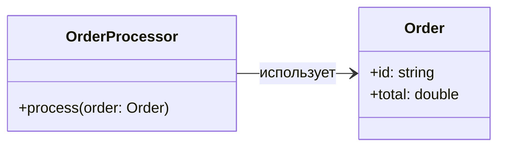
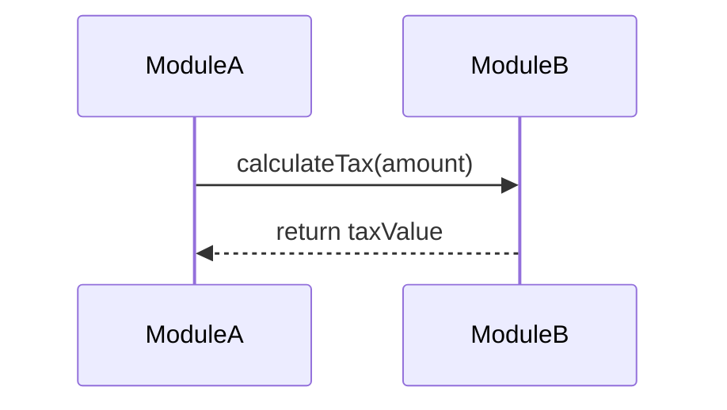
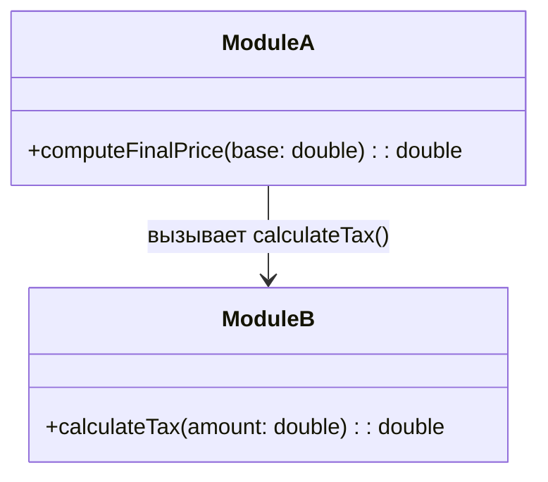
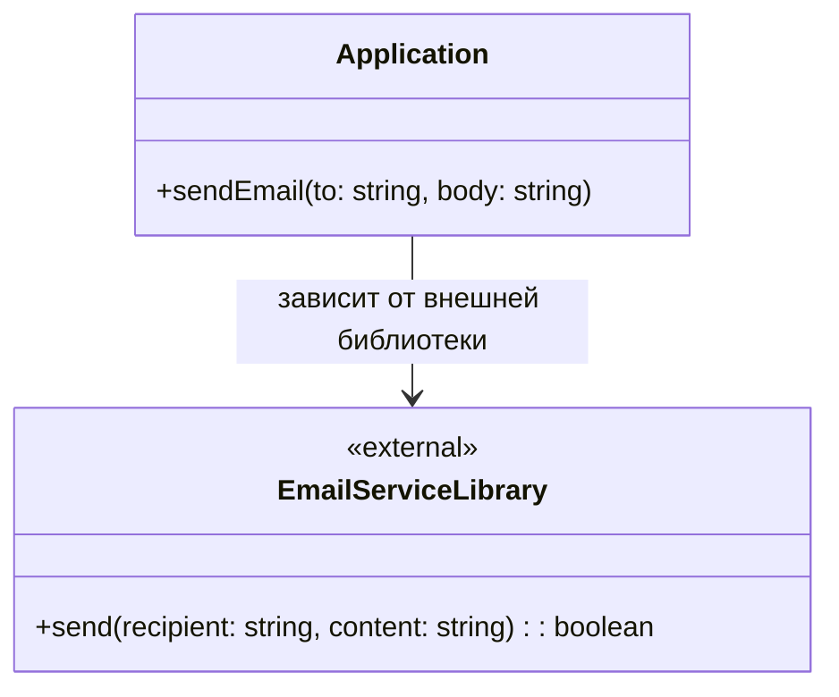
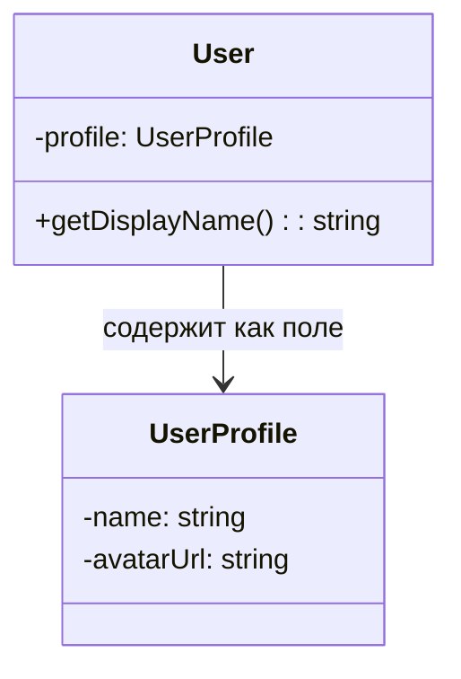
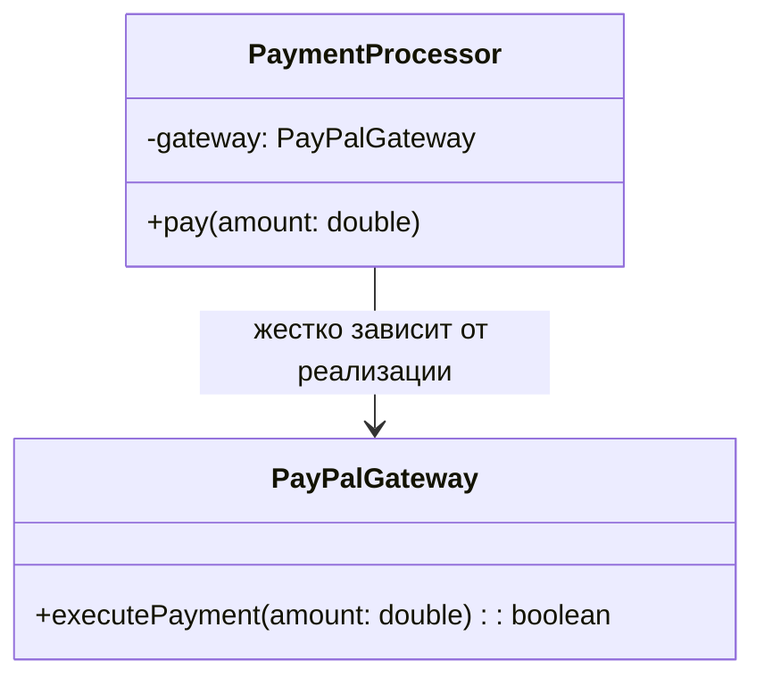
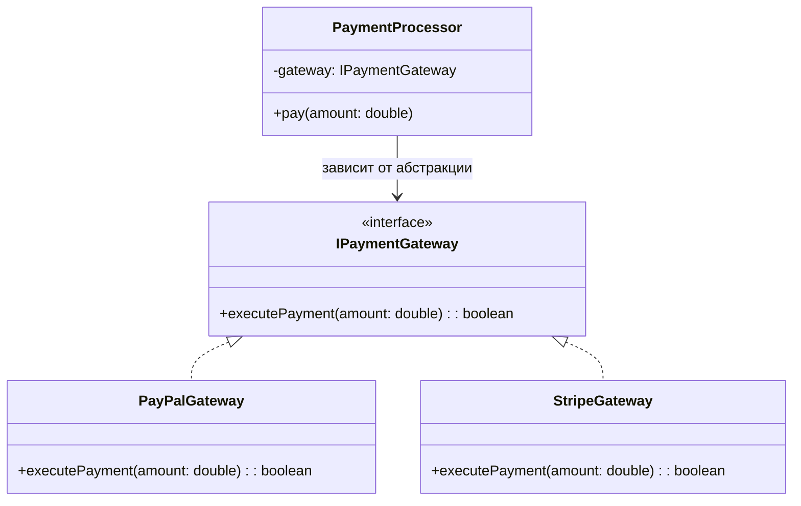

---
title: 4.09. Зависимости
---

# 4.09. Зависимости

## Понятие зависимости

В программировании часто придётся сталкиваться с термином «зависимости», причем применяемом в разных ситуациях.

**Зависимость** - это ситуация, когда один компонент (класс, модуль, функция) полагается на другой, чтобы выполнять свою работу. Простыми словами, если A использует B, то A зависит от B. И получается, что A будет «зависимым», а B будет «зависимостью».

Зависимости рождаются из связей - когда класс A связывается с классом B, между ними устанавливается связь, словно невидимая цепь, при разрыве которой функциональность зависимого компонента будет повреждена, ведь связь становится его частью.

Вроде бы логично - ребенок не может уйти от родителей, ведь зависим от них, или работник не может уйти, так как зависит от работодателя, но как только ребенок решит вопрос, став независимым или переключив зависимость (на другого работодателя, к примеру), то лишь тогда зависимость от первичного компонента исчезает. Но в программировании зачастую зависимость убирать будет крайне невыгодно, и нужно как-то всё это упорядочивать.

## Примеры зависимостей

### ClassDep

Класс использует другой класс;

OrderProcessor зависит от Order, так как принимает объект Order как параметр в методе process().

### FuncCall

Функция вызывает другую функцию из другого модуля;

Функция в ModuleA вызывает функцию calculateTax из ModuleB. Зависимость возникает через вызов.



### LibImport

Модуль использует импортируемую библиотеку;


Application зависит от сторонней библиотеки EmailServiceLibrary. Метка `<<external>>` подчеркивает, что это внешний компонент. 

### FieldRef

Класс использует поле/свойство другого класса;


Класс User имеет ссылку на UserProfile как на внутреннее поле — это агрегация и прямая зависимость.

### TightCoupling

Класс знает конкретную реализацию интерфейса.


PaymentProcessor напрямую зависит от конкретной реализации PayPalGateway, что делает систему менее гибкой. Это пример тугой (tight) зависимости.

А если PaymentProcessor зависит от абстракции IPaymentGateway, а не от конкретной реализации, то это позволит заменять провайдеров:




## Типы зависимостей

Можно выделить следующие типы зависимостей:

| Тип зависимости | Описание | Пример |
| --- | --- | --- |
|Модульная	|Один модуль зависит от другого.	|Модуль аутентификации auth зависит от модуля базы данных database. В модуль auth потребуется импортировать модуль database.
|Классовая	|Класс использует другой класс.	|OrderService использует PaymentGateway.
|Библиотечная	|Проект зависит от внешней библиотеки.	|На этапе разработки к проекту подключается внешняя библиотека для поддержки дополнительного функционала.
|Зависимость данных	|Зависимость от структуры данных - если данные будут несоответствующими структуре, они не будут используемыми.	|Парсинг ответа от API с жёсткой структурой JSON/XML.
|Инфраструктурная	|Зависимость от СУБД, файловой системы, сети.	|Модуль записи данных в файл зависит от файловой системы ОС.


## Виды связей

1. **Прямая зависимость (A → B)**

Когда компонент A явно использует (вызывает, создаёт, наследует) компонент B, то это явление будет называться прямой зависимостью.
Прямые зависимости делают код жёстко связанным (tightly coupled). Если B изменится, A может сломаться.

Простейший пример - наследник. Тот самый класс Cat, наследник класса Animal. Если «сломать» Animal, то Cat станет непригодным и повлечет за собой ошибки компиляции. Иногда это может быть логичным, если базовый класс наоборот, получает новый метод, который будут обязаны реализовать все наследники.


2. **Обратная зависимость (B ← A, но через абстракцию)**. Такой термин используются реже, так как под ним подразумевают инверсию зависимости (Dependency Inversion Principle), один из важнейших принципов SOLID.

Суть заключается в том, что:
	- A зависит не от конкретного B, а от абстракции (интерфейса);
	- Тогда B реализует эту абстракцию, и зависимость становится обратной - B подстраивается под A.

Пример DIP в Java.

У нас есть абстракция (интерфейс) с названием Service и методом doWork():
```java
interface Service {
    void doWork();
}
```
Также у нас есть класс A и класс B. A зависит от абстракции Service, а не от конкретного B:
```java
class A {
    private Service service;
    
    A(Service service) {  // Зависимость через интерфейс
        this.service = service;
    }
}
```
Класс B, в свою очередь, реализует интерфейс Service (это и есть обратная связь) и переопределяет его метод doWork:
```java
class B implements Service {
    @Override
    public void doWork() {
        System.out.println("B работает");
    }
}
```
И теперь можно подменить B на другую реализацию:
```java
class C implements Service { ... }
```
Но мы ещё углубимся в этот вид отдельно позже. Давайте вернёмся к видам связей.

3. **Двунаправленная зависимость (A ↔ B)**, когда два класса зависят друг от друга. Думаю, тут очевидно - у обоих классов есть методы, которые ссылаются друг на друга, устанавливая зависимость от изменений обоих классов, в отличие от прямой связи (которая является односторонней), если изменить, «испортить» любую из сторон, поломаются оба.

4. **Косвенная зависимость (A → C → B)**. Как можно понять, здесь A зависит от B не напрямую, а через промежуточный компонент C.

Пример - у нас есть класс B, класс C и класс A. Класс A использует класс C, а класс C использует класс B. И если класс B повредится, то класс A испортится, хотя прямой связи между A и B нет.

У косвенной зависимости может быть проблема скрытой зависимости - когда неочевидно, что A зависит от B.

5. **Динамическая зависимость (через IoC/DI)**.

Здесь подразумевается, что зависимость не жёстко вшита в код, а внедряется извне (это называется Dependency Injection).

Жёсткие зависимости часто называют «hard-code», или «хард-код». Их сложно тестировать, сложно менять, а изменения в одном месте ломают другое (как можно заметить из прочих видов зависимостей), и задача программиста - снижать связанность, сделать зависимости гибкими, управляемыми, заменимыми. Для этого и существуют специальная динамическая зависимость.


## Принцип D: Dependency Inversion

Это пятый принцип SOLID. Его часто путают с DI, но это разные вещи. 

**Dependency Inversion Principle (DIP)** гласит:

1. Модули верхнего уровня не должны зависеть от модулей нижнего уровня. Оба должны зависеть от абстракций.
2. Абстракции не должны зависеть от деталей. Детали должны зависеть от абстракций.

Представим, что у нас есть лампочка (LightBulb), которую можно включить и выключить. И у нас есть переключатель (Switch), который может управлять лампочкой. Если мы будем создавать класс Switch, то он должен установить связь с LightBulb.
```java
class LightBulb {
    public void turnOn() { ... }
}

class Switch {
    private LightBulb bulb = new LightBulb(); // жёсткая зависимость
}
```

Но при таком подходе (это кстати обычная связь без DIP), Switch зависит от конкретной реализации Lightbulb, и нельзя подключить другие девайсы, пока прямо их не перечислим. И если применить DIP, устанавливая задачу, чтобы Switch не зависел от конкретного вида устройство, а был более универсальным:
```java
interface Switchable {
    void turnOn();
    void turnOff();
}

class LightBulb implements Switchable { ... }
class Fan implements Switchable { ... }

class Switch {
    private Switchable device; // зависит от абстракции
    public Switch(Switchable device) {
        this.device = device;
    }
}
```
Здесь можно увидеть, что добавляется интерфейс Switchable (переключаемый). Класс Lighbulb наследует Switchable, и Fan тоже Switchable - словом, как лампочка, так и вентилятор - оба «переключаемые» и теоретически, к ним можно применять класс. А класс Swich изменил подход, создав себе device, у которого тип данных - Switchable.

Класс Switch (переключатель) получает поле device, которое потом используется в методе Switch, что сделало его универсальным - класс больше не зависит от конкретики, и стал более гибким, расширяемым и тестируем.

Смысл? А теперь нам не нужно будет создавать Fan и прочие устройства со своими экземплярами в Switch. Теперь мы просто при вызове конструктора Switch(Switchable device) будем передавать любой из Switchable.


## Dependency Injection (DI)

DI - это способ реализации DIP. Кстати, поэтому к Dependency Inversion и лучше добавить Principle, чтобы не путать их.

**Dependency Inversion** - это принцип проектирования, а Dependency Injection - паттерн проектирования. DIP говорит «что делать», DI - «как делать».

Dependency Injection решает вопрос - как передавать зависимости, а не создавать их внутри. Существует несколько видов внедрения зависимости:
1. Constructor Injection (через конструктор).
2. Setter Injection (через сеттер).
3. Field Injection (через поле).
4. Property Injection (через свойства).
5. Method Injection (через метод).

Как раз способ, показанный со Switch - это конструктор. В классе нужно написать поле с типом данных абстракции, и в конструкторе добавить аргумент с сопоставлением поля и переменной. Как это работает? Давайте на примере C#.
```csharp
public class UserService
{
    private readonly IUserRepository _repo;

    public UserService(IUserRepository repo)
    {
        _repo = repo;
    }
}
```
Внимание - обратите внимание на курсив и жирный шрифт в коде. В данном случае у нас есть класс UserService, которому создаётся поле _repo (нижнее подчёркивание добавлено для обозначения именно поля). У _repo, как можно заметить, тип данных - IUserRepository - некий интерфейс, который существует в коде.

Затем создаётся конструктор, который получает аргумент с типом данных IUserRepository и записывает в переменную repo.
В теле метода уже указывается, что поле _repo будет иметь значение того самого аргумента - переменной repo. Поэтому _repo = repo.
Это пример в C#, в .NET есть встроенный DI-контейнер. В Java используется DI, к примеру, в Spring:
```java
@Service
public class UserService {
    private final EmailService emailService;

    public UserService(EmailService emailService) { // DI через конструктор
        this.emailService = emailService;
    }
}
```
Как можно заметить - сходство очень велико. Spring в данном случае автоматически решает работу сервиса. 

Python, JavaScript (TypeScript, Node.js, Angular) специфичны, но тоже имеют такие возможности:

Python:
```python
class UserService:
    def __init__(self, email_service: EmailService):
        self.email_service = email_service
```

JS:
```JavaScript
class UserService {
    constructor(private emailService: EmailService) {} // DI через конструктор
}
```

**DI-контейнер (также называют IoC-контейнер)** - это фреймворк или механизм, который автоматически создаёт и внедряет зависимости. Он выполняет следующие задачи:
	- Регистрирует типы (к примеру, IEmailService и его наследник SmptEmailService);
	- Создаёт объекты (с учётом зависимостей);
	- Разрешает зависимости (внедряет нужные объекты);
	- Управляет жизненным циклом (singleton, transient, scoped).

Пример, как мы упомянули с IEmailService и SmtpEmailService:
```csharp
container.register<IEmailService, SmtpEmailService>();
container.register<UserService>();

UserService userService = container.resolve<UserService>(); 
// → контейнер сам создаст SmtpEmailService и передаст в UserService
```

Так, благодаря DI, мы получаем возможность подмены реальных сервисов на тестируемые элементы (моки, стабы), можем менять реализации, снижаем связанность (классы не зависят от конкретных реализаций), можем повторно использовать компоненты в разных контекстах (вспомним Switch с разными девайсами), и получаем централизованное управление всеми зависимостями в DI-контейнере.

```java
interface EmailService {
    void send(String msg);
}

class SmtpEmailService implements EmailService { ... }
class MockEmailService implements EmailService { ... } // для тестов

class UserService {
    private EmailService emailService;

    public UserService(EmailService emailService) { // DI
        this.emailService = emailService;
    }

    public void register(User user) {
        // ... логика
        emailService.send("Welcome!");
    }
}
```
Но мы разбираем, по сути, только внедрение через конструктор. А как же с другими? Давайте по порядку.

**Setter Injection (внедрение через сеттер)** подразумевает, что зависимость внедряется после создания объекта через сеттер-метод. Это используется, когда зависимость не обязательна (опциональна), когда объект может существовать без зависимости, но позже её можно подключить, и встречается в legacy-кодах или фреймворках, где конструктор уже занят.

```java
public class UserService {
    private EmailService emailService;

    // Сеттер для внедрения зависимости
    public void setEmailService(EmailService emailService) {
        this.emailService = emailService;
    }

    public void register(User user) {
        emailService.send("Welcome!"); // используем
    }
}
```
В Java (Spring) есть такое понятие - bean, которое позволяет записать связь UserService с свойством emailService, в результате чего Spring вызывает setEmailService() автоматически:
```xml
<bean id="userService" class="UserService">
    <property name="emailService" ref="emailService"/>
</bean>
```
C# выглядит похожим образом
```csharp
public class UserService
{
    private IEmailService _emailService;

    public void SetEmailService(IEmailService emailService) // DI через сеттер
    {
        _emailService = emailService;
    }
}
```
На первый взгляд, вариант DI через сеттер ОЧЕНЬ похож на вариант конструктора, но тут есть отличия. Давайте наглядно:

| Критерий | DI через конструктор | DI через сеттер |
| :--- | :--- | :--- |
| **Механизм внедрения** | Используется конструктор класса. | Используется отдельный метод (сеттер). |
| **Обязательность зависимости** | Обязательная. Класс не может быть создан без предоставления зависимости. | Опциональная. Объект можно создать без зависимости, но она потребуется при вызове соответствующего метода. |
| **Изменяемость** | Иммутабельная. Зависимость устанавливается один раз при создании объекта и не может быть изменена (особенно если поле `readonly`). | Мутабельная. Зависимость может быть заменена в любой момент времени после создания объекта. |
| **Гарантия инициализации** | Высокая. Компилятор гарантирует, что зависимость будет передана. Отсутствие зависимости приведёт к ошибке на этапе компиляции или отказу в создании экземпляра. | Низкая. Нет гарантий, что сеттер будет вызван. Если зависимость не установлена, это может привести к `NullReferenceException` во время выполнения. |
| **Явность требований** | Высокая. Все необходимые зависимости явно указаны в сигнатуре конструктора. Сразу понятно, что требуется для работы класса. | Низкая. Требования к зависимостям не очевидны из сигнатуры конструктора. Необходимо изучать документацию или код, чтобы узнать, какой сеттер нужно вызвать. |
| **Основное применение** | Когда зависимость является критичной для функционирования класса и должна быть определена с момента его создания. Предпочтительный способ внедрения зависимостей. | Когда зависимость является опциональной, может быть добавлена позже или должна иметь возможность быть переконфигурированной во время жизненного цикла объекта. |


**Property Injection (внедрение через свойства)** часто бывает как синоним Setter Injection), особенно в .NET. Технически, в .NET и некоторых DI-контейнерах «свойство» (property) = public setter. То есть, DI-контейнер автоматически может устанавливать свойства, если у них есть сеттер:
```csharp
public class UserService
{
    public IEmailService EmailService { get; set; } // автоматически внедряется
}
```
Контейнер, к слову выглядеть будет так:
```csharp
services.AddTransient<UserService>();
```

Если EmailService зарегистрирован, контейнер сам установит свойство, если оно доступно для записи. Это удобно для необязательных сервисов и предусматривает автоматизацию. Минусы здесь те же, что и у сеттера - объект может быть не полностью сконфигурирован и менее предсказуемый. Словом, это некий «частный случай» инъекции через сеттер, но реализованный «магически» контейнером.

**Внедрение через поле (Field Injection)** подразумевает, что зависимость напрямую внедряется в поле объекта, минуя конструктор и сеттеры. Часто используется с аннотациями и декораторами:
```java
@Service
public class UserService {
    @Autowired
    private EmailService emailService; // внедряется в поле!
}
```
Но Field Injection считается антипаттерном и рекомендуется такой способ избегать. При этом невозможно протестировать без DI-контейнера, зависимости не видны (согласитесь - это уже не так очевидно?), нельзя сделать поле final / readonly.

**Method Injection (внедрение через метод)** подразумевает, что зависимость передаётся в метод, а не хранится в объекте. Используется, когда зависимость нужна только для одного вызова, меняется от вызова к вызову или когда хочется избежать хранения состояния.
```java
public class UserService {
    public void register(User user, EmailService emailService) { // зависимость в методе
        // ... логика
        emailService.send("Welcome!");
    }
}
```
Логика здесь слегка размазывается, а вызывающий код должен знать, какую реализацию передавать. Это не подходит, если зависимость используется во множестве методов. Это не совсем DI в своём классическом ООП-смысле, скорее передача параметра, но формально, это вид инъекции зависимости в метод.

Итого, если рассмотреть что-то в конечном смысле, лучше всегда и по умолчанию использовать именно конструктор, а инъекция через поле - плохая практика. В функциональных или простых сценариях можно использовать внедрение через метод.

