---
title: 4.10. ORM и работа с данными
---

# 4.10. ORM и работа с данными

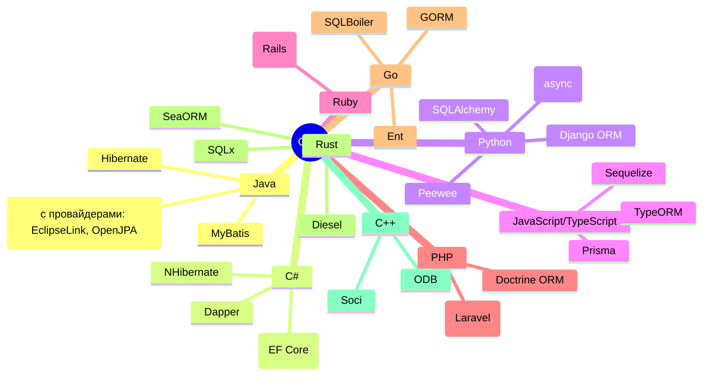

## Базы данных

Так, мы изучили объектно-ориентированное программирование (ООП) и изучили реляционные базы данных (SQL), определили, что есть программирование логики, а есть хранение и обработка данных.

Но как программы взаимодействуют с базами данных?

Прежде, чем мы перейдём к особенностям различных языков программирования, нам нужно изучить универсальный подход по работе с базой данных.

И для этого нужно ещё раз пробежаться по SQL с точки зрения практического применения. Мы изучили функционал. А на практике как? 

**★ Какие задачи решает база данных?**
1. Хранение данных. 

БД предназначены для надёжного хранения информации. Они обеспечивают структурированное представление данных, что позволяет легко находить, изменять и управлять ими.

Пример - интернет-магазин может хранить информацию о товарах, клиентах, заказах и платежах - и всё это будет в разных таблицах, связанных между собой.

| Название | Цена | Количество |
| :--- | :--- | :--- |
| Товар1 | 100 | 53 |
| Товар2 | 200 | 96 |
| Товар3 | 300 | 11 |

| Имя | Адрес | EMail |
| :--- | :--- | :--- |
| Иванов | Москва | 1@mail.ru |
| Петров | Казань | 2@mail.ru |
| Сидоров | Уфа | 3@mail.ru |

| Товары | Дата | Статус |
| :--- | :--- | :--- |
| 1, 2, 3 | 25.05.2025 | Готов |
| 1 | 14.02.2024 | Готов |
| 3 | 22.06.2025 | Готов |

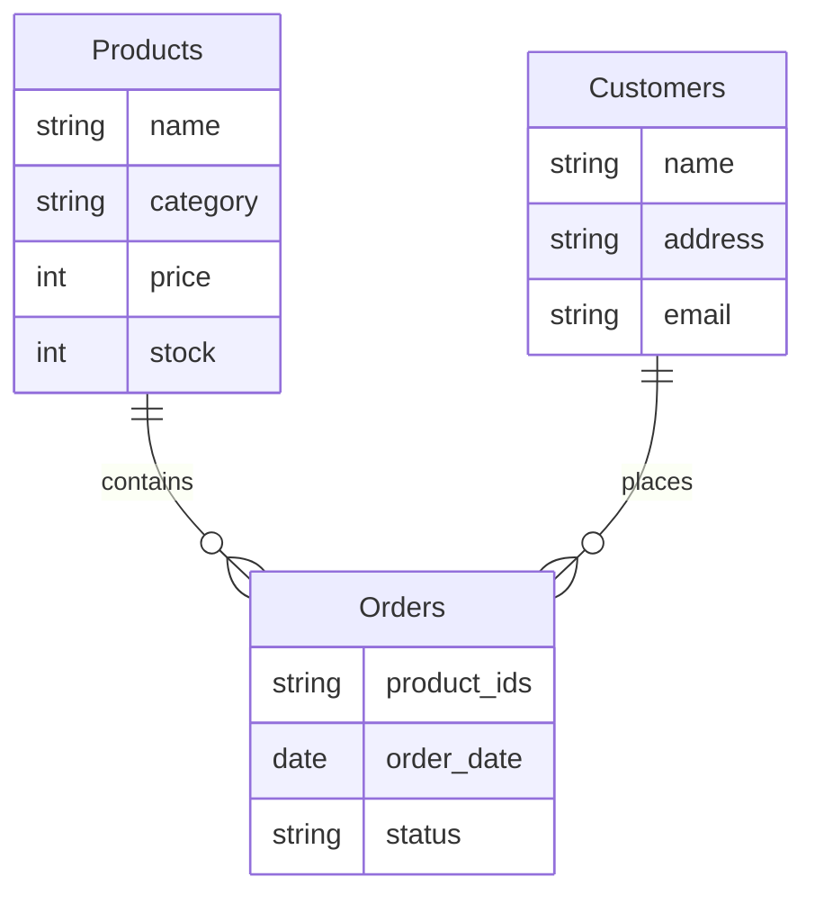

И SQL как раз позволяет выполнять какие-то операции - поиск, добавление, обновление, удаление, агрегация.

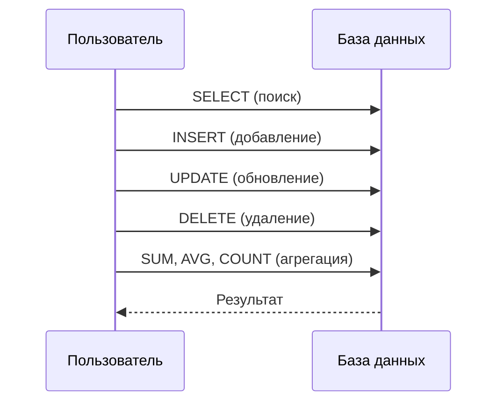

Разберём подробнее.

2. Выбор данных. 

БД позволяет извлекать нужные данные с помощью запросов. Это может быть поиск конкретной записи или выборка по определённым критериям, что создаёт некий массив, коллекцию.

Пример - пользователь интернет-магазина выполняет поиск ноутбуков стоимостью до 50000 рублей. Запрос в БД выбирает все товары из категории «Ноутбуки» с ценой меньше или равной 50000. В этот момент выполняется SQL-запрос:

```sql
SELECT * FROM Products WHERE category = 'laptops' AND price <= 50000;
```

3. Добавление данных. 

Новые данные можно добавлять БД для поддержания актуальности информации.

Пример - владелец магазина добавляет новый товар - смартфон Xiaomi 13 Ultra:
```sql
INSERT INTO Products (name, category, price, stock) 
VALUES ('Xiaomi 13 Ultra', 'smartphones', 79999, 50);
```

4. Обновление данных. 

Данные в БД можно изменять. Это полезно, когда информация становится устаревшей или меняется.

Пример - администратор магазина обновляет цену на iPhone 16 Pro с 150000 до 80000 рублей.
```sql
UPDATE Products 
SET price = 80000 
WHERE name = 'iPhone 16 Pro';
```

5. Удаление данных. 

Устаревшие или ненужные данные можно удалять из БД.

Пример - товар закончился на складе, и его больше не планируют продавать. Например, удаляем старую модель телефона:
```sql
DELETE FROM Products 
WHERE name = 'iPhone 11';
```

6. Подсчёты и аналитика. 

БД позволяют выполнять расчёты и анализировать данные. Это может быть подсчёт количества записей, суммирование значений или вычисление средних значений.

Пример - магазин хочет узнать общую стоимость всех товаров на складе.
```sql
SELECT SUM(price * stock) AS total_stock_value 
FROM Products;
```

7. Агрегатные функции. 

Те самые SUM, AVG, COUNT, MIN, MAX - они позволяют выполнять сложные вычисления на основе данных, получая результат сразу в нужном виде.

Пример - магазин хочет узнать среднюю цену всех товаров в категории ноутбуков.
```sql
SELECT AVG(price) AS average_price 
FROM Products 
WHERE category = 'laptops';
```

8. Индексы. 

Они ускоряют поиск данных в БД, работая как указатели, которые помогают быстро находить нужные записи.

Пример - в телефонной книге быстрее найти человека по фамилии, если она отсортирована по алфавиту. Аналогично, индекс в БД ускоряет поиск товаров по названию.
```sql
CREATE INDEX idx_product_name ON Products(name);
```

9. Сортировка данных.

Сортировка позволяет упорядочивать данные по определённому критерию (по возрастанию, например).

Пример - клиент хочет увидеть товары, отсортированные по цене - от дешевых к дорогим.

```sql
SELECT * FROM Products 
ORDER BY price ASC;
```

10. Группировка.

БД могут группировать данные и создавать сводные отчеты. Это полезно для анализа больших объемов информации.

Пример - магазин хочет узнать, сколько товаров каждой категории есть на складе.
```sql
SELECT category, SUM(stock) AS total_stock 
FROM Products 
GROUP BY category;
```

11. Работа с большими данными. 

Современные БД способны обрабатывать огромные объемы данных, сохраняя высокую производительность.

Пример - сервис потокового видео (тот же Netflix) хранит данные о миллионах пользователей, их предпочтениях, истории просмотров и рекомендациях. Это - большие данные (BigData) и базы данных здесь играют ключевую роль.

12. Оптимизация.

Конечно, примеров выше достаточно - у нас и индексы, и группировка, и сортировка, но как правило, этим не ограничивается.


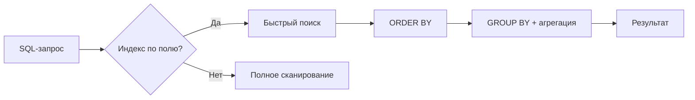

И, кстати говоря, ещё один момент - оптимизация проектирования. Например, в примере выше мы используем перечисление товаров в таблице с Заказами, хотя лучше сделать промежуточную таблицу связи - но, это уже проектирование и об этом мы говорим позже.

Зачем мы повторили SQL? Мы должны понять, что БД - важнейший и крайне мощный инструмент, однако достаточно сложный. Теперь мы готовы к следующему важному моменту - особенностям взаимодействия с базой данных.

## Взаимодействие программ с БД

### Общий алгоритм

★ **Алгоритм взаимодействия любой программы с БД** всегда такой:

1. Подключение к СУБД:
	- программа устанавливает соединение с сервером СУБД;
	- указываются параметры подключения: адрес сервера, порт, имя пользователя, пароль;
	- если подключение успешно, программа получает доступ к управлению базой данных.
2. Соединение с конкретной БД:
	- после подключения к СУБД программа выбирает конкретную базу данных для работы;
	- для этого используется указание имени базы данных или выбор из списка доступных.
3. Авторизация и аутентификация:
	- проверяются права доступа пользователя к выбранной базе данных;
	- определяется уровень привилегий - чтение, запись, изменение структуры.
4. Старт транзакции:
	- если операции требуют целосности данных (например, обновление нескольких таблиц), программа начинает транзакцию;
	- транзакция гарантирует, что все изменения будут применены только в случае успешного завершения всех шагов.
5. Выполнение запроса:
	- программа формирует и отправляет запрос к БД;
	- запрос может быть простым (выборка SELECT) или сложным (вычисления, объединения таблиц, агрегатные функции);
	- нужно правильно составить SQL-запрос, учитывая логику программы и структуру базы данных;
	- запрос может возвращать огромное количество строк, которые нужно обработать;
	- часть данных может потребоваться для дальнейших расчётов в программе, что усложняет интеграцию;
	- необходимо обрабатывать ошибки, такие как синтаксические ошибки в запросе, отсутствие данных или нарушение целостности.
6. Чтение результата:
	- программа получает ответ от базы данных;
	- результат может быть представлен в виде набора строк, значений или сообщения об ошибке;
	- данные преобразуются в формат, понятный программе (объекты или массивы).
7. Завершение транзакции:
	- если запрос выполнен успешно, транзакция фиксируется (COMMIT);
	- в случае ошибки транзакция откатывается (ROLLBACK), чтобы сохранить целостность данных.
8. Закрытие соединения с БД:
	- после завершения работы программа закрывает соединение с базой данных;
	- это освобождает ресурсы сервера и предотвращает утечки памяти.

Схематично:

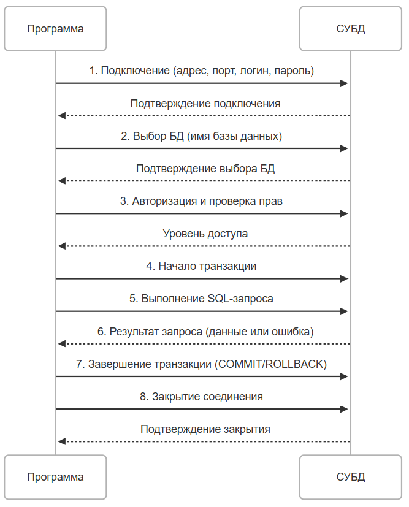

### Особенности взаимодействия

Самое важное - сложность выполнения запроса. Формирование запроса требует глубокого понимания структуры базы данных и логики программы. Сложные запросы могут включать объединения, подзапросы, временные таблицы, вычисления внутри запроса, а программе может потребоваться выполнять дополнительные действия с данными после получения результата.

Большие объёмы данных могут перегружать как базу данных, так и программу. Необходимо оптимизировать запросы, чтобы минимизировать время выполнения и использование ресурсов. Программа также должна следить за состоянием соединения, транзакций и обработкой ошибок. Неправильное управление состоянием может привести к утечкам данных или блокировкам.

И интеграция с приложением. Данные из базы должны быть преобразованы в формат, удобный для работы в программе. Например, строки таблицы представляют собой набор данных, который можно преобразовать в массивы (списки, словари) или объекты.

★ **Какие же подходы используются в приложениях?**

1. **Прямые запросы**. 

Программа напрямую формирует и отправляет SQL-запросы к базе данных. Здесь имеется полный контроль над запросами, возможность оптимизации, но недостатки данного подхода – это высокая сложность формирования запросов и необходимость ручной обработки данных. Буквально в коде это создание, к примеру, переменной типа String со значением запроса - «`SELECT * FROM table`» и отправка этого значения в базу.

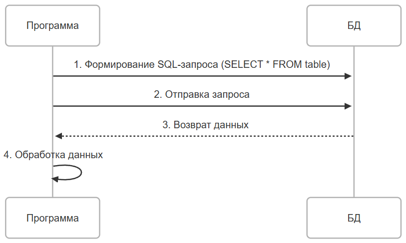

2. **Использование посредников**. 

Программа при этом использует библиотеки или фреймворки для взаимодействия с базой данных. Эти инструменты предоставляют готовые методы для выполнения стандартных операций (CRUD).

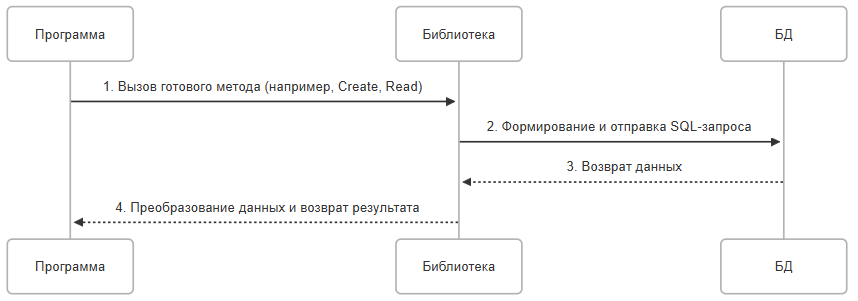

3. **Интеграции через API**. 

Вместо прямого взаимодействия с базой данных, программа может использовать API-сервисы. API предоставляет готовые методы для работы с данными, скрывая детали реализации. Это своего рода многоступенчатость, когда программа саму логику работы с БД не содержит, а вызывает некий сторонний сервис, который уже сам выполняет работу с БД - такой особый вид посредника. Это более безопасное взаимодействие, упрощающее архитектуру приложения, однако порождает зависимость от стороннего сервиса и возможные задержки при работе через сеть.

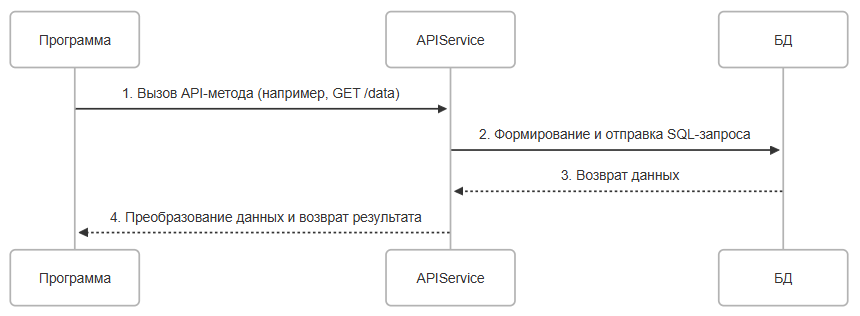

4. **ORM (Object-Relational Mapping)** - объектно-реляционная модель. 

Она автоматически преобразует объекты программы в записи БД и наоборот. Это упрощает работу с базой данных, автоматически генерирует запросы и уменьшает количество ошибок. Потенциально, тут есть потеря производительности, а гибкость для сложных запросов ограничена, но это считается наиболее изящным решением.

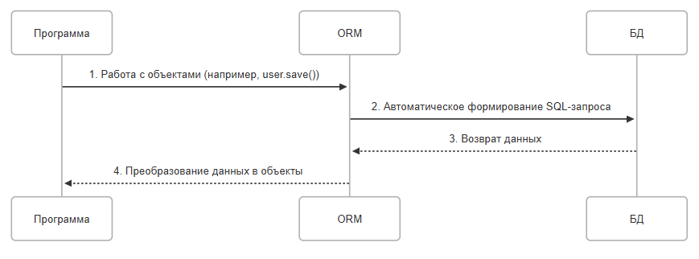

★ **Как СУБД взаимодействует с программами и приложениями?**
1. **Приём запросов**. СУБД принимает запросы от программ через сетевое соединение или локальный интерфейс. Запросы могут быть отправлены в виде текстовых команд (SQL) или через специализированные протоколы.
2. **Обработка запросов**. СУБД анализирует запрос, проверяет синтаксис и права доступа. Запрос выполняется на основе внутренних алгоритмов СУБД (например, использование индексов, оптимизация планов выполнения).
3. **Возврат результатов**. СУБД формирует ответ на запрос и отправляет его программе. Результат может быть представлен в виде таблицы, скалярного значения или сообщения об ошибке.
4. **Управление ресурсами**. СУБД следит за использованием памяти, процессора и дискового пространства. Она также управляет параллельными запросами, чтобы избежать конфликтов.
5. **Логирование и мониторинг**. СУБД записывает информацию о выполнении запросов, чтобы можно было анализировать производительность и выявлять проблемы. 


## ORM

★ **ORM** – это программный подход или инструмент, который позволяет преобразовывать данные между объектной моделью программы (объекты, классы) и реляционной моделью базы данных (таблицы, строки, столбцы).

★ **Объектная модель** - в ООП данные представлены в виде объектов, которые имеют свойства (атрибуты) и поведение (методы).

★ **Реляционная модель** - в реляционных базах данных, данные хранятся в таблицах, где строки представляют записи, а столбцы - атрибуты.

Задача ORM - вывести формулу:
```
Объектная модель - Реляционная модель.
```

ORM выступает как переводчик между этими двумя парадигмами, позволяя программисту работать с базой данных через объекты, а не напрямую через SQL-запросы.

ORM предоставляет уровень абстракции, который скрывает сложности работы с базой данных. Это означает, что программист может сосредоточиться на логике приложения, а не на деталях взаимодействия с БД.

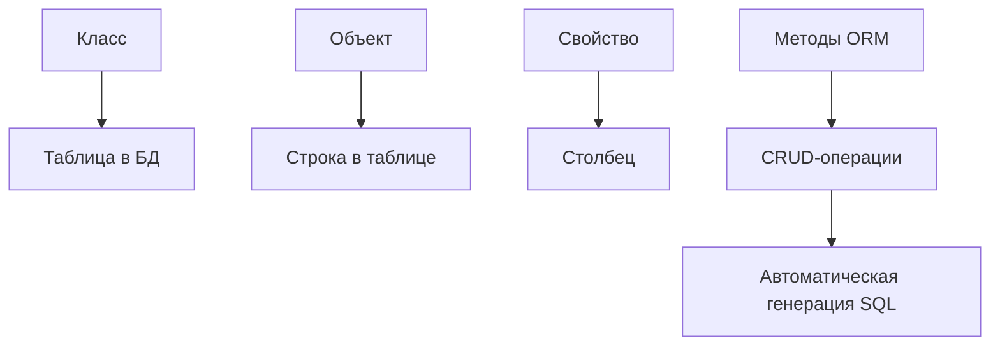

★ **Как работает абстракция ORM?**
1. Классы как таблицы:
	- каждый класс в программе соответствует таблице в базе данных;
	- свойства класса соответствуют столбцам таблицы.
2. Объекты как строки:
	- экземпляр класса (объект) представляет собой строку в таблице;
	- значения свойств объекта соответствуют значениям в ячейках строки.
3. Методы для операций с данными. ORM предоставляет готовые методы для выполнения CRUD-операций (Create, Read, Update, Delete), которые автоматически преобразуются в SQL-запросы.
4. Отношения между объектами. Базы не просто называются реляционными - важна связь. И ORM поддерживает отношения между объектами (например, один-ко-многим, многие-к-другим), которые отражаются в связях между таблицами в базе данных.

Пример абстракции.

Прямой SQL-запрос был бы таким:
```SQL
SELECT * FROM Users WHERE Age > 30
```

Абстракция в C#, через LINQ-синтаксис (позже изучим):
```csharp
var users = (from user in dbContext.Users
             where user.Age > 30
             select user).ToList();

```

А если использовать Entity Framework (прокаченную ORM на C#), то:
```csharp
var users = dbContext.Users.Where(user => user.Age > 30).ToList();
```

Конечно, мы ещё не изучали особенности языка C#, но здесь важно понять следующее при разборе примеров:
	- `dbContext.Users` — это `DbSet<User>`, представляющий таблицу `Users` в БД.
	- `.Where(...)` — метод LINQ, который преобразуется в SQL-условие `WHERE` под капотом.
	- `user => user.Age > 30` — лямбда-выражение, заменяющее условие `WHERE Age > 30` (анонимная функция, которая фильтрует записи);
	- `.ToList()` – материализует запрос (выполняет SQL и возвращает список объектов).

Таким образом, если приводить соответствие:

| Абстракция в ORM (C#) | Эквивалент в SQL БД |
|-----|-----|
|Класс `Users`	|Таблица `Users`
|Свойства класса `Users` (Id, Name, Age)	|Столбцы таблицы `Users` (Id, Name, Age)
|`dbContext.Users`	|`SELECT * FROM Users`
|.Where(user => user.Age > 30)	|`WHERE Age > 30`
|`.Select(user => user.Name)`	|`SELECT Name FROM Users`
|`users.ToList()`	|Выполнение запроса (`Execute`)
|Переменная `users`	|Результат запроса SQL
|Методы `Where`, `From`, `Select`	|Ключевые слова `WHERE`, `FROM`, `SELECT`
|Объект user (экземпляр класса)	|Запись (строка) в таблице


Следовательно, в базе данных есть таблица Users:

| Id | Name | Address | Email |
|-----|-----|-----|-----|
|1	|Иван Петров	|ул. Ленина, 10	|ivan@mail.ru

Представим, что создавалась она так:
```SQL
CREATE TABLE Users (
    Id INT PRIMARY KEY IDENTITY(1,1),  -- Автоинкрементный первичный ключ
    Name NVARCHAR(100) NOT NULL,       -- Имя пользователя
    Address NVARCHAR(200) NULL,        -- Адрес (может быть NULL)
    Email NVARCHAR(100) NOT NULL       -- Email (уникальный)
);

```

В коде мы бы создали класс User, со следующим содержимым:
```csharp
[Table("Users")]
public class User
{
    [Key]                          // Указывает, что это первичный ключ
    [DatabaseGenerated(DatabaseGeneratedOption.Identity)]  // Автоинкремент
    public int Id { get; set; }

    [Required]                     // NOT NULL в БД
    [MaxLength(100)]               // Ограничение длины (NVARCHAR(100))
    public string Name { get; set; }

    [MaxLength(200)]               // NULL в БД (по умолчанию, если не Required)
    public string? Address { get; set; }  // "?" означает, что может быть null

    [Required]
    [MaxLength(100)]
    [EmailAddress]                 // Проверка формата email
    public string Email { get; set; }
}

```

По итогу мы получаем сопоставление:
| C# (Класс User) | SQL (Таблица Users) |
|-----|-----|
|`public int Id`	|`Id INT PRIMARY KEY`
|`public string Name`	|`Name NVARCHAR(100)`
|`public string? Address`	|`Address NVARCHAR(200) NULL`
|`public string Email`	|`Email NVARCHAR(100)`


В коде выше, конечно, добавили атрибуты вроде `[Key]`, `[Required]` - они помогают ORM понять структуру БД. Но! Мы ещё не изучили C#, поэтому задача в вышеуказанном примере - на практике показать, что такое ORM.

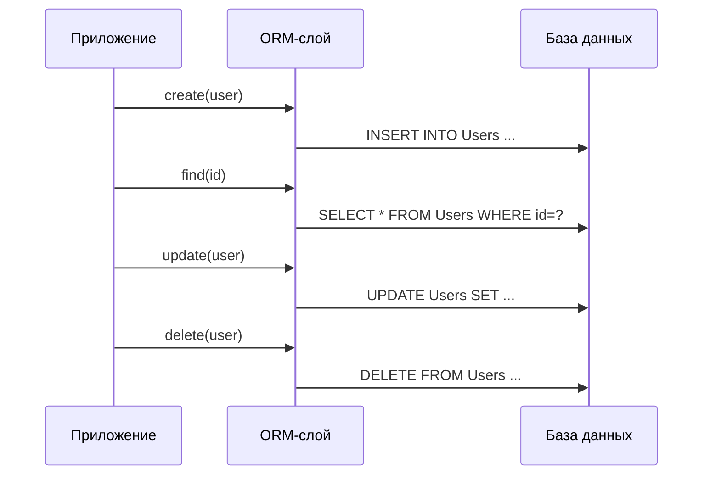


Вернёмся к теории.

ORM является логическим представлением, и позволяет работать с базой данных как с коллекцией объектов, а не как с набором таблиц. Как мы помним, это совсем разные структуры данных. ORM при этом скрывает детали реализации, и программисту не нужно знать, как именно организована структура базы данных (например, какие индексы используются или как выполняются запросы). ORM автоматически генерирует SQL-запросы на основе действий с объектами, что автоматизирует процесс.

Поэтому здесь работа идёт с объектами, а ORM сама заботится об SQL-запросах.

Реляционное представление подразумевает хранение данных в таблицах с чётко определённой схемой - строки и столбцы. ORM для реляционных БД преобразует таблицы в классы, строки в объекты, а столбцы в свойства объектов, а также поддерживает отношения между таблицами (например, внешние ключи) через связи между объектами.

Примеры ORM для реляционных БД:
	- Hibernate (Java)
	- Entity Framework (C#)
	- SQLAlchemy (Python)

Но это не значит, что для нереляционных БД отсутствует ORM.

В нереляционном представлении, данные хранятся в более гибком формате (документы JSON, графы, ключ-значение). И для них тоже используется ORM.
ORM адаптируется к специфике нереляционных баз данных, вместо таблиц используются коллекции, а вместо строк - документы.

Примеры ORM для нереляционных БД:
	- Mongoose (для MongoDB)
	- ODM (Object Document Mapping) — аналог ORM для документоориентированных БД.

**В чём отличие между реляционным и нереляционным представлением в ORM?**

| Характеристика | Реляционное представление | Нереляционное представление |
|-----|-----|-----|
|Структура данных	|Таблицы, строки, столбцы	|Документы, ключ-значение, графы
|Связи между данными	|Через внешние ключи	|Через ссылки или вложенные структуры
|Гибкость схемы	|Жесткая схема	|Гибкая схема
|Пример ORM	|Hibernate, Entity Framework	|Mongoose, ODM


## Основные принципы ORM

1. Маппинг сущностей (классов) на таблицы.

★ **Маппинг** – это процесс связывания объектов программы с таблицами в базе данных. Сам по себе маппинг происходит от слова map - карта, когда берётся одна сущность, и данные из неё преобразуются в другую.

★ **Класс - таблица**. Каждый класс в программе соответствует таблице в базе данных. Имя класса обычно совпадает с именем таблицы, а свойства класса (атрибуты) соответствуют столбцам таблицы.

★ **Объект - строка**. Экземпляр класса (объект) представляет собой строку в таблице. Значения свойств объекта сохраняются в ячейках строки.
В современных ORM часто используются аннотации или декораторы для указания дополнительных параметров маппинга - первичный ключ (id), индексы и ограничения (например, NOT NULL).

2. CRUD-операции через объекты.

ORM предоставляет методы для выполнения стандартных операций с данными (CRUD), которые автоматически преобразуются в SQL-запросы.
Создание нового объекта в программе приводит к добавлению строки в таблицу.

Чтение данных из базы происходит через запросы к объектам.

Изменение свойств объекта приводит к обновлению соответствующей строки в таблице.

Удаление объекта из программы приводит к удалению строки из таблицы.

3. Работа с отношениями (один-к-одному, один-ко-многим, многие-ко-многим).

ORM позволяет работать с отношениями между таблицами через связи между объектами.

Типы отношений:
	- Один-к-одному (One-to-One) - одна запись в таблице связана с одной записью в другой таблице.
	- Один-ко-многим (One-to-Many) - одна запись в таблице связана с несколькими записями в другой таблице.
	- Многие-ко-многим (Many-to-Many) - несколько записей в одной таблице связаны с несколькими записями в другой таблице.

ORM автоматически создаёт промежуточные таблицы для отношений «многие-ко-многим» и управляет внешними ключами для «один-ко-многим».

4. Транзакции и управление состоянием объектов.

Транзакция – это набор операций, которые должны быть выполнены как единое целое. Если хотя бы одна операция завершается с ошибкой, все изменения откатываются.

ORM предоставляет инструменты для управления транзакциями, отслеживая состоянием объектов, чтобы определить, какие изменения нужно применить к базе данных:
	- Transient (временный) - объект создан, но ещё не связан с БД;
	- Persistent (постоянный) - объект сохранён в БД;
	- Detached (отсоединённый) - объект был сохранён, но больше не связан с текущей сессией;
	- Deleted (удалённый) - объект удалён из БД.

## Подходы к ORM

При организации работы с ORM, важно понимать ключевые концепции, на основании которых выстраивают взаимодействие между объектной моделью программы и базой данных.

1. ★ **Code First** – подход, при котором разработчик сначала создаёт классы (объектную модель) в программе, а ORM автоматически генерирует базу данных на основе этих классов.

ORM анализирует структуру классов, их свойства и отношения, чтобы построить соответствующие таблицы, столбцы и связи.

Вот как это работает:
	- разработчик пишет классы, которые представляют сущности (например, User, Product);
	- ORM анализирует эти классы и создаёт миграции (скрипты для изменения структуры базы данных);
	- база данных обновляется в соответствии с изменениями в коде.

Пример:

Представьте себе веб-приложение для управления задачами (to-do list). Разработчик создаёт класс Task, где:
	- свойства: id, title, description, due_date;
	- отношения - Task связан с пользователем через класс User.
	- ORM автоматически создаёт таблицы Tasks и Users с соответствующими столбцами и внешними ключами.

Это удобно для разработчиков, которые предпочитают работать с кодом. Изменения в классах автоматически отражаются в базе данных через миграции. Однако такой подход может быть сложным для крупных проектов с существующей базой данных.

2. ★ **Database First** – подход, при котором база данных создаётся вручную (через SQL или графические инструменты), а ORM генерирует классы на основе существующей структуры базы данных. Разработчик сначала проектирует базу данных, а затем ORM создаёт объектную модель.

Вот как это работает:
	- разработчик создаёт базу данных, определяя таблицы, столбцы, индексы и связи;
	- ORM анализирует структуру базы данных и генерирует классы, которые отражают эту структуру;
	- программист работает с этими классами в своём коде.

Представим себе систему учёта сотрудников в компании. База данных уже существует - там есть таблица Employees (id, name, position, department_id) и таблица Departments (id, name).

ORM анализирует базу данных и создаёт классы Employees и Department, связанные через отношение «один-ко-многим».

Это подходит для проектов с уже существующей базой данных, и предоставляет полный контроль над структурой базы данных. Но изменения в базе данных могут потребовать повторной генерации классов.

3. ★ **Model First** – это подход, при котором разработчик сначала создаёт визуальную модель (диаграмму) базы данных, а ORM генерирует как базу данных, так и классы на основе этой модели.

Схема работы:
	- разработчик создаёт диаграмму базы данных с помощью инструментов ORM (например, Entity Framework Designer);
	- ORM генерирует скрипты для создания базы данных и классы для работы с ней;
	- программист использует эти классы в своём коде.

Представим себе систему управления библиотекой.

Разработчик создаёт диаграмму:
	- сущность Book: id, title, author_id;
	- сущность Author: id, name;
	- связь: один автор может иметь много книг.

ORM генерирует базу данных с таблицами Books и Authors, а также классы Book и Author.

Такой подход удобен для начинающих разработчиков, которые предпочитают визуальное проектирование, и обеспечивает лёгкость понимания структуры базы данных благодаря диаграммам.

## Миграции

Ранее мы упомянули миграции базы данных. Давайте разберёмся, что это.

★ **Миграции** — это механизм управления изменениями структуры базы данных (схемы) в процессе разработки приложения. Они позволяют последовательно обновлять базу данных, добавляя новые таблиц, изменяя существующие или удаляя ненужные элементы, без потери данных.

Миграции представляют собой набор скриптов, которые описывают, как изменить базу данных с одного состояния на другое. Эти скрипты можно применять (прогонять) или откатывать (отменять), чтобы вернуться к предыдущему состоянию.

Миграции работают по принципу версионирования базы данных. Каждая миграция представляет собой отдельный шаг в эволюции структуры базы данных.

★ **Этапы миграции.**
1. Создание миграции. Разработчик создаёт файл миграции, который описывает изменения в базе данных. Например, добавление новой таблицы Users или нового столбца email в таблицу Customers.
2. Применение миграции. Миграция выполняется в базе данных, и её изменения применяются. Например, ORM или инструмент миграций генерирует SQL-запрос для создания таблицы или добавления столбца.
3. Откат миграции. Если миграция вызвала проблемы или нужно вернуться к предыдущему состоянию, миграцию можно откатить. Например, удаление таблицы или столбца, которые были добавлены.
4. Версионирование. Каждая миграция имеет уникальный идентификатор (например, временная метка или порядковый номер). База данных хранит информацию о том, какие миграции уже применены.

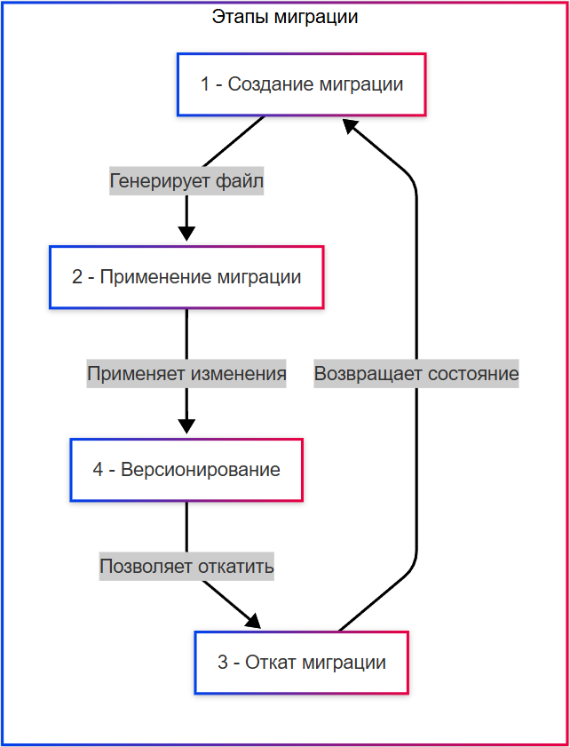

**Зачем нужны миграции?**

Миграции решают несколько ключевых задач:
1. Управление изменениями в структуре базы данных. В процессе разработки приложения часто возникает необходимость изменить структуру БД - добавить новые таблицы или столбцы, изменить типы данных или удалить устаревшие элементы. Миграции позволяют делать это систематически и безопасно.
2. Синхронизация между разработчиками и окружениями. В командной разработке несколько разработчиков могут работать над одним проектом. Миграции обеспечивают, чтобы все участники имели одинаковую структуру базы данных. Также миграции помогают синхронизировать БД в разных окружениях (разработка. тестирование. продакшен).
3. Автоматизация процесса обновления базы данных. Без миграций разработчики вынуждены вручную писать и выполнять SQL-скрипты для обновления базы данных. Это может привести к ошибкам и несогласованности. Миграции автоматизируют этот процесс, делая его более надёжным.
4. Откат изменений. Если новое изменение вызвало проблемы (например, сломало приложение), миграции позволяют легко откатить изменения до предыдущего состояния.
5. Поддержка целостности данных. Миграции могут включать не только изменения в структуре БД, но и манипуляции с данными (например, перенос данных из одной таблицы в другую). Это помогает сохранить данные при изменении схемы.

★ Пример работы миграций:
1. Разработчик создаёт миграцию - «добавить таблицу Tasks с полями id, title, description, due_date».
2. Миграция применяется - ORM или инструмент миграций генерирует SQL-запрос, а таблица сохраняется в базе данных.
3. Если миграция вызвала проблемы, её можно откатить, и при этом ORM генерирует SQL-запрос для отката.

Инструменты для работы с миграциями:
	- Java (Hibernate): Liquibase, Flyway.
	- C# (.NET): Entity Framework Migrations.
	- Python: Django Migrations, Alembic (для SQLAlchemy).
	- PHP: Laravel Migrations.
	- Ruby on Rails: ActiveRecord Migrations.
	- Go: Goose, Migrate.
	- Node.js: Knex.js, Sequelize Migrations.

## Нормализация и денормализация

★ **Нормализация** – это процесс организации данных в БД таким образом, чтобы уменьшить избыточность (дублирование данных) и обеспечить целостность данных. Этот процесс включает разделение данных на несколько связанных таблиц.

Цели нормализации:
	- устранение дублирования данных - одинаковые данные хранятся только один раз;
	- обеспечение целостности данных - изменение данных в одном месте автоматически отражается во всех связанных местах;
	- упрощение обновления данных - уменьшение риска несогласованности данных.

★ **Формы нормализации (нормальные формы)**

1. **Первая нормальная форма (1NF)** - все значения в столбцах должны быть атомарными (неделимыми). Вместо хранения списка значений в одной ячейке (например, «яблоки, груши») каждое значение должно быть в отдельной строке.
2. **Вторая нормальная форма (2NF)**:
	- таблица должна соответствовать 1NF;
	- все неключевые столбцы должны зависеть от полного первичного ключа.

Если есть таблица заказов с колонками order_id, product_id, product_name, то product_name должен быть вынесен в отдельную таблицу Products.
3. **Третья нормальная форма (3NF)**:
	- таблица должна соответствовать 2NF;
	- все неключевые столбцы должны зависеть только от первичного ключа (а не от других неключевых столбцов).

Если в таблице Employees есть столбец department_name, который зависит от department_id, то department_name должен быть вынесен в отдельную таблицу Departments.

4. **Более высокие формы (4NF, 5NF, форма Бойса-Кодда)** используются реже и применяются для специфических случаев.

При использовании нормализации, уменьшается избыточность данных, обеспечивается их целостность, а обновление упрощается. Минусом является увеличение числа таблиц и связей, что может замедлить выполнение запросов и повысить сложность написания JOIN-операций.

Нормализацию лучше применять:
	- когда данные часто обновляются (например, системы учёта, где важно избежать дублирования и несогласованности);
	- когда важна целостность данных (например, банковские системы, медицинские записи);
	- когда объем данных относительно небольшой (производительность запросов не является критичной.

★ **Денормализация** – это процесс объединения данных из нескольких таблиц в одну или добавление избыточных данных для повышения производительности чтения. Этот подход часто используется в системах с высокими требованиями к скорости выполнения запросов.

Цели денормализации:
	- ускорение запросов - уменьшение числа JOIN-операций за счёт хранения данных в одной таблице;
	- оптимизация для чтения - часто данные читаются чаще, чем изменяются, поэтому денормализация может быть полезной;
	- упрощение аналитики - хранение предварительно вычисленных данных (например, сводных таблиц) для быстрого анализа.

★ Пример денормализации.

Представим интернет-магазин. В нормализованной базе данных есть таблицы Orders, OrderItems, Products. Для ускорения отчётов о продажах можно создать денормализованную таблицу SalesSummary, которая содержит предварительно вычисленные данные: product_name, total_sales, average_price.
При использовании денормализации, повышается производительность чтения, упрощаются запросы (меньше JOIN), а для аналитики это удобно. Минусы - увеличение объема данных (избыточность), риск несогласованности данных при обновлении, и сложность поддержки целостности данных.

Денормализация применима:
	- когда данные читаются чаще, чем изменяются (например, аналитические системы, системы отчётности);
	- когда важна скорость выполнения запросов (высоконагруженные веб-приложения);
	- когда данные предварительно агрегированы (хранилища данных).


## Проблемы ORM

★ **Проблема несоответствия парадигм (Object-Relational Impedance Mismatch)** возникает из-за различий между объектно-ориентированной моделью и реляционной моделью. Эти две модели работают по-разному, и их перевод друг в друга требует дополнительных усилий. 

Какие различия проблемны?

1. Структура данных. В ООП данные организованы в виде объектов с методами, а в реляционных БД в виде таблиц с фиксированной структурой.
2. Отношения. В ООП отношения реализуются через ссылки или композицию, а в реляционных БД отношения реализованы через внешние ключи и JOIN-операции.
3. Идентификация объектов. В ООП объекты уникальны благодаря ссылкам на них в памяти, а в БД уникальность обеспечивается первичными ключами.
4. Наследование. В ООП поддерживается наследование классов, тогда как в реляционных БД наследование нужно эмулировать.
5. Типизация. В ООП типы данных строгие и могут быть сложными (например, пользовательские классы), тогда как в реляционных БД типы данных ограничены стандартными (INT, VARCHAR).

Это порождает фундаментальные отличия. К примеру, в классе User есть метод getFullName(), который объединяет имя и фамилию пользователя. В ООП это просто метод объекта, тогда как в реляционной БД придётся выполнить SQL-запрос SELECT с использованием конкатенации CONCAT.

Конечно, преимущества ORM значительнее - упрощение работы с БД, переносимость между разными СУБД, автоматизация, безопасность, ускорение процесса разработки.

Но недостатки ORM тоже существуют:
	- производительность - автоматически сгенерированные запросы могут быть менее эффективными, чем ручные;
	- ограниченная гибкость - сложные запросы (например, с множеством JOIN-операций) могут быть трудно реализуемы через ORM;
	- обучение - необходимо изучить ORM, что может быть непростой задачей для новичка;
	- риск «магии» - разработчики могут не понимать, какие именно SQL-запросы генерировать ORM.

К примеру, аналитик, который поставит задачу разработчику, мог руководствоваться знанием SQL, и для себя он мог сделать огромный запрос, который успешно даёт результат. Но учитывая объем запроса и множество подзапросов, объединений и прочего функционала, разработчику может быть довольно сложно реализовать ту же логику через ORM, из-за чего может возникнуть недопонимание, мол, «чего тут такого сложного?».

ORM - мощный инструмент, но не всегда подходит. Он не подойдёт для систем со сложными аналитическими запросами, систем с высокой нагрузкой, необходимостью полного контроля и при использовании нестандартных или специализированных баз данных.

★ Альтернативами ORM являются:
1. «Сырой» SQL - написание SQL-запросов вручную;
2. Query Builders - инструменты, которые позволяют строить SQL-запросы программно (Knex.js в JavaScript, SQLAlchemy Core в Python);
3. Data Mappers - инструменты, которые разделяют объектную модель и БД (Dapper в C#, MyBatis в Java);
4. NoSQL - использование нереляционных баз данных, например, MongoDB, Redis.

Но в крупных системах подходы могут комбинироваться.

К примеру, в интернет-магазине ORM для управления каталогом товаров, Query Builder для сложных фильтров товаров, сырой SQL для аналитических отчётов о продажах, а NoSQL для хранения временных данных. Надо решить какую-то проблему и сделать выполнение сложной комбинации в PostgreSQL, к примеру, связанной с материализованным представлением - для этого выполняется прямой запрос. И порой в коде можно встретить сырые SQL.

Поэтому, если возникла проблема несоответствия парадигм, можно комбинировать решения.


