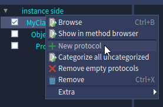
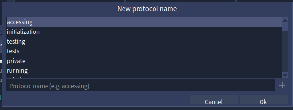
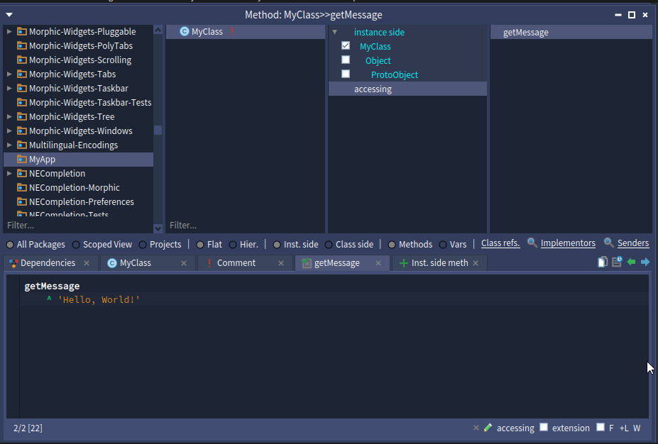

---
title: 5.01. Smalltalk
---

# 5.01. Smalltalk

Мы с вами изучили основы кода, и особенно важным было изучение ООП - объектно-ориентированного программирования. И когда речь идёт об ООП, мы должны поговорить о Smalltalk - это самый правильный язык с точки зрения ООП. Да, язык старый, но его знание подарит вам понимание ООП на максимальном уровне. Многие программисты даже оценят знание этого языка, так как считают, что в других языках ООП реализовано сильно хуже, или «криво». Форумы кишат «холиварами» на тему того - какой язык более «ООПшный».

Что ж, Smalltalk является объектно-ориентированным языком программирования с динамической типизацией. У него довольно интересная философия. Это первый «чистый» ООП-язык, который повлиял на Java, Ruby, Python, Swift, Objective-C и прочие. Можно сказать, что это даже не только язык, а образ мышления, и если вы знаете Smalltalk - вы знаете суть ООП.

## Особенности работы

Smalltalk:
	- объектно-ориентированный;
	- динамический;
	- интерпретируемый;
	- рефлексивный (может исследовать и модифицировать себя);
	- интерактивный - программирование в режиме диалога с системой.

Он относится к семейству языков с высокой степенью мета-возможностей, наряду с Lisp, Self и современными динамическими языками.

Smalltalk - один из самых влиятельных проектов в истории вычислений, и не из-за широкого использования, а потому что он впервые реализовал идеи, которые сегодня кажутся нам естественными:
	- Всё в программе - объект;
	- Программирование - это не написание кода, а взаимодействие с живой системой;
	- Среда разработки - не отдельный инструмент, а часть самой программы. 

Технически, принципы ООП здесь доведены до логического предела. Здесь нет примитивных типов, операторов или статических конструкций. Только объекты и сообщения, которыми они обмениваются.

В отличие от большинства языков, где код пишется в редакторе, компилируется и запускается отдельным процессом, Smalltalk работает иначе.
Работа с программой здесь представляет собой не обычный запуск, а своего рода «жизнь» внутри неё, ведь всё состояние системы - код, объекты, переменные, окна интерфейса - всё сохраняется в образе. Это образ системы (System Image), бинарный файл, содержащий полную копию работающей среды.

Вы можете изменить код, отлаживать, создавать объекты - и всё это сохранится при следующем запуске. Нет понятия «перезапуск приложения» - есть продолжение работы с того же места. Это как если бы ваша IDE, запущенные процессы и данные были бы одним целым. К примеру, вы исправили баг в отладчике, сохранили исправление, закрыли систему — а через неделю, открыв её снова, продолжаете с того же момента.

Smalltalk работает на виртуальной машине - VM, это программа, которая интерпретирует байт-код и управляет образом. VM отвечает за выполнение кода, управление памятью, графический интерфейс и взаимодействие с ОС. Это, кстати единственная часть системы, не написанная на самом Smalltalk (обычно на C/C++, традиционных системных языках). Всё остальное - включая сам компилятор, отладчик и редактор, написано на Smalltalk и работает внутри образа.

Smalltalk - язык с полной динамической типизацией, где типы проверяются во время выполнения, а не на этапе компиляции. Переменная не имеет типа — тип определяется по объекту, на который она ссылается. Это позволяет писать гибкий, адаптивный код, но требует от программиста большей ответственности.

Бывают языки строго типизированные, которые требуют указать тип, выделят память согласно правилам, и в случае несоответствия типов будут «ругаться». А динамически типизированные языки подразумевают, что платформа «сама разберётся», что за тип данных, главное их ей дать.

Smalltalk здесь реализуют концепцию интересным образом. Все типы данных здесь - числа, строки, классы, методы, блоки кода - всё является объектом, даже true, false. Имеется полная интроспекция - любой объект может рассказать о себе, кто его класс, какие его переменные, какие методы он поддерживает.

И самое необычное - здесь почти нет ключевых слов (всего их около шести).

В большинстве языков мы, как программисты, говорим «вызвать метод», что даёт команду и обращается к соответствующему блоку кода. В Smalltalk немного иначе - здесь «посылается сообщение». Любому объекту может быть послано любое сообщение. Что будет дальше — зависит от того, понимает ли объект это сообщение.

Давайте наконец посмотрим как выглядит язык:
```
42 factorial           "отправляем сообщение 'factorial' объекту 42"
'hello' size           "отправляем 'size' строке"
(3 > 5) ifTrue: [ 'yes' ] ifFalse: [ 'no' ] "отправляем условное сообщение"
```

Если вы знаете или работали хоть с одним современным языком, то заметите сильную разницу в стиле и синтаксисе. Представьте что всё здесь - сообщения и объекты. Мы указываем объект и указываем сообщения. Если объект не понимает сообщение, он получает специальное сообщение doesNotUnderstand:, и вы можете перехватить его — это основа для динамического поведения, проксирования, DSL.

Smalltalk кроссплатформенный, и современные реализации работают как на Windows, так на macOS и Linux. VM обеспечивает абстракцию от операционной системы. Образы переносятся между платформами без изменений.

Совместимости с современными программами напрямую нет, ведь Smalltalk не компилируется допустим в .exe. Но есть интеграция с C через FFI (Foreign Function Interface), можно запускать внешние процессы.

В Smalltalk нет внешней IDE. Всё, что нужно, встроено.

Компоненты языка:

1. **Браузер классов (Class Browser)** позволяет просматривать и редактировать классы, методы, пакеты. Иерархия классов здесь визуальная, а навигация мгновенная. Можно открыть любой метод в системе — включая код самого отладчика.
2. **Отладчик (Debugger)** работает при возникновении ошибок. Там можно увидеть стек вызовов, изменить код «на лету» и продолжить выполнение. Можно вставить новые переменные, изменить значения и продолжить. Словом, позволяет «вмешаться» в процесс.
3. **Инспектор объектов (Inspector)** позволяет заглянуть внутрь любого объекта, просмотреть переменные экземпляра, изменить их, вызвать методы, что полезно для отладки и экспериментов.

**Сборка мусора (Garbage Collection)** здесь автоматическая, на основе поколений (generational GC), освобождает память от объектов, на которые больше никто не ссылается, и является прозрачной для программиста.

Код компилируется в байт-код виртуальной машины, а компиляция происходит на лету, при сохранении метода. Здесь нет отдельного этапа «сборки проекта». Современные VM (например, в Pharo) используют JIT-компиляцию (Just-In-Time) для ускорения. Часто исполняемый код переводится в нативный машинный код.

Современными реализациями языка являются:
1. Pharo - открытая реализация, имеет отличную IDE, поддерживает веб-разработку и анализ кода, подходит для обучения и прототипирования.
2. Squeak - открытый потомок оригинального ST-80 (Smalltalk-80), который используется в образовательных проектах (Etoys, Scratch изначально основан на Squeak).
3. VisualWorks - коммерческая реализация от Cincom, используетс в промышленных системах (финансы, телеком), стабильная и имеет поддержку корпоративных приложений.
4. GNU Smalltalk - реализация от проекта GNU.

Существуют и иные реализации, но для изучения рекомендуется обычно Pharo.

## История Smalltalk

В начале 1970-х годов в исследовательском центре Xerox Palo Alto Research Center (PARC) группа учёных под руководством Алана Кэя (Alan Kay) начала работу над проектом, который должен был изменить будущее вычислений. Цель была амбициозной: создать персональный компьютер для детей, способный стать инструментом обучения, творчества и понимания мира.

Этот гипотетический компьютер назвали Dynabook — портативное устройство, напоминающее современный планшет. Но чтобы реализовать его, нужна была не просто аппаратная часть — нужна была новая парадигма программирования. Так, в 1971-1980 создавался Smalltalk, где первой версией был соответственно Smalltalk-71, а пиком стал Smalltalk-80. Ключевые разработчики - Алан Кэй, Дэн Ингаллс (Dan Ingalls), Ади Шамир (Adele Goldberg), Ларри Теслер и другие.

Сначала реализация была на ассемблере, затем на «себе самом» (рефлексивность). Идеи языка оказались революционными - когда всё представляется объектами и сообщениями вместо вызова функций, язык делал систему гибкой, динамичной и расширяемой. Всё в системе можно было видеть, тестировать, изменять в реальном времени. Почему так? Потому что проект Dynabook разрабатывали для детей!

Поэтому и Smalltalk создавали так, чтобы был он интуитивным, визуальным, доступным.

Важно отметить - многие считают, что ООП начался с ST, но это не так. В 1960-х Симула 67 (Оле-Йохан Дал и Кристен Нюгорд) ввела понятия класса и объекта, это был язык для моделирования, и он уже использовал наследование и инкапсуляцию. Заслуга ST же в том, что он сделал ООП полноценной парадигмой, доведя до предела, ведь в Симуле объекты были дополнением к процедурному стилю, а в ST ничего другого нет, кроме объектов и сообщений. То есть, в чистой реализации его заслуга.

Первая реализация, ST-71 была простая и ориентированная на Dynabook. Полноценной системой с классами, наследованием, графическим интерфейсом же стал ST-76. Стандартизированная версия ST-80 была выпущена как образовательный инструмент, и именно она легла в основу всех современных реализаций.

В 1990-е появилась коммерческая версия от ParcPlace и позже Cincom, которая используется в промышленности. В 1996 выпустили открытую, переписанную на C версию ST-80, это Squeak. А самая новая реализация, Pharo, выпущена в 2008 году, как современный форк Squeak, ориентированный на чистоту, производительность и разработку. Каждая новая версия сохраняла ядро философии: живая система, образ, интроспекция, динамизм.

Язык не стал массовым, но и не умер. Сообщество у него преданное, хоть и небольшое. Pharo, например, активно развивается, а новые версии выходят до сих пор. Он используется в научных проектах, обучении, прототипировании и нишевых промышленных системах. По данным TIOBE (на 2025), Smalltalk не входит в топ-50, но стабильно упоминается в контексте исторического влияния и образования.

Влияние языка сложно отрицать - Ruby появился как язык «который хотели создать лучше чем Smalltalk», Objective-C/Swift используют синтаксис посылки сообщений [object method], Python взял динамическую типизацию, Java - идею виртуальной машины. Идеи браузеров классов в IDE тоже из ST.

Из интересного - первые прототипы графического интерфейса, меню, окон, кнопок — были созданы в Smalltalk. Xerox PARC продемонстрировал это Apple и Microsoft — и история пошла дальше.

Почему, собственно, язык не получил широкого распространения?

1. Радикальность. На момент создания он слишком отличался от привычных языков. Программисты не понимали, как работать с образом вместо файлов.
2. Закрытость. Xerox не верил в коммерческий потенциал. PARC был исследовательским центром, а не бизнес-подразделением.
3. Конкуренция с C и Unix. Как мы помним «бум» Си, в 1980-х доминировали эффективность и низкоуровневый контроль. Smalltalk казался «медленным» и «непрактичным».
4. Проблемы с развёртыванием. Образы сложно интегрировать в CI/CD, контроль версий (Git) не заточен под бинарные файлы.
5. Отсутствие стандартного способа обмена кодом. До появления современных инструментов (Monticello, Metacello) обмен кодом между разработчиками был затруднён.

Некоторые банки, телеком-компании (например, в Европе и Южной Америке) до сих пор используют VisualWorks для критически важных систем, а в остальном язык можно увидеть лишь в университетах и обучении.

## Философия языка

Что такое объект - мы помним. Мы рассматривали его с точки зрения современных концепций, как Java, но всё же принцип «всё есть объект» понять несложно. Даже самые базовые сущности в Smalltalk являются обхектами.

К примеру, 1234 будет объектом класса Integer, у которого есть метод factorial. 

**true** и **false** - объекты, отвечающие на сообщения ifTrue, ifFalse. 

**nil** (аналог null) тоже объект, единственный экземпляр класса UndefinedObject (неопределенный объект).

Классы - объекты, экземпляры метаклассов. Методы - объекты. Блоки кода - объекты, которые тоже можно передавать, хранить, вызывать. То есть, в системе нет «второсортных сущностей», и всё подчиняется единой модели.

Почему мы так акцентируем на этом? Понятнее станет, если рассмотреть другие языки.

В Java, например, не всё объект, допустим int и boolean - это примитивы. В C#, int - это структура, но не объект в полном смысле. В Python есть определенные «оптимизации», а в JavaScript примитивы не всегда ведут себя как объекты при доступе к методам. Словом, везде есть «но». Smalltalk же доводит идею до абсолюта: нет никакого разделения между данными и поведением, между типами и объектами.

Единственный способ взаимодействия - это посылка сообщений. Мы как-то изучали уже термин «вызов» функции или метода. То есть мы говорим «объект.метод()». В Smalltalk немного иначе - здесь мы посылаем сообщение в объект. Тут есть фундаментальная разница в модели вычислений - сообщение не привязано к классу, оно отправляется объекту, т.е. оно независимое. А объект же сам решает, как ответить. Если объект не понимает сообщение — он получает doesNotUnderstand:, и может динамически среагировать (например, делегировать, создать метод на лету, выбросить ошибку).

Пример - условие без операторов:
```
(x > 0) ifTrue: [ 'positive' ] ifFalse: [ 'negative' ]
```
Что здесь происходит?
	- (x > 0) возвращает true или false — объект.
	- Мы посылаем ему сообщение ifTrue:ifFalse:.
	- true и false реализуют это сообщение по-разному.

Как видим, какого-то ветвления в синтаксисе нет, есть лишь поведение объектов.

В Smalltalk нет аннотаций типов. Никаких `String name`, `List<int>`. Тип является свойством объекта, а не переменной:
```
| x |
x := 42.
x := 'hello'.
x := [ 1 + 2 ].
```

Но ошибки обнаруживаются только во время выполнения, и сложно порой понять, что ожидает метод, и как следствие - труднее оптимизировать.
В других языках мы пишем код в редакторе, сохраняем в файл, запускаем компилятор, запускаем программу, при ошибках читаем логи, исправляем, перезапускаем.

В ST же мы погружаемся в работающую систему, где код - это объекты в памяти, и изменяя класс, мы немедленно меняем поведение ситемы. Словом, отладчик не является внешним инструментов, а своего рода «окно» в текущее состояние выполнения. Это как если бы вы могли изменить скрипт на веб-странице прямо в браузере — и изменения вступили в силу мгновенно, без перезагрузки.

А IDE в Smalltalk — не программа для написания кода. Это сама программа.

Необычно, правда?

Smalltalk — один из первых языков с полной рефлексией:
	- Любой объект может сказать: «Кто мой класс?» (obj class)
	- Любой класс может вернуть список своих методов (MyClass methods)
	- Можно добавить метод в класс на лету:
```
String compile: 'reverseUppercase ^ self reversed asUppercase'
```
	- Можно перехватить неизвестные сообщения:
```
doesNotUnderstand: aMessage
    ^ 'I don''t know ', aMessage selector
```
Многие практики современного программирования родились в этой экосистеме.

К примеру, **рефакторинг** - этот термин популяризирован Кентом Беком, который работал на Smalltalk. А также юнит-тестирование (SUnit), первый фреймворк для модульного тестирования, создан в Smalltalk (прообраз JUnit, NUnit). И конечно же экстремальное программирование, Extreme Programming (XP) — Кент Бек разработал его, используя Smalltalk и SUnit.

А теперь о минусах.

Как можно понять, есть обратная сторона, связанная с теми же особенностями. Например, проблемы безопасности. Полная рефлексия и возможность модификации системы на лету — риск, ведь любой код может изменить любой класс, а вредоносный скрипт может переписать что угодно. Это делает Smalltalk непригодным для систем с высокими требованиями к безопасности. Собственно современные языки в первую очередь потому и «живы» - из-за своей безопасности.

Далее - производительность. Интерпретируемый байт-код, паузы при автоматической сборке мусора, большое количество объектов - на практике всё это не подходит для высоконагруженных систем.

И конечно, дизайн. Отсутствие жёсткой структуры приводит к хаосу, и легко создавать магию (внезапно появляющиеся методы, перехват сообщений), и без дисциплины вся система станет непредсказуемой. Через неделю даже сам программист может не разобраться в своём же коде. Всё это не делает язык идеальным. Скорее полезным с точки зрения идеи и философии, учить думать иначе.

Можно встретить такие выражения, как «пуристская теория», которая как раз и подразумевает модель мышления, в которой программированием является не управлеине процессором, а организация диалога между объектами. Вы не пишете инструкции — вы создаёте среду, в которой объекты общаются. Вы не вызываете функции — вы посылаете сообщения.

И суть в том, что мир состоит из изолированных сущностей (объектов), между которыми есть один единственный способ взаимодействия - посылка сообщений. И поведение делегируется, объект сам решает, как ответить. В реальной жизни всё так же - вы не управляете человеком, вы просите его что-то сделать, он может сказать «да», «нет», проигнорировать или ответить как-то ещё, вы не лезете внутрь его головы и не переписываете его мышление. Это и есть чистое ООП. И сообщение не будет гарантировать, что объект его поймёт, выполнит его так, как вы ожидаете, и он вообще ответит. Можно встретить забавный пример, если написать:
```
bird fly
```
Если bird - это Sparrow (попугай), то полетит. Если Penguin (пингвин), он получит сообщение, но ответит иначе:
```
fly
    self inform: 'I can''t fly!'
```
Если bird — это Rock, он получит `doesNotUnderstand: #fly` — и можно перехватить.

Смысл уловили? Сообщение — это предложение.

В итоге у нас нет жёсткой связи между отправителем и получателем, и вы не знаете как ответит объект, что делает его изолированным субъектом со своим внутренним состоянием, реакцией.

Такие дела. Поэтому не ругайтесь с пуристами и не убеждайте, что какой-то язык настоящее ООП, кроме ST.

## Первая программа на Smalltalk

Давайте «пощупаем» язык. Установим всё нужное и напишем первую программку на этом языке.

### Шаг 1: Установка Pharo на Windows

Smalltalk не устанавливается как обычный язык. У нас не будет gcc или dotnet. Вместо этого — образ системы (image) и виртуальная машина (VM). Нам нужен Pharo Launcher — удобный менеджер образов или просто Pharo Desktop — готовый пакет.

1. Перейдите на официальный сайт: https://pharo.org

Кстати, ссылка может быть недоступна в некоторых странах, так что главное - достаньте клиент.

2. Нажмите «Download» → «Pharo Launcher» for Windows.


3. Скачайте Pharo-Launcher-Win64.msi (установщик). Если работате на другой ОС, то выберете удобную под себя, запустите этот установщик и следуйте инструкциям. Установка там стандартная. После установки появится ярлык Pharo Launcher на рабочем столе. Потом нужно запустить программу.

### Шаг 2. Запуск.

После того, как запустите лаунчер, вы увидите список доступных версий. В нём нужно будет сначала нажать на «New» (1) а затем выбрать из списка стабильную версию. В моём случае это 13.


После выбора версии автоматически установится Image name, но можете и указать своё. Назовём его Test и нажмём Create Image. После этого начнётся скачивание образа с серверов. И потом запустится окно Pharo.

Это не IDE, это вся система целиком - с кодом, объектами, интерфейсом. Будет непривычно, возможно и запутаться, но смысл такой - вас приветствует мастер, который подскажет вам некоторые моменты и предложит выбрать тему оформления. Я выбрал тёмную. Затем вы просто закройте окно - учтите, что всё что происходит - будет внутри окна - это и есть виртуальная машина.

Для начала освойтесь - просмотрите имеющиеся вкладки, панели, инструменты. Нам понадобится вкладка Browse. А теперь поэтапно.


### Шаг 3. Работа с объектами.


Начнём с самого начала. Выберите вкладку Browse и откройте System Browser.

Перед вами откроется целый набор пакетов, среди которого можно запутаться. Но пока не торопитесь.

Начнём с создания класса.


Нажмите правой кнопкой мыши на левой панели, например в моём случае я нажал ПКМ на пакете _UnpackagedPackage из списка.

Затем нажмите New package, для добавления нового пакета. Так мы создадим пакет. Давайте назовём его MyApp.


Затем выберите созданный пакет MyApp в списке, и в соседней панели нажмите «New class», добавив новый класс в пакете.


Откроется редактор. 

В нём определяется класс (Class definition).

Как видите - это объект MyClass, который имеет определенный набор свойств.

Можете сразу нажать Ctrl+S или OK.


После создания класса можно его изучить. Сбоку будет иерархия. Нам нужно выбрать MyClass и нажать «New protocol», после чего выбрать «accessing».





Тело метода пишется в нижней части окна - там и находится редактор кода. 

Попробуйте добавить туда следующий код для нашего нового метода:
```
getMessage
    ^ 'Hello, World!'
```
И нажмите Ctrl+S, чтобы сохранить.

И всё, метод сразу доступен. Никакой пересборки.


Затем перейдите в Browse - Playground - и напишите:
```
(MyClass new getMessage)
```
После этого нажмите «Do it all» или Ctrl+P и увидите «Hello, World!».


Необычно и просто. На самом деле на практике нам не придётся работать с этим языком, но вы уже ознакомились с принципами работы, глубже можете погружаться лишь на свой вкус - но зато вы уже освоились с базой. Это очень легкий процесс создания объекта и метода к нему, а также исполнения. Разумеется, если речь пойдёт о крупных промышленных системах, возни там в тысячи раз больше.

На вкладках Playground вы можете посмотреть, из чего состоит такая простая команда вывода Hello World - в Items вы увидите значения $H, $e, $l, $l, $o, $, Character space, $W, $o, $r, $l, $d, $! - можно открыть любой элемент и изучить его, увидев его особенности:


Но если будете копаться, кроме удовлетворения собственного интереса, особо вам это ничего не даст. Пойдёмте дальше.


## Особенности синтаксиса

Синтаксис Smalltalk — один из самых минималистичных в истории.

Здесь всего 6 ключевых слов: `true`, `false`, `nil`, `self`, `super`, `thisContext`.
Нет специальных конструкций для циклов — есть методы вроде `timesRepeat:` или `do:`.
```
10 timesRepeat: [ Transcript show: 'Hello' ].
```
Это противоположно языкам вроде C# или Java, где синтаксис насыщен ключевыми словами и конструкциями. В Smalltalk поведение не вшито в язык — оно делегировано объектам. Поэтому вам и учить особо ничего не нужно.

true это единственный экземпляр класса True. Он представляет логическое «истина», как и везде. Пример:
```
(x > 0) ifTrue: [ ... ]
```
false - единственный экземпляр класса False. Логическое «ложь». Пример:
```
(x < 0) ifFalse: [ ... ]
```
nil - единственный экземпляр UndefinedObject, обозначает отсутствие значения. Пример:
```
var := nil
```
self - это ссылка на текущий объект (аналог this в Java/C#). Пример:
```
^ self name
```
super - вызов метода у родительского класса. Помните «суперклассы»? Как раз оно. Пример:
```
super initialize
```
thisContext - ссылка на текущий контекст выполнения (стек-фрейм).

Что важно - это не операторы и не управляющие конструкции, не типы данных, это просто объекты или ссылки, встроенные в систему.

В большинстве языков проверка на то, что `x>0`, к примеру, в Java, будет такая:
```java
if (x > 0) {
    System.out.println("Positive");
}
```
В Smalltalk:
```
(x > 0) ifTrue: [ Transcript show: 'Positive' ]
```
Как можно обратить внимание, нет ключевого слова if. Так же нет for, while, class, function, return — всё это реализуется через сообщения и объекты. В данном случае, `x>0` - это выражение, которое возвращает объект true или false. Мы посылаем этому объекту сообщение ifTrue.
true выполняет блок, а false игнорирует. То есть, условие не является синтаксической конструкцией, а представляет поведение объекта. То же самое с циклами:
```
10 timesRepeat: [ Transcript show: 'Hello' ]
```
Звучит как английское выражение да? Повтори 10 раз - тут 10 это объект, timesRepeat - сообщение, а [] - блок кода, тоже объект. И нет циклов вроде for.

В Smalltalk каждое выражение возвращает объект. Даже присваивание:
```
x := 5    "возвращает 5"
```
Даже блок:
```
[ 2 + 3 ]    "возвращает сам блок (ещё не выполнен)"
```
Выполнение блока:
```
[ 2 + 3 ] value    "возвращает 5"
```
Это позволяет строить цепочки выражений:
```
(3 + 4) factorial negated abs    "7! = 5040, negated = -5040, abs = 5040"
```
Каждое сообщение возвращает объект, на который можно послать следующее сообщение. А блоки - это не анонимные функции, а полноценные объекты.

Синтаксис у блоков таков:
```
[ :параметры | тело ]
```
Примеры:
```
[ Transcript show: 'Hello' ]           "без параметров"
[ :x | x * x ]                         "с одним параметром"
[ :a :b | a + b ]                      "с двумя"
```
Блоки можно хранить в переменных:
```
square := [ :x | x * x ].
```
Передавать как аргументы:
```
numbers do: [ :n | Transcript show: n printString ].
```
Выполнять:
```
square value: 5    "→ 25"
```
Это предшественник лямбд в Java, замыканий в Python, стрелочных функций в JS.

А как посылаются сообщения?

Весь синтаксис Smalltalk строится вокруг трёх форм посылки сообщений.

1. **Унарные сообщения**. У них нет параметров, имя - одно слово, и они имеют высокий приоритет. Пример:
```
42 factorial
'hello' size
Date today
```
Здесь объект 42 отправляет себе сообщение factorial.

2. **Бинарные сообщения**. Это что-то вроде операторов из символов `+`, `-`, `*`, `/`, `>`, `<`, `=`, `,` и др, но это просто сообщения.
```
3 + 4
'hello' , ' world'    "конкатенация строк"
x > 0
```
3+4 - объект 3 получает сообщение 4 с аргументом 4.

Можно определять свои:
```
Number >> @@ 
    ^ self abs
```
И теперь (-5) @@ будет 5.

3. **Ключевые сообщения**. Имя сообщения разделено на части, каждая из которых заканчивается на : (двоеточие), а каждая часть принимает один аргумент:
```
'Hello' indexOf: $e startingAt: 3
```
Здесь сообщение это indexOf:startingAt: а аргументы - $e и 3.

Другие примеры:
```
String with: $A           "создать строку из символа"
Dictionary at: 'key' put: 'value'
Point x: 10 y: 20
```
Сначала выполняются унарные, потом бинарные, потом ключевые. Внутри группы слева направо, а скобки меныяют порядок:
```
3 + 4 * 5    "→ (3 + 4) * 5 = 35"
3 + (4 * 5)  "→ 23"
```
Знаки препинания тоже имеют свои значения:

`.` (точка) это разделитель выражений. Как точка с запятой в C/Java. К примеру:
```
x := 5. y := 10
```
`:` (двоеточие), как мы выявили ранее, указывает на параметр в ключевом сообщении.

\` (апостроф) разделяет объявление переменных в блоке или методе.

`[]` (квадратные скобки) определяют блок кода.

`()` (круглые скобки) группируют выражения.

`:=` (двоеточие и равно) определяют присваивание:
```
count := 0
```
`"` (двойные кавычки) определяют комментарий.

Как можно заметить, нет фигурных скобок, нет ; в конце строк, нет return.


## Типы данных и переменные

Поскольку все типы данных здесь являются объектами, давайте их разберём.

1. **Числа**. В Smalltalk числа — объекты, и с ними можно делать всё, что угодно.
```
42              "Integer"
3.14            "Float"
1/3             "Fraction — дробь, не потеря точности!"
16rFF           "Шестнадцатеричное: 255"
2r1010          "Двоичное: 10"
```
Они отвечают на сообщения:
```
42 factorial           "→ 1405006117752879898543142606244511569936384000000000"
3.14 squared         "→ 9.8596"
(1/3) * 3            "→ 1 (без потери точности!)"
```
Причем, 1/3 — это объект класса Fraction, а не приближённое значение. Smalltalk умеет работать с рациональными числами точно.

2. **Строки** заключаются в одинарные кавычки:
```
'Hello, world!'
'Привет, Smalltalk!'
```
Строки — объекты, поддерживающие множество методов:
```
'hello' size                  "→ 5"
'hello' at: 1                 "→ $h"
'hello' reversed              "→ 'olleh'"
'hello' asUppercase          "→ 'HELLO'"
'hello' includes: $e         "→ true"
'hello' copyWith: $!         "→ 'hello!'"
```
Строки изменяемы? Нет. Но можно создавать новые:
```
('hello' , ' world') trimBoth    "→ 'hello world'"
```
Оператор `,` — это бинарное сообщение, определённое для строк: конкатенация.

3. **Символы** записываются с помощью решётки: `#имя`
```
#name
#x
#doSomething
#hello_world
#'with spaces'     "можно в кавычках, если есть спецсимволы"
```

Чем отличается `'name'` от `#name`?

| Строка `'name'` | Символ `#name` |
|-----|---------|
|Изменяемый объект (в теории)	|Неизменяемый
|Может быть много копий	|В системе — только один экземпляр
|Используется для текста	|Используется как идентификатор, ключ, имя метода

Символы — как атомарные метки. Их часто используют как ключи в словарях, для отправки динамических сообщений, и в рефлексии.

4. **Логические значения**: *true*, *false*, *nil*. Собственно, мы их уже разобрали.
```
(x > 0) ifTrue: [ 'positive' ] ifFalse: [ 'negative' ]
nil isNil         "→ true"
true not          "→ false"
false or: [ true ] "→ true"
```
5. **Коллекции**.

**Array** — массив фиксированного размера:
```
#(1 2 3 4)                    "литерал массива"
Array with: 1 with: 2 with: 3 "создание"
```
**OrderedCollection** — динамический список:
```
| list |
list := OrderedCollection new.
list add: 1; add: 2; add: 3.
list removeLast.
```
**Dictionary** — ассоциативный массив (ключ → значение):
```
| dict |
dict := Dictionary new.
dict at: #name put: 'Alice'.
dict at: #age put: 30.
dict at: #name    "→ 'Alice'"
```
Можно использовать символы как ключи. 

**Set** — множество (уникальные элементы):
```
| set |
set := Set new.
set add: 1; add: 2; add: 1.   "вторая единица не добавится"
set size                       "→ 2"
```

6. **Блоки кода**. 
```
[ 2 + 3 ]                     "блок без параметров"
[ :x | x * x ]                "с одним параметром"
[ :a :b | a + b ]             "с двумя"
```
Блоки кода могут храниться в переменных, передаваться как аргументы. выполняться через value, value:, value:value: и т.д.

В Smalltalk переменные не имеют типа. Они просто ссылаются на объекты. Переменные объявляются внутри метода, блока или скрипта с помощью вертикальных черт:
```
| name age total |
```
Это — локальные переменные.

Пример:
```
| name greeting |
name := 'Alice'.
greeting := 'Hello, ', name.
Transcript show: greeting.
```
Никаких var, let, const, int, String. Только `| имена |`.

Оператор присваивания — := (двоеточие + равно).
```
count := 0
name := 'Bob'
items := OrderedCollection new
isReady := true
```
`:=` — это синтаксис, а не сообщение. Нельзя его переопределить.

Переменные бывают нескольких видов:

| Вид (тип) | Область видимости | Пример |
|-----|---------|---------|
|Локальные	|В пределах метода или блока	|\`
|Параметры метода	|Входные аргументы	|`doSomething: x`
|Экземплярные	|Приватные переменные объекта	|Объявляются в классе: `instanceVariableNames: 'name age'`
|Классовые	|Общие для всех экземпляров класса	|`classVariableNames: 'Counter'`
|Глобальные	|Доступны везде	|`Transcript`, `Smalltalk`, `Date`
|Специальные	|Встроенные (self, super, true, false, nil)	|`self doSomething`

Пример объявления экземплярных переменных:
```
Object subclass: #Person
    instanceVariableNames: 'name age'
    classVariableNames: 'NextId'
    package: 'MyApp'
```
Теперь каждый экземпляр Person будет иметь свои name и age.

Все объекты в Smalltalk происходят от Object — базового класса.

Но есть и более глубокие уровни:
	- Object — корень почти всей иерархии.
	- ProtoObject — родитель Object, имеет минимум методов.
	- Behavior — абстрактный класс для всего, что может выполнять код.
	- Class — тоже объект, экземпляр Metaclass.

## ООП

Почему ST «чистое ООП»? Потому что нет функций, операторов, процедур. Только объекты. Поэтому и ОБЪЕКТНО-ориентированное программирование.

Помните основы ООП? 

**Наследование, полиморфизм, абстракция и инкапсуляция, так?**

**Класс** — это шаблон для создания объектов. 

В Smalltalk класс определяется как объект, отвечающий за создание и поведение своих экземпляров. То есть, в этом языке класс не просто код, а сам является объектом.

Создание класса:
```
Object subclass: #Person
    instanceVariableNames: 'name age'
    classVariableNames: ''
    package: 'MyApp'
```
Здесь:
	- `Object` — родительский класс.
	- `#Person` — имя нового класса.
	- `'name age'` — экземплярные переменные (приватные).
	- `package: 'MyApp'` — пространство имён.

Создание объекта (экземпляра):
```
| person |
person := Person new.
```
**new** — это сообщение, отправленное классу Person.
 
Причем, класс Person — это объект, экземпляр своего метакласса. Вы можете:
```
Person class                "→ Metaclass of Person"
Person superclass           "→ Object"
Person methods              "→ список всех методов"
Person numberOfInstances    "→ сколько объектов создано"
```
Именно так и можно в идеале реализовывать паттерны вроде Singleton, фабрики, рефлексию — прямо в языке. И всё что есть у класса, можно посмотреть прямо в инспекторе, как мы видели в Pharo.

**Метод** — это реализация ответа на сообщение.

Пример метода:
```
getName
    ^ name
setName: aName
    name := aName
introduceYourself
    ^ 'Hi, I am ', name, ' and I am ', age printString, ' years old.'
```
`^` — возврат значения (аналог return). Мы именно так и создали наш метод, который выводил (возвращал) Hello World!

`setName: aName` — ключевое сообщение с одним параметром.

Методы не принадлежат объекту напрямую — они хранятся в классе. Объект знает, где искать метод — по цепочке наследования.

Говоря о наследовании. Smalltalk поддерживает одиночное наследование. Нет множественного наследования — но и не нужно.
```
Object subclass: #Animal
    instanceVariableNames: 'name'
    ...

Animal subclass: #Dog
    instanceVariableNames: 'breed'
    ...
```
Теперь Dog наследует все переменные и методы от Animal.

Помните про **переопределение**? В ST тоже есть переопределение метода:
```
Dog >> makeSound
    ^ 'Woof!'
```
Вызов родительского метода:
```
Dog >> introduce
    ^ super introduce, ' I am a dog.'
```
super — специальное ключевое слово, указывающее на родительский класс.

Вместо этого — композиция, делегирование, поведение через блоки.

А как с инкапсуляцией?

В Smalltalk экземплярные переменные — приватны. Доступ только через методы. Методы — публичные, если не помечены иначе (в некоторых реализациях можно указать private). Нет ключевых слов private, protected, public — но дисциплина поддерживается соглашениями. 
```
Person >> name
    ^ name

Person >> name: aName
    name := aName
```
Код за пределами класса не должен напрямую читать или менять name — только через геттер и сеттер. Инкапсуляция достигается договорённостью и культурой, а не синтаксисом.

Полиморфизм в Smalltalk — естественное следствие посылки сообщений. Если разные объекты понимают одно и то же сообщение, они могут использоваться взаимозаменяемо.
```
Object subclass: #Shape
    ...

Shape subclass: #Circle
    ...

Shape subclass: #Rectangle
    ...
```
Оба класса реализуют:
```
Circle >> area
    ^ 3.14 * radius * radius

Rectangle >> area
    ^ width * height
```
Теперь можно писать:
```
| shapes total |
shapes := { Circle new. Rectangle new }.
total := 0.
shapes do: [ :each | total := total + each area ].
```
Никаких интерфейсов, аннотаций, типов.

Полиморфизм — duck typing: «если крякает как утка, плавает как утка — значит, это утка».

Интерфейсов и абстрактных классов в ST нет, ибо нет понятий interface или abstract class, как в Java или C#. Потому что они не нужны. Вместо интерфейсов — соглашения о сообщениях. Если объект отвечает на draw, move, area — он "реализует" этот «интерфейс». Это динамический полиморфизм, более гибкий, чем статические интерфейсы.

Вот такое вот ООП. Вроде бы изучали столько всего, а на практике в Smalltalk не так уж и много деталей, не правда ли?

Но на самом деле это лишь основы, ведь язык был одним из первых. Технологии идут вперёд, языки появляются и развиваются. Теперь давайте наконец начнём изучать более современные языки.


