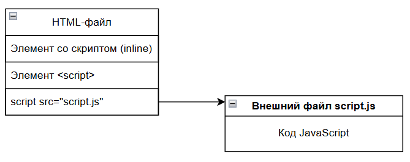
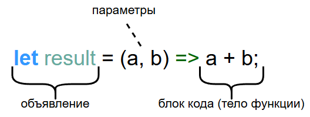
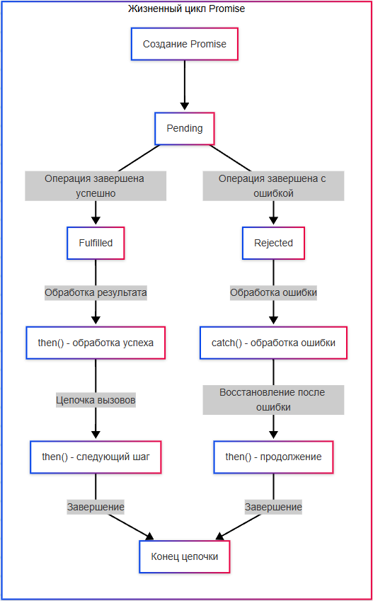
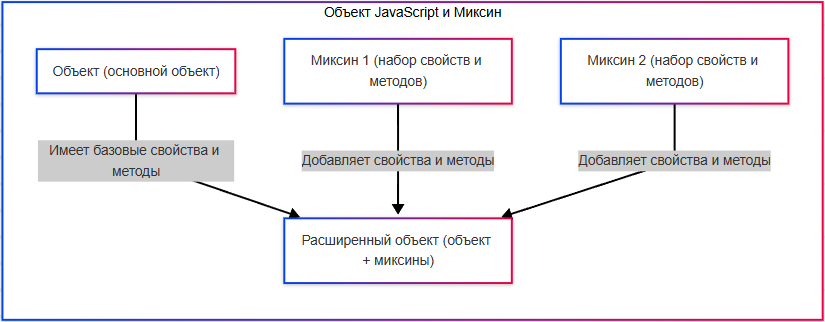
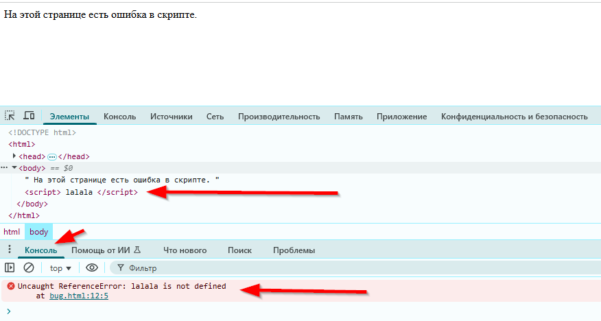
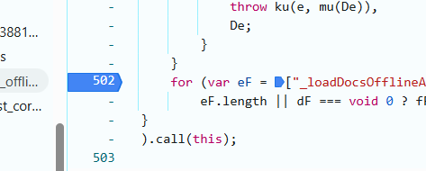

---
title: 5.02. JavaScript
---

# 5.02. JavaScript

## История JavaScript

**JavaScript** был создан в 1995 году программистом Бренданом Айком (Brendan Eich), работавшим в компании Netscape Communications. В то время Netscape разрабатывала один из первых веб-браузеров — Netscape Navigator, который доминировал на рынке. На тот момент веб-страницы были статичными — они просто отображали текст и изображения. Компания хотела добавить в браузер возможность динамического поведения на странице: проверка форм, анимации, реакция на действия пользователя и т.д.

Итого, назначение нового языка - сделать веб интерактивным. Идея была в том, чтобы выполнять код прямо в браузере (на стороне клиента), упростить жизнь веб-разработчикам и не требовать перезагрузки страницы для простых действий.

Брендану Айку дали всего 10 дней на разработку прототипа языка. Он вдохновлялся разными языками - Scheme (функциональное программирование), Perl (гибкость), Java (синтаксис), Self (прототипное наследование). В итоге он создал язык с C-подобным синтаксисом, но с динамической типизацией и возможностью работы с объектами через прототипы. Кстати, Брендан Айк был соучредителем Mozilla Foundation и бывшим CEO Mozilla Corporation.

Первоначально язык назывался Mocha (русскоязычным не смеяться). Позже — LiveScript. В 1995 году, когда Netscape сотрудничала с Sun Microsystems (создателями Java), название изменили на JavaScript — в маркетинговых целях, чтобы ассоциировать его с популярным в то время Java. JavaScript не имеет прямого отношения к Java. Это разные языки. Название было выбрано для привлечения внимания. Странно, но факт. Я думаю, вы уже заметили необычно забавную историю создания, не так ли?

В 1996 году Microsoft выпустила свой браузер Internet Explorer с конкурентом JavaScript — JScript. Чтобы избежать фрагментации, Netscape передала JavaScript в Ecma International — организацию по стандартизации.

То явление, кстати, назвали браузерной войной. Она продолжалась с 1995 по 2001 год, и была между Netscape и Microsoft. В 1994 году вышел Netscape Navigator — первый массовый и удобный веб-браузер, и он стал лидером рынка (до 80%), причем компания внедряла инновации: cookies, фреймы, SSL (безопасность), и JavaScript.

Microsoft увидела угрозу, что если веб станет центром вычислений, Windows может потерять своё значение. В 1995 году выпустила Internet Explorer 1.0 (очень слабый на старте, я думаю многие в своё время его не любили, мягко говоря). Стратегия состояла в том, чтобы дарить IE бесплатно и интегрировать его в Windows. Начиная с Windows 95 OSR2 и особенно Windows 98, IE был встроен в систему — пользователи просто не замечали альтернатив. И не знали о Netscape! Microsoft использовала антиконкурентные практики (например, запрещала OEM-производителям устанавливать другие браузеры).

Важно отметить, что Netscape продавала браузер, а Microsoft распространяла бесплатно, так что не спешите думать плохо. Это привело к тому, что к 2002 году доля IE на рынке выросла до 95%! И в 1998 году Netscape открыла исходный код своего браузера → родился проект Mozilla, из которого позже вырос Firefox.

В 1997 году вышел стандарт ECMAScript (ES1), который лег в основу всех реализаций JavaScript. С тех пор развитие языка идёт по версиям ECMAScript (ES5, ES6/ES2015, ES2016 и т.д.). Термин «JavaScript» — торговая марка Oracle (бывшей Sun), поэтому стандарт называется ECMAScript.
В 1998 году Министерство юстиции США подало в суд на Microsoft за нарушение антимонопольного законодательства, и суд постановил, что Microsoft злоупотребила доминирующим положением. Это стало поворотным моментом в истории IT и ограничило жёсткие тактики в будущем. Microsoft победила, но замедлила развитие веба на годы (IE6, выпущенный в 2001, не обновлялся почти 5 лет). Победа Microsoft привела к стагнации веб-стандартов — пока сообщество не поднялось на борьбу за открытый веб.

После победы Internet Explorer в первой браузерной войне веб застопорился. IE6, 7 и 8 были медленными, не поддерживали современные стандарты и тормозили прогресс. Но к 2000-м годам всё начало меняться — и началась вторая браузерная война, в которой победил инновация, скорость и открытые стандарты.

Firefox появился как открытый проект на базе исходного кода Netscape. Он был быстрее, безопаснее, поддерживал вкладки, расширения и современные стандарты. К 2006 году Firefox занял ~30% рынка — первый серьёзный вызов IE, он продвигал идею открытости и совместимости. Я помню, как люди, пользовавшиеся Firefox, получали больше возможностей при серфинге сайтов в сети.

И если в 2000-х ещё JavaScript оставался в тени, то с 2004-2005 годов начали появляться новые технологии, которые стали двигать язык вперед. Сначала, в 2004 году, Google запускает Gmail, демонстрируя мощь JavaScript в создании сложных веб-приложений. Затем, в 2005 появилась AJAX (Asynchronous JavaScript and XML) — технология, позволяющая обновлять части страницы без перезагрузки, а в 2006 году - jQuery — библиотека, сильно упростившая работу с DOM и событиями.

В 2008 году Google выпустила Chrome — и всё изменилось. По сравнению с первыми браузерами, он был просто ракетой - использовал движок V8 — самый быстрый JS-движок на тот момент, каждая вкладка открывалась в отдельном процессоре, и поэтому они не зависали. Интерфейс был без мусора, минималистичный, удобный, а также был встроенный DevTools, который был очень удобным для разработки. Chrome быстро стал лидером. Сейчас у него, наверное, более 65% рынка, если считать Android.

Apple вела свою игру. У них был свой браузер Safari, который использует движок WebKit (открытый движок, изначально от KDE). Apple активно продвигала Safari на iPhone (с 2007) — это было важно, потому что они были основным локомотивом мобильного интернета, и Safari стал основным браузером iOS.

А IE продолжал тормозить: IE6–IE8 — устаревшие, IE9–IE11 — чуть лучше, но всё равно отставали. В 2015 году Microsoft признала поражение и запустила Microsoft Edge (сначала на собственном движке EdgeHTML). В 2019 году Microsoft перешла на Chromium (движок Chrome), сделав Edge практически клоном Chrome. Сегодня Edge — третий по популярности браузер (~5–10%), и разница между браузерами малозначительная. Словом, победителем во второй браузерной войне стал Google Chrome.

До 2009 года JavaScript использовался только на клиенте. Серверные языки — PHP, Java, Python, Ruby. В 2008 году Google выпустила движок V8 — сверхбыстрый JavaScript-движок для браузера Chrome. Он компилировал JS в машинный код, а не интерпретировал. В 2009 году инженер Райан Даль (Ryan Dahl) выступил одним из создателем идеи использовать движок V8 вне браузера, что привело к появлению Node.js, что сделало язык не чисто клиентским, а еще и серверным. Словом, JS из «фронта» стал «фуллстеком», поддерживая «бэкенд».

Node Package Manager, или npm, создал целую экосистему, и стал самым большим реестром open-source пакетов в мире. Сегодня там более 2 миллионов пакетов. Появились одностраничные приложения (SPA), где фронтенд и бэкенд общаются через API. Компании начали использовать Node.js: Netflix, Uber, LinkedIn, PayPal. Появились инструменты сборки: Webpack, Gulp, Babel — все на Node.js. Как можно понять, это сильно «бустануло» фуллстек-разработку.

К 2010-м годам JavaScript стал повсеместным, но язык оставался «сырым». Многие разработчики писали на CoffeeScript, TypeScript или использовали jQuery, потому что «чистый», или «ванильный» JS был неудобен.

В больших проектах стали возникать проблемы - ошибки с undefined, сложности поддержки, плохое автодополнение, и разработчикам хотелось типов, как в Java или C#, но без потери гибкости JS. JavaScript — слабо типизированный язык, и поэтому появилось надмножество JavaScript, созданное в Microsoft - TypeScript. Автор: Андерс Хейлсберг — легендарный разработчик (Turbo Pascal, Delphi, C#), и первый релиз был в 2012 году. Это сделало работу безопаснее и удобнее, багов стало меньше, документация улучшилась. JS стал пригоден для больших команд и корпораций. Сейчас большинство крупных проектов используют TypeScript: React, Vue 3, Next.js, NestJS, и т.д.

В после выпуска ES6 (ES2015) язык сильно поменялся - это огромный обновлённый стандарт с классами, стрелочными функциями, модулями и т.д., это шестая версия стандарта, самый масштабный апдейт JavaScript за всю историю. Там добавили `let`, `const`, `=>`, классы, модули, шаблонные строки, деструктуризацию, промисы, новые типы данных, и прочие фичи. JavaScript стал современным, зрелым языком. Появились инструменты транспиляции, например, Babel, который позволяет писать на ES6+, но запускать код даже в старых браузерах. Начался новый золотой век JavaScript.

Сейчас JavaScript — самый популярный язык программирования в мире (по данным Stack Overflow, GitHub, и др.). Он используется на фронтенде, бэкенде, в мобильной разработке, десктопных приложениях, в IoT, играх, машинном обучении и много где ещё.


## Основы JavaScript

★ **JavaScript (JS)** – язык программирования, который делает веб-страницы интерактивными. Как мы убедились ранее, HTML отвечает за разметку и структуру страницы, CSS – за внешний вид, а JS добавляет динамику – анимации, обработку действий пользователя, загрузку данных без перезагрузки страницы и много другое. JS может выступать как соединителем клиентской (фронтенд) части с серверной (бэкенд), вызывать сервисы, отправлять данные, запускать процессы.

Нашим первым языком программирования будет JavaScript, ведь он легко понимается в связке с HTML и CSS, которые мы как раз изучили. Но некоторые моменты могут быть непонятными - но они станут яснее, когда изучим ООП.

Поначалу все путают JavaScript и Java - но они никак не связаны, несмотря на название. Воспринимайте сразу так - Java - серверный мультиплатформенный бэкенд язык объектно-ориентированного программирования, а JavaScript - фронтенд язык программирования веб-приложений. Запомните - ни в коем случае не называйте что-то на Java как JS, и что-то на JS как Java, даже в бытовых сокращениях - покажете плохой уровень знаний. 

В самом начале JS покажется довольно легким - для него не нужно ничего устанавливать, можно простым текстовым редактором написать скрипт и вуаля - уже работает прямо в любом современном браузере. Как правило, в учебниках встречается подход «а давайте сразу напишем и запустим». Но нет, не торопитесь, давайте изучим основы.

Сам по себе код — это текст, который мы напишем, а программа, которая выполняется на основе нашего кода называется скриптом. Мы просто можем сохранить скрипт как файл, открыть его - и он запускается прямо в браузере, работая построчно, что и является его интерпретируемостью, без компиляции. Это означает, что когда вы напишете код, не будет никакой ошибки компиляции - ошибку вы встретите в самой программе, когда запустите и доберётесь до нужной логики.

Почему начинать мы будем именно с него? Во-первых, он безопасный, простой и не требует низкоуровневого доступа к памяти или процессору. Во-вторых, он работает в браузере - а мы как раз изучили веб-языки HTML и CSS. И в третьих, для его запуска не потребуется никакой настройки - браузер и текстовый редактор у вас наверняка есть, можно прямо сейчас встроить код в страницу и запустить.

Подробности про JS можно узнать здесь https://metanit.com/web/javascript/ и здесь https://developer.mozilla.org/ru/docs/Web/JavaScript

Также можно отметить отличный учебник тут https://learn.javascript.ru/

Чит-лист - https://cheatsheets.zip/javascript

Какие возможности предоставляет JavaScript?
	- *менять содержимое, структуру и стиль страницы после её загрузки*;
	- *делать веб-интерфейсы живыми и отзывчивыми без необходимости перезагрузки*;
	- *реагировать на действия пользователя: клики, прокрутку, наведение, набор текста, жесты и т.д.*;
	- *получать немедленную обратную связь, улучшая опыт взаимодействия*;
	- *получать новые данные с сервера и обновлять части страницы без полной перерисовки*;
	- *хранить, изменять и синхронизировать информацию о текущем состоянии приложения*;
	- *возможность запрашивать данные у других систем, отправлять запросы, обрабатывать ответы*;
	- *читать и изменять структуру HTML, манипулировать CSS, создавать новые элементы*;
	- *выполнять операции вне блокирующего потока выполнения*;
	- *строить анимации, игры, визуализации данных и интерактивные графики*;
	- *сохранять информацию на стороне клиента, чтобы использовать её между сессиями или работать автономно*;
	- *переопределять стандартное поведение браузера, создавать собственные правила и логику*.
	
```
Интересный факт:
JavaScript не связан с Java. В 1995 году язык создал Брендан Эйх в компании Netscape (кстати, создали JS всего за 10 дней!). Первоначально его назвали Mocha, затем LiveScript, но в тот момент язык Java от Sun Microsystems набирал огромную популярность, и маркетологи решили «подружить» два языка названиями, хотя технически они никак не связаны, у них самостоятельные синтаксисы и особенности.
Часть «скрипт» прямо указывала на задание разработчика – «Сделай язык, похожий на Java, но лёгкий для скриптов.»

```

В отличие от языков вроде C++ или Java, JS не требует отдельной компиляции перед запуском. Это сделано для удобства веб-разработки: код должен выполняться сразу в браузере у любого пользователя. Однако для работы требуется движок.

Современные браузеры используют движки JavaScript, которые:
	- анализируют код (выполняя парсинг);
	- компилируют код «на лету» (JIT-компиляция);
	- оптимизируют выполнение для скорости.
К примеру, в Chrome (как и в Node.js) используется V8, в FireFox – SpiderMonkey, а в Safari – JavaScriptCore. Именно движки позволяют JS работать очень быстро, почти как настоящий компилируемый язык.

JavaScript позволяет выполнять:
	- динамическое изменение страницы – добавление, удаление, изменение элементов без перезагрузки (к примеру, переключение вкладок с контентом);
	- обработку событий (клики, наведение курсора, ввод текста);
	- работу с API (отправку и загрузку данных при обмене с сервером);
	- анимации и визуальные эффекты (плавные переходы, игры, интерактивные карты);
	- валидацию форм (проверку введённых данных перед отправкой).

★ **Главные особенности JavaScript**

	- Интерпретируемость и JIT-компиляция – выполнение кода построчно (правда, современные движки оптимизируют скорость выполнения различными способами);
	- Динамическая типизация – типы данных определяются во время выполнения, переменная может быть числом, а потом строкой (хотя есть TypeScript, который делает типизацию строгой);
	- Асинхронность и событийная модель – JS не блокирует страницу, ожидая ответа от сервера, вместо этого он использует функционал асинхронности – колбэки (callback), промисы (Promise) и async/await;
	- Работа в браузере и за его пределами – изначально был браузерным, но с появлением Node.js появилась возможность использовать JS на сервере;
	- Прототипное наследование – в отличие от классического ООП (как в Java, мы ещё об этом поговорим), JS использует прототипы для организации кода.


## Знаки препинания

Два важных вопроса, которые мучают начинающих программистов:

1. Когда использовать кавычки двойные (`"`), одинарные (`'`), а когда апострофы (`’`)?
2. Когда использовать точки (`.`), запятые (`,`) и точку с запятой (`;`)?

Оба типа кавычек допустимы для строк:
```JavaScript
let name = "John";
let message = 'Hello!';
```
Выбор зависит от контента строки и личного/командного стиля:
```JavaScript
let sentence = "He's a developer"; // удобнее двойные
let quote = '"Hello", she said';   // удобнее одинарные
```
ES6+ : шаблонные строки используют обратные кавычки \` :
```JavaScript
let greeting = `Hello, ${name}`;
```
Апострофы (`’`) — не используются в JS как часть синтаксиса, но могут быть в строковых значениях.

В сообществе JS чаще используется одинарный стиль (особенно при использовании ESLint или Prettier), но всё зависит от стандарта проекта.

Точка (`.`) : используется для доступа к свойствам и методам объектов:
```JavaScript
console.log("Hello");
```
Запятая (`,`) : разделяет параметры функций, элементы массивов, объявления переменных:
```JavaScript
let x = 1, y = 2, z = 3;
function greet(name, age) {}
```
Точка с запятой (`;`) : не обязательна в JS благодаря ASI (Automatic Semicolon Insertion), но рекомендуется использовать для избежания ошибок:
```JavaScript
let a = 5;
let b = 10;
console.log(a + b);
```
Используйте точки с запятой, особенно если вы работаете в строгих средах или с минификаторами.

Нижние подчеркивания «`_`» в JavaScript применяются по разному - иногда это стиль, а иногда синтаксис. Вообще, в языках программирования `_одинарное` подчеркивание часто используется как соглашение, чтобы обозначить какую-то внутренность или приватность поля или метода, а также бывает `__двойное` подчеркивание и `_подчеркивание с двух сторон_`.

`_name` — это соглашение о приватности, можно читать или менять. Но важно учесть, что классический JS не поддерживает приватность - но опять же, что за «приватность», мы узнаем из ООП.
```JavaScript
class MyClass {
    constructor() {
        this._logger = "internal"; // просто соглашение
    }
}
```

Современный JS поддерживает настоящую приватность через `#`:
```JavaScript
class MyClass {
    #logger = "private"; // реально приватно
}
```
`_` может использоваться для игнорирования в деструктуризации, когда мы разбиваем массив на переменные, можем обозначить, что «это поле не трогать»:
```JavaScript
const [first, , third] = [1, 2, 3]; // пропускаем второй
// или:
const [first, _, third] = [1, 2, 3]; // явно игнорируем
```
Также `_` используется как разделитель в числах:
```JavaScript
const billion = 1_000_000_000;
```
Символы «`|`» и «`||`» в JavaScript, C#, Java, C++ и Kotlin использутся в общем порядке:

`|` — это побитовое ИЛИ (bitwise OR).

К примеру, `метод(значениеА | значениеБ)`;

В условиях это логическое ИЛИ, но без сокращённого вычисления.

`if (методА() | методБ())` - вызовет и методА, и методБ, даже если методА - true.

`||` - логическое ИЛИ (с сокращённым вычислением), можно назвать исключающим.

допустим `return a || b` - если a true, то b не вернется/не вычислится.

Важно отметить, что в JS логическое ИЛИ с сокращённым вычислением (`||`) используется так, что выбирается именно первое истинное значение, а не только true/false, к примеру 0 не будет истиной.
```JavaScript
console.log(0 || "hello") // "hello"
```
Важно также уточнить, что | используется в TypeScript для обозначения типов:
```JavaScript
let value: string | number; // может быть строкой или числом
```
Это совсем другое значение — тип объединения, не побитовое ИЛИ.


## Подключение и структура кода

JavaScript можно добавить на страницу трёмя способами:

1) **Встроенный скрипт (inline)** – прямо внутри HTML, путём указания функции сразу после события в теге (однако это загромождает HTML):
```html
<button onclick="alert('Привет!')">Нажми меня</button>
```
Встроенный скрипт работает благодаря интеграции всех возможностей в современных браузерах, позволяя не добавлять обширный скрипт для простых активностей. К примеру, если страница простая и не несёт в себе глубокой логики, работы с данными и задача лишь добавить немного «специй» к элементу – выполняется просто добавление выполнения функции в соответствующий тег.

Таким образом, мы получаем JavaScript возможность внутри HTML-тега.

Но использовать этот метод не рекомендуется, если задач много – допустим, если будет несколько десятков кнопок на странице, и у каждой будет расписан скрипт внутри атрибутов тегов кнопок – будет страшный и плохо читаемый код.

2) **Внутри** `<script>` в HTML – код пишется в качестве содержимого тега:
```html
<script>
  console.log("Этот код выполнится сразу!");
</script>
```
Этот подход отличается от предыдущего тем, что скрипт – это содержимое тега `<script>` - все необходимые функции вписываются между открывающим и закрывающим тегом. Он подойдёт для случаев, когда на странице немного логики, и её можно упаковать в одном месте.

Тегов `<script>` на странице может быть много, но, если они разбросаны по всему коду страницы, расположены в разных местах – читать будет очень сложно. Если понадобится поменять что-то, что используется везде – можно упустить фрагмент, или где-то поломать логику.

Если строк кода в теге много (понятие растяжимое, но, к примеру, больше двадцати), то лучше выделить отдельным файлом.

3) **Подключение внешнего файла** – самый лучший вариант, когда JS-код пишется в отдельном файле с расширением .js, а в HTML указывается путь к этому файлу:
```JavaScript
<script src="script.js" defer></script>
```



Таким образом, к HTML-файлу добавляется ещё один файл, содержащий код. Он работает аналогично тегу `<script>`, но его содержимым будет являться ссылка на файл (в атрибуте «src». Если файл расположен в той же папке, что и HTML, можно просто указать, к примеру «script.js». Если же файл в другой папке, или размещён на каком-то сетевом ресурсе, то нужно указать путь к файлу (ссылку). Так, если страниц и скриптом много, они распределяются по папке согласно структуре, задуманной проектировщиком сайта. В самом JS-файле же, какие-либо открывающие/закрывающие теги не требуются. Просто код.

И только в самом начале разработки страницы «пустые», что может создать иллюзию безопасности в стиле «потом разберусь!». 

Нет! Любой продукт со временем наращивает функционал, расширяясь, улучшаясь. Поначалу это «Привет!», а потом понадобится менять значение текста, а затем и локализовать на другие языки, добавлять дополнительную логику – вот поэтому лучше выделить код отдельно. А на практике, задачи совсем сложнее, и язык ппредоставляет гораздо больше возможностей.

Скрипт выполняется в соответствии с кодом, указанным в файле/теге, и чтобы машина поняла человекочитаемый код, компиляция выполняется силами движка JS, который встроен в браузер.


JavaScript использует JIT-компиляцию.

**JIT-компиляция (Just-In-Time)** – компиляция «на лету», когда движок JS (например, V8) не компилирует весь код заранее, а делает это во время выполнения:
	- сначала код выполняется построчно (медленно) – это интерпретация;
	- потом движок находит «горячие» участки (часто выполняемый код) – это профилирование;
	- «горячие» участки компилируются в машинный код для ускорения – это оптимизированная компиляция;
	- если предположения движка оказались неверными, код возвращается к интерпретации – это деоптимизация.

Хороший JS-код должен быть:
	- читаемым (с отступами и комментариями);
	- модульным (разбит на логические блоки);
	- избегающим глобальных переменных (чтобы не было конфликтов).

**Читаемость** – понятие, конечно, субъективное, и если для новичка может быть что-то вполне читабельным, то для синьора – неприемлемо, либо наоборот. Здесь влияет и стиль написания, и стандарты в компании разработчика, и пожелания заказчика, и даже опыт программиста. Но принципа следует придерживаться следующего – дочерние элементы и строки лучше выделять отступом:
```JavaScript
уровень 1
уровень 1 {
    уровень 2 {
        уровень 3
    } //закрывающие символы уровня 2
} //закрывающие символы уровня 1
```


Модульность подразумевает разделение по функциям, без «свалки». Словом, если у нас есть три функции, монолитно (едино) написали бы мы так:
```JavaScript
функция {
    действие1;
    действие2;
    действие3;
}
```
Но если на практике это будет нечитабельно – это раз, и в случае разбора ошибок – вылетит вся функция, даже если ошибочно было лишь действие2. А если нам в другой части кода пригодится функционал действия3, то удобнее будет вызвать функцию, которая выполняет только действие3. Вот и весь смысл. Ведь намного удобнее разбираться в таком подходе:
```JavaScript
функция1 {
    действие1;
}

функция2 {
    действие2;
}

функция3 {
    действие3;
}
```

Из чего состоит код JS?
	- импорты, которые указывают, какие дополнительные модули используются (если они нужны);
	- константы и настройки – то, что будет использоваться в функциях;
	- основные функции, содержащие логику;
	- обработчики событий;
	- инициализаторы;
	- комментарии.

Все эти компоненты мы разберём позднее. Но для начала, нам нужно увидеть, как это выглядит на практике:
```JavaScript
// так выглядит однострочный комментарий
/*
а вот так – 
многострочный комментарий
*/

// 1. Импорты
import { func } from './module.js';

// 2. Константы и настройки
const API_URL = "https://api.example.com";

// 3. Основные функции
function fetchData(url) {
  // ... логика загрузки данных
}

// 4. Обработчики событий для соответствующих объектов
document.getElementById("btn").addEventListener("click", () => {
  fetchData(API_URL);
});

// 5. Инициализация (запуск кода после загрузки страницы)
document.addEventListener("DOMContentLoaded", () => {
  console.log("Страница загружена!");
});
```


## Работа и применение

```
Лексическая структура
Ключевые слова и зарезервированные идентификаторы
Чувствительность к регистру
Комментарии, пробелы, табуляция
Юникод и кодировка

```

★ **Как работать с JavaScript?**

1. Анализ задачи – сначала нужно понять, что должен делать скрипт? Анимация, вывод информации, обработка – всё, что требуется.
2. Разбить на подзадачи, к примеру сначала надо получить данные с сервера, потом их отобразить в таблице, а затем добавить фильтрацию. Превратить одно действие в несколько, и так до мельчайших деталей, создавая алгоритм.
3. Написание функции для каждой задачи – каждой задаче (подзадаче) пишется код, который использует соответствующие инструменты языка для реализации логики.
4. Тестирование в консоли – разработчик открывает страницу в браузере, включает консоль разработчика, и затем пытается воспроизвести логику – к примеру, нажимает на кнопку, наблюдает за процессом и анализирует результат.
5. Рефакторинг – улучшение читаемости и оптимизация. Если в процессе тестирования выяснилось, что всё работает, как надо, нужно посмотреть на свой код, и оценить – в первую очередь, читабельность и модульность. Откладывать этот шаг нельзя, как и недооценивать.

Сама логика работает не только по принципу «сделай это действие», но также и включает в себя проверку условий, обработку событий и повторяемость действий.

Проверка условий работает как развилка – если условие выполняется, то одна дорога, если не выполняется – другая.

Обработка событий работает по принципу – «наступило событие - тогда выполняем!». Самый простой пример – нажатие кнопки.

Повторяемость – это циклы и обращение к функциям/методам, когда мы можем использовать «действие3» снова и снова.

Итого, логика в JavaScript строится на:
	- условных операторах (`if`, `else`, `switch`);
	- циклах (`for`, `while`, `do…while`);
	- функциях (чистые функции, методы).

Пример:
```JavaScript
if (userAge >= 18) {
    console.log("Доступ разрешён");
  } else {
    console.log("Доступ запрещён");
  }
```
Здесь программа проверяет переменную `userAge`, и если (`if`) её значение будет больше или равно 18, то доступ разрешён, иначе (`else`) – запрещён. Это простейшая развилка, которая демонстрирует работу оператора. Команда `console.log` выводит текст на экран. Но пока не погружайтесь в ключевые слова – их мы изучим позже.

Так, логика проверок, обработок и повторяемости нам ясна. 

Чем же JS ближе к веб-страницам и стилям? Конечно, это придание «живости» скелету страницы. JavaScript используется для создания анимаций. Простые анимации можно, конечно, использовать в CSS (`transition`, `@keyframes`), но сложная интерактивность обеспечивается именно через JS.

Браузер работает с JavaScript по следующим этапам:
	- парсинг HTML (анализ содержимого страницы);
	- построение DOM (структуры элементов страницы с соблюдением иерархии);
	- парсинг CSS и построение CSSOM (структура стилей, селекторов);
	- объединение DOM + CSSOM – создание Render Tree (иерархия отрисовки);
	- layout (reflow) – расчет позиций элементов;
	- paint – отрисовка пикселей;
	- composite – сборка слоёв.

Звучит сложно. Но эти термины лишь раскрывают алгоритм, когда художник сначала определяет ключевые элементы, распределяет их (композирует), рисуя эскиз, затем уже детализирует и раскрашивает. Словом, сначала строим скелет, затем наполняем мясом и вдыхаем жизнь при запуске.
```
Разложили объекты HTML → построили объектную модель DOM → разложили объекты CSS → построили объектную модель CSSOM →расставили объекты → отрисовали → собрали.
```


Теперь же, понимая, как всё работает целиком, перейдём к сердцу JS – видимости и функциям.

## Видимость в JS

В JavaScript есть болезненная и связанная тема, которая постоянно мучает новичков. Лично я прочитал столько учебников, но суть не мог понять, пока не разобрал вообще всё целиком с кучей различных материалов, объединив всё в некую общую картину, как детектив. Поэтому давайте сразу с вами разберём фундаментальный и глубокий вопрос, который нельзя изучать поверхностно.

Как мы помним, JavaScript - код интерпретируемый и однопоточный, который разбирает каждую строку по очереди. Фишка в том, что когда пишется код, мы не просто описываем последовательность действий, а создаём целую структуру данных и определяем поведение этих данных, живущих в определённой среде. JS имеет динамическую природу, и эта «динамичность» подразумевает в себе целый набор инструментов.

**Лексическое окружение (Lexical Environment)** - особый абстрактный объект в движке JavaScript, который создаётся автоматически при выполнении кода. В привычном смысле слова это не объект (вы не увидите его в консоли напрямую), но он реально существует и участвует в управлении переменными. Каждый блок кода `{}`, будь то функция, условие `if`, цикл `for`, или обычный блок `{}`, будет создавать своё лексическое окружение. 

Словом, указывая фигурные скобки, мы автоматически создаём некий контейнер, где будут храниться переменные и функции, доступные в данной области кода.

Каждое лексическое окружение состоит из двух компонентов:
1. **Environment Record** (запись окружения), которая хранит переменные, функции, параметры, объявленные внутри блока. Технически это словарь пар «имя - значение».
2. **Ссылка на внешнее лексическое окружение (Outer Lexical Environment)**, указывает на окружение, в котором был объявлен текущий блок (важно - не вызван, а объявлен!). Это и обеспечивает механизм поиска переменных по цепочке.

Давайте для примера возьмём такой код, с переменной x, внешней функцией (`outer`) и внутренней функцией (`inner`).
```JavaScript
let x = 10;

function outer() {
    let y = 20;

    function inner() {
        let z = 30;
        console.log(x, y, z); // 10, 20, 30
    }

    inner();
}

outer();
```
Здесь получается, что сначала мы объявили переменную x и присвоили ей значение `10`. Это «куда-то записалось». Потом мы создали блок кода с функцией `outer`, а внутри объявили и присвоили значение переменной `y`, и создали ещё один вложенный блок кода с функцией `inner`, где тоже объявили и присвоили значение переменной `z`. И потом в самом нижнем блоке `inner` мы обратились к объекту `console` и вызвали его функцию `log`, передав ей аргументы `x`, `y`, `z`. И прикол в том, что нижний уровень знает, что означают `x` и `y`, хотя они объявлены во внешних блоках!

Функцию inner мы вызываем из блока outer, а функцию outer мы вызываем из глобального окружения.

Технически это выглядеть будет так:


| Глобальное окружение | Outer() | Inner() |
|-----|---------|---------|
|переменные: x: 10	|переменные: y: 20	|переменные: z: 30
|функции: outer: function	|функции: inner: function	|функции: -
|ссылки: -	|ссылки: outer ссылается на глобальное окружение.	|ссылки: inner ссылается на outer.

Словом, когда выполняется `inner()`:
	- сначала выполняется поиск z - и находит в своём окружении;
	- потом ищет y - не находит в своём и отправляется во внешнее (outer) и находит;
	- потом ищет x - не находит, идёт выше - не находит и идет ещё выше, на глобальный уровень - и там находит.

Это и есть цепочка поиска переменных по лексическому окружению.

Как можно заметить, всегда есть глобальное окружение - то есть, весь скрипт (всё что в теге `<script></script>` или в файле скрипта) является глобальным объектом, а каждый создаваемый блок будет записан в глобальном лексическом окружении.

**Область видимости (scope)** - не то же самое, что лексическое окружение. Это правило, определяющее, где в коде переменная доступна для использования. Лексическое окружение это реализация механизма видимости, а область видимости - концепция, описывающая как переменные становятся доступными (как правила видимости).

В JS бывают следующие типы областей видимости:
1. **Глобальная (Global Scope)** - переменные доступны везде, создаются в глобальном лексическом окружении.
2. **Функциональная (Function Scope)** - доступны только внутри функции, создаётся при вызове функции (но определяется при объявлении - лексически).
3. **Блочная (Block Scope)** - доступны только внутри `{}` блока, используется с ключевыми словами `let` и `const`. Позже мы изучим переменные и запомните сразу - слово var не создаёт блочную область - только функциональную.
```JavaScript
{
    var a = 1;
    let b = 2;
    const c = 3;
}

console.log(a); // 1 — var "просочился" наружу блока
console.log(b); // Ошибка! b не в глобальной области
```

Глобальное окружение является корневым лексическим окружением, которое существует всегда и не имеет внешнего окружения. В браузере оно связано с объектом `window`, а в Node.js с объектом `global`. Все глобальные переменные и функции становятся свойствами этого объекта.

Глобальные значения вроде `undefined` (неопределенное), `NaN` (не число), `Infinity` (бесконечность) являются свойствами глобального объекта, то есть в браузере `window`. Технически, их можно даже переопределить (хотя так делать нельзя):
```JavaScript
window.undefined = "hacked";
console.log(undefined); // всё ещё undefined — в ES5+ это запечатано
```
**Замыкание (Closure)** - это комбинация функции и лексического окружения, в котором эта функция была объявлена. Функция «запоминает доступ к переменным из внешнего окружения даже после того, как внешняя функция завершила выполнение. 
```JavaScript
function createCounter() {
    let count = 0;

    return function() {
        count++;
        console.log(count);
    };
}

const counter = createCounter();
counter(); // 1
counter(); // 2
counter(); // 3
```
В выше приведённом примере есть функция `createCounter()`, в которой объявляется переменная count и ей присваивается значение `0`. Затем используется ключевое слово `return` и указывается, что возвращается функция - которая использует переменную count, добавляя ей `+1` (оператор `++`, инкремент). Словом, увеличивается счётчик при каждом вызове функции. И обратите внимание - потом мы создали переменную (константу) counter которая равна `createCounter()`, и обращаемся через `counter()` снова и снова. И магия в том, что хоть функция в первый раз окончательно завершилась, логически вроде бы должно было всё начаться с нуля, и `count` будет равным снова `0`? Но всё же при каждом вызове счётчик увеличивается. Это благодаря замыканию.

`createCounter` создаёт переменную count, возвращает внутреннюю функцию, и как раз внутренняя функция захватывает count из внешнего окружения. Даже после завершения `createCounter`, переменная count не уничтожается, потому что на неё ссылается замыкание.

Чтобы не путаться, можем подчеркнуть, что замыкание работает всегда, а не только со счётчиками:
```JavaScript
function test() {
    let age = 30;

    let maxage = function() {
        return (age + 30);
    };

    return maxage;
}

const result = test();
console.log(result()); // 60
```
Это классическое замыкание - внутренняя функция maxage объявлена внутри внешней функции `test`. Она использует переменную `age` из внешней области. Эта внутренняя функция возвращается и сохраняется вне `test` (в переменной `result)`, и при этом внешняя функция `test` уже завершила своё выполнение. Но переменная age всё ещё доступна при вызове `result()`. Суть замыкания как раз в этом - функция продолжает иметь доступ к переменным из внешнего лексического окружения, даже после того, как это окружение «ушло» из стека вызовов.

Почему age не уничтожается? Обычно да, когда функция завершается, её локальные переменные удаляются из памяти (выбрасываются из стека вызовов). Но если существует функция, которая захватила эти переменные, и эта функция всё ещё может быть вызвана, то движок не удаляет переменные, а сохраняет лексическое окружение, чтобы замыкание могло работать. 

Давайте разберем:

Когда вызывается `test()`:
1. создаётся окружение `test`: `{ age: 30, maxage: function }`;
2. возвращается функция `maxage`;
3. функция maxage «помнит» своё внешнее окружение (`test`);
4. даже после завершения test, окружение сохраняется - из-за замыкания.

Это не копия переменной age, а ссылка на неё. Если бы age изменилась, то maxage увидела бы новое значение. А как мы помним, в примере с `createCounter()` мы увеличивали значение `count` каждый раз через инкремент `++`, а значит значение count менялось снова и снова, а лексическое окружение предоставляет актуальное значение.

Замыкание не будет, если переменная не используется. То есть, оно создаётся только тогда, когда внутренняя функция действительно использует переменные из внешнего окружения.
```JavaScript
function test() {
    let age = 30;

    let greet = function() {
        console.log("Привет!");
        // Никаких ссылок на age
    };

    return greet;
}

const fn = test();
fn(); // "Привет!"
```
Обратите внмание на код выше. Здесь нет замыкания на `age`, потому что `greet` не использует `age`. Даже если переменная объявлена, но не захвачена, она будет удалена при завершении `test`. Если вы пропишете такой код в IDE, к примеру, VS Code, переменная age даже будет подсвечена серым цветом, мол, дружище, ты объявил переменную но ни разу не использовал её.

Итого, замыкание будет, если внутренняя функция использует переменную извне (даже если переменная одна, значение примитивное и переменная позже изменится), и замыкания не будет, если внутренняя функция не ссылается на внешние переменные или если функция просто объявлена внутри, но не возвращается или не сохраняется.

И как всегда, бывает ньюанс.
```JavaScript
function test() {
    let secret = "shh";

    function reveal() {
        console.log(secret);
    }

    reveal(); // вызов внутри
}

test(); // "shh"
```
Здесь есть захват переменной secret, но внутренняя функция не возвращается, а после завершения test - всё уничтожается. Это всё равно замыкание, механизм тот же, но эффект временный, так сказать, разовый. Просто мы не видим «долгосрочного удержания» переменной. Словом, `test` - отдельный независимый блок, а reveal видит secret внутри работы данного `test`. Да, технически результат примерно одинаковый, но есть вот такая необычная штука - это из-за внутреннего вызова.

Словом, механизм будет работать всегда, главное соблюдать правила работы с областями видимости и понимать логику работы лексического окружения.

Если хотите посмотреть на механизм ещё глубже - можете использовать любой из вышеперечисленных примеров с внутренней функцией, поставить debugger внутри внутренней функции, и в режиме отладки в инструментах разработчика посмотрите на вкладку `Scope` - увидите `Local` (свои переменные), `Closure` (захваченные переменные извне) и `Global`. Но можете вернуться к этому позже, ведь мы ещё не закончили.

Лексическое окружение есть и в других языках - C#, Python, Java, C++, Go. Со своими ньюансами и разной реализацией, но всё же есть. Но JavaScript — один из самых гибких языков в плане замыканий, потому что позволяет захватывать и изменять переменные из внешнего окружения без жёстких ограничений.

**Контекст вызова** и **this** - ещё важные понятия, которые не нужно путать с областью видимости. И снова мы что-то отделяем от области видимости 😊 - scope определяет доступ к переменным, а контекст вызова (`this`) определяет «кто» вызвал функцию, и на что указывает `this` внутри неё. Словом, `this` это не часть лексического окружения - `this` динамический и зависит от способа вызова, а не от места объявления.

Чтобы разобраться, где и какой `this`, надо запомнить правила определения `this`:

| Способ вызова | Значение | this |
|-----|---------|---------|
|Обычный вызов func()	|undefined в strict mode; window в non-strict.
|Вызов метода объекта obj.method()	|obj
|Вызов через call, apply, bind	|указанное значение
|Конструктор через new	|новый объект
|Стрелочная функция	|наследует this от внешней функции (лексически).

```JavaScript
const user = {
    name: "Timur",
    greet: function() {
        console.log(this.name); // this = user
    },
    arrowGreet: () => {
        console.log(this.name); // this = window (в браузере)
    }
};

user.greet();      // "Timur"
user.arrowGreet(); // undefined (или window.name)
```
Внимательно прочитайте код выше. Мы создаём объект user и записываем его в константу. У этого объекта есть `name`, `greet` и `arrowGreet`. И в `greet` мы вызываем `this.name`, что означает «возьми `name` отсюда», и `this` равен `user` - текущему объекту. Но если мы возьмём `arrowGreet` и в ней укажем `this.name`, то `this` будет пытаться искать в объекте глобальном - `window`, то есть `window.name` - а такого мы не определили, и следовательно получаем «неопределенное значение» - `undefined`. Собственно, отсюда можно сделать вывод, что стрелочные функции не имеют своего `this` — они берут его из внешнего лексического окружения.

Учитывая, что способ объявления функции влияет на this, важно сразу выделить три способа объявления функций:
1. **Function Declaration** - именованная функция. Это обычное объявление функции через ключевое слово `function имяФункции() {}`. Пример:
`function greet() { ... }`

В FD имеется свой собственный `this`, который зависит от способа вызова.
2. **Function Expression (анонимная или именованная функция в переменной)**. То же самое, что и первый способ, но только имя функции можно не задавать - имя будет указано в переменной. Синтаксис построения здесь подразумевает объявление переменной, и присвоение ей безымянной (анонимной) функции в качестве значения:
```JavaScript
const greet = function() { ... };
```
В FE this будет динамическим.

3. **Arrow Function (стрелочная функция)**, напоминающая FE, но работающая по синтаксису (аргументы) `=>` тело.
```JavaScript
const greet = () => { ... };
```
В AF нет своего `this`, он, как мы отметили ранее, наследуется от внешнего окружения.

Мы упомянули, что `this` может быть динамическим.

У обычных функций `this` - динамический (определяется в момент вызова). Момент вызова - это когда мы обращаемся к функции, допустим пишем `greet()`.

У стрелочных функций `this` - лексический (определяется местом объявления). Место объявления - это когда мы впервые описываем функцию, создаем блок кода (тело функции).

И поскольку стрелочная функция сохраняет текущий контекст и не будет меняться, то её можно использовать в случаях, когда контекст нужно сохранить.
```JavaScript
const obj = {
    name: "Bob",
    regular: function() {
        console.log(this.name); // Bob
        setTimeout(function() {
            console.log(this.name); // undefined (this = window)
        }, 100);
    },
    arrow: function() {
        console.log(this.name); // Bob
        setTimeout(() => {
            console.log(this.name); // Bob (стрелочная функция унаследовала this)
        }, 100);
    }
};
```
Давайте разберём. Мы создаём объект `obj`, записываем в константу, создаём ему `name`, `regular`, `arrow`. Сначала `regular`, опять же, `this.name` увидит как `obj.name`, то есть «Bob». И если мы вызовем `this.name` внутри новой функции `setTimeout`, то блок кода, как и контекст, изменится и мы при попытке обращения к `this.name` не увидим ничего, так как в месте вызова `console.log` нет `name` - контекст иной - поэтому получим `undefined`.

А в arrow, стрелочной функции, мы увидим один и тот же `name` - потому что стрелочная функция унаследовала `this`, ибо контекст здесь будет моментом объявления, то есть - объектом `obj`, и `this.name` всегда будет эквивалентен `obj.name`. Почему `obj` - потому что name на одном уровне с `arrow`, и место объявления - всегда тот же уровень. 

## Функции

```
Функции как объекты первого класса
Неявный return
Контекст this в стрелочных функциях
```


★ **Функция** – это блок кода, который выполняет конкретную задачу и может быть повторно использован. Это как мини-программа внутри основной программы.

Как выглядит функция:
```JavaScript
function имяФункции(аргументы) {
    // Тело функции (код, который выполняется при вызове)
    return результат; // Необязательно
  }
```
Что здесь указано?
	- `function` – это ключевое слово, зарезервированное в языке JS для указания, что сейчас будет функция;
	- `имяФункции` – это любой набор слов и символов (начинать нужно строчной буквой, ни в коем случае не Прописной и не 1цифрой), который придумывает программист. Поменять можно в любое время, но если где-то идёт обращение к функции, важно поменять и обращение;
	- `аргументы` – это входные данные, которые принимает функция, словно пакет документов, требуемый в регистратуре – чтобы работать, функция должна знать исходные данные. Их можно и не указывать, тогда скобки с аргументами будут пустыми `()`;
	- `тело функции` – это код, который включает в себя почти любой набор кода, который представляет собой суть функции, её всю логику;
	- `return` – ключевое слово для указания, что сейчас будет возвращаемый результат.

Пример создания:
```JavaScript
// Функция для сложения двух чисел
function sum(a, b) {
    const result = a + b;
    return result; // Возвращаем результат
  }
```
Как можно заметить при разборе:
	- функция называется sum;
	- функция принимает аргументы a и b, следовательно, вызывая её, нужно будет указать значения, где первое значение до запятой будет равным `a`, второе – `b`;
	- код включает в себя константу (ключевое слово `const`) с именем `result`;
	- константа `result` равна `a + b`;
	- результат, который вернёт функция – это то, чему равна константа `result`.


Так, мы получаем некую функцию, которая суммирует аргументы. И если нам, в какой-то момент, понадобится сложить какие-то два значения, теперь мы можем просто вызывать нашу функцию, сообщим ей значения в виде аргументов.

Пример вызова:
```JavaScript
const total = sum(2, 3); // Вызов функции с аргументами 2 и 3
console.log(total); // 5
```
Здесь мы выполняем какую-то логику, и объявляем константу с именем `total`, которая равна результату выполнения функции `sum(a, b)`. Указав имя функции и значения аргументов, мы можем даже ссылаться на нашу константу, зная, что она всегда будет равна `5` в нашем случае. И выводим на консоль значение этой константы, выполнив `console.log(total)`.

Ещё раз – повторим, что такое вызов. Понятно, что функция что-то выполняет в своём теле. Но она не запустится сама по себе, а значит кто-то должен её запустить. Этот «запуск» называется вызовом – функцию нужно вызвать. Вызов функции – это момент, когда функция начинает выполнять свой код. Вызов происходит по имени функции с круглыми скобками (и аргументами, если они есть):
```JavaScript
// Создали функцию
function greet() {
    console.log("Привет!");
  }
  
  // Вызвали её 3 раза
  greet(); // "Привет!"
  greet(); // "Привет!"
  greet(); // "Привет!"

```
Вызывать функции можно сколько угодно раз и когда угодно. Именно тут и раскрывается смысл декомпозиции – нужно разбивать всё на подзадачи и для каждой создавать функции, которые могут пригодиться и упростить код.

Так, мы имеем два понятия - **объявление (создание)** функции и её **вызов**.

В JavaScript существует три способа объявления функции:

1) **Function Declaration Statement** - используется ключевое слово function, затем указывается имя функции, параметры, тело и возвращаемое значение:
```JavaScript
function <имя> (<Параметры>) {
    <тело>
    return <возвращаемое значение>
}
```
2) **Function Definition Expression** - функция-выражение, или анонимная функция. Здесь подразумевается, что имени у функции нет:
```JavaScript
function (<параметры>) {
    <тело>
    return <возвращаемое значение>
}
```
Это удобно, когда нужно создать «вспомогательную функцию», допустим, для передачи в качестве аргумента или записи в переменную. Можно сделать как переменную и получить похожий на вызов синтаксис:
```JavaScript
let sum = function(a, b) { return a + b }
let x = sum(2, 2)
```
3) **Стрелочные функции (или функции-стрелки)** - анонимно, без фигурных скобок, с использованием «`=>`» стрелки:
```JavaScript
let <имяПеременной> = (<параметры>) => <тело функции>;
```
Они позволяют сокращать синтаксис функций, заменяя «`{ return result}`» на «`=> result`». Это может быть сложно новичку, но их смысл проще, чем кажется:

Представим, что у нас есть a и b:
```JavaScript
let a = 1;
let b = 2;
```
И нам нужно получить сумму, записав в результат:
```JavaScript
let result = sum(a, b);

function sum(a, b) {
    return a + b;
}
```
Мы объявили переменную `result`, которая равна результату выполнения функции `sum`, принимающей аргументы `a` и `b`, суммирующей их и возвращающей результат. Но можно её записать короче:
```JavaScript
let result = (a, b) => a + b;
```




То есть мы указали аргументы, и буквально упростили функцию, указав её в одной строке. Но для новичка может быть не столь легко читать такие функции. А теперь, если не поняли, перечитайте и подумайте. Принцип таков:
```JavaScript
переменная = (аргумент1, аргумент2) => выражение;
```
С функциями можно делать многие другие вещи.


Функции бывают нескольких видов:

1. **Чистая функция (Pure Function)** – всегда возвращает одинаковый результат для одних и тех же аргументов, и не изменяет внешние переменные.
```JavaScript
// Чистая функция
function multiply(a, b) {
    return a * b; // Только возвращает результат
  }
  
  console.log(multiply(2, 5)); // Всегда 10
```
Чистой она называется, потому что она независима и даёт результат, строго выполняя свою задачу. Всегда проще представить себе обычные арифметические операции – отличный пример. Выше мы создали чистую функцию `multiply(a, b)`, и в отличие от sum, она умножает `a` на `b`. Потом, можем вывести в консоль значение, равное результату функции `multiply` с аргументами `2` и `5`.

2. **Метод** – функция, которая является свойством объекта и работает с его данными.
```JavaScript
const user = {
    name: "Дарт Вейдер",
    // Метод объекта
    sayHi() {
      console.log(`Привет, я ${this.name}!`);
    }
  };
  
  user.sayHi(); // "Привет, я Дарт Вейдер!"
```
В примере выше у нас есть объект – user, константа, у которой есть свойство `name`, равное какому-то значению, и самое главное – внутри объекта user есть функция `sayHi()`.

Она находится внутри объекта, следовательно, просто так к ней не обратиться – она зависима и принадлежит объекту user.
Поэтому, вызывая эту функцию `sayHi`, мы должны указать сначала путь к этой функции – название объекта-владельца. Владелец и свойство/функция разделяются точкой – в нашем случае, это `user.sayHi()`.

Скобки всегда указываются в функциях и методах, даже если аргументов нет. В роли аргументов могут выступать не только явно указанные данные, но и переменные/константы:
```JavaScript
function greet(name) {
    console.log(`Привет, ${name}!`);
  }
  
  greet("Йода"); // "Привет, Йода!"
  greet("Падме"); // "Привет, Падме!"
```
После того, как функция выполнит свою работу, она должна что-то вернуть, какой-то результат. «return» возвращает результат (если его нет, функция вернёт неопределённое значение – `undefined`):
```JavaScript
function checkAge(age) {
    if (age >= 18) {
      return "Доступ разрешён";
    } else {
      return "Доступ запрещён";
    }
  }
  
  console.log(checkAge(20)); // "Доступ разрешён"
```
Важно: имя функции должно быть глаголом (сделать, получить) и на английском языке – `getData`, `calculateSum`. Логика не должна смешиваться – одна функция-одна задача. И чистые функции, конечно, предпочтительнее.

### Каррирование

Например, есть такое понятие как каррирование — это процесс преобразования функции от нескольких аргументов в последовательность функций, каждая из которых принимает по одному аргументу.

Вместо того, чтобвы вызывать функцию так:
```JavaScript
add(1, 2, 3)
```
Мы сможем вызывать так:
```JavaScript
add(1)(2)(3)
```
И в дальнейшем это позволит нам «замораживать» аргументы, без необходимости передавать все три. Пример:
```JavaScript
let addOne = add(1);
let addOneAndTwo = addOne(2);
let result = addOneAndTwo(3);
```
Шаблон таков - у нас есть функция:
```JavaScript
function add(a, b, c) {
    return a + b + c;
}
```
Мы создаём функцию curry, которая принимает исходную функцию и возвращает её каррированную версию:
```JavaScript
function curry(fn) {
    return function curried(...args) {
        // Если передали достаточно аргументов — вызываем исходную функцию
        if (args.length >= fn.length) {
            return fn.apply(this, args);
        } else {
            // Иначе возвращаем функцию, которая ждёт остальные аргументы
            return function (...nextArgs) {
                return curried.apply(this, args.concat(nextArgs));
            }
        }
    };
}
```
Пояснение. `fn.length` это значение количества параметров у исходной функции (например, `add(a,b,c)` соответственно имеет `fn.length === 3`, т.е. три параметра). В `…args` мы собираем все переданные аргументы, и если их хватает - вызываем fn. Если не хватает, то возвращаем новую функцию, которая запомнит текущие фрагменты и дождётся остальных.

Пример, который мы привели выше `(curry(fn))` это непростая функция, но более универсальная, способная работать с любым количеством аргументов. Можно сделать и более простой шаблон:
```JavaScript
function curry3(f) {
    return function(a) {
        return function(b) {
            return function(c) {
                return f(a, b, c);
            };
        };
    };
}

// Использование:
const curriedAdd = curry3(add);
curriedAdd(1)(2)(3); // → 6
```
Это не так универсально, но может быть нагляднее - здесь три аргумента. Есть и более современные способы, к примеру, при совмещении стрелочных функций и каррирования:
```JavaScript
const curry = (fn) => (...args) =>
    args.length >= fn.length
        ? fn(...args)
        : (...nextArgs) => curry(fn)(...args, ...nextArgs);
```
Работает абсолютно так же, просто сделано в другом стиле.

Каррирование позволяет частично применять фунции, создавать специализированные функции без дублирования кода. Нужно взять функцию, обернуть её (как мы сделали в let addOne, к примеру), и затем вызывать.


## Переменные

```
Hoisting
Область действия (функциональная, блочная)
Глобальное пространство имён
using, await using (современное управление ресурсами)

```

Для своей работы, функции используют какие-то данные. Эти данные являются по умолчанию чем-то неопределённым. Но, чтобы этот набор данных как-то «упаковать» в пригодной для работы оболочке, нужен «контейнер».

★ **Переменная** – это «контейнер» для хранения данных. Её значение можно менять. Переменная – это именно та самая «x» из математических примеров, где x=5+5.

★ **Константа** – тоже контейнер для данных, но её значение нельзя изменить после создания. Представим, что вам нужно объявить значение, и оно будет постоянным. Тогда и нужна константа.

В начальных примерах мы указывали именно константы, потому что подразумевали, что значение, указанное нами в коде, будет постоянным и неизменным.

Говоря о создании, поскольку фактически непосредственного «создания» не происходит, программирование использует термин «объявить». Переменную не создают, а объявляют. 

Ключевые слова для объявления переменных

| Ключевое слово | Описание | Пример |
|-----|---------|---------|
|let	|Переменная (значение можно менять)	|`let age = 25`
|const	|Константа (значение нельзя менять)	|`const PI = 3.14`
|var	|Устаревший вариант переменной	var |`name = "Тимур"`

Переменную можно объявить, и она уже будет в памяти. Потом ей можно изменить значение, допустим, x была равна 10, а потом можно её сделать равной 5. Константу, если мы указали как равной 10, уже значение не поменять.
В коде это выглядит так:
```JavaScript
// Переменная (можно менять)
let userName = "Оскар";
userName = "Хан"; // OK

// Константа (нельзя менять)
const birthYear = 1990;
birthYear = 2000; // Ошибка! TypeError: Assignment to constant variable.
```
Поэтому, если какое-то значение менять в процессе не потребуется, и оно всегда будет стабильным – лучше использовать константы, это займёт меньше ресурсов.

У вас может возникнуть вопрос - а почему `var` устаревшее ключевое слово для объявления переменной?

Мы помним, что такое область видимости переменной - как правило, она ограничивается блоком кода, где она была объявлена. Но область видимости переменных `var` не ограничивается блоком кода - она создаёт глобальную переменную. Допустим, если напишем `if(true) { let name; }` то `name` будет видна только внутри фигурных скобок блока `if`, при попытке доступа из других блоков `name` будет `undefined`. Но если мы аналогично сделаем `var - if(true) { var name }` то `name` станет видима!

Кроме этого, `var` допускает повторное объявление, в отличие от `let` - если вы напишете `let name; let name;` то на втором экземпляре «`let name;`» будет ошибка синтаксиса, потому что переменная `name` уже объявлена. В случае с `var name; var name` система ругаться не будет.
 
Ещё интересное отличие - `var` технически считается объявленным в самом начале работы функции. То есть, даже если вы поместите `var` в конец блока функции, системе будет «плевать», она начнёт исполнение с `var`, «переместив» в начало кода. И что самое сложное - такое объявление «перемещается» без своего значения.

## Типы данных в JS

```
Автоматические преобразования (coercion)
Объекты как ссылочные типы


```

**Переменные** и **константы** в процессе использования, получают какое-то значение. Когда мы указываем, что у нас будет возраст (`age`), мы понимаем, что это будет какое-то число в диапазоне от `0` до `150`, к примеру. А для имени (`name`) будет уже довольно обширный набор символов с разным количеством – от одного до пятидесяти (а может, и больше?). И для устройства это важно, определить участок памяти для небольшого значения (`age`) или большого (`name`) – и это определяется типом данных, который даёт системе указание выделить нужный объем ресурсов.

★ JavaScript – язык с **динамической типизацией** (тип переменной определяется автоматически), поэтому можно просто объявить переменную, не указывая, какого типа она будет, и система сама поймёт, с каким типом работает. Мы просто можем написать «пусть будет x» - «let x», и когда будет `x=10`, динамическая типизация позволит определить, что тут хватит Number, если же `x=”Какой-то текст”`, то небольшим размером Number не обойтись, и тип будет указан как String.

Типы в JS бывают **примитивными** (хранят одно значение) и **ссылочными** (хранят сложные структуры).

### Примитивные типы

| Тип | Описание | Пример |
|-----|---------|---------|
|Number	|Числа (целые и дробные)	|`let age = 25;`
|String	|Строки (текст)	|`let name = "Анна";`
|Boolean	|Логический (true / false)	|`let isStudent = true;`
|Undefined	|Значение не присвоено	|`let x;`
|Null	|Пустое значение	|`let y = null;`
|Symbol	|Уникальный идентификатор	|`const id = Symbol("id");`

Как можно понять, примитивные используются для простых данных, когда это какое-то имя, число, текст, или просто «флажок» вроде «истина» или «ложь».

1. **Число (Number)**. Тип Number представляет как целые, так и вещественные числа. Внутренне используется формат IEEE 754 (64-битное число с плавающей точкой). Поддерживает специальные значения: Infinity, -Infinity, NaN.

Простой пример:
```JavaScript
let age = 30;
```
Сложный пример:
```JavaScript
const totalPrice = items.reduce((sum, item) => sum + (item.price * item.quantity), 0)
    .toFixed(2);
const finalPrice = parseFloat(totalPrice) + (hasDiscount ? -totalPrice * 0.1 : 0);
```
Здесь значение переменной finalPrice формируется через цепочку операций: агрегация массива объектов (reduce), округление до двух знаков после запятой (toFixed — возвращает строку), преобразование строки обратно в число (parseFloat) и условная скидка. Результат — число, но его получение требует нескольких этапов обработки.

2. **Булево (Boolean)**. Принимает два значения: true и false. Также может быть получен неявно через приведение типов (например, !!"text" → true).

Простой пример:
```JavaScript
let isActive = true;
```
Сложный пример:
```JavaScript
const isEligible = user.age >= 18 && 
                   user.hasVerifiedEmail &&
                   (user.permissions.includes('read') || user.role === 'admin');
```

Переменная isEligible принимает булево значение, вычисленное на основе нескольких условий: возраст, статус верификации и права доступа. Это типичный случай использования логических выражений для контроля доступа.

3. **Строка (String)**. Тип String представляет собой последовательность символов UTF-16. Может создаваться как строковый литерал или через конструктор String().
Простой пример:
```JavaScript
let name = "Тимур";
```
Сложный пример:
```JavaScript
const greeting = `Добро пожаловать, ${user.name || 'Гость'}!
Вы вошли ${new Date().toLocaleDateString('ru-RU')} в ${new Date().getHours()}:${String(new Date().getMinutes()).padStart(2, '0')}.
Ваш баланс: ${(user.balance ?? 0).toFixed(2)} ₽.`;
```

Выше используется шаблонная строка с интерполяцией значений из объекта, операторами нулевого слияния (??) и логического ИЛИ (`||`), форматированием времени и числовым округлением. Результат — многострочная строка, собранная динамически.

Отдельно важно выделить symbol - в JS они особые, и не относятся к «тексту» вроде строки. Это ярлык, который можно использовать как ключ для свойств объекта, как наклейка на шкаф. Каждый Symbol — уникален, даже если у них одинаковое описание. Даже если два символа называются "id", они не равны. Это как два разных браслета с одинаковой гравировкой — выглядят одинаково, но физически разные.

Представим наглядно.

У нас есть объект user, и мы ему решили добавить свойство, сразу в формате строки:
```JavaScript
user.id = "12345";
```
И в дальнейшем, эту переменную id можно перезаписать, заменив значение - если кто-то укажет user.id = значение, то наше изначальное значение будет перезаписано:
```JavaScript
user.id = 23456;
```
И если мы не хотим, чтобы другие скрипты перезаписали случайно наш код, можем использовать Symbol:
```JavaScript
user.id = Symbol("id");

user[id] = 12345;
```
Теперь наш id не перезапишется, потому что не знают о том, что есть id как Symbol. Символы невидимы в циклах, и не покажутся в переборе. Symbol — это скрытое свойство. Его нельзя автоматически превратить в строку при преобразовании типов.

Но в ряде случаев, можно ссылаться к каким-то сложным объектам, как мы ранее уже упоминали – это ссылочные типы.

### Ссылочные типы

| Тип | Описание | Пример |
|-----|---------|---------|
|Object	|Объект (ключ: значение). Кстати, JSON это Java Script Object Notation, так что это, фактически, тот же синтаксис.	|`const user = { name: "Анна" };`
|Array	|Массив (список значений)	|`const nums = [1, 2, 3];`
|Function	|Функция	|`function greet() { ... }`

Объект имеет какие-то свойства и значения, допустим `name` – свойство объекта user. Объект, как мы ранее выяснили, может иметь и свои функции – это будут методы.

**Объект** — это коллекция пар «ключ-значение». Является ссылочным типом. Все не-примитивы в JS являются объектами (включая массивы и функции).

Простой пример:
```JavaScript
let person = { name: "Иван", age: 28 };
```
Сложный пример:
```JavaScript
const config = Object.freeze({
    apiUrl: process.env.API_URL || 'https://api.example.com',
    timeout: parseInt(process.env.TIMEOUT || '5000', 10),
    headers: {
        'Content-Type': 'application/json',
        'Authorization': `Bearer ${authToken}`
    },
    retryCount: maxRetries > 0 ? Math.min(maxRetries, 5) : 0
});
```
Выше в примере мы видим, как создаётся объект конфигурации с использованием переменных окружения, преобразованием типов, условной логикой и вложенностью. Затем он замораживается (Object.freeze) для предотвращения изменений — типичная практика в продвинутых приложениях.

Объекты могут быть базовыми, DOM, пользовательскими и глобальным.

**Глобальный объект** - это объект, который существует в любом окружении выполнения JavaScript и доступен всегда, везде. Все глобальные переменные, функции, встроенные константы на самом деле являются свойствами этого объекта.

Какой именно объект является глобальным, зависит от окружения:

| Окружение | Глобальный объект |
|-----|---------|
|Браузер	|`window`
|Node.js	|`global`
|Современный JS (в любом окружении)	|`globalThis`

Как это работает? Такой глобальный объект содержит встроенные глобальные переменные, функции и объекты:

**Свойства**:
	- `Infinity` - бесконечность;
	- `NaN` - «не число»;
	- `undefined` - значение undefined;
	- `globalThis` - ссылка на самого себя.

**Встроенные функции**:
	- `isNaN()` - проверяет, является ли значение NaN;
	- `isFinite()` - проверяет, является ли значение конечным числом;
	- `parseFloat()`, `parseInt()` - парсинг чисел;
	- `encodeURI()`, `decodeURI()` - кодировка URL;
	- `eval()` - выполнение строки как кода.

**Встроенные конструкторы** (которые на самом деле - функции):
	- `Object` - объект;
	- `Array` - массив;
	- `String` - строка;
	- `Number` - число;
	- `Boolean` - булево значение;
	- `Function` - функция;
	- `Date` - дата;
	- `RegExp` - регулярное выражение;
	- `Symbol` - уникальный идентификатор;
	- `Error`, `TypeError`, `SyntaxError` - ошибки.

**Встроенные объекты**:
	- `Math` - математические функции;
	- `JSON` - работа с JSON;
	- `Promise` - промисы (позже их изучим);
	- `console` - консоль.

Если объявить переменную без var, let, const в глобальной области - она станет свойством глобального объекта. То есть не пишите вроде x = 42, если не хотите создавать глобальное свойство - добавляйте ключевое слово let или const.

Важно - let, const, class не создают свойства в глобальном объекте, а var создаёт, как и вышеприведенный пример с x = 42.

**Массив** же используется как набор данных, когда мы хотим расширить набор данных. К примеру, nums – набор чисел, включающий три значения – 1, 2 и 3. Каждый из этих элементов массива имеет индекс, что позволяет обращаться к конкретному значению, допустим, 2.

**Массив (Array)** — упорядоченная коллекция элементов. Является подтипом объекта, но имеет специфические методы (map, filter, reduce и т.д.).

Простой пример:
```JavaScript
let numbers = [1, 2, 3];
```
Сложный пример:
```JavaScript
const filteredUsers = users
    .filter(user => user.active)
    .map(user => ({
        ...user,
        fullName: `${user.firstName} ${user.lastName}`.trim(),
        roleLabel: roleMap[user.role] || 'Неизвестно'
    }))
    .sort((a, b) => a.fullName.localeCompare(b.fullName));
```
Здесь выполняется фильтрация активных пользователей, маппинг с расширением данных (включая объединение полей и использование внешнего маппинга ролей), затем сортировка по алфавиту. Результат — новый массив объектов с расширенной информацией.

**Функция** – это та сама функция, которые мы изучили ранее. Она тоже представляет собой тип данных.

**Функция (Function)** — это объект первого класса. Может быть передана как аргумент, возвращена из другой функции, храниться в переменной.

Простой пример:
```JavaScript
function greet(name) {
    return `Привет, ${name}!`;
}
```
Сложный пример:
```JavaScript
const createValidator = (rules) => (data) => {
    const errors = [];
    for (const [field, rule] of Object.entries(rules)) {
        if (!rule(data[field])) {
            errors.push(`Поле "${field}" не прошло валидацию.`);
        }
    }
    return errors.length === 0 ? null : errors;
};

const validateUser = createValidator({
    email: (v) => /\S+@\S+\.\S+/.test(v),
    age: (v) => v >= 18 && v < 120
});
```
Здесь реализован паттерн каррирования: функция высшего порядка возвращает другую функцию. createValidator абстрагирует логику валидации, позволяя генерировать конкретные валидаторы. Это мощный инструмент функционального программирования.


### Как использовать переменные?

Пример:
```JavaScript
let name = "Тарзан";
let message = 'Привет, мир!';
let template = `Меня зовут ${name}`; // Шаблонная строка, для вызова надо указать ${имя переменной} и тогда будет работа с её значением
```
Здесь мы объявили три переменные:
	- name – её значение равно «Анна»;
	- message со значением «Привет мир!»;
	- template – «`Меня зовут ${name}`».

Шаблонная строка (template) будет выводить нам не просто текст, а динамически изменяемое значение, которое будет подставлять значение переменной, указанной через символ $ в скобках – в нашем случае, будет «Меня зовут Анна», так как выше мы указали, что name=«Анна».

Пример объекта:
```JavaScript
const person = {
    name: "Рэй",
    age: 30,
    isStudent: false
  };
```
Здесь мы видим более сложный объект person, который включает в себя свойства, name, age, isStudent. Все эти три свойства друг от друга независимы, к примеру, isStudent может быть true. Следовательно, обратившись к person.name, person.age, person.isStudent – мы получим соответственно значения «Рэй», 30 и false. Так и работает объект.

★ **Создание (объявление) переменной**:
```JavaScript
let age; // Объявили переменную (значение = undefined)
```
Объявить переменную можно через ключевое слово let или var. При объявлении значение можно не указывать. Логически это «пусть будет возраст».

★ **Присваивание значения**:
```JavaScript
age = 25; // Теперь age = 25
```
Присваивание значение выполняется через символ равенства «=». Присваивание можно выполнить и при объявлении, но в нашем случае, это будет «Возраст равен 25».

★ **Использование**:
```JavaScript
console.log(age); // 25
```
Поскольку ранее переменная age уже была объявлена – в памяти для неё выделено место, а после присвоения получено было и конкретное значение типа Number. Теперь можно просто указать имя переменной, чтобы использовать.

★ **Правила именования переменных**:
	- имена чувствительны к регистру (user, USER, User – разные переменные);
	- можно использовать буквы, цифры, _ и $;
	- нельзя начинать с цифры: 1user – ошибка;
	- нельзя использовать зарезервированные ключевые слова (let, function).

И разумеется, есть продвинутые операции с переменными. Как можно понять, это просто участок памяти, в который можно записать что угодно - к примеру, число, строку, объект или результат выполнения нескольких функций, всё зависит от сложности.

JS - **динамически типизированный**, что позволяет писать просто «пусть будет переменная», а система сама решит, что за тип, на основе значения — это значительно упрощает код. И допустим можно сделать так:
```JavaScript
let array = [1,2]
```
Это массив, мы буквально сказали - пусть будет переменная по имени array, значением которой будет массив чисел из 1 и 2. И порой возникает задача, когда нужно распаковать такие массивы или объекты, раскидав их в несколько переменных. Это называется **деструктирующее присваивание**.

Мы просто объявляем, буквально в инверсии:
```JavaScript
let [a, b] = array;
```
Так мы указываем, что a и b это соответствующие значения массива array, что позволит нам использовать соответствующие значения - a будет 1, b будет 2 (a - первый элемент массива, b второй):
```JavaScript
console.log(a); // 1
console.log(b); // 2
```
Элементы массива можно пропускать, добавив «, ,»:
```JavaScript
let [x, , z] = [10, 20, 30];
```
Можно указать …rest, чтобы выбрать массив оставшихся:
```JavaScript
let [first, ...rest] = [1, 2, 3, 4, 5];
console.log(first); // 1
console.log(rest);  // [2, 3, 4, 5] → массив оставшихся
```
И можно устанавливать значения по умолчанию:
```JavaScript
let [name = "Аноним", age = 18] = ["Алиса"];
console.log(name); // "Алиса"
console.log(age);  // 18 → значение по умолчанию
```
Деструктуризация может быть применена и к объектам, но мы ещё их не изучили, поэтому вернёмся позже.


## Выражения и операторы

```
Первичные выражения (this, литералы, [], {}, function, class, шаблонные строки)
Левосторонние выражения (доступ к свойствам, new, super, import.meta)
Унарные операторы: typeof, delete, void, +, -, !, await
Арифметические операторы
Операторы сравнения и равенства (==, ===, in, instanceof)
Логические и условные операторы (&&, ||, ??, тернарный)
Битовые и побитовые операторы
Операторы присваивания (включая составные и деструктурирующие)
Расширение (spread) и остаток (rest): ...
Оператор запятой ,
Условия: if...else, switch
```

★ **Условные операторы** – ключевые механизмы, которые используются для выполнения разных действий в зависимости от условия.

Как мы ранее отметили, алгоритм может двигаться по развилке, что влечёт за собой две составляющие – проверку и условие. Проверка – это процесс анализа имеющихся данных на совпадение с условием. Если же совпадений не нашлось, выполняется альтернативная задача. То есть, проверка выдаст либо ДА (истина, true, совпадение есть), либо НЕТ (ложь, false, совпадений нет).

if / else – (если / иначе) – основной условный оператор:
	- в скобках определяется выражение – условие;
	- выражение может принимать true или false;
	- оператор проверяет условие в if;
	- если оно true – выполняет блок кода внутри if;
	- если false – переходит к else (если есть else, если нет – то ничего не происходит).

Пример:
```JavaScript
const age = 18;

if (age >= 18) {
  console.log("Доступ разрешён"); // Выполнится, если age >= 18
} else {
  console.log("Доступ запрещён"); // Выполнится, если age < 18
}
```
Здесь классический пример, который уже затрагивали ранее – проверка анализирует значение переменной age на совпадение с условием «больше или равно 18», если true – выполняется то, что указано в блоке if, иначе – else.

else if проверяет несколько условий (это как несколько if):
```JavaScript
const time = 14;

if (time < 12) {
  console.log("Утро");
} else if (time < 18) {
  console.log("День"); // Выведется, так как 14 < 18
} else {
  console.log("Вечер");
}
```
Тут всё просто. Чтобы не указывать каждый раз if(), if(), if(), можно сделать else if, что объединит всё логически, и будет расширять в стиле «ЕСЛИ ЖЕ».

Но есть и другой подход. Если мы затрагиваем множество кейсов, когда придётся делать целую кучу проверок, то if/else if уже будут не так эффективны, и используется switch/case.

switch для множественных проверок одного значения, напоминает if, но работает через «кейсы» - случаи. Работает как «в случае, если так, то поступать вот так»:
	- switch содержит несколько блоков case;
	- каждый case – вариант условия;
	- если условие совпадёт – код будет выполняться до ключевого слова break;
	- если совпадений нет – пойдет по кейсу «default» - «по умолчанию»:
```JavaScript
const day = "пн";

switch (day) {
  case "пн":
    console.log("Понедельник"); // Выполнится
    break;
  case "вт":
    console.log("Вторник");
    break;
  default:
    console.log("Неизвестный день");
}
```
`switch` используется для выполнения разных блоков кода в зависимости от значения переменной или выражения. Он особенно полезен, когда нужно проверить несколько возможных вариантов. Конструкция выбора начинается с ключевого слова `switch` (селектор), где селектор - переменная или какое-то значение. В примере выше селектором является константа day, которая изначально равна понедельнику - следовательно, оператор зафиксирует, что значение day подпадает под первый case.

`case` указывает одно из возможных значений для сравнения, и таких кейсов может быть множество. Чтобы текущий кейс при совпадении завершился и не попал в следующий, используется ключевое слово `break`. Если забыть написать break, произойдёт fall-through — выполнение перейдёт к следующему case, даже если он не совпадает. Это странно, но можете увидеть сами, если введёте следующий код:
```JavaScript
let num = 2;

switch(num) {
  case 1:
    console.log("1");
  case 2:
    console.log("2");
  case 3:
    console.log("3");
}
```
Как видим, здесь нет break, а case совпадает с 2, но при совпадении запустится третий кейс и мы получим в консоли и 2, и 3. Такие дела. Это может быть полезно в некоторых случаях, но чаще всего это ошибка. Поэтому всегда используйте break.

★ **Тернарные операторы** – это краткая форма записи условного выражения, которая состоит из трёх частей (потому и тернарный). Синтаксис прост:
```
условие ? выражение_если_истина : выражение_если_ложь
```
Это позволяет сократить блок if-else до одной строки!

Пример:
```JavaScript
let age = 18;
let message = age >= 18 ? 'Взрослый' : 'Ребёнок';
console.log(message); // Выведет: "Взрослый"
```
Тут проверка производится по принципу:

«Пусть возраст будет 18. Пусть сообщение будет «Взрослый», если возраст больше или равен 18, во всех остальных случаях пусть сообщение будет «Ребёнок»».

Тернарный оператор, в отличие от блоков if, возвращает значение (тогда как в if-else можно ничего не указывать – просто ничего не произойдёт), поэтому тернарный и используется в присваиваниях и возвратах функций.
Тернарный оператор возвращает либо true (да, истина), либо false (нет, ложь).

Важно: код при тернарном операторе хоть и короче, но становится менее читаемым.

Пример:
```JavaScript
function getFee(isVIP) {
    return isVIP ? '$2' : '$10';
  }
  console.log(getFee(true));  // Выведет: "$2"
  console.log(getFee(false)); // Выведет: "$10"
```
На первый взгляд может быть страшно.

Но смысл здесь такой:
	- есть функция getFee, которая принимает аргумент isVIP и возвращает либо $2, либо $10, в зависимости от значения isVIP;
	- вызывая getFee, указав в качестве аргумента true, мы получим $2;
	- а если isVIP (входной аргумент) будет false, мы получаем $10.


## Циклы

```
Циклы: while, do...while, for, for...in, for...of, for await...of
Управление потоком: break, continue, return, throw

```

★ **Цикл** – многократно повторяемая процедура. Она может быть с известным количеством итераций и с неопределённым (бесконечным). То есть, либо мы знаем, когда начинать, сколько раз повторить, либо повторяем снова и снова, пока что-то не изменится.

for используется для определённого количества операций, с указанием начального значения, условия и шага каждой итерации:
```JavaScript
for (начало; условие; шаг) {
    // Тело цикла
  }
```
Так, это похоже на функцию, где есть три выражения:
	- начало задаёт начальное состояние цикла. Обычно здесь объявляется и инициализируется счётчик, который выполняется один раз перед началом. В начале можно как объявить переменную, так и использовать существующую;
	- условие, которое проверяется перед каждой итерацией. Если это условие true (истинно), цикл выполняется, если false – цикл останавливается. Если условие пропустить, цикл будет выполняться бесконечно. Тут можно использовать любые логические выражения (`<`, `>`, `<=`, `=>` и т.д.);
	- шаг, который выполняется после каждой итерации и меняет счётчик.

Пример:
```JavaScript
for (let i = 0; i < 5; i++) {
    console.log(i); // Выведет 0, 1, 2, 3, 4
  }
```
Как это работает?
	- `for` – ключевое слово, указывающее на начало цикла;
	- `let i = 0` – это начало, создание переменной с именем i и со значением 0;
	- `i < 5` – это условие, и если `i < 5` то будет true и тело цикла выполняется;
	- `console.log(i)` – это тело цикла, которое выводит в консоль значение переменной `i`;
	- `i++` - инкремент, когда значение увеличивается на 1;
	- повторная проверка будет выполняться снова и снова;
	- если проверка true – цикл запускается снова, и снова выполняется тело.

**Шаг** — это выражение, которое изменяет значение переменной-счётчика на каждой итерации. Обычно он стоит на третьем месте в заголовке цикла for.

**Как можно описать шаг?**

| Шаг | Описание |
|-----|---------|
|`i++`	|увеличивает i на 1
|`i--`	|уменьшает i на 1
|`i += 2`	|увеличивает i на 2
|`i -= 3`	|уменьшает i на 3
|`i *= 2`	|умножает i на 2
|`i /= 10`	|делит i на 10

++ и -— это инкремент и декремент. Это специальные операторы для увеличения или уменьшения значения на 1. Бывают пост- и пре- операторы:
	- `i++` это постинкремент;
	- `++i` это преинкремент;
	- `i-—` это постдекремент;
	- `--i` это предекремент.
Разница между пре- и постформами важна только если результат используется сразу.
Большинство этих операций (`++`, `--`, `+=`, `-=`, `*=`, `/=`) работают с числами , но JavaScript достаточно гибкий, и эти операторы могут работать и с другими типами данных.

Основное использование, конечно, числа, к примеру x+=3.

Со строками работает только +=, оператор работает как конкатенация строк:
```JavaScript
let str = 'Привет';
str += ', мир!'; // 'Привет, мир!'
```

Но `++`, `--`, `-=`, `*=` и т.д. со строками работать не будут корректно , так как JS попытается привести строку к числу, что может привести к NaN.

С объектами и массивами такие операции не имеют смысла. Поэтому грамотно подходите к выбору циклов - для других операций 

Для работы с массивами лучше использовать forEach (в других языках он является полноценным циклом, тогда как в JavaScript это просто метод объектов-массивов), который озволяет перебрать все элементы массива , выполнив для каждого элемента заданную функцию (т.н. callback-функцию).

Он удобен и читабелен, особенно когда не нужно управлять индексами вручную, как в классическом for. Синтаксис у него таков:
```JavaScript
array.forEach(function(element, index, array) {
  // тело функции
});
```

Здесь мы вызываем функцию с параметрами:
	- element - текущий элемент массива, обязательный;
	- index - индекс текущего элемента (начинается с 0);
	- array - сам массив, по которому идёт перебор.

Пример:
```JavaScript
const fruits = ['яблоко', 'банан', 'груша'];

fruits.forEach(function(fruit) {
  console.log(fruit);
});

// Вывод:
// яблоко
// банан
// груша
```

Функцию можно сделать стрелочной:
```JavaScript
const numbers = [1, 2, 3];

numbers.forEach(num => console.log(num * 2));

// Вывод:
// 2
// 4
// 6
```

forEach не мутирует (не изменяет) исходный массив, break здесь не нужен (он его просто не поддерживает), а код будет более читабельным.
Так что можно сказать, что в JS есть цикл foreach, но он просто метод для работы с массивами, для перебора элементов.


while используется, когда количество итераций неизвестно. Код будет выполняться то тех пор, пока условие true.
```JavaScript
let i = 0;

while (i < 5) {
  console.log(i); // Выведет 0, 1, 2, 3, 4
  i++;
}
```
В данном случае, пока i не будет равным 5, будет выводиться значение i в консоль. Принцип такой же, как и в for, однако он не включает в себя объявление и цикл – всё, что нужно выполнять, выведено в тело цикла, в том числе `i++` (инкремент) – «Пока условие истинно, делай вот это».

do…while отличается от while тем, что тело цикла выполнится хотя бы один раз, даже если условие false.
```JavaScript
let i = 0;

do {
  console.log(i); // Выведет 0
  i++;
} while (i < 0); // Условие false, но цикл сработал 1 раз
```
Здесь заметно, что цикл начинается с ключевого слова do и заканчивается while. Это значит, что принцип такой – «Сделай вот это. Повторяй, пока условие истинно».

★ **Таблица отличий циклов**

| Цикл | Когда использовать | Особенности |
|-----|---------|---------|
|for	|Известно количество итераций	|Компактный синтаксис
|while	|Неизвестно количество итераций	|Может не выполниться ни разу
|do…while	|Проверка после итерации	|Выполнится минимум 1 раз

Операции выполняются в рамках функций, а циклы и условные операторы – части функций, словно инструменты. Каждая функция выполняется в соответствии с её телом. В общем случае JS работает в одном потоке, и долгие операции могут замораживать страницу, поэтому надо разбивать тяжёлые задачи на части. Однако, в ряде случаев, браузер «зависает» именно при ожидании результата выполнения функции. Тут мы подходим к асинхронности.

## Асинхронность в JavaScript

JavaScript использует механизм асинхронности, обеспечивая одновременное выполнение нескольких задач «параллельно» без ожидания окончания предыдущих в очереди. Важно подчеркнуть, что JS однопоточный язык, а параллелизм имитируется благодаря event loop и асинхронным API.
 
Думаю, что этот абзац может быть очень непонятным для неподготовленного новичка. И это нормально. Давайте по полочкам.

JavaScript - **однопоточный** язык программирования. Это значит, что в каждый момент времени он может выполнять только одну инструкцию. Представьте, что у вас есть одна линия конвейера, по которой проходит одна деталь за раз. Никакого параллельного выполнения, как в многопоточных языках (например, Java или C#), в чистом JS нет. *Инструкция 1*, потом *Инструкция 2*. И пока *Инструкция 1* не выполнится, поток блокируется и мы не переходим к *Инструкции 2*.

Но если JS выполняет только одну задачу за раз — как тогда он может загружать данные с сервера, реагировать на клики, устанавливать таймеры, читать файлы — и при этом не подвисать? Ответ - за счёт асинхронной модели выполнения, построенной на Event Loop и асинхронных API браузера или среды выполнения (например, Node.js).

Таким образом, здесь асинхронность не является многопоточностью.

Когда вы пишете:
```JavaScript
console.log("1");
setTimeout(() => console.log("2"), 0);
console.log("3");
```
То можете ожидать из природы интерпретируемости JS, что выйдет результат 1, 2, 3, так как задержка в setTimeout указана 0 миллисекунд. Но вывод будет иным - 1, 3, 2. Почему? Потому что setTimeout — асинхронная операция, и она не блокирует выполнение кода. Вместо этого она передаёт свою функцию-коллбэк в внешнюю систему (браузер или Node.js), которая запускает таймер в фоне, а сам JS продолжает работать дальше.
Именно Event Loop отвечает за то, когда и в каком порядке эти отложенные функции будут вызваны — после завершения текущей синхронной работы.

Чтобы понять асинхронность, нужно разобраться с архитектурой выполнения кода в JS. Она состоит из нескольких ключевых компонентов:

1. **Стек вызовов (Call Stack)** - это стек, в котором хранятся функции, которые сейчас выполняются. JS работает по принципу LIFO (Last In, First Out) — последняя добавленная функция выполняется первой.
```JavaScript
function greet() {
  console.log("Привет!");
}
greet(); // → добавляется в стек, выполняется, удаляется
```
Когда greet() вызывается, она попадает в стек. После завершения — удаляется.

2. **Web APIs (или Host APIs)** - это внешние среды, предоставляемые браузером или Node.js, такие как:
	- setTimeout, setInterval
	- fetch, XMLHttpRequest
	- addEventListener
	- requestAnimationFrame
	- Работа с DOM, файлами и т.д.

Когда вы вызываете setTimeout, JS не выполняет таймер сам. Он передаёт задачу в Web API, которое начинает отсчёт времени в фоне, независимо от JS. Поэтому и так получается - 1, 3, 2.

3. **Очереди: Task Queue (Macrotasks)** и **Microtask Queue**. То есть, бывает два вида очередей - микрозадачи и макрозадачи. Когда асинхронная операция завершается, её коллбэк не выполняется сразу. Он помещается в одну из двух очередей:

**Микрозадачи (очередь микрозадач)** - высокий приоритет, и сюда попадают .then, .catch, .finally от промисов (Promise), queueMicrotask(), MutationObserver (отслеживание изменений DOM). Все микрозадачи выполняются до следующей макрозадачи.

**Макрозадачи (очередь макрозадач)** - низкий приоритет, и сюда попадают setTimeout, setInterval, setImmediate (в Node.js), события (click, input и т.д.), I/O операции. Одна задача из этой очереди выполняется за один цикл Event Loop.

4. **Event Loop (Цикл событий)** - механизм, который постоянно проверяет:
	- пуст ли стек вызовов?
	- есть ли микрозадачи? Если да, то выполняет все из очереди микрозадач;
	- есть ли макрозадачи? Если да, то выполняет одну из очереди макрозадач;
	- возвращается к шагу (проверка стека вызовов).

Такой вот цикл - это работает по кругу снова и снова. Event Loop — это не поток и не таймер. Это просто цикл, который проверяет стек и очереди.

Пример.
```JavaScript
console.log("1");
setTimeout(() => console.log("2"), 0);
Promise.resolve().then(() => console.log("3"));
console.log("4");
```
Код выглядит простым, и давайте глянем, как всё работает:
1. `console.log("1")` — синхронный вызов → выполняется сразу → выводит 1;
2. `setTimeout(...)` — передаёт коллбэк в Web API, которое начинает таймер (0 мс). Коллбэк ещё не в очереди, но будет помещён в очередь макрозадач, когда таймер сработает;
3. `Promise.resolve().then(...)` — промис уже выполнен, .then помещает коллбэк в очередь микрозадач;
4. `console.log("4")` — синхронный вызов → выполняется → выводит 4;
5. Стек вызовов пуст → Event Loop начинает работать;
6. Проверка очереди микрозадач → есть одна задача `(console.log("3"))` → выполняется → выводит 3;
7. Очередь микрозадач пуста → Event Loop переходит к очереди макрозадач;
8. Очередь макрозадач → есть setTimeout → выполняется → выводит 2.

Итого, в результате мы увидим 1, 4, 3, 2.

Важно: даже если `setTimeout` установлен на 0, он всегда ждёт, пока все микрозадачи будут выполнены. Промисы всегда приоритетнее таймеров.

Почему промисы в микрозадачах, а `setTimeout` — в макрозадачах? Потому что промисы — это часть логики программы, и их обработка должна быть немедленной и предсказуемой. Если вы используете `.then()`, вы ожидаете, что он выполнится как только промис разрешится, без задержек. В то время как setTimeout — это планировщик, и его задача — отложить выполнение на следующий "кадр" или цикл.

Пример:
```JavaScript
fetch('/api/data')
  .then(response => response.json())
  .then(data => console.log(data));
```

Что происходит:
1. fetch — асинхронная операция → передаётся в Web API (браузер).
2. JS не ждёт ответа → продолжает выполнять следующие строки.
3. Когда сервер ответит, Web API помещает коллбэк из .then в очередь микрозадач.
4. Как только стек освободится, Event Loop выполнит этот коллбэк.
5. Таким образом, основной поток не блокируется, и страница остаётся отзывчивой.

А что такое асинхронная функция? Как можно понять, это будет как-то так:
```JavaScript
async function load() {
  console.log("A");
  await fetch("/api"); // → ожидание
  console.log("B");
}
```
Здесь создаётся асинхронная функция `load()`, которая логирует A, потом выполняет fetch по адресу `/api`, ожидает и логирует B.

Функция становится асинхронной не потому, что она использует await, а потому что:
1) она помечена как async - всегда возвращает промис;
2) внутри неё можно использовать await - логика приостанавливается на промисе;
3) после await происходит продолжение функции - это микрозадача.
```JavaScript
async function f() {
  await 1; // await с примитивом → промис, разрешённый сразу
  console.log("after await");
}
f();
console.log("sync");
```
Здесь создаётся асинхронная функция f(), которая ожидает 1 - это промис, который ожидает примитив, потом логирует «after await». А глобально происходит вызов f(), затем логирование sync. Вывод, как можно понять, будет сначала sync, потом after await. Потому что await это обёрнутый промис `.then()`, который является микрозадачей. А микрозадачи всегда выполняются после синхронного кода.

Итого, сначала синхронный код, потом все микрозадачи, потом одна макрозадача. Коллбэки сразу не вызываются, а попадают в очереди и ждут. А acync/await называют синтаксическим сахаром, потому что работа выполняется на том же механизме - промисы являются микрозадачами.

И если бы вам нужно было вывести и выполнить всё по порядку без какого-то ожидания…вы бы просто делали синхронный код. Да, у вас будет 1, 2, 3, к примеру, но если вывод «2» требует запроса к серверу, который может грузиться или считать какое-то время…то у вас программа остановится на этом месте и будет ждать, пока сервер соизволит ответить. И JavaScript всё ещё остаётся однопоточным, и делает вид, что выполняет несколько задач параллельно, благодаря Event Loop.

Механизмы асинхронности:
1. Callback – функции, вызываемые после завершения операции.
2. Promises (Промисы) – более удобная альтернатива колбэкам.
3. Async/Await – синтаксический сахар над промисами.

Разберём их более детально.

★ **Callback** – фундаментальный паттерн, когда функция передаётся как аргумент и выполняется после завершения асинхронной операции. То есть, callback-функции – это функции, которые передаются в другую функцию и выполняются после какого-то события.

Представим, что мы просим друга сделать что-то и говорим ему: «Вот инструкция (функция). Выполни её, когда закончишь своё дело». Мы – JS-код, а друг – асинхронная функция:

| сходи в магазин | асинхронная операция |
|-----|---------|
|а когда вернёшься – позвони мне	|`callback`

Коллбек - это функция, переданная как аргумент в другую функцию, чтобы вызвать её позже, когда какая-то асинхронная операция завершится. Коллбэк — не ключевое слово. Это просто параметр, который ожидает функцию.

Давайте разберём шаблон создания функции с коллбеком:
```JavaScript
function имяФункции(параметры, callback) {
  // какая-то асинхронная операция
  // например: setTimeout, fetch, чтение файла и т.д.

  // когда операция завершится:
  if (успех) {
    callback(null, результат); // первый аргумент — ошибка (null если успех)
  } else {
    callback(ошибка, null);   // ошибка в первом аргументе
  }
}

```

Стоит сразу отметить, что в Node.js и многих библиотеках используется ошибка первым аргументом (error-first callback). Это стандарт. Но давайте разбирать вышеприведенный шаблон.

Здесь, как мы видим, происходит обычное объявление обычной функции через function имяФункции(). К примеру, это может быть function `fetchData(url, callback)`.

Далее мы видим, что в параметрах функции есть callback. Это один из параметров, в который передадут функцию. То есть, callback это не ключевое слово, а просто имя параметра, можно cb, onDone, handler, да что угодно.

И мы видим, что в тексте есть два вызова callback:
	- `callback(null, data)` - вызов коллбека с данными, к примеру при успехе будет callback(null, "данные");
	- `callback(error, null)` - вызов при ошибке, к примеру, `callback("Ошибка сети", null)`.

Сложно? Технически, получается, вызывая эту функцию, мы просто в том месте, где callback, передаем функцию. К примеру, имяФункции(аргумент, имяФункцииКоллбека).

Давайте ещё пример:
```JavaScript
function loadData(callback) {
  setTimeout(() => {
    const success = Math.random() > 0.5;
    if (success) {
      callback(null, "Данные загружены!");
    } else {
      callback("Ошибка загрузки", null);
    }
  }, 1000);
}
```
Здесь абсолютный аналог. callback - просто имя параметра, которое можете назвать как угодно, но мы будем подразумевать, что будем вызывать его. А в `loadData(...)` мы передаём функцию как аргумент — это и есть коллбэк.

Что следует запомнить:
	- Коллбэки не возвращают результат — они вызываются, когда операция завершится.
	- Коллбэки не имеют встроенной обработки ошибок — нужно вручную проверять первый аргумент.

Погнали дальше.
```JavaScript
function loadData(callback) { // функция принимает callback
    setTimeout(() => { //происходит эмуляция асинхронности
      callback("Данные загружены!"); //через 1 секунду вызываем callback с результатом 
    }, 1000);
  }
  
  loadData((result) => { // передаём callback-функцию
    console.log(result); // она сработает через 1 сек: "Данные загружены!"
  });
```
В вышеприведённом примере это работает так, пошагово:
1. loadData – это функция, которая ждёт callback (друг, ждущий инструкцию);
2. Внутри loadData есть setTimeout – он имитирует долгую операцию (например, запрос к серверу).
3. Через 1 секунду setTimeout вызывает callback("Данные загружены!").
4. Мы передаём анонимную функцию (result) `=>{ console.log(result); }` как callback.
5. Когда setTimeout срабатывает – callback выполняется, и в консоль выводится результат.

Callback применяется для загрузок данных с сервера, чтения файлов, таймеров (setTimeout, setInterval), обработки событий, или работы с API.

Пример (setTimeout):
```JavaScript
setTimeout(() => {
    console.log("Прошло 2 секунды!");
  }, 2000);

() => { console.log(…) } – это callback.
```
Он выполнится после того, как пройдёт 2 секунды.

Пример (AJAX):
```JavaScript
function fetchData(url, callback) {
    fetch(url)
      .then(response => response.json())
      .then(data => callback(data))  // Передаём данные в callback
      .catch(error => console.error(error));
  }
  
  fetchData("https://api.example.com/data", (data) => {
    console.log("Получены данные:", data);
  });

(data) => { console.log(data); } – callback, который сработает после загрузки данных.
```
Пример (обработчик клика):
```JavaScript
button.addEventListener("click", () => {
    console.log("Кнопка нажата!");
  });
```
Вся стрелочная функция – это callback.

Она выполнится после клика на кнопку.

Таким образом, callback – это функция, которая выполнится после какого-то события.

★ **Promises (промисы)** – объекты-обёртки для асинхронных операций, которые:
	- ждут завершения (pending);
	- по завершении получают fulfilled или rejected (возвращают результат или ошибку);
	- позволяют цеплять обработчики (then/catch).
```
Pending → Fullfulled с результатом или Rejected с ошибкой.
```

Promise (от английского) – «обещание» JavaScript сделать что-то асинхронное и сообщить результат: успех (fullfulled), ошибка (rejected), ожидание (pending) – ещё выполняется.



Итого, промисом является некий объект, представляющий будущий результат асинхронной операции, который может быть в одном из трёх состояний - ожидание, успех или ошибка. Давайте подготовим шаблон для создания промиса и разберём его:
```JavaScript
const имяПеременной = new Promise((resolve, reject) => {
  // асинхронная операция (таймер, запрос, чтение файла...)

  if (операцияУспешна) {
    resolve(результат); // промис переходит в fulfilled
  } else {
    reject(ошибка);     // промис переходит в rejected
  }
});
```
Здесь мы создаём переменную как новый объект Promise. А resolve и reject — это функции, которые вы не создаёте, а получаете как параметры от new Promise.

`new Promise(...)` означает создание объекта-обещания.

`(resolve, reject)` означают функции, которые будут завершать это обещание.

`resolve(данные)` означает «всё хорошо, вот результат», к примеру, resolve(user).

`reject(ошибка)` означает «всё плохо, вот причина», к примеру, reject("Сеть недоступна").

Пример:
```JavaScript
const getUser = new Promise((resolve, reject) => {
  setTimeout(() => {
    const success = Math.random() > 0.5;
    if (success) {
      resolve({ id: 1, name: "Алекс" });
    } else {
      reject(new Error("Не удалось загрузить пользователя"));
    }
  }, 1000);
});
```
Здесь создаётся переменная `getUser`, выполняется операция, и при успехе передаётся результат в параметрах `resolve`, иначе - `reject` и ошибка как новый объект с текстом.

Использование промиса выполняется тремя методами - `.then`, `.catch`, `.finally`. Шаблонно можно сделать так:
```JavaScript
имяПеременной
  .then((результат) => {
    // выполняется, если промис fulfilled
    // результат — то, что передали в resolve(...)
    return новыйРезультат; // можно возвращать промис или значение
  })
  .catch((ошибка) => {
    // выполняется, если промис rejected
    // ошибка — то, что передали в reject(...)
    console.error("Ошибка:", ошибка);
  })
  .finally(() => {
    // выполняется ВСЕГДА, независимо от результата
    // полезно для очистки, логирования, скрытия лоадера
    console.log("Загрузка завершена");
  });
```
	- `.then(result => { ... })` здесь вызывается при успехе (resolve), может вернуть новый промис или значение. Не обязателен, но без него смысла в промисе нет.
	- `.catch(error => { ... })` вызывается при ошибке (reject), ловит ошибки из `resolve`, `reject` или предыдущих `.then`, и рекомендуется, чтобы ошибки не потерялись. Без него ошибки «проглатываются», и вы не узнаете, что что-то пошло не так. Можно писать только `.then`, но если произойдёт ошибка, она не будет обработана, и в консоли появится `unhandled promise rejection`.
	- `.finally(() => { ... })`  выполняется всегда, после .then или .catch, не получает аргументов, и является опциональным.

`.then` и `.catch` возвращают новый промис, поэтому можно строить цепочки. Каждый `.then` может возвращать промис — тогда следующий .then дождётся его.

Пример:
```JavaScript
getUser
  .then((user) => {
    console.log("Пользователь:", user);
    return user.id;
  })
  .then((id) => {
    console.log("ID:", id);
  })
  .catch((error) => {
    console.error("Ошибка:", error.message);
  })
  .finally(() => {
    console.log("Готово!");
  });
```
Здесь мы указывает что если user то печатаем одно, если id, то другое. А в любом случае выводим Готово!. 

Как мы ранее усвоили, `.then` и `.catch` — это микрозадачи, которые выполняются после синхронного кода, но до setTimeout.

Чем промис отличается от колбэка?

| Колбэк (Callback) | Промис (Promise) |
|-----|---------|
|Функция, которая вызывается после операции.	|Объект, который представляет будущий результат и сам управляет своим состоянием.
|Мы даём номер телефона (колбэк) курьеру и говорим: «Позвони, как довезёшь». И если курьер не позвонит – пицца зависнет.	|Нам дают чек на заказ (промис), у которого есть статусы. И мы точно знаем, что пицца не потерялась, чек (промис) – гарантия доставки. Мы можем заниматься своими делами. Пицца доставлена – можем кушать. Сгорела (`rejected`) – мне вернут деньги.

Промисы предоставляют удобные статические методы для работы с одним или несколькими промисами. Часто их могут называть Promise API:
	- `Promise.resolve(value)` - cоздаёт уже выполненный (`fulfilled`) промис с переданным значением. Используется для оборачивания значения в промис, когда нужно вернуть промис, но результат уже известен, и чтобы унифицировать интерфейс: всегда возвращать промис, даже если данные синхронные. Если передать в `Promise.resolve()` другой промис — он просто вернёт его без изменения (но гарантирует, что это будет промис).
	- `Promise.reject(reason)` - создаёт уже отклонённый (rejected) промис с указанной ошибкой. Можно использовать для создания ошибок в цепочках, в условных ветвлениях, когда нужно сразу «упасть».
	- `Promise.all(iterable)` - ждёт все промисы, завершается только тогда, когда все успешно выполнились. Возвращает массив результатов. Если хотя бы один промис отклонился, весь `Promise.all` переходит в состояние rejected. Это «жёсткий» режим. Использовать, когда все данные нужны обязательно (например, профиль `+` настройки `+` подписки).
	- `Promise.allSettled(iterable)` ждёт завершения всех промисов, независимо от успеха или ошибки. Возвращает массив объектов с результатами. Отличие от `all` в том, что `allSettled` никогда не отклоняется, всегда ждёт всех. Полезно, когда важны все ответы, даже ошибочные. Пример - массовая отправка уведомлений, если нужно узнать, какие дошли, а какие нет.
	- `Promise.any(iterable)` - возвращает результат первого успешного промиса. Остальные игнорируются. Падает только если все промисы отклонены (AggregateError — ошибка, содержащая массив всех причин). Использовать для реализации резервирования (`failover`): попробовать несколько источников, взять первый рабочий.
	- `Promise.race(iterable)` - возвращает результат первого завершившегося промиса, независимо от успеха или ошибки. Очень чувствителен к скорости: если первый промис — ошибка, вся цепочка падает. Опасен: может «поймать» ошибку раньше, чем успеют выполниться успешные промисы. Часто используется с таймаутами для защиты от зависаний.

Давайте пробежимся ещё раз по промису.

**Как создать промис?**
```JavaScript
const myPromise = new Promise((resolve, reject) => {
    // Симуляция асинхронной операции (например, запрос к серверу, чтение файла, таймер)
    const isSuccess = /* Логика проверки успеха или ошибки */;
    if (isSuccess) {
        resolve(/* Результат успешной операции */);
    } else {
        reject(/* Причина ошибки */);
    }
});
```
**Как использовать промис?**
```JavaScript
myPromise
    .then((result) => {
        // Обработка успешного результата
        console.log("Успех:", result);
        return /* Новый результат для следующего шага */;
    })
    .catch((error) => {
        // Обработка ошибки
        console.error("Ошибка:", error);
    })
    .finally(() => {
        // Выполняется всегда, независимо от результата
        console.log("Операция завершена.");
    });
```

Разбирая пример с пиццей, можно сделать это кодом в два этапа:

1. Создание промиса:
```JavaScript
const pizzaPromise = new Promise((resolve, reject) => {
    setTimeout(() => {
      const isSuccess = Math.random() > 0.5; // 50% шанс успеха
      if (isSuccess) {
        resolve("Пицца доставлена!"); // Успех
      } else {
        reject("Пицца сгорела в печи!"); // Ошибка
      }
    }, 2000); // Через 2 секунды
  });
```
2. Использование промиса:
```JavaScript
pizzaPromise
  .then((result) => {
    console.log(result); // "Пицца доставлена!"
  })
  .catch((error) => {
    console.error(error); // "Пицца сгорела в печи!"
  });
```
1) new Promise создаёт объект с двумя функциями:
	- resolve() – вызывается при успехе;
	- reject() – вызывается при ошибке.
2) Через 2 секунды «кухня» (setTimeout) сообщает результат.
3) `.then()` ловит успех, `.catch()` – ошибку.

Хороший пример использования промисов - fetch API, современный встроенный в браузер (и Node.js с определённых версий) способ делать HTTP-запросы к серверам. Он возвращает промис. Сама по себе функция `fetch()` используется для того, чтобы получить данные с сайта, отправить форму, загрузить форму или взаимодействовать с API. Это замена старому способу — XMLHttpRequest.

Базовый синтаксис:
```JavaScript
fetch(url, options)
  .then(response => {
    // Обработка ответа
  })
  .catch(error => {
    // Обработка ошибок сети
  });
```
url — адрес, куда отправляется запрос.

options — необязательный объект: метод (GET, POST и т.д.), заголовки, тело запроса и др.

fetch(...) — отправляет запрос по указанному адресу. Сервер отвечает (например, списком пользователей).

then(response `=>` - превращает ответ в понятные данные (обычно JSON, к примеру, `.then(response => response.json())`).

Смысл в том, что сразу данные мы не получаем - нужно дождаться, пока промис выполнится. Когда fetch получает ответ от сервера, он передаёт его в `.then()` как объект response. У этого объекта есть полезные свойства и методы:
	- `response.ok` - true, если статус 200–299 (успех), иначе false;
	- `response.status` - код ответа;
	- `response.statusText` - текст статуса;
	- `response.headers` - заголовки ответа;
	- `response.url` - URL, по которому был получен ответ.
	- `response.json()` - парсит ответ как JSON;
	- `response.text()` - читает ответ как обычный текст;
	- `response.blob()` - для файлов (картинок, PDF и тд);
	- `response.formData()` - для форм.

fetch НЕ выбрасывает ошибку при HTTP-ошибках (404, 500 и т.п.). Он считает, что запрос успешно дошёл до сервера, а значит — технически всё ок. Поэтому всегда проверяйте response.ok, если важен успех операции:
```JavaScript
fetch('/api/user')
  .then(response => {
    if (!response.ok) {
      throw new Error(`Ошибка ${response.status}`);
    }
    return response.json();
  })
  .then(user => console.log(user));
```
По умолчанию `fetch` делает GET-запрос (получает данные). Чтобы отправить данные — нужно указать параметры:
```JavaScript
fetch('/api/posts', {
  method: 'POST',
  headers: {
    'Content-Type': 'application/json'
  },
  body: JSON.stringify({
    title: 'Мой пост',
    content: 'Привет, мир!'
  })
})
.then(response => response.json())
.then(newPost => {
  console.log('Создано:', newPost);
});
```
`fetch()` используется повсюду - это получение данных в React/Vue/Angular, отправка форм без перезагрузки страницы, работа с внешними API (погода, карты, платежи), чаты, уведомления, автоподгрузка контента. В старых браузерах вроде IE он не поддерживается, по умолчанию куки не отправляет, не имеет встроенной защиты от таймаутов и прогресс загрузки нельзя легко отследить. 

**Паттерны использования промисов**:
1. Цепочка (chaining) – каждый .then возвращает новый промис:
```JavaScript
fetch("/api/user") // Запрашиваем пользователя
  .then((response) => response.json()) // Преобразуем в JSON
  .then((user) => fetch(`/api/posts?userId=${user.id}`)) // Запрашиваем посты
  .then((response) => response.json()) // Ещё раз JSON
  .then((posts) => console.log("Посты пользователя:", posts))
  .catch((err) => console.error("Ошибка:", err)); // Ловим все ошибки в цепочке
```

2. Параллельное выполнение – запускаются несколько промисов одновременно и ждём все результаты. Если все промисы успешны - `.then()` получит массив результатов. Если хотя бы один упадёт – сработает `.catch`.
```JavaScript
Promise.all([
    fetch("/api/users"),
    fetch("/api/posts"),
    fetch("/api/comments")
  ])
    .then(([users, posts, comments]) => {
      console.log("Все данные загружены:", { users, posts, comments });
    })
    .catch((err) => {
      console.error("Один из запросов провалился:", err);
    });

```
3. Ранний выход (`Promise.resolve/reject`):
```JavaScript
let cachedData = null;

function getData() {
  if (cachedData) {
    return Promise.resolve(cachedData); // Немедленный успех
  }
  return fetch("/api/data")
    .then((data) => {
      cachedData = data; // Кешируем
      return data;
    });
}

getData().then((data) => console.log(data));
```

Промисы используют микрозадачи (microtask queue) – они выполняются сразу после текущего синхронного кода, но перед макрозадачами (`setTimeout`, UI-рендеринг).
```JavaScript
console.log("Старт");

setTimeout(() => console.log("setTimeout"), 0);

Promise.resolve()
  .then(() => console.log("Промис 1"))
  .then(() => console.log("Промис 2"));

console.log("Конец");
```
Промис – контейнер для будущего результата. 

`Promise.all` запускает операции параллельно.

Любая функция с async автоматически возвращает промис. Внутри неё можно использовать await.
```JavaScript
async function makeCoffee() {
    return "Эспрессо"; // Автоматически оборачивается в промис!
  }
  
  makeCoffee().then(console.log); // Выведет "Эспрессо"
```
★ **Await** – это команда повару «сначала дождись, пока сварится кофе, потом берись за бутерброд!», которая приостанавливает выполнение функции, пока промис не выполнися. При этом основной поток не блокируется.
```JavaScript
async function makeBreakfast() {
    const coffee = await makeCoffee(); // Ждём кофе
    const sandwich = await makeSandwich(); // Затем бутерброд
    return `${coffee} + ${sandwich}`;
  }
  
  makeBreakfast().then(console.log); // "Эспрессо + Брускетта"
```

Async/Await – «синтаксический сахар», синхронный стиль, который позволяет писать код, будто он синхронный. Это комбинация async и await:
	- async функция всегда возвращает промис;
	- await приостанавливает выполнение функции, пока промис не разрешится.
```JavaScript
async function loadUserAndPosts() {
    try {
      const user = await fetch('/api/user'); // Ждём пользователя
      const posts = await fetch(`/api/posts?userId=${user.id}`); // Ждём посты
      return { user, posts }; // Возвращаем результат
    } catch (err) {
      console.error('Ошибка загрузки:', err);
      throw err; // "Пробрасываем" ошибку дальше
    }
  }
```

Важные ньюансы:
	- `await` работает только в async-функциях;
	- `async-функция` всегда возвращает промис;
	- `async` говорит, что функция работает с промисами;
	- `await` – «стоп-сигнал» для кода, который говорит «Жди здесь, пока промис не выполнится».

★ **AJAX (Asynchronous JavaScript and XML)** – технология для загрузки данных без перезагрузки страницы. Браузер отправляет HTTP-запрос в фоне, сервер возвращает данные (в JSON/XML), JS динамически обновляет страницу.

Классический AJAX-алгоритм:
	- создать запрос (Fetch API или XMLHttpRequest);
	- отправить запрос с параметрами (метод, заголовки, тело);
	- обработать ответ (JSON, текст, бинарные данные);
	- обновить UI или обработать ошибку.
```JavaScript
async function fetchData(url, method = 'GET', body = null) {
    const options = { method };
    if (body) options.body = JSON.stringify(body);
    
    const response = await fetch(url, options);
    if (!response.ok) throw new Error(`HTTP error: ${response.status}`);
    
    return response.json(); // Автоматический парсинг JSON
  }
```

Event Loop – цикл событий, состоящий из фаз:
	- выполнить синхронный код до конца;
	- обработать микрозадачи (промисы, `queueMicrotask`);
	- обработать макрозадачи (`setTimeout`, `setInterval`, UI-рендеринг).
```JavaScript
console.log('Start');
setTimeout(() => console.log('Timeout'), 0);
Promise.resolve().then(() => console.log('Promise'));
console.log('End');
```


## Работа с объектами

```
Создание объектов: литералы, Object.create(), конструкторы
Свойства: геттеры, сеттеры, дескрипторы
Прототипное наследование
Object и его методы (keys, values, entries, assign, defineProperty и др.)
Function как конструктор функций
Синтаксис class
Конструктор: constructor
Наследование: extends
Статические методы и поля: static
Приватные и публичные поля
Статические блоки инициализации
super в методах и конструкторах

```

В JavaScript, с появлением ES6 (2015) используется «синтаксический сахар» над прототипным наследованием – классы. Это позволяет писать код в более привычном ООП-стиле. Благодаря классам, может быть создан объект (некоторые объекты уже создаются – элементы DOM), и можно получить доступ к свойствам или методам класса. К примеру, можно вызвать класс.метод() и сразу вызывать уже существующие стандартные возможности, а также создавать свои.

Объект JavaScript может быть пользовательским (со своими свойствами и методами) или объектом DOM.

Их можно расширять при помощи миксинов (путем объединения свойств и методов из одного или нескольких исходных объектов). Микс - смешивать, смешивают поведение нескольких в один объект.



К примеру, так выглядит базовый объект:
```JavaScript
// Базовый объект
const Объект = {
    имя: "Основной объект",
    метод() {
        console.log("Это метод основного объекта.");
    }
};
```
Если обратиться через название объекта и точку, можно получать свойства и вызывать методы - `Объект.имя` или `Объект.метод()`.

Вышеприведенный пример называется простым созданием объекта (литерал):
```JavaScript
let obj = {
    key: "value",
    anotherKey: "AnotherValue"
};
```
Это более сложный тип данных, который можно записать в переменную и придать ему свойства в виде «`ключ: “значение”`». Это может быть, к примеру, пользователь с присущими ему именем, Email и возрастом:
```JavaScript
let user = {
    name: "Тимур",
    email: "timur@mail.com",
    age: 30
};
```
Почему это называется простым созданием? Потому что есть более сложное - с использованим классов или через функцию конструктор.

Можно создать функцию для того, чтобы создавать объекты по шаблону лишь путем вызова метода-конструктора, которому нужно лишь передать аргументы (соответствующие значениям) и функция сама создаст объект:
```JavaScript
function Объект(значение) {
  this.ключ = значение;
  this.другойКлюч = "значение по умолчанию";
}

let obj1 = new Объект("привет");
let obj2 = new Объект("мир");

console.log(obj1); // { ключ: "привет", другойКлюч: "значение по умолчанию" }
```
Конструктор будет выступать в роли метода, создающего объект, а команда new означает создание нового объекта. Важно не путать с простым литералом, ведь new Объект это именно функция, а не сам объект.

Объекты нужны для создания комплексного набора данных с разными типами, и при работе с JS в крупных системах, как правило, работа с объектами неизбежна. Важное отличие от примитивов в том, что они работают ссылочно, благодаря чему переменная лишь ссылается на объект. Ссылаться на объект `user` могут несколько переменных, что позволяет не копировать все значение целиком - память будет использоваться как для одного набора данных. Но давайте пока не будем в это погружаться. Это станет понятно позднее.

У объекта могут быть методы - особые функции, которые являются свойством объекта и хранятся в нём. К примеру, мы сделали объект «собака»:
```JavaScript
let собака = {
  имя: "Тарзан",
  лает: function() {
    console.log(this.имя + " говорит: Гав-гав!");
  }
};
```
Здесь «лает» является методом объекта «собака». И «`this`» — это ключевое слово, которое ссылается на сам объект «собака». В дальнейшем мы просто можем вызывать метод через точку:
```JavaScript
собака.лает(); // "Тарзан говорит: Гав-гав!"
```
В ES6 появился и более удобный способ:
```JavaScript
let собака = {
  имя: "Тарзан",
  лает() {
    console.log(this.имя + " говорит: Гав-гав!");
  },
  ест(еда) {
    console.log(this.имя + " ест " + еда);
  }
};

собака.лает(); // Гав-гав!
собака.ест("корм"); // Тарзан ест корм
```
Причем метод можно добавить и позднее, не обязательно при создании объекта. К примеру, сначала создать объект, потом добавить метод и вызывать его:
```JavaScript
let кот = {
  имя: "Барсик"
};

// Добавляем метод позже
кот.мяукает = function() {
  console.log(this.имя + " говорит: Мяу!");
};

кот.мяукает(); // "Барсик говорит: Мяу!"
```
`this` — это ссылка на объект, который вызывает функцию. Это называется контекст выполнения - this определяется в момент вызова функции, а не при её создании и зависит от способа вызова функции.

Если вызывать `this` в методе объекта, то `this` = сам объект. В больших проектах работа с объектами позволит использовать автодополнение в браузере или IDE, когда можно будет указать «кот.» и IDE выведет доступные свойства и методы.

Ранее мы упоминали, что существует деструктивное присваивание — это может быть применено и к объектам. Пример:
```JavaScript
let user = { name: "Боб", age: 30 };

let { name, age } = user;

console.log(name); // "Боб"
console.log(age);  // 30
```


`prototype` — это механизм наследования в JavaScript, основанный на цепочке прототипов (prototype chain). Каждая функция в JS имеет свойство `prototype`, которое используется, когда функция используется как конструктор (с new).

`prototype` — это свойство функции-конструктора.

`__proto__` — это свойство объекта, указывающее на его прототип (устаревшее, но работает; современный аналог — `Object.getPrototypeOf()`).

`superclass` — это родительский класс, от которого наследуется другой класс (дочерний, или подкласс).

Этот термин чаще используется в контексте классов (ES6+) и наследования через `extends`.


В JavaScript очень часто приходится работать с объектами, чья структура неочевидна — это может быть объект из API, библиотеки, фреймворка (React, Vue, Express), или даже this в сложной цепочке вызовов. И на практике сталкиваться можно с непониманием того, что есть у объекта. Узнать, какие свойства или методы есть у объекта, можно несколькими способами.

1. **Консоль**. Можно открыть консоль в инструментах разработчика (DevTools, F12), поставить точку останова на нужной строке и запустить выполнение кода. После этого, в консоли можно просто написать `this` и поставить точку - после точки будет отображено всё возможное - так работает автодополнение:


2. **Дерево объекта**. Также можно в браузере написать `console.log(myObject)`; - после чего в консоли браузера увидим интерактивное дерево объекта - по нему можно кликать, раскрывать свойства, смотреть методы.


А если написать `console.dir(myObject)` — это покажет только свойства и методы, без лишней информации. Можете открыть любой сайт и попробовать протестировать, написав `console.log(this)` или `console.dir(this)`. Если навести мышкой на объект - подсказка покажет тип и структуру.

Если при поиске объекта, к примеру `myObject.test()` получаем ошибку «`Uncaught TypeError: myObject.test is not a function`», значит такой функции нет. А если напишем `myObject.test`, но такого свойства нет, то получим `undefined` - «неопределенно».

3. Можно использовать методы для перечисления свойств, что позволит программно узнать, что внутри объекта:
	- `Object.keys(obj)` вернёт массив собственных перечисляемых свойств (`[‘name’, ‘age’]`);
	- `Object.values(obj)` вернёт массив значений свойств (`[‘Тимур’, ‘30’]`);
	- `Object.entries(obj)` вернет свойства целиком (`[‘name’, ‘Тимур’]`, `[‘age’, ‘30’]`);
	- `for…in` позволит перебирать свойства, к примеру:
```JavaScript
for (let key in user) {
    console.log(key, user[key]);
}
```
	- `Object.getOwnPropertyNames(obj)` покажет все собственные свойства, включая неперечисляемые;
	- `Reflect.ownKeys(obj)` покажет все собственные ключи, включая символы (Symbol) и неперечисляемые.
	
4. **VS Code и другие IDE**. Если объект имеет типизацию (например, JSDoc, TypeScript или встроен в JS (базовый объект), то VS Code покажет подсказки при наведении и автодополнении. К примеру:
```JavaScript
const arr = [1, 2, 3];
arr. // → сразу выпадает список методов: push, pop, map, filter и т.д.
```
Если же объект из библиотеки или фреймворка, то разумеется, сначала следует прочитать документацию, которая всегда описывает структуру объектов. И опять же, можно смотреть в консоли, как описано выше.

Мы можем создать миксины:
```JavaScript
// Миксин 1
const Миксин1 = {
    миксин1Метод() {
        console.log("Это метод из Миксина 1.");
    }
};
// Миксин 2
const Миксин2 = {
    миксин2Метод() {
        console.log("Это метод из Миксина 2.");
    }
};
```
Теперь это два «дополнительных объекта», которые имеют свои методы миксин1Метод() и миксин2Метод().

После этого мы можем либо использовать `Object.assign`, чтобы скопировать свойства и методы из Миксин1 и Миксин2 в Объект:
```JavaScript
// Применяем миксины напрямую через Object.assign
Object.assign(Объект, Миксин1, Миксин2);

// Используем расширенный объект
Объект.метод(); // Это метод основного объекта.
Объект.миксин1Метод(); // Это метод из Миксина 1.
Объект.миксин2Метод(); // Это метод из Миксина 2.
```
…либо использовать функцию смешивания:
```JavaScript
// Функция для смешивания (применения миксинов)
function применитьМиксины(целевойОбъект, ...миксины) {
    миксины.forEach(миксин => {
        Object.assign(целевойОбъект, миксин);
    });
}
// Применяем миксины к объекту
применитьМиксины(Объект, Миксин1, Миксин2);
```
Функция смешивания актуальна как посредник для случаев, когда объектов может быть несколько и нужно часто применять их к разным объектам, или когда работа ведётся с большим количеством миксинов. Она используется для упрощения процесса объединения свойств и методов из нескольких миксинов в один объект.
```JavaScript
// Применяем миксины к объектам
применитьМиксины(Объект1, Миксин1, Миксин2);
применитьМиксины(Объект2, Миксин1);
// Используем расширенные объекты
Объект1.метод(); // Это метод первого объекта.
Объект1.миксин1Метод(); // Это метод из Миксина 1.
Объект1.миксин2Метод(); // Это метод из Миксина 2.
Объект2.метод(); // Это метод второго объекта.
Объект2.миксин1Метод(); // Это метод из Миксина 1.
// Объект2.миксин2Метод(); // Ошибка: метод миксин2Метод не определён, так как Миксин2 не был применён.
```

**Объявление класса**:
```JavaScript
class Person {
    // Конструктор (вызывается при создании объекта)
    constructor(name, age) {
      this.name = name; // Свойство
      this.age = age;
    }
  
    // Метод
    greet() {
      return `Привет, я ${this.name}!`;
    }
  }
```
**Создание объекта (экземпляра класса)**:
```JavaScript
const person = new Person('Том', 25);
console.log(person.greet()); // "Привет, я Том!"
```
**Свойства** – это переменные, принадлежащие объекту/классу.

**Публичные свойства** доступны извне класса:
```JavaScript
class Car {
    constructor(brand) {
      this.brand = brand; // Публичное свойство
    }
  }
  
  const myCar = new Car('Toyota');
  console.log(myCar.brand); // "Toyota"
```
**Приватные свойства** (с префиксом `#`) доступны только внутри класса:
```JavaScript
class User {
    #password; // Приватное свойство
  
    constructor(login, password) {
      this.login = login;
      this.#password = password;
    }
  }
  
  const user = new User('admin', '12345');
  console.log(user.#password); // Ошибка!
```
**Статические свойства (static)** принадлежат классу, а не экземплярам:
```JavaScript
class MathUtils {
    static PI = 3.14; // Статическое свойство
  }
  
  console.log(MathUtils.PI); // 3.14
```

★ **Методы** – это функции, принадлежащие классу/объекту.

Публичные методы, как и свойства, доступны извне. Приватные методы, как и свойства, доступны внутри класса и имеют префикс `#`.

★ **Пример** – класс для работы с API:
```JavaScript
class ApiClient {
    constructor(baseUrl) {
      this.baseUrl = baseUrl;
    }
  
    async get(endpoint) {
      const response = await fetch(`${this.baseUrl}/${endpoint}`);
      return response.json();
    }
  
    async post(endpoint, data) {
      const response = await fetch(`${this.baseUrl}/${endpoint}`, {
        method: 'POST',
        body: JSON.stringify(data)
      });
      return response.json();
    }
  }
  
  // Использование
  const api = new ApiClient('https://api.example.com');
  api.get('users').then(users => console.log(users));
```

### Базовые объекты

```
Глобальные свойства
globalThis
Infinity, NaN, undefined

Глобальные функции
eval() (опасности)
isFinite(), isNaN()
Парсинг: parseInt(), parseFloat()
Кодирование URI: encodeURI, encodeURIComponent, decodeURI, decodeURIComponent
Устаревшие: escape(), unescape()

Фундаментальные объекты
Boolean, Symbol, Error и его подтипы:
EvalError, RangeError, ReferenceError, SyntaxError, TypeError, URIError
AggregateError, SuppressedError
InternalError (non-standard)

```

★ **Базовые встроенные объекты**

JavaScript предоставляет стандартные объекты-конструкторы для работы с разными типами данных:

| Объект | Описание | Пример использования |
|-----|---------|---------|
|`Array`	|Работа с массивами	|`[1, 2, 3].map(x => x * 2)`
|`Boolean`	|Логические значения	|`new Boolean(true)`
|`Math`	|Математические операции	|`Math.PI, Math.random()`
|`Number`	|Числа и методы	|`Number.parseInt("42")`
|`String`	|Строки и методы	|`"Hello".toUpperCase()`
|`Global`	|Глобальные функции	|`isNaN(), eval()`

★ **Массив** – основные методы:

| Метод | Описание | Пример |
|-----|---------|---------|
|`push() / pop()`	|Добавить/удалить элемент в конец	|`arr.push(4) → [1,2,3,4]`
|`shift() / unshift()`	|Удалить/добавить в начало	|`arr.unshift(0) → [0,1,2,3]`
|`slice()`	|Копирует часть массива	|`arr.slice(1,3) → [2,3]`
|`splice()`	|Удаляет/заменяет элементы	|`arr.splice(1,1) → [1,3]`
|`map()`	|Преобразует массив	|`[1,2].map(x => x*2) → [2,4]`
|`filter()`	|Фильтрует элементы	|`[1,2,3].filter(x => x>1) → [2,3]`
|`reduce()`	|Сворачивает массив в одно значение	|`[1,2].reduce((a,b) => a+b) → 3`
|`find()`	|Находит первый подходящий элемент	|`[1,2,3].find(x => x>1) → 2`
|`sort()`	|Сортирует массив	|`[3,1].sort() → [1,3]`
|`forEach(fn)`	|Выполняет функцию для каждого элемента (ничего не возвращает)	|`arr.forEach(el => console.log(el))`
|`includes(value)`	|Проверяет, есть ли элемент в массиве	|`[1,2].includes(2) → true`
|`indexOf(value)`	|Возвращает индекс элемента или -1, если не найден	|`[1,2,3].indexOf(2) → 1`
|`some(fn)`	|Проверяет, существует ли хотя бы один подходящий элемент	|`[1,2].some(x => x > 1) → true`
|`every(fn)`	|Проверяет, все ли элементы соответствуют условию	|`[2,3].every(x => x > 1) → true`
|`join(separator)`	|Преобразует массив в строку с указанным разделителем	|`[1,2,3].join('-') → "1-2-3"`
|`reverse()`	|Разворачивает массив (мутирует оригинал)	|`[1,2,3].reverse() → [3,2,1]`
|`flat(n)`	|Расплющивает вложенные массивы на n уровней	|`[1, [2, [3]]].flat(2) → [1,2,3]`
|`isArray()`(статический)	|Проверяет, является ли значение массивом	|`Array.isArray([1]) → true`

★ **Числа** – основные методы и свойства:

| Метод/ Свойство | Описание | Пример |
|-----|---------|---------|
|`Number.parseInt()`	|Преобразует строку в целое число	|`parseInt("42") → 42`
|`Number.parseFloat()`	|Преобразует в дробное число	|`parseFloat("3.14") → 3.14`
|`toFixed(n)`	|Округляет до n знаков после запятой	|`3.1415.toFixed(2) → "3.14"`
|`toString()`	|Преобразует число в строку	|`42.toString() → "42"`
|`Math.random()`	|Случайное число от 0 до 1	|`Math.random() → 0.123`
|`Math.round()`	|Округление до ближайшего целого	|`Math.round(3.6) → 4`
|`Math.floor(x)`	|Округляет вниз до целого	|`Math.floor(3.9) → 3`
|`Math.ceil(x)`	|Округляет вверх до целого	|`Math.ceil(3.1) → 4`
|`Math.trunc(x)`	|Убирает дробную часть, не округляя	|`Math.trunc(3.9) → 3`
|`Number.isNaN(value)`	|Проверяет, является ли значение NaN	|`Number.isNaN(NaN) → true`
|`Number.isFinite(value)`	|Проверяет, является ли значение конечным числом	|`Number.isFinite(Infinity) → false`
|`Number.isInteger(value)`	|Проверяет, является ли число целым	|`Number.isInteger(42) → true`
|`Math.pow(x, y)`	|Возводит x в степень y	|`Math.pow(2, 3) → 8`
|`Math.sqrt(x)`	|Квадратный корень из числа	|`Math.sqrt(16) → 4`
|`Math.min(...values)`	|Находит минимальное число	|`Math.min(1, 2, 3) → 1`
|`Math.max(...values)`	|Находит максимальное число	|`Math.max(1, 2, 3) → 3`
|`Number.MIN_VALUE`	|Минимально возможное положительное число	|`Number.MIN_VALUE → 5e-324`
|`Number.MAX_VALUE`	|Максимально возможное число	|`Number.MAX_VALUE → 1.7976...e+308`

★ **Строки** – основные методы:

| Метод | Описание | Пример |
|-----|---------|---------|
|`length`	|Длина строки	|`"hello".length → 5`
|`toUpperCase()`	|Преобразует в верхний регистр	|`"Hi".toUpperCase() → "HI"`
|`toLowerCase()`	|Преобразует в нижний регистр	|`"Hi".toLowerCase() → "hi"`
|`includes()`	|Проверяет наличие подстроки	|`"hello".includes("ell") → true`
|`split()`	|Разделяет строку в массив	|`"a,b,c".split(",") → ["a","b","c"]`
|`trim()`	|Удаляет пробелы с обоих концов	|`" hi ".trim() → "hi"`
|`replace()`	|Заменяет подстроку	|`"hi".replace("i", "ello") → "hello"`
|`indexOf(substring)`	|Возвращает индекс первого вхождения подстроки, или -1, если не найдено	|`"hello".indexOf("e") → 1`
|`lastIndexOf(substring)`	|Возвращает индекс последнего вхождения подстроки	|`"abacaba".lastIndexOf("a") → 6`
|`slice(start, end?)`	|Возвращает часть строки между начальным и конечным индексами (не включая конец)	|`"hello".slice(1,4) → "ell"`
|`substring(start, end?)`	|То же, что и slice, но не поддерживает отрицательные значения	|`"hello".substring(1,4) → "ell"`
|`charAt(index)`	|Возвращает символ по указанному индексу	|`"hello".charAt(0) → "h"`
|`startsWith(prefix)`	|Проверяет, начинается ли строка с указанной подстроки	|`"hello".startsWith("he") → true`
|`endsWith(suffix)`	|Проверяет, заканчивается ли строка указанной подстрокой	|`"hello".endsWith("lo") → true`
|`repeat(count)`	|Повторяет строку заданное число раз	|`"ha".repeat(3) → "hahaha"`

★ **Глобальные функции** – функции, которые доступны в глобальной области видимости:

| Функция | Описание | Пример |
|-----|---------|---------|
|`isNaN()`	|Проверяет, является ли значение NaN	|`isNaN("text") → true`
|`parseInt()`	|Аналог `Number.parseInt()`	|`parseInt("42px") → 42`
|`parseFloat()`	|Аналог `Number.parseFloat()`	|`parseFloat("3.14.15") → 3.14`
|`eval()`	|Выполняет строку как код (опасно!)	|`eval("2+2") → 4`
|`encodeURI()`	|Кодирует URL	|`encodeURI("https://сайт.рф") → "https://%D1%81%D0%B0%D0%B9%D1%82.%D1%80%D1%84"`

★ **Работа с датами (Date)**

Date – объект, который используется для работы с временем.
```JavaScript
const now = new Date(); // Текущая дата

console.log(now.getFullYear()); // Год (2023)
console.log(now.getMonth());    // Месяц (0-11)
console.log(now.getDate());     // День месяца (1-31)
console.log(now.getHours());    // Часы (0-23)
console.log(now.toLocaleString()); // "12.01.2023, 14:30:00"
```

### DOM

★ **DOM (Document Object Model)**

DOM – программное представление HTML-документа в виде дерева объектов. Объект Document представляет собой весь HTML-документ и является корневым узлом дерева DOM. Он предоставляет методы и свойства для взаимодействия с содержимым страницы: поиска элементов, создания новых узлов, изменения содержимого, управления стилями и многим другим.

Основные сущности DOM:

| Сущность | Описание |
|-----|---------|
|`Document`	|Корень DOM (весь документ)
|`Element`	|HTML-элемент
|`Attr`	|Атрибут элемента
|`Text`	|Текстовый узел
|`Comment`	|Комментарий
|`DocumentFragment`	|Легковесный «контейнер» для DOM
|`Node`	|Базовый класс для всех узлов
|`NodeList`	|Коллекция узлов
|`NamedNodeMap`	|Коллекция атрибутов элемента

★ **Свойства Document**:

| Свойство | Описание | Пример |
|-----|---------|---------|
|`document.documentElement`	Ссылка на корневой элемент `<html>`	|`document.documentElement.tagName → "HTML"`
|`document.head`	|Ссылка на элемент `<head>`	|`document.head.appendChild(myScript)`
|`document.body`	|Ссылка на элемент `<body>`	|`document.body.innerHTML = "<h1>Привет</h1>"`
|`document.title`	|Получает или устанавливает заголовок страницы (`<title>`)	|`document.title = "Новая страница"`
|`document.URL`	|Возвращает полный URL текущего документа	|`console.log(document.URL)`
|`document.location`	|Объект Location, содержащий информацию о текущем адресе	|`document.location.href`
|`document.links`	|Коллекция всех гиперссылок (`<a>`) на странице	|`document.links[0].href`
|`document.images`	|Коллекция всех изображений (``) на странице	|`document.images.length`
|`document.forms`	|Коллекция всех форм на странице	|`document.forms.loginForm`

Методы поиска элементов:

| Метод | Пример | Возвращает |
|-----|---------|---------|
|`getElementById()`	|`document.getElementById('app')`	|Один Element
|`getElementsByClassName()`	|`document.getElementsByClassName('item')`	|HTMLCollection
|`getElementsByTagName()`	|`document.getElementsByTagName('div')`	|HTMLCollection
|`querySelector()`	|`document.querySelector('.btn')`	|Первый подходящий Element
|`querySelectorAll()`	|`document.querySelectorAll('p')`	|NodeList

Методы создания элементов:
	- createElement() – создаёт элемент;
	- createTextNode() –создаёт текстовый узел; 
	- createComment() – создаёт комментарий.


★ **Свойства Element**:

| Свойство | Значение |
|-----|---------|
|`element.id`	|значение атрибута id
|`element.className`	|строка классов (`class="..."`)
|`element.classList`	|объект для работы с классами (методы: add(), remove(), toggle())
|`element.innerHTML`	|HTML-содержимое
|`element.textContent`	|текст (без HTML-тегов)
|`element.style`	|доступ к CSS-стилям

★ **Методы**:

| Метод | Пример | Действие |
|-----|---------|---------|
|getAttribute()	|`div.getAttribute('data-id')`	|Получить атрибут
|setAttribute()	|`div.setAttribute('data-test', '123')`	|Установить атрибут
|removeAttribute()	|`div.removeAttribute('hidden')`	|Удалить атрибут
|append() / prepend()	|`div.append(newElement)`	|Добавить элемент
|remove()	|`div.remove()`	|Удалить элемент
|closest()	|`div.closest('.parent')`	|Найти ближайший родительский элемент


### Прочие объекты

```
Структурированные данные
ArrayBuffer, SharedArrayBuffer
DataView
Atomics
JSON


Управление памятью
WeakRef
FinalizationRegistry

Абстракции управления
Iterator, AsyncIterator
Promise
Generator, GeneratorFunction
AsyncGenerator, AsyncGeneratorFunction
AsyncFunction
DisposableStack, AsyncDisposableStack

Рефлексия
Reflect
Proxy

Интернационализация
Intl
Intl.Collator, DateTimeFormat, DisplayNames, DurationFormat, ListFormat, Locale, NumberFormat, PluralRules, RelativeTimeFormat, Segmenter

```

★ **Браузерные объекты**

Браузерные объекты – объекты, предоставляемые для работы с окружением:

| Объект | Описание |
|-----|---------|
|Window	|Глобальный объект (вкладка браузера)
|Navigator	|Информация о браузере
|Screen	|Данные об экране
|History	|Управление историей
|Location	|URL страницы

Свойства Window:

| Свойства | Описание | Пример |
|-----|---------|---------|
|window.innerWidth	|Ширина области просмотра (px)	|`window.innerWidth → 1200`
|window.innerHeight	|Высота области просмотра (px)	|`window.innerHeight → 800`
|window.outerWidth	|Ширина всего окна браузера (px)	|`window.outerWidth → 1400`
|window.outerHeight	|Высота всего окна браузера (px)	|`window.outerHeight → 900`
|window.location	|Объект Location (URL страницы)	|`window.location.href`
|window.document	|Объект Document (DOM)	|`window.document.title`
|window.localStorage	|Локальное хранилище данных	|`window.localStorage.setItem('key', 'value')`

Методы:

| Метод | Описание | Пример |
|-----|---------|---------|
|window.alert()	|Показывает alert-окно	|`window.alert("Привет!")`
|window.open()	|Открывает новое окно/вкладку	|`window.open("https://google.com")`
|window.scrollTo()	|Прокручивает страницу	|`window.scrollTo(0, 100)`
|window.setTimeout()	|Выполняет код с задержкой	|`setTimeout(() => {}, 1000)`
|window.fetch()	|Отправляет HTTP-запрос	|`fetch("https://api.example.com")`

★ Графика: Canvas

Объект CanvasRenderingContext2D позволяет рисовать на `<canvas>`:
```JavaScript
const canvas = document.getElementById('myCanvas');
const ctx = canvas.getContext('2d');

ctx.fillStyle = 'red';
ctx.fillRect(10, 10, 100, 100); // Рисуем красный квадрат
```JavaScript

Работа с файлами и системой

В браузере и Node.js есть объекты для работы с файлами, сетью и процессами.

В браузере:

File API: Чтение файлов через `<input type= "file">`:
```JavaScript
const fileInput = document.querySelector('input[type="file"]');
fileInput.addEventListener('change', (e) => {
  const file = e.target.files[0];
  console.log(file.name); // Имя файла
});
```

Основные методы/свойства File API:
	- files – список выбранных файлов;
	- FileReader – чтение содержимого файла;
	- Blob – бинарные данные файла.

В Node.js:

	- File System (fs): чтение/запись файлов – readFile, writeFile, promises;
	- HTTP/NET: создание серверов – createServer, request;
	- Buffer/Stream: работа с бинарными данными – Buffer.from(), stream.pipe();
	- Process: процессы – argv, cwd, exit.

И да, метода JSON.statham() нет. Вроде бы.


### События

**Событие** — это сигнал о том, что что-то произошло. Например: пользователь кликнул по кнопке, загрузилась страница, или же вы сами «выстрелили» событие программно, чтобы уведомить другие части приложения об определённом действии.
 
Все события в JavaScript происходят в контексте DOM (Document Object Model) и передаются через объект Event, который содержит информацию о типе события, его состоянии и дополнительных данных.

Существует множество встроенных событий, которые можно использовать:
1. События мыши:
	- click — клик мышью
	- mouseover / mouseout — наведение/уход курсора
	- mousedown / mouseup — нажатие/отпускание кнопки мыши
2. Клавиатурные события:
	- keydown — нажата клавиша
	- keyup — клавиша отпущена
3. Формы:
	- submit — отправка формы
	- focus / blur — фокус на элементе / потеря фокуса
	- change — изменение значения элемента формы
4. UI-события:
	- resize — изменение размера окна
	- scroll — прокрутка страницы

Чтобы работать с событиями, нужно понять их жизненный цикл:
	- Создание события — создаётся объект события.
	- Инициация события — событие отправляется (dispatch).
	- Прослушивание события — другой код ожидает его и реагирует.

JavaScript позволяет создавать пользовательские события с помощью конструктора CustomEvent:
```JavaScript
const myEvent = new CustomEvent('myCustomEvent', {
  detail: {
    message: 'Привет! Это событие!',
    userId: 1001
  }
});
```
Отправка события:
```JavaScript
window.dispatchEvent(myEvent);
```
window используется здесь как глобальный объект, но события можно отправлять и на конкретные DOM-элементы.

Чтобы реагировать на событие, нужно добавить обработчик события с помощью метода addEventListener().

```JavaScript
window.addEventListener('myCustomEvent', (event) => {
  console.log("Получено событие:", event.type);
  const { message, userId } = event.detail;
  console.log(`Сообщение: ${message}, Пользователь ID: ${userId}`);
});
```

Важно: убедитесь, что обработчик добавлен до отправки события. Иначе он может его «не поймать».

Вы можете привязывать обработчики не только к window, но и к любым DOM-элементам:
```JavaScript
const button = document.getElementById('myButton');

button.addEventListener('click', () => {
  console.log('Кнопка нажата!');
});
```
Также можно отправлять кастомные события именно на элементы:
```JavaScript
const customClick = new CustomEvent('customClick', {
  detail: { info: 'Это наш собственный клик' }
});

button.dispatchEvent(customClick);
```
Методы:
	- addEventListener(type, handler) — добавляет обработчик
	- removeEventListener(type, handler) — удаляет обработчик
	- dispatchEvent(event) — отправляет событие

Свойства объекта event:
	- type — тип события
	- target — элемент, на котором произошло событие
	- currentTarget — элемент, на котором сработал обработчик
	- detail — данные, переданные в кастомном событии


## Консоль, отладка и боль

```
Обработка исключений: try...catch...finally
Метки и with (устаревшее)

```

Хотелось бы отметить, что JavaScript на практике не всегда такой «чёткий», как в теории. Вроде бы логично - блоки кода, наборы функций, циклов, операторов и переменных, которые работают с элементами и прочими объектами, позволяют взаимодействовать с другими компонентами сайта или приложения. Но сам код написать намного легче - сложнее его отладить.

**Отладка** — это неотъемлемая часть разработки на JavaScript. Благодаря инструментам разработчика (DevTools), доступным в современных браузерах (Chrome, Firefox, Edge и др.), можно легко находить ошибки, анализировать выполнение кода, проверять значения переменных и определять, почему тот или иной участок кода работает некорректно. 

Как мы уже отмечали, в браузере это открывается через меню или по горячей клавише F12, либо Ctrl+Shift+I (Cmd+Option+I на macOS). Когда мы пишем «console.log()», мы вызываем объект консоли и его метод log(), в который передаём значение — это можно использовать в качестве простейшего способа проверки запускаемости метода - на практике можно в сомнительные функции добавить вывод значения, к примеру, переменной, в консоль. Если вывода не произошло - значит функция не вызвана, а если значение переменной - undefined, значит получили его некорректно. Но это лишь пример.

Выводить можно не только log(), но и ошибки, предупреждения - console.error(), console.warn() и т.д., а для красивого вывода массивов и объектов есть `console.table()`.

И консоль — это не только вывод, но и ввод - можно выполнять произвольный JavaScript прямо в консоли, искать элементы DOM (`$0`, `document.querySelector()`, `document.getElementById()`), получать значения переменных.

Учебник https://learn.javascript.ru/ приводит замечательный пример работы консоли - для этого нужно открыть страницу по ссылке:

https://learn.javascript.ru/article/devtools/bug.html




Тут можно увидеть, что в HTML-коде подключен скрипт через `<script>`, и в содержимом тега указано «lalala», и если открыть консоль, то будет видна ошибка - lalala is not defined. Так и работает работа с ошибками в консоли - если в скрипте есть проблема, то отлаживается она именно так - и обратите внимание, несмотря на проблему, страница открывается.

Часто JS-код разделён на несколько файлов. Чтобы найти нужный, нужно во вкладке Sources (Источники) просмотреть структуру проекта слева, использовать поиск по файлам (Ctrl+P), а для поиска конкретного кода можно использовать Ctrl+F внутри файла или глобальный поиск по всем файлам. Это используется для нахождения нужного фрагмента кода - к примеру, там тысячи строк, и вам нужна конкретная функция - вы просто ищете её в поиске, переходите к ней и работаете.

Если нужно понять, какой код вызывается при нажатии на кнопку, можно навести на элемент в DOM (через «Элементы»/ «Elements») - там будут указаны обработчики событий.

Когда я сказал «работаете», я имел в виду обработку нужной нам функции. К примеру, мы хотим выяснить, всё ли работает как надо - тут нужна установка точки останова (Breakpoints). Точка останова позволяет приостановить выполнение скрипта на определённой строке кода. Это помогает проанализировать состояние программы «в реальном времени».



Во вкладке «Источники», когда мы нашли нужный JS-файл, нужную строку с функцией - нужно кликнуть по номеру строки слева - появится синяя точка. При выполнении кода браузер остановится на этой строке, и это позволит просмотреть текущие значения переменных, пошагово выполнять код (Step Over / Step Into), продолжать выполнение.

Помните, мы говорили о том, что JS интерпретируемый и работает построчно? Вот так это и можно увидеть - когда запускаете код, он выполняется строка за строкой, и через отладку можно отследить, словно поэтапно выслеживая - «…так, строка успешна, следующая тоже успешна, а тут проблема!» и при выявлении некорректного поведения можно идти править код.

Альтернативный способ (без поиска файла в консоли) — это debugger. Прямо в код можно добавить строку:
```JavaScript
debugger;
```
Браузер остановится на этом месте, если DevTools открыт, и можно пошагово продолжать выполнение.

В консоли можно напрямую вызвать любую функцию, если она доступна в текущей области видимости, допустим указав «myFunction()». А чтобы проверить, существует ли функция, можно и написать проверки, к примеру:
```JavaScript
typeof myFunction === 'function' ? console.log("Функция есть") : console.log("Функции нет");
```
Для поиска методов объекта:
```JavaScript
console.dir(myObject); // покажет все свойства и методы
```
Используйте автодополнение в консоли: наберите имя объекта и точку — появится выпадающий список методов и свойств.

Какие ещё можно дать советы при отладке? Проверяйте порядок загрузки скриптов — может быть, функция не определена, потому что скрипт ещё не загружен. Следите за асинхронностью — если данные приходят из fetch/ajax, то переменная может быть undefined до окончания запроса. Не забывайте очищать кэш и делать перезагрузку — иногда старый JS мешает работе нового кода. В режиме разработчика можно нажать правой кнопкой мыши на кнопку обновления в браузере и выполнить жёсткую перезагрузку с очисткой кеша.


## Инструменты и фреймворки

### Архитектура крупных JavaScript-приложений

```
Модульность, загрузка кода и взаимодействие между компонентами
В больших приложениях (например, CRM, BPM, ERP) важно:
Разделять код на независимые модули.
Загружать их по мере необходимости.
Обеспечивать безопасное взаимодействие между модулями.
Поддерживать совместимость между разными версиями библиотек.

Что такое модули и библиотеки в JS-приложениях 
Отключение и подключение модулей, обязательность и необязательность
Зависимость и безопасное взаимодействие, совместимость
Системы модулей (AMD, CommonJS, ES Modules).

```

#### Системы модулей (AMD, CommonJS, ES Modules).

**AMD (Asynchronous Module Definition)** 

Позволяет асинхронно загружать модули и их зависимости. Особенно полезна в браузере, где загрузка файлов может быть медленной.
```JavaScript
define(['dependency1', 'dependency2'], function(dep1, dep2) {
        // Module logic using dep1 and dep2
        return {
            // Public API
        };
    });
```


AMD был популярен до появления ESM, особенно в enterprise-приложениях и фреймворках вроде Dojo Toolkit, Ext JS, старых версий Angular.

RequireJS — одна из самых известных реализаций AMD. 

Позволяет:
	- Динамически загружать модули.
	- Управлять зависимостями.
	- Оптимизировать сборку (через r.js).

Поддерживает загрузку не только JS, но и CSS, шаблонов.
```JavaScript
// Загрузка модуля
require(['moduleA', 'moduleB'], function(A, B) {
    A.doSomething();
});
```
Хотя сегодня RequireJS уступает место Webpack, Vite и ES Modules, он всё ещё встречается в legacy-системах, особенно в корпоративных решениях (как Creatio/BPMSoft).

**CommonJS** 

Используется в Node.js. Синхронная загрузка (require). Не подходит для браузера без сборщика

**ES Modules (ESM)** 

Современный стандарт (import/export). Поддерживается браузерами и Node.js.


Создание масштабируемого, поддерживаемого и производительного JavaScript-приложения требует продуманной архитектуры. По мере роста объёма кода, числа разработчиков и функциональности, вопросы модульности, загрузки кода, управления зависимостями и взаимодействия между компонентами становятся критически важными.

В контексте современных систем — таких как CRM, BPM, ERP или enterprise-платформ — приложения часто достигают сотен тысяч строк кода, охватывают множество бизнес-процессов и обслуживаются десятками инженеров. В таких условиях неструктурированный подход к организации кода приводит к техническому долгу, трудностям в тестировании, проблемам совместимости и снижению скорости разработки.
Соответственно, в крупном приложении добавляются принципы:
	- Модульность — разделение кода на автономные, переиспользуемые и тестируемые части.
	- Ленивая загрузка (lazy loading) — загрузка кода по требованию, а не единовременно при старте приложения.
	- Безопасное взаимодействие между компонентами — минимизация связности, контроль над интерфейсами.
	- Управление зависимостями — явное декларирование и разрешение зависимостей между модулями.
	- Поддержка версионной совместимости — возможность одновременной работы различных версий библиотек.

Эти принципы реализуются через системы модулей, которые определяют, как код организован, как он загружается и как происходит обмен данными между частями приложения.

**Модуль** — это автономный фрагмент кода, который инкапсулирует определённую функциональность, имеет собственное пространство имён и экспортирует ограниченный интерфейс для использования другими частями приложения. Модуль скрывает свою внутреннюю реализацию и предоставляет только те сущности, которые явно объявлены как публичные.

Преимущества модульного подхода:
	- Уменьшение глобального загрязнения.
	- Повторное использование кода.
	- Легкость тестирования и замены реализаций.
	- Возможность независимой разработки и развёртывания.

**Библиотека**, в контексте модульной архитектуры, — это коллекция модулей, объединённых общей целью: например, работа с HTTP-запросами, отображение UI-компонентов или управление состоянием. Библиотека может быть внешней (сторонней) или внутренней (разрабатываемой внутри проекта).

В крупных системах важно обеспечить возможность динамического подключения и отключения модулей без перезагрузки всего приложения. Это особенно актуально для платформ с плагиновой архитектурой, где функциональность расширяется за счёт сторонних модулей. Такие модули могут быть:
	- Обязательными — необходимы для базовой работы системы.
	- Необязательными (опциональными) — добавляют дополнительные возможности, но не влияют на корректность запуска.

Для управления жизненным циклом модулей применяются шаблоны проектирования, такие как Module Loader, Plugin Manager или Service Locator. Они позволяют регистрировать модули, проверять их зависимости, контролировать порядок инициализации и обеспечивать безопасное освобождение ресурсов.

Модули редко существуют изолированно. Чаще они зависят от других модулей или библиотек. Зависимость — это отношение, при котором один модуль использует функциональность другого.

Ключевые аспекты:
	- Явная декларация зависимостей — модуль должен чётко указывать, от каких других модулей он зависит.
	- Разрешение зависимостей — система должна автоматически загружать нужные модули перед использованием.
	- Изоляция сред выполнения — чтобы предотвратить конфликты имён, версий и состояний.
	- Совместимость API — особенно при наличии нескольких версий одной библиотеки в одном приложении.

Последнее требует применения стратегий управления версиями (semver), механизмов изоляции (например, через sandbox) или использования шлюзов (adapters), преобразующих вызовы между разными версиями.

JavaScript изначально не имел стандартизированной системы модулей. Это привело к появлению нескольких подходов, каждому из которых соответствует своя парадигма загрузки и разрешения зависимостей.

На сегодняшний день можно выделить три основные системы: AMD, CommonJS и ES Modules (ESM). Каждая из них решает задачу модульности в определённом окружении и с разными ограничениями.

**AMD (Asynchronous Module Definition)** — это спецификация, определяющая способ организации модулей с поддержкой асинхронной загрузки. Она была разработана с учётом особенностей браузерного окружения, где сетевая задержка при загрузке файлов является ключевым фактором производительности.

AMD позволяет определять модули таким образом, что их зависимости загружаются асинхронно, без блокировки выполнения основного потока. Это критично для больших приложений, где загрузка всех модулей сразу привела бы к долгому времени запуска.

Две основные функции в AMD - `define` и `require`.

`define(id?, dependencies, factory)` — используется для определения модуля.

Здесь:
	- id — необязательный идентификатор модуля.
	- dependencies — массив строк, указывающих на другие модули, от которых зависит текущий.
	- factory — функция-конструктор, которая будет вызвана после загрузки всех зависимостей. Аргументы функции соответствуют загруженным модулям в порядке объявления.
```JavaScript
define(['dependency1', 'dependency2'], function(dep1, dep2) {
    // Логика модуля
    return {
        doSomething: function() {
            dep1.action();
            dep2.log('Module is ready');
        }
    };
});
```
require(dependencies, callback) — используется для загрузки и использования модулей в произвольном месте кода.
```JavaScript
require(['moduleA', 'moduleB'], function(A, B) {
    A.doSomething();
    B.render();
});
```
Функция require гарантирует, что все перечисленные зависимости будут загружены до вызова колбэка.

AMD имеет особенности:
	- Поддержка асинхронной загрузки — модули могут быть загружены по сети динамически.
	- Гибкость в динамическом подключении — можно загружать модули «на лету», например, при переходе по маршруту.
	- Поддержка не-JavaScript ресурсов — некоторые реализации AMD (например, RequireJS) позволяют загружать CSS, шаблоны, JSON и другие типы файлов через плагины.

AMD был особенно популярен в период до массового внедрения ES6 и ESM. 

Он широко использовался в enterprise-фреймворках:
	- Dojo Toolkit
	- Ext JS
	- Ранние версии AngularJS (через адаптеры)
	- SAPUI5
	- Creatio (ранее BPM'online) и BPMSoft.

RequireJS — одна из наиболее известных реализаций AMD. Она предоставляет динамическую загрузку модулей, управление графом зависимостей, оптимизацию сборки с помощью утилиты r.js, которая объединяет модули в единые файлы для production и поддержку конфигурации путей, алиасов и условной загрузки.

Несмотря на то, что RequireJS утратил доминирующую роль в новых проектах, он остаётся в legacy-системах, особенно в корпоративных решениях, где миграция на современные стандарты сопряжена со значительными рисками.

**CommonJS** — это инициатива сообщества, направленная на стандартизацию JavaScript вне браузера, в первую очередь для серверной среды.

CommonJS использует синхронную модель загрузки модулей через функцию require. Каждый файл представляет собой отдельный модуль с собственной областью видимости. Экспорт осуществляется через объект module.exports, импорт — через require.

Пример:
```JavaScript
// math.js
function add(a, b) {
    return a + b;
}
module.exports = { add };

// app.js
const math = require('./math');
console.log(math.add(2, 3));
```
Особенности CommonJS:
	- Синхронная загрузка — require блокирует выполнение до завершения загрузки и выполнения модуля.
	- Подходит для Node.js, где файлы доступны локально на диске и задержки минимальны.
	- Не поддерживается нативно в браузерах — требует сборщика (Webpack, Browserify и др.) для преобразования в браузерный формат.
	- Прост в использовании, хорошо работает с файловой системой.

CommonJS имеет и ограничения, к примеру, он непригоден для браузера без инструментов сборки из-за синхронной природы, не поддерживает динамическую загрузку «из коробки» (хотя современные сборщики эмулируют её) и может приводить к большим bundle-файлам при отсутствии tree-shaking. CommonJS остаётся стандартом де-факто в Node.js, хотя начиная с Node.js 14+ активно развивается поддержка ESM.

**ES Modules (ECMAScript Modules, ESM)** — это официальный стандарт модульности, принятый в спецификацию ECMAScript (ES6, 2015). Он представляет собой декларативный подход к модульности с поддержкой как статического, так и динамического импорта.
Синтаксис включает два основных варианта:
	- import — для импорта сущностей.
	- export — для экспорта.
```JavaScript
// utils.js
export function validateEmail(email) {
    return /^[^\s@]+@[^\s@]+\.[^\s@]+$/.test(email);
}

export const MAX_ATTEMPTS = 3;

// main.js
import { validateEmail, MAX_ATTEMPTS } from './utils.js';

if (validateEmail('user@example.com')) {
    console.log(`Attempts allowed: ${MAX_ATTEMPTS}`);
}
```
Также поддерживается дефолтный экспорт:
```JavaScript
// logger.js
export default function log(message) {
    console.log('[LOG]', message);
}

// main.js
import logger from './logger.js';
logger('Hello world');
```
ESM поддерживает динамический импорт через import() — функцию, возвращающую Promise. Это позволяет загружать модули по требованию. Это ключевой механизм для ленивой загрузки в современных SPA:
```JavaScript
button.addEventListener('click', async () => {
    const module = await import('./heavyComponent.js');
    module.render();
});
```
Какие же особенности есть у ESM?
	- Статическая структура — анализ зависимостей возможен на этапе сборки (enables tree-shaking).
	- Асинхронная загрузка — реализуется через import() и поддерживается браузерами.
	- Нативная поддержка — в современных браузерах и Node.js (с флагом .mjs или "type": "module" в package.json).
	- Однократная загрузка — модуль кэшируется; повторные импорты возвращают тот же экземпляр.
	- Жёсткие правила относительных/абсолютных путей — в браузере требуется полное имя файла с расширением (например, ./utils.js, а не ./utils).

Преимущества перед предыдущими системами:
	- Единый стандарт, поддерживаемый движками.
	- Интеграция с современными инструментами (Vite, Webpack, Rollup).
	- Поддержка tree-shaking, code splitting, HMR.
	- Совместимость с TypeScript и JSX.

Переход с CommonJS на ESM в Node.js потребовал решения проблемы двойной поддержки. Для этого используются расширения .cjs/.mjs, поле "type": "module" в package.json и условные exports ("exports" в package.json).

Архитектура крупных JavaScript-приложений невозможна без чёткой системы модулей. Выбор между AMD, CommonJS и ES Modules определяется контекстом: целевой средой, требованиями к производительности, размером команды и историческим багажом проекта.

Если вам придётся работать с JS, то скорее всего не на ванильном, а на каком-то из вышеперечисленных вариантов. К примеру, это может быть разработка систем на платформе Creatio, которая как раз использует AMD.

### Песочница (Sandbox) и шина сообщений

В сложных приложениях, где множество независимых модулей (например, от разных команд), нельзя допускать прямого доступа одного модуля к другому. Решение — песочница.

Что такое песочница? Это изолированная среда выполнения для модулей.

Модули не видят глобальных переменных и не могут напрямую вызывать друг друга, а взаимодействие происходит через центральную шину сообщений (event bus).

Как это работает?
```JavaScript
// Модуль отправляет сообщение
sandbox.publish('user:login', { userId: 123 });

// Другой модуль подписывается
sandbox.subscribe('user:login', function(data) {
    console.log('Пользователь вошёл:', data.userId);
});
```

Преимущества:
	- Изоляция: один модуль не может сломать другой.
	- Гибкость: модули можно добавлять/удалять без переписывания кода.
	- Безопасность: предотвращается загрязнение глобальной области.
	- Поддержка микроприложений и плагинов.

Такой подход используется в: 

1. Creatio / BPMSoft. Например, в Creatio можно представить, что: 
	- Ядро предоставляет песочницу и шину сообщений.
	- Каждый модуль — это AMD-модуль, загружаемый по требованию.
	- Внешние библиотеки (Angular, Ext JS) подключаются как зависимости.

2. Ext JS + Sencha Cmd. Ext JS активно использовал RequireJS и AMD до перехода на современные сборщики. MVC/MVVM архитектура хорошо сочетается с шиной сообщений.
3. Backbone.js с Marionette

Angular, Vue, React не используют такой подход - там ES Modules. 

Сегодня вместо AMD и песочниц используются:
	- ES Modules + Dynamic import() — для динамической загрузки.
	- Micro-Frontends — архитектура, где каждая часть приложения — независимое приложение.
	- Module Federation (Webpack 5) — позволяет объединять модули из разных приложений.
	- Web Workers / iframes — для настоящей изоляции.


В архитектуре крупных JavaScript-приложений, особенно в условиях мультикомандной разработки, высокой динамики изменений и необходимости поддержки долгосрочной совместимости, критически важным становится управление взаимодействием между модулями. Прямые зависимости между компонентами приводят к повышению связанности, затрудняют тестирование, усложняют замену реализаций и увеличивают риски регрессии.

Для решения этих проблем применяется подход, основанный на изоляции модулей и опосредованном взаимодействии через централизованные механизмы. Два ключевых элемента такого подхода — песочница (sandbox) и шина сообщений (event bus).

**Песочница (sandbox)** — это абстрактная среда выполнения, предоставляемая каждому модулю при его инициализации. Она выступает в роли посредника между модулем и остальной системой, ограничивая прямой доступ к глобальному окружению, другим модулям или внутренним механизмам ядра.

Цель песочницы — обеспечить контролируемую и безопасную коммуникацию, исключив возможность несанкционированного вмешательства в работу других компонентов.

Основные характеристики песочницы:
	- Изоляция: модуль не имеет прямого доступа к объектам других модулей.
	- Ограниченный API: модуль может использовать только те методы, которые явно предоставлены песочницей.
	- Единая точка входа/выхода: весь обмен данными проходит через строго определённые интерфейсы.
	- Контекст исполнения: песочница может инжектировать зависимости, управлять жизненным циклом модуля и перехватывать ошибки.

Таким образом, песочница не является физическим контейнером, а представляет собой программный слой, реализующий политику безопасности и взаимодействия.

При отсутствии прямых ссылок между модулями возникает необходимость в альтернативном способе обмена информацией. Этой функцией служит шина сообщений (message bus, event bus) — централизованный механизм маршрутизации событий.

В шине сообщений, модули не вызывают друг друга напрямую. Вместо этого они:
	- Публикуют события — отправляют сообщение в шину с указанием типа события и полезной нагрузки.
	- Подписываются на события — объявляют интерес к определённым типам сообщений и регистрируют обработчики.
```JavaScript
// Модуль A: публикует событие
sandbox.publish('user:login', { userId: 123 });

// Модуль B: подписывается на событие
sandbox.subscribe('user:login', function(data) {
    console.log('Пользователь вошёл:', data.userId);
});
```
Система шины сообщений гарантирует, что все подписчики получат уведомление, если событие произошло, независимо от времени их инициализации (при условии, что подписка была зарегистрирована до момента публикации).

Типы событий:
	- События домена — отражают бизнес-события (order:created, user:updated).
	- События UI — связаны с интерфейсом (modal:open, form:submit).
	- Системные события — управляют жизненным циклом (module:loaded, app:ready).

Причём эти события уже не относятся к DOM-событиям вроде кликов мыши, нет. Это полноценные действия в других модулях.

Такая архитектура естественно поддерживает модели, где функциональность расширяется за счёт внешних модулей, в том числе сторонних разработчиков. Можно динамически добавлять, удалять или заменять модули без изменения кода других компонентов. Например, плагин может просто подписаться на событие ядра и расширить его функциональность. Модули не зависят друг от друга ни на уровне кода, ни на уровне времени загрузки. Это позволяет разрабатывать, тестировать и развёртывать модули независимо. Песочница предотвращает загрязнение глобального пространства имён, блокирует прямой доступ к внутренним структурам и минимизирует влияние ошибок одного модуля на другие. Поведение модуля можно проверять, имитируя события и анализируя публикуемые ответы, без необходимости запуска всей системы.

Одним из характерных примеров применения песочницы и шины сообщений является платформа Creatio (ранее BPM'online), ориентированная на enterprise-сегмент и построенная на основе AMD и собственной архитектуры модульности.

Архитектурные особенности:
	- Ядро системы предоставляет экземпляр песочницы каждому загружаемому модулю.
	- Все модули являются AMD-модулями, загружаемыми по требованию.
	- Взаимодействие между модулями осуществляется исключительно через sandbox.publish() и sandbox.subscribe().
	- Внешние библиотеки (например, Ext JS) подключаются как зависимости через AMD, но их использование контролируется через API песочницы.

Такой подход позволяет настраивать поведение CRM/BPM-системы без изменения ядра, разрабатывать модули независимыми командами и обеспечивать обратную совместимость между версиями.

Ранние версии фреймворка Ext JS активно использовали RequireJS и AMD для организации модульности. Архитектура MVC/MVVM, заложенная в Ext JS, хорошо сочетается с шиной сообщений: контроллеры могут обмениваться данными через глобальный event bus, минимизируя прямые связи между представлениями и моделями. Sencha Cmd — инструмент сборки — позволял управлять зависимостями, оптимизировать загрузку и создавать изолированные модули, что соответствовало принципам песочницы.

Фреймворк Backbone.js, хотя и не предусматривает шины сообщений «из коробки», допускает её реализацию через Backbone.Events. Библиотека Marionette расширяет этот подход, предоставляя EventAggregator — централизованный менеджер событий, выполняющий функции шины.

В ранних моделях микрофронтендов, особенно в гибридных SPA, где части приложения разрабатываются разными командами и интегрируются в runtime, используется шина сообщений для координации. Например, один микрофронтенд может уведомлять другой о смене пользователя или состоянии авторизации.

Хотя модель песочницы и шины сообщений остаётся актуальной в legacy-системах, в современных архитектурах она постепенно вытесняется более масштабируемыми и стандартизированными решениями. С появлением нативной поддержки ES Modules и динамического импорта (`import())`, необходимость в AMD и внешних системах загрузки отпала. Теперь модули могут загружаться по требованию без дополнительных библиотек:
```JavaScript
button.addEventListener('click', async () => {
    const { renderChart } = await import('./charts.js');
    renderChart(data);
});
```
Это решает задачу ленивой загрузки, но не обеспечивает изоляции на уровне выполнения.

**Архитектура микрофронтендов** предполагает, что каждая часть приложения — это самостоятельное приложение со своей технологической стеком, CI/CD и командой. Взаимодействие между ними может происходить через Custom Events, Shared libraries, State managers или ту же шину сообщений, но на уровне окна (`window.postMessage`).

**Module Federation** — механизм, позволяющий объединять модули из разных сборок Webpack в единую runtime-среду. Он даёт возможность импортировать модули «на лету» из удалённой сборки, совместно использовать библиотеки, строить распределённые приложения без централизованной сборки. Module Federation можно рассматривать как эволюцию идеи песочницы: модули остаются независимыми, но получают контролируемый доступ к функциональности друг друга.

Для достижения настоящей изоляции, когда модуль не может повлиять на глобальное состояние, используются:
	- Web Workers — выполнение кода в отдельном потоке без доступа к DOM.
	- iframes — изоляция на уровне документа, с собственным window, document, localStorage.

Такие подходы применяются, например, в платформах, принимающих пользовательские скрипты (виджеты, плагины), где безопасность является первостепенной.

### Общее о фреймворках и транслируемых языках

Прочие транслируемые языки, подобные TypeScript - CoffeeScript, Flow, Dart, Brython. 

Ещё есть ActionScript – язык для Flash-приложений. Сейчас его уже редко встретить из-за того, что устарел. Использовался для анимаций, игр, веб-приложений.

**Фреймворки JavaScript**.

Фронтенд:

| Фреймворк | Описание |
| :--- | :--- |
| **React** | Библиотека для UI. Создана Facebook (Meta), работает с компонентами — маленькими частями интерфейса. Не навязывает архитектуру, но требует больше самостоятельности. Часто используется с ReactDOM, React Router, Redux, Next.js [react.dev](https://react.dev/) [metanit.com/web/react](https://metanit.com/web/react/) [cheatsheets.zip/react](https://cheatsheets.zip/react)
| **Vue** | Прогрессивный фреймворк. Легко внедряется в существующий проект, весьма простой и понятный для новичков. Используется с Vue Router, Vuex, Nuxt.js [vuejs.org](https://vuejs.org/) [metanit.com/web/vue](https://metanit.com/web/vue/) [cheatsheets.zip/vue](https://cheatsheets.zip/vue) |
| **Angular** | Фреймворк от Google. Написан на TypeScript, имеет чёткую структуру: компоненты, сервисы, директивы, модули. [angular.dev](https://angular.dev/) [metanit.com/web/angular2](https://metanit.com/web/angular2/)
| **Svelte** | Компилируется в чистый JavaScript, не использует виртуальный DOM. Логика, разметка и стили объединены в одном файле компонента. [svelte.dev](https://svelte.dev/) | 
| **Ext JS** | Extended JavaScript (Sencha Ext JS), включает виджеты, графики, древовидные структуры и меню для создания сложных интерфейсов с поддержкой MVC-шаблона с разделением логики приложения, данных и представлений. [www.sencha.com/products/extjs](https://www.sencha.com/products/extjs/) [metanit.com/web/extjs](https://metanit.com/web/extjs/)

Фронтенд-фреймворки помогают создавать динамические интерфейсы и управлять состоянием приложения.

**Бэкенд (Node.js)**:

Официальный сайт Node.js - https://nodejs.org/

| Фреймворк | Описание |
| :--- | :--- |
| **Express** | Минималистичный фреймворк [expressjs.com](https://expressjs.com/) |
| **NestJS** | Фреймворк с TypeScript [nestjs.com](https://nestjs.com/) |
| **Fastify** | Альтернатива Express (высокая производительность) [fastify.dev](https://fastify.dev/) |

Фреймворк — это не IDE (типа VSCode), а набор готовых решений и структура, которые помогают разрабатывать приложения быстрее, проще и с лучшими практиками.

Фреймворк — это заранее подготовленная структура кода , которая предоставляет готовые компоненты, архитектурные шаблоны, правила организации проекта и расширяемость. В отличие от библиотек, где мы решаем, когда и как использовать функции, во фреймворке всё наоборот: фреймворк управляет нашим кодом . То есть мы подстраиваемся под его правила.

Работа с фреймворком подразумевает:
1. Импорт модулей (к примеру, `import React from 'react';`).
2. Использование специфичных конструкций, к примеру
```JavaScript
// React
function App() {
  return <h1>Привет, React!</h1>;
}

// Vue
export default {
  template: `<h1>Привет, Vue!</h1>`
}

// NestJS
@Controller('cats')
class CatsController {}

```

3. Следование определённой структуре проекта. Например, в Angular или NestJS у нас будут папки components, services, modules и так далее.
4. Использование CLI (интерфейс командной строки) - большинство фреймворков предоставляют CLI-инструменты:
```
	- ng new my-app — Angular
	- create-react-app my-app — React
	- nest new my-project — NestJS
	- npm create vue@latest — Vue
```
Эти команды создают уже подготовленную структуру проекта с нужными зависимостями и конфигами.

Среди фреймворков можно также выделить Electron (хотя это скорее среда разработки) с открытым исходным кодом, который позволяет создавать десктоп-приложения с использованием веб-технологий HTML, CSS и JavaScript. Он основан на Node.js и движке Chromium. Приложения на Electron можно запускать на Windows, macOS, Linux, можно работать с файловой системой, сетью, процессами (благодаря Node.js).

На Electron работают Visual Studio Code, Slack, Discord, Postman, Atom, Trello Desktop, GitHub Desktop - то есть, среда довольно функциональная и позволяет формировать GUI. У Electron есть и альтернативы вроде Tauri (для Rust), NW.js, Flutter Desktop (Dart), React Native.

Минимальное приложение на таком движке имеет package.json, main.js, index.html.

### jQuery

**jQuery** — это популярная JavaScript-библиотека с открытым исходным кодом, которая упрощает работу с DOM (Document Object Model), обработку событий, анимацию и взаимодействие с сервером через AJAX. Она была создана в 2006 году Джоном Резигом и с тех пор стала одной из самых используемых библиотек на стороне клиента.

jQuery позволяет легко находить элементы на странице и манипулировать ими:
```JavaScript
// Пример: изменить текст всех параграфов
$('p').text('Новый текст');
```
Легко добавлять обработчики событий:
```JavaScript
// Пример: обработка клика по кнопке
$('#myButton').click(function() {
    alert('Кнопка нажата!');
});
```
Упрощает выполнение асинхронных запросов к серверу:
```JavaScript
$.ajax({
    url: 'https://api.example.com/data', 
    success: function(response) {
        console.log('Данные получены:', response);
    }
});
```
Встроенные методы для анимации:
```JavaScript
// Скрыть элемент с анимацией
$('#box').fadeOut(1000);

// Показать элемент
$('#box').fadeIn(500);
```
jQuery также имеет большое количество готовых плагинов для расширения возможностей, включая формы валидации, слайдеры, таблицы с фильтрацией, модальные окна.

Официальный сайт - https://jquery.com/

Чит-лист - https://cheatsheets.zip/jquery


### Node.js

```
Node.js
История
Основы
package.json
Архитектура: событийно-ориентированная, неблокирующий I/O
Глобальные объекты: global, process, console
Модульная система: CommonJS (require, module.exports) и ECMAScript
Работа с файловой системой, сетью, процессами
Синтаксис
Как установить Node.js

Установка Node.js на Windows / Linux / macOS - 1) с nodejs.org (LTS/Current версии), 2) NVM (Node Version Manager) и смена версий на лету (nvm install, use);

Модуль http, объекты process, console в Node.js

Запуск node в консоли, например x=1+2, console.log(x) и node <имя файла>

Express
NestJS
Fastify


```

Установка и использование npm-пакетов

**npm (Node Package Manager)** – менеджер пакетов для JS. Позволяет устанавливать библиотеки и управлять зависимостями. Там хранятся миллионы готовых решений, которые, будто готовые ингредиенты, можно установить к своему проекту, подключив «кусок кода». 

Подробности здесь - https://www.npmjs.com/

Основные команды:

| Команда | Описание | Пример |
|-----|---------|---------|
|`npm init`	|Создать package.json	`npm init -y (быстрая инициализация)`
|`npm install <package>`	|Установить пакет	`npm install lodash`
|`npm install --save-dev`	|Установить пакет как dev-зависимость	`npm install webpack --save-dev`
|`npm uninstall <package>`	|Удалить пакет	`npm uninstall jquery`
|`npm update`	|Обновить все пакеты	`npm update`
|`npm run <script>`	|Запустить скрипт из `package.json`	`npm run start`

Как использовать пакет?
	- Найти нужный пакет на сайте `npmjs.com`;
	- установить через команду в терминале (npm install пакет);
	- подключить в коде через import;
	- использовать в своём коде, ссылаясь на соответствующие элементы кода пакета.


### React

```
React
История
JSX и виртуальное DOM
React Hooks (2019), Concurrent Mode, React Server Components
Компонентный подход: функциональные и классовые компоненты
JSX, DSL, уровень представления
JSX: синтаксис разметки в JavaScript
JSX-синтаксис: встраивание выражений, условия, списки
Управление состоянием: useState, useEffect
Пропсы и дочерние элементы
Жизненный цикл компонентов (в классах)
Работа с событиями и формами
Использование props, children
Как установить React
```

### Vue

```
Vue
История
Версии: Vue 1, 2, 3 (Composition API, Vite)
Поддержка реактивности и компонентного подхода
Реактивная система: реактивные данные через ref, reactive
Компоненты: .vue-файлы (шаблон, скрипт, стили)
Директивы: v-if, v-for, v-model, v-bind, v-on
Жизненный цикл хуков
Управление состоянием: Pinia / Vuex
Синтаксис
Работа с v-model, v-for, условными отображениями
Как установить Vue

```

### Angular

```
Angular
История
AngularJS (2010, версия 1.x) — от Google
Полный перепис под названием Angular (2016) — несовместим с v1
Использование TypeScript с самого начала
Введение CLI, RxJS, модульной архитектуры
Компонентно-ориентированная архитектура, @Component
поддерживает как уровни представления, так и отправку и управление сетевыми запросами, роутинг и внедрение зависимостей (DI),
компилятор Ahead-of-Time (AoT, или «заблаговременный»), встроенный в его CLI — утилиту командной строки Angular, которая собирает информацию типов, данную вами в виде аннотаций TypeScript, и использует ее для компиляции кода в обычный JavaScript. Angular применяет к коду множество
оптимизаций и трансформаций, прежде чем окончательно передает его
в TypeScript и компилирует в JavaScript.
Декораторы: @Component, @Input, @Output, @Injectable
Сервисы и внедрение зависимостей (DI)
Шаблоны и привязка данных
Маршрутизация (RouterModule)
Управление формами: реактивные и шаблонные
Привязка данных: {{ }}, [property], (event)
Директивы: *ngIf, *ngFor
Использование сервисов
Как установить Angular

```

### TypeScript

```
История TS - open source и родство с C#, разрабатывается и основан компанией Microsoft
TypeScript был разработан как надмножество JavaScript - расширение языка JS
Проблема JS - отсутствие TypeSafety, динамические типы, отсутствие внятного автодополнения, невозможность рефакторинга, невозможность понять структуры данных

Что такое надмножество и в чём суть
Чем плоха динамическая типизация и зачем нужен TS? почему статическая типизация важна? Неужели основная причина как раз в неявной типизации и непредсказуемом поведении? JS применяет утиную типизацию (что это), а TS её моделирует при помощи структурной типизации (что это?)? Что такое проектирование типов, принцип надежности, закон постела
Типобезопасность (Type Safety) - что это
что такое типы и чем они отличаются от значений (что такое тип - набор значений и допустимых операций)

TS работает на Node.js, получается без него никак?
Модульность и библиотеки в TS

Основы TS
Отличия TS от JS (типизация, расширения, прототипирование, и прочие отличия)
Структура TS - tsc (компилятор), Tsserver (изолированный сервер), языковые службы (автоподстановка, инспекция, навигация, рефакторинг)
транспиляция, проверка кода на наличие ошибок типов
Что такое пространство типов и пространство значений
Как работает проверка типов в TS и какие бывают ошибки
Конфигурация TS и настройка - @ts-check в начале файлов JavaScript, @types, папка со своими типами, tsconfig.json (что в нём есть, что можно включить или выключить, раскомментировав, например any), tslint.json, src,
Сначала создать папку, затем tsc --init, открыть проект в VS Code, создать ts-файл, скомпилировать через tsc - базовый проект готов

Компилятор TypeScript

Типы данных в TS такие же как в JS?
Основные типы - number, string, boolean, object, array, tuples, enum
number - let a = 1, let b = -10, let c = 3.5, let d = 10_000;
string - let a = ‘A’, let b = “B”,
boolean - let a = true, let b = false
Обязательно ли указывать тип let name:type (и только ли при объявлении? а при присвоении или использовании?)
Типы для объектов (function test(object: { property: type})) и вложенных объектов
Вся проверка типов выполняется на уровне TS
Указание типов в функциях (parameter: type) и возвращаемого значения (function(): type => / {})

продвинутые типы
Высшие типы (any, unknown и неявно заданные типы, а также почему any не надо юзать), примитивные типы и составные типы, супертипы, объектные типы, обобщённые и условные типы
Связи типов (Подтипы, Супертипы, Вариантность)
Вариантность, ковариантность, инвариантность, контрвариантность, бивариантность в TS
Уточнение типов (Type Narrowing): Как TypeScript "сужает" тип на основе проверок (typeof (к примеру if(typeof name == ‘string’) как проверка внешних данных на валидные типы), instanceof, in, строгого равенства)
Декларация типа, файл с расширением .d.ts, внешние декларации переменных, типов, модулей
TSC-УСТАНОВКИ: ТИПЫ И TYPEROOTS (ИСТОЧНИКИ ТИПОВ)
Объявление типов: string, number, boolean, any, unknown, void
Аннотирование типов и псевдонимы типов
Совместимость, согласование, имитация номинальных типов, утверждения типов, ненулевые утверждения и прочие утверждения
Работа с переменными, функциями, классами
Классы: Наследование (extends), модификаторы доступа (public, private, protected), readonly, абстрактные классы (abstract), статические методы.

сигнатуры индексов, опциональные свойства (?), readonly.
Литеральные типы
typeof, void, Перечисления
Использование в браузере и Node.js
Контекстная типизация: Как TypeScript может выводить типы параметров на основе контекста (например, в callback'ах).
Интерфейсы и типы (interface, type)
тип параметра this, Типизация this
Классы: class, constructor, extends, implements
Расширение типов и прочие манипуляции с типами, служебные типы

Дженерики (Generics): <T>
Декораторы
Типы кортежей
Синтаксис
Чем отличаются файлы .ts, .tsx от .js
Как мигрировать с JS на TS - добавить TSC в проект, начать проверку типов, перенести в TS файл за файлом (переименование файлов в .ts), установить декларации типов для зависимостей, включить режим strict (активация строгости)
Definitely Typed
Функции-генераторы и Итераторы
Примеси (Mixins): Как добавлять функциональность классам композиционно, а не через наследование.
TypeORM


```

**TypeScript** – типизированная надстройка над JavaScript, которая потом компилируется в JS. Разработчик пишет код на TypeScript, который включает типы (например, string, number, интерфейсы, классы) и дополнительные возможности, такие как декораторы, перегрузка функций.

TypeScript — это надстройка над JavaScript, и его код не выполняется напрямую в браузерах или Node.js. Компилятор преобразует TypeScript-код в чистый JavaScript, который может быть выполнен в любой среде выполнения.

После компиляции получается стандартный JavaScript-код, совместимый с текущими стандартами ECMAScript (ES5, ES6 и т.д.). 
Скомпилированный JavaScript выполняется в среде выполнения, такой как браузер (например, Chrome, Firefox) или Node.js.

Подробнее - здесь:
	- Официальный сайт - https://www.typescriptlang.org/
	- METANIT.COM - https://metanit.com/web/typescript/
	- Чит-лист - https://cheatsheets.zip/typescript

Ключевые особенности:
	- типы данных обязательно нужно указывать: string, number, boolean, `Array<T>`, interface;
	- классы и модули;
	- поддержка IDE (автодополнение, проверка ошибок).


Таким образом, схема работы следующая:
1. Разработчик пишет код на TypeScript.
2. Компилятор TypeScript (tsc) проверяет типы и транслирует код в JavaScript.
3. Полученный JS-код может быть выполнен в любой среде выполнения.


JavaScript — динамически типизированный язык. Это гибко, но чревато ошибками:
```JavaScript
function sum(a, b) {
  return a + b;
}

sum(2, "3"); // Результат: "23" — неожиданное поведение!
```
TypeScript позволяет избежать таких проблем благодаря статической типизации:
```JavaScript
function sum(a: number, b: number): number {
  return a + b;
}

sum(2, "3"); // Ошибка на этапе компиляции!
```
Каждая переменная, параметр функции и возвращаемое значение могут иметь явно указанный тип:
```JavaScript
let name: string = "Алекс";
let age: number = 30;
let isActive: boolean = true;

// Массивы:
let numbers: number[] = [1, 2, 3];
let names: Array<string> = ["Леон", "Самус"];
```
Также есть any, unknown, void, null, undefined и др.

Интерфейсы (interface) и типы (type) позволяют создавать собственные типы данных, что особенно удобно для работы с объектами:
```JavaScript
interface User {
  id: number;
  name: string;
  email?: string; // Необязательное поле
}

function printUser(user: User): void {
  console.log(`ID: ${user.id}, Имя: ${user.name}`);
}
```
TypeScript поддерживает полноценную работу с классами, включая модификаторы доступа (public, private, protected), наследование и конструкторы:
```JavaScript
class Animal {
  constructor(private name: string) {}

  speak(): void {
    console.log(`${this.name} говорит.`);
  }
}

class Dog extends Animal {
  speak(): void {
    console.log(`${this.name} лает.`);
  }
}
```
TypeScript позволяет определять несколько сигнатур одной и той же функции:
```JavaScript
function getLength(input: string): number;
function getLength(input: Array<any>): number;
function getLength(input: string | Array<any>): number {
  return input.length;
}

getLength("hello");     // 5
getLength([1, 2, 3]);   // 3
```
VS Code, WebStorm , Sublime Text, React , Vue , Angular , Node.js поддерживают TS.


### Ext JS

```
Ext JS
История
Первоначально разработан как YUI (Yahoo! UI), позже стал Ext JS (Jack Slocum, 2007)
Развитие под Sencha (2010–2020)
Компонентная архитектура: компоненты, контейнеры, макеты
MVC/MVVM архитектура
Богатый набор UI-компонентов: гриды, формы, диаграммы
Двусторонняя привязка данных
Работа с хранилищами данных (Store, Model)
Инструменты: Sencha Cmd, Architect
Пример компонента
Определение классов
Работа с данными
Как установить Ext JS
```

## Практика

```
Практическое задание
Выполните нижеуказанное задание.


```

Настало время небольшой практики. Вернёмся к нашему проекту - калькулятор на HTML, и в файле script.js реализуем логику калькулятора:
	- создайте новый файл script.js;
	- получите элементы из DOM-дерева и определите их как переменные (или константы);
	- добавьте обработку кнопок через цикл - сделайте проверку на текст кнопки;
	- добавьте переменные (или константы) a и b для чисел-операндов;
	- не забудьте добавить проверку деления на 0.

Добавьте в HTML связь со скриптом:

```HTML
<script src="script.js"></script>
```

Вот пример простейшего скрипта для нас:
```JavaScript
const num1 = document.getElementById('num1');
const num2 = document.getElementById('num2');
const result = document.getElementById('result');
const error = document.getElementById('error');
const buttons = document.querySelectorAll('.buttons button');
const equals = document.querySelector('.equals');

let operation = null;

buttons.forEach(button => {
  button.addEventListener('click', () => {
    operation = button.textContent;
  });
});

equals.addEventListener('click', () => {
  const a = Number(num1.value);
  const b = Number(num2.value);
  
  if (!operation) {
    error.textContent = 'Выберите операцию';
    return;
  }

  let res;
  switch(operation) {
    case '+': res = a + b; break;
    case '-': res = a - b; break;
    case '×': res = a * b; break;
    case '÷': res = b !== 0 ? a / b : 'Ошибка';
  }

  result.textContent = res === 'Ошибка' ? res : res.toFixed(2);
  error.textContent = res === 'Ошибка' ? 'Деление на ноль' : '';
});

```


Итоговая логика будет такая:
1) указывается первое и второе число (операнды);
2) выбирается операция;
3) запрашивается результат;
4) выполняется вычисление и результат выводится:


Можете разбавить проект своей дополнительной логикой и вычислениями.


