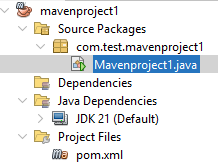
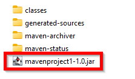
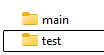
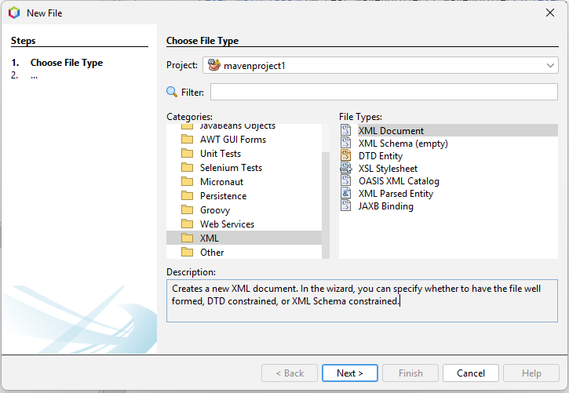

---
title: 5.03. Java
---

# 5.03. Java

## Как работает Java?

### История Java

**Язык программирования Java** — это **статически типизированный**, **объектно-ориентированный язык** **высокого уровня**, разработанный с целью обеспечения переносимости кода между различными аппаратными и программными платформами. Его ключевой принцип — «напиши один раз — запусти где угодно» (**Write Once, Run Anywhere, WORA**) — реализуется за счёт использования промежуточного байт-кода и виртуальной машины (JVM). 

В данном разделе рассматривается хронологическое развитие языка, его архитектурные особенности, мотивация создания и эволюция в контексте изменяющихся требований индустрии программного обеспечения.

В начале 1990-х годов корпорация Sun Microsystems (впоследствии приобретённая Oracle Corporation в 2010 году) столкнулась с задачей разработки программного обеспечения для новых категорий устройств — встраиваемых систем, интерактивного телевидения и бытовой электроники. Существующие языки программирования, такие как C и C++, не отвечали требованиям по безопасности, простоте распределённой разработки и переносимости. В этих условиях была инициирована внутренняя исследовательская программа под кодовым названием Green Project.

Руководство проектом было поручено команде во главе с Джеймсом Гослингом. Первоначально разрабатываемый язык получил название Oak (англ. «дуб»), однако из-за торговой марки был переименован в Java. Выбор нового названия был обусловлен маркетинговыми соображениями и не связан напрямую с техническими характеристиками языка.

Java была задумана как язык, сочетающий преимущества C++ (объектно-ориентированность, производительность) с упрощённым синтаксисом и повышенной безопасностью. Основные архитектурные решения, заложенные на ранних этапах:
1. Отсутствие указателей в явном виде. В отличие от C и C++, Java не предоставляет прямого доступа к памяти через указатели. Управление памятью осуществляется через автоматическую сборку мусора (garbage collection), что снижает вероятность ошибок, связанных с освобождением памяти (например, double-free или use-after-free).
2. Единая система типов. Все данные в Java делятся на примитивные типы (int, boolean, char и др.) и ссылочные типы (объекты, массивы). Примитивы не являются объектами, но поддерживают автобоксинг (autoboxing) при необходимости.
3. Объектно-ориентированная модель. Язык построен вокруг парадигмы ООП: всё, кроме примитивов, является объектом, наследующимся от базового класса Object. Поддерживается одиночное наследование классов, множественное наследование интерфейсов (с версии Java 8 — с возможностью дефолтных методов).
4. Байт-код и виртуальная машина. Исходный код компилируется не в машинный код, а в промежуточное представление — байт-код (bytecode), исполняемый на Java Virtual Machine (JVM). Это позволяет достичь платформенной независимости: один и тот же байт-код может выполняться на любой системе, где установлена совместимая JVM.
5. Строгая типизация и проверка типов во время компиляции. Компилятор Java проводит глубокий анализ типов, предотвращая большинство типовых несоответствий до момента выполнения программы.

Первая официальная версия — Java 1.0 — была выпущена в январе 1996 года. Она включала базовую библиотеку классов (java.lang, java.io, java.util), поддержку апплетов (applets), позволявших запускать Java-код в веб-браузерах и механизм событийной модели AWT (Abstract Window Toolkit) для графического интерфейса.

Особое внимание уделялось безопасности: апплеты выполнялись в песочнице (sandbox), ограничивающей доступ к файловой системе и сетевым ресурсам.

Версия Java 1.1 (1997) внесла значительные улучшения, добавив внутренние классы (inner classes), расширив API для отражения (reflection), улучшив модель обработки событий.

Java 1.2 (1998), получившая коммерческое название Java 2, стала поворотной точкой. Была объявлена концепция Java 2 Platform с тремя основными редакциями:
	- J2SE (Java 2 Standard Edition) — для настольных приложений;
	- J2EE (Java 2 Enterprise Edition) — для корпоративных решений;
	- J2ME (Java 2 Micro Edition) — для встраиваемых и мобильных устройств.
На этом этапе был внедрён Just-In-Time (JIT) компилятор, преобразующий байт-код в машинный код на лету, что значительно повысило производительность.

С выходом Java 5 (2004, внутренний номер 1.5) язык пережил кардинальную модернизацию. Ключевые нововведения - дженерики, аннотации, автоматическая упакова/распаковка, for-each, enums и высокоуровневые API для многопоточного программирования (пакет java.util.concurrent).
Java 6 (2006) и Java 7 (2011) в основном фокусировались на оптимизации JVM, улучшении производительности и расширении стандартной библиотеки (например, try-with-resources в Java 7).

Java 8 (2014), добавила элементы функционального программирования - лямбда-выражения, Stream API (декларативная обработка последовательностей данных), default и static методы в интерфейсах, новые API для работы с датой и временем (java.time), заменившие устаревшие Date и Calendar.
Эти изменения позволили повысить выразительность языка и снизить объем шаблонного кода, особенно в контексте обработки коллекций.

Java 9 (2017) представила систему модулей (Project Jigsaw), предназначенную для улучшения масштабируемости и управляемости крупных приложений. Модули позволяют явно декларировать зависимости и скрывать внутренние пакеты, усиливая инкапсуляцию.

Начиная с Java 9, Sun (а затем Oracle) перешла к модельному циклу выпуска, предполагающему выпуск новой версии каждые шесть месяцев. При этом только каждая шестая версия (например, Java 11, 17, 21) объявляется долгосрочной (LTS — Long-Term Support), получая поддержку в течение нескольких лет.

Такой подход позволяет быстрее внедрять новые возможности, но требует от разработчиков более внимательного управления зависимостями и политики обновлений.

Java сыграла ключевую роль в становлении современных подходов к разработке ПО. Её **виртуальная машина (JVM)** стала платформой не только для Java, но и для других языков — Scala, Kotlin, Groovy, Clojure. Это сделало JVM универсальной средой исполнения.

Язык широко используется в корпоративных приложениях, разработке Android-приложений, больших данных и серверных системах.


### Основы языка

★ **Java** – один из самых знаменитых объектно-ориентированных языков программирования, разработанный компанией Sun Microsystems, а нынче принадлежащий корпорации Oracle. 

После изучения этой главы обязательно почитайте документацию Java, через официальный сайт - https://docs.oracle.com/en/java/, а также OpenJDK - https://openjdk.org/. Может пригодится также https://metanit.com/java и рубрика Java на Хабре.

Чит-лист - https://cheatsheets.zip/java

Программы на Java транслируются в байт-код Java, выполняемый **виртуальной машиной Java – JVM**. Таким образом, процесс в Java таков:
1. Исходный код пишется программистом и сохраняется в формате .java;
2. Исходный код (.java) компилируется в байт-код (.class) с помощью javac;
3. JVM запускает байт-код и интерпретирует его построчно.
4. JIT-компиляция - часто используемые части кода компилируются в машинный код.
5. Процессор выполняет машинный код.

Упакованный исполняемый файл генерируется в формате **.jar**. Он включает в себя **.class** и **ресурсы**. 


Какие возможности предоставляет Java?
	- *писать программы, которые могут работать автономно, без необходимости переписывать логику под разные платформы*;
	- *создание игр, движков, IDE, утилит, билд-систем и других технически сложных продуктов*;
	- *строить сервисы, обрабатывающие тысячи запросов в секунду, такие как онлайн-магазины, платежные шлюзы, транспортные системы*;
	- *разрабатывать ERP, CRM, HRM, банковские системы, где важна надёжность и долгосрочная поддержка*;
	- *реализации бизнес-логики, алгоритмов обработки данных, аналитики, правил, проверок и других процессов, требующих точности и структуры*;
	- *обрабатывать большие объёмы информации благодаря оптимизациям JVM и богатым коллекциям*;
	- *создавать защищённые окружения для выполнения кода, особенно важное свойство в корпоративных и облачных системах*;
	- *выполнять несколько задач одновременно, используя все доступные ресурсы процессора*;
	- *взаимодействовать с базами данных, файлами, сетью, API, датчиками, внешними библиотеками*;
	- *разделение кода на модули, библиотеки, фреймворки, что позволяет строить сложные архитектуры с чёткими границами ответственности*;
	- *находить ошибки ещё на этапе компиляции, повышая надёжность и предсказуемость кода*;
	- *автоматическое освобождение памяти, что снижает риск утечек и ошибок управления ресурсами*.
	
```
Интересный факт:
В начале 90-х годов группа инженеров в Sun Microsystems начала проект под названием Green Project с целью создать язык для умных бытовых устройств. Но рынок электроники был не готов. И вместо этого они адаптировали язык под интернет, сделав его безопасным, в отличие от C++.

```

★ **Основные компоненты Java**:
	- JDK (Java Development Kit) – набор инструментов для разработки (компилятор, JVM, библиотеки);
	- JRE (Java Runtime Environment) – набор инструментов для запуска программ (JVM + стандартные библиотеки);
	- JVM (Java Virtual Machine) – виртуальная машина, выполняющая байт-код.
	- javac – компилятор, который превращает .java в .class.

★ **Синтаксис Java** отличается явным объявлением типов, а сам язык является объектно-ориентированным (углубимся позднее). Основные черты синтаксиса:

| Особенность | Пример |
|-----|---------|
|Объявление переменной	|`int age = 25;`
|Метод	|`public void greet() { System.out.println("Hello"); }`
|Условия	|`if (age > 18) { ... }`
|Циклы	|`for (int i = 0; i < 5; i++) { ... }`
|Классы и объекты	|`class Person { }, Person p = new Person();`
|Интерфейсы	|`interface Runnable { void run(); }`
|Обобщения	|`List<String> names = new ArrayList<>();`

Каждая программа на Java состоит из классов и методов. Минимальная программа на Java **должна** иметь **один класс** и **метод main**. Java требует, чтобы каждая программа была внутри класса. Имя файла должно совпадать с именем публичного класса.
```java
public class HelloWorld {
    public static void main(String[] args) {
        System.out.println("Привет, мир!");
    }
}
```

★ **Метод main** – точка входа в любую программу Java. Именно с него начинается выполнение программы. 

Синтаксис:
```java
public static void main(String[] args) {
    // код программы
}
```

Как можно заметить, у метода main есть ряд ключевых слов:
	- `public` – метод доступен извне;
	- `static` – метод может быть вызван без создания объекта;
	- `void` – не возвращает значение;
	- `String[] args` – параметры командной строки.

★ **Фреймворки в Java** – готовые архитектурные решения, которые упрощают разработку приложений. В Java существуют множество популярных фреймворков для разных задач:

| Название | Назначение |
|-----|---------|
|Spring	|Полный набор решений для enterprise-приложений (Spring Boot, Spring MVC, Spring Security, Spring Data и др.)
|Hibernate / JPA	|ORM (объектно-реляционное отображение), работа с БД
|Vaadin / JavaFX	|Разработка GUI-приложений
|Apache Struts / Play Framework	|Web-разработка
|Micronaut / Quarkus	|Легковесные фреймворки для микросервисов и облачных приложений
|JUnit / TestNG	|Юнит-тестирование
|Jakarta EE / Jakarta EE 9+	|Платформа для корпоративной разработки (ранее Java EE)

★ **Инструменты в Java** – специальные средства для разработки, сборки, тестирования и деплоя (развёртывания):

| Инструмент | Назначение |
|-----|---------|
|JDK (Java Development Kit)	|Комплект разработчика, включающий компилятор, JVM, библиотеки
|JRE (Java Runtime Environment)	|Среда выполнения, содержит JVM и стандартные библиотеки
|JVM (Java Virtual Machine)	|Виртуальная машина, которая выполняет Java-байткод
|IDE (IntelliJ IDEA, Eclipse, NetBeans)	|Интегрированные среды разработки
|Maven / Gradle	|Системы управления зависимостями и сборки проекта
|JUnit / Mockito	|Инструменты для тестирования
|SonarQube	|Анализ качества кода
|Docker / Kubernetes	|Контейнеризация и оркестрация микросервисов
|Tomcat / Jetty / WildFly	|Серверы приложений для запуска Java-веб-приложений

★ **Библиотеки в Java** – преднастроенные модули, расширяющие функциональность Java. Они могут быть частью JDK или сторонними.

Стандартные библиотеки (входят в JDK):

| Группа | Что включает |
|-----|---------|
|java.lang	|Базовые классы (Object, String, Math)
|java.util	|Коллекции (List, Map, Set), даты, генератор случайных чисел
|java.io / java.nio	|Работа с файлами и потоками
|java.net	|Работа с сетью
|java.time	|Новые даты и время (с Java 8+)
|javax.swing / java.awt	|Графические интерфейсы
|java.sql	|Работа с базами данных через JDBC

Примеры сторонних библиотек:

| Название | Назначение |
|-----|---------|
|Apache Commons	|Утилиты для работы со строками, коллекциями, IO и др.
|Guava (Google)	|Расширения стандартных возможностей
|Jackson / Gson	|Работа с JSON
|Log4j / SLF4J	|Логирование
|Lombok	|Автоматизация геттеров, сеттеров, конструкторов
|OkHttp / Retrofit	|HTTP-запросы
|RxJava	|Реактивное программирование
|Joda-Time	|Альтернатива java.util.Date (до Java 8)


★ **Сфера применения**

Java – универсальный язык, и применяется во множестве областей:

| Сфера | Примеры |
|-----|---------|
|Backend-разработка	|Серверные приложения, REST API, микросервисы
|Android-разработка	|Приложения для мобильных устройств
|Web-приложения	|Сервлеты, JSP, JSF, Spring MVC
|Корпоративные системы (Enterprise)	|Банки, страховые компании, ERP-системы
|Big Data & Analytics	|Apache Hadoop, Spark, Flink
|Научные вычисления и моделирование	|Распределённые вычисления, численные методы
|Игры	|Minecraft
|IoT (Интернет вещей)	|Устройства с ограниченными ресурсами, управление датчиками
|Облачные сервисы	|AWS, Google Cloud, Azure поддерживают Java-сервисы

Учитывая, что Java при появлении сразу сделал акцент на безопасности, за него сразу «ухватился» почти весь финансовый сектор, и поэтому в серьёзных организациях, в том числе сфере финтеха, можно встретить многолетние тонны кода на Java.

```
Интересный факт:
Изначально язык назывался Oak (Дуб) – в честь дерева, которое росло за окном Джеймса Гослинга, но позднее выяснилось, что Oak уже зарегистрирован торговой маркой другой компании. Название выбрали заново, прогуливаясь возле кафе – кто-то пил кофе «Ява», и название всплыло само собой – Java. 
```

## Структуры проекта

★ **Что такое пакет?**

**Пакетом (пространством имен)** в Java называется структура вложенных по какому-то признаку папок с размещенными в них классами (интерфейсами, перечислениями, аннотациями), необходимыми проекту. 

В Java используется **пакетная структура** – способ организации классов в папках, который помогает избежать конфликтов имён и группировать код логически. Это обязательная структура. Чтобы система понимала, что означает команда, указанная программистом в исходном коде в виде слова, нужно сообщить системе об использовании пакета, который содержит код-содержание этого слова:
```
«Дружище, налей мне молока!»
«А где мне взять молоко?».
```
Мы, люди, многие элементарные вещи уже изначально автоматизировали в себе и понимаем подсознательно. Мы прекрасно знаем, что молоко в холодильнике. Но программе нужно показать, что нам понадобится холодильник. Поэтому общение с программой будет как-то так:
```
«Дружище, запомни – вот холодильник. Там есть молоко».
«Дружище, налей мне молока!»
«Ок, вижу, молоко в холодильнике. Сейчас сделаю».
```
Вот поэтому код библиотеки или проекта формируется в составе **пакета (package)**.

Пакеты в проекте хранятся в строгой структуре:
	- com/mycompany/project/Main.java – физический путь;
	- com.mycompany.project – путь в коде.

**com** – корень пакета. Только строчные буквы. Это префикс домена, обычно обратный интернет-домен компании или проекта. Нужен для уникальности пакетов в мире. Можно указывать своё, но рекомендуется использовать стандарт:
	- com – для коммерческих проектов;
	- org – для открытых проектов;
	- net, io, ru – тоже допустимы.

**mycompany** – название компании или автора, допустим, имя (если проект личный). Желательно делать уникальным. Только строчные буквы, несмотря на то что это будет имя или название – допустим, не Timur, а timur.

**project** – название проекта или модуля, библиотеки, подсистемы. Допустим, calculator, utils или как-то так. Только строчные буквы, название может быть любым.

Современные Java-проекты используют системы сборки **Maven** и **Gradle**. Это инструменты, которые автоматизируют компиляцию кода, управление зависимостями (библиотеками), запуск тестов, создание готовых приложений и развёртывание (деплой).

★ **Как работает Maven?**

Конфигурация проекта хранится в файле **pom.xml (Project Object Model)**, это «сердце» проекта. 

pom.xml содержит:
	- метаданные (название, версия, автор);
	- зависимости (библиотеки);
	- плагины (для сборки, тестирования);
	- настройки профилей (dev, prod).


POM является базовым модулем Maven. Это специальный XML-файл, который всегда хранится в базовой директории проекта и называется pom.xml. Файл POM содержит информацию о проекте и различных деталях конфигурации, которые используются Maven для создания проекта.


Maven работает по жизненному циклу сборки проекта, который состоит из фаз. Каждая фаза представляет собой этап в процессе создания артефакта:
	- validate - проверяет корректность проекта и наличия необходимых данных;
	- compile - компилирует исходный код проекта;
	- test – запускает юнит-тесты;
	- package - упаковывает скомпилированный код в JAR/WAR/SO и т.д.;
	- verify - выполняет проверки после упаковки перед установкой;
	- install - устанавливает артефакт в локальное хранилище Maven;
	- deploy - передаёт артефакт в удалённый репозиторий (например, Nexus, Artifactory).

Можно вызвать одну из этих фаз через команды, к примеру:
```java
mvn compile        # компиляция
mvn package        # сборка артефакта
mvn install        # установка в локальный репозиторий
```
Файлы проекта распределены по строгой стандартной структуре:

| Путь | Назначение |
| :--- | :--- |
| `/Проект` | Общая папка проекта |
| `/Проект/pom.xml` | Главный конфигурационный файл (Maven) |
| `/Проект/src` | Директория, где хранится весь исходный код Java-проекта |
| `/Проект/src/main` | Основной код проекта |
| `/Проект/src/main/java` | Исходные файлы Java, организованные в пакетной структуре |
| `/Проект/src/main/java/com/mycompany/project` | Пример пакета в проекте |
| `/Проект/src/main/resources` | Ресурсы: конфигурационные файлы, локализация, изображения, CSS, JS и другие не-кодовые файлы |
| `/Проект/src/test` | Тестовый код, не включаемый в финальную сборку |
| `/Проект/src/test/java` | Тестовые классы (например, с использованием JUnit, TestNG) |
| `/Проект/src/test/resources` | Конфигурация и ресурсы, используемые при тестировании |
| `/Проект/target` | Каталог для автоматически генерируемых файлов (сборка, артефакты, временные файлы) |

★ **Артефакт в Maven** – это результат сборки проекта, например, JAR-файл, который содержит код, библиотеки, ресурсы и метаданные.

Каждый артефакт имеет уникальный идентификатор, состоящий из элементов:
	- groupId – com.example – организация или домен;
	- artifactId – my-app – имя проекта или библиотеки;
	- version – 1.0.0., 2.1.3-SNAPSHOT – версия.

Пример:
```xml
<dependency>
    <groupId>org.springframework.boot</groupId>
    <artifactId>spring-boot-starter-web</artifactId>
    <version>2.7.0</version>
</dependency>
```
Это будет ссылка на артефакт:
```
org.springframework.boot:spring-boot-starter-web:2.7.0
```
Артефакты бывают следующих видов:
	- .jar – обычные Java-библиотеки;
	- .war – веб-приложения;
	- .pom – описание проекта;
	- .aar – Android-библиотеки..

★ **Репозиторий** – это место, где хранятся артефакты. Они могут храниться локально (локальный репозиторий), в общедоступном репозитории Maven (центральный), и в удалённом (частном), для приватных артефактов.

При первом использовании зависимости Maven скачивает её из центрального репозитория, и сохраняет в локальный. При повторном использовании уже берёт из локального. То есть, добавляя зависимость в pom.xml, мы скачиваем и сохраняем локально в папку `~/.m2/repository`.

★ **Как работает Gradle?**

**Gradle** – система автоматической сборки, построенная с учетом принципов Maven, но предоставляющая дополнительные возможности на языках Groovy и Kotlin вместо традиционной XML-образной формы представления конфигурации проекта.

Принцип разделения на `src/main` и `src/test` аналогичен Maven, но конфигурация хранится в `build.gradle`, а не в `pom.xml`. Отличие есть в папке для автоматически сгенерированных файлов – в `Maven` они хранятся по пути `/target`, а в `Gradle` - `/build`.

Краткое сравнение Maven и Gradle

| Критерий | Maven | Gradle |
| :--- | :--- | :--- |
| Тип конфигурации | XML | Groovy/Kotlin DSL |
| Файл конфигурации | `pom.xml` | `build.gradle` |

Команды в Maven и Gradle

| Критерий | Maven | Gradle |
| :--- | :--- | :--- |
| Компиляция | `mvn compile` | `gradle compileJava` |
| Запуск тестов | `mvn test` | `gradle test` |
| Сборка JAR/WAR | `mvn package` | `gradle build` |
| Установка в локальный кэш | `mvn install` | `gradle publishToMavenLocal` |
| Очистка кэша | `mvn clean` | `gradle clean` |
| Запуск приложения | `mvn exec:java` | `gradle run` |
| Пропустить тесты | `mvn install -DskipTests` | `gradle build -x test` |
| Обновить зависимости | `mvn dependency:resolve` | `gradle dependencies` |
| Создать проект | `mvn archetype:generate` | `gradle init` |
| Показать список задач | `mvn help:describe` | `gradle tasks` |

Аналогичные секции в pom.xml и build.gradle

| Maven | Gradle |
| :--- | :--- |
| `<groupId>` | `group` |
| `<artifactId>` | Имя проекта (из `settings.gradle`) |
| `<version>` | `version` |
| `<properties>` | Переменные в `ext {}` |
| `<dependencies>` | `dependencies {}` |
| `maven-compiler-plugin` | `java.toolchain` |


## Первая программа на Java

```
Практическое задание
Выполните нижеследующее задание.
```

А теперь давайте немного попрактикуемся и посмотрим, как выглядит работа с Java. Пройдитесь и выполните все действия по алгоритму, но на каждом шаге старайтесь исследовать то, что на экране, чтобы понимать.

1. Установите Apache NetBeans и запустите (на рабочем столе будет ярлык).
2. Выберите «New Project» (или File – New Project).
3. Выберите «Java with Maven» (в списке шаблонов – Maven – Java Application).
4. Заполните сведения о проекте:
	- Project Name: mavenproject1 – можете задать своё имя;
	- Project Location – выберите папку, где будет храниться проект;
	- Project Folder – укажет путь к проекту;
	- Artifact Id – название проекта;
	- Group Id – название группы – назовите, с учётом правил, которые мы изучили выше, к примеру, назовём «com.test»;
	- Version – это будет версия, которая добавится к названию исполняемого файла и запишется в метаданные;
	- Package – опционально, по умолчанию будет groupId.projectName.
5. Проверьте всё и нажмите Finish – IDE подготовит проект.
6. В левой части окна будет структура проекта:



Если мы перейдём к папке с проектом, увидим следующее:


7. В правой части окна будет код со стандартным шаблоном:
```java
package com.test.mavenproject1;

public class Mavenproject1 {

    public static void main(String[] args) {
        System.out.println("Hello World!");
    }
}
```

8. Чтобы запустить проект, нужно нажать правой кнопкой мыши на проекте в структуре и выбрать «Run» или нажать зеленую кнопку на панели инструментов:


9. Если всё успешно – то в нижней части окна в панели Output будет полная информация о процессе сборки, и вывод исполнения команды. Наша программа просто должна вывести сообщение «Hello World!», и это мы можем увидеть именно там:


10. Если переименовать проект или изменить свойства без рефакторинга, может быть ошибка в панели Output – и если ошибка говорит о том, что не может найти main class (который и нужен для запуска), то нужно исправить pom.xml и пересобрать проект. Там указывается то, что мы заполняли в пункте 4.

11. Сборка проекта выполняется через кнопку с иконкой молотка на панели инструментов, или через правую кнопку мыши на проекте и «Build» (построить проект), «Clean and Build» (с очисткой). Успешная сборка показывает в Output «BUILD SUCCESS».

12. Исполняемый файл будет только после сборки, в папке «target»:




Усложним задачу – теперь добавим юнит-тест к нашему проекту.

13. Начинаем с добавления зависимости в pom.xml. Мы хотим добавить JUnit, поэтому в элемент `<project>`, после `<properties>`, добавляем `<dependencies>`:
```xml
<project xmlns="http://maven.apache.org/POM/4.0.0" xmlns:xsi="http://www.w3.org/2001/XMLSchema-instance" xsi:schemaLocation="http://maven.apache.org/POM/4.0.0 http://maven.apache.org/xsd/maven-4.0.0.xsd">
    <modelVersion>4.0.0</modelVersion>
    <groupId>com.test</groupId>
    <artifactId>mavenproject1</artifactId>
    <version>1.0</version>
    <packaging>jar</packaging>
    <properties>
        <project.build.sourceEncoding>UTF-8</project.build.sourceEncoding>
        <maven.compiler.release>21</maven.compiler.release>
        <exec.mainClass>com.test.mavenproject1.Mavenproject1</exec.mainClass>
    </properties>
    <dependencies>
        <dependency>
            <groupId>org.junit.jupiter</groupId>
            <artifactId>junit-jupiter</artifactId>
            <version>5.10.0</version>
            <scope>test</scope>
        </dependency>
    </dependencies>
</project>
```
Нас интересует:
	- groupId - org.junit.jupiter;
	- artifactId - junit-jupiter;’
	- version - 5.10.0 (можно, конечно, и новее);
	- scope – test (это означает, что библиотека будет доступна только при тестировании).

14. Не забываем сохранять файлы после завершения создания или редактирования. Теперь нам нужно создать класс для теста. NetBeans автоматически создаёт папку `src/test/java` при сохранении pom.xml, но если этого не произошло – создаём через ПКМ по проекту и «New» - «Folder». Для интереса, эту структуру можно воссоздать и через файловую систему, создав «матрёшку» из папок – «`\src\test\java\com\test\mavenproject1`»:




Мы получим в структуре «Test Packages»:


15. Создадим новый файл, через ПКМ на Test Packages – назовём его `AppTest.java`:
	- New – Java Class;
	- Class Name – AppTest;
	- Location – Test Packages.

16. Откроем новый файл и добавим туда код:
```java
package com.test.mavenproject1;

import static org.junit.jupiter.api.Assertions.*;
import org.junit.jupiter.api.Test;

public class AppTest {
    @Test
    public void testHelloWorldOutput() {
        String expected = "Hello World!";
        String actual = HelloWorld.getMessage();
        assertEquals(expected, actual);
    }
}
```
Что здесь произошло:
	- package – наш пакет;
	- import – импортируемая библиотека JUnit;
	- @Test – аннотация, что здесь у нас тест;
	- public void testHelloWorldOutput() – метод для тестирования – именно в нём мы можем проверить поведение программы, допустим, вынеся логику из Main;
	- String expected – переменная ожидаемого результата, то есть, что должно быть;
	- String actual – переменная фактического результата, то есть, что вышло в итоге;
	- assertEquals – expected сравнивается на равенство с actual.

Но нам понадобится изменить и основной класс.

17. В `Mavenproject1.java` вносим изменения, чтобы сделать основной класс тестируемым:
```java
package com.test.mavenproject1;

public class Mavenproject1 {

    public static void main(String[] args) {
        System.out.println(HelloWorld.getMessage());
    }
}
```

Здесь мы указываем, что System.out.println выведет не прямо указанный тут текст Hello World!, а именно то, что значение надо получить через getMessage() из класса HelloWorld. Но этого класса у нас нет – нужно создать.

18. Создаём новый класс HelloWorld.java в Source Packages и добавляем туда код:
```java
package com.test.mavenproject1;

public class HelloWorld {
    public static String getMessage() {
        return "Hello World!";
    }
}
```
Это и есть метод getMessage() который возвращает значение «Hello World». Это простой пример, как один класс может не содержать в себе нужную информацию, а получить из другого класса, но с условием – метод публичный – именно поэтому мы добавляем public к классу и методу – так работает инкапсуляция. Собственно, метод getMessage() и будет тестироваться.

19. Чтобы запустить тесты, нужно нажать ПКМ на проекте и выбрать «Test» или ПКМ на AppTest.java и выбрать «Test File»:


20. В окне Output мы увидим результаты тестов:


И ещё одна тренировка. Добавим логирование. Используем Apache Log4j 2.

21. Как и в прошлый раз, добавим в `pom.xml` зависимости для нашего логирования:
```xml
 <dependency>
     <groupId>org.apache.logging.log4j</groupId>
     <artifactId>log4j-api</artifactId>
     <version>2.24.3</version>
 </dependency>
 <dependency>
     <groupId>org.apache.logging.log4j</groupId>
     <artifactId>log4j-core</artifactId>
     <version>2.24.3</version>
 </dependency>
```

22. В директории `src/main/` создаём папку `resources`, а в ней – файл с названием «`log4j2.xml`», с следующим содержимым:
```xml
<?xml version="1.0" encoding="UTF-8"?>
<Configuration status="INFO">
    <Appenders>
        <Console name="Console" target="SYSTEM_OUT">
            <PatternLayout pattern="%d{yyyy-MM-dd HH:mm:ss} [%t] %-5level %logger{36} - %msg%n"/>
        </Console>
    </Appenders>
    <Loggers>
        <Root level="debug">
            <AppenderRef ref="Console"/>
        </Root>
    </Loggers>
</Configuration>
```
Файл можно создать через New – Other – XML – XML Document:



Внимательно с названием папки и файла – строго как указано выше:


Как можно понять из содержимого, этот файл создаёт конфигурацию для вывода логов в консоль с определённым форматом по шаблону в PatternLayout.

23. Внесём изменения в `HelloWorld.java`:
```java
package com.test.mavenproject1;

import org.apache.logging.log4j.LogManager;
import org.apache.logging.log4j.Logger;

public class HelloWorld {
    private static final Logger logger = LogManager.getLogger(HelloWorld.class);
    
    public static String getMessage() {
        logger.info("getMessage() вызван – это лог!");
        return "Hello World!";
    }
}
```
Здесь мы импортировали пакеты log4j через import, создали логирование – приватная переменная-метод logger, и в наш метод getMessage() к имеющейся логике добавили логирование с выводом текста.

24. Проверим работу через тест или просто запустив через Run:


В окне вывода мы увидим INFO – и текст по формату, как мы указали в xml-файле конфигурации, а также текст, который мы ввели в logger.info().

Так можно логировать важные действия в процессе работы.

25. Если столкнулись с ошибками в коде HelloWorld.java, значит некорректно подключена конфигурация, либо нужно перезагрузить проект через ПКМ по проекту – Reload Project – в этот момент происходит обновление всех компонентов проекта, в том числе пакетов. Если и обновление не помогло – можно выполнить Build with Dependencies, чтобы собрать билд с учётом зависимостей.


Этого пока достаточно. Если вы успешно проделали это шаги, вы:
	- ознакомились с IDE NetBeans;
	- настроили pom.xml;
	- успешно собрали и запустили программу;
	- подключили пакеты и добавили JUnit;
	- написали модульный тест (юнит-тест);
	- добавили логирование при помощи Log4j.

Но это запуск программы через IDE.

Так, у нас есть программа. Как её запустить вне IDE? Ответ – настроить Maven.
1. Добавляем в pom.xml новый тег `<build>`:
```xml
    <build>
        <plugins>
            <plugin>
                <groupId>org.apache.maven.plugins</groupId>
                <artifactId>maven-shade-plugin</artifactId>
                <version>3.5.0</version>
                <executions>
                    <execution>
                        <phase>package</phase>
                        <goals>
                            <goal>shade</goal>
                        </goals>
                        <configuration>
                            <transformers>
                                <transformer implementation="org.apache.maven.plugins.shade.resource.ManifestResourceTransformer">
                                    <mainClass>com.test.mavenproject1.Mavenproject1</mainClass>
                                </transformer>
                            </transformers>
                        </configuration>
                    </execution>
                </executions>
            </plugin>
        </plugins>
    </build>
```
Это конфигурация для Maven.

2. Переходим на сайт `maven.apache.org` и скачиваем архив с maven:


3. Создадим для себя папку для разработки (обычно создают что-то вроде `C:\devtools`) и распакуем Maven туда. Пример пути:
```
C:\devtools\apache-maven-3.9.9.
```
4. Добавим переменную окружения:
На примере Windows
```
- Система 
– Дополнительные параметры системы 
– Переменные среды 
– найти PATH 
– Изменить 
– и добавить C:\devtools\apache-maven-3.9.9\bin.
```
Это нужно, чтобы терминал понимал, что за «mvn» мы пишем. Для проверки можно открыть командную строку и написать `mvn --version`, и, если версия отобразится – значит всё сделали правильно.

5. Скачиваем и устанавливаем Java SE Development Kit – скачать можно с официального сайта - `oracle.com/th/java/technologies/downloads/`
При установке запоминаем путь, куда устанавливается JDK – к примеру, `C:\Program Files\Java\jdk-24\`

6. Проверяем, есть ли переменная среда JAVA_HOME и равна ли она `C:\Program Files\Java\jdk-24\` (так система будет понимать, где JDK).
К слову, другие IDE, допустим, IDEA, как раз просят показать, где находится JDK и предоставляют удобные инструменты для конфигурации Maven.

7. Теперь можно гарантированно работать с Maven даже через командную строку. Переходим к папке проекта и в командной строке вводим «mvn clean package» для сборки проекта.
После сборки мы получаем файл в папке с проектом – к примеру, «`mavenproject1\target\mavenproject1-1.0.jar`».

8. Проверяем, есть ли Java на компьютере – вводим java -version в командной строке, и, если видим информацию – значит, всё готово к работе.

9. Переходим в командной строке к папке с проектом и вводим команду:
```bash
java -jar target/mavenproject1-1.0.jar
```
Таким образом мы даём команду запустить исполняемый файл и видим наши логи и Hello World!

Именно так и работает принцип – программа запускается не напрямую, а через JVM – система запускает Java, и запускает исполняемый файл. Можно, конечно, собрать exe или bat, к примеру, который выполнит команду по запуску файла jar, или использовать специальные менеджеры, вроде JBoss.


## Знаки препинания

Два важных вопроса, которые мучают начинающих программистов:
1. Когда использовать кавычки двойные (`"`), одинарные (`'`), а когда апострофы (`’`)?
2. Когда использовать точки (`.`), запятые (`,`) и точку с запятой (`;`)?

Строки всегда в двойных кавычках:
```java
String text = "Hello world";
```
Символы (char) — в одинарных:
```java
char c = 'A';
```
Апострофы (`’`) — не используются, только `'`.
Не путайте `'` и `’` — последний может вызвать ошибку компиляции.
Точка (`.`) : используется для обращения к методам и полям:
```java
System.out.println("Hello");
```
Запятая (`,`) : разделяет параметры методов и элементы при объявлении массивов:
```java
int[] numbers = {1, 2, 3};
public void print(int a, int b)
```
Точка с запятой (`;`) : обязательна после каждой инструкции:
```java
int x = 5;
System.out.println(x);
```
Важно: Пропуск точки с запятой приведёт к ошибке компиляции.

Нижние подчеркивания в Java не так часто встретишь.

`_name` не рекомендуется по стандарту (Google Java Style Guide). Приватные поля обычно camelCase: `logger`, а не `_logger`. Некоторые фреймворки (например, Spring), могут конечно такое использовать, но это анти-паттерн в чистом Java.

`__` вообще не используется.

Java поддерживает `_` в числах как разделитель:
```java
int million = 1_000_000;
```
`_` нельзя использовать как имя переменной в Java.

Символы «`|`» и «`||`» в JavaScript, C#, Java, C++ и Kotlin использутся в общем порядке:
`|` — это побитовое `ИЛИ` (`bitwise OR`).

К примеру, `метод(значениеА | значениеБ)`;

В условиях это логическое ИЛИ, но без сокращённого вычисления.

`if (методА() | методБ())` - вызовет и методА, и методБ, даже если методА - true.

```java
if (a() | b()) { ... } // оба вызовутся
```

`||` - логическое ИЛИ (с сокращённым вычислением), можно назвать исключающим.
допустим return `a || b` - если a true, то b не вернется/не вычислится.
```java
if (a() || b()) { ... } // b() — только если a() == false
```

## Типы данных в Java

★ **Тип данных** определяет, какие значения может хранить переменная, сколько памяти она занимает, и какие операции можно с ней выполнять. Мы ещё не раз подчеркнём, что Java – **статически типизированный** язык, и поэтому тип переменной указывается при объявлении и не может меняться.

Типы бывают следующие:
	- **примитивные типы** – базовые типы, встроенные в язык;
	- **ссылочные типы (объектные)** – классы, интерфейсы, массивы, перечисления и т.д.

### Примитивные типы данных

★ **Примитивные типы данных**:

| Тип | Размер | Диапазон | Использование |
| :--- | :--- | :--- | :--- |
| `byte` | 1 байт | от -128 до 127 | для экономии памяти |
| `short` | 2 байта | от -32 768 до 32 767 | меньше, чем `int` |
| `int` | 4 байта | ±2 миллиарда | целые числа по умолчанию |
| `long` | 8 байт | ±9 квадриллионов | для больших чисел, литералы с суффиксом `L` (например, `100L`) |
| `float` | 4 байта | приблизительные числа с плавающей точкой | для вещественных чисел, литералы с суффиксом `F` (например, `100F`) |
| `double` | 8 байт | большая точность, чем `float` | вещественные числа по умолчанию |
| `boolean` | — | `true` или `false` | логические значения (булево) |
| `char` | 2 байта | символы в кодировке Unicode | хранение символов |

### Число

Число (int, double, и др.). 

Примитивные числовые типы: byte, short, int, long, float, double. Не имеют методов, хранятся в стеке.

Простой пример:
```java
int age = 30;
```
Сложный пример:
```java
double monthlyPayment = loanAmount * 
    (monthlyInterestRate * Math.pow(1 + monthlyInterestRate, months)) / 
    (Math.pow(1 + monthlyInterestRate, months) - 1);
```
Здесь мы видим расчёт ежемесячного платежа по кредиту по формуле аннуитета. Используются математические функции (Math.pow), арифметические операции и переменные, ранее вычисленные. Результат — значение типа double.

### Булево

Булево (boolean). 

Примитивный тип, принимающий true или false. Используется в условиях, циклах.

Простой пример:
```java
boolean isActive = true;
```
Сложный пример:
```java
boolean isEligible = age >= 18 && 
                     hasValidLicense && 
                     !violations.isEmpty() && 
                     violations.stream().noneMatch(v -> v.isSerious());
```
Проверка eligibility (право на участие) включает несколько условий, включая анализ списка нарушений через Stream API. Используется термин noneMatch для проверки отсутствия серьёзных нарушений.

### Ссылочные типы данных

★ **Ссылочные типы данных** – это объекты.

Примеры:
```java
String name = "Alice"; // строка
Person person = new Person(); // объект класса
List<String> names = new ArrayList<>(); // коллекция
int[] numbers = {1, 2, 3}; // массив
```

Ссылочные типы не имеют фиксированного размера, могут быть равны null, передаются по ссылке. Размер динамический, зависит от объекта, однако и производительность чуть ниже.

### Строка

Строка (String). 

Неизменяемый (immutable) ссылочный тип. Класс java.lang.String.

Простой пример:
```java
String name = "Тимур";
```
Сложный пример:
```java
String message = String.format(
    "Пользователь %s (%s) вошёл %tF в %<tR.%nБаланс: %.2f ₽.",
    user.getName(),
    user.getRole(),
    new Date(),
    user.getBalance()
);
```
Форматированная строка с использованием String.format, включающая дату, время, имя, роль и баланс. Символ %< позволяет повторно использовать предыдущий аргумент (дата), что делает форматирование более эффективным.

### Объект

Объект (Object, class). 

Все объекты в Java — экземпляры классов. Наследуют от Object.

Простой пример:
```java
Person person = new Person("Иван", 28);
```
Сложный пример:
```java
List<Person> adults = people.stream()
    .filter(p -> p.getAge() >= 18)
    .map(p -> new Person(
        p.getFirstName().toUpperCase(), 
        p.getLastName().toUpperCase(), 
        p.getAge()
    ))
    .collect(Collectors.toList());
```
Используется Stream API для фильтрации и преобразования списка людей. При этом создаются новые экземпляры Person с изменёнными данными (в верхнем регистре). Демонстрирует функциональный подход в императивном языке.

### Массив

Массив (array). 

Фиксированной длины упорядоченная коллекция одного типа. Хранится в куче.

Простой пример:
```java
int[] numbers = {1, 2, 3};
```
Сложный пример:
```java
int[][] matrix = new int[rows][cols];
for (int i = 0; i < rows; i++) {
    for (int j = 0; j < cols; j++) {
        matrix[i][j] = i * cols + j + 1;
    }
}
```
Двумерный массив инициализируется по формуле, зависящей от индексов. Результат — матрица с последовательными числами. Показывает работу с многомерными структурами.

### Метод

Метод (method). 

Функции в Java — методы классов. Не существуют вне контекста класса.

Простой пример:
```java
public String greet(String name) {
    return "Привет, " + name + "!";
}
```
Сложный пример:
```java
public Optional<Double> calculateAverage(List<Integer> values) {
    return values == null || values.isEmpty() 
        ? Optional.empty() 
        : Optional.of(values.stream().mapToDouble(Integer::doubleValue).average().orElse(0.0));
}
```
Метод возвращает `Optional<Double>` — безопасный способ представления возможного отсутствия значения. Использует Stream API для вычисления среднего арифметического. Это современный подход, избегающий null.

### Прочие типы и операции с ними

**Расширение (widening)** – неявное (автоматическое) преобразование значения из меньшего типа данных в больший, без потери информации.
```
byte → short → int → long → float → double
```

Пример:
```java
int i = 100;
long l = i;      // int → long (расширение)

float f = l;     // long → float (тоже расширение)
double d = f;    // float → double
```

Таблица расширения типов:

| Исходный тип | Целевой тип |
| :--- | :--- |
| `byte` | `short`, `int`, `long`, `float`, `double` |
| `short` | `int`, `long`, `float`, `double` |
| `char` | `int`, `long`, `float`, `double` |
| `int` | `long`, `float`, `double` |
| `long` | `float`, `double` |
| `float` | `double` |


**Сужение (narrowing)** требует явного приведения типов ((int) myDouble) и может привести к потере данных, в отличие от расширения, которое безопасно (данные не теряются):
```java
double d = 123.456;
int i = (int) d; // 123 — дробная часть отброшена
```

★ **Массивы в Java** – структуры данных, хранящие элементы одного типа под одним именем. 

Объявление и инициализация массивов может быть как отдельно:
```java
int[] numbers;           // объявление
numbers = new int[5];    // выделение памяти
```
…так и в одной строке:
```java
int[] numbers = {1, 2, 3, 4, 5};
//или
int[] numbers = new int[]{1, 2, 3, 4, 5};
```
Обращение к элементам массива идёт как обычно – они нумеруются с нуля:
```java
int[] nums = {10, 20, 30};
System.out.println(nums[0]); // выводит 10
nums[1] = 25;                // изменение значения
```
Элементы массива можно перебирать при помощи циклов:
```java
for:

for (int i = 0; i < nums.length; i++) {
    System.out.println(nums[i]);
}

for-each:

for (int num : nums) {
    System.out.println(num);
}
```
Но к циклам мы ещё вернёмся.


## Основные элементы Java

★ **Пакеты** группируют классы по смыслу для удобства структурирования и предотвращения коллизий имён. 

Пример:
```java
package com.myapp.model;
```
★ **Классы** – шаблоны (чертежи), которые описывают свойства и поведение (методы);

Класс создаётся по общему принципу, как мы изучили в примере в главе по ООП:
```java
public class Car {
    // Свойства (поля)
    String brand;
    int year;

    // Метод
    void startEngine() {
        System.out.println(brand + " engine started");
    }
}
```

★ **Объект** – конкретный экземпляр класса.
Объект создаётся так:
```java
Person person = new Person(); // объект
```
Упрощённо:
```java
Класс имяПеременной = new Класс(); // объект
```
★ **Интерфейсы** - абстрактные карты поведения, которую должны реализовать классы через ключевое слово interface для объявления и implements для использования:
```java
interface Flyable {
    void fly();
}

class Bird implements Flyable {
    public void fly() {
        System.out.println("Раскрываем крылья...");
    }
}
```
★ **Конструкторы** – методы, вызываемые при создании объекта. Используются для инициализации состояния:
```java
class Animal {
    Animal(String name) {
        System.out.println("Animal constructor: " + name);
    }
}

class Cat extends Animal {
    Cat(String name) {
        super(name); // вызов конструктора родителя
        System.out.println("Cat constructor");
    }
}
```
★ **Свойства (поля класса)** – это переменные, объявленные внутри класса, но вне методов. Поля бывают следующих видов:
	- *локальные переменные* – объявлены внутри метода, недоступны за его пределами;
	- *поля класса (члены класса)* – доступны всем методам класса;
	- *статические поля (static)* – принадлежат самому классу, а не объекту.

★ **Методы** – блоки кода, которые можно вызывать по имени, позволяя повторно использовать логику. Они бывают с параметрами (указываются в скобках), и без возвращаемого значения (void):
```java
public class Calculator {
    // Метод с параметрами и возвращаемым значением
    public int add(int a, int b) {
        return a + b;
    }

    // Метод без возвращаемого значения (void)
    public void printMessage(String message) {
        System.out.println(message);
    }
}
```
Методы могут быть переружены и переопределены.

★ **Перегрузка методов (overloading)** – это несколько методов с одним именем, но разными параметрами (по количеству, типу или порядку):
```java
public class MathUtils {
    public int add(int a, int b) {
        return a + b;
    }

    public double add(double a, double b) {
        return a + b;
    }

    public int add(int a, int b, int c) {
        return a + b + c;
    }
}
```
Выше приведён пример, где есть три метода add, но с разной сигнатурой – имя+список параметров. Возвращаемое значение не учитывается.

★ **Переопределение методов (overriding)** – подкласс предоставляет свою реализацию метода, который уже определён в родительском классе. При этом используется аннотация `@Override`. Чтобы переопределить метод, он должен быть public или protected. Пример:
```java
class Animal {
    public void makeSound() {
        System.out.println("Издать какой-то звук");
    }
}

class Dog extends Animal {
    @Override
    public void makeSound() {
        System.out.println("Гав!");
    }
}
```
Но к этому мы вернёмся позднее.

★ **Переменные** – это именованные хранилища данных определённого типа:
```java
int age = 30;
String name = "Тимур";
double price = 9.99;
boolean isStudent = true;
```
Java – статически типизированный язык, то есть, тип переменной указывается при объявлении и не может меняться.

У каждой переменной есть область видимости, и зависит от того, где объявлена:

| Где объявлена? | Область видимости |
| :--- | :--- |
| Внутри метода | Доступна внутри метода |
| Внутри блока кода `{}` | Только внутри этого блока |
| Как поле класса | Доступна во всём классе и других методах |

Поэтому, если переменную нужно будет использовать во всем классе, нужно объявить её как поле класса ещё до методов, которые будут с ней работать. Если же это переменная, которая нужна для определенной задачи в методе – то объявляется она внутри.

Пример:
```java
public class ScopeExample {
    int classLevelVar = 10; // Поле класса — доступно всем методам

    void method() {
        int methodVar = 20; // Доступна только в этом методе

        if (true) {
            int blockVar = 30; // Доступна только внутри if
        }
        // System.out.println(blockVar); Ошибка: переменная недоступна
    }
}
```

## Операторы и циклы в Java

Операторы можно разделить на несколько видов:

| Тип | Примеры |
| :--- | :--- |
| **Арифметические** | `+` — сложение, `-` — вычитание, `*` — умножение, `/` — деление, `%` — остаток от деления |
| **Сравнения** | `==` — равно, `!=` — не равно, `>` — больше, `<` — меньше, `>=` — больше или равно, `<=` — меньше или равно |
| **Логические** | `!` — отрицание (NOT), `&` — конъюнкция (AND), `&#124;` — дизъюнкция (OR), `^` — исключающее ИЛИ (XOR), `&&` — сокращённая конъюнкция, `&#124;&#124;` — сокращённая дизъюнкция, `~` — побитовое дополнение (NOT) |
| **Присваивания** | `=`, `+=`, `-=`, `*=`, `/=` |
| **Тернарный** | `условие ? значение_если_истина : значение_если_ложь` |
| **Условные операторы** | `if-else`, `switch` |
| **Прочие** | `++` — инкремент (увеличение на 1), `--` — декремент (уменьшение на 1), `//` — однострочный комментарий, `/* */` — многострочный комментарий |

Важно:

Для примитивных типов (например, int, double) оператор `==` сравнивает значения.

Для объектов (например, строк или пользовательских классов) оператор `==` сравнивает ссылки на объекты, то есть их физическое местоположение в памяти.

Чтобы сравнить содержимое объектов, используется метод `.equals()`.

В Java есть методы, которые выполняют функции, аналогичные операторам:
	- `.equals()` — аналог оператора == для сравнения содержимого объектов.
	- `.compareTo()` — используется для сравнения строк или объектов, реализующих интерфейс Comparable;
	- `Math.addExact()` , `Math.subtractExact()` , `Math.multiplyExact()` — аналоги операторов `+`, `-`, `*`, но с проверкой на переполнение. Если результат выходит за пределы допустимых значений, выбрасывается исключение ArithmeticException;
	- `Integer.bitCount()` — подсчитывает количество единиц в двоичном представлении числа. Аналогично работе с битовыми операциями (`&`, `|`, `^`);
	- `Objects.equals()` — безопасный способ сравнения двух объектов, который обрабатывает null. Если оба объекта равны null, метод вернёт true;
	- `Integer.parseInt()` , `Double.parseDouble()` — аналоги операторов приведения типов (например, (int)).

Класс **Object** — базовый для всех классов в Java. Он определяет поведение, доступное каждому объекту. 

Основные методы:
	- `equals(Object obj)` — сравнение объектов на логическое равенство
	- `hashCode()` — возвращает хеш-код объекта
	- `toString()` — строковое представление объекта
	- `getClass()` — возвращает объект Class, представляющий тип в рантайме
	- `clone()` — создает копию объекта (если поддерживает Cloneable)
	- `finalize()` — вызывается перед сборкой мусора (устарел и не рекомендуется)
	- `wait()`, `notify()`, `notifyAll()` — методы для межпоточной синхронизации.

★ **Условия (условные операторы)** управляют потоком выполнения программы, позволяют выполнять разный код, в зависимости от выполнения определённого условия.

**if-else (если/иначе)**.

Синтаксис:
```java
if (условие) {
    // выполняется, если условие истинно
} else {
    // выполняется, если условие ложно
}
```
Пример:
```java
int age = 18;
if (age >= 18) {
    System.out.println("Вы совершеннолетний");
} else {
    System.out.println("Вы несовершеннолетний");
}
```
**switch** позволяет выбрать одно из нескольких возможных направлений выполнения программы. 

Синтаксис:
```java
switch (выражение) {
    case значение1:
        // код
        break;
    case значение2:
        // код
        break;
    default:
        // код по умолчанию
}
```
Пример:
```java
int day = 3;
switch (day) {
    case 1 -> System.out.println("Понедельник");
    case 2 -> System.out.println("Вторник");
    case 3 -> System.out.println("Среда");
    default -> System.out.println("Неизвестный день");
}
```
★ **Циклы** позволяют выполнять блок кода несколько раз.

**for (для)** используется, когда известно количество повторений.

Синтаксис:
```java
for (инициализация; условие; обновление) {
    // тело цикла
}
```
Пример:
```java
for (int i = 0; i < 5; i++) {
    System.out.println("i = " + i);
}
```
**while (пока)** проверяет условие перед каждой итерацией.

Синтаксис:
```java
while (условие) {
    // тело цикла
}
```
Пример:
```java
int i = 0;
while (i < 5) {
    System.out.println("i = " + i);
    i++;
}
```
**do-while (делать, пока)**, выполняется хотя бы один раз, даже если условие ложно.

Синтаксис:
```java
do {
    // тело цикла
} while (условие);
```
Пример:
```java
int j = 0;
do {
    System.out.println("j = " + j);
    j++;
} while (j < 5);
```

## Принципы ООП в Java

Java – язык ООП, организованный вокруг объектов, а не только функций и логики.

### Инкапсуляция

★ **Инкапсуляция** скрывает внутреннюю реализацию объекта и предоставляет контролируемый доступ через методы – геттеры и сеттеры:
```java
public class Person {
    private String name; // приватное поле

    public String getName() { // геттер
        return name;
    }

    public void setName(String name) { // сеттер
        this.name = name;
    }
}
```

Внешний код может взаимодействовать с name только через методы getName() и setName().

Инкапсуляция — это механизм объединения данных (переменных) и методов, работающих с этими данными, в одном классе, с ограничением прямого доступа к внутренним компонентам объекта. В Java инкапсуляция достигается с помощью модификаторов доступа (private, protected, public), а также через предоставление публичных методов для чтения и изменения значений полей.

### Наследование

★ **Наследование** – один класс (потомок/подкласс) может наследовать поля и методы другого класса (предка/суперкласса):
```java
class Animal {
    void makeSound() {
        System.out.println("Какой-то звук");
    }
}

class Dog extends Animal {
    @Override
    void makeSound() {
        System.out.println("Гав!");
    }
}
```
Dog имеет доступ ко всем public и protected членам Animal, и наследуется через ключевое слово extends, а @Override – это переопределение метода makeSound(), который уточняет, что за звук издаст собака.

Наследование — это механизм ООП, позволяющий создавать новый класс на основе уже существующего. Новый класс (подкласс) получает все свойства и методы родительского класса (суперкласса), что обеспечивает повторное использование кода и упрощает поддержку. 

Наследование реализуется с помощью ключевого слова extends. Подкласс может расширять или переопределять поведение суперкласса, а также добавлять новые поля и методы. Важно помнить, что в Java класс может наследоваться только от одного суперкласса.

### Полиморфизм

★ **Полиморфизм** – объект может принимать много форм, и один интерфейс может использоваться для представления разных типов:
```java
Animal myPet = new Dog();
myPet.makeSound(); // Гав!
```
myPet – это класс Animal, но ссылается на объект типа Dog – это динамический полиморфизм.

### Абстракция

★ **Абстракция** – скрывает сложную реализацию и предоставляет простой интерфейс:
```java
abstract class Vehicle {
    abstract void startEngine();
}

class Car extends Vehicle {
    void startEngine() {
        System.out.println("Двигатель машины заведён!");
    }
}
```
Класс Vehicle абстрагирует детали запуска двигателя, оставляя подклассам реализацию.

Абстракция — это принцип ООП, который позволяет выделять в программе только значимые характеристики объекта, скрывая внутренние детали реализации. В Java абстракция достигается через абстрактные классы и интерфейсы. 

Абстрактный класс может содержать как реализованные, так и абстрактные (без реализации) методы, задавая общий шаблон для подклассов. Интерфейс определяет набор методов, которые класс обязан реализовать. 

Абстракция упрощает взаимодействие с объектами, повышает гибкость и снижает связанность кода, концентрируя внимание на "что делает" объект, а не "как он это делает".


## Прочие особенности языка Java

### Анонимные классы

★ **Анонимный класс** – это локальный внутренний класс без имени, который создаётся и используется сразу при объявлении. Он используется для реализации интерфейсов или абстрактных классов на лету, к примеру, при использовании слушателей событий, например, в GUI или коллбэках. 

Пример:
```java
interface Greeting {
    void sayHello();
}

public class Main {
    public static void main(String[] args) {
        Greeting greet = new Greeting() {
            public void sayHello() {
                System.out.println("Hello from anonymous class!");
            }
        };

        greet.sayHello();
    }
}
```
Другой пример:
```java
button.addActionListener(new ActionListener() {
    public void actionPerformed(ActionEvent e) {
        System.out.println("Clicked!");
    }
});
```
Таким образом, анонимный класс — это безымянный внутренний класс, объявляемый и создающийся в момент использования.

### Varargs

Varargs – методы с переменным числом аргументов. 

★ **Методы с переменным числом аргументов (varargs)** принимают произвольное количество аргументов одного типа. 

Пример:
```java
public void printNumbers(int... numbers) {
    for (int num : numbers) {
        System.out.println(num);
    }
}
```
Вызов:
```java
printNumbers(1, 2, 3);
printNumbers();
printNumbers(new int[]{1, 2, 3});
```
То есть, varargs это в нашем случае numbers, который должен быть последним параметром в списке аргументов метода.

### final 

**final** – неизменяемость полей, методов и классов.

Если переменная объявлена как final, её значение нельзя изменить после инициализации.
```java
final double PI = 3.14159;
PI = 3.14; // Ошибка компиляции
```
Для ссылочных типов нельзя изменить саму ссылку, но можно изменить состояние объектов:
```java
final List<String> list = new ArrayList<>();
list.add("Hello"); // правильно
list = new ArrayList<>(); // неправильно
```
★ Метод, помеченный как final, нельзя переопределять в подклассе.
```java
class Parent {
    final void doNotOverride() {
        System.out.println("This method cannot be overridden");
    }
}

class Child extends Parent {
    void doNotOverride() { } // Ошибка
}
```
Класс, объявленный как final, нельзя наследовать:
```java
final class FinalClass { }

class SubClass extends FinalClass { } // Ошибка
```

### this и super 

this и super – работа с контекстом класса.

Ключевое слово this ссылается на текущий объект, может вызывать другой конструктор в том же классе – this(…);

this — это ссылка на текущий объект внутри его нестатического метода или конструктора. 

Она используется, чтобы
	- сослаться на поля класса, если локальные переменные или параметры метода имеют такое же имя;
	- вызвать другой конструктор в том же классе;
	- передать текущий объект как аргумент другому методу или объекту.

Ключевое слово super ссылается на объект родительского класса, вызывает конструктор или метод родителя – super(…), как в примере выше.

### Автоупаковка и автораспаковка

★ **Автоупаковка (Autoboxing)** – автоматическое преобразование значения типа-примитива (int, double, boolean) в соответствующий ему объект класса-обёртки (Integer, Double, Boolean).

Пример:
```java
Integer number = 10; // int → Integer (автоупаковка)
```
Компилятор сам вызовет следующее:
```java
Integer number = Integer.valueOf(10);
```
★ **Автораспакова (Unboxing)** – обратный процесс: автоматическое преобразование объекта класса-обёртки в примитивный тип. Пример:
```java
Integer age = 25;
int primitiveAge = age; // Integer → int (автораспаковка)
```
Компилятор сам вызывает:
```java
int primitiveAge = age.intValue();
```
Это используется в методах, принимающих или возвращающих обёртки, и при работе с коллекциями вроде:
```java
List<Integer> numbers = new ArrayList<>();
numbers.add(5); // автоупаковка int → Integer

int x = numbers.get(0); // автораспаковка Integer → int
```
Но к коллекциям мы вернёмся позднее.

### Безымянные пакеты

★ **Безымянные пакеты**. Пакеты содержат дополнительные возможности, для использования которых нужно добавлять их в код. Кроме того, как можно было заметить выше, в начале кода всегда была строчка:
```java
package com.test.mavenproject1
```
Но что, если её не будет?

В таком случае (без строки package) класс автоматически попадает в безымянный (default, по умолчанию) пакет. Все классы без указания package находятся в одном общем безымянном пакете. Это удобно для простых примеров или тестирования, но в реальных проектах так делать нельзя – должен быть порядок. Для организации структуры проекта всегда нужно группировать всё по пакетам, и особенно если может быть конфликт имён. Современные IDE даже ругаются (запрещают) компилировать классы из безымянного пакета в модульных проектах (к примеру, Java Platform Module System).

Из безымянного пакета импортировать данные нельзя, следовательно, если будет класс:
```java
public class Calculator {
    public int add(int a, int b) {
        return a + b;
    }
}
```
…то как бы мы ни пытались:
```java
import Calculator; //Ошибка
import .Calculator; //Тоже ошибка
```
Поэтому, импорт будет работать только с именованными пакетами, а класс должен быть в каком-то конкретном пакете.

Классы, находящиеся в одном пакете, могут обращаться друг к другу без использования оператора import – то есть видят друг друга напрямую. Если в разных пакетах – без импорта не обойтись.

### Методы по умолчанию в интерфейсах

**Методы по умолчанию (Default Methods)** в интерфейсах появились в Java 8, и позволяют добавлять реализацию по умолчанию в интерфейс, не нарушая совместимость.

Пример:
```java
interface Logger {
    default void log(String message) {
        System.out.println("Log: " + message);
    }
}
```

### Популярные библиотеки для разных задач

1. Работа с JSON - Jackson, Gson, JSON-P (javax.json).
2. ORM (Работа с базами данных) - Hibernate, JPA (Java Persistence API), MyBatis, Spring Data JPA, PostgreSQL JDBC Driver, MySQL Connector/J.
3. Логирование - SLF4J (Simple Logging Facade for Java), Logback, Log4j 2, java.util.logging.
4. API и HTTP-клиенты - OkHttp, Apache HttpClient, Retrofit, Spring WebClient, RestTemplate.
5. Маппинг объектов - MapStruct, ModelMapper.
6. Кэширование - Ehcache, Caffeine, Spring Cache.
7. Обработка временных ошибок - Resilience4j, Hystrix.
8. Аутентификация и авторизация - Spring Security, Keycloak, JWT (io.jsonwebtoken).
9. Генервация документации API - Swagger/OpenAPI (springdoc-openapi), Swagger-Core.
10. Тестирование - JUnit 5, TestNG, Mockito, AssertJ, Spring Test.
11. Обработка файлов - Apache Commons CSV, Apache POI, Thumbnailator, iText.
12. Работа с очередями и сообщениями - RabbitMQ Java Client, Spring AMQP, Kafka Clients.
13. Работа с электронной почтой - JavaMail API, Spring Mail.
14. Шифрование и безопасность - BouncyCastle, javax.crypto.
15. Работа с фоновыми задачами - Quartz Scheduler, Spring Batch.
16. Работа с WebSocket - javax.websocket, Spring WebSocket.
17. Работа с HTML и парсинг - Jsoup, HtmlUnit.
18. Микросервисы - Spring Cloud, Netflix Eureka, Consul.
19. Работа с графами - GraphQL Java, DGS Framework.
20. Работа с конфигурацией - Spring Boot Configuration, Typesafe Config.
21. Работа с датами и временем - java.time, Joda-Time.
22. Работа с командной строкой - Apache Commons CLI, Picocli.


## Исключения

★ **Исключения** – это события, которые нарушают нормальное выполнение программы. Она может внезапно прекратить работу из-за ошибок в коде, некорректного ввода данных, сбоя в системе и т.д.

Все исключения в Java – это объекты, которые происходят от класса Throwable.

Throwable включает в себя Error и Exception.

Exception включает в себя RuntimeException (unchecked) и checked exceptions.

| Тип | Примеры | Обязательная обработка |
| :--- | :--- | :--- |
| **Error** | `OutOfMemoryError`, `StackOverflowError` | Нет |
| **Checked Exceptions** | `IOException`, `SQLException` | Да |
| **Unchecked Exceptions (RuntimeException)** | `NullPointerException`, `ArrayIndexOutOfBoundsException` | Нет |

Error – серьёзные проблемы, не подлежащие обработке приложением. К примеру, сбой JVM. Эти ошибки не нужно и не рекомендуется перехватывать.
Checked Exceptions – проверяемые исключения, которые компилятор требует обработать явно - либо через try-catch, либо через throws, к примеру FileNotFoundException (файл не найден), SQLException (ошибка SQL). 

Пример:
```java
public void readFile() throws IOException {
    FileReader reader = new FileReader("file.txt");
}
```
Если метод может выбросить проверяемое исключение, его нужно объявить с ключевым словом throws или обработать внутри метода.

Unchecked Exceptions – непроверяемые исключения, которые являются производными от RuntimeException – компилятор их не проверяет, поэтому можно не обрабатывать – NullPointerException, ArithmeticException, ArrayIndexOutOfBoundsException. Пример:
```java
int result = 10 / 0; // выбросит ArithmeticException
```
Эти исключения обычно сигнализируют о логических ошибках в коде, и их лучше предотвращать, чем обрабатывать.

Способы для обработки исключений:
1. try-catch-finally – блок для перехвата и обработки исключения, по логике «попробуй так, и если поймаешь это, то делай так, и в итоге делай всегда ещё вот так»:
```java
try {
    int[] arr = new int[5];
    System.out.println(arr[10]); // ArrayIndexOutOfBoundsException
} catch (ArrayIndexOutOfBoundsException e) {
    System.out.println("Ошибка: выход за границы массива");
} finally {
    System.out.println("Этот блок выполнится всегда");
}
```
finally используется для освобождения ресурсов, например, закрытие файла или соединения.

2. try-with-resources – автоматически закрывает ресурсы, реализующие интерфейс AutoCloseable:
```java
try (FileReader reader = new FileReader("file.txt")) {
    int data = reader.read();
} catch (IOException e) {
    e.printStackTrace();
}
```
3. throws указывает, что метод может выбросить исключение, и ответственность за его обработку передаётся вызывающему коду:
```java
public void readData() throws IOException {
    FileReader reader = new FileReader("data.txt");
}
```
Вызывающий код либо сам обрабатывает исключение:
```java
try {
    readData();
} catch (IOException e) {
    e.printStackTrace();
}
```
Либо пробрасывает дальше:
```java
public static void main(String[] args) throws IOException {
    readData(); // опасно!
}
```
Чем выше поднимается исключение, тем сложнее обрабатывать. Лучше обрабатывать ближе к источнику ошибки - работа с ошибками - огромная часть функций разработчиков.

Можно использовать инструменты Java и создавать свои классы исключений, расширяя Exception или RuntimeException:
```java
public class InvalidAgeException extends Exception {
    public InvalidAgeException(String message) {
        super(message);
    }
}
// или

public class ValidationException extends RuntimeException {
    public ValidationException(String message) {
        super(message);
    }
}
```
Использование:
```java
public void checkAge(int age) throws InvalidAgeException {
    if (age < 0) {
        throw new InvalidAgeException("Возраст не может быть отрицательным");
    }
}
```


## Работа с БД

В Java работа с БД строится на основе следующих основных концепций:
	- JDBC (Java Database Connectivity) – низкоуровневый API, позволяющий подключаться к любым СУБД через JDBC-драйверы;
	- ORM (Object Relational Mapping) – фреймворки, которые связывают объекты Java с таблицами в БД;
	- SQL Frameworks – обёртки над JDBC, упрощающие работу с SQL без полной абстракции ORM;
	- Spring Data / Spring Boot – популярный экосистемный подход к работе с БД в enterprise-приложениях.

JDBC позволяет выполнять SQL-запросы, управлять соединением, извлекать и изменять данные. JDBC включает в себя следующие компоненты:
	- DriverManager — управляет драйверами и соединениями.
	- Connection — устанавливает соединение с БД.
	- Statement / PreparedStatement — выполняют SQL-запросы.
	- ResultSet — содержит результаты выборки.

Процесс работы с БД можно описать универсальным алгоритмом:
1. Создать или выбрать БД, определить СУБД, таблицы, поля, связи и ограничения.
2. Добавить JDBC-драйвера (для каждой СУБД соответствующий):
	- MySQL - mysql-connector-java;
	- PostgreSQL - postgresql;
	- SQLite - sqlite-jdbc;
	- Oracle - ojdbc.

В Maven/Gradle это делается через зависимость.

3. Настроить параметры подключения – указать адрес сервера, имя базы данных, логин, пароль и другие параметры, если требуется. Эти параметры обычно хранятся в конфигурационном файле (application.properties или application.yml), особенно если используется Spring.

4. Установка подключения к базе данных – нужно открыть соединение с БД, проверить состояние перед началом работы – с помощью DriverManager.getConnection(url, user, password) или пула соединений (например, HikariCP).

5. Формирование и выполнение запросов – использовать:
	- Statement или PreparedStatement для выполнения SQL-запросов;
	- ResultSet для чтения результатов SELECT;
	- Методы executeUpdate() для INSERT, UPDATE, DELETE.

6. Обработка результатов – извлечение данных, преобразование их в нужные объекты Java, обработка возможных исключений.

7. Закрыть ресурсы - ResultSet, Statement, Connection.


Hibernate - один из самых популярных ORM-фреймворков для Java. Он предоставляет мощный набор инструментов для работы с реляционными базами данных.

Hibernate поддерживает JPA (Java Persistence API), автоматическую генерацию SQL-запросов, ленивую загрузку (lazy loading) и кэширование, а также поддержку сложных запросов через HQL (Hibernate Query Language).

Применяется Hibernate в корпоративных приложениях (Spring Framework), проектах с высокими требованиями к производительности и масштабируемости.

JPA - стандартный API для работы с ORM в Java. Hibernate является одной из реализаций JPA. Здесь используется унифицированный подход к работе с БД, и заметна простота использования благодаря аннотациям. Применяется в проектах, где важна совместимость между различными ORM.


## JVM, память и потоки

★ **JVM – виртуальная машина**, которая загружает, интерпретирует и выполняет байт-код. Она обеспечивает платформенную независимость. Разные ОС имеют разные реализации JVM, но байт-код остаётся одинаковым.

**JIT (Just-In-Time) компилятор** — это компонент JVM, который компилирует байт-код в машинный код непосредственно во время выполнения программы, а не до старта приложения. Его задача — улучшить производительность, оптимизируя код, исходя из реальных условий работы программы. 

JIT компилирует только те части кода, которые реально исполняются, и может применять различные оптимизации для ускорения работы приложения.

 Это позволяет сочетать гибкость интерпретируемого байт-кода и производительность нативного кода.
 
JVM делит память на несколько логических частей (областей):
	- Куча (Heap) – хранение объектов Java;
	- Стек (Stack) – хранение локальных переменных и вызовов методов;
	- Metaspace / PermGen – хранение метаданных классов, методов, полей;
	- PC Register – указывает текущую выполняемую инструкцию для каждого потока;
	- Native Method Stack – для выполнения native-методов (например, C/C++).


★ **Куча** – это основная область памяти для хранения объектов. Управление памятью здесь осуществляется сборщиком мусора (Garbage Collector). 

Куча делится на:
	- Young Generation (Eden, Survivor);
	- Old Generation.

Таким образом, создавая объект через new, объект создаётся в куче.

У каждого потока есть свой собственный стек. Стек содержит локальные переменные и вызовы методов (в виде фреймов). После выхода из метода стек автоматически очищается. К примеру, создавая метод и переменную внутри метода, переменная будет храниться в стеке.

**Пул строк** — это специальная область памяти в heap, где хранятся уникальные строковые литералы. При создании строки через String s = "hello", JVM проверяет, есть ли уже такая строка в пуле. Если есть, то возвращается ссылка на существующий объект, если нет, то создаётся новый и добавляется в пул.

Это экономит память и ускоряет сравнение строк с помощью ==, так как строки из пула имеют одинаковую ссылку. Для добавления строки в пул вручную используют метод intern().

★ **Metaspace** заменил PermGen в Java 8+. Хранит описание классов, статические данные и методы. Располагается в native-памяти, а не в куче. В отличие от PermGen, Metaspace может динамически расширяться.

Java автоматически управляет выделением и освобождением памяти через **сборщик мусора (Garbage Collector)**. Когда объект становится недостижим (нет ссылок на него), он помечается как «мусор». И GC периодически освобождает память.

Таким образом, объект проходит свой жизненный цикл.

★ **Жизненный цикл объекта**:
1. Создание: new Object();
2. Использование: вызов методов, работа с полями;
3. Неиспользуемый: нет активных ссылок;
4. Кандидат на удаление: GC помечает его;
5. Удалён: память освобождается.

Когда выполняется какое-то действие, оно выполняется в потоке. Java поддерживает многопоточность – способность выполнять несколько потоков одновременно. Это обеспечивает повышение производительности (особенно на многоядерных процессорах), улучшение пользовательского опыта (фоновые задачи), эффективную обработку параллельных задач.

★ **Как создать поток?**
Есть два основных способа – наследование от Thread и реализация Runnable:

1. Наследование от Thread:
```java
class MyThread extends Thread {
    public void run() {
        System.out.println("Поток запущен");
    }
}

MyThread t = new MyThread();
t.start(); // запускает новый поток
```
2. Реализация Runnable:
```java
class MyRunnable implements Runnable {
    public void run() {
        System.out.println("Поток запущен");
    }
}

Thread t = new Thread(new MyRunnable());
t.start();
```
Предпочтительнее использовать Runnable, так как это позволяет разделить логику и поток.

Таким образом, благодаря многопоточности, мы можем использовать несколько ядер, а приложения не будут зависать во время долгих операций.

Потоки тоже имеют свой жизненный цикл из состояний:
	- New – создан, но ещё не запущен;
	- Runnable – готов к выполнению или уже выполняется;
	- Blocked / Waiting – ожидает завершения другого потока или блокировки;
	- Timed Waiting – ожидает ограниченное время (например, sleep());
	- Terminated – завершил работу.

При работе с общими ресурсами могут возникнуть проблемы: гонки данных, неконсистентность состояния. Решение – синхронизация.
Синхронизированный метод:
```java
public synchronized void increment() {
    count++;
}
```
Синхронизированный блок:
```java
synchronized (lockObject) {
    count++;
}
```
Синхронизировать можно класс - synchronized(MyClass.class), при этом блокировка класса влияет на все экземпляры этого класса.

А можно объект - synchronized(this).

**Важно**: Поток — это не процесс. Процесс имеет собственное адресное пространство, тогда как поток делит память с другими потоками. Потоки переключаются быстрее, но поток зависит от процесса.

**Java Memory Model (JMM)** — это набор правил, определённых в спецификации языка Java, которые описывают как потоки видят изменения переменных, сделанные другими потоками, когда изменения в памяти одного потока становятся видимыми другим и в каком порядке операции чтения/записи могут быть переупорядочены (компилятором, JVM, процессором).

У каждого потока есть своя локальная копия переменных (в кэше CPU или регистрах), все работают напрямую с общей оперативной памятью. Без JMM один поток может изменить переменную, а другой — никогда не увидеть это изменение, потому что читает старое значение из своего кэша. JMM решает эту проблему, давая гарантии согласованности при многопоточной работе.

Без модели памяти программы вели бы себя по-разному на разных платформах (Intel, ARM и т.д.), оптимизации компилятора могли бы сломать логику и невозможно было бы писать надёжные многопоточные приложения. JMM даёт предсказуемость: если правильно использовать synchronized, volatile, final, java.util.concurrent, то программа будет работать одинаково на всех JVM.

**Видимость (Visibility)** подразумевает, что изменение переменной в одном потоке должно становиться видимым другим потокам.
```java
// Без volatile — второй поток может никогда не увидеть изменения!
volatile boolean flag = false;

// Поток 1
flag = true;

// Поток 2
while (!flag) {
  // Может выполняться вечно, если нет volatile!
}
```
volatile гарантирует, что запись в переменную сразу попадает в основную память, а чтение всегда идёт из основной памяти, а не из кэша.

**Упорядоченность (Ordering)** это следующий аспект JMM. Компилятор и процессор могут переупорядочивать операции для оптимизации. Но JMM говорит: некоторые операции нельзя переставлять без потери корректности. Пример:
```java
int a = 0;
boolean ready = false;

// Поток 1
a = 42;           // 1
ready = true;     // 2 ← может быть выполнено ДО 1!

// Поток 2
if (ready) {
  System.out.println(a); // Может вывести 0 вместо 42!
}
```
Решение: использовать synchronized, volatile, или happens-before связи.

happens-before - ключевое понятие в JMM. Говорят, что операция A happens-before операции B — значит, A гарантированно видна и упорядочена перед B.

Примеры happens-before:
	- Внутри одного потока: код выполняется по порядку.
	- При выходе из synchronized блока → все изменения видны тому, кто войдёт в этот блок.
	- Запись в volatile переменную happens-before чтения этой переменной.
	- Запуск потока: действия в родительском потоке happen-before старту дочернего.
	- Завершение потока: его действия happen-before .join() в другом потоке.

Это механизм, который делает многопоточный код предсказуемым.

Похожий механизм есть в C# - называется он **.NET Memory Model**, поддерживает volatile, lock, Interlocked, MemoryBarrier. Также есть happens-before -подобные правила.


## Коллекции в Java

★ **Коллекции в Java** – сложный инструмент для работы с данными, который позволяет хранить, обрабатывать и манипулировать группами объектов.
Collection — это интерфейс в java.util, который задаёт общий контракт для всех коллекций, хранящих группы объектов. Через него определяются ключевые операции: добавление и удаление элементов, проверка их наличия, очистка коллекции, получение размера и итерация. 

Основные реализации — List, Set и Queue. 

Сам интерфейс не потокобезопасен, но его можно обернуть в синхронизированную версию через Collections.synchronizedCollection() или использовать классы из java.util.concurrent. Collection работает с дженериками, что обеспечивает типобезопасность и упрощает работу с элементами.

Важно помнить, что Map не наследуется от Collection, так как представляет пары ключ–значение и имеет свою иерархию.

**Collection** – корневой интерфейс, представляющий собой группу элементов (объектов). Он определяет базовые операции над набором данных: добавление, удаление, проверка наличия, размер и т.д.

Данных бывает много, и в памяти их как-то надо структурировать.

Упорядочить – вывод списка пользователей в том порядке, в котором они регистрировались (ArrayList, LinkedHashMap).

Исключать дубликаты – например, загрузка данных из разных источников и удаление повторяющихся записей (HashSet, LinkedHashSet).

Сортировать – рейтинг игроков, сортировка товаров по цене (TreeSet, TreeMap).

Хранить пары «ключ-значение» - кэширование результатов вычислений, например (HashMap, TreeMap).

Работать с очередями и приоритетами – обработка задач в фоновых потоках (PriorityQueue, Deque).

Коллекции активно используются в веб-приложениях, бизнес-логике (валидация, фильтрация), алгоритмах (поиск, сортировка), параллелизме (concurrent коллекции).

У этого интерфейса есть основные подынтерфейсы:
	- **List** – упорядоченная коллекция с дубликатами;
	- **Set** – неупорядоченная колелкция без дубликатов;
	- **Queue** – очередь, используется для обработки элементов по принципу FIFO (First In, First Out, первый зашел - первый вышел);
	- **Deque** – двусторонная очередь.
	- **Map** не является частью иерархии Collection, но часто рассматривается вместе с ними.

**List** – упорядоченные списки. Реализует интерфейс `List<E>`. Поддерживает индексацию и дублирование элементов. Существуют реализации через ArrayList, LinkedList, Vector.

**ArrayList** – реализован на основе динамического массива (Array – это массив). Имеет быстрый доступ по индексу, медленную вставку/удаление в середине. 
Пример:
```java
List<String> list = new ArrayList<>();
list.add("Java");
```
**LinkedList** – реализован как двусвязный список. Быстрая вставка/удаление, медленный доступ по индексу. Пример:
```java
List<Integer> numbers = new LinkedList<>();
numbers.add(10);
```
**Vector (устаревший)** – похож на ArrayList, но синхронизированный, медленнее из-за блокировок. В современных приложениях вместо Vector используют Collections.synchronizedList() или CopyOnWriteArrayList. Пример:
```java
List<String> legacyList = new Vector<>();
```
**Set** – набор уникальных элементов. Интерфейс `Set<E>` гарантирует отсутствие дубликатов. Существуют реализации через HashSet, LinkedHashSet, TreeSet.

**HashSet** хранит элементы в неопределённом порядке, использует хеш-таблицу, обладает быстрой вставкой, поиском и удалением. Пример:
```java
Set<String> set = new HashSet<>();
set.add("Apple");
```
**LinkedHashSet** сохраняет порядок вставки элементов. Это комбинация HashSet и связанного списка. Пример:
```java
Set<String> orderedSet = new LinkedHashSet<>();
orderedSet.add("First");
```
**TreeSet** хранит элементы в отсортированном порядке, реализован на основе красно-чёрного дерева. Пример:
```java
Set<Integer> sortedSet = new TreeSet<>();
sortedSet.add(5);
```

**Map** – словарь (ключ и значение). Ключи уникальны.

**HashMap** – самая популярная реализация Map, позволяет один null в качестве ключа и несколько null в значениях, однако не гарантирует порядка. 

Пример:
```java
Map<String, Integer> map = new HashMap<>();
map.put("one", 1);
```
**TreeMap** – реализован на основе красно-чёрного дерева. Хранит пары в отсортированном по ключам порядке. Пример:
```java
Map<String, Integer> sortedMap = new TreeMap<>();
sortedMap.put("banana", 2);
```
**Hashtable** – устаревшая, синхронизированная версия HashMap. Не позволяет использовать null в ключах и значениях. Вместо Hashtable лучше использовать ConcurrentHashMap или Collections.synchronizedMap(). Пример:
```java
Map<String, String> legacyMap = new Hashtable<>();
legacyMap.put("key", "value");
```
**LinkedHashMap** сохраняет порядок вставки элементов и полезен, когда нужно сохранять историю изменений. Пример:
```java
Map<String, String> history = new LinkedHashMap<>();
history.put("first", "start");
```
**Queue – очереди**. Они предназначены для обработки элементов по принципу FIFO (First In – First Out). Бывают как PriorityQueue или Deque.
PriorityQueue – элементы извлекаются в порядке приоритета (по значению или с помощью компаратора). Не поддерживает null. Пример:
```java
Queue<Integer> queue = new PriorityQueue<>();
queue.offer(3);
queue.poll(); // 3 (если минимальный)
```
**Deque (Double Ended Queue)** – можно добавлять или удалять элементы с обоих концов. Реализуется через ArrayDeque или LinkedList. Пример:
```java
Deque<String> deque = new ArrayDeque<>();
deque.push("first");
deque.pop();
```
Давайте теперь разберём, когда что использовать.

| Тип | Когда использовать | Пример |
| :--- | :--- | :--- |
| **ArrayList** | Нужен быстрый доступ по индексу | Список пользователей, список товаров в корзине |
| **LinkedList** | Частые вставки или удаления в начале или середине | Реализация очереди, стека, история действий (undo/redo) |
| **HashSet** | Нужны уникальные элементы, порядок не важен | Проверка уникальности email, фильтрация дубликатов из базы данных |
| **LinkedHashSet** | Нужна уникальность и сохранение порядка вставки | История посещённых страниц, удаление дубликатов с сохранением порядка |
| **TreeSet** | Нужен отсортированный набор | Рейтинг игроков, очередь задач с приоритетом |
| **HashMap** | Обычный словарь, скорость важнее порядка | Кэширование объектов по ключу, хранение параметров конфигурации |
| **LinkedHashMap** | Нужен порядок вставки | Лог-файл с записями в порядке добавления, кэш LRU (Least Recently Used) |
| **TreeMap** | Нужен отсортированный словарь | Рейтинг студентов, поиск значений в диапазоне (например, дат) |
| **PriorityQueue** | Нужна очередь с приоритетом | Система обслуживания в банке, планировщик задач |
| **Vector / Hashtable** | Устаревшие, лучше избегать в новых проектах | Поддержка устаревшего кода, многопоточные приложения без современных альтернатив |


Все коллекции имеют общие методы, но не все реализации поддерживают все операции. Давайте соберём важнейшие:
	- `add(E e)` добавляет элемент в коллекцию, используется в List, Set, Queue, для Set игнорирует дубликаты.
	- `remove(Object o)` удаляет указанный элемент, используется во всех коллекциях, возвращает true, если элемент был найден.
	- `contains(Object o)` проверяет наличие элемента, использует equals() и hashCode().
	- `containsKey()` и `containsValue()` проверет наличие элемента для Map;
	- `get(int index)` получает элемент по индексу, используется только в List, причем в ArrayList – делает быстро, в LinkedList – медленно.
	- `put(K key, V value)` добавляет пару ключ-значение, используется в Map, перезаписывает значение, если ключ уже есть.
	- `get(Object key)` получает значение по ключу, используется в Map, возвращает null, если ключ не найден.
	- `poll()` извлекает и удаляет первый элемент, используется в Queue, Deque, возвращает null, если очередь пуста.
	- `offer(E e)` добавляет элемент в очередь, используется в Queue, возвращает false, если не удалось добавить.
	- `peek()` возвращает, но не удаляет первый элемент, используется в Queue, полезно для проверки перед извлечением.

Примеры:
```java
// ArrayList
List<String> list = new ArrayList<>();
list.add("Java");
list.add(0, "Hello"); // вставка в начало
System.out.println(list.get(1)); // Java

// HashSet
Set<Integer> uniqueNumbers = new HashSet<>();
uniqueNumbers.add(1);
uniqueNumbers.add(1); // дубликат игнорируется
System.out.println(uniqueNumbers.contains(1)); // true

// HashMap
Map<String, Integer> scores = new HashMap<>();
scores.put("Alice", 90);
System.out.println(scores.get("Alice")); // 90

// PriorityQueue
Queue<Integer> queue = new PriorityQueue<>();
queue.offer(5);
queue.offer(3);
System.out.println(queue.poll()); // 3 (минимальный элемент)
```

## JavaServer Faces

★ **JavaServer Faces (JSF)** – серверный фреймворк с открытым исходным кодом, предназначенный для построения пользовательских интерфейсов для веб-приложений на основе Java. Он следует паттерну MVC (Model-View-Controller) и предоставляет:
	- компонентную модель UI;
	- поддержку событий;
	- управление состоянием;
	- конвертацию и валидацию данных.

JSF работает по принципу жизненного цикла запроса, который состоит из следующих фаз:
	- Restore View – восстановление представления (UI);
	- Apply Request Values – обработка значений из запроса;
	- Process Validations – проверка корректности введённых данных;
	- Update Model Values – обновление модели (бина);
	- Invoke Application – вызов бизнес-логики;
	- Render Response – отправка ответа клиенту (рендеринг страницы).

Все эти фазы управляются FacesServlet, который является контроллером MVC.

★ **Сервлеты (Servlets)** — это Java-классы, которые обрабатывают HTTP-запросы и формируют HTTP-ответы на стороне сервера. Они работают внутри сервлет-контейнера (например, Tomcat), расширяя функциональность веб-сервера. Обычно используются для создания динамического контента, например, генерации HTML на лету или обработки форм. Сервлет реализует интерфейс javax.servlet.Servlet (чаще через HttpServlet) и переопределяет методы вроде doGet(), doPost(). Их жизненный цикл включает три ключевых этапа: инициализация (init() ), обработка запроса (service()/doX() ), уничтожение (destroy() ).

Сервлет обрабатывает HTTP-запросы, выполняет логику и генерирует динамический контент (например, HTML, JSON). Пример:
```java
@WebServlet("/hello")
public class HelloServlet extends HttpServlet {
    protected void doGet(HttpServletRequest request, HttpServletResponse response) {
        // Генерация ответа
    }
}
```
JSF использует FacesServlet как точку входа вместо обычного сервлета.

**JSP (JavaServer Pages)** – технология создания динамических веб-страниц на основе HTML с внедрением Java-кода. Но начиная с JSF 2.0 рекомендуется использовать Facelets, а не JSP.

**Facelets** – современный механизм шаблонизации для JSF. Он поддерживает XHTML-файлы, компоненты JSF (`<h:inputText>`, `<h:commandButton>` и т.д.), шаблоны (`<ui:insert>`, `<ui:define>`), перезапись частей страницы без полной перезагрузки.
Рендеринг – процесс преобразования JSF-компонентов в HTML, который отправляется браузеру клиента. JSF использует рендереры, связанные с каждым компонентом, чтобы определить, как тот должен отображаться. Пример:
```html
<h:inputText value="#{user.name}" />
<!-- Рендерится как <input type="text" name="..." /> -->
```
Facelets использует набор тегов для построения UI. Основные пространства имён:
	- http://java.sun.com/jsf/html (h:) - HTML-компоненты;
	- http://java.sun.com/jsf/core (f:) - ядро JSF (конвертеры, валидаторы, события);
	- http://java.sun.com/jsp/jstl/core (c:) - JSTL (условия, циклы и т.д.);
	- http://java.sun.com/jsf/facelets (ui:) - шаблонизация.

Рассмотрим типы тегов.

Теги для текстовых полей:
	- `<h:inputText>` - однострочное текстовое поле;
	- `<h:inputTextarea>` - многострочное поле (textarea);
	- `<h:inputSecret> `- поле для ввода пароля (скрытый ввод).

В теге `<h:inputText>` могут быть и атрибуты, к примеру, required="true" указывает, что поле обязательно к заполнению, а requiredMessage="..." это сообщение об ошибке, которое выводится, если поле не заполнено.

Пример:
```html
<h:inputText value="#{user.login}" />
<h:inputSecret value="#{user.password}" />
<h:inputTextarea value="#{user.description}" />
<h:inputText value="#{user.email}" required="true"
             requiredMessage="Пожалуйста, введите email" />
```
Теги для конвертации используются для преобразования типов:
	- `<f:convertDateTime>` - преобразование даты и времени;
	- `<f:convertNumber>` - преобразование чисел (формат валюты, процентов и т.д.);
	- `<f:converter>` - кастомный конвертер.

Пример:
```html
<h:outputText value="#{now}">
    <f:convertDateTime pattern="dd/MM/yyyy HH:mm" />
</h:outputText>
```

Тег `<h:form>` используется для создания HTML-формы, которая может взаимодействовать с JSF. Обеспечивает передачу данных на сервер, поддерживает AJAX-запросы через `<f:ajax>`, и обязателен для всех JSF-вводных компонентов.

Пример:
```html
<h:form>
    <h:inputText value="#{user.name}" />
    <h:commandButton value="Отправить" action="#{user.save}" />
</h:form>
```
**Событие** – это действие, происходящее в приложении, например, нажатие кнопки, выбор элемента, изменение значения поля. В JSF есть несколько типов событий:
	- ActionEvent – при нажатии на кнопку или ссылку;
	- ValueChangeEvent – при изменении значения поля;
	- PhaseEvent – на каждой фазе жизненного цикла запроса.

**Класс-слушатель** – это объект, который ожидает наступления события и реагирует на него. Можно реализовать интерфейсы: ActionListener, ValueChangeListener, PhaseListener. 

Пример:
```java
public class MyActionListener implements ActionListener {
    public void processAction(ActionEvent event) {
        System.out.println("Кнопка нажата!");
    }
}
```
Так, JSF нужен для чистого разделения логики и представления, переиспользования UI-элементов, динамического обновления части страницы (благодаря поддержке AJAX), автоматической проверки и преобразования данных, упрощения создания сложных UI, и поддерживается многими IDE.


## Популярные фреймворки и утилиты

```
+
jcmd, mat, jmc, jvisualvm, asyncprofiler,
Performance инженер на хайлоаде
jfr

```

### JavaBean

★ **JavaBean** – стандарт написания классов на Java, который делает их удобными для повторного использования и интеграции в другие приложения. 

Основные требования:
	- иметь публичный конструктор по умолчанию;
	- свойства с геттерами и сеттерами;
	- быть seriazable.

Пример:
```java
public class User implements Serializable {
    private String name;

    public User() {}

    public String getName() {
        return name;
    }

    public void setName(String name) {
        this.name = name;
    }
}
```

JavaBean это скорее соглашение, чем фреймворк. Используется в GUI-приложениях, длля передачи данных между слоями, или как модель данных во фреймворках.

### Spring

★ **Spring Framework** – самый популярный фреймворк для создания масштабируемых, тестируемых и поддерживаемых Java-приложений. Он состоит из множества модулей, которые можно использовать отдельно или вместе.

Spring Core / IoC Container управляет жизненным циклом объектов, реализует принципы IoC (Inversion of Control) и DI (Dependency Injection). 

Пример:
```java
@Service
public class OrderService {
    @Autowired
    private PaymentService paymentService;
}
```

Используется при создании любого Spring-приложения для управления зависимости между компонентами.

**Inversion of Control (IoC)** – паттерн проектирования, который определяет, что объекты должны зависеть от абстракций, а не конкретных реализаций, и что объекты должны быть созданы и настроены вне зависимых классов.

**Dependency Injection (DI)** – процесс, при котором IoC применяется для внедрения зависимостей в объекты.

**Spring Security** предназначен для аутентификации и авторизации пользователей, с обеспечением защиты REST API, форм, WebSocket. Имеется поддержка OAuth2, JWT, LDAP, SAML, ролевого доступа (ROLE_ADMIN, ROLE_USER), CSRF защиты. Используется при необходимости ограничить доступ к ресурсам и для защиты веб-приложений и микросервисов.

**Spring Data** упрощает работу с базами данных, предоставляя готовые интерфейсы Repository для CRUD операций. Пример:
```java
public interface UserRepository extends JpaRepository<User, Long> {
    List<User> findByEmail(String email);
}
```
Поддерживает SQL и NoSQL. Используется при работе с БД и для автоматической генерации запросов.

Spring MVC предназначн для создания веб-приложений по паттерну MVC (Model-View-Controller). 

Пример:
```java
@Controller
public class HelloController {
    @GetMapping("/hello")
    public String sayHello(Model model) {
        model.addAttribute("message", "Привет!");
        return "hello";
    }
}
```
Используется для создания традиционных веб-приложений (с HTML), и как основа для REST API (вместе с @RestController).

**Spring Integration** – для интеграции разных систем и протоколов, с поддержкой Enterprise Integration Patterns (EIP), HTTP, FTP, JMS, AMQP, Email, файловых систем и прочего. Используется при построении ESB (Enterprice Service Bus), для обмена данными между сервисами.

**Spring Boot** – для автоматической настройки Spring-приложений, минимизации кода, и встроенной поддержки серверов (Tomcat, Jetty). 

Пример:
```java
@SpringBootApplication
public class MyApplication {
    public static void main(String[] args) {
        SpringApplication.run(MyApplication.class, args);
    }
}
```
Используется для быстрого старта проекта, создания standalone (самостоятельных) приложений и в микросервисной архитектуре.

```
+
Аннотации в Spring
```

### Утилиты

★ **Утилиты JDK** – инструменты при диагностике, отладке и запуске приложений. Эти утилиты входят в состав JDK и обычно находятся в папке bin внутри установленного JDK.

1. javac – компилятор Java, который компилирует .java файлы в байт-код (.class). Пример:
```bash
javac HelloWorld.java
```
Используется при написании программ без IDE (да, и такое бывает), в скриптах сборки или для изучения основ.

2. java – запуск Java-приложений, который запускает класс с методом main. Пример:
```bash
java HelloWorld
```

3. jar – работа с JAR-файлами, создание, просмотр, обновление и запуск .jar-файлов.

Пример создания JAR:
```bash
jar cfe myapp.jar MainClass *.class
```
Пример запуска JAR:
```bash
java -jar myapp.jar
```
Используется для распространения приложений, хранения библиотек, упаковки ресурсов.

4. jps – просмотр запущенных Java-процессов, показывает список активных Java-процессов и их ID. 

Пример:
```bash
jps -l
```
5. jstack – анализ стека потоков, выводит трассировку стека всех потоков указанного Java-процесса. 

Пример:
```bash
jstack 12345 > thread_dump.txt
```

Используется для анализа deadlocks, при зависании приложения, для диагностики состояния потоков.

6. jinfo – получение информации о JVM, показывает конфигурационные параметры и системные свойства запущенного процесса. 

Пример:

```bash
jinfo 12345
```
Можно получить системные свойства (System.getProperties()), переменные окружения, аргументы запуска JVM.

7. jshell – интерактивная среда выполнения Java-кода, оболочка для тестирования кода без необходимости компилировать классы. Пример:

```bash
jshell
jshell> int x = 10;
jshell> System.out.println(x * 2);
```
Используется при обучении, для быстрого прототипирования, для проверки алгоритмов или выражений.

8. javap – дизассемблер Java-классов, позволяет посмотреть содержимое .class файла – сигнатуры методов, байт-код и т.д.

Пример:
```bash
javap -c HelloWorld.class
```
Используется при изучении байт-кода, для анализа сторонних библиотек, при исследовании проблем производительности.

9. jcmd – универсальный инструмент управления JVM, выполняет различные команды для диагностики и управления JVM. Примеры:
```bash
jcmd 12345 VM.thread_dump     # дамп потоков
jcmd 12345 GC.run             # принудительный GC
jcmd 12345 VM.flags           # показать флаги JVM
```
Используется при диагностике и управлении JVM, при работе с продакшн-сервисами.


## Ключевые классы и интерфейсы Java

### Math

Класс java.lang.Math предоставляет набор статических методов для выполнения базовых и расширенных математических операций. Включает тригонометрические функции, логарифмы, возведение в степень, извлечение корня, работу со случайными числами и округление. Также содержит константы Math.PI и Math.E. Все методы являются static, что позволяет использовать их без создания экземпляра класса.

| Метод / Атрибут | Описание | Пример |
|------------------|----------|--------|
| `Math.E` | Число Эйлера (e `≈` 2.718) | `System.out.println(Math.E);` |
| `Math.PI` | Число Пи (π `≈` 3.14159) | `System.out.println(Math.PI);` |
| `Math.abs(x)` | Возвращает абсолютное значение | `Math.abs(-5)` → 5 |
| `Math.round(x)` | Округляет до ближайшего целого | `Math.round(2.6f)` → 3 |
| `Math.ceil(x)` | Наименьшее целое, `≥` x | `Math.ceil(1.2)` → 2 |
| `Math.floor(x)` | Наибольшее целое, `≤` x | `Math.floor(1.9)` → 1 |
| `Math.max(a, b)` | Возвращает большее из двух чисел | `Math.max(3, 5)` → 5 |
| `Math.min(a, b)` | Возвращает меньшее из двух чисел | `Math.min(3, 5)` → 3 |
| `Math.pow(a, b)` | Возводит `a` в степень `b` | `Math.pow(2, 3)` → 8.0 |
| `Math.sqrt(x)` | Квадратный корень из `x` | `Math.sqrt(16)` → 4.0 |
| `Math.random()` | Случайное число от 0.0 до 1.0 | `Math.random()` → 0.73... |

Пример:
```java
double result = Math.sqrt(Math.pow(3, 2) + Math.pow(4, 2)); // 5.0
```

### String

Класс java.lang.String предназначен для работы с текстовыми данными. Поскольку строки в Java неизменяемы (immutable), все операции над ними возвращают новый объект. Основные методы позволяют определять длину строки, извлекать символы, сравнивать строки (с учётом и без учёта регистра), изменять регистр, удалять пробелы, выполнять поиск подстрок и разбивать строку на части. Поддерживается форматирование с помощью String.format().

| Метод / Атрибут | Описание | Пример |
|------------------|----------|--------|
| `str.length()` | Возвращает длину строки | `"hello".length()` → 5 |
| `str.charAt(i)` | Возвращает символ по индексу `i` | `"abc".charAt(1)` → 'b' |
| `str.equals(str2)` | Сравнивает строки с учётом регистра | `"Java".equals("java")` → false |
| `str.equalsIgnoreCase(str2)` | Сравнивает строки без учёта регистра | `"Java".equalsIgnoreCase("java")` → true |
| `str.toUpperCase()` | Переводит строку в верхний регистр | `"hi".toUpperCase()` → "HI" |
| `str.toLowerCase()` | Переводит строку в нижний регистр | `"Hi".toLowerCase()` → "hi" |
| `str.trim()` | Удаляет пробелы в начале и конце строки | `" hello ".trim()` → "hello" |
| `str.indexOf(char)` | Индекс первого вхождения символа | `"abcab".indexOf('b')` → 1 |
| `str.substring(start, end)` | Возвращает подстроку от `start` до `end` | `"Hello".substring(1, 4)` → "ell" |
| `str.split(regex)` | Разбивает строку по регулярному выражению | `"a,b,c".split(",")` → `["a", "b", "c"]` |
| `String.format(...)` | Форматирует строку | `String.format("Name: %s", "John")` → "Name: John" |

Пример:
```java
String trimmed = "  hello  ".trim().toUpperCase(); // "HELLO"
```

### OS

Класс java.lang.System предоставляет доступ к системным ресурсам и окружению. Содержит стандартные потоки ввода-вывода (in, out, err), методы для работы со временем (currentTimeMillis(), nanoTime()), управления памятью (gc()) и завершения приложения (exit()). Также позволяет получать переменные окружения и системные свойства, такие как имя ОС или версия JVM.

| Метод / Атрибут | Описание | Пример |
|------------------|----------|--------|
| `System.getenv()` | Получает все переменные окружения | `Map<String, String> env = System.getenv();` |
| `System.getenv(key)` | Получает конкретную переменную окружения | `System.getenv("PATH")` |
| `System.getProperties()` | Получает системные свойства JVM | `Properties props = System.getProperties();` |
| `System.getProperty(key)` | Получает значение системного свойства | `System.getProperty("os.name")` |
| `System.lineSeparator()` | Возвращает разделитель строк | `System.lineSeparator()` |
| `System.out.println()` | Выводит текст в консоль | `System.out.println("Hello");` |
| `System.err.println()` | Выводит ошибку в консоль | `System.err.println("Error!");` |
| `System.in.read()` | Чтение ввода с клавиатуры | `int ch = System.in.read();` |
| `System.currentTimeMillis()` | Возвращает время в миллисекундах | `long ms = System.currentTimeMillis();` |
| `System.nanoTime()` | Возвращает время в наносекундах | `long ns = System.nanoTime();` |
| `System.exit(0)` | Завершает работу программы | `System.exit(0);` |


Пример:
```java
long start = System.currentTimeMillis();
// ... код
System.out.println("Время выполнения: " + (System.currentTimeMillis() - start) + " мс");
```

### File

Класс java.io.File (или современный java.nio.file.Path) используется для работы с файловой системой. Позволяет проверять существование файла или каталога, создавать и удалять файлы, получать метаданные (имя, путь, размер), а также перечислять содержимое директории. Не предназначен для чтения/записи данных — это задача других классов (FileInputStream, Files и т.д.).

| Метод / Атрибут | Описание | Пример |
|------------------|----------|--------|
| `file.exists()` | Проверяет, существует ли файл | `new File("test.txt").exists()` |
| `file.isDirectory()` | Является ли директорией | `new File(".").isDirectory()` |
| `file.isFile()` | Является ли файлом | `new File("data.txt").isFile()` |
| `file.getName()` | Возвращает имя файла или папки | `new File("data.txt").getName()` → "data.txt" |
| `file.getAbsolutePath()` | Возвращает полный путь к файлу | `new File("data.txt").getAbsolutePath()` |
| `file.createNewFile()` | Создаёт новый файл | `new File("new.txt").createNewFile()` |
| `file.delete()` | Удаляет файл или папку (если пустая) | `new File("temp.txt").delete()` |
| `file.mkdir()` | Создаёт новую папку | `new File("newdir").mkdir()` |
| `file.listFiles()` | Возвращает список файлов в директории | `File[] files = new File(".").listFiles();` |

Пример:
```Java
File dir = new File(".");
if (dir.isDirectory()) {
    for (File file : dir.listFiles()) {
        System.out.println(file.getName());
    }
}
```

### Set & Mapping

Интерфейсы Set и Map являются частью Java Collections Framework и используются для хранения уникальных элементов и пар «ключ-значение» соответственно.

Set — коллекция без дубликатов. Реализации: HashSet (быстрый доступ, порядок не гарантируется), LinkedHashSet (сохраняет порядок вставки), TreeSet (поддерживает сортировку).

| Метод / Атрибут | Описание | Пример |
|------------------|----------|--------|
| `set.add(element)` | Добавляет элемент | `Set<String> s = new HashSet<>(); s.add("A");` |
| `set.contains(element)` | Проверяет наличие элемента | `s.contains("A")` |
| `set.remove(element)` | Удаляет элемент | `s.remove("A")` |
| `set.size()` | Возвращает размер множества | `s.size()` |
| `set.isEmpty()` | Проверяет, пусто ли множество | `s.isEmpty()` |

Map — ассоциативный массив. Реализации: HashMap, LinkedHashMap, TreeMap.

| Метод / Атрибут | Описание | Пример |
|------------------|----------|--------|
| `map.put(key, value)` | Добавляет пару ключ-значение | `map.put("name", "Alice")` |
| `map.get(key)` | Возвращает значение по ключу | `map.get("name")` |
| `map.containsKey(key)` | Проверяет наличие ключа | `map.containsKey("age")` |
| `map.containsValue(value)` | Проверяет наличие значения | `map.containsValue("Alice")` |
| `map.remove(key)` | Удаляет запись по ключу | `map.remove("name")` |
| `map.keySet()` | Возвращает набор всех ключей | `Set<String> keys = map.keySet();` |
| `map.values()` | Возвращает коллекцию значений | `Collection<String> values = map.values();` |
| `map.entrySet()` | Возвращает набор пар ключ-значение | `Set<Map.Entry<String, String>> entries = map.entrySet();` |

Оба интерфейса предоставляют стандартные операции: добавление, удаление, проверка наличия, получение размера.

Пример:
```java
Set<String> uniqueNames = new HashSet<>();
uniqueNames.add("Alice");
uniqueNames.add("Bob");

Map<String, Integer> ages = new HashMap<>();
ages.put("Alice", 30);
int age = ages.get("Alice"); // 30
```


### Date & DateTime

Работа с датой и временем в Java прошла эволюцию от устаревших классов Date и Calendar к современному API java.time, введённому в Java 8. Новый API иммутабелен и потокобезопасен.

Основные классы:
	- LocalDate — дата без времени.
	- LocalTime — время без даты.
	- LocalDateTime — дата и время.
	- ZonedDateTime — дата и время с учётом часового пояса.
	- Duration, Period — интервалы времени.

Поддерживается форматирование через DateTimeFormatter.

| Метод / Атрибут | Описание | Пример |
|------------------|----------|--------|
| `new Date()` | Создаёт объект текущей даты и времени | `Date now = new Date();` |
| `LocalDate.now()` | Текущая дата | `LocalDate today = LocalDate.now();` |
| `LocalTime.now()` | Текущее время | `LocalTime time = LocalTime.now();` |
| `LocalDateTime.now()` | Текущие дата и время | `LocalDateTime current = LocalDateTime.now();` |
| `LocalDate.of(year, month, day)` | Создаёт дату | `LocalDate d = LocalDate.of(2023, 1, 1);` |
| `plusDays(n)` | Добавляет дни | `LocalDate tomorrow = LocalDate.now().plusDays(1);` |
| `minusDays(n)` | Вычитает дни | `LocalDate yesterday = LocalDate.now().minusDays(1);` |
| `format(DateTimeFormatter)` | Форматирует дату | `d.format(DateTimeFormatter.ISO_DATE)` |

Пример:
```java
LocalDateTime now = LocalDateTime.now();
LocalDateTime tomorrow = now.plusDays(1);
String formatted = tomorrow.format(DateTimeFormatter.ISO_DATE_TIME); // "2025-10-31T12:30:45"
```

### Array

Массивы в Java — это контейнеры фиксированного размера для ходинакового типа. Доступ к элементам осуществляется по индексу. Класс java.util.Arrays предоставляет утилиты для работы с массивами: сортировка, поиск, сравнение, заполнение, преобразование в строку.

Поскольку массивы не реализуют Collection, для них нет методов вроде add() или remove().


| Метод / Атрибут | Описание | Пример |
|------------------|----------|--------|
| `array.length` | Возвращает длину массива | `int[] arr = {1,2,3}; arr.length` → 3 |
| `Arrays.toString(arr)` | Преобразует массив в строку | `Arrays.toString(new int[]{1,2,3})` → "[1, 2, 3]" |
| `Arrays.sort(arr)` | Сортирует массив | `Arrays.sort(arr);` |
| `Arrays.binarySearch(arr, key)` | Поиск элемента в отсортированном массиве | `Arrays.binarySearch(arr, 5)` |
| `Arrays.equals(arr1, arr2)` | Сравнивает два массива | `Arrays.equals(arr1, arr2)` |
| `Arrays.fill(arr, value)` | Заполняет массив определённым значением | `Arrays.fill(arr, 0)` |


Пример:

```java
int[] numbers = {3, 1, 4, 1, 5};
Arrays.sort(numbers);
int index = Arrays.binarySearch(numbers, 4); // 3
```


### Special

Специальные методы классса определены в классе Object и могут быть переопределены в пользовательских классах для изменения поведения по умолчанию.

| Метод / Атрибут | Описание | Пример |
|------------------|----------|--------|
| `toString()` | Возвращает строковое представление объекта | `obj.toString()` |
| `equals(Object o)` | Сравнивает объекты на равенство | `obj1.equals(obj2)` |
| `hashCode()` | Возвращает хэш-код объекта | `obj.hashCode()` |
| `getClass()` | Возвращает метаинформацию о классе | `obj.getClass()` |
| `finalize()` | Вызывается перед удалением объекта GC | Не рекомендуется использовать |
| `clone()` | Создаёт копию объекта | `MyClass copy = (MyClass) obj.clone();` |

Пример:
```java
@Override
public boolean equals(Object obj) {
    if (this == obj) return true;
    if (!(obj instanceof Person p)) return false;
    return name.equals(p.name) && age == p.age;
}

@Override
public int hashCode() {
    return Objects.hash(name, age);
}
```


