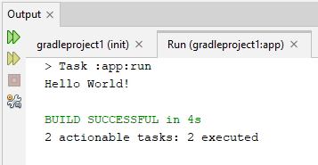

---
title: 5.04. Groovy
---

# 5.04. Groovy

# Раздел в разработке

## История Groovy

```
История Groovy
```

## Основы языка

★ **Groovy** – динамически и статически типизированный язык программирования, работающий поверх Java Virtual Machine (JVM). Он совместим с Java на 100% - вы можете использовать Java-библиотеки в Groovy и наоборот. Groovy был создан для упрощения разработки на Java, добавляя гибкость, краткость и мощные абстракции.

Официальная документация Groovy доступна на https://groovy-lang.org/

Какие возможности предоставляет Groovy?
	- *писать легковесные скрипты, которые можно запускать сразу, без предварительной компиляции*;
	- *совместимость с Java: можно использовать любые Java-библиотеки, классы, фреймворки*;
	- *создание собственных предметно-ориентированных языков для описания бизнес-правил, конфигураций, сценариев*;
	- *описывать бизнес-логику на понятном для непрограммистов уровне, используя естественные конструкции*;
	- *обработка конфигураций, логов, запросов к БД и API*;
	- *выбирать между статической и динамической типизацией в зависимости от ситуации*;
	- *работать с замыканиями, коллекциями, потоками, что упрощает написание декларативного и чистого кода*;
	- *многопоточность, реактивное программирование, асинхронные вызовы*;
	- *менять поведение классов и объектов во время выполнения*;
	- *ООП, императивное, функциональное и метапрограммирование*.
	
## Типы данных

В Groovy поддерживаются как статические, так и динамические типы.

Основные типы:
	- int, long, float, double — числовые типы
	- boolean — логический тип (true / false)
	- char — символ
	- String — строки
	- def — неявно типизированная переменная (динамический тип)
	
```java
def x = 10        // def — автоматическое определение типа
int y = 20
String name = "Groovy"
```
Коллекции:
	- Списки (List) — упорядоченные коллекции
	- Мапы (Map) — пары ключ-значение
	- Диапазоны (Range) — последовательности значений
	
```python
def list = [1, 2, 3]                      // Список
def map = [name: "Alice", age: 25]        // Map
def range = 1..5                          // Диапазон от 1 до 5
```

## Операторы

Groovy поддерживает большинство операторов из Java, плюс некоторые уникальные.

Арифметические: `+` `-` `*` `/` `%`

Сравнения: `==` `!=` `<` `>` `<=` `>=` `<=>` (пространственный оператор)

Логические: `&&` `||` `!`

Условный (тернарный):
```
def result = condition ? trueValue : falseValue
```
Оператор безопасного доступа:
```
def value = object?.property
```
Оператор Elvis (?:):
```
def name = input ?: "default"
```

## Циклы

Groovy предоставляет стандартные циклы, но также добавляет удобные DSL-подобные конструкции.

for:
```
for (i in 1..5) {
    println i
}
```
while:
```
int i = 0
while (i < 5) {
    println i++
}
```
each (итерация по спискам/диапазонам):
```
[1, 2, 3].each { num ->
    println num
}
```

## ООП

Groovy полностью объектно-ориентирован, всё является объектом.

Классы и объекты:
```java
class Person {
    String name
    int age

    void sayHello() {
        println "Hello, my name is $name"
    }
}

def p = new Person(name: "Alice", age: 30)
p.sayHello()
```
Наследование:
```java
class Student extends Person {
    String school
}
```
Инкапсуляция:

По умолчанию все поля имеют геттеры и сеттеры (автоматически создаются).

Полиморфизм:

Поддерживается через переопределение методов.

Замыкания (Closures):

Замыкания — это анонимные блоки кода, которые могут быть переданы как параметры.
```
def greet = { name -> println "Hello, $name" }
greet("Groovy")
```


## Прочие особенности

**Динамическая типизация**:

Groovy позволяет работать с переменными без явного указания типа (def), что делает его гибким для скриптов.

**Метапрограммирование**:

Groovy поддерживает изменение поведения классов и объектов во время выполнения.
```java
String.metaClass.shout = { -> delegate.toUpperCase() }
println "hello".shout()  // Вывод: HELLO
```

**AST Transformations**:

Плагины компиляции позволяют модифицировать абстрактное синтаксическое дерево (AST) на этапе компиляции. Например, аннотации @ToString, @EqualsAndHashCode.

**Поддержка DSL**:

Groovy подходит для создания доменно-специфических языков (DSL), например, Gradle использует Groovy для своих скриптов сборки.

**Работа с XML и JSON**:

Groovy предоставляет удобные средства для работы с XML и JSON.
```
def xml = new XmlBuilder()
xml.person {
    name "Alice"
    age 30
}

def jsonSlurper = new JsonSlurper()
def person = jsonSlurper.parseText('{"name":"Alice","age":30}')
```

Гибкость синтаксиса:
	- Не обязательно использовать точку с запятой
	- Можно опускать return в конце метода
	- Методы можно вызывать без скобок
```
def hello(name) {
    "Hello, $name"
}

println hello "Groovy"  // Вызов без скобок
```

## Знаки препинания

Два важных вопроса, которые мучают начинающих программистов:
1. Когда использовать кавычки двойные (`"`), одинарные (`'`), а когда апострофы (`’`)?
2. Когда использовать точки (`.`), запятые (`,`) и точку с запятой (`;`)?

Двойные (`"`) — интерполируемые строки (можно вставлять переменные):
```
def name = "John"
println "Hello, $name" // Hello, John
```
Одинарные (`''`) — строка как есть (без интерполяции):
```
def name = 'John'
println 'Hello, $name' // Hello, $name
```
Апострофы (`’`) — не используются в синтаксисе. Только `'`.
Точка (`.`) для доступа к методам и свойствам:
```
def list = [1, 2, 3]
println list.size()
```
Запятая (`,`) для разделения элементов в списке, параметрах функций:
```
def add(a, b) { a + b }
println add(2, 3)
```
Точка с запятой (`;`) для разделения нескольких инструкций на одной строке:
```
def x = 5; def y = 10; println(x + y)
```
Но это не обязательно , и редко используется в реальном коде.

Нижние подчеркивания в Groovy очень похожи на Java и Kotlin.

`_name` - стиль, но не обязателен.
`_` используется в числах как разделитель - `1_000_000`.
А также `_` используется для «отброса» в циклах:
```
(1..5).each { _ -> println "Hello" }
```
Символы «`|`» и «`||`», как и в Java:

`|` — это побитовое `ИЛИ (bitwise OR)`.

К примеру, метод(значениеА | значениеБ);

В условиях это логическое ИЛИ, но без сокращённого вычисления.

`if (методА() | методБ())` - вызовет и методА, и методБ, даже если методА - true.
```
if (a() | b()) { ... } // оба вызовутся
```

`||` - логическое `ИЛИ` (с сокращённым вычислением), можно назвать исключающим.
допустим return `a || b` - если a true, то b не вернется/не вычислится.
```
if (a() || b()) { ... } // b() — только если a() == false
```

## Синтаксис

Синтаксис Groovy значительно проще:
```
// Переменные без указания типа
def name = "Alice"
println "Hello, $name"

// Замыкания
def greet = { name -> println "Hello, $name" }
greet("Bob")

// Списки
def list = [1, 2, 3]

// Мапы
def map = [name: "John", age: 30]

// Работа с файлами
new File('test.txt').eachLine { line ->
    println line
}

// Исключения
try {
    def result = 1 / 0
} catch (e) {
    println "Error: ${e.message}"
}
```

Фреймворки и инструменты Groovy:

| Название | Описание |
|---------|---------|
| Grails | MVC-фреймворк для веб-приложений, аналог Spring Boot, но более DSL-ориентированный. |
| Spock | Фреймворк для тестирования, позволяет писать читаемые и выразительные тесты. |
| Gradle | Система сборки, использующая Groovy (или Kotlin DSL) для описания билда. |
| Micronaut | Легковесный фреймворк для микросервисов, поддерживает Groovy. |
| Quarkus | Современный фреймворк для GraalVM и контейнеров, поддерживает Groovy. |
| Geb | Браузерный тестовый фреймворк на основе WebDriver. |

Сфера применения Groovy:
1. Автоматизация задач – скрипты администрирования, обработка файлов, логов, данных.
2. Тестирование – покрытие юнит-, интеграционного тестирования, использование Spock и JUnit.
3. Веб-разработка – Grails, полноценный веб-фреймворк, и Micronaut, Quarkus его современные альтернативы.
4. CI/CD – Jenkinsfile использует Groovy как основной DSL для описания пайплайнов.
5. Сборка проектов – Gradle – де-факто стандарт для Android и Java-проектов.
6. Обработка данных – Groovy удобен для скриптов обработки CSV, JSON, XML, SQL.

Важные классы и интерфейсы Groovy

| Класс, интерфейс | Назначение |
|------------------|-----------|
| Closure | Аналог лямбда-выражений в Java, используется в Groovy активно. |
| `Map`, `List`, `Set` | Расширенные возможности работы с коллекциями. |
| `File`, `URL`, `URLConnection` | Упрощённая работа с файлами и сетью. |
| `GroovyShell`, `GroovyScriptEngine` | Для динамического исполнения Groovy-скриптов. |
| `Eval` | Вычисление строкового выражения (например, `Eval.x(2, 'x + 1')`). |
| `Expando` | Динамический объект, можно добавлять поля и методы на лету. |
| `MetaClass` | Для изменения поведения классов на лету. |
| `DataSet` | Для работы с SQL-запросами и представлениями. |
| `MarkupBuilder`, `StreamingMarkupBuilder` | Генерация XML/HTML. |
| `JsonSlurper`, `JsonOutput` | Чтение и запись JSON. |
| `XmlSlurper`, `XmlNodePrinter` | Парсинг и генерация XML. |

Примеры часто встречающихся задач и решений:
1. Парсинг JSON:
```
def json = '{"name":"Alice","age":25}'
def data = new groovy.json.JsonSlurper().parseText(json)
println data.name // Alice
```

2. Запись JSON:
```
def data = [name: "Bob", age: 30]
def json = new groovy.json.JsonOutput().toJson(data)
println json
```

3. Чтение XML:
```
def xml = '''
<people>
    <person name="John"/>
</people>'''
def root = new XmlSlurper().parseText(xml)
println root.person.@name
```

4. Генерация HTML:
```
def html = new groovy.xml.MarkupBuilder()
html.html {
    head { title "Page Title" }
    body {
        h1 "Hello from Groovy!"
    }
}
```

## Работа с БД

**GORM (Grails ORM)** - ORM, используемый во фреймворке Grails. Прост в использовании, интегрирован с Spring, применяется в веб-приложениях на Grails.

GORM — это реализация паттерна Active Record для Groovy, позволяющая легко работать с базами данных. Он скрывает сложность SQL и Hibernate под простым и интуитивно понятным API.

GORM построен на основе Hibernate Core, поддерживает реляционные БД (PostgreSQL, MySQL, H2 и др.), интегрирован с Spring Boot. Работает как в Grails, так и автономно в standalone-приложениях.

**Как работать с GORM?**
1. Создание доменных классов (Domain Classes)
```
class Book {
    String title
    String author
    BigDecimal price
    Date releaseDate

    static constraints = {
        title blank: false, maxSize: 100
        author nullable: true
    }
}
```
Каждый такой класс автоматически становится таблицей в БД (book), а поля — столбцами.

2. Основные операции CRUD

Создание:
```
def book = new Book(title: "Groovy in Action", author: "Dierk König", price: 49.99)
book.save()
```
Чтение:
```
def book = Book.get(1) // По ID
def books = Book.findAllByAuthor("Dierk König")
```
Обновление:
```
def book = Book.get(1)
book.price = 39.99
book.save()
```
Удаление:
```
def book = Book.get(1)
book.delete()
```
3. Динамические методы поиска

GORM предоставляет множество удобных методов:
```
Book.findByTitle("Groovy in Action")
Book.findAllByPriceLessThan(50.0)
Book.countByAuthor("Dierk König")
Book.findAllByReleaseDateBetween(startDate, endDate)
```
4. Связи между доменами

Пример связи один ко многим:
```
class Author {
    String name
    static hasMany = [books: Book]
}

class Book {
    String title
    static belongsTo = [author: Author]
}
```
Теперь можно делать:
```
def author = new Author(name: "Dierk König").save()
def book = new Book(title: "Groovy in Action").save()
author.addToBooks(book).save()

// Получить все книги автора
author.books.each { println it.title }
```
Можно явно указать, как будет выглядеть таблица в БД:
```
class Book {
    String title

    static mapping = {
        table 'books'
        title column: 'book_title', length: 255
    }
}
```
Работа с транзакциями
```
Book.withTransaction { status ->
    def book = new Book(title: "New Book")
    if (book.save()) {
        // ...
    } else {
        status.setRollbackOnly()
    }
}
```

GORM можно использовать и без Grails, например, в Spring Boot приложениях.

Для этого нужно добавить зависимость в build.gradle и использовать доменные классы и сервисы в контроллерах или сервисах Spring.

## Первая программа на Groovy

```
Практическое задание
Выполните нижеследующее задание.

```

А теперь давайте немного попрактикуемся и посмотрим, как выглядит работа с Groovy. Пройдитесь и выполните все действия по алгоритму, но на каждом шаге старайтесь исследовать то, что на экране, чтобы понимать.

1. Установите Apache NetBeans и запустите (на рабочем столе будет ярлык).

2. Выберите «New Project» (или File – New Project).

3. Выберите «Groovy with Gradle» (в списке шаблонов – Groovy with Gradle – Groovy Application).

4. Заполните сведения о проекте:
	- Project Name: gradleproject1 – можете задать своё имя;
	- Project Location – выберите папку, где будет храниться проект;
	- Project Folder – укажет путь к проекту;
	- Package Name – com.test.gradleproject1;
	- Java Version – укажите свою версию (или последнюю доступную);
	- Gradle DSL – нам нужен Groovy.

5. Проверьте всё и нажмите Finish – IDE подготовит проект.

6. В левой части окна будет структура проекта.

7. В правой части окна будет код со стандартным шаблоном:
````
package com.test.gradleproject1

class App {
    String getGreeting() {
        return 'Hello World!'
    }

    static void main(String[] args) {
        println new App().greeting
    }
}
```

8. Чтобы запустить проект, нужно нажать правой кнопкой мыши на проекте в структуре и выбрать «Run» или нажать зеленую кнопку на панели инструментов.

9. Если всё успешно – то в нижней части окна в панели Output будет полная информация о процессе сборки, и вывод исполнения команды. Наша программа просто должна вывести сообщение «Hello World!», и это мы можем увидеть именно там:




Как можно заметить – язык и принципы построения очень похожи с Java.


