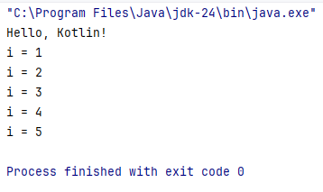

---
title: 5.05. Kotlin
---

# 5.05. Kotlin

# Раздел в разработке

## История Kotlin

```
История Kotlin
```

## Основы языка

★ **Kotlin** – современный язык программирования, разработанный компанией JetBrains. Работа над ним началась ещё в 2010 году как альтернатива Java, который к тому времени уже считался устаревшим в плане удобства и читаемости кода.

Основными причинами создания Kotlin были:
	- многословность кода на Java;
	- нехватка поддержки функционального программирования;
	- необходимость в безопасности типов и null safety;
	- улучшение производительности разработчиков.

Какие возможности предоставляет Kotlin?
	- *писать код один раз и запускать его на разных платформах: Android, iOS, JVM, JS, Native*;
	- *снизить объём boilerplate-кода за счёт автоматического вывода типов, data-классов, упрощённого синтаксиса*;
	- *нулевые ссылки обрабатываются через строгую систему типов, что снижает риск ошибок времени выполнения*;
	- *взаимодействие с Java-библиотеками, фреймворками и кодом*;
	- *работать с лямбдами, неизменяемыми коллекциями, функциями высшего порядка*;
	- *объектно-ориентированное, императивное, функциональное и реактивное программирование*;
	- *создание приложений для мобильных устройств с акцентом на стабильность и производительность*;
	- *написание скриптов сборки, конфигураций, сценариев с помощью Kotlin DSL*;
	- *вести разработку в serverless-архитектурах, Kubernetes, контейнерных системах*.
	
Официальная документация Kotlin есть на сайте https://kotlinlang.org/ и https://www.jetbrains.com/kotlin-ecosystem/

Чит-лист - https://cheatsheets.zip/kotlin

В 2005 году Google начала использовать Java для разработки приложений Android. В 2010 году Oracle купили Sun Microsystems (владельца Java), и подали в суд на Google за использование Java API без лицензии. Дело длилось годы и закончилось в 2021 году решением Верховного Суда США в пользу Google, но отношения между компаниями были испорчены. Как итог – на конференции Google I/O 2017 объявила Kotlin официальным языком разработки для Android. Это было стратегическое решение: уйти от зависимости Oracle и получить более современный, выразительный язык. С тех пор Kotlin стал основным языком разработки для Android и получил развитие в других сферах благодаря поддержке JetBrains и сообщества.

Особенности языка Kotlin:
	- null safety – типы не могут содержать null по умолчанию;
	- инференция типов – компилятор сам определяет тип переменной;
	- неявное преобразование типов – поддерживается только безопасное;
	- функциональное программирование – лямбды, высокопроизводительные коллекции;
	- поддержка корутин – асинхронное программирование с использованием легковесных потоков;
	- мультиплатформенность – Kotlin Multiplatform позволяет делить бизнес-логику между Android, iOS, JS, JVM и т.д.;
	- безопасность типов – меньше ошибок во время выполнения;
	- DSL-поддержка – удобство написания DSL (например, Ktor, Anko, SQLDelight);
	- компактность кода – значительно меньше кода по сравнению с Java;
	- взаимодействие с Java – полная совместимость, можно даже смешивать Kotlin и Java в одном проекте.

## Типы данных

В Kotlin используется статическая типизация , но также есть вывод типов (type inference), что уменьшает необходимость явного указания типа.

| Тип | Описание |
|-----|---------|
| Byte | 8-битное число со знаком |
| Short | 16-битное число со знаком |
| Int | 32-битное число со знаком |
| Long | 64-битное число со знаком (суффикс L) |
| Float | 32-битное число с плавающей точкой (суффикс f) |
| Double | 64-битное число с плавающей точкой |
| Boolean | true/false |
| Char | Символ ('a', '1') |
| String | Последовательность символов |

```kotlin
val a: Int = 10
val b = 20 // вывод типа
val c: Double = 3.14
val d = 'K'
val e = "Hello, Kotlin"
```
Nullable-типы:

Kotlin защищает от NullPointerException с помощью системы nullable-типов.
```kotlin
var name: String? = null
if (name != null) {
    println(name.length)
}
```

## Операторы

Kotlin поддерживает большинство стандартных операторов, включая специальные для работы с nullable.

Арифметические: `+` `-` `*` `/` `%`

Логические: `&&` `||` `!`

Сравнения: `==` `!=` `<` `>` `<=` `>=`

Условный (тернарный):

В Kotlin нет тернарного оператора в виде ? :, вместо этого используется if-else или элвис-оператор.

Elvis-оператор ?:

Используется для задания значения по умолчанию:
```kotlin
val name: String? = null
val result = name ?: "default"
```
Безопасный вызов .?
```kotlin
val length = name?.length
```
Нулевой ассерт !!

Принудительно выбрасывает NullPointerException, если значение null:
```kotlin
val length = name!!.length
```

## Циклы

Kotlin предоставляет удобные и понятные конструкции циклов.

for:
```kotlin
for (i in 1..5) {
    println(i)
}

for (c in "Kotlin") {
    println(c)
}
```
while:
```kotlin
var i = 0
while (i < 5) {
    println(i++)
}
```
do-while:
```kotlin
var j = 0
do {
    println(j++)
} while (j < 5)
```
forEach (для коллекций):
```kotlin
val list = listOf("a", "b", "c")
list.forEach { item ->
    println(item)
}
```

## ООП и особенности

Kotlin полностью поддерживает ООП. Классы, объекты, наследование, инкапсуляция, полиморфизм — всё доступно.
```kotlin
class Person(val name: String, var age: Int) {
    fun greet() {
        println("Hello, my name is $name")
    }
}
```
Создание экземпляра:
```kotlin
val person = Person("Alice", 30)
person.greet()
```

Наследование:

```kotlin
open class Animal // open — чтобы можно было наследовать

class Cat : Animal()
```
Инкапсуляция:

Поля могут быть private, protected, internal, public.
```kotlin
class User {
    private val secret = "password"
}
```
Дата-классы (data class):

Автоматически генерируют toString(), equals(), hashCode(), copy() и т.д.
```kotlin
data class User(val id: Int, val name: String)
```
Компаньонные объекты (companion object):

Статические члены в Kotlin реализуются через companion object.
```kotlin
class MyClass {
    companion object {
        const val VERSION = "1.0"
    }
}
```
Замыкания и лямбда-выражения:
```kotlin
val sum: (Int, Int) -> Int = { a, b -> a + b }
println(sum(2, 3))
```
Функции высшего порядка и лямбды:
```kotlin
fun process(n: Int, block: (Int) -> Unit) {
    block(n)
}
process(5) { println(it) }
```
Расширения (Extensions):

Можно добавлять методы к существующим классам без изменения их кода.
```kotlin
fun String.addExclamation(): String {
    return this + "!"
}
```
Одно из ключевых преимуществ Kotlin — защита от NullPointerException на уровне языка.

Coroutines (асинхронное программирование):

Kotlin имеет встроенную поддержку корутин для асинхронной и не-blocking работы.
```kotlin
import kotlinx.coroutines.*

fun main() = runBlocking {
    launch {
        delay(1000L)
        println("World!")
    }
    println("Hello,")
}
```
Аннотации:

Поддерживаются, аналогично Java.
```kotlin
@Deprecated("Use new version")
fun oldFunction() {}
```
Перегрузка операторов:
```kotlin
data class Point(val x: Int, val y: Int) {
    operator fun plus(other: Point): Point {
        return Point(x + other.x, y + other.y)
    }
}
```
Вызов Java-кода:

Kotlin полностью взаимодействует с Java. Можно вызывать Java-библиотеки и наоборот.


## Знаки препинания


Два важных вопроса, которые мучают начинающих программистов:
1. Когда использовать кавычки двойные (`"`), одинарные (`'`), а когда апострофы (`’`)?
2. Когда использовать точки (`.`), запятые (`,`) и точку с запятой (`;`)?

Двойные (`"`) — обычные строки:
```kotlin
val name = "Alice"
```
Тройные (""") — многострочные строки:
```kotlin
val text = """Line 1
              Line 2"""
```
Интерполяция внутри двойных кавычек:
```kotlin
val age = 25
println("Age: $age")
```
Одинарные (`'`) — только для одиночного символа (Char):
```kotlin
val letter = 'A'
```
Апострофы (`’`) — не поддерживаются.
Точка (`.`) используется для вызова методов и свойств:
```kotlin
val list = listOf(1, 2, 3)
println(list.size)
```
Запятая (`,`) для разделения параметров, элементов списка и т. д.:
```kotlin
val numbers = listOf(1, 2, 3)
fun greet(name: String, age: Int)
```
Точка с запятой (`;`) не требуется в Kotlin. Используется только если нужно писать несколько выражений в одной строке:
```kotlin
val x = 5; val y = 10
```

Нижние подчеркивания в Kotlin бывают для стиля и для синтаксиса:

`_name` - соглашение, но не общепринятое. Приватные поля в Kotlin выглядят как private val logger, а _ используется для полей редко.

`_` может быть как игнорирование при деструктуризации:
```kotlin
val (name, _, age) = person
```
и как разделитель в числах:
```kotlin
val million = 1_000_000
```
Символы «`|`» и «`||`» в JavaScript, C#, Java, C++ и Kotlin использутся в общем порядке:

`|` — это побитовое ИЛИ (bitwise OR).

К примеру, `метод(значениеА | значениеБ)`;

В условиях это логическое ИЛИ, но без сокращённого вычисления.

`if (методА() | методБ())` - вызовет и методА, и методБ, даже если методА - true.

`||` - логическое ИЛИ (с сокращённым вычислением), можно назвать исключающим.

допустим `return a || b` - если a true, то b не вернется/не вычислится.
```kotlin
if (a() || b()) { ... } // b() не вызывается, если a() == true
```

## Синтаксис

Синтаксис Kotlin сочетает простоту Python и мощь Java. Примеры:

```Kotlin
// Переменные
val name: String = "Alice" // неизменяемая
var age = 30               // изменяемая

// Функция
fun greet(name: String): Unit {
    println("Hello, $name")
}

// Вызов
greet("Bob")

// Лямбда
val square = { x: Int -> x * x }

// Null Safety
val nullableName: String? = null
println(nullableName?.length ?: "No name")

// Когда-то (в Java)
// if (nullableName != null) System.out.println(nullableName.length());

// Data class
data class User(val id: Int, val name: String)

// Extension function
fun String.addExclamation() = this + "!"

// Использование
val result = "Hello".addExclamation()
```

Популярные фреймворки и инструменты Kotlin

| Название | Описание |
|---------|---------|
| Android Jetpack | Совокупность библиотек для Android-разработки: ViewModel, LiveData, Compose и т.д. |
| Kotlinx Coroutines | Библиотека для асинхронного и конкурентного программирования. |
| Ktor | Асинхронный фреймворк для клиентского и серверного HTTP-программирования. |
| Compose Multiplatform | Современная UI-библиотека от JetBrains, работает на Android, Desktop и Web. |
| SQLDelight / Exposed | ORM для работы с базами данных. |
| Koin / Dagger / Kodein | DI-фреймворки. |
| Kotlin Multiplatform Mobile (KMM) | Для разработки общего кода между Android и iOS. |
| ktor-fit / Retrofit | Для работы с REST API. |
| Kotlinx.Serialization | Библиотека сериализации объектов в JSON, ProtoBuf и др. |
| Kotlin/JS | Компиляция Kotlin в JavaScript для фронтенд-разработки. |

## Работа с БД

Exposed - легковесный ORM для Kotlin. Простой API, поддержка как DSL (Domain-Specific Language), так и традиционного ORM. Применяется в микросервисах и приложениях на Kotlin.

Ktorm - ORM с акцентом на функциональное программирование. Иммутабельность, поддержка SQL-DSL. Применяется в функциональных приложениях.


## Важные классы и интерфейсы Kotlin

| Класс, интерфейс | Описание |
|------------------|---------|
| Any | Аналог Object из Java. Все классы наследуются от Any. |
| Unit | Аналог void, используется как возвращаемый тип функций. |
| Nothing | Тип, который не имеет значений, используется для функций, которые никогда не возвращаются. |
| `List<T>`,`Set<T>`,`Map<K,V>` | Неизменяемые коллекции. |
| `MutableList<T>`,`MutableSet<T>`,`MutableMap<K,V>` | Изменяемые коллекции. |
| `Pair<A,B>`,`Triple<A,B,C>` | Кортежи для хранения пар/троек значений. |
| `FunctionN` | Функциональные типы (например, `(Int, String) -> Boolean`). |
| `CoroutineScope`,`launch`,`async` | Для работы с корутинами. |
| `suspend` | Модификатор для асинхронных функций. |
| `sealed class` | Ограниченная иерархия классов, полезна в `when`. |
| `data class` | Автоматически генерирует `equals`, `hashCode`, `toString` и `copy`. |
| `inline class` | Обертка вокруг одного значения, чтобы не создавать оверхеда. |
| `companion object` | Статические методы внутри класса. |


```Kotlin
Примеры часто встречающихся задач
1. Null Safety

val nullableValue: String? = null
val length = nullableValue?.length ?: 0


2. Data Class

data class User(val id: Int, val name: String)


3. Корутины

import kotlinx.coroutines.*

fun main() = runBlocking {
    launch {
        delay(1000L)
        println("World!")
    }
    println("Hello,")
}


4. Расширение классов

fun String.isLong(): Boolean = this.length > 10


5. HTTP-запрос через Ktor

import io.ktor.client.*
import io.ktor.client.features.json.*
import io.ktor.client.request.*

suspend fun fetchUser(): String {
    val client = HttpClient {
        install(JsonFeature) {
            serializer = KotlinxSerializer()
        }
    }
    return client.get("https://api.example.com/user/1")
}


```

В отличие от Java, Jetbrains создатели Kotlin, поэтому IntelliJ IDEA – официальная IDE для разработки на Kotlin. Она предоставляет подсветку синтаксиса, умные автодополнения, интеграцию с Gradle/Maven, поддержку Android, JS, Native и Multiplatform.


## Первая программа на Kotlin

```
Практическое задание
Выполните нижеследующее задание.

```

А теперь давайте немного попрактикуемся и посмотрим, как выглядит работа с Kotlin. Пройдитесь и выполните все действия по алгоритму, но на каждом шаге старайтесь исследовать то, что на экране, чтобы понимать.

1. Скачайте и установите IntelliJ IDEA – на выбор:
	- IntelliJ IDEA Community Edition – бесплатная;
	- Ultimate – платная.

2. Запустите IDEA и выберите New Project – Kotlin;

3. Заполним поля:
	- Name: HelloKotlin;
	- Build system: Maven;
	- GroupId: com.test;
	- ArtifactId: HelloKotlin.

4. Слева, как обычно, мы увидим структуру проекта.

5. Справа – код. Будет открыт Main.kt:
```Kotlin
package com.test
fun main() {
    val name = "Kotlin"
    println("Hello, " + name + "!")
    for (i in 1..5) {
        println("i = $i")
    }
}
```

6. Попробуйте собрать проект – ПКМ – Build.

7. Попробуйте запустить проект через панель инструментов:


8. После запуска – в нижней части будет Output:



Интерфейс немного отличается от NetBeans, однако большинство знакомых мне разработчиков предпочитают работать именно в IDEA.


