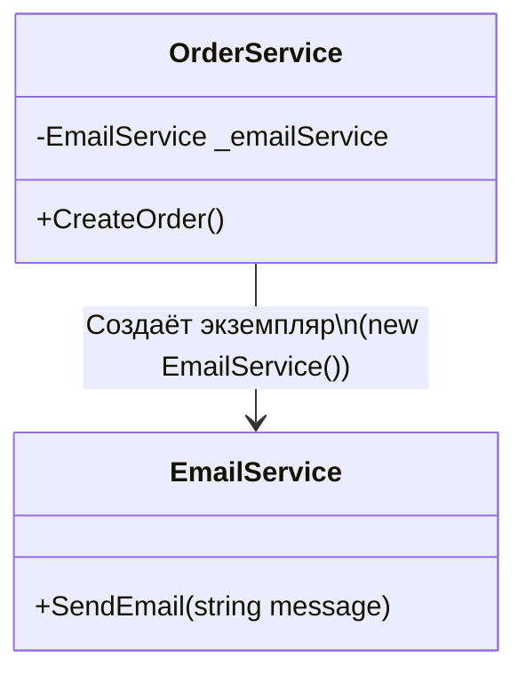
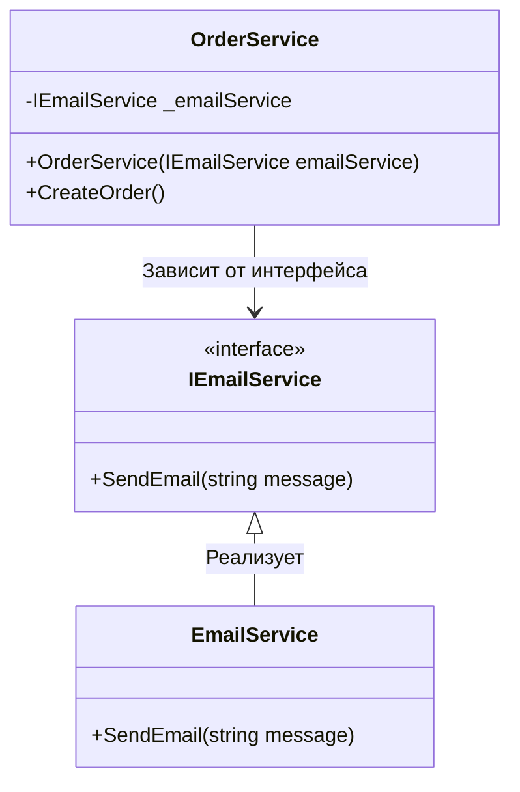

---
title: 5.06. Платформа .NET
---

# 5.06. Платформа .NET

# Раздел в разработке

## История C++ и C#

```
История C++ и C#
История и эволюция платформы .NET
.NET Framework → .NET Core → .NET 5+
Сейчас C# один из самых популярных языков. Он намного прост в освоении, и менее подвержен ошибкам. Собственно, поэтому многие программы и игры в 90-х и 2000-х «зависали» и «подтормаживали», это как раз был тот самый Си и C++.

```

## Платформа .NET

### Что в себя включает платформа?

★**.NET** (читать как "дотнет") – платформа для разработки, включающая в себя инструменты для создания, компиляции и выполнения приложений. Её эволюцию можно разделить на три ключевых этапа:
	- **.NET Framework** – первая и исторически исходная реализация платформы, выпущена в 2002 году. Работала только в среде Windows.
	- **.NET Core** – кроссплатформенная (Windows, Linux, macOS) и открытая версия, выпущенная в 2016 году, создалась как альтернатива .NET Framework для производительности и модульности.
	- **.NET 5+** (современный .NET) – в 2020 году Microsoft объединила .NET Framework и .NET Core в единую платформу .NET.

Отобразим сравнение в форме таблицы:

| Технология/характеристика       | .NET Framework | .NET Core | .NET 5+ |
|-------------------------------|----------------|-----------|---------|
| Кроссплатформенность           | Нет            | Да        | Да      |
| Открытый исходный код          | Нет            | Да        | Да      |
| WinForms                      | Да             | Нет (только Windows) | Да      |
| WPF                           | Да             | Нет (только Windows) | Да      |
| ASP.NET (WebForms)            | Да             | Нет       | Нет     |
| ASP.NET Core                  | Нет            | Да        | Да      |
| Entity Framework              | Да             | Нет       | Нет     |
| Entity Framework Core         | Нет            | Да        | Да      |
| WCF                           | Да             | Нет       | Через сторонние альтернативы |
| Docker                        | Нет            | Да        | Да      |


Эти упомянутые технологии лучше упомянуть вкратце сразу, для понимания возможностей платформы.

### Компоненты

★ Основные компоненты .NET
	- dotnet – так называют саму платформу .NET, и так называется команда для работы с платформой, отвечающая за запуск и сборку;
	- CLR (Common Language Runtime) – компонент, который выполняет код (с английского «run» - бежать). Этот компонент отвечает за управление памятью (сборку мусора), обеспечивает безопасность.
	- CTS (Common Type System) – компонент, отвечающий за систему правил типов данных.
	- CLS (Common Language System) – компонент, отвечающий за гарантию совместимости кода. 
	- Библиотеки. Это наборы готовых классов для работы с конкретными задачами - файлы, строки, сеть. Они бывают базовые (BCL, Base Class Library), которые уже «вшиты» в .NET, и бывают пользовательские.
	- NuGet – магазин библиотек. 


**IL (Intermediate Language)** – это независимый от процессора частично скомпилированный код. Код IL будет скомпилирован в родной машинный код с использованием текущих свойств среды компилятором Just-In-Time (JIT). JIT-компилятор переводит IL-код в код сборки и использует архитектуру процессора целевой машины для выполнения приложения .NET.

В .NET язык IL называется **Common Intermediate Language (CIL)**, а на первых этапах .NET он назывался Microsoft Intermediate Language (MSIL).

**CLI (Common Language Infrastructure**, не путать с командной строкой Command Line Interface) – это открытая спецификация, разработанная компанией Microsoft. Это библиотека скомпилированного кода, используемая для развертывания, создания версий и обеспечения безопасности.

В .NET существует два типа CLI: сборки процессов (EXE) и сборки библиотек (DLL). Сборки CLI содержат код на языке CIL, и при компиляции языков программирования CLI исходный код транслируется в код CIL, а не в объектный код, специфичный для платформы или процессора.

★ **Технологии для приложений**
	- WinForms – фреймворк для сборки простых Windows-приложений с кнопками/окнами.
	- WPF (Windows Presentation Foundation) – современный фреймворк для красивых Windows-программ с анимациями и гибким дизайном.
	- UWP (Universal Windows Platform) – фреймворк для приложений из магазина Windows (для Windows 10 и новее).

★ **Веб-технологии**
	- ASP.NET WebForms – устаревший фреймворк для веб-приложений с drag-and-drop интерфейсом (можно сказать, это WinForms для браузера).
	- ASP.NET WebAPI – фреймворк для создания REST-сервисов (про интеграции и REST мы поговорим позже).
	- ASP.NET Core – современный кроссплатформенный фреймворк для веб-приложений. Сейчас, говоря ASP.NET, мы подразумеваем именно Core.

★ **Работа с данными**
	- ADO.NET – низкоуровневый доступ к базам данных (SQL-запрос пишется вручную в виде строки).
	- Entity Framework – удобная прослойка с готовыми классами для автоматических SQL-запросом без необходимости «прятать» SQL-запрос в строку.
	- Entity Framework Core – переписанный и современный Entity Framework для .NET и .NET Core.

★ **Связь между сервисами**
	- WCF (Windows Communication Foundation) – устаревший фреймворк для сложного обмена данными между программами.
	- gRPC – (от RPC, remote procedure call), система удаленного вызова процедур для более быстрого обмена данными между сервисами.
	- Работа с gRPC API
	- gRPC — это фреймворк удаленных вызовов процедур, который использует HTTP/2 для передачи данных между приложениями. Он выделяется высокой производительностью благодаря бинарному формату Protocol Buffers.


Подробнее про .NET можно почитать у Microsoft на официальном сайте, там же есть и C#, и C++, и F#, и Visual Studio -  https://learn.microsoft.com/ru-ru/dotnet/


### Особенности архитектуры

```
Кроссплатформенность, open-source
.NET Standard и его роль
Версии .NET и их особенности

Архитектура .NET: CLI, CLR, CTS, CLS
Common Language Runtime (CLR)
Компиляция: IL (MSIL), JIT
Управление памятью, сборка мусора (GC)
```


## Типы приложений в .NET

| Приложение | Описание | Когда использовать |
|--- | --- | --- |
| Консольное приложение | Простейший тип, выводит результат в командную строку | Для обучения, CLI-утилит, демонов |
| ASP.NET Core | Веб-приложения и API | Для разработки сайтов, микросервисов, REST API |
| Razor Pages | Упрощённая модель MVC с файлами `.cshtml` | Для небольших сайтов, где не нужен сложный контроллер |
| Blazor | Веб-приложения на C# (в браузере через WebAssembly или серверный вариант) | Для фронтенд-разработки на C# |
| Windows Forms (WinForms) | Классические GUI-приложения Windows | Для легковесных десктоп-приложений |
| WPF (Windows Presentation Foundation) | Современный подход к созданию десктоп-приложений | Для богатого интерфейса, MVVM-архитектуры |
| MAUI (Multi-platform App UI) | Кроссплатформенные мобильные и десктоп-приложения | Для iOS, Android, Windows, macOS |
| Xamarin | Предшественник MAUI, позволяет писать под мобильные устройства | Для проектов, которые ещё не перешли на MAUI |
| ASP.NET MVC | Традиционный веб-фреймворк с разделением на модели, представления и контроллеры | Для крупных сайтов |
| Worker Service | Фоновые сервисы (демоны) | Для фоновой обработки данных, очередей |
| Class Library | Библиотека классов | Для повторного использования кода между проектами |
| Unit Test Project | Проект модульных тестов | Для автоматизированного тестирования |
| Windows Service | Сервисы Windows | Для запуска в фоне без пользователя |


## Сборка в .NET

```
Что такое сборка (assembly)
Манифест, метаданные, типы
EXE vs DLL
Подписанные и строго именованные сборки

```

★ Сервисы и builder

В .NET используется подход, основанный на Host и Builder. Это позволяет настраивать приложение через цепочку вызовов методов. Основной класс для создания приложения – это **WebApplicationBuilder** (для веб-приложений) и **HostApplicationBuilder** (для консольных приложений).

Пример:
```csharp
var builder = WebApplication.CreateBuilder(args);

// Настройка сервисов (например, регистрация зависимостей)
builder.Services.AddControllers();
builder.Services.AddSingleton<IMyService, MyService>();

// Построение приложения
var app = builder.Build();

// Настройка middleware
app.UseRouting();
app.MapControllers();

app.Run();
```

Здесь создаётся builder, и предоставляется доступ к различным частям конфигурации приложения, таким как:
	- `builder.Services` - для регистрации сервисов (DI контейнер).
	- `builder.Configuration` - для работы с конфигурацией (`appsettings.json`, переменные окружения и тд);
	- `builder.Logging` - для настройки логирования;
	- `builder.Environment` - для получения информации о среде выполнения (допустим, Development для разработки, Production для продуктивной среды).
	
Здесь подробнее остановимся на builder.Services - коллекция сервисов, которая используется для регистрации зависимостей в Dependency Injection контейнере. 

**DI** – это паттерн, который позволяет внедрять зависимости в классы, а не создавать их внутри класса.

Пример регистрации класса:
```csharp
builder.Services.AddSingleton<IMyService, MyService>();
```

	- `AddSingleton` - регистрирует сервис как синглтон (один экземпляр на всё приложение).
	- `IMyService` - интерфейс, который будет использоваться для внедрения зависимости.
	- `MyService` - реализация интерфейса.

Другие методы регистрации:
	- `AddTransient<TInterface, TImplementation>()`: Создает новый экземпляр сервиса каждый раз, когда он запрашивается.
	- `AddScoped<TInterface, TImplementation>()`: Создает один экземпляр сервиса для каждого HTTP-запроса (в веб-приложениях).

Но их мы рассмотрим чуть позже. Для начала, разберёмся, что за «сервис».

★ **Регистрация сервиса** – это процесс добавления класса или интерфейса в DI контейнер, чтобы он мог автоматически быть внедрён в другие классы. Это делается через методы AddSingleton, AddScoped, AddTransient.

★ **Сервис** – это просто класс, который выполняет какую-то задачу. Например, сервис для работы с БД, для отправки email или логирования.

★ **Dependency Injection (DI)** — это паттерн программирования, который позволяет «внедрять» зависимости (сервисы) в классы, вместо того чтобы создавать их внутри класса. Это делает код более гибким, тестируемым и поддерживаемым.

```
контейнер внедрения зависимостей (DI), принцип работы
```

Представим, что есть класс `OrderService`, который зависит от класса `EmailService` для отправки письма после создания класса. Если мы создаём объект `EmailService` внутри `OrderService`, то код будет жёстко связан с конкретной реализацией `EmailService`. Это называется жёсткой связью. И если захотим изменить `EmailService` на другой сервис, допустим, отправки SMS, то придётся изменять код `OrderService`. 



Это плохо.

```csharp
public class OrderService
{
    private EmailService _emailService;

    public OrderService()
    {
        _emailService = new EmailService(); // Жёсткая связь
    }

    public void CreateOrder()
    {
        // Логика создания заказа
        _emailService.SendEmail("Заказ создан!");
    }
}
```

DI решает эту проблему, позволяя передавать зависимости через конструктор. Вместо того, чтобы создавать объект `EmailService` внутри `OrderService`, вы передаёте его извне – это называется внедрением зависимостей.

```csharp
public interface IEmailService
{
    void SendEmail(string message);
}

public class EmailService : IEmailService
{
    public void SendEmail(string message)
    {
        Console.WriteLine($"Отправка email: {message}");
    }
}

public class OrderService
{
    private readonly IEmailService _emailService;

    public OrderService(IEmailService emailService) // Внедрение через конструктор
    {
        _emailService = emailService;
    }

    public void CreateOrder()
    {
        // Логика создания заказа
        _emailService.SendEmail("Заказ создан!");
    }
}
```

Теперь `OrderService` не зависит от конкретной реализации `EmailService`. Можно легко заменить `EmailService` на другой класс, реализующий интерфейс `IEmailService`.




★ Регистрация сервисов нужна, чтобы DI контейнер знал, какие классы и как создавать. 

**DI контейнер** – это специальный механизм, который автоматически создаёт объекты и внедряет их.

Алгоритм:
1) регистрация сервиса в DI контейнере;
2) когда запрашиваем сервис (через конструктор), DI контейнер создаёт объект и передаёт его туда, где он нужен.

В .NET есть три основных способа регистрации сервисов:
1. `AddSingleton` - создаётся один экземпляр сервиса на всё приложение. Подходит для сервисов, которые не хранят состояние или являются глобальными. DI создаёт один объект и сохраняет его.
2. `AddScoped` - создаётся один экземпляр сервиса на каждый HTTP-запрос (в веб-приложениях). Подходит для сервисов, которые зависят от данных запроса (например, работа с базовй данных). DI создаёт объект для каждого запроса.
3. `AddTransient` - создаётся один экземпляр сервиса каждый раз, когда он запрашивается. Подходит для легковесных сервисов, которые не хранят состояние. DI создаёт новый объект каждый раз.

### Установка пакетов

★ **Установка пакетов**

Команда `dotnet add package` используется для добавления NuGet-пакетов в проект. 

**NuGet** - менеджер пакетов для .NET, который позволяет управлять библиотеками и зависимостями.

Синтаксис:
```bash
dotnet add package <Package.Name> [--version <Version>]
```
Пример:
```bash
dotnet add package Newtonsoft.Json
```

Newtonsoft.Json — библиотека для работы с JSON, и команда выполнила добавление библиотеки в проект, что позволит в коде указать using Newtonsoft.Json и использовать предоставляемые возможности.


## Инструменты и среда разработки

```
Visual Studio, VS Code, Rider
CLI: dotnet new, dotnet run, dotnet build
Работа с проектами (.csproj)
NuGet и управление пакетами
```
