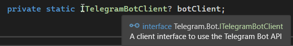
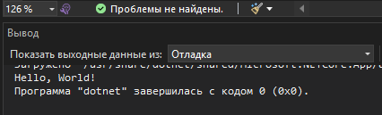
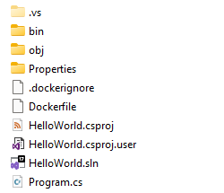
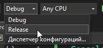
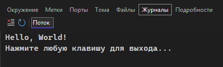
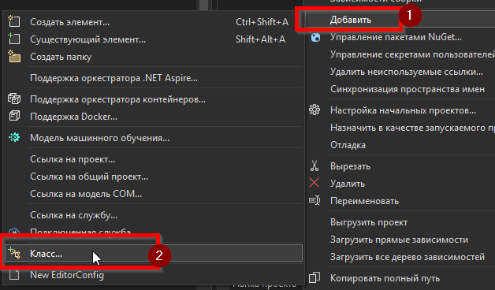
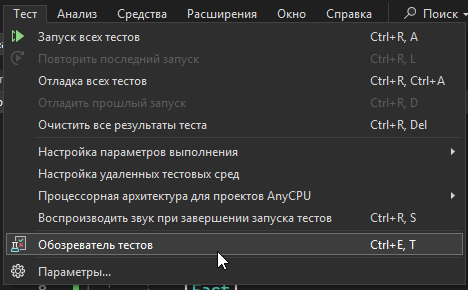
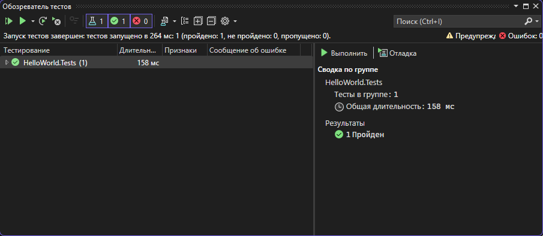

---
title: 5.07. C#
---

# 5.07. C#

## Основы C#

### Возможности C#


Какие возможности предоставляет C#?
	- *писать код один раз и запускать его на разных платформах: Windows, Linux, macOS, iOS, Android*;
	- *разработка desktop-приложений (WinForms, WPF), мобильных (Xamarin), веб-приложений (ASP.NET), микросервисов*;
	- *совместимость с обширной библиотекой классов .NET, что даёт доступ к готовым решениям для работы с файлами, сетью, базами данных, графикой и многим другим*;
	- *строгая система типов снижает риск ошибок времени выполнения*;
	- *автоматическое управление памятью (Garbage Collection)*;
	- *работать с лямбдами, неизменяемыми коллекциями, функциями высшего порядка*;
	- *ключевые слова async/await, которые упрощают написание асинхронного кода без потерь в производительности*;
	- *может компилироваться в нативный код через AOT (.NET Native), выполняться в виртуальной машине (.NET Runtime), работать в контейнерах и облаке*;
	- *интеграция с одной из самых мощных экосистем, включающей ASP.NET, Entity Framework, WPF, WinForms, MAUI и другие технологии*;
	- *работа с SQL через ADO.NET, Entity Framework, LINQ to SQL*;
	- *разработка корпоративных систем - ERP, CRM, HRM, банковские системы, где важна надёжность и долгосрочная поддержка*;
	- *создание 2D и 3D игр с использованием Unity, Godot и других движков*.

### Как работать с C#?

С чего начать?

Ну, во-первых, сначала отметим, что документация у C# широкая и доступна на сайте Microsoft - https://learn.microsoft.com/ru-ru/dotnet/csharp/

Чит-лист  - https://cheatsheets.zip/cs

Во-вторых, представим, что вы уже понимаете, какую программу хотите написать. Тогда ваши шаги будут следующими:
1.	Установить .NET.
2.	Установить Visual Studio или другую IDE.
3.	Определить технологию:
	- общий тип – консоль или пользовательский интерфейс;
	- работа приложений – WinForms/WPF/ASP.NET Core;
	- работа с данными – EF Core или ADO.NET.
4.	Установить необходимые библиотеки через NuGet.
5.	Приступить к написанию кода.

Поговорим о библиотеках.

Код компилируется в два основных формата – DLL и EXE.
	- EXE – исполняемый файл, который и запускает программу.
	- DLL – библиотека, не исполняемый файл, который содержит уже «упакованный» набор классов и методов.

Эти файлы содержат в себе:
	- скомпилированный код;
	- метаданные (информация о типах, методах, свойствах);
	- манифест (список зависимостей, версии, автор и т.д.).

Эти файлы образуют собой сборку – готовое приложение.

Итоговая сборка может быть Debug и Release (отладочное и финальное). Сборки пакуются в каталог `bin/` в решении. Пример:
```
C:/MyApp/bin/Debug/MyApp.exe
```
DLL-файл предоставляет методы, которые можно вызывать из других программ. К примеру, если вам нужно осуществить математическую операцию, вы добавляете библиотеку к своему коду, используя ключевое слово `using`. Это всё равно, что сказать: «Здравствуй. Сейчас мы будем с тобой работать. Нам понадобится учебник №1 и учебник №2». Это и будет некая установка для программы, что мы будем ссылаться на эти «учебники». И если сразу не договориться с программой, то это будет равнозначно тому, что ученик придёт на урок, забыв учебники дома, и не сможет учиться – он не поймёт, о чем будет идти речь. И тогда Visual Studio намекнёт – «братишка, я не понимаю о чём ты – я не знаю никакого ITelegramBotClient»:


Но стоит установить из NuGet библиотеку `Telegram.Bot`, и добавить в код:
```
using Telegram.Bot;
```
И вуаля – ошибок нет



Отсюда ключевая фишка – API в .NET позволяет ссылаться на сборки через **using** на пространства имён – **namespace**.

```
Пространства имен
```

Исходный код хранится в файлах `.cs` для C#. Там пишется логика приложения. В проекте можно создавать новые файлы, и через внутреннее API платформы будет взаимодействие между ними. Допустим, можно сделать, что логика для работы с базой данных будет в одном файле, а логика для вывода данных на интерфейс – в другом.

Файлы проекта – это не `.cs`. 

**Проект** – это набор файлов, который при сборке превращается в *.dll* или *.exe*. Сведения о структуре проекта хранятся в файле **.csproj** – это XML-файл, описывающий структуру проекта. 

Там указывается:
	- какие .cs файлы входят в проект;
	- какие NuGet-пакеты подключены (зависимости);
	- какая версия .NET используется (допустим, 8.0);
	- настройки компиляции (Debug/Release).

Файлы **решения** - **.sln (solution file)**. Он объединяет несколько .csproj в один проект. 

Приложение – это готовое решение. Можно собирать всё решение целиком. 

Структура решения может быть такой:
```
Решение/Проект/Каталог/Код
````
Конфигурация хранится в файле **appsettings.json** (допустим, строки подключения, содержащие путь к базе данных).

```
Main метод, точка входа
Структура простого консольного приложения
Console.WriteLine, ReadLine
```

Взаимодействие программы с пользователем – одна из основных задач любого приложения. В C# стандартный ввод и вывод осуществляются через класс Console.
	- Вывод данных: Console.WriteLine(), Console.Write();
	- Ввод данных: Console.ReadLine().
	- Чтение одного символа: Console.ReadKey().

Пример:

```csharp
string name = Console.ReadLine();
Console.WriteLine($"Здравствуйте, {name}!");
```

### Знаки препинания

Два важных вопроса, которые мучают начинающих программистов:
1. Когда использовать кавычки двойные (`"`), одинарные (`'`), а когда апострофы (`’`)?
2. Когда использовать точки (`.`), запятые (`,`) и точку с запятой (`;`)?

Строки — в двойных кавычках:
```csharp
string name = "John";
```
Символы (char) — в одинарных:
```csharp
char letter = 'A';
```
Многострочные строки (verbatim strings) начинаются с @"":
```csharp
string path = @"C:\Program Files\MyApp";
```
Апострофы (`’`) — не поддерживаются в синтаксисе C#.
Точка (`.`) : аналогично Java — для доступа к свойствам и методам:
```csharp
Console.WriteLine("Hello");
```
Запятая (`,`) : разделяет параметры и элементы массивов:
```csharp
var numbers = new int[] { 1, 2, 3 };
```
Точка с запятой (`;`) : обязательна после каждой инструкции:
```csharp
int x = 5;
Console.WriteLine(x);
```
C# строго требует точку с запятой после каждой законченной команды.

Нижние подчеркивания в C#, как и везде, могут быть как частью стиля, так и частью синтаксиса.

`_name` - очень распространённое соглашение для приватных полей. Часто можно встретить именно такое:
```csharp
private string _logger;
```
Это не синтаксис, но общепринято. Некоторые предпочитают camelCase, без `_`, но `_` популярнее.

В C# нет никаких name mangling, магических методов через `__`.

`_` можно использовать как discard - для отбрасывания значения:
```csharp
var (name, _, age) = GetData(); // игнорируем второе поле
```
`_` в числах используется как разделитель:
```csharp
int million = 1_000_000;
```
Символы «`|`» и «`||`» в JavaScript, C#, Java, C++ и Kotlin использутся в общем порядке:

`|` — это побитовое ИЛИ (bitwise OR).

К примеру, `метод(значениеА | значениеБ)`;

В условиях это логическое ИЛИ, но без сокращённого вычисления.

`if (методА() | методБ())` - вызовет и методА, и методБ, даже если методА - true.
```csharp
bool result = a() | b(); // оба вызовутся
```
`||` - логическое ИЛИ (с сокращённым вычислением), можно назвать исключающим.

допустим `return a || b` - если a true, то b не вернется/не вычислится.
```csharp
bool result = a() || b(); // если a() == true, b() не вызывается
```
Директива `#region` и `#endregion` — это возможность в C# для логической группировки кода, которую поддерживают IDE (например, Visual Studio), чтобы можно было сворачивать/разворачивать блоки кода.
```csharp
#region Вспомогательные методы
void Helper1() { }
void Helper2() { }
#endregion
```
Однако это не часть языка C#, а расширение, поддерживаемое редакторами. Другие языки, как правило, не имеют встроенной поддержки #region, но у многих современные IDE и редакторы (например, VS Code, IntelliJ, GoLand) позволяют сворачивать произвольные блоки кода по другим признакам.


### Пространства имен

```
Директива using для импорта
using static — доступ к статическим членам
using как оператор (для IDisposable)
```

★ **Пространства имён (Namespaces)** – способ организации кода. Это некоторое множество, под которым подразумевается модель, абстрактное хранилище или окружение, созданное для логической группировки уникальных идентификаторов (имён). Они помогают избежать конфликтов имён и делают структуру проекта более понятной. Чтобы определить пространство имён, нужно указать ключевое слово namespace и закрыть кусок кода в фигурные скобки `{…}`.

Синтаксис:
```csharp
namespace MyApplication.Utilities {
    class Program {
        static void Main() {
            Console.WriteLine("Hello from namespace!");
        }
    }
}
```
Это нужно для того, чтобы упорядочить код по логическим группам, использовать одинаковые имена классов в разных частях программы и упростить работу с большими проектами.

Представим, что у нас есть два класса с одинаковым именем, например Logger. Один - для работы с файлами, другой - для отправки логов в облако. Без пространств имён компилятор не сможет понять, какой Logger ты имеешь в виду. Пространства имён решают эту проблему, «упаковывая» типы в логические контейнеры.

Мы можем создать namespace FileLogger и namespace CloudLogger, и тогда у каждого Logger будет свой индивидуальный путь:
```csharp
FileLogger.Logger;
CloudLogger.Logger.
```
Как мы уже ранее обозначили, пространство имён объявляется с помощью ключевого слова namespace, за которым следует имя и блок кода в фигурных скобках. Начиная с C# 10, можно объявлять пространство имён на уровне файла, без фигурных скобок:
```csharp

namespace MyApplication.Utilities;

public class StringHelper
{
    public static string Reverse(string input) => new(input.Reverse().ToArray());
}
```
Пространства имён могут быть вложенными, что позволяет создавать иерархическую структуру, отражающую архитектуру приложения. Например, конструкция:
```csharp
namespace MyApplication.Services.Authentication
```
…будет эквивалентна трём вложенным пространствам:
```csharp
MyApplication
MyApplication.Services
MyApplication.Services.Authentication
```

Такой подход помогает организовать код по функциональным модулям.

Чтобы не писать полный путь к типу каждый раз, используется директива **using**. В нашем случае - добавить в начало кода using MyApplication, и тогда всё, что находится в этом пространстве имён, не будет требовать указания.

Если же будет несколько подключенных пространств, у которых имеются одинаковые имена, то придётся конкретизировать, указав полный путь, чтобы компилятор понял, о каком именно элементе идёт речь. Это называется конфликтом имён. 

Пример:
```csharp
using FileLogger;
using CloudLogger;
```
Тогда прямо говорим - `FileLogger.Logger`.

Смысл таков: чтобы, к примеру, обратиться к какому-то методу, нужно указать его по шаблону «адрес.метод()». И если метод находится в классе A, то нужно указать A.метод() для вызова. И чтобы не писать полное имя типа каждый раз, можно подключить пространство имён, используя ключевое слово using:
```csharp
using System;

namespace MyApp {
    class Program {
        static void Main() {
            Console.WriteLine("Программа запущена");
        }
    }
}
```

Без необходимости using использовать не нужно – это может вызвать конфликты имён. Using используется как для библиотек, так и для пространств имён.

Но если к коду подключено два пространства, в которых имеются идентичные типы, к примеру, А содержит метод() и Б содержит метод(), то для системы будет неоднозначность - а обращаясь к метод(), мы вызываем его из А или из Б? В таком случае, придётся указать полный адрес.
В Java используют import для импорта пакетов, в C++ - #include, а в C# - using.

Директива **using static** позволяет импортировать статические члены класса, чтобы использовать их без указания имени типа. 
```csharp
using static System.Console;
using static System.Math;

WriteLine("Корень из 16: " + Sqrt(16)); // Нет необходимости писать Console.WriteLine или Math.Sqrt
```
Это полезно при частом использовании статических членов. Как можно заметить. благодаря подключению System.Console, мы просто пишем WriteLine. В целом, удобно, но в крупных проектах не встречается - ведь чрезмерное использование using static может снизить читаемость, так как становится непонятно, откуда берётся метод.

Ключевое слово using используется не только как директива, но и как оператор для автоматического освобождения ресурсов. Оно работает с объектами, реализующими интерфейс **IDisposable** — например, файлы, соединения с базой данных, графические объекты. Там есть метод Dispose(), который выполняет определяемые приложением задачи, связанные с удалением, освобождением или сбросом неуправляемых ресурсов. 

Можно встретить подобные конструкции:
```csharp
using (var file = new StreamWriter("log.txt"))
{
    file.WriteLine("Hello, World!");
} // Автоматически вызывается file.Dispose()
```
C# 8+ добавил **using объявления (using declarations)**. Можно объявить переменную с using, и она будет автоматически освобождена в конце блока:
```csharp
using var file = new StreamWriter("log.txt");
file.WriteLine("Hello, World!");
// Dispose() вызывается автоматически при выходе из области видимости
```
Но к этому ещё вернёмся.

В больших проектах одинаковые using повторяются в каждом файле (например, System, System.Collections.Generic). Чтобы избежать дублирования, C# 10 ввёл глобальные директивы. Для этого используется директива **global using**, которая убирает дубликаты во всем файле:
```csharp
global using System;
global using System.Collections.Generic;
```
Такие директивы действуют во всём проекте, как будто они написаны в каждом файле. Размещать можно в отдельном файле, например, GlobalUsings.cs. Это уменьшит дублирование, упростит настройку проекта, повысит читаемость исходных файлов.

При формировании структуры проекта используйте иерархию по принципу 
```
НазваниеКомпании.НазваниеПроекта.Модуль
```
И если глобальные пространства имён применяются для общего и не используются для всего подряд, то в каждом файле добавляются свои, нужные для кода файла пространства - это file-scoped namespaces, пространства в пределах соответствующего файла, куда они добавлены. Это уже можно и нужно применять, используя в проектах, если файл содержит один тип.

В случае возникновения конфликтов имён можете использовать алиасы или полные имена. Алиас - это короткий псевдоним для удобства, объявляющийся по шаблону:
```csharp
using ИмяАлиаса = Полное.Имя.Пространства.Или.Типа;
```
Это пригодится, к примеру, если пространство имён очень длинное:
```csharp
using DomainModels = MyCompany.Enterprise.Application.Core.Domain.Models;
```
И соответственно, при конфликте имён можно назвать пространства по разному и использовать алиас. Можно создать алиас даже не для всего пространства, а для конкретного типа:
```csharp
using JsonConfig = System.Collections.Generic.Dictionary<string, object>;

JsonConfig config = new()
{
    ["version"] = "1.0",
    ["debug"] = true
};
```
Алиасы поддерживаются и глобально. Главное не переусердствовать - слишком много алиасов может запутать других разработчиков.
В структуре проекта и формировании пространств имён, алиасов и в целом всех элементов вроде классов проверяйте на наличие дубликатов, старайтесь соблюдать культуру кода и принятые в коллективе правила, а также согласуйте названия. К примеру, DB в целом понятно любому (DataBase), а вот X1 - чёрт его знает что.


### Управляющие конструкции и логика

Все программы управляются с помощью операторов и циклов, которые позволяют:
	- принимать решения (условные операторы);
	- выполнять повторяющиеся действия (циклы);
	- манипулировать данными (арифметические, логические, сравнительные операторы).

Оператор (operator) — это символ или ключевое слово, которое выполняет операцию над одним или несколькими значениями (операндами). 

Операторы используются для:
	- Манипуляции данными;
	- Сравнения значений;
	- Управления потоком выполнения программы.

**Управляющая конструкция** — это элемент языка, который определяет порядок выполнения инструкций в программе.

К ним относятся:
	- Условные операторы (if, switch);
	- Циклы (for, while, foreach);
	- Операторы перехода (break, continue, return, goto).

Они позволяют программе «думать»: принимать решения, повторять действия, выходить из блоков и т.д.

**Условная операция** — это выражение, которое возвращает разные значения в зависимости от условия.

Самый известный пример — тернарный оператор `? :`, который является сокращённой формой if-else.
```csharp
string result = (age >= 18) ? "Доступ разрешён" : "Доступ запрещён";
```
Условные операции позволяют писать лаконичный код без развёрнутых блоков if-else.

Операторы делятся на категории по функциональности.

1. Арифметические операторы используются для математических вычислений:

| Оператор | Описание | Пример |
|----------|---------|--------|
| `+` | Сложение | `int sum = a + b;` |
| `-` | Вычитание | `int diff = a - b;` |
| `*` | Умножение | `int product = a * b;` |
| `/` | Деление | `int quotient = a / b;` |
| `%` | Остаток от деления | `int remainder = a % b;` |

При делении целых чисел результат усекается: 5 / 2 = 2, а не 2.5

2. Операторы присваивания присваивают значение переменной или изменяют его:

| Оператор | Пример | Аналог |
|----------|--------|-------|
| `=`  | `x = 5;`  | нет |
| `+=` | `x += 3;` | `x = x + 3;` |
| `-=` | `x -= 3;` | `x = x - 3;` |
| `*=` | `x *= 3;` | `x = x * 3;` |
| `/=` | `x /= 3;` | `x = x / 3;` |
| `%=` | `x %= 3;` | `x = x % 3;` |

Такие операторы могут быть составными (комбинируют операцию и присваивание).

3. Увеличение и уменьшение значения (`++`, `--`) изменяют на 1. Это соответственно инкремент и декремент:
`++` увеличивает на 1, `x++` или `++x`;
`--` уменьшает на 1, `x--` или `--x`.

Как обычно, имеется разница между постфиксной и префиксной формами:
```csharp
int a = 5;
int b = a++; // b = 5, a = 6 (сначала присвоили, потом увеличили)
int c = ++a; // c = 7, a = 7 (сначала увеличили, потом присвоили)
```

4. Операторы сравнения возвращают true или false. Используются в условиях.

| Оператор | Описание | Пример |
|----------|---------|--------|
| `==` | Равно | `if (a == b)` |
| `!=` | Не равно | `if (a != b)` |
| `>`  | Больше | `if (a > b)` |
| `<`  | Меньше | `if (a < b)` |
| `>=` | Больше или равно | `if (a >= b)` |
| `<=` | Меньше или равно | `if (a <= b)` |

Для сравнения содержимого объектов также можно использовать метод .Equals()
```csharp
string a = "hello";
string b = "hello";
bool isEqual = a.Equals(b); // true
```
Как можно понять из перевода с английского, equal это равенство, поэтому это сравнение.

Обратите внимание на важную вещь - больше или равно пишется именно `>=`, а не `=>`, ведь `=>` это стрелка.

5. Логические операторы используются для объединения или инвертирования условий:

| Оператор | Описание | Пример |
|----------|---------|--------|
| `&&` | Логическое И | `if (age > 18 && age < 60)` |
| `!`  | Логическое НЕ | `if (!isAuthorized)` |
| `??` | Оператор объединения со значением по умолчанию (null-coalescing) | `string displayName = name ?? "Guest";` |

Самый распространённый пример применения это !имя, означающий НЕимя, буквально.

В C# есть дополнительный оператор ?? (null-coalescing), который возвращает первый операнд, если он не null, иначе второй.
```csharp
string name = null;
string displayName = name ?? "Гость"; // "Гость"
```
Это полезно для безопасной работы с nullable-значениями.

6. Операторы is (проверка типа объекта) и as (безопасное приведение объекта).
```csharp
object obj = "Hello";
string str = obj as string;

if (obj is string)
{
    Console.WriteLine("Это строка");
}
```
7. Оператор nameof возвращает имя переменной, типа или члена в виде строки:
```csharp
string paramName = nameof(age); // "age"
Console.WriteLine($"Ошибка в параметре: {paramName}");
```
Это удобно для сообщений об ошибках, логирования, когда надо вывести имя чего-то.


8. Лямбда-оператор `=>` используется для определения лямбда-выражений:
```csharp
Func<int, int> square = x => x * x;
Console.WriteLine(square(5)); // 25

// В LINQ
var even = numbers.Where(x => x % 2 == 0);
```
Как и в Java, в C# есть методы, которые выполняют функции, аналогичные операторам:
	- .Equals() — аналог оператора `==` для сравнения содержимого объектов;
	- .CompareTo() — аналог операторов сравнения (`<`, `>`, `<=`, `>=`);
	- Math класс — аналоги арифметических операций с проверкой на переполнение - Math.Add(), Math.Subtract(), Math.Multiply();
	- BitOperations класс — аналоги битовых операций - BitOperations.PopCount() — подсчитывает количество единиц в двоичном представлении числа;
	- Convert класс — аналоги операторов приведения типов - Convert.ToInt32(), Convert.ToDouble();
	- Object.ReferenceEquals() — проверяет, ссылаются ли два объекта на один и тот же экземпляр (аналог == для ссылок).

Операторы выполняются в определённом порядке. Вот основные уровни (от высшего к низшему):
1. `x++`, `x--` (постфикс);
2. `++x`, -`-x` (префикс), `!`, `(type)`;
3. `*`, `/`, `%`;
4. `+`, `-`;
5. `<`, `>`, `<=`, `>=`;
6. `==`, `!=`;
7. `&&`;
8. \`;
9. `?`:
10. `=`, `+=`, `-=` и прочие.


Циклы позволяют выполнять блок кода несколько раз, пока выполняется определённое условие.
1. for это цикл со счётчиком, который используется, когда известно количество итераций:
```csharp
for (int i = 0; i < 5; i++) {
    Console.WriteLine($"Итерация {i}");
}
Структура:

for (инициализация; условие; шаг) {
    // тело цикла
}
```


2. while выполняет код, пока условие истинно:
```csharp
int count = 0;
while (count < 5) {
    Console.WriteLine(count);
    count++;
}
```
Структура:
```csharp
while (условие) {
    //тело цикла
}
```


3. do…while выполняет код хотя бы один раз, затем проверяет условие:
```csharp
int number;
do {
    Console.Write("Введите число больше 0: ");
    number = int.Parse(Console.ReadLine());
} while (number <= 0);
```
Структура:
```csharp
do {
    //тело цикла
} while (условие)
```


4. foreach, перебор коллекций, удобен для массивов, списков, словарей и других перечисляемых типов:
```csharp
string[] names = { "Alice", "Bob", "Charlie" };
foreach (string name in names) {
    Console.WriteLine(name);
}
```
Структура:
```csharp
foreach(тип переменная in коллекция) {
    //тело цикла
}
```
Существуют специальные управляющие операторы - break, continue, goto.

Циклы прерываются через ключевое слово break, а продолжаются через continue (переход к следующей итерации). Пример:
```csharp
for (int i = 0; i < 10; i++) {
    if (i == 5) break;        // остановится на 5
    if (i % 2 == 0) continue; // пропустит чётные числа
    Console.WriteLine(i);
}
```

В чем разница между «Break» и «Continue» в C#?

**break**: используется в циклах (for и т. д.) и операторах переключения, завершает итерацию/переключение и пропускает весь оставшийся код в цикле или блоке переключения.

**continue**: используется только в циклах, пропускает весь оставшийся код в цикле и начинает следующую итерацию с начала цикла.

И есть ещё **goto** - переход к метке. Он редко используется и может усложнить код. Чаще всего его заменяют нормальными управляющими конструкциями.


### Условные операции

Программы редко выполняются линейно. Чаще всего они должны принимать решения на основе данных. Для этого в C# используются условные операции — конструкции, которые позволяют выполнять разные блоки кода в зависимости от условия.

Самый базовый способ ветвления — оператор if. Он проверяет условие и, если оно истинно (true), выполняет блок кода.

Синтаксис:
```csharp
if (условие)
{
    // код, если условие истинно
}
else if (другое_условие)
{
    // код, если первое ложно, а второе — истинно
}
else
{
    // код, если все условия ложны
}
```
Пример:
```csharp
int age = 20;

if (age < 13)
{
    Console.WriteLine("Ребёнок");
}
else if (age < 18)
{
    Console.WriteLine("Подросток");
}
else
{
    Console.WriteLine("Взрослый");
}
```
else if может быть сколько угодно. 

else — необязательный, но должен быть последним.

Если блок состоит из одной строки, фигурные скобки можно опустить (но не рекомендуется):
```csharp
if (age > 18)
    Console.WriteLine("Совершеннолетний");
```
switch используется, когда нужно выбрать один из нескольких вариантов на основе значения переменной.

Синтаксис:
```csharp
switch (выражение)
{
    case значение1:
        // код
        break;
    case значение2:
        // код
        break;
    default:
        // код по умолчанию
        break;
}
```
Пример:
```csharp
string day = "понедельник";

switch (day)
{
    case "понедельник":
        Console.WriteLine("Начало недели");
        break;
    case "пятница":
        Console.WriteLine("Почти выходные");
        break;
    case "суббота":
    case "воскресенье":
        Console.WriteLine("Выходные!");
        break;
    default:
        Console.WriteLine("Обычный день");
        break;
}
```
case должен завершаться break, return, throw или goto (иначе ошибка компиляции — "fall-through" запрещён).

Можно группировать case (как в субботу/воскресенье).

default — необязательный, но рекомендуется.

Начиная с C# 8, появилось **выражение switch (switch expression)** — более лаконичный и функциональный способ записи switch. Он возвращает значение, как тернарный оператор, и использует стрелку `=>`.

Это очень симпатичный способ заменить большое количество if/else:
```csharp
var result = выражение switch
{
    значение1 => результат1,
    значение2 => результат2,
    _ => значение_по_умолчанию
};
```
Здесь «_» — это discard, аналог default.

Пример:
```csharp
string day = "пятница";

string mood = day switch
{
    "понедельник" => "Устал...",
    "пятница"     => "Йеее, выходные!",
    "суббота"     => "Отдыхаю",
    "воскресенье" => "Грущу перед понедельником",
    _             => "Нормально"
};

Console.WriteLine(mood); // "Йеее, выходные!"
```
switch и switch expression поддерживают **pattern matching** — проверку типа, значения и структуры.
```csharp
object value = "Hello";

string type = value switch
{
    null          => "Пусто",
    int           => "Целое число",
    string s when s.Length > 5 => "Длинная строка",
    string       => "Короткая строка",
    _            => "Неизвестный тип"
};
```
Здесь:
	- `string s when s.Length > 5` — проверка типа и условия;
	- `string` — просто проверка типа;
	- `int` — тоже проверка типа.


**Тернарный оператор (? : )** – сокращённая форма условия if-else. Это самая короткая форма ветвления. Используется, когда нужно выбрать одно из двух значений.
```csharp
string result = (score >= 50) ? "Прошёл" : "Не прошёл";
```
Синтаксис стандартный:
```
условие ? значение_если_истина : значение_если_ложь
```
Можно вкладывать! Но не злоупотребляйте, а то будет нечитаемо:
```csharp
string category = age < 13 ? "Ребёнок" : 
                  age < 18 ? "Подросток" : "Взрослый";
```
Такой код читается плохо. Лучше использовать if или switch expression.


### Исключения

**Исключение (exception)** — это событие, возникающее во время выполнения программы, которое нарушает нормальный ход выполнения и требует специальной обработки. Название «исключение» (exception) не случайно: оно означает отклонение от нормального сценария, а не просто «ошибку».

**Ошибка (error)** — это, как правило, системный сбой, который невозможно обработать (например, нехватка памяти).
Исключение (exception) — это управляемое отклонение, которое можно предвидеть, перехватить и обработать.

Пример: Пользователь ввёл текст вместо числа. Это не «ошибка системы», а исключительная ситуация, которую программа может и должна обработать — например, попросить ввести число ещё раз. Таким образом, исключения — это не сбои, а часть логики приложения.

Все исключения в C# основаны на классе System.Exception. Это — базовый класс для всех исключений. .NET framework предоставляет класс System.Exception для обработки различных типов исключений, которые имеют место. Класс исключений является базовым классом среди других классов исключений.
```
System.Exception
├── System.SystemException (внутренние исключения .NET)
├── System.ApplicationException (устарело, не рекомендуется)
├── ArgumentException
│   ├── ArgumentNullException
│   └── ArgumentOutOfRangeException
├── InvalidOperationException
├── NullReferenceException
├── IOException
├── FormatException
└── DivideByZeroException
```
Все исключения — это объекты. Это значит, что у них есть свойства, методы и можно их расширять.

Основные блоки – try, catch, finally.
```csharp
try {
    // Блок кода, в котором может произойти ошибка
}
catch (ExceptionType ex) {
    // Обработка исключения
}
finally {
    // Код, который выполнится всегда (например, освобождение ресурсов)
}
```
try — блок с «опасным» кодом. Содержит код, который может выбросить исключение.
```csharp
try
{
    int number = int.Parse(input); // Может выбросить FormatException
    Console.WriteLine(100 / number); // Может выбросить DivideByZeroException
}
```
catch — обработка исключения. Выполняется, если в try возникло исключение указанного типа.
```csharp
catch (FormatException ex)
{
    Console.WriteLine("Неверный формат числа.");
}
catch (DivideByZeroException ex)
{
    Console.WriteLine("Деление на ноль!");
}
```
Можно ловить общее исключение:
```csharp
catch (Exception ex)
{
    Console.WriteLine($"Произошла ошибка: {ex.Message}");
}
```
Ловить Exception — последнее средство. Лучше указывать конкретные типы.

Можно использовать несколько catch-блоков, чтобы обработать разные типы исключений по-разному:
```csharp
try {
    // ...
} catch (FileNotFoundException ex) {
    Console.WriteLine("Файл не найден: " + ex.Message);
} catch (UnauthorizedAccessException ex) {
    Console.WriteLine("Нет доступа: " + ex.Message);
} catch (Exception ex) {
    Console.WriteLine("Другая ошибка: " + ex.Message);
}
```
При наличии нескольких catch-блоков важен порядок. Более специфичные исключения должны идти раньше, чем общие.

finally — блок, который выполняется всегда. Выполняется в любом случае: было ли исключение, был ли return, break или goto.
```csharp
finally
{
    // Освобождение ресурсов
    file?.Close();
    connection?.Dispose();
}
```
Он используется для закрытия файлов, освобождения соединений, очистки ресурсов. Начиная с C# 8, для таких задач лучше использовать using, но finally всё ещё актуален.

throw — генерация исключения вручную
```csharp

if (age < 0)
{
    throw new ArgumentException("Возраст не может быть отрицательным.", nameof(age));
}
```
Можно выбрасывать:
	- Новые исключения: throw new ArgumentException(...);
	- Перебрасывать текущее: throw; (сохраняет стек-трейс);
	- Перебрасывать с изменением: throw ex; (теряет оригинальный стек — плохо!).

Типы исключений:

| Исключение | Когда возникает? |
|----------|-------------------|
| `ArgumentException` | Передан недопустимый аргумент |
| `ArgumentNullException` | Аргумент равен `null` |
| `ArgumentOutOfRangeException` | Аргумент выходит за пределы допустимого диапазона |
| `InvalidOperationException` | Недопустимая операция в текущем состоянии объекта |
| `IOException` | Ошибки ввода/вывода (файлы, сеть) |
| `NullReferenceException` | Попытка вызвать метод у `null`-объекта |
| `IndexOutOfRangeException` | Выход за границы массива |
| `FormatException` | Неверный формат данных |
| `DivideByZeroException` | Деление на ноль (для целых чисел) |

Совет: не ловите NullReferenceException — лучше проверяйте на null заранее.

**Как читать стек-трейс (stack trace)?**

Когда исключение не перехвачено, C# выводит **стек-трейс** — цепочку вызовов, по которой «всплывало» исключение. Для обычного пользователя это выглядит как «ошибка» с «крокозябрами», но нам нужно уметь их читать. 

Пример:
```csharp
System.FormatException: Input string was not in a correct format.
   at System.Number.ThrowOverflowOrFormatException(ParsingStatus status, TypeCode type)
   at System.Number.ParseInt32(ReadOnlySpan`1 value, NumberStyles styles, NumberFormatInfo info)
   at System.Int32.Parse(String s)
   at MyApp.Program.ParseAge(String input) in Program.cs:line 15
   at MyApp.Program.Main(String[] args) in Program.cs:line 8
```
Как читать:

Первая строка — тип исключения и сообщение.

Строки ниже — порядок вызовов «снизу вверх»:
	- Main вызвал ParseAge
	- ParseAge вызвал int.Parse
	- int.Parse выбросил исключение.

:line XX — номер строки в файле.

Это главный инструмент при отладке - чтобы понять, в чём проблема, нужно пойти по цепочки снизу вверх, и верхний метод будет говорить об ошибке.

AggregateException — исключения в многопоточности. В асинхронном и параллельном программировании (например, Task.WhenAll, Parallel.ForEach) может возникнуть несколько исключений одновременно. .NET объединяет их в один объект — AggregateException. 

Пример:
```csharp
try
{
    await Task.WhenAll(task1, task2, task3);
}
catch (AggregateException ex)
{
    foreach (var inner in ex.InnerExceptions)
    {
        Console.WriteLine($"Ошибка: {inner.Message}");
    }
}
```
AggregateException содержит коллекцию InnerExceptions, каждая из которых — отдельная ошибка.

Можно создавать свои классы исключений. Главное чтобы они наследовались от исключений.
```csharp
public class InsufficientFundsException : Exception
{
    public decimal Balance { get; }
    public decimal Amount { get; }

    public InsufficientFundsException(decimal balance, decimal amount)
        : base($"Недостаточно средств: баланс {balance}, запрошено {amount}.")
    {
        Balance = balance;
        Amount = amount;
    }
}
```

## Первая программа

```
Практическое задание
Выполните нижеследующее задание.
```


А теперь давайте немного попрактикуемся и посмотрим, как выглядит работа с C#. Пройдитесь и выполните все действия по алгоритму, но на каждом шаге старайтесь исследовать то, что на экране, чтобы понимать.

1. Скачайте и установите Visual Studio:
	- Community – бесплатная;
	- Professional, Enterprise, Preview – платные.
2. Запустите Visual Studio.
3. Нажмите «Создание проекта».
4. Вам будет предложен целый ряд шаблонов – выберем «Консольное приложение (Майкрософт)».
5. Заполним атрибуты:
	- Имя проекта – HelloWorld;
	- Расположение – укажем папку для хранения проекта;
	- Имя решения – HelloWorld;
	- Можно включить галочку «Поместить решение и проект в одном каталоге». Ниже будет указано, в каком каталоге будет проект. Жмём «Далее».
	- Платформа – выбрать последнюю (к примеру, .NET 8.0);
	- Можем включить поддержку контейнера – но потребуется Docker.
	- Если включаем поддержку контейнера – выбираем ОС контейнера – Linux и тип сборки контейнера – Dockerfile. Создаём проект.
6. Справа будет обозреватель решений – это структура проекта. В нашем случае, мы имеем Program.cs – файл с кодом:
Console.WriteLine("Hello, World!");
7. Поскольку проект простой, нам даже ничего и не потребуется, уже можно запускать, нажав на кнопку запуска на панели инструментов – в моём случае, запуск с контейнером, поэтому будет написано «Dockerfile»:


8. Запуск выполнит сборку программы и отобразит в окне вывода результат:



9. Сборка выполняется через ПКМ по проекту или решению – «Собрать» (Build).

10. Если открыть папку решения в проводнике, мы увидим файлы проекта – Dockerfile, HelloWorld.csproj, HelloWorld.sln.



11. Собранная программа сохраняется по пути:
	- `HelloWorld\bin\Debug` – для Debug сборки (отладочная);
	- `HelloWorld\bin\Release` – для Release сборки (релизная);

12. Тип сборки меняется через панель инструментов:



13. По умолчанию, набор файлов будет содержать следующее:


14. Для запуска на Windows ничего не потребуется – достаточно открыть исполняемый файл HelloWorld.exe.
Но конкретно наша программа закроется сразу – это связано с тем, что в её коде ничего нет – после вывода текста Hello World! программа завершит свою работу.

Усложним задачу – добавим паузу перед закрытием консоли, и добавим юнит-тесты с использованием xUnit.

15. Изменим код – добавим к коду класс, метод, и ожидание нажатия клавиши:
```csharp
using System;

namespace HelloWorld
{
    class Program
    {
        static void Main(string[] args)
        {
            Console.WriteLine("Hello, World!");

            Console.WriteLine("Нажмите любую клавишу для выхода...");
            Console.ReadLine();
        }
    }
}
```
Теперь программа будет ждать нажатия клавиши после вывода текста, прежде чем закроется:



Для принудительного закрытия программы используем остановку на панели:


16. Добавим юнит-тест. В Visual Studio это будет ещё один проект в составе решения, поэтому нажимаем ПКМ на решении – Добавить – Новый проект:


17. Выбираем тип шаблона – Тестовый проект xUnit (Майкрософт).

18. Назовём проект «HelloWorld.Tests».

19. После создания Visual Studio автоматически создаст тестовый проект с файлом UnitTest1.cs.

20. Теперь нам нужно связать тестовый проект с основным. Для этого нажимаем ПКМ на тестовом проекте – Добавить – Ссылка на проект – выбираем наш проект HelloWorld – ОК.

21. Создадим отдельный класс. В основном проекте HelloWorld добавляем новый класс HelloService.cs:



Добавляем код в наш новый HelloService.cs
```csharp
namespace HelloWorld
{
    public class HelloService
    {
        public string GetMessage()
        {
            return "Hello, World!";
        }
    }
}
```

22. Изменим Program.cs, чтобы использовать новый класс:
```csharp
using System;

namespace HelloWorld
{
    class Program
    {
        static void Main(string[] args)
        {
            var service = new HelloService();
            Console.WriteLine(service.GetMessage());

            Console.WriteLine("Нажмите любую клавишу для выхода...");
            Console.ReadLine();
        }
    }
}
```

23. Пишем юнит-тест в UnitTest1.cs:
```csharp
using Xunit;
using HelloWorld;

namespace HelloWorld.Tests
{
    public class UnitTest1
    {
        [Fact]
        public void TestGetMessage_ReturnsHelloWorld()
        {
            // Arrange
            var service = new HelloService();

            // Act
            var result = service.GetMessage();

            // Assert
            Assert.Equal("Hello, World!", result);
        }
    }
}
```

24. Запускаем Test Explorer (Обозреватель тестов):




25. Запускаем все тесты и ждём результаты:



Усложним ещё. Теперь добавим инструменты логирования, к примеру, Serilog. Но здесь нам понадобится устанавливать дополнительные пакеты, так мы и познакомимся с NuGet.

26. Переходим в менеджер пакетов NuGet через ПКМ по основному проекту – Управление пакетами NuGet – Обзор – пишем Serilog – выбираем и устанавливаем:


27. Устанавливаем также Serilog.Sinks.Console:


Второй вариант – не искать через поисковик, а просто перейти в Package Manager Console (консоль менеджера пакетов):


И выполнить там команды:
```bash
Install-Package Serilog
Install-Package Serilog.Sinks.Console
```

28. Настроим логгер – для этого нам понадобится изменить Program.cs:
```csharp
using System;
using Serilog;

namespace HelloWorld
{
    class Program
    {
        static void Main(string[] args)
        {
            // Инициализация логгера
            Log.Logger = new LoggerConfiguration()
                .WriteTo.Console()
                .CreateLogger();

            try
            {
                Log.Information("Запуск приложения");

                var service = new HelloService();
                var message = service.GetMessage();
                Console.WriteLine(message);

                Log.Information("Сообщение выведено: {Message}", message);

                Console.WriteLine("Нажмите любую клавишу для выхода...");
                Console.ReadLine();
            }
            catch (Exception ex)
            {
                Log.Fatal(ex, "Ошибка при выполнении программы");
            }
            finally
            {
                Log.CloseAndFlush(); // Важно!
            }
        }
    }
}
```

28. При запуске мы увидим логи в консоли:


Вот так пишется программа на C#. 

Этого пока достаточно. Если вы успешно проделали эти шаги, вы:
	- ознакомились с IDE Visual Studio;
	- успешно собрали и запустили программу;
	- подключили пакеты и добавили xUnit;
	- написали модульный тест (юнит-тест);
	- добавили логирование при помощи Serilog;
	- а если вы ещё и справились c Docker – вы герой!


## Типы данных и управление памятью

### Переменные

**Переменная (Variable)** – это именованное место в памяти, где хранится значение определённого типа. на позволяет программе запоминать, использовать и изменять данные в процессе выполнения.

Определение:
	- тип данных: определяет, какие данные может хранить переменная (int, string, bool и т.д.);
	- имя: уникальный идентификатор, по которому к переменной можно обратиться;
	- значение: то, что хранится в переменной (например, 25).

Объявление и инициализация переменной:
```csharp
int age;             // Объявление
age = 25;            // Инициализация

string message = "Добро пожаловать"; // Одновременное объявление и инициализация

```

Здесь:
	- int, string - тип;
	- age, message - имя;
	- 25, “Добро пожаловать” - значение.

Синтаксис прост:
```
тип имя = значение; // инициализация
```
или
```
тип имя; // объявление
имя = значение; // присваивание
```
Переменная должна быть инициализирована, прежде чем использоваться (если только это не out-параметр).

Где можно использовать переменную — зависит от области видимости (scope).

Локальные переменные объявляются внутри методов, циклов или блоков и доступны только в пределах блока `{…}`, в котором они созданы:
```csharp
void PrintGreeting()
{
    string message = "Привет!"; // локальная переменная
    Console.WriteLine(message);
} // message уничтожается здесь

if (true)
{
    int x = 10;
    Console.WriteLine(x); // OK
}
// Console.WriteLine(x); // ОШИБКА: x не существует
```
В C# нет глобальных переменных, как в C или Python. Но есть статические поля класса, которые по сути ведут себя как «глобальные»:
```csharp
public class AppState
{
    public static string CurrentUser = "admin";
}
```
Доступ: AppState.CurrentUser. Чрезмерное использование таких полей — антипаттерн (нарушает инкапсуляцию). Обычно можно сделать отдельный статический класс, например, констант, который будет хранить набор чего-то статического для сравнения.

Кстати о константах.

**Константы (Constants)** – значения, которые не могут быть изменены во время выполнения программы. 

Синтаксис:
```csharp
const тип Имя = значение;
```
Константы должны быть инициализированы при объявлении, и являются статическими по умолчанию (принадлежат классу, а не объекту). Значение подставляется на этапе компиляции (не занимает память во время выполнения). Поддерживает только примитивные типы, string, и enum. И константа является статической по умолчанию (принадлежит типу, а не экземпляру).

Отличие от переменной также в том, что константа не требует памяти – значение подставляется компилятором. Это нужно для фиксированных значений.

При работе с переменными, нужно использовать описательные имена, которые дадут понять, что они собой представляют – username, totalPrice, а не x, y.

C# позволяет не указывать тип явно, если он очевиден из правой части выражения.

Если тип очевиден из контекста, можно объявить через var:
```csharp
var имя = значение;
```
И это самое распространённое, очень часто можно увидеть именно такой вид - var:
```csharp
var list = new List<string>(); // тип string понятен
var age = 25;           // int
var name = "Alice";     // string
var list = new List<int>(); // List<int>
```
Если тип неочевиден, лучше предусмотреть и строго типизировать. К примеру:
```csharp
var result = GetData(); // Что за тип? int? string? object?
```
Правило: var — не динамический тип. Это синтаксический сахар. Тип определяется на этапе компиляции и не меняется. Помните, что язык C# не динамически типизированный, а строго - это значит, что есть требования к указаниям типов.

Модификаторы параметров: ref, out, in, params управляют тем, как параметры передаются в методы.

ref — передача по ссылке (с возможностью изменения). Переменная должна быть инициализирована до передачи. Метод может изменить её значение.
```csharp
void DoubleValue(ref int x)
{
    x *= 2;
}

int number = 5;
DoubleValue(ref number); // number = 10
```
Полезно, когда нужно изменить исходную переменную.

out — выходной параметр. Переменная не обязана быть инициализирована при передаче, но должна быть присвоена внутри метода.
```csharp
bool TryParse(string input, out int result)
{
    if (int.TryParse(input, out result))
        return true;
    else
    {
        result = 0;
        return false;
    }
}

if (TryParse("123", out int value))
{
    Console.WriteLine(value); // 123
}
```
Идеально для методов, возвращающих результат и статус (например, TryParse).

Ключевые слова ref и out используются для передачи аргументов в методы по ссылке, что позволяет изменять значение переменной внутри метода и сохранять эти изменения после завершения метода. ref - когда нужно передать уже существующее значение в метод и позволить методу изменить его, out - когда метод должен вернуть несколько значений (например, для возврата результата и состояния ошибки).

in — передача по ссылке, только для чтения (C# 7.2+). Позволяет передавать большие структуры по ссылке, но запрещает их изменение.
```csharp
void PrintPerson(in Person person)
{
    Console.WriteLine(person.Name);
    // person.Name = "xxx"; // ОШИБКА: нельзя изменять
}

var p = new Person { Name = "Bob" };
PrintPerson(in p);
```
Эффективно для производительности: избегает копирования, но безопасно.

params — переменное число аргументов. Позволяет передавать произвольное количество аргументов одного типа.
```csharp
void PrintNumbers(params int[] numbers)
{
    foreach (int n in numbers)
        Console.WriteLine(n);
}

PrintNumbers(1, 2, 3, 4); // OK
PrintNumbers();           // OK — пустой массив
```
Что можно хранить в переменной?
	- Переменная может содержать:
	- Примитивные значения: int, bool, double, char; 
	- Ссылки на объекты: string, `List<T>`, MyClass;
	- Результат вызова метода
```csharp
var length = GetName().Length;
var user = CreateUser();
```
	- Анонимные объекты:
```csharp
var person = new { Name = "Alice", Age = 30 };
```	
	- Функции (делегаты):
```csharp
Func<int, int> square = x => x * x;
```

Переменные используются также в циклах.
```csharp
foreach (var item in items)
{
    Console.WriteLine(item);
}
```
Здесь item - локальная переменная, объявленная на каждой итерации. Она копируется из коллекции:
	- Для значимых типов (int, struct) — копируется значение.
	- Для ссылочных типов (class) — копируется ссылка (объект общий).

Изменение item не повлияет на коллекцию. Для foreach по массиву item — readonly. Чтобы изменить элемент, используйте for.

### Типы данных в C#

★ **Типы данных** – это фундамент любого языка программирования. 

В C# типы делятся на несколько категорий:
	- простые (примитивные) типы;
	- ссылочные типы;
	- структуры или значимые типы (value types);
	- кортежи;
	- пользовательские типы.


#### ★ Простые типы:

| Тип | Описание | Размер |
|-----|---------|--------|
| `int` | Целое число | 4 байта |
| `long` | Длинное целое | 8 байт |
| `short` | Короткое целое | 2 байта |
| `byte` | Число от 0 до 255 | 1 байт |
| `float`, `double`, `decimal` | Числа с плавающей точкой | разный |
| `char` | Символ Unicode | 2 байта |
| `string` | Строка символов | динамический |
| `bool` | Логическое значение (`true` / `false`) | — |


#### ★ Ссылочные и значимые типы

Ссылочные и значимые типы отличаются способом хранения данных в памяти и поведением при присваивании, передаче в методы и управлении ресурсами.

★ **Значимые типы (Value Types)** хранят непосредственно данные, а не ссылку на них. Обычно они размещаются в стеке, но могут быть частью объектов в куче, если входят в состав ссылочного типа.

Примеры:
```csharp
int age = 30;
bool isStudent = true;
char grade = 'A';
DateTime birthDate = new DateTime(1995, 5, 20);
```
**Примитивные (простые) типы** также относятся к значимым типам (int, float, double, char и т.д.). 

Помимо них, есть:
	- перечисления (enum):
```csharp
enum Days { Monday, Tuesday, Wednesday }
```
	- структуры (struct):
```csharp
struct Point {
    public int X;
    public int Y;
}
```
	- ValueTuple:
```csharp
var person = (name: "Alice", age: 25);
```
При присваивании одного экземпляра значимого типа другому, копируются данные целиком:
```csharp
int a = 10;
int b = a; // b получает копию значения a
a = 20;
Console.WriteLine(b); // Выведет 10
```
Особенности значимых типов:
	- более быстрые операции за счёт хранения в стеке;
	- не поддерживают множественное наследование;
	- не могут быть null, если не используются с модификатором?

Пример nullable-типа:
```csharp
int? nullableInt = null;
```
Nullable-версии типов могут принимать значение null, а внутри реализуются через обобщённую структуру `System.Nullable<T>`.

#### Число

Число (int, double, decimal). 

Значимые типы. decimal используется для финансовых вычислений (более точный, чем double).


Простой пример:
```csharp
int age = 30;
```
Сложный пример:
```csharp
decimal taxAmount = subtotal * (region switch {
    "EU" => 0.2m,
    "US" => stateTaxRates[state],
    "ASIA" => 0.15m,
    _ => 0.0m
});
```
Использование выражения switch для определения налоговой ставки в зависимости от региона. Результат умножается на сумму. Тип decimal гарантирует точность при финансовых операциях.

#### Булево

Булево (bool). 

Примитивный тип, аналогичный Java.


Простой пример:
```csharp

bool isActive = true;
```
Сложный пример:
```csharp
bool isValid = !string.IsNullOrEmpty(email) &&
               email.Contains("@") &&
               allowedDomains.Any(domain => email.EndsWith(domain)) &&
               !blacklistedEmails.Contains(email);
```

Проверка валидности email включает несколько условий: не null/empty, наличие символа @, соответствие домену и отсутствие в чёрном списке. Используется LINQ (Any, Contains).

#### Ссылочные типы

★ **Ссылочные типы (Reference Types)** содержат ссылку (адрес) на область памяти в куче, где находятся реальные данные. 

Примеры:
```csharp
string name = "John";
object obj = 42;
List<int> numbers = new List<int>();
```
Категории ссылочных типов:
	- классы (class):
```csharp
class Person {
    public string Name { get; set; }
}
```
	- интерфейсы (interface):
```csharp
interface ILogger {
    void Log(string message);
}
```
	- делегаты (delegate):
```csharp
delegate void Notify(string message);
```
	- массивы (array):
```csharp
int[] numbers = new int[] {1, 2, 3};
```
	- тип object (базовый тип для всех типов в .NET);
	- тип string (строка), неизменяемая (immutable) и имеет особое поведение.

При присваивании одного экземпляра ссылочного типа другому, копируется ссылка, а не сам объект:
```csharp
Person p1 = new Person { Name = "Alice" };
Person p2 = p1; // p2 указывает на тот же объект
p1.Name = "Bob";
Console.WriteLine(p2.Name); // Выведет "Bob"
```
Особенности ссылочных типов:
	- требуют управления памятью через Garbage Collector (GC);
	- могут быть null;
	- поддерживают наследование и полиморфизм;
	- могут иметь сложную структуру и включать другие типы. 

#### Строка

Строка (string). 

Неизменяемый ссылочный тип. Богатый набор методов и поддержка интерполяции.
Простой пример:
```csharp
string name = "Анна";
```
Сложный пример:
```csharp
string report = $@"
Отчёт за {DateTime.Now:MMMM yyyy}
-----------------------------------
Пользователь: {user.Name?.Trim() ?? "Не указан"}
Роль: {(user.Role.HasValue ? Enum.GetName(typeof(Role), user.Role) : "N/A")}
Баланс: {user.Balance:C}
Статус: {(user.IsActive ? "Активен" : "Заблокирован")}
".Trim();
```
Интерполяция с условными выражениями, безопасным доступом к свойствам (?.), форматированием валюты (:C) и именем перечисления. Результат — многострочный отчёт.

#### Объект

Объект (class, record). Ссылочные типы. record — неизменяемые объекты (с C# 9).

Простой пример:
```csharp
var person = new { Name = "Иван", Age = 28 };
```
Сложный пример:
```csharp
var employees = dbContext.Employees
    .Where(e => e.DepartmentId == deptId && e.Salary > minSalary)
    .Select(e => new EmployeeSummary(
        e.Id,
        $"{e.FirstName} {e.LastName}".Trim(),
        e.Position,
        e.Salary * (1 + bonusPercentage)
    ))
    .ToList();
```
LINQ-запрос к базе данных, фильтрация и проекция в DTO-объект с вычислением бонуса. Демонстрирует интеграцию с ORM (например, Entity Framework).

#### Массив

Массив (array). 

Фиксированная коллекция одного типа.

Простой пример:
```csharp
int[] numbers = { 1, 2, 3 };
```
Сложный пример:
```csharp
int[,] distanceMatrix = new int[cities.Length, cities.Length];
for (int i = 0; i < cities.Length; i++)
{
    for (int j = 0; j < cities.Length; j++)
    {
        distanceMatrix[i, j] = (int)CalculateDistance(cities[i], cities[j]);
    }
}
```
Двумерный массив расстояний между городами. Заполняется через вложенный цикл и вызов функции. Типичный случай для задач маршрутизации.

#### Делегат / функция

Делегат / Функция (Func, Action). 

Типы-обёртки для функций. `Func<T>`, `TResult>`, `Action<T>`.

Простой пример:
```csharp
Func<string, string> greet = name => $"Привет, {name}!";
```
Сложный пример:
```csharp
Func<User, bool> isPremium = u => 
    u.SubscriptionLevel == Subscription.Premium &&
    u.LastLogin > DateTime.Now.AddDays(-30) &&
    u.TotalPurchases.Sum(p => p.Amount) > 1000;

var premiumUsers = allUsers.Where(isPremium).ToList();
```
Делегат `Func<User, bool>` инкапсулирует правило определения премиум-пользователя. Затем используется в LINQ-запросе. Позволяет переиспользовать логику проверки.

Когда и какой тип данных использовать?
	- для простых данных (часто используемых) – значимый тип;
	- логическая группа данных – struct;
	- сложные объекты, бизнес-логика, коллекции – class;
	- константы состояния – enum;
	- безопасность и простота – readonly struct.


#### Виды массивов

Массив – упорядоченная коллекция элементов одного типа.

Одномерный массив:
```csharp
int[] numbers = { 1, 2, 3 };
```
Многомерный массив:
```csharp
int[,] matrix = {
    { 1, 2 },
    { 3, 4 }
};
```
Jagged-массив (массив массивов):
```csharp
int[][] rows = new int[][] {
    new int[] { 1, 2 },
    new int[] { 3, 4, 5 }
};
```


### Стек и куча

Как мы помним, данные записываются в объекты и хранятся в памяти, а платформа управляет этой памятью благодаря возможностям языка. И именно для фиксации и структурирования объектов и используются различные типы данных.

В .NET (и в большинстве языков с управляемой памятью) используется две основные области памяти для хранения данных:
	- **Стек (stack)** - хранит локальные переменные, параметры методов, адреса возврата. Он управляется автоматически, и доступ к нему быстрый.
	- **Куча (heap)** - хранит объекты (ссылочные типы), динамические данные. Управление кучей выполняется через сборщик мусора (GC).

Значимые типы в основном хранятся в стеке. Почему в основном? Потому что есть исключение - если значимый тип — поле в классе, он хранится в куче, потому что весь объект — в куче.

Получается так:

| Тип данных | Категория | Хранение |
|-----------|----------|---------|
| `int`, `long`, `short` (целые числа) | Значимый (`struct`) | Стек (если локальная переменная); Куча (если поле в классе) |
| `byte` (двоичные данные) | Значимый (`struct`) | Стек (если локальная переменная); Куча (если поле в классе) |
| `float`, `double`, `decimal` (числа с запятой) | Значимый (`struct`) | Стек (локальная); Куча (в классе) |
| `char` (символ) | Значимый (`struct`) | Стек (локальная); Куча (в классе) |
| `bool` (булево) | Значимый (`struct`) | Стек (локальная); Куча (в классе) |
| `string` (строка) | Ссылочный (`class`) | Стек (ссылка); Куча (сам объект) |
| `object` (объект) | Ссылочный (`class`) | Стек (ссылка); Куча (объект) |
| `struct` (структура) | Значимый (`struct`) | Стек (если локальная переменная); Куча (если поле в классе) |
| `class` (класс) | Ссылочный (`class`) | Стек (ссылка); Куча (объект) |
| `enum` (перечисление) | Значимый (обёртка над `int` и пр.) | Стек (локальная); Куча (в классе) |
| `array` (массив) | Ссылочный | Стек (ссылка); Куча (весь массив) |
| `delegate` | Ссылочный (`class`) | Стек (ссылка); Куча (объект) |
| `interface` | Ссылочный (по ссылке) | Стек (ссылка); Куча (реализующий объект) |
| `ValueTuple` (кортеж) | Значимый (`struct`) | Стек (локальная); Куча (в классе) |
| Анонимные типы | Ссылочный (`class`) | Стек (ссылка); Куча (объект) |

Стек работает по принципу **LIFO (Last In, First Out)**, каждый вызов метода создаёт **кадр стека (stack frame)**, где хранятся локальные переменные, параметры и адрес возврата (куда вернуться после завершения).

К примеру у нас есть три метода:
```csharp
static void Main()
{
    int a = 10;
    MethodA();
}

static void MethodA()
{
    int b = 20;
    MethodB();
}

static void MethodB()
{
    int c = 30;
}
```
Во время выполнения MethodB() стек будет следующим:
```csharp
[ MethodB: c = 30     ] ← вершина стека
[ MethodA: b = 20     ]
[ Main:    a = 10     ]
```
При завершении MethodB её кадр удаляется — c исчезает.

Благодаря этому в стеке очень быстрый доступ и автоматическое освобождение при выходе из метода. Есть ограничение размера (обычно 1-8 МБ).

Куча чуть сложнее. Управление в ней осуществляется через **сборщик мусора (Garbage Collector, GC)**. Объекты в куче не удаляются сразу после выхода из области видимости. GC сам решает, когда объект больше не нужен, и освобождает память.

Значимые и ссылочные типы связываются через object или интерфейсы. Этот процесс связи включает в себя упаковку (boxing) и распаковку (unboxing).

Boxing — преобразование значимого типа в ссылочный. Когда значимый тип присваивается переменной типа object или интерфейсу, он копируется в кучу, и создаётся ссылка на него.
```csharp

int i = 123;          // i — в стеке
object o = i;         // Boxing: i копируется в кучу, o — ссылка на него
```
При таком раскладе, в куче создаётся объект-обёртка с копией значения i, а переменная o (в стеке) получает ссылку на этот объект.

Unboxing — обратное преобразование. Преобразование object обратно в значимый тип.
```csharp
int j = (int)o;       // Unboxing: копирование из кучи в стек
```
Здесь проверяется, что объект в куче - действительно int, и значение копируется из кучи в стек.

При таких преобразованиях главное учесть те самые ограничения размеров переменных, ведь C# строго типизирован. К примеру, нельзя сделать распаковку int как long. Также важно учесть то, что это дорогие в части ресурсов операции - выделение памяти, проверка типа, копирование данных - всё это в критичных по производительности участках (например, циклах) может принести проблемы производительности.

И если мы возьмём пример:
```csharp
class Program
{
    static void Main()
    {
        int x = 5;                    // x — в стеке
        string s = "Hello";           // s (ссылка) — в стеке; "Hello" — в куче
        List<int> list = new List<int> { 1, 2, 3 }; // list — ссылка в стеке; объект — в куче
        object o = x;                 // Boxing: x копируется в кучу, o — ссылка
        int y = (int)o;               // Unboxing: значение копируется обратно в стек
    }
}
```
То визуально это будет так:


Хранение в стеке порой не навсегда. Локальные переменные удаляются при выходе из метода. Но если вы захватите переменную в **замыкание (closure)** — она может быть «перемещена» в кучу (через создание объекта-обёртки). Также стоить отметить, что массивы значимых типов всё равно будут в куче - сам массив в куче, а ссылка в стеке. Точнее, элементы массива в куче, внутри объекта массива.


### Преобразование типов и типизация

Типизация — это система правил, по которым язык программирования отслеживает и контролирует типы данных в программе. Она определяет, какие операции можно выполнять с данными, что можно присвоить переменной, когда и как проверяется корректность использования типов.
Типизация бывает статической, когда тип переменной известен на этапе компиляции, компилятор проверяет все операции до запуска программы, и если попытаться сложить строку и число без преобразования — возникнет ошибка на этапе компиляции.

Благодаря этому многие ошибки ловятся до запуска. В динамической типизации же тип переменной определяется во время выполнения, и переменная может хранить разные типы в разное время, это более гибко, но ошибки всплывают только во время выполнения, из-за чего с большими проектами работать сложнее.

C# — статически и строго типизированный язык, как и Java. Это означает, что все типы проверяются на этапе компиляции, нельзя присвоить string в int без явного указания и нельзя вызвать метод, которого нет у типа - компилятор не пропустит.

Но всё же типы преобразовать можно.

1. Неявное приведение (implicit), происходит автоматически, когда нет риска потери данных.
```csharp
int a = 100;
long b = a; // OK: int → long (без потерь)
```
Разрешено, когда целое становится более широким целым, или целое становится числом с плавающей точкой, а также когда производный класс превращается в базовый. Словом, когда действительно ничего не потеряется.

2. Явное приведение (explicit) возлагает ответственность на программиста, требует ручного указания в скобках. Используется, когда возможна потеря данных или неоднозначность.
```csharp
double d = 123.456;
int i = (int)d; // Явное приведение: 123 (дробная часть теряется)
```
Без (int) получим ошибку компиляции - это используется для узкого приведения (наоборот long в int), приведения между несовместимыми типами, и приведения по иерархии наследования вниз (базовый в производный).

Таким образом, мы знакомимся с ещё несколькими операторами - операторами преобразования типов.

(T) — явное приведение. T - любой тип, допустим (int). Если тип не совпадает — InvalidCastException.
```csharp
object obj = "Hello";
string s = (string)obj; // Работает
// string n = (string)123; // InvalidCastException
```
is — безопасная проверка типа.
```csharp
if (obj is string s)
{
    Console.WriteLine(s.Length);
}
```
Здесь выполняется проверка, можно ли привести объект к типу. Она не выбрасывает исключение, а с C# 7+ позволяет присвоить результат в переменную.

as — безопасное приведение (только для ссылочных типов), возвращает null, если приведение невозможно. Не работает со значимыми типами (но можно с nullable), его можно использовать когда ожидаем, что приведение может не сработать. Выглядит так:
```csharp
string s = obj as string;
if (s != null)
{
    Console.WriteLine(s.Length);
}
```
Convert — универсальные методы преобразования, поддерживает множество типов и может преобразовывать между несовместимыми (например, bool в int). Но может выбрасывать исключения (FormatException, InvalidCastException) и выполняется медленнее, чем прямое приведение.
```csharp
string s = "123";
int i = Convert.ToInt32(s);
double d = Convert.ToDouble("3.14");
```
Parse — выбрасывает исключение при ошибке:
```csharp
int number = int.Parse("123");   // OK
// int fail = int.Parse("abc"); // FormatException
```
TryParse — безопасный способ (рекомендуется):
```csharp
if (int.TryParse("abc", out int result))
{
    Console.WriteLine(result);
}
else
{
    Console.WriteLine("Не удалось распарсить");
}
```
У TryParse нет исключений, и он возвращает bool - успех или нет. И работает быстро, поэтому лучше использовать именно его для работы с пользовательским вводом.

Чтобы проверять типы, можно использоватьь не только is, но и typeof(T) и obj.GetType().
	- is проверяет, является ли объект экземпляром типа;
	- typeof(T) возвращает Type для типа на этапе компиляции, допустим typeof(string);
	- obj.GetType() возвращает Type для объекта во время выполнения.

Пример:
```csharp
object obj = "Hello";

Console.WriteLine(obj is string);     // True
Console.WriteLine(obj.GetType());     // System.String
Console.WriteLine(typeof(string));    // System.String
```
В C# предусмотрен и ещё один удобный вариант неявной типизации. Это объявление переменных через var, который не отключает типизацию, а лишь позволяет компилятору определить тип на основе правой части. После компиляции var исчезает — остаётся конкретный тип.

Когда тип очевиден и длинный, спокойно используйте слово var. Фактически это статическая типизация, просто без явного написания имени типа. var – неявно типизированная переменная – автоматически определяет тип:
```csharp
var age = 30;             // int
var name = "Alice";       // string
var list = new List<int>(); // List<int>
```

Для динамической типизации используется слово dynamic. Тип проверяется во время выполнения, а не компиляции. Компилятор не проверяет наличие методов, свойств, операций. Ошибки всплывают только при запуске.
```csharp
dynamic obj = "Привет";
Console.WriteLine(obj.Length); // OK

obj = 42;
Console.WriteLine(obj + 10); // 52
```
И получается, что dynamic небезопасный оператор. Его можно использовать при работе с COM-объектами, с динамическими языками, с JSON-объектами, в тестах или скриптах. Словом, это как дополнительный инструмент совместимости - и dynamic не нужно использовать в бизнес-логике, критичных участках, ведь все преимущества статической типизации отключаются.

**COM (Component Object Model)** — это старая технология Microsoft (с 1990-х), которая позволяет разным приложениям и компонентам взаимодействовать между собой, даже если они написаны на разных языках (например, C++, Visual Basic, Delphi). Это Excel, Outlook, Active Directory, и хоть и устаревшая, но всё ещё использующаяся в корпоративных приложениях с Excel/Word. COM-объект — это компонент Windows, с которым можно взаимодействовать из C#. dynamic подойдёт для него, потому что типы и методы разрешаются в рантайме, а не на этапе компиляции.

### Работа с числами


**Числа** — основа вычислений. Но не все числа одинаковы. В C# есть разные типы чисел, каждый со своими особенностями точности, производительности и назначения. Выбор неправильного типа может привести к ошибкам округления, переполнению или финансовым потерям. float, double, decimal — все они дробные, но работают совершенно по-разному.

float имеет точность ~6–7 значащих цифр и подходит для графики, физики, играх — где важна скорость, а не точность. Хранится в формате IEEE 754 (binary floating-point).

double имеет точность ~15–16 значащих цифр и является стандартным выбором для научных, инженерных или математических расчётов. Тоже binary floating-point, но точнее, чем float.

И как можно понять, деньги требуют максимальной точности.

Поэтому для них используем именно decimal, с точностью 28–29 значащих цифр. Хранится decimal в десятичном представлении (base-10), что может быть критичным для бухгалтерии. decimal медленнее, чем float/double, но точнее. И именно его нужно использовать для финансов, денег, налогов, цен.

Для обычных целых чисел, индексов и счётчиков можно использовать int.

Различия типов приносят забавную магию. Например, ошибки округления и сравнение чисел - проблема 0.1 + 0.2 != 0.3:
```csharp
double a = 0.1;
double b = 0.2;
Console.WriteLine(a + b == 0.3); // False!
```
Почему? Потому что 0.1 не может быть точно представлено в двоичной системе (как 1/3 = 0.333... в десятичной).

Чтобы такую проблему решиь, нужно сравнивать с эпсилоном:
```csharp
double epsilon = 1e-10;
bool equals = Math.Abs(a + b - 0.3) < epsilon; // True
```
Собственно, как правильно округлять числа? C# предоставляет несколько способов округления:

| Метод | Описание | Пример |
|-------|---------|--------|
| `Math.Round(x)` | Округляет к ближайшему целому | `Math.Round(3.7)` → 4 |
| `Math.Round(x, digits)` | Округляет с указанным количеством знаков после запятой | `Math.Round(3.14159, 2)` → 3.14 |
| `Math.Floor(x)` | Округляет вниз к наименьшему целому | `Math.Floor(3.9)` → 3 |
| `Math.Ceiling(x)` | Округляет вверх к наибольшему целому | `Math.Ceiling(3.1)` → 4 |
| `Math.Truncate(x)` | Отбрасывает дробную часть (без округления) | `Math.Truncate(-3.7)` → -3 |

По умолчанию Math.Round использует «банковское округление» (то есть к чётному):
```csharp
Math.Round(2.5); // → 2 (а не 3!)
Math.Round(3.5); // → 4
```

Почему? Чтобы избежать систематической погрешности при массовых расчётах.

Как округлять «как в школе»?
```csharp
Math.Round(2.5, MidpointRounding.AwayFromZero); // → 3
```
Класс Math — математика в C#. 

**System.Math** — статический класс, содержащий методы и константы для математических операций.

Основные методы класса Math:
| Метод | Описание | Пример |
|-------|---------|--------|
| `Math.Abs(x)` | Возвращает абсолютное значение числа | `Math.Abs(-5)` → 5 |
| `Math.Sign(x)` | Возвращает знак числа: -1 (если `<` 0), 0 (если = 0), 1 (если `>` 0) | `Math.Sign(-10)` → -1 |
| `Math.Log(x)` | Натуральный логарифм (по основанию e) | `Math.Log(Math.E)` → 1 |
| `Math.Max(a, b)` | Возвращает большее из двух чисел | `Math.Max(10, 20)` → 20 |
| `Math.Min(a, b)` | Возвращает меньшее из двух чисел | `Math.Min(10, 20)` → 10 |
| `Math.Pow(x, y)` | Возводит число `x` в степень `y` | `Math.Pow(2, 3)` → 8 |
| `Math.Sqrt(x)` | Возвращает квадратный корень из числа | `Math.Sqrt(16)` → 4 |
| `Math.PI` | Константа π (приблизительно 3.14159) | `double circle = 2 * Math.PI * radius;` |
| `Math.Sin(x)`, `Math.Cos(x)`, `Math.Tan(x)` | Тригонометрические функции (аргумент в радианах) | `Math.Sin(Math.PI / 2)` → 1 |
| `Math.IEEERemainder(x, y)` | Остаток от деления по стандарту IEEE (более точный, чем оператор `%`) | `Math.IEEERemainder(5, 3)` → -1 |


При ошибках вычислений могут появляться специальные значения:

double.NaN, возникает при 0.0 / 0.0, Math.Sqrt(-1) и проверяется через double.IsNaN(x).
double.PositiveInfinity, возникает при 1.0 / 0.0, проверяется через double.IsInfinity(x).
double.NegativeInfinity, возникает при -1.0 / 0.0, проверяется через double.IsNegativeInfinity(x).
NaN != NaN — даже сравнение NaN == NaN возвращает false.

А теперь подумаем о переполнениях. Представьте, что у нас есть int. Если мы применим int.MaxValue, то заполним переменную максимально возможным для типа int целым числом. А что если попытаться прибавить единицу?
```csharp
int a = int.MaxValue;
a++; // → int.MinValue (переполнение, но без ошибки)
```
Ответ - переполнение. Но по умолчанию ошибок не возникнет.

Поэтому нужно для такого случая делать проверяемое исключение - checked - это снижает производительность, но будет выполняться проверка на переполнение:
```csharp
checked
{
    int a = int.MaxValue;
    a++; // Исключение: OverflowException
}
```
И разумеется, с числами можно работать и арифметически - но думаю, плюсы минусы, умножение, деление можно не разбирать, поэтому пойдёмте дальше.


### Работа со строками

В C# строки представлены типом **string (алиас для System.String)** — неизменяемым ссылочным типом, который требует особого подхода к манипуляциям, сравнению и производительности.

string — это последовательность символов (char), предназначенная для хранения текста. Это ссылочный тип, но ведёт себя как значимый благодаря неизменяемости и синтаксическому удобству. 

Ключевая особенность string — он неизменяем (immutable). Это означает, что как только строка создана, изменить её нельзя, и любая операция, которая «изменяет» строку, например, Replace, ToUpper, конкатенация, создаёт новый объект в куче. Пример:
```csharp
string s = "hello";
s = s + " world"; // На самом деле: создаётся НОВАЯ строка
```
В памяти создаётся строка "hello" в куче, затем создаётся строка "hello world" в куче, и переменная s теперь ссылается на новую строку. А старая строка "hello" становится "мусором" (будет удалена GC). Такая неизменяемость безопасна в многопоточности (не нужно синхронизировать), строки можно кэшировать, и всегда есть гарантия, что строка не изменится. При множественных изменениях можно заметить недостаток - низкая производительность.

Соединение строк, или конкатенация — одна из самых частых операций. Здесь она, как обычно, через +:
```csharp
string result = "Hello" + " " + name + "!";
```
Каждый + создаёт новый объект, так что внимательнее в циклах.

Есть и аналог в методе - string.Concat, но может быть чуть эффективнее при большом количестве аргументов.
```csharp
string result = string.Concat("Hello", " ", name, "!");
```
Когда вы много раз изменяете строку (например, в цикле), используйте System.Text.StringBuilder. Это специальный класс, который нужен для производительности, он изменяемый, хранит содержимое в буфере, который можно расширять, и избегает создания множества временных объектов.
К примеру, мы в цикле медленно будем выполнять такую операцию:
```csharp
string result = "";
for (int i = 0; i < 1000; i++)
{
    result += i.ToString() + ", "; // 1000 объектов в куче!
}
```
Но можно сделать это быстро с использованием StringBuilder:
```csharp
var sb = new StringBuilder();
for (int i = 0; i < 1000; i++)
{
    sb.Append(i).Append(", ");
}
string result = sb.ToString();
```
Основные методы StringBuilder:
	- Append(text) добавляет текст в конец;
	- AppendLine(text) добавляет текст + перевод строки;
	- Insert(index, text) вставляет текст в указанную позицию;
	- Remove(start, length) удаляет часть строки;
	- Replace(old, new) заменяет подстроку;
	- Clear() очищает содержимое;
	- ToString() возвращает итоговую строку.

Поэтому в циклах с 5+ итераций, при построении длинных строк (логи, HTML, CSV), и если заранее неизвестна длина строки, используйте StringBuilder. Если знаете примерный размер, можете указывать его в начале:
```csharp
var sb = new StringBuilder(1024);
```
Следующая операция - интерполяция строк. Это самый удобный способ форматирования строк, и работает с любыми выражениями:
```csharp
string message = $"Привет, {name}! Тебе {age} лет.";
string result = $"Результат: {a + b * 2}";
double price = 19.99;
string s = $"Цена: {price:C}"; // → "Цена: $19.99" (в зависимости от локали)
```
	- `{x:C}` - денежный формат;
	- `{x:N2}` - число с 2 знаками;
	- `{x:F1}` - фиксированное число знаков;
	- `{x:D6}` - целое, минимум 6 цифр;
	- `{x:yyyy-MM-dd}` - дата.

**Интерполяция** — это синтаксический сахар над string.Format, это более старый формат. Он полезен, когда нужно переиспользовать шаблон, интерполяция недоступна или строки хранятся в ресурсах (например, .resx).
```csharp
string message = string.Format("Привет, {0}! Тебе {1} лет.", name, age);
```
String (System.String) – неизменяемый тип для работы со строками. И для работы есть основные методы:

| Метод | Описание | Пример |
|-------|---------|--------|
| `s.Length` | Возвращает длину строки | `"hello".Length` → 5 |
| `s.ToUpper()` | Переводит строку в верхний регистр | `"abc".ToUpper()` → `"ABC"` |
| `s.ToLower()` | Переводит строку в нижний регистр | `"ABC".ToLower()` → `"abc"` |
| `s.Contains("text")` | Проверяет, содержится ли подстрока в строке | `"hello world".Contains("world")` → `true` |
| `s.StartsWith("pre")` | Проверяет, начинается ли строка с указанного текста | `"apple".StartsWith("app")` → `true` |
| `s.EndsWith("end")` | Проверяет, заканчивается ли строка указанным текстом | `"apple".EndsWith("ple")` → `true` |
| `s.IndexOf("x")` | Возвращает индекс первого вхождения символа или подстроки; если не найдено — `-1` | `"banana".IndexOf('a')` → 1 |
| `s.LastIndexOf("x")` | Возвращает индекс последнего вхождения символа или подстроки | `"banana".LastIndexOf('a')` → 5 |
| `s.Replace("old", "new")` | Заменяет все вхождения указанной подстроки на новую | `"hello world".Replace("world", "C#")` → `"hello C#"` |
| `s.Substring(start, length)` | Возвращает подстроку длиной `length`, начиная с позиции `start` | `"hello world".Substring(6, 5)` → `"world"` |
| `s.Split(' ')` | Разбивает строку на массив строк по указанному разделителю | `"one two three".Split(' ')` → `["one", "two", "three"]` |
| `s.Trim()` | Удаляет пробелы (и другие whitespaces) в начале и конце строки | `" text ".Trim()` → `"text"` |
| `TrimStart()`, `TrimEnd()` | Удаляет пробелы только в начале (`TrimStart`) или только в конце (`TrimEnd`) | `" text ".TrimStart()` → `"text "` |
| `string.Format("{0} {1}", a, b)` | Форматирует строку, подставляя аргументы в позиции `{0}`, `{1}` и т.д. | `string.Format("Name: {0}, Age: {1}", name, age)` |
| `$"{name}, {age}"` | Интерполяция строк — позволяет вставлять выражения прямо в строку | `var s = $"Hello {name}"` |
| `string.IsNullOrEmpty(s)` | Возвращает `true`, если строка `null` или `""` | `string.IsNullOrEmpty(name)` |
| `string.IsNullOrWhiteSpace(s)` | Возвращает `true`, если строка `null`, пустая или содержит только пробельные символы | `string.IsNullOrWhiteSpace(input)` |

В C# сравнение строк тоже имеет особенности.

C# переопределил == для string, чтобы сравнивать содержимое, а не ссылки.
```csharp
string a = "hello";
string b = "hello";
bool eq = a == b; // true (сравнение содержимого, а не ссылок!)
```
Для более гибкого сравнения используют .Equals():
```csharp
bool eq = a.Equals(b); // по умолчанию — с учётом регистра
bool ignoreCase = a.Equals(b, StringComparison.OrdinalIgnoreCase);
```
string.Compare() - сравнение с указанием параметров:
```csharp
int result = string.Compare(a, b, StringComparison.OrdinalIgnoreCase);
// result: 0 — равны, <0 — a < b, >0 — a > b
```
Соответственно, типы сравнения бывают:
	- Ordinal - быстрое, побайтовое, по умолчанию;
	- OrdinalIgnoreCase - быстрое, без учёта регистра;
	- CurrentCulture - с учётом локали (например, ё в русском языке);
	- CurrentCultureIgnoreCase - без учёта регистра, с учётом локали.

Для технических сравнений (ключи, файлы, URL) — Ordinal или OrdinalIgnoreCase. Для отображения пользователю — CurrentCulture.

Перебор строки используется через foreach char in str. Строка — это последовательность char, её можно перебирать:
```csharp
string text = "C#";
foreach (char c in text)
{
    Console.WriteLine(c); // C, # (как один символ)
}
```
char — 16-битный, поддерживает Unicode (UTF-16), но не все символы — один char (например, эмодзи — два char — surrogate pair).

Есть также такое понятие, как «сырая строка» (verbatim string), которая игноррирует escape-символы (`\`), разрешает переносы строк:
string path = `@"C:\Users\John\Documents`";
Для многострочных строк добавляйте ещё кавычки (начиная с C#11):
```csharp
string query = """
    SELECT * FROM Users
    WHERE Age > 18
    ORDER BY Name
    """;
```
Этот способ автоматически удаляет отступы, что удобно для SQL, JSON, HTML. Там можно использовать интерполяцию, если добавить $ перед кавычками:
```csharp
string msg = $"""
    Привет, {name}!
    Ты {age} лет.
    """;
```
Поэтому для объединения используйте интерполяцию или конкатенацию, а если их много - StringBuilder. Для форматирования, хранения шаблонов используйте string.Format или интерполяцию. Не мутируйте строки - старайтесь держаться принципов и создавайте новые.


### Работа с датой и временем

В повседневной жизни мы говорим «сегодня», «в 15:30», «2025-04-05». В программировании важно понимать, что дата (Date) это только день, месяц, год, время (Time) это часы, минуты, секунды. А дата-время (DateTime) это полная метка - дата + время + (опционально) информация о часовом поясе.

В C# нет отдельных типов Date или Time. Есть:
	- DateTime — основной тип для даты и времени;
	- DateOnly и TimeOnly — появились в .NET 6;
	- DateTimeOffset — для точной привязки к UTC;
	- TimeSpan — для измерения продолжительности.

DateTime — это структура, представляющая момент времени в диапазоне от 01.01.0001 до 31.12.9999. Основные свойства:
```csharp
DateTime now = DateTime.Now;

Console.WriteLine(now.Year);     // 2025
Console.WriteLine(now.Month);    // 4
Console.WriteLine(now.Day);      // 5
Console.WriteLine(now.Hour);     // 14
Console.WriteLine(now.Minute);   // 30
Console.WriteLine(now.Second);   // 5
Console.WriteLine(now.Millisecond); // 123
```
Поэтому, чтобы получить текущее время, можно использовать один из трёх вариантов:
	- DateTime.Now - текущее локальное время (с учётом часового пояса системы);
	- DateTime.UtcNow - текущее время в UTC (всемироное скоординированное время);
	- DateTime.Today - только дата (время = 00:00:00).

Рекомендуется всегда использовать UtcNow для хранения и сравнения времени в приложениях.

Важно отметить, что DateTime имеет свойство Kind, которое указывает, как интерпретировать эту дату - это тип времени, DateTime.Kind:
	- DateTimeKind.Unspecified - неизвестно (по умолчанию);
	- DateTimeKind.Local - локальное время (часовой пояс системы);
	- DateTimeKind.Utc - время в UTC.
```csharp
DateTime local = DateTime.Now;           // Kind = Local
DateTime utc = DateTime.UtcNow;          // Kind = Utc
DateTime unspecified = new DateTime(2025, 4, 5); // Kind = Unspecified
```
DateTime не хранит информацию о часовом поясе, только Kind.

Чтобы получить точное время с UTC-смещением, используется DateTimeOffset.

DateTimeOffset — это улучшенная версия DateTime, которая всегда включает смещение от UTC.
```csharp
DateTimeOffset dto = new DateTimeOffset(2025, 4, 5, 14, 30, 0, TimeSpan.FromHours(+3)); // MSK
```
DateTimeOffset хранит точное время и смещение (например, +03:00), не зависит от локального часового пояса и идеален для хранения в БД.
```csharp
DateTimeOffset now = DateTimeOffset.Now;     // Local + offset
DateTimeOffset utcNow = DateTimeOffset.UtcNow; // Utc + 0
```

TimeSpan представляет интервал времени: разницу между двумя моментами.
```csharp
DateTime start = DateTime.Now;
// ... работа
DateTime end = DateTime.Now;

TimeSpan duration = end - start;
Console.WriteLine($"Прошло: {duration.TotalSeconds} секунд");
```
TimeSpan имеет свойства .Days, .Hours, .Minutes, .Seconds, .TotalDays, .TotalHours, .TotalSeconds. Вот как происходит создание:
```csharp
TimeSpan interval = new TimeSpan(2, 30, 0); // 2 часа 30 минут
TimeSpan.FromHours(1.5); // 1.5 часа
```
TimeZoneInfo позволяет конвертировать время между часовыми поясами. К примеру, получение часового пояса:
```csharp
TimeZoneInfo moscow = TimeZoneInfo.FindSystemTimeZoneById("Russian Standard Time");
TimeZoneInfo paris = TimeZoneInfo.FindSystemTimeZoneById("Romance Standard Time");
```
Конвертация:
```csharp
DateTime utcTime = DateTime.UtcNow;
DateTime moscowTime = TimeZoneInfo.ConvertTimeFromUtc(utcTime, moscow);
```
То есть, TimeZoneInfo стоит использовать при работе с пользователями из разных регионов.

Есть и ещё одна тема для изучения - форматирование дат. Основная задача тут это преобразование даты в строку. Для этого используют ToString("format").

Стандартные форматы:

| Формат | Пример | Описание |
|--------|--------|---------|
| `"d"` | `05.04.2025` | Краткая дата |
| `"D"` | `Saturday, April 5, 2025` | Полная дата |
| `"t"` | `14:30` | Короткое время |
| `"T"` | `14:30:05` | Полное время |
| `"f"` | `April 5, 2025 2:30 PM` | Полная дата + короткое время |
| `"F"` | `Saturday, April 5, 2025 2:30:05 PM` | Полная дата и время |
| `"g"` | `4/5/2025 2:30 PM` | Общее короткое |
| `"G"` | `4/5/2025 2:30:05 PM` | Общее полное |
| `"u"` | `2025-04-05 14:30:05Z` | Универсальное (UTC) |
| `"o"` | `2025-04-05T14:30:05.1234567+03:00` | Round-trip format — точное время с `DateTimeOffset` |

Пользовательские форматы:

| Спецификатор | Значение | Пример |
|-------------|---------|--------|
| `yyyy` | Год (4 цифры) | `2025` |
| `MM` | Месяц (01–12) | `04` |
| `dd` | День (01–31) | `05` |
| `HH` | Часы (00–23) | `14` |
| `hh` | Часы (01–12) | `02` |
| `mm` | Минуты | `30` |
| `ss` | Секунды | `05` |
| `fff` | Миллисекунды | `123` |
| `z` / `zz` / `zzz` | Смещение часового пояса (`+3`, `+03`, `+03:00`) | `+3`, `+03:00` |
| `tt` | AM/PM | `PM` |

```csharp
DateTime now = DateTime.Now;
string custom = now.ToString("yyyy-MM-dd HH:mm:ss"); // 2025-04-05 14:30:05
```
А для преобразования строки в дату, используется парсинг строк - DateTime.Parse, TryParse.

DateTime.Parse — выбрасывает исключение при ошибке:
```csharp
DateTime date = DateTime.Parse("2025-04-05");
```
DateTime.TryParse — безопасный способ:
```csharp
if (DateTime.TryParse("2025-04-05", out DateTime date))
{
    Console.WriteLine(date);
}
else
{
    Console.WriteLine("Неверный формат");
}
```
Можно выполнять с указанием стиля и культуры:
```csharp
DateTime.TryParse("05/04/2025", CultureInfo.InvariantCulture, DateTimeStyles.AssumeUniversal, out date);
```
В .NET 6+ добавили новые типы для работы только с датой или только со временем - DateOnly и TimeOnly.
```csharp
DateOnly today = DateOnly.FromDateTime(DateTime.Today);
DateOnly birthday = new(2000, 1, 1);
TimeOnly now = TimeOnly.FromDateTime(DateTime.Now);
TimeOnly lunch = new(12, 30);
```
Соответственно, они нужны для хранения только даты или только времени.

Итого, для работы можно использовать следующее:

| Метод | Описание | Пример |
|-------|---------|--------|
| `DateTime.Now` | Возвращает текущую дату и время по локальному часовому поясу | `var now = DateTime.Now;` |
| `DateTime.UtcNow` | Возвращает текущую дату и время в формате UTC | `var utc = DateTime.UtcNow;` |
| `date.AddDays(n)` | Возвращает новое значение `DateTime`, с добавленным количеством дней `n` | `var tomorrow = DateTime.Now.AddDays(1);` |
| `date.ToString("format")` | Преобразует дату в строку с указанным форматом | `now.ToString("yyyy-MM-dd HH:mm:ss")` |
| `DateTime.Parse(str)` | Преобразует строку в объект `DateTime`; выбрасывает исключение при ошибке парсинга | `var date = DateTime.Parse("2024-04-05");` |
| `TimeSpan` | Представляет интервал времени (разницу между двумя моментами) | `var duration = endDate - startDate;` |


### Обработка null

null — это специальное значение, которое означает отсутствие ссылки на объект. Это не число, не пустая строка, не логическое значение, а именно отсутствие значения.
```csharp
string name = null; // Переменная name не указывает ни на какой объект в памяти
```
Важно: null может существовать только для ссылочных типов (reference types), потому что они хранят указатель на объект в куче (heap). Значимые типы (value types), как правило, не могут быть null, так как всегда содержат какое-то значение.

Ссылочные типы — это типы, экземпляры которых хранятся в куче (heap), а переменная содержит ссылку (указатель) на этот объект. Именно они могут быть null - string, object, классы, интерфейсы, делегаты, массивы.
```csharp
Person person = new Person(); // ссылка на объект
Person another = null;       // ссылка ни на что не указывает
```
Значимые типы (value types) хранят сами данные, а не ссылку. Они размещаются на стеке (или в структуре). По умолчанию значимые типы не могут быть null, и это соответственно касается int, double, bool, char, DateTime, struct, enum.
```csharp
int age = 25; // значение хранится напрямую
int number = null; // ОШИБКА компиляции!
```
Чтобы сделать значимый тип «nullable» (допускающим значение null), C# предоставляет:

`Nullable<T>` — обобщённый шаблон:
```csharp
Nullable<int> age = null;
```
`Nullable<T>` — это структура, которая может хранить либо значение типа T, либо null. Имеет два свойства:
	- HasValue — true, если значение задано.
	- Value — само значение (вызовет исключение, если HasValue == false).
```csharp
Nullable<int> age = 30;
if (age.HasValue)
{
    Console.WriteLine($"Возраст: {age.Value}");
}
else
{
    Console.WriteLine("Возраст не указан");
}
```

Сокращённый синтаксис: T?

Начиная с C# 2, можно использовать сокращение:
```csharp
int? age = null; // эквивалентно Nullable<int>
bool? isActive = true;
DateTime? birthDate = null;
```
Это синтаксический сахар, компилятор преобразует `int?` → `Nullable<int>`.

С `Nullable<T>` можно выполнять соответствующие операции.

Арифметика: если один из операндов null, результат — null.

Сравнения: `==`, `!=` работают корректно с null.
```csharp
int? a = 5;
int? b = null;
int? result = a + b; // result == null

bool isEqual = (a == b); // false
bool isNull = (b == null); // true
```
Value — опасен, если HasValue == false, выбросит InvalidOperationException.

GetValueOrDefault() — вернёт значение или default(T) (например, 0 для int).

GetValueOrDefault(defaultValue) — вернёт значение или указанное значение по умолчанию.
```csharp
int? number = null;
int value1 = number.Value;            // Исключение!
int value2 = number.GetValueOrDefault(); // 0
int value3 = number.GetValueOrDefault(42); // 42
```
Условный оператор доступа: ?. (Null-conditional member access, Null-условный оператор) предоставляет безопасный доступ к свойствам и элементам, если они не null:
```csharp
string name = person?.Name;
```
Если `person != null`, то person.Name возвращается.

Если `person == null`, выражение возвращает null.

Тип результата: string? (ссылочный тип, допускающий null)
```csharp
Person person = null;
string name = person?.Name;           // null
int? length = person?.Name?.Length;   // null (двойная проверка)
// Вызов метода
person?.PrintInfo();

// Вызов делегата
Action action = null;
action?.Invoke(); // безопасный вызов
```
Для безопасного доступа к элементам массива, списка, словаря и т.п. используется условный индексный доступ: `?[]`
```csharp
int[] numbers = GetNumbers();
int? first = numbers?[0]; // null, если numbers == null
Dictionary<string, string> dict = null;
string value = dict?["key"]; // null
```
Важно: `?[]` возвращает `T?`, если `T` — значимый тип, иначе `T` (но с возможным null).

Оператор объединения с null: ?? (Null-coalescing operator) возвращает левый операнд, если он не null, иначе — правый.
```csharp
string message = input ?? "Значение по умолчанию";
```
Если `input != null` → `message = input`

Если `input == null` → `message = "Значение по умолчанию"`
```csharp
int count = value ?? 0; // если value == null, используем 0

string displayName = user?.Name ?? "Аноним";

DateTime creationDate = record?.Created ?? DateTime.Now;
```
Это используется для подстановки значений по умолчанию.

Оператор присваивания объединения с null: ??= (Null-coalescing assignment) появился в C# 8.0. Присваивает правую часть только если левая часть равна null.
```csharp
List<string> names = null;
names ??= new List<string>(); // инициализируем, если null
```
Работает только с переменными и полями, нельзя использовать с выражениями вроде person?.Name ??= "Unknown".
```csharp
private string _cache;
public string Data => _cache ??= LoadFromDatabase();

// Ленивая инициализация
public List<int> Items { get; set; }
// где-то в коде:
Items ??= new List<int>();
```
До C# 8.0 компилятор не различал, может ли ссылочный тип быть null. Это приводило к частым ошибкам в рантайме. Начиная с C# 8.0, появилась возможность включить статическую проверку null для ссылочных типов.

В .csproj файле можно включить режим Nullable Reference Types, это Null-безопасность на уровне компилятора:
```xml
<PropertyGroup>
  <Nullable>enable</Nullable>
</PropertyGroup>
```
или на уровне файла:
```csharp
#nullable enable
```
После этого:
	- string name — не должен быть null (non-nullable reference type)
	- string? name — может быть null (nullable reference type)

Пример:
```csharp
#nullable enable

string name = null;     // ⚠️ Предупреждение компилятора!
string? optional = null; // OK

void PrintName(string name) // параметр не может быть null
{
    Console.WriteLine(name.Length); // компилятор уверен: name != null
}

PrintName(null); // ⚠️ Предупреждение!
```
Компилятор отслеживает инициализацию, проверки на null, присваивания. Поэтому включайте nullable enable в новых проектах, это помогает избежать NullReferenceException ещё на этапе компиляции. И используйте ?., ??, ??= для безопасной работы с null.

Избегайте null там, где можно использовать другие значения - вместо null строки — string.Empty или "", вместо null коллекций — `Array.Empty<T>()` или `new List<T>()`.


### Массивы и диапазоны

**Массив** — это фиксированный по размеру контейнер, хранящий элементы одного типа, доступ к которым осуществляется по индексу (целое число, начиная с 0).
```csharp
int[] numbers = new int[5]; // массив из 5 целых чисел
numbers[0] = 10;            // доступ по индексу
```
Массивы в C# — объекты, наследуемые от System.Array. Это ссылочный тип, даже если хранит значимые типы.

Одномерные массивы - самый простой и часто используемый тип.
```csharp
int[] numbers = new int[3];
numbers[0] = 1;
numbers[1] = 2;
numbers[2] = 3;
```
Соответственно, инициализация:
```csharp
int[] arr1 = new int[3] {1, 2, 3};
int[] arr2 = new int[] {1, 2, 3};
int[] arr3 = {1, 2, 3}; // краткая форма
```
Многомерные массивы (прямоугольные) это массивы с двумя и более измерениями. Все строки имеют одинаковую длину. Двумерный массив (матрица):
```csharp
int[,] matrix = new int[2, 3]
{
    {1, 2, 3},
    {4, 5, 6}
};
```
Доступ:
```csharp
int value = matrix[0, 1]; // 2
matrix[1, 2] = 99;
```
Размеры:
```csharp
int rows = matrix.GetLength(0); // 2
int cols = matrix.GetLength(1); // 3
```
Трёхмерный массив:
```csharp
int[,,] cube = new int[2, 3, 4];
```
Ступенчатые массивы (jagged arrays) это массив массивов. Каждый «вложенный» массив может иметь разную длину.
```csharp
int[][] jagged = new int[3][];
jagged[0] = new int[] {1, 2};
jagged[1] = new int[] {3, 4, 5, 6};
jagged[2] = new int[] {7};
```
Инициализация:
```csharp
int[][] jagged = new int[][]
{
    new int[] {1, 2},
    new int[] {3, 4, 5},
    new int[] {6}
};
```
Доступ:
```csharp
int value = jagged[1][2]; // 5
```
То есть, `[][]` это ступенчатый массив, а `[]` массив.

Если тип неявный, то соответственно используется `var имя = new[] {элементы}`:
```csharp
var arr = new[] {1, 2, 3};
```
Если элементы, как выше - однородные, допустим, 1, 2, 3 - то тип будет `int[]`. Но если они будут неоднородными:
```csharp
var arr = new[] {1, "hello", true};
```
…то тип будет `object[]`.

Доступ к элементам по индексу - индексация начинается с нуля, соответственно для получения доступа к первому элементу, используется `arr[0]`. И если мы попытались выйти за границы массива - получаем IndexOutOfRangeException.
```csharp
int[] numbers = {10, 20, 30};
Console.WriteLine(numbers[0]); // 10
numbers[1] = 99;
```
Массивы всегда проверяют границы при доступе (в обычном режиме). Это безопасно, но немного замедляет выполнение.
C# 8.0 ввёл современные операторы для работы с подмассивами и индексами:

`^` — индекс от конца
```csharp
string[] names = { "Alice", "Bob", "Charlie" };
string last = names[^1];    // "Charlie"
string secondLast = names[^2]; // "Bob"
```
	- ^0 — за последним элементом (недопустимо для доступа)
	- ^1 — последний элемент
	- ^n — n-й элемент с конца

`..` (две точки)— диапазон (range), который создаёт диапазон индексов: start..end:
```csharp
string[] slice = names[1..3]; // элементы с индекса 1 по 3 (не включая 3)
// → {"Bob", "Charlie"}
```
	- 0..^0 — весь массив
	- 1..^1 — всё, кроме первого и последнего
	- ..5 — от начала до 5 (эквивалент 0..5)
	- ^3.. — последние 3 элемента
```csharp
int[] numbers = {0, 1, 2, 3, 4, 5, 6, 7, 8, 9};

var firstThree = numbers[..3];     // {0,1,2}
var lastTwo = numbers[^2..];       // {8,9}
var middle = numbers[2..^2];       // {2,3,4,5,6,7}
var all = numbers[..];             // копия всего массива
```
Диапазоны работают не только с массивами, но и с string, `Span<T>`, `Memory<T>`, `List<T>` (через .ToArray() или .AsSpan()).

Существует и особый инструмент для безопасной работы с памятью - это стековый и управляемый диапазоны.

`Span<T>` — стековый диапазон. 

`Span<T>` — ref-структура, позволяющая безопасно работать с непрерывным участком памяти без выделения в куче.
```csharp
int[] data = {1, 2, 3, 4, 5};
Span<int> span = data.AsSpan();

span[0] = 99;
var subset = span[1..3]; // {2, 3}
```
Очень эффективно, используется в высокопроизводительных сценариях (например, парсинг). `Span<T>` нельзя хранить в полях класса (только в стеке или ref struct).

`Memory<T>` — управляемый диапазон в куче. `Memory<T>` — похож на `Span<T>`, но может быть сохранён в куче (например, в поле класса).
```csharp
Memory<int> memory = data.AsMemory();
Span<int> stackSpan = memory.Span; // можно получить Span
```
Используется, когда нужно передавать диапазон между методами или асинхронно.

Класс System.Array предоставляет статические методы для работы с массивами.

| Метод | Описание | Пример |
|-------|---------|--------|
| `array.Length` | Возвращает количество элементов в массиве | `int len = arr.Length;` |
| `array[index]` | Получает или устанавливает элемент по указанному индексу | `arr[0] = 10;` |
| `Array.Sort(arr)` | Сортирует элементы массива по возрастанию | `Array.Sort(numbers);` |
| `Array.Reverse(arr)` | Изменяет порядок элементов в массиве на обратный | `Array.Reverse(names);` |
| `Array.IndexOf(arr, value)` | Возвращает индекс первого вхождения указанного значения; если не найдено — `-1` | `int index = Array.IndexOf(arr, "target");` |
| `Array.LastIndexOf(arr, value)` | Возвращает индекс последнего вхождения указанного значения | `int i = Array.LastIndexOf(arr, 5);` |
| `Array.Find(arr, predicate)` | Находит первый элемент, удовлетворяющий условию | `var first = Array.Find(arr, x => x > 10);` |
| `Array.Clear(arr, start, count)` | Устанавливает элементы в диапазоне `[start, start + count)` в значение по умолчанию (`null`, `0`, `false`) | `Array.Clear(arr, 0, 2);` |
| `Array.Resize(ref arr, newSize)` | Изменяет размер массива (создаёт новый массив и копирует данные) | `Array.Resize(ref arr, 10);` |
| LINQ: `.Where()`, `.Select()` | Расширяет возможности обработки массивов с использованием LINQ-запросов | `var filtered = arr.Where(x => x > 5).ToArray();` |

Массивы неизменяемы по размеру, поэтому Resize создаёт новый массив.

Имеется также особый тип работы с массивами через LINQ. LINQ (Language Integrated Query) позволяет писать выражения, похожие на SQL, для фильтрации, преобразования и анализа данных. Подключается через using System.Linq;

Основные методы:

| Метод | Описание | Пример |
|-------|---------|--------|
| `.Where()` | Фильтрует элементы коллекции по заданному условию | `arr.Where(x => x > 5)` |
| `.Select()` | Преобразует каждый элемент коллекции по заданному выражению | `arr.Select(x => x * 2)` |
| `.Any()` | Возвращает `true`, если хотя бы один элемент удовлетворяет условию | `arr.Any(x => x < 0)` |
| `.All()` | Возвращает `true`, если все элементы удовлетворяют условию | `arr.All(x => x >= 0)` |
| `.Count()` | Возвращает количество элементов, удовлетворяющих условию | `arr.Count(x => x % 2 == 0)` |
| `.First()`, `.FirstOrDefault()` | Возвращает первый элемент, удовлетворяющий условию; `First()` выбрасывает исключение, если элемент не найден, `FirstOrDefault()` возвращает `default(T)` | `arr.FirstOrDefault(x => x > 100)` |
| `.OrderBy()`, `.ThenBy()` | Сортирует коллекцию по ключу; `ThenBy()` добавляет дополнительный уровень сортировки | `arr.OrderBy(x => x)` |
| `.ToArray()`, `.ToList()` | Преобразует результат запроса в массив или список | `var result = query.ToArray();` |

```csharp

int[] numbers = {1, 2, 3, 4, 5, 6, 7, 8, 9, 10};

var evenSquares = numbers
    .Where(x => x % 2 == 0)
    .Select(x => x * x)
    .OrderBy(x => x)
    .ToArray();

// Результат: {4, 16, 36, 64, 100}
```
LINQ ленив — запрос выполняется только при итерации (например, при вызове .ToArray()).

Можно преобразовать строку в массив:
```csharp
string text = "hello";
char[] chars = text.ToCharArray(); // ['h','e','l','l','o']

// Разделение строки
string csv = "apple,banana,orange";
string[] fruits = csv.Split(','); // ["apple", "banana", "orange"]

// С пробелами и разными разделителями
string line = "a  b\tc\nd";
string[] words = line.Split(new char[] {' ', '\t', '\n'}, StringSplitOptions.RemoveEmptyEntries);
```
И массив в строку:
```csharp
string[] names = {"Alice", "Bob", "Charlie"};
string result = string.Join(", ", names); // "Alice, Bob, Charlie"

int[] numbers = {1, 2, 3};
string numStr = string.Join("-", numbers); // "1-2-3"
```
В C# 7+ можно деструктурировать массивы и кортежи.
```csharp
int[] numbers = {10, 20, 30};

// Деструктуризация с игнорированием
var (a, b, _) = numbers; // a=10, b=20, третий игнорируется

// Через позиционные свойства (работает с кортежами, но не напрямую с массивами)
// Но можно обернуть:
var data = (numbers[0], numbers[1], numbers[2]);
var (x, y, z) = data;
```
Прямая деструктуризация массивов не поддерживается, но можно использовать расширения или кортежи.

И поскольку мы затронули кортежи, давайте перейдемте к следующей теме.


### Анонимные типы и кортежи

В реальной разработке часто возникает потребность временно объединить несколько значений — например, вернуть из метода не только результат, но и флаг успеха, или передать пару значений между методами. Создавать для этого отдельный класс — избыточно. На помощь приходят кортежи (tuples) и анонимные типы. Они позволяют писать лаконичный, читаемый код, не жертвуя типизацией.

**Кортеж (tuple)** — это легковесная структура, содержащая фиксированное количество элементов разных типов, объединённых в одно значение. Кортежи не имеют методов, поведения или наследования — они просто хранят данные.

Это своего рода контейнер из нескольких значений, к примеру (1, "John", true) это один объект, содержащий int, string и bool.

Соответственно, они нужны, чтобы вернуть несколько значений из метода, временно хранить связанные данные, упрощать код вместо множества переменных, передавать данные между методами без создания класса и для деструктуризации (разбора на отдельные переменные).

Кортежи появились в C# 7.0 на основе ValueTuple. Они значимые типы (struct), что делает их быстрыми и эффективными.

Анонимные кортежи (без имён полей) создаются с помощью круглых скобок:
```csharp
var person = (1, "Alice", 25);
```
Тип: (int, string, int). Доступ к элементам: через Item1, Item2, Item3...
```csharp
Console.WriteLine(person.Item1); // 1
Console.WriteLine(person.Item2); // "Alice"
Console.WriteLine(person.Item3); // 25
```
Недостаток: имена Item1, Item2 — не говорят о смысле данных.

Поэтому можно задать свои имена элементов - это именованные кортежи:
```csharp
var person = (Id: 1, Name: "Alice", Age: 25);
```
Теперь доступ через понятные имена:
```csharp
Console.WriteLine(person.Name); // "Alice"
Console.WriteLine(person.Age);  // 25
```
Имена не влияют на тип, если совпадают по структуре, кортежи совместимы.
```csharp
var p1 = (Id: 1, Name: "A");
var p2 = (Id: 2, Name: "B");
p1 = p2; // OK — одинаковая структура
```
C# умеет выводить тип кортежа:
```csharp
var result = (x: 10, y: 20); // тип: (int x, int y)
```
Но можно указать явно:
```csharp
(int x, int y) point = (10, 20);
```
Или даже с разными способами инициализации:
```csharp
(int Id, string Name) user = (id: 1, name: "Bob"); // OK, имена параметров не обязаны совпадать
```
Одно из самых удобных свойств кортежей — деструктуризация: распаковка элементов в отдельные переменные.
```csharp
var person = (Id: 1, Name: "Alice", Age: 25);

// Деструктуризация
var (id, name, age) = person;
Console.WriteLine($"{name}, {age} лет"); // Alice, 25 лет
```
Можно игнорировать ненужные поля:
```csharp
var (id, _, age) = person; // игнорируем Name
```
Использование с out-параметрами:
```csharp
if (int.TryParse("123", out var result))
{
    // result — распакованный int
}
```
В циклах (например, с Dictionary):
```csharp
var dict = new Dictionary<string, int> { {"a", 1}, {"b", 2} };

foreach (var (key, value) in dict)
{
    Console.WriteLine($"{key}: {value}");
}
```
Вернуть несколько значений:
```csharp
public (bool Success, string Message, int Code) Validate(string input)
{
    if (string.IsNullOrWhiteSpace(input))
        return (false, "Input is empty", 400);

    return (true, "OK", 200);
}

// Использование:
var result = Validate("test");
if (result.Success)
{
    Console.WriteLine(result.Message);
}
```
Деструктуризация при вызове:
```csharp
var (success, msg, code) = Validate("hello");
Console.WriteLine(success ? "OK" : msg);
```
Кортежи в C# 7+ основаны на структуре System.ValueTuple. `ValueTuple<T1>` — для 1 элемента, `ValueTuple<T1, T2>` — для 2. До 8 элементов напрямую. Если больше — 8-й элемент может быть ValueTuple (вложенный).
```csharp
var bigTuple = (1, 2, 3, 4, 5, 6, 7, (8, 9)); // 9 элементов
```
Преимущества ValueTuple перед старым Tuple в том, что он значимый тип, и меньше нагружает GC, поддерживает имена полей, деструктуризацию и лучшую производительность. Старый Tuple (из .NET Framework) — ссылочный тип, не поддерживает имена и деструктуризацию.

**Анонимные типы** — это временные классы, создаваемые компилятором на лету. Они используются, когда нужно создать объект с определёнными свойствами, не объявляя отдельный класс.
```csharp
var person = new { Name = "John", Age = 30 };
```
Компилятор создаёт неименованный класс с public readonly свойствами. Тип: выводится автоматически (var обязателен). Область видимости — в пределах метода (нельзя передавать в другие методы напрямую).
```csharp
var user = new { Id = 1, Name = "Alice", IsActive = true };

Console.WriteLine(user.Name); // OK
// user.Name = "Bob"; // ОШИБКА — свойства только для чтения
```
Чаще всего можно увидеть в LINQ-запросах:
```csharp
var results = users
    .Where(u => u.Age > 18)
    .Select(u => new { u.Name, u.Email })
    .ToList();
```
Все анонимные типы с одинаковыми свойствами и в том же порядке считаются одинаковыми типами.


## ООП в C#

### Основы классов

Как мы помним из основ ООП, класс - это шаблон (чертёж), описывающий структуру (какие данные может хранить), поведение (какие действия может выполнять) и способ создания (как инициализируется). Класс не занимает память сам по себе - он всего лишь описание. В C# синтаксис класса очень похож на Java:
```csharp
public class Car
{
    public string Model;
    public int Year;

    public void StartEngine()
    {
        Console.WriteLine("Двигатель запущен!");
    }
}
```
**Класс** - это тип ссылочного вида, наследуемый от **System.Object**.

System.Object — корень всей иерархии типов. Все типы в .NET (включая string, массивы, классы, record, enum) неявно наследуют от System.Object.

И соответственно у System.Object есть важные методы:
	- `ToString()` - возвращает строковое представление, например, `obj.ToString()`.
	- `Equals(object obj)` проверяет равенство (мы его упоминали ранее когда говорили о сравнениях). К примеру `obj1.Equals(obj2)`.
	- `GetHashCode()` возвращает хеш-код для словарей. К примеру, `dict[obj]`.
	- `GetType()` возвращает тип объекта, к примеру, `obj.GetType().Name`.
```csharp
object obj = "Hello";
Console.WriteLine(obj.GetType());     // System.String
Console.WriteLine(obj.ToString());    // Hello
```
Переопределяйте ToString(), Equals() и GetHashCode() в своих классах, если нужно осмысленное поведение.

**Объект (или экземпляр)** — это конкретный представитель класса, созданный в памяти с помощью оператора **new**, по принципу *Класс имя = new Конструктор()* :
```csharp
Car myCar = new Car();
```
	- **myCar** — переменная, ссылающаяся на объект.
	- **new Car()** — вызов конструктора, создающего экземпляр в куче (heap).
```csharp
myCar.Model = "Tesla";
myCar.Year = 2023;
myCar.StartEngine(); // Двигатель запущен!
```
Класс - тип, а объект - экземпляр данного типа.

Конструктор – это специальный метод, который вызывается при создании экземпляра класса new, он используется для инициализации объекта. 

Пример:
```csharp
class Car {
    public string Brand { get; set; }
    public string Model { get; set; }

    // Конструктор
    public Car(string brand, string model) {
        Brand = brand;
        Model = model;
    }
}

// Использование
Car car1 = new Car("BMW", "X5");
```
Можно иметь несколько конструкторов – это называется перегрузкой конструкторов.

Пример простого класса:
```csharp
class Car {
    // Поля (состояние)
    string brand;
    string model;
    int year;

    // Методы (поведение)
    public void StartEngine() {
        Console.WriteLine("Двигатель запущен");
    }

    public void ShowInfo() {
        Console.WriteLine($"Марка: {brand}, Модель: {model}, Год: {year}");
    }
}
```
Атрибуты – это свойства и поля, которые описывают состояние объекта.
```csharp
string brand; // поле
int year;

public string Model { get; set; } // свойство

```
**Поле** — это переменная, объявленная внутри класса. Хранит состояние объекта.
```csharp
public class Person
{
    public string Name;     // открытое поле
    private int _age;       // приватное поле (по соглашению с подчёркиванием)
}
```

**Свойство** — это контролируемый доступ к полю. Позволяет добавлять логику при чтении/записи.

Auto-Property (автоматическое свойство) подразумевает, что C# автоматически создаёт скрытое резервное поле:
```csharp
public class Person
{
    public string Name { get; set; }
    public int Age { get; set; }
}
```
Использование:
```csharp
var person = new Person();
person.Name = "Alice";
Console.WriteLine(person.Name);
```
Полное свойство (full property) подразумевает добавление валидации, логирования и прочего:
```csharp
private int _age;

public int Age
{
    get { return _age; }
    set
    {
        if (value < 0)
            throw new ArgumentException("Возраст не может быть отрицательным.");
        _age = value;
    }
}
```
Можно устанавливать свойства только для чтения:
```csharp
public string FullName => $"{FirstName} {LastName}";
```
или
```csharp
public DateTime CreatedAt { get; } = DateTime.Now;
```

**Метод** — это функция, принадлежащая классу. Описывает, что объект умеет делать. Методы в C# используются для выполнения задач и могут принимать параметры и возвращать значения.
```csharp
public void Drive()
{
    Console.WriteLine("Машина едет...");
}

public int CalculateAge(int birthYear)
{
    return DateTime.Now.Year - birthYear;
}
```
Методы могут принимать параметры. Специальный модификатор params позволяет передавать произвольное количество аргументов одного типа:
```csharp
public void PrintNames(params string[] names)
{
    foreach (string name in names)
        Console.WriteLine(name);
}

// Вызов:
PrintNames("Alice", "Bob", "Charlie"); // OK
PrintNames(); // OK — пустой массив
```
И поскольку класс является типом, то указывая тип возвращаемого значения метода, можно указывать соответствующий класс.


Ключевое слово **this** — это ссылка на текущий объект. То есть, текущий экземпляр.
```csharp
public class Person
{
    private string name;

    // Разрешение конфликта имён
    public Person(string name)
    {
        this.name = name; // this.name — поле, name — параметр
    }

    // Вызов другого конструктора
    public Person() : this("Anonymous") { }

    // Передача текущего объекта
    public void PrintInfo()
    {
        Console.WriteLine($"Имя: {this.name}");
    }

    // Возврат самого себя (для цепочки вызовов)
    public Person SetName(string name)
    {
        this.name = name;
        return this;
    }
}
```
this помогает избежать неоднозначности и явно указать, что вы работаете с текущим экземпляром.

Цепочка конструкторов: this() используется для того, чтобы избежать дублирования кода:
```csharp
public Person() : this("Unknown", 0) { }

public Person(string name) : this(name, 0) { }

public Person(string name, int age)
{
    Name = name;
    Age = age;
}
```
**Деструктор (финализатор)** — метод, вызываемый перед удалением объекта сборщиком мусора. Используется редко — только для освобождения неуправляемых ресурсов (например, файловых дескрипторов).
```csharp
~Person()
{
    // Очистка неуправляемых ресурсов
    Console.WriteLine("Объект Person уничтожен.");
}
```
partial class позволяет разделить определение класса на несколько файлов. Компилятор объединяет их в один тип.
```csharp
// File1.cs
partial class Calculator
{
    public void Add(int a, int b) => Console.WriteLine(a + b);
}

// File2.cs
partial class Calculator
{
    public void Multiply(int a, int b) => Console.WriteLine(a * b);
}
```
Это используется для генерируемого кода, разделения логики, или удобного редактирования больших классов.

partial method, объявленный в одном файле, может быть реализован в другом (или нет).
```csharp
// В генерируемом коде
partial void OnNameChanged();

// В пользовательском коде
partial void OnNameChanged()
{
    Console.WriteLine("Имя изменилось!");
}
```
Если реализация не предоставлена — компилятор удаляет вызов, не оставляя накладных расходов.

В C# есть **перечисления (enum)**.

**enum** — это тип, представляющий набор именованных констант.
```csharp
public enum DayOfWeek
{
    Monday,
    Tuesday,
    Wednesday,
    Thursday,
    Friday,
    Saturday,
    Sunday
}
```
По умолчанию — int, начиная с 0.

Соответственно, задавать значения можно явно:
```csharp
public enum HttpStatus
{
    Ok = 200,
    NotFound = 404,
    ServerError = 500
}
```
record — легковесные классы для данных, это специальный тип класса, предназначенный для хранения данных и сравнения по значению, а не по ссылке.
```csharp
public record Person(string Name, int Age);
```
По умолчанию record неизменяемые, сравниваются по значению и автоматически генерируют ToString(), Equals(), GetHashCode()

В C# не важно, в каком порядке вы объявляете поля, свойства, методы, конструкторы и другие члены класса. Вы можете вызывать метод, который объявлен ниже по коду, использовать свойство, которое идёт после метода, где оно используется, обращаться к полю, которое объявлено в конце класса, помещать public члены перед private, или наоборот - как удобно. Это гарантировано стандартом языка и работает во всех стандартных реализациях. Потому что C# — это язык с однофазной семантической проверкой. Компилятор C# не обрабатывает файл «сверху вниз» построчно, как это делают некоторые интерпретируемые языки. Вместо этого он сначала парсит весь исходный код и строит абстрактное семантическое дерево (AST), анализирует весь класс целиком, собирает информацию обо всех его членах, и только потом проверяет, правильно ли они используются (например, вызываются методы, ссылаются поля и т.д.). Это называется отложенной семантической проверкой.
```csharp
public class Calculator
{
    public int AddAndDouble(int a, int b)
    {
        int sum = Add(a, b);         // Работает, хотя Add объявлен ниже
        return Double(sum);          // Double тоже ниже
    }

    private int Add(int x, int y)
    {
        return x + y;
    }

    private int Double(int value)
    {
        return value * 2;
    }
}
```
Хотя порядок не важен для компилятора, важно удобство чтения и поддержки кода. Вот популярные подходы:

Распространённый порядок (от Microsoft и большинства стилей):
	1.  Поля (приватные, затем публичные)
	2. Константы
	3. Свойства
	4. События
	5. Конструкторы
	6. Финализаторы / Деструкторы
	7. Методы
	8. Вложенные типы

Альтернатива: по видимости - сначала public, затем protected, internal, private

Или по логике (рекомендуется в сложных классах), в таком случае группируйте связанные методы и свойства вместе. Например: блок «инициализация», «валидация», «сохранение» и т.д.

Если вы используете partial классы (например, в WPF или при генерации кода), члены могут быть разделены по разным файлам. И это ещё раз подчёркивает: C# не зависит от порядка — компилятор объединяет все части и анализирует их как единое целое.


### Модификаторы доступа

После знакомства с основами классов, объектов, свойств и методов, пришло время понять, как управлять доступом к этим элементам и как делиться состоянием между всеми экземплярами. На помощь приходят модификаторы доступа и статические члены.

★ **Инкапсуляция** – принцип, согласно которому данные и методы, работающие с ними, объединяются в одном классе, а прямой доступ к внутреннему состоянию ограничивается. Нужна для защиты данных от некорректного изменения, упрощения взаимодействия с объектом и сокрытия сложной реализации.

Без инкапсуляции код выглядит вот так:
```csharp
public class BankAccount
{
    public decimal Balance; // Прямо доступно!
}
...
var account = new BankAccount();
account.Balance = -1000; // Ошибка! Баланс не может быть отрицательным
```
А вот так считается безопаснее благодаря инкапсуляции:
```csharp
public class BankAccount
{
    private decimal _balance;

    public decimal Balance
    {
        get => _balance;
        private set
        {
            if (value < 0)
                throw new InvalidOperationException("Баланс не может быть отрицательным.");
            _balance = value;
        }
    }

    public void Deposit(decimal amount)
    {
        if (amount <= 0) throw new ArgumentException("Сумма должна быть положительной.");
        Balance += amount;
    }
}
```
Поведение контролируется, данные защищены благодаря как раз-таки инкапсуляции - комбинации приватных полей и публичных свойств/методов.

**Модификаторы доступа** определяют, какие части кода могут обращаться к полям, свойствам, методам, классам и другим членам.

| Модификатор | Доступность |
|------------|-------------|
| `private` | Только внутри того же класса |
| `public` | Повсеместный доступ без ограничений |
| `protected` | Внутри класса и его наследников |
| `internal` | В пределах одной сборки (проекта) |
| `protected internal` | Внутри сборки или в любом наследнике, даже вне сборки |
| `private protected` | Внутри той же сборки и только в её наследниках |

В C# поля и свойства имеют различия друг от друга. 

**Поле** — это член класса или объекта, предназначенный для хранения данных, в то время как **свойство** — это член класса, который предоставляет методы для чтения, записи и вычисления значения соответствующего поля.

По умолчанию члены класса private, а классы internal.

private — только внутри класса. Наиболее строгий уровень. Доступен только в пределах класса. Используйте по умолчанию и открывайте доступ только при необходимости:
```csharp
public class Logger
{
    private string _logFile = "app.log"; // скрыто от внешнего мира

    private void WriteToFile(string message)
    {
        File.AppendAllText(_logFile, message);
    }

    public void Log(string message)
    {
        WriteToFile($"[{DateTime.Now}] {message}");
    }
}
```
public — полный доступ. Доступен всем, кто может видеть класс.
```csharp
public class Calculator
{
    public int Add(int a, int b) => a + b; // любой может использовать
}
```
protected — доступ у наследников. Доступен в текущем классе и всех его наследниках, даже если они в другом проекте. Как раз подойдёт базовым классам, где нужно передавать логику наследникам.
```csharp
public class Animal
{
    protected string Name;

    protected Animal(string name)
    {
        Name = name;
    }

    protected virtual void MakeSound()
    {
        Console.WriteLine("Звук...");
    }
}

public class Dog : Animal
{
    public Dog(string name) : base(name) { }

    protected override void MakeSound()
    {
        Console.WriteLine($"{Name} лает!");
    }
}
```
internal — только внутри сборки. Доступен внутри одного проекта (сборки). Вне проекта — как private. Используется для вспомогательных классов, которые не должны быть видны извне, но нужны внутри проекта.
```csharp
internal class DatabaseHelper
{
    internal string ConnectionString = "server=localhost;";
}
```
C# следит за согласованностью уровней доступа. Компилятор запретит:

Пример 1: публичный метод возвращает приватный тип
```csharp
private class SecretData { }

public class Service
{
    public SecretData GetData() // ОШИБКА!
    {
        return new SecretData();
    }
}
```
Пример 2: более открытый доступ у метода, чем у класса
```csharp
internal class Utility
{
    public void DoWork() // ОШИБКА: public метод в internal классе
    {
    }
}
```
Правила согласованности: член не может быть доступнее, чем содержащий его тип. Уровень доступа члена не может быть выше, чем у содержащего его типа. Возвращаемый тип и параметры метода должны быть не менее доступны, чем сам метод.

А для общего состояния и поведения используется механизм статических членов.

Ключевое слово static означает, что член принадлежит не экземпляру, а самому типу. Представьте: у нас есть 100 объектов Car. Если поле static — оно одно на всех.

Статические поля хранят общее состояние для всех экземпляров.
```csharp
public class Counter
{
    private static int _totalCount = 0;
    public int InstanceId { get; }

    public Counter()
    {
        InstanceId = ++_totalCount;
    }

    public static int GetTotalCount() => _totalCount;
}
var c1 = new Counter(); // InstanceId = 1
var c2 = new Counter(); // InstanceId = 2
Console.WriteLine(Counter.GetTotalCount()); // 2
```
Используется это для счётчиков, кэшей, конфигураций.

Статические методы не требуют создания экземпляра и вызываются через имя типа.
```csharp
public class MathUtils
{
    public static double Square(double x) => x * x;
    public static double Max(double a, double b) => a > b ? a : b;
}
double result = MathUtils.Square(5); // 25
```
Это можно использовать для утилит, не зависящих от состояния объекта.

Статические свойства:
```csharp
public class AppSettings
{
    public static string ApiUrl { get; set; } = "https://api.example.com";
    public static int Timeout { get; set; } = 30;
}
```
Статический конструктор выполняется один раз при первом обращении к классу (или при создании экземпляра). Используется для инициализации статических полей, особенно с логикой:
```csharp
public class Logger
{
    private static readonly string _logPath;

    static Logger()
    {
        _logPath = Path.Combine(Environment.CurrentDirectory, "logs.txt");
        Directory.CreateDirectory(Path.GetDirectoryName(_logPath));
    }

    public static void Log(string message)
    {
        File.AppendAllText(_logPath, $"{DateTime.Now}: {message}\n");
    }
}
```
Класс, помеченный static, не может иметь экземпляров и может содержать только статические члены. Используется для утилитарных классов, которые не должны создавать объекты.
```csharp
public static class MathHelper
{
    public static double Pi => 3.14159;

    public static double CircleArea(double radius)
    {
        return Pi * radius * radius;
    }

    public static int Factorial(int n)
    {
        return n <= 1 ? 1 : n * Factorial(n - 1);
    }
}
```
Как можно понять, в принципе static использовать можно для утилит, глобальных настроек, счётчиков, статистики, кэшей, констант. static помогает делиться состоянием и поведением между всеми экземплярами — но используйте его с умом.


### Наследование и base

**Наследование** — это механизм, при котором один класс (производный) может наследовать данные и поведение другого класса (базового), расширяя или изменяя их. Это позволяет строить иерархии типов, избегать дублирования кода и реализовывать гибкое поведение через полиморфизм.

Сразу заметим, что C# не поддерживает множественное наследование классов.

При помощи наследования можно создавать дочерний класс от родительского, автоматически получая поля, свойства, методы, и косвенно даже конструкторы. При этом производный класс может расширять функциональность (добавлять новые члены), изменять поведение (переопределять виртуальные методы), специализировать поведение.

Наследование реализует принцип "IS-A":
```
Dog is a Animal
Button is a Control
```
То есть, базовый класс (base class) это тот, от которого наследуют, а производный класс (derived class) это тот, который наследует от базового.

Синтаксис через двоеточие:
```csharp
class DerivedClass : BaseClass
{
    // Наследует всё, что доступно из BaseClass
}
```
Пример:
```csharp
public class Animal
{
    public string Name { get; set; }

    public virtual void MakeSound()
    {
        Console.WriteLine("Звук...");
    }
}

public class Dog : Animal
{
    public override void MakeSound()
    {
        Console.WriteLine("Гав!");
    }
}
```
Ключевое слово base — доступ к базовому классу. base — это ссылка на базовый класс изнутри производного. Позволяет вызывать конструктор базового класса, а также его методы и свойства.

Если в базовом классе есть важная логика (например, валидация), её нужно сохранить. И чтобы не затереть базовую логику переопределением, нужно добавлять base и вызывать базовый метод:
```csharp
public override void Start()
{
    base.Start(); // сначала базовая логика
    Console.WriteLine("Дополнительная инициализация...");
}
```
Производный класс не наследует конструкторы, но может вызвать конструктор базового класса с помощью base():
```csharp
public class Animal
{
    public Animal(string name)
    {
        Name = name;
    }
}

public class Dog : Animal
{
    public Dog(string name) : base(name) // вызов конструктора Animal
    {
        // дополнительная инициализация
    }
}
```
Это цепочка конструкторов: сначала вызывается конструктор базового класса, потом — производного.

Если метод переопределён (override), можно вызвать оригинальную реализацию из базового класса:
```csharp
public class Animal
{
    public virtual void MakeSound()
    {
        Console.WriteLine("Звук...");
    }
}

public class Dog : Animal
{
    public override void MakeSound()
    {
        base.MakeSound(); // сначала базовая логика
        Console.WriteLine("Гав!"); // потом своя
    }
}
```
Используется, когда нужно дополнить, а не полностью заменить поведение.

Говоря о переопределении, важно знать о virtual, override и sealed.

virtual — разрешить переопределение. Метод, помеченный virtual, может быть переопределён в производном классе.
```csharp
public virtual void Start()
{
    Console.WriteLine("Двигатель запущен");
}
```
По умолчанию методы не виртуальные — их нельзя переопределить. Поэтому если планируете переопределение - добавляйте virtual.

override — переопределить виртуальный метод. Производный класс заменяет реализацию виртуального метода.
```csharp
public override void MakeSound()
{
    Console.WriteLine("Гав!");
}
```
Если метод не virtual, abstract или override, компилятор запретит использовать override.

sealed override — запретить дальнейшее переопределение. Можно заблокировать возможность дальнейшего переопределения в цепочке наследования.
```csharp
public class Wolf : Animal
{
    public sealed override void MakeSound()
    {
        Console.WriteLine("Аууу!");
    }
}

public class CyberWolf : Wolf
{
    // public override void MakeSound() // ОШИБКА! Заблокировано
}
```
Полезно, когда логика критична и не должна изменяться дальше.

Повторное использование кода — одна из главных целей наследования. Вместо дублирования:
```csharp
class Dog { public string Name; public void Eat() { ... } }
class Cat { public string Name; public void Eat() { ... } } // дубль!
```
Можно вынести общее в базовый класс:
```csharp
class Animal
{
    public string Name;
    public void Eat() { Console.WriteLine("Ест..."); }
}

class Dog : Animal { }
class Cat : Animal { }
```
Теперь Dog и Cat автоматически имеют Name и Eat().

Порой нужно запретить наследование. sealed — запрет наследования. Если класс помечен как sealed, от него нельзя наследовать.
```csharp
sealed class StringHelper
{
    public static string Reverse(string s) => new(s.Reverse().ToArray());
}
```
Используется, когда класс завершён и не предназначен для расширения, важна производительность (компилятор может оптимизировать вызовы) или нужно предотвратить подмену поведения (например, в безопасности).

Класс, объявленный как static, автоматически становится abstract (нельзя создавать экземпляры) и sealed (нельзя наследовать).
```csharp
static class MathHelper
{
    public static double Square(double x) => x * x;
}
```
Такие классы содержат только статические члены и используются как утилиты.

Если базовый класс содержит abstract методы, производный класс обязан их реализовать.
```csharp
public abstract class Animal
{
    public abstract void MakeSound(); // НЕТ реализации
}

public class Dog : Animal
{
    public override void MakeSound() // ОБЯЗАТЕЛЬНО
    {
        Console.WriteLine("Гав!");
    }
}
```
Если не реализовать — ошибка компиляции.

### Абстракция
```
Абстрактные классы: abstract class, абстрактные методы
Интерфейсы: interface, реализация
Отличия: когда что использовать
Множественная реализация интерфейсов
Интерфейсы с телом методов (C# 8+)
```

★ **Абстракция** – выделение ключевых характеристик объекта и игнорирование деталей реализации. Нужна для упрощения работы с объектами, скрытия сложности и формирования чёткого интерфейса.

Интерфейсы и абстрактные классы используются для определения методов, которые должны быть реализованы в производных классах.

Все интерфейсы начинаются с I — это стандарт .NET: I = Interface.

Пример абстракции:
```csharp
abstract class Shape {
    public abstract double Area();
}

class Circle : Shape {
    private double radius;

    public Circle(double r) => radius = r;

    public override double Area() => Math.PI * radius * radius;
}
```

Пример интерфейса:
```csharp
interface IDrawable {
    void Draw();
}

class Rectangle : IDrawable {
    public void Draw() {
        Console.WriteLine("Рисую прямоугольник");
    }
}
```
Интерфейс не может содержать реализацию, не может иметь поля, не может быть статическим, поддерживает множественное наследование.

**Интерфейсы (Interfaces)** – это контракты, которые определяют, какие методы и свойства должен реализовать класс. Пример:
```csharp
interface IDrivable {
    void Start();
    void Stop();
}
```

Реализация интерфейса:
```csharp
class Car : IDrivable {
    public void Start() {
        Console.WriteLine("Запуск двигателя");
    }

    public void Stop() {
        Console.WriteLine("Остановка двигателя");
    }
}
```

Класс может реализовывать несколько интерфейсов, но наследуется от одного класса.

Таким образом, если нужно:
	- создать новый тип данных: создаём класс;
	- описать поведение объекта: добавляем методы;
	- сохранять состояние объекта: добавляем поля и свойства;
	- обеспечить стандартное поведение для разных классов: используем интерфейс;
	- создать объект по шаблону: используем конструктор.


### Полиморфизм

```
Что такое полиморфизм
Перегрузка методов (overloading)
Переопределение методов (overriding)
Позднее связывание (runtime polymorphism)

````

★ **Полиморфизм** позволяет объектам разных классов обрабатываться как объекты одного типа, при этом выполняя «свою» версию метода. Нужен для обеспечения единого интерфейса для разных типов, гибкости и расширяемости кода, а также поддержки принципа замены Барбары Лисков (классы-наследники не должны противоречить базовому классу).

Пример:
```csharp
Animal a = new Animal();
Animal d = new Dog();

a.MakeSound(); // Звук...
d.MakeSound(); // Гав!
```
Полиморфизм в C# бывает следующих типов:
	- статический (раннее связывание) – перегрузка методов;
	- динамический (позднее связывание) – переопределение методов (virtual / override).

★ **Переопределение метода (override)** это механизм, при котором производный класс изменяет реализацию метода, унаследованного от базового класса. То есть, дочерний класс может изменить поведение, унаследованное от родителя. В базовом классе метод помечается как virtual, а в производном переопределяется при помощи override:
```csharp
class Animal {
    public virtual void MakeSound() {
        Console.WriteLine("Звук...");
    }
}

class Dog : Animal {
    public override void MakeSound() {
        Console.WriteLine("Гав!");
    }
}
```

★ **Перегрузка метода (overloading)** – это возможность создания нескольких методов с одним и тем же именем, но с разными параметрами. Методы считаются перегруженными, если они отличаются количеством параметров, типом параметров, порядком параметров.

Пример:
```csharp
class Calculator {
    public int Add(int a, int b) {
        return a + b;
    }

    public double Add(double a, double b) {
        return a + b;
    }

    public int Add(int a, int b, int c) {
        return a + b + c;
    }
}
```

Использование:
```csharp
Calculator calc = new Calculator();

Console.WriteLine(calc.Add(2, 3));         // 5 (int)
Console.WriteLine(calc.Add(2.5, 3.5));     // 6.0 (double)
Console.WriteLine(calc.Add(1, 2, 3));      // 6 (три параметра)
```

Пример полиморфизма:
```csharp
interface IDrawable
{
    void Draw();
}

class Circle : IDrawable
{
    public void Draw() => Console.WriteLine("Circle");
}

class Square : IDrawable
{
    public void Draw() => Console.WriteLine("Square");
}
```
Конструкторы должны быть перегружены, чтобы определить несколько конструкторов для любого заданного класса. Для этого должны быть определены параметризованные конструкторы, которые могут принимать внешние параметры. Статические конструкторы не могут быть вызваны напрямую, а только через CLR, которая не может передать параметр параметризованному конструктору.

В C# реализованы различные виды полиморфизма:
	- **Ad-hoc полифорфизм** (или специфический полиморфизм) — это возможность использования одного и того же имени функции или оператора для выполнения разных действий в зависимости от контекста вызова. Пример - перегрузка методов (несколько методов с одинаковым именем, но разными параметрами) и неявное приведение типов (можно передать int в метод, который ожидает double - так происходит неявное преобразование).
	- **Параметрический полиморфизм** (обобщённое программирование) достигается через обобщённые типы и методы (generics). Он позволяет создавать классы, интерфейсы и методы, которые могут работать с любыми типами данных без потери безопасности типов. Об этом мы поговорим в разделе коллекций.
	- **Полиморфизм включения** (подтиповое наследование) основан на механизме наследования и позволяет использовать объект подкласса там, где ожидается объект базового класса или интерфейса. Можно вызывать переопределённые методы динамически во время выполнения (динамический полиморфизм). К полиморфизму включения относятся интерфейсы, абстрактные классы, виртуальные методы (virtual / override) и методы с явным переопределением (new).


## Коллекции и работа с данными

### Обобщения

**Обобщения (generics)** — это механизм языка C#, позволяющий определять классы, методы, интерфейсы, делегаты и структуры без указания конкретного типа данных. Вместо этого используется параметр типа, который заменяется на реальный тип во время использования.
```csharp
List<int> numbers = new List<int>();
Dictionary<string, Person> people = new Dictionary<string, Person>();
```
Здесь int, string, Person — конкретные типы, подставляемые вместо параметров T, TKey, TValue.

**Обобщённый тип** — это тип (класс, структура, интерфейс и т.д.), который объявлен с одним или несколькими параметрами типа. Эти параметры — «заглушки», которые будут заменены на реальные типы при создании экземпляра.
```csharp
public class Box<T>
{
    public T Content { get; set; }
}
```
Здесь T — параметр типа. Когда ты создаёшь `Box<int>`, T становится int.

Зачем это нужно? 

Во-первых, типобезопасность - нет приведений типов (cast), нет ошибок времени выполнения из-за невыполнимых типов. 

Во-вторых, производительность, для значимых типов нет упаковки-распаковки, что критично для производительности. 

В-третьих, повторное использование кода - один класс `List<T>` работает с int, string, Person, DateTime и любыми другими типами.

При создании библиотек, которые должны работать с любыми типами, при работе с коллекциями, где нужна типобезопасность и производительность, при реализации алгоритмов, независимых от конкретного типа данных используются обобщенные типы.

Примеры:
```csharp
List<T>          // Список элементов любого типа T
Dictionary<K, V> // Словарь с ключами K и значениями V
Stack<T>         // Стек из элементов типа T
```
**Параметры типа** — это идентификаторы, используемые как «переменные для типов». Хотя можно использовать любые имена, существуют общепринятые соглашения:

Буквы эти не имеют значения сами по себе, это просто соглашения:
	- T – Type (тип – любой);
	- K – Key (ключ в словаре);
	- V – Value (значение в словаре);
	- U, S – дополнительные типы, если нужно несколько (второй и третий произвольный тип);
	- TResult – результат метода или функции;
	- TKey и TValue – то же самое, что и K и V.

Соответственно, можно использовать любые имена:
```csharp
Dictionary<TKey, TValue>
KeyValuePair<TKey, TValue>
Func<T, TResult>
Action<T1, T2>

public class Box<Apple> { ... }
```
Пример:
```csharp
List<int> numbers = new List<int>();
numbers.Add(10);
int x = numbers[0]; // Нет необходимости приводить к int
```
То же самое можно сделать со string, Person, DateTime и т.д.:
```csharp
List<string> names = new List<string>();
names.Add("Alice");
string name = names[0];
```

Вместо того, чтобы писать отдельный класс ListOfInt, ListOfString, ListOfPerson и так далее – мы используем один универсальный класс `List<T>`.

Обобщённые классы. 

**Обобщённый класс** — это класс, принимающий тип в качестве параметра.
```csharp
public class Box<T>
{
    public T Item { get; set; }
}
```
Пример – создаём класс `Box<T>`:
```csharp
public class Box<T>
{
    public T Content { get; set; }

    public void Show()
    {
        Console.WriteLine(Content);
    }
}
```
Использование:
```csharp
Box<int> box1 = new Box<int>();
box1.Content = 42;
box1.Show(); // вывод: 42

Box<string> box2 = new Box<string>();
box2.Content = "Hello";
box2.Show(); // вывод: Hello
```
Каждый экземпляр — типобезопасен. Нельзя положить string в `Box<int>`.

Обобщённые методы.

**Методы тоже могут быть обобщёнными** — они определяют свои параметры типа.
```csharp
public static T Max<T>(T a, T b) where T : IComparable<T>
{
    return a.CompareTo(b) > 0 ? a : b;
}
```
Пример – создаём метод `T Max<T>(T a, T b) where T : IComparable<T>`:
```csharp
public static T Max<T>(T a, T b) where T : IComparable<T>
{
    return a.CompareTo(b) > 0 ? a : b;
}
```
Использование:
```csharp
int maxInt = Max(10, 20); // 20
string maxStr = Max("apple", "banana"); // banana
```
Здесь компилятор сам определяет тип T. Компилятор выводит тип автоматически — не нужно писать `Max<int>(5, 10)`. 

Без `where T : IComparable<T>` — CompareTo не будет доступен.

Иногда обобщённому коду нужно знать что-то о типе T, чтобы вызывать методы, создавать экземпляры и т.д. Для этого используются ограничения (where). 

Чтобы обобщённый код мог выполнять операции над типом T, нужно иногда указывать ограничения. Ограничения типов указывают, какие типы могут использоваться в качестве аргумента:
	- `where T : class` – T должен быть ссылочным типом;
	- `where T : struct` – T должен быть значимым типом;
	- `where T : SomeBaseClass` – T должен наследоваться от SomeBaseClass;
	- `where T : ISomeInterface` – T должен реализовывать интерфейс ISomeInterface;
	- `where T : new()` – должен иметь конструктор без параметров;
	- `where T : unmanaged` - неуправляемый тип (без сборки мусора);
	- `where T : notnull` - не может быть null;
	- `where T : U` - должен быть совместим с U.

Пример: класс с ограничениями
```csharp
public class Service<T> where T : class, new()
{
    public T CreateInstance()
    {
        return new T(); // Работает благодаря new()
    }
}
```
Без new() нельзя писать new T(). Чтобы правильно использовано нужно добавить именно where T: new().

#### Ковариантность, контравариантность, инвариантность

Ковариантность, контравариантность, инвариантность. 

Это продвинутые концепции, связанные с подстановкой типов в обобщённых интерфейсах и делегатах. Начнём с примера.

У нас есть проблема - можно ли присвоить `List<string>` переменной типа `List<object>`?
```csharp
List<string> strings = new List<string>();
// List<object> objects = strings; // ❌ Ошибка! Несмотря на то, что string → object
```
Почему? Потому что `List<T>` — инвариантный. Лучше использовать `IEnumerable<T>`.

Вариантность — это способность обобщённого типа «сохранять» или «инвертировать» отношения наследования при подстановке типов.

Допустим:
```
string → object  // string наследует object
```
Теперь вопрос: если T → U, то как связаны `IEnumerable<T>` и `IEnumerable<U>`?

Ответ зависит от вариантности.

1. **Ковариантность (out)** — сохраняет направление наследования.
```
T → U  =>  I<T> → I<U>
```
Используется с out — тип используется только для возврата (выход).

Пример: `IEnumerable<out T>`
```csharp
IEnumerable<string> strings = new List<string>();
IEnumerable<object> objects = strings; // ✅ Работает!
```
Почему можно? Потому что `IEnumerable<T>` только возвращает элементы — безопасно.

Нельзя добавлять в ковариантный тип — только читать.

2. **Контравариантность (in)** — инвертирует направление наследования.
```
T → U  =>  I<U> → I<T>
```
Используется с in — тип используется только для входа (параметры).
```csharp
IComparer<object> comparer = new MyObjectComparer();
IComparer<string> stringComparer = comparer; // ✅ Работает!
```
Почему? Потому что `IComparer<string>` может использовать `IComparer<object>` — любой string можно сравнить как object.

Нельзя возвращать такой тип — только принимать.

3. **Инвариантность** — нет подстановки. Даже если T → U, `C<T>` и `C<U>` — несовместимы. Пример: 
```csharp
List<T>, Dictionary<TKey, TValue>
List<string> strings = new List<string>();
// List<object> objects = strings; // ❌ Ошибка
```
Почему? Потому что можно добавить `new object()` в `List<object>`, но это сломает `List<string>`.

Подытожим:

| Вариантность | Ключевое слово | Направление | Где используется |
|-------------|----------------|------------|-------------------|
| Ковариантность | `out` | Только возвращаемые значения (например, `T Get()`) | `IEnumerable<out T>`, `Func<out TResult>` |
| Контрвариантность | `in` | Только параметры (например, `void Set(T value)`) | `IComparer<in T>`, `Action<in T>` |
| Инвариантность | — | Нет изменений | `List<T>`, `Dictionary<TKey, TValue>` |


**Обобщённые делегаты**

Делегаты тоже могут быть обобщёнными. Это мощно для абстракции и обратных вызовов.
```csharp
Action<T>       // void Method(T param)
Func<T, TResult> // TResult Method(T param)
Predicate<T>    // bool Method(T param)
```
Делегаты имеют несколько применений. Некоторые из них — механизм обратного вызова, многоадресная рассылка, асинхронная обработка, а также методы абстрагирования и инкапсуляции.

`Func<in T, out TResult>` — контравариантен по T, ковариантен по TResult.
Это позволяет, например, использовать `Func<object, string>` там, где ожидается `Func<string, string>`.

Используются обобщения при работе с коллекциями (`List<T>`, `HashSet<T>`), при повторяющемся коде для разных типов (`Box<T>`, `Result<T>`), с алгоритмами, независимыми от типа (`Max<T>`, `Sort<T>`), при создании библиотек (`Repository<T>`, `Serializer<T>`), и в интерфейсах и абстракции (`IRepository<T>`, `IService<T>`).


### Коллекции

В реальной разработке редко приходится работать с одним объектом. Чаще всего — у нас есть список пользователей, набор заказов, список настроек, очередь задач и т.д. Чтобы эффективно хранить, обрабатывать и управлять такими группами, в C# существует мощная система коллекций.

**Коллекция** — это структура данных, предназначенная для хранения набора элементов одного или разных типов. Она позволяет добавлять и удалять элементы, перебирать элементы, искать, сортировать, фильтровать, организовывать данные по определённому принципу (по индексу, по ключу, по приоритету и т.д.).
```csharp
class User
{
    public int Id { get; set; }
    public string Name { get; set; }
}

// Создаём коллекцию пользователей
var users = new List<User>
{
    new User { Id = 1, Name = "Alice" },
    new User { Id = 2, Name = "Bob" },
    new User { Id = 3, Name = "Charlie" }
};

// Обрабатываем всех пользователей
foreach (var user in users)
{
    Console.WriteLine($"Hello, {user.Name}!");
}
```
Без коллекций пришлось бы писать user1, user2, user3… — и быстро запутаться. А что если количество заранее неизвестно, и понадобится делать запрос в базу данных - и там может быть как один user, так и тысяча?

Собственно, поэтому коллекции являются основой для такой работы. И они бывают разные, в зависимости от необходимости.
	- Хранить много объектов - `List<User>`;
	- Быстро находить по ID - `Dictionary<int, User>`;
	- Избежать дубликатов - `HashSet<User>`;
	- Обрабатывать по порядку (FIFO) - `Queue<Task>`;
	- Обрабатывать «последний — первый» (LIFO) - `Stack<UndoAction>`;
	- Группировать данные - `ILookup<Department, Employee>`.

В .NET все коллекции строятся на основе иерархии интерфейсов. Это позволяет писать гибкий, расширяемый и тестируемый код.

| Интерфейс | Назначение |
|----------|-----------|
| `IEnumerable<T>` | Поддержка перебора элементов (например, с помощью `foreach`) |
| `ICollection<T>` | Предоставляет возможности для добавления, удаления и подсчёта элементов |
| `IList<T>` | Обеспечивает доступ к элементам по индексу (`list[0]`) и поддержку упорядоченного списка |
| `IDictionary<TKey, TValue>` | Хранение и управление коллекцией пар «ключ-значение» |
| `ISet<T>` | Представляет математическое множество — коллекцию без дублирующихся элементов |
| `IReadOnlyCollection<T>` | Коллекция только для чтения, с возможностью получения количества элементов |
| `IReadOnlyList<T>` | Список только для чтения, с доступом к элементам по индексу |

`IEnumerable<T>` - лучше всего подходит для переборов. Позволяет использовать foreach, ковариантен (out T) - можно присвоить `IEnumerable<string>` переменной `IEnumerable<object>`. Реализуется всеми коллекциями.
```csharp
public interface IEnumerable<out T>
{
    IEnumerator<T> GetEnumerator();
}
```
Пример:
```csharp
IEnumerable<string> names = new List<string> { "Alice", "Bob" };
foreach (string name in names) { ... }
```
yield return — ключевое слово для ленивого перебора:
```csharp
public static IEnumerable<int> GetNumbers()
{
    yield return 1;
    yield return 2;
    yield return 3;
}
```
`IEnumerator<T>` - это итератор. Он управляет текущим элементом при переборе.
```csharp
public interface IEnumerator<out T> : IDisposable
{
    T Current { get; }
    bool MoveNext(); // Переходит к следующему элементу
    void Reset();    // Сбрасывает (редко используется)
}
```
foreach под капотом использует GetEnumerator() и MoveNext().

`ICollection<T>` используется для изменяемых коллекций. Он наследует `IEnumerable<T>` и добавляет операции Add, Remove, Count.
```csharp
public interface ICollection<T> : IEnumerable<T>
{
    int Count { get; }
    bool IsReadOnly { get; }
    void Add(T item);
    bool Remove(T item);
    void Clear();
    bool Contains(T item);
    void CopyTo(T[] array, int arrayIndex);
}
```
`IList<T>` используется для доступа по индексу. Позволяет `list[0] = item;` и реализуется `List<T>`, `T[]`.
```csharp
public interface IList<T> : ICollection<T>
{
    T this[int index] { get; set; } // Индексатор
    int IndexOf(T item);
    void Insert(int index, T item);
    void RemoveAt(int index);
}
```
`IDictionary<TKey, TValue>` - это словарь. Он хранит пары «ключ - значение» и позволяет получать быстрый доступ по ключу (O(1) в среднем).
```csharp
public interface IDictionary<TKey, TValue> : ICollection<KeyValuePair<TKey, TValue>>
{
    TValue this[TKey key] { get; set; }
    ICollection<TKey> Keys { get; }
    ICollection<TValue> Values { get; }
    bool ContainsKey(TKey key);
    bool TryGetValue(TKey key, out TValue value);
    void Add(TKey key, TValue value);
    bool Remove(TKey key);
}
```
`ISet<T>` используется как множество без дубликатов, гарантируя уникальность элементов. Реализуется `HashSet<T>`, `SortedSet<T>`.
```csharp
public interface ISet<T>
{
    bool Add(T item); // Возвращает false, если уже есть
    void UnionWith(IEnumerable<T> other);
    void IntersectWith(IEnumerable<T> other);
    bool IsSubsetOf(IEnumerable<T> other);
}
```
`IReadOnlyCollection<T>` и `IReadOnlyList<T>` нужны для защиты от изменений. Они используются, когда нужно только читать данные.
```csharp
public interface IReadOnlyCollection<out T> : IEnumerable<T>
{
    int Count { get; }
}

public interface IReadOnlyList<out T> : IReadOnlyCollection<T>
{
    T this[int index] { get; }
}
```
Есть обобщённые и необобщённые коллекции. Необобщённые нетипобезопасны, требуют приведения типов и заметно медленнее из-за распаковки/упаковки. Необобщённые находятся в System.Collections.

Необобщённые (устаревшие):

	- ArrayList - Список объектов object;
	- Hashtable - Словарь объектов;
	- Queue – Очередь;
	- Stack – Стек;
	- SortedList - Отсортированный список

Обобщённые:
	- `List<T>` - упорядоченная коллекция элементов;
	- `Dictionary<TKey, TValue>` - словарь «ключ-значение»;
	- `HashSet<T>` - множество без дубликатов;
	- `LinkedList<T>` - связный список;
	- `Queue<T>` - FIFO (первый вошел – первый вышел);
	- `Stack<T>` - LIFO (последний вошел – первый вышел);
	- `SortedSet<T>` - отсортированное множество;
	- `ConcurrentBag<T>` - Параллельная коллекция.

Параллельные (потокобезопасные) коллекции (из System.Collections.Concurrent):
	- `ConcurrentQueue<T>`
	- `ConcurrentStack<T>`
	- `ConcurrentDictionary<TKey, TValue>`

**Потокобезопасные (параллельные) коллекции** — это специальные структуры данных, разработанные для безопасной работы из нескольких потоков одновременно. Обычные коллекции, такие как `List<T>`, `Dictionary<TKey, TValue>`, не являются потокобезопасными. Если к ним обращаются несколько потоков (особенно с записью), возможны повреждения структуры данных, исключения, гонки данных. Чтобы этого избежать, можно использовать блокировки (lock), но это медленно, сложно в отладке и может привести к взаимоблокировкам (deadlock).

Потокобезопасная коллекция позволяет получать одновременный доступ из нескольких потоков, гарантирует целостность данных, обеспечивает атомарность операций и не требует ручных блокировок в большинстве случаев. Они используют низкоуровневые примитивы (например, Interlocked, SpinWait) для эффективной синхронизации.

Если у вас один поток - используйте обычные коллекции, они быстрее. Также не стоит использовать параллельные коллекции, когда нужен порядок и сортировка, ведь они не гарантируют порядок.


### LINQ

```
LINQ (Language Integrated Query)
Синтаксис запросов: from x in list where ... select
Методы расширения: Where, Select, OrderBy, GroupBy
Операции: фильтрация, проекция, упорядочение, агрегация (Count, Sum, Average)
Квантификаторы: Any, All, Contains
Отложенное выполнение (deferred execution)
IQueryable<T> vs IEnumerable<T> — разница, использование в EF Core
```

### Итераторы и yield

```
Итераторы
yield return, yield break
Создание пользовательских итераторов
```

### Сериализация и парсинг

```
JSON: System.Text.Json, Newtonsoft.Json
XML: XmlSerializer, XDocument, LINQ to XML
Бинарная, SOAP-сериализация (кратко)

```

В HTTP-запросах к API, сохранении настроек, обмене данными между микросервисами, кэшировании (например, в Redis) используется сериализация и десериализация.

**Сериализация** - это преобразование объекта C# в формат, пригодный для хранения или передачи (например, в строку JSON), а десериализация - восстановление объекта из такого формата.
```csharp
var user = new { Name = "Timur", Age = 30 };

// Сериализация: объект → JSON
string json = JsonSerializer.Serialize(user);
// Результат: {"Name":"Timur","Age":30}

// Десериализация: JSON → объект
var restored = JsonSerializer.Deserialize<UserDto>(json);
```
Для работы с JSON испольуется Newtonsoft.Json или System.Text.Json.

Начиная с .NET Core 3.0, Microsoft добавила в ядро мощную библиотеку — System.Text.Json, поэтому «в коробке» есть средство для работы, встроенное в .NET, с высокой производительностью. Но для сложных сценариев лучше использовать Newtonsoft.Json.

Большинство проектов до сих пор используют Newtonsoft.Json (также известный как Json.NET) — самую популярную стороннюю библиотеку для работы с JSON.
```csharp
using Newtonsoft.Json;

string json = JsonConvert.SerializeObject(user);
User restored = JsonConvert.DeserializeObject<User>(json);
```
Парсинг JSON - важный навык. Можно записывать какие-то данные в этот формат обмена и передавать, затем читать на сервере, разбивая на сопутствующие элементы и обрабатывая результаты.

Иногда структура JSON неизвестна заранее — например, при интеграции с внешним API. Тогда помогает LINQ-to-JSON. Это динамический парсинг, использующий JObject и JArray (объект и массив соответственно).
```csharp
string json = @"{
    'name': Timur,
    'hobbies': ['reading', 'coding'],
    'address': { 'city': 'Moscow' }
}";

JObject obj = JObject.Parse(json);

string name = (string)obj["name"];
string city = (string)obj["address"]["city"];
JArray hobbies = (JArray)obj["hobbies"];
```
Это полезно, когда API возвращает разные поля в зависимости от контекста, или нужно извлечь только часть данных. Также можно писать таким образом универсальный клиент.

Хотя JSON стал стандартом, XML всё ещё используется — в SOAP, конфигурациях, старых API. Хотя частенько можно увидеть комбинацию XML+Java, но всё же и в C# используется из-за распространённости форматов. Для работы с ним используется сериализация XML:
```csharp
using System.Xml.Serialization;
using System.IO;

var user = new User { Name = "Timur", Age = 25 };
var serializer = new XmlSerializer(typeof(User));

using var writer = new StringWriter();
serializer.Serialize(writer, user);
string xml = writer.ToString();
```
Как результат:
```xml
<User>
  <Name>Timur</Name>
  <Age>25</Age>
</User>
```
Иногда нужно получить байтовое представление данных — например, для отправки в HTTP-запросе или сохранения в файл. 
```csharp
string json = JsonSerializer.Serialize(user);
byte[] bytes = Encoding.UTF8.GetBytes(json);

// Отправка в теле запроса
var content = new ByteArrayContent(bytes);
content.Headers.ContentType = MediaTypeHeaderValue.Parse("application/json");
```
Приложения редко хранят данные только в памяти. Они обычно используют базы данных для долговременного хранения структурированных данных, файлы для конфигураций, логов, медиа, документов и прочего.

Чтобы работать с этими данными, приложения используют:
	- ORM для удобной работы с БД через объекты в коде;
	- Файловые операции - чтение/запись файлов напрямую.

**Обмен данными** - это интеграция, когда одно приложение (или сервис) хочет поделиться данными с другим. Она почти всегда происходит через HTTP-запросы, сообщения (в очередях) или файловые обмены. К примеру, веб-сервис на C# отправляет данные о заказе в систему учёта на Python.

Данные нельзя передать «как есть» - их нужно упаковать в понятный формат:
	- Простые объекты (пользователь, заказ) передается в JSON или XML;
	- Текст - как строка (plain text);
	- Файлы (PDF, изображения) - как поток байтов (бинарные данные).

Это и есть **сериализация** - преобразование объекта в формат, пригодный для передачи.

Отправка происходит так - объект сериализуется в JSON/байты, затем передаётся по сети.

Получение - данные десериализуются и становятся объектом в принимающем приложении.

Поэтому нужно, чтобы отправитель и получатель были готовы к такой интеграции, подготовив соответствующие системы хранения и обработки, и конечно продумав и реализовав модели, и вся структура должна быть согласована. 

Это работает по-разному, к примеру, может быть некий сервис, который просто реализует возможность предоставлять данные из своих баз. Для этого он просто реализует методы со своей внутренней логикой, и публикуется по адресу - эндпоинту. Затем формируется документация, где описывается, какие методы можно вызывать, как обращаться, как должны выглядеть запросы, и как будут выглядеть ответы. В такой ситуации, запрашивающим системам (которые будут интегрироваться) нужно будет просто изучить документацию и обеспечить, чтобы запросы были такими же, как ожидается, а ответы могли обрабатываться и использоваться. И зачастую неважно, как системы это делают внутри - главное чтобы исходящие/входящие данные были корректными.

**Бинарные данные** - особый случай. PDF, фото, видео - это байты. Их нельзя просто впихнуть в JSON, поэтому существует два подхода:

1) отдельный запрос на загрузку файла - сначала передаётся метаинформация (как раз JSON), а затем файл отправляется отдельно (например, через `multipart/form-data`).

2) кодирование в строку (Base64), это конечно неэффективно по объёму, но удобно для встраивания, будет выглядеть так:
```json
{
  "filename": "report.pdf",
  "data": "JVBERi0xLjQKJeLjz9MKMyAwIG9iago8PC9MZW5ndGggND..."
}
```
И всё это в итоге является интеграционным потоком - конвейером, где происходит работа по цепочке:
```
[Объект в памяти] - [Сериализация] - [Передача] - [Десериализация] - [Обработка]

```

### Служебные классы

```
Что такое служебный класс
Environment: переменные среды, путь
Process: запуск процессов
AppContext: глобальные настройки

```


#### Environment

| Метод | Описание | Пример |
|-------|---------|--------|
| `Environment.OSVersion` | Получает информацию о версии операционной системы | `Console.WriteLine(Environment.OSVersion);` |
| `Environment.MachineName` | Возвращает имя компьютера, на котором выполняется приложение | `Console.WriteLine(Environment.MachineName);` |
| `Environment.UserName` | Возвращает имя текущего пользователя Windows | `Console.WriteLine(Environment.UserName);` |
| `Environment.Version` | Возвращает версию .NET CLR (Common Language Runtime) | `Console.WriteLine(Environment.Version);` |
| `Environment.CurrentDirectory` | Возвращает или устанавливает текущую рабочую директорию процесса | `Console.WriteLine(Environment.CurrentDirectory);` |
| `Environment.GetEnvironmentVariable("PATH")` | Получает значение указанной переменной среды | `var path = Environment.GetEnvironmentVariable("PATH");` |
| `Environment.SetEnvironmentVariable("VAR", "value")` | Устанавливает значение переменной среды в текущем процессе | `Environment.SetEnvironmentVariable("MY_VAR", "test");` |


#### File


| Метод | Описание | Пример |
|-------|---------|--------|
| `File.Exists("file.txt")` | Проверяет, существует ли файл по указанному пути | `if (File.Exists("data.txt"))` |
| `File.ReadAllText("file.txt")` | Считывает весь текст из файла в строку | `string content = File.ReadAllText("data.txt");` |
| `File.WriteAllText("file.txt", "text")` | Записывает текст в файл, перезаписывая содержимое | `File.WriteAllText("log.txt", "Log message");` |
| `File.ReadAllLines("file.txt")` | Считывает все строки из файла в массив строк | `string[] lines = File.ReadAllLines("data.txt");` |
| `File.WriteAllLines("file.txt", lines)` | Записывает массив строк в файл (каждая строка — отдельная строка файла) | `File.WriteAllLines("output.txt", lines);` |
| `File.Copy("src", "dest")` | Копирует файл из одного пути в другой | `File.Copy("source.txt", "backup.txt");` |
| `File.Delete("file.txt")` | Удаляет файл по указанному пути | `File.Delete("temp.txt");` |
| `File.GetAttributes("file.txt")` | Возвращает атрибуты файла (например, Hidden, ReadOnly) | `var attr = File.GetAttributes("file.txt");` |
| `File.SetAttributes("file.txt", FileAttributes.Hidden)` | Устанавливает атрибуты файла | `File.SetAttributes("secret.txt", FileAttributes.Hidden);` |

#### Set & Mapping

| Тип / Метод | Описание | Пример |
|-----------|---------|--------|
| `HashSet<T>` | Коллекция уникальных элементов без дубликатов и без гарантии порядка | `HashSet<int> numbers = new HashSet<int>();` |
| `Dictionary<TKey, TValue>` | Хранит пары «ключ-значение», обеспечивает быстрый доступ по ключу | `Dictionary<string, int> ages = new Dictionary<string, int>();` |
| `dict.ContainsKey(key)` | Проверяет, существует ли указанный ключ в словаре | `ages.ContainsKey("Alice")` |
| `dict.TryGetValue(key, out value)` | Безопасно пытается получить значение по ключу; возвращает `false`, если ключ не найден | `ages.TryGetValue("Bob", out int age)` |
| `set.Add(value)` | Добавляет элемент в множество, если его ещё нет | `numbers.Add(10);` |
| `set.Contains(value)` | Проверяет, содержится ли элемент в множестве | `numbers.Contains(10)` |
| `dict[key] = value` | Устанавливает или обновляет значение по указанному ключу | `ages["Alice"] = 25;` |


#### Специальные методы класса

| Метод | Описание | Пример |
|-------|---------|--------|
| `public MyClass()` | Конструктор класса — вызывается при создании экземпляра | `MyClass obj = new MyClass();` |
| `~MyClass()` | Деструктор (finalizer) — вызывается перед сборкой мусора | `~MyClass() { /* очистка */ }` |
| `ToString()` | Возвращает строковое представление объекта | `override public string ToString() => $"Name: {Name}";` |
| `Equals(obj)` | Проверяет равенство текущего объекта с другим | `obj1.Equals(obj2)` |
| `GetHashCode()` | Возвращает хэш-код, используется в хэшированных коллекциях | `override public int GetHashCode() => Name.GetHashCode();` |
| `this[int index]` | Индексатор — позволяет обращаться к объекту как к массиву | `public int this[int index] { get { ... } set { ... } }` |
| `operator +(a, b)` | Перегрузка оператора (например, `+`, `-`, `==`) | `public static Point operator +(Point a, Point b)` |
| `ExtensionMethod(this T obj)` | Метод расширения — добавляет метод к существующему типу | `public static bool IsEmpty(this string s) => string.IsNullOrEmpty(s);` |


## Продвинутые возможности C#

### Делегаты и события
```
Что такое делегат: delegate, Action, Func
Сравнение делегатов и интерфейсов
Лямбда-выражения: x => x * 2
Анонимные методы
Замыкания в лямбдах
События: event, EventHandler, отличие от делегатов
```
События и обработчики событий:
```csharp
public event EventHandler MyEvent;

protected virtual void OnMyEvent()
{
    MyEvent?.Invoke(this, EventArgs.Empty);
}
```
```
Обработка событий
Обработчики событий
```


### Расширения и вложенные типы
```
Расширение


Расширяющие методы
Синтаксис: public static void MyMethod(this Type obj)
Где использовать: LINQ, удобные API
```
Расширения для массивов

Можно создать метод расширения для массива:
```csharp
public static class ArrayExtensions
{
    public static void Print(this int[] arr)
    {
        foreach (var item in arr)
            Console.Write(item + " ");
    }
}

// Использование:
int[] numbers = {1, 2, 3};
numbers.Print(); // 1 2 3
```
```
Вложенные типы
```
Вложенные типы:

Тип внутри другого типа:
```csharp
class Outer
{
    class Inner
    {
        public void Do() { }
    }
}
```


### Dependency Injection

**Dependency Injection (DI)** — это паттерн проектирования, который позволяет внедрять зависимости (сервисы) в классы извне, а не создавать их внутри. Это делает код гибким, тестируемым и поддерживаемым. В .NET DI встроен в ядро фреймворка.

**Зависимость (Dependency)** — это любой внешний сервис, который использует ваш класс:
	- Базы данных (DbContext)
	- HTTP-клиенты (HttpClient)
	- Логгеры (ILogger)
	- Репозитории, внешние API и т. д.

**Внедрение зависимостей** — это передача этих сервисов извне (через конструктор, свойства или методы), а не создание их внутри класса.
Без DI, зависимости создаются внутри класса, образуя «жесткую связь». Это сложно тестировать, менять и это нарушает один из принципов проектирования SOLID - принцип единственной ответственности (SRP).
```csharp
public class OrderService
{
    private readonly ILogger _logger = new FileLogger(); // Жёсткая привязка
    private readonly IPaymentGateway _gateway = new PayPalGateway(); // Трудно тестировать

    public void ProcessOrder(Order order)
    {
        _logger.Log("Processing order...");
        _gateway.ProcessPayment(order.Total);
    }
}
```
Хорошим кодом считается внедрение зависимостей извне:
```csharp
public class OrderService
{
    private readonly ILogger _logger;
    private readonly IPaymentGateway _gateway;

    // Зависимости передаются через конструктор
    public OrderService(ILogger logger, IPaymentGateway gateway)
    {
        _logger = logger;
        _gateway = gateway;
    }

    public void ProcessOrder(Order order)
    {
        _logger.Log("Processing order...");
        _gateway.ProcessPayment(order.Total);
    }
}
```
Как они внедряются?

1. **Через конструктор (Constructor Injection)**. Это самый популярный способ, зависимости передаются при создании объекта:
```csharp
public class UserService
{
    private readonly IUserRepository _repo;

    public UserService(IUserRepository repo)
    {
        _repo = repo;
    }
}
```
2. **Через свойства (Property Injection)**. Реже используется, но подходит для опциональных зависимостей:
```csharp
public class ReportGenerator
{
    public ILogger Logger { get; set; } // Можно не задавать
}
```
3. **Через методы (Method Injection)**. Зависимость передаётся в конкретный метод:
```csharp
public class DataExporter
{
    public void Export(ISerializer serializer) { ... }
}
```
.NET предоставляет встроенный IoC-контейнер (IServiceProvider), который управляет зависимостями.

Так работает регистрация сервисов в Program.cs или Startup.cs.
```csharp
var builder = WebApplication.CreateBuilder(args);

// 1. Singleton (один экземпляр на всё приложение)
builder.Services.AddSingleton<ILogger, FileLogger>();

// 2. Scoped (один экземпляр на запрос в веб-приложении)
builder.Services.AddScoped<IUserRepository, UserRepository>();

// 3. Transient (новый экземпляр при каждом запросе)
builder.Services.AddTransient<IEmailService, EmailService>();

var app = builder.Build();
```
	- Singleton - один экземпляр на всё приложение. Подходит для кеша, конфигурации.
	- Scoped - один экземпляр на область (например, HTTP-запрос).
	- Transient - новый экземпляр при каждом обращении. Подходит для лёгких сервисов.


### Лямбды, делегаты и отложенная инициализация
```

Лямбда-выражения и анонимные методы
```

Анонимные методы:
```csharp
button.Click += delegate(object sender, EventArgs e) {
    Console.WriteLine("Clicked");
};
```

Лямбда-выражение:
```csharp
Func<int, int> square = x => x * x;
```


`Lazy<T>` - отложенная инициализация
```csharp
Lazy<HeavyObject> lazyObj = new Lazy<HeavyObject>(() => new HeavyObject());
Console.WriteLine(lazyObj.Value); // Создание только при первом обращении
```
Замыкания – захват внешних переменных во внутренней функции:
```csharp
int x = 10;
Func<int, int> AddX = y => y + x;

```

### Регулярные выражения

```
Задачи: валидация, извлечение
Квантификаторы: *, +, ?, {n,m}
Группы: (), именованные группы
```

### Синтаксический сахар и нововведения

```
Нововведения C# 6–12:
nameof, using static, ?., ??=
Инициализаторы объектов и коллекций
record (C# 9): неизменяемые типы, with
init-свойства
Top-level statements (C# 9)
Primary constructors (C# 12)
Pattern matching: is, switch, when

```


## Асинхронность, многопоточность и параллелизм

### Асинхронное программирование

```
async, await, Task<T>
SynchronizationContext
Обработка исключений в async методах

```

Асинхронность в C# достигается за счёт простого и мощного способа написания – async и await:
```csharp
async Task DownloadDataAsync()
{
    var client = new HttpClient();
    string result = await client.GetStringAsync("https://example.com");
    Console.WriteLine(result);
}
```

	- async – помечает метод как асинхронный;
	- await – ожидает завершения задачи без блокировки потока;


Async/Await работает так же, как и во всех основных языках, async - это ключевое слово метода, которое говорит «этот метод содержит асинхронные операции», а await говорит «подожди завершения этой задачи, но не блокируй поток».
```csharp
async Task<string> DownloadDataAsync()
{
    string result = await httpClient.GetStringAsync(url);
    return result;
}
```
В таком примере поток не висит в ожидании ответа, а освобождается и может заниматься другими делами. Когда данные придут - выполнение продолжится.


### Класс Task и его методы

```
Task.Run, Task.Delay
Task.WhenAll, Task.WhenAny
ContinueWith

````

Основные элементы:
	- `Task<T>` - представляет асинхронную операцию, возвращающую значение;
	- `ConfigureAwait(false)` – помогает избежать deadlocks в UI-приложениях.

**Task** — это объект, представляющий асинхронную операцию, которая выполняется в фоне. Если мы запускаем какое-то действие (например, загрузку файла из интернета), то нам не обязательно ждать его завершения, чтобы продолжить работу, и как раз Task «обещает», что работа будет выполнена позже. Это задача без возвращаемого значения, аналог void, только асинхронный. Она может быть в процессе выполнения, завершена успешно или завершена с ошибкой - да, как Promise в JS. Task позволяет управлять асинхронным кодом - дождаться завершения, обработать исключение, объединить несколько задач и т.д.

`Task<T>` - это Task с возвращаемым значением типа T. Например, если асинхронно загружается строка из файла - результат будет` Task<string>`. Когда задача завершается, получаем значение типа T, и это может быть `Task<int>`, `Task<User>` - всё что в угловых скобках, будет T.


### Многопоточность

```
Класс Thread: Start, Join, Sleep, Abort
Фоновые и пользовательские потоки
ThreadPool
```

Для низкоуровневой работы с потоками используется пространство имён System.Threading. Там есть:
	- Thread - класс для создания и управления потоками;
	- Mutex, Semaphore, Monitor - инструменты для синхронизации (чтобы потоки не мешали друг другу).
	- Interlocked - атомарные операции (например, потокобезопасное увеличение числа).
	- AutoResetEvent, ManualResetEvent - сигналы между потоками.

Это всё низкоуровневые средства, которые редко используются в обычных приложениях, но встречаются в высокопроизводительных или системных задачах.

System.Threading.Tasks является пространством имён для асинхронности и параллелизма высокого уровня, оно строится поверх System.Threading, но абстрагирует сложности. Там есть:
	- `Task и Task<>` - основа для асинхронности;
	- `Task.Run()` - запуск задачи в фоновом потоке;
	- `Task.WhenAll()`, `Task.WhenAny()` - работа с несколькими задачами одновременно.
	- `Task.Delay()` - асинхронная «пауза»;
	- `Parallel` - для параллельного выполнения циклов (например, Parallel.For);
	- `TaskScheduler` - управление тем, где выполняются задачи (в пуле потоков, в UI-потоке и т.д.).

Важно не путать асинхронность и параллелизм. Асинхронность применяется для того, чтобы не «замораживать» работу приложения на период ожидания - чтение/запись, сетевые запросы, взаимодействие с базой данных, ожидание таймера - тогда используется async/await, чтобы не блокировать поток.

Параллелизм же используется для одновременного выполнения. К примеру, для обработки большого массива данных (конвертация тысяч изображений), вычислений, которые можно распараллелить. Тогда используется Parallel.For, Task.Run, Task.WhenAll - чтобы задействовать несколько ядер процессора.


### Синхронизация потоков

```
lock, Monitor.Enter/Exit
Interlocked для атомарных операций
Mutex, Semaphore, AutoResetEvent, ManualResetEvent
Читатели-писатели: ReaderWriterLockSlim
Ключевое слово volatile
```

### Потокобезопасность

```
Что такое потокобезопасность
А что тогда опасность для потока
Потокобезопасные коллекции
ConcurrentBag, ConcurrentQueue, ConcurrentDictionary
BlockingCollection<T>

```

### PLINQ и параллелизм

```
Parallel.For, Parallel.ForEach
AsParallel(), AsOrdered()
WithCancellation
```

### Неизменяемые коллекции

```
ImmutableList<T>, ImmutableDictionary<T>, ImmutableHashSet<T>
Использование в многопоточной среде
```

### Пул объектов

```
Что такое object pooling
Использование в высоконагруженных приложениях
ArrayPool<T>, MemoryPool<T>
```


**Пул объектов (Object Pool)** — это шаблон проектирования (паттерн) или подход к управлению ресурсами, при котором создаётся ограниченный набор готовых объектов , которые можно повторно использовать , чтобы избежать частого создания и уничтожения объектов.

Создание и удаление объектов может быть дорогостоящей операцией , особенно если объект тяжёлый (например, соединение с базой данных, поток, графический объект), часто создаётся и удаляется, и при создании требуется доступ к диску, сети или другим ресурсам.

Использование пула позволяет снизить накладные расходы на создание/уничтожение объектов, ограничить использование ресурсов (например, ограничить количество одновременных соединений с БД) и тем самым улучшить производительность.

Как работает пул объектов?
	- Объект создаётся заранее и помещается в пул.
	- Когда объект нужен — он берётся из пула .
	- После использования объект возвращается обратно в пул .
	- Если пул пуст, а новый объект нужен, можно либо подождать освобождения, либо создать новый (если лимит не исчерпан).

Пример:
```csharp
public class Resource
{
    public int Id { get; set; }
    public void Use()
    {
        Console.WriteLine($"Resource {Id} is being used.");
    }
}
public class ObjectPool
{
    private readonly Stack<Resource> _available = new Stack<Resource>();
    private int _counter = 0;
    public Resource Get()
    {
        if (_available.Count == 0)
        {
            _counter++;
            return new Resource { Id = _counter };
        }

        return _available.Pop();
    }
    public void Release(Resource resource)
    {
        _available.Push(resource);
    }
}
```
Здесь мы создали класс Resource, предоставляющий ресурс, который может быть тяжёлым для создания и/или часто используется. Например, это может быть соединение с базой данных, объект в игре, сокет или сетевое соединение. В игре это может быть пуля.

Этот класс имеет свойство Id - уникальный номер ресурса, а метод Use() имитирует использование ресурса - просто выводит сообщение на консоль.

Класс ObjectPool имеет поля:
	- `_available` - стек (LIFO - Last In First Out) доступных объектов;
	- `_counter` - счётчик созданных ресурсов, нужен для присвоения уникального ID.

Метод Get позволяет получить готовый к использованию объект из пула. Если в пуле есть свободные объекты (`_available.Count > 0`) — берёт последний добавленный (Pop()). Если пул пуст — создаёт новый экземпляр Resource и увеличивает счётчик. Это позволяет не создавать лишние объекты, если они уже были созданы и освобождены ранее.

Использование:
```csharp
var pool = new ObjectPool();
var res1 = pool.Get(); // Создаётся первый объект
res1.Use();
var res2 = pool.Get(); // Создаётся второй
res2.Use();
pool.Release(res1); // Возвращаем в пул
var res3 = pool.Get(); // Получаем уже существующий
res3.Use();
```
Так можно избегать создания новых объектов, добавлять лимиты на количество объектов, сбрасывать состояние перед возвратом, что и представляет собой грамотное управление ресурсами. Это помогает уменьшить нагрузку на GC (сборщик мусора), ускорить выполнение за счёт переиспользования объектов.


## .NET инфраструктура и метаданные

### Атрибуты и метаданные

```
Что такое атрибут
Чем он отличается от других элементов
Что такое метаданные и где они хранятся

Стандартные и кастомные атрибуты
Системные атрибуты: [Serializable], [Obsolete]
Пользовательские атрибуты
[System.ComponentModel.EditorBrowsable] – скрытие методов из IntelliSense.

[DataContract], [DataMember] (System.Runtime.Serialization) – управление сериализацией.

[ValidationAttribute] (System.ComponentModel.DataAnnotations) – валидация моделей.
```

### Рефлексия

```
Рефлексия
Type, MethodInfo, PropertyInfo
Динамический вызов методов
Создание экземпляров
Чтение атрибутов через рефлексию
System.Reflection – интроспекция типов, динамический вызов методов.
System.CodeDom.Compiler – генерация кода на лету (например, для динамических сборок).
```

### Кодогенерация

```
Что такое кодогенерация
IL-генерация
Сравнение: рефлексия vs IL-генерация vs выражения
Expression Trees — деревья выражений
Использование в LINQ, ORM

```

### XML-документация

```
XML-документация
Почему именно XML документация
/// <summary>, <param>, <returns>
Генерация XML-файла, использование в IntelliSense

```

### Стек вызовов и диагностика

```
StackTrace, StackFrame
Логирование ошибок с контекстом
Журналы событий Windows
Запись в Event Log
EventLog класс
Где смотреть: Просмотр событий (Event Viewer)

```


## Управление ресурсами и производительность

### Управление неуправляемыми ресурсами

```
Что такое ресурс
Управляемые и неуправляемые ресурсы
Что такое управление ресурсами

Интерфейс IDisposable
Метод Dispose()
Паттерн Dispose

IDisposable — это интерфейс в C#, который указывает, что объект содержит неуправляемые ресурсы (например, файловые дескрипторы, соединения с БД, HTTP-сокеты), требующие явного освобождения после использования. Если этого не сделать, возможны утечки памяти и другие проблемы.
Управляемые ресурсы — объекты, за которые отвечает CLR (Common Language Runtime). Сборщик мусора (GC) автоматически освобождает их, когда они становятся недостижимыми. Пример: обычные объекты классов (string, List<T>).
Неуправляемые ресурсы — ресурсы вне контроля CLR (файлы, сетевые соединения, дескрипторы окон). Их нужно освобождать вручную. Пример: FileStream, SqlConnection, HttpClient.
Интерфейс IDisposable предоставляет метод Dispose(), который освобождает неуправляемые ресурсы, закрывает соединения, отменяет подписки на события.
Финализатор (Finalize)— это метод, который GC вызывает перед удалением объекта, если Dispose() не был вызван. Но он ненадёжен, так как GC запускается не сразу.
Рекомендуемый подход — шаблон с двумя методами:
Dispose() — для явного вызова.
Dispose(bool disposing) — для финализатора и явного освобождения.

Реализуйте IDisposable, если ваш класс:

Содержит неуправляемые ресурсы (файлы, сокеты, дескрипторы).
Содержит поля, реализующие IDisposable (Stream, DbContext).
Подписывается на события (чтобы избежать утечек памяти).
```


### Конструкция using

```
using не только пространства имен
Конструкция using
using как оператор: автоматический вызов Dispose
using с блоком и без (C# 8+)

```

### Слабые ссылки (WeakReference)

```
Слабые ссылки (WeakReference)
Для чего: кэши, избежание утечек памяти
WeakReference<T>

```


## Работа с сетью

### Протоколы TCP и UDP

```
Протоколы TCP и UDP в C#
```

### HTTP и HTTPS

```
Методы: GET, POST, PUT, DELETE в C#
Заголовки, MIME-типы в C#
Статус-коды в C#
HttpClient: лучший выбор
WebRequest / WebResponse: устаревшие
WebClient: deprecated
Управление HttpClient (реиспользование, IHttpClientFactory)

```

**HTTP (HyperText Transfer Protocol)** — протокол прикладного уровня для передачи данных. Мы его изучали и в первом томе, и будем возвращаться в третьем. И C#, как серверный язык, неизбежно связан с HTTP в том числе - на практике придётся сталкиваться с различными задачами, особенно при интеграциях - получение данных (например, список пользователей), отправлять данные, загружать файлы, авторизовываться.

В ранних версиях .NET Framework использовались первые низкоуровневые классы для HTTP-запросов - HttpWebRequest и HttpWebResponse. Сейчас в .NET уже используется - HttpClient, из пространства имён System.Net.Http.

В C# с HTTP можно делать всё что позволяет этот протокол.

Самый простой пример - отправка GET-запроса для получения данных с сервера:
```csharp
using var client = new HttpClient();
string response = await client.GetStringAsync("https://api.example.com/data");
Console.WriteLine(response);
```
Здесь, как можно заметить, используется using - потому что HttpClient реализует IDisposable. В данном случае это простой пример получить ответ как строку.

При работе с интеграциями важно предварительно изучить API, типы данных, примеры ответов и запросов, чтобы не допускать ошибок. А если всё подробно описано, то, как и в других языках, возможностей здесь куча.

Можно добавить обработку статус-кода, проверив, успешен ли запрос - для этого используется HttpResponseMessage:
```csharp
HttpResponseMessage response = await client.GetAsync("https://api.example.com/data");
if (response.IsSuccessStatusCode)
{
    string content = await response.Content.ReadAsStringAsync();
    var data = JsonSerializer.Deserialize<DataModel>(content);
}
```
В данном случае IsSuccessStatusCode - true, если код 2xx (например, 200 OK), а Content - тело ответа, из которого можно прочитать строку, поток, байты и т.д.

Можно отправлять POST-запросы, к примеру, JSON - для этого нужно сериализовать объект в JSON, указать тип контента (application/json), и отправить через PostAsync:
```csharp
var data = new { Name = "Alice", Age = 25 };
string json = JsonSerializer.Serialize(data);
var content = new StringContent(json, Encoding.UTF8, "application/json");
HttpResponseMessage response = await client.PostAsync("https://api.example.com/users", content);
```
Поддерживается и работа с заголовками (headers). Это метаинформация запроса, их можно добавлять глобально или для каждого запроса. К примеру:
```csharp
client.DefaultRequestHeaders.Add("Authorization", "Bearer token123");
client.DefaultRequestHeaders.UserAgent.ParseAdd("MyApp/1.0");
```
Чтение заголовков ответа:
```csharp
var response = await client.GetAsync("https://api.example.com");
foreach (var header in response.Headers)
{
    Console.WriteLine($"{header.Key}: {string.Join(", ", header.Value)}");
}
```
Query Parameters (параметры запроса) позволяют вручную формировать URL, передавая параметры в URL (?page=1&limit=10). Тут два варианта.
Вручную:
```csharp
string url = "https://api.example.com/users?page=1&limit=10";
```
Или используя HttpUtility:
```csharp
var query = HttpUtility.ParseQueryString(string.Empty);
query["page"] = "1";
query["limit"] = "10";
string url = $"https://api.example.com/users?{query}";
```
HttpUtility находится в System.Web (для .NET Framework) или в пакете System.Web.Extensions (для .NET Core+).


Для загрузки файлов используется multipart/form-data. Пример:
```csharp
using var content = new MultipartFormDataContent();
content.Add(new StreamContent(File.OpenRead("photo.jpg")), "file", "photo.jpg");
content.Add(new StringContent("123"), "userId");
var response = await client.PostAsync("https://api.example.com/upload", content);
```
Если нужно отправить PDF, изображение и т.п., используется отправка бинарных данных. ByteArrayContent — для любых бинарных данных. 
:
```csharp
byte[] fileBytes = File.ReadAllBytes("document.pdf");
var byteContent = new ByteArrayContent(fileBytes);
byteContent.Headers.ContentType = MediaTypeHeaderValue.Parse("application/pdf");
await client.PostAsync("https://api.example.com/upload", byteContent);
```
Для авторизации можно использовать несколько вариантов:

1. Basic Auth:
```csharp
var authToken = Convert.ToBase64String(Encoding.UTF8.GetBytes("user:password"));
client.DefaultRequestHeaders.Authorization = new AuthenticationHeaderValue("Basic", authToken);
```
2. Bearer Token (OAuth 2.0):
```csharp
client.DefaultRequestHeaders.Authorization = new AuthenticationHeaderValue("Bearer", "token123");
```
3. OAuth 2.0 с HttpClientFactory:
```csharp
services.AddHttpClient("SecureApi")
    .AddHttpMessageHandler(() => new BearerTokenHandler("token123"));
```
В C# для работы с HTTP-запросами используется набор классов из пространства имен System.Net.Http. Они предоставляют гибкий и мощный API для выполнения HTTP-запросов, обработки ответов и управления соединениями.

HttpClient для отправки запросов и получения ответов. Имеет:
	- GetAsync, PostAsync, PutAsync, DeleteAsync — асинхронные методы для разных HTTP-методов; 
	- SendAsync — универсальный метод для отправки кастомных запросов (HttpRequestMessage); 
	- GetStringAsync, GetStreamAsync, GetByteArrayAsync — упрощённые методы для получения данных.

Важные свойства:
	- BaseAddress — базовый URL для относительных путей.
	- DefaultRequestHeaders — заголовки, отправляемые с каждым запросом.
	- Timeout — максимальное время ожидания ответа.

HttpClientHandler используется для настройки поведения HTTP-клиента, контролирует низкоуровневые аспекты HTTP-соединений (прокси, SSL, куки и прочее).

HttpMethod — представление HTTP-метода (GET, POST и др.), описывает тип запроса:
	- HttpMethod.Get;
	- HttpMethod.Post;
	- HttpMethod.Put;
	- HttpMethod.Delete;
	- HttpMethod.Patch (появился в .NET 5+).

HttpContent — абстрактный класс для тела запроса/ответа. Представляет содержимое HTTP-сообщения (тело запроса или ответа). У него есть наследники:
	- StringContent — текст (JSON, XML, plain text);
	- ByteArrayContent — бинарные данные (файлы, изображения);
	- MultipartFormDataContent — отправка форм с файлами;
	- StreamContent — потоковые данные.

HttpRequestMessage — настройка запроса. Полная кастомизация HTTP-запроса (метод, URL, заголовки, тело).

HttpResponseMessage — обработка ответа. Содержит данные HTTP-ответа (статус, заголовки, тело). 

Основные свойства:
	- StatusCode — код ответа (200 OK, 404 Not Found и т. д.).
	- IsSuccessStatusCode — true, если статус 2xx.
	- Headers — заголовки ответа.
	- Content — тело ответа (HttpContent).

HttpMessageHandler и цепочки обработчиков позволяют встраивать middleware-логику (логирование, аутентификацию).

IHttpClientFactory — фабрика для управления HttpClient. HttpClient реализует IDisposable, но его не следует создавать и уничтожать часто (риск исчерпания сокетов). Это управление жизненным циклом HttpClient.


### Отправка email
```
SmtpClient (устарел), современные альтернативы
Настройка SMTP, порты, TLS
```

### Прокси-сервер
```
Что такое, зачем нужен
Настройка прокси в .NET
```

## Безопасность

### Хеширование

```
Хеширование в C#

Алгоритмы: SHA256, MD5 (не рекомендуется)
HashAlgorithm, SHA256Managed
Хеширование паролей: PBKDF2, BCrypt, Argon2
```

### Симметричное шифрование

```
Симметричное шифрование в C#
AES, DES
Aes, ICryptoTransform
```

### Асимметричное шифрование

```
Асимметричное шифрование в C#
Открытый и закрытый ключ
RSA
Подписание данных

Цифровые подписи
Цифровые подписи в C#
Подтверждение целостности и авторства
Использование: API, безопасные сообщения

```

### Аутентификация и авторизация

```
Аутентификация и авторизация в C#
JWT, OAuth, OpenID Connect
Cookie-based, Bearer-токены
ASP.NET Core Identity
iSSO – внутренний Single Sign-On (например, корпоративный стандарт).

OpenID/OAuth2 – протоколы аутентификации.

Bearer-токен – стандартный заголовок (Authorization: Bearer <token>).

OIDC (Ory Hydra) – реализация OpenID Connect.

Подписка на API – управление ключами, квотами, доступом.

```


## Работа с БД и ORM

### ORM и Entity Framework Core

```
Что такое ORM
Настройка контекста, миграции

```

★ **Работа с БД** – одна из ключевых задач при разработке приложений на языке C#. Платформа предоставляет богатый набор инструментов, позволяющих взаимодействовать с реляционными базами данных различными способами, в зависимости от требований проекта, уровня абстракции, производительности и удобства использования:
	- ADO.NET – низкоуровневый, гибкий и производительный способ работы с БД через SQL-запросы;
	- LINQ – мощный механизм запросов, встроенный в C#, позволяющий работать с данными декларативно;
	- LINQ to SQL – легковесный ORM для работы с Microsoft SQL Server;
	- Entity Framework (EF) / EF Core – полноценный ORM, поддерживающий миграции, отслеживание изменений и работу с множеством СУБД;
	- LINQ to DB – высокопроизводительный ORM, сочетающий гибкость ADO.NET и удобство LINQ.

★ Давайте для начала определим общий алгоритм работы с БД.

1. Создать или выбрать БД, определить СУБД, таблицы, поля, связи и ограничения.
2. Настроить параметры подключения – указать адрес сервера, имя базы данных, логин, пароль и другие параметры, если требуется. Эти параметры обычно хранятся в конфигурационном файле (`appsettings.json`, App.config или Web.config) или внедряются через зависимости.
3. Установка подключения к базе данных – нужно открыть соединение с БД, проверить состояние перед началом работы. В ADO.NET это управляется вручную, в отличие от прочих фреймворков.
4. Формирование и выполнение запросов – нужно подготовить SQL-запрос или LINQ-выражение, выбрав подходящий метод выполнения – чтение (SELECT), изменение (INSERT, UPDATE, DELETE), или получение одного значения (ExecuteScalar).
5. Получить и обработать результаты – если запрос возвращает данные – извлечь их и преобразовать в нужный формат (объекты, коллекции, строки и т.д.), обработать возможные ошибки и исключения.
6. Сохранение изменений – если мы добавляли, изменяли или удаляли данные, нужно убедиться в сохранении, при необходимости использовать транзакции.
7. Закрыть соединение, чтобы освободить ресурсы.

Этот алгоритм универсален для всех, разница лишь в том, как именно реализуется каждый шаг:
	- в ADO.NET всё контролируется вручную;
	- в LINQ to SQL и EF логика абстрагирована, и многое делается автоматически;
	- в LINQ to DB – баланс между производительностью и удобством.

#### Как подключиться к базе данных в С#

В C# подключение к базе данных происходит с помощью ADO.NET, который предоставляет богатый набор классов для доступа к базам данных. Для подключения создается объект Connection, указывается строка подключения, и затем с помощью объектов Command выполняются запросы SQL или хранящиеся процедуры. В конце подключение закрывается и обрабатываются любые возникшие исключения.

★ **ADO.NET (ActiveX Data Objects .NET)** – набор классов в .NET Framework, которые позволяют напрямую взаимодействовать с базами данных через SQL-запросы. Это безопасный, гибкий и производительный способ работы с БД без абстракций ORM. ADO.NET не создаёт объектов из таблиц автоматически – разработчик самостоятельно управляет подключениями, командами, данными и их обработкой.

Основные компоненты ADO.NET:
| Компонент | Описание |
|----------|---------|
| `Connection` | Устанавливает соединение с базой данных |
| `Command` | Выполняет SQL-запрос или хранимую процедуру |
| `DataReader` | Обеспечивает последовательное чтение данных в режиме только для чтения |
| `DataAdapter` | Заполняет `DataSet` данными и позволяет синхронизировать изменения с источником |
| `DataSet` | Кэшированная, отключенная от источника копия данных, поддерживающая таблицы, связи и ограничения |
| `Transaction` | Группирует команды в единую атомарную операцию (ACID) |


Каждый тип СУБД имеет свой провайдер:

| Провайдер | СУБД |
|----------|------|
| `System.Data.SqlClient` | Microsoft SQL Server |
| `System.Data.OleDb` | Источники через OLE DB (например, Access, старые версии Oracle) |
| `System.Data.Odbc` | Любые СУБД с ODBC-драйвером |
| `MySql.Data.MySqlClient` | MySQL |
| `Npgsql` | PostgreSQL |

Примеры использования ADO.NET

Шаг 1: подключение к БД:
```csharp
string connectionString = "Server=myServerAddress;Database=myDataBase;User Id=myUsername;Password=myPassword;";
using (SqlConnection connection = new SqlConnection(connectionString)) {
    connection.Open();
    Console.WriteLine("Подключено к БД");
}
```


Шаг 2а: Выполнение запроса на выборку (SELECT):
```csharp
string query = "SELECT Id, Name FROM Users";

using (SqlConnection connection = new SqlConnection(connectionString)) {
    SqlCommand command = new SqlCommand(query, connection);
    connection.Open();

    using (SqlDataReader reader = command.ExecuteReader()) {
        while (reader.Read()) {
            int id = reader.GetInt32(0); // Индекс колонки
            string name = reader.GetString(1);
            Console.WriteLine($"ID: {id}, Имя: {name}");
        }
    }
}
```

Шаг 2б: выполнение запроса на изменение (INSERT, UPDATE, DELETE):
```csharp
string query = "INSERT INTO Users (Name, Email) VALUES (@name, @email)";

using (SqlConnection connection = new SqlConnection(connectionString)) {
    SqlCommand command = new SqlCommand(query, connection);
    command.Parameters.AddWithValue("@name", "Alice");
    command.Parameters.AddWithValue("@email", "alice@example.com");

    connection.Open();
    int rowsAffected = command.ExecuteNonQuery();
    Console.WriteLine($"{rowsAffected} записей добавлено.");
}
```

Шаг 2в: использование параметров (защита от SQL-инъекций):
```csharp
command.Parameters.Add("@age", SqlDbType.Int).Value = 30;
// или
command.Parameters.AddWithValue("@age", 30);
```

Шаг 2г: получение одного значения (ExecuteScalar):
```csharp
string query = "SELECT COUNT(*) FROM Users";
SqlCommand command = new SqlCommand(query, connection);

object result = command.ExecuteScalar();
int count = Convert.ToInt32(result);
Console.WriteLine($"Всего пользователей: {count}");
```

Шаг 2д: работа с DataSet и DataAdapter (загрузка данных в память):
```csharp
string query = "SELECT * FROM Products";
DataSet ds = new DataSet();

using (SqlConnection connection = new SqlConnection(connectionString)) {
    SqlDataAdapter adapter = new SqlDataAdapter(query, connection);
    adapter.Fill(ds, "Products");

    foreach (DataRow row in ds.Tables["Products"].Rows) {
        Console.WriteLine(row["ProductName"]);
    }
}
```

Шаг 2е: асинхронное выполнение запросов:
```csharp
async Task<int> InsertUserAsync(string name, string email) {
    string query = "INSERT INTO Users (Name, Email) VALUES (@name, @email)";
    
    using (SqlConnection connection = new SqlConnection(connectionString)) {
        SqlCommand command = new SqlCommand(query, connection);
        command.Parameters.AddWithValue("@name", name);
        command.Parameters.AddWithValue("@email", email);

        await connection.OpenAsync();
        return await command.ExecuteNonQueryAsync();
    }
}
```


★ **ORM (Object Relational Mapping)** – технология, которая связывает объектно-ориентированную модель программы с реляционной моделью базы данных. Это упрощает работу с БД через ОПП, избавляет от необходимости писать SQL-запросы вручную, обеспечивает типобезопасность и поддержку LINQ, а также автоматизирует CRUD-операции.

★ **LINQ (Language Integrated Query)** – это встроенный в C# механизм запросов к различным источникам данных: коллекциям, массивам, XML, БД и т.д.

Пример простого LINQ-запроса:
```csharp
var evenNumbers = numbers.Where(n => n % 2 == 0).ToList();
```
Когда используется вместе с ORM, LINQ-запросы преобразуются в SQL на лету и выполняются на СУБД.

★ **LINQ to SQL** – легковесный ORM, позволяющий работать с SQL Server через LINQ-запросы. 

Ключевые компоненты:

| Компонент | Описание |
|----------|---------|
| `DataContext` | Основной класс LINQ to SQL, обеспечивающий соединение с базой данных и управление операциями чтения/записи |
| `[Table]` | Атрибут, сопоставляющий класс с таблицей в базе данных (указывается на уровне класса) |
| `[Column]` | Атрибут, сопоставляющий свойство класса с колонкой в таблице (поддерживает указание имени, типа, ключа и др.) |
| `GetTable<T>()` | Метод `DataContext`, возвращающий объект `ITable<T>`, представляющий таблицу как коллекцию сущностей для выполнения LINQ-запросов |

Пример использования LINQ to SQL:

Шаг 1: определение класса, соответствующего таблице:
```csharp
[Table(Name = "Customers")]
public class Customer {
    [Column(IsPrimaryKey = true)]
    public int Id { get; set; }

    [Column]
    public string Name { get; set; }
}
```

Шаг 2: работа с данными:
```csharp
string connectionString = "...";
using (DataContext db = new DataContext(connectionString)) {
    var customers = db.GetTable<Customer>();
    
    // Выборка
    var query = from c in customers
                where c.Name.StartsWith("A")
                select c;

    foreach (var c in query) {
        Console.WriteLine(c.Name);
    }

    // Добавление
    Customer newCustomer = new Customer { Name = "Alice" };
    customers.InsertOnSubmit(newCustomer);
    db.SubmitChanges();
}
```


★ **LINQ to DB** – высокопроизводительная альтернатива EF и LINQ to SQL. Это гибрид ORM и генератора SQL-запросов. У него очень высокая производительность, поддержка множества СУБД, полная интеграция с LINQ, минимальное количество абстракций.

Основные классы:

| Компонент | Описание |
|----------|---------|
| `DataConnection` | Базовый класс в LINQ to DB, предоставляющий соединение с базой данных и методы для выполнения запросов |
| `[Table]` | Атрибут, сопоставляющий класс с таблицей в базе данных (указывается на уровне класса) |
| `[Column]` | Атрибут, сопоставляющий свойство или поле класса с колонкой в таблице |
| `[PrimaryKey]` | Атрибут, указывающий, что свойство представляет первичный ключ таблицы |


Пример работы с LINQ to DB

Шаг 1: Определение модели:
```csharp
[Table(Name = "Users")]
public class User {
    [PrimaryKey, Identity]
    public int Id { get; set; }

    [Column]
    public string Name { get; set; }
}
```

Шаг 2: Контекст БД:
```csharp
public class MyDb : DataConnection {
    public ITable<User> Users => GetTable<User>();

    public MyDb() : base("MyConnectionString") {}
}
```

Шаг 3: Использование:
```csharp
using (var db = new MyDb()) {
    // Добавление
    db.Users.Insert(() => new User { Name = "Bob" });

    // Запрос
    var users = db.Users.Where(u => u.Name.StartsWith("B")).ToList();

    // Обновление
    db.Users.Where(u => u.Id == 1)
            .Set(u => u.Name, "Alice")
            .Update();

    // Удаление
    db.Users.Delete(u => u.Id == 1);
}
```


В реляционных БД можно использовать определенные типы связей – один ко многим, многие ко многим и один к одному.

**One-to-Many** (Один ко многим) – самый распространённый тип связи. Один автор может написать много книг, но каждая книга имеет только одного автора. В EF такая связь реализуется через навигационные свойства и внешние ключи. 

**Many-to-Many** (многие ко многим) – к примеру, студент может посещать много курсов, курс может содержать много студентов. В реляционных БД такая связь реализуется через соединительную таблицу. Соединительная таблица может содержать дополнительные поля (например, дату зачисления), а запросы с такими связями могут создавать «картезианский взрыв» (много дублирующихся данных).

**One-to-One** (один к одному) – пользователь имеет один профиль, профиль принадлежит одному пользователю. Используется для разделения больших таблиц, может быть и необязательной связью, а также внешний ключ может находиться в любой из таблиц.

★ **Entity Framework** — это ORM-фреймворк, созданный Microsoft. Он позволяет разработчикам работать с базами данных с помощью принципов ООП вместо написания необработанных SQL запросов. Entity Framework автоматически сопоставляет таблицы базы данных с классами и даёт такие функции, как поддержка LINQ, отслеживание изменений и CRUD операции. Он упрощает доступ и изменение баз данных в приложениях C#.

Основные компоненты:

| Компонент | Описание |
|----------|---------|
| `DbContext` | Основной класс Entity Framework, представляющий сессию с базой данных; управляет подключением, отслеживанием сущностей и сохранением изменений |
| `DbSet<TEntity>` | Представляет коллекцию сущностей типа `TEntity`, соответствующую таблице в базе данных; используется для запросов и манипуляций с данными |
| `OnModelCreating()` | Метод, который можно переопределить для настройки модели с помощью Fluent API (например, связи, индексы, имена таблиц) |
| `SaveChanges()` | Сохраняет все изменения, отслеживаемые контекстом, в базу данных; выполняет INSERT, UPDATE, DELETE операции |
| `Migrations` | Механизм управления версиями схемы базы данных; позволяет создавать и применять миграции на основе изменений в модели (`Add-Migration`, `Update-Database`) |
| `LINQ` | Язык интегрированных запросов, используемый для построения типобезопасных запросов к данным через `DbSet`, которые транслируются в SQL |

Давайте разберём некоторые компоненты EF и их назначение.

EF состоит из нескольких ключевых компонентов, каждый из которых играет свою роль в работе с базой данных.

1. **EF Designer** - графический инструмент для создания модели данных. Позволяет визуально проектировать модель (например, в подходе Model First). Автоматически генерирует классы и контекст на основе диаграммы. Разработчик сначала создаёт диаграмму в Visual Studio, а EF Designer генерирует SQL-скрипты для создания БД и классы для работы.
2. **EF Tools** - инструменты командной строки и интерфейса для управления миграциями. Нужно для добавления, применения, отката миграций, создания скриптов для БД.
3. **Migrations** - механизм управления изменениями структуры базы данных. Нужен для последовательного обновления БД, поддержки версионирования и отката изменений. Каждая миграция представляет собой шаг в эволюции базы данных, а EF хранит историю миграций в таблице `__EFMigrationsHistory`.
4. **DbContext** - центральный компонент EF, который управляет взаимодействием с базой данных. Он предоставляет доступ к таблицам через свойства DbSet, управляет транзакциями и состоянием объектов. Разработчик создаёт класс, наследующий DbContext, и определяет в нём свойства DbSet.
5. **LINQ** - язык запросов. LINQ является важной частью, так как предоставляет готовый набор решения для «общения» с базами данных.

★ Пример работы с EF:

Шаг 1: Создание модели:
```csharp
public class Product {
    public int Id { get; set; }
    public string Name { get; set; }
    public decimal Price { get; set; }
}
```

Шаг 2: Контекст БД:
```csharp
public class AppDbContext : DbContext {
    public DbSet<Product> Products { get; set; }

    protected override void OnConfiguring(DbContextOptionsBuilder optionsBuilder) {
        optionsBuilder.UseSqlServer("Server=...;Database=MyDB;Trusted_Connection=True;");
    }
}
```

Шаг 3: Использование:
```csharp
using (var db = new AppDbContext()) {
    // Добавление
    var product = new Product { Name = "Laptop", Price = 1200 };
    db.Products.Add(product);
    db.SaveChanges();

    // Запрос
    var expensiveProducts = db.Products.Where(p => p.Price > 1000).ToList();

    // Обновление
    product.Price = 1100;
    db.SaveChanges();

    // Удаление
    db.Products.Remove(product);
    db.SaveChanges();
}
```

★ Модели данных в EF представляют собой классы C#, которые описывают структуру таблиц в БД. Эти классы используются для работы с данными через ORM.

Сначала нужно опеределить классы (сущности). Каждый класс соответствует таблице в БД, а свойства класса соответствуют столбцам таблицы.

Пример:
```csharp
public class User
{
    public int Id { get; set; } // Первичный ключ
    public string Name { get; set; }
    public int Age { get; set; }
}

public class Order
{
    public int Id { get; set; }
    public string ProductName { get; set; }
    public int UserId { get; set; } // Внешний ключ
    public User User { get; set; } // Навигационное свойство
}
```

Затем нужно настроить контекст (DbContext) - создать класс, наследующий DbContext. Он управляет взаимодействием с базой данных.
Для каждой сущности нужно добавить свойства `DbSet<T>`:
```csharp
public class ApplicationContext : DbContext
{
    public DbSet<User> Users { get; set; }
    public DbSet<Order> Orders { get; set; }

    protected override void OnConfiguring(DbContextOptionsBuilder optionsBuilder)
    {
        optionsBuilder.UseSqlServer("YourConnectionStringHere");
    }
}
```

Потом добавляются атрибуты или Fluent API (опционально), при помощи аннотаций - для настройки маппинга. Затем производится миграция для создания базы данных на основе модели.

★ Атрибуты бывают разных видов.

Атрибуты для первичного ключа - `[Key]`, он указывает, что свойство является первичным ключом (PRIMARY KEY).
```csharp
[Key]
public int Id { get; set; }
```


Атрибуты для обязательных или необязательных полей. `[Required]` равнозначен NOT NULL - обозначает, что поле обязательно для заполнения.

Если без `[Required]`, значит поле может быть NULL. В таком случае, если тип nullable, нужно добавить вопросительный знак. 

Пример:
```csharp
[Required]
public string Name { get; set; }

public string? Address { get; set; }  // NULL в SQL
```

Атрибуты для длины и типа данных:
	- `[MaxLength(100)]` равнозначен `NVARCHAR(100)` - ограничение длины строки;
	- `[Column(TypeName = “varchar(50)”)]` равнозначен `VARCHAR(50)` - точное указание типа SQL;
	- `[Precision(18, 2)]` равнозначен `DECIMAL(18,2)` - для чисел с фиксированной точностью.
Пример:
```csharp
[MaxLength(100)]
public string Email { get; set; }

[Column(TypeName = "decimal(18,2)")]
public decimal Salary { get; set; }
```

Атрибуты для связей между таблицами:
	- `[ForeignKey(“AuthorId”)]` равнозначен FOREIGN KEY (AuthorId), указывает свойство-внешний ключ;
	- `[InverseProperty(“Books”)]` - навигационное поле для связи.

Пример (один-ко-многим):
```csharp
public class Author
{
    [Key]
    public int Id { get; set; }
    public List<Book> Books { get; set; }  // Навигационное свойство
}

public class Book
{
    [Key]
    public int Id { get; set; }
    public int AuthorId { get; set; }      // Внешний ключ

    [ForeignKey("AuthorId")]
    public Author Author { get; set; }      // Навигационное свойство
}
```

Атрибуты для индексов:
	- `[Index]` равнозначен CREATE INDEX - создаёт некластеризованный индекс;
	- `[Index(IsUnique = true)]` равнозначен CREATE UNIQUE INDEX - уникальный индекс.

ADO.NET используется в качестве фундамента для работы с базой данных в Entity Framework. Однако EF абстрагирует большинство низкоуровневых операций ADO.NET, предоставляя более удобный интерфейс.

**ADO.NET** — это низкоуровневый подход, предоставляющий прямой доступ к базе данных через объекты, такие как SqlConnection, SqlCommand, SqlDataReader и т.д., а разработчик вручную пишет SQL-запросы и управляет подключением. Создаётся переменная, равная новому экземпляру класса SqlConnection с указанием базы данных. Потом вызывается метод Open, а затем уже создаются переменные для SqlCommand с текстом запроса и так далее. 

Вот пример:
```csharp
using (var connection = new SqlConnection("YourConnectionStringHere"))
{
    connection.Open();
    var command = new SqlCommand("SELECT * FROM Users", connection);
    using (var reader = command.ExecuteReader())
    {
        while (reader.Read())
        {
            Console.WriteLine(reader["Name"]);
        }
    }
}
```

EF же высокоуровневый подход, использует ADO.NET «под капотом» для выполнения SQL-запросов. Разработчик работает с объектами (классами) и LINQ-запросами, а EF автоматически их преобразует в SQL.


★ **Миграции**

Миграции в Entity Framework выполняются через команды в консоли диспетчера пакетов (Package Manager Console) или терминале. Вот пошаговый процесс.

1. Настройка проекта - нужно подключить необходимые пакеты NuGet:
```bash
Install-Package Microsoft.EntityFrameworkCore
Install-Package Microsoft.EntityFrameworkCore.Tools
Install-Package Microsoft.EntityFrameworkCore.SqlServer
```
2. Создание модели. Нужно определить классы, которые будут представлять таблицы в базе данных, к примеру:

класс User:
```csharp
public class User
{
    public int Id { get; set; }
    public string Name { get; set; }
    public int Age { get; set; }
}
```


класс ApplicationContext:
```csharp
public class ApplicationContext : DbContext
{
    public DbSet<User> Users { get; set; }

    protected override void OnConfiguring(DbContextOptionsBuilder optionsBuilder)
    {
        optionsBuilder.UseSqlServer("YourConnectionStringHere");
    }
}
```

3. Добавление миграции. В консоли диспетчера пакетов нужно выполнить команду для добавления миграции:
```bash
Add-Migration InitialCreate
```
Эта команда создаст файл миграции в папке Migrations. В нём будет описано, как изменить базу данных (например, создать таблицу Users).

4. Применение миграции. Выполните команду для применения миграции к БД:
```bash
Update-Database
```
База данных будет обновлена в соответствии с изменениями.

5. Откат миграции. Если нужно откатить последнюю миграцию:
```bash
Remove-Migration
```
Или откатить все миграции до определённой:
```bash
Update-Database LastGoodMigrationName
```

★ **Работа с EF через CLI**

Миграции можно выполнять как через консоль диспетчера пакетов, так и через CLI.

Установка:
```bash
dotnet tool install --global dotnet-ef
```
Обновление:
```bash
dotnet tool update --global dotnet-ef
```
Добавление миграции:
```bash
dotnet ef migrations add <MigrationName>
```
`<MigrationName>` — имя миграции (например, InitialCreate, AddUsersTable).

Эта команда создает файл миграции в папке Migrations вашего проекта.

Пример:
```bash
dotnet ef migrations add AddUsersTable
```
Применение миграции к базе данных:
```bash
dotnet ef database update
```
Применение конкретной миграции:
```bash
dotnet ef database update <MigrationName>
```
Откат миграции:
```bash
dotnet ef migrations remove
```
Эта команда удаляет последнюю миграцию из папки Migrations и отменяет её применение.

Чтобы увидеть список всех миграций:
```bash
dotnet ef migrations list
```
Для удаления базы данных:
```bash
dotnet ef database drop
```
Можно также сгенерировать SQL-скрипт:
```bash
dotnet ef migrations script
```
…и создать модель из существующей базы данных:
```bash
dotnet ef dbcontext scaffold
```
CLI особенно удобен для автоматизации процессов и работы в кроссплатформенных средах.


★ **Как создавать модели через Model First?**

Проектирование Model First в EF через Visual Studio

1. Создание нового проекта.
2. Добавление модели ADO.NET Entity Data Model:
	- ПКМ на проекте - Add - New Item
	- выбрать ADO.NET Entity Data Model
	- выбрать Empty EF Designer Model.

Модель будет иметь расширение .edmx

3. Проектирование модели:
	- откроется графический редактор (EF Designer);
	- нужно будет добавить сущности (User, Order) через панель инструментов;
	- определить свойства сущностей (Id, Name, Age);
	- настроить связи между сущностями (например, один-ко-многим).
4. Генерация кода. После завершения проектирования, EF автоматически сгенерирует классы для каждой сущности и контекст (DbContext) для работы с БД.
5. Создание БД:
	- в свойствах модели нужно выбрать, какую СУБД использовать (например, SQL Server);
	- нажать на генерацию (Generate Database from Model);
	- EF создаст SQL-скрипт для создания БД;
	- этот скрипт нужно выполнить в СУБД.
6. Использование модели. После этого можно использовать сгенерированные классы в коде.

В коде использование идёт по принципу:

объявляется переменная, равная новому экземпляру класса контекста базы данных:
```bash
var context = new DbContext
```
объявляется переменная, равная новому экземпляру класса таблицы:
```bash
var user = new User { Name = "Alice", Age = 30 };
```
управление происходит через формат `<контекст>`.`<таблица>`.`<метод/свойство>`:
```bash
context.Users.Add(user);
context.SaveChanges();
```

★ **Альтернатива EF**

Для сложных запросов используется "сырой" SQL через метод context.Database.ExecuteSqlRaw().

Dapper - микро-ORM, который фокусируется на производительности.

В отличие от EF, основного ORM для .NET, интегрированного с экосистемой Microsoft, Dapper имеет минимальную абстракцию и высокую скорость выполнения запросов. Его можно встретить в проектах, где важна производительность и контроль над SQL.


### LINQ в EF Core

```
Отслеживание изменений (Change Tracking)
Навигационные свойства
Ленивая загрузка (Lazy Loading), явная, Eager Loading

Постраничный вывод
Skip, Take в LINQ
Реализация пагинации
```

### ★ Методы при работе с БД

| Метод/свойство LINQ (EF) | SQL-эквивалент | Описание |
|--------------------------|---------------|---------|
| `.Where()` | `WHERE` | Фильтрация записей по условию. |
| `.Select()` | `SELECT` (проекция) | Выбор конкретных полей или преобразование данных. |
| `.OrderBy()` | `ORDER BY ... ASC` | Сортировка результатов по возрастанию. |
| `.OrderByDescending()` | `ORDER BY ... DESC` | Сортировка результатов по убыванию. |
| `.ThenBy()` / `.ThenByDescending()` | `ORDER BY x, y` | Дополнительная сортировка после основной. |
| `.First()` / `.FirstOrDefault()` | `SELECT TOP 1 ...` | Получение первой записи; `First()` — с исключением при отсутствии, `FirstOrDefault()` — возвращает `null`. |
| `.Single()` / `.SingleOrDefault()` | `SELECT TOP 2 ...` (с проверкой количества) | Получение единственной записи; `Single()` ожидает ровно один результат, иначе — исключение. |
| `.Count()` | `COUNT(*)` | Подсчёт количества записей, удовлетворяющих условию. |
| `.Any()` | `EXISTS` | Проверка наличия хотя бы одной записи, удовлетворяющей условию. |
| `.All()` | `NOT EXISTS (с условием NOT)` | Проверка, что все записи в наборе удовлетворяют заданному условию. |
| `.Sum()` / `.Average()` | `SUM()` / `AVG()` | Вычисление суммы или среднего значения числовой колонки. |
| `.Min()` / `.Max()` | `MIN()` / `MAX()` | Получение минимального или максимального значения. |
| `.Skip()` / `.Take()` | `OFFSET ... FETCH NEXT ... ROWS ONLY` | Реализация пагинации: пропуск первых N записей и выбор следующих M. |
| `.Include()` | `JOIN` (жадная загрузка) | Загрузка связанных сущностей (навигационных свойств). |
| `.GroupBy()` | `GROUP BY` | Группировка записей по ключу с возможностью агрегации. |
| `.Join()` | `INNER JOIN` | Внутреннее соединение двух коллекций по ключу. |
| `.Distinct()` | `DISTINCT` | Удаление дублирующихся записей из результата. |
| `.FromSqlRaw()` | Прямой SQL-запрос | Выполнение "сырого" SQL-запроса напрямую к базе данных. |
| `ToListAsync()` `SaveChangesAsync()` | `SELECT * FROM Table` `INSERT`/`UPDATE`/`DELETE` (асинхронный) | Асинхронное выполнение операций чтения и сохранения изменений. |
| `ToList()` `ToArray()` `ToDictionary()` | `SELECT * FROM Table` | Материализация запроса: выполнение в БД и загрузка результатов в память. |
| `BeginTransaction()` `Database.BeginTransaction()` `Commit()` `Rollback()` | `BEGIN TRANSACTION` `COMMIT` `ROLLBACK` | Управление транзакциями: начало, фиксация, откат. |
| `ExecuteProc()` `FromSqlRaw()` | `EXEC ProcedureName` | Вызов хранимых процедур. |
| `AddRange()` `RemoveRange()` | `INSERT INTO ... VALUES (...)` `DELETE FROM ... WHERE Id IN (...)` | Массовое добавление или удаление сущностей. |


★ **Стратегии загрузки данных**

Есть три стратегии загрузки связанных данных в EF - ленивая, жадная и явная.

Представим, что у нас есть класс `User` (пользователь), класс `Order` (заказ). Каждый User может иметь много Order. Это связанные таблицы. Как загрузить пользователя и его заказы?

**Ленивая загрузка (Lazy Loading)** - подход, при котором связанные данные (например, заказы пользователя) загружаются автоматически только при первом обращении к навигационному свойству.

Мы запрашиваем пользователя:
```csharp
var user = db.Users.First(); // SELECT * FROM Users LIMIT 1
````
Пока мы не обратились к user.Orders, заказы не загружаются.

Но как только мы пишем:
```csharp
var orders = user.Orders; // SELECT * FROM Orders WHERE UserId = 1
```
EF самостоятельно выполняет дополнительный запрос в БД.

При таком подходе не нужно заранее думать, какие данные нам понадобятся. Однако возникает проблема, называемая N+1 - если у нас 100 пользователей, EF сделает 101 запрос (1 для пользователей + 100 для заказов).
```
Запросил пользователя → Потом запросил заказы → Получил N+1.
```
EF использует прокси-классы (динамически создаваемые наследники классов), которые переопределяют навигационные свойства. При обращении к свойству, например, user.Orders, прокси выполняет SQL-запрос на лету.

Для этого нужно установить Microsoft.EntityFrameworkCore.Proxies:
```bash
dotnet add package Microsoft.EntityFrameworkCore.Proxies
```
Затем понадобится включить прокси в DbContext:
```csharp
protected override void OnConfiguring(DbContextOptionsBuilder optionsBuilder)
{
    optionsBuilder
        .UseLazyLoadingProxies()  // Включаем ленивую загрузку
        .UseSqlServer("Your_Connection_String");
}
```
Навигационные свойства должны быть виртуальными (virtual):
```csharp
public class User
{
    public int Id { get; set; }
    public virtual ICollection<Order> Orders { get; set; }  // virtual обязательно!
}
```
Пример:
```csharp
var user = db.Users.First();  // SELECT * FROM Users LIMIT 1

// Заказы загружаются только здесь (лениво):
var orders = user.Orders;     // SELECT * FROM Orders WHERE UserId = 1
```

**Жадная загрузка (Eager Loading)** предварительно загружает связанные данные одним запросом с помощью метода .Include(). Данные загружаются сразу при выполнении основного запроса, и используется JOIN или дополнительные запросы (например, Include().ThenInclude()).

Мы явно говорим EF «Мне нужны пользователи и их заказы»:
```csharp
var users = db.Users
    .Include(u => u.Orders) // Жадно грузим заказы
    .ToList();
```


EF делает один запрос с JOIN (или несколько запросов, но сразу).

В отличие от ленивой загрузки, здесь выполняется 1-2 запроса, а не сотни, таким образом, избавляясь от проблемы N+1. Но при таком подходе можно загрузить слишком много, потому что мы загрузили Orders целиком.

Запросил пользователя `+` заказы сразу → 1 запрос.

Пример:
```csharp
var users = db.Users
    .Include(u => u.Orders)       // Жадная загрузка заказов
    .ThenInclude(o => o.Items)    // Загрузка товаров в заказах
    .ToList();
```
SQL-эквивалент:
```sql
-- Вариант 1: JOIN (по умолчанию)
SELECT * FROM Users u
LEFT JOIN Orders o ON u.Id = o.UserId
LEFT JOIN Items i ON o.Id = i.OrderId

-- Вариант 2: Отдельные запросы (если настроено в контексте)
SELECT * FROM Users;
SELECT * FROM Orders WHERE UserId IN (1, 2, ...);
SELECT * FROM Items WHERE OrderId IN (10, 20, ...);
```

**Явная загрузка (Explicit Loading)** помогает вручную загрузить связанные данные после загрузки основного объекта. Используются методы .Collection() для коллекций и .Reference() для одиночных объектов. Требует явного вызова .Load().

Мы сначала грузим пользователя:
```csharp
var user = db.Users.First(); // SELECT * FROM Users LIMIT 1
```
А потом вручную говорим «Теперь загрузи его заказы»:
```csharp
db.Entry(user)
    .Collection(u => u.Orders)
    .Load(); // SELECT * FROM Orders WHERE UserId = 1
```
В таком подходе мы получаем полный контроль - решаем сами, когда и что грузить, не делая лишних запросов, если данные не нужны. Минус - код длиннее (нужно писать .Load()).
```
Запросил пользователя → Потом решил загрузить заказы → 2 запроса.
```
Пример:
```csharp
var user = db.Users.First();  // SELECT * FROM Users LIMIT 1

// Явная загрузка заказов:
db.Entry(user)
    .Collection(u => u.Orders)
    .Load();                  // SELECT * FROM Orders WHERE UserId = 1

// Для одиночных связей (например, User.Profile):
db.Entry(user)
    .Reference(u => u.Profile)
    .Load();
```
Таким образом:
	- ленивая загрузка загружает при первом обращении, имеет небольшой риск потери производительности, но зато автоматическая - и требует виртуальности свойств, подойдёт для простых сценариев вроде админок или прототипов;
	- жадная загрузка загружает сразу в основном запросе, имеет оптимальную производительность, удобная для сложных запросов, подойдёт для API, когда важна производительность - ибо всё запрошенное выгрузится в память;
	- явная загрузка загружает по требованию через Load(), производительность полностью в руках разработчика - ручное управление, подойдёт тогда, когда заранее не знаем, какие данные понадобятся.

## Веб-разработка и интеграции

### ASP.NET Core

```
MVC, Razor Pages, Web API
Middleware, DI, конфигурация
```

ASP.NET – технология для создания веб-приложений, веб-API, сервисов, работающих под Windows, Linux, macOS. Поддерживает MVC, Razor Pages, Web API, SignalR и другие подходы.

**Как работает ASP.NET Core?**

ASP.NET построен на основе Kestrel – кросс-платформенного веб-сервера. Он может быть запущен как самостоятельный процесс или за обратным прокси-сервером (например, Nginx или IIS).

ASP.NET: Запрос – бизнес-логика – результат.

Pipeline (конвейер обработки запроса) работает в следующем порядке:
	- запрос приходит к серверу (Kernel);
	- проходит через цепочку middleware: логирование, статические файлы, маршрутизация, авторизация;
	- выполняется контроллер/обработчик;
	- ответ отправляется клиенту.

Структура проекта ASP.NET:

| Папка / Файл | Описание |
|-------------|---------|
| `Program.cs` | Точка входа в приложение. Начиная с .NET 6, содержит конфигурацию сервисов и middleware pipeline (вместо `Startup.cs`). |
| `Startup.cs` (до .NET 6) | Класс для настройки зависимостей (`ConfigureServices`) и конвейера обработки запросов (`Configure`). Использовался до появления упрощённого хостинга в .NET 6. |
| `wwwroot/` | Папка для статических файлов: CSS, JavaScript, изображения и другие ресурсы, доступные напрямую через HTTP. |
| `Controllers/` | Содержит классы контроллеров, отвечающих за обработку HTTP-запросов в архитектуре MVC или Web API. |
| `Views/` | Хранит представления (view), используемые в MVC, написанные на языке Razor (`.cshtml`). |
| `Pages/` | Содержит страницы в модели Razor Pages, где каждая страница представляет собой отдельный маршрут с кодом и разметкой. |
| `Models/` | Папка для классов, представляющих данные приложения (модели предметной области, DTO, view models). |
| `appsettings.json` | JSON-файл с конфигурацией приложения: строки подключения, параметры сервисов, пользовательские настройки. Поддерживает профили (например, `appsettings.Development.json`). |

**Компоненты ASP.NET**

**Middleware** – ПО промежуточного слоя (потому и middle), которое обрабатывает HTTP-запросы и ответы. К примеру, это аутентификация, логирование, обработка ошибок, статические файлы. Каждый компонент работает последовательно, словно конвейер, получая `HttpContext`, выполняя код, останавливая цепочку или отправляя ответ.

Все middleware подключаются в методе `app.Use()` или `app.Run()` внутри `Program.cs`.

Пример:
```csharp
app.Use(async (context, next) =>
{
    Console.WriteLine("Перед выполнением других middleware");

    await next(); // Передаёт управление дальше

    Console.WriteLine("После выполнения других middleware");
});
```
Middleware выполняются в том порядке, в котором они добавлены:
```csharp
app.UseRouting(); // Сначала маршрутизация
app.UseAuthentication(); // Затем аутентификация
app.UseAuthorization(); // Потом авторизация
app.UseEndpoints(endpoints => { ... }); // И только потом — обработка
```
**Dependency Injection (DI)** – встроенный механизм внедрения зависимостей. Это способ передачи зависимостей в класс без жёсткой привязки к конкретной реализации. В ASP.NET есть встроенный контейнер DI, который управляет временем жизни объектов и их зависимостями. Регистрация происходит в Program.cs через `builder.Services`.

Services – регистрируются в DI-контейнере и доступны в контроллерах и middleware.

| Время жизни | Описание |
|------------|---------|
| `AddSingleton` | Один и тот же экземпляр сервиса используется на протяжении всего жизненного цикла приложения. Создаётся при первом запросе и сохраняется до завершения работы приложения. Подходит для логгеров, кэширующих сервисов, глобальных конфигураций. |
| `AddScoped` | Один экземпляр сервиса создаётся на один HTTP-запрос (или сеанс). Все компоненты, участвующие в обработке одного запроса, получают один и тот же экземпляр. Используется, например, для контекста базы данных (`DbContext`) и сервисов, зависящих от состояния запроса. |
| `AddTransient` | Новый экземпляр сервиса создается при каждом обращении к нему. Подходит для простых, не содержащих состояния служб, таких как валидаторы, форматтеры, отправщики уведомлений. |

Пример регистрации:
```csharp
builder.Services.AddSingleton<ILogService, FileLogService>();
builder.Services.AddScoped<IUserService, UserService>();
builder.Services.AddTransient<IMessageSender, EmailSender>();
```

Routing – маршруты, которые можно определять через атрибуты или явно в pipeline.
```csharp
[ApiController]
[Route("[controller]")]
public class HelloController : ControllerBase
{
    [HttpGet]
    public string Get() => "Hello from API!";
}
```
**Маршрутизация** – это процесс определения того, какой код должен обработать HTTP-запрос. ASP.NET использует endpoint routing, где маршруты регистрируются отдельно от обработчиков:
	- URL анализируется (`/home/index`);
	- по таблице маршрутов определяется, какой контроллер и метод вызвать;
	- выполняется метод, возвращается результат.

**MVC** – Model (данные и логика), View (представление, обычно `.cshtml`), `Controller` (обработчик запросов).

Контроллеры – это классы, содержащие действия (actions). Выше был приведён пример `ApiController`.

Контроллеры тесно связаны с машрутизацией. Вот атрибуты маршрутизации:

| Атрибут | Описание |
|--------|---------|
| `[Route]` | Задаёт пользовательский маршрут для контроллера или действия; поддерживает шаблоны и токены (например, `[Route("api/[controller]/[action]")]`) |
| `[HttpGet]` `[HttpPost]` | Ограничивает действие определённым HTTP-методом (`GET`, `POST` и др.); часть набора атрибутов маршрутизации |
| `[ApiController]` | Применяется к контроллеру API и включает поведение по умолчанию: автоматическая модельная привязка из тела, ответы 400 при ошибках валидации, обязательные атрибуты привязки |
| `[FromQuery]`< `[FromBody]` | Указывает источник параметров: из строки запроса (`query string`) или из тела запроса (`JSON`, `XML`) |

Razor Pages – упрощённая модель, где каждая страница – отдельный класс `+` `.cshtml`-файл. Razor – это шаблонизатор, который позволяет встраивать C# в HTML.

Синтаксис Razor

| Синтаксис | Описание |
|----------|---------|
| `@model MyNamespace.MyModel` | Объявляет тип модели, используемой в представлении (строго типизированное представление) |
| `@using MyNamespace` | Подключает пространство имён в текущем представлении |
| `@{ ... }` | Блок кода на C#, используется для объявления переменных, циклов, условий |
| `@if (...) { ... }` | Условная логика в разметке |
| `@for (...) { ... }` | Цикл в представлении |
| `@Html.Raw(...)` | Выводит строку как неэкранированный HTML (внимание: потенциальный риск XSS) |
| `@Url.Action(...)` | Генерирует URL к указанному действию контроллера |
| `@await Component.InvokeAsync(...)` | Асинхронный вызов компонента представления (view component) |
| `@section Scripts { ... }` | Определяет секцию скриптов, которая будет вставлена в соответствующее место в `_Layout.cshtml` |
| `@helper MyHelper(...) { ... }` | Определение пользовательского вспомогательного метода (устарело, не поддерживается в `Razor Pages`) |


Элементы Razor

| Элемент | Описание |
|--------|---------|
| `@page` | Директива, указывающая, что файл — это Razor Page, а не MVC-представление; активирует обработку как независимой конечной точки |
| `_Layout.cshtml` | Основной шаблон страницы, обеспечивающий единое оформление (header, footer, меню); используется через `@layout` |
| `_ViewStart.cshtml` | Файл, выполняемый перед каждым представлением; обычно задаёт общий `Layout` или общие переменные |
| `Partial Views` | Частичные представления (`.cshtml`) для повторного использования UI-фрагментов (например, формы, карточки); включаются через `@Html.Partial()` или `<partial>` Tag Helper |
| `Tag Helpers` | Компоненты, расширяющие стандартные HTML-теги серверной логикой (например, `asp-controller`, `asp-action`, `asp-for`); делают разметку чище и ближе к HTML |


Tag Helpers позволяют расширять HTML-элементы возможностями C#. Например:
```html
<a asp-controller="Home" asp-action="Index">Главная</a>
<form asp-action="SubmitForm" method="post">
    <input asp-for="Name" />
    <span asp-validation-for="Name"></span>
</form>
```

**Страница (Page)** — это класс, производный от `System.Web.UI.Page`. Каждая `.aspx`-страница компилируется в объект этого класса при выполнении запроса. Она управляет жизненным циклом, обработкой данных, рендерингом HTML и взаимодействием с пользователем. Когда браузер запрашивает `.aspx` файл, IIS передаёт управление ASP.NET, который создаёт экземпляр класса Page, вызывает нужные события жизненного цикла и генерирует HTML, который отправляется обратно клиенту.

Типы страниц бывают разными:

	- Обычная (`aspx`) — это самостоятельная страница с полной разметкой.
	- Мастер-страница (`.master`) - шаблон, задающий общий вид сайта (например, шапка, меню, футер). Позволяет создавать согласованный интерфейс.
	- Контентная страница использует мастер-страницу и заполняет её содержимым через `ContentPlaceHolder`.

**Пользовательский элемент управления** (`ascx`) это повторно используемый UI-компонент (например, кастомный хэдер или карточка товара).

**Элементы управления (Controls)** — это серверные компоненты, которые можно использовать на странице и программировать на C#. Они работают на стороне сервера, имеютс свой собственный жизненный цикл и автоматически сохраняют своё состояние, могут быть статичными (`Label`) или динамическими (`TextBox`, `GridView`, `Button`):
	- HTML-контролы (`<div>`)работают как обычный HTML, но доступны на сервере.
	- Веб-контролы (`TextBox`, `Button`) являются удобными, богатыми функциями, которые автоматически управляют состоянием.
	- Пользовательские контролы — это как раз пользовательские элементы управления.
	- Серверные контролы (`Calendar`, `AdRotator`) являются готовыми решениями от Microsoft.

Элементы управления выстраиваются в дерево элементов (`Control Tree`) при инициализации, словно DOM.

`ViewState` — это состояние страницы, механизм сохранения состояния элементов управления между `PostBack`'ами. Хранится в скрытом поле (`__VIEWSTATE`) на странице в виде закодированной строки. Это сохраняет значение текстовых полей, выбора в списке, и позволяет не перезагружать данные при каждом `PostBack`'е.

`PostBack` — это механизм, при котором браузер отправляет запрос на ту же самую страницу , с которой он был вызван (в отличие от GET-запроса или перехода на другую страницу). Пользователь взаимодействует с элементом управления (например, нажимает кнопку). JavaScript (`__doPostBack`) запускает форму с `method="post"` на эту же страницу. Сервер получает запрос, создаёт экземпляр страницы, восстанавливает её состояние (`ViewState`), обрабатывает событие. Страница снова рендерится и отправляется обратно браузеру.

Такое можно наблюдать для элементов `Button`, `DropDownList`, `CheckBox`, `LinkButton`, `ImageButton`. Используйте `IsPostBack`, чтобы не выполнять лишнюю инициализацию. Для динамических частей страницы применяйте `UpdatePanel` - механизм частичного `PostBack` (когда пользователь нажимает на кнопку, обновляется только содержимое панели без полной перезагрузки страницы).

Кроме PostBack, есть ещё Cross-Post, когда запрос отправляется на другую страницу, и `Redirect` - перенаправление, когда браузер загружает новую страницу.

Рендеринг — это финальный этап жизненного цикла, когда ASP.NET преобразует все элементы управления в HTML, который отправляется браузеру. Каждый контрол имеет метод `Render()`, который выводит свой HTML.

Инициализация происходит на этапе `Init`. На этом этапе создаются все элементы управления, присваиваются начальные свойства и происходит связь с родительской страницей. Если создавать элементы динамически (в коде), то лучше делать это именно на этапе `Init`, чтобы они участвовали во всех последующих этапах.

Страница в ASP.NET имеет свой жизненный цикл - последовательность этапов, через которые проходит веб-страница при обработке запроса от клиента (браузера). Каждый этап вызывает определённые события, на которые можно подписаться и выполнять пользовательский код.

| Событие страницы | Описание |
|------------------|---------|
| `PreInit` | Первое событие жизненного цикла. Можно задавать динамическую тему, мастер-страницу или создавать динамические контролы. |
| `Init` | Инициализация элементов управления. Все контролы создаются и получают свои начальные свойства. |
| `InitComplete` | Указывает на завершение этапа инициализации. Доступны все контролы, можно выполнять действия, требующие полной инициализации. |
| `LoadViewState` | Восстановление состояния страницы из `ViewState`, если запрос является `PostBack`. |
| `LoadPostData` | Обработка данных формы: контролы, реализующие `IPostBackDataHandler`, обновляют своё состояние (например, текст в `TextBox`). Выполняется для каждого контрола отдельно. |
| `PreLoad` | Вызывается перед событием `Load`. Может использоваться для выполнения логики, которая должна быть до основной загрузки. |
| `Load` | Основной этап загрузки страницы. Здесь обычно размещается бизнес-логика, привязка данных, взаимодействие с элементами управления. |
| `LoadComplete` | Вызывается после завершения `Load`. Подходит для завершающих действий, например, запуск асинхронных операций. |
| `PreRender` | Последняя возможность изменить содержимое страницы или контролов перед рендерингом. Все данные уже загружены. |
| `PreRenderComplete` | Указывает, что этап `PreRender` завершён. Используется редко, часто внутренними механизмами платформы. |
| `SaveStateComplete` | После сохранения `ViewState` и `ControlState`. Подходит для операций, которые не должны влиять на состояние страницы. |
| `Unload` | Последнее событие жизненного цикла. Используется для освобождения внешних ресурсов (файлов, соединений). Не рекомендуется для работы с контролами или HTTP-контекстом. |

```
вход в ASP, авторизация и аутентификация, управление статусом входа в ASP и его элементы.
```

ASP.NET поддерживает надежные элементы управления входом для веб-приложений, не требующие никакого программного кодирования. Элемент управления `LoginStatus` — очень простой элемент управления, все, что он делает, — отображает ссылку, которая отличается в зависимости от того, вошел ли пользователь в систему или нет. Если пользователь вошел в систему, он отображает ссылку `LogOut` и наоборот.

Он поддерживает несколько свойств, LogOutAction можно использовать для указания того, что происходит, когда пользователь нажимает на `LogOutLink`, а параметры — `Redirect`, `RedirectToLoginPage`, `Refresh`. Если мы устанавливаем `Redirect`, то мы должны установить другое свойство `LogOutPage Url`, на которое перенаправляется пользователь после выхода из веб-сайта.


### WCF

```
Веб-сервисы в C#

WCF (Windows Communication Foundation)
Кратко: что такое, когда использовать
Сервисы, контракты, привязки
WCF
System.ServiceModel, System.ServiceModel.Channels, Binding – основы Windows Communication Foundation.
автогенерируемый прокси-класс WCF.
```

### Интеграции

```
REST, gRPC, SOAP в C#
Работа с внешними API в C#

Планирование задач (Quartz.NET)
Cron – формат расписания (0 0 1 */10 * * – каждые 10 дней в 1:00).

Quartz.NET – библиотека для планирования задач в .NET.

Job, Trigger, Scheduler – ключевые понятия Quartz.

Потоки данных
Подпоток (Substream) – часть основного потока интеграции (например, шаг ETL).

Интеграционный поток – процесс обмена данными между системами.

OutputIntegrationStream<TModel, TResponse> – пример абстракции для исходящих данных.

Работа с моделями
ExportRepository<TModel> – репозиторий для выборки данных перед отправкой.

ImportRepository<TModel> – для сохранения полученных данных.

Обработка моделей – маппинг, валидация, сериализация.

Сессии интеграции
Открытие/закрытие сессии – аутентификация, получение ID сессии.

Интеграционная авторизация – токены, Basic Auth, OAuth и т.д.

Endpoint – настройка адресов (appsettings.json, DI).

Обработка ответов
Switch/case – ветвление логики на основе кодов ответа.

Импорт данных – обработка входящих данных через подпотоки.

protected abstract void – шаблон "Template Method" для кастомизации.

```


## Популярные библиотеки для разных задач

1. Работа с JSON - `Newtonsoft.Json`, `System.Text.Json`.
2. ORM (Работа с базами данных) - `Microsoft.EntityFrameworkCore`, `Dapper`, `Npgsql.EntityFrameworkCore.PostgreSQL`, `Pomelo.EntityFrameworkCore.MySql`, `Microsoft.Data.SqlClient`.
3. Логирование - `Serilog`, `Serilog.AspNetCore`, `NLog`, `Microsoft.Extensions.Logging`.
4. API и HTTP-клиенты - `Refit`, `Flurl.Http`, `RestSharp`, `HttpClientFactory`.
5. Маппинг объектов - `AutoMapper`, `Mapster`.
6. Кэширование - `LazyCache`, `Microsoft.Extensions.Caching.Memory`, `Microsoft.Extensions.Caching.Redis`.
7. Обработка временных ошибок - `Polly`, ResiliencePipeline.
8. Аутентификация и авторизация - `IdentityServer4`, `Microsoft.AspNetCore.Authentication.JwtBearer`, `AspNetCore.Identity`.
9. Генервация документации API - `Swashbuckle.AspNetCore`, `NSwag`.
10. Тестирование - `xUnit`, `NUnit`, `Moq`, `FluentAssertions`.
11. Обработка файлов - `CsvHelper`, `EPPlus`, `ImageSharp`, `PdfSharpCore`.
12. Работа с очередями и сообщениями - `RabbitMQ.Client`, `MassTransit`, `Azure.Messaging.ServiceBus`.
13. Работа с электронной почтой - `MailKit`, `MimeKit`.
14. Шифрование и безопасность - `BouncyCastle`, `System.Security.Cryptography.ProtectedData`.
15. Работа с фоновыми задачами - `Hangfire`, `Quartz.NET`.
16. Работа с WebSocket - `WebSocketSharp`, `SignalR`.
17. Работа с HTML и парсинг - `HtmlAgilityPack`, `AngleSharp`.
18. Микросервисы - `Steeltoe`, `Consul`.
19. Работа с графами - `HotChocolate`, `GraphQL.Client`.
20. Работа с конфигурацией - `Microsoft.Extensions.Configuration`, `ConfigurationBinder`.
21. Работа с датами и временем - `NodaTime`.
22. Работа с командной строкой - `CommandLineParser`, `System.CommandLine`.


## Пример работы бэкенда в C#

Представим, что мы создаём интернет-магазин. Когда пользователь нажимает кнопку «Показать цену товара», браузер отправляет запрос на сервер. Сервер получает этот запрос, обращается к базе данных, находит нужный товар и возвращает его название и цену обратно в браузер. Это и есть работа Web API.

ASP.NET предоставляет мощные инструменты для создания RESTful-сервисов, то есть API, следующих принципам REST (Representional State Transfer).

Разберём всё по шагам.

1. Создаётся база данных (или подключается существующая), в которой есть таблицы, содержащие информацию о продуктах. В нашем случае, конечно, SQL. 
2. Создание модели. Модель – это просто класс, описывающий данные. Например, в нашем случае это будет файл `Products.cs` в папке `Models`.
```csharp
public class Product
{
    public int Id { get; set; }
    public string Name { get; set; }
    public decimal Price { get; set; }
}
```
Это шаблон для товаров, которые хранятся в базе данных.

3. Подключение к базе данных через ORM – Entity Framework, инструмент, который работает с БД как с обычными объектами C#:
```csharp
builder.Services.AddDbContext<AppDbContext>();
```
Через AppDbContext мы обращаемся к таблице с товарами.

4. Создание контроллера. Контроллер – посредник, который принимает HTTP-запросы от клиента (браузера), обрабатывает их и возвращает ответ. Это и есть бэкенд-часть.
5. Создаётся фронтенд-часть, допустим, страница с кнопкой – она может быть как в Razor – веб-страницах на инструменте ASP.NET, так и где-то в другой части, допустим в стандартной HTML странице, где есть элемент (кнопка), который выполняет обработчик кнопки-функцию JavaScript, которая обращается по адресу API к контроллеру.
Кнопка – Обработчик – Формирование и отправка запроса – Контроллер.
6. Браузер отправляет HTTP-запрос на сервер.
7. Сервер получает запрос и передаёт его соответствующему контроллеру.
8. Контроллер запрашивает данные у базы данных через Entity Framework.
9. EF (ORM) выполняет SQL-запрос и возвращает нужный товар.
10. Контроллер формирует ответ (например, JSON с данными товара).
11. Браузер получает ответ и показывает пользователю результат.

Словом, в схеме «`запрос-обработка-ответ`», ASP.NET как раз и выполняет ту самую обработку. Это код, который позволяет создать методы и модели для работы по API. Мы, конечно, ещё затронем API и интеграции впереди, однако стоит знать, что именно это и происходит, допустим, когда мы жмём кнопку «Получить цену товара» и выводится окно.

Клиент открывает сайт и жмёт кнопку – Функция-обработчик на JavaScript или кнопка в ASP.NET обращается по URL, отправляя HTTP-запрос – контроллер получает запрос – данные обрабатываются – формируется и отправляется ответ – клиент получает результат, который видит на странице.
```
ASP.NET – задание – создать приложение по шаблону, изучить код. REST


Что и когда применять (библиотеки часто распространенные, классы и методы) при разработке в C#, примеры основных часто распространенных приложений или задач

Примеры интересных архитектур C#
C# пример – простой консоль-чат
C# пример – генератор случайных паролей
C# пример - калькулятор
C# пример - работа с БД
C# пример - XML парсер
C# пример - JSON парсер
C# пример - Excel парсер
C# пример - Система управления библиотекой книг (ASP.NET Core, Entity Framework Core, LINQ);

Простая программа в C# текстовая игра
```
