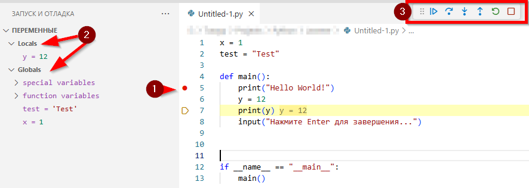
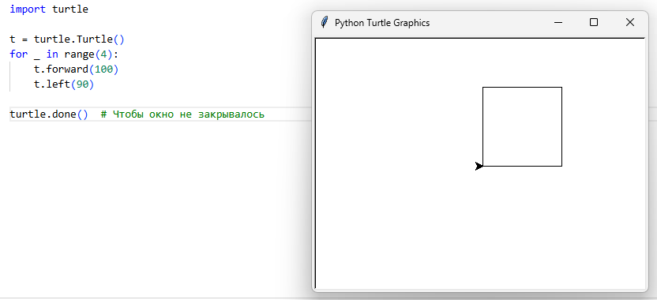

---
title: 5.09. Python
---

# 5.09. Python

## О языке

### Основы

**Python** — это высокоуровневый, интерпретируемый, динамически типизированный язык программирования общего назначения. С момента своего появления он стал одним из наиболее влиятельных языков в современной разработке программного обеспечения, нашедшим применение от системного скриптинга до машинного обучения и веб-разработки.

Python является интерпретируемым языком, что означает: исходный код не компилируется заранее в машинный код, а выполняется построчно (или блоками) специальным интерпретатором во время запуска программы.

На практике этот процесс включает несколько этапов:
	- Лексический анализ — преобразование исходного кода в последовательность токенов.
	- Синтаксический анализ — построение абстрактного синтаксического дерева (AST).
	- Компиляция в байткод — генерация платформо-независимого промежуточного представления, хранящегося в файлах .pyc.
	- Интерпретация байткода — выполнение на виртуальной машине CPython (PVM — Python Virtual Machine).

Такой подход позволяет достигать высокой степени переносимости: один и тот же код может выполняться на любой платформе, где установлен совместимый интерпретатор. Однако за это приходится платить снижением производительности по сравнению с компилируемыми языками, такими как C или Rust.

Важно отметить, что хотя Python часто называют «интерпретируемым», его реализация всё же включает элементы компиляции — именно поэтому корректнее говорить о гибридной модели исполнения: сначала компиляция в байткод, затем интерпретация. Но, в большинстве учебников мы увидим именно указание как «интерпретируемый», так что будем считать таковым.

Python реализует динамическую типизацию, что означает: тип переменной определяется во время выполнения программы на основании значения, присвоенного переменной, а не указывается явно в её объявлении.
```python
x = 5          # x имеет тип int
x = "hello"    # теперь x имеет тип str
```
Эта особенность значительно ускоряет процесс написания кода и делает его более лаконичным. Однако она также перекладывает ответственность за проверку типов на разработчика и инструменты анализа кода. В отличие от строгих статических систем (например, в Java или TypeScript), Python не предотвращает ошибки типизации на этапе компиляции. 

Следует подчеркнуть: Python обладает сильной типизацией, то есть не допускает автоматические неявные преобразования между несовместимыми типами. Например, выражение 5 + "3" вызовет исключение TypeError, поскольку операция сложения между числом и строкой не определена.

Для тех случаев, когда требуется контроль типов, начиная с версии 3.5, Python поддерживает аннотации типов (typing module), позволяя использовать статические анализаторы (например, mypy) для проверки кода вне времени выполнения.

Одним из ключевых преимуществ Python является его мультипарадигменная природа. Вы можете использовать различные парадигмы программирования в рамках одного проекта:
	- Процедурное программирование — организация кода в виде последовательности функций и инструкций.
	- Объектно-ориентированное программирование (ООП) — моделирование системы через классы и объекты, поддерживаются инкапсуляция, наследование, полиморфизм.
	- Функциональное программирование — использование чистых функций, передача функций как объектов первого класса, работа с map, filter, reduce, lambda, а также позднее добавление поддержки неизменяемых структур и декораторов.
	- Аспектно-ориентированное и метапрограммирование — через метаклассы, декораторы и дескрипторы.

Такая гибкость позволяет выбирать наиболее подходящий стиль в зависимости от задачи. Например, для математических вычислений удобны функциональные конструкции, а для моделирования бизнес-логики — ООП.

Популярность Python объясняется сочетанием нескольких факторов, каждый из которых играет важную роль в формировании экосистемы и привлечении разработчиков.

1. **Простота синтаксиса**. Синтаксис Python минималистичен и близок к псевдокоду. Отсутствие фигурных скобок, обязательное использование отступов для обозначения блоков кода, лаконичные конструкции (with, for, if) — всё это способствует высокой читаемости.
```python
if user.is_active and user.has_permission:
    send_notification(user)
```
Код легко читается даже теми, кто не владеет языком, что соответствует принципу Дзена Python: «Читаемость имеет значение».

2. **Кроссплатформенность**. Python доступен практически на всех современных платформах: Windows, macOS, Linux, а также на мобильных и встраиваемых системах. Интерпретатор можно запустить в контейнере, на сервере, в облаке или даже в браузере (через Pyodide). Это делает Python идеальным выбором для создания портируемых решений.

3. Широкая стандартная библиотека и экосистема. Python поставляется с обширной стандартной библиотекой (часто называемой «batteries included»), включающей модули для работы с файлами (os, pathlib), сетью (http, socket), датами (datetime), сериализацией (json, pickle), многопоточностью (threading, asyncio) и многим другим.

Помимо этого, менеджер пакетов pip предоставляет доступ к PyPI (Python Package Index) — крупнейшему репозиторию сторонних библиотек. На момент 2025 года в нём содержится более 500 тысяч пакетов, покрывающих практически любую предметную область: от requests и flask до numpy, pandas, scikit-learn и tensorflow.

4. Поддержка разных стилей программирования. Как уже упоминалось, Python не навязывает единственный стиль разработки. Разработчик может выбирать между функциональным, объектно-ориентированным или процедурным подходом. Это делает язык универсальным: он подходит как для быстрой прототипизации, так и для проектирования масштабируемых систем.

Python предоставляет мощный интерактивный режим, известный как REPL (Read-Eval-Print Loop). Он позволяет выполнять команды по одной, немедленно видеть результат и экспериментировать с кодом без необходимости создавать файлы. Современные инструменты, такие как IPython и Jupyter Notebook, расширяют возможности REPL, добавляя подсветку, автодополнение, визуализацию и запись сессий.

Давайте рассмотрим структуру простого скрипта. Простейший скрипт на Python представляет собой последовательность инструкций, сохранённых в файле с расширением .py. Рассмотрим базовую структуру:
```python
#!/usr/bin/env python3
"""
Модуль: hello.py
Автор: Иван Петров
Описание: Простой пример вывода сообщения.
"""

# Импорт необходимых модулей
import sys

# Определение констант
GREETING = "Привет, мир!"

# Основная логика
def main():
    print(GREETING)
    return 0

# Точка входа
if __name__ == "__main__":
    sys.exit(main())
```
Этот шаблон включает:
	- Шебанг (#!) — указание интерпретатора (для Unix-систем),
	- Docstring — документация модуля,
	- Импорты — подключение внешних зависимостей,
	- Константы и данные,
	- Функции и классы,
	- Точку входа — условие `if __name__ == "__main__"`, которое гарантирует, что код будет выполнен только при прямом запуске, а не при импорте как модуля.

Такая структура способствует созданию модульного, тестируемого и повторно используемого кода.

**Где применяется Python?**
1. Веб-разработка. Python активно используется для создания серверной части (backend) веб-приложений, API, микросервисов и полноценных веб-платформ. 

Ключевые фреймворки:
	- Django — высокопроизводительный фреймворк с «всё включено» (batteries included): ORM, админка, аутентификация, маршрутизация. Используется в Instagram, Pinterest, Mozilla.
	- Flask — микрофреймворк, дающий гибкость и контроль. Подходит для REST API, прототипов и легковесных сервисов. Часто применяется вместе с gunicorn и nginx.
	- FastAPI — современный фреймворк для создания высокопроизводительных API с автоматической документацией (Swagger/OpenAPI), типизацией и поддержкой асинхронности (async/await). Становится стандартом для новых проектов.

В веб-разработке типичными задачами являются создание RESTful и GraphQL API, разработка веб-сервисов и микросервисов, интеграция с базами данных, и работа с аутентификацией. К примеру, Instagram использует Django как основу своего backend, обрабатывая миллионы запросов в секунду.

2. Data Science и анализ данных. Python стал де-факто стандартом в аналитике и научных вычислениях благодаря удобным инструментам для работы с данными. Основные библиотеки:
	- Pandas — мощная библиотека для манипуляции и анализа табличных данных (аналог Excel на стероидах). Позволяет фильтровать, группировать, агрегировать, объединять данные.
	- NumPy — фундаментальный пакет для научных вычислений. Предоставляет многомерные массивы и векторные операции, лежит в основе многих других библиотек.
	- Matplotlib, Seaborn, Plotly — инструменты для визуализации данных: графики, диаграммы, дашборды.

Типичные задачи здесь - очистка и преобразование сырых данных, статистический анализ (среднее, медиана, корреляция), визуализация трендов и распределений, подготовка данных для машинного обучения. К примеру, аналитики в Spotify используют Pandas для обработки данных о прослушиваниях, чтобы формировать рекомендации.

3. Машинное обучение и искусственный интеллект. Python доминирует в области ML/AI благодаря богатой экосистеме специализированных библиотек.
 Ключевые библиотеки:
	- Scikit-learn — классическая библиотека для обучения моделей: регрессия, классификация, кластеризация.
	- TensorFlow и PyTorch — фреймворки для глубокого обучения (нейросетей). PyTorch особенно популярен в научных кругах, TensorFlow — в продакшене.
	- Keras — высокоуровневый интерфейс для построения нейросетей поверх TensorFlow.
	- Hugging Face Transformers — библиотека для NLP (обработки естественного языка): модели типа BERT, GPT.

Типичные задачи здесь - классификация изображений и текста, прогнозирование временных рядов (продажи, цены), генерация контента (текст, изображения), анализ тональности отзывов. К примеру, Tesla использует PyTorch для разработки алгоритмов автопилота.

4. Автоматизация и DevOps. Python хорош для написания скриптов, упрощающих рутинные задачи системного и прикладного администрирования. 
Примеры:
	- Массовое переименование файлов (os, pathlib).
	- Обработка CSV/JSON/XML (csv, json, xml.etree).
	- Архивация и копирование (shutil, zipfile).
	- Управление инфраструктурой: Ansible (написан на Python).
	- Парсинг веб-страниц: Scrapy, BeautifulSoup, requests.
	- CI/CD: запуск тестов, деплой, проверка зависимостей.
	- Мониторинг: сбор метрик CPU/RAM (psutil), проверка доступности сайтов (requests, ping3).

Скрипт на Python может каждый день скачивать отчёты с API, конвертировать их в Excel и отправлять по почте — без участия человека.

5. Графические интерфейсы (GUI). Несмотря на то, что Python не является основным языком для GUI, он предлагает несколько надёжных решений для создания десктопных приложений. Библиотеки:
	- Tkinter — встроенная библиотека, минимальные требования, подходит для простых приложений (например, калькулятор, форма ввода).
	- PyQt / PySide — мощные фреймворки на основе Qt. Позволяют создавать сложные интерфейсы с таблицами, графиками, вкладками.
	- Kivy — для кросс-платформенных приложений, включая мобильные (Android/iOS).

Типичные задачи в части GUI - создание внутренних утилит для бизнеса, интерфейсы для аналитических инструментов, обучающие программы и игры. К примеру, VLC Media Player частично использует PyQt для своих инструментов настройки.

6. Разработка игр. Хотя Python не предназначен для AAA-игр, он отлично подходит для обучения, прототипирования и 2D-игр. Основные инструменты:
	- Pygame — библиотека для создания 2D-игр: управление, спрайты, столкновения, звук.
	- Arcade — современная альтернатива Pygame с более чистым API.
	- Godot + Python (GDScript) — игровой движок с поддержкой Python-подобного языка.

Так можно обучаться основам гейм-дева, создавать головоломки, арканоиды, змейки, демо-проекты, мини-игры. К примеру, игра Battlefield 2 использовала Python для скриптования поведения персонажей и управления сетью.

7. Научные вычисления. Python широко применяется в науке, инженерии и математике благодаря точным и производительным библиотекам. Библиотеки:
	- NumPy — работа с массивами, линейная алгебра.
	- SciPy — научные алгоритмы: оптимизация, интегрирование, сигналы.
	- SymPy — символьная математика (аналитические вычисления).
	- Astropy — астрономия.
	- Biopython — биоинформатика.

Типичные задачи здесь это моделирование физических процессов, обработка экспериментальных данных, решение дифференциальных уравнений, анализ сигналов (звук, ЭЭГ). К примеру, NASA использует Python для обработки данных с космических аппаратов.

### Архитектура Python

**Python** — это целая экосистема, включающая интерпретатор, систему модулей, стандартную библиотеку, менеджеры зависимостей и различные реализации.

Центральной реализацией Python является **CPython** — эталонная и наиболее распространённая реализация, написанная на C. Именно её вы скачиваете с официального сайта python.org , именно она используется в подавляющем большинстве проектов, от скриптов до масштабируемых сервисов.

Работа CPython включает следующие компоненты:
	- Lexer и Parser — разбор синтаксиса.
	- Compiler — компилятор, его задача - генерация байткода.
	- Interpreter Loop (PVM) — виртуальная машина для выполнения байткода.
	- Memory Manager — управление памятью через счётчик ссылок и сборщик мусора.
	- Global Interpreter Lock (GIL) — механизм, ограничивающий выполнение байткода одним потоком одновременно. Это ограничивает параллелизм в CPU-bound задачах, но не мешает эффективному использованию асинхронности и многопроцессорности.

Альтернативные реализации, такие как PyPy (с JIT-компиляцией), Jython (для JVM) и IronPython (.NET), предлагают другие компромиссы, но CPython остаётся стандартом де-факто.

CPython — это не только интерпретатор, но и полная система выполнения, включающая, как мы выяснили, парсер, компилятор в байт-код, виртуальную машину PVM, менеджер памяти, сборщик мусора и GIL. Давайте подробнее.

Процесс запуска Python-скрипта проходит через несколько этапов:
1. Лексический анализ (Lexer). На первом шаге исходный код (`*.py`) разбивается на лексемы — минимальные значимые единицы: ключевые слова, операторы, идентификаторы, строки и т.д.
Например, строка x = 5 + 3 превращается в последовательность: `[ID(x), ASSIGN, INT(5), PLUS, INT(3)]`.
2. Синтаксический анализ (Parser). Лексемы передаются парсеру, который строит абстрактное синтаксическое дерево (AST) — иерархическую структуру, отражающую логику программы. Это дерево становится основой для дальнейшей компиляции.
3. Компиляция в байткод. Из AST генерируется байткод — платформо-независимый набор инструкций, предназначенный для выполнения на виртуальной машине Python (PVM). Байткод сохраняется в файлах .pyc в папке `__pycache__`.
```python
import dis
def hello():
    return "Hello"

dis.dis(hello)
# Выход:
#   2           0 LOAD_CONST               1 ('Hello')
#               2 RETURN_VALUE

```
4. Интерпретация байткода (PVM). Байткод выполняется на Python Virtual Machine (PVM) — цикле, который читает и исполняет инструкции по одной. PVM — это часть CPython, написанная на C, и именно она обеспечивает кроссплатформенность.

Повторим: хотя Python часто называют «интерпретируемым», он всё же компилируется в байткод, что делает его гибридной системой, близкой к Java или .NET.
5. Управление памятью. Память в Python управляется автоматически:
	- Счётчик ссылок — основной механизм: каждый объект хранит количество ссылок на него. Когда оно достигает нуля, объект немедленно удаляется.
	- Сборщик мусора (GC) — дополняет систему, обнаруживая и удаляя циклические ссылки, которые счётчик не может обработать.
Объекты живут в private heap — закрытой области памяти, управляемой интерпретатором. Разработчик не имеет прямого доступа к указателям.
6. Global Interpreter Lock (GIL). GIL — это мьютекс (взаимное исключение), который гарантирует, что только один поток одновременно выполняет байткод. Это означает, что даже на многопроцессорных системах CPU-bound задачи не могут быть параллельны в рамках одного процесса.
Что это значит на практике?
	- Для I/O-bound задач (сетевые запросы, файлы, базы данных) асинхронность (async/await) и многопоточность остаются эффективными.
	- Для CPU-bound задач (расчёты, обработка массивов) необходимо использовать многопроцессорность (multiprocessing) или переходить на PyPy.

GIL не является недостатком, а скорее компромиссом ради простоты и производительности в типичных сценариях. Его удаление — предмет активных дискуссий (PEP 703).

Теперь вернёмся к уровню выше. Одним из ключевых преимуществ Python является его модульная архитектура, позволяющая организовывать код в повторно используемые компоненты.

Модуль — это файл с расширением .py, содержащий код: функции, классы, переменные, выражения.
```python
# math_utils.py
def add(a, b):
    return a + b

PI = 3.14159
```
Импорт:
```python
import math_utils
print(math_utils.add(2, 3))  # 5

from math_utils import PI
print(PI)  # 3.14159
```
Каждый модуль — это пространство имён (namespace). Имена модулей должны быть в стиле snake_case. При импорте модуль выполняется один раз и кэшируется в sys.modules.

Код можно организовать в иерархию через пакеты.

**Пакет** — это каталог, содержащий файл `__init__.py` (может быть пустым), который сообщает интерпретатору, что каталог является пакетом.

Структура:
```
my_package/
    __init__.py
    module_a.py
    subpackage/
        __init__.py
        module_b.py
```
Импорт:
```python
import my_package.module_a
from my_package.subpackage import module_b
```
Файл `__init__.py` может содержать код инициализации пакета, экспорт нужных сущностей через `__all__`, предварительный импорт модулей для удобства.

Python поставляется с мощной стандартной библиотекой, часто называемой «batteries included». Вот ключевые модули:

| Модуль | Назначение |
|-----|---------|
|os	|Работа с операционной системой: файлы, пути, переменные окружения.
|sys	|Доступ к параметрам интерпретатора:argv,path,exit().
|json	|Сериализация/десериализация JSON.
|csv	|Чтение и запись CSV-файлов.
|datetime	|Работа с датами и временем.
|random	|Генерация случайных чисел.
|math	|Математические функции:sin,log,sqrt.
|string	|Константы и методы для работы со строками.
|email	|Создание и разбор email-сообщений.
|http	|Работа с HTTP: клиент (client), сервер (server).
|ssl	|Поддержка SSL/TLS для безопасного соединения.
|tkinter	|Создание графических интерфейсов (GUI).

Эти модули не требуют установки и доступны в любом окружении Python.

Для управления внешними библиотеками используются менеджеры пакетов и репозитории. Их вкратце мы уже упоминали.

PyPI — Python Package Index, центральный репозиторий сторонних пакетов. Официальный сайт: pypi.org. Имеется возможность поиска через `pip search <название>`. Примеры популярных пакетов: requests, flask, numpy, pandas.

pip — утилита командной строки для установки, обновления и удаления пакетов. Работает она так:
```bash
pip install requests
pip install -r requirements.txt
pip freeze > requirements.txt
pip uninstall package_name
```
Существуют альтернативные менеджеры - conda, poetry, uv, pip-tools.

Не путайте PyPI и PyPy. PyPy - альтернатива CPython, написанная на подмножестве RPython, включающая JIT-компилятор (Just-In-Time), что даёт в 4–10 раз повышение производительности в CPU-bound задачах. Она совместима с большинством CPython-кода, однако не поддерживает все C-расширения (например, pandas работает, но медленнее).

Jython - реализация Python для JVM (Java Virtual Machine), позволяющая использовать Java-библиотеки напрямую. Нет GIL, можно использовать многопоточность Java, но отстаёт от актуальных версий Python. Как можно понять, это для интеграции с Java-системами.

IronPython - реализация для .NET Framework. Имеется интеграция с C#, ASP.NET, WPF и взаимодействие с .NET-библиотеками, для Windows-среды.

MicroPython оптимизирован для микроконтроллеров (ESP32, Raspberry Pi Pico), с минимальным объёмом памяти и поддержкой GPIO, I2C, UART. Для IoT и встраиваемых систем.

### Фреймворки

Фреймворки в экосистеме Python предоставляют готовые инструменты для маршрутизации, обработки запросов, работы с базами данных, аутентификации и многого другого, позволяя разработчикам сосредоточиться на бизнес-логике, а не на низкоуровневой инфраструктуре.

Давайте рассмотрим фреймворки, и сгруппируем их как синхронные и асинхронные.

**Синхронные фреймворки** обрабатывают один HTTP-запрос за раз в рамках одного потока. Пока запрос не завершён (например, ожидается ответ от базы данных), поток блокируется. Это простая модель, но она может стать узким местом при высокой нагрузке или большом количестве I/O-операций.

Django — это полноценный веб-фреймворк с широким набором встроенных возможностей: ORM, админка, система шаблонов, аутентификация, миграции, кэширование и многое другое.

У него есть высокий уровень абстракции, мощная ORM, поддерживающая множественные БД (PostgreSQL, MySQL, SQLite), встроенная админ-панель для управления данными, поддержка MVC/MVT-архитектуры. Пример:
```python
from django.http import HttpResponse
from django.views import View

def hello(request):
    return HttpResponse("Hello from Django!")
```
Django применяется в Instagram, Pinterest, Mozilla, The Washington Post.

Flask — минималистичный фреймворк, предоставляющий только базовые инструменты: маршрутизацию, обработку запросов и шаблоны. Всё остальное (ORM, валидация, авторизация) добавляется через расширения.

Собственно, это главная особенность - гибкая архитектура, можно начать с малого и масштабироваться в дальнейшем. Здесь довольно богатая экосистема расширений, к примеру, Flask-SQLAlchemy, Flask-WTF, Flask-Login. Пример:
```python
from flask import Flask
app = Flask(__name__)

@app.route('/')
def hello():
    return "Hello from Flask!"
```
Pyramid позиционируется как фреймворк для проектов любого масштаба — от простых скриптов до крупных систем. Здесь есть поддержка как минималистичного, так и расширенного подхода, гибкая система маршрутизации, интеграция с различными ORM и шаблонизаторами. Подходит, когда нужна гибкость Flask, но с возможностью масштабирования до уровня Django.

**Асинхронные фреймворки** используют модель event loop и корутины (async/await), что позволяет обрабатывать тысячи соединений одновременно без блокировки потоков. Это особенно важно для I/O-bound задач: сетевые запросы, работа с БД, WebSocket.

aiohttp — один из первых асинхронных фреймворков на Python, построенный на asyncio. Он поддерживает как серверную часть (web server), так и асинхронный HTTP-клиент.

Ключевые возможности - обработка тысяч запросов параллельно, поддержка WebSocket. Пример:
```python
from aiohttp import web

async def hello(request):
    return web.Response(text="Hello from Aiohttp!")

app = web.Application()
app.add_routes([web.get('/', hello)])
web.run_app(app)
```
FastAPI — один из самых популярных современных фреймворков, сочетающий асинхронность, автоматическую документацию (Swagger/OpenAPI) и поддержку аннотаций типов.

Он основан на Starlette (для web) и Pydantic (для валидации), имеет автоматическую генерацию интерактивной документации, и высокую производительность (оправдывая название). Пример:
```python
from fastapi import FastAPI

app = FastAPI()

@app.get("/")
async def hello():
    return {"message": "Hello from FastAPI!"}
```
gevent — это библиотека, реализующая cooperative multitasking с помощью зелёных потоков (greenlets). Она позволяет запускать синхронный код в асинхронном режиме, перехватывая I/O-вызовы. Она перезаписывает стандартные функции ввода-вывода (например, socket, time.sleep) на неблокирующие версии и не требует использования async/await.

```python
from gevent.pywsgi import WSGIServer
from flask import Flask

app = Flask(__name__)

@app.route('/')
def hello():
    return 'Hello from Flask + Gevent!'

# Запуск Flask с Gevent
http_server = WSGIServer(('0.0.0.0', 5000), app)
http_server.serve_forever()
```
Это нужно для ускорения уже существующих Flask/Django-приложений.

Хотя Flask изначально был синхронным, с выходом Flask 2.0 и Python 3.7+ он получил поддержку асинхронных view-функций. Начиная с Flask 2.0, можно использовать async def:
```python
from flask import Flask
import asyncio

app = Flask(__name__)

@app.route('/async')
async def async_route():
    await asyncio.sleep(1)
    return "Async in Flask!"
```
С ограничениями, конечно. Асинхронность работает только с ASGI-серверами (например, Hypercorn, Uvicorn) и большинство расширений Flask всё ещё синхронные, и нет поддержки WebSocket. Flask можно использовать в асинхронном режиме, но он не является «нативно асинхронным» фреймворком, как FastAPI или Aiohttp.

### Окружения

Одним из ключевых аспектов профессиональной разработки на Python является корректное управление окружением — изолированной средой, в которой устанавливаются зависимости проекта. Без этого возникают конфликты между версиями библиотек, несовместимости с системными пакетами и проблемы при развёртывании (deployment). В этой главе мы подробно рассмотрим понятие окружения, его назначение и основные инструменты для его управления.

**Окружение (environment)** — это изолированная среда выполнения Python-приложения, включающая свою копию интерпретатора (или ссылку на него), отдельную директорию с установленными пакетами и независимый sys.path.

Представьте: один проект использует Django 3.2, а другой — Django 5.0. Если установить оба глобально, они перезапишут друг друга. Окружение позволяет каждому проекту иметь свои зависимости без конфликтов.

Существуют два основных типа окружений:
	- Виртуальные окружения (virtual environments) — изолируют зависимости.
	- Инструменты управления версиями Python (Python version managers) — позволяют переключаться между разными версиями самого интерпретатора.

Рассмотрим основные инструменты.

1. venv — это встроенный модуль Python (начиная с версии 3.3), предназначенный для создания лёгких виртуальных окружений.
```bash
python -m venv myenv
```
Эта команда создаст директорию myenv/, содержащую:
	- bin/ (на Linux/macOS) или Scripts/ (на Windows) — исполняемые файлы (python, pip).
	- lib/ — установленные пакеты.
	- pyvenv.cfg — конфигурация окружения.

Активация производится так:
```
# Linux/macOS
source myenv/bin/activate

# Windows
myenv\Scripts\activate
```
После активации вы увидите (myenv) в командной строке — это означает, что все последующие команды pip install будут влиять только на это окружение.

Деактивация - deactivate.

2. virtualenv — сторонняя библиотека, предшественник venv. Обеспечивает те же функции, но с дополнительными возможностями. Установка:
```bash
pip install virtualenv
```
Использование:
```
virtualenv myenv
source myenv/bin/activate  # Linux/macOS
```
Для новых проектов рекомендуется использовать venv, так как он «родной». virtualenv актуален в legacy-системах.

3. pipenv — это инструмент, объединяющий pip и virtualenv в единую систему с поддержкой lock-файлов, графа зависимостей и автоматического управления окружением.

Установка:
```bash
pip install pipenv
```
Инициализация проекта:
```bash
cd myproject
pipenv install
```
Это создаст:
	- Pipfile — замена requirements.txt, содержит прямые зависимости.
	- Pipfile.lock — зафиксированные версии всех пакетов (включая транзитивные), гарантирует воспроизводимость.

Установка пакетов:
```bash
pipenv install requests        # Добавит в [packages]
pipenv install pytest --dev    # Добавит в [dev-packages]
```
Активация оболочки:
```bash
pipenv shell
```
Это автоматически активирует виртуальное окружение.

Запускать команды уже так:
```bash
pipenv run python script.py
```

4. pyenv решает другую задачу: он позволяет устанавливать и переключаться между разными версиями интерпретатора Python.

Зачем это нужно?
	- Проект A требует Python 3.8.
	- Проект B использует новейшие фичи Python 3.12.
	- Системный Python — 3.9.

pyenv позволяет иметь все три и переключаться по необходимости.

5. pyproject.toml — это конфигурационный файл, стандартизированный в PEP 518 и PEP 621, который заменяет собой комбинацию setup.py, setup.cfg, requirements.txt.

## История и философия

### История

Python часто воспринимается как «новый» язык, особенно в контексте его текущей популярности в data science, DevOps и веб-разработке. Однако это заблуждение. Python был создан в конце 1980-х годов и выпущен в начале 1990-х — что делает его старше таких языков, как Java (1995), JavaScript (1995) или PHP (1995). Его история — это не история быстрого успеха, а постепенная эволюция, опирающаяся на фундаментальные принципы дизайна, сообщественную разработку и адаптацию к меняющимся потребностям индустрии.

В конце 1980-х Гвидо ван Россум работал в Центре математики и информатики (CWI) в Нидерландах над проектом ABC — языком, ориентированным на обучение программированию. Хотя ABC был элегантным и удобным для начинающих, он не получил широкого распространения из-за ограничений в производительности, портируемости и возможности расширения.

После завершения работы над ABC Гвидо присоединился к проекту Amoeba — распределённой операционной системе, объединяющей вычислительные ресурсы в единое пространство. Одной из ключевых проблем Amoeba была отсутствие гибкого языка сценариев, способного управлять системой и автоматизировать задачи. Существующие решения (например, Bourne shell или C) не подходили по уровню абстракции и удобству.

В декабре 1989 года, во время рождественских каникул, Гвидо ван Россум решил создать такой язык самостоятельно. Он взял за основу концепции ABC, но добавил возможность расширения через модули, работу с системными вызовами и поддержку типов данных, близких к тем, что использовались в C. Первый прототип включал:
	- Виртуальную машину, интерпретирующую байт-код;
	- Базовый синтаксис, включающий отступы вместо фигурных скобок;
	- Простые структуры данных: списки, словари, кортежи;
	- Поддержку функций и модулей.

Работа над языком велась в одиночку, но уже через три месяца — к весне 1990 года — был готов рабочий прототип, который был представлен коллегам в CWI. Разработчики быстро оценили его потенциал и начали использовать в своих проектах, параллельно внося предложения по улучшению.
20 февраля 1991 года Гвидо ван Россум опубликовал первую версию Python — 0.9.0 — в новостной группе Usenet comp.lang.python. Проект не имел официального финансирования, не был частью корпоративной стратегии и развивался исключительно благодаря энтузиазму участников. Такой подход соответствует модели Skunkworks — неформальной, экспериментальной разработке вне стандартных процессов.

Название языка было выбрано спонтанно: Гвидо, будучи поклонником британского комедийного шоу «Летающий цирк Монти Пайтона», просто использовал слово «Python» как первую пришедшую в голову ассоциацию. Логотип того времени был минималистичным — текстовое написание слова «Python» случайным шрифтом, без графических элементов.

Этот логотип просуществовал до 2006 года. К тому времени пользователи массово ассоциировали язык со змеями — символом, который использовался на обложках книг, в статьях и презентациях. Чтобы устранить несоответствие между визуальным восприятием и официальным брендом, был разработан новый логотип: два переплетённых питона — синий и жёлтый — рядом с текстовым названием. Этот символ стал визуальной идентификацией языка и используется по сей день.

Python был реализован на языке C, что обеспечило ему высокую портируемость и возможность интеграции с существующими системами. Интерпретатор, виртуальная машина и стандартная библиотека были написаны на C, что позволило запускать Python на множестве платформ, включая Unix, MS-DOS и позднее — Windows и macOS.

Первый стабильный релиз, который заложил основу для дальнейшего развития, был 26 января 1994 года - версия Python 1.0, включавшая в себя поддержку модулей и пакетов, обработку исключений, базовые механизмы объектно-ориентированного программирования, функции высшего порядка, лямбда-функции.

Версия Python 2.0 была выпущена в октябре 2000 года, введя генераторы списков (мощный синтаксический сахар для создания коллекций), сборщик мусора (автоматическое управление памятью, упрощающее разработку), поддержку Unicode (необходимое условие для работы с многоязычными данными) и новый стиль классов, унифицировавший подход к ООП.

Python 3.0 — декабрь 2008 года. Это первая версия, которая стала несовместимой с предыдущими, так как устраняла технический долг и упрощала язык. Здесь были удалены дублирующие конструкции, улучшен синтаксис и семантика, расширена поддержка Unicode, и появилось асинхронное программирование, получившее развитие в дальнейших версиях. Миграция с Python 2 на Python 3 заняла более десяти лет, но в 2020 году поддержка Python 2 была официально прекращена.

Последующие версии уже менялись только минорно - 3.5-3.12. К примеру, 3.12 была выпущена в октябре 2023 года. Теперь в языке есть async/await, F-строки, он более производительный и безопасный.

Для координации развития языка и принятия решений была создана система PEP (Python Enhancement Proposals) — документы, описывающие новые функции, процессы или изменения в языке. PEP-ы проходят публичное обсуждение, рецензирование и голосование. Самый известный — PEP 8 — содержит рекомендации по стилю кода.

В 2001 году была учреждена Python Software Foundation (PSF) — некоммерческая организация, ответственная за развитие языка, защиту его лицензии и поддержку сообщества. PSF не является владельцем языка, но обеспечивает инфраструктуру для его управления.

Чтобы избежать зависимости от одного человека, в PSF был создан Совет директоров, избираемый сообществом. Гвидо ван Россум, игравший центральную роль в развитии языка, получил титул Benevolent Dictator For Life (BDFL) — шуточное название, отражающее его авторитет и влияние. В 2018 году он добровольно передал полномочия Совету, чтобы обеспечить устойчивое развитие языка вне зависимости от личности одного человека.
В октябре 2025 года Python выпустил версию 3.14, где выполнен был крупный шаг - он стал по-настоящему многопоточным. Глобальный интерпретатор блокировки (GIL) не позволял потокам работать параллельно на нескольких ядрах процессора — вместо этого они вынуждены были терпеливо ждать своей очереди. 

Главная новость релиза — free-threaded Python стал официально поддерживаемым режимом сборки (PEP 779). Это значит, что GIL больше не является обязательным. Разработчики могут выбирать между традиционной версией с GIL и free-threaded сборкой, где потоки выполняются параллельно, без взаимных блокировок.

Free-threaded Python — это специальная версия интерпретатора CPython, в которой отсутствует GIL (Global Interpreter Lock) — глобальная блокировка интерпретатора, которая десятилетиями мешала настоящей параллельной работе потоков в Python.

В обычном Python (с GIL) только один поток может выполняться одновременно, даже если у нас 16 ядер. Это значит, что threading часто не помогает ускорить CPU-тяжёлые задачи — потоки вынуждены ждать друг друга. Free-threaded сборка удаляет этот лимит: теперь потоки могут работать по-настоящему параллельно, используя все ядра процессора. Вместо GIL, free-threaded Python использует тонкие блокировки (fine-grained locks) или атомарные операции на уровне отдельных объектов и данных. Это позволяет нескольким потокам безопасно читать и писать в разные части программы одновременно, сохранять стабильность и избежать гонок данных (race conditions), но без централизованной блокировки. Технически это стало возможным благодаря PEP 703, который был реализован начиная с Python 3.13, а в 3.14 стал официально поддерживаемым и готовым к использованию.

### Философия

Философия Python не зафиксирована в официальных стандартах, но она глубоко интегрирована в язык, его стандартную библиотеку, документацию и культуру разработчиков. Центральным текстом этой философии является «Дзен Python» (The Zen of Python), доступный непосредственно из интерпретатора командой:
```python
import this
```
Этот текст, написанный Тимом Петерсом (Tim Peters) в 1999 году, представляет собой 19 афористических принципов, описывающих эстетические, практические и методологические установки, лежащие в основе проектирования языка. Он не является нормативным документом, но выполняет функцию неявного конституционного кодекса — ориентира при обсуждении изменений в языке, выборе стиля кода или оценке решений.
Давайте рассмотрим их.

1. Красивое лучше, чем уродливое. Эстетика кода рассматривается как показатель качества. Код, который легко воспринимается визуально, чаще всего хорошо структурирован и соответствует логике задачи.
2. Явное лучше, чем неявное. Предпочтение отдается прозрачным конструкциям. Например, явное объявление переменной лучше, чем её подразумевание через контекст (в отличие от Perl). Это снижает риск ошибок и упрощает анализ.
3. Простое лучше, чем сложное. Один из ключевых принципов проектирования. Python стремится минимизировать количество способов решения одной задачи. Сложные паттерны используются только при необходимости.
4. Сложное лучше, чем запутанное. Признание, что некоторые задачи по своей природе сложны. Однако даже сложное решение должно быть понятным и последовательным — в отличие от запутанного, где логика теряется.
5. Плоское лучше, чем вложенное. Высокая степень вложенности (например, циклы внутри условий внутри функций) затрудняет чтение. Python поощряет плоскую структуру — через декомпозицию на функции, генераторы, списковые включения и т.п.
6. Разреженное лучше, чем плотное. Пробелы, пустые строки, отступы — не просто стиль, а средство организации. Перегруженный строками код труднее анализировать.
7. Читаемость имеет значение. Одно из самых известных положений. Код читают гораздо чаще, чем пишут. Поэтому приоритет отдаётся читаемости даже ценой некоторого усложнения синтаксиса (например, len(lst) вместо lst.length).
8. Особые случаи не настолько особые, чтобы нарушать правила. Исключения не должны порождать хаос. Даже редкие ситуации должны укладываться в общие принципы, если это возможно.
9. Хотя практичность важнее чистоты. Баланс между идеализмом и реальностью. Если строгое следование абстракции мешает решить задачу — допускается компромисс. Пример: модуль datetime, который неидеален, но работает.
10. Ошибки никогда не должны замалчиваться. Явное указание на важность обработки исключений. Молчащие ошибки — источник скрытых багов. В Python большинство ошибок приводят к выбросу исключения, а не к неопределённому поведению.
11. Если не замаскированы явно. Уточнение предыдущего пункта: есть случаи, когда ошибку можно игнорировать, но только при явном указании (например, try: ... except: pass требует осознанного решения).
12. В интерактивном режиме лучше сказать «подожди». Отсылка к поведению REPL: если операция требует времени, интерпретатор должен давать обратную связь, а не молчать. Это важно для пользовательского опыта.
13. Если реализацию сложно объяснить — плохая идея. Сложность объяснения часто свидетельствует о недостатках самой реализации. Хорошее решение должно быть интуитивно понятным.
14. Если реализацию легко объяснить — возможно, хорошая идея. Обратная сторона предыдущего. Простота объяснения — признак ясности модели.
15. Пространства имён — отличная штука! Сделаем их побольше! Поддержка модульности. Пространства имён позволяют избежать коллизий имён, упрощают масштабирование и повторное использование кода.
16–19. (Пустые строки). Намеренное отсутствие содержания. Возможно, ироничное напоминание о том, что не всё нужно формулировать, или намёк на завершённость системы. В оригинальном PEP 20 указано, что автор остановился на 19-ти, оставив место для молчания — как метафора ограничения формализма.

Из Дзена вытекают ключевые установки, которые руководили разработкой Python с самого начала - читаемость, очевидность и минимализм.

## Первая программа

### Установка и настройка среды

Python является свободным программным обеспечением с открытым исходным кодом, поддерживаемым сообществом и организацией Python Software Foundation (PSF). Официальный репозиторий дистрибутивов расположен по адресу python.org . Именно с этого сайта рекомендуется загружать интерпретатор, поскольку дистрибутивы проверяются на целостность, собираются официальной командой разработчиков CPython и исключается риск загрузки модифицированных или заражённых версий интерпретатора, что возможно при использовании сторонних зеркал или пакетных менеджеров неизвестного происхождения.

Дистрибутивы доступны для всех основных платформ: Windows, macOS и большинства дистрибутивов Linux. На сайте представлены как последние стабильные версии, так и предрелизные сборки (alpha, beta, release candidates), предназначенные для тестирования. При выборе версии следует ориентироваться на актуальную стабильную ветку (на момент написания — Python 3.13.x). Версии Python 2.x официально устарели (end-of-life с 1 января 2020 года) и не должны использоваться в новых проектах.

После установки Python представляет собой комплекс программных компонентов, объединённых в единую исполняемую среду. Ниже приведено описание ключевых элементов, входящих в состав стандартной установки.

Основной компонент — интерпретатор python.exe (Windows) или python (Unix-подобные системы), реализованный на языке C и известный как CPython. Это эталонная реализация языка Python, определяющая поведение спецификации языка. Интерпретатор выполняет парсинг исходного кода (лексический и синтаксический анализ), компиляцию в байт-код, выполнение байт-кода на виртуальной машине PVM и управление памятью через сборщик мусора (garbage collector), использующий комбинацию подсчёта ссылок и циклического детектора.

Интерпретатор не является традиционным компилятором, преобразующим код в машинные инструкции напрямую. Вместо этого он работает по модели «интерпретируемый язык с компиляцией на лету»: каждый .py-файл компилируется в .pyc (байт-код), который затем выполняется PVM.

В состав дистрибутива входит IDLE (Integrated Development and Learning Environment) — простая IDE, написанная на Tkinter. Она предназначена в первую очередь для обучения и прототипирования. IDLE предоставляет интерактивную оболочку (REPL), позволяющую выполнять выражения по одному; редактор с подсветкой синтаксиса, автозавершением и возможностью отладки; возможность запуска скриптов с отображением вывода и ошибок.


Хотя IDLE не используется в профессиональной разработке из-за ограниченных возможностей, она остаётся полезным инструментом для новичков и диагностики проблем, так как не требует дополнительных зависимостей.
Одна из ключевых особенностей Python — богатая стандартная библиотека (stdlib), включающая модули для работы с файловой системой, сетью, сериализацией, многопоточностью, регулярными выражениями и т.д. Эти модули устанавливаются вместе с интерпретатором и доступны без дополнительных действий.

Давайте рассмотрим процесс установки.
1. **Windows**.
На Windows установка осуществляется через графический установщик (.exe). Ключевой момент - нужно отметить опцию «Add Python to PATH», чтобы интерпретатор был доступен из любого каталога через терминал. 

Установщик может автоматически использовать Microsoft Store (начиная с Python 3.9), но рекомендуется скачивать дистрибутив напрямую с python.org, чтобы иметь полный контроль над окружением. После установки создаются ярлыки на IDLE и Python (Command Line).

2. **macOS**.
Для macOS доступны два основных пути:
	- Официальный установщик от python.org — устанавливает Python в `/Library/Frameworks/Python.framework/`, что позволяет избежать конфликтов с системным Python (который используется самой macOS и может быть удалён или изменён при обновлении ОС).
	- Через пакетные менеджеры (Homebrew) — brew install python устанавливает Python в `/usr/local/bin/` (или в `~/.brew` при ARM). Этот способ удобен для управления несколькими версиями.

Системный Python (`/usr/bin/python3`) не рекомендуется модифицировать.

3. **Linux**. На большинстве дистрибутивов Linux Python уже предустановлен, но часто в минимальной конфигурации. Для полноценной разработки необходимо установить дополнительные пакеты:
```
# Ubuntu/Debian
sudo apt install python3 python3-pip python3-venv python3-dev

# Fedora
sudo dnf install python3 python3-pip python3-virtualenv
```
Здесь:
	- python3 — интерпретатор.
	- python3-pip — менеджер пакетов.
	- python3-venv — модуль для создания виртуальных окружений.
	- python3-dev — заголовочные файлы, необходимые для компиляции расширений на C.

После установки необходимо убедиться, что интерпретатор корректно добавлен в переменную окружения PATH. Это можно сделать, выполнив в терминале:
```bash
python --version
```
Команда должна вернуть строку вида Python 3.x.y. Если команда не распознаётся, это указывает на то, что Python не добавлен в PATH, либо установлен некорректно. Переменная PATH — это системная переменная, содержащая список директорий, в которых операционная система ищет исполняемые файлы при вводе команды в терминале. При установке Python с отметкой "Add Python to PATH", путь к исполняемому файлу (например, C:\Python312\ на Windows или `/usr/local/bin/` на Unix) добавляется в этот список.

Это позволяет запускать python из любого каталога, выполнять скрипты через python script.py и использовать pip без указания полного пути. 
Также можно запустить интерактивный режим, написав python, что вызовет REPL с приглашением `>>>`, где можно выполнять Python-выражения.

С версии Python 3.4 pip входит в состав дистрибутива по умолчанию. Это инструмент командной строки для установки, обновления и удаления сторонних пакетов из репозитория PyPI (Python Package Index). Его наличие означает, что пользователь может сразу начать работу с внешними библиотеками.

Когда вы выполняете команду: «pip install requests» происходит следующее:
	- pip обращается к PyPI (https://pypi.org ) — центральному репозиторию пакетов Python.
	- Находит последнюю совместимую версию пакета requests и его зависимости.
	- Скачивает архив (обычно .whl или .tar.gz).
	- Распаковывает и устанавливает файлы в директорию site-packages.

Путь к site-packages зависит от системы и типа установки:
	- Windows: `C:\Users\<user>\AppData\Local\Programs\Python\Python312\Lib\site-packages`
	- macOS (python.org): `/Library/Frameworks/Python.framework/Versions/3.12/lib/python3.12/site-packages`
	- Linux (system-wide): `/usr/local/lib/python3.12/site-packages`
	- Virtual environment: `<venv_dir>/lib/python3.12/site-packages`

Путь можно узнать, выполнив:
```python
import site
print(site.getsitepackages())
```
или для текущего пользователя:
```python
print(site.getusersitepackages())
```
Установка пакетов без виртуального окружения (в глобальное site-packages) может привести к конфликтам версий между проектами. Поэтому рекомендуется всегда использовать изолированные окружения.

Существует несколько способов выполнения Python-кода. Выбор зависит от контекста: разработка, отладка, автоматизация, производственное развертывание.

1. ***Через командную строку***.
```python
python script.py
```
Интерпретатор загружает файл, компилирует его в байт-код (сохраняя .pyc в `__pycache__/` при необходимости), и выполняет. Аргументы передаются через sys.argv.

2. **Из IDLE**. 

В IDLE можно:
	- Написать код в редакторе и нажать F5 (Run Module) — файл сохраняется и выполняется в интерактивной оболочке.
	- Вводить команды напрямую в оболочке (REPL) — удобно для тестирования.

3. **Из IDE (PyCharm, VS Code и др.)**.
IDE предоставляют кнопку Run, которая:
	- Сохраняет файл.
	- Формирует команду запуска (возможно, с параметрами, переменными окружения, путями к интерпретатору).
	- Запускает процесс и перехватывает stdout/stderr.
	- Отображает результат в панели вывода.

4. **Как исполняемый файл**. На Unix-подобных системах можно сделать скрипт исполняемым:
```
chmod +x script.py
```
и добавить шебанг в первую строку:
```
#!/usr/bin/env python3
```
После этого скрипт можно запускать как `./script.py`.

5. **Через модуль -m**
Некоторые пакеты запускаются как модули:
```bash
python -m http.server 8000
```
Это вызывает `__main__.py` внутри пакета http.server.

6. **Онлайн-интерпретаторы**.
Сервисы вроде repl.it, Google Colab, Jupyter Notebook (в облаке) позволяют выполнять Python-код в браузере. Они используют серверные Docker-контейнеры с предустановленным Python и библиотеками. Преимущество — отсутствие необходимости локальной установки; недостаток — ограничения по ресурсам, безопасности и доступу к файловой системе.


Программировать, конечно, легче через IDE. 

**Visual Studio Code** — текстовый редактор с мощной экосистемой расширений. Для поддержки Python используется расширение Python, разрабатываемое Microsoft. Оно обеспечивает подсветку синтаксиса и автозавершение, интеграцию с отладчиком, поддержку виртуальных окружений, запуск и выполнение фрагментов кода, интеграцию с Jupiter Notebook, линтинг и форматирование.

Расширение работает следующим образом:
	- При открытии .py-файла активируется интерпретатор Python, выбранный пользователем (можно выбрать через команду Python: Select Interpreter).
	- Запускается языковой сервер (по умолчанию — Pylance), который анализирует код в фоне, строит AST (абстрактное синтаксическое дерево), предоставляет навигацию по символам, типам и рефакторинг.
	- При запуске скрипта VS Code формирует команду вида python path/to/script.py и выполняет её в интегрированном терминале.
	- Отладка осуществляется через debugpy, который запускается как отдельный процесс и взаимодействует с редактором по протоколу DAP (Debug Adapter Protocol).

### Создание программы

После установки и настройки среды разработки следующий шаг — написание и запуск первой программы. В этом разделе рассматриваются три типовых сценария, отражающих различные подходы к созданию простейшего скрипта print("Hello World!") в разных средах.

**Сценарий 1**. Запуск print("Hello World!") в IDLE.

1. **Запуск IDLE**.

На Windows: через меню «Пуск» найдите IDLE (Python 3.x) и запустите.

На macOS/Linux: в терминале выполните «idle3» или «`python3 -m idlelib.idle`». Откроется окно интерактивной оболочки (REPL) с приглашением `>>>`.

2. **Создание нового файла**. Чтобы написать программу, а не просто выполнить команду в REPL:
	- Перейдите в меню File → New File.
	- Откроется пустое окно редактора.

3. **Написание кода**. Введите следующую строку:
```python
print("Hello World!")
```
Это выражение вызывает встроенную функцию print, которая выводит переданную строку в поток стандартного вывода (stdout).

4. **Сохранение файла**. 
	- Выберите File → Save As…
	- Укажите имя файла, например, hello.py.
	- Убедитесь, что расширение .py присутствует.
	- Сохраните в удобное место (например, на рабочем столе).

5. **Запуск программы**. 
В меню выберите Run → Run Module (или нажмите F5). Если файл ещё не сохранён, IDLE запросит сохранение. После запуска в окне оболочки (REPL) появится:
```python
Hello World!
>>> 
```
Программа выполняется в том же процессе, что и оболочка. Переменные, определённые в скрипте, остаются доступными после завершения (если нет `if __name__ == '__main__':`).

Отладка возможна через встроенный отладчик (Debug → Debugger), но используется редко. Так, можно сказать что IDLE подходит для обучения, но не рекомендуется для сложных проектов из-за ограниченной производительности и функциональности.

**Сценарий 2**. Запуск print("Hello World!") и input() в VS Code.

1. Установка необходимых компонентов. Убедитесь, что:
	- установлен Python (проверьте: python --version);
	- установлено расширение Python от Microsoft (в Marketplace: ms-python.python);
	- активирован интерпретатор (нижняя панель должна показывать выбранную версию Python).

2. Создание файла:
	- откройте директорию проекта (например, first_program);
	- создайте новый файл: Ctrl+N → Ctrl+S → укажите имя hello.py.

3. Написание кода. Введите следующий код:
```python
print("Hello World!")
input("Нажмите Enter для завершения...")
```

Функция input() останавливает выполнение программы до ввода символа (в данном случае — Enter). Это предотвращает мгновенное закрытие окна вывода при запуске.

4. **Запуск программы**.

Существует несколько способов:

**Вариант A**: Через кнопку "Run" (вверху справа). Нажмите зелёную стрелку в правом верхнем углу VS Code автоматически выполнит python /path/to/hello.py и результат отобразится в интегрированном терминале (внизу).

**Вариант B**: Через контекстное меню. Щёлкните правой кнопкой по редактору → Run Python File in Terminal, и аналогично запускается команда в терминале.

**Вариант C**: Вручную в терминале. Откройте встроенный терминал (`Ctrl+``) и выполните: «python hello.py».

Вы увидите:
```
Hello World!
Нажмите Enter для завершения...
```
После нажатия Enter программа завершится, и управление вернётся в терминал.

Если input() не работает в режиме "Run", возможно, используется консоль, не поддерживающая ввод. В этом случае следует запускать скрипт в обычном терминале.

5. **Отладка**.
Попробуйте добавить следующий код и самостоятельно его отладить:
```python
x = 1
test = "Test"

def main():
    print("Hello World!")
    y = 12
    print(y)
    input("Нажмите Enter для завершения...")
    
    

if __name__ == "__main__":
    main()
```
Поставьте точку остановы на print("Hello World!") и запустите отладку:



Точка остановы устанавливается в крайней левой части около номера строки. Красная точка означает, что точка установлена (1).
 
Слева вы можете увидеть детали отладки (2) - переменные (локальные и глобальные). В нашем случае глобальной будет x, а локальной - y.

В центре будет панель управления отладкой (3), позволяющая переходить по шагам выполнения.


**Сценарий 3**. Создание программы как проекта в PyCharm.

**PyCharm** — полнофункциональная IDE от JetBrains, ориентированная на серьёзную разработку. Она предоставляет глубокую интеграцию с Python, системой сборки, отладчиком и инструментами управления проектами.

PyCharm Community Edition бесплатен и поддерживает чистый Python. Professional Edition (платный) добавляет веб-разработку, научные библиотеки, удалённые интерпретаторы.

1. Создание нового проекта.
	- Установите и запустите PyCharm.
	- Выберите New Project и укажите тип проекта Pure Python.
	- Укажите расположение, например, ~/projects/hello_world
	- Выберите интерпретатор - установленный Python (локальный или виртуальный).
	- Нажмите Create.

PyCharm создаст структуру проекта c файлом main.py и .idea (служебный файл).

2. Редактирование кода.

Откройте main.py. 

По умолчанию он может содержать шаблон. Замените его на:
```python
def main():
    print("Hello World!")
    input("Нажмите Enter для завершения...")

if __name__ == "__main__":
    main()
```
Объяснение структуры
	- `if __name__ == "__main__":` — условие, которое истинно только при прямом запуске файла, а не при импорте как модуля.
	- `main()` — функция, содержащая логику программы. Такой стиль позволяет легко тестировать и переиспользовать код.

3. Запуск программы.

Нажмите зелёную стрелку рядом с функцией main или в правом верхнем углу. PyCharm создаст конфигурацию запуска (Run Configuration), где имя main, а скрипт main.py. Рабочей директорией будет корень проекта.

Программа запускается в панели Run, где отображается вывод:
```
Hello World!
Нажмите Enter для завершения...
```

4. Отладка (опционально):
	- Установите точку останова (щелчок слева от номера строки).
	- Нажмите Debug (зелёный жучок).
	- Программа остановится на указанной строке.
	- В нижней панели отображаются локальные переменные, стек вызовов, и возможность пошагового выполнения. 


## Знаки препинания

Начнём с самого фундаментального отличия.

Если вы помните нашу главу по ООП, то запомнили синтаксис:
```
функция(параметры) { тело возврат };
```
Это Java, C#, JavaScript синтаксис, где блок кода ограничен `{` и `}`. Отступы и пробелы там — это стилистика, интерпретатор их игнорирует. Вот пример с Java:
```java
void main() {
    System.out.println("Hello World!");
}
```
В Python всё иначе, здесь нет никаких фигурных скобок и точек с запятой в блоках кода. Блок кода в Python определяется отступами (indentation). 

**Отступ (indent)** - это табуляция, свободное пространство или отклонение от края колонки одной или нескольких строк (чтобы сделать отступ, надо нажать клавишу Tab). 
```python
def main():
    print("Hello World!")
    print("Second line")
print("Outside the function")
```
Обратите внимание - здесь четыре строки, где первая и последняя - на одном уровне, а вторая и третья - на уровень правее, то есть с одним отступом. 

Строка `def main():` — объявление функции. Следующие строки с одинаковым отступом (обычно 4 пробела) считаются частью тела функции. Когда отступ возвращается к предыдущему уровню — блок заканчивается.

То есть, `print("Hello World!")` и `print("Second line")` — внутри main, а `print("Outside the function")` — вне `main`, потому что нет отступа.
Как мы помним, блок кода в классических языках имеет открывающие слова или скобки, и закрывающие. В Python закрывать блок не нужно, нет необходимости писать `end`, `}`, `endif` или что-то подобное. Конец блока определяется возвратом на предыдущий уровень отступа.
```python
if x > 0:
    print("Positive")
    if x > 10:
        print("Large positive")
    print("Still in if")
print("After if")
```
Здесь `print("Large positive")` — вложенный блок (больший отступ), `print("Still in if")` — возврат на уровень `if x > 0`, а `print("After if")` — вне условия.

Рекомендация PEP 8: `используй 4 пробела на уровень отступа`. Старайтесь не смешивать пробелы и табуляции, иначе возникнет ошибка - IndentationError, если случайно поставить таб вместо пробелов, или неправильно выровнять.

Python считает, что код должен быть читаемым. Форматирование — не опция, а часть синтаксиса. Это исключает споры о стиле и делает код визуально однородным. Поэтому тут не схитришь, хоть и нужно быть внимательным к пробелам, а копирование из разных источников может сломать отступы.

Следующее, что бросится в глаза - нижние подчёркивания, «`_`»:
```python
_logger = "internal logger"
```
В обычных функциях вроде `def main()`: подчёркиваний нет. Но в некоторых местах они появляются — и это не случайно. Вот как это работает:

`_name` - одно подчёркивание в начале, это соглашение, обозначающее «внутреннее использование», не для публичного API. Не приватно, просто сигнал разработчикам.
`__name` (с двумя подчёркиваниями) - `name mangling`, уже часть синтаксиса, Python переименовывает это поле, чтобы избежать случайного доступа из подклассов (чтобы не было конфликтов имён в наследованиях):
```python
class MyClass:
    def __init__(self):
        self.__private = 42  # станет _MyClass__private
```
При компиляции имя переименовывается: `__private → _MyClass__private`.
```python
class Parent:
    def __init__(self):
        self.__x = 10

class Child(Parent):
    def __init__(self):
        super().__init__()
        self.__x = 20  # Это НЕ перезапишет Parent.__x
```
У Parent будет `_Parent__x = 10`, а у `Child` будет `_Child__x = 20`. Конфликта имён нет.
```python
__name__ (с двух сторон) - магические методы / дандер-методы (синтаксис), используются интерпретатором для перегрузки операций:

def __init__(self): ...
def __str__(self): ...
```
Эти имена зарезервированы интерпретатором, а называются dunder от double underscore. Используются для перегрузки операций `+`, `len()`, `str()` и т.д.

`_` может использоваться для «отбрасывания значения», означая переменную, которую мы не используем.
```python
for _ in range(5):  # _ — переменная, которую мы не используем
    print("Hello")

x, _, z = (1, 2, 3)  # игнорируем второй элемент
```
Здесь `_` — легальное имя переменной. Сигнал: "я знаю, что тут что-то есть, но мне это не нужно".

`_` также используется как разделитель в числах:
```python
million = 1_000_000
binary = 0b_1010_0001
```
Это полностью игнорируется интерпретатором и улучшает читаемость больших чисел.

Два важных вопроса, которые мучают начинающих программистов:
1. Когда использовать кавычки двойные (`"`), одинарные (`'`), а когда апострофы (`’`)?
2. Когда использовать точки (`.`), запятые (`,`) и точку с запятой (`;`)?

Можно использовать оба типа кавычек:
```python
name = "John"
message = 'Hello!'
```
Удобно использовать один тип внутри другого:
```python
sentence = "He's a programmer"
quote = '"Hello!", she said'
```
Тройные кавычки для многострочных строк:
```python
doc = """This is
a multi-line string."""
```
Апострофы (`’`) — не используются в синтаксисе Python, но могут быть частью строк.
Точка (`.`) : используется для доступа к атрибутам и методам:
```python
import math
print(math.pi)
```
Запятая (`,`) : разделяет элементы в списках, кортежах, аргументах функций:
```python
nums = [1, 2, 3]
def greet(name, age): ...
```
Python не требует точку с запятой в конце строк. То есть, такой код будет вполне рабочим:
```python
x = 5
y = 10
print(x + y)
```
Точка с запятой (`;`) : допускается для записи нескольких строк в одной строке кода:
```python
x = 5; y = 10; print(x + y)
```
Но это не рекомендуется в боевом коде — снижает читаемость.

В Python символ «`|`» используется как побитовое `ИЛИ`, но с небольшим важным уточнением - в этом языке нет «`||`». Используется слово `or` - «`ИЛИ`».

Теперь о комментариях. Они в Python только однострочные по своей природе, но с ньюансом. Чтобы установить однострочный комментарий, нужно поставить `#` (решётку) перед текстом:
```python
# Это комментарий
x = 5  # Это тоже комментарий
```
Всё после `#` до конца строки - комментарий. Нельзя делать «внутри строки», если она в кавычках.

В Python нет синтаксиса, как у других, вроде `/* ... */`. Но есть два способа сделать многострочные комментарии.

Первый - несколько строк с `#`, как бы просто не звучало:
```python
# Это
# многострочный
# комментарий
```
Второй - строка документации (docstring) — `"""..."""`
```python
"""
Это не комментарий, а docstring.
Он сохраняется в атрибуте __doc__ и используется help().
"""

def greet(name):
    """
    Приветствует пользователя.
    
    Args:
        name (str): имя пользователя
    """
    print(f"Hello, {name}!")
```
Если тройные кавычки стоят в начале функции, класса, модуля — это `docstring`, а не комментарий. Он не игнорируется — хранится в памяти и доступен через `help()`. Поэтому правильно будет использовать именно несколько строк с `#`.

Двоичные (или побитовые) операторы работают с целыми числами на уровне их двоичного представления. Они применяются в задачах низкоуровневой обработки данных, шифрования, сетевых протоколов, оптимизации и флагов.
	- `&` - битовое `И` (`AND`). `1` если оба бита равны 1;
	- `|` - битовое `ИЛИ` (`OR`). `1` если хотя бы один бит равен 1;
	- `^` - исключающее `ИЛИ` (`XOR`). `1` если биты различаются;
	- `~` - инверсия (`NOT`). Заменяет `0` на `1` и наоборот;
	- `<<` - сдвиг влево. Умножение на степень двойки;
	- `>>` - сдвиг вправо. Целочисленное деление на степень двойки.
	
Примеры:
```python
a = 6   # 110 в двоичной системе
b = 3   # 011

print(a & b)   # 2 → 010 (AND)
print(a | b)   # 7 → 111 (OR)
print(a ^ b)   # 5 → 101 (XOR)
print(~a)      # -7 → инверсия с учётом дополнительного кода
print(a << 1)  # 12 → 1100 (умножение на 2)
print(a >> 1)  # 3 → 011 (деление на 2)
```
Использование побитовых операций ради «оптимизации» в обычном коде часто снижает читаемость. Применяйте их только там, где это оправдано (например, работа с аппаратными регистрами, сериализация, алгоритмы).

Экранированные последовательности — специальные комбинации символов, начинающиеся с обратного слеша `\`, которые интерпретируются как один символ или управляющий код.
	- `\\` - сам обратный слеш
	- `\'` - одинарная кавычка
	- `\"` - двойная кавычка
	- `\n` - перевод строки (LF)
	- `\r` - возврат каретки (CR)
	- `\t` - горизонтальная табуляция
	- `\b` - backspace
	- `\f` - подача страницы (form feed)
	- `\ooo` - символ по восьмеричному коду
	- `\xhh` - символ по шестнадцатеричному
	- `\uXXXX` - Юникод-символ (16 бит)
	- `\UXXXXXXXX` - Юникод-символ (32 бита)

Примеры:
```python
text = "Он сказал: \"Привет!\"\nИ ушёл."
path = "C:\\Users\\John\\Documents"

# Табуляция и перевод строки
formatted = "Имя:\tАлексей\nВозраст:\t30"

# Шестнадцатеричный код (латинская 'A' — 0x41)
char_a = '\x41'  # → 'A'

# Юникод
smile = '\U0001F600'  # 😄
```
Для отключения экранирования используется префикс r:
```python
path = r"C:\Users\John\Documents"  # Обратные слеши не интерпретируются
regex = r"\d+\.\d+"  # Регулярные выражения без экранирования
```
Тройные кавычки позволяют писать многострочные строки без `\n`:
```python
doc = """Это
многострочный
текст."""
```
Но если нужно вставить кавычки:
```python
quote = """Он сказал: "Мир прекрасен.""""
```

## Типы данных и переменные

### Алгоритмы и структуры

При первом знакомстве с Python новички часто сталкиваются с парадоксом: язык позиционируется как простой, интуитивный и высокого уровня, однако в подавляющем большинстве курсов, учебников и собеседований сразу после базового синтаксиса начинается изучение структур данных и алгоритмов. Это не случайность. Дело в том, что независимо от языка программирования, эффективное решение задач требует понимания двух фундаментальных компонентов: как организованы данные и как обрабатываются.

Python, несмотря на свою абстракцию, не является исключением. Напротив, именно его гибкость и богатство стандартной библиотеки делают понимание внутреннего устройства структур данных критически важным. Вы можете написать рабочий код, используя list, dict или set, не зная их устройство — но выбор неоптимальной структуры приведёт к неэффективному использованию памяти, замедлению выполнения и труднообнаружимым ошибкам в масштабируемых системах.

Вы можете решать задачи, не углубляясь в структуры данных и алгоритмы. Но рано или поздно столкнётесь с вопросами: Почему мой скрипт тормозит при обработке 100 тыс. записей? Как эффективно обрабатывать вложенные JSON-структуры? Почему при работе с графиками возникает переполнение стека? Ответы на эти вопросы лежат в понимании того, как устроены данные и какие операции над ними эффективны. Python скрывает сложность, но не отменяет законы информатики. Выбор структуры данных влияет на сложность алгоритма, потребление памяти и масштабируемость системы.
Представим, что мы пришли в библиотеку, где много книг, но они разложены по алфавиту, темам и авторам. Это нужно для того, чтобы мы могли быстро найти книгу. А если всё хаотично бросить в одну кучу, то пришлось бы перебирать каждую, и это долго. В программировании всё аналогично, но вместо книг - данные - числа, тексты, списки, заказы и так далее. 

**Структуры данных** — это способы раскладывать данные, чтобы их было удобно хранить и быстро находить.

**Алгоритмы** — это инструкции, как что-то делать с этими данными: найти, отсортировать, изменить, сравнить.


**Структура данных** — это способ организации, хранения и управления данными, определяющий доступ к элементам, порядок их следования и операции, которые можно над ними выполнять. В Python многие структуры реализованы как встроенные типы или доступны через стандартные модули (collections, heapq, array и др.). Однако важно понимать, что за каждой из них стоит конкретная модель поведения и временная сложность операций.

К примеру, у нас есть список дел - купить хлеб, позвонить маме, сделать домашнее задание. Как мы храним список? В блокноте, телефоне или голове. В программе тоже надо такой список где-то хранить, и Python предлагает несколько вариантов:
	- list — как обычный список
	- dict — как словарь (например, «имя» → «телефон»)
	- set — как корзина уникальных вещей (без повторов)

Каждый из этих способов — структура данных. И каждая хороша для своих задач.

list напоминает журнал, в котором каждая запись имеет номер. 

Если мы спросим «Кто под номером 2», то получим, допустим студента с именем «Тимур». Это доступ по номеру (индексу). 

Добавить нового ученика в конец — легко. Но если захочется вставить кого-то между Борисом и Викой, придётся всех после него «подвинуть» — это вставка в середину.

**Индекс** — это номер элемента в списке. В Python нумерация с нуля: первый элемент — `list[0]`, второй — `list[1]`.

А теперь представим себе очередь, где каждый человек помнит, кто следующий. Анна знает, что после неё — Борис. Борис знает, что после него — Вика. Вика — никого. Чтобы найти Вику, нужно пройти от Анны → к Борису → к Вике. Это обход от начала.

Но зато, если мы хотим поставить Диму между Борисом и Викой — просто говорим Борису: «Теперь после тебя — Дима», а Диме — «После тебя — Вика». Никого не нужно «переставлять».

**Узел** — это один элемент в такой цепочке. У него есть данные (имя, медкарта), и ссылка на следующего (и возможно, на предыдущего). Такой список называется связанным, потому что элементы связаны ссылками, а не стоят впритык.


**Связанный список** — это набор узлов, каждый из которых содержит данные и ссылку на следующий (в односвязном) или следующий и предыдущий (в двусвязном) узел. В Python нет встроенной реализации, но её легко создать с помощью классов.

Вставка и удаление в произвольной позиции — `O(1)`, если известен узел. Доступ по индексу — `O(n)`, так как требуется обход от начала. Не требует перераспределения памяти при росте, но расходует дополнительную память на указатели.
Встроенный тип `list` в Python не является связанным списком, а реализован как динамический массив (обычно называемый vector в других языках).

Теперь представим шкаф, где есть 10 одинаковых ящиков, стоящих друг за другом, и в каждом - одна вещь. Мы знаем, что хлеб в ящике №5, и чтобы взять его, сразу идём к пятому ящику. Это быстрый доступ по индексу (номеру) - `O(1)`.

Но если захочется вставить что-то в третий ящик, и он уже занят — придётся вытащить всё, что справа, передвинуть на один вправо, и только потом вставить новое. Это медленно — `O(n)`.

**Однородность типа** — значит, в массиве все элементы одного вида: только числа, только буквы и т.п. Это позволяет хранить их плотно, экономя память. 

**Смежное размещение** — все ячейки идут подряд в памяти, как соседние квартиры в доме.

Как раз-таки шкаф с ящиками - это **массив**.

**Массив** — это непрерывный блок памяти, содержащий элементы одного типа, доступ к которым осуществляется по индексу за время `O(1)`. В Python встроенного массива фиксированного типа нет, но модуль array предоставляет тип array.array, который хранит числовые данные компактно. Более широкое применение находят NumPy-массивы (numpy.ndarray), особенно в научных расчётах.

Производительность достигается за счёт однородности типа и смежного размещения. Вставка/удаление в середине — `O(n)`, так как требуется сдвиг всех последующих элементов.

Теперь представим шкафчик, и его номер мы не помним, но у нас есть ключ, например слово «Петров». Система берёт это слово, делает из него число (например: П=16, е=5, т=20… и считает формулу) — это хеш-функция. Получается номер шкафчика: 42.

Мы кладём вещи в 42-й шкафчик, а потом, когда приходим, снова говорим «Петров», и система снова считает хеш — и ведёт к 42.

Но если двое людей получили один и тот же номер (например, «Петров» и «Сидоров» дали хеш 42) — это коллизия.

Хеш-таблица — это структура, обеспечивающая среднюю сложность доступа, вставки и удаления `O(1)` за счёт преобразования ключа в индекс массива с помощью хеш-функции. В Python основные реализации:
	- dict — хеш-таблица с неупорядоченными (до Python 3.7) и упорядоченными (с 3.7+) парами ключ-значение.
	- set — хеш-таблица без значений, только ключи.

При коллизиях (совпадении хешей) используется метод цепочек (chaining) или открытая адресация (в CPython применяется модифицированная открытая адресация). При заполнении таблица автоматически увеличивается (resize), что вызывает временное замедление.

Собственно, метод цепочек подразумевает, что в ячейке 42 висит список «Петров - Сидоров», и придётся проверить по одному.

А открытая адресация говорит, что если 42 занят — попробовать 43, потом 44 и т.д.

Порядок в dict теперь сохраняется, но это побочный эффект реализации, а не часть API до версии 3.7+. Хеш-функция должна быть детерминированной и равномерно распределять ключи. Объекты, используемые в качестве ключей, должны быть хешируемыми (иметь метод `__hash__()` и быть неизменяемыми).

Производительность dict и set зависит от качества хеш-функции и коэффициента заполнения. В реальных системах плохие хеш-функции могут привести к атакам типа hash flooding.

Вернёмся к очередям. В больнице есть очередь людей, но представьте, что обслуживать будут по степени болезни. То есть, не кто первый пришёл, а кто самый больной. Допустим, пациента осматривают, дают приоритет (от 1 до 10 например), и всегда берут того, у кого приоритет самый высокий (или самый низкий, зависит от типа кучи). В Python heapq — это мин-куча: всегда извлекается наименьший элемент.

**Куча** — это специализированное деревообразное представление данных, удовлетворяющее свойству кучи: значение родителя либо не меньше (max-heap), либо не больше (min-heap), чем значения потомков. Наиболее распространена min-куча, где минимальный элемент всегда находится в корне.

В Python куча реализована в модуле heapq, который работает с обычными списками, интерпретируя их как бинарные мин-кучи. Операции - вставка `O(log n)`, извлечение `O(log n)` и получение минимума `O(1)`. Применяется для очередей с приоритетом и в алгоритмах.
heapq не предоставляет отдельный тип, а набор функций, работающих с list'ом. Это позволяет использовать кучу как часть других структур, но требует аккуратности при модификации списка вручную.

А теперь представьте очередь, где первым будет обслуживаться тот, кто зашел последним. Странно, не так ли? Это стек. **LIFO = Last In, First Out**.

**Стек** — структура данных с дисциплиной **LIFO (Last In, First Out)**: последний добавленный элемент извлекается первым. Основные операции: push (добавить), pop (извлечь), peek (посмотреть вершину).

В Python list может использоваться как стек:
```python
stack = []
stack.append(item)  # push
item = stack.pop()  # pop
```
Использование insert(0, item) или pop(0) превращает list в неэффективную очередь — `O(n)`.

И конечно есть классическая очередь, как в жизни, кто первым пришел, тот первым ушёл.

**Очередь** — **FIFO (First In, First Out)**. Первый добавленный элемент извлекается первым. Встроенный list неэффективен для очередей, так как удаление из начала — ``O(n)``. Вместо этого используют:
	- collections.deque — двусторонняя очередь на основе связанного списка, поддерживающая O(1) вставку и удаление с обоих концов.
	- queue.Queue — потокобезопасная очередь, полезная в многопоточных приложениях.
```python
from collections import deque
q = deque()
q.append(item)      # enqueue
item = q.popleft()  # dequeue
```
У каждого человека есть родители, дети. А в программировании дерево - является структурой по аналогии с генеалогическим древом, где есть один корень (прадед), у него есть дети (деды), у которых есть внуки, и так далее. 

**Дерево** — иерархическая структура, состоящая из узлов, где один узел является корнем, а остальные разделены на непересекающиеся поддеревья. Наиболее распространённые виды:
	- Бинарное дерево — каждый узел имеет не более двух потомков.
	- Бинарное дерево поиска (BST) — левое поддерево содержит ключи меньше корня, правое — больше.
	- Сбалансированные деревья (например, AVL, красно-чёрные) — гарантируют высоту `O(log n)`, обеспечивая эффективный поиск.

В Python деревья не встроены, но легко реализуются через классы:
```python
class TreeNode:
    def __init__(self, val=0):
        self.val = val
        self.left = None
        self.right = None
```
Поиск в BST — `O(log n)` в среднем, `O(n)` в худшем случае (при вырождении в список). Обходы: in-order, pre-order, post-order, level-order — фундаментальные паттерны рекурсивной обработки. Применение: парсеры выражений, файловые системы, базы данных, алгоритмы машинного обучения (решающие деревья).

**Алгоритм** — чётко определённая последовательность действий для решения задачи за конечное число шагов. В отличие от структур данных, алгоритмы описывают процесс, а не форму хранения. 

К примеру, у нас есть список `["Вася", "Анна", "Борис"]`, и мы хотим `["Анна", "Борис", "Вася"]`. Python умеет: сортировать:
```python
sorted(["Вася", "Анна", "Борис"])  # → ['Анна', 'Борис', 'Вася']
```
**Сортировка** — упорядочивание элементов по заданному критерию. Python предоставляет встроенные функции:
	- sorted(iterable) — возвращает новый отсортированный список.
	- list.sort() — сортирует на месте.

Оба используют алгоритм Timsort — гибридный, стабильный алгоритм, сочетающий сортировку слиянием и сортировку вставками. Он оптимизирован для реальных данных, включая частично упорядоченные последовательности. Timsort сохраняет относительный порядок равных элементов (стабильность), что критично в некоторых приложениях.

**Поиск** — нахождение элемента в структуре данных.

**Линейный поиск** проходит по всем элементам последовательно. Сложность: `O(n)`. Применим к любым итерируемым объектам, даже неупорядоченным.

Бинарный поиск работает только на отсортированных массивах. На каждом шаге сужает диапазон поиска вдвое. Сложность: `O(log n)`

Вот мы перебираем один элемент за другим. Если у нас 1000 имён, может понадобится 1000 шагов - это линейный поиск. А если же список отсортирован, то открываем посередине и ориентируемся - «Борис» — а тебе нужен «Вася»? Значит, ищи справа.

В Python нет встроенной функции бинарного поиска, но она доступна в модуле bisect:
```python
import bisect
index = bisect.bisect_left(sorted_list, target)
```
bisect позволяет эффективно вставлять элементы в отсортированный список с сохранением порядка.

**Рекурсия** — подход, при котором функция вызывает саму себя для решения подзадач меньшего размера. Фундаментальна для работы с древовидными структурами, разбором выражений, алгоритмами «разделяй и властвуй». Пример: факториал
```python
def factorial(n):
    if n <= 1:
        return 1
    return n * factorial(n - 1)
```
Глубина рекурсии ограничена (по умолчанию ~1000), чтобы предотвратить переполнение стека вызовов. Можно изменить через sys.setrecursionlimit(), но это опасно. Рекурсивные алгоритмы часто менее эффективны по памяти, чем итеративные, из-за накладных расходов на стек вызовов.

Хвостовая рекурсия не оптимизируется в Python (в отличие от функциональных языков). Для глубоких деревьев рекомендуется итеративный обход с явным стеком.

Если вас смутило Большое `О`, то это способ измерить, как растёт время работы программы при увеличении данных.

Пример:
	- `O(1)` — всегда одинаковое время, как бы ни был большой список. Например: взять первый элемент.
	- `O(n)` — время растёт прямо пропорционально размеру. Если список в 10 раз длиннее — в 10 раз дольше искать.
	- `O(log n)` — очень медленный рост. Удвой список — добавь один шаг. Это бинарный поиск.
	- `O(n²)` — очень медленно. Для 1000 элементов — миллион операций.

### Типы данных

Python — язык, в котором всё является объектом. Это означает, что каждое значение имеет свой тип, и каждый тип определяет, какие операции можно с ним выполнять.

**Типизация данных** — это набор правил, по которым язык программирования определяет, к какому типу принадлежит значение, и какие действия с ним можно совершать. Можно ли складывать два значения, можно ли вызывать метод, и что произойдёт если выполнить какую-то конкретную операцию. Ответы на эти вопросы зависят от системы типизации языка.

Python часто описывают тремя эпитетами: **неявная**, **динамическая** и **сильная** типизация.

Динамическая типизация подразумевает, что тип переменной определяется во время выполнения программы, а не при объявлении.
```python
x = 42          # x — int
x = "привет"    # теперь x — str
x = [1, 2, 3]   # и вот уже x — list
```
Переменная x может менять свой тип в любой момент. Никаких аннотаций не требуется. Это противоположно статической типизации (например, в Java или C++), где тип переменной указывается явно и не меняется.

Неявная типизация говорит о том, что Python автоматически определяет тип значения без необходимости писать его явно.
```python
age = 30  # Python сам понимает: это int
name = "Алиса"  # Это str
```
Мы не пишем int age = 30; — интерпретатор сам «догадывается». Это не то же самое, что «слабая типизация». Неявность — про удобство записи, а не про преобразования.

Сильная типизация говорит, что Python не делает автоматических неявных преобразований между несовместимыми типами.
```python
"возраст: " + 25  # ОШИБКА!
```
Вызовет TypeError: нельзя сложить строку и число. В языках со слабой типизацией (например, JavaScript) такое выражение превратилось бы в "возраст: 25" автоматически.

В Python мы обязаны явно преобразовать:
```python
"возраст: " + str(25)  # Теперь всё ок
```
Сильная типизация помогает избегать логических ошибок, но требует внимательности при работе с разными типами.

Все типы данных в Python можно разделить на две большие категории:
	- Изменяемые (mutable, мутабельные) - объект можно изменить после создания (как раз list, dict, set);
	- Неизменяемые (immutable, иммутабельные) - значение фиксируется при создании (int, str, tuple, frozenset).

Неизменяемые объекты безопасны при передаче в функции — их нельзя случайно изменить. Они могут использоваться как ключи в словарях (потому что хэшируемы). При «изменении» неизменяемого объекта создаётся новый объект:
```python
s = "hello"
s = s + " world"  # Это НОВАЯ строка, старая удаляется сборщиком мусора
```
Изменяемые объекты позволяют добавлять, удалять или изменять элементы «на месте»:
```python
my_list = [1, 2]
my_list.append(3)  # my_list изменился, id остаётся тем же
```
Python — динамически и сильно типизированный язык. Тип переменной определяется автоматически, но не происходит неявных преобразований между несовместимыми типами (например, int + str вызовет ошибку).

Python использует управляемую ссылками модель памяти: всё в Python — объекты, и переменные являются ссылками на эти объекты, а не контейнерами для значений. Атомарными называются типы данных, которые не могут быть изменены после создания. К ним относятся числа (int, float, complex), строки (str), кортежи (tuple), булевы значения (bool) и None. При «изменении» такого объекта создаётся новый объект, переменная перенаправляется на новое значение, а оригинальный объект остаётся неизменным.
```python
a = 42
b = a           # b ссылается на тот же объект
a = a + 1       # Создаётся новый int(43), a указывает на него
print(b)        # 42 — значение b не изменилось
```
Доступна проверка идентичности через id():
```python
x = "hello"
y = "hello"
print(x is y)  # Может быть True (интернирование строк)
print(id(x), id(y))  # Часто совпадают для коротких строк
```
Ссылочные (изменяемые) объекты могут изменять своё содержимое без изменения своей идентичности. К ним относятся: 
	- Списки (list)
	- Словари (dict)
	- Множества (set)
	- Экземпляры пользовательских классов

Пример:
```python
lst1 = [1, 2, 3]
lst2 = lst1           # lst2 ссылается на тот же объект
lst2.append(4)
print(lst1)           # [1, 2, 3, 4] — изменился и lst1!
```
Чтобы избежать неожиданного поведения, нужно создавать копии:
```python
lst2 = lst1.copy()         # Поверхностная копия
# или
lst2 = lst1[:]             # Для списков
# или
import copy
lst2 = copy.deepcopy(lst1) # Глубокая копия (для вложенных структур)
```
Даже атомарные объекты хранятся как объекты в куче. Разница в том, что при «изменении» числа вы получаете новый объект, а при изменении списка — модифицируете существующий.

А теперь рассмотрим все встроенные типы подробнее.

#### Число

Число (int, float, complex) поддерживает целые (int), вещественные (float) и комплексные числа (complex). int не ограничен по размеру (в отличие от многих других языков).
Простой пример:
```python
age = 30
```
Сложный пример:
```python
import math

def calculate_compound_interest(principal, rate, times_per_year, years):
    return principal * (1 + rate / times_per_year) ** (times_per_year * years)

final_amount = round(calculate_compound_interest(1000, 0.05, 12, 10), 2)
```
Выше мы видим результат функции, вычисляющей сложные проценты, округляется до двух знаков. Переменная final_amount содержит число, полученное через математическую формулу и округление — типичный сценарий финансовых вычислений.

int — целые числа. Могут быть любого размера (ограничены только памятью). Поддерживают отрицательные значения.
```python
x = 100
big_number = 10**100  # Очень большое число — работает!
```
float — вещественные числа. Представлены в формате с плавающей точкой (IEEE 754). Имеют ограниченную точность (~15–17 знаков).
```python
pi = 3.1415926535
scientific = 6.02e23  # 6.02 × 10²³
```
Из-за особенностей представления 0.1 + 0.2 != 0.3 — классическая проблема всех float. Для финансовых вычислений лучше использовать модуль decimal.

complex — комплексные числа. Формат: a + bj, где j — мнимая единица.
```python
z = 3 + 4j
print(z.real)  # 3.0
print(z.imag)  # 4.0
```
Используются в научных расчётах, сигнал-обработке и математике.

#### Булево

Булево (bool) это подтип int, где `True == 1`, `False == 0`. Возникает как результат сравнений, логических выражений.
Простой пример:
```python
is_active = True
```
Сложный пример:
```python
is_eligible = (
    user['age'] >= 18 and 
    user['verified'] and 
    any(role in user['roles'] for role in ['admin', 'moderator']) and
    not user.get('blocked', False)
)
```
Здесь условие включает проверку возраста, флага верификации, наличие одной из ролей через генератор выражения (any) и безопасное извлечение поля с помощью get. Результат — булево значение, вычисленное на основе структурированных данных.

Два значения: `True` и `False`. Является подклассом `int: True == 1, False == 0`.
```python
is_ready = True
if is_ready:
    print("Готов!")
```
Любое значение можно привести к булеву через bool():
```python
bool(0)        # False
bool("")       # False
bool([1, 2])   # True
```
Полезно в условиях и проверках.

#### Строка

Строка (str) это неизменяемая последовательность символов Unicode. Поддерживает f-строки, форматирование, методы, индексацию, срезы.

Строки неизменяемы - любое «изменение» создаёт новую строку.

Простой пример:
```python
name = "Тимур"
```
Сложный пример:
```python
from datetime import datetime

greeting = f"""
Добро пожаловать, {user.get('name', 'Гость').title()}!

Сегодня: {datetime.now().strftime('%d.%m.%Y')}
Время: {datetime.now().strftime('%H:%M')}

Ваш баланс: {user.get('balance', 0):,.2f} ₽.
""".strip()
```
Здесь F-строка с вложенными вызовами методов, форматированием даты, заглавными буквами имени и денежного формата (:,.2f). Использовано безопасное извлечение значений и удаление лишних пробелов.

F-строки (форматированные строковые литералы) появились в Python 3.6 — самый удобный способ форматирования строк.
```python
name = "Мария"
age = 28
greeting = f"Привет, {name}! Тебе {age} лет."
```
В фигурные скобки можно вставлять переменные, вызовы функций, выражения.
```python
result = f"Квадрат 5: {5 ** 2}, длина имени: {len(name)}"
```
F-строки поддерживают форматирование:
```python
price = 1234.5678
formatted = f"Цена: {price:,.2f} ₽"  # "Цена: 1,234.57 ₽"
date = f"Дата: {datetime.now():%d.%m.%Y}"
```

#### None

None — специальное значение, обозначающее отсутствие значения.
```python
result = None
```
У него есть собственный тип: NoneType, и None — единственный экземпляр типа NoneType. В системе типов Python — аналог null (JavaScript), nil (Ruby), NULL (SQL).

Используется как значение по умолчанию, возврат из функций, метка отсутствия данных.
```python
def find_user(user_id):
    if user_id in database:
        return database[user_id]
    return None  # пользователя нет
```
None не то же самое, что False, 0 или пустая строка. При проверке в if ведёт себя как False, но не равен ему:
```python
bool(None)     # False
None == False  # False!
```
Правильно проверять: if value is None:

#### Последовательности (Sequences).

Последовательности — упорядоченные коллекции, доступные по индексу.

Это str, list, tuple.

Кортежи (tuple) представляют собой неизменяемые списки и часто используются для группировки данных. Пусть вас не пугает это слово, оно означает «несколько значений»:
```python
point = (10, 20)
rgb = (255, 128, 0)
```
Они могут использоваться как ключи в словарях, но быстрее и легче, чем списки.

#### Словарь

Словарь (dict) это упорядоченная (начиная с Python 3.7) коллекция пар «ключ-значение». Аналог Object в JavaScript или HashMap в Java.

Ключи должны быть хэшируемыми (обычно неизменяемыми). Эффективны для поиска по ключу (O(1)).

Простой пример:
```python
person = {"name": "Иван", "age": 28}
```
Сложный пример:
```python
config = {
    key: value.upper() if isinstance(value, str) and key.endswith('_KEY') else value
    for key, value in os.environ.items()
    if key.startswith('APP_')
}
```
Это генератор словаря, который фильтрует переменные окружения по префиксу `APP_`, и если ключ заканчивается на `_KEY`, преобразует строковое значение в верхний регистр. Демонстрирует мощь компактного синтаксиса и условной логики.

#### Множества

Множества (set и frozenset) хранят уникальные элементы без повторений. Неупорядоченные (до Python 3.7), сейчас порядок зависит от версии.
```python
unique_tags = {"python", "web", "backend"}
```

set — изменяемое множество.

frozenset — неизменяемое, можно использовать как ключ в словаре.

Их используют для удаления дубликатов, операций типа объединения, пересечения, разности. Пример:
```python
a = {1, 2, 3}
b = {3, 4, 5}
a & b  # {3} — пересечение
a | b  # {1, 2, 3, 4, 5} — объединение
```

#### Список

Список (list) это изменяемая упорядоченная коллекция. Аналог массива в JS.

Простой пример:
```python
numbers = [1, 2, 3]
```
Сложный пример:
```python
filtered_logs = [
    {**log, 'timestamp': format_timestamp(log['ts']), 'level_name': LOG_LEVELS[log['level']]}
    for log in logs
    if log['level'] >= MIN_LEVEL and is_valid_source(log['source'])
]
```
Это списковое включение с распаковкой словаря (`**log`), добавлением новых полей, преобразованием уровня логирования и фильтрацией. Результат — новый список с расширенной информацией.

#### Функция

Функция (function) — объект первого класса. Поддерживают декораторы, замыкания, лямбды.

Простой пример:
```python
def greet(name):
    return f"Привет, {name}!"
```
Сложный пример:
```python
def retry_on_failure(max_attempts=3, delay=1):
    def decorator(func):
        def wrapper(*args, **kwargs):
            for attempt in range(max_attempts):
                try:
                    return func(*args, **kwargs)
                except Exception as e:
                    if attempt == max_attempts - 1:
                        raise e
                    time.sleep(delay)
            return None
        return wrapper
    return decorator

@retry_on_failure(max_attempts=5, delay=2)
def fetch_data():
    return requests.get("https://api.example.com/data").json()
```
Здесь приведён в пример декоратор высшего порядка, реализующий повторные попытки выполнения функции при ошибках. Позволяет добавить устойчивость к временным сбоям сети. Широко используется в системах, взаимодействующих с внешними API.

Но функции мы изучим отдельно.

#### Бинарные данные

Бинарные данные нужны для работы с сырыми байтами (например, файлы, сеть, шифрование). 

bytes — неизменяемая последовательность байтов
```python
data = b"Hello"
print(data[0])  # 72 (ASCII-код 'H')
```
bytearray — изменяемая версия
```python
b = bytearray(b"Hello")
b[0] = 104  # заменяем 'H' на 'h'
print(b)  # bytearray(b'hello')
```
Их используют при чтении/записи файлов в бинарном режиме (open(..., 'rb')), работе с сетевыми протоколами, в криптографии и сериализации.

Например, чтобы перевести строку в байты: text.encode('utf-8'), а чтобы перевести байты в строку: data.decode('utf-8').

### Переменные

Важно понять, что в большинстве языков программирования **переменная** является «ящиком», в котором хранится значение. В Python — это ссылка на объект. То есть, переменная лишь имя, которое указывает (ссылается) на объект в памяти.

Когда мы пишем:
```python
x = 42
```
…то мы не сохраняем 42 в x, а говорим интерпретатору создать объект типа int со значением 42 и связать с ним имя x.
То есть, переменная не имеет типа, тип есть у объекта, на который она ссылается. Одна и та же переменная может ссылаться на объекты разных типов, и несколько переменных могут ссылаться на один и тот же объект.
```python
a = [1, 2, 3]
b = a  # b теперь ссылается на тот же список
b.append(4)
print(a)  # [1, 2, 3, 4] — изменился и a!
```
a и b - две ссылки на один и тот же изменяемый объект.

В Python нет ключевых слов для объявления переменных. Нет ничего вроде var, let, const, int, str и т.п.

Объявление переменной происходит в момент первого присваивания:
```python
name = "Алексей"        # переменная создана
age = 30                 # ещё одна
is_student = False       # и ещё одна
```
Никаких предварительных объявлений — интерпретатор сам добавляет имя в текущее пространство имён.

**Литерал** — это способ записи значения прямо в коде. Они используются при присвоении переменных:
```python
number = 42              # 42 — целочисленный литерал
pi = 3.14159             # литерал float
text = "Hello"           # строковый литерал
flag = True              # булев литерал
data = [1, 2, 3]         # литерал списка
config = {"db": "prod"}  # литерал словаря
point = (10, 20)         # литерал кортежа
binary = b"hello"        # байтовый литерал
```
Литералы — это «сырые» значения, которые создаются как объекты в памяти, и на них можно ссылаться через переменные.
Как уже упоминалось, Python — динамически типизированный язык. Это означает, что тип переменной определяется во время выполнения, и она может менять тип в процессе работы программы.
```python
value = 100       # int
value = "текст"   # str
value = [1, 2]    # list
```
Поскольку переменные — это ссылки, важно различать равенство значений (==) и идентичность объекта (is).
```python
a = [1, 2, 3]
b = [1, 2, 3]
c = a

print(a == b)  # True — значения одинаковые
print(a is b)  # False — разные объекты в памяти
print(a is c)  # True — ссылаются на один объект
```
Функция id() показывает уникальный идентификатор объекта:
```python
print(id(a))  # например, 140234567890123
print(id(b))  # другой адрес
print(id(c))  # такой же, как у a
```
Области видимости переменных (Scopes). Python следует правилу LEGB, определяющему, где искать переменную при обращении к ней:
	- L - Local, внутри функции;
	- E - Enclosing - в обрамляющих функциях (замыканиях);
	- G - Global - на уровне модуля;
	- B - Built-in - встроенные имена (len, print, True).

Пример:
```python
x = "глобальный"

def outer():
    x = "обрамляющий"
    
    def inner():
        x = "локальный"
        print(x)  # -> "локальный"
    
    inner()
    print(x)      # -> "обрамляющий"

outer()
print(x)          # -> "глобальный"
```
Локальные переменные создаются внутри функции и доступны только внутри неё.
```python
def greet():
    message = "Привет!"  # локальная переменная
    print(message)

greet()
# print(message)  # Ошибка! NameError
```
Глобальные переменные объявлены на уровне модуля (вне функций/классов):
```python
counter = 0

def increment():
    global counter      # говорим, что хотим использовать глобальную переменную
    counter += 1

increment()
print(counter)  # 1
```
Без global попытка изменить counter создаст локальную переменную с тем же именем.

Аналогично — nonlocal для доступа к переменным из обрамляющей области:
```python
def outer():
    x = "внешний"
    
    def inner():
        nonlocal x
        x = "изменили изнутри"
    
    inner()
    print(x)  # "изменили изнутри"
```
Поэтому в Python, как и в JavaScript, есть лексическое окружение и замыкания (closures).

Замыкание — функция, которая запоминает значения из обрамляющей области, даже после завершения этой области.
```python
def make_multiplier(n):
    def multiplier(x):
        return x * n   # n — из обрамляющей области
    return multiplier

double = make_multiplier(2)
triple = make_multiplier(3)

print(double(5))   # 10
print(triple(5))   # 15
```
Здесь multiplier — замыкание, которое «захватывает» значение `n`. Атрибут `.__closure__` позволяет посмотреть захваченные переменные:
```python
print(double.__closure__[0].cell_contents)  # 2
```
Это мощный механизм, используемый в декораторах, каррировании и фабриках функций. Но о функциях позже.

Python поддерживает соглашения об именах, влияющих на поведение. Мы уже о них говорили - это `_` для временной переменной, `__name__` для специальных переменных модуля.

Кроме этого, в Python нет настоящих констант, но есть соглашение - имена в верхнем регистре считаются константами:
```python
PI = 3.14159
MAX_RETRIES = 3
DEFAULT_TIMEOUT = 30
```
Это не защищает от изменения, но сигнализирует, что значение не должно меняться.
```python
PI = 3  # технически возможно, но плохо по стилю
```
Для настоящей защиты можно использовать модуль types.MappingProxyType (неизменяемый словарь), классы с @property или сторонние библиотеки вроде const.
```python
from types import MappingProxyType

CONFIG = {
    'API_URL': 'https://api.example.com',
    'TIMEOUT': 30
}

READONLY_CONFIG = MappingProxyType(CONFIG)
# READONLY_CONFIG['API_URL'] = '...'  # Ошибка!
```
И разумеется, нельзя использовать ключевые слова как имена:
```python
# if = 5        # SyntaxError
# class = "A"   # SyntaxError
```
Список ключевых слов можно получить:
```python
import keyword
print(keyword.kwlist)
# ['False', 'None', 'True', 'and', 'as', 'assert', ...]
```
В именах разрешены буквы, цифры, подчёркивание. Начинать следует с буквы или нижнего подчёркивания (`_`), но не с цифры. А юникод-символы лучше избегать, хотя можно.

Стиль написания в Python именно **snake_case**, стандарт PEP 8, а имена описывать лучше так: user_name, total_price, is_active.

Имеется множественное присваивание:
```python
a, b = 1, 2
x, y, z = "X", "Y", "Z"
```
С распаковкой:
```python
first, *rest = [1, 2, 3, 4]
# first = 1, rest = [2, 3, 4]
```
Обмен значениями:
```python
a, b = b, a  # без временной переменной
```
Удаление переменной:
```python
x = 100
del x  # имя x удаляется из пространства имён
# print(x)  # NameError
```
del удаляет ссылку, а не объект. Объект удалится сборщиком мусора, когда на него не останется ссылок.

Проверка существования переменной:
```python
if 'my_var' in globals():
    print("Есть такая глобальная переменная")

# Или через getattr, hasattr — особенно для объектов
```
Python использует пространства имён — словари, где ключи — имена, значения — объекты.

Виды:
	- Локальное — locals()
	- Глобальное — globals()
	- Встроенное — dir(__builtins__)

```python
x = 10

def func():
    y = 20
    print(locals())   # {'y': 20}
    print(globals()['x'])  # 10

func()
```
Эти функции полезны для метапрограммирования, но редко нужны в обычном коде.

### Работа с типами

**Преобразование типов** — процесс изменения типа объекта путём интерпретации его значения в контексте другого типа. В Python различают явное (принудительное) и неявное (автоматическое) приведение типов. Явные преобразования осуществляются с помощью встроенных конструкторов типов.

Основные функции преобразования:
	- **int(x)** — преобразует x в целое число. При преобразовании строки она должна содержать корректное целочисленное представление (возможно с знаком). При преобразовании числа с плавающей точкой отбрасывается дробная часть (усечение к нулю, а не округление). Примеры: `int("42") → 42`, `int(3.9) → 3`.
	- **float(x)** — преобразует x в число с плавающей точкой. Поддерживает строки с десятичной записью, экспоненциальной формой ("1e3"), а также inf, nan. Примеры: `float("3.14") → 3.14`, `float(5) → 5.0`.
	- **str(x)** — возвращает строковое представление объекта. Вызывает метод `__str__()` объекта. Для встроенных типов результат обычно человеко-читаем. Пример: `str(123) → "123"`, `str(True) → "True"`.
	- **bool(x)** — возвращает True или False в соответствии с логическим значением объекта. Следует помнить, что в Python большинство объектов имеют «истинное» значение, за исключением None, False, 0, 0.0, 0j, пустых коллекций и строк ("", [], {}), и объектов с переопределенным `__bool__()` или `__len__()`, возвращающим 0.

bool не является просто «обёрткой» вокруг 0/1. Это полноценный тип, наследуемый от int, где True == 1, False == 0, но это не означает эквивалентности семантики.

Несмотря на динамическую природу Python, в современной разработке активно применяются инструменты статической типизации. Они позволяют выявлять ошибки на этапе анализа кода, улучшать автодополнение в IDE и документировать сигнатуры функций. 

Статическая типизация реализуется через аннотации типов (PEP 484) и сторонние анализаторы.

Аннотации типов добавляются с помощью синтаксиса:
```python
def process_data(value: str) -> int:
    return len(value)
```
Они не влияют на выполнение программы, но доступны через `__annotations__` и используются анализаторами. 

Инструменты статического анализа:
	- mypy — один из первых и наиболее распространённых статических анализаторов. Проверяет соответствие аннотаций типов, включая сложные случаи: объединения (Union), опциональные типы (Optional), дженерики.
	- pyright — анализатор от Microsoft, написанный на TypeScript, интегрирован в VS Code. Отличается высокой скоростью и хорошей поддержкой современных возможностей Python (например, LiteralString, TypeGuard).
	- pyre — разработан Facebook (Meta), ориентирован на производительность при анализе больших проектов. Менее популярен, но эффективен в специфических средах.
	- Pydantic — не является анализатором типов, но активно использует аннотации для валидации данных при создании моделей. Обеспечивает runtime-проверку типов на основе схем, что делает его мощным инструментом для API и конфигураций.

**Cтатическая типизация в Python** — опциональна и не заменяет тестирование. Она снижает вероятность определённых классов ошибок, но не гарантирует корректность логики.


#### Работа с числами

Числовые типы в Python включают `int`, `float`, `complex` и `decimal.Decimal` (из стандартного модуля decimal). Рассмотрим основные операции и особенности.

Арифметические операции:
	- `+`, `-`, `*`, `/` — обычное деление (всегда возвращает float)
	- `//` — целочисленное деление (floor division)
	- `%` — остаток от деления
	- `**` — возведение в степень
	- `-x`, `+x` — унарные операции

Из особенностей, можно отметить следующее - 
	- деление `/` всегда возвращает `float`, даже если операнды делятся нацело; 
	- целочисленное деление `//` округляет вниз (к меньшему целому), включая отрицательные числа: `-7 // 2 = -4`; 
	- приоритет операций следует математическим правилам; для группировки используются скобки.

Округление. 

Python предоставляет несколько способов округления:
	- round(x) — стандартное округление к ближайшему чётному при равенстве расстояний (банковское округление). Пример: round(2.5) → 2, round(3.5) → 4.
	- math.floor(x) — округление вниз.
	- math.ceil(x) — округление вверх.
	- math.trunc(x) — усечение дробной части (эквивалентно int(x) для положительных).

Модуль decimal. 

Для задач, требующих точной арифметики (финансовые расчёты, измерения), рекомендуется использовать тип Decimal из модуля decimal. Он представляет числа в виде десятичных дробей, избегая ошибок двоичного округления (0.1 + 0.2 != 0.3 в float). Точность и режим округления настраиваются через контекст (getcontext()). Операции выполняются медленнее, чем с float, но обеспечивают предсказуемость.
```python
from decimal import Decimal, getcontext
getcontext().prec = 6
result = Decimal('0.1') + Decimal('0.2')  # → Decimal('0.3')
```
Не следует сравнивать float на равенство. Вместо этого используйте math.isclose().

#### Работа со строками

Строки в Python — неизменяемые последовательности Unicode-символов (тип str). Поддерживают широкий набор операций и методов.
Конкатенация и повторение. Конкатенация: `s1 + s2`, через оператор «+». Повторение: `s * n` (где n — целое). Не рекомендуется использовать + в цикле для сборки строк — из-за неизменяемости каждый раз создаётся новый объект. Вместо этого следует использовать ''.join(iterable).

Пример конкатенации:
```python
s1 = "Текст"
s2 = " и ещё текст."
print(s1 + s2)
```
Результат: Текст и ещё текст.

Пример повторения:
```python
s = "Текст"
print(s * 3)
```
Результат будет «ТекстТекстТекст».

Форматирование строк. 

Существует несколько подходов:
1. **f-строки** (PEP 498):
```python
name = "Alice"
print(f"Hello, {name}!")
```

F-строка означает «formatted string». Синтаксис подразумевает добавление буквы f перед текстом. Он позволяет подставлять переменные через фигурные скобки - `{имя_переменной}`.

Поддерживают выражения, вызовы функций, форматирование `(:.2f, !r и т.д.)`.

2. **Метод .format()**:
```python
"Hello, {}!".format(name)
"Value: {value:.2f}".format(value=3.1415)
```
Здесь принцип похож на f-строки, но подразумевает более неудобный синтаксис - нужно расставить в текст фигурные скобки `{}`, а уже после текста добавить вызов метода `format()` и в параметрах передать переменную или значение переменной.

3. **% formatting**:
```python
"Hello, %s!" % name
```
% подразумевает подстановку значения с использованием особого форматирования:
	- '%d', '%i', '%u' - десятичное число;
	- '%o' - число в восьмеричной системе счисления;
	- '%x' - число в шестнадцатеричной системе счисления (буквы в нижнем регистре);
	- '%X' - число в шестнадцатеричной системе счисления (буквы в верхнем регистре);
	- '%e' - число с плавающей точкой с экспонентой (экспонента в нижнем регистре);
	- '%E' - число с плавающей точкой с экспонентой (экспонента в верхнем регистре);
	- '%f', '%F' - число с плавающей точкой (обычный формат);
	- '%g' - число с плавающей точкой. с экспонентой (экспонента в нижнем регистре), если она меньше, чем -4 или точности, иначе обычный формат;
	- '%G' - число с плавающей точкой. с экспонентой (экспонента в верхнем регистре), если она меньше, чем -4 или точности, иначе обычный формат;
	- '%c' - символ (строка из одного символа или число - код символа);
	- '%s' - строка;
	- '%%' - знак «%».

Учитывая «замудрённость» подходов, очевидно, что лучше использовать первый метод, f-строки.

Срезы (slicing).

Строки поддерживают доступ по индексу и срезы:
	- `s[i]` — символ по индексу (от 0 до len(s)-1, отрицательные индексы отсчитываются с конца).
	- `s[start:stop:step]` — срез.
Примеры:
	- `s[1:4]` — символы с 1 по 3.
	- `s[::-1]` — строка в обратном порядке.
	- `s[::2]` — каждый второй символ.
```python
s = "Текст"
print(s[1:4])
```
Результат будет «екс».

Срезы безопасны: выход за границы не вызывает исключения, возвращается пустая строка или максимально возможный фрагмент.

Основные методы строк:
	- `s.upper()`, `s.lower()` — изменение регистра.
	- `s.strip([chars])` — удаление пробельных символов (или указанных) с концов.
	- `s.split(sep=None)` — разбиение на список по разделителю.
	- `s.replace(old, new[, count])` — замена подстроки.
	- `s.startswith(prefix)`, `s.endswith(suffix)` — проверка начала/конца.
	- `s.find(sub)` — возвращает индекс первого вхождения или -1.
	- `s.index(sub)` — аналогично find, но вызывает ValueError при отсутствии.
	- `s.isalpha()`, `s.isdigit()`, `s.isalnum()` — проверка содержимого.

Все методы возвращают новую строку, так как строки неизменяемы.


#### Работа с булевыми значениями

Тип bool — подкласс int, содержащий два значения: True и False. Используется для логических выражений, условий и управления потоком выполнения.

Логические операторы
	- `and` — логическое И (возвращает последнее истинное или первое ложное значение).
	- `or` — логическое ИЛИ (возвращает первое истинное или последнее ложное).
	- `not` — логическое НЕ (возвращает True или False).

Операторы поддерживают ленивую (short-circuit) семантику: второе выражение вычисляется только при необходимости.
```python
x = a and b  # если a — False, b не вычисляется
```

Сравнения.

Операторы сравнения (`==`, `!=`, `<`, `<=`, `>`, `>=`) возвращают bool.
	- `==` проверяет равенство значений, is — идентичность объектов.
	- Сравнение разных типов возможно, но может давать неочевидные результаты (например, `1 == True` — True, так как bool — подкласс int).
	- Избегайте сравнения float на равенство; используйте math.isclose().

Любой объект может быть интерпретирован в булевом контексте (в if, while, and/or). Пустые или нулевые значения считаются ложными, остальные — истинными.

#### Работа с датами и временем

Модуль datetime предоставляет средства для работы с датами, временем и интервалами. Основные типы:
	- `datetime.datetime` — комбинированный объект дата+время.
	- `datetime.date` — только дата.
	- `datetime.time` — только время.
	- `datetime.timedelta` — разница между двумя моментами времени.
	- `datetime.timezone` — информация о часовом поясе.

Создание объектов:
```python
from datetime import datetime, date, timezone

now = datetime.now()  # текущие дата и время
utc_now = datetime.now(timezone.utc)
specific = datetime(2025, 4, 5, 12, 30, 0)
today = date.today()
```

Форматирование и парсинг:
	- `strftime(format)` — форматирование в строку.
	- `strptime(string, format)` — парсинг строки в объект.
```python
dt = datetime(2025, 4, 5)
dt.strftime("%Y-%m-%d")  # → "2025-04-05"
datetime.strptime("2025-04-05", "%Y-%m-%d")
```
strptime чувствителен к формату и выбрасывает ValueError при несоответствии.

Операции с временем:

timedelta позволяет прибавлять/вычитать интервалы:
```python
from datetime import timedelta
tomorrow = now + timedelta(days=1)
```
Разницу между двумя datetime можно получить как timedelta.

Рекомендуется работать с UTC внутри системы и конвертировать в локальное время только на вывод. timezone.utc — константа для UTC.

Для сложных сценариев (летнее время, правила перехода) используется сторонняя библиотека pytz или встроенный zoneinfo (начиная с Python 3.9).

## Коллекции

Типы данных не всегда единичны, и порой их нужно перечислять в форме коллекции, собирая несколько элементов.

**Последовательности** — это упорядоченные коллекции элементов, доступные по индексу. К ним относятся строки (str), списки (list), кортежи (tuple), а также объекты range, bytes и другие. Все последовательности поддерживают общие операции: индексирование, срезы, конкатенацию, повторение и проверку на вхождение.

Базовые операции:
	- Индексирование: `seq[i]` — получение элемента по индексу (от 0).
	- Срезы: `seq[start:stop:step]` — извлечение подпоследовательности.
	- Длина: `len(seq)` — количество элементов.
	- Принадлежность: `x in seq` — возвращает `True`, если x содержится в последовательности.
	- Конкатенация: `seq1 + seq2` — объединение (если типы совместимы).
	- Повторение: `seq * n` — повторение последовательности n раз.
```python
s = "hello"
print(s[1])           # 'e'
print(s[1:4])         # 'ell'
print('h' in s)       # True
print(s * 2)          # 'hellohello'

lst = [1, 2, 3]
print(lst + [4, 5])   # [1, 2, 3, 4, 5]
```
Циклы for естественно работают с последовательностями:
```python
for item in [10, 20, 30]:
    print(item)
```
Особенность строк — неизменяемость. 

При попытке модификации через индекс возникнет TypeError. Для списков и кортежей это ограничение действует только для кортежей (они тоже неизменяемы). Но, собственно, давайте по порядку.


**Коллекции** — это типы данных, предназначенные для хранения упорядоченных или неупорядоченных множеств элементов. В языке Python коллекции реализованы как встроенные классы (встроенные типы), обеспечивающие различные семантики доступа, модификации и организации данных.

Основные встроенные коллекции включают:
	- `list` — список;
	- `tuple` — кортеж;
	- `set` — множество;
	- `dict` — словарь.

Каждая из этих структур имеет свои особенности с точки зрения изменяемости, порядка элементов, уникальности и способов индексации. Выбор конкретной коллекции определяется требованиями к производительности, безопасности данных и логике алгоритма.

### Списки (list).

Список — это упорядоченная, изменяемая коллекция элементов произвольных типов. Элементы списка хранятся последовательно и доступны по целочисленным индексам, начиная с нуля. Списки реализованы как динамические массивы с автоматическим управлением памятью.

Создание:
```python
lst = [1, 2, 3]
```
#### Индексация и срезы.

Доступ к элементам осуществляется по индексу:
```python
lst[0]      # первый элемент
lst[-1]     # последний элемент
```
Срезы позволяют извлекать подпоследовательности:
```python
lst[1:3]    # элементы с индексами 1 и 2
lst[::2]    # каждый второй элемент
```
Срезы возвращают новый объект list. Они поддерживают шаг, отрицательные индексы и обратный порядок.

Списки имеют следующие методы:
	- `append(x)` - Добавляет элемент x в конец списка.
	- `extend(iterable)` - Добавляет все элементы итерируемого объекта в конец.
	- `insert(i, x)` - Вставляет элемент x на позицию i.
	- `remove(x)` - Удаляет первое вхождение элемента x.
	- `pop([i])` - Удаляет и возвращает элемент по индексу (по умолчанию — последний).
	- `count(x)` - Возвращает количество вхождений элемента x.
	- `sort(key=None, reverse=False)` - Сортирует список in-place.
	- `reverse()` - Переворачивает список in-place.
	- `copy()` - Создаёт поверхностную копию списка.

Примечание: методы sort и reverse модифицируют исходный объект и возвращают None.

Списки **гетерогенны** (могут быть разных типов), изменяемы (допускается добавление, удаление, замена элементов), и представляют собой массив указателей на объекты. При расширении происходит перераспределение памяти с запасом.

**Бинарные списки**: array.array используются для эффективного хранения числовых данных большого объёма. Этот тип представляет собой массив примитивных значений (например, целых или вещественных чисел) фиксированного размера.
```python
import array
arr = array.array('i', [1, 2, 3])  # массив 32-битных целых
```
Такие списки занимают меньше памяти по сравнению с обычным списком, быстрее при последовательном доступе и поддерживают те же операции, что и списки (индексация, срезы), но только для однотипных данных. Но - не поддерживают гетерогенные данные.


### Кортежи (tuple) 

**Кортеж** — это упорядоченная, неизменяемая коллекция элементов произвольных типов. После создания кортеж нельзя модифицировать: нельзя добавлять, удалять или заменять элементы. Кортежи неизменяемые (чтобы гарантировать целостность данных), хэшируемые (сам кортеж может использовать в качестве ключа в словаре или элементе множества), производительны и применяются часто для представления составных данных, например, координат `(x, y)` или возврат нескольких значений из функции.

Пример:
```python
t = (1, 2, 3)
t = 1, 2, 3  # скобки опциональны
```
Кортежи поддерживают ограниченный набор методов:
	- `count(x)` — количество вхождений элемента x.
	- `index(x[, start[, end]])` — индекс первого вхождения x.
	
Поскольку кортежи неизменяемы, методы модификации отсутствуют.


### Множества (set)

**Множество** — это неупорядоченная, изменяемая коллекция уникальных элементов. Элементы множества должны быть хэшируемыми (т.е. иметь метод `__hash__` и быть сравнимыми).

Создание:
```python
s = {1, 2, 3}
s = set([1, 2, 3])  # из итерируемого
```

Пустое множество создаётся только через `set()`, так как `{}` интерпретируется как пустой словарь.

Множества автоматически устраняют дубликаты:
```python
{1, 1, 2}  # → {1, 2}
```
Множества бывают изменяемыми и неизменяемыми.

Методы изменяемых множеств (set):
	- `add(x)` — добавить элемент.
	- `remove(x)` — удалить элемент; ошибка, если нет.
	- `discard(x)` — удалить, если есть; ошибки не возникает.
	- `pop()` — удалить и вернуть произвольный элемент.
	- `clear()` — очистить множество.

frozenset — неизменяемая версия множества. Поддерживает все операции чтения и теоретико-множественные операции, но не позволяет модифицировать содержимое. Полезен как ключ в словаре или элемент другого множества.


### Словари (dict)

**Словарь** — это изменяемая коллекция пар «ключ-значение», где ключи уникальны и хэшируемы, а значения могут быть любыми объектами. Доступ к значениям осуществляется по ключу. Словари реализованы как хеш-таблицы с открытой адресацией.

Создание:
```python
d = {'a': 1, 'b': 2}
d = dict(a=1, b=2)
```
Ключи должны быть хэшируемыми (числа, строки, кортежи из хэшируемых объектов и т.д.). Значения же произвольные объекты, включая изменяемые. 
Словари сохраняют порядок вставки с Python 3.7+ (в 3.6 — как особенность CPython, с 3.7 — как гарантия языка).

Методы словарей:
	- `keys()` - Итератор ключей;
	- `values()` - Итератор значений;
	- `items()` - Итератор пар (ключ, значение);
	- `get(key, default=None)` - Значение по ключу или значение по умолчанию;
	- `pop(key, default)` - Удаляет и возвращает значение; если ключа нет — возвращает default;
	- `update(other)` - Обновляет словарь парами из другого словаря или итерируемого;
	- `setdefault(key, default)` - Возвращает значение, если ключ есть; иначе устанавливает и возвращает default;
	- `clear()` - Очищает словарь;
	- `copy()` - Поверхностная копия.
	

## Управляющие конструкции

**Управляющие конструкции** в языке программирования Python представляют собой средства управления последовательностью выполнения инструкций в программе. Они позволяют изменять линейный поток исполнения кода в зависимости от условий, повторять блоки инструкций или управлять переходами между участками программы. Эти конструкции составляют основу структурного программирования и обеспечивают гибкость при реализации алгоритмов любой сложности.

### Условные операторы

**Условные операторы** предназначены для ветвления выполнения программы на основе логических выражений. В Python используется ключевое слово **if** для начала проверки условия, **elif** (сокращение от `else if`) — для дополнительных условий, и **else** — для блока, выполняемого в случае, если ни одно из предыдущих условий не было истинным.

Синтаксис условной конструкции:
```python
if условие1:
    # блок кода 1
elif условие2:
    # блок кода 2
else:
    # блок кода 3
```
Каждый блок кода должен быть выделен отступом (PEP 8 рекомендует использовать 4 пробела). Интерпретатор оценивает условия по порядку; выполнение передаётся первому блоку, чьё условие вернуло True. Остальные ветви игнорируются.

Пример:
```python
x = 10
if x > 15:
    print("x больше 15")
elif x > 5:
    print("x больше 5, но не больше 15")
else:
    print("x меньше или равно 5")
```

Важно отметить, что ветви `elif` и `else` являются опциональными. Конструкция может состоять только из одного `if`.

### Логические операторы

**Логические операторы** используются для комбинирования или инвертирования булевых выражений. В Python они представлены словами `and`, `or`, `not`, в отличие от многих других языков программирования, где применяются символьные аналоги (`&&`, `||`, `!`). Это делает код более читаемым, но требует внимания при сравнении с другими C-подобными языками.
	- `and` — возвращает True, если оба операнда истинны.
	- `or` — возвращает True, если хотя бы один операнд истинен.
	- `not` — возвращает логическое отрицание операнда.

Операторы работают по принципу короткого замыкания (short-circuit evaluation):
	- `x` `and` `y`: если x ложно, y не вычисляется.
	- `x` `or` `y`: если x истинно, y не вычисляется.
Пример:
```python
a = True
b = False
print(a and b)   # False
print(a or b)    # True
print(not a)     # False
```

Такой подход позволяет эффективно управлять порядком вычислений и избегать ошибок, например:
```python
if obj is not None and obj.has_method():
    obj.method()
```
Здесь `has_method()` не будет вызван, если `obj` — `None`, поскольку первая часть условия ложна, и вторая не вычисляется.

### Циклы

**Циклы** предназначены для многократного выполнения блока кода. В Python реализованы два типа циклов: **for** и **while**, каждый из которых решает разные задачи.

Цикл **for** в Python является итерационным, а не счётным, как в некоторых других языках. Он предназначен для обхода элементов итерируемого объекта — коллекций, строк, диапазонов и других объектов, поддерживающих протокол итерации.

Синтаксис:
```python
for переменная in итерируемый_объект:
    # тело цикла
```
Часто в качестве итерируемого объекта используется функция `range()`, которая генерирует арифметическую последовательность чисел.
Функция `range(stop)` — создаёт объект диапазона, содержащий целые числа от 0 до stop - 1. 

`range(start, stop[, step])` позволяет задать начальное значение, конечное значение (не включая его) и шаг.

Примеры:
```python
# Вывод значений от 0 до 9
for i in range(10):
    print(i, end=" ")
print()

# От 0 до 45 с шагом 5
for i in range(0, 50, 5):
    print(i, end=" ")
print()

# Обратный порядок: от 10 до 1
for i in range(10, 0, -1):
    print(i, end=" ")
print()

# Итерация по строке
for letter in 'word':
    print(letter)
```
Обратите внимание: `range()` возвращает объект типа range, который является ленивым (lazy) — числа генерируются по мере необходимости, что экономит память.

Цикл **for** можно использовать с любыми итерируемыми типами: списками, кортежами, множествами, словарями (ключи), генераторами и т.д.

Цикл **while** выполняет блок кода до тех пор, пока указанное условие остаётся истинным. Он используется, когда количество итераций заранее неизвестно.

Синтаксис:
```python
while условие:
    # тело цикла
```
Пример:
```python
count = 0
while count < 5:
    print(count)
    count += 1
```
Важно обеспечить выход из цикла, иначе он станет **бесконечным**. Бесконечный цикл возникает, если условие никогда не становится ложным:
```python
while True:
    print("Это бесконечный цикл")
```
Такие конструкции допустимы, если внутри цикла предусмотрен механизм прерывания через **break**.

Для детального контроля над выполнением циклов и условных блоков в Python предусмотрены специальные управляющие инструкции.

**break** — немедленно прекращает выполнение текущего цикла и передаёт управление следующему за ним блоку кода. Часто используется при поиске элемента или обработке ошибок.
```python
for i in range(10):
    if i == 5:
        break
    print(i)  # Вывод: 0, 1, 2, 3, 4
```
**continue** — прерывает текущую итерацию и переходит к следующей. Управление возвращается к началу цикла, где проверяется условие.
```python
for i in range(5):
    if i == 2:
        continue
    print(i)  # Вывод: 0, 1, 3, 4
```
**pass** — пустая операция. Используется как заглушка, когда синтаксически требуется наличие инструкции, но логика ещё не реализована.
```python
if condition:
    pass  # Заглушка для будущей реализации
else:
    print("Условие ложно")
```
pass также применяется в определениях классов, функций и блоков, где отсутствие кода привело бы к синтаксической ошибке.

Операторы `is` и `==` выполняют разные типы сравнения, что важно понимать для корректной работы с объектами. 

`==` — проверяет равенство значений двух объектов. Вызывает метод `__eq__()` соответствующего класса.

`is` — проверяет идентичность объектов, то есть указывают ли две переменные на один и тот же объект в памяти (сравнивает их идентификаторы через `id()`).

Пример:
```python
a = [1, 2, 3]
b = [1, 2,  3]

print(a == b)  # True — значения одинаковы
print(a is b)  # False — это разные объекты в памяти
```
Однако:
```python
c = a
print(a is c)  # True — c ссылается на тот же объект, что и a
```
Исключение составляют малые целые числа и строки, которые интернируются (кэшируются) интерпретатором. Например:
```python
x = 256
y = 256
print(x is y)  # True (в большинстве реализаций)

x = 257
y = 257
print(x is y)  # Может быть False — зависит от контекста выполнения
```
По этой причине не рекомендуется использовать `is` для сравнения значений, особенно числовых или строковых. Оператор `is` следует применять в основном для сравнения с `None`, `True`, `False` и другими синглтонами:
```python
if obj is None:
    print("Объект не определён")
```
Это считается лучшей практикой, поскольку None — уникальный объект.

## Функции и продвинутые конструкции

### Функции

**Функция** — это именованный блок кода, предназначенный для выполнения определённой задачи. Она может принимать входные данные (аргументы), обрабатывать их и возвращать результат. Функции позволяют организовать код по принципу модульности: повторное использование, изоляция логики, упрощение отладки и тестирования.

В отличие от некоторых других языков программирования, таких как Java или C#, где методы строго связаны с классами и требуют явного указания типов возвращаемого значения и параметров, в Python функции являются автономными конструкциями, не привязанными к классам по умолчанию, а система типов — динамической. Это не означает, что типы отсутствуют, но они проверяются во время выполнения, а не на этапе компиляции.

Функции в Python обладают рядом характерных черт, отличающих их от аналогичных конструкций в строго типизированных языках:
1. Динамическая типизация параметров и возвращаемых значений. Типы аргументов и возвращаемых значений не указываются в сигнатуре функции. Проверка корректности типов происходит только во время выполнения.
2. Гибкая передача аргументов. Поддерживается комбинированное использование позиционных, именованных аргументов, а также распаковка коллекций через `*args` и словарей через `**kwargs`.
3. Функции — объекты первого класса. Функции можно присваивать переменным, передавать как аргументы, возвращать из других функций. Эта особенность фундаментальна для понимания поведения функций в Python, даже если она будет рассмотрена подробнее позже.
4. Отсутствие необходимости объявления типа возврата. Ключевое слово return используется для возврата значения, но тип возвращаемого результата не декларируется. Функция может возвращать разные типы в разных ветвях исполнения.
5. Автоматическое создание локального пространства имён. При вызове функции создаётся новая область видимости, в которой существуют локальные переменные. Управление доступом к глобальным и нелокальным переменным осуществляется через явные инструкции.

Функция в Python объявляется с помощью ключевого слова **def**, за которым следует имя функции, список параметров в круглых скобках и двоеточие. 

Тело функции представляет собой блок кода, выделенный отступом (обычно 4 пробела).
```python
def greet(name):
    return f"Hello, {name}!"
```
Синтаксис:
```python
def <имя_функции>(<список_параметров>):
    <тело функции>
```
Имя функции должно следовать правилам идентификаторов: начинаться с буквы или подчёркивания, содержать только буквы, цифры и подчёркивания. Рекомендуется использовать змеиный_регистр (snake_case) согласно PEP 8.

Тело функции форматируется с соблюдением отступов. Отступ определяет принадлежность строк к блоку. Все строки с одинаковым отступом считаются частью одного блока. Завершение отступа означает выход из области действия функции.

**Параметр** — переменная, указанная в сигнатуре функции.

**Аргумент** — фактическое значение, переданное функции при вызове.

Например, в вызове `greet("Alice")`, `"Alice"` — аргумент, а `name` в `def greet(name):` — параметр.

Позиционные параметры. Аргументы передаются в порядке, соответствующем порядку параметров в определении функции.
```python
def add(a, b):
    return a + b

result = add(3, 5)  # a=3, b=5
```
Именованные параметры (ключевые аргументы). Аргументы передаются с указанием имени параметра. Это позволяет задавать аргументы в произвольном порядке.
```python
result = add(b=5, a=3)
```
Именованные аргументы могут использоваться только после позиционных.

Параметры со значениями по умолчанию. Параметру может быть присвоено значение по умолчанию. Такой параметр становится необязательным при вызове.
```python
def greet(name, greeting="Hello"):
    return f"{greeting}, {name}!"

print(greet("Bob"))           # Hello, Bob!
print(greet("Bob", "Hi"))     # Hi, Bob!
```
Важно: параметры со значениями по умолчанию должны следовать после всех обязательных параметров. Значения по умолчанию вычисляются один раз при определении функции. Не рекомендуется использовать изменяемые объекты (например, списки или словари) в качестве значений по умолчанию.

Параметры до `/` — только позиционные.

Параметры после `*` — только именованные.
```python
def func(pos_only, /, standard, *, kwd_only):
    pass
```
Здесь:
	- `pos_only` можно передать только позиционно.
	- `standard` — и позиционно, и по имени.
	- `kwd_only` — только по имени.

Python предоставляет механизм для приёма произвольного числа аргументов.
•	`*args` — собирает все позиционные аргументы в кортеж.
•	`**kwargs` — собирает все именованные аргументы в словарь.
```python
def log_call(*args, **kwargs):
    print(f"Позиционные аргументы: {args}")
    print(f"Именованные аргументы: {kwargs}")

log_call(1, 2, action="save", user="admin")
# Вывод:
# Позиционные аргументы: (1, 2)
# Именованные аргументы: {'action': 'save', 'user': 'admin'}
```
Эти механизмы часто используются при создании декораторов, базовых классов, функций-обёрток.

Распаковка аргументов при вызове:
```python
args = [1, 2]
kwargs = {"c": 3, "d": 4}

def func(a, b, c, d):
    return a + b + c + d

func(*args, **kwargs)  # эквивалентно func(1, 2, c=3, d=4)
```
Оператор `return` завершает выполнение функции и возвращает указанное значение вызывающему коду. Если `return` отсутствует или не содержит значения, функция возвращает `None`.
```python
def square(x):
    return x ** 2

def do_nothing():
    pass  # вернёт None

result = do_nothing()  # result == None
```
Функция может возвращать **несколько значений** — на практике это **кортеж**:
```python
def divide_remainder(a, b):
    return a // b, a % b

quotient, remainder = divide_remainder(10, 3)
```
Это синтаксический сахар для создания и распаковки кортежа.

В Python действует правило LEGB:
	- **L** — Local (локальная область — внутри функции),
	- **E** — Enclosing (объемлющая — вложенная функция),
	- **G** — Global (глобальная — модуль),
	- **B** — Built-in (встроенная — вроде `print`, `len`).

Переменные, объявленные внутри функции, по умолчанию являются **локальными**.
```python
x = "global"

def outer():
    x = "enclosing"
    
    def inner():
        x = "local"
        print(x)  # local
    
    inner()
    print(x)  # enclosing

outer()
print(x)  # global
```
Для изменения глобальной переменной внутри функции используется ключевое слово `global`:
```python
counter = 0

def increment():
    global counter
    counter += 1
```
Для изменения переменной из объемлющей области — `nonlocal`:
```python
def outer():
    x = 1
    def inner():
        nonlocal x
        x += 1
    inner()
    print(x)  # 2
```
Без nonlocal интерпретатор создаст новую локальную переменную `x`, не затрагивая внешнюю.

Кроме именованных функций, объявляемых через `def`, Python поддерживает анонимные функции с помощью выражения `lambda`.

Синтаксис:
```python
lambda <параметры>: <выражение>
```
Тело `lambda` — одно выражение (не блок кода). Не может содержать операторы (`return`, `if`, `for` и т.п.), кроме тернарного оператора. Не может иметь аннотаций типов (хотя это технически возможно, но не поддерживается стандартом).

Примеры:
```python
square = lambda x: x ** 2
add = lambda a, b: a + b
is_even = lambda n: n % 2 == 0
```
lambda часто используется как аргумент для функций высшего порядка:
```python
data = [(1, 'b'), (2, 'a'), (3, 'c')]
sorted(data, key=lambda x: x[1])  # сортировка по второму элементу
```
Хотя lambda удобна для кратких случаев, её использование не обязательно. Любая lambda-функция может быть заменена на обычную, определённую через `def`. Выбор зависит от читаемости и контекста.

Функция называется рекурсивной, если она вызывает саму себя. 

**Рекурсия** — естественный способ решения задач, имеющих рекурсивную структуру (например, обход деревьев, вычисление факториала, последовательности Фибоначчи). Пример:
```python
def factorial(n):
    if n <= 1:
        return 1
    return n * factorial(n - 1)
```
Базовый случай — условие завершения рекурсии. Без него возникает бесконечная рекурсия и переполнение стека вызовов.

Глубина рекурсии в Python ограничена (по умолчанию `~1000`). Её можно изменить с помощью `sys.setrecursionlimit()`, но это не рекомендуется из-за риска аварийного завершения.

Рекурсия может быть менее эффективной, чем итерация, из-за накладных расходов на вызовы. Однако она часто упрощает реализацию алгоритмов на основе разделяй-и-властвуй.

Иногда требуется объявить функцию, тело которой пока не реализовано. Для этого используется оператор-заглушка pass.
```python
def todo():
    pass  # заглушка, ничего не делает
```
Также можно использовать ... (Ellipsis), хотя это менее распространено:
```python
def stub():
    ...
```
Благодаря динамической типизации, гибкой системе аргументов и возможности возвращать функции, они служат основой для многих парадигм программирования — от процедурной до функциональной.

### Функции первого класса

```
Функции первого класса
Функции как объекты: присваивание, передача, хранение.
Замыкания (closures): вложенные функции, захват переменных.
Декораторы: Что такое и зачем нужны.
Синтаксис @decorator.
Примеры: логирование, кэширование, проверка прав.
Декораторы с параметрами.
Применение: улучшение читаемости и повторного использования.

```

Термин «объект первого класса» (first-class object) происходит из теории языков программирования и означает сущность, которая:
	- Может быть присвоена переменной.
	- Может быть передана как аргумент другой функции.
	- Может быть возвращена из функции.
	- Может быть сохранена в структурах данных (списках, словарях, множествах и т.п.).

Если такой объект — функция, то говорят: функция является объектом первого класса. В Python все функции удовлетворяют этим критериям. Это не просто синтаксическая конструкция — это полноценные объекты, существующие в runtime, обладающие типом, атрибутами и поведением, как и любые другие данные. Важно: термин «первого класса» не означает «лучше» или «высокопроизводительнее». Он указывает на степень интеграции функций в систему типов и выполнения программы.

Например, в C функции нельзя напрямую хранить в списках или возвращать из других функций без использования указателей (что выходит за рамки базовой модели языка). В Java до версии 8 методы не были объектами первого класса — их можно было использовать только через интерфейсы или рефлексию. 

В Python же функция — полноценный объект, создаваемый во время исполнения.

Поскольку функции в Python — объекты, они могут использоваться так же, как числа, строки или списки.

Присваивание функции переменной:
```python
def greet(name):
    return f"Hello, {name}!"

say_hello = greet  # Присваиваем функцию переменной
print(say_hello("Alice"))  # Вызов через новое имя
```
Здесь greet и say_hello — два имени, ссылающиеся на один и тот же объект-функцию.

Передача функции как аргумента:
```python
def apply_operation(func, x):
    return func(x)

def square(n):
    return n ** 2

result = apply_operation(square, 5)  # 25
```
Такой подход лежит в основе функций высшего порядка — функций, которые принимают или возвращают другие функции.

Хранение функций в структурах данных:
```python
operations = {
    'square': lambda x: x ** 2,
    'double': lambda x: x * 2,
    'negate': lambda x: -x
}

result = operations['square'](4)  # 16
```
Это позволяет динамически выбирать поведение программы.

Проверка типа и атрибуты функции.

Функция — это объект типа function. Его можно исследовать:
```python
print(type(greet))                    # <class 'function'>
print(callable(greet))                # True
print(greet.__name__)                 # 'greet'
print(greet.__module__)               # имя модуля
```
Атрибуты функций можно расширять:
```python
greet.author = "John Doe"
print(greet.author)  # John Doe
```
**Замыкание** — это функция, которая «захватывает» переменные из своей объемлющей области видимости и продолжает иметь к ним доступ даже после завершения этой области.

Условия возникновения замыкания - наличие вложенной функции; вложенная функция ссылается на переменную из внешней функции; внешняя функция возвращает внутреннюю.
```python
def make_multiplier(factor):
    def multiply(x):
        return x * factor  # захватывает factor
    return multiply

double = make_multiplier(2)
triple = make_multiplier(3)

print(double(5))   # 10
print(triple(5))   # 15
```
Здесь multiply — замыкание. Оно «помнит» значение factor, даже когда make_multiplier уже завершилась.

Когда функция возвращается, вместе с ней возвращается и ссылка на её окружение (cell objects), в котором хранятся захваченные переменные. Это обеспечивает инкапсуляцию состояния без использования классов. Проверить наличие замыкания можно через атрибут `__closure__`:
```python
print(double.__closure__)           # (<cell at 0x...: int object at 0x...>,)
print(double.__closure__[0].cell_contents)  # 2
```
Пример - счётчик:
```python
def make_counter():
    count = 0
    def increment():
        nonlocal count
        count += 1
        return count
    return increment

counter = make_counter()
print(counter())  # 1
print(counter())  # 2
```
**Декоратор** — это функция, которая принимает другую функцию и возвращает новую функцию, расширяя или изменяя её поведение без модификации исходного кода. Декораторы реализуют принцип открытости/закрытости: объект (функция) открыт для расширения, но закрыт для изменения. Они позволяют вынести побочные эффекты (логирование, проверку прав, кэширование) в отдельные модули, улучшая читаемость и повторное использование.

Синтаксис `@decorator`. Без декоратора:
```python
def my_function():
    print("Основная логика")

def logger(func):
    def wrapper():
        print(f"Вызов: {func.__name__}")
        func()
        print("Вызов завершён")
    return wrapper

my_function = logger(my_function)
```
С синтаксисом `@`:
```python
@logger
def my_function():
    print("Основная логика")
```
Оба варианта эквивалентны. Декоратор применяется при определении функции.

Декоратор с параметром — это функция, возвращающая декоратор. То есть трёхуровневая структура:
```python
def repeat(times):
    def decorator(func):
        def wrapper(*args, **kwargs):
            for _ in range(times):
                result = func(*args, **kwargs)
            return result
        return wrapper
    return decorator

@repeat(times=3)
def say_hello():
    print("Привет!")
```

Здесь repeat(3) возвращает декоратор. Декоратор применяется к say_hello.

### Итераторы, генераторы и контекстные менеджеры

**Итератор** — это объект, представляющий поток данных, который позволяет последовательно получать элементы по одному. Он реализует протокол итерации, состоящий из двух методов:
	- __iter__() — возвращает сам итератор (обычно self).
	- __next__() — возвращает следующий элемент или вызывает исключение StopIteration, если элементы закончились.

Итераторы лежат в основе цикла for, выражений in, а также многих встроенных функций (sum, list, tuple и др.).
```python
class CountDown:
    def __init__(self, start):
        self.current = start

    def __iter__(self):
        return self

    def __next__(self):
        if self.current < 0:
            raise StopIteration
        value = self.current
        self.current -= 1
        return value

# Использование
for n in CountDown(3):
    print(n)  # 3, 2, 1, 0
```
Здесь CountDown — это итерируемый объект, который при вызове iter() возвращает итератор (в данном случае самого себя). 
Итерируемый объект — тот, у которого есть метод `__iter__()` (например, список, строка). 

Итератор — объект, возвращаемый `__iter__()`, реализующий `__next__()`. После исчерпания итератор становится «пустым» — повторные вызовы `__next__()` будут бросать StopIteration.

Цикл for работает следующим образом:
	- Вызывает iter(iterable) → получает итератор.
	- Пока не возникнет StopIteration, вызывает next(iterator) и присваивает значение переменной.
	- При завершении итерации корректно освобождает ресурсы (если нужно).

Это означает, что любой объект можно использовать в for, если он следует протоколу итерации.

**Генератор** — это специальный вид итератора, создаваемый с помощью функции, содержащей ключевое слово yield. Вместо возврата значения и завершения (return), yield приостанавливает выполнение функции, сохраняя текущее состояние (локальные переменные, позицию в коде), и возвращает значение. При следующем вызове `__next__()` выполнение продолжается с места остановки.

Генераторы реализуют ленивую загрузку (lazy evaluation) — значения генерируются по мере необходимости, а не все сразу.
```python
def count_up_to(n):
    i = 1
    while i <= n:
        yield i
        i += 1

gen = count_up_to(3)
print(next(gen))  # 1
print(next(gen))  # 2
print(next(gen))  # 3
# next(gen)       # StopIteration
```
Генераторы можно использовать в for:
```python
for value in count_up_to(5):
    print(value)
```
**Преимущества ленивой загрузки** - экономия памяти (не хранятся все элементы), возможность работы с бесконечными последовательностями, раннее использование данных (первый элемент доступен до завершения генерации).

Пример бесконечного генератора:
```python
def endless_counter():
    n = 0
    while True:
        yield n
        n += 1
```
Генераторы списков (list comprehensions). 

Синтаксис `[expr for item in iterable if condition]` создаёт список на основе выражения.
```python
squares = [x**2 for x in range(5)]  # [0, 1, 4, 9, 16]
evens = [x for x in range(10) if x % 2 == 0]
```
Все значения генераторов вычисляются сразу и хранятся в памяти, поддерживают вложенные циклы и фильтрацию, и синтаксически удобные для создания списков. При этом, не стоит использовать генераторы списков для побочных эффектов (например, вызова функций без сохранения результата) — это нарушает читаемость и может быть ошибкой.

**Выражения-генераторы** (generator expressions) аналогичны генераторам списков, но используют круглые скобки и возвращают генератор, а не список.
```python
squares_gen = (x**2 for x in range(5))
print(type(squares_gen))  # <class 'generator'>
print(next(squares_gen))  # 0
```
Разница между `[...]` и `(...)` принципиальна:
	- `[x**2 for x in range(1000000)]` — создаст миллион объектов в памяти.
	- `(x**2 for x in range(1000000))` — потребляет константный объём памяти.

Выражения-генераторы подходят для передачи в функции, ожидающие итератор:
```python
total = sum(x**2 for x in range(10))
max_value = max(x for x in data if x > 0)
```
Ключевое слово **yield from** позволяет делегировать часть генерации другой функции-генератору.
```python
def sub_generator():
    yield "a"
    yield "b"

def main_generator():
    yield 1
    yield from sub_generator()  # вставляет значения
    yield 2

for item in main_generator():
    print(item)  # 1, 'a', 'b', 2
```
yield from особенно полезен при работе с вложенными итерациями, деревьями, асинхронным кодом (где используется для await-подобного поведения).

**Контекстный менеджер** — это объект, определяющий поведение перед входом в блок кода и после его завершения, независимо от того, завершился ли блок нормально или с исключением.

Он реализует протокол:
	- `__enter__()` — вызывается при входе в блок with.
	- `__exit__(exc_type, exc_value, traceback)` — вызывается при выходе из блока, даже если произошло исключение.

Основная цель — гарантированное освобождение ресурсов: закрытие файлов, соединений с БД, разблокировка мьютексов и т.п.
Синтаксис with:
```python
with open('file.txt') as f:
    content = f.read()
# Файл автоматически закрывается здесь, даже если было исключение
```
Эквивалентно:
```python
f = open('file.txt')
try:
    content = f.read()
finally:
    f.close()
```
Но with делает код более читаемым и надёжным.

Модуль itertools предоставляет набор высокоэффективных инструментов для работы с итераторами. Его функции возвращают ленивые итераторы, что делает их идеальными для обработки больших или бесконечных потоков данных.

Бесконечные итераторы:
```python
from itertools import count, cycle, repeat

for n in count(1):        # 1, 2, 3, ...
    if n > 3: break
    print(n)

for c in cycle('AB'):     # A, B, A, B, ...
    pass
```
Терминирующие итераторы:
```python
from itertools import takewhile, dropwhile, chain

list(takewhile(lambda x: x < 5, [1, 4, 6, 4, 1]))  # [1, 4]
list(chain([1, 2], [3, 4]))                         # [1, 2, 3, 4]
```
Комбинаторные итераторы
```python
from itertools import product, permutations, combinations

list(product('AB', repeat=2))       # [('A','A'), ('A','B'), ...]
list(combinations('ABC', 2))        # [('A','B'), ('A','C'), ('B','C')]
```

## ООП

```
Объектно-ориентированное программирование (ООП)
Особенности ООП в Python
Основы: классы и объекты.
Методы
Поля и свойства
Инкапсуляция: _, __ (name mangling).
Наследование: базовый и расширенный классы.
Полиморфизм: переопределение методов, duck typing.
Абстракция: ABC (Abstract Base Classes).
Магические методы (__init__, __str__, __repr__, __call__, __enter__, __exit__).
Пример: реализация собственного контейнера.
```

### ООП в Python

**Объектно-ориентированное программирование** — это парадигма программирования, в основе которой лежит концепция объектов, представляющих собой экземпляры классов. Каждый объект инкапсулирует состояние (данные) и поведение (методы), что позволяет моделировать сущности предметной области с высокой степенью абстракции. ООП опирается на четыре ключевые принципа: инкапсуляцию, наследование, полиморфизм и абстракцию.

В Python ООП реализовано не как строго типизированная система, подобная C# или Java, а как гибкая, динамическая модель, где границы между типами, классами и объектами стерты. Это придаёт Python особую выразительность, но одновременно требует от разработчика более глубокого понимания механизмов языка.

ООП в Python существенно отличается от его реализации в строго типизированных языках, таких как C#. Эти различия обусловлены философией самого языка: duck typing, динамическая типизация, метаклассы, единообразие системы типов и первоклассность функций.
1. **Всё является объектом**. В Python всё является объектом: числа, строки, функции, модули, классы. Каждый объект имеет тип, значение и набор атрибутов. Даже сам класс — это объект, экземпляр метакласса (по умолчанию type). Это означает, что классы можно создавать динамически, передавать как аргументы, присваивать переменным.
```python
class MyClass:
    pass

print(type(MyClass))  # <class 'type'>
```
2. **Динамичность и изменяемость**. Классы и объекты в Python являются изменяемыми во время выполнения. Можно добавлять, удалять или изменять атрибуты и методы "на лету". Это даёт большую гибкость, но усложняет статический анализ кода.
```python
obj = MyClass()
obj.new_attr = "dynamic"
MyClass.new_method = lambda self: print("Added dynamically")
```
3. **Отсутствие строгой инкапсуляции**. Python не поддерживает настоящих приватных членов. Вместо этого используется соглашение об именовании (`_` и `__`) и механизм name mangling. Это означает, что инкапсуляция — скорее социальный контракт, чем техническое ограничение.

4. **Duck typing вместо строгой типизации**. Python не требует явного наследования от интерфейса. Если объект ведёт себя как нужный тип (имеет нужные методы и поведение), он считается совместимым. Это центральный элемент полиморфизма в Python. **Если это ходит как утка и крякает как утка, значит, это утка**.

5. **Метаклассы**. Классы в Python создаются с помощью метаклассов. По умолчанию используется type, но можно определить собственный метакласс для изменения способа создания классов. Это мощный механизм, позволяющий внедрять поведение на уровне определения класса (например, регистрация классов, автоматическое добавление методов).

**Класс** — это шаблон (чертиж), описывающий структуру и поведение объектов. Он определяет поля (атрибуты), методы и правила их взаимодействия. В Python класс объявляется с помощью ключевого слова **class**.
```python
class Point:
    def __init__(self, x, y):
        self.x = x
        self.y = y
```
Класс является вызываемым объектом. Его вызов приводит к созданию нового экземпляра.

**Объект (экземпляр)** — это конкретный экземпляр класса, имеющий собственное состояние (значения атрибутов) и доступ к поведению, определённому в классе.
```python
p = Point(1, 2)
```
Состояние объекта хранится в его пространстве имён — словаре `__dict__`. Каждый объект имеет ссылку на свой класс через атрибут `__class__`.

**Метод** — это функция, определённая внутри класса и предназначенная для работы с экземпляром (или самим классом). В Python различают несколько видов методов:
1. **Обычные методы (instance methods)**.
Принимают `self` в качестве первого аргумента — ссылку на экземпляр. Вызываются от объекта.
```python
def move(self, dx, dy):
    self.x += dx
    self.y += dy
```
2. **Методы класса (@classmethod)**.
Принимают cls — ссылку на сам класс. Полезны для альтернативных конструкторов.
```python
@classmethod
def origin(cls):
    return cls(0, 0)
```
3. **Статические методы (@staticmethod)**.
Не принимают ни self, ни cls. Логически связаны с классом, но не зависят от его состояния. По сути — обычные функции, принадлежащие пространству имён класса.
```python
@staticmethod
def distance(p1, p2):
    return ((p1.x - p2.x)**2 + (p1.y - p2.y)**2)**0.5
```
**Поля (атрибуты экземпляра и класса)**.

**Атрибуты** — это данные, связанные с объектом или классом.
	- Атрибуты экземпляра создаются в `__init__` или позже и хранятся в `instance.__dict__`.
	- Атрибуты класса определяются на уровне класса и разделяются между всеми экземплярами (осторожно с изменяемыми типами!).
```python
class Counter:
    count = 0  # атрибут класса

    def __init__(self):
        Counter.count += 1  # общая статистика
        self.id = Counter.count  # атрибут экземпляра
```
Свойства (property) позволяют контролировать доступ к атрибутам через геттеры, сеттеры и делитеры, сохраняя синтаксис обращения к обычному атрибуту.
```python
class Circle:
    def __init__(self, radius):
        self._radius = radius

    @property
    def radius(self):
        return self._radius

    @radius.setter
    def radius(self, value):
        if value <= 0:
            raise ValueError("Radius must be positive")
        self._radius = value

    @property
    def area(self):
        return 3.14159 * self._radius ** 2
```
Использование:
```python
c = Circle(5)
print(c.area)  # вызов без ()
c.radius = 10  # проверка через сеттер
```
Свойства особенно важны при необходимости валидации, ленивых вычислений или совместимости с существующим API.

### Инкапсуляция

**Инкапсуляция** — принцип сокрытия внутренней реализации объекта. В Python она реализуется не через ключевые слова (private, protected), а через соглашения и механизм преобразования имён.

Одно подчёркивание (`_attr`) — указывает, что атрибут является внутренним. Это сигнал другим разработчикам: "не используйте напрямую, поведение может измениться".

Двойное подчёркивание (`__attr`) — активирует name mangling: имя атрибута преобразуется в `_ClassName__attr.` Это предотвращает случайное переопределение в подклассах.
```python
class A:
    def __init__(self):
        self._internal = 42
        self.__mangled = "hidden"

class B(A):
    def __init__(self):
        super().__init__()
        self.__mangled = "also hidden in B"

b = B()
print(b._internal)           # 42
print(b._A__mangled)         # "hidden"
print(b._B__mangled)         # "also hidden in B"
```
Таким образом, `__` — не средство защиты, а защита от случайного доступа и конфликтов имён в иерархии наследования.


### Наследование

**Наследование** позволяет одному классу (производному) наследовать атрибуты и методы другого (базового). Это средство повторного использования кода и построения иерархий типов.
```python
class Animal:
    def speak(self):
        raise NotImplementedError

class Dog(Animal):
    def speak(self):
        return "Woof!"
```
Python поддерживает множественное наследование. Порядок разрешения методов определяется алгоритмом C3 linearization, доступным через `__mro__ (Method Resolution Order)`.
```python
class A: pass
class B(A): pass
class C(A): pass
class D(B, C): pass

print(D.__mro__)  # D -> B -> C -> A -> object
```
Ключевая проблема множественного наследования — алмазное наследование. Решается корректным использованием super(), который следует MRO.
```python
class A:
    def method(self):
        print("A")

class B(A):
    def method(self):
        super().method()
        print("B")

class C(A):
    def method(self):
        super().method()
        print("C")

class D(B, C):
    def method(self):
        super().method()
        print("D")

D().method()  # A → C → B → D
```

### Полиморфизм

**Полиморфизм** — способность объектов с одинаковым интерфейсом вести себя по-разному.

1. **Переопределение методов.**
Производный класс может переопределять методы базового, обеспечивая специфическую реализацию.
```python
class Shape:
    def area(self):
        raise NotImplementedError

class Rectangle(Shape):
    def __init__(self, w, h):
        self.w = w
        self.h = h

    def area(self):
        return self.w * self.h
```
2. **Duck typing**. В Python полиморфизм основан не на наследовании, а на наличии нужного интерфейса.
```python
def print_area(shape):
    print(shape.area())  # работает с любым объектом, у которого есть area()
```
Это позволяет использовать композицию вместо наследования и достигать большей гибкости.

### Абстракция

**Абстракция** — выделение ключевых характеристик, скрывая детали реализации. В Python абстрактные классы реализуются через модуль abc.
Класс становится абстрактным, если содержит хотя бы один абстрактный метод, помеченный декоратором @abstractmethod.
```python
from abc import ABC, abstractmethod

class Drawable(ABC):
    @abstractmethod
    def draw(self):
        pass

    @abstractmethod
    def bounding_box(self):
        pass

class Circle(Drawable):
    def draw(self):
        print("Drawing circle")

    def bounding_box(self):
        return (0, 0, 10, 10)

# Drawable()  # Ошибка: нельзя создать экземпляр абстрактного класса
```
ABC позволяют:
	- Формально определить интерфейс.
	- Запретить создание неполных реализаций.
	- Использовать isinstance() для проверки соответствия интерфейсу.

Также можно определять абстрактные свойства и абстрактные классовые методы.

**Магические методы (от double underscore)** — это методы с именами вида `__xxx__`, которые определяют поведение объекта при взаимодействии с языковыми конструкциями. Они не предназначены для прямого вызова, а вызываются интерпретатором в ответ на определённые операции.

Основные магические методы:
	- `__init__(self, ...)` — инициализация экземпляра. Не конструктор! Конструктор — `__new__`.
	- `__new__(cls, ...)` — создание экземпляра. Вызывается до `__init__`. Может возвращать объект другого класса.
	- `__str__(self)` — строковое представление для пользователя `(str(obj))`.
	- `__repr__(self)` — подробное представление для разработчика `(repr(obj))`. Желательно, чтобы `eval(repr(obj)) == obj`.
	- `__call__(self, ...)` — позволяет вызывать объект как функцию.
	- `__len__(self)` — возвращает длину (len(obj)).
	- `__getitem__(self, key)` / `__setitem__` / `__delitem__` — доступ по индексу `(obj[key])`.
	- `__iter__(self)` / `__next__(self)` — итерация.
	- `__enter__(self)` /`__exit__(self, exc_type, exc_val, exc_tb)` — контекстный менеджер `(with)`.
	- `__eq__(self, other)` / `__lt__` / `__hash__` — сравнение и хеширование.
	- `__add__(self, other)` / `__mul__` и т.д. — перегрузка операторов.
```python
class Vector:
    def __init__(self, x, y):
        self.x, self.y = x, y

    def __add__(self, other):
        return Vector(self.x + other.x, self.y + other.y)

    def __repr__(self):
        return f"Vector({self.x}, {self.y})"

v1 = Vector(1, 2)
v2 = Vector(3, 4)
print(v1 + v2)  # Vector(4, 6)
```
Магические методы — основа протоколов Python: итерируемый, контейнер, вызываемый, численный и т.д.

Рассмотрим реализацию упрощённого словаря с возможностью отслеживания изменений.
```python
from collections.abc import MutableMapping

class TrackedDict(MutableMapping):
    def __init__(self, *args, **kwargs):
        self._data = dict(*args, **kwargs)
        self._changes = []

    def __getitem__(self, key):
        return self._data[key]

    def __setitem__(self, key, value):
        action = "update" if key in self._data else "add"
        self._changes.append((action, key, value))
        self._data[key] = value

    def __delitem__(self, key):
        old_value = self._data.pop(key)
        self._changes.append(("delete", key, old_value))

    def __iter__(self):
        return iter(self._data)

    def __len__(self):
        return len(self._data)

    def __repr__(self):
        return f"TrackedDict({self._data})"

    def get_changes(self):
        return self._changes.copy()

    def clear_changes(self):
        self._changes.clear()
```
Использование:
```python
td = TrackedDict(a=1)
td['b'] = 2
del td['a']
print(td.get_changes())  # [('add', 'b', 2), ('delete', 'a', 1)]
```
Здесь мы реализовали протокол изменяемого отображения, используя магические методы и наследование от MutableMapping, которое также предоставляет стандартные методы (keys, values, items и т.д.).


## Архитектура выполнения и управление памятью

Python — это высокоуровневый язык, но его реализация основана на сложной внутренней архитектуре. Наиболее распространённая реализация — **CPython** — представляет собой интерпретатор, написанный на C, который преобразует исходный код в байткод и выполняет его на виртуальной машине (**PVM — Python Virtual Machine**).
Основные компоненты CPython:
	- **Лексер (Lexer)** — разбивает исходный код на токены.
	- **Парсер (Parser)** — строит абстрактное синтаксическое дерево (AST).
	- **Компилятор** — преобразует AST в байткод.
	- **Интерпретатор байткода (PVM)** — выполняет инструкции из байткода.
	- **Менеджер памяти** — выделяет и освобождает память, управляя объектами.
	- **Сборщик мусора (GC)** — отслеживает и удаляет недостижимые объекты.

Вся эта система работает поверх стандартной C-библиотеки и операционной системы, используя динамические библиотеки, системные вызовы и механизмы управления процессами.

Выполнение Python-скрипта происходит по следующей цепочке:
	- Чтение исходного файла — интерпретатор загружает `.py` файл.
	- Лексический анализ — строка разбивается на лексемы (идентификаторы, операторы, ключевые слова и т.д.).
	- Синтаксический анализ — из лексем строится AST (Abstract Syntax Tree), представляющее структуру программы.
	- Компиляция в байткод — AST компилируется в последовательность инструкций для виртуальной машины. Байткод сохраняется в файлах `.pyc` (в каталоге `__pycache__`).
	- Загрузка и выполнение байткода — PVM читает байткод и выполняет его пошагово, используя стек вызовов и кучу объектов.
	- Уничтожение объектов и завершение — после завершения выполнения активируются финализаторы, запускается сборка мусора, освобождается память.

Примечание: если `.pyc` уже существует и не устарел (по метке времени), CPython пропускает этапы 2–4.

CPython — это стековая виртуальная машина, которая интерпретирует байткод. Он не компилирует код в машинный (в отличие от Go или Rust), но может использовать JIT-оптимизации через сторонние инструменты (например, PyPy).

Архитектура выполнения:
	- Каждый поток имеет свой стек вызовов (call stack).
	- Внутри стека хранятся фреймы (frames) — контексты выполнения функций.
	- Каждый фрейм содержит cсылку на код (co_code), локальные переменные, операционный стек (для вычислений), текущую позицию в байткоде.
```python
def add(a, b):
    return a + b
```
Байткод (через dis.dis(add)):
```
LOAD_FAST a
LOAD_FAST b
BINARY_ADD
RETURN_VALUE
```
PVM последовательно выполняет эти инструкции, манипулируя стеком данных.

**Global Interpreter Lock (GIL)** — это мьютекс, который защищает доступ к данным интерпретатора, гарантируя, что только один поток выполняет Python-байткод в каждый момент времени.

GIL упрощает управление памятью (счётчик ссылок не требует синхронизации), предотвращает повреждение внутренних структур данных, обеспечивает предсказуемость в многопоточной среде.

Невозможно параллельное выполнение CPU-нагруженных Python-потоков на нескольких ядрах. Многопоточность полезна только при ожидании I/O (сетевые запросы, файлы, базы данных). Для параллелизации CPU-задач используют процессы (multiprocessing) или внешние расширения на C (NumPy, Numba и т.д.), которые могут временно освобождать GIL.

Можно ли обойти GIL? Да, если C-расширение явно освобождает GIL во время длительных операций. Альтернативные реализации (Jython, IronPython) не имеют GIL, но несовместимы с C-расширениями. PyPy с GIL, но предлагает STM (Software Transactional Memory) как экспериментальную альтернативу.

Python полностью управляет памятью за разработчика. Нет прямого доступа к указателям (в общем случае), но механизм управления памятью глубоко интегрирован в модель объектов.

Две основные области памяти:
1. **Стек (stack)**:
	- Хранит локальные переменные, параметры функций, адреса возврата.
	- Выделяется и освобождается автоматически при входе/выходе из функции.
	- Размер ограничен (обычно ~8 МБ).
Переполнение стека — частая причина RecursionError.
2. **Куча (heap)**
	- Хранит все объекты: строки, списки, классы, функции.
	- Управление — через менеджер памяти CPython.

Все объекты создаются в куче, даже «простые» вроде целых чисел (за редкими исключениями — малые целые кэшируются).

**Важно**: переменные в Python — это ссылки на объекты в куче. Сама ссылка может быть в стеке (локальная переменная), но объект — всегда в куче.

CPython использует подсчёт ссылок как основной механизм управления временем жизни объектов:
	- Каждый объект содержит счётчик количества ссылок на него.
	- При создании ссылки (присваивание, передача в функцию) счётчик увеличивается.
	- При удалении ссылки (выход из области видимости, переназначение) — уменьшается.
	- Когда счётчик достигает нуля — объект немедленно уничтожается, память освобождается.
```python
a = [1, 2, 3]      # refcount = 1
b = a              # refcount = 2
del a              # refcount = 1
b = None           # refcount = 0 → объект удаляется
```
И несмотря на мгновенное освобождение памяти и предсказуемость, не справляется с циклическими ссылками:
```python
a = []
b = [a]
a.append(b)  # a ссылается на b, b ссылается на a → цикл
# После del a, del b: refcount не становится 0!
```
Для решения этой проблемы используется **сборщик мусора**.

Модуль **gc** в CPython реализует дополнительный механизм для обнаружения и удаления объектов с циклическими ссылками.

Как работает:
	- GC периодически просматривает объекты, способные участвовать в циклах (контейнеры: списки, словари, пользовательские классы).
	- Использует алгоритм mark-and-sweep:
		- Помечает все достижимые объекты из корней (глобальные переменные, стек).
		- Удаляет непомеченные (недостижимые).
	- Поддерживает три поколения (generations):
		- 0 — новые объекты.
		- 1, 2 — более старые.
	- Часто молодые объекты быстро становятся недостижимыми. Поэтому GC чаще проверяет 0-е поколение, реже — старшие.

Настройка:
```python
import gc
print(gc.get_threshold())  # (700, 10, 10) — пороги для поколений
gc.collect()               # принудительный запуск GC
```
GC не нужен для простых типов (int, str, tuple) без ссылок на контейнеры — они управляются только счётчиком.
Функция hash(obj) возвращает целое число, используемое в хеш-таблицах (например, для dict, set). 

Хеш должен быть:
	- Стабильным: одинаков для одного и того же объекта в течение его жизни.
	- Одинаковым для равных объектов: если a == b, то hash(a) == hash(b).

Требования к объектам:
	- Объект должен быть хешируемым.
	- Хешируемыми являются неизменяемые типы: int, str, tuple (если элементы хешируемы), frozenset.
	- Изменяемые объекты (list, dict, set) — не хешируемы.
```python
hash(42)            # OK
hash("hello")       # OK
hash((1, 2))        # OK
hash([1, 2])        # TypeError: unhashable type
```
Если объект изменится после помещения в dict или set, его хеш может измениться, что нарушит целостность хеш-таблицы. 
Пользовательские классы по умолчанию хешируемы (хеш — по id()), если не переопределён `__eq__`. Если `__eq__` определён, `__hash__` устанавливается в None, и объект становится нехешируемым, пока `__hash__` не будет явно задан.
```python
class Point:
    def __init__(self, x, y):
        self.x, self.y = x, y

    def __eq__(self, other):
        return self.x == other.x and self.y == other.y

# p = Point(1, 2)
# {p: "value"}  # TypeError: unhashable

class HashablePoint(Point):
    def __hash__(self):
        return hash((self.x, self.y))
```
Модуль dis позволяет анализировать байткод, генерируемый компилятором Python. Это мощный инструмент для понимания внутреннего устройства языка.
```python
import dis

def square(x):
    return x * x

dis.dis(square)
```
Ключевые инструкции:
	- LOAD_FAST — загрузить локальную переменную в стек.
	- BINARY_MULTIPLY — умножить два верхних значения в стеке.
	- RETURN_VALUE — вернуть значение из стека.

Другие возможности dis:
	- dis.code_info(func) — подробная информация о коде.
	- dis.Bytecode(obj) — итерация по инструкциям.
	- dis.show_code(func) — компактное представление.

Зачем это нужно?

*Анализ производительности (например, количество операций).*
*Понимание разницы между конструкциями*:
```python
[x*2 for x in range(10)]  # генератор списков — быстрее
list(map(lambda x: x*2, range(10)))  # map + lambda — медленнее из-за вызова
```
*Отладка оптимизаций (например, константное свёртывание)*.

В Python нет прямой работы с указателями, но можно получить адрес объекта в памяти с помощью id():
```python
a = [1, 2, 3]
print(id(a))  # например, 140234567890123
```
Функция id() возвращает уникальный идентификатор объекта — обычно его адрес в памяти (зависит от реализации).

**Что такое блок памяти?**
	- Объект в куче занимает блок фиксированного размера (для данного типа).
	- Менеджер памяти CPython использует аллокаторы уровня объекта:
		- Для мелких объектов — специализированные пулы (obmalloc).
		- Для крупных — стандартный malloc.
```python
import sys

a = []
print(sys.getsizeof(a))  # 56 байт (пустой список — служебные поля)
a.append(1)
print(sys.getsizeof(a))  # 88 байт — выделена дополнительная память
```

Python предварительно выделяет память для списков, чтобы append был амортизированно O(1).

Обратиться к памяти по адресу напрямую нельзя, но модуль ctypes позволяет работать с памятью на низком уровне:
```python
import ctypes

addr = id(a)
obj = ctypes.cast(addr, ctypes.py_object).value
print(obj is a)  # True
```

Такой подход опасен и используется только в крайних случаях (отладка, взаимодействие с C).


## Исключения

**Исключения** — это механизм, позволяющий обрабатывать ошибки и аномальные ситуации во время выполнения программы. В отличие от возврата кодов ошибок, исключения обеспечивают чистое разделение нормального потока выполнения и обработки сбоев, предотвращая распространение ошибок по стеку вызовов без явного управления.

В Python используется модель исключений с раскруткой стека (stack unwinding): когда исключение возникает, интерпретатор останавливает текущее выполнение, "раскручивает" стек в поисках блока except, и передаёт управление соответствующему обработчику. Если подходящий обработчик не найден — программа аварийно завершается с трассировкой стека (traceback).

Все исключения в Python — классы, наследующие от базового класса BaseException. Однако пользовательские и стандартные исключения, как правило, наследуются от Exception — подкласса BaseException.
```
BaseException
 ├── SystemExit          # sys.exit()
 ├── KeyboardInterrupt   # Ctrl+C
 ├── GeneratorExit       # закрытие генератора
 └── Exception           # все остальные
      ├── StopIteration
      ├── ArithmeticError
      │    ├── ZeroDivisionError
      │    └── OverflowError
      ├── LookupError
      │    ├── IndexError
      │    └── KeyError
      ├── ValueError
      ├── TypeError
      ├── NameError
      ├── AttributeError
      ├── OSError
      │    ├── FileNotFoundError
      │    ├── PermissionError
      │    └── ...
      ├── ImportError
      │    └── ModuleNotFoundError
      └── ... (и многие другие)
```


SystemExit, KeyboardInterrupt, GeneratorExit — не должны перехватываться в общих except блоках, так как они управляют жизненным циклом программы.

Перехват всех исключений через except Exception: безопаснее, чем except BaseException:, поскольку позволяет программе корректно реагировать на прерывания и завершения.

Синтаксис обработки исключений.

1. Блок try-except
```python
try:
    risky_operation()
except SpecificError as e:
    handle_error(e)
```
Можно перехватывать несколько типов:
```python
except (ValueError, TypeError) as e:
    print(f"Invalid input: {e}")
```
Или использовать отдельные блоки:
```python
except ValueError:
    print("Not a number")
except TypeError:
    print("Wrong type")
```
Порядок важен: более специфичные исключения должны идти первыми.

2. Блок else.

Выполняется, только если в try не было исключений.
```python
try:
    data = open_file()
except FileNotFoundError:
    print("File not found")
else:
    process(data)  # только если файл успешно открыт
```
3. Блок finally.
Выполняется всегда, независимо от наличия исключения. Используется для освобождения ресурсов.
```python
f = None
try:
    f = open("file.txt")
    process(f)
except IOError:
    print("IO error")
finally:
    if f:
        f.close()  # гарантированное закрытие
```
Аналогичный, но более удобный способ — использование менеджеров контекста (with).

4. Полная форма.
```python
try:
    operation()
except SpecificError as e:
    log(e)
    raise  # повторное возбуждение
except AnotherError:
    fallback()
else:
    commit()
finally:
    cleanup()
```
Генерация исключений: raise.

Явное возбуждение исключения:
```python
if x < 0:
    raise ValueError("x must be non-negative")
```
Можно передать экземпляр:
```python
raise ValueError("Invalid value")
# или
exc = ValueError("Invalid")
raise exc
```
Повторное возбождение (raise без аргументов).

Используется внутри except для передачи исключения дальше, сохраняя оригинальную трассировку:
```python
except ValueError as e:
    log_error(e)
    raise  # проброс с сохранением traceback
```
Возбуждение с другим контекстом: raise ... from.

Позволяет указать причину (chained exception):
```python
try:
    int("abc")
except ValueError as e:
    raise TypeError("Parsing failed") from e
```
Результат:
```
Traceback (most recent call last):
  File "...", line 3, in <module>
    int("abc")
ValueError: invalid literal for int()

The above exception was the direct cause of the following exception:

Traceback (most recent call last):
  File "...", line 5, in <module>
    raise TypeError("Parsing failed") from e
TypeError: Parsing failed
```
from None подавляет цепочку:
```python
raise NewError("msg") from None
```
Для моделирования предметной области рекомендуется определять собственные иерархии исключений:
```python
class AppError(Exception):
    """Базовое исключение приложения."""
    pass

class ValidationError(AppError):
    """Ошибка валидации входных данных."""
    def __init__(self, field, message):
        super().__init__(f"Validation error in '{field}': {message}")
        self.field = field

class AuthError(AppError):
    """Ошибка аутентификации."""
    pass
```
Использование:
```python
if not token_valid(token):
    raise AuthError("Token expired or invalid")

try:
    validate_user(data)
except ValidationError as e:
    print(f"Field {e.field} is invalid: {e}")
```
Контекстные менеджеры и `__exit__`.

Обработка исключений тесно связана с протоколом контекстных менеджеров. Объект становится таковым, если реализует методы `__enter__` и `__exit__`.

Метод `__exit__`(self, exc_type, exc_val, exc_tb) получает информацию об исключении:
	- exc_type — класс исключения (None, если нет).
	- exc_val — экземпляр исключения.
	- exc_tb — объект трассировки (traceback).

Если `__exit__` возвращает True, исключение подавляется. В противном случае — продолжает распространяться.
```python
class suppress:
    def __init__(self, *exceptions):
        self.exceptions = exceptions

    def __enter__(self):
        return self

    def __exit__(self, exc_type, exc_val, tb):
        return exc_type is not None and issubclass(exc_type, self.exceptions)

# Использование:
with suppress(FileNotFoundError):
    os.remove("temp.tmp")  # ошибка игнорируется
```
В асинхронном коде (async/await) исключения обрабатываются аналогично, но с учётом событийного цикла:
```python
async def fetch():
    try:
        async with aiohttp.ClientSession() as session:
            async with session.get(url) as resp:
                if resp.status != 200:
                    raise HttpError(resp.status)
                return await resp.text()
    except aiohttp.ClientError as e:
        logger.error(f"Network error: {e}")
        raise
```
Особенность: исключения в корутинах не возникают немедленно — они "запускаются" при await. Поэтому важно правильно управлять временем жизни задач.

## Асинхронность и многопоточность

Python, как и JavaScript, изначально проектировался как **однопоточный** язык в контексте выполнения пользовательского кода. Однако это утверждение требует уточнений: оно справедливо только в рамках одного процесса и при работе с глобальной блокировкой интерпретатора (GIL). Чтобы понять архитектурные возможности Python в области параллелизма и конкурентности, необходимо разграничить три ключевые концепции: многопоточность, многопроцессность и асинхронность. Каждая из них решает задачи эффективного использования ресурсов, но делает это разными способами, с разной семантикой и в разных условиях.

**Процесс** — это независимое пространство выполнения, обладающее собственной памятью, файловыми дескрипторами и системными ресурсами. Процессы изолированы друг от друга: обмен данными между ними требует явных механизмов межпроцессного взаимодействия (IPC), таких как каналы, очереди или общая память.

**Поток (thread)** — это последовательность исполнения внутри процесса. Все потоки одного процесса разделяют его адресное пространство, что позволяет им легко обмениваться данными через общие переменные. Однако эта общность также порождает риски гонок данных (race conditions), требующие синхронизации с помощью блокировок (locks) и других примитивов.

В большинстве языков высокого уровня (например, Java, C#) потоки являются настоящими системными потоками (native threads), управляемыми операционной системой. Python предоставляет доступ к таким потокам через модуль threading. Однако здесь возникает важная особенность. CPython — стандартная и наиболее распространённая реализация Python — содержит глобальную блокировку интерпретатора (Global Interpreter Lock, GIL). Это мьютекс, который гарантирует, что в каждый момент времени только один поток выполняет байт-код Python.

На практике это означает то, что в программе с несколькими потоками не может происходить истинный параллелизм выполнения Python-кода. Даже если система имеет несколько ядер CPU, все потоки CPython поочерёдно захватывают GIL, выполняя инструкции по одной. Параллелизм достигается только на уровне переключения контекста между потоками, но не на уровне одновременного выполнения.

GIL существует для защиты внутренних структур данных интерпретатора (например, счётчика ссылок) от повреждения при одновременном доступе из нескольких потоков. Он является компромиссом между производительностью в однопоточных сценариях и сложностью многопоточной безопасности.
GIL не блокирует выполнение всех операций. Когда поток выполняет операции, не связанные с интерпретатором (например, ввод-вывод, вызовы C-расширений, работу с сетью), он освобождает GIL, позволяя другим потокам работать. Таким образом, GIL не делает многопоточность бесполезной — она остаётся полезной для I/O-bound задач, но почти бесполезна для CPU-bound задач.

Модуль **threading** предоставляет высокоуровневый API для работы с потоками. Создание потока:
```python
import threading

def worker():
    print(f"Работаю в потоке {threading.current_thread().name}")

thread = threading.Thread(target=worker)
thread.start()
thread.join()
```
Потоки в Python подходят для задач, где основное время уходит на ожидание внешних событий, таких как операции ввода-вывода (чтение файлов, сетевые запросы), взаимодействие с медленными устройствами, ожидание ответа от API, баз данных и т.д.

Однако из-за GIL они неэффективны для распараллеливания вычислений. Например, расчёт миллиона значений функции в десяти потоках не ускорится — все потоки будут по очереди захватывать GIL, и суммарное время выполнения будет близко к однопотовому варианту.

Для CPU-интенсивных задач используется альтернатива — многопроцессность.

Модуль multiprocessing позволяет запускать Python-код в отдельных процессах. Каждый процесс имеет свой собственный интерпретатор и, соответственно, свой GIL. Это позволяет достичь истинного параллелизма на многоядерных системах.
```python
from multiprocessing import Process

def compute_square(n):
    result = n ** 2
    print(f"{n}^2 = {result}")

p = Process(target=compute_square, args=(5,))
p.start()
p.join()
```
Каждый процесс живёт в своей памяти, поэтому обмен данными требует сериализации (например, через Queue, Pipe или Manager). Это накладывает издержки, но оправдано для задач, где выигрыш от параллелизма превышает затраты на передачу данных.
Таким образом, многопроцессность — это путь к параллелизму в Python, особенно для CPU-bound задач. Однако она требует больше ресурсов и сложнее в управлении по сравнению с потоками.

Если **многопоточность** и **многопроцессность** основаны на **параллелизме** (физическом или логическом разделении выполнения), то **асинхронность** строится на принципе **конкурентности (concurrency)** — множественные задачи выполняются "почти одновременно", но не обязательно параллельно.

**Асинхронность** в Python реализована через **событийный цикл (event loop)** и **корутины (coroutines)**. Основной модуль — **asyncio**.

**Корутина** — это специальная функция, которая может приостанавливать своё выполнение и передавать управление обратно в событийный цикл, не блокируя поток. Она объявляется с ключевым словом **async**:
```python
import asyncio

async def fetch_data():
    print("Начинаю загрузку...")
    await asyncio.sleep(1)  # Имитация сетевой задержки
    print("Данные получены")
    return {"data": 42}
```
Вызов такой функции не запускает её выполнение — он возвращает объект корутины. Чтобы запустить корутину, её нужно запланировать в событийном цикле:
```python
async def main():
    task = asyncio.create_task(fetch_data())
    print("Задача запущена, продолжаю...")
    result = await task
    print("Результат:", result)

asyncio.run(main())
```
Ключевое слово **await** указывает, что в этой точке корутина может быть приостановлена до завершения асинхронной операции (например, сетевого запроса). Во время ожидания событийный цикл может переключиться на выполнение других корутин.

**Событийный цикл** — это центральный диспетчер, управляющий выполнением корутин. Он работает по следующему принципу:
1. Поддерживает очередь готовых к выполнению задач (корутин).
2. Запускает одну задачу.
3. Если задача встречает await на незавершённой асинхронной операции (например, ожидание сети), цикл приостанавливает её и сохраняет состояние.
4. Переключается к другой готовой задаче.
5. Когда асинхронная операция завершается (например, получен ответ от сервера), цикл возобновляет соответствующую корутину.

Это аналогично Event Loop в JavaScript, но с одним важным отличием: в Python вы управляете циклом явно (через asyncio.run, get_event_loop и т.д.), и он работает в одном потоке.

Центральное различие между синхронным и асинхронным кодом — в характере операций.

**Блокирующая операция** — приостанавливает выполнение потока до завершения. Пример: time.sleep(1), requests.get(...).

**Неблокирующая (асинхронная) операция** — регистрирует намерение выполнить действие и сразу возвращает управление. Результат будет обработан позже, через callback или await. Пример: asyncio.sleep(1), aiohttp.get(...).

**Важно**: использование блокирующих операций внутри корутин блокирует весь событийный цикл, нарушая преимущества асинхронности. Такие операции следует либо заменять на асинхронные аналоги, либо выполнять в пуле потоков:
```python
# Выполнение блокирующей функции без остановки цикла
result = await asyncio.get_event_loop().run_in_executor(None, blocking_function, arg)
```
**Когда использовать асинхронность?**

**Асинхронность** — это более легковесный и контролируемый способ достижения конкурентности, но требует изменения стиля программирования: весь стек должен быть асинхронным. Асинхронность наиболее эффективна в I/O-bound сценариях с большим количеством параллельных операций - веб-серверы с тысячами соединений (FastAPI, aiohttp), клиенты с множеством HTTP-запросов, работа с базами данных (aiomysql, asyncpg), обработка сетевых протоколов (WebSocket). 

Для CPU-bound задач асинхронность не даёт выигрыша, так как нельзя «приостановить» вычисления. Здесь предпочтительнее многопроцессность.

Стандартный событийный цикл asyncio реализован на Python и имеет определённые накладные расходы. Для повышения производительности можно использовать uvloop — альтернативную реализацию цикла на Cython, использующую библиотеку libuv (ту же, что и Node.js).
```python
import asyncio
import uvloop

uvloop.install()  # Устанавливает uvloop как default event loop
asyncio.run(main())
```
uvloop может ускорить выполнение асинхронных программ в 2–4 раза, особенно при большом числе одновременных соединений.

Выбор между потоками, процессами и асинхронностью зависит от характера задачи:
	- CPU-bound задачи → multiprocessing
	- I/O-bound с небольшим числом операций → threading
	- I/O-bound с высокой нагрузкой (тысячи соединений) → asyncio
	- Гибридные задачи → комбинация (например, асинхронный цикл с пулом процессов для вычислений)

Python предоставляет все три механизма, и их правильное применение позволяет эффективно использовать ресурсы системы. Главное — понимать, что асинхронность не является многопоточностью, а представляет собой другую модель организации выполнения, ориентированную на конкурентность, а не на параллелизм.


## Django

```
Что такое Django? Это бесплатный Python-бэкенд веб-фреймворк высокого уровня (MVC ведь архитектура?)
История Django и версии
Структура папок и файлов Django (MVC) - manage.py, __init__.py, settings.py, urls.py, asgi.py, wsgi.py, admin.py, apps.py, models.py, tests.py, views.py, static/style.css, templates/base.html и index.html 
Компоненты Django - базовая архитектура, шаблонизатор, админка, ORM, авторизация, Rest API, система кэширования и прочее
Батарейки в комплекте, распространённость, быстрое создание MVP, простота, монолитность, асинхронность и сложность в Django
Что такое маршрут и маршрутизатор в Django
Как создать проект Django, создать новое приложение, настроить базу данных, создать модели, представления, настроить маршруты, создать шаблоны для представлений, и запустить сервер разработки
Взаимодействие между модулями в Django, композиция (встраивание), функции, наследование, базовые и наследники, переопределение и шаблоны
API доступа к БД с поддержкой транзакций, встроенный интерфейс администратора, диспетчер URL, система шаблонов с тегами и наследованием, интернационализация, подключаемая архитектура приложений, авторизация и аутентификация, система фильтров для построения дополнительных обработчиков запросов, библиотека работы с формами
DB+DjangoORM,
Примеры моделей, типы полей (CharField, TextField, EmailField, GenericIPAdressField, SlugField, URLField, UUIDField, AutoField, IntegerField, DecimalField, FloatField, TimeField, DateField, DateTimeField, DurationField, FileField, ImageField, BinaryField, JSONField)
Методы ORM (filter, get, create, update, delete)
Миграции в DjangoORM

Панель администратора Django - как войти и как работает, как создать базу данных, как всё работает под капотом, и так далее
```

## Работа с данными и внешним миром

### Работа с файлами и системой

Python предоставляет широкий спектр средств для взаимодействия с файловой системой и внешними ресурсами. Эти возможности реализованы как в стандартной библиотеке, так и через специализированные модули.

В Python файлы обрабатываются как объекты потока (file objects), предоставляющие интерфейс для последовательного доступа к данным. Основная функция для открытия файлов — **open()**. Она возвращает объект файла, через который выполняются операции ввода-вывода.

Синтаксис:
```python
file = open(path, mode='r', encoding=None)
```
Параметры:
	- path — строка или объект пути, указывающий на файл.
	- mode — режим открытия файла (подробно ниже).
	- encoding — кодировка текста (актуально для текстовых режимов).

Прямое использование open() требует явного вызова метода **.close()**, что чревато утечками ресурсов при ошибках. Для гарантированного освобождения ресурсов применяется контекстный менеджер **with**.
```python
with open('data.txt', 'r', encoding='utf-8') as f:
    content = f.read()
# Файл закрыт автоматически после выхода из блока
```
Контекстный менеджер обеспечивает корректное завершение операций даже в случае исключений, вызывая метод `__exit__` у объекта файла, который, в свою очередь, вызывает .close().

Использование **with** считается стандартной практикой при работе с файлами. Прямые вызовы open() без close() допустимы только в специализированных случаях (например, при передаче дескриптора между функциями).

Режим открытия файлов определяет тип доступа к файлу и способ интерпретации данных.
	- `'r'` - Только чтение (по умолчанию). Файл должен существовать.
	- `'w'` - Запись. Создаёт новый файл или перезаписывает существующий. Он также полностью очищает содержимое файла при открытии. Это поведение необходимо учитывать при непреднамеренной перезаписи.
	- `'a'` - Добавление. Открывает файл для записи в конец. Если файл не существует — создаётся. Он также всегда перемещает указатель записи в конец файла, даже если вы попытаетесь изменить позицию с помощью seek().
	- `'x'` - Эксклюзивное создание. Открывает файл только если он ещё не существует. Генерирует FileExistsError, если файл уже есть.
	- `'b'` - Бинарный режим. Используется совместно с другими режимами (rb, wb). Данные передаются как bytes.
	- `'t'` - Текстовый режим (по умолчанию). Данные интерпретируются как строки (str) с учётом кодировки.
	- `'+'` - Обновление. Позволяет одновременно читать и писать (r+, w+, a+ ).

Бинарные режимы (`'rb'`, `'wb'`) не выполняют преобразования окончаний строк (`\n → \r\n`) и не используют кодировку. Они необходимы при работе с изображениями, архивами, сериализованными объектами.

Чтение текстового файла:
```python
with open('example.txt', 'r', encoding='utf-8') as f:
    lines = f.readlines()
```
Запись в бинарный файл:
```python
data = b'\x00\xFF\xA5'
with open('binary.dat', 'wb') as f:
    f.write(data)
```
Добавление строки в лог:
```python
with open('app.log', 'a', encoding='utf-8') as f:
    f.write("Ошибка подключения\n")
```
**Файловые пути** — центральный элемент взаимодействия с файловой системой. 

Python предлагает два основных подхода: традиционный модуль **os.path** и современный объектно-ориентированный **pathlib**.

Модуль os.path - часть модуля os, предоставляющая функции для манипуляции путями в виде строк.
```python
import os

path = '/home/user/docs/file.txt'

print(os.path.basename(path))     # 'file.txt'
print(os.path.dirname(path))      # '/home/user/docs'
print(os.path.splitext(path))     # ('/home/user/docs/file', '.txt')
print(os.path.exists(path))       # True/False
print(os.path.isfile(path))       # Проверка типа
print(os.path.join('folder', 'sub', 'file.txt'))  # Сборка пути с учётом ОС
```
Особенность: все функции работают со строками. Это может привести к ошибкам при некорректной обработке разделителей (\ vs /).

Модуль pathlib появился в Python 3.4 как более современная альтернатива. Предоставляет объектно-ориентированный интерфейс для путей.
```python
from pathlib import Path

p = Path('/home/user/docs/file.txt')

print(p.name)           # 'file.txt'
print(p.suffix)         # '.txt'
print(p.stem)           # 'file'
print(p.parent)         # PosixPath('/home/user/docs')
print(p.exists())       # True/False
print(p.is_file())      # Проверка типа

# Сборка путей
new_path = p.parent / 'backup' / p.name
print(new_path)         # /home/user/docs/backup/file.txt

# Поиск файлов по шаблону
for pyfile in Path('.').glob('*.py'):
    print(pyfile)
```
pathlib является предпочтительным выбором в новых проектах благодаря читаемости кода, поддержке оператора / для объединения путей, и наличию методов для итерации, фильтрации и рекурсивного обхода. Он интегрирован с большинством функций стандартной библиотеки, принимающих строки путей.

Для массовых операций над файлами используются комбинация обхода файловой системы и системных вызовов.

Обход каталогов через os.listdir() и os.walk():
```python
import os

# Простой список файлов в каталоге
for filename in os.listdir('/path/to/dir'):
    print(filename)

# Рекурсивный обход
for root, dirs, files in os.walk('/path/to/root'):
    for file in files:
        filepath = os.path.join(root, file)
        print(filepath)
```
Через pathlib:
```python
from pathlib import Path

p = Path('/path/to/dir')
for file in p.rglob('*'):  # Рекурсивно
    if file.is_file():
        print(file)
```
Переименование файлов через метод os.rename() или Path.rename():
```python
import os
os.rename('old_name.txt', 'new_name.txt')

# Или через pathlib
Path('old.txt').rename('new.txt')
```
rename() может перемещать файлы между каталогами, но не гарантирует работу между разными файловыми системами.

Копирование и удаление использует модуль shutil. Но базовые операции есть и в os:
```python
import os

# Удаление файла
os.remove('file.txt')  # или os.unlink()

# Удаление пустого каталога
os.rmdir('empty_dir/')

# Удаление непустого каталога — невозможно через os
```
Модуль shutil предоставляет удобные функции для копирования, перемещения и удаления файлов и деревьев каталогов.

Копирование:
```python
import shutil

# Копирование файла
shutil.copy('source.txt', 'dest.txt')          # Сохраняет метаданные (время модификации)
shutil.copy2('source.txt', 'dest.txt')         # Сохраняет больше метаданных (включая время доступа)

# Копирование дерева каталогов
shutil.copytree('src_folder/', 'backup/')
```
copytree() создаёт целевую директорию и рекурсивно копирует содержимое. При наличии целевого каталога — ошибка. Можно использовать dirs_exist_ok=True (начиная с Python 3.8).

Перемещение:
```python
shutil.move('old_location/', 'new_location/')
```
Это аналог mv в Unix. Может перемещать как файлы, так и каталоги. Если целевой путь находится на другой файловой системе — выполняется копирование с последующим удалением источника.

Удаление дерева каталогов:
```python
shutil.rmtree('unwanted_dir/')
```
Удаляет каталог и всё его содержимое. Аналог rm -rf. Будьте осторожны: операция необратима.

Если же речь идёт о создании структуры проекта, то автоматизация создания директорий — частая задача при инициализации проектов.

Создание каталогов:
```python
import os
from pathlib import Path

# Через os
os.makedirs('project/src/utils', exist_ok=True)  # exist_ok избегает ошибки, если путь уже есть

# Через pathlib
Path('project/data/raw').mkdir(parents=True, exist_ok=True)
```
Оба метода поддерживают parents=True (создание промежуточных каталогов) и exist_ok=True (игнорирование ошибки существования).

Пример - скрипт инициализации проекта:
```python
def create_project_structure(base_path):
    structure = [
        'src',
        'src/utils',
        'tests',
        'docs',
        'data/raw',
        'data/processed',
        'notebooks'
    ]
    
    base = Path(base_path)
    for folder in structure:
        (base / folder).mkdir(parents=True, exist_ok=True)
    
    # Создание файлов-заглушек
    (base / 'src' / '__init__.py').touch()
    (base / 'README.md').write_text('# Проект\nОписание\n')

create_project_structure('./my_project')
```
Python часто используется для написания скриптов автоматической очистки временных файлов, логов, кэшей. Пример: очистка старых логов:
```python
from pathlib import Path
import time

def cleanup_logs(log_dir, days=30):
    log_path = Path(log_dir)
    cutoff = time.time() - (days * 86400)  # 86400 секунд в сутках
    
    for logfile in log_path.glob('*.log'):
        if logfile.stat().st_mtime < cutoff:
            print(f"Удаление {logfile}")
            logfile.unlink()

cleanup_logs('/var/log/myapp', days=7)
```
Такие скрипты могут быть запланированы через **cron** (Linux) или Task Scheduler (Windows).

Python предоставляет полный набор инструментов для работы с файловой системой на уровне, достаточном для создания сложных системных утилит, скриптов развёртывания, обработки данных и управления проектами. Современные практики рекомендуют использовать pathlib для работы с путями, with для управления контекстом файлов и shutil для сложных операций с каталогами.

Выбор между os и pathlib зависит от контекста: os остаётся актуальным в легаси-коде и при необходимости низкоуровневого контроля, тогда как pathlib предпочтителен в новых проектах за счёт своей ясности и безопасности.

Все операции с файловой системой должны выполняться с учётом особенностей платформы (разделители путей, права доступа, кодировки), а также с должным уровнем обработки исключений (try...except), особенно при автоматизации.

### Форматы данных: JSON, CSV, XML


**JSON** — текстовый формат представления структурированных данных на основе пар «ключ-значение» и упорядоченных списков. Поддерживает типы: строки, числа, логические значения, null, объекты и массивы.

Python предоставляет встроенную поддержку через модуль json. 
Основные функции:
	- `json.dumps(obj)` - Сериализует объект Python в строку JSON;
	- `json.loads(s)` - Десериализует строку JSON в объект Python;
	- `json.dump(obj, file)` - Записывает сериализованный объект в файловый объект;
	- `json.load(file)` - Читает и десериализует JSON из файлового объекта.

Сериализация и десериализация:
```python
import json

data = {
    "users": [
        {"id": 1, "name": "Alice", "active": True},
        {"id": 2, "name": "Bob", "active": False}
    ],
    "total": 2
}

# Сериализация в строку
json_str = json.dumps(data, indent=2)
print(json_str)

# Сохранение в файл
with open('data.json', 'w', encoding='utf-8') as f:
    json.dump(data, f, ensure_ascii=False, indent=2)

# Чтение из файла
with open('data.json', 'r', encoding='utf-8') as f:
    loaded_data = json.load(f)
```
Думаю, нужно пояснить параметры:
	- `ensure_ascii=False` — позволяет сохранять кириллицу и другие символы без экранирования.
	- `indent=2` — форматирует вывод с отступами для читаемости.

Также стоит отметить и валидацию данных при загрузке.

Модуль json не выполняет семантической валидации. Он проверяет только синтаксис. При ошибке парсинга выбрасывается исключение json.JSONDecodeError.
```python
try:
    data = json.loads(invalid_json_string)
except json.JSONDecodeError as e:
    print(f"Ошибка парсинга JSON: {e}")
```
Для полноценной валидации структуры данных (например, обязательных полей, типов) следует использовать сторонние библиотеки (jsonschema) или ручные проверки.

Пример обработки datetime:
```python
from datetime import datetime
import json

data = {"timestamp": datetime.now()}

def serialize(obj):
    if isinstance(obj, datetime):
        return obj.isoformat()
    raise TypeError(f"Тип {type(obj)} не сериализуем в JSON")

json_str = json.dumps(data, default=serialize)
```
**CSV** — простой формат таблиц данных, где каждая строка представляет запись, а поля разделяются разделителем (чаще всего запятой).

Поддерживает различные диалекты (разделители, кавычки, экранирование).

Модуль csv предоставляет гибкий интерфейс для чтения и записи CSV-файлов.

Чтение CSV:
```python
import csv

with open('users.csv', 'r', encoding='utf-8') as f:
    reader = csv.reader(f)
    header = next(reader)  # Заголовок
    for row in reader:
        print(row)  # row — список значений
```
Если файл содержит заголовок, удобнее использовать DictReader:
```python
with open('users.csv', 'r', encoding='utf-8') as f:
    reader = csv.DictReader(f)
    for row in reader:
        print(row['name'], row['age'])  # Доступ по ключу
```
Запись CSV:
```python
headers = ['name', 'age', 'city']
data = [
    ['Alice', 30, 'Moscow'],
    ['Bob', 25, 'Saint Petersburg']
]

with open('output.csv', 'w', encoding='utf-8', newline='') as f:
    writer = csv.writer(f)
    writer.writerow(headers)
    writer.writerows(data)
```
Параметр `newline=''` обязателен при записи в Windows, чтобы избежать лишних пустых строк.

Использование DictWriter:
```python
with open('output.csv', 'w', encoding='utf-8', newline='') as f:
    writer = csv.DictWriter(f, fieldnames=headers)
    writer.writeheader()
    writer.writerow({'name': 'Alice', 'age': 30, 'city': 'Moscow'})
```
Можно задавать разделитель, кавычки, способ экранирования:
```python
csv.reader(f, delimiter=';', quotechar='"', quoting=csv.QUOTE_MINIMAL)
```

**XML** — иерархический формат разметки, основанный на тегах. Поддерживает атрибуты, вложенные элементы, пространства имён. Используется в конфигурациях, веб-сервисах (SOAP), документах.

Модуль `xml.etree.ElementTree` (часто импортируется как ET) — стандартный инструмент для работы с XML.

Чтение и разбор XML:
```python
import xml.etree.ElementTree as ET

tree = ET.parse('users.xml')
root = tree.getroot()

for user in root.findall('user'):
    user_id = user.get('id')  # Атрибут
    name = user.find('name').text
    age = user.find('age').text
    print(f"ID: {user_id}, Name: {name}, Age: {age}")
```
Создание XML:
```python
root = ET.Element('users')

user1 = ET.SubElement(root, 'user', {'id': '1'})
ET.SubElement(user1, 'name').text = 'Alice'
ET.SubElement(user1, 'age').text = '30'

tree = ET.ElementTree(root)
tree.write('new_users.xml', encoding='utf-8', xml_declaration=True)
```
Особенности:
	- find() — возвращает первый совпадающий элемент.
	- findall() — все совпадения.
	- get(attr) — значение атрибута.
	- text — содержимое элемента.
	- Поддержка XPath-подобных выражений (ограниченных): `root.find('user[@id="1"]')`.


Рассмотрим задачу **конвертации CSV-файла в JSON** с сохранением типов данных.

Исходный CSV (input.csv):
```
name,age,active
Alice,30,true
Bob,25,false
```
Реализация
```python
import csv
import json

def csv_to_json(csv_path, json_path):
    data = []
    
    with open(csv_path, 'r', encoding='utf-8') as f:
        reader = csv.DictReader(f)
        
        for row in reader:
            # Преобразование типов
            row['age'] = int(row['age'])
            row['active'] = row['active'].lower() == 'true'
            data.append(row)
    
    with open(json_path, 'w', encoding='utf-8') as f:
        json.dump(data, f, ensure_ascii=False, indent=2)

# Вызов
csv_to_json('input.csv', 'output.json')
```
Результат (output.json):
```json
[
  {
    "name": "Alice",
    "age": 30,
    "active": true
  },
  {
    "name": "Bob",
    "age": 25,
    "active": false
  }
]
```


### Парсинг и веб-скрапинг

В условиях роста объёмов публичных данных в интернете, извлечение информации с веб-сайтов — распространённая задача для анализа рынка, мониторинга цен, сбора новостей и обучения моделей. Python предоставляет мощные инструменты для автоматизированного получения и обработки веб-контента. В данной подглаве рассматриваются основные подходы к веб-скрапингу, ключевые библиотеки, типичные паттерны использования и ограничения.

Для получения HTML-страниц (или любого HTTP-ресурса) используется библиотека requests — де-факто стандарт для HTTP-взаимодействия в Python.

Примечание: requests не является частью стандартной библиотеки. Требует установки:
```bash
pip install requests
```
Основные операции:
```python
import requests

# GET-запрос
response = requests.get('https://httpbin.org/html')

# Проверка статуса
if response.status_code == 200:
    html = response.text  # Текст ответа (в кодировке, указанной в headers)
else:
    print(f"Ошибка: {response.status_code}")
```
Для корректного взаимодействия с серверами рекомендуется настраивать заголовки, параметры и таймауты.
```python
headers = {
    'User-Agent': 'Mozilla/5.0 (X11; Linux x86_64) AppleWebKit/537.36'
}

params = {'q': 'laptop', 'page': 1}

try:
    response = requests.get(
        'https://example-shop.com/search',
        params=params,
        headers=headers,
        timeout=10  # Секунды
    )
    response.raise_for_status()  # Выбрасывает исключение при 4xx/5xx
except requests.RequestException as e:
    print(f"Ошибка запроса: {e}")
```
Использование User-Agent помогает избежать блокировок, так как многие сайты фильтруют запросы от «неизвестных» клиентов. timeout предотвращает зависание скрипта при недоступности сервера. А raise_for_status() позволяет централизованно обрабатывать HTTP-ошибки.

Иногда сервер не указывает правильную кодировку. В этом случае можно принудительно задать её:
```python
response.encoding = 'utf-8'  # или 'cp1251' для старых русскоязычных сайтов
html = response.text
```
Полученный HTML требует структурированной обработки. Для этого используется BeautifulSoup — парсер разметки, позволяющий удобно извлекать данные по тегам, классам, атрибутам.
```bash
pip install beautifulsoup4
```
Основы использования:
```python
from bs4 import BeautifulSoup

soup = BeautifulSoup(html, 'html.parser')  # 'lxml' или 'html5lib' — альтернативы
```
Поддерживаются различные парсеры:
	- html.parser — встроенный, не требует зависимостей.
	- lxml — быстрее, но требует установки lxml.
	- html5lib — наиболее корректно обрабатывает «грязный» HTML.

Поиск элементов:
```python
# По тегу
title = soup.find('h1')
all_links = soup.find_all('a')

# По классу CSS
price = soup.find('div', class_='price')

# По атрибутам
img = soup.find('img', src=True)

# По нескольким условиям
product = soup.find('div', {'class': 'product', 'data-id': '123'})
```
Навигация по дереву:
```python
# Дочерние элементы
for child in soup.div.children:
    print(child.name)

# Родитель
parent = price.parent

# Соседи
next_elem = price.next_sibling
```
Извлечение данных:
```python
text = element.get_text(strip=True)  # Удаление лишних пробелов
href = link['href']                  # Атрибут (выбрасывает KeyError, если нет)
src = img.get('src')                 # Безопасное получение (вернёт None)
```

Рассмотрим гипотетический сценарий — извлечение названий и цен товаров со страницы каталога. Цель - спарсить все товары с URL https://shop.example.com/category/laptops, получить:
	- название `(<h3 class="title">)`
	- цену `(<span class="price">)`
	- ссылку `(<a href="...">)`

Реализация:
```python
import requests
from bs4 import BeautifulSoup
import csv

def scrape_prices(url):
    headers = {'User-Agent': 'Data Scraper 1.0'}
    
    try:
        response = requests.get(url, headers=headers, timeout=10)
        response.raise_for_status()
        response.encoding = 'utf-8'
    except requests.RequestException as e:
        print(f"Не удалось загрузить страницу: {e}")
        return []

    soup = BeautifulSoup(response.text, 'html.parser')
    products = []

    for item in soup.find_all('div', class_='product-item'):
        title_elem = item.find('h3', class_='title')
        price_elem = item.find('span', class_='price')
        link_elem = item.find('a', href=True)

        if not all([title_elem, price_elem, link_elem]):
            continue  # Пропускаем повреждённые карточки

        title = title_elem.get_text(strip=True)
        price_text = price_elem.get_text(strip=True).replace('₽', '').replace(' ', '')
        
        try:
            price = float(price_text)
        except ValueError:
            price = None

        link = link_elem['href']
        if not link.startswith('http'):
            link = 'https://shop.example.com' + link  # Формируем полный URL

        products.append({
            'title': title,
            'price': price,
            'url': link
        })

    return products

# Запуск
data = scrape_prices('https://shop.example.com/category/laptops')

# Сохранение в CSV
with open('prices.csv', 'w', encoding='utf-8', newline='') as f:
    writer = csv.DictWriter(f, fieldnames=['title', 'price', 'url'])
    writer.writeheader()
    writer.writerows(data)
```
Файл robots.txt определяет правила доступа для скраперов. Перед началом сбора данных его следует проверить:
```python
import urllib.robotparser

rp = urllib.robotparser.RobotFileParser()
rp.set_url("https://example.com/robots.txt")
rp.read()

can_fetch = rp.can_fetch("MyBot", "/category/laptops")
print(can_fetch)  # True/False
```
Даже если robots.txt разрешает доступ, это не означает, что скрапинг допустим юридически.

Чрезмерно частые запросы могут перегружать сервер. Рекомендуется добавлять задержки:
```python
import time

for url in urls:
    data = scrape(url)
    time.sleep(1.5)  # Пауза между запросами
```
Юридические и этические аспекты? Да, они есть. Нельзя парсить и скрапить всё подряд. Условия использования сайта могут запрещать автоматизированный сбор данных. Некоторые данные защищены авторским правом (например, тексты, цены). Обход CAPTCHA или авторизации может считаться нарушением закона (например, CFAA в США). Персональные данные (ФИО, email, телефоны) регулируются законами (GDPR, CCPA).

Для динамических страниц можно использовать Selenium.

Многие современные сайты используют JavaScript для загрузки контента. В таких случаях статический HTML, возвращаемый requests, не содержит нужных данных.

Когда использовать Selenium?
	- Контент подгружается через AJAX.
	- Необходимо взаимодействие: клики, прокрутка, форма входа.
	- Страница требует выполнения JS для отображения данных.

Это сторонняя библиотека, так что требуется установка:
```bash
pip install selenium
```
Требуется также драйвер браузера (например, chromedriver).

Пример: загрузка динамического контента:
```python
from selenium import webdriver
from selenium.webdriver.common.by import By
from selenium.webdriver.support.ui import WebDriverWait
from selenium.webdriver.support import expected_conditions as EC

options = webdriver.ChromeOptions()
options.add_argument('--headless')  # Фоновый режим
driver = webdriver.Chrome(options=options)

try:
    driver.get('https://dynamic-shop.com/products')

    # Ожидание появления элементов
    wait = WebDriverWait(driver, 10)
    wait.until(EC.presence_of_element_located((By.CLASS_NAME, 'product-item')))

    # Прокрутка до конца (если есть lazy loading)
    driver.execute_script("window.scrollTo(0, document.body.scrollHeight);")
    time.sleep(2)

    # Парсинг через BeautifulSoup
    soup = BeautifulSoup(driver.page_source, 'html.parser')
    prices = [p.get_text() for p in soup.find_all('span', class_='price')]

finally:
    driver.quit()
```


### Работа с базами данных

Взаимодействие Python с базами данных строится на основе стандартизированных интерфейсов и драйверов, реализующих доступ к конкретным СУБД. Основой является DB-API 2.0 (PEP 249) — спецификация, определяющая унифицированный интерфейс для работы с реляционными базами данных. Этот стандарт описывает поведение подключения (Connection), курсора (Cursor), выполнение запросов, обработку транзакций и исключений.

Согласно DB-API 2.0, типичный цикл работы включает:
	- Установление соединения с базой данных;
	- Создание объекта курсора;
	- Выполнение SQL-запросов;
	- Извлечение результатов;
	- Подтверждение или откат изменений (в случае модификации);
	- Закрытие соединения.

Поддержка DB-API 2.0 обеспечивается большинством популярных драйверов: sqlite3, psycopg2 (PostgreSQL), mysql-connector-python, pyodbc и другими.

**SQLite** — это встраиваемая реляционная СУБД, реализованная в виде библиотеки на C. В отличие от клиент-серверных решений (например, PostgreSQL или MySQL), она не требует запуска отдельного сервера: база данных хранится в одном файле на диске. Это делает её удобной для локального хранения данных, прототипирования, тестирования и встраивания в приложения.

Модуль sqlite3, входящий в стандартную библиотеку Python, предоставляет полную реализацию DB-API 2.0 для работы с SQLite. Он позволяет выполнять любые SQL-операции: DDL (определение схемы), DML (манипуляция данными), DQL (выборки), а также управлять транзакциями.

Пример создания таблицы пользователей:
```python
import sqlite3

# Подключение к базе (создаётся файл, если отсутствует)
conn = sqlite3.connect('example.db')
cursor = conn.cursor()

# Создание таблицы
cursor.execute('''
    CREATE TABLE IF NOT EXISTS users (
        id INTEGER PRIMARY KEY AUTOINCREMENT,
        username TEXT UNIQUE NOT NULL,
        email TEXT NOT NULL,
        created_at TIMESTAMP DEFAULT CURRENT_TIMESTAMP
    )
''')

# Вставка данных
cursor.execute('''
    INSERT INTO users (username, email) VALUES (?, ?)
''', ('alice', 'alice@example.com'))

# Фиксация транзакции
conn.commit()

# Выборка
cursor.execute('SELECT * FROM users')
rows = cursor.fetchall()
for row in rows:
    print(row)

# Закрытие соединения
conn.close()
```
Особенности sqlite3:
	- Автоматическое управление транзакциями: по умолчанию каждый DML-запрос запускается в неявной транзакции, которую необходимо явно фиксировать через commit() или откатывать через rollback().
	- Поддержка привязки параметров (parameter binding) для предотвращения SQL-инъекций.
	- Возможность расширения функциональности через пользовательские функции, агрегаты и коллации.

Ограничения:
	- Отсутствие многопользовательской записи при высокой нагрузке (из-за блокировки на уровне файла).
	- Нет встроенной поддержки некоторых продвинутых возможностей, присущих серверным СУБД (например, оконные функции до версии 3.25, сложные триггеры и т.п.).

Для взаимодействия с внешними серверными СУБД используются сторонние драйверы, совместимые с DB-API 2.0.

psycopg2 — наиболее распространённый адаптер для PostgreSQL. Он поддерживает все возможности DB-API 2.0, а также расширенные функции: адаптацию типов Python → PostgreSQL, работу с курсорами, асинхронные операции (через psycopg2.extras.wait_select) и т.д.
```python
import psycopg2

conn = psycopg2.connect(
    host="localhost",
    database="mydb",
    user="user",
    password="pass"
)
cursor = conn.cursor()
cursor.execute("SELECT version();")
print(cursor.fetchone())
conn.close()
```
mysql-connector-python — официальный драйвер от Oracle, реализует DB-API 2.0. PyMySQL — чистый Python-реализация, совместимая с MySQLdb. Оба позволяют работать с MySQL/MariaDB через стандартный интерфейс.

Для Microsoft SQL Server используется pyodbc или pymssql. Для Oracle — cx_Oracle (ныне oracledb). Все они следуют общей парадигме: 
```
подключение → курсор → выполнение → извлечение → закрытие.
```
ORM — это программный слой, преобразующий данные между несовместимыми типовыми системами: объектами в памяти и реляционными таблицами в БД. ORM абстрагирует разработчика от написания «сырого» SQL, предоставляя интерфейс на уровне классов и объектов.

SQLAlchemy — наиболее гибкий и мощный ORM-инструмент в экосистеме Python. Он предлагает два уровня абстракции:
	- Core — выражения на уровне SQL (SQL Expression Language), позволяющие строить запросы декларативно без написания строк.
	- ORM — полноценный объектно-реляционный Mapper, работающий поверх Core.

Пример использования SQLAlchemy (Declarative Base):
```python
from sqlalchemy import create_engine, Column, Integer, String, DateTime
from sqlalchemy.ext.declarative import declarative_base
from sqlalchemy.orm import sessionmaker
from datetime import datetime

Base = declarative_base()

class User(Base):
    __tablename__ = 'users'
    id = Column(Integer, primary_key=True)
    username = Column(String(50), unique=True, nullable=False)
    email = Column(String(100), nullable=False)
    created_at = Column(DateTime, default=datetime.utcnow)

# Настройка движка и сессии
engine = create_engine('sqlite:///example.db')
Base.metadata.create_all(engine)
Session = sessionmaker(bind=engine)
session = Session()

# Добавление пользователя
new_user = User(username='bob', email='bob@example.com')
session.add(new_user)
session.commit()

# Запрос
users = session.query(User).filter(User.username == 'bob').all()
for user in users:
    print(user.id, user.email)

session.close()
```
Особенности SQLAlchemy:
	- Поддержка множества диалектов (SQLite, PostgreSQL, MySQL, Oracle и др.);
	- Гибкость: можно комбинировать ORM и "сырой" SQL;
	- Механизм миграций (через Alembic);
	- Поддержка контекстного управления сессиями (через менеджеры контекста).

Django ORM — часть веб-фреймворка Django. Он тесно интегрирован с остальными компонентами фреймворка и ориентирован на быстрое развитие CRUD-приложений.

Пример модели:
```python
from django.db import models

class User(models.Model):
    username = models.CharField(max_length=50, unique=True)
    email = models.EmailField()
    created_at = models.DateTimeField(auto_now_add=True)
```
Запросы выполняются через менеджер objects:
```python
User.objects.create(username='charlie', email='charlie@example.com')
users = User.objects.filter(username__startswith='c')
```
Особенности Django ORM:
	- Простота в использовании, особенно в рамках Django-проекта;
	- Автоматическая генерация схемы и миграций (makemigrations, migrate);
	- Наличие встроенных методов для фильтрации, аннотаций, агрегаций;
	- Ограниченная возможность выхода за рамки ORM — для сложных запросов требуется raw() или extra().
Однако, вне контекста Django использование ORM затруднено, так как он зависит от настроек проекта и django.setup().

**Транзакция** — последовательность операций, выполняемых как единое целое: либо все завершаются успешно (commit), либо ни одна не применяется (rollback). В Python транзакции управляются на уровне соединения.

При использовании DB-API 2.0, после изменения данных (INSERT, UPDATE, DELETE) необходимо вызвать conn.commit(), иначе изменения будут потеряны при закрытии соединения. При возникновении ошибки следует вызвать conn.rollback().

Рекомендуется использовать менеджеры контекста для автоматического управления транзакциями:
```python
from contextlib import closing

with closing(sqlite3.connect('example.db')) as conn:
    try:
        cursor = conn.cursor()
        cursor.execute("INSERT INTO users (username, email) VALUES (?, ?)", ('dave', 'dave@example.com'))
        conn.commit()
    except Exception:
        conn.rollback()
        raise
```
SQLAlchemy предоставляет более развитую модель управления сессиями и транзакциями. Сессия (Session) сама управляет транзакцией, и при использовании session.commit() изменения фиксируются, а session.rollback() — откатываются.

Python предоставляет широкий спектр средств для работы с базами данных — от низкоуровневого доступа через DB-API 2.0 до высокоуровневых ORM. Выбор инструмента зависит от масштаба приложения, требований к производительности, архитектуры системы и необходимости интеграции с другими компонентами. SQLite подходит для локального хранения и прототипирования, но не предназначен для масштабируемых многопользовательских систем. Серверные СУБД (PostgreSQL, MySQL) требуют установки дополнительных драйверов, но обеспечивают надёжность, отказоустойчивость и производительность. ORM, такие как SQLAlchemy и Django ORM, снижают необходимость в написании SQL, но требуют понимания того, какой код генерируется под капотом. Без этого возможны проблемы с производительностью и непредсказуемым поведением.

## Графика и игры

### Графика

#### Turtle

Графический интерфейс в языке программирования Python может быть реализован различными способами — от простой черепашьей графики до полноценных 2D-приложений и сложных GUI-систем. Сначала поговорим о простой графике.

В жизни каждого специалиста возникают ситуации-конфузы. Так вот, после многих лет разработки на языках C#, Java, JavaScript, Python я встречаю некую «черепашью графику» в Python, причём в курсе программирования для детей. У меня конфуз - что за черепашья графика? Почему графика? Что имеется в виду? GUI? 2D/3D? Вектор/растр?

Потом ещё веселее - объекты в «черепашьей графике». Объектно-ориентированное программирование? Да? Или нет?

Оказалось, что есть такое необычное изобретение в истории обучения программированию. Профессионалы учатся немного иначе, тогда как новичков и детей учат совсем простым вещам, о которых мы даже не задумываемся.

Так вот, **черепашья графика (Turtle Graphics)** - это визуальный способ программирования, при котором мы управляем виртуальной черепашкой, которая ползёт по экрану и рисует линии. Она как художник с карандашом: куда она ползёт — там остаётся след. Это простая 2D-графика, где учатся программировать через наглядные действия вроде «иди вперёд», «поверни налево», «подними карандаш» и т.д.

Название происходит от языка Logo, который был разработан в 1960-х годах для обучения детей программированию. В нём была физическая игрушечная черепаха на полу, которая двигалась по командам и рисовала мелом. Потом эта идея перешла в виртуальную черепашку на экране.

В Python модуль **turtle** — это современная реализация этой идеи. Он встроен в стандартную библиотеку, то есть не нужно ничего устанавливать — просто пишем:
```python
import turtle
```
И начинаем рисовать.

Модуль turtle входит в стандартную библиотеку Python и предоставляет простую, но мощную систему для работы с двумерной графикой. Основная идея заключается в концепции «черепахи» — абстрактного исполнителя, перемещающегося по координатной плоскости и оставляющего за собой след. Через последовательность команд можно управлять направлением движения, положением, цветом линии и другими параметрами.

Задумка следующая - на экране появляется маленькая стрелочка (или черепашка, если включить соответствующую форму). У неё есть:
	- Позиция (x, y) — где она находится.
	- Направление — куда смотрит (например, вверх, вправо).
	- Ручка (pen) — опущена (рисует) или поднята (не рисует).
	- Цвет линии, цвет заливки, толщина линии, скорость движения.

Задача как раз в управлении «черепашкой» при помощи команд.

Команды там следующие:
	- forward(100) - Черепашка идёт вперёд на 100 пикселей;
	- backward(50) - Назад на 50 пикселей;
	- left(90) - Поворачивает налево на 90 градусов;
	- right(45) - Направо на 45°;
	- penup() - Поднимает ручку — больше не рисует;
	- pendown() - Опускает ручку — снова рисует;
	- goto(x, y) - Мгновенно перемещается в точку (x, y);
	- color("red") - Устанавливает цвет ручки и заливки;
	- pencolor("blue") - Только цвет линии;
	- fillcolor("yellow") - Цвет заливки фигур;
	- begin_fill() / end_fill() - Начинает и заканчивает заливку области;
	- speed(5) - Скорость от 1 (медленно) до 10 (быстро), 0 — мгновенно;
	- shape("turtle") - Меняет внешний вид: "arrow", "circle", "turtle" и др.

Пример: рисование квадрата.



Это как цикл for в C#, только вместо изменения переменной мы меняем состояние объекта.

Хотя это не GUI с кнопками, это графика в математическом смысле: работа с координатной плоскостью, углами, фигурами, цветами, траекториями. Экран является координатной плоскостью, где центр (0,0) - середина экрана, X вправо, Y вверх, как в базовой математике.

Так рисуют геометрические фигуры, используя циклы и функции, можно даже фракталы, узоры, анимации.

Здесь каждая черепашка — **объект класса Turtle**.
```python
t1 = turtle.Turtle()
t2 = turtle.Turtle()

t1.color("red")
t2.color("blue")

t1.goto(-100, 0)
t2.goto(100, 0)
```
t1 и t2 образуют две независимые «кисти», которые могут двигаться параллельно, рисовать разными цветами, иметь разную скорость и выполнять разные программы. Это отличный способ показать детям (и напомнить взрослым), что объекты — это экземпляры класса с собственным состоянием и поведением.

Чтобы не писать 360 строк для круга, можно использовать цикл, и получить почти круг (технически это 360-угольник). Можно делать розетки, спирали, снежинки Коха — всё через повторение простых действий.
```python
for _ in range(360):
    t.forward(1)
    t.left(1)
```
Пример - две черепахи навстречу.
```python
t1 = turtle.Turtle()
t2 = turtle.Turtle()

t1.penup()
t1.goto(-200, 0)
t1.pendown()
t1.color("red")

t2.penup()
t2.goto(200, 0)
t2.pendown()
t2.color("blue")
t2.setheading(180)  # смотрит влево

# Ползут навстречу
for _ in range(100):
    t1.forward(2)
    t2.forward(2)
```
Так можно наглядно увидеть, что каждый объект живёт своей жизнью.

В объектно-ориентированной парадигме turtle представляет собой класс Turtle, экземпляры которого обладают состоянием (позиция, угол поворота, цвет пера, видимость) и поведением (методы перемещения, рисования, изменения стиля). Каждая черепаха работает в рамках общего холста — экземпляра класса Screen, который управляет окном вывода, фоном и событиями.

Черепаха может быть склонирована, переопределена или инкапсулирована в пользовательские классы, что позволяет строить более сложные графические системы.

**Система координат** в turtle — прямоугольная, с началом в центре окна. Положительное направление оси X — вправо, оси Y — вверх. Размеры окна задаются явно через метод setup(width, height) класса Screen. Координаты могут быть абсолютными (например, goto(x, y)) или относительными (например, forward(distance)).

Ориентация угла измеряется в градусах против часовой стрелки от положительного направления оси X. Поворот осуществляется командами left(angle) и right(angle).

Модуль поддерживает широкий спектр способов задания цветов:
	- Строковые имена: "red", "blue", "green" и др.
	- RGB-значения в формате кортежа (r, g, b), где каждое значение — число от 0 до 1 (или от 0 до 255 при активации режима colormode(255)).
	- HEX-коды: "#FF5733".

Для заливки фигур используется комбинация методов begin_fill() и end_fill(), которые фиксируют контур и применяют текущий цвет заполнения.

Анимация в turtle реализуется через последовательное изменение состояния черепахи с контролем скорости выполнения. Метод speed(n) позволяет установить скорость от 0 (мгновенно) до 10 (медленно). Для плавной анимации используются циклы с задержками, хотя сам модуль не является реалтайм-движком.

Обработка событий (например, нажатия клавиш, кликов мыши) осуществляется через регистрацию обработчиков:
```python
def move_forward():
    t.forward(10)

screen.onkey(move_forward, "Up")
screen.listen()
```
Здесь важно понимать, что turtle использует внутренний event loop, запускаемый вызовом screen.mainloop() — без него события не будут обрабатываться.

**turtle — однопоточная система**; длительные операции блокируют интерфейс, и этот модуль не предназначен для производительных графических задач. Использует Tkinter в качестве бэкенда, что делает его зависимым от наличия GUI-среды. Подходит для обучения, прототипирования и демонстрации алгоритмов, но не для промышленных приложений.

#### Play

**Библиотека play** — сторонняя библиотека, разработанная для упрощения создания 2D-игр и анимаций, особенно в образовательной среде. Она строится на основе Pygame Zero, но предлагает ещё более минималистичный API, ориентированный на начинающих.
Установка проста: 
```bash
pip install play
```
play следует императивной модели, в которой программа описывает поведение объектов в виде функций обратного вызова (update, draw). Главный цикл управления выполняется автоматически.

Центральным элементом являются спрайты — двухмерные объекты, обладающие позицией, размером, изображением и свойствами анимации. Спрайт создаётся как экземпляр класса play.new_image() или play.new_box():
```python
ball = play.new_circle(color="red", x=0, y=0, radius=25)
```
Каждый спрайт имеет атрибуты:
	- x, y — координаты центра.
	- angle — угол поворота.
	- size — масштаб относительно исходного изображения.
	- image — если используется текстура.
	- visible — видимость объекта.

Движение реализуется путём изменения атрибутов спрайтов в функции update(), которая вызывается каждый кадр (обычно 60 раз в секунду):
```python
@play.repeat_forever
def do():
    ball.x += 1
```
Также доступны встроенные методы, такие как move(), point_towards(), rotate().

Обнаружение столкновений (коллизий) выполняется с помощью метода is_touching(other_sprite):
```python
if ball.is_touching(paddle):
    ball.color = "blue"
```
Этот метод проверяет пересечение границ спрайтов (bounding boxes), что достаточно для большинства простых случаев, но не учитывает прозрачные области изображений.

play предоставляет простой доступ к состоянию клавиш:
```python
if play.key_is_pressed("w"):
    paddle.y += 5
```
Поддерживаются буквенные, цифровые и специальные клавиши ("space", "up", "left" и т. д.). Нет необходимости вручную управлять event loop — библиотека делает это автоматически.

Рассмотрим минимальную реализацию игры, где игрок должен перемещать платформу, чтобы поймать падающий шарик.
```python
import play

# Создание объектов
paddle = play.new_box(color="green", x=0, y=-200, width=100, height=20)
ball = play.new_circle(color="red", x=0, y=200, radius=20)
score = play.new_text(words="Счёт: 0", x=0, y=250)

count = 0

@play.repeat_forever
def do():
    global count

    # Управление платформой
    if play.key_is_pressed("left"):
        paddle.x -= 5
    if play.key_is_pressed("right"):
        paddle.x += 5

    # Движение шарика
    ball.y -= 3

    # Проверка коллизии
    if ball.is_touching(paddle):
        ball.y = 200  # Переместить шарик наверх
        count += 1
        score.words = f"Счёт: {count}"

    # Перезапуск, если шарик упал
    if ball.y < -250:
        ball.y = 200
        count = max(0, count - 1)
        score.words = f"Счёт: {count}"

play.start_program()
```
Этот пример демонстрирует типичную структуру приложения в play: объявление объектов, реакция на события в цикле repeat_forever, использование глобального состояния.

### Tkinter и GUI

Если задача требует создания полноценного приложения с кнопками, полями ввода, меню и другими элементами управления, необходимо использовать специализированные библиотеки для построения GUI.

**Графический пользовательский интерфейс (Graphical User Interface)** — это система, позволяющая пользователю взаимодействовать с программой через визуальные компоненты: окна, кнопки, списки, диаграммы и т.д. Реализация GUI в Python возможна благодаря нескольким основным библиотекам:
	- Tkinter — стандартная библиотека, интегрированная в Python, построенная на Tcl/Tk.
	- PyQt / PySide — привязки к фреймворку Qt, предоставляющие богатый набор виджетов.
	- Kivy — кроссплатформенная библиотека для мультитач-приложений и мобильных интерфейсов.
	- Dear PyGui, Flet, Eel — современные альтернативы с акцентом на производительность или web-подход.

Любое GUI-приложение следует событийно-ориентированной архитектуре:
	- Создаётся главное окно.
	- Добавляются виджеты (элементы управления).
	- Регистрируются обработчики событий (нажатие кнопки, ввод текста).
	- Запускается главный цикл (mainloop), который ожидает и распределяет события.

Пример на Tkinter
```python
import tkinter as tk
from tkinter import messagebox

root = tk.Tk()
root.title("Пример GUI")
root.geometry("300x200")

label = tk.Label(root, text="Введите имя:")
label.pack(pady=10)

entry = tk.Entry(root)
entry.pack(pady=5)

def greet():
    name = entry.get()
    messagebox.showinfo("Приветствие", f"Привет, {name}!")

button = tk.Button(root, text="Приветствовать", command=greet)
button.pack(pady=10)

root.mainloop()
```
С развитием веб-технологий наблюдается рост популярности гибридных решений: например, использование Flask/FastAPI в качестве бэкенда и Electron-like обёрток (например, pywebview) для отображения интерфейса в браузере. Это позволяет применять современные фронтенд-фреймворки (React, Vue) вместе с Python.

**Tkinter** — это стандартный интерфейс языка Python к графической библиотеке Tk, построенной на основе Tcl (Tool Command Language). Он входит в состав стандартной библиотеки CPython и предоставляет доступ к кроссплатформенному набору средств для создания графических пользовательских интерфейсов (GUI). Tkinter не является самостоятельной реализацией GUI-системы, а представляет собой обёртку (binding) вокруг Tcl/Tk, что определяет как его особенности, так и ограничения. 

В Python 3 Tkinter переименован в tkinter (с маленькой буквы), однако термин "Tkinter" закрепился как общее обозначение этой системы.

Архитектура Tkinter следует двухуровневой модели:
	- Python-уровень: код на Python, использующий классы и методы из модуля tkinter.
	- Tcl/Tk-уровень: низкоуровневый интерпретатор Tcl, в котором выполняются команды, генерируемые через Python API, и который отвечает за рендеринг виджетов и обработку событий.

Между этими уровнями существует мост (bridge), реализованный на уровне C в составе интерпретатора CPython. Этот мост обеспечивает:
	- Передачу вызовов от Python к Tcl.
	- Сериализацию аргументов в строковые команды Tcl.
	- Получение результатов выполнения и их преобразование обратно в Python-объекты.

Например, вызов:
```python
button = tk.Button(root, text="OK")
```
…внутри преобразуется в TCL-команду вроде:
```python
button .button1 -text "OK"
```
… которая выполняется в рамках внутреннего интерпретатора Tcl.

«Внутренний интерпретатор»? Из каких же тогда компонентов состоит Tkinter?

1. **Интерпретатор Tcl**.
Каждый экземпляр приложения Tkinter автоматически инициализирует встроенный интерпретатор Tcl. Этот интерпретатор управляет жизненным циклом GUI, хранит состояние всех виджетов, выполняет команды рисования, обрабатывает события операционной системы (через Tk).

Важно понимать, что все виджеты существуют в пространстве имён Tcl, а не в памяти Python. Python-объекты (например, tk.Button) являются лишь обёртками, ссылающимися на соответствующие Tcl-идентификаторы.

2. **Главное окно (Tk)**. 
Класс tk.Tk() создаёт главное окно приложения и инициирует запуск Tcl-интерпретатора. Это первый и обязательный шаг в любом Tkinter-приложении:
```python
root = tk.Tk()
```
При создании экземпляра Tk происходит запуск внутреннего интерпретатора Tcl, создание корневого окна в графической подсистеме (X11, Windows GDI, macOS Aqua) и инициализация event loop.

Управление может быть передано только одному экземпляру Tk. Попытка создать второй приведёт к ошибке, если первый не был уничтожен.

3. **Виджеты (Widgets)**.
Виджет — это графический элемент интерфейса: кнопка, метка, поле ввода и т.д. Каждый виджет в Tkinter является подклассом базового класса Widget. Все виджеты наследуются от BaseWidget. То есть, цепочка такова:
```
BaseWidget → Widget → Mixins → конкретный тип (например, Button, Label).
```
Виджеты принадлежат иерархии, где каждый виджет имеет родителя (обычно окно или контейнер). Идентифицируются уникальным строковым именем (например, .frame1.button2), которое используется в Tcl.

Пример создания виджета:
```python
label = tk.Label(parent, text="Текст")
```
Здесь parent — другой виджет (например, Frame или Tk). При создании виджет регистрируется в Tcl-интерпретаторе под уникальным именем.

4. **Геометрические менеджеры (Geometry Managers)**.
Размещение виджетов на экране осуществляется не через абсолютные координаты, а с помощью геометрических менеджеров — специальных систем управления компоновкой:

a) pack(). Располагает виджеты в рамках родительского контейнера в виде потока (сверху, снизу, слева, справа). Подходит для простых линейных интерфейсов.
```python
widget.pack(side="top", fill="x", expand=True)
```
b) grid(). Организует виджеты в таблицу (строки и столбцы). Наиболее гибкий и часто используемый менеджер для сложных форм.
```python
widget.grid(row=0, column=1, padx=5, pady=5)
```
c) place(). Позволяет задавать абсолютные или относительные координаты. Редко используется, так как нарушает адаптивность интерфейса.
```python
widget.place(x=100, y=50)
```
**Важно**: внутри одного контейнера нельзя смешивать разные менеджеры.

5. **Событийная модель**.
Tkinter следует парадигме событийно-ориентированного программирования (event-driven programming). Система работает в цикле, ожидая внешних воздействий (движение мыши, нажатие клавиш, изменения размера окна и т.д.).

И основной цикл называется **mainloop**.

Вызов:
```python
root.mainloop()
```
Он запускает бесконечный цикл, в котором:
	- ОС отправляет сообщения (события) в Tk.
	- Tk преобразует их в Tcl-события.
	- Tcl вызывает зарегистрированные обработчики.
	- Управление возвращается в Python, если обработчик задан как Python-функция.

Цикл блокирует выполнение последующего кода до закрытия окна.

События связываются с виджетами через метод bind():
```python
widget.bind("<Button-1>", handler)
```
События обозначаются в угловых скобках: `<KeyPress>`, `<Motion>`, `<Configure>` и т.д. Обработчик получает объект события (Event), содержащий детали: координаты, клавишу, время и др.

Для кнопок и других элементов управления также используется параметр command:
```python
button = tk.Button(root, text="Click", command=handler)
```
Этот способ проще, но поддерживается только для виджетов, генерирующих предопределённые действия (например, клик по кнопке).

Библиотека **tkinter.ttk (Themed Tk)** предоставляет доступ к современным, стилизованным виджетам, использующим нативную тему операционной системы. Виджеты из ttk выглядят естественнее и интегрированнее:
```python
from tkinter import ttk
button = ttk.Button(root, text="Современная кнопка")
```
ttk использует ту же архитектуру, но рендерит виджеты с использованием системных стилей (через engine themes). Однако не все виджеты имеют ttk-аналоги, и поведение может отличаться.

Tkinter не является потокобезопасным. Все вызовы, изменяющие GUI, должны выполняться из основного потока, где работает mainloop. Если фоновый поток должен обновить интерфейс, необходимо использовать:
	- Метод after(ms, func) — отложенное выполнение функции в основном потоке.
	- Очереди (queue.Queue) для передачи данных между потоками.

Пример безопасного обновления:
```python
def update_label():
    if not q.empty():
        value = q.get()
        label.config(text=value)
    root.after(100, update_label)  # Повтор через 100 мс
```
Альтернативно — использование asyncio с интеграцией через async-tkinter-loop, но это требует сторонних библиотек.

Tkinter — это не независимая GUI-система, а тонкая прослойка между Python и Tcl/Tk. Его архитектура определяется историческими причинами: Tcl/Tk была одной из первых кроссплатформенных GUI-библиотек, и её интеграция в Python обеспечила быстрый доступ к графическим возможностям без необходимости переписывать всё на C.

Для сложных проектов рекомендуется рассмотреть PyQt/PySide или Kivy, но понимание устройства Tkinter помогает осознать фундаментальные принципы построения GUI-приложений в Python.


### Разработка игр

Python не является основным языком в индустрии разработки игр. Его динамическая типизация, интерпретируемая природа и относительно низкая производительность делают его малопригодным для создания ресурсоёмких проектов — таких как AAA-игры или масштабные многопользовательские онлайн-платформы. Однако Python остаётся мощным инструментом в контексте обучения, прототипирования, скриптования игровой логики и реализации простых 2D-приложений.

Для этих целей существует ряд библиотек, позволяющих организовать графический вывод, обработку ввода, аудиосопровождение и базовую физику. Наиболее известной и долгоживущей из них является Pygame — кроссплатформенная библиотека, построенная на основе SDL (Simple DirectMedia Layer). Она предоставляет минимально необходимый набор средств для создания 2D-игр и используется преимущественно в образовательных целях, а также в инди-проектах небольшого масштаба.

Следует подчеркнуть: **Python не предназначен для создания игровых движков уровня Unreal Engine или Unity**. Тем не менее, он может эффективно применяться как средство обучения основам геймдева, анализа алгоритмов поведения персонажей, реализации ИИ в играх, а также как платформа для быстрого прототипирования механик.

Что касается других технологий, то Godot поддерживает язык GDScript, синтаксически близкий к Python, но это не Python. Начиная с версии 4.0, Godot также предлагает официальную поддержку Python через модуль GDExtension (на базе Cython), однако использование Python в Godot — скорее исключение, чем правило. Основная экосистема Godot ориентирована на GDScript, C# и C++. Таким образом, утверждение о том, что Godot «использует Python» — упрощение, не соответствующее действительности в полной мере.

В рамках данной главы мы сосредоточимся на Pygame — наиболее доступной и документированной библиотеке для разработки 2D-игр на чистом Python.
Pygame — это набор модулей Python, предоставляющий доступ к низкоуровневым функциям мультимедиа через привязки к библиотеке SDL. Он позволяет работать с графикой, звуком, вводом с клавиатуры, мыши и геймпадов, а также обеспечивает базовые средства для обработки времени и столкновений.

Библиотека не является игровым движком в строгом смысле слова. У неё отсутствуют встроенные системы анимаций, физики, сцен, шейдеров или редактор ресурсов. Вместо этого Pygame предоставляет низкоуровневые примитивы, которые разработчик должен компоновать самостоятельно, реализуя игровую логику «с нуля».

Тем не менее, именно эта особенность делает Pygame ценным инструментом для обучения: он заставляет разработчика понимать внутренние механизмы работы игрового цикла, обработки событий и управления состоянием объектов.

1. **Окно и поверхности (Surfaces)**.
Центральным понятием в Pygame является поверхность (Surface) — двумерный массив пикселей, представляющий собой область рисования. Каждое изображение, текст или графический элемент в Pygame является экземпляром pygame.Surface.
Главное окно игры создаётся с помощью pygame.display.set_mode(), которое возвращает объект Surface, связанный с экраном. Все последующие операции рисования (blitting) выполняются на этой или других поверхностях.
```python
import pygame
screen = pygame.display.set_mode((800, 600))
```
Поверхности могут быть прозрачными (с альфа-каналом), иметь цветовой ключ (colorkey) для маскирования фона, а также подвергаться трансформациям: масштабированию, повороту, отражению.

2. **Цикл игры (Game Loop)**.
Игровой цикл — фундаментальная структура любой интерактивной программы. В Pygame он реализуется вручную и состоит из трёх этапов:
	- Обработка событий (Event Handling)
	- Обновление состояния игры (State Update)
	- Отрисовка (Rendering)
Пример базового цикла:
```python
running = True
while running:
    for event in pygame.event.get():
        if event.type == pygame.QUIT:
            running = False

    # Обновление логики
    update_game_state()

    # Отрисовка
    screen.fill((0, 0, 0))
    draw_objects(screen)
    pygame.display.flip()
```
Цикл выполняется с максимально возможной частотой, обычно ограниченной с помощью pygame.time.Clock, чтобы обеспечить стабильный FPS (например, 60 кадров в секунду).

3. **События (Events)**.
Pygame использует систему очереди событий. Все внешние воздействия — нажатия клавиш, движения мыши, закрытие окна — помещаются в очередь и обрабатываются в цикле через pygame.event.get().

События являются объектами с атрибутами type (тип события) и, опционально, дополнительными данными (key, pos, button и т.д.). Это позволяет реализовать реактивную архитектуру, где игра реагирует на пользовательский ввод асинхронно.
```python
for event in pygame.event.get():
    if event.type == pygame.KEYDOWN:
        if event.key == pygame.K_SPACE:
            player.jump()
```
4. **Спрайты (Sprites)**.
Спрайт в Pygame — это визуальный объект, обычно наследующий от класса pygame.sprite.Sprite. Спрайты объединяют графическое представление (Surface) и положение (Rect), а также могут содержать логику поведения.

Pygame предоставляет систему групп (pygame.sprite.Group) для эффективного управления коллекциями спрайтов: отрисовки, обновления, проверки столкновений.
```python
class Player(pygame.sprite.Sprite):
    def __init__(self):
        super().__init__()
        self.image = pygame.Surface((50, 50))
        self.image.fill((255, 0, 0))
        self.rect = self.image.get_rect()
        self.rect.center = (400, 300)

    def update(self):
        keys = pygame.key.get_pressed()
        if keys[pygame.K_LEFT]:
            self.rect.x -= 5
```
Группировка спрайтов позволяет отделить логику от представления и упрощает управление сотнями объектов.

5. **Столкновения (Collisions)**.
Pygame предоставляет несколько методов для обнаружения пересечений между прямоугольниками (pygame.Rect). Основные функции:
	- rect1.colliderect(rect2) — проверяет пересечение двух прямоугольников.
	- pygame.sprite.collide_rect(sprite1, sprite2) — то же, для спрайтов.
	- pygame.sprite.spritecollide(sprite, group, dokill) — проверяет столкновение спрайта с группой.

Для более сложных форм используются маски (pygame.mask.from_surface()), обеспечивающие пиксельно-точное обнаружение столкновений, хотя и с большими вычислительными затратами.

6. **Звуки и музыка**.
Pygame поддерживает воспроизведение аудиофайлов через модули pygame.mixer и pygame.mixer.music.
	- pygame.mixer.Sound — для коротких эффектов (выстрел, прыжок).
	- pygame.mixer.music — для фоновой музыки (поддерживает потоковое воспроизведение).
```python
jump_sound = pygame.mixer.Sound("jump.wav")
jump_sound.play()

pygame.mixer.music.load("background.mp3")
pygame.mixer.music.play(-1)  # зацикливание
```
Поддерживаются форматы WAV, MP3, OGG. Однако качество и стабильность воспроизведения зависят от платформы и бэкенда SDL.

Пример: реализация «Змейки». Это классический пример, демонстрирующий работу с циклом, вводом, отрисовкой и логикой столкновений.

Основные компоненты:
	- Состояние змейки: список координат её сегментов.
	- Направление движения: вектор (dx, dy).
	- Еда: случайно генерируемая позиция.
	- Условия завершения: выход за границы поля или самопересечение.

Полный код:
```python
import pygame
import random

pygame.init()

white = (255, 255, 255)
black = (0, 0, 0)
red = (213, 50, 80)
green = (0, 255, 0)
blue = (50, 153, 213)

width = 600
height = 400

screen = pygame.display.set_mode((width, height))
pygame.display.set_caption('Змейка')

clock = pygame.time.Clock()
snake_block = 10
snake_speed = 15

font_style = pygame.font.SysFont("bahnschrift", 25)
score_font = pygame.font.SysFont("comicsansms", 35)

def your_score(score):
    value = score_font.render("Счёт: " + str(score), True, black)
    screen.blit(value, [0, 0])

def our_snake(snake_block, snake_list):
    for x in snake_list:
        pygame.draw.rect(screen, green, [x[0], x[1], snake_block, snake_block])

def message(msg, color):
    mesg = font_style.render(msg, True, color)
    screen.blit(mesg, [width / 6, height / 3])

def gameLoop():
    game_over = False
    game_close = False

    x1 = width / 2
    y1 = height / 2

    x1_change = 0
    y1_change = 0

    snake_list = []
    length_of_snake = 1

    foodx = round(random.randrange(0, width - snake_block) / 10.0) * 10.0
    foody = round(random.randrange(0, height - snake_block) / 10.0) * 10.0

    while not game_over:

        while game_close:
            screen.fill(white)
            message("Ты проиграл! C - продолжить, Q - выйти", red)
            your_score(length_of_snake - 1)
            pygame.display.update()

            for event in pygame.event.get():
                if event.type == pygame.KEYDOWN:
                    if event.key == pygame.K_q:
                        game_over = True
                        game_close = False
                    if event.key == pygame.K_c:
                        gameLoop()

        for event in pygame.event.get():
            if event.type == pygame.QUIT:
                game_over = True
            if event.type == pygame.KEYDOWN:
                if event.key == pygame.K_LEFT:
                    x1_change = -snake_block
                    y1_change = 0
                elif event.key == pygame.K_RIGHT:
                    x1_change = snake_block
                    y1_change = 0
                elif event.key == pygame.K_UP:
                    y1_change = -snake_block
                    x1_change = 0
                elif event.key == pygame.K_DOWN:
                    y1_change = snake_block
                    x1_change = 0

        if x1 >= width or x1 < 0 or y1 >= height or y1 < 0:
            game_close = True

        x1 += x1_change
        y1 += y1_change

        screen.fill(white)
        pygame.draw.rect(screen, red, [foodx, foody, snake_block, snake_block])

        snake_head = [x1, y1]
        snake_list.append(snake_head)
        
        if len(snake_list) > length_of_snake:
            del snake_list[0]

        for x in snake_list[:-1]:
            if x == snake_head:
                game_close = True

        our_snake(snake_block, snake_list)
        your_score(length_of_snake - 1)

        pygame.display.update()

        if x1 == foodx and y1 == foody:
            foodx = round(random.randrange(0, width - snake_block) / 10.0) * 10.0
            foody = round(random.randrange(0, height - snake_block) / 10.0) * 10.0
            length_of_snake += 1

        clock.tick(snake_speed)

    pygame.quit()
    quit()

gameLoop()
```
Pygame — не инструмент для промышленной разработки игр, а обучающая платформа, позволяющая освоить ключевые концепции геймдева: игровой цикл, обработку ввода, управление состоянием, коллизии и отрисовку. Он даёт контроль над каждым аспектом, что способствует глубокому пониманию механизмов, лежащих в основе интерактивных приложений.

Для серьёзных проектов рекомендуется использовать специализированные игровые движки: Godot, Unity, Unreal. Однако для обучения, прототипирования или реализации простых 2D-игр Python с Pygame остаётся практичным и доступным выбором.

## Анализ данных и научные вычисления

### NumPy: научные вычисления

```
NumPy: научные вычисления
Что такое NumPy?
Создание массивов: np.array, zeros, ones, linspace.
Индексация, срезы, операции.
Векторная математика.
Статистика: mean, std, var.
Чит-лист: cheatsheets.zip/numpy

```

### Pandas: анализ данных

```
Pandas
DataFrame и Series.
Загрузка данных: CSV, Excel.
Фильтрация, группировка, агрегация.
Работа с пропущенными данными.
Визуализация (связь с Matplotlib).
Чит-лист: cheatsheets.zip/pandas

```

### Визуализация данных

```
Визуализация данных
Matplotlib: графики, диаграммы.
Seaborn: красивые визуализации.
Plotly: интерактивные дашборды.
```

## Веб и API

### Flask: веб-разработка

```
Flask: веб-разработка
Основы WSGI.
Создание простого сервера.
Маршрутизация, обработка GET/POST.
Шаблоны, статика, сессии.
REST API: возврат JSON.
Чит-лист: cheatsheets.zip/flask

```

### Работа с API

```
Работа с API
HTTP-запросы: requests.
Авторизация: OAuth, токены.
Обработка ответов: JSON, статус-коды.
Пример: получение данных с GitHub API.
```

### Отправка email и уведомлений

```
Отправка email и уведомлений
smtplib: отправка писем.
Персонализированные рассылки.
Telegram-боты: python-telegram-bot.
Пример: уведомление об ошибках.

```

## Автоматизация и DevOps

### Автоматизация рутины

```
Примеры задач:
Переименование файлов.
Копирование и архивация.
Автообновление зависимостей.
Очистка временных файлов.
Использование os, glob, pathlib.

```

### Автоматизация тестирования

```
Тестирование
Doctest, nose, pytest, unittest, pyunit
Автоматизация тестирования
pytest: написание и запуск тестов.
faker: генерация тестовых данных.
locust: нагрузочное тестирование API.
mutmut: мутационное тестирование.
Selenium: автоматизация браузера.

```

### CI/CD и инструменты качества кода

```
CI/CD и инструменты качества кода
black, isort: автоформатирование.
autopep8, pylint: проверка стиля.
pre-commit: хуки перед коммитом.
Мониторинг логов: watchdog + Telegram.
Мониторинг CPU/RAM: psutil.
Мониторинг сайтов: requests, ping3.
```
