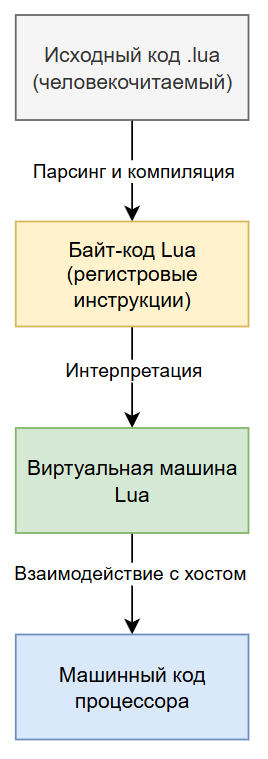
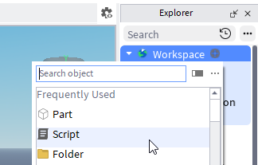

---
title: 5.15. Lua и Luau
---

# 5.15. Lua и Luau

# Раздел в разработке

## О языке

### Что такое Lua?

**Lua** — это компактный, быстрый, встраиваемый интерпретируемый язык программирования высокого уровня, разработанный с акцентом на простоту, гибкость и эффективность.

Lua — высокоуровневый язык программирования. Это означает, что он абстрагирован от деталей аппаратного обеспечения, предоставляет удобные структуры данных, автоматическое управление памятью и динамическую типизацию. Программисту не нужно заботиться о выделении и освобождении памяти вручную, работать с указателями или управлять регистрами процессора. Вместо этого он сосредоточен на логике программы, используя простой и понятный синтаксис.

Однако, в отличие от таких языков, как Python или Java, Lua не претендует на роль универсального «всё-в-одном» решения. Его сила — в лёгкости, скорости запуска и возможности интеграции. Поэтому, хотя он и высокоуровневый, он остаётся ближе к системному уровню по своей эффективности и компактности.

Он принадлежит к семейству скриптовых языков, но с уникальной особенностью: он изначально задумывался как встраиваемый язык (embedded language). Это ключевое отличие. Большинство скриптовых языков (например, Python, JavaScript) используются как автономные среды выполнения, тогда как Lua проектировался, чтобы жить внутри другого приложения, будь то игра, роутер, база данных или промышленное ПО.

Его синтаксис и архитектура во многом напоминают Scheme (язык из семейства Lisp), особенно в плане функциональных возможностей и минимализма. Однако по стилю и практическому применению он ближе к Python — благодаря читаемости, динамической типизации и интерактивной разработке. Тем не менее, в отличие от Python, Lua не стремится быть «универсальным инструментом», а скорее — «гибким клеем» между компонентами системы.

Lua — мультипарадигменный язык, но он не навязывает ни одну конкретную модель. Он поддерживает:
	- Процедурное программирование — как основу.
	- Функциональное программирование — функции являются объектами первого класса, поддерживаются замыкания, высшие функции.
	- Прототипное ООП — через таблицы и метатаблицы, без классов «из коробки», но с возможностью эмуляции классов, наследования, полиморфизма.
	- Императивное программирование — стандартные циклы, условия, присваивания.

Lua не является строго объектно-ориентированным, как Java или C#, и не является чисто функциональным, как Haskell. Он предоставляет минимальный набор примитивов, которые позволяют программисту самому построить нужную парадигму — будь то классы, модули, события или конечные автоматы.

Lua — один из самых распространённых встраиваемых скриптовых языков в мире. Конечно, всегда сначала называют именно игры, к примеру, Roblox, World Of Warcraft, Angry Birds, Civilization. Также можно встретить в системах и сетевых устройствах, роутерах, IoT, редакторах и инструментах разработки вроде Adobe Lightroom.

Почему он популярен? По нескольким причинам:
1. Минимализм. Ядро Lua весит всего 20-25 КБ. Это один из самых компактных языков с полной реализацией.
2. Встраиваемость. Lua легко интегрируется с C/C++ через простой API. Приложение может вызывать Lua-функции и наоборот.
3. Скорость. Интерпретатор Lua очень быстрый, особенно при использовании LuaJIT (Just-In-Time компилятор).
4. Гибкость. Отсутствует жёсткая структура, что позволяет адаптировать язык под любую задачу - от ООП до DSL (предметно-ориентированных языков).
5. Переносимость. Lua написан на чистом ANSI C, компилируется почти на любой платформе.
6. Открытость и простота реализации. Исходный код Lua прозрачен, хорошо документирован и часто используется для обучения и как пример парсера и интерпретатора.

Lua — это интерпретируемый язык, но с важным уточнением: он использует двухэтапный процесс выполнения, включающий компиляцию в байт-код и последующую интерпретацию этого байт-кода на виртуальной машине (VM).

Это означает, что когда вы запускаете Lua-скрипт, исходный код не читается напрямую построчно, как в простейших интерпретаторах. Вместо этого он сначала скомпилируется в промежуточное представление — байт-код, который затем выполняется на виртуальной машине Lua:
1. Компиляция в байт-код;
2. Интерпретация байт-кода на виртуальной машине.

Это не JIT-компиляция по умолчанию (кроме случаев с LuaJIT), но даже без JIT производительность остаётся высокой благодаря эффективности VM.

Разберём пример.

Шаг 1. Исходный код превращается в байт-код.

Вы пишете исходный код, и сохраняете в файл с расширением `.lua`.

Когда вы запускаете скрипт (например, через lua script.lua), Lua-интерпретатор сначала парсит ваш .lua-файл:
```lua
print("Hello")
x = 10 + 20
```
Парсер строит абстрактное синтаксическое дерево (AST), а затем компилятор Lua преобразует его в байт-код — низкоуровневые инструкции, понятные виртуальной машине Lua. Этот байт-код сохраняется в памяти или может быть записан в файл (например, .luac) с помощью утилиты luac.

Важно отметить, что формат байт-кода специфичен для версии Lua. Байт-код Lua 5.1 несовместим с Lua 5.4.

Шаг 2. Выполнение байт-кода на виртуальной машине. Виртуальная машина Lua - это регистровая виртуальная машина (в отличие от стековых, например JVM (Java) или CPython). Потому язык и производительный.

Регистровая архитектура подразумевает, что операции работают с «регистрами», условными ячейками памяти, а не с явным стеком. Это снижает количество инструкций и увеличивает скорость.

VM пошагово читает байт-код и выполняет инструкции, организуя цикл выборки-выполнения (fetch-execute cycle).

Параллельно работает сборщик мусора (mark & sweep), освобождая память от недостижимых объектов.

Каждая инструкция байт-кода обрабатывается ВМ, которая взаимодействует с элементами языка - таблицами, функциями, строками, числами, корутинами, метатаблицами.



Всё это происходит в рамках одного процесса.

Lua VM, виртуальная машина - часть приложения, а не отдельный процесс.

Сначала человек пишет **исходный код**.

Lua парсит и переводит его в **байт-код**.

Байт-код интерпретируется построчно силами ВМ, и переводится в **машинный код**, который отправляется в процессор для выполнения инструкций.

Так и работает уровень:
	- Высокий (человекочитаемый);
	- Средний (уровень ВМ);
	- Низкий (машиночитаемый).

Стандартный интерпретатор Lua можно называть просто Lua, PUC-Rio или «обычный Lua». Это чистый интерпретатор байт-кода. Но существует популярная альтернатива — LuaJIT (Just-In-Time Compiler).

LuaJIT технически занимает то же место в схеме, но компилирует горячие участки кода (часто выполняемые циклы, функции) в нативный машинный код во время выполнения, что ускоряет выполнение в 2-10 раз.

Важно понимать то, что Lua взаимодействует с C (Си), так как написан на чистом ANSI C, и его виртуальная машина легко встраивается в любое C/C++ приложение. Через C API хост-приложение может управлять жизненным циклом Lua-состояния, загружать и выполнять Lua-скрипты, вызывать Lua-функции из C, регистрировать C-функции, доступные из Lua. К примеру, движок игры на C++ вызывает lua_pcall, чтобы запустить скрипт поведения персонажа, написанный на Lua. Таким образом, Lua не генерирует машинный код сам по себе, но через C API и host-приложение его логика в конечном счёте исполняется процессором как часть родительской программы.

### Экосистема и фреймворки

Основное расширение для Lua-скриптов — .lua. Однако есть и другие форматы, используемые в специфических контекстах:
	- **.luac** — скомпилированный байт-код Lua. Такие файлы создаются утилитой luac и могут быть загружены напрямую через loadfile() или dofile(). Они позволяют скрыть исходный код (частично) и ускорить запуск (пропускается этап компиляции).
	- **.luau** — расширение, используемое в Roblox Studio для скриптов на Luau (диалект Lua). Хотя синтаксически совместимо с Lua 5.1, .luau поддерживает дополнительные возможности: аннотации типов, строгую проверку, модернизированную работу с событиями.

Официальный сайт: https://www.lua.org

Здесь находится исходный код Lua, документация, скачиваемые архивы для всех платформ, информация о лицензии. Lua не поставляется с установщиком «из коробки» в большинстве операционных систем, поэтому его нужно устанавливать вручную или через пакетные менеджеры.
Lua часто устанавливается как часть другого ПО (например, Neovim, OpenResty), поэтому может быть доступен без явной установки. 

Для более простой работы можно использовать онлайн-инструменты, к примеру, простая песочница OneCompiler:

https://onecompiler.com/lua/

Так проще. Не понадобится ничего настраивать и устанавливать. Но не получим доступ к файловой системе, внешним библиотекам или C API.
VS Code — один из самых популярных редакторов для работы с Lua благодаря мощным плагинам. Там есть и подсветка синтаксиса, и автодополнение, и навигация по коду. Также есть интеграция с Lua LSP (Language Server Protocol, который предоставляет подсказки, ошибки, переход к определению), имеется поддержка Luau. В settings.json можно указать версию Lua, пути к библиотекам, правила линтинга.

ZeroBrane Studio - специализированная легковесная IDE для Lua, идеально подходящая для обучения и игровой разработки. Там есть отладка, поддержка множества движков (LÖVE, Corona SDK, Gideros, Moai, WoW), встроенный терминал, консоль вывода, простой интерфейс, минимальные требования.

Roblox Studio, официальный редактор для создания игр в Roblox. Сейчас он использует специальный диалект Luau. Здесь имеется встроенный редактор скриптов с подсветкой синтаксиса и базовой проверкой типов, поддержка .luau-файлов, автодополнение, анализ типов, предупреждения, live-reload (изменения применяются мгновенно в тестовой игре). Скрипты здесь делятся между ServerScriptService и StarterPlayerScripts (клиент/сервер). Важно учесть, что это закрытая экосистема. Нельзя запустить обычный Lua-скрипт вне Roblox, но все принципы остаются теми же.

Lua стал основой для множества фреймворков, особенно в области игровой разработки и веб-серверов.

LÖVE (Love2D) - 2D-движок для создания игр на Lua, кроссплатформенный, имеет простой API (love.load(), love.update(dt), love.draw()), используется инди-разработчиками и для обучения.

Defold - профессиональный 2D/3D движок от King (создателей Candy Crush). Онлайн-редактор, сборка под мобильные платформы, WebGL.

Solar2D (ранее Corona SDK) - мобильный фреймворк для 2D-игр и приложений, пишется на Lua, собирается под iOS, Android, Windows.

OpenResty - платформа на основе Nginx и LuaJIT. Позволяет писать бизнес-логику (аутентификация, роутинг, рейт-лимиты) прямо внутри веб-сервера, используется в Alibaba, Cloudflare, Pinterest.

Как у Python есть pip, у Ruby — gem, у Lua есть LuaRocks.

Это менеджер установки библиотек. Он поддерживает установку из Git, локальных файлов, LuaDist. Пакет позволяет установить библиотеку через консоль:
```bash
luarocks install luasocket
luarocks install dkjson
```

### История Lua

В начале 1990-х годов группа исследователей из Tecgraf (научно-техническая лаборатория факультета информатики Католического университета Рио-де-Жанейро, PUC-Rio) работала над проектами для Petrobras — крупнейшей бразильской нефтегазовой компании. Их задача заключалась в разработке программного обеспечения для проектирования и моделирования нефтяных месторождений, скважин и трубопроводов.

Эти приложения были мощными, но крайне жёсткими: любое изменение в поведении — например, добавление нового правила расчёта давления или настройка интерфейса — требовало перекомпиляции всей системы. Это замедляло разработку, увеличивало стоимость и делало невозможным адаптацию ПО под нужды конкретного заказчика.

Группе, возглавляемой Роберто Иерусалимским (Roberto Ierusalimschy), стало очевидно: нужно что-то, что позволит пользователям настраивать логику приложения без доступа к исходному коду. Они пробовали использовать существующие языки — Tcl, Python, даже собственные конфигурационные форматы, — но всё было либо слишком тяжёлым, либо плохо встраивалось, либо требовало лицензий. Тогда они приняли решение: создать свой язык.

В 1993 году команда — Роберто Иерусалимский, Луис Эдуардо де Фариа (Luiz Henrique de Figueiredo) и Вальтер Серрапо (Waldemar Celes) — представила первый релиз Lua (произносится «луа», что по-португальски значит «луна»). Имя было выбрано символически: как и луна, которая не светит сама, а отражает свет солнца, Lua не претендует на самостоятельность — он существует, чтобы облегчать жизнь другим системам, быть их «отражением», их внутренним скриптовым ядром.

Lua никогда не стремился быть универсальным языком. Он не пытается решать все задачи сразу — ни заменить Python, ни конкурировать с Java. 

Его цель — одна: быть идеальным скриптовым языком для расширения приложений.

Эта философия выражена в самом дизайне:
	- Нет встроенных библиотек для сетей, GUI или баз данных — всё это остаётся за пределами ядра.
	- Нет классов — но есть таблицы и метатаблицы, позволяющие самому реализовать ООП.
	- Нет строгой типизации — но есть гибкость и скорость прототипирования.

С самого начала Lua был открытым и свободным. В 1994 году он был выпущен под лицензией, аналогичной MIT, что позволило использовать его бесплатно в любых целях — включая коммерческие продукты. Это стало одной из причин его успеха: разработчики могли встраивать Lua в свои приложения без юридических рисков. Ни одна корпорация не «владеет» Lua — им продолжает заниматься исследовательская группа PUC-Rio, но сообщество вносит вклад в развитие, документацию и библиотеки.

Lua эволюционировал медленно:
	- Lua 5.0 (2003) — введение метатаблиц, улучшенная система модулей, goto.
	- Lua 5.1 (2006) — стабильная, самая распространённая версия. Используется в World of Warcraft, Nginx, многих движках.
	- Lua 5.2 (2011) — новые области видимости (`goto`, `::label::`), улучшения GC, `__close metamethod`.
	- Lua 5.3 (2015) — поддержка 64-битных целых чисел, улучшения производительности.
	- Lua 5.4 (2020) — потоковая сборка мусора, множественные значения в параметрах, улучшения JIT-совместимости.

Каждое обновление сохраняло обратную совместимость, что критично для embedded-систем, где обновление может быть невозможно.

К 2010-м годам Lua стал популярным в игровой индустрии, особенно после успеха World of Warcraft, где весь пользовательский интерфейс управлялся Lua-скриптами. В этой популярной MMORPG видеоигре, использовались специальные «аддоны», модификации интерфейса, упрощающие жизнь игроку. Но настоящий скачок произошёл с ростом платформы Roblox — виртуального мира, где миллионы пользователей создают свои игры. Roblox выбрал Lua как основу для скриптования игровой логики, но столкнулся с ограничениями - динамическая типизация, отсутствие строгой проверки типов и медленная разработка больших проектов.

В ответ на это, инженеры Roblox разработали Luau — диалект Lua, совместимый с Lua 5.1, но с важными улучшениями - статическая типизация, type inference, nullable-типы, обобщения, улучшенный анализ кода и оптимизированную производительность.

Сегодня Luau — один из самых массовых языков программирования в мире, ведь десятки миллионов детей и подростков учатся программировать на нём в Roblox Studio.

## Первая программа на Lua

Теперь, когда вы познакомились с историей, философией и экосистемой Lua, пришло время сделать первый шаг — написать и запустить простейшую программу. Мы рассмотрим несколько сценариев, чтобы показать разнообразие использования языка:

Запуск классического скрипта на чистом Lua через интерпретатор.
	- Работа с Roblox Studio — где используется диалект Luau.
	- Добавление типов в Luau (статическая проверка).
	- Запуск вне IDE — через командную строку.

### Сценарий 1. Простая локальная программа

Шаг 1. Установите Lua.

Для установки нам понадобится терминал:

1. Windows:
```bash
winget install DEVCOM.Lua
```
2. Linux (на примере Ubuntu):
```bash
sudo apt install lua5.4
```
3. macOS:
```bash
brew install lua
```
Также можете самостоятельно скачать исходники с https://www.lua.org и установить. Ещё один удобный вариант - использовать установщик Lua for Windows.

Для проверки установки можно написать в терминале «lua -v» и увидеть версию.

Шаг 2. Создайте файл hello.lua

Откройте любой текстовый редактор (VS Code, Notepad++, Sublime Text) и создайте файл с расширением .lua, со следующим содержимым:
```lua
print("Hello, World!")
```
Сохраните его, например, в папке `lua_projects/hello.lua`. 

Обратите внимание: никаких точек с запятой, фигурных скобок, классов или функций main. Это — вся программа.

Шаг 3: Запустите программу

Откройте терминал (командную строку), перейдите в папку с файлом и выполните:
```lua
lua hello.lua
```
Вы увидите «Hello, World!» - и всё. Так выводится текст - поздравляю, первая программа готова - интерпретатор прочитал файл, скомпилировал его в байт-код, выполнил инструкцию print() - встроенную функцию для вывода текста и завершил работу. Всё просто. Никаких сборок, артефактов, JAR-файлов.

Так работают скриптовые и интерпретируемые языки.

Теперь попробуем запустить скрипт с переменными и функциями. Создадим новый файл greet.lua и добавим туда следующий код:
```lua
-- Функция с параметром
local function greet(name)
    return "Hello, " .. name .. "!"
end

-- Вызов и вывод
local result = greet("Timur")
print(result)
```
В терминале запустите `lua greet.lua` - тогда вы увидите «Hello, Timur!»

### Сценарий 2: Roblox Studio

Теперь давайте перейдём к более реальной практике — особенно если вы будете обучать людей разработке игр. Roblox — один из самых массовых способов знакомства с программированием, и там используется Luau, диалект Lua.

Шаг 1: Установите Roblox Studio

Перейдите на https://www.roblox.com/create.

Скачайте и установите Roblox Studio - это бесплатно.

Зарегистрируйтесь и авторизуйтесь.

После установки запустите программу, откроется окно создания проекта.

Шаг 2: Туториал

При первом запуске Roblox Studio заботливо предложит вам пройти ознакомительное занятие - это довольно легко. Суть следующая:
1. Перед вами откроется сцена с картой фэнтезийного стиля.
2. Вам предложат сначала научиться управлять камерой и ориентироваться в пространстве (если вы играли хотя бы в одну игру на ПК, вы легко освоитесь, там обычное WASD управление).
3. Затем вам покажут панель с ассетами - внутриигровыми материалами (это готовые модели и объекты для создания игр). Наберите в поиске ball, и в центре карты увидите шар.
4. Нажав Play, вы сразу можете погрузиться в игру прямо в окне. Stop - вернуться в режим создания. Если вы подойдёте к шару, нажмите E и сядете в шар (как хомяк).
5. Затем вам предложат познакомиться с добавлением новых объектов - вам предложат добавить треугольный объект, и расширить его, превратив в трамплин.
6. Потом нужно будет настроить скорость шара в его свойствах - так вас познакомят с окном настройки свойств.
7. После настройки можно будет нажать Play, сесть в шар, разогнаться и с помощью трамплина попасть шаром в одну из мишеней.

Вот и всё, на этом ознакомительный курс будет завершён, а вам предложат поизучать карту и объекты на ней.


Но вам лучше попробовать создать новую карту. Создайте новый проект, выберите шаблон, например Baseplate (пустая карта с платформой) или Empty (совсем чистый проект). Назовите проект, например, HelloWorldGame, и нажмите Create.

Затем добавьте скрипт - в дереве объектов слева найдите Workspace или ServerScriptService, правой кнопкой мыши кликните и нажмите Insert Object - Script. Автоматически будет создан файл с именем Script и откроется встроенный редактор кода.



Там уже будет код:
```lua
print("Hello world!")
```
Сохраните скрипт (Ctrl + S). Назовите его, например, HelloScript.

Предварительно перейдите на вкладку «Script» и включите Output:


И тогда, после нажатия на Play (запуска игры), вы увидите в самом низу вывод консоли с тем самым текстом из команды print():


Roblox Studio содержит встроенную VM на основе Lua (с модификациями Luau).

Скрипты в ServerScriptService выполняются на сервере. print() выводит сообщение в консоль разработчика. При нажатии Play запускается симуляция — как настоящая игра.

Можете немного усложнить работу. Luau позволяет добавлять аннотации типов. Это помогает избежать ошибок при масштабировании. Измените код скрипта:
```lua
local message: string = "Hello with types!"
print(message)
```
Тогда вы увидите подсветку типов, и даже ошибку, если попробуете присвоить число строке. Потому что вы указали «string» - прямо закрепив тип данных переменной message.

Усложним? Давайте сделаем что-то более полезное, но простое - при появлении игрока в мире будет выводиться приветствие. Для этого измените скрипт:
```lua
-- Получаем сервис игроков
local Players = game:GetService("Players")

-- Обработчик входа игрока
local function onPlayerAdded(player)
    print(player.Name .. " joined the game!")
end

-- Подписываемся на событие
Players.PlayerAdded:Connect(onPlayerAdded)
```
Теперь при запуске вы увидите «`<Ваш ник> joined the game!`» в консоли. Это уже настоящая игровая логика: реакция на события, работа с API Roblox.


## Знаки препинания

Для новичков один из самых частых источников путаницы — что означают символы вроде `..`, `;`, `'` или `:`, особенно когда они встречаются в непривычных комбинациях. В Lua многие знаки работают иначе, чем в других языках (например, JavaScript или Python), поэтому важно чётко понимать их назначение.

1. Кавычки (`'` и `"`). В Lua оба типа кавычек допустимы для строк, и выбор зависит только от содержимого строки и стиля кода.
```lua
local name = "Тимур"
local message = 'Hello from Lua!'
```
Оба варианта работают одинаково. Разница — только в удобстве экранирования. Удобно использовать двойные кавычки, если внутри строки есть апостроф:
```lua
local text = "It's a beautiful day"
```
Удобно использовать одинарные, если внутри есть цитата:
```lua
local quote = 'He said, "Welcome!"'
```
2. Апострофы (`’`), например, `“smart quotes”` из Word — не являются частью синтаксиса и вызовут ошибку:
```lua
local wrong = “This won’t work”  -- ОШИБКА: неверные кавычки
```
3. Точки с запятой (`;`) — опциональны, но редко используются. В Lua точки с запятой не обязательны. Интерпретатор автоматически определяет конец выражения (по аналогии с ASI в JavaScript, но проще).
```lua
print("Hello")
local x = 10
local y = 20
```
Вы можете использовать `;`, если хотите:
```lua
print("Hello"); local x = 10; local y = 20;
```
Но в сообществе Lua принято не ставить точки с запятой, если только вы не пишете несколько выражений в одной строке.

4. Запятая (`,`) — разделитель элементов. Используется повсеместно для разделения параметров функций, элементов таблиц и нескольких значений при присваивании.
```lua
-- Параметры функции
function greet(name, age)
    print(name .. " is " .. age .. " years old")
end

-- Таблица
local colors = {"red", "green", "blue"}

-- Множественное присваивание
local x, y, z = 1, 2, 3
```
В отличие от JavaScript, в таблицах можно ставить запятую после последнего элемента — это не ошибка:
```lua
local fruits = {
    "apple",
    "banana",
}
```
Это удобно при добавлении новых элементов — не нужно менять предыдущую строку. 

5. Точка (`.`) и двоеточие (`:`) — доступ к полям и методам. Это одна из ключевых особенностей Lua, особенно при работе с таблицами и ООП.
Чтобы получить доступ к полю или вызвать функцию, нужно поставить точку. 

Пример:
```lua
local person = {name = "Bob", age = 30}

print(person.name)        -- -> "Bob"

function person.greet()
    print("Hi, I'm " .. person.name)
end

person.greet()            -- вызов функции
```
Вызывать методы можно через двоеточие, это синтаксический сахар для передачи объекта как первого аргумента (self).
```lua
function person:greet()
    print("Hi, I'm " .. self.name)  -- self = person
end

person:greet()   -- то же самое, что person.greet(person)
```
То есть, эти два метода будут эквивалентны:
```lua
person:greet()
person.greet(person)
```
6. Две точки (`..`) — конкатенация строк. В Lua нет оператора `+` для строк (как в JavaScript). Вместо этого используются две точки.
```lua
local first = "Hello"
local last = "World"
local full = first .. ", " .. last  -- -> "Hello, World"
```
Будьте осторожны: .. имеет низкий приоритет, лучше брать в скобки при смешивании с числами:
```lua
print("Value: " .. 5 + 3)      -- ОШИБКА: попытка склеить строку и результат 5+3
print("Value: " .. (5 + 3))    -- ПРАВИЛЬНО: -> "Value: 8"
```
7. Подчёркивание (`_`) — соглашения и именование. Как и в других языках, `_` используется по стилю, но не имеет специального смысла для интерпретатора.

`_` часто используется как имя «игнорируемой» переменной, часто используется в циклах for, когда индекс не нужен:
```lua
for _, value in ipairs(fruits) do
    print(value)
end
```
`_name` — соглашение о внутреннем/приватном поле:
```lua
local config = {
    _api_key = "12345",  -- не для внешнего использования
    public_url = "https://..."
}
```
Это не приватность, просто сигнал другим разработчикам.

`__name` — зарезервировано для метаметодов:
```lua
mt.__index = function() ... end
mt.__add = function() ... end
```
Такие имена — часть механизма метатаблиц.

`_` в числах (Luau) — читаемость:
```lua
local billion = 1_000_000_000  -- работает в Luau
```
В Luau (но не в классическом Lua) можно использовать `_` как разделитель. В стандартном Lua это вызовет ошибку.

Вот важное отличие от JavaScript, C# и Java:
	- Lua не имеет побитовых операторов `|`, `&`, `^` в ядре (до версии 5.2).
	- Нет логических `||` и `&&` — вместо них используются or и and.

В Lua используются слова:
```lua
if x == 1 or y == 2 then
    print("At least one condition is true")
end

if x == 1 and y == 2 then
    print("Both conditions are true")
end

local result = a or "default"   -- как ?? в C# или || в JS
```
Это делает код более читаемым, но менее компактным.

В Lua 5.3+ появились побитовые операторы: `|`, `&`, `~`, `<<`, `>>`. 

В Roblox (Luau) они также поддерживаются. Но записываются они через C-подобные символы, а не слова. Однако в Lua 5.1 (часто используемом как база) этих операций нет — нужно использовать библиотеки вроде bit32.
```lua
local flags = permission_read | permission_write
```
Важно учесть кое-что ещё. В классическом Lua : (двоеточие) используется только для вызова методов с self. В Luau : также используется для аннотаций типов.
```lua
-- Luau:
local name: string = "Alice"
function greet(name: string): string
    return "Hello, " .. name
end
```
Это не работает в чистом Lua — будет ошибка синтаксиса. И если видите `:` type, значит, код написан для Roblox Studio или Luau CLI.

В Lua нет шаблонных строк, как в JavaScript (`Hello ${name}`). Чтобы вставлять переменные в строки, используйте конкатенацию:
```lua
local name = "Timur"
print("Hello, " .. name .. "!")  -- единственный способ
```
Lua делает ставку на читаемость и простоту, поэтому использует слова вместо символов (or, and), отказывается от лишних знаков (`;`), даёт гибкость через таблицы и метатаблицы. Поэтому, если вы уже знакомы с другими скриптовыми языками, может быть непривычно.

## Типы данных и переменные

```
Динамическая типизация
типы данных в Lua
Особенности:
Все числа — double (в классическом Lua)
Нет отдельного типа для целых/плавающих

Переменные
Виды переменных
Объявление переменных
Преобразования типов

Коллекции - таблицы, главная структура данных в Lua
Массивоподобные таблицы
Ассоциативные массивы (словари)
Смешанные ключи


```

Система типов в Lua построена на принципах динамической типизации и минимализма.

**Динамическая типизация** подразумевает, что тип значения ассоциируется не с переменной, а со значением. Технически, переменная представляет собой ссылку (или имя) на объект определённого типа, при этом одна и та же переменная может в разные моменты времени ссылаться на значения различных типов. Это позволяет писать гибкий и лаконичный код, но требует от разработчика повышенной осмотрительности в управлении состоянием программы.

То есть, переменная может быть сначала одного типа, а затем другого:
```lua
local x = 42        -- x ссылается на значение типа number
x = "hello"         -- теперь x ссылается на значение типа string
x = true            -- теперь x — булево значение
```
Подобное поведение исключает необходимость явного объявления типов переменных и обеспечивает высокую степень метапрограммирования, однако делает статический анализ типов невозможным без использования внешних инструментов (например, Lua LSP или MoonScript).

В Lua определено восемь базовых типов данных, каждый из которых представляет собой самостоятельную категорию значений. Они могут быть классифицированы следующим образом:
1. nil — тип, имеющий единственный экземпляр nil. Используется для обозначения отсутствия значения. Переменная, которой не присвоено значение, по умолчанию содержит nil. Это аналог null в других языках.

Такое определение может сильно запутать. Чтобы понять, нужно запомнить - в Lua нет «неинициализированных переменных» в классическом смысле, и если переменной ничего не присвоено, она просто содержит nil - то есть, «ничего».

Соответственно, у типа nil есть только одно возможное значение — сам nil. Любое выражение, результат которого «ничего», возвращает nil. 
В условиях nil считается ложным, вместе с false — это единственные два ложных значения в Lua. Всё остальное (включая 0, пустую строку "", пустую таблицу {}) — истинно. И если вы объявите переменную:
```lua
local x
print(x)
```
То результат функции print(x) будет nil, то есть «ничего». 

nil можно использовать для удаления элементов из таблиц:
```lua
local t = {a = 1, b = 2}
t.a = nil           -- удаляем ключ 'a'
print(t.a)          --> nil
```
Вы наверное задались вопросом - о каких таблицах идёт речь? Запомните - ещё вернёмся. Давайте сначала разберём прочие виды данных.

2. boolean — логический тип, допускающий два значения: true и false. В контексте условий любое значение, кроме nil и false, интерпретируется как истинное.
```lua
local active = true
local paused = false

if active and not paused then
  print("Работает")
end
```
Здесь мы видим переменные active и paused. Обратите внимание на проверку - она выполняется словами. В большинстве языков мы бы написали `if active && !paused`, используя символ `&&` как «и», или «and», а также символ «!» как отрицание. Здесь же мы используем именно слова «and» и «not».

3. number — числовой тип. В классическом Lua (5.1–5.4) все числа представлены как 64-битные числа с плавающей запятой двойной точности (double) в соответствии со стандартом IEEE 754. Отдельного типа для целых чисел (integer) не существует, хотя начиная с Lua 5.3 была добавлена возможность использования целочисленного подтипа внутри типа number, который автоматически переключается между целыми и вещественными представлениями в зависимости от операции.

4. string — неизменяемые последовательности байтов, используемые для представления текста. Строки в Lua не имеют ограничений на содержание нулевых байтов и могут хранить произвольные бинарные данные. Интернирование строк позволяет эффективно сравнивать их по ссылке.
```lua
local name = "Иван"
local message = [[
  Многострочная строка.
  Можно использовать любые символы, включая "кавычки".
]]
print(#message)  --> длина строки
```

5. function — тип, представляющий вызываемые объекты. Функции являются объектами первого класса: их можно передавать как аргументы, возвращать из других функций, хранить в переменных и структурах данных.
```lua
local add = function(a, b)
  return a + b
end

print(add(3, 4))  --> 7

-- Функции — объекты первого класса:
local ops = {add = add}
print(ops.add(2, 3))  --> 5
```
Но о функциях мы будем говорить отдельно.

6. table — единственная составная структура данных в Lua. Таблицы реализуют ассоциативные массивы и служат основой для построения массивов, словарей, объектов, модулей и других абстракций. Подробнее рассматривается ниже.
```lua
local user = {
  name = "Bob",
  age = 25,
  hobbies = {"chess", "coding"}
}

print(user.name)           --> Bob
print(user.hobbies[1])     --> chess
```
Здесь таблицей является user. Таблица является универсальным контейнером. В большинстве объектно-ориентированных языков такой тип данных называется объектом, но в Lua это таблицы.

7. userdata — тип, предназначенный для хранения произвольных данных, определяемых C-кодом. Используется преимущественно при расширении Lua через C API. Существует два вида: light userdata (указатель на C-объект) и full userdata (выделенная память, управляемая сборщиком мусора).

Используется при интеграции с C (Си). К примеру, это может быть хранение указателя на C-структуру:
```lua
// В C-расширении:
lua_pushlightuserdata(L, my_pointer);

-- В Lua:
local ptr = lightuserdata  -- например, из C API
-- Нельзя изменять из Lua, только передавать обратно в C
```
8. thread — представляет поток выполнения (coroutine). Не следует путать с системными потоками; это легковесные сопрограммы, управляемые на уровне интерпретатора Lua.
```lua
local co = coroutine.create(function()
  for i = 1, 3 do
    print(i)
    coroutine.yield()
  end
end)

coroutine.resume(co)  --> 1
coroutine.resume(co)  --> 2
coroutine.resume(co)  --> 3
```

Определить тип значения можно с помощью встроенной функции type(), которая возвращает строку с именем типа:
```lua
print(type(42))           --> number
print(type(nil))          --> nil
print(type(function() end)) --> function
```
Особое внимание заслуживает тип number. В Lua 5.1 и 5.2 все числовые значения реализованы исключительно как double-значения, что означает, что даже целые числа хранятся в формате с плавающей запятой. Это приводит к некоторым нетривиальным последствиям, таким как потеря точности при работе с очень большими целыми числами, невозможность различать целые и вещественные числа на уровне типа, и автоматическое округление в арифметических операциях, если результат не может быть точно представлен.

Начиная с Lua 5.3, была внедрена поддержка целочисленного внутреннего представления. Теперь тип number может хранить как 64-битные целые (int64), так и double-вещественные числа. Lua автоматически выбирает наиболее подходящее представление, а при необходимости выполняет преобразования.

Но это всё внутренняя оптимизация, с точки зрения языка number остаётся единым типом. Программист не может объявить переменную как «целое число», и проверка типа не различает подтипы.

Переменные в Lua не имеют фиксированного типа и не требуют явного объявления. Любая переменная создаётся в момент первого присваивания. По области видимости переменные делятся на три категории:

**Локальные переменные** — объявляются с помощью ключевого слова local. Имеют блочную область видимости и рекомендуются к использованию по умолчанию. Они доступны только внутри блока, где объявлены (будь то цикл, функция, условие). Если они выходят из области видимости, то уничтожаются сборщиком мусора автоматически.
```lua
local function greet()
  local name = "Alice"
  print(name)  -- работает
end

greet()
print(name)    -- ошибка: name is nil (локальная вне функции недоступна)
```
Здесь мы видим переменную с именем name - она и будет локальной, доступной только в пределах функции greet().

**Глобальные переменные** — создаются при первом присваивании без local. Хранятся в глобальной таблице `_G`. Использование глобальных переменных считается антипаттерном в крупных проектах.

Такие переменные доступны из любого места программы, и очевидно, что это загрязняет глобальное пространство имён, усложняя отладку, поэтому, если нет нужды, лучше создавать именно локальные переменные.
```lua
x = 100             -- глобальная переменная
_G.y = 200          -- то же самое, что y = 200

print(_G.x)         --> 100
```
Для объявления глобальной переменной не нужно никаких ключевых слов, просто написать имя и присвоить значение через символ «=». Тип данных тоже писать не нужно.

Это отличный пример работы динамической неявной типизации - программисту не нужно явно указывать тип данных, за него всё сделает язык.

Управляющие переменные циклов — например, i в for i = 1, 10 do ... end — являются локальными по умолчанию.

Пример:
```lua
x = 10              -- глобальная переменная
local y = 20        -- локальная переменная
```
Отсутствие объявления типа и автоматическое создание глобальных переменных могут привести к ошибкам из-за опечаток. Поэтому в производственных средах рекомендуется использовать режим строгой проверки (например, через библиотеку strict.lua) или статические анализаторы.

Существует библиотека (или фрагмент кода) под названием `strict.lua` — это не часть стандартной библиотеки, а стороннее средство, используемое для включения строгой проверки использования переменных. Она работает через метатаблицы и отслеживание доступа к глобальной таблице `_G`. Если вы читаете или записываете в необъявленную глобальную переменную — выбрасывается ошибка. На практике такие вещи внедряют в крупные проекты (например, в играх на Love2D или в движках вроде Neovim), где важно контролировать состояние глобального пространства имён. 

И как раз-таки рекомендуется использовать strict-режим, чтобы избежать случайных глобальных переменных.

Lua поддерживает автоматическое неявное преобразование между строками и числами в соответствующих контекстах. Это удобно, но требует осторожности.

При арифметических операциях строковые значения, содержащие корректные числовые литералы, автоматически преобразуются в числа:
```lua
print("10" + 1)     --> 11
```
При конкатенации (..) числа автоматически преобразуются в строки:
```lua
print(42 .. " is the answer") --> "42 is the answer"
```
Неудачные попытки преобразования приводят к ошибкам:
```lua
print("hello" + 1)    -- ошибка: attempt to perform arithmetic on a string value
```
Для явного преобразования используются функции:
	- tonumber(s) — преобразует строку в число; возвращает nil, если преобразование невозможно.
	- tostring(v) — преобразует значение любого типа в строку.

Пользовательские правила преобразования могут быть заданы через метатаблицы (например, метаметоды `__tostring` и `__tonumber`).

Центральным элементом системы типов Lua является тип table, являющийся единственным механизмом для создания составных данных. Таблица представляет собой ассоциативный массив, то есть отображение ключей на значения. Ключи и значения могут быть любого типа, кроме nil.

Таблицы часто используются как упорядоченные последовательности, аналогичные массивам в других языках. По соглашению, такие таблицы используют целочисленные ключи, начинающиеся с 1 (в отличие от языков с нулевой индексацией):
```lua
local arr = {"apple", "banana", "cherry"}
print(arr[1])         --> "apple"
```
Функция #arr возвращает длину последовательности (количество элементов до первого nil). Однако необходимо помнить, что Lua не гарантирует плотность массива, и пропущенные индексы могут нарушить работу оператора длины.

Оператор # (или функция table.getn() в старых версиях) пытается определить длину «последовательности» — то есть количество элементов, идущих подряд с индекса 1. Но только до первого nil.

«Нормальный» массив:
```lua
local arr = {10, 20, 30}
print(#arr)  --> 3
```
Массив с «дырой»:
```lua
local arr = {10, 20, nil, 40}
print(#arr)  --> 2 (!!!)
```
То есть, элемент 40 игнорируется, потому что между 2 и 4 есть nil, и на третьем шаге будет конец последовательности.


Таблицы реализованы как хэш-таблицы с возможностью хранения упорядоченной последовательности (массивная часть) и хэшированной части (ассоциативная). Это позволяет эффективно комбинировать доступ по индексу и по ключу. Производительность таблиц зависит от равномерности распределения хэшей и размера структуры.

Упорядоченная последовательность - это таблица, используемая как массив: ключи — целые числа, начинающиеся с 1, идут подряд.
```lua
local fruits = {"apple", "banana", "orange"}
-- эквивалентно:
-- fruits[1] = "apple"
-- fruits[2] = "banana"
-- fruits[3] = "orange"
```
Здесь важна упорядоченность и непрерывность индексов.

Ассоциативные массивы (словари) являются структурой, где каждому значению соответствует ключ, и доступ к данным осуществляется по ключу, а не по позиции. В Lua любая таблица может быть ассоциативным массивом.

Таблицы одинаково хорошо работают как словари (hash maps), где ключами могут быть строки, числа или даже другие таблицы:
```lua
local person = {
  name = "Alice",
  age = 30,
  ["city"] = "Moscow"
}
print(person["name"])   --> "Alice"
print(person.age)       --> 30
```

Здесь синтаксис `t.key` эквивалентен `t["key"]`, если ключ является допустимым идентификатором.

Смешанные ключи - важная часть, касающаяся словарей. В одной таблице можно использовать разные типы ключей одновременно. Ключи разных типов не конфликтуют. 

Особенность таблиц — возможность смешивать различные типы ключей в одной структуре:
```lua
local t = {}
t[1] = "first"
t["hello"] = "world"
t[{}] = 42                -- ключ — анонимная таблица
t[true] = "yes"
```
Каждый ключ уникален: два разных объекта (например, две разные таблицы) никогда не считаются равными, даже если они содержат одинаковые данные.

Таблицы поддерживают механизм метатаблиц, позволяющий переопределять поведение операций (арифметика, сравнение, индексация и т. д.) через специальные метаметоды. Это делает таблицы основой для реализации ООП, операторной перегрузки и доменных DSL.
```lua
local mt = {
  __add = function(a, b)
    return setmetatable({value = a.value + b.value}, mt)
  end
}
local a = setmetatable({value = 10}, mt)
local b = setmetatable({value = 20}, mt)
local c = a + b
print(c.value)  --> 30
```

## Управляющие конструкции

```
Операторы
Условия
Циклы
Итерируемые таблицы
```

Lua поддерживает три базовых логических оператора: and, or, not. Их поведение следует парадигме короткого замыкания (short-circuit evaluation) и тесно связано с концепцией «истинности» значений в условиях отсутствия строгой булевой типизации.
Ранее мы уже вкратце упомянули о том, что они заменяют собой некоторые символьные операторы, чем и упрощают язык, ведь мы словно пишем на английском языке.

not — унарный оператор, возвращающий true, если операнд является nil или false, и false — во всех остальных случаях. Результат всегда имеет тип boolean.
```lua
not nil     --> true
not false   --> true
not 0       --> false  (0 считается истинным!)
not ""      --> false
```
and — бинарный оператор, возвращающий первый аргумент, если он ложный (nil или false), иначе — второй. Не приводит результат к булеву типу, а возвращает фактическое значение последнего вычисленного операнда.
```lua
true and 42     --> 42
false and 42    --> false
nil and "hello" --> nil
```
or — возвращает первый истинный операнд или последний, если все ложны. Также не производит приведение типов.
```lua
nil or "default"     --> "default"
false or 0           --> 0 (0 — истинно!)
"a" or "b"           --> "a"
```
В Lua всё, кроме nil и false, считается истинным (truthy). Это включает числа (даже ноль), строки (даже пустые), таблицы, функции и т.д. Данная особенность позволяет использовать выражения как идиому для установки значения по умолчанию:
```lua
local value = input or "default"
```
Таким образом, операторы and и or являются не только логическими, но и средствами управления потоком данных, что характерно для функциональных и скриптовых парадигм.

Lua предоставляет две формы условной конструкции: if-then-else и её компактный аналог через and/or, хотя последний используется с осторожностью из-за семантических различий.
Синтаксис if-then-else следующий:
```lua
if condition1 then
    -- блок 1
elseif condition2 then
    -- блок 2
else
    -- блок 3
end
```
Условие (condition) интерпретируется как булево выражение согласно правилу truthiness.

Конструкция elseif не является макросом или сахаром — это часть синтаксиса, эквивалентная вложенному if, но более читаемая.

Блоки выполняются последовательно; после первого истинного условия остальные игнорируются.

Вложенность допускается без ограничений.

Пример:
```lua
if x > 0 then
    print("positive")
elseif x < 0 then
    print("negative")
else
    print("zero")
end
```
Важно отметить, что в отличие от C-подобных языков, в Lua отсутствует тернарный оператор ?:. Однако его можно эмулировать через and/or, при соблюдении осторожности:
```lua
local result = (a > b) and x or y  -- работает, если x не ложно
```
Однако если x == false или x == nil, выражение вернёт y, что может быть ошибкой. Поэтому рекомендуется использовать полноценный if.

Теперь поговорим о циклах.

Lua поддерживает три типа циклов: while, repeat-until и for (с двумя формами).

Цикл while выполняет тело, пока условие истинно. Проверка происходит до каждой итерации. Если условие ложно изначально, тело не выполнится ни разу.
```lua
while condition do
    -- тело цикла
end
```
Цикл repeat-until представляет собой аналог do-while в других языках. Тело выполняется хотя бы один раз, проверка — в конце.
```lua
repeat
    -- тело цикла
until condition  -- выход при истине условия
```
Обратите внимание: until завершает цикл, когда условие становится истинным, что противоположно семантике while.

Цикл for бывает в двух формах - числовой и итерационный.

Числовой for используется для перебора диапазона целых чисел.
```lua
for var = start, stop, step do
    -- тело
end
```
step по умолчанию равен 1.

Все три параметра вычисляются единожды перед началом цикла.

Переменная var локальна по отношению к циклу (это важно!).
```lua
for i = 1, 10, 2 do
    print(i)  -- 1, 3, 5, 7, 9
end
```
Итерационный for (generic for) предназначен для обхода коллекций с помощью итераторов. Наиболее часто используется с таблицами.
```lua
for key, value in iterator, table, start_state do
    -- тело
end
```
На практике применяются стандартные итераторы:
	- pairs(tbl) — перебирает все элементы таблицы (в произвольном порядке).
	- ipairs(tbl) — перебирает элементы с целочисленными ключами от 1 до первого nil.
```lua
for k, v in pairs(mytable) do
    print(k, v)
end
```
Использование pairs и ipairs требует понимания различий: pairs негарантированный, а ipairs последовательный.

Механизм generic for основан на протоколе итераций: итератор — это функция, возвращающая на каждом шаге новые значения ключа/значения, пока не вернёт nil.
```lua
t = {10, 20, nil, 40, [5] = 50, name = "Alice"}

for i, v in ipairs(t) do
    print(i, v)  -- 1:10, 2:20 (остановка на nil)
end

for k, v in pairs(t) do
    print(k, v)  -- может напечатать 1,2,5,"name" в любом порядке
end
```
При модификации таблицы во время итерации поведение pairs и ipairs не определено. Lua не гарантирует безопасность итерации при изменении структуры.


## Функции

```
Функции и методы в Lua
Первоклассные объекты
Анонимные функции
Замыкания
Вариадические функции
Возврат нескольких значений

```

Мы уже упоминали, что функции представляют собой один из типов данных, и являтся первоклассными объектами. Это значит, что они имеют полноправный статус в системе типов - функции можно присваивать переменным, передавать как аргументы, возвращать из других функций и хранить в структурах данных.

Поэтому Lua можно относить и к языку функционального программирования.

В Lua различают функции и методы, хотя технически оба термина относятся к одному и тому же типу объекта — function. Различие носит семантический характер и связано со способом вызова и контекстом использования.

**Функция** — это блок кода, который может быть вызван по имени, с передачей аргументов и возвратом результата. Она определяется с помощью ключевого слова function:
```lua
function add(a, b)
    return a + b
end
```
function — ключевое слово, сигнализирующее начало определения функции. Оно указывает интерпретатору Lua, что далее следует объявление функции, включающее имя (опционально), параметры и тело.

add — имя функции. Это идентификатор, присваиваемый функции в текущей области видимости. В данном случае add становится глобальной переменной типа function, если она не объявлена как local. Однако важно понимать, что имя — лишь ссылка на объект-функцию; сама функция может существовать и без имени (в случае анонимных функций).

(a, b) — список формальных параметров. Эти имена представляют собой локальные переменные, которые будут созданы при вызове функции и проинициализированы переданными аргументами.

a и b — формальные параметры (или просто параметры). При вызове add(5, 3), значения 5 и 3 становятся фактическими аргументами, и они присваиваются a и b соответственно.

return a + b — оператор возврата результата.

return — ключевое слово, завершающее выполнение функции и возвращающее одно или несколько значений в точку вызова.

a + b — выражение, результат которого будет возвращён. Если return отсутствует, функция неявно возвращает nil.

end — ключевое слово, обозначающее конец блока функции. Все конструкции в Lua, задающие область видимости (функции, циклы, условные операторы), закрываются этим словом.

Важно: даже если функция определена как function foo() ... end, она всё равно создаётся как объект-функция и присваивается переменной foo. Это эквивалентно:
```lua
foo = function()
    ...
end
```
Разница лишь в синтаксисе и моменте создания (в первом случае имя доступно уже во время определения, что позволяет рекурсию без дополнительных ухищрений).

Формальные параметры — имена, указанные в определении функции (a, b). Они действуют как локальные переменные внутри тела функции.
Фактические аргументы — значения, переданные при вызове (5, 3).

Lua применяет передачу по значению для всех типов, но поскольку таблицы и функции являются ссылочными типами, копируется именно ссылка, а не содержимое.

Если аргументов меньше, чем параметров, недостающие получают значение nil. Если больше — лишние игнорируются (если только не используется ... — см. ниже).

Метод — это функция, привязанная к таблице (как к объекту) и предполагающая наличие неявного или явного параметра, ссылающегося на саму таблицу (обычно self). В Lua методы реализуются через специальный синтаксис ::
```lua
local obj = {
    value = 42
}

function obj:print_value()
    print(self.value)
end

obj:print_value()  -- эквивалентно obj.print_value(obj)
```
Таблица в Lua — это основной составной тип, сочетающий свойства массива и ассоциативного массива (словаря). Элементы таблицы называются полями (fields) — это общепринятый термин в документации Lua. Поле может содержать любое значение, включая функцию. Когда поле содержит функцию, её принято называть методом.
```lua
local obj = {
    name = "Alice",           -- поле-данных
    greet = function(self)    -- поле-метод
        print("Hello, I'm " .. self.name)
    end
}

obj:greet()  -- синтаксис метода
```
self — это не ключевое слово, а обычное имя параметра, по традиции используемое для ссылки на таблицу, из которой вызван метод.
Вызов obj:greet() эквивалентен obj.greet(obj) — двоеточие автоматически подставляет obj как первый аргумент. Таким образом, : — это синтаксический сахар для вызова с передачей self.

Можно определять методы короче:
```lua
function obj:greet()
    print("Hello, I'm " .. self.name)
end
```
Это эквивалентно предыдущему, но более читаемо.

Аналогия: self в Lua соответствует this в C++, Java, JavaScript, но с важным отличием — self должен быть явно указан как параметр. В Lua нет неявного this; он передаётся как обычный аргумент.

При использовании : первый аргумент автоматически становится self, что имитирует объектно-ориентированный стиль. Однако важно понимать, что Lua не имеет классов в традиционном смысле — вместо этого он использует прототипное наследование и метатаблицы, а методы — лишь удобный синтаксический сахар для работы с таблицами.
Таким образом, метод — это функция, вызываемая с неявной передачей контекста (self), что позволяет строить абстракции, напоминающие ООП, при сохранении минимальной и гибкой модели данных.

Давайте вернёмся к «первоклассным объектам», или first-class citizens. Значит, функции:
1. Могут быть присвоены переменным;
2. Могут быть переданы как аргументы другим функциям;
3. Могут быть возвращены из функций;
4. Могут быть созданы динамически во время выполнения.

Пример:
```lua
local operation = function(a, b) return a * b end
local apply = function(f, x, y) return f(x, y) end

print(apply(operation, 5, 3))  -- 15
```
Здесь мы создаём функцию, и записываем её в переменную дважды. Такой подход позволяет реализовывать высокоабстрактные паттерны: каррирование, композицию функций, коллбэки, функции высшего порядка. Например, стандартные функции table.sort, string.gsub или pcall принимают функции как параметры, демонстрируя гибкость языка.

Благодаря этому, функции в Lua становятся строительными блоками не только процедурной, но и декларативной логики.

Анонимные функции (или лямбда-выражения) — это функции без имени, которые могут быть определены inline. Они особенно полезны при передаче в качестве аргументов или при создании замыканий.

Синтаксис подразумевает отсутствие имени, поэтому выглядит так:
```lua
function(...) ... end
function(x) return x^2 end
```
Такая функция может быть присвоена переменной, передана как аргумент, или возвращена из другой функции. У анонимной функции нет привязки имени в текущей области, но она всё равно является полноценным объектом-функцией. Их лучше использовать, когда функция нужна однократно и не требует повторного использования по имени.

Часто используются с функциями высшего порядка:
```lua
local numbers = {1, 2, 3, 4, 5}
table.sort(numbers, function(a, b) return a > b end)
```
Анонимные функции позволяют избежать засорения пространства имён и обеспечивают локальность определения. Поскольку они создаются динамически, каждое их вхождение порождает новый объект в памяти (хотя интерпретатор может применять оптимизации).

Понимание областей видимости критично для работы с замыканиями.

Lua использует лексические (статические) области видимости — это означает, что видимость переменной определяется местом её объявления в исходном коде, а не путём вызова.

Существуют три уровня областей:
**Глобальная область** — переменные, объявленные без local, принадлежат глобальной таблице _G. Они доступны из любого места программы и живут до завершения выполнения.

**Локальная (блочная) область** — переменные, объявленные через local, ограничены блоком (функцией, циклом, условием). Их время жизни — от момента объявления до конца блока.

Функциональная область — каждая функция создаёт свою собственную область видимости. Локальные переменные функции недоступны снаружи.
```lua
local x = 10                    -- x: локальна в текущем чанке

function outer()
    local y = 20                -- y: локальна в outer
    function inner()
        print(x, y)             -- x и y доступны: лексическое окружение
    end
    inner()
end
```
Здесь inner имеет доступ к x и y, потому что была определена внутри области, где эти переменные видны.

**Замыкание (closure)** — это функция, захватывающая переменные из окружающей её области видимости. Это комбинация функции и ссылки на её лексическое окружение (все внешние локальные переменные, доступные в момент определения).

Ключевое свойство: замыкание сохраняет доступ к переменным, даже после завершения функции, в которой они были объявлены.
Когда анонимная функция ссылается на локальную переменную из внешней функции, эта переменная продолжает существовать, даже после завершения внешней функции, до тех пор, пока замыкание активно.
```lua
function make_counter()
    local count = 0
    return function()
        count = count + 1
        return count
    end
end

local c1 = make_counter()
print(c1())  -- 1
print(c1())  -- 2
```

Хотя make_counter() завершается, переменная count продолжает существовать, потому что замыкание (возвращаемая анонимная функция) удерживает ссылку на неё. Интерпретатор Lua автоматически управляет временем жизни таких переменных с помощью сборщика мусора.

При создании функции сохраняется ссылка на цепочку внешних локальных переменных (upvalues). Это и есть лексическое окружение. Даже если родительская функция завершена, upvalues не уничтожаются, пока на них есть ссылки.

Замыкания применяются для инкапсуляции состояния, создания приватных переменных, реализации каррирования, построения DSL, управления асинхронными операциями (через коллбэки).

Важно помнить, что замыкания увеличивают объём используемой памяти (из-за удержания ссылок), поэтому их следует использовать осознанно, особенно в долгоживущих средах.

Lua поддерживает вариадические функции — функции, принимающие произвольное количество аргументов. Это достигается с помощью специального синтаксиса ..., которое называется vararg expression.

Выражение ... внутри функции возвращает все переданные аргументы как список значений.
```lua
function log(...)
    local args = {...}
    for i, v in ipairs(args) do
        print("Arg " .. i .. ": " .. tostring(v))
    end
end

log("hello", 42, true)  -- три аргумента
```
Внутри функции ... ведёт себя как выражение, возвращающее все переданные аргументы. Его можно распаковать, присвоить таблице или передать дальше.

Важно различать:
	- `...` — выражение, возвращающее аргументы,
	- `{...}` — создание таблицы из всех аргументов.

Если функция объявлена как function f(a, b, ...), то a и b получат первые два аргумента, остальные — через .... 
... может быть передан дальше: f(...) — удобно для декораторов и прокси.

Также ... может быть использовано при вызове других функций:
```lua
function wrapper(f, ...)
    print("Calling function...")
    return f(...)
end
```
Начиная с Lua 5.2, в строгом режиме (при наличии `local _ENV`) использование ... требует аккуратности, так как оно зависит от наличия vararg-контекста.

Вариадические функции широко используются в стандартной библиотеке (например, string.format, table.insert, select) и являются основой для гибких API.

Одной из уникальных черт Lua является поддержка возврата нескольких значений из функции. Это не синтаксический сахар — язык действительно позволяет функции возвращать кортеж значений, которые затем могут быть приняты в виде нескольких переменных.

Это также называют истинный множественный возврат — функция может вернуть более одного значения, разделённых запятыми.
```lua
function divide(a, b)
    if b ~= 0 then
        return a // b, a % b  -- частное и остаток
    else
        return nil, "Division by zero"
    end
end

local quotient, remainder = divide(10, 3)
print(quotient, remainder)  -- 3    1
```
Выражение return x, y, z возвращает три значения. При присваивании значения распаковываются: q = 3, r = 1:
```lua
local q, r = divide(10, 3)
```
Если переменных больше, чем значений — лишние получают nil. Если меньше — «лишние» значения отбрасываются. Если используется в выражении: print(divide(10,3)) — печатает все значения. Lua хранит списки значений временно, в стеке. При присваивании или вызове происходит распаковка списка. 

Если результатов больше, чем переменных, «лишние» значения игнорируются. Если меньше — «недостающие» переменные получают значение nil.
Множественный возврат также работает при передаче в другие функции:
```lua
print(divide(10, 3))  -- напечатает: 3    1
```
Это поведение согласуется с концепцией списков значений (value lists) в Lua, где несколько значений могут передаваться как единый поток. Операции с ними происходят в контексте ожидаемого количества значений (например, слева от присваивания).

Стандартные функции, такие как string.find, next, unpack, активно используют этот механизм.

## Метатаблицы и метаметоды

```
Поведение таблиц
Переопределение поведения таблиц
Метатаблица
Метаметод
__add, __index, __newindex, __call, __tostring и  другие примеры
реализация классов через __index
Аналог полиморфизма, операторной перегрузки.
ООП на основе таблиц и метатаблиц
Нет классов «из коробки» — но можно эмулировать.
Наследование через цепочки метатаблиц.
Сравнение с Ruby/Python: гибкость vs читаемость.

```

Таблицы используются повсеместно: как массивы, словари, объекты, модули и даже классы. Однако их истинная гибкость проявляется не только в структуре хранения данных, но и в возможности динамического переопределения поведения операций над ними. Именно эту возможность обеспечивают метатаблицы и метаметоды.

Таблица в Lua — это ассоциативный массив, реализованный как хеш-таблица (или комбинация массива и хеша для оптимизации). Она представляет собой коллекцию пар ключ–значение, где ключи и значения могут быть любыми типами, кроме nil. В памяти таблица организована как динамическая структура, поддерживающая эффективные операции вставки, поиска и удаления.
```lua
local t = { x = 10, y = 20 }
```
Это эквивалентно:
```lua
local t = {}
t.x = 10
t.y = 20
```
Внутри интерпретатора каждая таблица содержит:
	- Указатель на массив компонентов (для числовых индексов, начиная с 1),
	- Хеш-таблицу для произвольных ключей,
	- Ссылку на метатаблицу (если она установлена).

Таблицы — единственный составной тип в Lua, способный к изменению поведения через внешние механизмы. Это достигается за счёт метатаблиц.

Метатаблица (metatable) — это обычная таблица, присоединённая к другой таблице (или userdata), которая определяет специальное поведение последней при выполнении определённых операций.

Каждая таблица может иметь не более одной метатаблицы. Метатаблица не наследуется автоматически; она устанавливается явно с помощью функции setmetatable или возвращается функцией getmetatable.
```lua
local t = {}
local mt = {}
setmetatable(t, mt)
assert(getmetatable(t) == mt)
```
Метатаблица действует как описатель поведения: она не хранит данные объекта напрямую, но задаёт правила, по которым объект реагирует на операции, такие как сложение, доступ к полям, вызов как функции и т.д.

Метаметод (metamethod) — это поле внутри метатаблицы, имя которого начинается с двойного подчёркивания (`__`), и которое определяет поведение при определённой операции.
Например, метаметод `__add` определяет, что происходит при использовании оператора + с таблицей.

Каждый метаметод соответствует конкретному событию в жизненном цикле операции. Когда интерпретатор сталкивается с операцией над таблицей, он проверяет наличие соответствующего метаметода в её метатаблице и, если он найден, вызывает его вместо стандартного поведения.

При попытке выполнить операцию a + b, если один из операндов — таблица с метатаблицей, содержащей `__add`, вызывается именно эта функция. Если нет — генерируется ошибка (если оба операнда не являются числами).

Рассмотрим наиболее важные метаметоды и их применение.
1. `__index` — перехват чтения отсутствующих полей. Определяет поведение при попытке доступа к несуществующему ключу.
	- Если `__index` — функция, она вызывается с двумя аргументами: таблицей и ключом.
	- Если `__index` — таблица, поиск продолжается в этой таблице.
```lua
local defaults = { color = "white", size = "medium" }
local obj = {}
setmetatable(obj, { __index = defaults })

print(obj.color)  -- "white" (берётся из defaults)
```
Этот механизм лежит в основе делегирования и используется для эмуляции наследования.
2. `__newindex` — перехват записи в поля. Вызывается при попытке присвоить значение новому (или существующему) ключу.
	- Позволяет контролировать, как и куда записываются данные.
	- Может использоваться для создания защищённых таблиц, прокси или реактивных систем.
```lua
local t = {}
local proxy = {}
setmetatable(proxy, {
  __newindex = function(tbl, key, value)
    print("Запись:", key, "=", value)
    rawset(t, key, value)  -- обход метаметода
  end
})

proxy.x = 10  -- Вывод: Запись: x = 10
```
Важно: Для обхода метаметодов используются rawget, rawset, rawlen.

3. `__add`, `__sub`, `__mul`, `__div`, `__mod`, `__pow` — арифметические метаметоды. Позволяют перегружать арифметические операторы.
```lua
local Vec2 = { x = 0, y = 0 }

function Vec2:new(x, y)
  local obj = { x = x or 0, y = y or 0 }
  setmetatable(obj, self)
  self.__index = self
  return obj
end

function Vec2:__add(other)
  return Vec2:new(self.x + other.x, self.y + other.y)
end

local a = Vec2:new(1, 2)
local b = Vec2:new(3, 4)
local c = a + b
print(c.x, c.y)  -- 4 6
```
Таким образом, Lua поддерживает операторную перегрузку, аналогично C++ или Python.

4. `__call` — вызов таблицы как функции. Позволяет использовать таблицу как вызываемый объект.
```lua
local Counter = { count = 0 }
function Counter:__call()
  self.count = self.count + 1
  return self.count
end

setmetatable(Counter, Counter)

print(Counter())  -- 1
print(Counter())  -- 2
```
Часто применяется для создания фабрик, синглтонов или DSL.

5. `__tostring` — строковое представление. Определяет, как таблица конвертируется в строку (например, при print).
```lua
function Vec2:__tostring()
  return string.format("Vec2(%g, %g)", self.x, self.y)
end

print(a)  -- Vec2(1, 2)
```
Без `__tostring` print(t) выводит что-то вроде table: 0x....

6. `__eq`, `__lt`, `__le` — сравнение таблиц. По умолчанию таблицы сравниваются по ссылке. Эти метаметоды позволяют задать логическое равенство или порядок.
```lua
function Vec2:__eq(other)
  return self.x == other.x and self.y == other.y
end

setmetatable(Vec2, { __eq = Vec2.__eq })

local v1 = Vec2:new(1, 2)
local v2 = Vec2:new(1, 2)
print(v1 == v2)  -- true (если метаметод установлен корректно)
```
Ограничение: `__eq` работает только при явном сравнении двух таблиц с одним и тем же метаметодом.

Lua не имеет встроенных классов, но предоставляет все средства для эмуляции объектно-ориентированного программирования на основе таблиц и делегирования.

«Класс» в Lua — это таблица, выступающая как прототип и хранилище методов.
```lua
Person = {}
Person.__index = Person

function Person:new(name, age)
  local instance = setmetatable({}, self)
  instance.name = name
  instance.age = age
  return instance
end

function Person:greet()
  print("Привет, меня зовут " .. self.name)
end
```
Наследование реализуется путём установки родительского прототипа как метатаблицы дочернего класса.
```lua
Student = Person:new()  -- Student наследует от Person
Student.__index = Student

function Student:new(name, age, grade)
  local instance = Person:new(name, age)
  setmetatable(instance, self)
  instance.grade = grade
  return instance
end

local s = Student:new("Анна", 20, "A")
s:greet()  -- Привет, меня зовут Анна
```
Цепочка поиска методов:
	- Поле ищется в самой таблице.
	- Если не найдено — в `__index` метатаблицы.
	- Рекурсивно, пока не будет найдено или не завершится цепочка.

Это прототипное наследование, аналогичное JavaScript.

Хотя Lua не поддерживает полиморфизм в классическом смысле (перегрузка функций по сигнатурам), метаметоды обеспечивают поведенческий полиморфизм:
	- Один и тот же оператор (+, #, () и т.д.) вызывает разные функции в зависимости от типа операндов.
	- Это ад-хок полиморфизм, близкий к тому, что реализован в Python (`__add__`) или Ruby (+).
```lua
-- Сложение векторов
mt_vec.__add = add_vectors

-- Сложение матриц
mt_mat.__add = add_matrices

-- Оператор + работает полиморфно
a + b  -- вызовет нужную реализацию в зависимости от типов
```
Lua предлагает минималистичный, но мощный механизм, позволяющий строить сложные абстракции поверх простых примитивов. Однако такая гибкость требует дисциплины: без соглашений код может стать трудным для понимания. Метатаблицы и метаметоды — это фундаментальная абстракция, превращающая Lua из простого скриптового языка в мощную платформу для создания доменно-ориентированных языков (DSL), игровых движков, конфигурационных систем и сложных ООП-архитектур.


## Продвинутая работа

### Модули и организация кода

```
Модули и организация кода
require() — загрузка модулей.
Создание модуля
Пространства имён, избегание глобальных переменных.

```

По мере роста программной системы возникает необходимость структурирования кода: разделения его на логические компоненты, инкапсуляции функциональности и управления зависимостями. В Lua эта задача решается с помощью механизма модулей, который, хотя и эволюционировал со временем, сохраняет свою минималистичную природу — в полном соответствии с философией языка.

Центральным элементом организации кода в Lua является функция require, предназначенная для однократной загрузки и инициализации модуля по его имени.
```lua
local mymodule = require("mymodule")
```
Принцип работы
	- Lua проверяет, не был ли уже загружен модуль с именем "mymodule" (в таблице package.loaded).
	- Если нет — ищется файл или C-расширение, соответствующее имени, согласно путям, заданным в package.path и package.cpath.
	- Найденный файл выполняется в глобальном окружении, но ожидается, что он вернёт таблицу — интерфейс модуля.
	- Результат кэшируется в `package.loaded["mymodule"]`, чтобы последующие вызовы require возвращали тот же объект без повторного выполнения.

Важно: require гарантирует идемпотентность загрузки — модуль будет выполнен ровно один раз за сессию интерпретатора.

Как ищутся модули?

Lua использует шаблоны путей:
	- package.path — для Lua-файлов (например: ./?.lua;/usr/local/lua/?.lua)
	- package.cpath — для бинарных модулей (C-расширений)
Символ ? заменяется на имя модуля. Например:
```lua
require("utils")  -- может загрузить ./utils.lua или /usr/share/lua/5.4/utils.lua
```
Это позволяет реализовать гибкую систему поиска, которую можно расширять динамически.

Модуль в Lua — это любой файл, возвращающий таблицу, которая представляет собой его публичный интерфейс.

Рекомендуемый способ создания модуля:
```lua
-- файл: math_utils.lua
local M = {}

function M.square(x)
  return x * x
end

function M.cube(x)
  return x * x * x
end

-- Приватная функция (не экспортируется)
local function is_positive(x)
  return x > 0
end

return M
```
Загрузка:
```lua
local math_utils = require("math_utils")
print(math_utils.square(4))  -- 16
```
Ранние версии Lua (до 5.2) предлагали функцию module(), автоматически оборачивающую код в глобальный модуль:
```lua
module("myoldmodule", package.seeall)
function foo() ... end
```
Однако этот подход загрязняет глобальное пространство, не поддерживает инкапсуляцию, и удалён в 5.3+. Поэтому всегда используйте явное возвращение таблицы.

Одна из ключевых проблем в Lua — случайное создание глобальных переменных, что может привести к конфликтам и трудноуловимым ошибкам.
```lua
function init()
  counter = 0  -- ОШИБКА: создана глобальная переменная!
end
```
Lua по умолчанию разрешает создание глобальных переменных. Это удобно для прототипирования, но неприемлемо в продакшене.

Чтобы обнаружить случайные глобальные присваивания, используйте следующий трюк в начале файла:
```lua
-- Блокировка создания новых глобальных переменных
setmetatable(_G, {
  __newindex = function(_, name, value)
    error("Попытка создать глобальную переменную '" .. name .. "'", 2)
  end,
  __index = function(_, name)
    error("Попытка прочитать несуществующую глобальную переменную '" .. name .. "'", 2)
  end
})
```
Теперь любое обращение к необъявленной глобальной переменной вызовет ошибку — отличный способ повысить надёжность. Альтернатива: использовать строгий режим через сторонние библиотеки (strict.lua) или статические анализаторы (например, luacheck). Мы как раз об этом говорили ранее.

Для логической группировки функций и значений применяйте таблицы:
```lua
-- network/http.lua
local http = {}

function http.get(url)
  ...
end

function http.post(url, data)
  ...
end

return http

-- main.lua
local http = require("network.http")
http.get("https://example.com")
```
Таким образом, вы создаёте логическое пространство имён, аналогичное пакетам в Python или модулям в JavaScript.

А как модули организовать? Давайте поговорим об иерархии модулей и организации проекта.

В крупных приложениях модули организуются в древовидную структуру:
```
project/
├── main.lua
├── utils/
│   ├── string.lua
│   ├── table.lua
│   └── index.lua
├── game/
│   ├── player.lua
│   └── world.lua
└── config.lua
```
Пример иерархического доступа:
```lua
local str_util = require("utils.string")
local player   = require("game.player")
```
Если require("utils") — и в директории utils есть init.lua или index.lua, он будет загружен как содержимое модуля:
```lua
-- utils/init.lua
return {
  string = require("utils.string"),
  table  = require("utils.table"),
}
```
Теперь можно писать:
```lua
local utils = require("utils")
utils.string.trim("  hello  ")
```
Это стандартный паттерн для создания сборных модулей.
Lua допускает циклические зависимости между модулями, но они могут привести к неожиданному поведению.
```lua
-- a.lua
local B = require("b")
local A = { value = "A" }
function A.use_b() return B.value end
return A

-- b.lua
local A = require("a")  -- a ещё не завершён!
local B = { value = "B" }
return B
```
В момент require("a") внутри b.lua, модуль a ещё не вернул таблицу — A будет nil.

Решением будет отложенная загрузка или внедрение зависимостей.

1. Перенос require внутрь функций:
```lua
function B.use_a()
  local A = require("a")
  return A.value
end
```
2. Инъекция зависимостей:
```lua
-- Вместо require — передача через параметры
return function(dependencies)
  local A = dependencies.A
  ...
end
```
Модули в Lua кэшируются — каждый require возвращает один и тот же объект. Это означает, что модули по сути являются синглтонами. Если модуль хранит изменяемое состояние:
```lua
-- counter.lua
local count = 0
local M = {}
function M.inc() count = count + 1 end
function M.get() return count end
return M
```
То все части программы будут делить это состояние. Это может быть полезно (логгер, конфиг), но опасно при неосторожном использовании. По возможности делайте модули stateless (без состояния), а состояние передавайте явно.

Lua предоставляет минимальный, но достаточный набор средств. Его гибкость позволяет строить сложные системы, но ответственность за порядок лежит на разработчике.

### Работа с памятью и сборка мусора

```
Работа с памятью и сборка мусора
Автоматическая сборка мусора (GC) на основе mark-and-sweep.
Слабые таблицы (__mode = "k" или "v") — контроль за ссылками.
Профилирование: collectgarbage("count"), принудительный вызов GC.
Нет указателей, но есть ссылки на таблицы и функции.
```

Lua — язык с автоматическим управлением памятью. Программист не отвечает за выделение и освобождение объектов вручную, как в C или C++. Вместо этого Lua использует сборщик мусора (Garbage Collector, GC), который автоматически определяет и освобождает память, занятую объектами, более недоступными для программы.

Этот механизм позволяет сосредоточиться на логике приложения, но требует понимания его принципов: ведь даже автоматическая система может привести к утечкам, паузам или непредсказуемому поведению, если использоваться без учёта её особенностей.

Lua использует гибридную модель управления памятью, сочетающую стек и кучу (heap).

1. Стек вызовов (call stack) хранит локальные переменные, параметры функций и информацию о возврате, управляется интерпретатором строго по принципу LIFO. Объекты на стеке существуют только во время выполнения соответствующей функции. При выходе из функции локальные ссылки удаляются — но сами объекты (если они находятся в куче) могут сохраняться.
Важно: стек хранит значения примитивных типов (числа, булевы, nil) и указатели на объекты в куче (таблицы, функции, строки).
2. Куча (heap), централизованная область памяти, где размещаются все составные объекты: таблицы, функции (включая замыкания), потоки (coroutines), строки (неизменяемые, часто кэшируются). Управление памятью в куче полностью делегировано сборщику мусора. Все объекты в куче управляются по ссылкам: переменные содержат не сами объекты, а ссылки на них.
```lua
local a = { x = 1 }
local b = a  -- b ссылается на тот же объект в куче
b.x = 2
print(a.x)  -- 2: изменение через одну ссылку видно через другую
```
Таким образом, Lua реализует ссылочную семантику для составных типов, аналогично Python, Java или JavaScript.

Жизненный цикл объекта в куче включает несколько этапов:
	- Выделение — при создании (`{}`, function(), coroutine.create()).
	- Использование — объект доступен через одну или несколько ссылок.
	- Недоступность — все прямые и косвенные ссылки на объект утеряны.
	- Сборка мусора — GC помечает объект как "мертвый" и освобождает память.
	- Финализация (опционально) — если у объекта есть метод `__gc`, он вызывается перед освобождением.

Сборщик мусора работает невидимо для большинства программ, но его поведение можно анализировать, настраивать и даже принудительно запускать.

Lua использует incremental mark-and-sweep garbage collector — это означает, что процесс сборки разбит на этапы и выполняется по частям между шагами исполнения программы.

GC работает в два этапа:
1. Mark (пометка). GC начинает с корней — глобальных переменных, локальных переменных в активных стеках, регистров VM, рекурсивно помечает все объекты, достижимые по ссылкам. Каждый достижимый объект получает флаг «жив».
2. Sweep (очистка). Проход по всем объектам в куче, непомеченные объекты (недостижимые) освобождаются, а память возвращается системе или пулу. Для объектов с метаметодом `__gc` вызывается финализатор на следующем цикле GC, чтобы избежать проблем с порядком удаления.

Этапы mark и sweep выполняются порциями, чтобы минимизировать паузы. Это критично для реального времени (например, игры), и называется инкрементальность.

GC запускается автоматически, когда объём выделённой памяти превышает порог, рассчитываемый на основе предыдущего объёма живых объектов и коэффициентов сборки.

Нужно ли вызывать GC вручную? Функция collectgarbage() позволяет взаимодействовать с GC явно:
```lua
collectgarbage("collect")      -- Принудительный запуск полного цикла GC
collectgarbage("count")        -- Возвращает текущий объём памяти в КБ
collectgarbage("step", step)   -- Выполнить один шаг сборки
collectgarbage("stop")         -- Остановить GC
collectgarbage("restart")      -- Возобновить GC
```
Когда стоит использовать принудительный вызов?
	- После загрузки ресурсов (например, уровня в игре), чтобы очистить временные данные.
	- Перед критическими участками (анимация, ввод), чтобы минимизировать паузы GC.
	- Для профилирования — отслеживание роста памяти.

И соответственно, не нужно в обычном потоке выполнения (GC и так работает эффективно), а частые вызовы collectgarbage("collect") могут ухудшить производительность, так как нарушают адаптивность GC. Используйте ручной GC целенаправленно и редко, как инструмент управления пиковыми нагрузками.

Все составные типы в Lua передаются и хранятся по ссылке. 

Это означает, что:
1. Присваивание таблицы не создаёт копию:
```lua
local a = { x = 1 }
local b = a
```
Теперь a и b указывают на один объект. Удаление a не освободит память, пока b существует.

2. Замыкания захватывают переменные по ссылке:
```lua
function make_counter()
  local count = 0
  return function() count = count + 1; return count end
end
```
Объект count будет жить до тех пор, пока живёт замыкание. Таким образом, главная причина утечек памяти в Lua — непреднамеренное удержание ссылок.

Lua предоставляет механизм слабых ссылок через слабые таблицы, создаваемые с помощью метаметода `__mode`.
```lua
local weak_k = {}
setmetatable(weak_k, { __mode = "k" })  -- слабые ключи

local weak_v = {}
setmetatable(weak_v, { __mode = "v" })  -- слабые значения

local weak_kv = {}
setmetatable(weak_kv, { __mode = "kv" }) -- слабые ключи и значения
```
Как работают слабые ссылки? Слабая ссылка не предотвращает сборку мусора объекта. Если объект достигается только через слабые ссылки, он считается недостижимым и будет собран. 

Пример - кэш объектов:
```lua
local cache = setmetatable({}, { __mode = "v" })

function get_or_create(key)
  if not cache[key] then
    cache[key] = expensive_creation(key)
  end
  return cache[key]
end
```
Здесь значения (объекты) будут автоматически удаляться GC, если на них нет других ссылок. Это позволяет строить автоматически очищающиеся кэши. 

Слабые ссылки работают только для таблиц и userdata. Строки и числа не участвуют в GC (строки — иммутируемые, часто interned).

Объекты типа userdata (и таблицы, если включено `__gc`) могут иметь финализатор — код, выполняемый перед освобождением.
```lua
local obj = newproxy(true)  -- userdata-like object
getmetatable(obj).__gc = function(self)
  print("Объект уничтожается")
end
```
Финализаторы вызываются не сразу после потери доступности, а на следующем цикле GC. Не стоит полагаться на них для освобождения внешних ресурсов (файлы, сокеты) — лучше делать это явно. Финализаторы могут создавать новые ссылки на объект — тогда он воскрешается (resurrection) и не будет удалён.

Lua предоставляет простые, но эффективные средства для мониторинга использования памяти.

1. collectgarbage("count") возвращает текущий объём используемой памяти в килобайтах (с плавающей точкой):
```lua
print(collectgarbage("count"))  -- например, 123.456
```
Можно использовать для измерения потребления памяти до/после операции и для поиска утечек: если значение постоянно растёт без плато.

2. Дополнительные метрики:
```lua
-- Общий объём памяти (в КБ)
collectgarbage("count")

-- Количество вызовов GC
collectgarbage("stat")  -- в некоторых реализациях (например, LuaJIT)

-- Настройка поведения GC
collectgarbage("setpause", 110)     -- % использования до следующего цикла
collectgarbage("setstepmul", 200)   -- скорость сборки относительно аллокации
```
3. Внешние инструменты:
	- luatrace — трассировка выделений.
	- glue.gccount (в наборах расширений) — детальный подсчёт.
	- Интеграция с debug-версиями движков (например, в Love2D или Nginx + OpenResty).

### Асинхронность и сопрограммы

```
Асинхронность и сопрограммы
coroutine.create, coroutine.resume, coroutine.yield
Пример использования: пошаговые события, конечные автоматы.
Ограничения: не настоящий concurrency, но удобно для game loops.
Сравнение с async/await (в контрасте с JS/Python).
```


### Архитектура выполнения и встраиваемость

```
Архитектура выполнения и встраиваемость
Как Lua встраивается в C/C++ приложения:
Lua C API: lua_pushnumber, lua_getglobal, lua_pcall
Пример: вызов Lua-скрипта из C.
JIT vs Interpreter: LuaJIT (быстрый, но не везде совместим), стандартный интерпретатор.
Размер: < 1 МБ — идеален для embedded.

```

## Luau

```
Что такое Luau: форк Lua, используемый в Roblox.
Основные улучшения
Статическая типизация (аннотации типов)
Поддержка объединений типов, any, nilable, generics.
Совместимость с Lua 5.1 (с оговорками).
Улучшенная производительность (JIT в Roblox).
Инструменты: Luau LSP, проверка типов в Roblox Studio.
Архитектура Roblox: клиент (LocalScript), сервер (ServerScript), события.
Работа с объектами: game.Workspace, Players, ReplicatedStorage.
Пример: скрипт, который создаёт эффект при прыжке игрока.
Безопасность: изоляция клиент/сервер, валидация действий.
Debugging: print(), warn(), Roblox Developer Console.

Практика - первая простая игра на Roblox
```