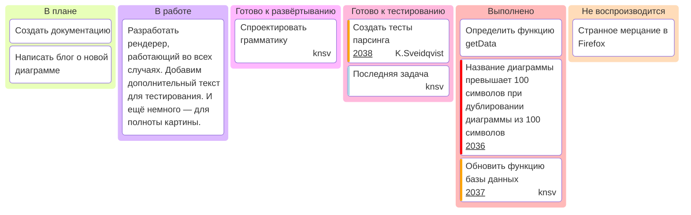

---
title: 6.02. Методология и жизненный цикл ПО
---

# 6.02. Методология и жизненный цикл ПО

## Раздел в разработке

++

Kanban


```
Методология и жизненный цикл ПО (вот тут и Agile и всякое)
Методология
Проект – характеристики, цели, а также критерии SMART (что это?)
Цикл разработки ПО
Схема
Жизненный цикл ПО
Релизный цикл ПО - последовательность этапов от разработки до выпуска продукта:
Планирование : определение требований и целей. Разработка : написание кода и тестирование. Отладка : исправление ошибок. Тестирование : проверка качества. Деплой : выпуск в production. Поддержка : устранение проблем и обновления.
Роли и зоны ответственности в команде - Роли в команде разработки :
Product Owner : определяет приоритеты и требования. Scrum Master : сопровождает процесс Scrum. Developer : пишет код.
QA Engineer : проверяет качество. DevOps Engineer : настраивает инфраструктуру. Designer : создает UI/UX.

Планирование
Сбор требований
Разработка
Тестирование
Релиз и поддержка

Схема
Релиз – выпуск новой версии программного обеспечения, доступной пользователям.
Принципы
Команда
Архитектор
Разработчик
Исполнитель
Методология разработки ПО - способы организации процесса создания программного обеспечения:
каскадная модель (Waterfall): последовательная стадионная модель. Итерационная модель (Iterative): циклическая разработка с улучшениями. Инкрементальная модель (Incremental): добавление функционала поэтапно. Scrum: гибкая-методология с короткими спринтами. Kanban : управление потоком работы через визуальную доску. DevOps : интеграция разработки и контроля для непрерывной доставки.

Waterfall – чёткое документирование, простая модель, стоимость и сроки понятны до начала работ, задачи не меняются на протяжении всего проекта
Пример ситуации Waterfall – от стадии планирования бюджета и заключения контракта с торгов на разработку ПО по чёткому ТЗ – приложению к контракту – до сдачи в срок и процедуры приёмки с развёртыванием на серверах заказчика
Итеративная и инкрементальная модели – гибкость к требованиям и изменениям, возможность адаптации, короткие сроки вывода на рынок (MVP)
Итеративная или инкрементальная – по сути это все семейство Agile подходов, основанное на принципе «гибкого» управления проектами. Сюда относят методики Scrum, FDD, Kanban, Экстремальное программирование (XP), Lean и т.д. Ключевая особенность такого гибкого подхода - создание проекта в несколько циклов (итераций), в конце каждого - готовый продукт - конкретный результат, который позволяет понять ценность, попробовать продукт и понять, по какому пути двигаться дальше. Часто в таких проектах анализ требований идет параллельно с разработкой продукта, планирование идет итерациями, а вся команда готова к тому, что в следующей итерации все может измениться.

Пример ситуации с итеративной и инкрементной моделью – со стадии заключения контракта до реализации продукта, допустим Scrum, с прозрачностью, инспекцией и адаптацией
Пример ситуации с итеративной и инкрементной моделью, когда стоимость продукта неизвестная, и могут возникнуть проблемы с архитектурой системы
Пример Kanban – поток работы разбит на этапы, ИС уже существует, отложенные обязательства и неравномерность потока, начали с того что есть, договорились об эволюционном развитии, поощрают развитие лидерства, развиваются правила, визуализация, управление потоком, ограничение количества незавершенной работы, явные правила
Kanban – каденция и прочие элементы
каденция — это повторяющийся цикл, помогающий поддерживать стабильный ритм разработки.
KISS
TOGA
Cynefin framework


```

## Подходы к методологиям разработки ПО

```
Виды методологий

Agile – подход к управлению проектами, с фокусом на итеративной разработке, с разделением работы на небольшие части (итерации), где результатом является работающий продукт/часть продукта.
Забавный момент. Когда многие мои знакомые, как и я сам, приступают к изучению методологий Agile – они тонут в куче воды. Во всех источниках наваливают информацию, и грузят грузят. Да, много лишнего. Давайте попробуем сделать фокус на ключевом.
Scrum – итеративная методология разработки, где проект разбивается на короткие спринты, сфокусированные на конкретных задачах.
Итерация
Итеративность
Спринт – итеративный период работы в Agile-разработке, сфокусированный на конкретном наборе задач (обычно 1-4 недели).
Дейли
Инкремент
Планирование спринта
Ревью спринта
Демо
Ретроспектива – встреча в конце спринта, на которой команда обсуждает, что прошло хорошо, что можно улучшить.
Эскалация – процесс передачи задачи от одного специалиста к другому, если первый не может решить её.
Артефакт в Agile – это документ, который используется в Agile-разработке, например, бэклог, спринт-бэклог, инкремент.
Кейс – сценарий использования, описывающий взаимодействие пользователя с системой.
Инкремент
Канбан
Колонки, карточки, ограничения WIP, поток задач
Чем Kanban отличается от Agile и Scrum

Waterfall
DevOps
Lean
XP
RAD
DDD
TDD
прочие методологии
```

| Подход | Описание и особенности | Когда применять |
|--------|-------------------------|-----------------|
| Waterfall (Водопад) | Последовательная модель, где этапы идут один за другим: анализ → проектирование → реализация → тестирование → внедрение. | Когда требования стабильны, не меняются со временем, и проект хорошо определён. |
| Scrum | Итеративная Agile-методология с короткими циклами (спринтами), ежедневными встречами и ретроспективами. | Для гибкой разработки, когда требования часто меняются, и нужна регулярная обратная связь. |
| Kanban | Визуальная система управления работой с помощью досок и карточек. Нет спринтов, акцент на поток задач. | Когда нужно улучшить поток работы, минимизировать простои и быстро реагировать на изменения. |
| Extreme Programming (XP) | Agile-подход с акцентом на качество кода: тестирование до написания кода, парное программирование, непрерывную интеграцию. | При высоких требованиях к качеству и необходимости быстрой адаптации к изменениям. |
| Lean Startup | Фокус на минимальный жизнеспособный продукт (MVP) и получение обратной связи от пользователей. | На ранних этапах создания продуктов, особенно в стартапах. |
| SAFe (Scaled Agile Framework) | Масштабируемая версия Agile для больших организаций и множества команд. | В крупных компаниях с несколькими командами, где нужна согласованность и координация. |
| LeSS (Large-Scale Scrum) | Упрощённая версия Scrum для масштабирования. Сохраняет принципы Agile при работе с несколькими командами. | Когда нужно масштабировать Scrum без излишней сложности SAFe. |
| Scrumban | Гибрид Scrum и Kanban. Использует элементы обоих подходов. | Когда нужны спринты, но есть также текущие задачи, которые должны обрабатываться гибко. |
| DSDM (Dynamic Systems Development Method) | Agile-фреймворк с фокусом на бизнес-ценность и участие заказчика. | Когда важно вовлечь бизнес и строго контролировать сроки и бюджет. |
| RUP (Rational Unified Process) | Итеративный процесс разработки с четкими фазами: начало, уточнение, построение, переход. | Для средних и крупных проектов, требующих формальной документации и контроля. |
| Spiral Model (Спираль) | Модель с акцентом на управлении рисками. Проект делится на циклы с оценкой рисков перед каждой фазой. | Когда требуется минимизация рисков и частые прототипы. |
| V-Model | Расширение Waterfall, где каждый этап имеет соответствующий этап тестирования. | Для проектов, где важна проверка качества и соответствие требованиям. |
| DevOps | Интеграция разработки и эксплуатации с акцентом на автоматизацию и непрерывную доставку. | Когда нужно быстро и надежно выпускать новые версии ПО. |
| CI/CD (Непрерывная интеграция / доставка) | Автоматизация сборки, тестирования и развертывания кода. | Для поддержания высокой скорости выпуска и качества продукта. |
| Design Sprint | Пятидневный процесс решения ключевых проблем через дизайн, прототипирование и тестирование. | Для быстрого поиска решений и проверки гипотез. |
| Six Sigma | Методология повышения качества за счет анализа данных и минимизации дефектов. | В организациях, где требуется максимальная точность и качество. |
| PRINCE2 (Projects IN Controlled Environments) | Структурированный подход к управлению проектами с чёткими ролями и этапами. | Для государственных и корпоративных проектов с жёсткими рамками. |
| Critical Path Method (CPM) | Метод планирования, позволяющий определить наиболее важные задачи проекта. | Когда нужно определить, какие задачи критичны для соблюдения сроков. |
| PERT (Program Evaluation and Review Technique) | Метод оценки и планирования проектов с учетом времени выполнения задач. | Для сложных проектов с большим количеством зависимостей. |
| Crystal Methods | Семейство Agile-методологий, адаптируемых под размер и критичность проекта. | Когда нужна гибкость и учёт специфики команды и проекта. |
| Feature Driven Development (FDD) | Акцент на разработке функциональных возможностей. | Для проектов, где главная цель — реализация конкретных функций. |
| RAD (Rapid Application Development) | Быстрая разработка с использованием прототипов и активным участием заказчика. | Когда нужен быстрый результат и активное участие клиента. |
| OpenUP | Упрощённая версия RUP, ориентированная на открытую коммуникацию и гибкость. | Для малых и средних проектов с потребностью в структуре, но без бюрократии. |
| AUP (Agile Unified Process) | Минималистичная версия RUP с Agile-подходом. | Для команд, которым нужна легковесная структура и гибкость. |
| XP (eXtreme Programming) | Agile-подход с акцентом на качество и взаимодействие. | Когда нужны высокие стандарты кода и гибкость. |
| Test-Driven Development (TDD) | Практика написания тестов до кода, чтобы обеспечить качество и покрытие. | Для разработки надежного и тестируемого кода. |
| Behavior-Driven Development (BDD) | Расширение TDD с акцентом на поведение системы с точки зрения пользователя. | Когда нужно согласовать технические и бизнес-требования. |
| Domain-Driven Design (DDD) | Акцент на моделировании предметной области и архитектуре. | Для сложных систем с богатой бизнес-логикой. |
| Event Storming | Коллаборативный метод моделирования бизнес-процессов с использованием стикеров. | Для выявления событий, правил и ограничений в сложных системах. |
| User Story Mapping | Метод организации пользовательских историй для лучшего понимания продукта. | Для планирования MVP и управления backlog'ом. |
| Value Stream Mapping | Анализ потока ценности, начиная от идеи и заканчивая доставкой продукта. | Для выявления потерь и улучшения процессов. |
| PDCA (Plan-Do-Check-Act) | Цикл непрерывного улучшения. | Для постоянного развития процессов и качества. |
| DMAIC (Define-Measure-Analyze-Improve-Control) | Шестисигмовый подход к улучшению существующих процессов. | Для оптимизации уже работающих процессов. |
| OKR (Objectives and Key Results) | Метод установления целей и измерения результатов. | Для стратегического управления и мотивации команд. |
| SMART Goals | Метод формулирования целей: Specific, Measurable, Achievable, Relevant, Time-bound. | Для ясного и достижимого планирования. |
| MoSCoW Method | Приоритизация задач: Must-have, Should-have, Could-have, Won't-have. | Для управления требованиями и ограниченными ресурсами. |
| RACI Matrix | Метод распределения ролей: Responsible, Accountable, Consulted, Informed. | Для ясности в ответственности и коммуникации. |
| Burndown Chart | График, показывающий прогресс по задачам в спринте. | Для визуализации продвижения в Agile. |
| Velocity (Scrum) | Мера объема работы, которую команда может выполнить за спринт. | Для планирования загрузки и прогнозирования. |
| Definition of Done (DoD) | Чек-лист, который определяет, что считается "готовым". | Для согласованности и прозрачности. |
| Backlog Grooming (Refinement) | Регулярное обновление и приоритизация Product Backlog. | Для актуализации задач и подготовки к спринтам. |
| Retrospective Meeting | Обсуждение успешных и неудачных моментов после спринта. | Для постоянного улучшения командной работы. |
| Daily Standup | Короткая ежедневная встреча для обсуждения планов и препятствий. | Для поддержания коммуникации и фокуса. |
| Sprint Planning | Планирование задач на следующий спринт. | Для согласования целей и задач команды. |
| Sprint Review | Демонстрация результатов спринта заинтересованным лицам. | Для получения обратной связи. |
| Continuous Improvement | Постоянная оптимизация процессов. | Для роста эффективности и качества. |
| Coaching Agile Teams | Поддержка и обучение команд в переходе на Agile. | Для внедрения Agile в компании. |
| Change Management | Управление изменениями в процессах и людях. | Для успешного внедрения новых практик. |
| Servant Leadership | Стиль управления, при котором лидер служит команде. | Для создания поддерживающей и мотивирующей среды. |
| Team Health Check | Регулярная оценка состояния команды. | Для выявления проблем и улучшения условий работы. |


## Анализ метолологии

```
Если нужно проанализировать процесс разработки ПО в компании и понять, какая методология используется, нужно внимательно изучить признаки, поведение команды, структуру работы и коммуникации.
1. Какие этапы есть в жизненном цикле разработки?
Признаки:
Последовательные фазы (требования → проектирование → реализация → тестирование)?
Или всё делается параллельно и итеративно?
Вопросы:
Есть ли чёткое разделение между аналитикой, дизайном, разработкой и тестированием?
Завершается ли одна фаза перед началом следующей?
 Если да — это Waterfall
 Если нет — возможно, Agile или DevOps

2. Как часто выпускаются новые версии/функционал?
Признаки:
Релизы происходят раз в несколько месяцев или год?
Или каждую неделю/день?
Вопросы:
Как часто продукт попадает к пользователям?
Используется ли автоматизация сборки и деплоя?
 Редкие релизы → Waterfall / классические модели
 Частые релизы → Agile / DevOps / CI/CD

3. Как организованы встречи и планирование?
Признаки:
Ежедневные короткие встречи (daily standup)?
Спринты по 1–4 недели?
Ретроспективы после каждого цикла?
Вопросы:
Есть ли регулярное планирование задач?
Обсуждается ли, что можно улучшить после каждой итерации?
 Такие практики указывают на Scrum или Kanban (Agile)

4. Как взаимодействуют заказчик, бизнес и команда разработки?
Признаки:
Бизнес участвует в еженедельных встречах?
Формулируются пользовательские истории и критерии принятия?
Вопросы:
Насколько активно вовлечены заказчики в процесс?
Изменяются ли требования в процессе разработки?
 Высокий уровень вовлечённости → Agile
 Минимальное участие → Waterfall

5. Как организовано управление задачами и приоритетами?
Признаки:
Используется Jira/Trello/ClickUp?
Есть ли доски с колонками (To Do, In Progress, Done)?
Или просто список задач без гибкости?
Вопросы:
Как формируется список задач?
Можно ли менять приоритеты в процессе?
 Доски, backlog, карточки → Kanban / Scrum
 Линейный список → Waterfall

6. Как оцениваются задачи?
Признаки:
Используется Planning Poker, Story Points?
Или точные часы и сроки?
Вопросы:
Как команда оценивает сложность задач?
Меняются ли оценки в процессе?
 Относительная оценка → Agile
 Точные часы → Waterfall / традиционные подходы

7. Как решаются проблемы и управляются изменения?
Признаки:
Есть ли регулярная обратная связь от пользователей?
Готовы ли к изменениям в процессе?
Вопросы:
Как команда реагирует на изменение требований?
Есть ли возможность "переписать" план в середине проекта?
 Готовность к изменениям → Agile
 Сопротивление изменениям → Waterfall

8. Как организована работа с качеством и тестированием?
Признаки:
Есть ли автоматизированные тесты?
Пишутся ли тесты до кода (TDD)?
Вопросы:
Как часто тестируется продукт?
Происходит ли тестирование в конце или на каждом этапе?
 Частое тестирование + автоматизация → DevOps / Agile
 Тестирование только в конце → Waterfall

9. Какие инструменты используются?
Примеры:
Jira, Trello, ClickUp → Agile
Confluence, Notion → документация и совместная работа
GitLab CI, Jenkins, GitHub Actions → DevOps
MS Project, Excel → Waterfall

10. Какова роль архитектуры и технического долга?
Признаки:
Архитектура строится заранее или эволюционирует?
Учитывается ли технический долг в спринтах?
 Предварительное проектирование → Waterfall
 Эволюция архитектуры → Agile / Lean / DevOps

Любой продукт проходит процедуру верификации – проверки соответствия продукта требованиям, описанным в спецификации. В основном это называется «приемка» выполненных работ.


Что такое технический долг?

Технический долг — это совокупность компромиссов и упрощений, сделанных в процессе разработки программного продукта для ускорения выпуска функционала. Эти решения часто приводят к ухудшению качества кода, снижению читаемости, ухудшению архитектуры и увеличению сложности поддержки. В итоге такой "долг" накапливается и требует дополнительного времени и ресурсов в будущем на исправление, рефакторинг и оптимизацию, что замедляет развитие проекта и повышает риск ошибок.

Технический долг — не всегда плохо, он бывает осознанным инструментом для достижения быстрых результатов, но без контроля и своевременного «погашения» становится серьёзной проблемой для команды и бизнеса.

```

