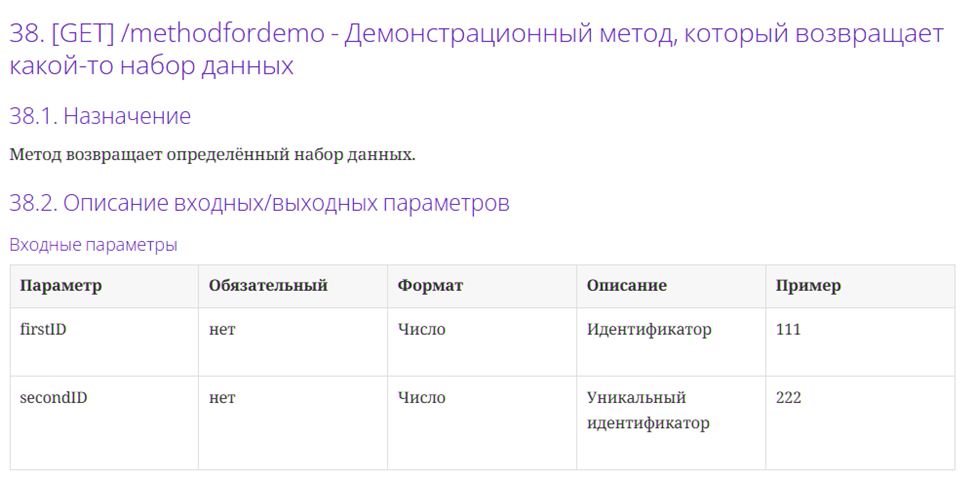
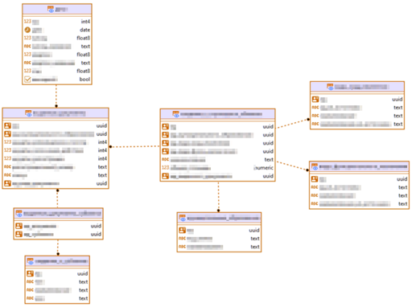
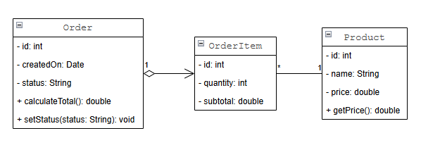
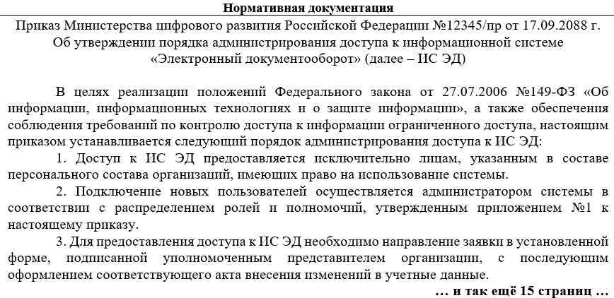
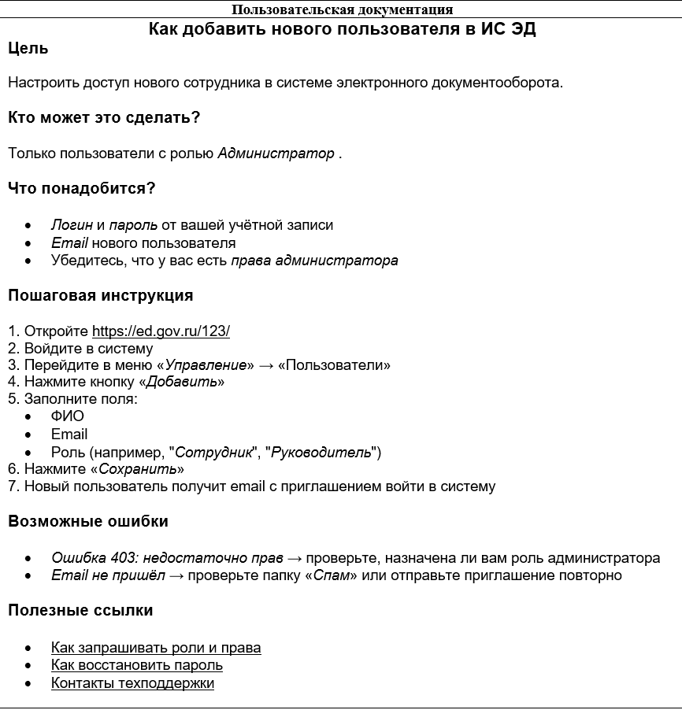

---
title: 6.04. Техническое письмо
---

# 6.04. Техническое письмо

## История технического письма

```
Жанр технического письма, научные статьи, руководства и записки
Краткая история технического письма: от древних технических манускриптов (например, Витрувий, арабские трактаты по механике) до инженерной документации XIX века.
Появление стандартизированной документации в промышленности, военных проектах и космических программах (NASA).
Как развитие IT и программирования потребовало нового типа письма — точного, воспроизводимого, масштабируемого.
Появление комментариев, XML-документации и аннотаций, официальное документирование, появление баз знаний и вики.
Роль формализации, закрепления и описания как базовых потребностей в передаче знаний.
Переход от «записок на полях» к системной документации.

```

**Техническое письмо** - это вид письменной коммуникации, направленный на точное, ясное и структурированное изложение сложной информации, связанной с технологиями, научными процессами, инженерными решениями или программными продуктами.

Главная цель технического письма - передать знания, инструкции или данные так, чтобы их мог понять и использовать конкретный читатель, к примеру, пользователь, разработчик, менеджер или инженер.

В отличие от художественной или публицистической литературы, техническое письмо не стремится вдохновлять или развлекать, а служит инструментом для решения практических задач - настройки системы, устранения неполадок, изучения API, прохождения обучения или принятия решений.

Техническое письмо характеризуется точностью, ясностью, структурированностью и целевой направленностью.

*Точность* подразумевает, что каждое слово должно нести смысл и быть верным с технической точки зрения.

*Ясность* позволяет подавать информацию доступно, без излишней сложности и двусмысленности.

*Структурированность* - логичная организация текста (заголовки, списки, иерархия), что позволяет читателю быстро находить нужное.

*Целевая направленность* текста учитывает аудиторию - её уровень знаний, задач и контекст использования.

Таким образом, если текст имеет четыре логических признака, он уже может считаться техническим письмом. Причём речь может быть не всегда связана с непосредственно информационными системами - это может быть устройство, процесс.

С самого начала цивилизации люди сталкивались с необходимостью передавать сложные знания — как построить здание, как изготовить инструмент, как вылечить болезнь. Эти знания требовали не просто устной передачи, а фиксации: описания, структурирования, формализации. Так родился жанр технического письма.

Одним из первых известных образцов считается трактат Витрувия «Об архитектуре» (I век до н.э.) — десять книг, в которых римский инженер не только описал принципы строительства, но и ввёл систему терминологии, чертежей и инструкций. В Средние века арабские учёные, такие как Аль-Джахиз и Аль-Джазари, писали подробные технические манускрипты с описанием механизмов, автоматов и военных машин — схемы, пошаговые инструкции, даже «юнит-тесты» в виде описаний работоспособности. Это была уже не просто заметка, а полноценная документация.

С приходом промышленной революции XIX века техническое письмо стало системным. Чертежи, спецификации, операционные инструкции, патентные описания — всё это требовало стандартизации. Заводы не могли работать без чётких регламентов. Военные проекты — без точных описаний систем. А когда в середине XX века человечество запустило первые компьютеры, стало ясно: без документирования знаний масштабные проекты просто невозможны.

**Чертёж** — это графический документ, выполненный в соответствии с установленными правилами проектирования и стандартизации (например, ГОСТ, ISO, ANSI), который в масштабе и с точными размерами изображает форму, конструкцию и параметры изделия, детали, здания или системы. 

**Цель чертежа** — однозначно передать геометрическую и конструктивную информацию, чтобы изделие могло быть точно изготовлено, собрано и проверено.

**Спецификация** — это структурированный документ, в котором перечислены и описаны компоненты, параметры, требования и характеристики изделия, системы или проекта. Она отвечает на вопрос: «Из чего это состоит и какие у этого требования?»

**Цель спецификации** — обеспечить точное понимание состава и требований к продукту для разработчиков, инженеров, закупщиков и контролеров.

**Операционная инструкция** (или инструкция по эксплуатации) — это документ, описывающий последовательность действий, которые необходимо выполнить для безопасной и эффективной работы с оборудованием, программным обеспечением или технологическим процессом. К примеру, это подготовка к работе, пошаговые операции, меры безопасности, действия при авариях, профилактическое обслуживание. 

**Цель операционной инструкции** — минимизировать ошибки, обеспечить стандартизацию процессов и защитить пользователя и оборудование.

**Патентное описание** — это юридически значимый документ, входящий в состав заявки на изобретение, полезную модель или промышленный образец. Оно содержит подробное и точное описание технического решения, его сущности, принципа действия, отличительных признаков и способа реализации.

**Цель патентного описания** — обосновать новизну и изобретательский уровень решения, чтобы получить правовую защиту.

Как можно понять, документация в части технической в первую очередь была связана с эксплуатацией устройств - а они были практически во всех сферах.

Космическая гонка и программы NASA стали поворотным моментом. Там, где ошибка в инструкции могла стоить жизни, документация превратилась в строгий, верифицируемый, многоуровневый процесс. Каждое решение, каждый компонент, каждый тест — фиксировались. Появились стандарты: MIL-STD, IEEE, ISO. Документация стала не просто полезной, а обязательной частью инженерной дисциплины.

**MIL-STD** (United States Military Standard), это военный стандарт США, система стандартов, разработанных Министерством обороны США для унификации проектирования, производства, испытаний и документирования военной техники, оборудования и программного обеспечения. К примеру, MIL-STD-461 — требования к электромагнитной совместимости, MIL-STD-810 — методы испытаний на устойчивость к внешним воздействиям (температура, вибрация, влажность), MIL-STD-40051 — стандарт оформления технической документации для военных систем.

Разработан MIL-STD в середине XX века, в период Второй мировой войны и Холодной войны, когда США столкнулись с проблемой несовместимости оборудования от разных поставщиков. Единые стандарты позволили упростить логистику, ремонт и взаимозаменяемость деталей.

**IEEE** (Institute of Electrical and Electronics Engineers, Институт инженеров по электротехнике и электронике) - это международная профессиональная организация, разрабатывающая технические стандарты в области электротехники, электроники, информационных технологий и телекоммуникаций.
	- IEEE 802 — стандарты локальных сетей (например, IEEE 802.11 — Wi-Fi).
	- IEEE 754 — стандарт представления чисел с плавающей запятой.
	- IEEE 12207 — стандарт процессов жизненного цикла программного обеспечения.
	- IEEE образован в 1963 году путём слияния двух организаций: American Institute of Electrical Engineers (AIEE) и Institute of Radio Engineers (IRE). Стандартизация стала одной из ключевых миссий — особенно с ростом цифровых технологий. Многие IT-документы (особенно по сетям, API, протоколам) ссылаются на IEEE.

**ISO** (International Organization for Standardization, Международная организация по стандартизации) - это глобальная сеть национальных стандартов, разрабатывающая международные стандарты по самым разным сферам — от качества и безопасности до информационных технологий и экологии.
	- ISO 9001 — система менеджмента качества.
	- ISO/IEC 27001 — безопасность информации.
	- ISO/IEC 2382 — словарь терминов в области информационных технологий.
	- ISO 20607 — стандарт по технической документации для безопасного использования машин.

Организация создана в 1947 году в Лондоне представителями 25 стран. Цель — устранить барьеры в международной торговле и техническом сотрудничестве за счёт единых правил. ISO устанавливает международные нормы для структуры, содержания и терминологии технической документации. Например, стандарт ISO 20607 напрямую регулирует, как оформлять руководства по эксплуатации, чтобы они были понятны в любой стране.

**ANSI** (American National Standards Institute, Американский национальный институт стандартов) - это некоммерческая организация, координирующая разработку и внедрение добровольных стандартов в США. ANSI не создаёт стандарты сам, но утверждает и аккредитует стандарты, разработанные другими организациями (включая IEEE, ASME, NIST).
	- ANSI Z535 — стандарты предупреждающих знаков и маркировки.
	- ANSI/INCITS — стандарты в области информационных технологий.
	- ANSI C (теперь ISO/IEC 9899) — стандарт языка C.

Основан в 1918 году как American Engineering Standards Committee (AESC). Создан по инициативе пяти инженерных ассоциаций и правительственных ведомств для устранения дублирования и несогласованности в промышленных стандартах. ANSI определяет форматы, символы, цвета и терминологию, используемые в технической документации в США. Особенно важен при создании инструкций по безопасности, маркировке оборудования и документации для рынка США.

**ГОСТ** (Государственный стандарт) это система стандартов, действующих на территории бывшего СССР и в настоящее время — в России и других странах СНГ. Охватывает технику, производство, строительство, IT, документооборот и многое другое.
	- ГОСТ 2.105–2019 — общие требования к текстовым конструкторским документам.
	- ГОСТ Р 21.1101–2020 — систему проектной документации для строительства.
	- ГОСТ 7.0.12–2011 — требования к оформлению научных и технических документов.
	- ГОСТ 34 — стандарты в области автоматизации и программирования (например, ГОСТ 34.13-2015 — шифрование).

Первые ГОСТы были введены в 1925 году в СССР. В 1968 году началась масштабная унификация под названием **ЕСКД** (Единая система конструкторской документации) и **ЕСПД** (Единая система программной документации) — они стали основой для оформления чертежей и IT-документации в СССР.

В России и странах СНГ ГОСТы — обязательный ориентир при создании технической документации. Особенно строго соблюдаются в государственных, оборонных и промышленных проектах.

Стандартизация позволила сделать мир документации более организованным и единообразным, и фактически «подмяла» под себя техническое письмо.

С развитием программирования техническое письмо пережило глубокую трансформацию. Если раньше инженеры и технические писатели работали с чертежами и операционными инструкциями, то с появлением ПО возникла новая задача: объяснить код. Сам по себе код — это язык, но он не всегда говорит зачем, как и для кого он написан. Появилась потребность в мета-документации — текстах, поясняющих код, его архитектуру, использование и интеграцию.

**Комментарии в коде** (1950–1970-е). 

Комментарии — это фрагменты текста внутри исходного кода, которые игнорируются компилятором, но предназначены для разработчиков. Они поясняют логику, назначение функций, сложные алгоритмы или временные решения.
```
// Вычисление факториала с помощью рекурсии
int factorial(int n) {
    if (n <= 1) return 1;
    return n * factorial(n - 1);
}
```
Ещё в 1950-х годах, с появлением первых языков высокого уровня (например, FORTRAN, COBOL, ALGOL), стало очевидно, что код нужно сопровождать пояснениями. Ранние программисты (часто математики и инженеры) писали заметки прямо в листингах — сначала на полях, потом в теле программы. 

В FORTRAN (1957) комментарии обозначались символом C в первой колонке. К 1970-м годам комментарии стали стандартной практикой, особенно в языках вроде C, где сложность кода требовала пояснений.

Комментарии стали первой формой технического письма внутри кода. Они позволили сохранить контекст, передавать знания между членами команды и документировать «почему», а не только «что».

В 1970-х появились уже первые руководства, технические описания и справочники, создаваемые разработчиками для других разработчиков или пользователей. Это могли быть PDF, текстовые файлы (.txt), бумажные мануалы. К примеру, руководства по языку C (Керниган и Ритчи, 1978), справочники по операционным системам (UNIX, VMS), описания библиотек и утилит.

С ростом сложности программного обеспечения (особенно в академических и военных проектах) стало невозможно полагаться только на код. Нужны были внешние документы, объясняющие архитектуру системы, интерфейсы и принципы использования. Соответственно, в 1970-x Bell Labs (там, где создавали UNIX и C), активно писали документацию и появились man-страницы в UNIX - первые электронные справочники. Компании вроде IBM и DEC выпускали толстые тома с описанием своих систем. Разработчики впервые стали техническими писателями по умолчанию.

В 1980-х, для стандартизации взаимодействия между системами, с развитием операционных систем, графических интерфейсов и сетевых протоколов (TCP/IP, HTTP), разработали первые API.

**API** (Application Programming Interface) — набор правил, по которым программы обмениваются данными. Спецификация API описывает - какие методы доступны, какие параметры принимают, какие ответы возвращают, как авторизоваться и обрабатывать ошибки.

Первыми были Microsoft и Apple, которые публиковали API для разработки под Windows и Mac OS. А с развитием веб-инфраструктуры, HTTP, HTML, CGI появились и прочие документы.

В 1998 году Sun Microsystems опубликовали Javadoc и спецификации для Java API. В 2000-х уже появились SOAP, WSDL, что повлекло за собой XML-описания веб-сервисов.

А в 2010-х, с развитием REST и стандартов вроде OpenAPI (ранее Swagger), спецификации и вовсе стали машиночитаемыми.

Говоря об XML, следует упомянуть об XML-документации и аннотациях. В 1990-х, появились способы встраивать документацию прямо в код, чтобы она могла автоматически извлекаться и превращаться в HTML, PDF и другие форматы.

К примеру, C# и .NET в 2000-х, подготовили специальные комментарии, которые парсятся утилитой Sandcastle и превращаются в официальную документацию:
```
/// <summary>
/// Вычисляет сумму двух чисел.
/// </summary>
/// <param name="a">Первое число</param>
/// <param name="b">Второе число</param>
public int Add(int a, int b) { ... }
```
JavaDoc же использует специальные комментарии `/** ... */` с тегами @param, @return, @throws. А для генерации используется одноимённая утилита, которая генерирует HTML-сайт с документацией.

Аннотации, кстати говоря, сами по себе не документация, но являются метаданными в коде, которые могут использоваться для генерации документации.
```
@Deprecated
public void oldMethod() { ... }
```
Такие аннотации помогают документировать поведение, безопасность, маршруты (в Spring: @GetMapping) — и автоматически отражаются в документации.

Соответственно, в Python появился Sphinx + docstrings, а в JavaScript - JSDoc.

Документация стала частью кодовой базы, а не отдельным артефактом. Это повысило её актуальность и упростило поддержку.

В тот же период развивался и еще один аспект, касающийся документации - SDK (Software Development Kit), набор инструментов, позволяющий разработчикам создавать приложения для определённой платформы. Он включает библиотеки, API, примеры кода, документацию, отладчики. эмуляторы, словом, всё что нужно для старта. К примеру - Android SDK, AWS SDK, Facebook SDK. Они появились, потому что компании заинтересовались привлечением сторонних разработчиков. SDK стали маркетинговым инструментом — чем лучше SDK, тем больше разработчиков присоединяется.

Базы знаний, вики и внутренние порталы появились в 1990-х. Собственно, Wiki как Confluence, Notion, MediaWiki, базы знаний как Zendesk, ServiceNow и корпоративные сайты с документацией, процессами, FAQ.

В 1995 году появился WikiWikiWeb, первая вики. В 2000-х компании начали использовать MediaWiki для внутренних целей, пока в 2004 Atlassian не запустила самый масштабный проект для бизнеса - Confluence. Это первая коммерческая вики, которая позволила очень классно организовать работу в компании.

А уже в 2010-х появились Slack, Notion, Google Workspace, Яндекс и прочие сервисы с интеграцией чатов, документов, баз знаний.
Сейчас вики практически самый важный инструмент любой команды, охватывающий все аспекты - от онбординга и организационных моментов до работы DevOps.

Чем вики фундаментально отличается от документации другого вида? Своей актуализируемостью и живостью. Представьте - документацию надо править, согласовывать и утверждать. А вики можно просто за пару секунд поправить и всё.

В настоящее время появилась философия Docs-as-Code, примерно с 2010-х. Она подразумевает, что документация пишется, хранится и развивается так же, как и код - в системах контроля версий (Git), с помощью Markdown, через CI/CD пайплайны, с pull request’ами и ревью. То есть, под влиянием технологий DevOps и Agile-методологий, и конечно open-source проектов вроде Linux, Kubernetes, React, документация стала ещё живее.

Потому что открытые проекты хранят свою документацию на GitHub в README.md, docs/, а инструменты вроде Jekyll, Hugo, Docusaurus, MkDocs генерируют аж целые сайты из Markdown! Со временем даже крупные компании (Google, Microsoft, Netflix) перешли на docs-in-repo, когда документация располагается в репозитории, живя рядом с кодом.

Просто у Git есть такая удобная система контроля версий, которая технически отлично работает с текстом, что и позволяет удобно синхронизироваться с кодом, версионировать, автоматизировать и так далее. Документация становится интегрированной частью разработки, а не опциональной задачей в конце цикла.

## Документация

**Документация** — это совокупность документов, созданных для описания, объяснения, сопровождения или управления продуктом, системой, процессом или проектом. Её целью является обеспечение понимания, упрощение использования и развития, снижение зависимости от отдельных специалистов и обеспечение преемственности и контроля.

Словом, это инструмент управления знаниями и фиксации информации.

**Документ** — это отдельный информационный артефакт, оформленный в соответствии с определённой структурой и стандартами, предназначенный для передачи, хранения или использования информации.

Документ может быть:
	- электронным (PDF, Markdown, HTML);
	- печатным (инструкция, отчёт);
	- частью системы (man-страница, справка в приложении).

**Внутренняя документация** - это документация, предназначенная для использования внутри организации или команды, не рассчитанная на публикацию или доступ со стороны. Она позволяет поддерживать разработку, передавать знания и стандартизировать процессы для разработчиков, тестировщиков, DevOps, менеджеров и технических писателей конечно.

Это могут быть архитектурные решения (ADR), конспекты встреч, онбординг-гайды, внутренние API-спецификации и чек-листы деплоя.
Разумеется, внутренняя документация, как правило, менее формальная, часто хранится в вики (Confluence, Notion) и доступна только по внутренним правам в закрытом пространстве.

**Внешняя документация** - это документация, предназначенная для внешних пользователей, таких как клиенты, партнёры, интеграторы, разработчики. Она помогает использовать продукт, снижает нагруку на поддержку и повышает вовлечённость.

К примеру, это руководство пользователя, API-документация на публичном портале, FAQ на сайте, инструкция по настройке интеграции. Часто это требует высокой точности и ясности, проходит редактуру и локализацию, и такая документация должна соответствовать бренду и стандартам UX.

Иногда документация может иметь внутренний вариант (для своих) и внешний (для всех). Допустим, когда закрытая информация «прячется» от чужих глаз.

**Техническая документация** ориентирована на специалистов, обладающих техническими знаниями. Объясняет как устроено и как работает. Цель её - описать архитектуру, объяснить принципы работы, помочь в интеграции или настройке инженерам, разработчикам, DevOps, системным администраторам.

Примеры технической документации - спецификации протоколов, руководства по развёртыванию кластеров, документации по API и описания форматов данных. Они отличаются высокой точностью, использованием терминов и схем, и имеют акцент на детали и параметры.

**Пользовательская документация** рассчитана на на конечных пользователей, которые могут не обладать техническими знаниями. Объясняет как использовать. Цель здесь научить выполнять задачи, минимизировать барьер входа, повысить удовлетворённость. Аудитория - обычные пользователи, офисные сотрудники, менеджеры, клиенты. Что очевидно, они могут быть менее технически «подкованными» и им важно подавать информацию под особым видом.

К примеру, это пошаговое руководство, видеоинструкция по настройке приложения, карточки подсказок. Язык здесь проще, каждый шаг подробно описывается, добавляются скриншоты, иллюстрации, а фокус больше на решении задачи, а не на технике.
Пользователю плевать, как это работает, ему важно - как это сделать.

**Временная документация** - это документы, созданные на короткий срок для решения текущей задачи. Разумеется, это устаревает или удаляется. Цель здесь - зафиксировать промежуточные решения, организовать работу и передать информацию «здесь и сейчас».
Примеры - протокол совещания, черновик спецификации, заметки на доске в Jira или какой-то временный гайд для тестирования. Порой даже просто сообщение-объявление. Всё это не требует идеального оформления, может храниться неструктурированно и со временем архивируется или удаляется.

**Долгосрочная документация** включает в себя документы, предназначенные для длительного хранения и регулярного использования. Это обеспечивает преемственность, возможность поддерживать продукт годами и позволяет служить официальным источником истины.

Примерами могут быть руководство пользователя, политика безопасности, архитектурная документация. В отличие от прочих, эта документация проходит ревью и утверждение, версионируется, поддерживается актуальной, часто интегрирована в систему управления документацией.

## Виды документации

### API-документация

**API (Application Programming Interface)** — это правила и протоколы, по которым программы обмениваются данными. 

API-документация — это руководство пользователя для разработчиков, которое объясняет, как подключиться к API, какие запросы отправлять, что ожидать в ответ и как обрабатывать ошибки.

1. **REST** (Representational State Transfer) — архитектурный стиль для веб-API, основанный на HTTP. Соответственно, REST API-документация касается этого стиля.

REST API используют стандартные HTTP-методы и ресурсно-ориентированную структуру URL.

Метод определяет действие, которое выполняется с ресурсом:
	- GET - получить данные;
	- POST - создать новый ресурс;
	- PUT/PATCH - обновить существующий ресурс;
	- DELETE - удалить ресурс.

Эндпоинт (Endpoint) это URL-адрес, по которому доступен API-метод. При этом указывается базовый URL, версия API и параметры пути. Как правило, в документации не обязательно указывать именно `https://ссылканасервис`, а добавляется именно то, что касается API, к примеру, `/api/users/`

Параметры запроса - это дополнительные данные, передаваемые в URL после ? и документируются они как таблица.

Тело запроса включает в себя данные, отправялемые в формате JSON (или ином).

И конечно же в API указываются примеры запросов и ответов.

#### Пример:


Метод: POST

Описание: Создаёт нового пользователя в системе.

Эндпоинт: `/api/v1/users`

Параметры запроса:

| Параметр | Тип      | Обязательный | Описание                                      |
|----------|----------|--------------|-----------------------------------------------|
| limit    | integer  | Нет          | Количество записей (по умолчанию 20)         |
| status   | string   | Нет          | Фильтр по статусу: `active`, `blocked`       |

Пример запроса:
```json
POST /api/v1/users HTTP/1.1
Host: api.example.com
Authorization: Bearer abc123xyz
Content-Type: application/json

{
  "name": "Иван Сидоров",
  "email": "ivan@example.com"
}

```

Пример ответа:

```json
{
  "id": 123,
  "name": "Иван Сидоров",
  "email": "ivan@example.com",
  "created_at": "2025-04-05T12:00:00Z"
}

```

Другой пример - как это выглядит на практике:



Также документируются заголовки HTTP-запроса и коды состояния. Примеры - это 200 OK, 201 Created, 400 Bad Request, 401 Unauthorized, 403 Forbidden, 404 Not Found, 500 Internal Server Error.

Также важно указывать и авторизацию. В части безопасности определяется - как получить токен (OAuth, API Key, JWT), где передавать (в заголовке, в теле), срок действия токена, ограничения.


2. GraphQL API-документация.

**GraphQL** — альтернатива REST, разработанная Facebook. Позволяет клиенту запрашивать ровно те данные, которые ему нужны, в одном запросе.
В отличие от REST, у GraphQL обычно один URL (например, /graphql), но сложная структура запросов. 

Типы запросов - Query, Mutation, Subscription (соответственно - получение данных, изменение и подписка на поток данных). 

Здесь добавляется схема, ведь GraphQL строится вокруг типов и полей. Схема описывает, какие данные доступны. В документации приводится полная схема (часто с интерактивным браузером, указанием типов, полей, аргументов и обязательности).

В документации приводится пример для каждого типа операции, описание аргументов и ожидаемый ответ.


**Что можно выделить общего для API-документации?**

	- Во-первых, должна быть структура с разделами - Введение, Авторизация, Эндпоинты, Примеры, Ошибки, FAQ.
	- Во-вторых, интерактивность. Для удобства лучше добавлять API-песочницу, которая позволяла бы тестировать запросы - допустим, Swagger UI, Postman, Stoplight.
	- В-третьих, такая документация обязательно должна быть актуальной, по крайней мере в момент настроек или интеграции, а ежели общедоступна - всегда.

Также в случаях, когда что-то пошло не так, нужно объяснить, почему так произошло и как это исправлять.


### SDK-руководства

На практике можно встретить что угодно - справку могут назвать SDK, API могут назвать руководством и так далее. Но технически, SDK - нечто шире.

**SDK (Software Development Kit)** — это комплексный набор инструментов, позволяющий разработчикам легко интегрировать сторонний сервис, платформу или технологию в своё приложение.

Сюда включаются:
	- библиотеки (код на конкретном языке);
	- документация (руководства, примеры);
	- примеры кода (готовые проекты, модули, пакеты);
	- инструменты (CLI, отладчики, эмуляторы);
	- API-обёртки (упрощённый доступ к API);
	- средства авторизации и обработки ошибок.

Хорошее SDK-руководство — это дорожная карта для разработчика. Оно должно позволить начать использовать SDK за 5–10 минут.
Обычно можно встретить Quick Start (Быстрый старт), раздел с установкой, инициализацией и ссылками.

Установка и настройка сопровождается подробными инструкциями для разных платформ и окружений, описывает требования к версиям, среде, настройкам переменных окружения, конфигурации клиента.

И конечно, включается описание ключевых возможностей SDK - как вызывать API-методы, какие объекты возвращаются, как работать с коллекциями, пагинацией и так далее.

### Технические описания

**Техническое описание** — это документ, в котором детально излагается структура, принципы работы, состав и взаимодействие компонентов технической системы: программного обеспечения, базы данных, серверной инфраструктуры и т.д.

Оно предназначено для специалистов, которым нужно понять архитектуру, вносить изменения, диагностировать проблемы, проектировать интеграции, поддерживать систему в долгосрочной перспективе. В отличие от пользовательской документации, техническое описание не решает задачу пользователя, а объясняет устройство машины.

**Модуль** — это логически завершённая часть системы, отвечающая за определённую функциональность. Может быть файлом, пакетом, библиотекой или микросервисом.

В описание модуля входит:
	- Наименование и свойства;
	- Назначение и цели;
	- Входные и выходные данные (что принимает, что возвращает);
	- Зависимости (от других модулей);
	- Интерфейсы (функции, API, события);
	- Принципы работы;
	- Конфигурация (какие настройки требуются);
	- Ошибки и логирование;
	- Примеры использования.

**Подсистема** — это крупный функциональный блок системы, состоящий из нескольких модулей, сервисов или компонентов. К примеру, подсистема аутентификации или подсистема аналитики.

В описание подсистемы входит:
	- Границы подсистемы: что входит, что нет;
	- Цель и бизнес-логика;
	- Компоненты (модули/сервисы);
	- Входы и выходы (с какими подсистемами взаимодействует);
	- Диаграммы (UML, к примеру);
	- Протоколы обмена (REST, gRPC, сообщения);
	- Требования к производительности, отказоустойчивости, безопасности;
	- Режимы работы - тестовый, продакшн, деградированный.

Часто такая документация оформляется как архитектурное решение (ADR) или часть архитектурной документации.

**Описание базы данных** - это документ, объясняющий структуру, логику и использование базы данных — реляционной или NoSQL. Сюда включается:
	- Общая информация (назначение, тип СУБД, версия и окружение);
	- Схема данных (ER-диаграмма, ключи, индексы);
	- Описание таблиц/коллекций (названия, назначение, поля, примеры);
	- Важные запросы (в идеале - частые запросы и пояснение логики);
	- Производительность и индексы, узкие места и рекомендации по оптимизации;
	- Резервное копирование и восстановление (расписание и методика бэкапов, кто отвечает);
	- Безопасность - шифрование, доступ, аудит.



**Описание инфраструктуры** - документ, который описывает физическую и логическую архитектуру среды, где работает система: серверы, сети, облака, контейнеры.

Сюда входит:
	- Топология системы - диаграмма (серверы, сети, базы), обозначение окружений (dev, test, prod), география (датацентры и регионы);
	- Компоненты - серверы, облачные сервисы, контейнеры, устройства;
	- Сеть - IP-адресация, подсети, правила доступа, порты;
	- Хранение - типы дисков, объёмы, системы хранения;
	- Автоматизация - инфраструктура, CI/CD, мониторинг;
	- Безопасность - шифрование, доступ, логирование и аудит;
	- Производительность - масштабируемость, нагрузка;
	- Резервирование и отказоустойчивость - репликация, кластеры, восстановление.

**Описание алгоритма** включает в себя назначение, входные/выходные данные, шаги алгоритма (псевдокод, блок-схема), ограничения и сложность.

**Описание формата данных** включает в себя, к примеру, структуру, обязательные поля, примеры JSON, XML, CSV, Protobuf, а также схемы вроде XSD или JSON Schema.

**Описание технического процесса** может быть, к примеру, алгоритмом развёртывания, миграции БД или обновления версии, пошагово - кто, что, когда, зачем.

**Описание архитектурного решения** (ADR) определяет проблему, варианты решения, обоснование выбранного варианта и последствия.

Словом, техническое описание может касаться чего угодно, но должно придерживаться точности, структурности, иметь визуализацию и актуальность.

### Регламенты и стандарты

В корпорациях, государственных структурах, банках, медицинских учреждениях и IT-компаниях высокой ответственности (например, авиация, энергетика) нельзя полагаться на память, интуицию или «как получится». Ошибки стоят дорого — в деньгах, времени, репутации, безопасности.

Поэтому всё, что важно, повторяется или несёт риски, переводится в разряд регламентированных процессов.

**Регламент** — это официальный документ, устанавливающий порядок, правила и процедуры выполнения определённого процесса или действия в организации.

Он отвечает на вопросы «Кто должен это сделать?», «Что нужно сделать?», «Когда и в какой последовательности?», «Какие документы оформляются?», «Какие риски нужно учитывать?», «Куда сообщать при отклонениях?».

Всё это - с целью устранить неопределённость, обеспечить единообразие, контроль и воспроизводимость.

Примеры - регламент развёртывания ПО, обработки персональных данных, реагирования на инциденты ИБ, или именования сущностей.

**Регламентированность** — это степень, в которой процессы в организации описаны, стандартизированы и подлежат контролю. Чем выше регламентированность, тем меньше простора для интерпретации, проще обучать новых сотрудников, выше предсказуемость и легче аудит и соответствие требованиям. Высокую регламентированность можно встретить в государственных органах, банках и финансовых институтах, авиации, энергетике, ядерных объектах, крупных корпорациях с критической инфраструктурой.

Зачем фиксируют правила в регламенте?

1. Преемственность. Если сотрудник уволился, то процесс сохраняется - новый сотрудник будет понимать, что и как делать.
2. Контроль и аудит. Можно проверить, кто, что и когда сделал, особенно при разборе проблем, инцидентов.
3. Снижение рисков. Ошибки в развёртывании, доступе или резервном копировании могут практически уничтожить бизнес, а регламент снизит шансы.
4. Масштабирование. Одно дело, когда в команде 10-15 человек, и можно договориться на словах. Но когда их сотни? Тогда на устные договорённости надежды уже нет.
5. Соответствие законам. Многие отрасли требуют документирование процессов или устанавливают какие-то особые условия, к примеру, обработка персональных данных.

Разработчики сразу столкнутся с регламентами разработки. К примеру, там может быть стандарт кода, обязательное код-ревью и чек-лист по нему, требования к коммитам (сообщениям в них).

Пользователи же работают с регламентами для конкретных субъектов, которые устанавливают, как пользователи взаимодействуют с платформой, какие у них права, что запрещено.

Регламенты не пишутся просто так. Сначала выполняется анализ процесса (как, кто, что делает), потом формализация (описание по шагам), обязательно согласование и утверждение, а внесение изменений порой требует повторного цикла. Согласовывать причём порой нужно не только с руководством, но и с юристами, безопасниками и прочими специалистами.

Храниться они могут как на внутренних вики, так и в виде физически подписанных документов - но «бумажные» подписи уже прошлый век, так что скорее всего, столкнётесь именно с продвинутыми механизмами.

**Стандарт** — это документированная норма, правило или спецификация, принятая для обеспечения единообразия, совместимости, безопасности и качества в определённой области деятельности. Он отвечает на вопросы «Как что-то должно быть устроено?», «Как это должно называться?», «Как это должно работать?» и «Как это должно выглядеть?».

Это может быть стандарт оформления отчёта, стандарт написания кода, крепления розетки в стене или передачи данных по HTTP.
Словом, это не закон, но часто становится обязательным к исполнению, если где-то закреплено его соблюдение, допустим в регламенте или техническом задании.

**Стандартизация** — это процесс разработки, принятия, внедрения и поддержки стандартов с целью устранения дублирования, повышения качества, обеспечения совместимости, снижения затрат, упрощения взаимодействия. Цель - сделать сложный мир предсказуемым и управляемым.
 Без стандартизации каждый производитель делал бы свои собственные дизайны, программист бы писал на своём диалекте, а города бы измеряли расстояния в своих единицах. Это цивилизационный инструмент.

Стандарты бывают разного уровня, происхождения и назначения.

**Государственные стандарты** принимаются на уровне страны, обязательны или рекомендованы для применения в государственных и коммерческих структурах. В Российской Федерации это ГОСТ, в Германии DIN, в Британии BS, в Японии JIS. Везде свои.

**Международные стандарты** разрабатываются независимыми организациями и используются в десятках стран. К примеру, это ISO, IEC, IEEE, ITU. Они используются в первую очередь в инженерии и менеджменте.

**Корпоративные стандарты** - это внутренние нормы, принимаемые компанией для единообразия в разработке, документации, дизайне и процессах. К примеру, стиль кода в Google, дизайн-система Яндекс, формат README в Netflix или шаблоны документации в Amazon. Часто такие стандарты позже становятся открытыми (open source) и используются другими.

**Отраслевые (индустриальные) стандарты** принимаются в рамках одной отрасли - IT, авиация, медицина, финансы. К примеру, PCI DSS для безопасности при работе с платёжными данными, а DO-178C разработка ПО для авиации. Такие стандарты часто обязательны для выхода на рынок.

**Технические стандарты** являются неофициальными, но общепринятыми на практике, зачастую это решения, ставшие стандартом благодаря массовому использованию. Это как раз JSON, REST, Markdown или Git. Такие стандарты никем не утверждаются, но становятся общественно принятыми.

Существуют также **обычаи** и культурные стандарты - это неформальные нормы, принятые в определённой среде или культуре. К примеру, в письмах это «Уважаемый(ая)». Стандарты такие вроде бы не обязательны, но нарушения могут восприниматься «не по-людски». Сюда же можно отнести этикетные и поведенческие стандарты, вроде правил вежливости, общения, этики. Это может быть кодекс поведения в команде, стандарт ответа на письма или формат названия тикетов в Jira. В IT такие стандарты особенно важны в распределённых и международных командах.

**Общепринятая норма** - это нечто не зафиксированное в документе, но считающееся правильным в профессиональной среде.

### Архитектурные решения

**Архитектурное решение (АР)** — это обоснованный выбор структуры, принципов и компонентов при проектировании сложной системы. Этот термин можно встретить в строительстве (архитектура здания), машиностроении (компоновка двигателя) или как раз IT (архитектура ПО).

**Архитектурно-конструкторские решения (АКР)** — устаревший термин из советской инженерной традиции, применяется в ЕСКД (Единая система конструкторской документации), и охватывает компоновку узлов, выбор материалов, принципы сборки, взаимодействия деталей. ГОСТ 2.101–68 (ЕСКД. Виды изделий) и ГОСТ 2.114–95 (ЕСКД. Технические условия) частично регулируют оформление таких решений. В IT термин АКР почти не используется — слишком «тяжёлый», бюрократизированный, ориентированный на чертежи и бумажные документы.

**Архитектурное решение (в IT)** — это обоснованный выбор ключевых технологий, подходов, структур и принципов, определяющий основу системы и влияющий на её масштабируемость, надёжность, безопасность, поддерживаемость, стоимость разработки и эксплуатации. К примеру, это может быть решение о выборе микросервисов вместо монолита, Kafka вместо RabbitMQ, REST вместо GraphQL. Это стратегическое решение, которое затрагивает всю команду и на годы определяет развитие продукта.

Такие решения надо документировать, ведь иначе через год никто не вспомнит, почему отказались от альтернативы, а при смене архитектора может начаться переписывание истории. Следственно, возникает и технический долг из-за непонятных или устаревших решений.

Давайте изучим основные форматы документирования архитектурных решений.

1. **ADR (Architecture Decision Record)**, архитектурная запись решения. Это краткий, структурированный документ, фиксирующий одно ключевое решение, принятое в процессе разработки. Термин популяризирован Майклом Найбургом (Michael Nygard) в 2011 году и стал стандартом в Agile-командах, особенно в микросервисных архитектурах.

Пример структуры ADR можно взять по шаблону Nygard:
```
# 001. Use PostgreSQL as primary database

## Status
Accepted

## Context
We need a reliable, ACID-compliant database for user and order data. 
We considered MongoDB (for flexibility) and MySQL (familiarity), 
but PostgreSQL offers better JSON support and extensibility.

## Decision
We will use PostgreSQL 14 as the primary database for core services.

## Consequences
- ✅ Strong consistency and reliability.
- ✅ Good JSON and full-text search support.
- ⚠️ Requires more operational effort than serverless options.
- ❌ Learning curve for developers used to NoSQL.
```

Ключевые элементы ADR - ясное и конкретное название, статус, контекст (что привело к решению), само решение и последствия. Хранится часто такое в /docs/adr/ в репозитории, в формате Markdown, и каждый ADR - отдельный файл с номером. Этот подход простой, версионный, легко читается и поддерживает работу с Git.

2. **RFC (Request for Comments)**, запрос на комментарии - формальный процесс обсуждения и согласования архитектурного или технического решения до его принятия. С 1969 года IETF (Internet Engineering Task Force) публикует RFC — документы, описывающие протоколы (например, HTTP, TCP/IP, SMTP).

Архитектор или инженер пишет RFC, команда обсуждает, собираются комментарии, документ дорабатывается, принимается или отклоняется. Структура такого документа включает в себя заголовок, автора, аннотацию, проблему, цели, варианты решения, рекомендации и план внедрения.

В отличие от ADR, RFC - обсуждение до фиксации.

3. **Design Document** (Tech Design, Technical Specification), технический проект. Это более объёмный документ, описывающий детали реализации новой функции, системы или изменения. Используется перед началом разработки сложного функционала, допустим нового сервиса, миграции БД, интеграции с внешней системой. Включает цель, область охвата, требования, архитектуру, API, базы данных, безопасность, мониторинг и логирование, план внедрения, риски и сроки. Словом, почти весь план работы.

Лучший вариант - создание раздела в Confluence, где и определяются подразделы в зависимости от соответствующего материала.

Архитектурное решение формируется из выявления проблемы, сбора контекста, поиска вариантов, оценки, обсуждения, принятия решения и фиксации. Потом уже останется лишь реализовать.

В советской и постсоветской традиции архитектурные решения оформлялись в рамках ЕСПД — Единой системы программной документации. К примеру, ГОСТ 19. Эти стандарты предполагают формальные, многостраничные документы, утверждённые приказом, с титулами, подписями, согласованиями.

В отличие от ADR/RFC, документы по ГОСТ являются утверждёнными, как минимум DOCX/PDF файлами. Разумеется, это устаревший подход, но как уж есть.

Крупные госкорпорации (РЖД, Сбер, Росатом) — всё ещё используют ГОСТы, особенно в отчётности, компании помоложе переходят на новые стандарты «живых» документов. Можно встретить и гибриды, когда актуальные версии в ADR в Git, но отчётность идёт по ГОСТу, для проверяющих.

### Пользовательская документация

**Пользовательская документация** — это совокупность документов и материалов, предназначенных для конечных пользователей продукта, чтобы они могли эффективно, безопасно и самостоятельно его использовать.

**Конечный пользователь продукта** - это физическое или юридическое лицо, которое непосредственно использует продукт, услугу или технологию после его приобретения или получения.

**Цель пользовательской документации** - обучить пользователя, снизить порог входа, ускорить освоение (adoption), минимизировать обращения в поддержку, повысить удовлетворённость и лояльность. Поэтому и аудитория здесь - обычные пользователи, а не технические специалисты, администраторы, операторы, менеджеры, клиенты, партнеры и новички. Фокус теперь не на устройстве системы, а на решении задач.

1. **Инструкция** - краткий, пошаговый документ, объясняющий, как выполнить одну конкретную задачу. Как сменить пароль, как добавить пользователя в группу, как распечатать чек. Она имеет чёткую последовательность, пункт за пунктом, и конечно минимум теории. Часто шаги нумеруются и сопровождаются скриншотами. Как рецепт - сначала кладём муку, потом яйца, и так далее.
2. **Руководство** (мануал, user manual) - полный документ, охватывающий все возможности продукта. Часто структурирован по разделам: установка, настройка, использование, устранение неполадок. К примеру, руководство пользователя смартфона, инструкция по эксплуатации CRM-системы. Содержит оглавление, глоссарий, указатель. Может быть бумажным или в PDF, и подходит для глубокого изучения. Можно сравнить с энциклопедией или учебником.
3. **Туториал** (tutorial) - это обучающий сценарий, который ведёт пользователя от нуля до первого результата. Часто включает контекст, пояснения и практику. К примеру, как настроить интеграцию с Telegram. В отличие от инструкции, обучение идёт через действие, часто даже интерактивно (в браузере). Может включать видео, задания, обратную связь. Это как мастер-класс.
4. **Quick Start** (быстрый старт) - короткий путь к первому результату. Основная цель - показать ценность продукта за 5 минут, поэтому акцент всегда на простоте и скорости. Встретить можно на главных страницах проектов, в документации Firebase, к примеру, или в README файлах. Здесь смысл в первом впечатлении, если оно неудачное, то пользователь уйдёт.
5. **FAQ** (ЧаВо — часто задаваемые вопросы) - список вопросов и ответов на типичные проблемы и сомнения пользователей. К примеру, как восстановить пароль, почему не приходит письмо, можно ли экспортировать данные. Пишется на языке пользователя, часто появляется на основе запросов в поддержку, легко находимый.
6. **Раздел помощи** (Help Center, Support) - централизованная платформа, которая объединяет всю пользовательскую документацию - руководства, туториалы, FAQ, какие-то статьи и формы обращения в поддержку. Часто там встречается поисковая строка, разделение на категории и возможность оценить полезность статьи.
7. **Справка** (help, справочная система) - встроенная в приложение подсказка, может быть как через всплывающие подсказки (tooltips) или иную контекстную помощь в интерфейсе, так и через кнопку ? или переход по ссылке. К примеру, наведя на иконку - получим сообщение «Этот режим включает двухфакторную аутентификацию». Это помощь в моменте, когда пользователь застрял.
8. **Гайд** (guide) - более свободный термин, часто означает практическое руководство по решению задачи в определённом контексте. Очень тонкая грань между руководством, туториалом и инструкцией, но это больше совет от опытного пользователя - может включать советы, лучшие практики, рекомендации. Здесь не столько пошаговая инструкция, сколько именно рекомендации.

К пользовательской документации можно отнести ещё ряд служебных и сопроводительных документов.

**README** - дословно «ПРОЧТИ МЕНЯ». Это первое что увидят пользователи в репозитории GitHub, и содержит такой файл описание, установку, Quick Start, примеры, может быть даже лицензию. Это можно встретить почти в каждом open-source проекте. Почему так - потому что зачастую в простых открытых проектах нет денег на технических писателей или сил на создание хорошего оформления. Поэтому просто создаётся краткий такой файл, в который «запихивают» всё что нужно для первого запуска. В основном он пишется в формате .md, то есть Markdown, но можно встретить и в txt.

**CHANGELOG**, или патч-ноуты (release notes), это подобные файлы или статьи, но описывают не инструкцию первого запуска, а список изменений в новой версии. К примеру, что в новой версии удалили такую-то кнопку, и добавили такой-то раздел. Рассчитан в первую очередь на администраторов, а также пользователей. Структура обычно включает версию, дату, новые функции и исправления. 

Пример в Markdown:
```markdown
## v2.1.0 (2025-04-05)
### New
- Добавлена двухфакторная аутентификация
- Экспорт в PDF

### Fixed
- Исправлен сбой при загрузке файлов >100 МБ
```

Swagger / OpenAPI UI тоже можно отнести к интерактивной документации API. Она позволяет попробовать запрос прямо в браузере, часто включает примеры, описания, авторизацию. Это туториал+справка+среда для тестирования в одном.

Как сделать пользовательскую документацию эффективной?

Ну, начнём с того, что как правило её или не читают, или бегло читают. А приходят к ней, если что-то не получилось. Поэтому нужно всегда показывать, как выглядит интерфейс и помогать найти нужные элементы - кнопки, поле, меню, словом, визуально отображать на скриншотах и иллюстрациях.

Второй вариант - видео и анимации. К примеру, для веб-руководств можно использовать анимации GIF, добавлять краткие видео или ссылки на гайды. Важно демонстрировать процесс в движении, что становится удобным для сложных сценариев (настройка, импорт данных), и при таком подходе можно заменить сотню скриншотов одним 60-секундным видео, что уменьшит размер инструкции.

Третий вариант - интерактивные примеры. Это сложно реализовать, но крайне эффективно - это песочницы (CodePen, JSFiddle), интерактивные туры (WalkMe, Appcues), или CLI-примеры с возможностью копирования. Если слишком сложно, можно просто прятать под спойлеры примеры, которые можно скопировать нажатием всего одной кнопки.

Главное правило - простота изложения. Предложения покороче, и формулировка легче, к примеру «Нажмите кнопку» вместо «Кнопка должна быть нажата». Жаргон, особенно технический, лучше не использовать. Если без терминов никак, то лучше их объяснять.

Текст лучше дробить на абзацы и списки. Обычно по документации судят так - если пользователь не понял с первого раза, значит она недостаточно ясна. Нужно предвосхищать вопросы (понять, какие они будут, и ответить на них сразу), и превращать сложное в простое.

### Проектная документация

**Проектная документация** — это совокупность документов, создаваемых на этапе проектирования изделия, системы, программного обеспечения или сооружения. Она фиксирует цели проекта, технические требования, архитектурные решения, планы реализации, критерии проверки.

**Цель проектной документации** - обеспечить единообразие понимания между заказчиком, разработчиком, конструктором, испытателем, служить основой для разработки, производства и контроля и конечно же быть юридическим и техническим аргументом при сдаче, проверках и аудитах.

В отличие от пользовательской или эксплуатационной, проектная документация предшествует созданию продукта. Она отвечает на вопрос: «Что мы будем делать и как?».

Основу формирования проектной документации в России составляют две Единые системы:
	- **ЕСКД** — Единая система конструкторской документации. ГОСТ 2.001–2013 и более 200 смежных стандартов. Применяется в машиностроении, приборостроении, строительстве.
	- **ЕСПД** — Единая система программной документации. ГОСТ 19.001–77 и серия.  Применяется в разработке ПО, автоматизированных системах.

Эти системы обязательны для применения в государственных закупках, оборонной промышленности, энергетике, транспорте, IT-проектах с госучастием. Даже в частных IT-компаниях многие документы (например, ТЗ, спецификации) оформляются по ГОСТ-подобным шаблонам, адаптированным под Agile. И порой вроде бы по ГОСТу, а вроде бы и нет, но всё же вдохновление чувствуется.

Проектная документация охватывает весь жизненный цикл проектирования — от идеи до готового решения.

Проектная документация разделяется по стадиям:
1. Предпроектная документация - включает концепцию, бизнес-требования, обоснование.
2. Эскизное проектирование - эскизный проект, пояснительная записка, схемы.
3. Техническое проектирование - технический проект, ТЗ, спецификации, ПМИ.
4. Разработка рабочей документации - чертежи, инструкции, руководства.
5. Испытания и сдача - акты, отчёты, формуляры.


**Пояснительная записка** (ГОСТ 19.104–78 (ЕСПД), ГОСТ 2.105–2019 (ЕСК)), это основной текстовый документ проекта, в котором объясняется суть разработки, приводятся обоснования, расчёты, ссылки на нормативы. Обычно начинается проект именно с ПЗ.

Там есть введение, анализ аналогов, описание решения, расчёты, заключение. Объём варьируется от 10 до 100+ страниц, словно дипломная работа проекта.

**Техническое задание** (ТЗ), можно встретить в ГОСТ 19.201–78 (ЕСПД), ГОСТ Р 15.207–2000 (управление разработкой), это основной документ, утверждаемый заказчиком, в котором сформулированы цели проекта, функциональные и нефункциональные требования, сроки, состав работ, критерии приёмки.

ТЗ создаёт заказчик совместно с исполнителем, и утверждает также совместно. Согласно ГОСТ, у него есть структура:
	- Введение (наименование, область применения);
	- Назначение разработки;
	- Требования к программе;
	- Требования к надёжности;
	- Условия эксплуатации;
	- Требования к составу и параметрам технических средств;
	- Стадии и этапы разработки;
	- Порядок контроля и приёмки;
	- Технико-экономические показатели.

Обычно ТЗ является приложением к договору между заказчиком и исполнителем, и без него договор не заключается.

**Технические условия** (ТУ, ГОСТ 2.114–2016 (ЕСКД)) - это документ, устанавливающий технические требования к изделию, если оно не имеет ГОСТа. Часто применяется для уникальных или серийных изделий. Если ТЗ актуально лишь на этапе проектирования, то ТУ могут действовать после выпуска как нормативный документ. Содержат ТУ назначение, требования к конструкции, методы контроля, условия хранения и транспортировки.

**Функционально-технические требования** (ФТТ) - это детализированный перечень функций системы и их технических параметров. Часто — часть ТЗ или отдельный приложение. К примеру, «Система должна обрабатывать до 1000 запросов в секунду» или ««Время отклика — не более 500 мс».

**Бизнес-требования** (БТ) - высокоуровневые цели заказчика, выраженные в бизнес-терминах, а не технических. Цели там другие - «Сократить время обработки заявок на 30%», к примеру. БТ отвечает на вопрос «Зачем?», а ФТТ - «Как?».

**Показатели эффективности** (ПМТ, показатели моделирования и тестирования), это количественные метрики, по которым оценивается успешность проекта. К примеру, время отклика, нагрузка на сервер, количество ошибок и процент покрытия тестами. Их тоже добавляют в ТЗ, но в основном они в отчётах или программах испытаний.

**Анализы и заключения** тоже бывают как отдельные документы. К примеру, анализ технических решений сравнивает варианты с оценкой по критериям, анализ рисков содержит перечень потенциальных проблем и способы их минимизации.

**Заключение** может быть экспертным, научным или техническим - это официальная оценка возможности реализации проекта, безопасности, соответствия нормам.

**Эскизный проект** (ГОСТ 2.118–2014 (ЕСКД)), это первый этап проектирования, он содержит общие принципы построения системы, варианты архитектуры, эскизы, схемы, макеты, оценку трудоёмкости. Цель здесь в выборе направления и получения предварительного согласования. Своего рода «презентация идей».

**Технический проект** (ГОСТ 2.119–2013 (ЕСКД)), это более детализированный проект, включающий окончательную архитектуру, полные чертежи, спецификации, расчёты, планы испытаний. Цель - получить окончательное утверждение перед началом производства или разработки. Это уже рабочий план.

**Спецификации** - это документы, перечисляющие состав компонентов, их параметры и характеристики. Правила оформления спецификаций определяются в ЕСКД, ГОСТ 2.106–2019. Но там скорее конструкторские спецификации, а так есть ещё программные спецификации (со списком модулей) и конечно API-спецификации, к примеру, OpenAPI, WSDL.

**Программа и методика испытаний** (ПМИ, ПиМИ, ГОСТ 19.301–78 (ЕСПД)) это документ, описывающий - что будет испытываться, какие методы применяются, какие средства используются, какие критерии успешности. К примеру, тестирование производительности. А методика - это пошаговое описание каждого теста. Можно сравнить этот документ с неким сценарием проверки, чтобы все тестировали одинаково.
Также в числе проектной документации можно встретить информационные отчёты, концепции и акты.

**Концепция** - это документ, который описывает общую идею проекта, его цели, архитектуру, преимущества. Часто бывает на этапе предпроектной подготовки.

**Информационный отчёт** - промежуточный или итоговый отчёт о ходе работ, результатах исследований, испытаний.

**Акт** - документ, фиксирующий факт выполнения работ, приёмку, проверку. Допустим, акт приёмки ПО, акт испытаний.

Все эти документы оформляются по установленным формам и имеют юридическую силу.

### Требования

```
Требования
Виды требований
Функционально-технические требования (ФТТ) или Functional Requirement Specifications (FRS), Business Requirements Document (BRD), Software Requirement Specifications (SRS) и ещё всякое.
Наверное по требованиям лучше отдельный раздел.
Здесь можно встретить разные определения и подходы, но лучше сразу разделить - есть ТЗ, ФТ (функциональные требования), есть БТ (бизнес-требования), есть ФТТ (функционально-технические требования). В каждой компании они выглядят по разному, поэтому и составы могут отличаться. Смысл в том, что в ФТ указываются бизнес-задачи системы, содержащие ограничения, сроки, бюджет, регуляторика, группы и роли пользователей, описание бизнес-логики. Разработчику это всё не нужно. Ему главное понять, что сделать с инженерной точки зрения. Поэтому здесь нужно сформировать некую эволюцию требований поэтапно - сначала составляется некий набор бизнес-требований, который проходит через различные инстанции у заказчика, и передаются аналитику, который уже изучает, «переводит» на язык технический, что превращает БТ в ФТ (или ФТТ? или это то же самое?), потом…
```


**Требование** — это формализованное утверждение о том, что должно быть достигнуто, реализовано или обеспечено в рамках проекта, продукта или системы. Оно служит мостом между потребностью (часто неявной, эмоциональной, стратегической) и её технической реализацией. Требование — не просто пожелание, а обязательство, которое должно быть измеримым, проверяемым и, по возможности, трассируемым.

В философском смысле, требование — это перевод из мира «зачем» в мир «что». Оно отвечает не на вопрос «почему мы это делаем?» (это уровень стратегии), а на вопрос «что именно мы должны получить в результате?». При этом требование не определяет как — это уже задача проектирования и реализации.

Требования могут появляться в самых разных формах, и это важно понимать, потому что форма влияет на их точность, устойчивость и восприятие.

На ранних стадиях проекта требования часто возникают в неформализованном виде - устное обсуждение на встрече с аналитиком, письмо или переписка в мессенджере, заметка в блокноте, выписка из регуляторного акта, протокол совещания, слайд презентации.

Это всё — источники требований, но не сами требования. Они содержат зародыш требования, но не являются им. Только после анализа, структурирования, уточнения и формализации такой фрагмент может стать полноценным требованием.

**Формализованное требование** — это утверждение, которое имеет уникальный идентификатор, содержит однозначное описание, указывает на критерий приёмки (как проверить выполнение), может быть привязано к источнику (откуда пришло), имеет приоритет, статус и возможно, владельца. Такое требование уже можно включать в документацию и использовать как основу для проектирования.

Процесс трансформации требований можно представить как последовательную цепочку, в которой каждый этап добавляет уровень детализации и переходит от стратегического к операционному.

1. **Бизнес-требования** (Business Requirements). 

На самом верхнем уровне находятся бизнес-требования. Они отражают стратегические цели организации: зачем вообще создавать систему? Что она должна дать бизнесу? Увеличить выручку? Снизить издержки? Соответствовать законодательству? Повысить лояльность клиентов? «Необходимо сократить время обработки заявок клиентов с 48 часов до 4 часов, чтобы повысить удовлетворённость клиентов и снизить нагрузку на службу поддержки».

Бизнес-требования формулируются на языке бизнеса, а не IT. Они не содержат технических деталей, но задают направление, контекст и ожидаемый результат. Часто они фиксируются в Business Requirements Document (BRD) — документе, который собирает все ключевые цели, ограничения, заинтересованные стороны, риски и метрики успеха. BRD — это не технический документ. Он адресован заказчику, спонсору проекта, руководству. Его цель — договориться о что и зачем, а не о как.

2. **Функциональные требования** (Functional Requirements)

Когда бизнес-требования одобрены, начинается работа аналитика. Он «переводит» стратегические цели в функциональные требования — конкретные возможности системы, которые позволяют реализовать бизнес-цель.

Функциональное требование описывает, что система должна делать в ответ на определённое действие или условие. Оно описывает поведение: вход, процесс, выход. «Система должна автоматически направлять уведомление менеджеру в мессенджер при поступлении новой заявки от клиента».

Функциональные требования часто собираются в Functional Requirements Specification (FRS) — документ, в котором систематизированы все функции системы, сценарии использования, потоки данных, роли пользователей и бизнес-правила. FRS — это уже документ для команды разработки, но не для кода. Он отвечает на вопрос: «Что система должна уметь делать?»

3. **Функционально-технические требования** (ФТТ)

Здесь начинается путаница, потому что термин функционально-технические требования (ФТТ) используется по-разному в разных компаниях. Суть в том, что ФТТ — это гибрид: они содержат и функциональные аспекты (что система должна делать), и технические (в каких условиях, с какими ограничениями, на каких платформах, с какими интеграциями). «Система должна обрабатывать до 1000 заявок в минуту с задержкой не более 500 мс, используя микросервисную архитектуру на базе Kubernetes и Kafka для асинхронной обработки». 

ФТТ — это результат углубления функциональных требований с учётом технических ограничений: производительности, масштабируемости, безопасности, совместимости, интеграций. В некоторых компаниях ФТТ — это просто расширенная версия FRS. В других — отдельный документ, который готовит системный архитектор или технический аналитик. В третьих — его вообще не выделяют, и технические детали просто добавляются в FRS.

4. **Технические требования** (Non-Functional Requirements)

Параллельно с функциональными существуют нефункциональные требования — требования к качеству системы. Они не описывают, что система делает, а как она это делает. Включают производительность, надёжность, безопасность, масштабируемость, доступность, удобство использования, поддерживаемость. «Система должна быть доступна 99,9% времени в течение года». «Все пароли должны храниться в хэшированном виде с использованием алгоритма bcrypt».

Эти требования часто называют нефункциональными требованиями, или NFR (Non-Functional Requirements) и выделяют в отдельный раздел или документ. В западной практике они включаются в Software Requirements Specification (SRS) — наиболее полный и формализованный документ, описывающий и функциональные, и нефункциональные требования. SRS — это, по сути, технический паспорт системы. Он используется в строгих методологиях (например, по стандарту IEEE 830) и часто обязателен в регулируемых отраслях: финансы, здравоохранение, оборона.

Software Requirements Specification (SRS) — это, пожалуй, самый полный и структурированный формат документации требований. Он включает цель системы, область применения, ссылки на стандарты, определения и сокращения, обзор архитетуры, функциональные требования по модулям, нефункциональные требования, диаграммы и критерии приёмки.

Таким образом, можно сделать некую последовательность требований:
1. Идея/проблема.
2. Бизнес-требование (BRD).
3. Функциональное требование (FRS).
4. Функционально-техническое требование (ФТТ).
5. ТЗ/спецификация (SRS или аналог).
6. Реализация и тестирование.

На каждом этапе происходит фильтрация, уточнение и адаптация. Бизнес-требование может породить десять функциональных, каждое из которых может породить несколько технических и нефункциональных требований.

**Не путайте уровень абстракции**. Разработчик не должен читать BRD. Аналитик — не должен писать SRS без согласования с архитектором.

**Требования должны быть трассируемыми**. Каждое техническое требование должно ссылаться на функциональное, а то — на бизнес-требование. Это позволяет отвечать на вопрос: «А зачем мы это сделали?» даже через год.

**Формат зависит от контекста**. В стартапе достаточно user stories в Jira. В банке — полный SRS с аудитом. Главное — не формализм, а ясность и согласие.

**Требования — живой документ**. Они меняются. Важно фиксировать версии, изменения и причины изменений. Особенно в Agile.

**Плохое требование — не требование**. «Система должна быть удобной» — это не требование. «90% пользователей должны выполнять основную задачу за 3 клика» — уже ближе к норме.

### Диаграммы, схемы и модели

Документами проектными также считают макеты, схемы и диаграммы.

Макеты представляют собой физические или цифровые модели (3D, прототипы интерфейсов), которые демонстрируют внешний вид и логику.

Собственно, если нарисовать прототип страницы, отобразив на нём расположение кнопок, полей и прочих элементов, можно сильно помочь пониманию разработчика, и избежать ошибок в дальнейшем. Это как макет здания или прототип устройства.

Схемы отображают сущности и связи. 

ГОСТ 2.701-2008 выделяет виды схем:
	- Электрическая принципиальная - показывает электрические соединения;
	- Структурная - общая структура системы (блоки и связи);
	- Функциональная - логика работы, преобразование сигналов;
	- Алгоритмическая - блок-схема алгоритма;
	- Схема данных (ERD) - структура базы данных.

Собственно, схематичность подразумевает визуализацию процессов или состояний, когда каждая сущность изображается соответствующим элементом - системы, подсистемы, модули, клиенты, пользователи и прочие. Словом, всё визуализируется. Именно так проще всего корректно и наглядно изобразить связи и структуру.

Диаграммы чуть проще - это UML, C4 Model, BPMN.
	- UML используется для диаграмм классов, последовательностей, состояний;
	- C4 Model - контекст, контейнеры, компоненты;
	- BPMN - бизнес-процессы.

**Диаграмма классов** показывает статическую структуру системы - классы, их атрибуты, методы и отношения между ними (наследование, ассоциация и т.д.). К примеру, у нас есть модель данных для заказа в интернет-магазине. Заказ содержит позиции заказа, а позиция заказа содержит продукт. И подобных процессов может быть много, в каждой есть сущность.



**Диаграмма последовательностей** (Sequence Diagram) показывает динамику взаимодействия объектов во времени, обмен сообщениями между ними. К примеру, процесс оформления заказа.

Проще всего рисовать такие модели в **Draw.io** или **Mermaid**.

Модель C4 описывает архитектуру программных систем, отражая ее с разных точек зрения, объясняющих декомпозицию системы на контейнеры и компоненты, а также связи между этими элементами и, там где это уместно, связи между ее пользователями.

Диаграммы организованы в соответствии с их иерархическим уровнем:
	- Диаграммы контекста (уровень 1): показывают систему в масштабе ее взаимодействия с пользователями и другими системами;
	- Диаграммы контейнеров (уровень 2): разбивают систему на взаимосвязанные контейнеры. Контейнер - это исполняемая и развертываемая подсистема;
	- Диаграммы компонентов (уровень 3): разделяют контейнеры на взаимосвязанные компоненты и отражают связи компонент с другими контейнерами или другими системами;
	- Диаграммы кода (уровень 4): предоставляют дополнительные сведения о дизайне архитектурных элементов, которые могут быть сопоставлены с программным кодом. Модель C4 на этом уровне опирается на существующие нотации, такие как UML, диаграммы отношений сущностей (ERD) или диаграммы, созданные интегрированными средами разработки (IDE).

Пример модели C4 - клиент использует веб-приложение, которое обращается к бэкенду. Бэкенд - к БД и к внешней системе - платёжному шлюзу.


### Эксплуатационная документация


**Эксплуатация** — это процесс использования, обслуживания, поддержки и управления системой (или изделием) в течение всего срока её жизненного цикла после ввода в работу. Это активное, непрерывное взаимодействие между системой и её пользователями, администраторами, службами поддержки и инфраструктурой.

Эксплуатация начинается с момента ввода в действие и длится до снятия с эксплуатации (вывода из использования, утилизации, замены). В IT-среде это может быть запуск сервиса в продакшн, а в промышленности — ввод оборудования в работу на заводе.

В зависимости от стадии жизненного цикла и цели она делится на несколько типов:

1. **Опытная (пилотная) эксплуатация**.

Это тестовый запуск в реальных условиях, но на ограниченной группе пользователей или в одном регионе. Цель — проверить, как система ведёт себя в «бою», выявить скрытые проблемы, оценить нагрузку, обучить первых пользователей. К примеру, запускается пилотный проект в одном филиале, перед тем как масштабировать на всю сеть. При этом собирается обратная связь, оценивается производительность, проверяется интеграция, отлаживаются процессы поддержки.

2. **Промышленная (штатная) эксплуатация**.

Это полноценное использование системы в рабочем режиме, с полной нагрузкой, всеми пользователями и в соответствии с регламентами. С этого момента система считается «в работе», и за её стабильность отвечает служба эксплуатации (или SRE, DevOps, поддержка — в зависимости от контекста).

Промышленная эксплуатация требует непрерывного мониторинга, регламентных работ (обновления, бэкапы), планов восстановления после сбоев, документации для администраторов и пользователей.

3. **Сервисная эксплуатация**.

Иногда выделяют отдельно — это поддержка после продажи: ремонт, обновление, модернизация. Особенно актуально для аппаратных систем, но в IT это может быть поддержка SaaS-сервиса, включая SLA, тикеты, патчи.

**Эксплуатационная документация** — это совокупность документов, предназначенных для обеспечения безопасного, эффективного и правильного использования системы на всех этапах её жизненного цикла. Она адресована не разработчикам, а конечным пользователям, администраторам, техническим специалистам, службам поддержки. Её цель — дать ответы на вопросы «Как пользоваться системой?», «Как её настроить?», «Что делать при сбое?», «Как обновить?», «Какие у неё характеристики?», «Какие есть ограничения?».

В традиционной инженерной практике (особенно в машиностроении, энергетике, оборонке) эксплуатационная документация — это часть конструкторской документации, регламентированная стандартами, такими как ГОСТ 2.601–2019 («Единая система конструкторской документации. Эксплуатационные документы»).

Согласно ГОСТ, к эксплуатационной документации относятся несколько видов.
1. Паспорт изделия. Краткий документ, содержащий основные сведения об изделии: наименование, модель, серийный номер, технические характеристики, дата выпуска, гарантийные обязательства, реквизиты изготовителя.
2. Руководство по эксплуатации. Это основной документ, который содержит назначение и область применения, описание работы, инструкции по запуску, настройке, использованию, меры безопасности, диагностику и устранение неисправностей, условия хранения и транспортировки.
3. Инструкция по техническому обслуживанию определяет, как проводить профилактику, замену компонентов, диагностику.
4. Формуляр - это документ, в который вносятся данные о приёмке, ремонтах, модификациях.
5. Ведомость эксплуатационных документов - список всех документов, входящих в комплект.
6. Этикетка - краткая маркировка на изделии - модель, напряжение, сертификаты.
7. Каталог запасных частей - перечень компонентов, которые можно заменить.
8. Нормы расхода материалов - сколько топлива, масла, энергии потребляет устройство.

Как можно определить - документация больше рассчитана на «устройства». В IT мир немного иной. Нет болтов и шестерёнок, но есть серверы, API, конфигурации, микросервисы. Однако логика та же: система должна быть понятна, безопасна и поддерживаема.

И аналоги вполне существуют - паспорт системы, руководство, инструкции, формуляр (история изменений), а вместо запасных частей - модули и библиотеки.

Фактически, к эксплуатационной документации можно было бы отнести также базы знаний, гайды, планы восстановления после катастроф, конфигурации и API документацию.

### Тестовая документация

**Тестовая документация** — это совокупность документов, описывающих процесс, планы, сценарии, результаты и артефакты тестирования программного обеспечения. Её цель — обеспечить прозрачность, воспроизводимость и контролируемость процесса проверки качества системы.

Такая документация нужна, чтобы согласовать что и как будет тестироваться, зафиксировать, что было протестировано, найденные дефекты, подтвердить соответствие требованиям и обеспечить трассируемость от требования к исправлению.

1. **План тестирования** (Test Plan).

**План тестирования** — это стратегический документ, описывающий общий подход к тестированию в рамках проекта, релиза или итерации. Он отвечает на вопросы «Какие уровни тестирования будут использоваться (модульное, интеграционное, системное, приёмочное)?», «Какие виды тестирования проводятся (функциональное, нагрузочное, безопасность, UX)?», «Какие ресурсы задействованы (люди, инструменты, среды)?», «Какие риски идентифицированы?», «Какие критерии входа и выхода из тестирования?», «Какие сроки и этапы?». 

Формат может быть как развёрнутый (в Waterfall), так и лаконичный (в Agile — например, в виде вики-страницы). В основном они фигурируют в Confluence.

2. **Тест-кейс** (Test Case).

Тест-кейс — это детальное описание одного сценария проверки: что проверяется, какие действия выполняются, какие данные вводятся, какой ожидается результат.

Структура типичного кейса выглядит так:
	- ID;
	- Название;
	- Описание / цель;
	- Предусловия;
	- Шаги;
	- Ожидаемый результат;
	- Приоритет;
	- Метка (например, «регистрация», «API»);
	- Ссылка на требование.

Тест-кейсы — основа регрессионного тестирования и автоматизации. Самое главное - показать наглядность, какие шаги были выполнены, какой ожидаемый результат и фактический.

3. **Чек-лист** (Checklist).

Чек-лист — это упрощённая форма тест-кейса. Он не описывает шаги детально, а перечисляет ключевые пункты, которые нужно проверить. 

Используется, когда нужно быстро проверить функциональность (например, перед релизом). Сценарии здесь более очевидные, а время зачастую ограничено. 


Пример:
☐ Проверить вход по email и паролю
☐ Проверить вход через Google
☐ Проверить восстановление пароля
☐ Проверить валидацию поля email


4. **Баг-репорт** (Defect Report / Bug Report).

Баг-репорт — документ, фиксирующий обнаруженный дефект. Его задача — максимально точно описать проблему, чтобы разработчик мог её воспроизвести и исправить. 

Такой отчёт об ошибках содержит:
	- Уникальный ID;
	- Заголовок;
	- Описание;
	- Шаги воспроизведения;
	- Фактический результат;
	- Ожидаемый результат;
	- Окружение (браузер, ОС, версия);
	- Приоритет и серьёзность (severity, priority);
	- Скриншоты, логи, видео;
	- Ссылку на тест-кейс или требование.

5. **Отчёт о тестировании** (Test Summary Report).

Отчёт о тестировании — итоговый документ, подводящий результаты тестирования. Он готовится после завершения цикла (итерации, релиза) и адресован заинтересованным сторонам: менеджерам, заказчику, руководству. Содержит объём выполненных тестов (сколько тестов пройдено/упало/пропущено), количество найденных и закрытых дефектов (по статусам, приоритетам), оценку каычества системы, риски и рекомендации.

Это уже документ о принятии решений, с выводом - готова ли система к релизу.

6. **Инструкция по тестированию**.

Инструкция — это руководство для тестировщика: как проводить определённый тип тестирования, как настроить среду, какие инструменты использовать.

Основной — ГОСТ Р 57469-2017 «Информационная технология. Руководящие указания по тестированию программного обеспечения», а также ГОСТ 19.ххх-78 — устаревшая, но иногда ещё встречающаяся серия стандартов на документацию. Согласно ГОСТ, к тестовой документации относятся:
1. Планы испытаний (ПМИ) — Программа и методика испытаний (ранее мы уже её рассмотрели). Можно сказать, это формальные аналоги тест-планов.
2. Описание испытаний (ОИ) - документ, в котором фиксируются ход и результаты каждого испытания.
3. Протокол испытаний - формальный отчёт о проведённых испытаниях. Подписывается комиссией и содержит перечень выполненных тестов, выявленные несоответствия, заключения о пригодности системы. Это официальный документ, который может прилагаться к акту ввода в эксплуатацию.
4. Ведомость доказательной базы. Используется в критических системах: показывает, что каждое требование проверено, и есть доказательство (например, ссылка на протокол).


### Нормативка

Не допускается применять обороты разговорной речи, техницизмы, профессионализмы, применять для одного и того же понятия различные научно-технические термины, близкие по смыслу (синонимы), а также иностранные слова и термины при наличии равнозначных слов и терминов в русском языке, применять произвольные словообразования, применять сокращения слов, сокращать обозначения единиц, если они употребляются без цифр.

Разумеется, учитывая юридическую значимость документации, важно следить за словами, избежать излишней фиксации. Лично я сталкивался с разными ситуациями - в одних случаях документации было очень много, она была невероятно полезная и толковая, структурированная - рабочая. Но хуже бывало, когда акцент был не на самой используемости документации, а стремлении «зафиксировать» как можно больше всего и подписаться под каждым пунктом. Это часто заметно как профдеформация у государственных служащих, когда они привыкают к требованиям, нормативности происходящего, и стараются как можно больше написать, как можно больше регламентировать. Так и появляются эти тысячи не особо-то и полезных приказов, регламентов, и тому подобное.

Важно - пользователи используют инструкции, а не регламенты. Нормативку, подписанную и утверждённую, пользователи бегло пробегут и забудут. Да и она из-за своих бюрократических особенностей будет лишь разово подписываться, а её обновление и актуализация будет требовать постоянных согласований. Инструкции и базы знаний же позволят легко и гибко изменять документы, а пользователи будут получать информацию просто и в удобном виде.

**Почему я разделяю пользовательскую и нормативную документацию?**

Если ты написал инструкцию, которую никто не читает, ты потратил время зря. Если ты написал регламент, который подписали один раз и забыли — тоже.

Нормативная документация, или юридическая, составляется с целью обеспечить соответствие законодательству, закрепить ответственность, создать правовую основу. Аудитория здесь - юристы, руководители, госслужащие. Примеры - приказы, регламенты, положения. Можно сюда отнести и договоры, акты, технические задания. В нормативке много формальностей, язык юридический, всё подписывается, утверждается, требует согласования при каждом изменении, из-за чего редко обновляется. Это нужно для отчётов, соответствия требованиям, проверок, страховки от претензий.

Пользовательская, или информационная документация призвана помочь людям выполнить задачу, объяснить процесс, обучить, рассчитана на операторов, администраторов и сотрудников, пользователей. Это инструкции, руководства, FAQ, статьи в базах знаний. Пользовательская документация имеет простой язык, фокусируется на действиях, не требует утверждения, часто обновляется и зачастую доступна онлайн.

Пример - нам нужно описать, как добавить нового пользователя в систему электронного документооборота.






## Технический писатель

```
Что такое технический писатель: не просто «тот, кто пишет», а специалист, переводящий сложное на понятный язык.
Основные задачи: сбор информации, структурирование, редактирование, верификация, публикация.
Где работают: IT-компании, стартапы, SaaS, DevOps, open source.
Важность soft skills: коммуникация с разработчиками, аналитиками, менеджерами.
Почему хорошая документация — это не «хорошо бы», а критически важный элемент продукта.
Сравнение ролей: системный/бизнес-аналитик и технический писатель.
Аналитик пишет для определения и согласования требований (SRS, user stories, use cases).
Технический писатель — для сохранения, структурирования и распространения знаний (после принятия решений).
Разница в целях: аналитик — «что и зачем делать», писатель — «как это работает и как с этим работать».
Когда роли пересекаются и как выстроить эффективное взаимодействие.
корректировка, вычитывание, исправление


Технический писатель — это не просто «тот, кто умеет писать». Это специалист, который превращает сложное в понятное, хаос — в порядок, а знания — в доступный актив. В IT-среде, где информация рождается быстрее, чем успевает зафиксироваться, технический писатель становится архивариусом, переводчиком и инженером знаний одновременно.
Его главная задача — сделать сложное понятным без упрощения сути. Он не придумывает технологии, но помогает другим их понять, использовать и поддерживать. Он не принимает решения, но фиксирует их так, чтобы через год их мог прочитать даже тот, кто не участвовал в обсуждении.
Чем занимается технический писатель?
Его работа — это не просто набор текста. Это цикл из нескольких ключевых этапов:

1. Сбор информации: интервью с разработчиками, архитекторами, аналитиками, чтение кода, изучение диаграмм.
2. Структурирование: выделение логики, построение иерархии, определение аудитории и сценариев использования.
3. Написание и редактирование: создание текста, проверка на ясность, устранение "воды", работа с терминологией.
4. Верификация: согласование с экспертами, тестирование инструкций («сделай по шагам»), проверка актуальности.
5. Публикация и поддержка: размещение в системах документации, настройка версионности, обновление при изменениях.

Где работают технические писатели?
Они есть в:

IT-компаниях и SaaS-продуктах — где документация — часть UX.
Стартапах — когда нужно быстро масштабировать знания.
DevOps и инфраструктурных командах — где критична точность регламентов.
Open source проектах — где хорошая документация решает, будет ли проект востребован.
Крупных корпорациях и банках — где документация нужна для аудита и compliance.
Soft skills — не опция, а обязательное требование
Технический писатель проводит больше времени в переговорах, чем за клавиатурой. Он должен:

Говорить на языке разработчиков, не теряя сути.
Понимать бизнес-логику у менеджеров.
Вытягивать знания из молчаливых экспертов.
Уметь задавать правильные вопросы: «А зачем это сделано так?», «Что будет, если отключить этот сервис?»
Без коммуникации — нет документации. Без доверия — нет доступа к контексту.

Почему это критически важно?
Хорошая документация — это не «было бы здорово», а необходимое условие работоспособности системы. Она:

Ускоряет onboarding новых сотрудников.
Снижает нагрузку на поддержку и senior-разработчиков.
Позволяет масштабировать команды без потери качества.
Делает продукт доступным для интеграции и продажи.
Без неё каждый разработчик вынужден «открывать Америку» заново.

Технический писатель vs. аналитик: кто и зачем пишет?
Часто эти роли путают — ведь оба пишут. Но цели и фокус у них разные.
```
| Аспект           | Аналитик                                | Технический писатель                          |
|------------------|------------------------------------------|-----------------------------------------------|
| Цель             | Определить, что делать и зачем            | Объяснить, как это работает и как с этим работать |
| Фокус            | До принятия решения                      | После принятия решения                        |
| Документы        | SRS, user stories, use cases, требования  | Руководства, API-документация, ADR, регламенты |
| Аудитория        | Разработчики, заказчики, менеджеры        | Разработчики, администраторы, пользователи, SRE |
| Время жизни      | Краткосрочная (до реализации)             | Долгосрочная (в течение жизни продукта)       |

```
Аналитик отвечает на вопрос: «Что нужно построить и почему?»
Технический писатель — на вопрос: «Как это построено и как с этим жить дальше?»

Когда роли пересекаются?
Иногда технический писатель участвует в написании требований, особенно если нужно задокументировать сложный технический сценарий. Аналитик может писать первые версии API-документации. Это нормально — главное, чтобы была чёткая координация и понимание, кто за что отвечает.

Эффективная команда строит цепочку передачи знаний:
аналитик → разработчик → технический писатель → пользователь.
Каждый звено делает свою часть, и документация становится мостом между ними.
```


## Качество документации


```
Целевая аудитория
Отсутствие документации
Что происходит, когда документации нет? А происходит хаос!
Смешная ситуация, когда есть какие-то герои, которым хоть памятник ставь - в организации формируется зависимость от одного человека, который «всё знает». Если он уходит — система перестаёт работать. Таких бедолаг и в отпуск не пускают, и работой перегружают. Поэтому их уход - вопрос времени, о котором работодатели редко задумываются.
Без документации каждый запрос превращается в расследование: «Кто это делал?», «Как оно работает?», одни и те же проблемы решаются снова и снова, потому что никто не записал, как это было сделано раньше, и команды тратят время на поиск информации вместо того, чтобы двигаться вперёд. А если нет документации по доступам, конфигурациям и правам - то будет шанс ошибок и утечек. Словом, беда. В госучреждениях можно заметить, что есть куча нормативной документации, но нет пользовательской документации, тогда как у коммерческих ровно наоборот - меньше нормативной, больше пользовательской. И, знаете, я не сказал бы, что тут нужен баланс. Нормативная документация - это наказания, строгость, страх и осторожность. Она нужна там, где нужно подстраховаться и наказать в случае ошибки - информационная безопасность. А для всего остального надо стараться использовать более свободную, гибкую и изменяемую документацию.


Ужасная документация
Технари не обязаны быть грамотными, поэтому и существуют технические писатели - гибрид гуманитария и технаря
Как плохая документация замедляет разработку, увеличивает баги и стоимость onboarding.
Примеры: потеря контекста, дублирование усилий, ошибки в развёртывании, проблемы с поддержкой.
Как хорошая документация ускоряет команду: быстрый старт, чёткие стандарты, прозрачность решений.
Документация как часть культуры инженерной дисциплины.
Метрики качества: полнота, актуальность, доступность, понятность.

Ирония в том, что в госучреждениях часто бывает ровно наоборот: документации — море, но она нормативная, сухая, юридическая, написанная «на всякий случай, чтобы не наказали». А пользовательской, понятной, практической — почти нет. Никто не знает, как на самом деле что-то сделать, потому что в инструкции написано: «Действуйте в соответствии с утверждёнными регламентами» — без примеров, скриншотов или пояснений.
В коммерческих компаниях — обратная картина: много удобной, дружелюбной документации для пользователей, но почти нет строгих, формализованных описаний архитектуры, безопасности, процессов. А ведь именно они нужны, чтобы не сломать систему.
А если документация есть, но ужасная?
Бывает и хуже, чем её отсутствие. Потому что ложная уверенность — опаснее, чем полное незнание.

Представьте: вы нашли инструкцию. Открыли. Читаете:

«Запустите скрипт, он сам всё сделает. Не трогайте конфиг, он сломается.»
А дальше — ничего. Ни примера, ни описания, ни ошибок, которые могут возникнуть. 

Такая документация — как старая карта с надписью «Здесь драконы». Она не помогает, а пугает.

Почему так бывает? Потому что технари не обязаны быть грамотными писателями. Они мыслят кодом, а не абзацами. Они знают всё, но плохо объясняют. Отсюда — тексты с кучей терминов, без структуры, с пропущенными шагами, написанные «для себя».

Именно поэтому и появилась профессия технического писателя — гибрида гуманитария и инженера, который умеет и разобраться в технологии, и рассказать о ней так, чтобы понял не только автор.

Когда документация хорошая, команда работает по-другому:

Новый разработчик запускает проект за час, а не за неделю.
Ошибки в развёртывании исчезают — всё описано по шагам.
Архитектурные решения не теряются — они зафиксированы в ADR.
Поддержка не бегает по чатам — ответы есть в базе знаний.
Команда масштабируется без потери скорости.
Документация перестаёт быть «обязаловкой» и становится частью инженерной культуры — такой же важной, как тесты, ревью кода или CI/CD.

Как измерить качество документации?
Не на глаз. Есть метрики:

Полнота — охвачены ли ключевые сценарии?
Актуальность — соответствует ли текст текущему состоянию системы?
Доступность — легко ли найти нужный документ?
Понятность — может ли новичок выполнить задачу по инструкции?
Хорошая документация — это та, которую не нужно объяснять вслух.
```


## Архитектура документации

### Архитектура документов

**Архитектура документации** — это целенаправленное проектирование структуры, содержания, форматов, потоков и взаимосвязей всех документов, сопровождающих продукт или систему на всех этапах её жизненного цикла. Она определяет - какие документы нужны, кто потребители, как документы связаны между собой, как организованы, как обновляются и поддерживаются.

Самая частая ошибка — рассматривать документацию как последствий разработки: «сделали — теперь напишем». Это приводит к запоздалому созданию, неполноте, несогласованности и быстрому устареванию. Но, как говорится, лучше поздно, чем никогда.

В идеале нужно создавать документацию параллельно с системой, с определением целевой аудитории, постановкой задач и метрик успеха, итерациями, ревью, тестированием, версионированием и поддержкой.

Проектирование архитектуры документации — это системный процесс. Он включает несколько этапов.

1. Определение аудитории (пользователей документации) - нужно понять, кто будет читать - разработчики, тестировщики, поддержка, заказчики - у каждой группы свои цели, уровень подготовки, контекст использования.
2. Картирование потребностей - нужно понять, что каждая история хочет узнать.
3. Определение типов документов - на основе потребностей формируется набор документационных артефактов - лучше сразу создать черновики - файлы или страницы в Confluence. Сразу всё - требования, проектирование, разработка, тестирование, эксплуатация, обучение.
4. Проектирование структуры и иерархии - ядро архитектуры, где нужно создать логическую, интуитивную систематизацию. Структура должна быть масштабируемой — новые модули, сервисы, интеграции не должны ломать её. Поэтому продумывать важно грамотно.

**Как правильно структурировать?**

Информация должна быть организована от общего к частному. 

Пример: 
```
Обзор системы → Модули → Сервисы → API → Методы → Параметры.
```
Иерархия снижает когнитивную нагрузку: пользователь «спускается» по уровням, как по ступеням. А чтобы удобно было спускаться - нужно позаботиться о навигации. Даже идеальная структура бесполезна без удобной навигации. Это меню, хлебные крошки, ссылки «назад/вперёд», карты сайта, перекрёстные ссылки между документами. Пользователь должен находить нужное не более чем за 3 клика.

Документы не должны существовать изолированно, нужно, чтобы были явные связи. Связность обеспечивает трассируемость и целостность знаний.
Даже при идеальной структуре пользователи ищут через поиск. Он должен быть быстрым, релевантным, поддерживать синтаксис, фильтры, автодополнение, учитывать синонимы, опечатки, показывать контекст (куски текста, заголовки). Лучшие системы (например, Algolia, Elastic) индексируют не только текст, но и метаданные: теги, версии, владельцев.

Также важно отметить то, что любая документация так или иначе обрастает сленгом, поэтому нужен раздел «Термины и сокращения» или «Глоссарий», который бы выступил как справочник в виде таблицы с двумя столбцами - термин/сокращение, и определение (значение). Допустим, для новичка или пользователя привычные для вас термины могут быть неясными. Допустим, ТД это техническая документация, трудовой договор, так далее или ещё что-то?

Архитектура документации включает и **форматы представления**.
1. **Разметка (markup)**. Разметка подразумевает использование специальной кодировки для подготовки грамотного форматирования текста. В базах знаний она встроенная. К примеру, Markdown самый лёгкий и читаемый формат, а reST чуть сложнее. А XML и вовсе страшный. В идеале, разметка должна быть единообразной и автоматизированной.
2. **Метаданные** - сведения об авторе, дата создания/обновления, версия, аудитория, статус (черновик, утверждён, архив), ссылки на требования, задачи, релизы. Метаданные позволяют автоматически генерировать оглавления, фильтровать по версиям, интегрировать с Jira, Git, CI/CD.

Управляется документация в течение всего своего жизненного цикла. Обычно этапы следующие:
	- Создание;
	- Ревью (техническое, стилистическое);
	- Утверждение;
	- Публикация;
	- Обновление;
	- Архивация.

Лучше всего интегрировать документацию в CI/CD-пайплайн.

Чего следует избегать при проектировании? Я бы выделил следующие антипаттерны.
	- Фрагментация — документы разбросаны: Confluence, Google Docs, email, PDF.
	- Отсутствие владельца — никто не отвечает за актуальность.
	- Избыточность — одна и та же информация в 5 местах.
	- Устаревание — никто не обновляет.
	- Отсутствие поиска — «найти нельзя, только перечитать всё».

Хорошая архитектура документации — признак зрелой инженерной культуры. Она показывает, что команда мыслит системно, уважает знания, строит продукт, а не просто код. Ха, но если есть желание что-то скрыть, то да, можно сделать её неудобной и адски бесконечной.


### Элементы документа

```
+неразрывные пробелы и дефисы
+экспресс блоки
+перекрестные ссылки
+сквозная нумерация разделов, рисунков и таблиц

```

Из чего, собственно, состоит документ?

Начнём с иерархических единиц текста, которые формируют логическую структуру документа.

**Главы** редко встречаются, а в нормативке и вовсе отсутствуют. Это крупнейшая структурная единица документа, охватывает обширную тему, имеет собственный номер и может содержать разделы. Порой пункт может быть как раз главой, просто об этом явно не указывается.

**Раздел** - либо часть главы, либо всё же крупнейшая часть документа. Раздел всегда посвящается какой-то определённой теме, например «Функциональные требования». Нумеруется как пункт - 1, 2, 3. Если стоит ниже главы, то логично - 1.1, 1.2.

**Подразделом** называют некое уточнение раздела, «раздел в разделе». Соответственно, иерархически нумеруется как «номер родительского раздела.текущий номер» - подраздел 2 раздела 3 будет 3.2. Вложенность может быть какой угодно - хоть это будет даже 1.2.4.5.2.35.3.4.1.55.66 (ух, врагу не пожелаешь такой крупный документ читать).

**Параграфом** называют некую законченную мысль или правило в подразделе. В ГОСТах и юридических документах параграф — формальная единица (обозначается §), в технической документации термин часто используется как синоним абзаца.

**Абзац** — визуально выделенный фрагмент текста, начинающийся с отступа. Содержит одну основную мысль. Является минимальной смысловой единицей потока.

Документация грамотно оформляется с большими усилиями. Чтобы добиться красивого, отформатированного и оконченного варианта, приходится проходить ряд итераций согласования. И чтобы потом не проходить всё снова для нового документа, используются **шаблоны**.

**Шаблон** — это предопределённая структура документа, содержащая стандартные элементы: стили, заголовки, поля, колонтитулы, метаданные, оглавление. Шаблон обеспечивает единообразие оформления и сокращает время на создание.

Шаблоны могут быть реализованы в Word (.dotx), LaTeX, Markdown с YAML-фронтмэттером, или в системах вроде Confluence (page templates). Словом, чтобы человек мог скопировать и начать работу на готовом и согласованном варианте, откорректировав лишь то, что нужно. Это предотвращает «изобретение велосипеда», обеспечивает соответствие стандартам, упрощает ревью и публикацию.

В каждом документе могут быть стили и темы. Стили позволяют автоматизировать оформление; Темы — создать узнаваемый визуальный язык документации (например, корпоративный стиль).

**Стиль** — набор правил форматирования для определённого типа текста: шрифт, размер, межстрочный интервал, выравнивание, отступы. Например, стиль «Заголовок 1» — Arial 16pt, жирный, по центру.

**Тема** — совокупность стилей, цветов, шрифтов и эффектов, применяемых ко всему документу или набору документов для обеспечения визуального единства.

В тексте порой нужно прибегать к структурированию информации для более наглядного вида. Для этого используются списки и таблицы.

Список - это перечисление элементов. В основном их разделяют на иерархический, нумерованный и ненумерованный. Тут всё просто и наглядно:

1.	это
2.	нумерованный
3.	список


	- это
	- ненумерованный
	- список

```
1.	а
1.1.	это
1.1.1.	список
1.1.1.1.	иерархический
```

**Таблица** же нам уже знакома. Это структура для представления данных в виде строк и столбцов. Позволяет компактно и наглядно сравнить параметры, перечислить значения, описать конфигурации. Пример: таблица с параметрами API-метода (параметр, тип, обязательный, описание). Это упорядочивает информацию, упрощает восприятие, особенно при работе с большими объёмами данных.

Когда глав много, требуется какой-то раздел, через который можно было бы быстро найти нужное место в тексте. Для этого существует оглавление.

**Оглавление** — список всех глав, разделов и подразделов документа с указанием страниц или якорей. Может быть ручным (составлен вручную, без автоматизации) или автоматическим (генерируется системой на основе стилей заголовков). Оно позволяет быстро ориентироваться в документе, переходить к нужному разделу (в электронной версии — по клику).

Чтобы оглавление автоматически заработало, нужно текст делить на заголовки с уровнями. Это можно сделать везде - в HTML, Word или Markdown. Заголовок 1 уровня обычно с крупным шрифтом, 2 уровня - меньше, 3 - ещё меньше. 

Обычно их четыре.

**Сноска** — дополнительная информация, вынесенная за пределы основного текста. Она бывает:
	- Подстрочная — внизу страницы;
	- Концевая — в конце главы или документа.

**Ссылка** — указание на другой документ, веб-ресурс, раздел или источник.

Сноски позволяют сохранить читаемость текста, не перегружая его деталями; ссылки обеспечивают трассируемость и подтверждение информации.

**Перекрёстная ссылка** — ссылка на другой раздел, рисунок, таблицу или документ внутри текущего документа или в связанной документации. 

Пример: «Подробнее о процессе см. в разделе 3.2» — при клике переходит к нужному месту. Это обеспечивает навигацию по документу, связывает темы, помогает избежать дублирования.

Сам текст в абзацах оформляется и выделяется специальными инструментами - отступы, интервалы, табуляция, блоки, спойлеры и форматирование кода.

**Отступ** — расстояние от края страницы до текста. Бывает: слева, справа, сверху, снизу.

**Интервал** — расстояние между строками (межстрочный) или абзацами (абзацный). Некоторые люди будут путать интервал и отступы, так что не теряйтесь.

**Табуляция** — горизонтальное смещение текста, задаваемое табуляторами (левый, центральный, правый, десятичный). Табуляция выравнивает текст по колонкам без таблиц.

**Блок** — выделенная область текста (часто с фоном, рамкой), содержащая особо важную информацию: примечание, предупреждение, совет.

**Спойлер** — скрытый блок, который можно раскрыть (в электронной документации). Используется для второстепенной или технической информации.

**Форматирование кода** — выделение фрагментов кода моноширинным шрифтом (например, `git commit -m "fix"`), часто с подсветкой синтаксиса. Это очень похоже на кавычки, но определяются символом «\`».

Документы обсуждаются через **примечания** - это комментарий, оставленный в документе (в Word — через «Вставка → Примечание»). Может быть открытым или скрытым. В Word есть режим рецензирования - функция редактора, фиксирующая все изменения: добавления, удаления, перемещения. Позволяет видеть, кто что изменил и когда. Так делают ревью, работая над документом вместе.

Когда страниц много, в документах они должны нумероваться - тогда оглавление позволит перейти по номеру страницы.

**Нумерация** — присвоение порядковых номеров элементам документа (разделам, рисункам, таблицам, требованиям). 

Виды нумерации:
	- **Децимальная (иерархическая)** — 1, 1.1, 1.1.1, 1.1.2 и т.д. Применяется для структурирования разделов, подразделов.
	- **Квалификационная (классификационная)** — номер содержит код, отражающий тип, категорию, принадлежность. Пример: REQ-001 (требование), TC-205 (тест-кейс), BUG-887 (баг). Такой номер несёт семантику: по префиксу понятно, что это за артефакт.
	- **Сквозная нумерация** — нумерация без привязки к иерархии: 1, 2, 3, 4… Используется, когда важен общий порядок (например, список требований в документе). Сквозная означает, что нумерация продолжается от начала до конца документа (или системы документов) без «сброса». Пример: в документе 150 требований — они нумеруются от REQ-001 до REQ-150, даже если распределены по разным главам.

**Нумерация** часто может быть в колонтитулах вверху или внизу.

**Колонтитул** — область в верхнем (верхний колонтитул) или нижнем (нижний колонтитул) поле страницы, повторяющаяся на каждой странице. Порой он содержит название документа, номер страницы, версию, дату, конфиденциальность. Это обеспечивает идентификацию документа, удобство при печати, соответствие стандартам.

Также можно разбавлять текст внешними элементами.

**Фигура** — графический элемент, сопровождаемый подписью (например, «Рисунок 1.1 — Архитектура системы»). Включает диаграммы, схемы, графики.

**Значок** (иконка) — маленький символ, передающий смысл (например, ⚠️ — предупреждение, 🔐 — безопасность).

**Медиа** — аудио, видео, анимации (редко в текстовых документах, но возможны в интерактивной документации).

**Иллюстрация** — любое изображение, поясняющее текст.

**Скриншот** — снимок экрана, демонстрирующий интерфейс, ошибку, настройку.

**Визуализация** ускоряет понимание, особенно сложных процессов. 90% информации в мозг приходит через зрение.

Когда речь идёт о печати документа, мы сталкиваемся с ещё двумя понятиями - ориентация и размер листа. Но и в электронном виде это влияет на читаемость, особенно при работе с графиками и таблицами.

**Ориентация** — положение страницы:
	- Книжная (портретная) — высота больше ширины, стандарт для текста.
	- Альбомная — ширина больше высоты, используется для широких таблиц, диаграмм.

**Размер листа** — физические габариты страницы: A4, A3, Letter и др.


### Инструменты

**Word** — текстовый процессор, входящий в пакет Microsoft Office. Один из самых распространённых инструментов для создания технической документации, особенно в государственных и традиционных организациях. Мы его уже не раз упоминали и вы наверняка с ним знакомы. Именно этот инструмент используется для создания ТЗ, ПМИ, отчётов, инструкций, работы с шаблонами, совместного редактирования. Конечно тут есть автонумерация, экспорт в PDF, визуальное форматирование. В госсекторе и банках без этого никак.

Где есть Word, есть и **Excel** - табличный процессор, используемый не только для расчётов, но и как инструмент структурирования данных в документации. Это приложение для работы с таблицами, формулами, диаграммами. Часто используется как промежуточный формат или хранилище артефактов. Там бывают реестры требований, матрицы, планы, чек-листы, учёты ресурсов, метрик. Потому что он удобен для сортировки, фильтрации поиска и даже вычислений по формулам.

Однако есть важный момент. Excel не предназначен для написания текста, у него нет структуры, логика может размазаться. А Word не предназначен для кода - технические документы лучше передавать в классических текстовых файлах TXT или в Markdown.

**Markdown** — легковесный язык разметки, позволяющий форматировать текст с помощью простых символов. Это текстовый формат, в котором элементы (заголовки, списки, ссылки, код) обозначаются символами (`#`, `-`, \` и т.д.). Не требует специальных редакторов.
В разметке Markdown всё просто - `#` для заголовков, - для списков, \``` для кода, `**` для форматированного текста.

Эту разметку можно встретить почти везде - он поддерживает много всего, имеет мощную систему перекрёстных ссылок через `[имястраницы]` и интегрирован с автогенерацией.
```markdown
# Глава 1
## Подраздел 1.1

См. [инструкцию](guide.md).

**Как используется**:
- Документация в Git-репозиториях (README.md);  
- Wiki (GitHub, GitLab, Bitbucket);  
- Генерация сайтов (через MkDocs, Jekyll, Hugo);  
- Совместная работа (текст в plain text, легко в Git).
```
**LaTeX** — система подготовки научных и технических документов, основанная на языке разметки. Это не визуальный редактор, а система, в которой текст описывается с помощью команд, а затем компилируется в PDF.
```latex
\section{Введение}
См. \autoref{sec:methods}.

\begin{lstlisting}[language=Python]
print("Hello")
\end{lstlisting}
```
Другой язык разметки - **AsciiDoc**, он позиционируется как альтернатива LaTeX и Word для технической документации. Это декларативный язык с богатыми возможностями: таблицы, макросы, атрибуты, темы, поддержка разных форматов вывода. Заголовки здесь через =, к примеру, поэтому синтаксис немного отличается.
```
= Документация
:doctype: book
:toc:

== Введение

См. xref:setup.adoc[Настройка].
```

**DITA** (Darwin Information Typing Architecture) - XML-ориентированная архитектура для создания, управления и публикации технической документации. Это стандарт OASIS, основанный на принципе модульности и повторного использования контента. Документы разбиваются на топики (concept, task, reference), которые можно комбинировать в разные сборки. Используется в крупных технических проектах, многоязычной документации, выпуске руководств, каталогов, инструкций.
```xml
<task id="install">
  <title>Установка</title>
  <taskbody>
    <steps>
      <step><cmd>Запустите установщик.</cmd></step>
    </steps>
  </taskbody>
</task>
```

## Стили и секреты технического письма


Когда текст оформляется, он бывает в различных стилях, зависящих в первую очередь от своей задачи и целей, а также от аудитории, для кого он предназначен.

Я бы выделил три ключевых стиля технического письма:
	- Нормативно-юридический;
	- Технический научный;
	- Пользовательский.

**Нормативно-юридический стиль** — это стиль строгой, формализованной документации, в которой важны точность, однозначность и юридическая значимость. Он используется в документах, имеющих обязательную силу: регламенты, политики безопасности, стандарты, контракты, SLA, пользовательские соглашения (EULA), политики конфиденциальности и т.п.

Здесь обязательно:
	- Чёткая структура (разделы, подразделы, пункты, подпункты);
	- Использование нормативных формулировок (запрещается, обязан и тд);
	- Минимум эмоций, максимум точности;
	- Ссылки на нормативное обоснование (законы, ГОСТ, и иные документы);
	- Сложный язык, позволяющий избежать двусмысленности.

Собственно, двусмысленность здесь ключевое отличие, ведь нужно максимально однозначно указывать на что-то, с расчётом, что если пойти с этим документом в суд, то трактовка не будет использована против нас. 
Пример:
«Пользователь не вправе передавать учётные данные третьим лицам. Нарушение данного положения влечёт приостановление доступа к системе.»
Такой подход обязателен для политики информационной безопасности, договоров и соглашений, внутренних регламентов компании, и иных юридических документов. Чем меньше интерпретаций текста может быть - тем лучше. Даже если текст порой нечитабельный и «сухой», «холодный» и излишне подробный - это важно, так как нужно застраховаться от двойного толкования.

2. **Технический научный стиль** — это стиль, ориентированный на точное, логичное и объективное изложение информации. Он характерен для документации, адресованной специалистам: инженерам, разработчикам, архитекторам, аналитикам. Акцент делается на фактах, структуре, последовательности и доказательности.

Характерными чертами являются:
	- Использование терминологии, аббревиатур, схем, диаграмм;
	- Логическая структура: проблема - анализ - решение - обоснование;
	- Отсутствие эмоций, субъективных оценок;
	- Включение данных, расчётов, ссылок на исследования или бенчмарки (тесты);
	- Предложения сложные и информативные.

«Система использует шаблон CQRS для разделения потоков команд и запросов. Это позволяет достичь масштабируемости на уровне 10K RPS при задержке не более 50 мс в 99-м перцентиле. »

Такой текст сложный, но важен для понимания технологии - что пригодится учёным, исследователям, инженерам, аналитикам, разработчикам, архитекторам. Писать нужно так, будто читатель хочет повторить этот эксперимент. Каждое утверждение должно быть проверяемым, а решение обоснованным.

Это нужно применять в архитектурных решениях (ADR), технических спецификациях (SRS), исследованиях и научных статьях.

3. **Пользовательский дружелюбный стиль** — это стиль, ориентированный на удобство восприятия и понимания. Он используется в документации для конечных пользователей, новичков, нетехнических специалистов. Главная цель — помочь, а не впечатлить.

Характерные черты:
	- Простой, разговорный язык (но без сленга);
	- Короткие предложения;
	- Использование примеров, метафор, скриншотов;
	- Поддержка читателя «вот что сейчас увидите», «не волнуйтесь, это нормально»;
	- Акцент на действиях: «нажмите», «введите», «проверьте».

«Зайдите в настройки → выберите “Уведомления” → включите галочку “Оповещать о новых сообщениях”. Готово — теперь вы будете получать уведомления мгновенно!»

Использовать такой стиль нужно в руководствах, FAQ, подсказках, обучающих материалах и туториалах. Аудитория шире, и задача - помочь решить проблему без лишнего погружения.

Иногда один и тот же документ (например, API-документация) может сочетать технический научный стиль (для разработчиков) и пользовательский (в примерах и гайдах). А политика безопасности может быть написана в нормативном стиле, но дополнена пояснениями в дружелюбном тоне для сотрудников. Поэтому сочетание стилей может быть обосновано целью.

Во-первых, нужно писать для человека, а не для системы. Пользователю не нужно «понимать смысл» или «структуру», ему главное решить задачу. Каждый абзац должен отвечать на вопрос «Что мне с этим делать?».

Во-вторых, писать нужно не с акцентом на количество слов, а на количество лишних слов. Словом, убирать нужно всё, что не помогает пользователю сделать шаг. Не нужно описывать, что происходит «под капотом», если это не влияет на поведение пользователя. Он не должен «переваривать» архитектуру.

В-третьих, хорошая инструкция всегда содержит три элемента:
	- Контекст — зачем это нужно.
	- Действие — что делать.
	- Результат — что будет после.

«Чтобы получать уведомления о новых заказах (контекст), включите уведомления в настройках (действие). Вы будете получать оповещения на email и в приложении (результат).»

Бывают неоднозначные ситуации, и непонятно, когда умолчать, а когда погрузиться.
	- Если пользователь выполняет простую задачу (вход, сохранение) - умолчать, детали можно разместить по ссылке на отдельную статью или раздел, допустим «Как это работает».
	- Если ошибка или исключение - лучше погрузиться и объяснить, почему произошло и что делать.
	- Если настройка безопасности - объяснить риски, рассказав о последствиях.
	- Первое использование продукта - дать больше контекста, чтобы учить человека.

Главное - делать слоистую документацию, где основной путь простой, а глубокие детали - по ссылкам или в разделе «Подробнее».

А если же возникли сложности - использовать термин или простое слово, то нужно использовать «правило знакомства» - в первый раз объяснить термин простым языком, а после этого использовать термин смело. К примеру, в первый раз будет «API (интерфейс для обмена данными между программами) позволяет подключить ваш сайт к системе.», а дальше использование термина «Отправьте запрос к API, чтобы получить данные.».

Если аудитория - новички, лучше заменить всякие технические термины, что очевидно, к примеру, вместо «токен аутентификации» лучше «уникальный код доступа». Если термин не нужен пользователю для действия — не используйте его.

Когда без деталей не обойтись, используйте приёмы облегчения восприятия:
	- метафоры и аналогии;
	- пошаговые примеры;
	- визуализация (схемы, скриншоты, диаграммы);
	- разбивка на блоки - через заголовки и списки.

Одна из задач - преобразование текста из одного стиля в другой.

1. Технический научный в нормативно-юридический. Здесь нужно превратить описание в обязательное требование, и важно заменять или вовсе убирать неопределённость. Никаких сомнений, догадок или информации, которая может «подставить» в суде. Если что-то нужно сделать, лучше сразу указать «должен/не должен» или «обязан/не обязан». Если что-то можно сделать, но оно не обязательно, можно указать «вправе» или «имеет право», «имеет возможность».
2. Нормативно-юридический в технический научный. Здесь нужно превратить требование в реализуемое решение. К примеру, пришло требование от заказчика или переслали новый нормативный акт. При этом нужно раскрыть, как выполнить требования и расширить текст архитектурой, технологией и примерами. Допустим, если указано «Доступ к системе должен быть защищён двухфакторной аутентификацией.», значит нужно указать, какой именно подход двухфакторки был использован и добавить больше деталей.
3. Нормативно-юридический в пользовательский дружелюбный. Уже нужно объяснить правило так, чтобы пользователь понял, зачем и что делать. Убрать формальности, объяснить выгоду (если её нет, а обязанность есть - намекнуть, что обязательно), и дать простую инструкцию. Допустим, «Запрещается использование слабых паролей.» нужно будет обосновать, «Чтобы ваш аккаунт был в безопасности, придумайте надёжный пароль: минимум 8 символов, с цифрами и буквами. Например: Солнце2025! — и злоумышленникам будет сложнее взломать.».
4. Технический научный в пользовательский дружелюбный. Перевести нужно сложное в понятное, и не потерять суть. Термины лучше заменять на аналогии, если возможно, аббревиатуры объяснять. Нужно делать акцент на результате и на интерфейсе, который видит пользователь. Часто технический язык рассказывает «изнутри», а пользователь этого не видит.


```


Стайл-гайды

Три ключевых стиля:
Нормативно-юридический — строго, формально, для стандартов и политик.
Технический научный — детально, с терминологией, для инженеров.
Пользовательский дружелюбный — простым языком, с примерами, для новичков.

Принципы хорошего технического письма: ясность, краткость, последовательность, точность.
Откуда получать информацию?
Сбор информации о системах;
Структурирование и систематизация информации;
Лаконичное изложение технических данных;
Как доставать информацию?
Когда добавлять воду, а когда нет?
Секреты: «пиши для будущего себя», «проверяй, как будто читаешь впервые», «меньше воды — больше сути».
Использование примеров, изображений, таблиц, списков, кода.
Внимательность к деталям;
Грамотность;
Организованность;
Выполнимость


Техническая документация — это не литература. Её не читают ради удовольствия. Её читают, когда нужно что-то сделать, и делают это, как правило, под давлением: дедлайн, баг, инцидент, онбординг. Поэтому каждое слово должно работать. Каждый абзац — помогать. А каждый лишний — мешать.

Чтобы писать эффективно, нужно не просто уметь излагать мысли, а выбирать правильный стиль и следовать проверенным принципам. Техническое письмо — это не один жанр, а три ключевых стиля, каждый со своей аудиторией, целью и интонацией.

Три стиля технического письма
Нормативно-юридический
— Кто читает? Аудиторы, юристы, compliance-менеджеры.
— Где используется? Политики безопасности, регламенты, SLA, договоры.
— Особенности:
Строгий, формальный язык.
Чёткие формулировки: «должен», «запрещено», «в случае нарушения».
Нумерация пунктов, ссылки на стандарты (ГОСТ, ISO, GDPR).
Цель — не объяснить, а обязать и подстраховаться.
Пример:
«Доступ к production-среде должен осуществляться только через двухфакторную аутентификацию. Хранение учётных данных в plaintext запрещено.» 
Технический научный
— Кто читает? Разработчики, архитекторы, SRE.
— Где используется? API-спецификации, ADR, диаграммы, RFC.
— Особенности:
Высокая точность, минимальная эмоциональность.
Терминология, схемы, код, формулы.
Логическая структура: проблема → анализ → решение → последствия.
Цель — передать суть без потерь.
Пример:
«Сервис использует event sourcing с брокером Kafka. События сериализуются в Avro с схемой, зарегистрированной в Schema Registry.» 
Пользовательский дружелюбный
— Кто читает? Новички, нетехнические пользователи, интеграторы.
— Где используется? Quick start, туториалы, FAQ, руководства.
— Особенности:
Простой язык, минимум жаргона.
Пошаговые инструкции, примеры, скриншоты.
Дружелюбный тон: «Вы можете», «Попробуйте», «Вот как это работает».
Цель — снизить порог входа и вызвать доверие.
Пример:
«Давайте начнём! Установим SDK за три шага. Сначала — через npm: npm install my-sdk» 
Выбор стиля — не вопрос предпочтений. Это стратегическое решение, от которого зависит, поймут ли вас, выполнят ли инструкцию, доверят ли документу.

Принципы хорошего технического письма
Чтобы текст работал, придерживайтесь четырёх китов:

Ясность — каждое предложение должно быть понятно с первого раза.
Краткость — убирайте всё лишнее. Если слово можно выкинуть — выкиньте.
Последовательность — одинаковые термины, структура, стиль по всему документу.
Точность — не «примерно», не «вроде бы», а «500 мс», «HTTP 401», «не менее 8 символов».
Откуда брать информацию? Как «доставать» знания?
Часто самая сложная часть — не написание, а сбор контекста. Разработчики не всегда умеют объяснять, а архитекторы — помнят не всё.

Полезные техники:

Интервью «5 почему»:
— Зачем нужен этот микросервис?
— Чтобы масштабировать.
— Почему нельзя в одном?
— Потому что разные SLA…
Так вы доберётесь до сути.
Чтение кода и логов — иногда там больше смысла, чем в словах.
Запись сессий — с разрешения, чтобы не упустить детали.
Работа в песочнице — попробуйте сами выполнить инструкцию. Если что-то не работает — значит, документация неполная.
Когда добавлять «воду», а когда — нет?
«Вода» — это текст, который не несёт пользы:

«Как вы, вероятно, знаете, в современном мире технологии играют важную роль…» 

Такое уместно только в презентациях. В документации — убирайте.

Но! Иногда «вода» — это контекст, и он нужен:

«Этот метод устарел с версии 2.0. Используйте createUserV2(), иначе будет ошибка 400.» 

Это не вода. Это пояснение, которое предотвращает ошибку.

Правило:

Если текст помогает понять, почему — оставляйте.
Если он просто заполняет пустоту — удаляйте.
Секреты мастерства
Пиши для будущего себя.
Представь, что ты вернулся к проекту через год. Поймёшь ли ты, что тут происходит?
Проверяй, как будто читаешь впервые.
Отложи документ на день, потом открой — сразу увидишь, где не хватает контекста.
Меньше воды — больше сути.
Каждый абзац должен решать задачу: объяснить, показать, предупредить.
Используй визуальные элементы.
Пример кода, таблица параметров, скриншот интерфейса — часто говорят больше, чем 10 предложений.

```

## Практика

```
как стать техническим писателем и чему учиться
Типичные задачи на собеседованиях: написать документацию к API, описать процесс, отредактировать текст.
Как тренироваться: вести технический блог, документировать open source проекты, переписывать чужие README.
Документы для практики: руководство по установке, API-спецификация, ADR, туториал, чек-лист.
Работа с Git, Markdown, CI/CD для документации.
Автоматизация: генерация документации из кода (JSDoc, Swagger, Sphinx autodoc).
```

```
Техническое письмо — это не талант, а навык, который можно и нужно развивать. Никто не рождается с умением писать идеальную документацию. Её учатся писать, как учатся писать код: через практику, ошибки, ревью и повторение.

Если вы хотите стать техническим писателем — или просто научиться писать лучше в своей команде — начните сейчас. Не ждите приглашения. Возьмите и напишите.
С чего начать?
Просто выберите что-то, что уже существует, и попробуйте улучшить. Например:

Перепишите README в открытом репозитории на GitHub.
Добавьте примеры в документацию к библиотеке, которую используете.
Создайте чек-лист для развёртывания сервиса в своей команде.
Практика — это когда вы делаете, а не читаете. Каждый написанный документ — шаг к мастерству.
Какие документы стоит попробовать написать?
Вот пять типов, с которых можно начать — они охватывают ключевые навыки технического писателя:

Руководство по установке (Quick Start Guide)
— Цель: помочь новичку запустить проект за 5 минут.
— Учит: краткости, структурированию, выделению критичных шагов.
— Пример: «Установка Python, запуск pip install, выполнение python main.py».
API-спецификация
— Опишите один endpoint: метод, параметры, пример запроса и ответа, коды ошибок.
— Используйте OpenAPI/Swagger или просто Markdown.
— Учит: точности, терминологии, работе с форматами.
ADR (Architecture Decision Record)
— Зафиксируйте решение: «Почему выбрали Redis, а не RabbitMQ?»
— Структура: цель, контекст, опции, принятое решение, последствия.
— Учит: аргументации, объективности, долгосрочному мышлению.
Туториал (пошаговый гайд)
— Например: «Как отправить первый запрос к API».
— Включите код, скриншоты, пояснения.
— Учит: работе с аудиторией, педагогике, визуальному сопровождению.
Чек-лист (например, перед релизом)
— Простой, но мощный инструмент.
— Проверка: тесты, миграции, бэкапы, мониторинг.
— Учит: системности, выявлению рисков, минимализму.

Как тренироваться?
Ведите технический блог.
Пишите о том, что изучили: Docker, GraphQL, CI/CD. Не для славы — для практики изложения.
Документируйте open source проекты.
Найдите репозиторий с плохой документацией — и предложите PR с улучшениями. Это и портфолио, и вклад в сообщество.
Переписывайте чужие README.
Многие README — хаос: нет структуры, нет примеров, нет инструкций. Сделайте их полезными.
Играйте в «новичка».
Попробуйте выполнить свою инструкцию, не зная контекста. Получилось? Значит, написано хорошо.

Типичные задачи на собеседованиях
Если вы претендуете на позицию технического писателя, будьте готовы к таким заданиям:

Написать документацию к вымышленному API.
Например: «Опишите endpoint /users/{id}/orders с фильтрами и пагинацией».
Отредактировать плохой текст.
Убрать «воду», исправить структуру, добавить примеры.
Описать процесс.
Например: «Как происходит деплой в production» — в виде инструкции или схемы.
Превратить код в документацию.
Дан фрагмент с JSDoc — нужно сделать из него пользовательское руководство.
Эти задачи проверяют не только грамотность, но и умение думать как читатель.

Работа с Git, Markdown и CI/CD
Современная документация живёт в коде. Поэтому технический писатель должен уметь:

Работать с Git — создавать ветки, делать коммиты, PR, решать конфликты.
Писать на Markdown — знать синтаксис, GFM, вставку кода, таблиц, изображений.
Интегрироваться в CI/CD:
— Автоматическая проверка орфографии (vale, code spell checker).
— Сборка документации при коммите (через MkDocs, Docusaurus).
— Публикация в GitHub Pages, Netlify, Read the Docs.

Автоматизация — ваш союзник
Хороший писатель не боится автоматизации, а использует её:

JSDoc, TypeDoc, Sphinx autodoc — генерируют справочную документацию из комментариев в коде.
Swagger/OpenAPI — создают API-документацию из аннотаций.
Mermaid, PlantUML — рисуют диаграммы из текста.
Pandoc — конвертируют документы между форматами (Markdown → PDF, HTML → DOCX).
Автоматизация не заменяет писателя. Она освобождает его от рутины, чтобы он мог заниматься главным — смыслом, структурой, стилем.


```

## Экосистема технического письма

```

Роль разметки: Markdown, reStructuredText, AsciiDoc, DITA и др.
Форматы: HTML, PDF, CHM, Markdown, OpenAPI — выбор зависит от цели и аудитории.
Инструменты: MkDocs, Sphinx, Docusaurus, Obsidian, GitBook, LaTeX.
Обзор ключевых технологий:
Языки разметки: Markdown (GFM, CommonMark), reST, AsciiDoc, DITA, DocBook.
Инструменты: Pandoc (конвертация), LaTeX (научные документы), Obsidian (личная вики).
Форматы спецификаций: OpenAPI/Swagger, AsyncAPI.
Системы документации: Confluence, Notion, Read the Docs, GitBook.
Будущее: AI-помощники, автоматическая генерация, живые документы, интеграция с кодом.
Заключение: техническое письмо — не второстепенная задача, а фундамент надёжного, масштабируемого IT.

Техническое письмо — это не только умение ясно излагать мысли. Это работа в сложной, живой экосистеме инструментов, форматов и процессов, где каждая технология решает свою задачу. Как программист выбирает язык и фреймворк под задачу, так и технический писатель должен уметь выбирать правильный инструмент в правильный момент.
Языки разметки: язык документации
Первое, с чем работает писатель, — это формат текста. Современная документация пишется не в Word, а в системах разметки, которые сочетают простоту и мощь:

Markdown — король простоты.
Лёгкий, читаемый, идеален для README, wiki, блогов.
Варианты: CommonMark (стандарт), GitHub Flavored Markdown (GFM) (с таблицами, задачами), Markdown Extra (расширенный).
reStructuredText (reST) — выбор Python-сообщества.
Мощнее Markdown, поддерживает сложную структуру, используется в Sphinx.
AsciiDoc — гибкий и выразительный.
Подходит для масштабных проектов, поддерживает PDF, HTML, EPUB.
DITA (Darwin Information Typing Architecture) — XML-формат для enterprise.
Позволяет повторно использовать контент, создавать модульную документацию (например, для авиации или медицинского оборудования).
DocBook — старый, но надёжный XML-формат для технических книг и стандартов.

Выбор зависит от аудитории, масштаба и инфраструктуры:
— Нужна простота и Git? → Markdown.
— Автогенерация и сложная структура? → reST + Sphinx.
— Модульность и многоканальная публикация? → DITA.

Инструменты: от черновика до публикации
Разметка — это основа, но нужен движок, который превратит текст в сайт, PDF или API-спецификацию:

MkDocs — простой генератор сайтов документации на основе Markdown. Лёгкий, с темами, отлично интегрируется с GitHub.
Sphinx — мощная система из мира Python. Поддерживает reST, генерацию из кода, математические формулы (LaTeX).
Docusaurus — от Facebook. Современный, React-базированный, идеален для open source проектов.
GitBook — удобный редактор и хостинг, подходит для внутренней документации.
LaTeX — не для всех, но незаменим для научных, математических и формальных документов с формулами и сложной версткой.
Obsidian — личная «вторая память». Позволяет строить связную сеть знаний через внутренние ссылки. Отлично подходит для черновиков, заметок и ADR.

Форматы и спецификации: документация как код
Современная документация — это не просто текст. Это структурированные данные, которые можно генерировать, проверять и использовать:

OpenAPI (Swagger) — стандарт описания REST API.
Позволяет генерировать документацию, клиенты, тесты и даже mock-серверы из одного YAML/JSON-файла.
AsyncAPI — аналог OpenAPI для event-driven систем (Kafka, RabbitMQ).
Описывает топики, сообщения, схемы.
Pandoc — «универсальный конвертер».
Превращает Markdown в PDF, HTML в DOCX, LaTeX в EPUB. Незаменим, когда нужно публиковать в нескольких форматах.

Системы документации: где живут знания
Где хранится документация — вопрос культуры и инфраструктуры:

Confluence — классика корпоративной вики. Мощная, но может превратиться в «свалку знаний» без строгой архитектуры.
Notion — гибкая, визуально приятная, подходит для малых команд и стартапов.
Read the Docs — хостинг для документации с поддержкой Sphinx и MkDocs. Автоматически собирает и публикует при коммите.
GitHub/GitLab Wiki — простое решение для проектов, где документация живёт рядом с кодом.

Будущее технического письма
Мы стоим на пороге новой эры:

AI-помощники уже предлагают автодополнение, рефакторинг текста, генерацию черновиков по коду.
Автоматическая генерация из кода, логов, диаграмм становится всё точнее.
Живые документы — которые обновляются в реальном времени, встроены в IDE, ссылаются на актуальные метрики.
Интеграция с кодом — документация как часть CI/CD: проверка на актуальность, брейкинг-чейнджи, апстрим-оповещения.
Заключение: документация — фундамент, а не украшение
Техническое письмо — это не второстепенная задача, не «сделаем, когда руки дойдут». Это фундамент надёжного, масштабируемого IT.
Без документации нет знаний.
Без знаний — нет скорости.
Без скорости — нет конкурентоспособности.

Хорошая документация — это когда:

Новый разработчик запускает проект за 10 минут.
Интеграция проходит без звонков в поддержку.
Архитектурное решение понятно спустя год.
Система продолжает работать, даже когда «герой» ушёл в отпуск.
Технический писатель — не просто автор. Он архитектор знаний, хранитель контекста, переводчик между мирами. И в мире, где технологии меняются быстрее, чем успевают обучиться люди, его роль становится не просто важной — ключевой.

```