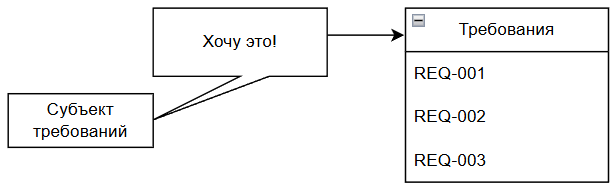
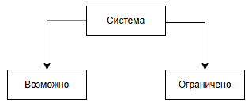
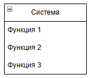
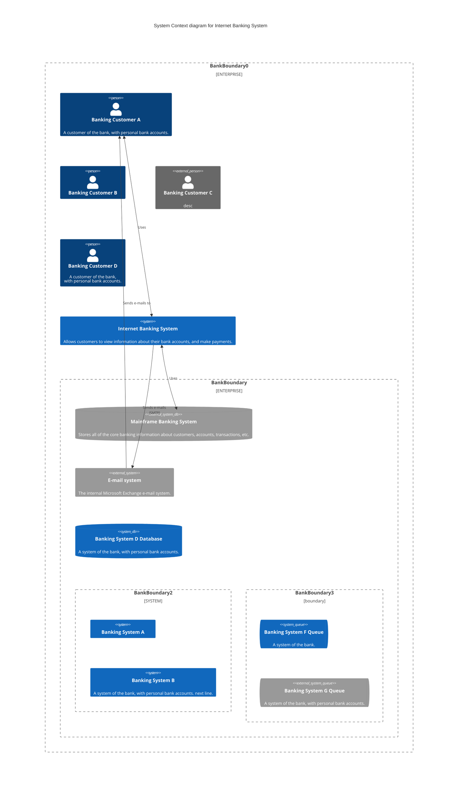

---
title: 6.07. Аналитика
---

# 6.07. Аналитика

# Раздел в разработке

## История аналитики

Аналитика как способ познания и принятия решений существовала задолго до появления компьютеров - собственно, в древности люди тоже анализировали данные. Пример - учёт урожая, распределение ресурсов, военные стратегии. Это всё аналитика, но современное понимание этой науки отличается от классического, особенно в контексте информационных технологий, и формировалось оно постепенно, под влиянием развития науки, экономики и техники. Аристотель имеет два сочинения - «Первая Аналитика» и «Вторая Аналитика», и это были просто рассуждения с логическим мышлением. Здесь важно отметить, что Аристотель называл формальную логику «аналитикой», а слово «логика» стали использовать позднее, после его смерти.

Поэтому да, аналитика существует ещё с древнейших времён.

В начале XX века термин «аналитик» ассоциировался с бухгалтерами, экономистами и статистиками - специалистами, которые обрабатывали данные для прогнозирования, выявления тенденций, оптимизации процессов и поддержки управленческих решений. Эти профессионалы анализировали финансовые отчёты, рыночные показатели и производственные циклы, но их работа была в основном ручной и не связывалась с автоматизированными системами (всё правильно, ведь систем не было!). В зависимости от области деятельности, аналитики работали в финансах, маркетинге, медицине, научных исследованиях и даже промышленности.

И представьте, как нужно было прогнозировать? Перед вами выгружают вагон с отчётами, которые писались вручную различными филиалами или подразделениями, и нужно было всё это изучить, структурировать, систематизировать, подготовить сводку, сделать выводы, какие-то прогнозы и в конце концов резюмировать это всё. Грязная работа, которая «выручает» начальников и руководителей, которым главное - понимать, куда всё идёт. Именно поэтому «бухгалтера» были приближенными в любом бизнесе, ведь они сочетали эти функции, порой и без специально выделенных для этого людей. Причем это только **финансовые показатели**, порой требовалось анализировать чужие отчеты, результаты деятельности конкурентов, чтобы понимать, у кого имеются полезные решения. Тем не менее, этим и занимается аналитик - сбор данных из различных источников, обработка этих данных от ошибок, дубликатов, пустых значений, формирование выводов и предложений.

Поэтому можно сказать, что сначала аналитики были именно финансовые и маркетинговые. Но мир, бизнес и экономика стремительно развивались - с появлением каждой новой технологии или изобретением устройств, отрасли менялись, и требовалось во всё это погружаться.

С приходом эпохи компьютеров в середине XX века ситуация уже изменилась, ведь в **1950-1960-х** годах первые ЭВМ начали внедряться в государственные и корпоративные структуры, и возникла острая потребность в людях, способных «переводить» бизнес-задачи на язык машин. Тогда и появился термин «**системный аналитик**» (system analyst). Его роль заключалась в том, чтобы понимать как бизнес-требования, так и технические возможности систем, выступая посредником между заказчиками и программистами.

Первые системные аналитики, разумеется, были инженерами или математиками, ведь вся вычислительная сфера была связана именно с ними. Это потом они переквалифицировались в IT окончательно. Они проектировали архитектуру систем, определяли потоки данных, разрабатывали спецификации - всё это требовало глубокого понимания как логики бизнеса, так и принципов работы программного обеспечения. Появление понятия «бизнес-логика» стало естественным следствием, ведь это та часть системы, которая отражает правила, процессы и политики организации, отличные от технической реализации.

К **1980-1990-м** годам, с ростом сложности программных продуктов и масштабов автоматизации, роль аналитика стала более специализированной. Разделение труда привело к появлению нового термина «**бизнес-аналитик**». В отличие от системного аналитика, фокусировавшегося на технических аспектах, бизнес-аналитик сосредоточился на изучении потребностей бизнеса, моделировании процессов, сборе и документировании требований. Он стал ключевой фигурой на стыке управления и технологий.

Изначально понятие «аналитик» в IT считалось производным от других профессий и не имело чётких границ. Только к началу 2000-х годов, с развитием методологий управления проектами (PMBOK, PRINCE2) и стандартов вроде BABOK (Business Analysis Body of Knowledge), профессия бизнес- и системного аналитика окончательно оформилась как самостоятельная дисциплина с собственными компетенциями, сертификациями и карьерными траекториями.

Так что профессия аналитика в IT имеет двоякое происхождение - аналитик сам по себе существовал с древности, системный аналитик был больше математиком, а бизнес-аналитик и вовсе новая профессия.

И если первые компьютеры были именно академическими инструментами, а техногиганты изначально заключали контракт с небольшими компаниями с всего несколькими разработчиками, процесс был совсем иным, как и подходы к разработке - всё было **хаотично**, так как они были первооткрывателями. Позднее, с ростом индустрии и увеличением количества компаний разработчиков, стало очевидно, что одним договором, устными встречами и простыми текстовыми описаниями требования описывать уже недостаточно. Нужны были какие-то унифицированные языки моделирования, которые бы позволяли визуализировать процессы, структуры и поведение систем. Именно здесь на сцену вышли стандартизированные нотации, ставшие инструментами профессионального аналитика.

Когда заказчик (инициатор) формирует идею, она, как правило, устная и размытая, но содержащая основную цель и бизнес-логику. Но когда дело доходит до документирования таких целей, в игру вступают юристы - а юридический язык крайне тяжелый, ведь он избегает «лишних слов», и действует исключительно с целью «засудить» и «защититься от суда», словом, прикрывает задницу. Но дайте юридический документ математику - он поседеет! Поэтому аналитику приходилось «расшифровывать» такие документы, рисовать для себя более наглядную модель и описывать документацию. Каждый рисовал, ведь одно дело общие требования, но когда тебе нужно формировать архитектуру решения, из документа легко вытащить лишь сущности, а связи между ними - куда сложнее. Поэтому рисовалась **схема связей между сущностями**, но каждый делал это по своему, без единого подхода.

В середине 1990-х годов был разработан **UML** (Unified Modelling Language), ставший результатом объединения нескольких подходов к объектно-ориентированному моделированию. Ключевые фигуры — Грейди Буч, Айвар Джекобсон и Джеймс Рамбо (образовали так называемую «Банду трио»). В 1997 году UML был официально принят OMG (Object Management Group) как международный стандарт. UML позволил аналитикам и разработчикам описывать архитектуру ПО с помощью диаграмм: вариантов использования, классов, последовательностей, состояний и других. Это резко снизило недопонимание между командами.

**BPMN** (Business Process Model and Notation) появился позже, в начале 2000-х. Конкретно, BPMN 1.0 изначально разрабатывался Business Process Management Initiative (BPMI), а в 2005 году был передан OMG, который официально стандартизировал его. BPMN стал «языком» для описания бизнес-процессов в наглядной, графической форме. Благодаря простоте восприятия и богатой семантике (шлюзы, события, потоки) он быстро стал стандартом в бизнес-аналитике, особенно в банках, логистике и государственных структурах - сейчас это стандарт BPMN 2.0, появившийся в 2011 году.

Стандартизация этих и иных нотаций (вроде ERD (Entity-Relationship Diagram) для моделирования данных, DFD (Data Flow Diagram) и IDEF) означала, что аналитик больше не просто «рисовал схемы для себя», а создавал общепонятные артефакты, которые могли использоваться на всех этапах жизненного цикла ПО: от анализа требований до тестирования и сопровождения.

То есть, без аналитики, раньше разработка ПО частенько начиналась с кода, программисты понимали задачу «на слух», и сразу приступали к реализации. А как мы помним, зачастую источником задачи был именно заказчик. Это приводило к множеству ошибок, переделок и «неправильным» продуктам. Далеко ходить не надо - фрилансеры с заказами, техническое задание которых ограничивалось фразой «сделай мне сайт», понимают, о чём я. Позднее аналитик стал ключевой фигурой на старте проекта, ведь именно он собирал, уточнял, моделировал, документировал и координировал, что делало процесс системным. Особенно важной аналитика стала в условиях высокой стоимости ошибок. Чем позже обнаруживается ошибка в требованиях, тем дороже её исправление. По оценкам IEEE и исследованиям Standish Group, исправление ошибки на этапе эксплуатации может быть в 100 раз дороже, чем на этапе анализа.

История IT полна примеров катастроф, вызванных игнорированием аналитики. Можно выделить два ярких случая.

Первый - проект **NHS Connecting for Health** (Великобритания, 2002–2013), одна из самых масштабных неудач в истории государственных IT-проектов. Целью ставили создать единую электронную медицинскую систему для всей Англии, проект стоил более 12 миллиардов фунтов стерлингов, но был закрыт с минимальными результатами. Причинами провала были такие проблемы, как отсутствие чёткого анализа потребностей врачей и больниц, непродуманная архитектура, пренебрежение бизнес-процессами здравоохранения, слабая роль аналитиков на начальных этапах. Вместо глубокого анализа внедрялись «коробочные решения», которые не работали в реальных условиях. Работавшие в государственных структурах поймут, о чём речь - «добровольно-принудительное внедрение» без учёта интересов.

Второй - крах системы учёта труда в компании **Hewlett-Packard** (2010). HP внедряла новую систему учёта рабочего времени для 65 000 сотрудников. Проект провалился: система не учитывала локальные особенности стран, правила начисления оплаты были ошибочны, что привело к неверным выплатам и судебным искам. Причины - недостаточный анализ требований в разных регионах, отсутствие моделирования бизнес-логики, недооценка роли бизнес-аналитиков при глобальной автоматизации.

Что забавно, проблема игнорирования или недооценки важности аналитики существует всегда - практически на каждом проекте заказчику нужно «быстрее», он продавливает именно свою точку зрения и собственное видение, которое порой бывает рискованным или необдуманным. Если он продавит, и решение окажется неудачным, он всё равно обвинит команду разработки, что это они всё криво сделали. Сегодня аналитики есть везде, а этап разработки часто может быть короче, чем этап аналитики, ведь это снижает неопределённость, минимизирует риски и повышает шансы на успех проекта.


## Основы анализа

Что такое анализ?

Как мы помним, слово анализ пришло из греческого языка - «analysis», в переводе «разложение», «разбор». Поэтому технически, это процесс разбора чего-либо на части, но в профессиональной сфере (особенно в управлении проектами IT) это целенаправленное исследование с целью понимания, улучшения и проектирования.

У этого понятия есть широкий смысл - метод познания, при котором объект (система, процесс, проблема) мысленно или практически расчленяется на составляющие, чтобы понять их взаимосвязи, выявить закономерности, обнаружить узкие места и сформулировать решения.

А в контексте информационных технологий анализ - это промежуточный мост между реальным миром и цифровым решением, который отвечает на вопросы «что нужно бизнесу?», «какие у него процессы, правила, идеи?», «какие проблемы мешают эффективной работе?», «как технологии могут это изменить?». Например, если бизнес хочет автоматизировать приём заказов, аналитик не просто запишет «надо сделать форму», а изучит текущий процесс (как принимаются заказч сейчас), выявит участников (менеджеры, клиенты, склад), определит правила (скидки, сроки, проверка наличия), найдёт исключения (возвраты, ошибки), спроектирует, как это будет работать в системе.

Аналитика же - это активное выявление, структурирование и трансформирование знаний. Она включает в себя сбор информации, моделирование, формализацию, проверку согласованности и прогнозирование последствий изменений.

Анализ часто путают с диагностикой или контролем, но его цель не только найти проблему, но и понять её корни, контекст и возможные пути решения. Без понимания нельзя создать эффективное решение. Мой брат мне приводил хороший пример в сфере строительства, когда строители строго выполняют по документации, и могут не понимать, почему в этом месте должен быть углон на столько-то градусов, а уровень выше на 3 сантиметра. Ошиблись на сантиметр - здание рухнет. И роль аналитики аналогичная - если ошибся аналитик, система либо не заработает, либо будет работать не так, как нужно.

В зависимости от фокуса выделяют:
	- *бизнес-анализ* - изучение целей, процессов и потребностей организации;
	- *системный анализ* - исследование возможностей и ограничений технических систем;
	- *функциональный анализ* - определение, что система должна делать;
	- *анализ требований* - формализация ожиданий от продукта;
	- *процессный анализ* - моделирование и оптимизация рабочих потоков.

**Исследование** - это целенаправленный процесс сбора, изучения и интерпретации информации для понимания предмета, выявления проблем и поиска решений. В аналитике исследование — это не просто «посмотреть», а систематическое изучение бизнес-контекста, процессов, данных и требований с использованием интервью, документации, наблюдения и аналитических техник.

Мы уже изучали «объекты», и «сущности». Они очень важны для аналитиков. Это любой элемент реального или цифрового мира, который можно выделить и описать. В бизнес-анализе это человек (клиент, сотрудник), документ (договор, заявка), система (CRM, ERP), событие (оформление заказа, оплата). В моделировании это сущность в ERD/UML, которая имеет атрибуты (свойства) и участвует во взаимодействиях.

А что такое взаимосвязь? Это логическая или функциональная связь между объектами, процессами или данными. Показывает, как элементы влияют друг на друга. К примеру, клиент делает заказ, заказ **содержит** товары. Без понимания взаимосвязей невозможно построить корректную модель системы.

**Закономерность** - это повторяющаяся, предсказуемая связь между явлениями или данными, которая позволяет обобщать, прогнозировать и принимать решения. К примеру, 80% отказов клиентов происходят при ожидании ответа более 3 минут - это закономерность, которая указывает на проблему в сервисе. Аналитик ищет закономерности в данных, процессах и поведении пользователей, чтобы выявить скрытые правила системы.

Узкое место - это элемент процесса или системы, который ограничивает общую производительность и становится причиной задержек, ошибок или перегрузки. К примеру, все заявки проходят через одного менеджера на согласовании - это и есть узкое место. Выявление узких мест — одна из ключевых задач аналитики при оптимизации процессов.

**Формулирование** - это процесс точного, однозначного и понятного выражения мысли, требования или правила. В аналитике важно не просто понять, что нужно бизнесу, но и сформулировать это так, чтобы разработчики, тестировщики и заказчики понимали одинаково.

**Решение** - это вариант действия, направленный на устранение проблемы или достижение цели. Это может быть предложенная стратегия по изменению процесса, автоматизации, реорганизации данных, внедрения новой логики. Аналитик не всегда принимает решение, но оценивает альтернативы и предлагает обоснованный вариант.

**Процесс** - это упорядоченная последовательность действий, направленных на достижение определённого результата. Процесс имеет участников (роли), шаги (задачи), входы и выходы, а также правила и условия переходов.

**Структурирование** - это приведение разрозненной, хаотичной информации в упорядоченный, логичный и понятный вид. Это может быть преобразование устных рассказов менеджера в таблицу требований, группировка функций по модулям системы, построение дерева процессов.

**Выявление** - это процесс обнаружения скрытых, неочевидных или несформулированных элементов: требований, проблем, правил, исключений. Часто заказчики сами не знают, что им нужно. Аналитик «выявляет» это через вопросы, анализ данных, сравнение с лучшими практиками.

**Трансформирование** - это преобразование информации из одной формы в другую для лучшего понимания или использования. Системная адаптация с сохранением сути.
```
Техники анализа и моделирования
SWOT, PESTLE, MOST — для понимания контекста (стр. 61-64).
Mind Mapping (ментальные карты) — для структурирования информации (стр. 66-67).
Дизайн процесса (BPMN) — для визуализации того, что будет автоматизировать IT-система (стр. 67-68).


Что такое аналитика
Аналитика. Системный анализ и требования (глубины анализа)
Аналитическое мышление

Системный анализ
Системное мышление (на лету понимать смысл и систематизировать);
Критическое мышление
Внимание к деталям и методичность

Принципы анализа

Кто такой аналитик в IT
Почему аналитика критична для успеха проекта? Разработчики что, не могут писать сами?
Виды аналитиков - бизнес-аналитик, системный аналитик и прочие
Что должен уметь и знать аналитик?
Что такое предметная область в проекте и почему разрабы в неё не погружаются а аналитики должны разбираться?
Документирование - что это?

Важно: в некотором контексте аналитика подразумевает уже готовый результат анализа со статистикой, дашбордами, таблицами, отчетами. К примеру, это может быть обезличенная аналитическая информация об оказании услуг, продажах товаров – в таком случае подразумевается, что процесс анализа фактов и данных производит система автоматически и выводит результаты в готовом формате.
Изучение тесно связано с анализом. Если говорить как раз о контексте анализа данных – это ближе к изучению определенных данных с какой-то целью, допустим прогнозирования или подготовки выводов. А если системный анализ или бизнес-анализ – то тут 
В процессе анализа выполняется выявление требований:
•	собирают исходные данные;
•	изучают исходные данные;
•	согласуют выявленные требования.
При выявлении есть определенные техники (как раз сбор исходных данных):
•	опрос заинтересованных лиц, интервью (обратная связь), групповое интервью (фокус-группа);
•	мозговой штурм – группа лиц собирается и генерируют идеи;
•	семинар, конференция, собрание для обсуждения проблем, решений – результатом будет как раз список выводов;
•	метод Дельфи (цикл анкетирования);
•	ролевая игра – похоже на мозговой штурм, но каждый участник играёт определённую роль;
•	раскадровка – разработка пошагового сценария в конкретной ситуации;
•	прототипирование – по сути, моделирование ситуации, интерфейса;
•	интроспекция – самостоятельное рассмотрение;
•	сбор и анализ документации;
•	извлечение данных (как раз работа с таблицами, статистикой, дашбордами и отчётами);
•	анализ функций существующей системы.

Стратегия анализа и оценка затрат на анализ (время силы деньги)
Как организовать процесс анализа
Сдача анализа
```

## Бизнес-аналитик

```

Бизнес-аналитик
Что такое бизнес анализ?
Что такое потребность заказчика
Что такое понимание рынка и процессов?
Основные задачи бизнес-аналитика
Роли бизнес-аналитика: Участник, Фасилитатор, Аналитик
Обязанности на разных фазах проекта: От инициации до закрытия
Ценность для IT-проекта: Снижение затрат (ошибки на ранних этапах дешевле), повышение эффективности, улучшение коммуникации


Что такое бизнес-требования?
Что такое бизнес-логика? Как её формулирует бизнес-аналитик?
Что такое бизнес-риски? Как их учитывать и анализировать?
Что такое сбор требований? Какие бывают виды сбора требований?
Что такое User Story и User Case?
Умение описывать системы с помощью User Story и Use Case.
Что такое приоритизация (MoSCoW, Kano, RICE).
Нужен ли бизнес-аналитику код? И нужно ли углубляться в технический стек?
Управление требованиями
Анализ конкурентных продуктов и предложений на рынке
потенциальный эффект от реализации задачи;
SWOT анализ это сильные и слабые стороны, возможности и угрозы
Модель и схема процесса это разные вещи.


```

### Основы бизнес-анализа

```
Фазы бизнес-анализа: Планирование, Выявление требований, Анализ, Оценка решения
Алгоритм анализа требований: "Как есть" -> Болевые точки -> Причины -> Решения -> Проверка
Моделирование требований: Диаграммы потоков данных (DFD), Диаграммы последовательности, Пользовательские истории, Сценарии использования
Качества требований (SMART): Конкретные, Измеримые, Достижимые, Актуальные, Ограниченные по времени
```

Бизнес-анализ фокусирует внимание на задачах организации, получая ответ на вопрос - а зачем вообще всё это нужно бизнесу?


Анализ требований включает в себя изучение представленных ожиданий, и перевод желаний в чёткие, измеримые и записанные требования. Бизнес хочет чего-то определённого. Здесь важно провести черту - бизнес-аналитик изучает потребность, возможно даже общаясь с пользователями, и формирует технически не точные бизнес-требования. А системный аналитик изучает бизнес-требования и формирует технически более точные требования. Но оба аналитика занимаются анализом требований, отличается лишь субъект - у бизнеса это, к примеру, пользователи, а у системного - бизнес.



То есть, анализ требований представляет собой формализацию ожиданий.

Порой разделения нет, и аналитик выполняет fullstack (фуллстек) функции - и бизнеса, и системного, из-за чего работа ведётся от самого начала до технической тонкости.

**Бизнес-аналитик** - это специалист, который переводит бизнес-цели в конкретные задачи для команды, выявляет потребности, анализирует процессы и помогает создавать решения, которые приносят ценность бизнесу. Именно он задаётся вопросами «Зачем?», «Что нужно?», «Как лучше?», изучает и делает понятным. 

Это профессионал, который исследует бизнес-проблемы и возможности, выявляет требования заинтересованных сторон, моделирует процессы и предлагает решения, направленные на повышение эффективности, снижение затрат или рост прибыли. Он работает на стыке бизнеса, технологий и управления изменениями, и ему придётся заниматься сбором, анализом, интерпретацией данных, подготовкой отчётов, выявлением проблем и возможностей для оптимизации, взаимодействовать с различными отделами и проводить исследования.

**Бизнес-цели** - это конкретные, измеримые, достижимые, релевантные и ограниченные по времени результаты, которые организация стремится достичь для реализации своей стратегии и миссии. 

Простыми словами - это то, чего организация хочет добиться. Заработать 10 миллионов, сократить издержки на 20%, выйти на новый рынок. Здесь важно понимать, что бизнесу плевать на тонкости, именно для этого он нанимает аналитиков. Вообще, вы же представляете, кто такой «бизнесмен»? Они живут по другим правилам, у них свои вопросы, и это руководство, которое даёт задачу в двух словах, а специалист принимает в работу и разбирается, беспокоя руководителя только если возникли проблемы.

Бизнес-аналитику может «прилететь» задача разобраться - как сократить время ожидания клиента перед получением результата оказания услуги, как ускорить процесс выдачи кредита. Порой может быть тонкая и конкретная задача - допустим, в имеющемся процессе выполняется запрос в другую систему, и нужно ускорить выполнение запроса.

Существует специальное мнемоническое правило (запоминалка, проще говоря), которое помогает формулировать чёткие, измеримые и выполнимые цели - SMART.

В **SMART** каждая буква - критерий, которому должна соответствовать цель:
	- **S** (Specific) - конкретная, означает, что цель ясная, без размытых формулировок;
	- **M** (Measurable) - измеримая, можно измерить прогресс и результат;
	- **A** (Achievable) - достижимая, реалистичная с учётом ресурсов. Иногда A трактуют как Agreed, то есть согласованная;
	- **R** (Relevant) - значимая, релевантная, соответствует стратегии и имеет смысл. Иногда R трактуют как Realistic - реалистичная;
	- **T** (Time-bound) - ограниченная по времени, имеющая чёткий срок.

Таким образом, бизнес-цели, соответствующие критериям SMART, должны быть конкретными, измеримыми, достижимыми, значимыми и ограниченными во времени. «Хочу увеличить продажи» не соответствует SMART, слишком расплывчато - как, когда, насколько? Вот аналитику и придётся заниматься изучением ситуации, задавая правильные вопросы и получать правильные ответы. Если цель всё ещё не соответствует SMART - уточняем снова и снова, пока не добьёмся соответствия.

Здесь мы приходим к логическому заключению, что именно SMART помогает отделить желания от задач. Поэтому лучше придерживаться этим принципам как основе планирования, контроля и отчётов.

Желание может быть следствием потребности.

**Потребность** - это то, без чего заказчик чувствует дискомфорт, неудобство или упущенную выгоду. Проблема, которую хочется решить, или возможность, которую хочется реализовать. Осознанное или неосознанное состояние недостатка чего-либо, побуждающее к действию с целью его устранения или удовлетворения.

Важно отличать **потребность** от **решения**. Если заказчик говорит «мне нужна кнопка «Экспорт в Excel» - это решение. Аналитик углубляется и ищет потребность решения - простым вопросом «Зачем?» - «Чтобы быстро делиться отчётами с бухгалтерией». Значит потребность в быстрой передаче данных в понятном формате.

Есть интересный **метод для выявления потребности 5 Why** - задавать пять раз подряд вопрос «Почему?» (или «Зачем?», на английском слово «Why» означает то же самое). Разумеется это не топорно, а грамотно должно быть, к примеру, «Что будет, если этого не сделать?», и смотреть на боль, потери, риски, мечты. Наблюдать за реальным поведением, а не только слушать/читать слова.

Чтобы разбираться, нужно понимание рынка и процессов. Это не просто «знать что-то», а уметь видеть контекст, в котором живёт бизнес, и механизмы, как он работает внутри. 

**Понимание рынка** — это знать, кто твои клиенты, конкуренты, тренды и правила игры, способность анализировать внешнюю среду (клиенты, конкуренты, регуляторы, технологии, тренды), чтобы выявлять возможности и угрозы для бизнеса. 

Чтобы развивать понимание рынка, нужно изучать клиентские сегменты (кто покупает, зачем, что их разражает?), следить за конкурентами (что они делают, что у них хорошо или плохо?), анализировать тренды (технологии, законы, поведение потребителей), читать отраслевые отчёты, интервью, отзывы, форумы.

**Понимание процессов** — это знать, как внутри компании что-то делается: кто что делает, зачем и как можно сделать лучше, способность декомпозировать, визуализировать и анализировать внутренние рабочие потоки компании, чтобы находить узкие места, дублирование, потери и точки роста.

Чтобы развивать понимание процессов, нужно рисовать AS-IS процессы, как есть сейчас, задавать вопросы «А зачем этот шаг?», «Кто это делает? Почему?», искать места, где теряется время/деньги/нервы, и конечно общаться с сотрудниками, которые знают реальность лучше всех.
Бизнес-цели порождают определённые процессы, работающие по определённым правилам. Совокупность таких правил представляет собой фактический мозг продукта или системы. Это бизнес-логика.

**Бизнес-логика** - это правила, которые определяют, как система должна вести себя в разных ситуациях, чтобы соответствовать целям бизнеса. Не «что нажать», а «что должно произойти, если нажать» и «когда можно нажимать, а когда нельзя». Всё это представляет собой совокупность правил, условий, алгоритмов и ограничений, которые отражают политику, процессы и требования бизнеса и определяют поведение системы при выполнении бизнес-функций.

Поэтому, если разработчик задаётся вопросом, а зачем это - то ему нужно идти за разъяснением именно к аналитику, который владеет пониманием бизнес логики.

Код - реализация логики. Интерфейс - то, как пользователь взаимодействует с логикой. А бизнес-логика уже отражает суть, что должно произойти, при каких условиях, в каком порядке, с какими ограничениями. Ньюанс лишь в том, что логику надо формулировать ещё до того, как разработчик начнёт писать код.

Бизнес-аналитик формулирует бизнес-логику в несколько этапов.

1. Собирает правила из разных источников - интервью с бизнесом, юристами, бухгалтерами, операторами, анализ текущих процессов (AS-IS), изучение документов (регламенты, договоры, политики, инструкции).
2. Структурирует и формализует в виде сценариев (use case, user stories), таблиц решений, диаграмм состояний, псевдокода или правил «ЕСЛИ…ТО».
3. Валидирует с заинтересованными сторонами - «Правильно ли я понял?», «А если так?», «А если иначе?».
4. Документирует и передаёт команде в виде требований (SRS, BRD, User Stories), в виде схем, матриц, прототипов с пояснениями, иногда в виде тест-кейсов для QA.

Логика часто живёт «в головах», и никто правила не записывал, потому что «всегда так делали». Аналитику придётся вытаскивать это наружу. Исключения - тоже логика, ведь не бывает «всегда», может быть «кроме», «если…», «при условии…». Придётся ловить эти ньюансы. Логика также может быть противоречивой, когда разные субъекты говорят отличающиеся друг от друга вещи, и это нужно согласовывать. К тому же, логика может меняться - новые законы, сезонные акции, изменение стратегии, нужно предусмотреть гибкость, например, настраиваемые правила.
Порой логика не имеет здравого смысла. То, что кажется очевидным нам, может быть неочевидно системе, поэтому нужно писать ВСЁ, даже «если корзина пуста - не показывать кнопку «Оплатить»». Часто на этом и прогорают аналитики.

Чтобы разобраться в логике, нужно также рисовать схемы, проверять вместе с реальными пользователями, формулировать однозначно, связывать с бизнес-целью. В итоге бизнес-логика должна представлять собой чётко сформулированные правила поведения системы, которые бизнес-аналитик извлек из реальных процессов, согласовал с заинтересованными сторонами и передаёт команде для реализации, чтобы продукт работал «как надо», а не «как получилось.

### Риски

Вместе с логикой существуют и опасности. Это бизнес-риски, всё, что может пойти не так и помешать бизнесу достичь цели. Например: клиенты не купят, закон изменится, система упадёт, сотрудники уйдут, бюджет сожгут. Нужно не просто предусмотреть, но и подготовиться к рискам.

**Риск** — это событие или условие, которое, если произойдёт, окажет негативное (или иногда позитивное) влияние на цели проекта или бизнеса. 

**Бизнес-риск** — это риск, связанный с неопределённостью в рыночной, операционной, финансовой, юридической или стратегической среде, способный повлиять на прибыль, репутацию, выполнение обязательств или устойчивость бизнеса.

Можно выделить основные виды бизнес-рисков:
	- Рыночный - падение спроса, появление конкурента, изменение трендов;
	- Операционный - сбой системы, ошибка сотрудника, задержка поставки;
	- Финансовый - рост курса валюты, нехватка бюджета, невыплата клиентом;
	- Юридический - изменение законов, штрафы, судебные иски и претензии;
	- Технологический - устаревание ПО, хакерская атака, несовместимость систем;
	- Репутационный - негатив в СМИ, плохие отзывы, утечка данных;
	- Стратегический - ошибка в выборе направления, неудачный запуск продукта.

Анализ рисков включает в себя ряд шагов:
1. **Идентификация рисков** - нужно спросить себя «Что может пойти не так?». Методы - мозговой штурм, интервью, анализ похожих проектов, SWOT, чек-листы.
2. **Оценка рисков** - нужно оценить по двум параметрам:
	- Вероятность - насколько вероятно, что случится?
	- Влияние - насколько сильно ударит по цели?

Часто для оценки используют **матрицу рисков**, которая отображает соотношение влияния и вероятности. Так и определяют степень (уровень) риска.


Визуально это просто - зеленый приемлемый, желтый средний, красный критичный.

3. **Приоритизация**, с фокусом на высоковероятных и высоковлияющих рисках (красная зона). Низковероятные получают низкий приоритет, и соответственно могут просто игнорироваться или мониториться без фокуса.
4. **Разработка мер реагирования**. На каждый риск используется свой подход. Можно выбрать одну из четырёх стратегий, либо комбинировать:
	- Избегать - убрать причину риска и не допускать возникновения;
	- Передать - переложить риск на другого (страхование, аутсорсинг);
	- Смягчить - уменьшить вероятность или влияние;
	- Принять - признать и подготовиться к последствиям.
5. **Мониторинг и контроль**. Нужно регулярно пересматривать список рисков, добавлять новые, закрывать устаревшие, и для этого ведут реестр рисков. В таком реестре обычно пишется риск, его вероятность, влияние, стратегия и ответственного.

При работе с рисками не нужно бояться говорить «а если», лучше услышать это на этапе проектирования, чем после провала. Нужно привязывать риск к целям, документировать, и говорить на языке бизнеса, используя их как аргумент. Именно риски позволят убедить несогласных с решением, отстоять время, бюджет или ресурсы.

## Системный аналитик

```
Системный аналитик.
Что такое системный анализ?
анализ и интерпретация бизнес-требований, их перевод в технические задания
Что такое техническое задание, спецификации и требования?
Что такое анализ функциональных и нефункциональных требований?
Что такое проектирование архитектурных решений для аналитика и почему это не делает архитектор? В чем различия?
Как аналитик взаимодействует с командой?
Отличие системного аналитика от бизнес аналитика
Хард скиллы для системного аналитика
постановки для разных ролей в команде
```

В отличие от бизнес-аналитика, для системного аналитика важно углубиться в технические тонкости, поэтому анализ тут бывает системный, функциональный и процессный.

Системный анализ фокусируется на том, что технически можно выполнить, а что нельзя, и какие имеются границы, ресурсы и архитектура. Заказчику всегда можно сказать «технически возможно всё», и добавить «но…», указав риски, цену, сложности и последствия. А чтобы их понимать, надо видеть возможности и ограничения:



Функциональный анализ фокусируется на том, что должна делать система. Важно определить чистый список действий - должна сохранять, отправлять, проверять, и так далее.



Процессный анализ фокусируется на потоках, шагах и оптимизации. Нужно определить, как выполняется работа сейчас (как она движется - так формируется поток), где узкие места и как сделать быстрее/дешевле. Да, «дешевле» важно для обоих - как бизнеса, так и системного, вопрос лишь в том, кто-то экономит и какие есть ресурсы, потому надо учитывать всё. Схематично любой процесс состоит из шагов:


Когда анализируем процессы, каждый шаг каждого процесса может представлять собой такой же процесс, и иметь свои шаги, свой результат. Чтобы выявить шаг, нужно понять, где начало, где конец - каково входящее состояние сущностей и каково исходящее:


Под изменением состояния можно подразумевать абсолютно что угодно - поле в базе данных, значение переменной, статус документа, баланс на счёте. Также к этому относится и действие - к примеру, при отправке уведомления на Email, на входящем состоянии у пользователя не было сообщение, а на исходящем - будет. Отсюда результат - наличие Email-сообщения. И всё в таком духе - под эту формулу можно подгонять что угодно.

## Исследование систем

```
Умение видеть проект целиком
Изучение системы - как анализировать, как знакомиться, на что обращать внимание
Изучение архитектуры системы и как найти корни и детали
Как понять систему
Формирование вариантов возможной технической реализации решения
Анализ систем-источников
реверс-инжиниринг процессов
UX-исследования и дизайн, макеты
Прототипирование интерфейсов модулей и способов интеграций
Как аналитик анализирует интеграции и API, протоколы и контейнеры данных для передачи, REST/SOAP, брокеры сообщений
Маппинг данных и миграции
Как аналитик анализирует базы данных SQL/NoSQL
Как аналитик анализирует высоконагруженные системы, с облачной и микросервисной архитектурой
С технической точки зрения какой должна быть проверка реализованной функциональности на соответствие требованиям.
Анализ и обработка больших объемов данных
Работа с метриками
Конфигурирование и настройка существующих систем под новые требования.
концепции observability и опыт работы с инструментами мониторинга
```

## Требования

```
Требования
Что такое требование?
Управление требованиями
Классификация требований (BABOK)
Бизнес-требования, Требования заинтересованных сторон, Требования к решению, Переходные требования

Типы требований в IT: Функциональные, Нефункциональные, Переходные (стр. 36). Критически важно для технических специалистов.

Процессы управления требованиями: Планирование, Разработка (сбор + анализ), Проверка, Управление изменениями


План управления требованиями (RMP): Что он включает

Матрица RACI: Кто Отвечает, Кто Консультирует, Кто Утверждает, Кто Информируется

Какие бывают этапы жизненного цикла требований?

Выявление потребностей.
Сбор требований, 
Методы сбора требований: Интервью, Анализ документов, Фокус-группы, Наблюдение, Прототипирование (ключевой для IT!), Анкетирование

Интервьюирование
Анкетирование
Наблюдение, реверс

Проектирование только после сбора требований!
Формулирование требований.
Декомпозиция задач – вертикальная и горизонтальная.
Оценка затрат ресурсов, времени и денег
Оценка задач – понятие, виды, алгоритм оценки, часы, человеко-дни, Story Points, майки (S, M, L) и прочие особенности
умение оценивать объем работ с достаточной достоверностью

Определение плюсов и минусов
На что обращать внимание

Валидация и согласование.
Верификация – Definition of Done, Definition of Ready, Критерии качества требований, Ревью требований;
Валидация – Согласование требований, Три Amigo, UAT, демонстрации функционала, тестирование функциональности.
Передача команде разработки.
Коммуникации с разработчиками для эффективной реализации задач
Поддержка в ходе разработки (ответы на вопросы, уточнения).
Консультирование участников разработки
Проверка соответствия (вместе с тестировщиками).
Виды требований
Как оформляют и структурируют требования?
Почему все не работают с едиными требованиями?
В чем сложность составления требований?
Функциональные требования – как их писать и что должно в них быть, алгоритм из шагов;
Нефункциональные требования – как их писать и что должно в них быть, алгоритм из шагов;
Системные требования
Интеграционные требования
SRS (спецификация требований к ПО)
```

**Сбор требований** — это процесс, когда аналитик вытаскивает на свет то, что заказчик хочет, нуждается и ожидает — даже если сам этого до конца не осознаёт. Обычно сбор требований возлагается именно на бизнес-аналитика, однако системному аналитику тоже придётся с этим работать. Это совокупность методов и техник, направленных на выявление, документирование, анализ и согласование потребностей и ожиданий заинтересованных сторон относительно будущей системы, продукта или процесса.

Требования нужно собирать, чтобы не делать лишнего (тратить время и деньги), чтобы не упустить важное (и не переделывать потом), чтобы все говорили на одном языке (бизнес, IT, QA, маркетинг и другие), и конечно чтобы потом измерить успех, сравнив результат с требованиями.

Имеется множество подходов к сбору требований, и выбор зависит от ситуации, проекта, команды, бюджета, сроков и зрелости бизнеса.
1. **Интервью** (Interviews) - это беседа аналитика с заинтересованными лицами (заказчиками, пользователями, экспертами) с целью выявления потребностей, проблем и ожиданий. Его нужно использовать на старте проекта, когда нужно глубоко погрузиться в предметную область, или когда участники не могут сформулировать требования сами. К примеру, аналитик встречается с менеджером по продажам и спрашивает «Как вы сейчас обрабатываете заказы? Что вызывает сложности? Что бы вы хотели автоматизировать?», но это в самом начале. Если же проект уже работает, и задача более узкая, могут быть более простые или наоборот, сложные интервью.
2. **Анкетирование / Опросы** (Questionnaires & Surveys) - это сбор информации от большой группы людей с помощью структурированных вопросов (онлайн или на бумаге). Использовать, когда нужно собрать мнения от многих пользователей или получить статистику, приоритеты,  наболевшее. К примеру, опрос клиентов о том, какой функцией в личном кабинете пользуются, какую хотели бы видеть.
3. **Мозговой штурм** (Brainstorming) - групповая сессия, где участники генерируют идеи без критики, чтобы найти нестандартные решения или выявить скрытые потребности. Использовать для поиска инноваций, когда нужно «взболтать» мышление команды, или на этапе генерации идей для нового продукта. К примеру, можно всей командой из 10 человек собраться и за 45 минут сгенерировать 50 идей, как улучшить текущую ситуацию.
4. **Наблюдение** (Observation / Job Shadowing) - аналитик наблюдает, как пользователи выполняют задачи в реальной обстановке, чтобы выявить неочевидные проблемы и реальные процессы (а не те, что «на бумаге»). Используется, когда пользователи не могут точно описать свою работу, или когда есть подозрение, что процессы «в теории» и «на практике» отличаются. Пример - аналитик целый день сидит рядом с оператором колл-центра и видит, что тот 10 раз копирует данные из одного окна в другое, а это можно автоматизировать, к примеру, автозаполнением.
5. **Анализ документов** (Document Analysis) - изучение существующих документов — регламентов, инструкций, отчётов, спецификаций, писем, чатов — для выявления скрытых требований и правил. На самом деле, это крупнейший вариант. Используется, когда есть наследие в виде старых систем или процессов, или для понимания юридических, финансовых, нормативных требований. Аналитик может читать договора, законы, копаться в архивах или запрашивать что-то ещё, и находить нужное для работы.
6. **Ролевые игры / Сценарии использования** (Use Cases / User Stories / Role Playing) - это моделирование ситуаций взаимодействия пользователя с системой для выявления шагов, условий, исключений и ожидаемых результатов. Используется для описания функциональных требований, в Agile Scrum проектах (через User Story) и чтобы «прожить» сценарий, найти в нём дыры и уязвимости.
7. **Прототипирование** (Prototyping) - создание упрощённой модели интерфейса или процесса (бумажной, цифровой, интерактивной), чтобы визуализировать требования и получить обратную связь ДО разработки. Использовать в тех случаях, когда сложно описать словами, для согласования с пользователями, и чтобы избежать дорогостоящих переделок. Самый простой пример - кликабельный макет формы заказа. 
8. **Фокус-группы** (Focus Groups) - групповое обсуждение с целевой аудиторией под руководством модератора для сбора мнений, реакций, идей. Используется для оценки восприятия нового продукта или функции, для сбора эмоциональной обратной связи. Результаты могут сказать о многом.
9. **Семинары требований** (Requirements Workshops) - организованная сессия с участием всех ключевых стейкхолдеров для совместного определения, приоритизации и согласования требований. Использовать, когда нужно быстро согласовать много сторон, для сложных или конфликтных проектов.

## Документация

### Общее о документах

```
Важность грамотности
Ясное и четкое изложение сложных бизнес-концепций
Разработка тех. документации - получается, аналитик это разработчик документации?
Документы для бизнес-аналитика
Документы для системного аналитика
Использование шаблонов

```

### Виды документации

```
Конструкторская документация
Программная документация
Эксплуатационная документация
Паспорт на изделие (оборудование)
Технические условия (ТУ)
Спецификация - Состав программы и документации на нее.
Ведомость держателей подлинников - Перечень предприятий, на которых хранят подлинники программных документов.
Текст программы - Запись программы с необходимыми комментариями.
Описание программы - Сведения о логической структуре и функционировании программы.
Описание применения - Сведения о назначении программы, области применения, применяемых методах, классе решаемых задач, ограничениях для применения, минимальной конфигурации технических средств
Общее системное описание
Программа и методика испытаний - Требования, подлежащие проверке при испытании программы, а также порядок и методы их контроля.
Пояснительная записка - Схема алгоритма, общее описание алгоритма и (или) функционирования программы, а также обоснование принятых технических и технико-экономических решений
Эксплуатационные документы - Сведения для обеспечения функционирования и эксплуатации программы.
Ведомость документации по эксплуатации
Концепции

```

### Confluence

```
Confluence для аналитика
```


### Руководства и инструкции

```
Руководство по эксплуатации
Руководство администратора
Руководство системного администратора
Руководство программиста
Руководство системного программиста
Руководство оператора
Руководство по техническому обслуживанию

```

### Технические задания

```
Техническое задание (ТЗ, техзадание) – основной документ, содержащий требования заказчика к системе, в соответствии с которыми осуществляется создание и разработка конечного продукта. Назначение и область применения программы, технические, технико-экономические и специальные требования, предъявляемые к программе, необходимые стадии и сроки разработки, виды испытаний
Должно быть подписано обеими сторонами.
Если меняется — нужен акт о внесении изменений.

Виды технических заданий

Техническое задание на программу и программное обеспечение разрабатывается в соответствии с требованиями ГОСТ 19.201-78. Основанием для разработки ТЗ чаще всего является договор.
Состав разделов техзадания на программу указан всё в том же ГОСТ 19.201–78 (п.1.4).

введение;
основания для разработки;
назначение разработки;
требования к программе или программному изделию;
требования к программной документации;
технико-экономические показатели;
стадии и этапы разработки;
порядок контроля и разработки;
в техническое задание допускается включать приложения.


Техническое задание на автоматизированную систему (АСУ) - основной документ, предъявляющий требования к создаваемой автоматизированной системе и устанавливающий порядок, в соответствии с которым будет проводиться разработка АСУ ТП и ее прием при вводе в эксплуатацию.
ТЗ может разрабатываться как на всю систему, так и на составные части:
 составные части АС (по ГОСТ 34.602);
 технические средства (компоненты) входящие в состав АС (по ГОСТ ЕСКД);
 программные средства (компоненты) входящие в состав АС (по ГОСТ ЕСПД).
ТЗ на АСУ может содержать следующие разделы:

1) общие сведения;
2) цели и назначение создания автоматизированной системы;
3) характеристика объектов автоматизации;
4) требования к автоматизированной системе;
5) состав и содержание работ по созданию автоматизированной системы;
6) порядок разработки автоматизированной системы;
7) порядок контроля и приемки автоматизированной системы;
8) требования к составу и содержанию работ по подготовке объекта автоматизации к вводу автоматизированной системы в действие;
9) требования к документированию;
10) источники разработки.

ТЗ на сайт является, своего рода, инструкцией по разработке, которая утверждается и согласуется Заказчиком и Исполнителем. Как правило, техническое задание содержит достаточно большой объём информации, тем самым, минимизируя риски, которые могут возникнуть в процессе выполнения работ по его созданию.
В отличие от ТЗ на АСУ или на программу, нет ГОСТов предъявляющих требования к структуре и содержанию технического задания на изготовление сайтов. Однако, исходя из лучших практик, требования ГОСТов (34.602 и 19.201) очень часто учитывают при оформлении ТЗ. В частности требования ГОСТ 34.602 учитывают при создании ТЗ на портал, интернет-магазин, а ГОСТ 19.201 при разработке ТЗ на сайт-визитку.

```

### ГОСТы


Во многих странах, в том числе Российской Федерации, имеются государственные стандарты, которые упорядочивают хаос в документах. Особенно важны для аналитика ГОСТы серий 19 и 34.

ГОСТ — это Государственный стандарт. Он устанавливает правила, требования и рекомендации по оформлению, содержанию и структуре документов, процессов и продуктов. В IT ГОСТы помогают установить единообразие, закрепить юридическую силу, и поддерживают контроль качества.

Хороший источник ГОСТ - здесь: http://www.rugost.com/

Давайте разберём самые важные:
	- ГОСТы серии 19 — Единая система программной документации (ЕСПД). Это основа. Здесь — как писать ТЗ, спецификации, инструкции.
	- ГОСТы серии 34 — Стандарты информационной технологии, включая создание автоматизированных систем (АСУ). Это про жизненный цикл, стадии, документы на АС.
	- ГОСТы серии 2 — Единая система конструкторской документации (ЕСКД). Хотя это «для инженеров», в IT они иногда применяются, особенно в смежных системах (например, ПО для станков).
	- ГОСТы серии 15 — Система разработки и постановки продукции на производство. Важно для понимания процессов в государственных и промышленных проектах.

Почему нужно соблюдать требования ГОСТ? Есть несколько ньюансов. Вам можно составлять свои документы, если вы считаете, что ГОСТ недостаточно раскрывает суть. Но не юридически значимые. К примеру, можно разрабатывать статейки на Confluence или Wiki, готовить свои инструкции вольных форматов, но они будут считаться неофициальной документацией с целью помочь пользователю или сотруднику иной роли разобраться в системе или задаче. Но когда речь идёт об официальных документах, здесь уже играет роль юридическая сила документа.

Юридическая сила - это свойство документа или правового акта устанавливать правовые последствия, быть обязательным к исполнению или порождать правовые отношения. То есть, с инструкцией пользователя, написаной без соответствия ГОСТ и не утверждённой, не пойдешь в суд. 

Точнее, в суде то примут, но юридической силы она иметь не будет. Поэтому государство и занимает стандартизацией документации.

ГОСТ 19: Единая система программной документации (ЕСПД) регулирует всё, что связано с программным обеспечением: от ТЗ до инструкций пользователю.

ГОСТ 19.001-77 — Общие положения, что такое программная документация, кто её создаёт, какие виды документов существуют. Это своего рода введение в курс дела.

ГОСТ 19.101-77 — Виды программ и программных документов, содержит классификацию - программы, документы, исполнительные модули и прочее.

ГОСТ 19.102-77 — Стадии разработки ПО, жизненный цикл ПО - разработка, испытания, внедрение и т.д.

ГОСТ 19.201-78 — Техническое задание (ТЗ), как оформлять ТЗ - структура, обязательные разделы (цель, требования, условия, сроки и т.д.).

ГОСТ 19.202-78 — Спецификация - детализация требований, о том, как именно ПО будет реализовано - модули, интерфейсы, данные.

ГОСТ 19.301-79 — Программа и методика испытаний. Как тестировать ПО, какие тесты, в каком порядке, какие критерии приёмки.

ГОСТ 19.404-79 — Пояснительная записка. Это обоснование решений, описание системы, архитектура, логика. Часто используется как обзор проекта для заказчика.

ГОСТ 19.501–508 — Руководства (для пользователей, операторов, программистов), о том, как пользоваться системой, как её обслуживать.

ГОСТ 19.601-78 — Учёт и хранение документов, как нумеровать, хранить, вносить изменения. Важно для управления версиями. Особенно в больших проектах, где документы меняются часто.

ГОСТ 34: Стандарты информационной технологии и АСУ. Это уже более масштабные системы — автоматизированные системы управления (АСУ), государственные проекты, корпоративные ERP и т.д. Здесь акцент на жизненный цикл, стадии, технико-экономическое обоснование.

ГОСТ 34.201-89 — Виды и комплектность документов при создании АС. Какие документы нужны на каждой стадии создания АС: от обоснования до ввода в эксплуатацию.

ГОСТ 34.601-90 — Стадии создания автоматизированной системы. Чётко делит на стадии:
1.	Обоснование создания АС
2.	Техническое задание
3.	Эскизный проект
4.	Технический проект
5.	Рабочая документация
6.	Ввод в эксплуатацию

Это основа управления проектом. На каждой стадии — свои документы, свои решения, свои подписи. Аналитик часто участвует в 1–4 стадиях.

ГОСТ 34.602-89 — Техническое задание на создание АС. Как писать ТЗ для целой системы, а не просто ПО. Учитывает организационные, технические, экономические аспекты.

ГОСТ 34.603-92 — Виды испытаний автоматизированных систем. Приёмо-сдаточные, комплексные, квалификационные испытания.

Также нужно выделить ещё два документа.

ГОСТ Р ИСО/МЭК 15271-02 — Процессы жизненного цикла ПО, взгляд на жизненный цикл: разработка, эксплуатация, сопровождение.

РД 50-34.698-90 — Требования к содержанию документов. Не ГОСТ, а руководящий документ, но очень важный. Детализирует, что именно должно быть в каждом документе по ГОСТ 34.

Если не знать эти документы, то не получится работать в государственном секторе, оборонной, энергетической, жилищно-коммунальной сфере - там ГОСТы обязательны. Плюс, крупные проекты на серьёзные суммы требуют формальную отчётность, с этим очень строго, поэтому к документации нужно подходить с особым уважением.

### ПМИ, ППМИ

```
ПМИ, ППМИ (программа и методика испытаний)
```

### Практика

```
Договорные отношения с заказчиком
Тест-кейсы
Протоколы (тестирования, интеграции, приемки)
Разработка технических заданий, функциональных спецификаций и другой проектной документации.
Постановка задач разработчикам на разработку и доработку функциональности информационных систем с использованием JIRA и других систем.
Умение проектировать и описывать интеграции между информационными системами с использованием REST API и документирование всего этого
Инструменты изложения и фиксации требований/документации
Ревью требований и прочих документов

```

## Артефакты

```
Что такое артефакт и откуда пошло такое название?
Почему артефакты важны?
Виды артефактов
Аналитические проектные артефакты:  виды, назначения и структура
Технические проектные артефакты:  виды, назначения и структура

use case, user story, job story

```

**Артефакт** — это любой документ, схема, модель или запись, которая фиксирует знания, решения или требования в процессе разработки продукта/системы.

**User Story** (пользовательская история) — это краткое, простое описание функции системы с точки зрения конечного пользователя, написанное в неформальном, разговорном стиле. Формат у неё, как правило, единый:
```
Как [роль], я хочу [действие], чтобы [цель / выгода].
```
Как покупатель, я хочу добавить товар в корзину, чтобы собрать заказ перед оплатой. Как администратор, я хочу видеть список заблокированных пользователей, чтобы управлять безопасностью.

User Story позволяет не забывать о пользователе, быстро передавать суть команде, приоритезировать по ценности и разбивать большие задачи на маленькие.

К User Story добавляются критерии приёмки, условия, при которых задача считается выполненной. К примеру:
	- Товар появляется в корзине.
	- Сумма корзины обновляется.
	- Иконка корзины показывает +1.
	- Можно добавить тот же товар повторно → количество увеличивается.

**Use Case** (вариант использования) — это структурированное описание последовательности действий, которые система и пользователь совершают вместе для достижения конкретной цели. Часто используется в традиционных (waterfall) и сложных системах.

Если сделать упрощённый шаблон, то формат у него был бы такой:
```
Название: [Название сценария]
Актор: [Кто инициирует?]
Цель: [Зачем это нужно?]
Основной сценарий (основной поток):
  1. Пользователь нажимает “Добавить в корзину”.
  2. Система проверяет наличие товара.
  3. Система добавляет товар в корзину.
  4. Система обновляет сумму и отображает уведомление.
```
Альтернативные потоки:
	- Если товара нет → показать сообщение “Нет в наличии”.
Исключения:
	- Если сессия истекла → перенаправить на логин.
Постусловия:
	- Корзина содержит товар, сумма обновлена.

Use Case нужны, чтобы детально описать логику взаимодействия, увидеть все ветки и исключения, передать разработчикам и тестировщикам полную картину, построить диаграммы.

## Моделирование

```
+
3 уровня моделирования BPMN-схем
Описательный (согласовательный) уровень
Аналитический уровень
Исполняемый уровень

Элементы нотации BPMN 2.0
Действия в BPMN 2.0
Развилки в BPMN
Зоны ответственности в BPMN 2.0
Элементы BPMN
Хороший стиль моделирования BPMN
События в BPMN 2.0
Соединяющие элементы в BPMN 2.0
Шлюзы в BPMN 2.0

IDEF0

EPC

UML


Моделирование
Моделирование – наглядное представление состояния сущности.
При моделировании используются методологии, которые представляют собой наборы принципов, нотаций и подходов

Что такое модель?
Что такое моделирование?
Что такое сущность? А что такое связь между сущностями?
Моделирование сущностей и связей – как выполнять, алгоритм;

Что такое диаграмма, схема, алгоритм?
Как это всё применимо для аналитиков?
Моделирование и проектирование процессов и архитектруры систем средствами диаграмм

Виды диаграмм (классов, компонентов, развертывания, объектов, пакетов, прецедентов, активностей, последовательности, коммуникации, состояний, интеграций и прочих процессов)
ERD или Class Diagram
Что такое нотация?
Нотация – система условных знаков и правил их использования, которая подготовлена для единообразия моделей. В нотацию включаются элементы (алфавит нотации) и синтаксис (правила использования). При едином подходе проще создавать модели систем, процессов и данных.

Нотации построения бизнес-процессов

Что такое BPMN?
Что такое UML?

Разработка технологических схем, моделей бизнес-процессов и потоков данных
Статусные модели

```

Активности, протекающие в составе описываемого процесса, объединяются в поток (flow) – определённую последовательность действий и событий. Но если все основные нотации собрать по элементам, то это будут активности (действия), события (инициирующие триггеры) и шлюзы (разветвители, развилки), пулы и дорожки.

**Событие** всегда какой-то элемент, который инициирует действие. Допустим, получение команды, поступление заявки, запуск процесса.

**Действие** – активный этап, на котором нужно что-то сделать. Это может быть задача по регистрации, к примеру.

**Шлюз**, или gateway – это разветвитель, элемент, которые позволяет разбить один поток на несколько. В основном их три:
	- **И** (параллельный шлюз) – одновременное выполнение;
	- **ИЛИ**, **И/ИЛИ** (параллельный, неисключающий, инклюзивный шлюз) – выполнение одного или нескольких элементов, если они соответствуют условию;
	- **Исключающее ИЛИ** – (исключающий, эксклюзивный шлюз) выполнение только одного элемента, а если соответствуют оба – выполняется первый (по умолчанию).

**Дорожка** – что-то вроде зоны ответственности, это некая область, где всё находящиеся элементы будут относиться к определенному исполнителю, словно в столбцах таблицы:

| Заявитель | Исполнитель | Подписант |
|----------|-------------|-----------|
| Всё, что в этой области, будет относиться к компетенции заявителя. | Всё, что в этой области, будет относиться к компетенции ответственного исполнителя. | Всё, что в этой области, будет относиться к компетенции подписывающего лица. |

**Пул** – совокупность дорожек, допустим, если исполнитель и подписант в одном отделе:

|           | Внешние пользователи | Внутренние пользователи |
|-----------|----------------------|-------------------------|
| Заявитель | Всё, что в этой области, будет относиться к компетенции заявителя. | Всё, что в этой области, будет относиться к компетенции заявителя. |
| Исполнитель | Всё, что в этой области, будет относиться к компетенции ответственного исполнителя. | Всё, что в этой области, будет относиться к компетенции ответственного исполнителя. |
| Подписант | Всё, что в этой области, будет относиться к компетенции подписывающего лица. | Всё, что в этой области, будет относиться к компетенции подписывающего лица. |

Таким образом, когда нужно описать процесс, и одних слов недостаточно, используют нотации для наглядности, стандартизированные языки визуального моделирования. Основные элементы нотации:
	- Символы (квадраты, стрелки, ромбы, круги);
	- Правила их соединения (как рисовать связи);
	- Семантику (значение элементов).

Самые распространённые, из-за своей эффективности и простоты – модели в виде блок-схем (flowchart), где логика организована через лёгкое графическое представление, доходчиво показывающее даже человеку, не знакомому с нотациями и принципами. Даже если вы сейчас видите эти термины впервые, вы всё равно легко поймёте, что изображено здесь:


Выше приведена простейшая схемка BPMN. BPMN наследует алфавит и синтаксис из Flowchart, поэтому мы изучим её в первую очередь.

**BPMN** (Business Process Model and Notation) – для описания бизнес-процессов. Отличается тем, что поддерживает исполняемые процессы, допустим полноценные условия в стрелках. На схеме выше указано разветвление на «Да» и «Нет», проверка может выполнять какое-то действие, допустим вычисление по формуле, или сравнение результатов в предыдущем шаге, и разделять поток по соответствию условиям.

Пример – если на этапе заказа товар в наличии – проверка покажет «Да», и поток пойдёт к регистрации, а если же товара в наличии нет – то и проверка выдаст «Нет», после чего поток будет – «Отказ».

Ключевые элементы BPMN:
	- действия (прямоугольники);
	- шлюзы (ромбы – ветвления «если);
	- события (круги – старт, таймер, ошибка);
	- пуллы и дорожки (кто за что отвечает).

**UML** (Unified Modelling Language) применяется в разработке ПО, проектирования архитектур систем. Там много типов диаграм, и акцент выполняется на объектах (сущностях), их состояниях и взаимодействиях.

Основные диаграммы:
	- классов (структура данных);
	- последовательностей (взаимодействие объектов во времени);
	- состояний (жизненный цикл объекта);
	- Use Case (сценарии использования).

Типов UML-диаграмм, на самом деле, очень много, есть структурные (диаграммы классов, объектов, компонентов, составной структуры, профилей) и поведенческие (деятельность, состояния, взаимодействия, коммуникации, синхронизации, последовательности). Допустим, можно описать схему компонентов, включающих файлы, библиотеки, модули, пакеты и прочее, отобразив все зависимости и связи. UML – объектно-ориентированная нотация, предназначенная не для процессов, а больше для построения связей объектов. Если в BPMN мы описали процесс обработки заказа, то в UML мы бы описали компоненты системы обработки заказа.

**IDEF0** (Integrated DEFinition) – для анализа сложных систем (например, производство), из семейства IDEF. Предназначена для функционального моделирования, в иерархичном порядке, и использует жесткую привязку к указанию:
	- входов (допустим, событие или пакет документов);
	- управления (правила, ограничения, стандарты);
	- механизмов, ресурсов (сущности – станки, рабочие);
	- выходов (результат, допустим готовая продукция).

Так можно изобразить, к примеру, функцию по производству в промышленности, государственных, военных структурах. Это очень простой способ описания, но он позволит лишь в общих чертах рассказать о смыслах, без подробностей.

**DFD** (Data Flow Diagram) – моделирование потоков данных, где акцент не на действиях, а на данных, описывая четыре элемента:
	- процессы (круги/прямоугольники, события внутри системы);
	- хранилища (две параллельные линии, контейнер для данных);
	- потоки данных (стрелки, отображение направления);
	- внешние сущности (квадраты, допустим заказчик).

С помощью DFD можно описать обмены данными, логику преобразования, с указанием, какие данные получают, передают, какие хранилища используются.

**EPC** (Event-driver Process Chain) – для описания процессов, управляемых событиями (event). Очень похожа на BPMN, но, к примеру, для обозначения исключающего «ИЛИ» («Проверка» с нашей схемы выше), вместо ромбика с «X», используется кружок с «XOR». Отображаются связи событий и функций. Но есть правило – шлюзы OR или XOR не могут следовать за событиями, только за функциями, ибо при событиях принятия решений нет.

## Прототипирование

Одна из ключевых задач аналитика — не просто собрать требования, но и наглядно представить, как будет выглядеть будущая система. Именно здесь на помощь приходит прототипирование.

**Прототип** — это упрощённая модель интерфейса, которая отражает структуру, навигацию и основные функции продукта. Он помогает команде (разработчикам, дизайнерам, заказчикам) понять, как будет работать приложение или сайт, ещё до начала программирования.

**Макет** — более детализированное изображение экрана, уже с учётом цветов, шрифтов, иконок и других визуальных элементов. Макет ближе к финальному дизайну, чем прототип.

Прототипировать можно даже в Paint: нарисовать кнопки, поля ввода, меню. Но такой подход быстро становится неудобным — нет масштабирования, сложно редактировать, невозможно совместно работать. Поэтому сегодня используются специализированные инструменты для проектирования интерфейсов. Один из самых популярных — Figma.

**Figma** — это облачный дизайн-инструмент, позволяющий создавать прототипы, макеты интерфейсов и взаимодействовать с командой в режиме реального времени. Его ключевые преимущества - работа прямо в браузере, без установки ПО, поддержка совместной работы (несколько человек могут редактировать один файл одновременно), мощные функции для прототипирования, анимации переходов, создания компонентов и стилей и конечно же бесплатность для базового использования (с ограничениями).

Figma используется как аналитиками, так и UX/UI-дизайнерами, разработчиками и продакт-менеджерами. Это универсальный «язык» между командами.

Чтобы начать работать с Figma, нужно перейти на figma.com, зарегистрироваться и создать New file (это рабочий файл, так называются проекты). Такие проекты организованы в личной панели управления - Dashboard.

	- File (файл) — это отдельный документ, в котором может быть множество страниц, фреймов, компонентов. Каждый файл можно делиться с другими.
	- Page (страница) используется для разделения контента. Например, Page 1 «Главная страница», Page 2 «Личный кабинет», Page 3 «Прототипы навигации».
	- Frame (фрейм) - это контейнер, в котором создаётся макет экрана. По сути, это холст определённого размера: например, 1920x1080 пикселей (для десктопа) или 375x812 (для iPhone). Это аналог «экрана» в приложении, внутри него размещаются все элементы: текст, кнопки, картинки.

В Figma можно добавлять и настраивать различные объекты - текст (надписи), прямоугольники и фигуры, изображения. Можно создать компоненты (повторяющиеся элементы, например, кнопки), и стили (сохранённые параметры с цветами, шрифтами и тенями).

Чтобы интерфейс выглядел аккуратно, важно правильно выстроить элементы. Для этого есть такие инструменты как Auto Layout (система выравнивания) и Grid (сетка).

Но главным преимуществом следует выделить совместную работу в реальном времени. Допустим, аналитик может работать над прототипом главной страницы, а дизайнер может редактировать кнопки. И при этом работу видит заказчик, может зайти и оставить комментарии. Это очень удобно для обсуждения дизайна, экономит время и ресурсы.

Для режима совместного редактирования существуют ограничения - Can edit, Can comment, Can view. Чтобы заказчик не портил макет, можно дать ему лишь право на комментарии.

Но давайте выполним практическое задание:
1. Создайте новый файл в Figma.
2. Добавьте новую страницу, назовите её «Главная».
3. Создайте фрейм размером 1440x1024 (стандартный десктоп).
4. Добавьте элементы на свой вкус - попробуйте создать прототип сайта-визитки для вашей компании.
5. Поделитесь файлом с другом или коллегой, пусть оставят комментарий на кнопке.
6. Экспортируйте макет в формате PNG.

Запомните - именно аналитик часто первым переводит идею в визуальную форму, объясняет требования через макеты и проверяет, соответствует ли интерфейс бизнес-логике. Да и обсуждает UX с командой, поэтому воспринимайте это как средство коммуникации, а не как детальную дизайн-работу.


## Инструменты аналитика

```
Инструменты аналитика
Системы моделирования бизнес-процессов, Bizagi, Camunda, ELMA, Miro, Stormbpmn, Draw.io, Microsoft Visio, Business Studio, Studio Creatio, bpmi.io, ARIS
Mermaid
Figma
BPMN-моделирование
ArchiMate, 
C4.
BI-системы, для визуализации данных, Microsoft Power BI, Tableau, Qlik Sense, Yandex Datalense
Презентации - PowerPoint, Google Slides
```




## Взаимодействие

```
Коммуникация
Коммуникабельность
Умение требовать
Умение переключаться
Рефлексия
Деловая коммуникация
Электронная почта в анализе
Навыки деловой переписки
согласование
первичный осмотр задач от заказчиков
скрытые потребности заказчиков
Конкурентный анализ, тестирование гипотез
Проработка бизнес-логики с заказчиком и/или менеджером продукта
Сложности общения между заказчиком и командой разработки
Обсуждение с заказчиком бизнес-требований
Планирование сроков и решение споров
MVP
Демонстрация и презентации
Ввод в эксплуатацию, виды эксплуатации (опытная, промышленная)
Приёмка в эксплуатацию
```

