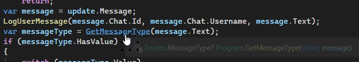

---
title: 6.09. Культура кода
---

# 6.09. Культура кода


Культура кода играет ключевую роль в обеспечении читаемости, поддерживаемости и долгосрочной эффективности проектов. Одним из основополагающих аспектов этой культуры является соблюдение стандартов именования переменных, методов, классов и других элементов программного кода. Согласованные правила именования позволяют упростить взаимодействие между участниками команды, снизить когнитивную нагрузку при чтении кода и минимизировать вероятность ошибок.

Да, знать синтаксис недостаточно - важно разбираться и в стилях!


## Соглашения об именовании

★ **Соглашения об именовании** — это правила, которые определяют. как называть переменные, методы, классы, поля и другие элементы кода. Эти правила помогают сделать код более читаемым, последовательным и удобным для поддержки. Разные языки программирования могут использовать разные соглашения, но есть несколько общепринятых подходов.

**Основные стили именования**.

**CamelCase** (верблюжий стиль) - первое слово начинается с маленькой буквы, а каждое последующее слово пишется с заглавной буквы. Применяется для:
	- Имён переменных;
	- Имён параметров методов;
	- Имён локальных переменных.

Пример:

```csharp
int age;
string firstName;
double totalAmount;
```

**PascalCase** (пословный стиль) - каждое слово начинается с заглавной буквы. Применяется для:
	- Имён классов;
	- Имён методов;
	- Имён свойств.

Пример:

```java
class UserAccount { }
void CalculateTotal() { }
string FullName { get; set; }
```

**snake_case** (змеиный стиль) - все слова пишутся строчными буквами и разделяются символом подчёркивания (_). Применяется в языках, таких как Python, для имён переменных и функций. Пример:

```Python
user_age = 25
full_name = "John Doe"
def calculate_total():
    pass
```

**UPPER_SNAKE_CASE** (верхний змеиный стиль) - все слова пишутся заглавными буквами и разделяются символом подчёркивания (_). Применяется для констант. Пример:

```JavaScript
const int MAX_AGE = 100;
const string DEFAULT_NAME = "Unknown";

```

**kebab-case** (с дефисами) - все слова пишутся строчными буквами и разделяются дефисом (-). Применяется в основном для имён файлов, URL или CSS-классов. Пример:

```json
.main-header {
    color: red;
}

```

## Соглашения об именованиях в разных языках.

### C#

Классы: PascalCase.
```csharp
class UserAccount { }
```

Методы: PascalCase.
```csharp
void CalculateTotal() { }
```

Переменные и параметры: camelCase.
```csharp
int age;
string firstName;

```

Приватные поля: `_` `+` camelCase.

```csharp
private string _lastName;
```

Константы: PascalCase или UPPER_SNAKE_CASE

```csharp
const int MaxAge = 100;
const string DEFAULT_NAME = "Unknown";
```


### Java

Классы: PascalCase.
```java
class UserAccount { }
```

Методы: camelCase.
```java
void calculateTotal() { }
```

Переменные и параметры: camelCase.
```java
int age;
String firstName;

```

Приватные поля: camelCase (часто без `_`, но можно использовать this. для ясности).
```java
private String lastName;
```

Константы: UPPER_SNAKE_CASE
```java
final int MAX_AGE = 100;
```

### Python

Классы: PascalCase.
```Python
class UserAccount:
    pass

```

Методы и переменные: snake_case.
```Python
def calculate_total():
    pass

user_age = 25

```

Приватные поля: `_` `+` snake_case.

```Python
class User:
    def __init__(self):
        self._private_field = "secret"

```

Константы: UPPER_SNAKE_CASE

```Python
MAX_AGE = 100
```

### JavaScript

Классы: PascalCase.
```Python
class UserAccount {}
```

Методы и переменные: camelCase.
```Python
let userAge = 25;
function calculateTotal() {}

```

Приватные поля: # (в современном JavaScript) или `_` `+` camelCase.
```Python
class User {
    #privateField = "secret"; // Современный синтаксис
    _anotherPrivateField = "also secret"; // Традиционный подход
}

```

Константы: UPPER_SNAKE_CASE
```Python
const MAX_AGE = 100;
```


## Дополнительные соглашения

Именование булевых переменных. Булевы переменные часто начинаются с префиксов, таких как is, has, can, чтобы указать на их логическую природу.
```csharp
bool isActive;
bool hasPermission;
bool canEdit;

```

Именование интерфейсов. В некоторых языках (например, C#, Java) интерфейсы часто начинаются с префикса I.
```csharp
interface IUser { }
```

Именование событий. Для событий часто используются глаголы в прошедшем времени (Past Tense) или форму `on<EventName>`.
```csharp
event Clicked;
void onClick() { }

```

Именование файлов. Файлы часто именуются так же, как классы, которые они содержат.
```
UserAccount.cs
user_account.py

```

## Именование

Выбор осмысленных имен для переменных, методов и классов — это еще один важный аспект культуры кода. Имена должны быть информативными, отражать назначение объекта и помогать другим разработчикам быстро понять его функционал. Например, вместо использования абстрактных или слишком общих терминов, таких как data или info, рекомендуется выбирать более конкретные названия, такие как customerTransactionHistory или weeklyPayRate. 

Это особенно важно для больших проектов, где код может перечитываться многократно и требует минимальных усилий для понимания. Также стоит избегать использования аббревиатур, которые могут вызвать недопонимание. Например, вместо addrLn лучше использовать addressLine, так как это повышает ясность и делает код самодокументируемым.

Несмотря на наличие четких рекомендаций, новички часто допускают типичные ошибки при именовании. Например, использование слишком коротких или однословных идентификаторов, таких как i, j или a, может затруднить поиск и замену текста, а также усложнить понимание логики программы. Другая распространенная ошибка — выбор слишком длинных имен, таких как uEmailAddressForUserLogin123, которые увеличивают объем кода и снижают его читаемость.

Авторы Роберт Мартин и Стив Макконнелл подчеркивают, что хорошее имя должно отвечать на все ключевые вопросы: зачем оно существует, какова его цель и как оно используется. Например, плохо названный метод Versi(...) который означал "посмотреть, работает ли это", может показаться забавным, но значительно усложняет понимание кода для других участников команды.

Таким образом, соблюдение правил именования и принятие культуры кода являются неотъемлемыми элементами профессиональной разработки. Они помогают создавать чистый, понятный и самодокументируемый код, который легче поддерживать и масштабировать. Для дальнейшего исследования можно рассмотреть автоматизацию проверки правил именования с помощью инструментов, таких как линтеры и форматтеры кода, которые способствуют соблюдению единых стандартов в командной разработке.

## Форматирование и стиль кода

Форматирование и стиль кода являются неотъемлемыми аспектами разработки программного обеспечения, которые оказывают значительное влияние на читаемость, поддерживаемость и производительность команды. Правильное использование пробелов, отступов и переносов строк позволяет структурировать код таким образом, чтобы он был легко воспринимаемым как для автора, так и для других участников проекта. Например, согласованное использование отступов (обычно табуляции или пробелов) способствует логическому выделению блоков кода, что особенно важно при чтении сложных конструкций, таких как условные операторы или циклы. 

Вертикальное выравнивание элементов кода по определенным правилам улучшает сканирование текста программы, минимизируя когнитивную нагрузку. Однако подход к форматированию может существенно различаться в зависимости от языка программирования. В Python, например, PEP 8 рекомендует использовать четыре пробела для отступов и ограничивать длину строки 79 символами, тогда как Google Style Guide для JavaScript допускает более гибкие правила.

Для автоматизации процесса форматирования кода существует множество инструментов, каждый из которых имеет свои уникальные преимущества и недостатки. Сравнительная таблица популярных инструментов приведена ниже:

| Инструмент   | Преимущества                                                                 | Недостатки                                      |
|--------------|------------------------------------------------------------------------------|-------------------------------------------------|
| Prettier     | Автоматическое форматирование кода независимо от языка; высокая степень настраиваемости | Может конфликтовать с некоторыми специфичными правилами проекта |
| ESLint       | Поддерживает множество плагинов для расширения функционала; интеграция с CI/CD        | Требует времени на настройку для больших проектов             |
| Checkstyle   | Бесплатный инструмент с поддержкой Java; легко интегрируется с Maven и Gradle         | Ограниченная поддержка других языков                        |

Эти инструменты играют ключевую роль в обеспечении единообразия кода внутри команды, однако выбор конкретного решения зависит от требований проекта и предпочтений разработчиков.

Правила горизонтального и вертикального выравнивания также имеют важное значение для создания чистого и понятного кода. Например, в официальных руководствах по стилю, таких как PEP 8 для Python или Google Style Guide для JavaScript, особое внимание уделяется группировке связанных элементов кода. Переменные, методы и свойства должны быть организованы таким образом, чтобы их назначение и взаимосвязь были очевидны. Для достижения этого рекомендуется следовать нескольким практическим рекомендациям. Во-первых, переменные с короткой областью видимости могут иметь короткие имена, такие как i в циклах, тогда как глобальные переменные должны иметь описательные имена, например, totalUsersProcessed. Во-вторых, использование домен-специфичных терминов помогает сделать код более релевантным для конкретной предметной области. Например, вместо обобщенного data лучше использовать customerTransactionHistory, что упрощает понимание бизнес-логики.

Наконец, стоит отметить, что соблюдение стандартов форматирования и стиля кода не только повышает его качество, но и способствует долгосрочной поддержке проекта. Использование неописательных имен переменных, таких как a или b, увеличивает время отладки и затрудняет взаимодействие между членами команды. Таким образом, внедрение автоматизированных инструментов форматирования и строгих правил именования является важным шагом на пути к созданию профессионального и надежного программного обеспечения.

В C# существуют директивы препроцессора #region и #endregion, которые позволяют логически группировать участки кода для удобства навигации и улучшения читаемости в редакторе кода, особенно в крупных файлах. Они не влияют на выполнение программы — это чисто визуальная и структурная помощь разработчику.

```csharp
#region Поля и свойства
private string name;
public string Name
{
    get { return name; }
    set { name = value; }
}
#endregion

#region Методы
public void PrintName()
{
    Console.WriteLine(name);
}
#endregion

```

В Visual Studio или других IDE (например, Rider, VS Code с C# плагинами) такие блоки можно сворачивать/разворачивать, как обычные методы. Во многих компаниях и open-source проектах приняты правила оформления кода, где используются регионы для разделения логических частей. Такие регионы нужно именовать понятно, не делать слишком много вложенностей.

В других языках точных аналогов нет, но можно использовать комментарии для того же функционала. 

## Комментарии

В современной разработке программного обеспечения самодокументируемый код представляет собой ключевой подход, при котором код становится максимально понятным без необходимости дополнительных пояснений. 

Основной принцип заключается в использовании осмысленных имен переменных, функций и классов, что позволяет минимизировать необходимость комментариев. Например, использование описательных имен, таких как userCount вместо a или maxLimit вместо tmp, значительно улучшает читаемость и способствует более быстрому восприятию логики программы. Этот подход особенно важен в крупных проектах, где участники команды могут меняться, а код перечитывается намного чаще, чем пишется. 

Тем не менее, даже в случае идеально написанного самодокументируемого кода комментарии остаются важным инструментом, поскольку они предоставляют контекст, который не всегда можно выразить через кодовые конструкции. При этом правильное использование комментариев требует соблюдения определенных правил. Комментарии должны добавлять ценность, а не дублировать информацию, уже содержащуюся в коде. Например, вместо комментария "увеличить счетчик пользователей на единицу" лучше использовать название функции incrementUserCounter(), которое само по себе объясняет смысл действия.

Следует также избегать общих фраз и аббревиатур, которые могут затруднить понимание для новых участников команды. Практика показывает, что использование полных и понятных названий функций, таких как getUserCount() вместо getUsrCnt(), значительно улучшает качество восприятия кода.

В современных проектах часто применяются аннотации и XML-документация, особенно в языках программирования, поддерживающих такие возможности (например, Java, C#). Аннотации позволяют структурировать метаданные, связанные с методами и классами, что облегчает их использование другими разработчиками. XML-документация, в свою очередь, предоставляет формализованный способ описания функциональности кодовых блоков, который может быть автоматически преобразован в удобочитаемые руководства. Например, в крупных проектах, использующих такие инструменты, как SonarQube или Code Climate, корректно задокументированные методы помогают поддерживать высокий уровень качества кода и снижать количество ошибок.

Однако частым недостатком при написании комментариев является их избыточность или отсутствие актуальности. Избыточные комментарии, повторяющие очевидную логику программы, только усложняют чтение кода. Примером может служить комментарий "цикл для прохода по массиву", когда цикл for уже явно указывает на эту операцию. Другая распространенная проблема — устаревшие комментарии, которые не соответствуют текущему состоянию кода. Такие ошибки могут возникать из-за недостаточной дисциплины команды разработчиков или сложностей с поддержкой кодовой базы. Для предотвращения этих проблем рекомендуется внедрять строгие правила ревью кода, включая проверку актуальности комментариев и их соответствие стандартам документации. Инструменты, такие как BrowserStack Code Quality или GitLab, могут помочь автоматизировать процесс проверки документации и комментариев, предлагая рекомендации по их исправлению на основе исторических данных.


## XML-документация

Комментарии важно отличать от XML-документации. Под ней подразумевается не вынесение документации в отдельные XML-файлы, а полноценная система, которая позволяет разработчикам писать структурированные комментарии к классам, методам, свойствам и другим элементам кода. Эти комментарии начинаются с `///` и поддерживают специальные XML-теги вроде `<summary>`, `<param>`, `<returns>` и другие.

Это используется для описания назначения кода (чтобы другие разработчики могли понимать) и генерации докумнетации в формате HTML или XML через соответствующие инструменты (DocFX , Sandcastle , Visual Studio XML Doc).

Это выглядит так:
```csharp
/// <summary>
/// Представляет собой модель пользователя в системе.
/// </summary>
public class User
{
    /// <summary>
    /// Инициализирует новый экземпляр класса <see cref="User"/>.
    /// </summary>
    /// <param name="name">Имя пользователя.</param>
    /// <param name="age">Возраст пользователя.</param>
    public User(string name, int age)
    {
        Name = name;
        Age = age;
    }

    /// <summary>
    /// Получает или задает имя пользователя.
    /// </summary>
    /// <value>Строка, представляющая имя пользователя.</value>
    public string Name { get; set; }

    /// <summary>
    /// Вычисляет, является ли пользователь совершеннолетним.
    /// </summary>
    /// <returns><c>true</c>, если возраст >= 18; иначе <c>false</c>.</returns>
    public bool IsAdult()
    {
        return Age >= 18;
    }
}
```

Основные теги XML-документации:

| Тег | Назначение |
|-----|-----------|
| `<summary>` | Краткое описание элемента (метода, класса, свойства). Отображается в IntelliSense. |
| `<remarks>` | Подробное описание, часто используется для дополнительной информации. |
| `<param name="...">` | Описывает параметр метода. |
| `<returns>` | Описывает возвращаемое значение метода. |
| `<value>` | Описывает значение свойства. |
| `<example>` | Пример использования метода или класса. |
| `<exception cref="...">` | Указывает, какие исключения может выбросить метод. |
| `<see cref="..." />` | Создаёт ссылку на другой тип или член. |
| `<seealso cref="..." />` | Добавляет раздел "См. также". |
| `<c>` | Оборачивает фрагмент кода в примерах как inline-код. |
| `<code>` | Блок кода, обычно используется внутри `<example>`. |


Чтобы генерировать XML-документацию при сборке проекта, в файл .csproj добавляется:
```XML
<PropertyGroup>
  <GenerateDocumentationFile>true</GenerateDocumentationFile>
</PropertyGroup>

```

После сборки проекта будет создан файл YourProject.xml рядом с YourProject.dll.

Но это фишка C#. А как с другими языками?

В JavaScript (особенно в проектах на базе TypeScript или просто с поддержкой JSDoc) используется JSDoc — это стандарт документирования JS-кода через комментарии.

```JavaScript
/**
 * Представляет собой пользователя.
 * @constructor
 * @param {string} name - Имя пользователя.
 * @param {number} age - Возраст пользователя.
 */
function User(name, age) {
    this.name = name;
    this.age = age;
}

/**
 * Проверяет, является ли пользователь совершеннолетним.
 * @returns {boolean}
 */
User.prototype.isAdult = function() {
    return this.age >= 18;
};
```

Часто используются следующие теги:

| Тег | Назначение |
|-----|-----------|
| `@param` | Описывает параметр функции |
| `@returns` | Описывает возвращаемое значение |
| `@constructor` | Указывает, что функция — конструктор |
| `@type` | Указывает тип переменной |
| `@typedef` | Создаёт пользовательский тип |
| `@see` | Ссылка на другую часть кода |
| `@example` | Пример использования |

Java использует Javadoc — систему документирования, похожую на JSDoc, но более строго формализованную.

```java
/**
 * Класс, представляющий пользователя.
 */
public class User {

    /**
     * Инициализирует нового пользователя.
     * @param name Имя пользователя.
     * @param age Возраст пользователя.
     */
    public User(String name, int age) {
        // ...
    }

    /**
     * Проверяет, является ли пользователь совершеннолетним.
     * @return true, если возраст больше или равен 18
     */
    public boolean isAdult() {
        return age >= 18;
    }
}

```

Распространённые теги:

| Тег | Назначение |
|-----|-----------|
| `@param` | Параметр метода |
| `@return` | Возвращаемое значение |
| `@throws`, `@exception` | Исключения, которые может выбросить метод |
| `@see` | Ссылки на другие элементы |
| `@author` | Автор класса |
| `@version` | Версия класса |
| `@since` | С какой версии доступен |
| `@deprecated` | Метод или класс устарел |

Генерируется документация через команду javadoc MyClass.java.

В Python используется понятие docstring — строка документации, объявленная внутри тройных кавычек (""") сразу после определения функции, класса или модуля. Поддерживается стандартом PEP 257 и расширена такими инструментами, как Sphinx, который генерирует полноценную документацию.

```Python
class User:
    """Представляет пользователя системы."""

    def __init__(self, name, age):
        """
        Инициализирует новый экземпляр класса User.

        :param name: Имя пользователя
        :type name: str
        :param age: Возраст пользователя
        :type age: int
        """
        self.name = name
        self.age = age

    def is_adult(self):
        """
        Проверяет, является ли пользователь совершеннолетним.

        :return: True, если возраст >= 18
        :rtype: bool
        """
        return self.age >= 18

```

Есть множество стилей docstring - PEP 257, reStructuredText (reST), Google Style, NumPy/SciPy Style, Epytext. А документация генерируется через Sphinx и PyCharm.

В Go используется простая система документирования — Godoc. Документация пишется в обычных комментариях перед объявлением функции, типа или пакета.

```Go
// Package user предоставляет модель пользователя.
package user

// User представляет пользователя системы.
type User struct {
    Name string
    Age  int
}

// NewUser создает нового пользователя.
// name — имя пользователя.
// age — возраст пользователя.
func NewUser(name string, age int) *User {
    return &User{Name: name, Age: age}
}

// IsAdult проверяет, является ли пользователь совершеннолетним.
func (u *User) IsAdult() bool {
    return u.Age >= 18
}

```

В Go есть и небольшие особенности. Комментарий должен идти непосредственно перед объявлением, не нужны специальные теги, всё читается как обычный текст, и есть поддержка примеров использования, которые могут быть выполнены как тесты.

Документация генерируется через команду godoc ./

Все эти средства в разных языках позволяют писать описания к функциям, классам, параметрам, видеть подсказки и автоматически генерировать документацию.


## IntelliSense

Мы привыкли, что в графическом интерфейсе почти всегда есть дружелюбные для пользователя подсказки, в которых разработчики заботливо добавили описание того, что собой представляет определенный элемент. Эти подсказки всплывают при наведении.

IDE тоже используют подобный подход - именно для этого и пишется XML-документация, такая функция называется IntelliSense. Она помогает разработчикам быстрее и безопаснее писать код, предоставляя контекстные подсказки, автодополнение и информацию о том, что можно использовать в текущей точке кода.

А сейчас и вовсе есть интеграция с нейросетями вроде Copilot, у которых можно спросить подсказки по исправлению ошибок.

IntelliSense — это интеллектуальная система подсказок в редакторе кода, которая помогает разработчику угадывать, какие методы, свойства или переменные он может использовать, показывает документацию к ним, подчёркивает ошибки до запуска программы и предлагает варианты завершения кода.

Сюда входит:
	- автодополнение (список возможных методов, свойств, переменных при вводе кода (например, после точки);
	- подсказки по параметрам (отображает сигнатуру метода и типы его параметров при вызове);
	- информация о типе (показывает тип переменной или возвращаемое значение метода);
	- подсветка синтаксических ошибок (выделяет ошибки прямо в редакторе до компиляции);
	- предложения по исправлениям (предлагает исправления для ошибок или улучшения кода);
	- просмотр определения (позволяет быстро перейти к определению метода или класса).

Хотя термин IntelliSense был придуман Microsoft для Visual Studio, аналогичные функции есть во многих IDE и редакторах. JetBrains Rider / IntelliJ IDEA / PyCharm имеют Smart Completion, Parameter Info, Eclipse - Content Assist, Xcode - Code Sense и так далее.

Пример:

```csharp
/// <summary>
/// Проверяет, является ли пользователь совершеннолетним.
/// </summary>
public bool IsAdult() { ... }
```

Когда кто-то вызывает user.IsAdult(), IntelliSense покажет описание из `<summary>`. А если навести на IsAdult, всплывающая подсказка покажет «Проверяет, является ли пользователь совершеннолетним».

IDE использует парсеры для анализа исходного кода и создания дерева абстрактного синтаксиса (AST) — внутреннего представления структуры кода. После парсинга происходит семантический анализ. А для получения глубокой информации о коде (где объявлено, какие перегрузки, есть ли ошибки), используются встроенные или внешние компиляторы, к примеру, Roslyn, Eclipse JDT или IntelliJ PSI, Jedi, Pyright, Pylance, TypeScript Language Service.

Чтобы IDE могла показывать подсказки при наведении мыши или в IntelliSense , нужно писать документацию в специальном формате, который она понимает. Именно поэтому мы выше и рассмотрели такие форматы.

Переход к определению (Go to Definition) позволяет перейти к методу. К примеру, мы видим тот же user.IsAdult(), и хотим понять, а что же делает этот IsAdult(), какие в нём выполняются проверки, действия, алгоритмы, словом, хотим понять логику, а одной подсказки при наведении недостаточно. Тогда мы можем нажать Ctrl + щелчок мыши по методу (в большинстве IDE так) и IDE перейдёт к месту кода, где был объявлен этот элемент (в нашем случае - класс, в котором объявлен метод). Если это библиотека — может открыть декомпилированный код или заголовочный файл.

К примеру, написав базовую Console.WriteLine("Hello");, можно перейти к Console или WriteLine, используя такой способ. Вот здесь например наглядно видно, что после зажатия клавиши Ctrl, можно навести и щёлкнуть - тогда будет переход:



В некоторых IDE есть просмотр определения без перехода (Peek Definition), когда можно вызывать всплывающее окно с кодом метода/класса, не покидая текущий файл.

Если метод имеет несколько версий (перегрузки), IDE показывает их в списке автодополнения, подчеркивает нужный вариант и может даже показывать список всех перегрузок.

## Принципы проектирования и методологии разработки

В современной индустрии разработки программного обеспечения принципы проектирования и методологии разработки играют ключевую роль в создании высококачественных, масштабируемых и поддерживаемых систем. Эти концепции позволяют не только улучшить качество кода, но и оптимизировать процессы разработки для достижения лучших результатов. В данном разделе рассматриваются основные принципы проектирования, паттерны архитектуры, методологии тестирования и подходы к декомпозиции сложных задач.

Одним из фундаментальных наборов принципов является SOLID, представляющий собой аббревиатуру из пяти концепций объектно-ориентированного проектирования: Single Responsibility Principle (SRP), Open/Closed Principle (OCP), Liskov Substitution Principle (LSP), Interface Segregation Principle (ISP) и Dependency Inversion Principle (DIP). Применение этих принципов способствует созданию гибкого и легко тестируемого кода. Например, SRP требует, чтобы каждый класс выполнял одну конкретную функцию, что упрощает его понимание и модификацию.

**KISS** (Keep It Simple, Stupid) и DRY (Don’t Repeat Yourself) также являются важными рекомендациями: первое предписывает минимизировать сложность решений, второе — избегать дублирования кода. 

**YAGNI** (You Aren’t Gonna Need It) напоминает о необходимости реализовывать только те функции, которые действительно нужны на текущий момент. 

**Принцип программирования CQS** (англ. Command-query Separation, в переводе Командно-запросное разделение) предполагает, что каждая функция в проекте может выполнять только команду (любое активное действие) или только запрос по извлечению данных. 

Набор правил LoD для программирования (англ. Law of Demeter, в переводе Закон Деметры) предполагает, что при разработке ПО следует ограничивать взаимодействие между различными компонентами системы.

Принцип разделения ответственности подразумевает выделение в разрабатываемом проекте функциональных блоков, решающих специализированные задачи.

Эти принципы особенно актуальны при использовании современных инструментов автоматизации, таких как GitHub Copilot, который помогает генерировать чистый и эффективный код, но требует от разработчиков четкого понимания целей дизайна.

Паттерны проектирования занимают центральное место в микросервисной архитектуре, где их использование позволяет создавать масштабируемые и отказоустойчивые системы. Такие паттерны, как Circuit Breaker, Event Sourcing и CQRS (Command Query Responsibility Segregation), обеспечивают надежность работы микросервисов даже в условиях высокой нагрузки или частичных сбоев. Например, Circuit Breaker предотвращает распространение ошибок между сервисами, временно блокируя запросы к проблемным компонентам, пока они не восстановятся.

Дополнительно контейнеризация с использованием Docker и Kubernetes позволяет эффективно управлять зависимостями и ресурсами микросервисов, гарантируя согласованность работы в разных окружениях.

Методологии разработки, такие как TDD (Test-Driven Development), BDD (Behavior-Driven Development) и DDD (Domain-Driven Design), предоставляют различные подходы к организации процесса создания программного обеспечения. 

TDD предполагает написание тестов до реализации функциональности, что помогает выявлять ошибки на ранних этапах разработки. Процесс включает три основных этапа - красный, на котором пишут тест, который изначально не проходит (так как функциональность ещё не реализована), зеленый (пишется минимально необходимый код для того, чтобы тест прошел) и рефакторинг - когда код улучшаются, при этом тесты по-прежнему должны проходить.

BDD расширяет эту концепцию, акцентируя внимание на поведении системы с точки зрения конечного пользователя. 

Наконец, DDD фокусируется на моделировании бизнес-логики через взаимодействие с предметной областью, что особенно полезно для сложных проектов, связанных с уникальными требованиями клиентов.

Выбор методологии зависит от типа проекта: для небольших команд с ограниченными сроками может подойти TDD, тогда как для крупных enterprise-решений рекомендуется применять DDD.

Декомпозиция сложных задач представляет собой еще один важный аспект проектирования. Этот процесс включает разбиение больших задач на более мелкие, управляемые компоненты, что способствует лучшей организации кода и уменьшению технического долга. Например, использование логически структурированных модулей и четко определенных интерфейсов позволяет упростить взаимодействие между различными частями системы. Для автоматизации рефакторинга и улучшения читаемости кода можно использовать инструменты, такие как Sourcery, который анализирует код в реальном времени и предлагает персонализированные рекомендации по его улучшению.

Однако важно помнить, что без надлежащей документации и соблюдения стандартов кодирования даже хорошо организованный код может стать трудным для поддержки.

Таким образом, комбинирование принципов проектирования, паттернов архитектуры, методологий разработки и стратегий декомпозиции позволяет создавать качественные решения, соответствующие современным требованиям. Тем не менее, для успешного внедрения этих практик необходимы дальнейшие исследования, направленные на адаптацию существующих подходов к новым технологиям и условиям работы.

TDD — это методология разработки, при которой разработчик сначала пишет тесты, а затем реализует код, чтобы эти тесты прошли. 

Основные этапы TDD:
	- Написание теста: Напишите тест для функции, которую вы собираетесь реализовать. Этот тест, как правило, не должен проходить, потому что функция еще не существует.
	- Реализация функционала: Напишите минимально возможный код, чтобы тест прошел.
	- Рефакторинг: Убедитесь, что ваш код чистый и работает эффективно, и проведите рефакторинг, не нарушая прохождение тестов.

TDD помогает разработчику уверенно двигаться вперед, зная, что код покрыт тестами.

Какие типы взаимодействия могут быть при парном программировании

1. Driver-Navigator:
Один разработчик пишет код (driver), а второй анализирует процесс, следит за архитектурой и помогает находить решения (navigator).

2. Ping-Pong Programming:
Один разработчик пишет тесты, второй — код, чтобы пройти тесты. Когда тесты проходят, роли меняются.

3. Strong Style:
В этой модели navigator диктует все решения, а driver лишь выполняет действия, следуя указаниям. Это часто используется для более опытных разработчиков, чтобы ускорить обучение новичков.

4. Remote Pairing:
Один из разработчиков работает удаленно, используя инструменты для совместного редактирования кода, такие как Visual Studio Code Live Share или Teletype.

## Культура кода и хороший тон в программировании

Ниже представлены основные принципы, подходы и рекомендации по написанию чистого и поддерживаемого кода, а также инструменты для его анализа и улучшения.

| Категория                  | Рекомендация                                                                 | Пример                                                                 |
|----------------------------|------------------------------------------------------------------------------|------------------------------------------------------------------------|
| Именование переменных      | Использовать описательные имена, избегая сокращений                          | `totalUsers` вместо `tu`                                              |
| Стиль именования           | Следовать соглашениям языка: camelCase (JavaScript), snake_case (Python)     | `getUserData()` в JavaScript, `get_user_data()` в Python              |
| Комментарии                | Писать только тогда, когда код не может быть понят без объяснений            | Вместо комментариев использовать говорящие имена переменных            |
| Форматирование             | Соблюдать единообразие в отступах, пробелах и переносах                       | Использовать автоматические форматтеры, такие как Prettier или Black  |
| Принципы проектирования    | Следовать принципам SOLID, KISS, DRY, YAGNI                                  | Избегать дублирования кода и сложных решений                           |
| Инструменты анализа кода   | Использовать статические анализаторы для выявления ошибок                    | SonarQube, Code Climate, ESLint                                       |
| Психологическая безопасность| Создавать среду, где разработчики могут свободно обсуждать ошибки            | Открытые комментарии в код-ревью, например, "Рассмотрите возможность оптимизации" |
| Код-ревью                  | Ограничить размер pull request до 200–400 строк кода                         | Разделять большие изменения на несколько небольших запросов            |
| Обработка исключений       | Избегать перехвата слишком общих исключений                                  | Использовать конкретные исключения, например, ZeroDivisionError        |

Для улучшения культуры кода рекомендуется внедрять автоматизацию через инструменты, такие как GitHub Actions или AI-помощники (например, GitHub Copilot). Также важно регулярно обучаться новым практикам и стандартам, чтобы оставаться в курсе современных трендов. Для защиты от токсичных коллег следует создавать четкие правила проведения код-ревью и поддерживать психологическую безопасность в команде.

В завершение, важно подчеркнуть, что культура кода — это не просто совокупность правил и стандартов, а комплексный подход, который охватывает как технические, так и социально-психологические аспекты разработки. Учитывая современные тренды автоматизации и цифровизации, команды должны стремиться к непрерывному обучению и адаптации своих процессов, чтобы оставаться конкурентоспособными в условиях быстрого технологического прогресса.

