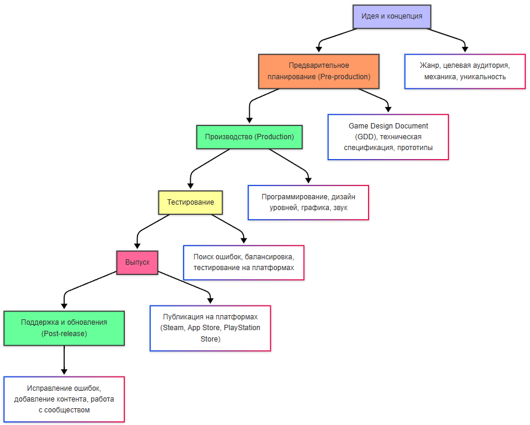

---
title: 8.04. Разработка игр
---

# 8.04. Разработка игр

# Раздел в разработке

## Разработка игр

Разработка игр — это процесс создания видеоигр, который включает в себя множество этапов, от идеи и концепции до финального продукта. Это междисциплинарная деятельность, объединяющая программирование, дизайн, искусство, звуковое сопровождение, управление проектами и маркетинг. Игры могут быть созданы для различных платформ: компьютеров, консолей, мобильных устройств, VR/AR-систем и даже браузеров.

Сейчас можно встретить платформы для обучения детей разработке - Roblox и Roblox Studio, Minecraft.

## Профессиональная разработка


## Roblox Studio


## Minecraft


## Этапы разработки

Разработка игры обычно проходит через несколько ключевых этапов:

1. Идея и концепция. Нужно проработать основные элементы игры:
	- Жанр (например, RPG, шутер, головоломка).
	- Целевая аудитория.
	- Основная механика (что игрок будет делать).
	- Уникальное торговое предложение (чем игра отличается от других).
2. Предварительное планирование (Pre-production). На этом этапе выполняется подготовка документации и спецификации.

Документация включает в себя:
	- Game Design Document (GDD), который включает детальное описание механик, уровня, персонажей и целей.
	- Техническая спецификация - описание технологий.
	- Прототипирование базовых механик.

В процессе препродакшена также выполняется подготовка прототипов — это быстрые версии игры для тестирования основных идей.
3. Производство (Production). Оно включает в себя реализацию элементов игры:
	- Программирование - написание кода для механик, ИИ, физики и интерфейса;
	- Дизайн уровней - создание карт, локаций и задач;
	- Графика и анимация - создание 2D/3D моделей, текстур и анимаций;
	- Звуковое сопровождение - музыка, звуковые эффекты и озвучка.

И все эти элементы должны быть интегрированы в единое целое. В отличие от прочих приложений, в игре всё работает очень быстро и в одном тандеме - здесь нет времени на ожидание обмена данными, здесь логика построена на скорости и художественной части.
4. Тестирование. Когда игра готова, выполняется поиск и исправление ошибок, проверка баланса игры, тестирование на различных платформах.
Функциональное, производительностное, бета-тестирование.
5. Выпуск - игра публикуется на выбранной платформе - Steam, eShop, PlayStation Store, App Store, Google Play, Microsoft Store.
Важно отметить, что в играх маркетинговая компания играет более значимую роль - привлечь игроков сложнее, чем целевую аудиторию для программы.
6. Поддержка и обновления (Post-release), когда выполняется исправление ошибок после выпуска, добавление нового контента, и конечно - взаимодействие с сообществом игроков.




### Команда разработки

```
Разработка игр — это командная работа, и каждый участник вносит свой вклад:
Game Designer (гейм-дизайнер) отвечает за механику, правила и общую концепцию игры. Он создаёт GDD и следит за увлекательностью игры.
Программисты пишут код, реализующий механики, графику, звук и другие аспекты игры. Они работают с игровыми движками, скриптами, компонентами, событиями.
Художники создают 2D/3D-модели, текстуры, анимации и пользовательский интерфейс, обеспечивая визуальную привлекательность игры. Часто художники разделяются на тех, кто работает с моделями, тех, кто рисует концепт-арты, и тех, кто отвечает за анимации.
Sound Designer (саунд-дизайнер) создаёт звуковые эффекты и озвучку персонажей, а также пишет музыку. Хотя для музыки важно выделить композиторов и музыкантов.
Тестировщики проверяют игру на наличие ошибок и проблем. И нет, они не просто играют в игру, они могут выполнять определённое действие снова и снова.
Маркетологи занимаются разработкой стратегии продвижения игры.
Продюсеры и менеджеры управляют проектом, координируют команду и следят за соблюдением сроков и бюджета.

```


## Игровой движок

### Понятие и функции
```
Игровой движок (game engine) — это программная платформа, которая предоставляет разработчикам инструменты и функциональность для создания видеоигр. Движок упрощает процесс разработки, позволяя команде сосредоточиться на креативных аспектах игры, таких как дизайн уровней, механика и сюжет, вместо того чтобы "изобретать велосипед" и писать базовые системы с нуля.
Основные функции игрового движка
Рендеринг графики. Игровой движок отвечает за отображение 2D- или 3D-графики на экране. Он обрабатывает текстуры, освещение, тени, физику материалов и другие визуальные эффекты.
Физика. Движок обеспечивает реалистичное взаимодействие объектов в игре: гравитацию, столкновения, трение и другие физические явления. К примеру, в Unity используются Rigidbody, Collider, Animator, AudioSource.
Анимации. Управление анимацией персонажей, объектов и окружающей среды (например, ходьба, прыжки, движения воды).
Звуковое сопровождение. Воспроизведение музыки, звуковых эффектов и озвучки. Пространственное звучание (например, шаги, которые становятся громче при приближении).
Искусственный интеллект (AI). Движок помогает создавать поведение NPC (неигровых персонажей), такие как принятие решений, поиск пути и взаимодействие с игроком.
Сетевые возможности. Поддержка мультиплеера, синхронизация данных между игроками и обработка задержек (лагов).
Система скриптов. Позволяет разработчикам писать логику игры (например, условия победы, диалоги, события) без необходимости глубокого знания языков программирования.
Интерфейс пользователя (UI). Создание меню, кнопок, индикаторов здоровья, карт и других элементов интерфейса.
Кроссплатформенность. Многие движки позволяют выпускать игру сразу на нескольких платформах (PC, консоли, мобильные устройства).
```

### Виды игровых движков

```
Игровые движки (Game Engines) :
Unity
https://unity.com/ru

Unreal Engine
https://www.unrealengine.com/

Godot
CryEngine
GameMaker Studio
Frostbite
idTech
Havok
Roblox Studio — для детей и обучения, облачная платформа.
Прочие движки

```

### Языки программирования игр

```
Языки программирования :
C# : Основной язык для Unity.
C++ : Используется в Unreal Engine и других движках.
Python : Для простых игр или скриптов, а также для прототипирования.
Java / Kotlin — Android.
Swift / Objective-C — iOS.
JavaScript / TypeScript — веб-игры (Phaser, Three.js).

Библиотеки и API: 

DirectX (Windows)
Vulkan (кроссплатформенный)
OpenGL (Linux, macOS)
Metal (iOS)
```

## Моделирование

### Понятие

Моделирование — это процесс создания 3D-объектов (моделей) для использования в играх. Это может быть что угодно: персонажи, здания, транспорт, оружие или даже целые ландшафты.


### Этапы

```
Этапы

1. Концепция → 2. Блокинг → 3. Детализация → 4. UV-развёртка → 5. Оптимизация → 6. Экспорт

```

```
Этапы моделирования.
Концепция. Создание эскиза или концепт-арта объекта. Определение его формы, пропорций и деталей.
Что такое эскиз, концепт-арт, форма, пропорция, детали.
Создание базовой геометрии. Используются простые фигуры (кубы, сферы, цилиндры), которые затем дорабатываются до нужной формы. Этот этап называется блокингом.
Что такое базовая геометрия фигуры, что такое блокинг. Что такое полигон.
Детализация. Добавление мелких элементов, таких как выступы, углубления или текстуры на поверхности. На этом этапе модель становится более реалистичной.
Что делает модель реалистичной, какие бывают и могут быть детали, и что отличает простую фигуру от детализированной.
UV-развёртка - что это?
Оптимизация. Упрощение геометрии для снижения нагрузки на производительность. Например, удаление невидимых частей модели или уменьшение количества полигонов.
Влияние деталей на производительность. Сложность геометрии, нагрузка, лишние детали, невидимые части, искусство прятать от глаз то, что не обязательно. Биологический образ не обязательно соответствует своей модели.

Экспорт в движок. Модель экспортируется в формат, совместимый с игровым движком (например, FBX, OBJ).

```


### Инструменты

```
Инструменты для моделирования:
Blender : Бесплатный инструмент с открытым исходным кодом, подходит для всех этапов моделирования.
Maya : Профессиональный инструмент, часто используемый в AAA-играх.
3ds Max : Популярный выбор для архитектурных моделей и игр.
ZBrush : Специализируется на высокодетализированных моделях.
```

### Типы моделей

```

Типы моделей:
низкополигональные;
высокополигональные;
пропсы;
персонажи.
Полигон - что это? Полигон — базовый элемент 3D-сетки (треугольник или четырёхугольник).
Создание 3D-объектов: персонажи, окружение, пропсы.
Префабы — это настраиваемые объекты игры, которые вы можете повторно использовать в своем проекте, чтобы создавать сложные сцены без необходимости вручную создавать каждый объект.


```


## Текстуры

### Понятие

```
Текстуры
Текстурирование — это процесс добавления цвета, текстур и других визуальных эффектов к 3D-моделям. Без текстур модели выглядят "голыми" и неестественными.
Наложение цвета и деталей на 3D-модель.
```

### Этапы

```
Этапы текстурирования.
UV-развёртка. Создание 2D-представления поверхности 3D-модели. Это необходимо для того, чтобы текстуры правильно "ложились" на модель.
Рисование текстур. Создание карт, таких как:
•	Diffuse map : Основной цвет модели.
•	Normal map : Имитация объёма и деталей без увеличения количества полигонов.
•	Specular map : Отражение света (блеск).
•	Ambient occlusion map : Затенение труднодоступных участков.
•	Displacement map : Изменение геометрии поверхности.
Настройка материалов. Применение текстур к материалам в игровом движке. Настройка параметров, таких как шероховатость, прозрачность или свечение.
Интеграция в игру. Проверка, как текстуры выглядят в движке при освещении и взаимодействии с другими объектами.
```

### Инструменты

```
Инструменты для текстурирования:
Substance Painter : Программа для создания текстур с широкими возможностями для рисования и наложения эффектов.
Photoshop/GIMP : Для ручного рисования текстур.
Quixel Mixer : Генерация текстур на основе фотографий реальных материалов.
Blender : Встроенные инструменты для текстурирования.

```

## Гейм-дизайн

### Понятие и элементы

```
Гейм-дизайн — это процесс создания и проектирования игрового опыта. Это искусство и наука разработки правил, механик, сюжета, персонажей и взаимодействий, которые делают игру увлекательной, интересной и запоминающейся для игроков. Гейм-дизайнеры отвечают за то, чтобы игра была не только красивой, но и функциональной, логичной и приятной для целевой аудитории.
Геймплей
Геймплей — это основной элемент любой видеоигры, который определяет, как игрок взаимодействует с игровым миром и какую задачу он должен выполнить. Это то, что делает игру увлекательной, захватывающей и запоминающейся. Геймплей включает в себя механики, правила, цели и вызовы, которые формируют опыт игрока.
Механики — это базовые правила и системы, которые определяют, как игрок взаимодействует с игрой. Например, в Super Mario Bros. основная механика заключается в том, чтобы перепрыгивать через препятствия и собирать монеты. В Dark Souls акцент сделан на сложных боях и исследовании мира.
Каждая игра предлагает игрокам определенные цели, будь то победа над боссом, решение головоломки или достижение высокого счета. Награды, такие как очки, уровни или предметы, мотивируют игроков продолжать играть.

Игровая механика (Game Mechanics)
Механика — это правила и системы, которые определяют, как игрок взаимодействует с игрой.
Цель: Создать баланс между сложностью и доступностью, чтобы игрок чувствовал вызов, но не разочарование.

Сюжет и нарратив (Narrative Design). История, которую рассказывает игра, и способ её повествования. Важно: Сюжет должен быть связан с механикой игры.

Уровни и окружение (Level Design). Проектирование игровых локаций, карт и уровней.

Баланс (Game Balance). Настройка параметров игры, чтобы она была справедливой и интересной.
Сложность. Не слишком простая, но и не непреодолимая.
Эргономика. Баланс между заработком и тратами внутри игры (например, монеты, очки опыта).
Прогрессия. Игрок должен чувствовать, что его усилия вознаграждаются.

Пользовательский интерфейс (UI) и пользовательский опыт (UX). Дизайн экранов, кнопок и других элементов, с которыми взаимодействует игрок.

Мотивация и вовлечённость (Player Engagement). Способы удержания интереса игрока.
Методы:
Достижения (achievements).
Награды за выполнение задач.
Элементы прогрессии (например, уровни, ранги).

```

### Этапы

```
Этапы гейм-дизайна
1. Концепция (Concept)
Определение идеи игры.
Выбор жанра (например, RPG, шутер, головоломка).
Целевая аудитория (дети, подростки, взрослые).
2. Прототипирование (Prototyping)
Создание базовой версии игры с минимальными механиками.
Тестирование основных идей.
Пример: Создание уровня с одним типом врагов и простым управлением.
3. Проектирование (Design)
Разработка деталей: механик, уровней, сюжета.
Написание GDD (Game Design Document), где описываются все аспекты игры.
4. Реализация (Implementation)
Работа с программистами и художниками для воплощения идей.
Интеграция механик, графики и звука.
5. Тестирование (Testing)
Поиск ошибок (багов) и проблем с балансом.
Получение обратной связи от тестировщиков и игроков.
6. Выпуск и поддержка (Release and Support)
Публикация игры.
Исправление ошибок и добавление нового контента после релиза.

```

### Практические механики в Unity

```
Реализация гейм-дизайна в Unity
Перемещение игрока
Input.GetAxis(), Time.deltaTime, transform.position
Использование Rigidbody.MovePosition() для физически корректного движения.
Прыжки
Rigidbody.AddForce(Vector3.up * jumpForce)
Проверка контакта с землёй через Physics.Raycast()
Коллизии и триггеры
OnCollisionEnter() — физическое столкновение
OnTriggerEnter() — сбор монет, порталы
UI (интерфейс)
Canvas (Screen Space / World Space)
TextMeshPro, Slider, Button
Привязка кнопок к методам (OnClick)
Очки и здоровье
Обновление текста: scoreText.text = "Очки: " + score
Health Bar с плавным изменением через Lerp
Звуки и анимации
AudioSource.PlayOneShot()
Animator Controller: параметры (Bool, Trigger), переходы
Сохранение данных
PlayerPrefs.SetInt("Score", score)
Сохранение настроек (звук, язык)
AI и навигация
NavMeshAgent для NPC
Патрулирование точек, преследование игрока
Система частиц
ParticleSystem — огонь, дым, взрывы
Запуск из кода: particleSystem.Play()
Cinematic Camera (Cinemachine)
Виртуальные камеры, тряска, приоритеты
Кат-сцены с автоматическим переключением

```

## PC

```
Как адаптируют и разрабатывают игры для PC, Windows, Linux и Steam

Windows - основная платформа. Большинство игр разрабатывается в первую очередь для Windows, так как это самая популярная ОС среди геймеров.
Требования к разработке :
Использование DirectX или Vulkan для графики.

https://learn.microsoft.com/ru-ru/windows/win32/directx
https://vulkan.lunarg.com/

Поддержка стандартных библиотек Windows (например, WinAPI).
Совместимость с различными версиями Windows (Windows 7, 10, 11).
Visual Studio часто используется для написания кода на C++ или C#.

Linux - меньшая аудитория. Linux занимает небольшую долю игрового рынка, но его пользователи активно поддерживают открытые технологии.
Требования к разработке :
Использование OpenGL или Vulkan вместо DirectX.
https://www.opengl.org/

Убедитесь, что все используемые библиотеки совместимы с Linux.
Тестирование на различных дистрибутивах (например, Ubuntu, Fedora).

Proton (технология от Valve) позволяет запускать Windows-игры на Linux через Steam.
Steam — это крупнейшая цифровая платформа для распространения игр.

Официальный сайт - http://store.steampowered.com/


Интеграция с Steam API
Steam API
Steamworks SDK - набор инструментов, предоставляемых Valve для интеграции игры с функциями Steam.
Основные функции :
Достижения : Добавление достижений для мотивации игроков.
Облачные сохранения : Синхронизация прогресса между устройствами.
Трейдинг и маркетплейс : Возможность обмена внутриигровыми предметами.
Мультиплеер : Использование серверов Steam для сетевых игр.
Статистика и аналитика : Отслеживание активности игроков.
Раньше игры проходили через систему голосования Greenlight, но сейчас используется Steam Direct — платная система публикации. Разработчики платят $100 за каждую игру (возвращается при достижении определённого уровня продаж).
Можно выпустить игру в раннем доступе (Early Access), чтобы собрать обратную связь.

Процесс адаптации под ПК
Настройки качества - разрешение экрана, настройки текстур, теней, освещения, поддержка разных разрешений.
Оптимизация - важно убедиться, что игра работает на широком спектре видеокарт (от бюджетных до высокопроизводительных).
LOD (Level of Detail) используется для снижения нагрузки на слабых устройствах.
Управление. Поддержка клавиатуры и мыши, настройка горячих клавиш, автоматическое распознавание подключённых устройств, совместимость с геймпадами.
Steam Hardware Survey
Steamworks для загрузки исполняемых файлов, текстур, звуков и других ресурсов.
Steam - параметры игры (языки, регионы, цены).
Valve проверяет игру на соответствие базовым требованиям (например, отсутствие вредоносного ПО). После одобрения игра становится доступна для покупки на Steam.
```

## PlayStation

```

Как адаптируют и разрабатывают игры на PlayStation
Производитель : Sony Interactive Entertainment.
Основные модели : PlayStation 4, PlayStation 5.
Аппаратное обеспечение :
PS4: AMD Jaguar CPU, GPU Radeon GCN.
PS5: AMD Zen 2 CPU, RDNA 2 GPU, SSD для быстрой загрузки.
Управление : DualShock 4 (PS4), DualSense (PS5) с тактильной обратной связью и адаптивными триггерами.
Получение доступа к SDK. Разработчики должны стать лицензированными партнёрами Sony через программу PlayStation Partner Program.
https://partners.playstation.net/

Получение доступа к PlayStation SDK (Software Development Kit)
инструменты для работы с железом консоли.
Использование API, таких как GNM (Graphics and Compute Library) для PS4 или Orbis для более низкоуровневой оптимизации.
Для PS5 используется Tempest Engine , который обеспечивает трассировку лучей и улучшенную аудиосистему.
Новые функции контроллера PS5, такие как адаптивные триггеры и тактильная обратная связь, требуют специальной реализации.
Sony требует строгого тестирования игр перед выпуском.
Сертификация включает проверку производительности, совместимости и соответствия стандартам PlayStation.
Игры публикуются через PlayStation Store .
Разработчики могут использовать PlayStation Plus для продвижения игр.

```

## Nintendo

```
Как адаптируют и разрабатывают игры на Nintendo
Производитель : Nintendo.
Основные модели : Nintendo Switch, Nintendo 3DS (устаревшая).
Аппаратное обеспечение :
Nintendo Switch: NVIDIA Tegra X1, гибридная консоль (док-станция + портативный режим).
Уникальные контроллеры: Joy-Con, Pro Controller.
Акцент на семейные и казуальные игры, но также популярны инди-проекты и AAA-игры.
Получение доступа к SDK. Разработчики должны зарегистрироваться в программе Nintendo Developer Portal.
https://developer.nintendo.com/

инструменты для работы с железом консоли
Оптимизация под Nintendo Switch. Поддержка двух режимов: док-станция (TV) и портативный режим.
Оптимизация графики для работы на мобильном процессоре (Tegra X1).
Joy-Con открывают новые механики: движение, вибрация HD Rumble, инфракрасные датчики.
Nintendo предъявляет строгие требования к качеству игр.
Тестирование включает проверку производительности, управления и совместимости с различными режимами.
Игры выпускаются через Nintendo eShop .
Nintendo активно поддерживает инди-разработчиков, предоставляя маркетинговые возможности.
```

## Xbox

```
Как адаптируют и разрабатывают игры на Xbox
Производитель : Microsoft.
Основные модели : Xbox One, Xbox Series X|S.
Аппаратное обеспечение :
Xbox One: AMD Jaguar CPU, GPU Radeon GCN.
Xbox Series X|S: AMD Zen 2 CPU, RDNA 2 GPU, быстрый SSD.
Тесная интеграция с Windows и облачными сервисами (например, xCloud).
Получение доступа к SDK. Разработчики регистрируются в программе ID@Xbox , которая предоставляет доступ к инструментам и ресурсам.
Xbox Game Development Kit (GDK) для работы с железом.
https://learn.microsoft.com/en-us/gaming/gdk/

Оптимизация под Xbox Series X|S
Использование API, таких как DirectX 12 Ultimate, для трассировки лучей и других современных эффектов.
Поддержка быстрого запуска (Quick Resume) и автоматического масштабирования графики.
Интеграция с Xbox Live. Добавление достижений, облачных сохранений и мультиплеера через Xbox Live Services .
Возможность использования Game Pass , что увеличивает охват аудитории.
Microsoft требует строгого тестирования игр на соответствие стандартам Xbox.
Особое внимание уделяется производительности и совместимости с Xbox Game Pass.
Игры выпускаются через Microsoft Store и Xbox Store
Разработчики могут использовать Xbox Game Pass для продвижения.
```

## Мобильные игры

```
Как адаптируют и разрабатывают мобильные игры (Java, iOS, Android)
Разработка мобильных игр — это процесс создания игр для устройств на базе операционных систем iOS (Apple) и Android . Эти платформы имеют свои особенности, которые влияют на процесс разработки. Рассмотрим основные этапы и инструменты.
Android
Языки программирования :
Java : Традиционный язык для разработки под Android.
Kotlin : Современный язык, официально поддерживаемый Google.
C++/C# : Используются с игровыми движками (например, Unity).
Инструменты :
Android Studio : Основная IDE для разработки.
Gradle : Система сборки проектов.
Разнообразие устройств: Множество производителей, размеров экранов и версий Android.
Open-source платформа: Легко получить доступ к SDK и инструментам.

iOS
Языки программирования :
Swift : Основной язык для разработки под iOS.
Objective-C : Устаревший, но всё ещё используемый язык.
C++/C# : Для работы с игровыми движками.
Инструменты :
Xcode : Основная IDE для разработки под iOS.
Metal : API для высокопроизводительной графики.
Закрытая экосистема: Строгие требования Apple к качеству приложений.
Однородность устройств: iPhone и iPad имеют ограниченное количество моделей, что упрощает тестирование.

Этапы разработки
Выбор движка :
Unity : Поддерживает обе платформы, прост в освоении.
Unreal Engine : Подходит для AAA-проектов, требует больше ресурсов.
Godot : Лёгкий движок с открытым исходным кодом.

Кроссплатформенная разработка :
Unity и Unreal Engine позволяют создавать игры одновременно для iOS и Android.
Однако могут потребоваться дополнительные настройки для каждой платформы (например, управление или графика).

Настройка управления :
Тач-экран : Реализация жестов (свайпы, тапы), виртуальных джойстиков и кнопок.
Гироскоп : Использование наклона устройства для управления.

Адаптация под экраны :
Поддержка различных разрешений и ориентаций (портретная или ландшафтная).
Динамическое масштабирование UI (интерфейса пользователя).

Монетизация :
Встроенные покупки (in-app purchases).
Реклама (например, через Google AdMob или Unity Ads).
Подписки.

Публикация :
Google Play Store (Android): Более гибкие правила.
Apple App Store (iOS): Строгая проверка (App Review).


```

## Оптимизация игр

```

Как оптимизируют игры
Оптимизация мобильных игр критически важна, так как устройства имеют ограниченные ресурсы (процессор, память, батарея).
Графическая оптимизация
LOD (Level of Detail)
Снижение числа полигонов
Уменьшение разрешения текстур (например, до 1024x1024).
Использование формата сжатия (например, ASTC, ETC2).
Отключение сложных эффектов (например, трассировка лучей) на слабых устройствах.

Производительность
FPS (Frames Per Second) :
Цель: Поддерживать стабильные 30-60 FPS.
Избегать GetComponent в Update()
Минимизировать вызовы Instantiate и Destroy
Выполнение ресурсоёмких задач в фоновых потоках.
Управление загрузкой и выгрузкой ресурсов.
Избегание утечек памяти (memory leaks).

Object Pooling
Предварительное создание объектов (пуля, враг)
Активация/деактивация вместо создания/удаления
Реализуется в Unity через скрипты

Энергоэффективность
Батарея. Минимизация использования процессора и GPU.
Ограничение частоты обновления экрана (например, 30 FPS вместо 60).
Автоматическое снижение качества графики при низком уровне заряда.

Размер игры
Сжатие файлов. Использование ZIP или других форматов для уменьшения APK/IPA.
Динамическая загрузка (Addressables, Asset Bundles)
Загрузка ресурсов только при необходимости (например, уровней или текстур).


```

## Тестирование игр

```
Как тестируют игры
Тестирование игр — это ключевой этап, который гарантирует качество продукта. Оно включает несколько видов проверок.
Функциональное тестирование
Цель : Проверка корректности работы всех функций.
Примеры :
Сохранение прогресса.
Работа мультиплеера.
Встроенные покупки.

Тестирование производительности
Цель : Убедиться, что игра работает плавно на всех устройствах.
Методы :
Измерение FPS.
Проверка использования памяти и процессора.
Тестирование на устройствах с разными характеристиками.

Компьютерное тестирование
Автоматизированные тесты :
Использование скриптов для имитации действий игрока.
Пример: Тестирование повторяемости багов.

Тестирование совместимости
Цель : Убедиться, что игра работает на всех поддерживаемых устройствах.
Методы :
Тестирование на реальных устройствах.
Использование эмуляторов (например, Android Emulator, iOS Simulator).

Юзабилити-тестирование
Цель : Проверка удобства интерфейса.
Примеры :
Легкость управления.
Читаемость текста на маленьких экранах.

Локализация
Цель : Убедиться, что игра корректно работает на разных языках.
Примеры :
Перевод текстов и звука.
Адаптация интерфейса для RTL (справа налево) языков.

Тестирование бета-версии
Цель : Сбор обратной связи от реальных пользователей.
Инструменты :
Google Play Beta Testing (Android).
TestFlight (iOS).
```

## Практика в Unity

### Установка и настройка

```
1. Установка и настройка
Unity Hub, выбор LTS-версии
Создание проекта: 3D Core / Beginner
Интерфейс: Scene, Game, Hierarchy, Project, Inspector, Console
Первый скрипт: Debug.Log("Hello World")


```

### Компоненты и префабы

```
2. Компоненты и префабы
Transform, Rigidbody, Collider
Разница между триггером и коллайдером
Префабы: шаблоны объектов, повторное использование

```

### Основы C# в Unity

```
3. Основы C# в Unity
Структура класса: public class Player : MonoBehaviour
Методы: Start(), Update()
Переменные: int, float, string, bool
Логика через условия и циклы
```

### ООП в Unity

```
4. ООП в Unity
Классы, объекты, конструкторы
Наследование: class Zombie : Enemy
Инкапсуляция: свойства get/set
Полиморфизм: virtual, override, абстрактные классы
```

### Сборка и публикация

```
5. Сборка и публикация
Build Settings: выбор платформы (PC, WebGL, Android)
Настройка иконки, названия, разрешения
Экспорт: .exe, .apk, .html
Тестирование на других устройствах

```

### Финальный проект

```
6. Финальный проект
Планирование: жанр, механики, цель
Создание: сцена, персонаж, враги, UI
Программирование: движение, бой, сохранение
Добавление: звуки, анимации, частицы
Сборка и презентация
```