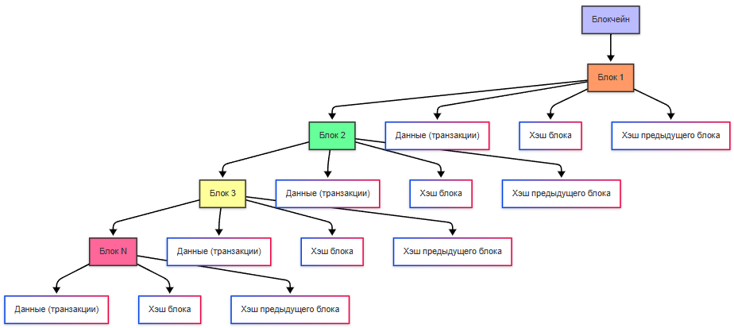

---
title: 8.05. Блокчейн, крипта и NFT
---

# 8.05. Блокчейн, крипта и NFT

# Раздел в разработке

## Блокчейн

**Блокчейн** (blockchain) — это децентрализованная цифровая база данных, которая хранит информацию в виде цепочки блоков. Каждый блок содержит данные, такие как транзакции, время создания и уникальный идентификатор (хэш), связанный с предыдущим блоком. Это делает блокчейн устойчивым к изменениям: чтобы изменить один блок, нужно изменить все последующие.

Особенности блокчейна:
	- Децентрализация. В отличие от традиционных баз данных, управляемых центральным сервером, блокчейн распределён по множеству компьютеров (узлов). Это исключает необходимость доверия к одному центру.
	- Прозрачность. Все транзакции видны всем участникам сети, что обеспечивает открытость.
	- Безопасность. Блокчейн защищён криптографией, что делает его практически неуязвимым для взлома.
	- Неизменяемость. После записи данных в блок их нельзя изменить без согласия большинства участников сети.
	- Автоматизация. С помощью смарт-контрактов можно автоматизировать выполнение условий.



## Криптография и криптовалюта

```
Открытый текст (plaintext) — исходное сообщение.
Шифртекст (ciphertext) — зашифрованное сообщение.
Ключ (key) — секретная информация, используемая для шифрования/расшифрования.
Алгоритм (cipher) — математическое преобразование.
Шифрование (encryption) — преобразование открытого текста в шифртекст.
Расшифрование (decryption) — обратное преобразование.
Криптоанализ — попытка взломать шифр без ключа.
Шифр Цезаря — сдвиг букв (очень слаб).
Шифр Виженера — многоалфавитная замена (сильнее, но взламывается).
Энигма — роторная машина (Вторая мировая, взломана Аланом Тьюрингом).
DES (1977) — первый стандарт шифрования (56 бит — устарел).
AES (2001) — современный симметричный стандарт (128/192/256 бит).
RSA (1977) — первый практичный асимметричный алгоритм.
ECC (1985) — криптография на эллиптических кривых (меньше ключи, та же стойкость).

Симметричная криптография

Основные алгоритмы:
AES (Advanced Encryption Standard) — золотой стандарт. Блоки по 128 бит, ключи 128/192/256. Используется везде: Wi-Fi (WPA2), TLS, дисковое шифрование (BitLocker, LUKS), архивы (ZIP, 7z).
ChaCha20 — поточный шифр, быстр на мобильных устройствах (используется в TLS 1.3, QUIC).
3DES, Blowfish, RC4 — устаревшие или небезопасные (не используйте!).

Режимы работы блочных шифров:
ECB (Electronic Codebook) — ❌ не использовать! Одинаковые блоки → одинаковый шифртекст.
CBC (Cipher Block Chaining) — лучше, но требует IV (Initialization Vector).
GCM (Galois/Counter Mode) — современный, обеспечивает и шифрование, и аутентификацию (AEAD).

Асимметричная криптография (с открытым ключом)

Основные алгоритмы:
RSA — основан на сложности факторизации больших чисел. Используется для подписи и обмена ключами.
ECC (Elliptic Curve Cryptography) — основан на сложности задачи дискретного логарифма на эллиптических кривых. При том же уровне безопасности — ключи в 3-5 раз короче RSA → экономия ресурсов. Используется в TLS, Bitcoin, Signal, SSH.
Diffie-Hellman (DH, ECDH) — протокол обмена ключами. Позволяет двум сторонам создать общий секрет по открытому каналу.

Применение:
TLS/SSL — обмен симметричным ключом через RSA/ECDH.
SSH — аутентификация по ключам.
PGP/GPG — шифрование почты и файлов.
Цифровые подписи — подтверждение авторства и целостности.

```

**Криптография** — это наука о защите информации с помощью математических методов. В блокчейне используются криптографические инструменты:
	- Шифрование данных, для защиты конфиденциальной информации.
	- Хэширование, при котором выполняется преобразование данных в уникальные строки фиксированной длины (хэши). Хэши используются для проверки целостности данных.
	- Цифровые подписи для подтверждения подлинности транзакций. Например, пользователь создаёт цифровую подпись с помощью своего приватного ключа, а другие участники сети проверяют её с помощью публичного ключа.

**Криптовалюта** — это цифровая валюта, работающая на основе блокчейна. Она не имеет физической формы и не контролируется центральными банками.

Децентрализация. У криптовалюты нет какого-то центрального цонтроля, сеть узлов является распределённой, а управление происходит через консенсус.

```
PoW
PoS
```


Блокчейн в криптовалюте реализован через цепочки блоков, хранение транзакций и защиту через криптографию:


Процесс транзакций включает в себя перевод средств между участниками, проверку транзакций через узлы сети и добавление транзакций в блокчейн:


Блокчейн, как можно понять из названия (block - блок, chain - цепь), состоит из цепочки блоков. Это блоки можно создавать - такой процесс называется майнингом (mining). Новые блоки создаются, транзакции проверяются, и за создание блока начисляется награда - криптовалюта:


Стейкинг подразумевает блокировку криптовалюты для участия в консенсусе, с дальнейшим подтверждением транзакций и вознаграждением за участие:


Самые известные криптовалюты:
	- Bitcoin (BTC) : Первая и самая популярная криптовалюта, созданная Сатоши Накамото в 2009 году. Используется как средство обмена и накопления.
	- Ethereum (ETH) : Платформа для создания децентрализованных приложений (dApps) и смарт-контрактов.
	- Binance Coin (BNB) : Токен, созданный для использования на бирже Binance.
	- Cardano (ADA) : Блокчейн с акцентом на безопасность и масштабируемость.
	- Solana (SOL) : Высокоскоростной блокчейн для децентрализованных приложений.

Как работают транзакции?
1. Пользователь инициирует транзакцию, указывая адрес получателя и сумму.
2. Транзакция подписывается цифровой подписью с использованием приватного ключа.
3. Транзакция отправляется в сеть, где майнеры (или валидаторы) проверяют её подлинность.
4. После подтверждения транзакция добавляется в блок и становится частью блокчейна.

Криптобиржи — это платформы для покупки, продажи и обмена криптовалют. Примеры:
	- Binance.
	- Coinbase.
	- Kraken.

## Токены и смарт-контракты

**Токены** — это цифровые активы, созданные на базе существующих блокчейнов (например, Ethereum).

Типы токенов:
	- Фунгируемые токены (Fungible Tokens) - Каждый токен идентичен другому (например, Bitcoin, ETH).
	- НФТ (NFT) - Уникальные токены, представляющие цифровые или физические активы.
	- Утилитарные токены - Предоставляют доступ к услугам или продуктам (например, токены для оплаты комиссий).
	- Секьюрети токены - Представляют долю в компании или проекте.

**Смарт-контракт** — это программа, которая автоматически выполняет условия соглашения, если они соблюдены. Например, если вы покупаете товар, смарт-контракт переводит деньги продавцу только после подтверждения доставки.

Примеры смарт-контрактов:
	- DeFi (децентрализованные финансы), кредитование, стейкинг, обмен токенами.
	- Страхование, автоматическая выплата компенсации при наступлении страхового случая.
	- Игры, распределение наград между игроками.

**NFT** (Non-Fungible Token) — это уникальный токен, который представляет собой цифровой или физический актив. В отличие от обычных токенов, каждый NFT уникален и не может быть заменён другим.

**DeFi** (Decentralized Finance) — это экосистема финансовых сервисов, работающих на блокчейне без участия банков или других посредников.

DeFi-приложения работают на смарт-контрактах, пользователи предоставляют свои активы в пулы ликвидности для получения дохода.

Заблокированные токены приносят проценты — это стейкинг. Децентрализованные биржи (DEX) позволяют обменивать токены напрямую.

