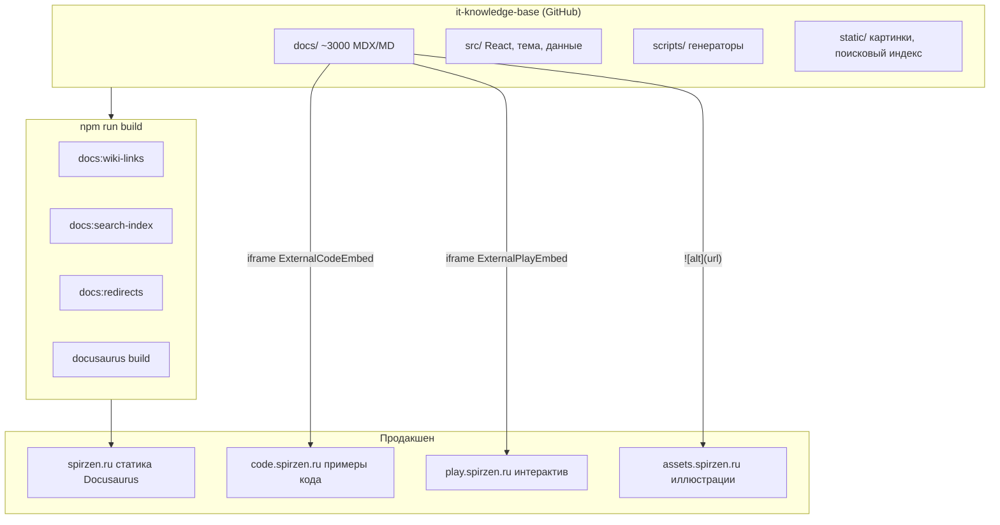

# Архитектура

Сайт "Вселенная IT" — **связка сервисов** с единой [навигацией](#сервис) и перекрёстными ссылками. Текст и структура знаний живут в [репозитории](#репозиторий) `it-knowledge-base`; тяжёлый [интерактив](#интерактив) и длинный код вынесены на отдельные [домены](#домен), чтобы энциклопедию можно было собирать и отдавать быстро.

Общая идея близка к [многоуровневой архитектуре](/encyclopedia/7-project/7-06-proektirovanie-i-arhitektura/design/2133) и [паттернам микросервисов](/encyclopedia/7-project/7-06-proektirovanie-i-arhitektura/design/118), но в упрощённом виде — без оркестратора контейнеров на каждый абзац статьи. Подробнее о выборе архитектуры — в [Основах архитектуры](/encyclopedia/4-code-dev/4-04-proekt-i-freymvorki/112) и [Архитектурных паттернах](/encyclopedia/7-project/7-06-proektirovanie-i-arhitektura/design-patterns/114).

---

## Общая схема



Сборка и выкат связаны с [DevOps и CI/CD](/encyclopedia/8-infra-security/8-04-devops-ci-cd/intro). Исходники хранятся в Git — см. [Основы работы с Git](/encyclopedia/4-code-dev/4-13-osnovy-raboty-s-git/intro).

---

## Роли сервисов

| Сервис | Назначение | Технология (типично) |
|--------|------------|----------------------|
| **spirzen.ru** | Энциклопедия, лаборатория, глоссарий, поиск, навигация | Docusaurus 3 + [React](/encyclopedia/5-languages/5-01-javascript/27) 19, статический экспорт |
| **code.spirzen.ru** | Запускаемые [листинги](#листинг), встраивание через `/e/embed/<slug>/` | Отдельный Astro/Vite-проект |
| **play.spirzen.ru** | Тренажёры, эмуляторы, [визуализаторы](#визуализатор) через `/p/embed/<slug>/` | Отдельный Astro/Vite-проект |
| **assets.spirzen.ru** | Скриншоты, диаграммы, тяжёлые PNG/WebP | [CDN](/encyclopedia/2-system-network/2-03-set-i-internet/212) / object storage |

Разделение сделано осознанно.

1. **Размер [бандла](#бандл).** [Интерактив](#интерактив) из сотен демо держится отдельно от основного JS-[чанка](#чанк) энциклопедии.
2. **Независимые релизы.** Тренажёр SQL можно обновить без полной пересборки энциклопедии — тот же принцип слабой связанности, что в [REST-интеграциях](/encyclopedia/8-infra-security/8-05-mikroservisy-i-integratsiya/1151).
3. **Изоляция.** [iframe](#iframe) + [postMessage](#postmessage) с проверкой [origin](#origin) задаёт контролируемую границу между контентом и исполняемым кодом. См. также [HTTP как основу веб-интеграций](/encyclopedia/2-system-network/2-09-osnovy-integratsionnogo-vzaimodeystviya/118) и [HTTPS](/encyclopedia/8-infra-security/8-07-informatsionnaya-bezopasnost/1151).

---

## Паттерны в архитектуре

Ниже — паттерны, которые можно узнать по энциклопедии, и то, как они проявляются именно в "Вселенной IT".

| Паттерн | Суть | Где в проекте | Теория в энциклопедии |
|---------|------|---------------|------------------------|
| **Static Site Generation (SSG)** | HTML/JS собираются заранее, сервер отдаёт файлы | `docusaurus build` → spirzen.ru | [Как работают сайты](/encyclopedia/2-system-network/2-04-kak-rabotayut-sayty-i-veb-sayty/intro), [CDN](/encyclopedia/2-system-network/2-03-set-i-internet/212) |
| **SPA с гидратацией** | После загрузки HTML React "оживляет" страницу | Docusaurus + [React](/encyclopedia/5-languages/5-01-javascript/27) | [SPA и frontend-стек](/encyclopedia/5-languages/5-01-javascript/270) |
| **Разделение по bounded context** | У каждого домена своя зона ответственности | spirzen / code / play / assets | [Паттерны микросервисов](/encyclopedia/7-project/7-06-proektirovanie-i-arhitektura/design/118) |
| **Embed / Facade** | Статья видит простой компонент, внутри — сложный iframe | `ExternalPlayEmbed`, `ExternalCodeEmbed` | [Модульность](/encyclopedia/4-code-dev/4-04-proekt-i-freymvorki/2) |
| **Lazy loading** | Код грузится, когда нужен | `lazyMdxDemoImports`, `lazyDemoInView` | [Proxy и lazy loading](/encyclopedia/7-project/7-06-proektirovanie-i-arhitektura/design-patterns/128) |
| **Code splitting** | Один [бандл](#бандл) режется на [чанки](#чанк) | Webpack/Rspack `splitChunks` | [SPA и bundler](/encyclopedia/5-languages/5-01-javascript/270) |
| **Compile-time transform** | Markdown меняется до рендера | [remark](#remark)-плагины | [Markdown в вебе](/encyclopedia/1-basics/1-15-tekst/5) |
| **Client-side index** | Поиск по заранее собранному JSON | `doc-search-index.json` + DocSearch | [Основы БД и индексы](/encyclopedia/3-data-markup/3-05-osnovy-baz-dannyh/intro) (аналогия) |
| **Redirect / compatibility layer** | Старые URL ведут на новые | `plugin-client-redirects` | [HTTP-справочник](/encyclopedia/2-system-network/2-03-set-i-internet/611) |
| **Gate / deferred init** | Тяжёлое стартует по действию пользователя | [Click-to-load](#click-to-load), `EmbedClickGate` | [Polling и push](/encyclopedia/2-system-network/2-04-kak-rabotayut-sayty-i-veb-sayty/129) (отложенная загрузка данных) |
| **Cross-cutting enhancement** | Общая логика без дублирования в статьях | `DocItem/Layout`, `articleMetaEnhancement` | [Составные паттерны](/encyclopedia/7-project/7-06-proektirovanie-i-arhitektura/design-patterns/143) |
| **Theme extension (swizzle)** | Подмена частей фреймворка | `src/theme/*` | [Основы архитектуры](/encyclopedia/4-code-dev/4-04-proekt-i-freymvorki/112) |

Паттерны сознательно **прагматичные** — приоритет скорости сборки тысяч статей и предсказуемости для читателя важнее формальной "чистоты" монолита.

---

## Интеграции и способы взаимодействия

### 1. spirzen.ru ↔ читатель (HTTP)

Браузер запрашивает статику по [HTTP](/encyclopedia/2-system-network/2-09-osnovy-integratsionnogo-vzaimodeystviya/118). После первой загрузки навигация между статьями идёт как [SPA](/encyclopedia/5-languages/5-01-javascript/270) — без полной перезагрузки страницы, с подгрузкой JS-[чанков](#чанк) маршрута.

### 2. spirzen.ru ↔ code.spirzen.ru / play.spirzen.ru (iframe + postMessage)

| Этап | Кто | Что происходит |
|------|-----|----------------|
| Разметка | MDX-статья | `<ExternalPlayEmbed example="slug" />` |
| Обёртка | React на spirzen.ru | [Click-to-load](#click-to-load) [заглушка](#заглушка), затем `<iframe src="…/p/embed/slug/">` |
| Выполнение | play / code | Демо или [листинг](#листинг) в изолированном документе |
| Обратная связь | iframe → родитель | [postMessage](#postmessage) с высотой; проверка [origin](#origin) |
| Тема | query `?theme=light` или `dark` | Согласование яркости с переключателем на spirzen.ru |

Это **синхронная встраиваемая интеграция** — один общий контракт (slug в URL embed, доверенные origins в `src/constants/`) вместо отдельного [REST](/encyclopedia/8-infra-security/8-05-mikroservisy-i-integratsiya/1151)-API на каждую статью.

### 3. spirzen.ru ↔ assets.spirzen.ru (прямые URL)

Картинки в [Markdown](#markdown) — ``. Браузер качает файл напрямую; [CDN](/encyclopedia/2-system-network/2-03-set-i-internet/212) кэширует у края сети. Энциклопедия не проксирует байты иллюстраций.

### 4. Репозиторий ↔ сборка (npm-скрипты)

Перед `docusaurus build` скрипты в `scripts/` генерируют артефакты.

| Скрипт | Артефакт | Зачем |
|--------|----------|-------|
| `docs:wiki-links` | `wikiLinkIndex.json` | Разрешение `[[wiki-ссылок]]` в remark |
| `docs:search-index` | `doc-search-index.json` | [Клиентский поиск](#клиентский-поиск) |
| `docs:redirects` | `docLegacyRedirects.json` | [Редиректы](#редирект) со старых путей |
| `docs:collection-titles` | `collectionDocTitles.json` | Заголовки в [хабах](#хаб) подборок |

Подробнее — в главе [Данные и скрипты](/about/kak-ustroena-vselennaya-it/dannye-i-skripty).

### 5. remark ↔ MDX (этап компиляции)

[remark](#remark)-плагины — мост между авторским [Markdown](#markdown) и бандлом React. `wikiLink.js` подставляет ссылки; `lazyMdxDemoImports.js` переписывает `import` компонентов на lazy-обёртки. Это **интеграция на этапе сборки**, в рантайме браузера remark уже не работает.

### 6. localStorage ↔ тема оформления

[Палитра дизайна](#палитра-дизайна) (`data-design`) и light/dark (`data-theme`) сохраняются в браузере. Client modules синхронизируют атрибуты при SPA-переходах — см. [Темы и стили](/about/kak-ustroena-vselennaya-it/temy-i-stili).

---

## Что происходит при `npm start` / `npm run build`

Цепочка из `package.json`.

```json
"start": "npm run docs:wiki-links && npm run docs:search-index && npm run docs:redirects && cross-env NODE_OPTIONS=--max-old-space-size=16384 docusaurus start"
```

| Шаг | Скрипт | Результат |
|-----|--------|-----------|
| 1 | `docs:wiki-links` | `src/data/wikiLinkIndex.json`, [индекс](#индекс) для `[[wiki-ссылок]]` |
| 2 | `docs:search-index` | `static/doc-search-index.json`, [клиентский поиск](#клиентский-поиск) (Ctrl+K) |
| 3 | `docs:redirects` | `src/data/docLegacyRedirects.json`, [редиректы](#редирект) со старых URL |
| 4 | `docusaurus start/build` | Webpack/Rspack-сборка сайта |

Для [продакшена](#продакшен) дополнительно запускается `docs:collection-titles` — заголовки статей в подборках.

---

## Слои приложения spirzen.ru

Каждый пункт — отдельный [слой приложения](#слой-приложения) в смысле [многоуровневой схемы](/encyclopedia/7-project/7-06-proektirovanie-i-arhitektura/design/2133).

### 1. Контент (`docs/`)

- Файлы `.md` и `.mdx` — статьи, разделы, подборки.
- [Frontmatter](#frontmatter) с полями `title`, `description`, `slug`, `tags`, `related` и др.
- MDX позволяет `import` React-компонентов прямо в статью.
- `routeBasePath: '/'` ставит документацию в корень сайта (`/encyclopedia/...`).

Текстовая основа — [Markdown](/encyclopedia/1-basics/1-15-tekst/5) и [языки разметки](/encyclopedia/1-basics/1-24-osnovnye-yazyki/4).

### 2. Презентация (`src/theme/`)

[Swizzle-компоненты](#swizzle-компонент) Docusaurus — [обёртка](#обёртка) статьи, [navbar](#navbar), [sidebar](#sidebar), [карточки](#карточка). Здесь вшиты PDF-[экспорт](#экспорт), прогресс главы и блок "Смотрите также" без импорта в каждой статье.

### 3. Интерактив (`src/components/`)

- **[Embed](#embed)** — `ExternalPlayEmbed`, `ExternalCodeEmbed` ([iframe](#iframe)).
- **[Хабы](#хаб)** — `CollectionHub`, `LabTrainersHub`, `GettingStartedPaths`.
- **Поиск** — собственный DocSearch вместо [Algolia](#algolia).

### 4. Данные (`src/data/`)

JSON и JS-модули с подборками, иконками технологий, палитрами дизайна и словарями терминов. Часть генерируется скриптами, часть редактируется вручную.

### 5. Стили (`src/css/`)

[Infima](#infima) (тема Docusaurus) плюс кастомная система `--d-*` токенов и 25+ палитр `data-design`. См. [HTML и CSS](/encyclopedia/3-data-markup/3-10-css/intro).

---

## Поток запроса читателя

1. Браузер запрашивает HTML/JS/CSS с spirzen.ru (или localhost:3000).
2. Client modules (`itDesignThemeInit`, `limitRoutePrefetch`) выполняются на клиенте до [гидратации](#гидратация) React.
3. При открытии статьи MDX рендерит markdown; [remark](#remark)-плагины уже преобразовали `[[ссылки]]` и lazy-import компонентов.
4. `ExternalPlayEmbed` показывает [click-to-load](#click-to-load) [заглушку](#заглушка); после клика [iframe](#iframe) грузит play.spirzen.ru и шлёт [postMessage](#postmessage) с высотой.
5. Поиск (Ctrl+K) читает `doc-search-index.json` и ищет локально в браузере — [клиентский поиск](#клиентский-поиск).

---

## Производительность как часть архитектуры

Решения заложены в нескольких местах сразу.

- **remark `lazyMdxDemoImports`** переписывает статический `import Foo from '@site/...'` в MDX в `lazyDemoInView` / `lazyExternalEmbed`.
- **Webpack `splitChunks`** в `docusaurus.config.js` выделяет отдельные [чанки](#чанк) для React, Docusaurus, Prism, Mermaid и embed-компонентов.
- **`limitRoutePrefetch`** пропускает prefetch тяжёлых маршрутов (`/encyclopedia/`, `/lab/`, `/about/interactive`).
- **[Click-to-load](#click-to-load) iframe** откладывает ws:// и тяжёлые демо до клика читателя.

На Windows в dev по умолчанию отключён [Rspack](#rspack) faster (`IT_DOCUSAURUS_FASTER=1` для включения) — иначе возможен [EMFILE](#emfile) при тысячах файлов.

---

## Где что искать в репозитории

```
it-knowledge-base/
├── docs/                  # Контент (статьи)
├── src/
│   ├── components/        # React для MDX и темы
│   ├── theme/             # Swizzle Docusaurus
│   ├── data/              # Статические данные
│   ├── css/               # Глобальные стили
│   ├── remark/            # Плагины markdown
│   ├── clientModules/     # Клиентский bootstrap
│   ├── constants/         # URL embed-сервисов
│   └── pages/             # Главная (отдельно от docs)
├── scripts/               # Генераторы перед сборкой
├── static/                # Файлы как есть (favicon, поисковый JSON)
├── docusaurus.config.js   # Главный конфиг
├── sidebars.js            # Боковое меню
└── package.json           # Зависимости и npm-скрипты
```

---

## Глоссарий терминов

Краткие определения в контексте "Вселенной IT". Якоря (`#сервис`) — для ссылок из других глав этого раздела.

<span id="сервис"></span>

### Сервис

Отдельно развёрнутое приложение или статический сайт с своим [доменом](#домен) и зоной ответственности. spirzen.ru, code.spirzen.ru, play.spirzen.ru и assets.spirzen.ru — четыре [сервиса](#сервис) витрины знаний. Теория — [паттерны микросервисов](/encyclopedia/7-project/7-06-proektirovanie-i-arhitektura/design/118).

<span id="навигация"></span>

### Навигация

Способ перемещения читателя по материалам — [navbar](#navbar), [sidebar](#sidebar), подборки, wiki-ссылки, поиск, пагинация статей, карта на главной. Единая [навигация](#навигация) связывает все [домены](#домен) через ссылки в тексте.

<span id="репозиторий"></span>

### Репозиторий

Git-хранилище исходников (`it-knowledge-base` на GitHub). В [репозитории](#репозиторий) лежат `docs/`, `src/`, скрипты и конфиги; из него собирается spirzen.ru. См. [Основы Git](/encyclopedia/4-code-dev/4-13-osnovy-raboty-s-git/intro).

<span id="интерактив"></span>

### Интерактив

Запускаемый в браузере опыт — тренажёры, эмуляторы, игры, пошаговые схемы. В проекте основная масса [интерактива](#интерактив) на play.spirzen.ru и встраивается через [Embed](#embed). Витрина — [/about/interactive](/about/interactive).

<span id="домен"></span>

### Домен

Имя хоста в URL (`spirzen.ru`, `code.spirzen.ru`). Отдельный [домен](#домен) даёт изоляцию cookies, [origin](#origin) для [postMessage](#postmessage) и независимый деплой. См. [CDN и DNS](/encyclopedia/2-system-network/2-03-set-i-internet/212).

<span id="листинг"></span>

### Листинг

Фрагмент исходного кода в статье или на code.spirzen.ru — часто с подсветкой и возможностью запуска. [Листинги](#листинг) на code отделены от текста энциклопедии, чтобы не раздувать [бандл](#бандл).

<span id="визуализатор"></span>

### Визуализатор

Интерактивная схема или анимация (алгоритм, сеть, архитектура ПК). На play.spirzen.ru [визуализаторы](#визуализатор) грузятся в [iframe](#iframe) только после [click-to-load](#click-to-load).

<span id="бандл"></span>

### Бандл

Один собранный JS-файл (или группа), который браузер скачивает для работы сайта. Цель архитектуры — держать [бандл](#бандл) spirzen.ru лёгким, вынося демо на play/code. См. [SPA и bundler](/encyclopedia/5-languages/5-01-javascript/270).

<span id="чанк"></span>

### Чанк

Часть [бандла](#бандл), подгружаемая отдельно (lazy route, embed-компонент). Webpack/Rspack `splitChunks` режет vendor-react, vendor-docusaurus, async-демо. Подробнее — [docusaurus.config.js](/about/kak-ustroena-vselennaya-it/docusaurus-config).

<span id="origin"></span>

### Origin

Пара схема + хост + порт (`https://play.spirzen.ru`). [postMessage](#postmessage) принимается только с доверенных [origin](#origin) из `constants/codeExamples.js` и `playExamples.js`. См. [безопасность веба](/encyclopedia/8-infra-security/8-07-informatsionnaya-bezopasnost/intro).

<span id="продакшен"></span>

### Продакшен

Боевая среда, куда попадает результат `npm run build` после деплоя. [Продакшен](#продакшен)-URL embed заданы в `docusaurus.config.js` (`customFields`). См. [DevOps, CI/CD](/encyclopedia/8-infra-security/8-04-devops-ci-cd/intro).

<span id="индекс"></span>

### Индекс

Заранее собранная структура для быстрого поиска — `wikiLinkIndex.json`, `doc-search-index.json`. Аналогия с [индексом в БД](/encyclopedia/3-data-markup/3-05-osnovy-baz-dannyh/intro), но файл лежит в `static/` и читается в браузере.

<span id="клиентский-поиск"></span>

### Клиентский поиск

Поиск по статьям без сервера и без [Algolia](#algolia) — Ctrl+K, JSON-[индекс](#индекс), fuzzy-match в `docSearchEngine.js`. Подробнее — [Данные и скрипты](/about/kak-ustroena-vselennaya-it/dannye-i-skripty).

<span id="редирект"></span>

### Редирект

HTTP-перенаправление со старого URL на новый после переименования папок энциклопедии. Источники — `docLegacyRedirects.json` и ручная карта в config. См. [HTTP](/encyclopedia/2-system-network/2-03-set-i-internet/611).

<span id="слой-приложения"></span>

### Слой приложения

Логический уровень системы — контент, презентация, интерактив, данные, стили. Соответствует [слоям в архитектуре ПО](/encyclopedia/4-code-dev/4-04-proekt-i-freymvorki/112).

<span id="frontmatter"></span>

### Frontmatter

YAML-блок между `---` в начале `.md`/`.mdx` — `title`, `description`, `slug`, теги. [Frontmatter](#frontmatter) читают Docusaurus и скрипты `docs:search-index`. Правила — в [манифесте](/about/manifest) и `.cursor/rules`.

<span id="markdown"></span>

### Markdown

Язык разметки текста; в проекте расширен до MDX (Markdown + JSX). См. [Текст в веб-технологиях](/encyclopedia/1-basics/1-15-tekst/5).

<span id="swizzle-компонент"></span>

### Swizzle-компонент

Копия компонента темы Docusaurus в `src/theme/`, подменяющая стандартную реализацию. Позволяет менять [обёртку](#обёртка) статьи, [navbar](#navbar), [sidebar](#sidebar) без форка фреймворка.

<span id="обёртка"></span>

### Обёртка

React-компонент, который окружает контент — `DocItem/Layout`, [Embed](#embed)-оболочка вокруг [iframe](#iframe). Паттерн Facade из [структурных паттернов](/encyclopedia/7-project/7-06-proektirovanie-i-arhitektura/design-patterns/112).

<span id="navbar"></span>

### Navbar

Верхняя панель сайта — логотип, "Энциклопедия", "Указатель", поиск. Настраивается в `themeConfig.navbar` и swizzle `src/theme/Navbar/`.

<span id="sidebar"></span>

### Sidebar

Боковое меню документации из `sidebars.js` — дерево разделов, autogenerated для энциклопедии. См. [sidebars.js](/about/kak-ustroena-vselennaya-it/sidebars).

<span id="карточка"></span>

### Карточка

Компактный блок со ссылкой на статью (`DocCard`, карточки подборок на главной). Рендерится темой и [хабами](#хаб).

<span id="экспорт"></span>

### Экспорт

Выгрузка статьи в PDF через `ArticlePdfExport` (html2canvas + jsPDF) — кнопка в layout статьи.

<span id="embed"></span>

### Embed

Встраивание внешнего контента в страницу. В проекте — React-компонент + [iframe](#iframe) на code/play. Отличие от простой ссылки — демо живёт **внутри** статьи.

<span id="хаб"></span>

### Хаб

Страница-каталог — `CollectionHub`, `LabTrainersHub`, `GettingStartedPaths`. Собирает маршруты из `src/data/` в один обзор.

<span id="algolia"></span>

### Algolia

SaaS-поиск, который Docusaurus поддерживает из коробки. В "Вселенной IT" заменён [клиентским поиском](#клиентский-поиск) из соображений доступности и автономности.

<span id="палитра-дизайна"></span>

### Палитра дизайна

Визуальная тема оформления (`data-design`) — Matrix, Sakura, "Оригинал" и др. Независима от light/dark. См. [Темы и стили](/about/kak-ustroena-vselennaya-it/temy-i-stili).

<span id="infima"></span>

### Infima

CSS-фреймворк по умолчанию в Docusaurus (переменные `--ifm-*`, сетка, типографика). Кастомные палитры маппятся на Infima через `it-design-bridge.css`.

<span id="гидратация"></span>

### Гидратация

Процесс, когда React подключается к уже отрендеренному HTML и делает страницу интерактивной. До [гидратации](#гидратация) работают client modules и inline-скрипт `data-design`. См. [React](/encyclopedia/5-languages/5-01-javascript/27).

<span id="заглушка"></span>

### Заглушка

Плейсхолдер до загрузки тяжёлого блока — `EmbedClickGate` с кнопкой "Запустить демо". Снижает нагрузку при открытии длинной статьи.

<span id="iframe"></span>

### iframe

HTML-элемент вложенного документа. Демо с play/code выполняется в изолированном контексте внутри [iframe](#iframe). См. [веб-API браузера](/encyclopedia/2-system-network/2-04-kak-rabotayut-sayty-i-veb-sayty/120).

<span id="postmessage"></span>

### postMessage

API `window.postMessage` для обмена данными между окном и [iframe](#iframe). Play шлёт высоту контента; spirzen.ru слушает только доверенные [origin](#origin).

<span id="remark"></span>

### remark

Экосистема плагинов для обработки Markdown в AST. Плагины в `src/remark/` подключены в `docusaurus.config.js`. См. [Markdown](/encyclopedia/1-basics/1-15-tekst/5).

<span id="click-to-load"></span>

### Click-to-load

Паттерн — [iframe](#iframe) и WebSocket демо стартуют только после клика по [заглушке](#заглушка). Реализован в `ExternalPlayEmbed` / `ExternalCodeEmbed`.

<span id="rspack"></span>

### Rspack

Быстрый бандлер (альтернатива Webpack), включается через `@docusaurus/faster` и `future.faster` в config.

<span id="emfile"></span>

### EMFILE

Ошибка ОС "слишком много открытых файлов". На Windows dev с тысячами MDX Rspack faster по умолчанию выключен.

---

## Связь с остальными главами раздела

- [docusaurus.config.js](/about/kak-ustroena-vselennaya-it/docusaurus-config) — конфигурация сборки, плагины, webpack.
- [package.json и стек](/about/kak-ustroena-vselennaya-it/package-i-stek) — зависимости и npm-скрипты.
- [Компоненты](/about/kak-ustroena-vselennaya-it/komponenty) — [Embed](#embed), [хабы](#хаб), MDX.
- [Темы и стили](/about/kak-ustroena-vselennaya-it/temy-i-stili) — [Infima](#infima), [палитра дизайна](#палитра-дизайна).
- [Данные и скрипты](/about/kak-ustroena-vselennaya-it/dannye-i-skripty) — [remark](#remark), [индекс](#индекс), генераторы.

## Полезные статьи энциклопедии

- [HTTP как основа веб-интеграций](/encyclopedia/2-system-network/2-09-osnovy-integratsionnogo-vzaimodeystviya/118)
- [CDN и кэширование](/encyclopedia/2-system-network/2-03-set-i-internet/212)
- [SPA и frontend-стек](/encyclopedia/5-languages/5-01-javascript/270)
- [React](/encyclopedia/5-languages/5-01-javascript/27)
- [Паттерны микросервисной архитектуры](/encyclopedia/7-project/7-06-proektirovanie-i-arhitektura/design/118)
- [Основы архитектуры](/encyclopedia/4-code-dev/4-04-proekt-i-freymvorki/112)
- [REST](/encyclopedia/8-infra-security/8-05-mikroservisy-i-integratsiya/1151)
- [DevOps, CI/CD](/encyclopedia/8-infra-security/8-04-devops-ci-cd/intro)
- [Markdown в вебе](/encyclopedia/1-basics/1-15-tekst/5)
