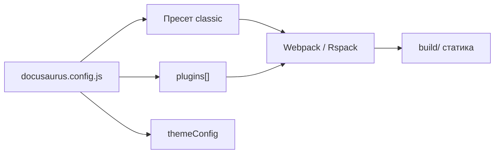

# docusaurus.config.js

> Раздел "Как устроена Вселенная IT" не нужен для обучения. Существует он только для тех, кому интересно.

<span id="docusaurus-intro"></span>

## Что такое Docusaurus

**Docusaurus** — open-source фреймворк от Meta для сайтов с упором на документацию и контент. Он собирает [Markdown](/encyclopedia/1-basics/1-15-tekst/5) и MDX из папки `docs/` в статический сайт на [React](/encyclopedia/5-languages/5-01-javascript/27), с готовой [темой](#тема), [навигацией](#docsidebar) и dev-сервером. По духу это [микрофреймворк](/encyclopedia/4-code-dev/4-04-proekt-i-freymvorki/111) поверх [экосистемы JavaScript](/encyclopedia/5-languages/5-01-javascript/25) — [Webpack](/encyclopedia/5-languages/5-01-javascript/25) или [Rspack](#rspack-bundler) режут JS на [чанки](#чанк), [React](/encyclopedia/5-languages/5-01-javascript/27) даёт [SPA](/encyclopedia/5-languages/5-01-javascript/270)-навигацию после первой загрузки.

"Вселенная IT" использует **Docusaurus 3.10** (ветка `future.v4`). Официальная документация фреймворка — на [docusaurus.io](https://docusaurus.io/); здесь разбирается **проектный** файл [конфига](#конфиг) и связь с [архитектурой](/about/kak-ustroena-vselennaya-it/arkhitektura).

Файл `docusaurus.config.js` в [корне](#корень) репозитория — **единая точка настройки** сайта. [Docusaurus](#docusaurus) читает его при `start`, `build` и [swizzle](#swizzle). Здесь задаются [URL](#url), [плагины](#плагин), [тема](#тема), редиректы, [remark](#remark)-цепочка для markdown и кастомные правила [webpack](#webpack).

---

## Как конфиг связан со сборкой



| Этап | Команда | Что читает из config |
|------|---------|----------------------|
| Dev | `npm start` | пресеты, plugins, `clientModules`, env для faster |
| Prod | `npm run build` | то же + `url`/`baseUrl` для [Sitemap](#sitemap) и метаданных |
| Тема | `npm run swizzle` | пути к `@docusaurus/theme-classic` |

См. также [package.json и стек](/about/kak-ustroena-vselennaya-it/package-i-stek) и [HTTP как основу веб-интеграций](/encyclopedia/2-system-network/2-09-osnovy-integratsionnogo-vzaimodeystviya/118).

---

## Базовые поля

```js
module.exports = {
  title: 'Вселенная IT',
  tagline: 'Единый и ультимативный гайд по IT',
  favicon: 'img/favicon.ico',

  url: 'https://spirzen.ru',
  baseUrl: '/',

  organizationName: 'Spirzen',
  projectName: 'it-knowledge-base',
  trailingSlash: false,

  onBrokenLinks: 'warn',
  // ...
};
```

| Поле | Значение в проекте | Зачем |
|------|-------------------|-------|
| `url` + `baseUrl` | Канонический домен, [корень](#корень) `/` | [Sitemap](#sitemap), [Open Graph](#open-graph), [абсолютные ссылки](#абсолютные-ссылки) |
| `trailingSlash: false` | [URL](#url) вида `/about/project` | Единый стиль без завершающего слэша — см. [адресную строку](/encyclopedia/2-system-network/2-04-kak-rabotayut-sayty-i-veb-sayty/11) |
| `onBrokenLinks: 'warn'` | [Битые ссылки](#битые-ссылки) дают предупреждение | При ~3000 статей идеальная ссылочная целостность достигается постепенно |

`title` и `tagline` попадают в метаданные [страницы](#страница) и влияют на сниппеты в поисковиках — рядом по смыслу [SEO-оптимизация](/encyclopedia/2-system-network/2-04-kak-rabotayut-sayty-i-veb-sayty/118).

---

## customFields — URL внешних сервисов

```js
const codeExamplesUrl =
  process.env.IT_CODE_EXAMPLES_URL ??
  (isProdBuild ? 'https://code.spirzen.ru' : 'http://localhost:4321');

const playExamplesUrl =
  process.env.IT_PLAY_URL ?? (isProdBuild ? 'https://play.spirzen.ru' : 'http://localhost:4322');

customFields: {
  codeExamplesUrl,
  playExamplesUrl,
},
```

[customFields](#customfields) — произвольные поля, доступные в React через `useDocusaurusContext().siteConfig.customFields`. Так [конфиг](#конфиг) передаёт [URL](#url) code/play в [embed-компоненты](#embed-компонент) без хардкода в `src/components/`.

На [локальном сервере](#локальный-сервер) (`npm start`, порт 3000) embed-сервисы по умолчанию смотрят на [порты](#порт) 4321 и 4322.

```bash
IT_CODE_EXAMPLES_URL=http://127.0.0.1:4321 IT_PLAY_URL=http://127.0.0.1:4322 npm start
```

---

## clientModules

[clientModules](#clientmodules) — массив путей к JS-модулям, которые [браузер](#браузер) выполняет на **каждой** [странице](#страница) до основного [React](#react)-дерева.

```js
clientModules: [
  require.resolve('./src/clientModules/itThemeStorageGuard.js'),
  require.resolve('./src/clientModules/itDesignThemeInit.js'),
  require.resolve('./src/clientModules/limitRoutePrefetch.js'),
],
```

| Модуль | Назначение |
|--------|------------|
| `itThemeStorageGuard` | Чистит повреждённые значения `theme*` в [localStorage](#localstorage) (защита от [цикла color mode](#цикл-color-mode)) |
| `itDesignThemeInit` | Восстанавливает [data-design](#data-design) при [клиентской навигации](#клиентская-навигация) |
| `limitRoutePrefetch` | Ограничивает [prefetch](#fetch-и-prefetch) тяжёлых [route](#route) |

Дополнительно [inline](#inline)-[скрипт](#скрипт) в плагине `it-design-theme-inject` ставит [data-design](#data-design) **до первой [отрисовки](#отрисовка)** (без [FOUC](#fouc)). Подробнее — [Темы и стили](/about/kak-ustroena-vselennaya-it/temy-i-stili) и [хранение в браузере](/encyclopedia/2-system-network/2-04-kak-rabotayut-sayty-i-veb-sayty/116).

---

## Пресет classic

[Пресет](#пресет) — готовый набор [плагинов](#плагин) и настроек одной строкой. [@docusaurus/preset-classic](https://docusaurus.io/docs/using-plugins#using-presets) включает [docs](#docs), [блог](#blog) (у нас выключен), тему classic и базовый [webpack](#webpack)-пайплайн.

```js
presets: [
  [
    'classic',
    {
      docs: {
        sidebarPath: './sidebars.js',
        routeBasePath: '/',
        numberPrefixParser: false,
        showLastUpdateTime: true,
        remarkPlugins: [
          require('./src/remark/wikiLink.js'),
          require('./src/remark/lazyMdxDemoImports.js'),
        ],
      },
      blog: false,
      theme: {
        customCss: [
          './src/css/custom.css',
          './src/css/it-design-code-overrides.css',
        ],
      },
    },
  ],
],
```

Ключевые решения [Пресета classic](#пресет-classic).

- **`routeBasePath: '/'`** — [docs](#docs) живут в [корне](#корень) сайта (`/encyclopedia/...`), см. [sidebars.js](/about/kak-ustroena-vselennaya-it/sidebars).
- **`numberPrefixParser: false`** — [префикс](#префикс) `1-03-` в имени файла сам по себе [URL](#url) не меняет; [slug](#slug) задаётся в frontmatter.
- **`blog: false`** — весь контент в `docs/`, отдельный [блог](#blog) отключён.
- **Два remark-плагина** — [wiki-ссылки](#wiki-ссылки) и [lazy-import](#lazy-import) демо ([Данные и скрипты](/about/kak-ustroena-vselennaya-it/dannye-i-skripty)).

`sidebarPath` указывает на файл бокового меню; `showLastUpdateTime` показывает дату правки из Git на [странице](#страница) статьи.

---

## Плагины

[Плагин](#плагин) в Docusaurus расширяет сборку — lifecycle-хуки, дополнительные [route](#route), правки [webpack](#webpack), [inject](#inject) в HTML.

### @docusaurus/plugin-client-redirects

Сохраняет [закладки](#закладки) после переименования [папок энциклопедии](#папки-энциклопедии).

```js
createRedirects(existingPath) {
  const fromGenerated = docLegacyRedirects[existingPath] ?? [];
  const fromManual = slugRedirects[existingPath] ?? [];
  const fromEncFolders = fromEncyclopedia ?? [];
  const merged = [...fromGenerated, ...fromManual, ...fromEncFolders];
  // ...
}
```

Три источника редиректов.

1. **`docLegacyRedirects.json`** — [автогенерация](#автогенерация) (`npm run docs:redirects`).
2. **`slugRedirects`** — ручная карта в [конфиге](#конфиг) (C language, design patterns, переименования папок).
3. **`ENCYCLOPEDIA_FOLDER_RENAMES`** — обратные редиректы со старых путей с [кириллицей](#кириллица) в имени папки.

### it-konva-canvas-fallback

```js
resolve: { fallback: { canvas: false } }
```

Библиотека Konva тянет модуль `canvas` для Node. В [браузерной](#браузер) сборке [resolve.fallback](#resolve) с `canvas: false` отключает лишний [полифилл](#полифилл). См. [Canvas 2D](/encyclopedia/5-languages/5-01-javascript/47).

### it-async-chunks

Настраивает `splitChunks` для клиента — отдельные [vendor-чанки](#vendor-чанки) [React](#react), [Docusaurus](#docusaurus), [Prism](#prism), [Mermaid](#mermaid); [async-чанки](#async-чанк) для [embed-компонентов](#embed-компонент) и остальной папки [`src/components/`](#папка-srccomponents).

### it-design-theme-inject

В `<head>` — [inline](#inline)-[скрипт](#скрипт) [data-design](#data-design), `dns-prefetch` и `preconnect` на play/code (ранний [fetch](#fetch-и-prefetch) DNS/TCP). См. [CDN и быстрая доставка](/encyclopedia/2-system-network/2-03-set-i-internet/212).

---

## themeConfig

Секция `themeConfig` настраивает визуальную [тему](#тема) `@docusaurus/theme-classic` — navbar, footer, Prism, docs sidebar.

### Документация и подсветка кода

```js
docs: {
  sidebar: { hideable: true },
},
prism: {
  additionalLanguages: [
    'bash', 'c', 'cpp', 'csharp', 'docker', 'go', 'java',
    'kotlin', 'php', 'powershell', 'python', 'rust', 'sql', 'yaml',
  ],
},
```

[Prism](#prism) — движок [подсветки](#подсветка) [блоков кода](#блоки-кода) в статьях. Список [additionalLanguages](#additionallanguages) расширяет языки поверх встроенных — иначе fenced-блок ` ```rust ` останется без раскраски.

### Navbar

```js
items: [
  { type: 'docSidebar', sidebarId: 'docsSidebar', label: 'Энциклопедия' },
  { to: '/encyclopedia/1-basics/1-03-dorozhnaya-karta-izucheniya/101', label: 'Указатель' },
  { type: 'custom-docSearch', position: 'right' },
],
```

- `docSidebar` + `sidebarId: 'docsSidebar'` — пункт меню, привязанный к боковому дереву из [sidebars.js](/about/kak-ustroena-vselennaya-it/sidebars).
- `custom-docSearch` — кастомный тип navbar; в [swizzle](#swizzle) `ComponentTypes.js` он рендерит [DocSearchBar](#docsearchbar).

### Поиск Algolia

Блок закомментирован. Вместо [SaaS](#saas)-поиска Algolia — свой JSON-[индекс](/about/kak-ustroena-vselennaya-it/arkhitektura#индекс) и [DocSearchBar](#docsearchbar) ([Данные и скрипты](/about/kak-ustroena-vselennaya-it/dannye-i-skripty)).

### Mermaid

```js
markdown: { mermaid: true },
themes: ['@docusaurus/theme-mermaid'],
```

В статьях можно писать блоки ` ```mermaid ` без [импорта](#импорт) — диаграммы рендерятся на клиенте. Теория диаграмм — [Основы диаграмм и моделирования](/encyclopedia/7-project/7-04-analitika/1231).

---

## future и Windows

```js
const isWindowsDev = process.platform === 'win32' && process.env.NODE_ENV !== 'production';
const useFasterBundler =
  process.env.IT_DOCUSAURUS_FASTER === '1' || !isWindowsDev;

future: {
  v4: true,
  faster: useFasterBundler,
},
```

[Docusaurus](#docusaurus) 4 + опциональный [Rspack bundler](#rspack-bundler) (`@docusaurus/faster`, флаг [dev faster](#dev-faster)). На Windows dev `faster` выключен по умолчанию из-за [лимита открытых файлов](#лимит-открытых-файлов) ([EMFILE](/about/kak-ustroena-vselennaya-it/arkhitektura#emfile)) при тысячах MDX. Включение — `IT_DOCUSAURUS_FASTER=1`.

Сборщик описан в контексте [Webpack и Vite](/encyclopedia/5-languages/5-01-javascript/25).

---

## i18n

```js
i18n: {
  defaultLocale: 'ru',
  locales: ['ru'],
},
```

[i18n](#i18n) (internationalization) — встроенная [локализация](#локализация) Docusaurus (отдельные папки `i18n/`, переключатель языка, дубли [route](#route)). Сейчас сайт одноязычный (русский); блок оставлен для возможного расширения. См. [локализацию в Windows](/encyclopedia/2-system-network/2-01-operatsionnaya-sistema/412) как смежную тему кодировок и символов.

---

## Типичные задачи

| Задача | Где менять |
|--------|------------|
| Добавить язык в подсветку Prism | `themeConfig.prism.additionalLanguages` |
| Новый пункт navbar | `themeConfig.navbar.items` |
| Редирект со старого URL | `slugRedirects` или `npm run docs:redirects` |
| Подключить глобальный CSS | `presets.classic.theme.customCss` |
| Изменить URL code/play | `customFields` или env `IT_CODE_EXAMPLES_URL` / `IT_PLAY_URL` |
| Новый remark-плагин | `presets.classic.docs.remarkPlugins` |
| Включить Rspack на Windows | `IT_DOCUSAURUS_FASTER=1` |

---

## Полезные команды Docusaurus

```bash
npm run docusaurus -- --help
npm run swizzle @docusaurus/theme-classic DocItem/Layout
npm run clear
```

[Swizzle](#swizzle) уже выполнен для основных компонентов — правки [темы](#тема) идут в `src/theme/`. Отладка в [браузере](/encyclopedia/4-code-dev/4-14-razrabotka-i-otladka/1116) — вкладка Network ( [fetch](#fetch-и-prefetch), [чанки](#чанк) ), Application ([localStorage](#localstorage)).

---

## Глоссарий терминов конфигурации

Краткие определения в контексте `docusaurus.config.js`. Якоря — для ссылок из других глав.

<span id="url"></span>

### URL

Адрес ресурса в сети (`https://spirzen.ru/encyclopedia/intro`). В config поля `url` и `baseUrl` задают канонический хост и путь. См. [HTTP-справочник](/encyclopedia/2-system-network/2-03-set-i-internet/611) и [адресную строку](/encyclopedia/2-system-network/2-04-kak-rabotayut-sayty-i-veb-sayty/11).

<span id="плагин"></span>

### Плагин

Модуль, расширяющий Docusaurus (редиректы, mermaid, кастомный webpack). Подключается в `plugins: []` или внутри [пресета](#пресет).

<span id="тема"></span>

### Тема

Пакет UI (navbar, sidebar, typography) — `@docusaurus/theme-classic`. Настраивается через `themeConfig` и [swizzle](#swizzle). Стили — [Темы и стили](/about/kak-ustroena-vselennaya-it/temy-i-stili).

<span id="webpack"></span>

### Webpack

Сборщик модулей — склеивает JS, CSS, assets в [бандл](/about/kak-ustroena-vselennaya-it/arkhitektura#бандл) и [чанки](#чанк). В Docusaurus 3 может быть заменён на [Rspack](#rspack-bundler). См. [экосистему JS](/encyclopedia/5-languages/5-01-javascript/25).

<span id="корень"></span>

### Корень

`baseUrl: '/'` — сайт отдаётся с домена без префикса `/docs`. [Страницы](#страница) энциклопедии — `/encyclopedia/...`.

<span id="sitemap"></span>

### Sitemap

XML-карта [URL](#url) для поисковых роботов; генерируется при `build` из `url` + `baseUrl`. Рядом по смыслу [SEO](/encyclopedia/2-system-network/2-04-kak-rabotayut-sayty-i-veb-sayty/118).

<span id="open-graph"></span>

### Open Graph

Набор meta-[тегов](#теги) (`og:title`, `og:image`) для превью ссылки в соцсетях и мессенджерах. Docusaurus подставляет их из `title`, `description`, [slug](#slug).

<span id="абсолютные-ссылки"></span>

### Абсолютные ссылки

[URL](#url) с хостом (`https://spirzen.ru/...`). Нужны в [Sitemap](#sitemap), RSS, canonical, шаринге.

<span id="битые-ссылки"></span>

### Битые ссылки

Ссылка на несуществующий [route](#route). `onBrokenLinks: 'warn'` сообщает при сборке, но не останавливает её.

<span id="customfields"></span>

### customFields

Произвольные ключи в config, доступные в React. В проекте — `codeExamplesUrl`, `playExamplesUrl`.

<span id="порт"></span>

### Порт

Число TCP-сокета ([локальный сервер](#локальный-сервер) 3000, code 4321, play 4322). Задаётся URL или env.

<span id="локальный-сервер"></span>

### Локальный сервер

`docusaurus start` — dev-сервер с hot reload на `http://localhost:3000`. Статика [продакшена](/about/kak-ustroena-vselennaya-it/arkhitektura#продакшен) — `docusaurus serve` после `build`.

<span id="clientmodules"></span>

### clientModules

Глобальные JS-модули, выполняемые в [браузере](#браузер) на каждой загрузке до [React](#react).

<span id="скрипт"></span>

### Скрипт

Фрагмент JS — файл модуля, [inline](#inline)-блок в `<head>` или npm-[скрипт](#скрипт) в `package.json`.

<span id="страница"></span>

### Страница

Один [URL](#url) сайта — статья docs, главная из `src/pages/`, generated-index категории.

<span id="браузер"></span>

### Браузер

Клиентское ПО (Chrome, Firefox…), исполняет HTML/CSS/JS. См. [движки браузеров](/encyclopedia/2-system-network/2-04-kak-rabotayut-sayty-i-veb-sayty/127).

<span id="react"></span>

### React

Библиотека UI; Docusaurus строит на ней интерактивный слой поверх статического HTML. [Справочник](/encyclopedia/5-languages/5-01-javascript/3-ecosystem/2-frontend-frameworks/1-react/271).

<span id="localstorage"></span>

### localStorage

Постоянное хранилище в [браузере](#браузер) для ключей вроде `theme`, `it-universe-design`. См. [хранение данных](/encyclopedia/2-system-network/2-04-kak-rabotayut-sayty-i-veb-sayty/116).

<span id="цикл-color-mode"></span>

### Цикл color mode

Зацикливание переключателя light/dark из-за битого значения в [localStorage](#localstorage). Лечит `itThemeStorageGuard`.

<span id="data-design"></span>

### data-design

HTML-атрибут `data-design` на `<html>` — выбранная [палитра дизайна](/about/kak-ustroena-vselennaya-it/arkhitektura#палитра-дизайна). [Inject](#inject)-плагин и client modules держат его согласованным.

<span id="клиентская-навигация"></span>

### Клиентская навигация

Переход между [route](#route) без полной перезагрузки — [SPA](/encyclopedia/5-languages/5-01-javascript/270). Docusaurus подгружает JS-[чанк](#чанк) следующей страницы.

<span id="fetch-и-prefetch"></span>

### fetch и prefetch

`fetch` — загрузка ресурса по сети. `prefetch` — заблаговременная подгрузка [route](#route); `limitRoutePrefetch` отключает её для тяжёлых разделов. См. [HTTP](/encyclopedia/2-system-network/2-09-osnovy-integratsionnogo-vzaimodeystviya/118).

<span id="inline"></span>

### inline

Код или разметка прямо в HTML (не отдельный файл) — например [скрипт](#скрипт) `data-design` в `<head>`.

<span id="inject"></span>

### inject

Вставка [тегов](#теги) в HTML на этапе сборки — хук плагина `injectHtmlTags()`.

<span id="отрисовка"></span>

### Отрисовка

Paint/layout в [браузере](#браузер) — момент, когда пользователь видит стилизованную [страницу](#страница).

<span id="fouc"></span>

### FOUC

Flash Of Unstyled Content — краткое "мигание" до применения CSS/темы. Снижается ранним [inline](#inline)-[скриптом](#скрипт) `data-design`.

<span id="пресет"></span>

### Пресет

Готовый bundle [плагинов](#плагин) и настроек — `@docusaurus/preset-classic`.

<span id="пресет-classic"></span>

### Пресет classic

Стандартный пресет Docusaurus — [docs](#docs), опциональный [блог](#blog), тема, CSS. Используется в проекте целиком.

<span id="route"></span>

### route

Маршрут приложения — соответствие [URL](#url) ↔ React-[страница](#страница). Задаётся файлами в `docs/`, `src/pages/`, [плагинами](#плагин).

<span id="префикс"></span>

### Префикс

Начало имени файла или пути (`1-03-` в `1-03-dorozhnaya-karta`). `numberPrefixParser: false` — Docusaurus не вырезает его из [URL](#url) автоматически.

<span id="require"></span>

### require

CommonJS-[импорт](#импорт) модуля в Node (`require('./sidebars.js')`). В config и remark-плагинах — обычный способ подключить локальный файл. См. [модули в JS](/encyclopedia/5-languages/5-01-javascript/40).

<span id="blog"></span>

### blog

Плагин блога Docusaurus (`@docusaurus/plugin-content-blog`). В проекте `blog: false` — новости и хронология ведутся в `docs/`.

<span id="slug"></span>

### slug

Часть [URL](#url) статьи; задаётся в frontmatter (`slug: /encyclopedia/...`) или выводится из пути файла.

<span id="docs"></span>

### docs

Плагин `@docusaurus/plugin-content-docs` — папка `docs/`, sidebar, версии. Ядро энциклопедии.

<span id="wiki-ссылки"></span>

### wiki-ссылки

Синтаксис `[[термин]]` в markdown; обрабатывает remark-плагин `wikiLink.js` и индекс `wikiLinkIndex.json`.

<span id="lazy-import"></span>

### lazy-import

Отложенный [импорт](#импорт) компонента — `import()` + обёртка `lazyDemoInView`. В MDX включается плагином `lazyMdxDemoImports.js`.

<span id="закладки"></span>

### Закладки

Сохранённые пользователем [URL](#url). Редиректы сохраняют старые пути после переезда папок.

<span id="папки-энциклопедии"></span>

### Папки энциклопедии

Иерархия `docs/encyclopedia/...` — разделы, подразделы, статьи. Переименование ломает старые [URL](#url) без plugin-client-redirects.

<span id="автогенерация"></span>

### Автогенерация

Скрипты `npm run docs:*` создают JSON (редиректы, поиск, wiki) перед сборкой.

<span id="конфиг"></span>

### Конфиг

`docusaurus.config.js` — главный файл настроек, экспортирует `module.exports = { ... }`.

<span id="кириллица"></span>

### Кириллица

Буквы русского алфавита в путях и заголовках. Старые папки энциклопедии с кириллицей в имени заменены латинскими [slug](#slug); редиректы в config сохраняют старые [закладки](#закладки).

<span id="resolve"></span>

### resolve

Секция webpack — как искать модули (`resolve.fallback` подменяет Node-модули в браузере).

<span id="canvas"></span>

### canvas

Node-модуль эмуляции [Canvas 2D](/encyclopedia/5-languages/5-01-javascript/47); для браузера не нужен — отключён в fallback.

<span id="konva"></span>

### Konva

2D-библиотека поверх canvas; тянет `canvas` в сборке — отсюда плагин `it-konva-canvas-fallback`.

<span id="fallback"></span>

### fallback

Запасной вариант [resolve](#resolve) — "если модуль не найден в браузере, подставь false/пустышку".

<span id="полифилл"></span>

### Полифилл

Код, эмулирующий API среды (Node canvas в browser bundle). Проект сознательно отключает лишние [полифиллы](#полифилл).

<span id="async"></span>

### async

Асинхронная загрузка — [чанк](#чанк) подтягивается после первого экрана (`chunks: 'async'` в splitChunks).

<span id="чанк"></span>

### Чанк

Фрагмент JS-[бандла](/about/kak-ustroena-vselennaya-it/arkhitektura#бандл), подгружаемый отдельным запросом.

<span id="vendor-чанки"></span>

### vendor-чанки

[Чанки](#чанк) из `node_modules` — `vendor-react`, `vendor-docusaurus`, `vendor-prism` в плагине `it-async-chunks`.

<span id="docusaurus"></span>

### Docusaurus

См. раздел [Что такое Docusaurus](#docusaurus-intro) выше.

<span id="prism"></span>

### Prism

Библиотека подсветки синтаксиса в [блоках кода](#блоки-кода); настраивается в `themeConfig.prism`.

<span id="mermaid"></span>

### Mermaid

Язык диаграмм в markdown; тема `@docusaurus/theme-mermaid` + `markdown.mermaid: true`.

<span id="async-чанк"></span>

### async-чанк

[Чанк](#чанк) с `chunks: 'async'` — грузится по требованию ([embed-компоненты](#embed-компонент), тяжёлые демо).

<span id="embed-компонент"></span>

### embed-компонент

React-обёртка iframe — `ExternalPlayEmbed`, `ExternalCodeEmbed`. Выделены в отдельную webpack-группу `itEmbed`.

<span id="папка-srccomponents"></span>

### Папка `src/components/`

Кастомные React-компоненты для MDX и темы; async-группа `itDemoAsync` режет их на части до ~200 KB.

<span id="теги"></span>

### Теги

HTML/meta-теги и YAML `tags` в frontmatter статей (обязательность, уровень). Open Graph — отдельный набор meta-[тегов](#теги).

<span id="подсветка"></span>

### Подсветка

Раскраска синтаксиса в code fence — [Prism](#prism) + тема Infima.

<span id="блоки-кода"></span>

### Блоки кода

Fenced blocks ` ```language ` в [Markdown](/encyclopedia/1-basics/1-15-tekst/5)/MDX.

<span id="additionallanguages"></span>

### additionalLanguages

Массив имён языков в `themeConfig.prism.additionalLanguages` — какие грамматики Prism подключить.

<span id="docsidebar"></span>

### docSidebar

Тип пункта navbar — открывает боковое дерево с `sidebarId: 'docsSidebar'`.

<span id="docsearchbar"></span>

### DocSearchBar

Кастомная строка поиска (Ctrl+K) из `src/components/DocSearch/`; тип navbar `custom-docSearch`.

<span id="swizzle"></span>

### swizzle

CLI-команда копирования компонентов темы в `src/theme/` для переопределения. См. [Компоненты](/about/kak-ustroena-vselennaya-it/komponenty).

<span id="saas"></span>

### SaaS

Software as a Service — поиск Algolia в облаке по подписке. Заменён локальным индексом. См. [облачные модели](/encyclopedia/8-infra-security/8-01-oblachnye-tehnologii/1).

<span id="импорт"></span>

### Импорт

Подключение модуля — `import` (ESM), `require` (CJS) или динамический `import()` для [lazy-import](#lazy-import).

<span id="rspack-bundler"></span>

### Rspack bundler

Быстрый сборщик, альтернатива [Webpack](#webpack); включается `future.faster` и `@docusaurus/faster`.

<span id="dev-faster"></span>

### dev faster

Режим ускоренной dev-сборки через Rspack; на Windows по умолчанию выключен.

<span id="лимит-открытых-файлов"></span>

### Лимит открытых файлов

Ограничение ОС на число одновременно открытых дескрипторов; при превышении — ошибка EMFILE. См. [Архитектура](/about/kak-ustroena-vselennaya-it/arkhitektura#emfile).

<span id="i18n"></span>

### i18n

Internationalization — механизм мультиязычности Docusaurus (`locales`, `defaultLocale`).

<span id="локализация"></span>

### Локализация

Адаптация сайта под язык и регион — переводы UI, форматы дат, отдельные [route](#route) на локаль. Сейчас одна локаль `ru`.

---

## Связь с другими главами

- [Архитектура](/about/kak-ustroena-vselennaya-it/arkhitektura) — сервисы, интеграции, общий глоссарий.
- [sidebars.js](/about/kak-ustroena-vselennaya-it/sidebars) — `sidebarPath`, `docsSidebar`.
- [Данные и скрипты](/about/kak-ustroena-vselennaya-it/dannye-i-skripty) — remark, wiki, индекс поиска.
- [Темы и стили](/about/kak-ustroena-vselennaya-it/temy-i-stili) — `customCss`, `data-design`, color mode.
- [Компоненты](/about/kak-ustroena-vselennaya-it/komponenty) — [embed-компоненты](#embed-компонент), [DocSearchBar](#docsearchbar).

## Полезные статьи энциклопедии

- [React](/encyclopedia/5-languages/5-01-javascript/27)
- [SPA и frontend-стек](/encyclopedia/5-languages/5-01-javascript/270)
- [Экосистема JavaScript — Webpack и Vite](/encyclopedia/5-languages/5-01-javascript/25)
- [Markdown в вебе](/encyclopedia/1-basics/1-15-tekst/5)
- [HTTP и веб-интеграции](/encyclopedia/2-system-network/2-09-osnovy-integratsionnogo-vzaimodeystviya/118)
- [Хранение в браузере](/encyclopedia/2-system-network/2-04-kak-rabotayut-sayty-i-veb-sayty/116)
- [SEO-оптимизация](/encyclopedia/2-system-network/2-04-kak-rabotayut-sayty-i-veb-sayty/118)
- [DevTools в браузере](/encyclopedia/4-code-dev/4-14-razrabotka-i-otladka/1116)
- [Основы диаграмм](/encyclopedia/7-project/7-04-analitika/1231)
- [Облачные сервисы (SaaS)](/encyclopedia/8-infra-security/8-01-oblachnye-tehnologii/1)
