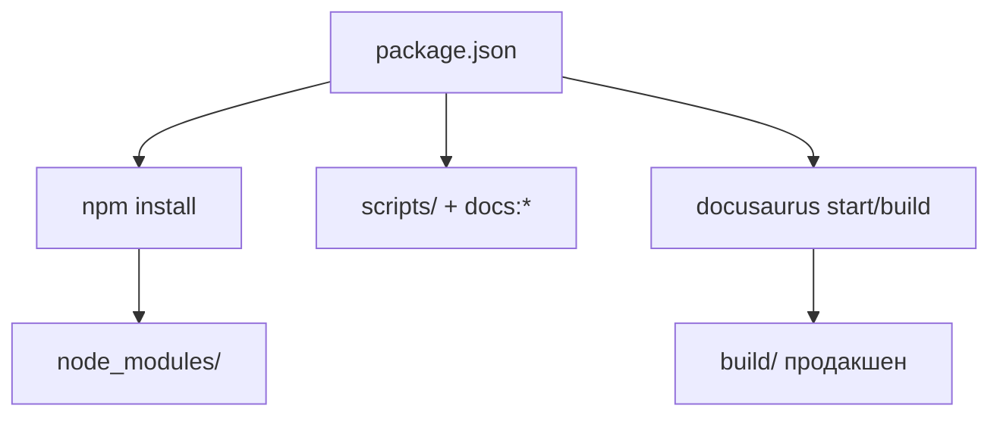

# package.json и стек

> Раздел "Как устроена Вселенная IT" не нужен для обучения. Существует он только для тех, кому интересно.

<span id="packagejson-intro"></span>

## Что такое package.json

**package.json** — главный [манифест зависимостей](/encyclopedia/4-code-dev/4-04-proekt-i-freymvorki/103) Node-проекта в формате [JSON](/encyclopedia/3-data-markup/3-04-konfiguratsii-i-dannye/3). В нём записаны имя [пакета](#пакет), версия, [npm](#npm)-[скрипты](#скрипт), списки [зависимостей](#зависимости) и требования к [Node](#node). Менеджер [npm](/encyclopedia/5-languages/5-01-javascript/265) читает файл при `npm install` и выполняет команды из секции `scripts`.

Для "Вселенной IT" [package.json](#packagejson-intro) описывает **весь [жизненный цикл](#жизненный-цикл)** сайта — от генерации [JSON-индекса](#json-индекс) до [сборки](#сборка) Docusaurus 3.10 на [React](#react) 19. Файл лежит в [корне](/about/kak-ustroena-vselennaya-it/docusaurus-config#корень) репозитория рядом с `docusaurus.config.js`.



---

## Метаданные пакета

```json
{
  "name": "it-knowledge-base",
  "version": "0.0.0",
  "private": true,
  "engines": {
    "node": ">=20.0"
  }
}
```

| Поле | Значение | Смысл |
|------|----------|-------|
| `name` | `it-knowledge-base` | Идентификатор [пакета](#пакет) в workspace |
| `version` | `0.0.0` | [Версионность](#версионность) по SemVer — сайт не публикуется в registry |
| `private` | `true` | [Приватный пакет](#приватные-пакеты), запрет случайного `npm publish` |
| `engines.node` | `>=20.0` | Минимальная версия [Node](#node) для [CLI](#cli) и [ESM-скриптов](#esm-и-esm-скрипты) |

[Метаданные](#метаданные) — "паспорт" проекта. [Мета](#мета-и-метаинформация) в широком смысле — любая служебная информация о данных (здесь — о самом репозитории и среде запуска).

---

## Скрипты жизненного цикла

Секция `"scripts"` связывает короткие команды [терминала](/encyclopedia/2-system-network/2-05-terminal/114) с цепочками задач.

| Скрипт | Что делает |
|--------|------------|
| `npm start` | wiki-index → search-index → redirects → `docusaurus start` |
| `npm run build` | collection-titles → wiki → search → redirects → `docusaurus build` |
| `npm run serve` | [Локальный просмотр](#локальный-просмотр) production-[сборки](#сборка) |
| `npm run clear` | [Очистка кэша](#кэш-и-его-очистка) `.docusaurus` |

### npm start и память

```json
"start": "... cross-env NODE_OPTIONS=--max-old-space-size=16384 docusaurus start"
```

[npm start](#npm-start) — точка входа разработчика. Перед dev-сервером гоняются обязательные `docs:*` (wiki, [поиск](#поиск), редиректы). `NODE_OPTIONS=--max-old-space-size=16384` поднимает лимит [heap](#heap-и-куча) V8 до 16 ГБ — иначе [webpack](#webpack)-[граф зависимостей](#граф-зависимостей) на ~3000 [MDX](#mdx)-файлов может оборвать процесс.

[npm run build](#build) добавляет `docs:collection-titles` — заголовки для подборок в [продакшене](#продакшен).

Команды запускают через [npm](/encyclopedia/5-languages/5-01-javascript/265) из [терминала](/encyclopedia/2-system-network/2-05-terminal/114) (PowerShell, bash). См. [CLI экосистемы JavaScript](/encyclopedia/5-languages/5-01-javascript/3-ecosystem/4-cli-tools/intro).

---

## Пайплайн контента (`docs:*`)

Папка [`scripts/`](#scripts) — [ESM](#esm-и-esm-скрипты)-модули `.mjs` на [Node](#node). Это **[пайплайн](#пайплайн) [генерации данных](#генерация-данных)** перед [сборкой](#сборка) сайта, отдельно от runtime [браузера](/about/kak-ustroena-vselennaya-it/docusaurus-config#браузер).

### Запускаются автоматически

| npm script | Файл | Результат |
|------------|------|-----------|
| `docs:wiki-links` | `build-wiki-link-index.mjs` | `wikiLinkIndex.json` |
| `docs:search-index` | `build-doc-search-index.mjs` | `doc-search-index.json` ([поиск](#поиск)) |
| `docs:redirects` | `build-doc-redirects.mjs` | `docLegacyRedirects.json` |
| `docs:collection-titles` | `generate-collection-doc-titles.mjs` | `collectionDocTitles.json` ([collection-titles](#collection-titles)) |

Скрипт [поиска](#поиск) обходит `docs/`, читает [frontmatter](#frontmatter) через [gray-matter](#gray-matter) ([транзитивная](#транзит-и-транзитивность) зависимость Docusaurus) и пишет [JSON-индекс](#json-индекс) в `static/`.

### Ручные и периодические

| npm script | Назначение |
|------------|------------|
| `docs:demo-registry` | [Реестр демо](#реестр-демо) → `info/demo-registry.md` |
| `docs:collection-crosslinks` | [Перекрёстные ссылки](#перекрёстная-ссылка) в подборках |
| `docs:context-crosslinks` | Связи контекст ↔ энциклопедия |
| `docs:toc` | Оглавление `docs/toc.md` |
| `docs:fix-mdx-imports` | Правка `import` после [frontmatter](#frontmatter) |
| `docs:fix-frontmatter-blank` | Пустая строка после `---` |
| `docs:check-article-structure` | Валидация структуры статей |
| `docs:normalize-tags` | [Нормализация](#нормализация) тегов |
| `docs:tech-icon-paths` | [SVG](#svg)-[пути](#путь) [иконок](#icon-иконка) из simple-icons |

Эти команды — **инструменты автора** [контента](#контент), они не попадают в [продакшен-бандл](#бандл) сайта.

---

<span id="dependencies-razbor"></span>

## dependencies — разбор по пакетам

Секция `dependencies` — пакеты, которые могут попасть в клиентский [бандл](#бандл) или нужны runtime [сборки](#сборка) Docusaurus.

```json
"dependencies": {
  "@docusaurus/core": "^3.10.0",
  "@docusaurus/faster": "^3.10.0",
  "@docusaurus/preset-classic": "^3.10.0",
  "@docusaurus/theme-live-codeblock": "^3.10.0",
  "@docusaurus/theme-mermaid": "^3.10.0",
  "@mdx-js/react": "^3.0.0",
  "clsx": "^2.0.0",
  "html2canvas": "^1.4.1",
  "jspdf": "^4.2.1",
  "prism-react-renderer": "^2.3.0",
  "qrcode": "^1.5.4",
  "react": "^19.0.0",
  "react-dom": "^19.0.0",
  "uuid": "^11.1.1"
}
```

Символ `^` в версии — допуск обновлений по SemVer в пределах минорной ветки (см. [npm и lock-файлы](/encyclopedia/5-languages/5-01-javascript/265)).

### Ядро Docusaurus и React

| Пакет | Роль в проекте | Энциклопедия / контекст |
|-------|----------------|-------------------------|
| `@docusaurus/core` | [CLI](#cli), dev/build сервер, [плагины](#плагин), [роутинг](#роутинг) | [Docusaurus config](/about/kak-ustroena-vselennaya-it/docusaurus-config) |
| `@docusaurus/preset-classic` | [Пресет classic](/about/kak-ustroena-vselennaya-it/docusaurus-config#пресет-classic) "из [коробки](#коробка)" — docs, тема, CSS | [Микрофреймворк](/encyclopedia/4-code-dev/4-04-proekt-i-freymvorki/111) |
| `@docusaurus/faster` | [Rspack](/about/kak-ustroena-vselennaya-it/docusaurus-config#rspack-bundler) + [SWC](#swc) ускорение | [Webpack и Vite](/encyclopedia/5-languages/5-01-javascript/25) |
| `@mdx-js/react` | Связка [MDX](#mdx) → [React](#react)-компоненты в статьях | [Markdown](/encyclopedia/1-basics/1-15-tekst/5) |
| `react` | Библиотека [UI](#ui), Virtual DOM, компоненты | [React](/encyclopedia/5-languages/5-01-javascript/27) |
| `react-dom` | [Рендер](#рендер) React в DOM ([гидратация](/about/kak-ustroena-vselennaya-it/arkhitektura#гидратация)) | [Справочник React](/encyclopedia/5-languages/5-01-javascript/3-ecosystem/2-frontend-frameworks/1-react/271) |

### Темы `@docusaurus/theme-*`

| Пакет | Роль |
|-------|------|
| `@docusaurus/theme-mermaid` | [Диаграммы](#диаграмма) Mermaid в markdown без ручного [импорта](#импорт) |
| `@docusaurus/theme-live-codeblock` | [Live code](#live-code) — исполняемые блоки в статье (используется точечно) |

Обе темы расширяют визуальный слой поверх `@docusaurus/theme-classic` (входит в preset).

### Подсветка и утилиты

| Пакет | Роль | Где в коде |
|-------|------|------------|
| `prism-react-renderer` | [Рендер](#рендер) [подсветки](#синтаксис) Prism в React | Блоки кода в статьях, связка с [Infima](#infima)/[Prism](#prism) |
| `clsx` | Склейка условных строк для `className` | `src/theme/`, компоненты |
| `html2canvas` | Снимок DOM в canvas (растр) | `exportArticlePdf.js` |
| `jspdf` | Сборка [PDF](#pdf) из изображений/страниц | Кнопка "Скачать PDF" в layout |
| `qrcode` | Генерация [QR-кода](#qr-код) | Точечно в [UI](#ui) |
| `uuid` | Уникальные строковые id | Внутренние виджеты |

[PDF](#pdf)-экспорт — клиентская фича без сервера. [QR-код](#qr-код) кодирует URL или текст в матрицу для сканирования.

---

## devDependencies

Пакеты для [сборки](#сборка), типов и [скриптов](#скрипт) — обычно **не** отдаются посетителю сайта как отдельный [бандл](#бандл).

```json
"devDependencies": {
  "@docusaurus/module-type-aliases": "^3.10.0",
  "@docusaurus/plugin-client-redirects": "^3.10.0",
  "@docusaurus/types": "^3.10.0",
  "@types/node": "^25.3.5",
  "@types/react": "^19.2.14",
  "@types/react-dom": "^19.2.3",
  "cross-env": "^10.1.0",
  "simple-icons": "^14.15.0",
  "typescript": "^5.9.3"
}
```

| Пакет | Роль |
|-------|------|
| `@docusaurus/plugin-client-redirects` | [Плагин](#плагин) редиректов (подключается в config) |
| `@docusaurus/module-type-aliases` | Типы путей `@theme/*`, `@site/*` |
| `@docusaurus/types` | Типы конфига и API Docusaurus |
| `@types/node` | Типы [Node](#node) API для TS |
| `@types/react`, `@types/react-dom` | Типы [React](#react) для [проверки типов](#проверка-типов) |
| `typescript` | Компилятор / language service TS |
| `cross-env` | Единый синтаксис env-переменных в Windows и Unix |
| `simple-icons` | Исходные бренд-[SVG](#svg) для `docs:tech-icon-paths` |

---

## browserslist

```json
"browserslist": {
  "production": [">0.5%", "not dead", "not op_mini all"],
  "development": ["last 3 chrome version", "last 3 firefox version", "last 5 safari version"]
}
```

Список целевых [браузеров](/about/kak-ustroena-vselennaya-it/docusaurus-config#браузер) для [Babel](#babelpostcss)/[PostCSS](#babelpostcss). [Таргетирование](#таргет-и-таргетирование) влияет на [полифиллы](#полифилл) и [минификацию](#минификация) [CSS](#css).

---

## Стек в одном абзаце

**[Статический сайт](#статический-сайт)** на Docusaurus 3 ([React](#react) 19, [MDX](#mdx) 3, [Webpack](#webpack) или Rspack), [кастомная](#кастомность) тема через [swizzle](#swizzle), [remark-плагины](#remark-плагины) на этапе [компиляции markdown](#компиляция-markdown), [клиентский поиск](#поиск) по [JSON-индексу](#json-индекс), внешние iframe для кода и интерактива. [TypeScript](#typescript) — в theme и utils; [контент](#контент) — [YAML](#yaml) [frontmatter](#frontmatter) и Node [ESM](#esm-и-esm-скрипты) в [`scripts/`](#scripts).

---

## Добавление зависимости

1. **[UI-библиотека](#ui-библиотека)** в статьях увеличивает [бандл](#бандл); тяжёлое лучше на play.spirzen.ru.
2. Dev-only пакеты — в `devDependencies`, если нет [импорта](#импорт) из `src/`.
3. После обновления Docusaurus — проверить `future.v4` и [major-версию](#major-версия) в [changelog](https://docusaurus.io/changelog).
4. `npm run clear && npm run build` после смены major.

Установка — `npm install <пакет>` ([npm](/encyclopedia/5-languages/5-01-javascript/265)).

---

## Глоссарий

<span id="packagejson"></span>

### package.json

См. [Что такое package.json](#packagejson-intro). Стандартный манифест npm-проекта в [JSON](/encyclopedia/3-data-markup/3-04-konfiguratsii-i-dannye/3).

<span id="пакет"></span>

### Пакет

Единица распространения в npm — модуль с `package.json`, версией и зависимостями. `it-knowledge-base` — один [приватный](#приватные-пакеты) [пакет](#пакет).

<span id="жизненный-цикл"></span>

### Жизненный цикл

Этапы от `npm install` → разработка (`start`) → [сборка](#сборка) (`build`) → деплой. Скрипты в manifest описывают переходы.

<span id="npm"></span>

### npm

Node Package Manager — установка [зависимостей](#зависимости), запуск [скриптов](#скрипт). [Практический разбор](/encyclopedia/5-languages/5-01-javascript/265).

<span id="зависимости"></span>

### Зависимости

Внешние библиотеки, без которых проект не собирается или не работает. В manifest — `dependencies` и `devDependencies`.

<span id="pdf"></span>

### PDF

Portable Document Format. В проекте — экспорт статьи через html2canvas + jspdf.

<span id="qr-код"></span>

### QR-код

Двумерный штрихкод; библиотека `qrcode` генерирует изображение из строки.

<span id="генерация-данных"></span>

### Генерация данных

Скрипты `docs:*` создают JSON/правки в `docs/` перед Docusaurus.

<span id="сборка"></span>

### Сборка

Преобразование исходников в артефакты (`build/`). `npm run build` — production [сборка](#сборка).

<span id="зависимость"></span>

### Зависимость

Один пакет, требуемый другим. Прямая — в `package.json`; [транзитивная](#транзит-и-транзитивность) — зависимость зависимости.

<span id="метаданные"></span>

### Метаданные

Данные о данных — `name`, `version`, `engines` в manifest; в статьях — [frontmatter](#frontmatter).

<span id="мета-и-метаинформация"></span>

### Мета и метаинформация

[Мета](#мета-и-метаинформация) — префикс "над" (метаданные, метаязык). Здесь — служебные поля описания проекта и статей.

<span id="приватные-пакеты"></span>

### Приватные пакеты

`"private": true` — запрет публикации в [npm registry](#npm-registry).

<span id="node"></span>

### Node

Среда выполнения JavaScript вне [браузера](/about/kak-ustroena-vselennaya-it/docusaurus-config#браузер). [Node.js](/encyclopedia/5-languages/5-01-javascript/26), требование `>=20`.

<span id="npm-registry"></span>

### npm registry

Публичный каталог пакетов npmjs.com. Проект туда не публикуется.

<span id="esm-и-esm-скрипты"></span>

### ESM и ESM-скрипты

ECMAScript Modules — `import`/`export`. Файлы `scripts/*.mjs` и современный toolchain Docusaurus. См. [модули в JS](/encyclopedia/5-languages/5-01-javascript/40).

<span id="scripts"></span>

### scripts/

Папка Node-[скриптов](#скрипт) генерации [контента](#контент) и обслуживания репозитория.

<span id="npm-start"></span>

### npm start

Команда `npm start` → подготовка индексов → `docusaurus start` (dev-сервер).

<span id="скрипт"></span>

### Скрипт

Команда в `"scripts"` manifest или файл `.mjs`/`.js` в `scripts/`.

<span id="команды-и-терминал"></span>

### Команды и терминал

Интерфейс оболочки (PowerShell, bash) для `npm run …`. [Справочник CLI](/encyclopedia/2-system-network/2-05-terminal/114).

<span id="локальный-просмотр"></span>

### Локальный просмотр

`npm run serve` — отдача папки `build/` после production-сборки на localhost.

<span id="поиск"></span>

### Поиск

`docs:search-index` → `static/doc-search-index.json` для DocSearch (Ctrl+K).

<span id="collection-titles"></span>

### collection-titles

`docs:collection-titles` → `collectionDocTitles.json` — заголовки статей в подборках.

<span id="кэш-и-его-очистка"></span>

### Кэш и его очистка

Docusaurus кэширует инкрементальную сборку в `.docusaurus/`. `npm run clear` сбрасывает кэш при странных ошибках.

<span id="heap-и-куча"></span>

### heap и куча

Область памяти V8 для объектов. `--max-old-space-size=16384` — лимит 16 ГБ для большого [графа зависимостей](#граф-зависимостей).

<span id="mdx"></span>

### MDX

Markdown + JSX — статьи с `import` React-компонентов. Расширение `.mdx` в `docs/`.

<span id="md-и-отличие-от-mdx"></span>

### MD и отличие от MDX

[MD](#md-и-отличие-от-mdx) (`.md`) — чистый [Markdown](/encyclopedia/1-basics/1-15-tekst/5). [MDX](#mdx) добавляет JSX и [импорт](#импорт) компонентов. Оба поддерживает Docusaurus.

<span id="webpack"></span>

### Webpack

Сборщик JS/CSS/assets. См. [экосистему JS](/encyclopedia/5-languages/5-01-javascript/25).

<span id="граф-зависимостей"></span>

### Граф зависимостей

Дерево [импортов](#импорт) модулей, которое [webpack](#webpack) обходит при [сборке](#сборка). Тысячи MDX раздувают граф.

<span id="контент"></span>

### Контент

Текстовые материалы в `docs/` — статьи, подборки, разделы.

<span id="пайплайн"></span>

### Пайплайн

Цепочка шагов — `docs:wiki-links` → … → `docusaurus build`.

<span id="build"></span>

### build

`npm run build` — production-команда Docusaurus; синоним [сборки](#сборка) в контексте npm.

<span id="перекрёстная-ссылка"></span>

### Перекрёстная ссылка

Ссылка между статьями/разделами; скрипты `docs:*-crosslinks` обогащают `related` и wiki.

<span id="реестр-демо"></span>

### Реестр демо

`docs:demo-registry` — каталог интерактива в `info/demo-registry.md`.

<span id="frontmatter"></span>

### frontmatter

[YAML](/encyclopedia/3-data-markup/3-04-konfiguratsii-i-dannye/4)-блок `---` в начале статьи (`title`, `description`, `tags`).

<span id="нормализация"></span>

### Нормализация

Приведение к единому виду — `docs:normalize-tags`, единый формат тегов.

<span id="svg"></span>

### SVG

Векторная графика; `docs:tech-icon-paths` вытаскивает path из simple-icons.

<span id="путь"></span>

### Путь

Строка маршрута файла (`docs/encyclopedia/...`) или SVG path в [иконке](#icon-иконка).

<span id="icon-иконка"></span>

### icon (иконка)

Глиф технологии на карточках и hero; данные в `techIconRegistry.js` / `techIconPaths.js`.

<span id="продакшен"></span>

### Продакшен

Боевая среда spirzen.ru после деплоя `build/`. См. [DevOps](/encyclopedia/8-infra-security/8-04-devops-ci-cd/intro).

<span id="бандл"></span>

### Бандл

Итоговый JS/CSS-файл(ы) для [браузера](/about/kak-ustroena-vselennaya-it/docusaurus-config#браузер). [dependencies](#зависимости) влияют на размер [бандла](#бандл).

<span id="ядро"></span>

### Ядро

`@docusaurus/core` + preset + React — минимальный каркас без утилит PDF/QR.

<span id="cli"></span>

### CLI

Command Line Interface — `docusaurus`, `npm` в [терминале](/encyclopedia/2-system-network/2-05-terminal/114).

<span id="плагин"></span>

### Плагин

Расширение Docusaurus (редиректы, mermaid). Часть пакетов `@docusaurus/plugin-*`.

<span id="роутинг"></span>

### Роутинг

Сопоставление URL ↔ страница; ядро Docusaurus строит [маршруты](/about/kak-ustroena-vselennaya-it/docusaurus-config#route) из `docs/` и `src/pages/`.

<span id="коробка"></span>

### Коробка

Готовый набор "из коробки" — preset-classic с docs и темой без ручной сборки плагинов.

<span id="swc"></span>

### SWC

Speedy Web Compiler — быстрая транспиляция TS/JS; используется с `@docusaurus/faster`.

<span id="ui"></span>

### UI

User Interface — всё, что видит пользователь; [React](#react) + [CSS](#css).

<span id="диаграмма"></span>

### Диаграмма

Mermaid-схемы в markdown через `@docusaurus/theme-mermaid`. [Основы диаграмм](/encyclopedia/7-project/7-04-analitika/1231).

<span id="live-code"></span>

### Live code

Исполняемый блок кода в статье — `@docusaurus/theme-live-codeblock`.

<span id="синтаксис"></span>

### Синтаксис

Грамматика языка в code fence; подсвечивается [Prism](#prism).

<span id="infima"></span>

### Infima

CSS-фреймворк темы Docusaurus (`--ifm-*`).

<span id="prism"></span>

### Prism

Движок подсветки кода; связка с `prism-react-renderer`.

<span id="рендер"></span>

### Рендер

Отрисовка React-дерева в DOM (`react-dom`).

<span id="css"></span>

### CSS

Каскадные стили; глобально в `src/css/`, локально — CSS modules.

<span id="css-классы"></span>

### CSS-классы

Имена классов в разметке; `clsx` собирает условные комбинации.

<span id="cross-env"></span>

### cross-env

Пакет для `NODE_OPTIONS=...` одинаково на Windows и Linux/macOS.

<span id="types"></span>

### types

Пакеты `@types/*` — описания [типов](#тип-данных) для JS-библиотек в [TypeScript](#typescript).

<span id="typescript"></span>

### TypeScript

Язык с [типами](#тип-данных); [экосистема TS](/encyclopedia/5-languages/5-10-typescript/3).

<span id="проверка-типов"></span>

### Проверка типов

Анализ TS без emit (`tsc --noEmit`, IDE) — ловит ошибки до runtime. См. [TypeScript](/about/kak-ustroena-vselennaya-it/typescript).

<span id="тип-данных"></span>

### Тип данных

Категория значений (число, строка, boolean, объект). В TS — аннотации и inference. [Типы в вычислительных системах](/encyclopedia/1-basics/1-09-dannye-i-informatsiya/3), [типизация в TS](/encyclopedia/5-languages/5-10-typescript/10).

<span id="gray-matter"></span>

### gray-matter

Парсер [YAML](/encyclopedia/3-data-markup/3-04-konfiguratsii-i-dannye/4) [frontmatter](#frontmatter) в markdown; используется в `build-doc-search-index.mjs` ([транзитивно](#транзит-и-транзитивность) через Docusaurus).

<span id="транзит-и-транзитивность"></span>

### Транзит и транзитивность

[Транзитивная зависимость](#транзит-и-транзитивность) — пакет A → B → C; `gray-matter` может не быть в корневом manifest, но установлен в `node_modules`.

<span id="browserslist"></span>

### browserslist

Конфиг целевых браузеров для [Babel](#babelpostcss)/PostCSS.

<span id="таргет-и-таргетирование"></span>

### Таргет и таргетирование

Выбор целевых сред ([браузеры](#browserslist), ES-версия) при транспиляции.

<span id="минификация"></span>

### Минификация

Сжатие JS/CSS (удаление пробелов, короткие имена) в production [сборке](#сборка).

<span id="полифилл"></span>

### Полифилл

Подстановка API для старых [браузеров](/about/kak-ustroena-vselennaya-it/docusaurus-config#браузер); выбор через [browserslist](#browserslist).

<span id="babelpostcss"></span>

### Babel/PostCSS

Babel — транспиляция JS; PostCSS — обработка [CSS](#css) (autoprefixer и др.).

<span id="статический-сайт"></span>

### Статический сайт

HTML/JS/CSS генерируются при [build](#build), сервер отдаёт файлы. См. [Архитектура](/about/kak-ustroena-vselennaya-it/arkhitektura).

<span id="кастомность"></span>

### Кастомность

Отличия от шаблона — swizzle, `src/`, remark, DocSearch.

<span id="swizzle"></span>

### swizzle

Копирование компонентов темы в `src/theme/` для правок.

<span id="remark-плагины"></span>

### remark-плагины

Обработчики markdown на этапе [компиляции](#компиляция-markdown) (`wikiLink`, `lazyMdxDemoImports`).

<span id="компиляция-markdown"></span>

### Компиляция markdown

Преобразование `.md`/`.mdx` в JS-модули и HTML при `start`/`build`.

<span id="json-индекс"></span>

### JSON-индекс

Файл [JSON](/encyclopedia/3-data-markup/3-04-konfiguratsii-i-dannye/3) с записями для поиска или wiki (`doc-search-index.json`).

<span id="yaml"></span>

### YAML

Формат [конфигурации](/encyclopedia/3-data-markup/3-04-konfiguratsii-i-dannye/4) и [frontmatter](#frontmatter); отступы важны.

<span id="ui-библиотека"></span>

### UI-библиотека

Готовый набор React-компонентов (Material, Chakra…). Каждая тянет [бандл](#бандл) — в энциклопедии используются точечно.

<span id="версионность"></span>

### Версионность

Схема версий пакета (SemVer `major.minor.patch`). `^3.10.0` допускает 3.10.x и 3.11.0, но не 4.0.0.

<span id="major-версия"></span>

### major-версия

Первая цифра SemVer — возможны breaking changes (Docusaurus 3 → 4).

<span id="импорт"></span>

### Импорт

Подключение модуля — `import` (ESM) или `require` (CJS).

<span id="react"></span>

### React и react-dom

См. таблицу [ядра](#ядро) выше; `react-dom` монтирует дерево в страницу.

<span id="утилиты-runtime"></span>

### clsx, html2canvas, jspdf, qrcode, uuid

Мелкие библиотеки для [CSS-классов](#css-классы), [PDF](#pdf), [QR](#qr-код), id — см. [разбор dependencies](#dependencies-razbor).

---

## Связь с другими главами

- [Архитектура](/about/kak-ustroena-vselennaya-it/arkhitektura) — сервисы, [бандл](#бандл), [продакшен](#продакшен).
- [docusaurus.config.js](/about/kak-ustroena-vselennaya-it/docusaurus-config) — как пакеты подключаются в config.
- [Данные и скрипты](/about/kak-ustroena-vselennaya-it/dannye-i-skripty) — детали `docs:*`.
- [TypeScript](/about/kak-ustroena-vselennaya-it/typescript) — `tsconfig` и [проверка типов](#проверка-типов).

## Полезные статьи энциклопедии

- [Манифесты зависимостей — package.json](/encyclopedia/4-code-dev/4-04-proekt-i-freymvorki/103)
- [npm — команды и зависимости](/encyclopedia/5-languages/5-01-javascript/265)
- [Node.js](/encyclopedia/5-languages/5-01-javascript/26)
- [Webpack и экосистема JS](/encyclopedia/5-languages/5-01-javascript/25)
- [JSON](/encyclopedia/3-data-markup/3-04-konfiguratsii-i-dannye/3)
- [YAML](/encyclopedia/3-data-markup/3-04-konfiguratsii-i-dannye/4)
- [Markdown](/encyclopedia/1-basics/1-15-tekst/5)
- [Типы данных](/encyclopedia/1-basics/1-09-dannye-i-informatsiya/3)
- [TypeScript — экосистема](/encyclopedia/5-languages/5-10-typescript/3)
- [CLI и терминал](/encyclopedia/2-system-network/2-05-terminal/114)
- [DevOps, CI/CD](/encyclopedia/8-infra-security/8-04-devops-ci-cd/intro)
