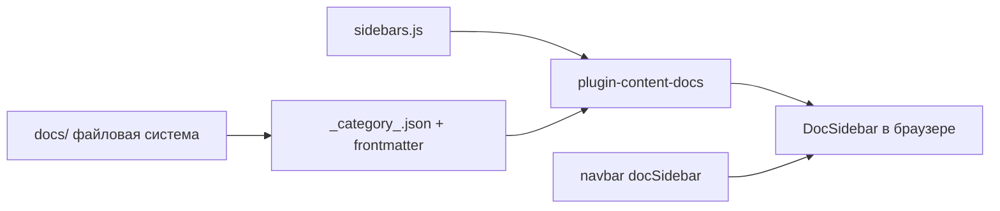
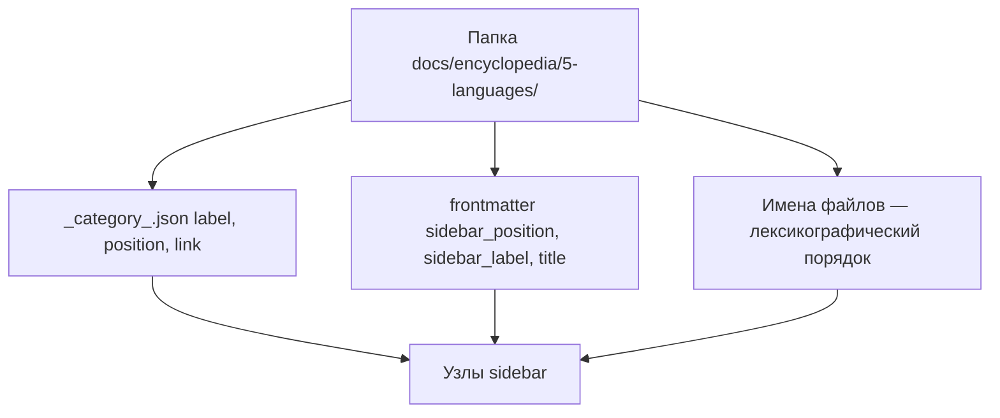

# sidebars.js

<span id="sidebars-intro"></span>

## Что такое sidebars.js

**sidebars.js** — конфигурационный файл Docusaurus в [корне](/about/kak-ustroena-vselennaya-it/docusaurus-config#корень) репозитория. Он описывает **левое [боковое меню](#сайдбар)** ([sidebar](#сайдбар)) для плагина [документации](#документация) — какие [статьи](#статья) и [категории](#категория) показывать, в каком порядке и куда ведёт клик по заголовку группы.

Без `sidebars.js` тысячи файлов в `docs/` остались бы доступны только по прямому [URL](#slug), без пункта в навигации. Файл связывают с [navbar](#navbar) через `sidebarPath: './sidebars.js'` в [docusaurus.config.js](/about/kak-ustroena-vselennaya-it/docusaurus-config) и `sidebarId: 'docsSidebar'`.



[Документация](#документация) в Docusaurus — это всё содержимое `docs/` (markdown, MDX, метаданные). [Боковое меню](#боковое-меню) — визуальное дерево слева на [странице](#страница) статьи; оно строится из `sidebars.js` плюс правил [autogenerated](#autogenerated).

---

## Структура файла

```js
// sidebars.js
const sidebars = {
  docsSidebar: [
    // массив категорий и документов
  ],
};

export default sidebars;
```

| Элемент | Роль |
|---------|------|
| `const sidebars` | Объект с одним или несколькими именованными sidebar |
| `docsSidebar` | [id](#id-документа) sidebar — на него ссылается [navbar](#navbar) |
| `[...]` | [Массив](#массив) корневых пунктов меню |
| `export default` | [ESM-экспорт](/encyclopedia/5-languages/5-01-javascript/26) — Docusaurus 3 читает `.js` с `export default` так же, как [ESM-скрипты](/about/kak-ustroena-vselennaya-it/package-i-stek#esm-и-esm-скрипты) в `scripts/` |

<span id="export-и-export-default"></span>

### export и export default

В [JavaScript-модулях](/encyclopedia/5-languages/5-01-javascript/40) **`export`** выставляет имена наружу, **`export default`** — главное значение модуля. При `import sidebars from './sidebars.js'` подтягивается объект `{ docsSidebar: [...] }`. Один default на файл — типичный стиль конфигов Node и Docusaurus.

---

## Связь с navbar и маршрутами

В [themeConfig](/about/kak-ustroena-vselennaya-it/docusaurus-config#themeconfig) пункт "Энциклопедия" имеет тип `docSidebar`.

```js
{
  type: 'docSidebar',
  sidebarId: 'docsSidebar',
  position: 'left',
  label: 'Энциклопедия',
}
```

При открытии doc-layout Docusaurus подставляет дерево `docsSidebar`. Опция `routeBasePath: '/'` в [пресете classic](/about/kak-ustroena-vselennaya-it/docusaurus-config#пресет-classic) превращает [id документа](#id-документа) в [URL](#slug) от корня (`/about/project`, `/encyclopedia/intro`).

Страница, которой нет ни в ручном [items](#items), ни в папке [autogenerated](#autogenerated), **всё равно собирается** (если лежит в `docs/`), но остаётся только по прямой ссылке или из поиска.

---

## Верхний уровень меню

Сейчас в `docsSidebar` восемь корневых блоков — семь [категорий](#категория) и один одиночный документ.

| Категория | `dirName` / якорь | Как заданы `items` |
|-----------|-------------------|-------------------|
| [О проекте](#about) | `about/*` | [Ручная категория](#ручная-категория) + вложенная autogenerated |
| Энциклопедия | `encyclopedia` | autogenerated |
| Инструменты | `tools` | autogenerated |
| Глоссарий | `glossary` | autogenerated |
| Лаборатория | `lab` | autogenerated |
| Контекст | `context` | autogenerated |
| Философия | `philosophy` | autogenerated |
| Общее содержание | `toc` | один `type: 'doc'` |

Корневой [массив](#массив) — это **упорядоченный [список](#список)**. Порядок объектов в `sidebars.js` задаёт порядок разделов в sidebar сверху вниз.

---

## Поля узла sidebar

Каждый пункт меню — объект с полем **`type`** или короткая строка-id документа.

| `type` | Назначение | Ключевые поля |
|--------|------------|---------------|
| `category` | Раскрывающаяся [категория](#категория) | `label`, `link`, `items` |
| `doc` | Один документ без группы | `id`, `label` |
| `autogenerated` | Дерево из папки `docs/` | `dirName` |
| строка `'about/project'` | Сокращение для `type: 'doc'` | путь-id относительно `docs/` |

<span id="label"></span>

### label

Текст в [боковом меню](#боковое-меню). Для autogenerated подпись [категории](#категория) чаще берётся из [`_category_.json`](#_category_json) или `title` / [`sidebar_label`](#sidebar_label) в [frontmatter](/about/kak-ustroena-vselennaya-it/package-i-stek#frontmatter).

<span id="link"></span>

### link

Опциональная ссылка при клике на заголовок [категории](#категория) (стрелка раскрытия работает отдельно).

```js
link: { type: 'doc', id: 'about/project' }
```

| `link.type` | Поведение |
|-------------|-----------|
| `doc` | Открывает указанный документ по [id](#id-документа) |
| `generated-index` | Автоматическая страница-оглавление раздела (см. [_category_.json](#_category_json)) |

Без `link` заголовок категории только раскрывает [список](#список) дочерних пунктов.

<span id="items"></span>

### items

[Массив](#массив) дочерних элементов — строки-id, вложенные `category`, блоки `autogenerated`. Это **дерево [категорий](#дерево-категорий)** в JSON-подобной структуре на [JavaScript](/encyclopedia/5-languages/5-01-javascript/27).

---

<span id="ручная-категория"></span>

## Ручная категория "О проекте"

Раздел [about](#about) собран вручную — порядок страниц "О проекте" не полностью доверен файловой системе.

```js
{
  type: 'category',
  label: 'О проекте',
  link: { type: 'doc', id: 'about/project' },
  items: [
    'about/project',
    'about/collections',
    'about/collections/pervye-shagi',
    'about/interactive',
    'about/author',
    'about/license',
    'about/manifest',
    {
      type: 'category',
      label: 'Как устроена Вселенная IT',
      link: { type: 'doc', id: 'about/kak-ustroena-vselennaya-it/index' },
      items: [
        { type: 'autogenerated', dirName: 'about/kak-ustroena-vselennaya-it' },
      ],
    },
  ],
},
```

| Решение | Зачем |
|---------|-------|
| Явный [список](#список) `items` | Фиксированный порядок статей about вне алфавита папки |
| `link` на `about/project` | Клик по "О проекте" открывает [индекс](#index) раздела |
| Вложенная autogenerated | Подраздел "Как устроена Вселенная IT" растёт по файлам в папке без правки каждой главы вручную |

Остальные корневые разделы (энциклопедия, lab, tools…) используют только **`{ type: 'autogenerated', dirName: '...' }`** — [автоматический подбор](#autogenerated) всего дерева папки.

---

<span id="autogenerated"></span>

## autogenerated — дерево из файловой системы

```js
{
  type: 'autogenerated',
  dirName: 'encyclopedia',
}
```

Docusaurus сканирует `docs/encyclopedia/` и строит [дерево категорий](#дерево-категорий) по папкам и файлам. **Автоматический подбор** не дублирует тысячи строк в `sidebars.js` — структура энциклопедии живёт в каталогах и метаданных.

Источники порядка и подписей (по приоритету Docusaurus).

1. **`position`** в [`_category_.json`](#_category_json) папки — [позиция](#позиция) категории среди соседей.
2. **`sidebar_position`** в [frontmatter](#frontmatter) файла — порядок статей внутри папки.
3. **[Лексикографический](#лексикография) порядок** [имён файлов](#имя-файла) и папок — если `sidebar_position` / `position` не заданы.

### Алфавитный порядок файлов в папке

Если у двух соседних `.md` нет `sidebar_position`, они сортируются **как строки по алфавиту** (locale-aware сравнение), в том порядке, в каком имена лежат в каталоге ОС. Поэтому в "Как устроена Вселенная IT" главы названы `01-arkhitektura.md`, `02-docusaurus-config.md`… — префиксы `01-`, `02-` держат логическую последовательность при [лексикографии](#лексикография).

В энциклопедии папки и файлы именуют латиницей (`5-01-javascript`, `1-basics`) — стабильный порядок на Windows и Linux и предсказуемые [slug](#slug).



---

<span id="_category_json"></span>

## JSON-метаданные папок — _category_.json

В каждой папке `docs/` может лежать **`_category_.json`** — [JSON](/encyclopedia/3-data-markup/3-04-konfiguratsii-i-dannye/3)-файл с метаданными для [autogenerated](#autogenerated). Sidebar и Docusaurus читают его при сборке дерева.

Пример корня энциклопедии.

```json
{
  "label": "Энциклопедия",
  "link": {
    "type": "generated-index",
    "title": "Энциклопедия"
  }
}
```

Пример вложенного раздела "Как устроена Вселенная IT".

```json
{
  "label": "Как устроена Вселенная IT",
  "position": 8,
  "link": {
    "type": "doc",
    "id": "about/kak-ustroena-vselennaya-it/index"
  }
}
```

| Поле | Смысл |
|------|-------|
| `label` | Подпись [категории](#категория) в [sidebar](#сайдбар) |
| `position` | [Позиция](#позиция) среди соседних папок (меньше — выше) |
| `link` | Куда ведёт клик по заголовку категории |
| `collapsed` | Свернута ли группа по умолчанию (если задано) |

`generated-index` создаёт страницу-оглавление со [списком](#список) дочерних документов — как у "Лаборатория" и корня "Энциклопедия". `link.type: 'doc'` открывает конкретный [index](#index)-файл.

---

<span id="index-i-intro"></span>

## index, intro и страницы "о разделе"

| Файл | Типичная роль | Пример в проекте |
|------|---------------|------------------|
| **`index.md` / `index.mdx`** | [Индекс](#index) подпапки, вход в раздел | `about/kak-ustroena-vselennaya-it/index.mdx` |
| **`intro.md`** | Вводная "о разделе", часто с `DocCardList` | `encyclopedia/intro.md`, `lab/intro.md` |
| **`project.md`** | Главная страница раздела about | `about/project.md` |

**index** — оглавление или обзор папки; в [id](#id-документа) попадает как `.../index`. **intro** — соглашение имени для вводных статей верхнего уровня раздела; в `sidebars.js` на них вешают `link` корневых категорий (`encyclopedia/intro`, `lab/intro`).

Для "Как устроена Вселенная IT" [index.mdx](/about/kak-ustroena-vselennaya-it) задаёт `sidebar_position: 0` и [slug](#slug) `/about/kak-ustroena-vselennaya-it`, чтобы оглавление раздела шло первым в autogenerated-дереве.

---

<span id="slug"></span>

## slug, путь, имя файла и id документа

Три понятия часто путают — у каждого своя роль.

| Понятие | Что это | Пример |
|---------|---------|--------|
| **[Путь](#путь)** | Расположение файла в `docs/` | `docs/about/kak-ustroena-vselennaya-it/04-sidebars.md` |
| **[Имя файла](#имя-файла)** | Последний сегмент пути с расширением | `04-sidebars.md` |
| **[id документа](#id-документа)** | Путь без `docs/` и без расширения — ключ в sidebar и `link.id` | `about/kak-ustroena-vselennaya-it/04-sidebars` |
| **[slug](#slug)** | Часть [URL](/about/kak-ustroena-vselennaya-it/docusaurus-config#slug) в браузере; задаётся в frontmatter | `/about/kak-ustroena-vselennaya-it/sidebars` |

```yaml
---
title: sidebars.js
sidebar_position: 4
slug: /about/kak-ustroena-vselennaya-it/sidebars
---
```

**slug переопределяет URL, id остаётся привязанным к файлу.** В sidebar и в `link: { type: 'doc', id: '...' }` всегда используют **id**, в адресной строке — **slug** (если указан).

В [docusaurus.config.js](/about/kak-ustroena-vselennaya-it/docusaurus-config) `numberPrefixParser: false` — числовые префиксы вроде `01-` в имени файла **не вырезаются** автоматически из id; для красивого URL префикс убирают через явный `slug` (`01-arkhitektura.md` → `/about/.../arkhitektura`).

| Файл | id | slug (URL) |
|------|-----|------------|
| `docs/about/project.md` | `about/project` | по умолчанию `/about/project` |
| `docs/encyclopedia/intro.md` | `encyclopedia/intro` | `/encyclopedia/intro` |
| `docs/about/kak-ustroena-vselennaya-it/01-arkhitektura.md` | `about/kak-ustroena-vselennaya-it/01-arkhitektura` | `/about/kak-ustroena-vselennaya-it/arkhitektura` |

---

<span id="sidebar_position"></span>

## sidebar_position и sidebar_label

В [frontmatter](/about/kak-ustroena-vselennaya-it/package-i-stek#frontmatter) статьи.

```yaml
sidebar_position: 4
sidebar_label: "Короткая подпись в меню"
```

| Поле | Эффект |
|------|--------|
| `sidebar_position` | Числовая [позиция](#позиция) среди соседей в одной папке; **меньше — выше** |
| `sidebar_label` | Текст пункта в sidebar вместо `title` |
| `title` | Заголовок страницы и запасная подпись в меню, если `sidebar_label` нет |

Пример энциклопедии — `encyclopedia/intro.md` с `sidebar_label: "Энциклопедия — о разделе"` при `title` той же формулировки.

Изменить подпись **без переименования файла** — править `sidebar_label` или `label` в `_category_.json`.

---

## Одиночный документ без категории

```js
{
  type: 'doc',
  id: 'toc',
  label: 'Общее содержание',
}
```

`id: 'toc'` → файл `docs/toc.md`. Такой пункт стоит в корне [массива](#массив) `docsSidebar` рядом с [категориями](#категория), без раскрывающейся группы.

---

## Типичные задачи

### Добавить статью в "О проекте"

Положить файл в `docs/about/` и добавить строку в `items` **или** положить в папку с autogenerated (как главы "Как устроена Вселенная IT").

```js
'about/my-new-page',
```

### Новый корневой раздел

```js
{
  type: 'category',
  label: 'Новый раздел',
  link: { type: 'doc', id: 'new-section/intro' },
  items: [{ type: 'autogenerated', dirName: 'new-section' }],
},
```

Создать `docs/new-section/intro.md` и при необходимости `docs/new-section/_category_.json`.

### Скрыть файл из sidebar, но оставить URL

Исключить из `items` и из autogenerated-папки — редкий приём; чаще используют черновик или отдельный маршрут в `src/pages/`.

### Поменять порядок в autogenerated-папке

Задать `sidebar_position` в frontmatter или переименовать файлы с учётом [лексикографии](#лексикография) (`01-`, `02-`…).

---

## Ограничения autogenerated

- Глубокие деревья (энциклопедия ~3000 статей) **тяжёлые для dev** — sidebar пересобирается при старте.
- Смешение кириллицы и латиницы в именах папок даёт разный порядок на разных ОС — в проекте пути латиницей.
- Дубликаты [id](#id-документа) недопустимы — один файл, один id.
- Документ вне sidebar всё ещё в сборке и в [поиске](/about/kak-ustroena-vselennaya-it/package-i-stek#поиск), но без пункта в меню.

---

<span id="глоссарий"></span>

## Глоссарий

<span id="sidebarsjs"></span>

### sidebars.js

Файл конфигурации левого меню документации Docusaurus; экспортирует объект sidebar (в проекте — `docsSidebar`).

<span id="сайдбар"></span>

### Сайдбар

**Sidebar** — боковая панель навигации по разделу docs. В коде темы — компонент `DocSidebar` ([Структура src/](/about/kak-ustroena-vselennaya-it/struktura-src)).

<span id="документация"></span>

### Документация

В контексте Docusaurus — контент плагина `@docusaurus/plugin-content-docs`, каталог `docs/`, sidebar, версии. См. [docs в конфиге](/about/kak-ustroena-vselennaya-it/docusaurus-config#docs).

<span id="боковое-меню"></span>

### Боковое меню

Русскоязычное название [sidebar](#сайдбар) — вертикальный [список](#список) [категорий](#категория) и [статей](#статья) слева от текста статьи.

<span id="navbar"></span>

### navbar

Верхняя панель сайта — секция `themeConfig.navbar` в [docusaurus.config.js](/about/kak-ustroena-vselennaya-it/docusaurus-config). Пункт [docSidebar](/about/kak-ustroena-vselennaya-it/docusaurus-config#docsidebar) привязывает layout к `sidebarId: 'docsSidebar'`.

<span id="категория"></span>

### Категория

Группа пунктов меню с `type: 'category'` — раскрывающийся узел [дерева](#дерево-категорий). В файловой системе — обычно подпапка `docs/.../`.

<span id="статья"></span>

### Статья

Один документ `.md` / `.mdx` в `docs/`; в sidebar — лист дерева или строка-id в `items`.

<span id="autogenerated-глоссарий"></span>

### autogenerated

Режим `{ type: 'autogenerated', dirName: '...' }` — Docusaurus сам строит поддерево из папки по `_category_.json`, frontmatter и именам файлов.

<span id="автоматический-подбор"></span>

### Автоматический подбор

Синоним логики autogenerated — содержимое папки становится пунктами меню без ручного перечисления каждого файла.

<span id="export"></span>

### export

Ключевое слово ES-модуля для именованного экспорта (`export const x`).

<span id="export-default"></span>

### export default

Главный экспорт модуля; в `sidebars.js` — объект `sidebars`.

<span id="about"></span>

### about

Раздел `docs/about/` — "О проекте"; в sidebar задан [ручной списком](#ручная-категория) с вложенным техническим подразделом.

<span id="ручная-категория-глоссарий"></span>

### Ручная категория

Категория, чьи `items` перечислены явно в `sidebars.js` (в дополнение к autogenerated).

<span id="index"></span>

### index

Файл `index.md` / `index.mdx` — входная страница папки; id `папка/index`.

<span id="intro"></span>

### intro

Соглашение имени вводной статьи раздела (`intro.md`); часто цель `link` корневой категории в sidebar.

<span id="список"></span>

### Список

Упорядоченная последовательность элементов; в sidebar — `items` категории или корневой массив `docsSidebar`.

<span id="массив"></span>

### Массив

Структура данных JSON/JavaScript `[a, b, c]`; корень `docsSidebar` и поле `items` — [массивы](/encyclopedia/3-data-markup/3-04-konfiguratsii-i-dannye/3). См. раздел про массивы в статье [JSON](/encyclopedia/3-data-markup/3-04-konfiguratsii-i-dannye/3).

<span id="items-глоссарий"></span>

### items

Поле категории — дочерние узлы sidebar (строки, category, autogenerated).

<span id="label-глоссарий"></span>

### label

Отображаемый текст пункта или заголовка категории в меню.

<span id="type"></span>

### type

Дискриминатор вида узла sidebar — `category`, `doc`, `autogenerated`.

<span id="link-глоссарий"></span>

### link

Объект `{ type, id? / title? }` — куда ведёт клик по заголовку категории.

<span id="дерево-категорий"></span>

### Дерево категорий

Иерархия папок `docs/` и узлов sidebar — корень, ветви, листья-документы.

<span id="лексикография"></span>

### Лексикография

**Лексикографический порядок** — сортировка строк по алфавиту (как в словаре). Docusaurus использует его для имён файлов без `sidebar_position`.

<span id="позиция"></span>

### Позиция

Число `position` / `sidebar_position` — место элемента в списке (меньше — выше).

<span id="id-документа"></span>

### id документа

Уникальный ключ документа — путь от `docs/` без расширения; используется в sidebar, `link.id`, внутренних ссылках Docusaurus.

<span id="slug-глоссарий"></span>

### slug

Путь URL страницы; переопределяется в frontmatter, не меняя id. Подробнее в [docusaurus.config](/about/kak-ustroena-vselennaya-it/docusaurus-config#slug).

<span id="путь"></span>

### Путь

Полный маршрут к файлу в репозитории или сегменты URL; в sidebar id совпадает с логическим путём внутри `docs/`.

<span id="имя-файла"></span>

### Имя файла

Последний компонент пути (`04-sidebars.md`); влияет на id и на [лексикографический](#лексикография) порядок.

<span id="_category_json-глоссарий"></span>

### _category_.json

JSON-метаданные папки для autogenerated — `label`, `position`, `link`, `collapsed`.

<span id="sidebar_label"></span>

### sidebar_label

Поле frontmatter — подпись пункта в sidebar без смены `title` страницы.

<span id="страница"></span>

### Страница

Собранный HTML/MDX-документ с URL; пункт sidebar ведёт на страницу по slug.

---

## Связь с другими главами

- [docusaurus.config.js](/about/kak-ustroena-vselennaya-it/docusaurus-config) — `sidebarPath`, `routeBasePath`, `numberPrefixParser`, navbar `docSidebar`.
- [Архитектура](/about/kak-ustroena-vselennaya-it/arkhitektura) — навигация между сервисами и разделами сайта.
- [Структура src/](/about/kak-ustroena-vselennaya-it/struktura-src) — swizzle `DocSidebar`, resize, fallback.
- [package.json и стек](/about/kak-ustroena-vselennaya-it/package-i-stek) — `npm start`, сборка, frontmatter в пайплайне поиска.

## Полезные статьи энциклопедии

- [Markdown и текст в веб](/encyclopedia/1-basics/1-15-tekst/5)
- [JSON — объекты и массивы](/encyclopedia/3-data-markup/3-04-konfiguratsii-i-dannye/3)
- [YAML — конфигурации](/encyclopedia/3-data-markup/3-04-konfiguratsii-i-dannye/4)
- [JavaScript — модули import/export](/encyclopedia/5-languages/5-01-javascript/40)
- [Node.js — runtime и ESM](/encyclopedia/5-languages/5-01-javascript/26)
- [Структура Node-проекта](/encyclopedia/5-languages/5-01-javascript/3-ecosystem/1-runtime-node/266)
- [Веб-сайты и маршрутизация](/encyclopedia/2-system-network/2-04-kak-rabotayut-sayty-i-veb-sayty/intro)
- [Структура каталогов в разработке](/encyclopedia/4-code-dev/4-14-razrabotka-i-otladka/116)
- [Основы архитектуры ПО](/encyclopedia/4-code-dev/4-04-proekt-i-freymvorki/112)
