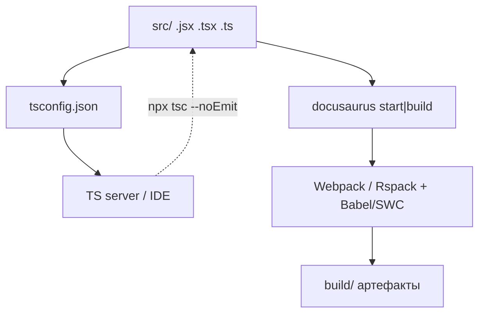
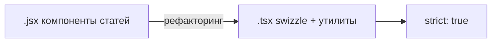

# TypeScript

> Раздел "Как устроена Вселенная IT" не нужен для обучения. Существует он только для тех, кому интересно.

<span id="typescript-intro"></span>

## Что такое TypeScript и JavaScript

**JavaScript** — язык программирования в браузере и в [Node.js](/encyclopedia/5-languages/5-01-javascript/26). В "Вселенной IT" на нём написаны [React](/encyclopedia/5-languages/5-01-javascript/27)-[компоненты](#jsx), конфиги Docusaurus, remark-плагины и [ESM-скрипты](/about/kak-ustroena-vselennaya-it/package-i-stek#esm-и-esm-скрипты) в `scripts/`. Подробнее — [основы JavaScript](/encyclopedia/5-languages/5-01-javascript/1) и [экосистема JS](/encyclopedia/5-languages/5-01-javascript/25).

**TypeScript** — надстройка над JavaScript со **статической [типизацией](#типизация)**. Компилятор `tsc` и [TS server](#ts-server) проверяют совместимость данных **до запуска** в браузере, IDE подсказывает поля и сигнатуры. TypeScript **стирается при [сборке](#сборка)** — в [продакшен-бандл](/about/kak-ustroena-vselennaya-it/package-i-stek#бандл) попадает обычный JS. Обзор в энциклопедии — [TypeScript в курсе JS](/encyclopedia/5-languages/5-01-javascript/30), углублённо — [типы и типизация](/encyclopedia/5-languages/5-10-typescript/10).

В it-knowledge-base **большая часть UI остаётся на JSX**, TypeScript подключён для [типобезопасности](#типобезопасность) в [swizzle-теме](#swizzle-тема), [утилитах](#утилита) [дизайна](#дизайн) и постепенной [миграции](#миграция). [Сборку](#сборка) ведёт Docusaurus ([Babel](#babelswc)/[SWC](#babelswc) через [Webpack](/about/kak-ustroena-vselennaya-it/docusaurus-config#webpack) или Rspack), отдельный `tsc --emit` для деплоя **не нужен**.



---

<span id="настройка-ts"></span>

## Как настраивается TypeScript в проекте

Точка входа — **`tsconfig.json`** в [корне](/about/kak-ustroena-vselennaya-it/docusaurus-config#корень) репозитория. Файл говорит компилятору, **какие файлы анализировать**, какие версии JS и DOM считать доступными, как обрабатывать [JSX](#jsx) и [модули](#isolatedmodules-и-модули).

Дополнительные слои типов.

| Файл | Роль |
|------|------|
| `tsconfig.json` | Основные [compilerOptions](#compileroptions) |
| `src/types.d.ts` | Ссылки на типы Docusaurus (`@docusaurus/module-type-aliases`) |
| `src/docusaurus-shims.d.ts` | Заглушки для `@theme/*`, `html2canvas`, `jspdf` |
| `package.json` → `devDependencies` | `typescript`, `@types/react`, `@types/node` |

Запуск проверки вручную (в IDE [TS server](#ts-server) делает это постоянно).

```bash
npx tsc --noEmit
```

Официальная `npm run build` **не вызывает** `tsc` — падение [сборки](#сборка) из-за типов возможно только после добавления шага CI с `tsc --noEmit`.

---

<span id="tsconfigjson"></span>

## tsconfig.json

```json
{
  "compilerOptions": {
    "target": "ES2020",
    "lib": ["DOM", "DOM.Iterable", "ES2020"],
    "module": "ESNext",
    "moduleResolution": "Bundler",
    "jsx": "react-jsx",
    "allowJs": true,
    "checkJs": false,
    "resolveJsonModule": true,
    "isolatedModules": true,
    "noEmit": true,
    "skipLibCheck": true,
    "strict": false,
    "types": ["node", "@docusaurus/module-type-aliases"]
  },
  "include": ["src/**/*", "docusaurus.config.js", "sidebars.js"]
}
```

Справочник по полям в энциклопедии — [tsconfig в справочнике 301](/encyclopedia/5-languages/5-01-javascript/301), [форматы и подключение TS](/encyclopedia/5-languages/5-10-typescript/9).

---

<span id="compileroptions"></span>

## compilerOptions — разбор

| Опция | Значение | Практический смысл |
|-------|----------|-------------------|
| `target` | `ES2020` | Версия JS, на которую ориентируется проверка (реальную транспиляцию делает [Babel/SWC](#babelswc)) |
| `lib` | `DOM`, `DOM.Iterable`, `ES2020` | Какие встроенные API TypeScript "знает" — `document`, `fetch`, итераторы |
| `module` | `ESNext` | Синтаксис [ESM](/encyclopedia/5-languages/5-01-javascript/40) `import`/`export` |
| `moduleResolution` | `Bundler` | Разрешение импортов как у [Vite/Webpack](#vitewebpack) — без расширений `.js` |
| `jsx` | `react-jsx` | [JSX runtime](#jsx-runtime) React 17+ — `import React` в каждом TSX необязателен |
| `allowJs` | `true` | Рядом с `.ts`/`.tsx` можно держать `.js`/`.jsx` |
| `checkJs` | `false` | JS-файлы в анализ типов **не входят** |
| `resolveJsonModule` | `true` | `import data from './file.json'` с типами |
| `isolatedModules` | `true` | Каждый файл — отдельный модуль для [Babel/SWC](#babelswc) (без `const enum` и т.п.) |
| `noEmit` | `true` | `tsc` **не пишет** `.js` на диск — только проверка и подсказки |
| `skipLibCheck` | `true` | Не проверять `.d.ts` в `node_modules` — быстрее |
| `strict` | `false` | Мягкий режим — меньше трения при [миграции](#миграция) |
| `types` | `node`, `@docusaurus/module-type-aliases` | Подключаемые глобальные пакеты типов |

<span id="lib-и-библиотеки"></span>

### lib и библиотеки

**`lib`** в [compilerOptions](#compileroptions) — список **встроенных определений** TypeScript (DOM, ES2020…). Это отдельный слой от npm-пакетов; он описывает `window`, `Promise`, `Map` и т.д.

**Библиотеки** в смысле npm — `@types/react`, `@types/node` из [devDependencies](/about/kak-ustroena-vselennaya-it/package-i-stek#devdependencies). Поле **`types`** ограничивает, какие `@types/*` подтягиваются автоматически; остальные подключаются через `import` или `/// <reference types="..." />`.

<span id="isolatedmodules-и-модули"></span>

### isolatedModules и модули

**`isolatedModules: true`** согласует TypeScript с [Babel](#babelswc)/[SWC](#babelswc), которые транспилируют **файл за файлом**, без полного графа проекта. Запрещает конструкции, требующие анализа всего проекта (например, `const enum` без `preserveConstEnums`).

[Модули](/encyclopedia/5-languages/5-01-javascript/40) в `src/` — в основном **ESM** (`import`/`export`). Исключение — осознанный **`require`** в swizzle-[TSX](#форматы-tstsx) для части `@theme/*` ([компромисс](#компромисс) ниже).

<span id="strict-и-types"></span>

### strict и types

**`strict: false`** — `strictNullChecks`, `noImplicitAny` и другие флаги строгости **выключены**. [Типобезопасность](#типобезопасность) есть там, где явно описаны `interface` и `type`; остальной код мигрирует постепенно. Цель — включить **`strict: true`**, когда ядро [swizzle-темы](#swizzle-тема) без слабых `any`.

**`types`** — белый список глобальных деклараций. `@docusaurus/module-type-aliases` даёт типы для [алиасов](#aliases-и-алиас) `@site`, `@theme`, `@generated`.

<span id="include"></span>

### include

```json
"include": ["src/**/*", "docusaurus.config.js", "sidebars.js"]
```

Проверяются исходники `src/`, корневой конфиг и [sidebars.js](/about/kak-ustroena-vselennaya-it/sidebars). Папка **`docs/` вне include** — статьи типизируются через MDX без TS-компиляции отдельно от Docusaurus.

<span id="noemit-и-tsc-emit"></span>

### noEmit и tsc --emit

| Режим | Команда | Результат |
|-------|---------|-----------|
| Проверка без вывода | `tsc --noEmit` | Только диагностика; совпадает с `noEmit: true` в config |
| Эмит JS на диск | `tsc` (без `noEmit`) | Папка с `.js` — **в проекте не используется** для сайта |
| [Сборка](#сборка) сайта | `npm run build` | Docusaurus + [Webpack](#vitewebpack), TypeScript стирается [Babel/SWC](#babelswc) |

**`tsc --emit`** в быту — любой запуск компилятора **с записью файлов**. В it-knowledge-base включён **`noEmit`** — TypeScript только для IDE, CI и рефакторинга; [артефакты сборки](#артефакты-сборки) создаёт Docusaurus.

---

<span id="babelswc"></span>

## Babel, SWC и сборка

Docusaurus 3 транспилирует `.ts`/`.tsx`/`.jsx` через цепочку сборщика (Webpack/Rspack), без отдельного шага `tsc --emit`.

| Слой | Роль |
|------|------|
| [Webpack](/about/kak-ustroena-vselennaya-it/docusaurus-config#webpack) / Rspack | [Граф зависимостей](/about/kak-ustroena-vselennaya-it/package-i-stek#граф-зависимостей), [чанки](/about/kak-ustroena-vselennaya-it/docusaurus-config#чанк), [бандл](/about/kak-ustroena-vselennaya-it/package-i-stek#бандл) |
| Babel (по умолчанию) | JSX → JS, современный синтаксис → целевой [браузер](/about/kak-ustroena-vselennaya-it/docusaurus-config#браузер) |
| [SWC](/about/kak-ustroena-vselennaya-it/package-i-stek#swc) через `@docusaurus/faster` | Ускоренная транспиляция при `future.experimental_faster` |

TypeScript здесь — **исходный формат**; типы **удаляются** при транспиляции. См. [архитектура компиляции TS](/encyclopedia/5-languages/5-10-typescript/15).

---

<span id="форматы-tstsx"></span>

## Форматы `.ts` / `.tsx` и JSX

| Расширение | Содержимое | Где в проекте |
|------------|------------|---------------|
| `.js` / `.jsx` | JavaScript + [JSX](#jsx) | ~49 компонентов в `src/components/`, remark, clientModules |
| `.ts` | Логика без разметки | `itDesignTheme.ts`, `articleMetaEnhancement.ts`, тесты |
| `.tsx` | TypeScript + JSX | `src/theme/**`, `DesignThemePicker` |

<span id="jsx"></span>

### JSX

**JSX** — синтаксис разметки внутри JavaScript (`<div>`, `<ArticlePdfExport />`). Сборщик превращает его в вызовы `React.createElement` или в **automatic [JSX runtime](#jsx-runtime)**. Учебник — [React, компоненты и JSX](/encyclopedia/5-languages/5-01-javascript/275).

<span id="jsx-runtime"></span>

### JSX runtime

Опция `"jsx": "react-jsx"` включает **новый JSX transform** (React 17+). Компилятор сам подключает функции из `react/jsx-runtime`, поэтому в TSX часто достаточно `import {type ReactNode} from 'react'` без `import React`.

---

<span id="aliases-и-алиас"></span>

## Алиасы путей

Docusaurus и [Webpack](#vitewebpack) задают виртуальные префиксы; типы — в `@docusaurus/module-type-aliases` и `docusaurus-shims.d.ts`.

| Импорт | Разрешается в |
|--------|----------------|
| `@site/src/components/Foo` | `src/components/Foo` |
| `@theme/DocItem/Layout` | `src/theme/DocItem/Layout` или оригинал из `node_modules` |
| `@theme-original/*` | Несвиззленный компонент темы |
| `@generated/...` | [Артефакты сборки](#артефакты-сборки) Docusaurus (маршруты, registry) |

Пример из [swizzle-темы](#swizzle-тема).

```tsx

import lazyDemo from '@site/src/components/shared/lazyDemo';
import {useDoc} from '@docusaurus/plugin-content-docs/client';
import type {Props} from '@theme/Navbar/ColorModeToggle';

```

**Алиас** (`@site`, `@theme`) — короткий стабильный путь вместо длинных относительных `../../../`. IDE и `tsc` понимают их через пакет типов Docusaurus.

<span id="vitewebpack"></span>

### Vite / Webpack

**Webpack** — сборщик Docusaurus по умолчанию ([статья про экосистему JS](/encyclopedia/5-languages/5-01-javascript/25)). **Vite** — альтернативный dev/build-инструмент в других стеках; опция `moduleResolution: "Bundler"` в [tsconfig](#tsconfigjson) отражает правила таких сборщиков (импорт без `.ts` в пути). В проекте с `IT_DOCUSAURUS_FASTER=1` часть пайплайна уходит на Rspack + [SWC](/about/kak-ustroena-vselennaya-it/package-i-stek#swc).

<span id="артефакты-сборки"></span>

### Артефакты сборки

Папка **`build/`** после `npm run build` — HTML, JS, CSS для [продакшена](/about/kak-ustroena-vselennaya-it/package-i-stek#продакшен). Промежуточно Docusaurus пишет в **`.docusaurus/`** — сгенерированные маршруты, registry компонентов; префикс **`@generated/`** в импортах указывает на эти файлы. Это артефакты плагинов Docusaurus, отдельно от вывода `tsc`.

---

<span id="где-ts"></span>

## Где уже TypeScript

| Область | Файлы | Зачем TS |
|---------|-------|----------|
| `src/theme/` | ~19 `.tsx` | [Swizzle](#swizzle-тема) layout, navbar, sidebar, DocSearch |
| `src/utils/` | `itDesignTheme.ts` | [Дизайн](#дизайн)-темы, типы из JSON |
| `src/components/` | `DesignThemePicker/index.tsx` | UI выбора дизайна с типами |
| `src/theme/DocItem/Layout/` | `articleMetaEnhancement.ts`, `articleSectionEnhancement.ts` | DOM-[утилиты](#утилита) статьи |
| Тесты | `articleSectionEnhancement.test.ts` | Логика без полного E2E |

Остальные **~49 компонентов** в `src/components/` — `.jsx` / `.js`. Статьи в `docs/` — MDX без TS.

<span id="типизированные-утилиты"></span>

### Типизированная утилита дизайна

```ts
// src/utils/itDesignTheme.ts
export type ItDesignMode = 'light' | 'dark';

export interface ItDesign {
  id: string;
  name: string;
  mode: ItDesignMode;
  featured?: boolean;  // опциональность
}

export function applyItDesign(designId: string): ItDesign {
  // ...
}
```

`itDesigns.json` импортируется благодаря `resolveJsonModule: true`; литерал `as ItDesign[]` связывает JSON с [интерфейсом](#props).

---

<span id="shims"></span>

## docusaurus-shims.d.ts

Файл `src/docusaurus-shims.d.ts` объявляет модули без готовых `@types/*`.

- `@theme/*`, `@theme-original/*` — fallback `ComponentType<any>` и `Props`
- `html2canvas`, `jspdf` — минимальные сигнатуры для [PDF](/about/kak-ustroena-vselennaya-it/package-i-stek#pdf)
- глобальный namespace `JSX` — запасной вариант для сред без `@types/react`

При новой JS-библиотеке без типов — `declare module 'имя-пакета'` или установка `@types/имя-пакета`.

`src/types.d.ts`.

```ts
/// <reference types="@docusaurus/module-type-aliases" />
/// <reference types="@docusaurus/plugin-content-docs/client" />
```

Подключает типы [алиасов](#aliases-и-алиас) и клиента docs (в т.ч. [`useDoc`](#usedoc)).

---

<span id="swizzle-тема"></span>

## Swizzle-тема и props

Команда [swizzle](/about/kak-ustroena-vselennaya-it/package-i-stek#swizzle) копирует компоненты `@docusaurus/theme-classic` в `src/theme/`. В проекте swizzle уже выполнен; новые [правки](#правка) — в `.tsx` с явными **props**.

```tsx

import type {Props} from '@theme/Navbar/ColorModeToggle';

export default function NavbarColorModeToggle({className}: Props): ReactNode {
  // ...
}
```

**Props** — контракт входных данных компонента. `type Props` из `@theme/...` наследует оригинальную сигнатуру темы — при обновлении Docusaurus расхождения видны в IDE.

<span id="cjs-компоненты"></span>

### CJS-компоненты и require

В `DocItem/Layout/index.tsx` часть модулей темы подключают через **`require`** — [компромисс](#компромисс) между ESM-синтаксисом файла и тем, как Docusaurus резолвит некоторые `@theme/*` в runtime.

```tsx
// eslint-disable-next-line @typescript-eslint/no-require-imports
const DocItemContent = require('@theme/DocItem/Content').default;
```

**CommonJS** (`require`) и **ESM** (`import`) сосуществуют в одном TSX; для типов можно использовать `typeof import('@theme/DocItem/Content').default`.

---

<span id="lazydemo"></span>

## lazyDemo и ленивая загрузка

`src/components/shared/lazyDemo.js` — обёртка над `React.lazy` + `Suspense` для тяжёлых блоков (PDF, блок "См. также", hero).

```js
export default function lazyDemo(importFn) {
  const LazyComponent = lazy(importFn);
  return function LazyDemo(props) {
    return (
      <Suspense fallback={demoSkeletonFallback()}>
        <LazyComponent {...props} />
      </Suspense>
    );
  };
}
```

В TSX layout.

```tsx
const TechArticleHero = lazyDemo(
  () => import('@site/src/components/TechArticleHero'),
);
const ArticlePdfExport = lazyDemo(() => import('@site/src/components/ArticlePdfExport'));
```

**Ленивая загрузка** — отдельный [async-чанк](/about/kak-ustroena-vselennaya-it/docusaurus-config#async-чанк) подгружается при первом рендере компонента, отдельно от главного [бандла](/about/kak-ustroena-vselennaya-it/package-i-stek#бандл). См. [lazy-import](/about/kak-ustroena-vselennaya-it/docusaurus-config#lazy-import) в конфиге.

---

<span id="usedoc"></span>

## useDoc

**`useDoc`** — React-хук из `@docusaurus/plugin-content-docs/client`. Возвращает метаданные **текущей статьи** — `metadata`, `frontMatter`, `toc`.

```tsx
function useDocTOC() {
  const {frontMatter, toc} = useDoc();
  const hidden = frontMatter.hide_table_of_contents;
  const canRender = !hidden && toc.length > 0;
  // ...
}
```

Используется в `DocItem/Layout/index.tsx`, `TechArticleHero.jsx`, `ArticleRelated.jsx`. В TSX поля `frontMatter` частично типизированы через пакет плагина docs; кастомные поля (теги, slug) остаются расширяемыми.

---

<span id="mdx-и-ts"></span>

## MDX и TypeScript

Статьи в `docs/` пишутся **без TS**. [Типизация](#типизация) MDX-компонентов опциональна.

1. **JSDoc** в `.jsx` (быстрый путь).

```js
/**
 * @param {{ example?: string, title: string, minHeight?: number }} props
 */
function ExternalPlayEmbedInner({example, title, minHeight = 320}) {
```

2. **Переписать компонент в `.tsx`** и импортировать из MDX как раньше.

3. Оставить JSX — достаточно для стабильного API [компонентов](/about/kak-ustroena-vselennaya-it/komponenty).

---

<span id="миграция"></span>

## Стратегия миграции

1. **Новый код в `src/theme/`** — сразу `.tsx` (layout, navbar, sidebar — максимум пользы от типов).
2. **Компоненты статей** — `.jsx`, пока API стабилен; TS при крупном рефакторинге.
3. **`strict: true`** — когда swizzle-ядро без слабых `any`.
4. **Тесты** — `.test.ts` рядом с enhancement-модулями (логика DOM без полного Docusaurus).
5. **remark / scripts** — остаются `.js` / `.mjs`; типы через JSDoc или постепенный `.ts`.



---

<span id="ts-server"></span>

## TS server

**TypeScript Server** (`tsserver`) — фоновый процесс IDE (VS Code, Cursor). Читает [tsconfig.json](#tsconfigjson), строит граф проекта, отдаёт автодополнение, переход к определению и подсветку ошибок. Подробнее — [статья TS Server](/encyclopedia/5-languages/5-10-typescript/16).

Если после смены [алиасов](#aliases-и-алиас) импорт `@site/...` подсвечивается как ошибка — перезапустить TS server (Command Palette → "TypeScript: Restart TS Server").

---

## Частые проблемы

| Симптом | Решение |
|---------|---------|
| Cannot find module `@site/...` | Проверить путь; перезапустить [TS server](#ts-server) |
| `ReactNode` vs `JSX.Element` | Для `children` предпочитать `ReactNode` |
| Ошибка импорта JSON | `resolveJsonModule: true` уже в config |
| `require` в TSX | `eslint-disable` или тип через `typeof import` |
| Типы `@theme/Props` = `any` | Уточнить swizzle или дописать shim |

---

<span id="глоссарий"></span>

## Глоссарий

<span id="typescript-глоссарий"></span>

### TypeScript

Язык с надстройкой типов над JavaScript; в проекте — проверка и IDE, [сборка](#сборка) через Docusaurus.

<span id="javascript"></span>

### JavaScript

Базовый язык runtime; JSX-компоненты, конфиги, remark, большинство `src/components/`.

<span id="jsx-глоссарий"></span>

### JSX

Синтаксис UI в `.js`/`.jsx`/`.tsx`; компилируется в вызовы React. См. [React и JSX](/encyclopedia/5-languages/5-01-javascript/275).

<span id="типобезопасность"></span>

### Типобезопасность

Свойство кода, при котором несовместимые операции отлавливаются **до выполнения** (статическая проверка). В TS — через [типизацию](#типизация) и `strict`.

<span id="swizzle-тема-глоссарий"></span>

### Swizzle-тема

Кастомные копии компонентов `@docusaurus/theme-classic` в `src/theme/`, преимущественно `.tsx`.

<span id="утилита"></span>

### Утилита

Вспомогательный модуль без UI — `itDesignTheme.ts`, `articleMetaEnhancement.ts`, `lazyDemo.js`.

<span id="дизайн"></span>

### Дизайн

Визуальные темы оформления (`data-design`, `itDesigns.json`); типы в `ItDesign`, UI в `DesignThemePicker`.

<span id="миграция-глоссарий"></span>

### Миграция

Постепенный перевод `.jsx` → `.tsx` и ужесточение `strict`.

<span id="сборка"></span>

### Сборка

`npm run build` → Docusaurus → [Webpack](#vitewebpack)/Rspack → `build/`. Отдельный emit `tsc` не используется.

<span id="babelswc-глоссарий"></span>

### Babel/SWC

Транспиляторы JS/TS/JSX в [бандл](/about/kak-ustroena-vselennaya-it/package-i-stek#бандл); типы стираются.

<span id="tsconfig-json-глоссарий"></span>

### tsconfig.json

Конфиг компилятора TypeScript — [compilerOptions](#compileroptions), [include](#include).

<span id="compileroptions-глоссарий"></span>

### compilerOptions

Секция настроек внутри [tsconfig.json](#tsconfigjson).

<span id="lib"></span>

### lib

Список встроенных API (`DOM`, `ES2020`) для проверки типов.

<span id="isolatedmodules"></span>

### isolatedModules

Режим "один файл — один модуль" для совместимости с Babel/SWC.

<span id="strict"></span>

### strict

Набор строгих проверок TypeScript; в проекте `false` на время [миграции](#миграция).

<span id="types-глоссарий"></span>

### types

Поле `compilerOptions.types` — какие `@types` пакеты видны глобально.

<span id="include-глоссарий"></span>

### include

Маска файлов проекта для `tsc` и [TS server](#ts-server).

<span id="jsx-runtime-глоссарий"></span>

### JSX runtime

Automatic transform React 17+; включается `"jsx": "react-jsx"`.

<span id="vite-webpack-глоссарий"></span>

### Vite/Webpack

Сборщики модулей; Docusaurus использует Webpack/Rspack, `moduleResolution: "Bundler"` отражает их правила.

<span id="aliases-и-алиас-глоссарий"></span>

### Алиасы

Префиксы `@site`, `@theme`, `@generated` вместо относительных путей.

<span id="артефакты-сборки-глоссарий"></span>

### Артефакты сборки

`build/`, `.docusaurus/`, `@generated/*` — выход Docusaurus, не `tsc`.

<span id="lazydemo-глоссарий"></span>

### lazyDemo

Хелпер `React.lazy` + `Suspense` для отложенной загрузки тяжёлых компонентов.

<span id="ленивая-загрузка"></span>

### Ленивая загрузка

Загрузка JS-[чанка](/about/kak-ustroena-vselennaya-it/docusaurus-config#чанк) по требованию при первом показе компонента.

<span id="usedoc-глоссарий"></span>

### useDoc

Хук Docusaurus — метаданные и `toc` текущего документа.

<span id="типизация"></span>

### Типизация

Процесс и результат описания типов данных в коде. См. [типизация в TS](/encyclopedia/5-languages/5-10-typescript/10).

<span id="типизированные-утилиты-глоссарий"></span>

### Типизированные утилиты

Функции и интерфейсы в `.ts` с явными сигнатурами (`ItDesign`, `applyItDesign`).

<span id="правка"></span>

### Правка

Изменение swizzle-файлов в `src/theme/` — предпочтительно в `.tsx` с типами [props](#props).

<span id="props"></span>

### props

Входные параметры React-компонента; в swizzle часто `type Props` из `@theme/...`.

<span id="cjs-компоненты-глоссарий"></span>

### CJS-компоненты

Модули CommonJS, подключаемые через `require().default` в TSX.

<span id="require"></span>

### require

Функция CommonJS для загрузки модуля; [компромисс](#компромисс) в layout.

<span id="компромисс"></span>

### Компромисс

Осознанное смешение `import` и `require` ради совместимости с резолвом темы Docusaurus.

<span id="опциональность"></span>

### Опциональность

Поле с `?` в interface (`featured?: boolean`) — может отсутствовать.

<span id="ts-server-глоссарий"></span>

### TS server

`tsserver` в IDE — автодополнение, диагностика, навигация по типам.

<span id="noemit"></span>

### noEmit

`tsc` не записывает `.js`; только проверка типов.

<span id="tsc-emit"></span>

### tsc --emit

Запуск компилятора **с выводом** JS-файлов; в проекте не применяется для сайта.

<span id="проверка-типов"></span>

### Проверка типов

`npx tsc --noEmit` или диагностика [TS server](#ts-server). См. [package.json и стек](/about/kak-ustroena-vselennaya-it/package-i-stek#проверка-типов).

---

## Связь с другими главами

- [package.json и стек](/about/kak-ustroena-vselennaya-it/package-i-stek) — `typescript`, `@types/*`, [SWC](/about/kak-ustroena-vselennaya-it/package-i-stek#swc), [сборка](/about/kak-ustroena-vselennaya-it/package-i-stek#сборка).
- [docusaurus.config.js](/about/kak-ustroena-vselennaya-it/docusaurus-config) — Webpack, faster, [lazy-import](/about/kak-ustroena-vselennaya-it/docusaurus-config#lazy-import).
- [Структура src/](/about/kak-ustroena-vselennaya-it/struktura-src) — папки `theme/`, `components/`, `utils/`.
- [Компоненты](/about/kak-ustroena-vselennaya-it/komponenty) — JSDoc, MDX, embed.

## Полезные статьи энциклопедии

- [TypeScript — обзор в курсе JS](/encyclopedia/5-languages/5-01-javascript/30)
- [Типы данных и типизация в TypeScript](/encyclopedia/5-languages/5-10-typescript/10)
- [Экосистема и архитектура TypeScript](/encyclopedia/5-languages/5-10-typescript/3)
- [Форматы и подключение TypeScript](/encyclopedia/5-languages/5-10-typescript/9)
- [Архитектура компиляции TS](/encyclopedia/5-languages/5-10-typescript/15)
- [TypeScript Server](/encyclopedia/5-languages/5-10-typescript/16)
- [Справочник tsconfig (301)](/encyclopedia/5-languages/5-01-javascript/301)
- [JavaScript — модули import/export](/encyclopedia/5-languages/5-01-javascript/40)
- [React — компоненты, JSX](/encyclopedia/5-languages/5-01-javascript/275)
- [Типы данных в вычислительных системах](/encyclopedia/1-basics/1-09-dannye-i-informatsiya/3)
- [Webpack и экосистема JS](/encyclopedia/5-languages/5-01-javascript/25)
