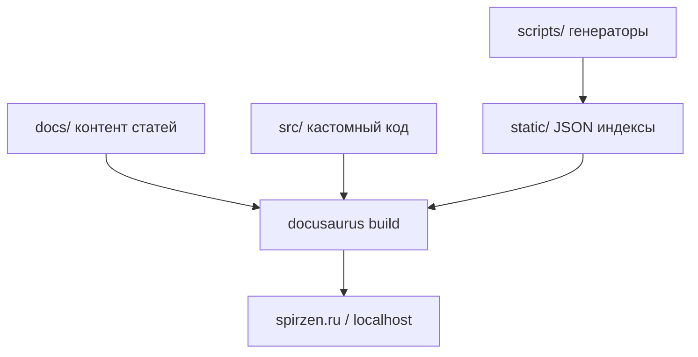
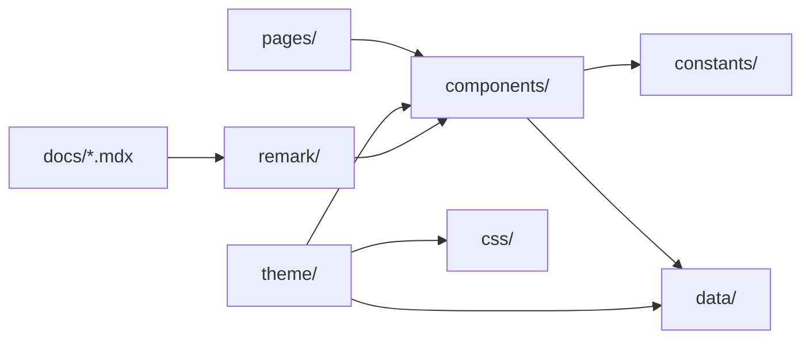

# Структура src/

> Раздел "Как устроена Вселенная IT" не нужен для обучения. Существует он только для тех, кому интересно.

<span id="src-intro"></span>

## Что такое исходный код и source

**Исходный код** ([source code](/encyclopedia/4-code-dev/4-03-vypolnenie-koda/intro)) — текст программы, который читает человек и который превращается в исполняемый [бандл](/about/kak-ustroena-vselennaya-it/package-i-stek#бандл) при [сборке](/about/kak-ustroena-vselennaya-it/package-i-stek#сборка). В репозитории it-knowledge-base это в основном [JavaScript](/encyclopedia/5-languages/5-01-javascript/1), [TypeScript](/about/kak-ustroena-vselennaya-it/typescript), [React](/encyclopedia/5-languages/5-01-javascript/27), CSS и markdown в `docs/`.

**Source** (англ. "источник") в контексте фронтенда — каталог **`src/`** с [кастомным кодом](#кастомный-код) поверх Docusaurus. Контент [статей](#статья) лежит в **`docs/`**; `src/` отвечает за то, *как* [контент](#контент) выглядит, ведёт себя в [браузере](/about/kak-ustroena-vselennaya-it/docusaurus-config#браузер) и связывается с внешними сервисами [play.spirzen.ru](#playspirzenru) и [code.spirzen.ru](#codespirzenru).



Разделение близко к [слоям приложения](/encyclopedia/4-code-dev/4-14-razrabotka-i-otladka/116) — данные (`docs/`, `data/`), представление (`components/`, `theme/`, `css/`), интеграции (`constants/`, [embed](#embed)).

---

## Карта каталогов src/

```
src/
├── clientModules/     # Скрипты при загрузке каждой страницы
├── components/        # React — embeds, поиск, хабы, article chrome
├── constants/         # URL code/play, trusted origins
├── css/               # Глобальные стили и дизайн-система
├── data/              # JSON/JS — подборки, иконки, темы, индексы
├── pages/             # Лендинг / (homepage)
├── remark/            # Плагины markdown (wiki, lazy import)
├── theme/             # Swizzle-компоненты Docusaurus
├── utils/             # API палитр, PDF
├── types.d.ts
└── docusaurus-shims.d.ts
```

Отдельной папки `hooks/` нет — [хуки](#hooks) лежат в `components/shared/` и рядом с фичами (`useCollectionArticleLists.js`, `useDocSearchState.js`).

| Папка | Роль в одном предложении |
|-------|--------------------------|
| `clientModules/` | JS вне React при [загрузке страницы](#загрузка-страницы) |
| `components/` | Переиспользуемые [React-компоненты](#react-компоненты) для MDX и [theme](#swizzle-компонент) |
| `constants/` | [Константы](#константа) URL и [trusted origin](#trusted-origin) |
| `css/` | [Глобальный стиль](#глобальный-стиль) и [дизайн-система](#дизайн-система) |
| `data/` | Статические списки [маршрутов](#маршрут), иконок, [индексов](#индекс) |
| `pages/` | [Homepage](#homepage) — [точка входа](#точка-входа) `/` |
| `remark/` | [CommonJS](#commonjs)-плагины на этапе [сборки](#сборка) |
| `theme/` | [Переопределение](#переопределение) UI Docusaurus ([swizzle](#swizzle-компонент)) |
| `utils/` | Чистые функции — [API палитр](#api-палитр), PDF |

Связанные артефакты **вне** `src/` — `static/doc-search-index.json` ([генерация скриптом](/about/kak-ustroena-vselennaya-it/dannye-i-skripty)), `static/img/`, корневые конфиги.

---

<span id="clientmodules"></span>

## clientModules/

Подключаются в [docusaurus.config.js](/about/kak-ustroena-vselennaya-it/docusaurus-config#clientmodules) → `clientModules`. Это **[клиентский модуль](#клиентский-модуль)** — обычный JS, выполняемый при старте [бандла](#бандл), **вне** дерева React.

| Файл | Назначение |
|------|------------|
| `itThemeStorageGuard.js` | Сброс битых [ключей color mode](#ключи-color-mode) в [localStorage](#localstorage) |
| `itDesignThemeInit.js` | [Синхронизация](#синхронизация) `data-design` при [SPA](#spa)-[навигации](#навигация) |
| `limitRoutePrefetch.js` | Ограничение [prefetch](#prefetch) тяжёлых [маршрутов](#маршрут) |

`itDesignThemeInit` восстанавливает палитру из `localStorage` после клиентского перехода — SSR уже выставил `data-design` через inject в config, клиент подтверждает при каждой [загрузке страницы](#загрузка-страницы).

`limitRoutePrefetch` подменяет `window.docusaurus.prefetch` — для префиксов `/encyclopedia/`, `/lab/` и т.д. не тянуть заранее тяжёлые HTML-чанки.

---

<span id="components"></span>

## components/

Самая большая папка (~50 файлов). [React-компоненты](#react-компоненты) импортируют из MDX (`import X from '@site/src/components/...'`) или подключаются из [swizzle-темы](#swizzle-компонент) через [lazyDemo](/about/kak-ustroena-vselennaya-it/typescript#lazydemo).

<span id="embed"></span>

### Embeds

| Компонент | Сервис | Механизм |
|-----------|--------|----------|
| `ExternalPlayEmbed.jsx` | [play.spirzen.ru](#playspirzenru) | [iframe](#iframe) `/p/embed/<slug>/` |
| `ExternalCodeEmbed.jsx` | [code.spirzen.ru](#codespirzenru) | [iframe](#iframe) `/e/embed/<slug>/` |
| `DeveloperExamPlay.jsx` | play (экзамены лаборатории) | Обёртка над play |

[postMessage](#postmessage) от iframe передаёт высоту; принимают только [trusted origin](#trusted-origin) из `constants/`. Подробнее — [Архитектура](/about/kak-ustroena-vselennaya-it/arkhitektura).

<span id="shared"></span>

### shared/ — инфраструктура демо

| Файл | Роль |
|------|------|
| `lazyDemo.js` | [Lazy import](#lazy-import) + Suspense |
| `lazyDemoInView.js` | Загрузка при появлении в viewport |
| `lazyExternalEmbed.js` | Отложенный [embed](#embed) |
| `EmbedClickGate.jsx` | Click-to-load перед iframe |
| `embedLoadQueue.js` | Очередь одновременных embed |
| `useEmbedViewport.js` | Стабильная высота iframe |
| `DemoShell.jsx`, `demoFallback.jsx` | Оболочка и скелетон |
| `deferredIdle.js` | `requestIdleCallback` для DOM-правок |
| `useBreakpoint.js`, `useCopyToClipboard.js` | [Hooks](#hooks) |

<span id="article-chrome"></span>

### Article chrome

Блоки вокруг текста [статьи](#статья), подключаются из `theme/DocItem/Layout` **без правок MDX**.

| Компонент | Функция |
|-----------|---------|
| `TechArticleHero.jsx` | [Hero](#hero) с иконкой технологии |
| `ArticlePdfExport.jsx` | Экспорт в PDF |
| `ArticleSeeAlso.jsx` | [See-also](#see-also) — подборки |
| `ArticleRelated.jsx` | [Related](#related) — связанные статьи |
| `RandomChecklistItem.jsx` | Случайный пункт чеклиста |
| `RandomQuestionFromArticle.jsx` | Вопрос из текста |

**Article chrome** — обвязка doc-страницы (hero, TOC-панель, прогресс, см. также) вокруг тела markdown.

<span id="хаб"></span>

### Навигация и хабы

| Компонент | Роль |
|-----------|------|
| `UniverseMap.jsx` | Карта 9 [разделов](#раздел) энциклопедии |
| `GettingStartedPaths.jsx` | Пути для новичков |
| `CollectionHub.jsx` | [Хаб](#хаб) подборок |
| `LabTrainersHub.jsx` | Хаб тренажёров лаборатории |
| `HomepageHeroSearch/` | Поиск на [homepage](#homepage) |

**Хаб** — страница-агрегатор со [списком](#секция) ссылок на [статьи](#статья) темы.

<span id="провайдер-поиска"></span>

### DocSearch/ — провайдер поиска

`DocSearchContext.jsx` — React Context ([провайдер](#провайдер-поиска) состояния поиска). `DocSearchModal`, `DocSearchBar`, `docSearchEngine.js` читают `static/doc-search-index.json`. Кнопка Ctrl+K — в `theme/NavbarItem/DocSearch`.

Подробнее — [Компоненты](/about/kak-ustroena-vselennaya-it/komponenty).

---

<span id="theme"></span>

## theme/ — swizzle и переопределение

[Swizzle](/about/kak-ustroena-vselennaya-it/package-i-stek#swizzle) копирует компоненты `@docusaurus/theme-classic` в `src/theme/`; Docusaurus подхватывает их **вместо** стандартных. Это **[переопределение](#переопределение)** layout, [navbar](#navbar), [sidebar](#sidebar), карточек.

| [Swizzle-компонент](#swizzle-компонент) | Зачем |
|----------------------------------------|-------|
| `Root/index.tsx` | [Провайдер поиска](#провайдер-поиска) + [fallback](#fallback)-sidebar |
| `DocItem/Layout/index.tsx` | PDF, [TOC](#toc)-панель, hero, related, see-also, [прогресс чтения](#прогресс-чтения) |
| `DocRoot/Layout/index.tsx` | [Оверлей](#оверлей) sidebar, [back-to-top](#back-to-top) |
| `DocSidebar/Desktop/Content` | Поиск по sidebar, [resize](#resize) ширины |
| `Navbar/Layout`, `ColorModeToggle` | [DesignThemePicker](#pick) + light/dark |
| `NavbarItem/DocSearch` | Кнопка поиска |
| `DocCard/index.tsx` | [SVG](#svg)/[эмодзи](#эмодзи) технологий на карточках |
| `DocCategoryGeneratedIndexPage` | Оформление [автоген](#автоген)-оглавлений |

### DOM-улучшения после рендера

`articleMetaEnhancement.ts` и `articleSectionEnhancement.ts` — [кликабельность](#кликабельность) тегов, обёртка [секций](#секция) `.doc-section` вокруг h2. Запускаются из layout через `scheduleIdleWork` после [отрисовки](/about/kak-ustroena-vselennaya-it/docusaurus-config#отрисовка).

<span id="fallback"></span>

### DocSidebarFallback

`DocSidebarFallback/` — [fallback](#fallback) для узкого [desktop](#desktop): [оверлей](#оверлей) бокового меню, если классический sidebar скрыт. `Activator.tsx` вешает кнопку "меню раздела".

<span id="resize"></span>

### Sidebar resize

`SidebarResizeHandle.jsx` + `useSidebarAutoWidth.js` — перетаскивание границы [sidebar](#sidebar), ширина в [localStorage](/about/kak-ustroena-vselennaya-it/docusaurus-config#localstorage). Работает на [desktop](#desktop).

<span id="прогресс-чтения"></span>

### ChapterProgress

`ChapterProgress.tsx` — полоска прогресса прокрутки [статьи](#статья) (процент видимого текста в viewport).

---

<span id="data"></span>

## data/

Статические данные — JS-модули и JSON. Часть файлов **генерируется** [скриптами](/about/kak-ustroena-vselennaya-it/dannye-i-skripty) перед [сборкой](#сборка).

| Файл | Тип | Содержимое |
|------|-----|------------|
| `sidebarCollections.js` | JS | [Маршруты](#маршрут) подборок для homepage и `/about/collections` |
| `encyclopediaSections.js` | JS | 9 [разделов](#раздел) карты вселенной |
| `itDesigns.json` | JSON | [Палитры оформления](#палитра-оформления) |
| `techIconRegistry.js` | JS | id технологии → [SVG](#svg)/[эмодзи](#эмодзи) |
| `techIconPaths.js` | JS | [Автоген](#автоген) SVG paths (`docs:tech-icon-paths`) |
| `techArticlePages.js` | JS | [Префикс](#префикс) doc → tech id для [hero](#hero) |
| `collectionDocTitles.json` | JSON | id → заголовок ([генерация скриптом](/about/kak-ustroena-vselennaya-it/package-i-stek#collection-titles)) |
| `encyclopediaTermLinks.json` | JSON | Термин → URL |
| `wikiLinkIndex.json` | JSON | [Индекс](#индекс) `[[wiki]]` (генерируется) |
| `docLegacyRedirects.json` | JSON | [Редирект](#редирект) старых URL (генерируется) |
| `languagePrerequisitesTopics.json` | JSON | Темы для планов языков |
| `englishPlanVocabulary.json` | JSON | Словарь плана английского |

---

<span id="css"></span>

## css/ — стили и дизайн-система

[Точка входа](#точка-входа) — `custom.css` (плюс `it-design-code-overrides.css` в config). Цепочка `@import`.

| Файл | Роль |
|------|------|
| `it-design-themes.css` | [Переменные](#переменные) для каждой `data-design` |
| `it-design-bridge.css` | [Мост](#мост) `--d-*` → [Infima](#infima) `--ifm-*` |
| `it-design-color-mode.css` | Light/dark внутри палитры |
| `article-docs-prime.css` | [Типографика](#типографика) [статей](#статья) |
| `sidebar-explorer.css`, `sidebar-cosmic-explorer.css` | Оформление [sidebar](#sidebar) |
| `doc-search-theme.css` | Стили поиска |
| `navbar-layout.css` | [Navbar](#navbar) |
| `site-chrome.css` | Общая хромированная оболочка сайта |

**[Дизайн-система](#дизайн-система)** — набор палитр `data-design` + [мост](#мост) к Infima + эффекты (`it-design-effects.css`). [API палитр](#api-палитр) в `utils/itDesignTheme.ts`. Подробнее — [Темы и стили](/about/kak-ustroena-vselennaya-it/temy-i-stili).

**[Глобальный стиль](#глобальный-стиль)** — CSS из `customCss` в config на весь сайт; `*.module.css` у [компонентов](#компонент) действует локально.

---

<span id="remark-плагины"></span>

## remark/ — плагины markdown

[CommonJS](#commonjs)-модули, подключённые в `docusaurus.config.js` → `remarkPlugins`. Работают **на этапе [сборки](#сборка)**, в [браузере](/about/kak-ustroena-vselennaya-it/docusaurus-config#браузер) не выполняются.

| Плагин | Назначение |
|--------|------------|
| `wikiLink.js` | `[[термин]]` → ссылка по `wikiLinkIndex.json` |
| `lazyMdxDemoImports.js` | Переписывает `import` тяжёлых [компонентов](#компонент) на [lazy import](#lazy-import) |

[Remark](/about/kak-ustroena-vselennaya-it/package-i-stek#remark-плагины) обходит AST markdown до компиляции MDX — часть [пайплайна](/about/kak-ustroena-vselennaya-it/package-i-stek#пайплайн) [контента](#контент).

---

<span id="pages"></span>

## pages/ — homepage и лендинг

`index.js` — **[лендинг](#лендинг)** [маршрута](#маршрут) `/` ([homepage](#homepage)). Hero, поиск, ленивые `UniverseMap`, `GettingStartedPaths`, `RandomArticle`.

Остальной [контент](#контент) — [docs](/about/kak-ustroena-vselennaya-it/docusaurus-config#docs) с `routeBasePath: '/'`, поэтому URL `/encyclopedia/intro` идут из `docs/`, а корень `/` — из `pages/`.

---

<span id="constants"></span>

## constants/

| Файл | Роль |
|------|------|
| `embedServiceUrl.js` | [prod](#prod) vs localhost для embed-URL |
| `codeExamples.js` | URL и [postMessage](#postmessage) origins для [code.spirzen.ru](#codespirzenru) |
| `playExamples.js` | То же для [play.spirzen.ru](#playspirzenru) |

`resolveEmbedServiceBaseUrl` на `localhost:3000` подменяет прод-URL на локальные порты — **[тест локальной связки](#тест-локальной-связки)** embed без правки [prod](#prod)-конфига.

**[Trusted origin](#trusted-origin)** — whitelist доменов для `postMessage` (защита от поддельных сообщений о высоте iframe).

---

<span id="utils"></span>

## utils/ и shims

| Файл | Назначение |
|------|------------|
| `itDesignTheme.ts` | [API палитр](#api-палитр) — `applyItDesign`, `readStoredItDesignId` |
| `exportArticlePdf.js` | html2canvas + jsPDF для кнопки в layout |

`docusaurus-shims.d.ts` и `types.d.ts` — [shim](#shim)-типы для IDE ([TypeScript](/about/kak-ustroena-vselennaya-it/typescript#shims)), не runtime-код.

---

<span id="docs"></span>

## docs/ vs src/

| | `docs/` | `src/` |
|---|---------|--------|
| Содержимое | Markdown, MDX, [статьи](#статья) | [Код](#код), [стили](#стили), [theme](#theme) |
| Навигация | [sidebars.js](/about/kak-ustroena-vselennaya-it/sidebars), `_category_.json` | [Компоненты](#компонент) UI |
| Сборка | remark → MDX → React-страницы | Webpack-чанки, [swizzle](#swizzle-компонент) |

**[Статья](#статья)** в `docs/` — файл `.md`/`.mdx` с [frontmatter](/about/kak-ustroena-vselennaya-it/package-i-stek#frontmatter). **[Глава](#глава)** — логическая часть учебного [раздела](#раздел) (например, глава "Как устроена Вселенная IT"). **[Раздел](#раздел)** — крупный блок энциклопедии (`encyclopedia/`, `lab/`, …). **[Секция](#секция)** — фрагмент внутри одной страницы (h2 + абзацы, обёртка `.doc-section`).

---

## Поток зависимостей



---

## Куда класть новый код

| Задача | Папка |
|--------|-------|
| Виджет в одной [статье](#статья) | `components/` + import в MDX |
| Блок на всех статьях | `theme/DocItem/Layout` |
| Пункт [navbar](#navbar) | `theme/Navbar*` или `NavbarItem/` |
| Статический список [маршрутов](#маршрут) | `data/*.js` или JSON |
| [Глобальный стиль](#глобальный-стиль) | `css/` |
| Синтаксис markdown | `remark/` |
| [Скрипт](#скрипт) при загрузке сайта | `clientModules/` |
| URL внешнего [API](#api) | `constants/` |

---

<span id="глоссарий"></span>

## Глоссарий

<span id="исходный-код"></span>

### Исходный код

Текст программы до [сборки](#сборка); в проекте — `src/`, `docs/`, `scripts/`, конфиги.

<span id="source"></span>

### source / src

Каталог **`src/`** — [кастомный код](#кастомный-код) Docusaurus поверх шаблона.

<span id="код"></span>

### Код

Инструкции на JS/TS/CSS; см. [выполнение кода](/encyclopedia/4-code-dev/4-03-vypolnenie-koda/intro).

<span id="кастомный-код"></span>

### Кастомный код

Всё в `src/`, чего нет в стандартном шаблоне Docusaurus — [theme](#swizzle-компонент), [компоненты](#компонент), [стили](#стили).

<span id="react-компоненты"></span>

### React-компоненты

Функции/классы, возвращающие JSX; основа UI. [React — компоненты](/encyclopedia/5-languages/5-01-javascript/275).

<span id="переопределение"></span>

### Переопределение

Замена стандартного компонента темы своей версией в `src/theme/` ([swizzle](#swizzle-компонент)).

<span id="стили"></span>

### Стили

CSS в `src/css/` и `*.module.css` у [компонентов](#компонент).

<span id="remark-плагины-глоссарий"></span>

### remark-плагины

Обработчики markdown при [сборке](#сборка); см. [package.json и стек](/about/kak-ustroena-vselennaya-it/package-i-stek#remark-плагины).

<span id="клиентский-модуль"></span>

### Клиентский модуль

Файл из `clientModules/` — выполняется при загрузке [бандла](#бандл), вне React.

<span id="контент"></span>

### Контент

Текст и медиа [статей](#статья) в `docs/`; [компоненты](#компонент) его оборачивают и дополняют.

<span id="статья"></span>

### Статья

Один документ в `docs/` (`.md`/`.mdx`); [id](/about/kak-ustroena-vselennaya-it/sidebars#id-документа) и [slug](/about/kak-ustroena-vselennaya-it/sidebars#slug).

<span id="скрипт"></span>

### Скрипт

JS-модуль — `clientModules/`, `scripts/*.mjs` ([пайплайн](/about/kak-ustroena-vselennaya-it/dannye-i-skripty)), или inline в config.

<span id="загрузка-страницы"></span>

### Загрузка страницы

Первый HTTP-запрос HTML/JS или клиентский переход в [SPA](#spa); [clientModules](#клиентский-модуль) срабатывают при старте бандла.

<span id="компонент"></span>

### Компонент

Единица UI в React; файл в `components/` или `theme/`.

<span id="константа"></span>

### Константа

Незменяемое значение — URL, ключ storage, список origins в `constants/`.

<span id="embed-глоссарий"></span>

### embed

Встраивание внешнего UI ([iframe](#iframe)) — play, code, экзамены.

<span id="хаб"></span>

### Хаб

Страница-агрегатор ссылок (`CollectionHub`, `LabTrainersHub`).

<span id="article-chrome-глоссарий"></span>

### article chrome

Обвязка doc-страницы — hero, PDF, related, see-also, прогресс, TOC-панель.

<span id="trusted-origin"></span>

### trusted origin

Доверенный домен для [postMessage](#postmessage) от iframe.

<span id="дизайн-система"></span>

### Дизайн-система

Палитры `data-design`, CSS-переменные, [мост](#мост) Infima, picker в navbar.

<span id="docs-глоссарий"></span>

### docs

Плагин и папка `docs/` — основной [контент](#контент) сайта.

<span id="lazy-import"></span>

### lazy import

`import()` + `React.lazy` — отложенная загрузка [чанка](/about/kak-ustroena-vselennaya-it/docusaurus-config#чанк).

<span id="swizzle-компонент"></span>

### swizzle-компонент

Копия компонента `@docusaurus/theme-classic` в `src/theme/`.

<span id="shim"></span>

### shim

Заглушка типов (`docusaurus-shims.d.ts`) для IDE.

<span id="hooks"></span>

### hooks

React-хуки (`useState`, `useDoc`, `useEmbedViewport`) в `shared/` и DocSearch.

<span id="shared-глоссарий"></span>

### shared

`components/shared/` — общая инфраструктура embed и lazy.

<span id="ключи-color-mode"></span>

### Ключи color mode

Записи `localStorage` с префиксом `theme` (light/dark Docusaurus).

<span id="localstorage"></span>

### localStorage

Хранилище браузера для темы, дизайна, ширины sidebar.

<span id="spa"></span>

### SPA

Single Page Application — [навигация](/encyclopedia/5-languages/5-01-javascript/270) без полной перезагрузки. Docusaurus после первой загрузки.

<span id="навигация"></span>

### Навигация

Переходы между [маршрутами](#маршрут) — navbar, sidebar, Link, поиск.

<span id="синхронизация"></span>

### Синхронизация

Согласование состояния при переходах — `data-design`, color mode, iframe theme query.

<span id="prefetch"></span>

### prefetch

Предзагрузка следующей страницы Docusaurus Link; ограничена для `/encyclopedia/`.

<span id="маршрут"></span>

### Маршрут

URL ↔ страница (`/encyclopedia/intro`, `/`). См. [route](/about/kak-ustroena-vselennaya-it/docusaurus-config#route).

<span id="бандл"></span>

### Бандл

Собранный JS/CSS для [браузера](/about/kak-ustroena-vselennaya-it/docusaurus-config#браузер); `src/` режется на [чанки](/about/kak-ustroena-vselennaya-it/docusaurus-config#чанк).

<span id="playspirzenru"></span>

### play.spirzen.ru

Сервис интерактива — тренажёры, `/p/embed/<slug>/`. См. [Архитектура](/about/kak-ustroena-vselennaya-it/arkhitektura).

<span id="codespirzenru"></span>

### code.spirzen.ru

Сервис примеров кода — `/e/embed/<slug>/`, [ExternalCodeEmbed](#embed).

<span id="iframe"></span>

### iframe

HTML-элемент вложенной страницы; embed play/code.

<span id="провайдер-поиска-глоссарий"></span>

### Провайдер поиска

`DocSearchProvider` — Context для модального поиска.

<span id="fallback"></span>

### fallback

Запасной UI — sidebar overlay, skeleton embed, эмодзи вместо SVG.

<span id="sidebar"></span>

### sidebar

Боковое меню документации; swizzle в `theme/DocSidebar/`. См. [sidebars.js](/about/kak-ustroena-vselennaya-it/sidebars).

<span id="toc"></span>

### TOC

Table of Contents — оглавление [статьи](#статья); `DocTocPanel`, mobile/desktop TOC.

<span id="hero"></span>

### hero

Верхний баннер страницы — `TechArticleHero`, homepage header.

<span id="related"></span>

### related

Блок связанных статей — `ArticleRelated.jsx`.

<span id="see-also"></span>

### see-also

Блок "См. также" / подборки — `ArticleSeeAlso.jsx`.

<span id="прогресс-чтения-глоссарий"></span>

### Прогресс чтения

`ChapterProgress` — индикатор прокрутки статьи.

<span id="оверлей"></span>

### Оверлей

Плавающий слой поверх контента — sidebar fallback на узком desktop.

<span id="back-to-top"></span>

### back-to-top

Кнопка прокрутки вверх в `DocRoot/Layout`.

<span id="resize-глоссарий"></span>

### resize

Изменение ширины sidebar перетаскиванием (`SidebarResizeHandle`).

<span id="desktop"></span>

### desktop

Широкий viewport; отдельные layout-решения от mobile/tablet.

<span id="pick"></span>

### pick

Выбор палитры — `DesignThemePicker` в navbar/sidebar.

<span id="navbar"></span>

### navbar

Верхняя панель; swizzle `Navbar/Layout`, `ColorModeToggle`.

<span id="кликабельность"></span>

### Кликабельность

Интерактивные теги и badge после `articleMetaEnhancement`.

<span id="секция"></span>

### Секция

Фрагмент статьи под h2 (обёртка `.doc-section`).

<span id="раздел"></span>

### Раздел

Крупная ветка сайта или энциклопедии (`1-basics`, `lab/`).

<span id="глава"></span>

### Глава

Часть внутреннего учебного раздела (файлы `01-`, `02-` в "Как устроена Вселенная IT").

<span id="homepage"></span>

### homepage

Главная `/` — `src/pages/index.js`.

<span id="палитра-оформления"></span>

### Палитра оформления

Запись в `itDesigns.json` + CSS для `data-design`.

<span id="svg"></span>

### SVG

Векторная иконка технологии из `techIconPaths.js`.

<span id="эмодзи"></span>

### Эмодзи

Запасной badge в `techIconRegistry` (`fallback: '🐍'`).

<span id="автоген"></span>

### Автоген

Автоматически сгенерированный файл (`techIconPaths.js`, `wikiLinkIndex.json`).

<span id="префикс"></span>

### Префикс

Начало пути или id (`5-01-`, префикс doc для hero).

<span id="редирект"></span>

### Редирект

Перенаправление старого URL — `docLegacyRedirects.json`, plugin redirects.

<span id="индекс"></span>

### Индекс

JSON-каталог для поиска или wiki (`doc-search-index`, `wikiLinkIndex`).

<span id="точка-входа"></span>

### Точка входа

Главный файл модуля — `custom.css`, `pages/index.js`, `Root/index.tsx`.

<span id="переменные"></span>

### Переменные

CSS custom properties (`--ifm-*`, `--d-*`) в `css/`.

<span id="типографика"></span>

### Типографика

Размеры шрифтов, межстрочный интервал статей — `article-docs-prime.css`.

<span id="мост"></span>

### Мост

`it-design-bridge.css` — сопоставление `--d-*` с [Infima](#infima) `--ifm-*`.

<span id="infima"></span>

### Infima

CSS-фреймворк темы Docusaurus. См. [package.json и стек](/about/kak-ustroena-vselennaya-it/package-i-stek#infima).

<span id="commonjs"></span>

### CommonJS

`require`/`module.exports` — [remark](#remark-плагины), часть theme `require('@theme/...')`.

<span id="сборка-глоссарий"></span>

### Сборка

`npm run build` → `build/`. См. [package.json и стек](/about/kak-ustroena-vselennaya-it/package-i-stek#сборка).

<span id="лендинг"></span>

### Лендинг

Маркетинговая главная `/` с hero и CTA.

<span id="prod"></span>

### prod

Продакшен — spirzen.ru, code/play на spirzen.ru; против localhost в [constants](#constants).

<span id="postmessage"></span>

### postMessage

API браузера для сообщений между окном и [iframe](#iframe) (высота embed).

<span id="тест-локальной-связки"></span>

### Тест локальной связки

Разработка с локальными code/play на портах 4321/4322 через `resolveEmbedServiceBaseUrl`.

<span id="api"></span>

### API

Программный интерфейс — `applyItDesign`, URL embed-сервисов, поисковый индекс.

<span id="api-палитр"></span>

### API палитр

Функции `itDesignTheme.ts` — чтение/запись активного `data-design`.

<span id="генерация-скриптом"></span>

### Генерация скриптом

`scripts/*.mjs` пишут JSON в `src/data/` или `static/` перед build.

<span id="глобальный-стиль"></span>

### Глобальный стиль

CSS из `customCss` в config, действует на весь сайт.

---

## Связь с другими главами

- [Архитектура](/about/kak-ustroena-vselennaya-it/arkhitektura) — spirzen, code, play, assets, embed-паттерны.
- [TypeScript](/about/kak-ustroena-vselennaya-it/typescript) — `.tsx` в `theme/`, shims, `itDesignTheme.ts`.
- [Компоненты](/about/kak-ustroena-vselennaya-it/komponenty) — детали embed, DocSearch, MDX.
- [Темы и стили](/about/kak-ustroena-vselennaya-it/temy-i-stili) — CSS-цепочка, палитры.
- [Данные и скрипты](/about/kak-ustroena-vselennaya-it/dannye-i-skripty) — генераторы индексов.
- [docusaurus.config.js](/about/kak-ustroena-vselennaya-it/docusaurus-config) — `clientModules`, `customCss`, remark.

## Полезные статьи энциклопедии

- [Структура каталогов в разработке](/encyclopedia/4-code-dev/4-14-razrabotka-i-otladka/116)
- [Основы архитектуры ПО](/encyclopedia/4-code-dev/4-04-proekt-i-freymvorki/112)
- [React — библиотека UI](/encyclopedia/5-languages/5-01-javascript/27)
- [React — компоненты и JSX](/encyclopedia/5-languages/5-01-javascript/275)
- [SPA и клиентская навигация](/encyclopedia/5-languages/5-01-javascript/270)
- [Как работают сайты и веб-приложения](/encyclopedia/2-system-network/2-04-kak-rabotayut-sayty-i-veb-sayty/intro)
- [CDN и доставка статики](/encyclopedia/2-system-network/2-03-set-i-internet/212)
- [REST и интеграции](/encyclopedia/8-infra-security/8-05-mikroservisy-i-integratsiya/1151)
- [Markdown и текст в веб](/encyclopedia/1-basics/1-15-tekst/5)
- [DevOps, CI/CD](/encyclopedia/8-infra-security/8-04-devops-ci-cd/intro)
