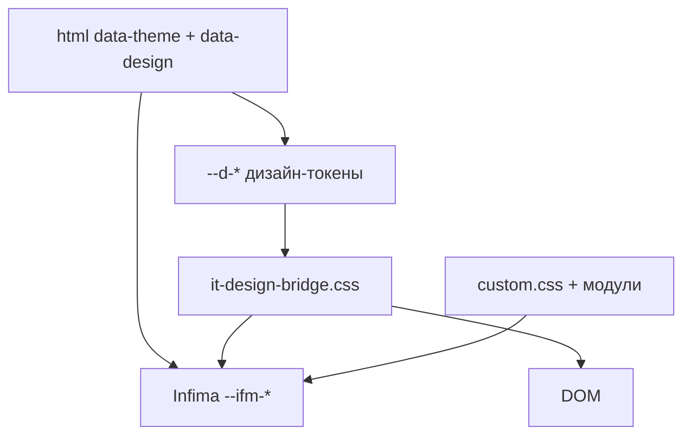

# Темы и стили

> Раздел "Как устроена Вселенная IT" не нужен для обучения. Существует он только для тех, кому интересно.

<span id="temy-intro"></span>

## Что такое тема и стили

**Стили** — правила [CSS](/encyclopedia/3-data-markup/3-10-css/intro), которые задают [визуал](#визуал) сайта — цвета, [шрифты](#шрифт), отступы, [тени](#тень), [градиенты](#градиент). В браузере они собираются в **[CSSOM](#cssom)** (дерево стилей) и применяются к узлам **[DOM](#dom)**, построенному из [HTML](/encyclopedia/3-data-markup/3-09-html/intro). Подробнее — [подключение CSS](/encyclopedia/3-data-markup/3-10-css/111) и [основные стили](/encyclopedia/3-data-markup/3-10-css/3).

**Тема** в Docusaurus — пакет оформления (`@docusaurus/theme-classic` на базе [Infima](#infima)) плюс кастомные листы из `src/css/`. В "Вселенной IT" [оформление](#оформление) устроено **двумя ортогональными слоями**, которые читатель может [сочетать](#сочетание) независимо.

| Слой | Переключатель | Атрибут на `<html>` | Хранение |
|------|---------------|---------------------|----------|
| **Яркость** ([color mode](#color-mode)) | `ColorModeToggle` Docusaurus | `data-theme="light"` / `dark` | [localStorage](#localstorage), [ключи theme](#ключи-theme) |
| **Палитра** ([design](#design)) | `DesignThemePicker` | `data-design="design-matrix-code"` | `localStorage`, ключ `it-universe-design` |

Тёмная [палитра](#палитра) Matrix + светлый режим ☀, светлая Sakura + тёмный ☾ — допустимые комбинации. Слои **[ортогональны](#ортогональность)** — меняют разные оси [оформления](#оформление).



См. [структуру src/css/](/about/kak-ustroena-vselennaya-it/struktura-src#css), [docusaurus.config.js](/about/kak-ustroena-vselennaya-it/docusaurus-config) (`customCss`, [inject](#inject)).

---

<span id="dom"></span>

## DOM и как темы попадают на страницу

```html
<html data-theme="dark" data-design="design-matrix-code" lang="ru">
  <head>...</head>
  <body>...</body>
</html>
```

| Атрибут | Кто меняет | [Селекторы](#селекторы) в CSS |
|---------|------------|-------------------------------|
| `data-theme` | [Toggle](#toggle) light/dark | `html[data-theme='dark']` |
| `data-design` | [Выпадающий список](#выпадающий-список) палитр | `html[data-design="design-sakura-spring"]` |

[Перекраска без перезагрузки](#перекраска-без-перезагрузки) — смена атрибута на `document.documentElement`; [CSS-переменные](#css-переменные) пересчитываются, React-дерево остаётся на месте ([SPA](#spa), [клиентская навигация](/about/kak-ustroena-vselennaya-it/docusaurus-config#клиентская-навигация)).

---

<span id="docusaurus-темы"></span>

## Docusaurus, Infima и color mode

**Docusaurus** подключает тему через preset classic — [layout](/about/kak-ustroena-vselennaya-it/struktura-src#theme) (navbar, sidebar, doc page), typography, admonitions. Базовая **[сетка](#сетка)** и компоненты — **[Infima](#infima)** с префиксом `--ifm-*`.

В [themeConfig](/about/kak-ustroena-vselennaya-it/docusaurus-config#themeconfig).

```js
colorMode: {
  defaultMode: 'light',
  disableSwitch: false,
  respectPrefersColorScheme: false,
},
```

**[Явный выбор](#явный-выбор)** пользователя важнее системной темы ОС — `respectPrefersColorScheme: false`. [Светлая](#светлая-и-тёмная-темы) и [тёмная](#светлая-и-тёмная-темы) темы Infima переключаются через `data-theme`.

[Swizzle](/about/kak-ustroena-vselennaya-it/package-i-stek#swizzle) `Navbar/ColorModeToggle` встраивает `DesignThemePicker` рядом с переключателем яркости — два [toggle](#toggle) в одной панели.

---

<span id="палитра"></span>

## Палитры design — каталог и picker

### itDesigns.json

```json
{
  "id": "design-universe-original",
  "name": "Оригинал (Вселенная IT)",
  "mode": "light",
  "featured": true
}
```

| Поле | Роль |
|------|------|
| `id` | Значение `data-design` и [селектор](#селекторы) в CSS |
| `name` | Подпись в UI |
| `mode` | Рекомендуемая яркость палитры (подсказка, не жёсткое правило) |
| `featured` | [Группа](#группы-тем) "★ Популярные" в списке |

В каталоге **25+** палитр (Matrix, Sakura, Cosmic Void…). [API палитр](/about/kak-ustroena-vselennaya-it/struktura-src#api-палитр) — `src/utils/itDesignTheme.ts`.

```ts
export function applyItDesign(designId: string): ItDesign {
  document.documentElement.setAttribute('data-design', design.id);
  localStorage.setItem(IT_DESIGN_STORAGE_KEY, design.id);
  return design;
}
```

<span id="выпадающий-список"></span>

### DesignThemePicker

`src/components/DesignThemePicker/index.tsx` — `<select>` с [группами тем](#группы-тем): "Оригинал", `optgroup` "★ Популярные", "Все темы". Локальные стили — `styles.module.css` ([хеширование](#хеширование) [webpack](/about/kak-ustroena-vselennaya-it/docusaurus-config#webpack)).

При `onChange` — `applyItDesign`, обновление state, синхронизация между вкладками через `storage` event.

---

<span id="fouc"></span>

## Защита от FOUC, inject и clientModules

**FOUC** (Flash of Unstyled Content) — краткая вспышка "чужой" палитры до применения CSS/атрибутов. См. [глоссарий config](/about/kak-ustroena-vselennaya-it/docusaurus-config#fouc).

**До React** плагин `it-design-theme-inject` в [docusaurus.config.js](/about/kak-ustroena-vselennaya-it/docusaurus-config) вставляет inline-[скрипт](#inject) в `<head>`.

```js
(function(){
  try {
    var id = localStorage.getItem('it-universe-design') || 'design-universe-original';
    document.documentElement.setAttribute('data-design', id);
  } catch (e) { /* fallback */ }
})();
```

**После загрузки [бандла](/about/kak-ustroena-vselennaya-it/package-i-stek#бандл)**

| Модуль | Роль |
|--------|------|
| `itDesignThemeInit.js` | Повтор `data-design` при [SPA](#spa)-переходах |
| `itThemeStorageGuard.js` | Чистит битые [ключи theme](#ключи-theme) (всё, кроме `light`/`dark`) — разрыв **[цикла toggle](#цикл-toggle)** color mode |

**[Цикл toggle](#цикл-toggle)** — повреждённое значение в `localStorage` заставляет Docusaurus бесконечно переключать `data-theme`; guard удаляет некорректные записи с префиксом `theme`.

---

<span id="css-переменные"></span>

## CSS-переменные и дизайн-токены

**CSS-переменные** (custom properties) — ` --имя: значение;` на `:root` или `html[data-design="..."]`. Подстановка — `var(--имя)`. Каскад и [наследование](#наследование) работают как у обычных свойств. См. [CSS-переменные в энциклопедии](/encyclopedia/3-data-markup/3-10-css/119).

**[Дизайн-токен](#дизайн-токен)** — именованная величина палитры с префиксом `--d-*`.

| Токен | Назначение |
|-------|------------|
| `--d-primary`, `--d-accent2` | Акценты, ссылки, кнопки |
| `--d-bg`, `--d-surface` | Фон страницы и карточек |
| `--d-text`, `--d-text-muted` | Основной и вторичный текст |
| `--d-nav`, `--d-footer` | Navbar и footer |
| `--d-code-bg`, `--d-code-fg` | Блоки кода |
| `--d-shadow`, `--d-hero-bg` | [Тень](#тень), [градиент](#градиент) hero |

Файл **`it-design-themes.css`** — [автоген](/about/kak-ustroena-vselennaya-it/struktura-src#автоген) (`node scripts/generate-themes.js`), блоки такого вида.

```css
html[data-design="design-matrix-code"] {
  --d-bg: #0d0208;
  --d-primary: #00ff41;
  --d-hero-bg: linear-gradient(180deg, #0a1a0a 0%, #0d0208 60%);
}
```

<span id="bridge"></span>

### Bridge — маппинг на Infima

**`it-design-bridge.css`** — **[маппинг](#маппинг)** `--d-*` → `--ifm-*`.

```css
html[data-design]:not([data-design='design-universe-original']) {
  --ifm-background-color: var(--d-bg);
  --ifm-color-primary: var(--d-primary);
  --ifm-navbar-background-color: var(--d-nav);
}
```

Стандартные компоненты Docusaurus (navbar, menu, footer, cards) **наследуют** палитру через Infima без правки каждого [swizzle-компонента](/about/kak-ustroena-vselennaya-it/struktura-src#swizzle-компонент).

<span id="согласование"></span>

### Согласование палитры × яркости

| Файл | Роль |
|------|------|
| `it-design-color-mode.css` | Палитра × `data-theme` — перекраска фонов светлых тем в dark mode |
| `it-design-scheme.css` | `color-scheme: light/dark` от переключателя ☀/☾ |
| `it-design-compat.css` | Токены статей `--it-doc-*` под все `data-design` |
| `it-design-effects.css` | Доп. эффекты, звёзды, свечение |

**[Согласование](#согласование)** — светлая Sakura при `data-theme="dark"` получает тёмные `--d-bg` через `color-mix`, брендовый `--d-primary` остаётся из `it-design-themes.css`.

---

<span id="customcss"></span>

## custom.css и цепочка импортов

**`custom.css`** (~1800 строк) — главная [точка входа](/about/kak-ustroena-vselennaya-it/struktura-src#точка-входа) [глобального стиля](/about/kak-ustroena-vselennaya-it/struktura-src#глобальный-стиль). Подключается в `preset` → `customCss` (первый в списке).

```css
@import './it-design-themes.css';
@import './it-design-scheme.css';
@import './it-design-color-mode.css';
@import './it-design-bridge.css';
/* ... sidebar, article, search ... */
```

<span id="layout"></span>

### Layout и chrome

В `:root` и `html[data-theme]` — переменные **[layout](#layout-глоссарий)** — ширина контента, отступы doc, [рельсы](#рельсы) `--it-doc-rail-color`, chip-теги `--it-tag-chip-*`.

<span id="article-tags"></span>

### article tags и tag

Классы **`.article-tags`**, **`.tag`**, **`.complexity-badge`** — чипы "ОБЯЗАТЕЛЬНО", "ДЛЯ НОВИЧКОВ", аудитория. Стили в `custom.css`; [кликабельность](/about/kak-ustroena-vselennaya-it/struktura-src#кликабельность) добавляет `articleMetaEnhancement.ts`.

<span id="wiki-links"></span>

### wiki-links

**`.wiki-link`**, `.wiki-link--glossary`, `.wiki-link--encyclopedia` — оформление ссылок из remark `[[термин]]` ([wikiLink](/about/kak-ustroena-vselennaya-it/struktura-src#remark-плагины)).

<span id="callout"></span>

### callout

Блоки **`.callout`**, `.callout--tip`, `.callout--warning`, `.callout-title` — замена admonition Docusaurus в статьях энциклопедии.

<span id="demo-класс"></span>

### demo-класс

Классы оболочки демо — `it-demo-shell.css`, placeholder PDF `.pdf-export-demo-placeholder`, shell для [embed](/about/kak-ustroena-vselennaya-it/struktura-src#embed).

---

<span id="типографика"></span>

## Типографика статей

**`article-docs-prime.css`** — [типографика](#типографика) в `.theme-doc-markdown`.

| Элемент | Что настроено |
|---------|---------------|
| [Заголовок](#заголовок) h1–h6 | Размеры, отступы до/после, hero-оформление h1 |
| [Список](#список) | Межстрочные интервалы, вложенность |
| [Таблица](#таблица) | Границы, zebra, адаптив |
| [Горизонтальная линия](#горизонтальная-линия) `hr` | Отступы `--it-doc-hr-gap` |
| [Callout](#callout) | Радиус, граница, градиенты |
| Цитаты, figure | Фон, border |

Токены `--it-doc-*` согласованы с Infima и `--d-*` через `it-design-compat.css`. [Шрифт](#шрифт) палитры — `--d-font` в bridge.

---

<span id="sidebar-стили"></span>

## Sidebar, иконки, космос

**`sidebar-explorer.css`** — "проводник" в [sidebar](/about/kak-ustroena-vselennaya-it/sidebars#sidebar).

| Приём | Описание |
|-------|----------|
| **[Маска](#маска)** | SVG через `mask-image` + `background-color` — [иконка](#иконка) красится в `--ifm-color-primary` |
| **[Рельсы](#рельсы)** | Вертикальные линии `--it-explorer-rail` у пунктов меню |
| Папка/файл/caret | `--it-mask-folder-open`, `--it-mask-file` |

**`sidebar-cosmic-explorer.css`** — **[космические акценты](#космические-акценты)** для `data-theme='dark'` — тинт sidebar `color-mix` с primary, без тяжёлого blur.

---

<span id="модальное-окно"></span>

## DocSearch и блоки кода

**`doc-search-theme.css`** — [модальное окно](#модальное-окно) поиска Ctrl+K (overlay, результаты, фокус).

**`it-design-code-overrides.css`** — подключён **вторым** в `customCss` — **[стиль блоков кода](#стиль-блоков-кода)** под все палитры, [override](#override) Prism/One Dark, читаемость при любом `data-design` и `data-theme`. Проверять **[contrast](#contrast)** при добавлении палитры.

---

<span id="локальные-стили"></span>

## Локальные стили и CSS modules

**[Локальные стили](#локальные-стили)** — `*.module.css` рядом с [компонентом](/about/kak-ustroena-vselennaya-it/struktura-src#компонент). [Webpack](/about/kak-ustroena-vselennaya-it/docusaurus-config#webpack) **[хеширует](#хеширование)** имена [классов CSS](#классы-css) (`styles.select_a1b2c3`), **[коллизия](#коллизия)** с глобальным `custom.css` исключена.

Примеры — `DesignThemePicker/styles.module.css`, `ExternalPlayEmbed.module.css`, `DocSearch/styles.module.css`.

**[Переопределение](#переопределение)** глобальное — селекторы в `custom.css`; локальное — только внутри компонента. **[Override](#override)** в `it-design-code-overrides.css` — принудительные правила для fenced code (`!important` где нужно).

---

<span id="iframe-тема"></span>

## Embed, iframe и brightness mode

`ExternalPlayEmbed` передаёт текущий `colorMode` в [query](#query) [iframe](/about/kak-ustroena-vselennaya-it/struktura-src#iframe).

```js
url.searchParams.set('theme', theme); // light | dark
```

На play уходит **[brightness mode](#brightness-mode)** (светлый/тёмный фон демо), без палитры `data-design`. Согласование [визуала](#визуал) embed с сайтом идёт по `data-theme`; Matrix/Sakura на play не передаются.

---

## Добавление новой палитры

1. Запись в `src/data/itDesigns.json`.
2. `node scripts/generate-themes.js` → обновить `it-design-themes.css`.
3. Проверить [contrast](#contrast) текста и [стиль блоков кода](#стиль-блоков-кода).
4. При необходимости — блок в `it-design-color-mode.css` и эффекты в `it-design-effects.css`.

---

## Практические советы

| Проблема | Что проверить |
|----------|----------------|
| Мигание палитры при загрузке | inline [inject](#inject) в `it-design-theme-inject` |
| Сброс design после навигации | `itDesignThemeInit.js` |
| Код нечитаем в палитре | `it-design-code-overrides.css` |
| Цикл переключения light/dark | `itThemeStorageGuard.js`, [ключи theme](#ключи-theme) |
| Sidebar "ломает" ширину | resize handle + `docSidebarWidth` |

---

<span id="глоссарий"></span>

## Глоссарий

<span id="оформление"></span>

### Оформление

Совокупность визуальных решений сайта — цвета, типографика, отступы, эффекты.

<span id="design"></span>

### Дизайн

В проекте — палитра `data-design` (Matrix, Sakura…), отдельно от яркости `data-theme`.

<span id="css"></span>

### CSS

Язык стилей; файлы в `src/css/`. [Раздел CSS](/encyclopedia/3-data-markup/3-10-css/intro).

<span id="классы-css"></span>

### Классы CSS

Имена в разметке (`.article-tags`, `.callout--tip`); в modules — с [хешем](#хеширование).

<span id="тема"></span>

### Тема

Docusaurus theme-classic + Infima + кастомные листы; также разговорно — одна палитра `data-design`.

<span id="визуал"></span>

### Визуал

То, что видит пользователь — цвет, контраст, плотность, анимации.

<span id="светлая-и-тёмная-темы"></span>

### Светлая и тёмная темы

Режимы яркости Infima — `data-theme="light"` / `dark`, переключатель ☀/☾.

<span id="infima"></span>

### Infima

CSS-фреймворк Docusaurus, переменные `--ifm-*`, [сетка](#сетка). См. [package.json и стек](/about/kak-ustroena-vselennaya-it/package-i-stek#infima).

<span id="css-переменные-глоссарий"></span>

### CSS-переменные

Custom properties `--name: value`, подстановка `var(--name)`.

<span id="ортогональность"></span>

### Ортогональность

Независимость слоёв `data-theme` и `data-design` — можно комбинировать свободно.

<span id="сочетание"></span>

### Сочетание

Выбранная пара яркости и палитры на `<html>`.

<span id="dom"></span>

### DOM

Document Object Model — дерево узлов страницы в памяти браузера.

<span id="html"></span>

### HTML

Разметка страницы; атрибуты `data-theme`, `data-design` на `<html>`. [HTML в энциклопедии](/encyclopedia/3-data-markup/3-09-html/intro).

<span id="cssom"></span>

### CSSOM

CSS Object Model — дерево правил стилей, связанное с DOM.

<span id="color-mode"></span>

### color mode

Режим яркости Docusaurus (light/dark); атрибут `data-theme`.

<span id="ключи-theme"></span>

### Ключи theme

Записи `localStorage` с префиксом `theme` для color mode Docusaurus.

<span id="docusaurus-темы-глоссарий"></span>

### Docusaurus и темы

`themeConfig`, `customCss`, swizzle, `colorMode` — см. [config](/about/kak-ustroena-vselennaya-it/docusaurus-config).

<span id="селекторы"></span>

### Селекторы

Правила привязки CSS к узлам — `html[data-design="..."]`, `.theme-doc-markdown h2`.

<span id="палитра"></span>

### Палитра

Набор `--d-*` токенов для одного `id` в `itDesigns.json`.

<span id="группы-тем"></span>

### Группы тем

`optgroup` в picker — Оригинал, Популярные, Все темы.

<span id="выпадающий-список-глоссарий"></span>

### Выпадающий список

`<select>` в `DesignThemePicker`.

<span id="swizzle-глоссарий"></span>

### swizzle

Кастомные компоненты темы в `src/theme/`. См. [структура src](/about/kak-ustroena-vselennaya-it/struktura-src#theme).

<span id="перекраска-без-перезагрузки"></span>

### Перекраска без перезагрузки

Смена `data-design` / `data-theme` без full page reload.

<span id="fouc-глоссарий"></span>

### FOUC

Вспышка неверного оформления до применения стилей; лечится [inject](#inject).

<span id="inject"></span>

### inject

`injectHtmlTags` — inline-скрипт `data-design` в `<head>` до React.

<span id="клиентская-навигация-глоссарий"></span>

### Клиентская навигация

Переходы без перезагрузки в [SPA](/about/kak-ustroena-vselennaya-it/docusaurus-config#клиентская-навигация).

<span id="spa-глоссарий"></span>

### SPA

Single Page Application после первой загрузки Docusaurus.

<span id="toggle"></span>

### toggle

Переключатель — color mode или выбор палитры.

<span id="цикл-toggle"></span>

### Цикл toggle

Бесконечное переключение theme из-за битого localStorage; лечит `itThemeStorageGuard`.

<span id="customcss-глоссарий"></span>

### custom.css

Главный глобальный CSS-файл проекта.

<span id="layout-глоссарий"></span>

### layout

Расположение блоков страницы — doc main, sidebar, navbar; переменные ширины/отступов.

<span id="tag"></span>

### tag

Класс чипа метки — `.tag-required`, `.tag-beginner`.

<span id="article-tags-глоссарий"></span>

### article tags

Блок `.article-tags` в начале статьи.

<span id="wiki-links-глоссарий"></span>

### wiki-links

Стили `.wiki-link*` для `[[термин]]`.

<span id="callout-глоссарий"></span>

### callout

Выделенные блоки `.callout--*` в markdown.

<span id="demo-класс-глоссарий"></span>

### demo-класс

CSS-классы оболочки интерактивных демо и embed.

<span id="маппинг"></span>

### Маппинг

Сопоставление `--d-*` → `--ifm-*` в [bridge](#bridge).

<span id="дизайн-токен"></span>

### Дизайн-токен

Именованная CSS-переменная палитры (`--d-primary`).

<span id="наследование"></span>

### Наследование

Передача значений свойств от родителя к потомкам в CSS.

<span id="согласование-глоссарий"></span>

### Согласование

Стыковка палитры, яркости и Infima (`it-design-color-mode.css`).

<span id="типографика-глоссарий"></span>

### Типографика

Шрифты, размеры, интервалы текста статей.

<span id="шрифт"></span>

### Шрифт

`--d-font`, `--ifm-font-family-base`.

<span id="заголовок"></span>

### Заголовок

h1–h6 в `.theme-doc-markdown`.

<span id="список"></span>

### Список

`ul`/`ol` в статьях — отступы в `article-docs-prime.css`.

<span id="таблица"></span>

### Таблица

`<table>` в markdown — стили docs prime.

<span id="горизонтальная-линия"></span>

### Горизонтальная линия

Элемент `hr` — отступы `--it-doc-hr-gap`.

<span id="иконка"></span>

### Иконка

SVG в sidebar (mask) или tech icons в hero.

<span id="маска"></span>

### Маска

CSS `mask-image` для перекрашиваемых SVG-иконок sidebar.

<span id="рельсы"></span>

### Рельсы

Вертикальные линии навигации `--it-explorer-rail`.

<span id="космические-акценты"></span>

### Космические акценты

Тинты sidebar в dark mode (`sidebar-cosmic-explorer.css`).

<span id="модальное-окно"></span>

### Модальное окно

Overlay поиска DocSearch Ctrl+K.

<span id="стиль-блоков-кода"></span>

### Стиль блоков кода

`it-design-code-overrides.css` — Prism, pre, inline code.

<span id="override"></span>

### override / переопределение

Принудительная замена стилей темы или Prism (`!important`, отдельный лист).

<span id="локальные-стили-глоссарий"></span>

### Локальные стили

CSS modules компонентов.

<span id="коллизия"></span>

### Коллизия

Конфликт имён классов; modules её избегают.

<span id="хеширование"></span>

### Хеширование

Суффикс в имени класса из CSS module при [сборке](#сборка-глоссарий).

<span id="webpack-глоссарий"></span>

### webpack

Сборщик, обрабатывает CSS modules. См. [config](/about/kak-ustroena-vselennaya-it/docusaurus-config#webpack).

<span id="сетка"></span>

### Сетка

Layout-система Infima (container, row, col).

<span id="bridge-глоссарий"></span>

### bridge

`it-design-bridge.css` — мост токенов на Infima.

<span id="явный-выбор"></span>

### Явный выбор

Пользовательский light/dark вместо `prefers-color-scheme`.

<span id="query"></span>

### query

Параметры URL — `?theme=light` для iframe play.

<span id="iframe-глоссарий"></span>

### iframe

Вложенное окно embed; тема через query.

<span id="brightness-mode"></span>

### brightness mode

Светлый/тёмный фон демо в play, без палитры сайта.

<span id="contrast"></span>

### contrast

Контрастность текста и кода — проверять при новой палитре.

<span id="тень"></span>

### Тень

`--d-shadow`, `--ifm-global-shadow-md`.

<span id="градиент"></span>

### Градиент

`--d-hero-bg`, `--d-wide-gradient`, callout-фоны.

<span id="localstorage"></span>

### localStorage

Хранение `it-universe-design` и ключей theme.

<span id="сборка-глоссарий"></span>

### Сборка

`npm run build` включает все CSS в [бандл](/about/kak-ustroena-vselennaya-it/package-i-stek#бандл).

<span id="код-глоссарий"></span>

### Код

Исходники стилей и компонентов в `src/`.

<span id="кастомный-код"></span>

### Кастомный код

Всё в `src/` поверх шаблона Docusaurus.

---

## Связь с другими главами

- [docusaurus.config.js](/about/kak-ustroena-vselennaya-it/docusaurus-config) — `customCss`, `it-design-theme-inject`, `colorMode`.
- [Структура src/](/about/kak-ustroena-vselennaya-it/struktura-src) — папка `css/`, `DesignThemePicker`, clientModules.
- [TypeScript](/about/kak-ustroena-vselennaya-it/typescript) — `itDesignTheme.ts`.
- [Компоненты](/about/kak-ustroena-vselennaya-it/komponenty) — embed `theme` query.
- [Архитектура](/about/kak-ustroena-vselennaya-it/arkhitektura) — визуальная связка spirzen ↔ play.

## Полезные статьи энциклопедии

- [CSS — о разделе](/encyclopedia/3-data-markup/3-10-css/intro)
- [Основные стили в CSS](/encyclopedia/3-data-markup/3-10-css/3)
- [Подключение и организация CSS](/encyclopedia/3-data-markup/3-10-css/111)
- [CSS-переменные и функции](/encyclopedia/3-data-markup/3-10-css/119)
- [Flexbox и CSS Grid](/encyclopedia/3-data-markup/3-10-css/2)
- [HTML — о разделе](/encyclopedia/3-data-markup/3-09-html/intro)
- [Текст в веб — HTML, Markdown](/encyclopedia/1-basics/1-15-tekst/5)
- [Как работают сайты](/encyclopedia/2-system-network/2-04-kak-rabotayut-sayty-i-veb-sayty/intro)
- [Хранение в браузере](/encyclopedia/2-system-network/2-04-kak-rabotayut-sayty-i-veb-sayty/116)
- [React — библиотека UI](/encyclopedia/5-languages/5-01-javascript/27)
- [SPA и клиентская навигация](/encyclopedia/5-languages/5-01-javascript/270)
