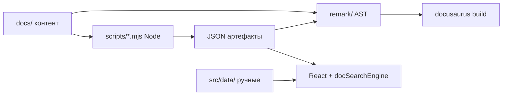
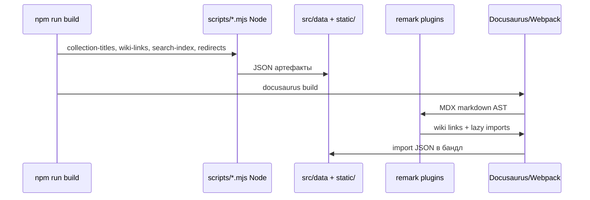

# Данные и скрипты

<span id="dannye-intro"></span>

## Что такое данные, скрипт и контент

**Данные** — структурированная информация, с которой работает сайт помимо текста статей. В it-knowledge-base это [JSON](/encyclopedia/3-data-markup/3-04-konfiguratsii-i-dannye/3)-файлы, [JS-каталоги](#js-каталог) [маршрутов](#маршрут), [индексы](#индекс) для поиска и wiki, карты [редиректов](#редирект). См. [типы данных](/encyclopedia/1-basics/1-09-dannye-i-informatsiya/3) и формат [JSON в энциклопедии](/encyclopedia/3-data-markup/3-04-konfiguratsii-i-dannye/3).

**Контент** — тексты и разметка в `docs/` (~3000 `.md`/`.mdx`). **Данные** живут рядом — в `src/data/`, `static/`, генерируются [скриптами](#скрипт) из `scripts/` на [Node.js](/encyclopedia/5-languages/5-01-javascript/26).

**Скрипт** — программа на Node (`.mjs` в `scripts/`), которая **обходит** `docs/`, [парсит](#парсинг) [frontmatter](#frontmatter), пишет [артефакты](#артефакт) перед `npm start` / `npm run build`. Это слой **автоматизации** поверх [Git](/encyclopedia/4-code-dev/4-13-osnovy-raboty-s-git/intro)-репозитория.



[Поток данных](#поток-данных) отделяет **авторский контент** от **машиночитаемых справочников**, которые питают поиск, wiki, подборки и [enhancement](#enhancement).

---

<span id="два-типа"></span>

## Два типа данных

| Тип | Примеры | Кто меняет |
|-----|---------|------------|
| **Ручные** | `sidebarCollections.js`, `itDesigns.json`, `encyclopediaTermLinks.json` | Автор в PR |
| **Генерируемые** | `wikiLinkIndex.json`, `doc-search-index.json`, `collectionDocTitles.json`, `docLegacyRedirects.json` | `npm run docs:*` |

| Файл | В [git](/encyclopedia/4-code-dev/4-13-osnovy-raboty-s-git/intro) | [Локальность](#локальность) |
|------|------|------------|
| `wikiLinkIndex.json` | в `.gitignore` | каждый dev генерирует при `docs:wiki-links` |
| `docLegacyRedirects.json` | в `.gitignore` | при `docs:redirects` |
| `static/doc-search-index.json` | обычно в репозитории | обновляется при `docs:search-index` |
| `collectionDocTitles.json` | в репозитории | при `docs:collection-titles` (только `build`) |

Без генерации [dev-режим](#dev-режим) (`npm start`) всё равно стартует, но [wiki-поиск](#wiki-поиск) и [редиректы](#редирект) могут быть пустыми или устаревшими.

---

<span id="devbuild"></span>

## dev/build и npm-скрипты

| Команда | `docs:*` перед Docusaurus | Назначение |
|---------|---------------------------|------------|
| **`npm start`** | wiki-links → search-index → redirects | [Dev-режим](/about/kak-ustroena-vselennaya-it/package-i-stek#npm-start), hot reload |
| **`npm run build`** | + collection-titles | [Сборка](/about/kak-ustroena-vselennaya-it/package-i-stek#сборка) [prod](/about/kak-ustroena-vselennaya-it/temy-i-stili#prod) в `build/` |

Полный список `docs:*` — в [package.json и стек](/about/kak-ustroena-vselennaya-it/package-i-stek#пайплайн-контента-docs). Скрипты в `scripts/*.mjs` по умолчанию в `.gitignore`, в репозитории остаются только whitelisted (build-wiki, search-index, redirects, collection-titles, fix-imports…).

---

<span id="src-data"></span>

## src/data/ — справочник

<span id="js-каталог"></span>

### sidebarCollections.js — JS-каталог подборок

[Массив](#массив) `SIDEBAR_COLLECTIONS` — [тематические маршруты](#тематический-маршрут) (emoji, label, [список](#список) doc id). Питает следующие блоки.

- `GettingStartedPaths` на [homepage](/about/kak-ustroena-vselennaya-it/struktura-src#homepage) и `/about/collections`
- `CollectionHub`, `useCollectionArticleLists`
- блоки "В подборках" в статьях (через [enhancement](#enhancement) и данные)

### encyclopediaSections.js

Девять крупных [разделов](/about/kak-ustroena-vselennaya-it/sidebars#раздел) для `UniverseMap`.

<span id="svg"></span>

### techIconRegistry.js + techIconPaths.js

Сопоставление [tech id](#tech-id) (python, docker…) с [SVG](/about/kak-ustroena-vselennaya-it/struktura-src#svg) Simple Icons или emoji. `techIconPaths.js` — [автоген](/about/kak-ustroena-vselennaya-it/struktura-src#автоген) (`docs:tech-icon-paths`).

<span id="префикс-пути"></span>

### techArticlePages.js

Связывает **[префикс пути статьи](#префикс-пути-статьи)** (папка энциклопедии) с [tech id](#tech-id) — для `TechArticleHero` и `DocCard`.

### collectionDocTitles.json

`docId →` [заголовок](#заголовок) для длинных [списков](#список) в `CollectionHub` ([генерация скриптом](#генерация-скриптом) `docs:collection-titles`).

<span id="обогащение"></span>

### encyclopediaTermLinks.json — обогащение

Ручной словарь "термин → URL" для [обогащения](#обогащение) ссылок; подмешивается в `build-wiki-link-index.mjs` после глоссария и уникальных title.

<span id="json-индекс"></span>

### wikiLinkIndex.json — JSON-индекс wiki

```json
{
  "terms": {
    "python": {
      "href": "/encyclopedia/5-languages/5-02-python/intro",
      "kind": "encyclopedia",
      "label": "Python — о разделе"
    }
  }
}
```

Строится `build-wiki-link-index.mjs` из `##` заголовков глоссария, **уникальных** title статей энциклопедии и `encyclopediaTermLinks.json`. Поле **`kind`** — `glossary` | `encyclopedia` | `explicit` | `external` (для CSS-класса ссылки).

### docLegacyRedirects.json

Карта "канонический [путь](#путь) → [массив](#массив) старых путей" для `@docusaurus/plugin-client-redirects`. Учитывает [историю путей](#история-путей), slug из frontmatter, старые кириллические сегменты.

---

<span id="wiki-index"></span>

## build-wiki-link-index.mjs

Запуск — **`npm run docs:wiki-links`** (обязателен перед dev/build).

1. **Обход** `docs/glossary/` — каждый `##` [заголовок](#заголовок) → ключ через `normalizeKey` ([locale](#locale) `ru`, [регистронезависимость](#регистронезависимость)).
2. **Обход** `docs/encyclopedia/` — `title` из [frontmatter](#frontmatter); в индекс попадают только **уникальные** title (дубликаты пропускаются).
3. Слияние с `encyclopediaTermLinks.json` (ручные записи имеют приоритет там, где заданы).
4. Запись `src/data/wikiLinkIndex.json`.

Канонический URL — `resolveDocHref` в `scripts/lib/docUrl.mjs` (как Docusaurus: `slug` или [путь](#путь) от `docs/`).

---

<span id="remark-плагин"></span>

## remark/wikiLink.js — remark-плагин

[Remark-плагин](/about/kak-ustroena-vselennaya-it/package-i-stek#remark-плагины) [CommonJS](/about/kak-ustroena-vselennaya-it/temy-i-stili#commonjs) на этапе [сборки](/about/kak-ustroena-vselennaya-it/package-i-stek#сборка). Синтаксис **только явный**.

```markdown
См. [[Python]] и [[SQL|язык запросов]].
Прямой путь: [[/glossary/intro|глоссарий]].
Внешнее: [[https://example.com|пример]].
```

| Шаг | Действие |
|-----|----------|
| 1 | [Регэксп](#регэксп) `WIKI_LINK_RE` находит `[[...]]` вне code/link/jsx |
| 2 | Термин ищется в `wikiLinkIndex.json` ([регистр](#регистр) нормализуется, `toLocaleLowerCase('ru')`) |
| 3 | [Путь](#путь) с `/` — [явная ссылка](#явная-ссылка); `http` — [внешняя ссылка](#внешняя-ссылка) |
| 4 | Выход — HTML `<a class="wiki-link wiki-link--encyclopedia" href="...">` |

Плагин читает индекс с диска при каждой компиляции MDX — поэтому перед dev нужен свежий `docs:wiki-links`.

---

<span id="lazy-demo"></span>

## remark/lazyMdxDemoImports.js — lazy demo и AST

Автор пишет обычный [import](#import).

```mdx

import ExternalPlayEmbed from '@site/src/components/ExternalPlayEmbed';

```

На этапе сборки remark обходит **[AST](#ast)** (узлы `mdxjsEsm`) и **переписывает** [строку](#строка) import.

```js

import __itLazyExternalEmbed from '@site/src/components/shared/lazyExternalEmbed';

const ExternalPlayEmbed = __itLazyExternalEmbed(
  () => import('@site/src/components/ExternalPlayEmbed'),
  { kind: 'play' }
);
```

Для остальных `@site/src/components/*` (кроме `shared/`).

```js

import __itLazyDemoInView from '@site/src/components/shared/lazyDemoInView';

const Foo = __itLazyDemoInView(() => import('@site/src/components/Foo'));
```

| Обёртка из [shared](/about/kak-ustroena-vselennaya-it/struktura-src#shared) | Когда |
|-------------|-------|
| `lazyExternalEmbed` | `ExternalPlayEmbed`, `ExternalCodeEmbed` — iframe, отдельный [chunk](#chunk) |
| `lazyDemoInView` | Остальные компоненты — [chunk](#chunk) при попадании в [viewport](#viewport) (`IntersectionObserver`) |

[import](#import) в runtime — динамический `import()` возвращает Promise модуля; [webpack](/about/kak-ustroena-vselennaya-it/docusaurus-config#webpack) выделяет async-[chunk](/about/kak-ustroena-vselennaya-it/docusaurus-config#чанк).

---

<span id="поиск-индекс"></span>

## build-doc-search-index.mjs — поиск

Создаёт **`static/doc-search-index.json`** — компактный [JSON-индекс](#json-индекс) для [клиентского движка](#клиентский-движок) `docSearchEngine.js`.

| Поле записи | Источник |
|-------------|----------|
| `u` | URL ([маршрут](#маршрут)) |
| `t` | [title](/about/kak-ustroena-vselennaya-it/sidebars#slug) |
| `d` | [description](#description), усечённая до ~220 символов |
| `s` | раздел из `_category_.json` |
| `a` | теги / аудитория из frontmatter |

- **Обход** всех `.md`/`.mdx` в `docs/` (рекурсивный `walk`)
- [Парсинг](#парсинг) через `gray-matter`
- Поиск в [браузере](/about/kak-ustroena-vselennaya-it/docusaurus-config#браузер) без сервера — [клиент](#клиент) загружает JSON по [HTTP](/encyclopedia/2-system-network/2-04-kak-rabotayut-sayty-i-veb-sayty/intro), [сервер](/encyclopedia/5-languages/5-01-javascript/26) отдаёт статику

Запуск — **`npm run docs:search-index`** (встроен в `start`/`build`).

---

<span id="редирект-скрипт"></span>

## build-doc-redirects.mjs — редирект

Сравнивает канонические slug и **историю путей** (имена папок, кириллица, `/docs/` префикс) → `docLegacyRedirects.json`. Ручные карты в `docusaurus.config.js` (`slugRedirects`) **дополняют** автоматические.

Запуск — **`npm run docs:redirects`**.

---

<span id="enhancement"></span>

## enhancement — DOM-обогащение статей

Отдельно от remark — **клиентские** модули в `src/theme/DocItem/Layout/`.

| Модуль | Роль |
|--------|------|
| `articleMetaEnhancement.ts` | [article tags](/about/kak-ustroena-vselennaya-it/temy-i-stili#article-tags), кликабельные badge |
| `articleSectionEnhancement.ts` | Обёртка [секций](#секция) `.doc-section` вокруг h2 |

**Enhancement** — пост-обработка уже отрисованного HTML ([клиент](/about/kak-ustroena-vselennaya-it/docusaurus-config#браузер)), без изменения markdown в репозитории.

---

<span id="другие-скрипты"></span>

## Другие скрипты docs:*

| npm script | Назначение |
|------------|------------|
| `docs:collection-titles` | [Заголовки](#заголовок) для [подборок](#подборка) |
| `docs:toc` | `docs/toc.md`, общее содержание |
| `docs:demo-registry` | Реестр демо в `info/` |
| `docs:collection-crosslinks` | Перекрёстные ссылки в подборках |
| `docs:context-crosslinks` | Контекст ↔ энциклопедия |
| `docs:fix-mdx-imports` | [import](#import) после frontmatter |
| `docs:fix-frontmatter-blank` | Пустая строка после `---` |
| `docs:check-article-structure` | [Валидация](#валидация) структуры статей |
| `docs:normalize-tags` | Нормализация тегов |
| `docs:tech-icon-paths` | [SVG](#svg) paths из simple-icons |
| `docs:descriptions` / `docs:refine-descriptions` | Массовая правка description |

**[Массовые правки](#массовые-правки)** тысяч файлов — через скрипты `docs:*` из терминала.

---

<span id="frontmatter"></span>

## Frontmatter и сборка MDX

Правила репозитория (`docs-markdown-frontmatter.mdc`).

- Пустая [строка](#строка) после закрывающего `---`
- `title`/`description` со спецсимволами — в кавычках
- `import` в MDX — после frontmatter с пустой строкой

Нарушение ломает [парсинг](#парсинг) MDX при `docusaurus build`. [Валидация](#валидация) — `docs:check-article-structure`, починка — `docs:fix-*`.

---

<span id="поток-данных"></span>

## Поток данных при сборке



**[Клиент и сервер](/encyclopedia/5-languages/5-01-javascript/26)** — скрипты и remark работают на **сервере сборки** (Node); поиск и enhancement — в **клиенте** (браузер после загрузки [бандла](/about/kak-ustroena-vselennaya-it/package-i-stek#бандл)).

---

## Добавление нового источника данных

1. Файл в `src/data/` (JSON или `.js` с ESM export).
2. [import](#import) в компонент — `import x from '@site/src/data/x.json'` ([корень](/about/kak-ustroena-vselennaya-it/docusaurus-config#корень) резолвится через `@site`).
3. Большой файл только на одной странице — dynamic `import()`.
4. Данные **выводятся из** `docs/` — новый `scripts/my-index.mjs` + `docs:my-index` в `package.json`.

---

<span id="глоссарий"></span>

## Глоссарий

<span id="данные"></span>

### Данные

Структурированная информация (JSON, JS-константы), дополняющая markdown-контент.

<span id="скрипт-глоссарий"></span>

### Скрипт

Node-программа в `scripts/*.mjs`, запускаемая через `npm run docs:*`.

<span id="контент"></span>

### Контент

Тексты и MDX в `docs/` — статьи энциклопедии, лаборатории, about.

<span id="json"></span>

### JSON

Формат обмена данными; [статья JSON](/encyclopedia/3-data-markup/3-04-konfiguratsii-i-dannye/3).

<span id="индекс-глоссарий"></span>

### Индекс

Каталог для быстрого поиска — wiki terms, doc-search, redirects.

<span id="json-индекс-глоссарий"></span>

### JSON-индекс

Файл JSON со [списком](#список) записей для поиска или wiki.

<span id="js-каталог"></span>

### JS-каталог

JS-модуль с экспортируемым [массивом](#массив) или объектом (`sidebarCollections.js`).

<span id="маршрут"></span>

### Маршрут

URL страницы (`/encyclopedia/...`); doc id в подборках — путь без `docs/`.

<span id="remark-плагин-глоссарий"></span>

### remark-плагин

Обработчик markdown [AST](#ast) при компиляции MDX.

<span id="node"></span>

### Node

Среда выполнения скриптов сборки. [Node.js](/encyclopedia/5-languages/5-01-javascript/26).

<span id="артефакт"></span>

### Артефакт

Файл, созданный скриптом (`wikiLinkIndex.json`, `doc-search-index.json`).

<span id="сборка"></span>

### Сборка

`npm run build` — скрипты + `docusaurus build` → `build/`.

<span id="start"></span>

### start

`npm start` — docs:* (без collection-titles) + dev-сервер.

<span id="build-глоссарий"></span>

### build

`npm run build` — полный пайплайн включая collection-titles.

<span id="типы-данных"></span>

### Типы данных

Категории значений в JSON/JS (строка, объект, массив). [Типы](/encyclopedia/1-basics/1-09-dannye-i-informatsiya/3).

<span id="gitignore"></span>

### gitignore

Правила Git — какие артефакты не коммитить (`wikiLinkIndex.json`).

<span id="git"></span>

### Git

Система версий репозитория. [Основы Git](/encyclopedia/4-code-dev/4-13-osnovy-raboty-s-git/intro).

<span id="локальность"></span>

### Локальность

Генерация на машине разработчика; индекс wiki/redirects не обязан быть в remote.

<span id="dev-режим"></span>

### dev-режим

`docusaurus start` с hot reload и предварительными `docs:*`.

<span id="wiki-поиск"></span>

### wiki-поиск

Разрешение `[[термин]]` по `wikiLinkIndex.json` в remark.

<span id="редирект-глоссарий"></span>

### Редирект

Перенаправление старого URL на канонический.

<span id="массив"></span>

### Массив

JSON/JS структура `[a, b, c]` — списки doc id в подборках.

<span id="тематический-маршрут"></span>

### Тематический маршрут

[Подборка](#подборка) статей с label и emoji (`SIDEBAR_COLLECTIONS`).

<span id="enhancement-глоссарий"></span>

### enhancement

Клиентское DOM-обогащение после рендера статьи.

<span id="подборка"></span>

### Подборка

Кураторский [список](#список) статей по теме (Старт в IT, DevOps…).

<span id="homepage-глоссарий"></span>

### homepage

Главная `/` — потребляет подборки и секции.

<span id="svg-глоссарий"></span>

### SVG

Векторные иконки в `techIconPaths.js`.

<span id="префикс-пути-статьи"></span>

### Префикс пути статьи

Начало пути doc id (`encyclopedia/5-languages/5-02-python/`) → tech id.

<span id="tech-id"></span>

### tech id

Ключ технологии в реестре (`python`, `docker`).

<span id="список"></span>

### Список

Упорядоченная последовательность id или заголовков.

<span id="обогащение-глоссарий"></span>

### Обогащение

Добавление ссылок/метаданных — term links, crosslink-скрипты, enhancement.

<span id="kind"></span>

### kind

Тип wiki-записи — glossary, encyclopedia, explicit, external.

<span id="заголовок"></span>

### Заголовок

`title` в frontmatter или `##` в глоссарии — ключ wiki-индекса.

<span id="регэксп"></span>

### Регэксп

Регулярное выражение — поиск `[[...]]` в wikiLink и import в lazyMdx.

<span id="регистр"></span>

### Регистр

Верхний/нижний регистр символов; нормализация ключей wiki.

<span id="регистронезависимость"></span>

### Регистронезависимость

`[[Python]]` и `[[python]]` находят один термин (`toLocaleLowerCase('ru')`).

<span id="locale"></span>

### locale

Локаль `'ru'` для корректного lowerCase кириллицы.

<span id="явная-ссылка"></span>

### Явная ссылка

`[[/path|подпись]]` или `encyclopedia/...` без поиска в индексе.

<span id="корень"></span>

### Корень

Корень репозитория; `@site` → `src/`.

<span id="путь"></span>

### Путь

Файловый путь в `docs/` или URL slug.

<span id="внешний-источник"></span>

### Внешний источник

Данные вне `docs/` — simple-icons, play/code сервисы.

<span id="внешняя-ссылка"></span>

### Внешняя ссылка

`[[https://...]]` — [HTTP](/encyclopedia/2-system-network/2-04-kak-rabotayut-sayty-i-veb-sayty/intro) URL.

<span id="http"></span>

### HTTP

Протокол загрузки статики и поискового индекса.

<span id="devbuild-глоссарий"></span>

### dev/build

Два режима npm — разработка vs продакшен-сборка.

<span id="import"></span>

### import

Подключение модуля; статический в MDX, динамический `import()` в lazy-обёртках. [Модули JS](/encyclopedia/5-languages/5-01-javascript/40).

<span id="ast"></span>

### AST

Abstract Syntax Tree — дерево разбора markdown/MDX для remark.

<span id="shared"></span>

### shared

`src/components/shared/` — lazyDemo, lazyDemoInView, lazyExternalEmbed.

<span id="lazy-demo-глоссарий"></span>

### lazy demo

Отложенная загрузка демо-компонентов через remark + `import()`.

<span id="chunk"></span>

### chunk

Отдельный JS-файл бандла, подгружаемый async.

<span id="viewport"></span>

### viewport

Видимая область окна; `IntersectionObserver` в lazyDemoInView.

<span id="обход"></span>

### Обход

Рекурсивный проход по папке `docs/` в скриптах.

<span id="парсинг"></span>

### Парсинг

Разбор файла — `gray-matter`, remark, регэксп wiki.

<span id="description"></span>

### description

Поле frontmatter; попадает в поисковый индекс (усечённое).

<span id="клиентский-движок"></span>

### Клиентский движок

`docSearchEngine.js` — поиск по JSON в браузере.

<span id="клиент"></span>

### Клиент

Браузер пользователя — поиск, enhancement, React.

<span id="сервер"></span>

### Сервер

Node при сборке; статический хостинг для prod HTML/JSON.

<span id="история-путей"></span>

### История путей

Старые slug и имена папок для редиректов.

<span id="валидация"></span>

### Валидация

Проверка структуры статей (`docs:check-article-structure`).

<span id="строка"></span>

### Строка

Тип данных; также строка исходника MDX/import в AST.

<span id="массовые-правки"></span>

### Массовые правки

Пакетное изменение тысяч md/mdx через `docs:fix-*`, `docs:normalize-tags`.

<span id="frontmatter-глоссарий"></span>

### frontmatter

YAML в начале `.md`/`.mdx` — title, description, slug, tags.

<span id="поток-данных-глоссарий"></span>

### Поток данных

Цепочка docs → scripts → JSON → remark/webpack → клиент.

<span id="секция"></span>

### Секция

Логический блок статьи под h2 (enhancement `.doc-section`).

<span id="подборка-глоссарий"></span>

### Подборка

См. [тематический маршрут](#тематический-маршрут).

<span id="генерация-скриптом"></span>

### Генерация скриптом

Автоматическое создание JSON из обхода `docs/`.

---

## Связь с другими главами

- [package.json и стек](/about/kak-ustroena-vselennaya-it/package-i-stek) — полный список `docs:*`, пайплайн.
- [docusaurus.config.js](/about/kak-ustroena-vselennaya-it/docusaurus-config) — `remarkPlugins`, redirects, `slugRedirects`.
- [Структура src/](/about/kak-ustroena-vselennaya-it/struktura-src) — `data/`, `remark/`, DocSearch.
- [sidebars.js](/about/kak-ustroena-vselennaya-it/sidebars) — id документов в подборках.
- [Компоненты](/about/kak-ustroena-vselennaya-it/komponenty) — как данные доходят до React.

## Полезные статьи энциклопедии

- [JSON](/encyclopedia/3-data-markup/3-04-konfiguratsii-i-dannye/3)
- [YAML и конфигурации](/encyclopedia/3-data-markup/3-04-konfiguratsii-i-dannye/4)
- [Типы данных](/encyclopedia/1-basics/1-09-dannye-i-informatsiya/3)
- [Node.js](/encyclopedia/5-languages/5-01-javascript/26)
- [JavaScript — модули import/export](/encyclopedia/5-languages/5-01-javascript/40)
- [Основы работы с Git](/encyclopedia/4-code-dev/4-13-osnovy-raboty-s-git/intro)
- [Markdown и текст в веб](/encyclopedia/1-basics/1-15-tekst/5)
- [Как работают сайты](/encyclopedia/2-system-network/2-04-kak-rabotayut-sayty-i-veb-sayty/intro)
- [DevOps, CI/CD](/encyclopedia/8-infra-security/8-04-devops-ci-cd/intro)
- [npm — команды и зависимости](/encyclopedia/5-languages/5-01-javascript/265)
