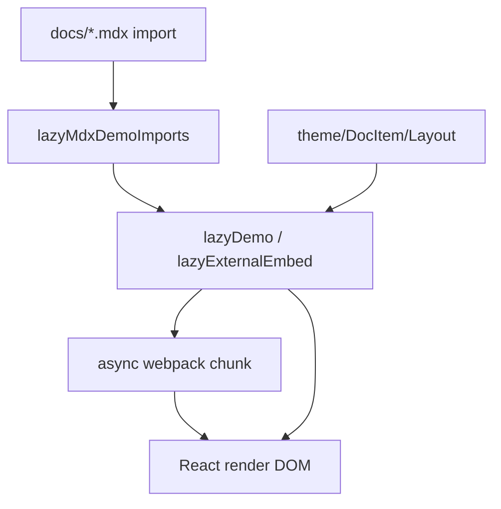
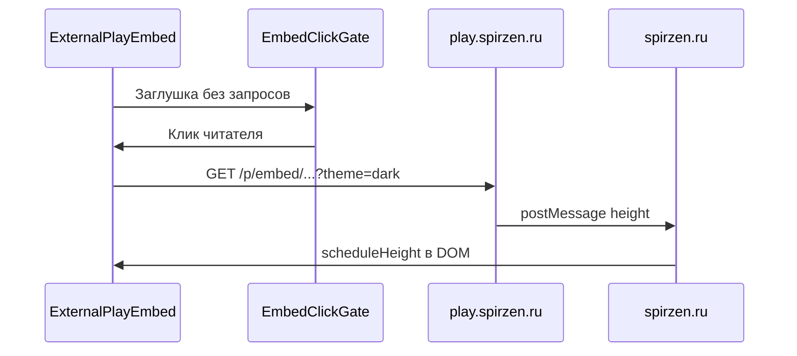

import ExternalPlayEmbed from '@site/src/components/ExternalPlayEmbed';

# Компоненты

<span id="komponenty-intro"></span>

## Что такое компонент

**Компонент** — переиспользуемый блок [UI](/about/kak-ustroena-vselennaya-it/package-i-stek#ui) на [React](/encyclopedia/5-languages/5-01-javascript/27). В Docusaurus это функция или класс, возвращающая JSX; в статьях подключают через [import](#import-компонентов) в MDX или из [swizzle-темы](/about/kak-ustroena-vselennaya-it/struktura-src#theme).

**[React-компоненты](#react-компоненты)** в it-knowledge-base — **[мост](#мост)** между ~3000 MDX-[статей](/about/kak-ustroena-vselennaya-it/dannye-i-skripty#статья) и [интерактивом](#интерактив), поиском, [подборками](/about/kak-ustroena-vselennaya-it/dannye-i-skripty#подборка), PDF. Глобальной регистрации MDX-компонентов **нет** — каждая статья **импортирует виджеты явно**. Исключение — [article chrome](/about/kak-ustroena-vselennaya-it/struktura-src#article-chrome) в `theme/DocItem/Layout` (PDF, hero, related автоматически).

Учебник — [React, компоненты и JSX](/encyclopedia/5-languages/5-01-javascript/275).



---

<span id="три-способа"></span>

## Три способа появления на странице

| Способ | Примеры | Где настраивается |
|--------|---------|-------------------|
| **Import в MDX** | `ExternalPlayEmbed`, `CollectionHub` | Сама статья `.mdx` |
| **Theme layout** | `ArticlePdfExport`, `TechArticleHero` | `src/theme/DocItem/Layout/index.tsx` |
| **Pages / Navbar** | `UniverseMap`, `DocSearchBar` | `src/pages/index.js`, `NavbarItem/DocSearch` |

**[Связь между собой](#связь-между-собой)** — [shared](/about/kak-ustroena-vselennaya-it/struktura-src#shared) [кирпичи](#кирпич), [данные](/about/kak-ustroena-vselennaya-it/dannye-i-skripty#src-data) из `src/data/`, [константы](/about/kak-ustroena-vselennaya-it/struktura-src#constants) URL, [клиентский движок](/about/kak-ustroena-vselennaya-it/dannye-i-skripty#клиентский-движок) поиска.

---

<span id="import-компонентов"></span>

## Импорт компонентов в MDX

```mdx
---
title: Моя статья
description: "Краткое описание."
slug: /encyclopedia/example/1
---

import ExternalPlayEmbed from '@site/src/components/ExternalPlayEmbed';

# Заголовок

Текст параграфа.

<ExternalPlayEmbed example="about/data-types-play" title="Типы данных" />
```

Три правила при подключении в MDX.

1. **Пустая строка** после `---` [frontmatter](/about/kak-ustroena-vselennaya-it/dannye-i-skripty#frontmatter).
2. Алиас **`@site/src/components/...`** (относительный путь из `docs/` не резолвится).
3. PascalCase в JSX — `<ExternalPlayEmbed />`.

[Remark](/about/kak-ustroena-vselennaya-it/dannye-i-skripty#lazy-demo) `lazyMdxDemoImports` на [сборке](/about/kak-ustroena-vselennaya-it/package-i-stek#сборка) заменит import на [lazy-обёртку](#lazy-обёртка). **В исходнике пишите обычный import** — как в примере выше.

<span id="mdx-добавление"></span>

### MDX и добавление нового виджета

1. Файл в `src/components/MyWidget.jsx` (или `.tsx`).
2. `import` в нужных `.mdx`.
3. `npm start` — проверить Network (async [chunk](#chunk) при скролле или клике).
4. Тяжёлый [интерактив](#интерактив) — [play.spirzen.ru](#playspirzenru) + `ExternalPlayEmbed` для демо вне репозитория.

---

<span id="как-работает"></span>

## Как всё подключается — цепочка embed

| Этап | Слой | Действие |
|------|------|----------|
| 1 | Автор | Пишет `<ExternalPlayEmbed example="slug" />` в MDX |
| 2 | remark | Переписывает import → `lazyExternalEmbed(...)` |
| 3 | [lazy-обёртка](#lazy-обёртка) | [EmbedClickGate](#gate) — [click-to-load](#click-to-load) |
| 4 | React | `import()` грузит [chunk](#chunk) `ExternalPlayEmbed` |
| 5 | [BrowserOnly](#browseronly) | [Рендер](#рендер) только в [браузере](/about/kak-ustroena-vselennaya-it/docusaurus-config#браузер) |
| 6 | [iframe](#iframe) | `src="https://play.spirzen.ru/p/embed/slug/?theme=dark"` |
| 7 | play → parent | [postMessage](#postmessage) высоты; [trusted origin](#trusted-origin) |
| 8 | [DOM](#dom) | Контейнер подстраивает высоту, опционально fullscreen |

Подробнее об архитектуре — [Архитектура](/about/kak-ustroena-vselennaya-it/arkhitektura), [интерактив](/about/interactive).

---

<span id="эталон"></span>

## ExternalPlayEmbed — эталон embed

Назначение — встроить демо с **[play.spirzen.ru](#playspirzenru)** в [iframe](#iframe) с авто-высотой, [click-to-load](#click-to-load), fullscreen.

<span id="props"></span>

### Props

| Prop | Тип | Описание |
|------|-----|----------|
| `example` | `string` | Slug демо → `/p/embed/<slug>/` |
| `title` | `string` | Подпись для [a11y](#a11y) и UI |
| `minHeight` | `number` | Минимальная высота до postMessage (default 320) |
| `autoLoad` | `boolean` | [Автоматическая загрузка](#автоматическая-загрузка) iframe без клика |
| `playProps` | `object` | [Query-параметры](#query-параметры) для play |
| `embedData` | `object` | Данные в iframe через postMessage |
| `src` | `string` | Полный [URL](#url) вместо `example` — [escape hatch](#escape-hatch) |

### Схема интеграции



```jsx
const url = new URL(buildPlayEmbedUrl(baseUrl, example));
url.searchParams.set('theme', theme);
```

`baseUrl` — `siteConfig.customFields.playExamplesUrl` ([prod](/about/kak-ustroena-vselennaya-it/temy-i-stili#prod) или localhost:4322). [API](#api) URL в `src/constants/playExamples.js`.

### Живой пример на этой странице

<ExternalPlayEmbed example="about/data-types-play" title="Типы данных (демо)" />

---

<span id="externalcodeembed"></span>

## ExternalCodeEmbed

Аналог для **[code.spirzen.ru](/about/kak-ustroena-vselennaya-it/struktura-src#codespirzenru)** — пути `/e/embed/<slug>/`. [Trusted origin](#trusted-origin) для postMessage — `src/constants/codeExamples.js`.

```mdx

import ExternalCodeEmbed from '@site/src/components/ExternalCodeEmbed';

<ExternalCodeEmbed example="python/hello-world" title="Hello World" />
```

---

<span id="lazy-обёртка"></span>

## Lazy-обёртка — как делать

Автор **не пишет** lazy вручную — remark подставляет обёртку при [сборке](/about/kak-ustroena-vselennaya-it/dannye-i-skripty#lazy-demo).

### lazyExternalEmbed (play/code)

```js
// после remark в скомпилированном MDX

import __itLazyExternalEmbed from '@site/src/components/shared/lazyExternalEmbed';

const ExternalPlayEmbed = __itLazyExternalEmbed(
  () => import('@site/src/components/ExternalPlayEmbed'),
  { kind: 'play' }
);
```

Как работает `lazyExternalEmbed.js`.

1. До активации — только `EmbedClickGate` (нет iframe, нет внешних [запросов](#запросы)).
2. После клика — `React.lazy` + [Suspense](#suspense) + `autoLoad` на внутренний компонент.
3. Обёртка снаружи — [BrowserOnly](#browseronly).

### lazyDemo / lazyDemoInView (остальные)

```js
const Foo = __itLazyDemoInView(() => import('@site/src/components/Foo'));
```

| Обёртка | Когда |
|---------|-------|
| `lazyExternalEmbed` | iframe play/code — отдельный [chunk](#chunk), [сериализация](#сериализация) через `embedLoadQueue` |
| `lazyDemoInView` | Остальные `@site/src/components/*` — [chunk](#chunk) при попадании в [viewport](#viewport) |
| `lazyDemo` | В theme layout — без viewport, сразу lazy при монтировании layout |

**Не импортируйте `shared/` из MDX** — remark оборачивает только корень `components/`.

### Создать свою lazy-обёртку (редко)

Паттерн как в `lazyDemo.js`.

```js

import React, {lazy, Suspense} from 'react';

export default function lazyMyWidget(importFn) {
  const Lazy = lazy(importFn);
  return function Wrapped(props) {
    return (
      <Suspense fallback={<div role="status">Загрузка…</div>}>
        <Lazy {...props} />
      </Suspense>
    );
  };
}
```

Для MDX достаточно положить файл в `components/` — `lazyMdxDemoImports` подхватит автоматически.

---

<span id="shared"></span>

## shared/ — кирпичи инфраструктуры

| Модуль | Роль |
|--------|------|
| `lazyDemo.js` | `React.lazy` + [Suspense](#suspense) |
| `lazyDemoInView.js` | Lazy + `IntersectionObserver` |
| `lazyExternalEmbed.js` | Очередь iframe, [BrowserOnly](#browseronly) |
| `EmbedClickGate.jsx` | UI [gate](#gate) "Запустить демо" |
| `embedLoadQueue.js` | [Сериализация](#сериализация) — max 2 iframe одновременно |
| `useEmbedViewport.js` | Стабильный src, высота, in-view mount |
| `embedScrollLock.js` | [Блокировка скролла](#блокировка-скролла) в fullscreen |
| `deferredIdle.js` | [idle](#idle) — `requestIdleCallback` |
| `demoFallback.jsx` | Скелетоны загрузки |

**[Кирпич](#кирпич)** — мелкий модуль без публичного MDX-API; **[обёртка](#обёртка)** в корне `components/` — то, что импортируют статьи.

---

<span id="click-to-load"></span>

## click-to-load и autoLoad

| Режим | Когда | Сеть при открытии статьи |
|-------|-------|--------------------------|
| **click-to-load** (default) | Embed play/code через `lazyExternalEmbed` | **Нет** запросов к play/code до клика |
| **autoLoad** | Prop на `ExternalPlayEmbed` после активации gate | iframe грузится сразу после клика на gate |
| **lazyDemoInView** | Обычные виджеты | [Подгрузка](#подгрузка) [chunk](#chunk) при скролле к блоку |

[Автоматическая загрузка](#автоматическая-загрузка) всего iframe без gate **перегружает** страницу с десятками демо — в проде gate обязателен; `autoLoad={true}` только для осознанных случаев.

---

<span id="postmessage"></span>

## postMessage, API и trusted origin

Контракт spirzen ↔ play/code — **[postMessage](/about/kak-ustroena-vselennaya-it/arkhitektura)** + [URL](#url) slug, без отдельного REST на каждую статью.

| Сообщение | Направление | Смысл |
|-----------|-------------|-------|
| `it-play-embed-height` | play → parent | Высота для [DOM](#dom) |
| `it-play-theme` | parent → play | [Синхронизация](#синхронизация) light/dark |
| `it-play-embed-data` | parent → play | Произвольный payload |
| `it-play-fullscreen` | play → parent | Режим на весь экран |

**[Trusted origin](#trusted-origin)** — whitelist в `PLAY_TRUSTED_ORIGINS` / `CODE_EXAMPLES_TRUSTED_ORIGINS`; чужой `event.origin` игнорируется.

**[Query-параметры](#query-параметры)** — `?theme=light|dark`, доп. ключи через `playProps` в [URL](/encyclopedia/2-system-network/2-04-kak-rabotayut-sayty-i-veb-sayty/intro).

---

<span id="browseronly"></span>

## BrowserOnly — подробно

**`BrowserOnly`** — компонент Docusaurus (`@docusaurus/BrowserOnly`), который **рендерит детей только на клиенте**, после гидратации. На сервере ([SSR](#ssr)) при `docusaurus build` React генерирует HTML **без** кода, требующего `window`, `document`, `localStorage`, `iframe`.

### Зачем нужен

| Проблема без BrowserOnly | Пример |
|------------------------|--------|
| `window is not defined` | `postMessage`, `IntersectionObserver` |
| Расхождение SSR/клиент | Случайные id, размеры viewport |
| Лишняя работа на сервере | DocSearch, PDF export |

Docusaurus — [SSG](/about/kak-ustroena-vselennaya-it/arkhitektura) + гидратация. Компонент с прямым доступом к `window` в теле функции **упадёт при prerender**.

### Два способа использования

**1. Fallback на сервере**

```jsx
<BrowserOnly fallback={<div role="status">Загрузка…</div>}>
  {() => <ExternalPlayEmbedInner {...props} />}
</BrowserOnly>
```

На SSR и до гидратации показывается `fallback` (скелетон, пустой `null`). После mount в браузере вызывается **функция-ребёнок** `() => <Inner />`.

**2. Children как render prop**

Дети **должны быть функцией** `() => ReactNode`, не готовым JSX. Иначе код с `window` выполнится при импорте модуля на сервере.

### Где используется в проекте

| Компонент | Fallback |
|-----------|----------|
| `ExternalPlayEmbed` / `ExternalCodeEmbed` | Скелетон с `role="status"` |
| `lazyExternalEmbed` | Сообщение "Подготовка embed…" |
| `ArticlePdfExport` | `null` |
| `DocSearchBar` | Упрощённая кнопка без модалки |
| `LabTrainersHub`, `RandomArticle` | `demoLoadingFallback` |
| `DeveloperExamPlay` | Текст загрузки экзамена |

### BrowserOnly vs useEffect

| Подход | Когда |
|--------|-------|
| **BrowserOnly** | Весь компонент бесполезен без DOM (embed, поиск, PDF) |
| **useEffect** | Часть логики клиентская (`TechArticleHero` вставляет иконку в h1 после mount) |
| **typeof window !== 'undefined'** | В [clientModules](/about/kak-ustroena-vselennaya-it/struktura-src#clientmodules), отдельно от MDX-компонентов |

`TechArticleHero` **без** BrowserOnly — при SSR возвращает `null`, в `useEffect` ищет `h1` в [DOM](#dom) и монтирует `createRoot`.

### a11y с BrowserOnly

Fallback должен иметь `role="status"` или `aria-live="polite"`, чтобы скринридер не молчал при [подгрузке](#подгрузка) тяжёлого блока.

---

<span id="theme-layout"></span>

## Theme layout — без MDX

```tsx
const ArticlePdfExport = lazyDemo(() => import('@site/src/components/ArticlePdfExport'));
const TechArticleHero = lazyDemo(() => import('@site/src/components/TechArticleHero'));
```

В layout после контента — `<ArticlePdfExport />`, `<TechArticleHero />`, `<ArticleRelated />`, `<ArticleSeeAlso />`.

`TechArticleHero` **props из MDX не принимает** — читает `useDoc()`, `techArticlePages.js`, вставляет иконку у `h1` через [DOM](/about/kak-ustroena-vselennaya-it/struktura-src#enhancement).

`articleMetaEnhancement.ts` после [idle](#idle) делает теги кликабельными → `/tags/...`.

---

<span id="хаб"></span>

## Хабы, каталоги, виджеты

### CollectionHub — каталог подборки

```mdx

import CollectionHub from '@site/src/components/CollectionHub';

<CollectionHub label="Первые шаги" />
```

`sidebarCollections.js` + `collectionDocTitles.json` → полный [список](/about/kak-ustroena-vselennaya-it/dannye-i-skripty#список) статей по [label](#label).

### GettingStartedPaths, LabTrainersHub

[Хабы](/about/kak-ustroena-vselennaya-it/struktura-src#хаб) маршрутов и **[тренажёров](/about/kak-ustroena-vselennaya-it/struktura-src#embed)** — карточки, ссылки на `/lab/`, play-демо.

### RandomChecklistItem / RandomQuestionFromArticle

[Парсинг](#парсинг) списков "Проверь себя" из [DOM](#dom-глоссарий) (`articleExtract.js`), **[случайность](#случайность)** одного пункта.

### DocSearch

Не в MDX. Цепочка — `Root` → `DocSearchProvider` → navbar → Ctrl+K → `docSearchEngine.js` + [индекс](/about/kak-ustroena-vselennaya-it/dannye-i-skripty#поиск-индекс).

### DesignThemePicker

[TSX](/about/kak-ustroena-vselennaya-it/typescript) в navbar — [стилизация](/about/kak-ustroena-vselennaya-it/temy-i-stili) через `applyItDesign`.

---

<span id="толстые-и-тонкие"></span>

## Толстые и тонкие компоненты

| Тип | Примеры | Где логика |
|-----|---------|------------|
| **Тонкие** | `CollectionHub`, `SpirzenOnlineToolLink` | [Рендер](#рендер) [данных](/about/kak-ustroena-vselennaya-it/dannye-i-skripty#данные) |
| **Толстые** | `ExternalPlayEmbed`, `LabTrainersHub` | iframe, postMessage, state, [оптимизация](#оптимизация) |
| **Вынесенные** | WebGL, [эмуляция](#эмуляция), длинный код | **[play.spirzen.ru](#playspirzenru)** / code, в статье только [embed](#embed) |

**[Виджеты](#виджеты)** — самодостаточный блок в тексте (демо, случайный вопрос, хаб). **[Интерактив](#интерактив)** с [WebGL](/encyclopedia/9-spinoff/9-08-kompyuternaya-grafika/intro) или тяжёлой [эмуляцией](#эмуляция) — отдельный сервис play, не `src/components/`.

---

<span id="стилизация"></span>

## Стилизация и глобальные классы

| Подход | Когда |
|--------|-------|
| **CSS module** (`*.module.css`) | Изолированный UI компонента — предпочтительно |
| **[Глобальные классы](/about/kak-ustroena-vselennaya-it/temy-i-stili#глобальный-стиль)** | Система статей — `.callout`, `.article-tags`, `.wiki-link` в `custom.css` |
| Infima `--ifm-*` | Согласование с [темой](/about/kak-ustroena-vselennaya-it/temy-i-stili) |

[Стилизация компонентов](#стилизация-компонентов) не должна ломать [типографику](/about/kak-ustroena-vselennaya-it/temy-i-stili#типографика) `.theme-doc-markdown`.

---

<span id="бандл"></span>

## Бандл, chunks и оптимизация

`docusaurus.config.js` → `splitChunks`.

- `vendor-react`, `vendor-docusaurus`, `vendor-prism`
- `itEmbed` — async [ExternalPlayEmbed](/about/kak-ustroena-vselennaya-it/struktura-src#embed) / ExternalCodeEmbed
- `itDemoAsync` — остальные компоненты до ~200 KB
- `itMermaid` — диаграммы

**[Перегруз](#перегруз)** страницы — десятки синхронных демо; лечится gate + lazyDemoInView + `embedLoadQueue`. **[Оптимизация](/about/kak-ustroena-vselennaya-it/arkhitektura)** — [ленивая подгрузка](/about/kak-ustroena-vselennaya-it/struktura-src#ленивая-загрузка), idle enhancement, prefetch limit в clientModules.

---

<span id="создание"></span>

## Как создать новый компонент — чеклист

| Сценарий | Решение |
|----------|---------|
| WebGL, эмулятор, тяжёлый UI | **play.spirzen.ru** + `ExternalPlayEmbed` |
| Виджет в 1–2 статьях | `src/components/MyWidget.jsx` |
| Блок на всех статьях | `DocItem/Layout` + `lazyDemo` |
| Данные + список ссылок | `data/*.json` + тонкий компонент |

```jsx
// src/components/MyWidget.jsx

import React from 'react';
import BrowserOnly from '@docusaurus/BrowserOnly';
import styles from './MyWidget.module.css';

/** @param {{ label: string }} props */
export default function MyWidget({ label }) {
  return (
    <BrowserOnly fallback={<span>{label}</span>}>
      {() => <div className={styles.root}>{label}</div>}
    </BrowserOnly>
  );
}
```

```bash
npm start
npm run build
```

---

## Частые ошибки

| Ошибка | Симптом | Исправление |
|--------|---------|-------------|
| Нет пустой строки после frontmatter | MDX compile error | Пустая строка после `---` |
| `@theme` вместо `@site` | Module not found | Проектные компоненты — `@site/src/...` |
| `window is not defined` | Падение SSR | [BrowserOnly](#browseronly) или `useEffect` |
| iframe пустой локально | play/code не запущены | localhost:4321/4322 или env |
| postMessage высота 0 | Неверный origin | `TRUSTED_ORIGINS` в constants |
| slug не в play | 404 в iframe | `docs:demo-registry`, синхрон slug |
| import из `shared/` в MDX | Нет lazy-обёртки | Только корень `components/` |

---

## Реестр демо

`info/demo-registry.md` (`docs:demo-registry`). Slug в `example="..."` должен существовать на play.

---

## Шпаргалка импортов

```mdx

import ExternalPlayEmbed from '@site/src/components/ExternalPlayEmbed';
import ExternalCodeEmbed from '@site/src/components/ExternalCodeEmbed';
import CollectionHub from '@site/src/components/CollectionHub';
import LabTrainersHub from '@site/src/components/LabTrainersHub';
import GettingStartedPaths from '@site/src/components/GettingStartedPaths';
import RandomChecklistItem from '@site/src/components/RandomChecklistItem';
import RandomQuestionFromArticle from '@site/src/components/RandomQuestionFromArticle';
import DeveloperExamPlay from '@site/src/components/DeveloperExamPlay';
import DocCardList from '@theme/DocCardList';

```

`DocCardList` — компонент темы; remark **не** оборачивает `@theme/*` в lazy.

---

<span id="глоссарий"></span>

## Глоссарий

<span id="компонент-глоссарий"></span>

### Компонент

Переиспользуемый блок UI на React.

<span id="react-компоненты"></span>

### React-компоненты

Функции/классы с JSX в `src/components/` и `src/theme/`.

<span id="мост"></span>

### Мост

Связь MDX-контента с интерактивом, данными и темой.

<span id="интерактив"></span>

### Интерактив

Исполняемые демо, тренажёры, play/code embeds.

<span id="импорт-глоссарий"></span>

### Импорт компонентов

`import X from '@site/src/components/X'` в MDX.

<span id="связь-между-собой"></span>

### Связь между собой

Компоненты → shared → data/constants → внешние сервисы.

<span id="embed-глоссарий"></span>

### embed

Встраивание play/code через iframe.

<span id="эталон"></span>

### Эталон

`ExternalPlayEmbed` — образец для новых embed.

<span id="демо"></span>

### Демо

Интерактивный пример в статье.

<span id="iframe-глоссарий"></span>

### iframe

Вложенный документ play/code.

<span id="playspirzenru"></span>

### play.spirzen.ru

Сервис интерактива, `/p/embed/<slug>/`.

<span id="lazy-обёртка-глоссарий"></span>

### lazy-обёртка

`lazyExternalEmbed`, `lazyDemoInView` — отложенный import.

<span id="props-глоссарий"></span>

### props

Входные параметры JSX (`example`, `title`, …).

<span id="click-to-load-глоссарий"></span>

### click-to-load

Загрузка embed только после клика (EmbedClickGate).

<span id="автоматическая-загрузка"></span>

### Автоматическая загрузка

`autoLoad` — iframe сразу после gate.

<span id="a11y"></span>

### a11y

Доступность — `role`, `aria-label`, клавиатура. [CSS a11y](/encyclopedia/3-data-markup/3-10-css/117).

<span id="postmessage-глоссарий"></span>

### postMessage

API обмена сообщениями с iframe.

<span id="api"></span>

### API

Контракт URL/postMessage между spirzen и play/code.

<span id="подгрузка"></span>

### Подгрузка

Async загрузка chunk или iframe.

<span id="запросы"></span>

### Запросы

HTTP к play/code — только после активации gate.

<span id="query-параметры"></span>

### query-параметры

`?theme=dark` и `playProps` в URL iframe.

<span id="url"></span>

### URL

Адрес embed, полной страницы play, статьи.

<span id="escape-hatch"></span>

### escape hatch

Prop `src` — полный URL вместо `example`.

<span id="trusted-origin"></span>

### trusted origin

Whitelist доменов для postMessage.

<span id="кирпич"></span>

### Кирпич

Мелкий модуль в `shared/`.

<span id="shared-глоссарий"></span>

### shared

`src/components/shared/` — инфраструктура embed/lazy.

<span id="обёртка"></span>

### Обёртка

HOC вокруг lazy/import (lazyDemo, lazyExternalEmbed).

<span id="import"></span>

### import

Статический в MDX; динамический `import()` в lazy.

<span id="lazydemo-глоссарий"></span>

### lazyDemo

`React.lazy` + Suspense для theme layout.

<span id="сериализация"></span>

### Сериализация

`embedLoadQueue` — не более 2 iframe параллельно.

<span id="блокировка-скролла"></span>

### Блокировка скролла

`embedScrollLock` при fullscreen embed.

<span id="suspense"></span>

### Suspense

React — показ fallback пока lazy chunk грузится.

<span id="autoload"></span>

### autoLoad

Prop — пропустить внутренний gate после внешнего клика.

<span id="gate"></span>

### gate

EmbedClickGate — UI до загрузки iframe.

<span id="mdx"></span>

### MDX

Markdown + JSX; точка вставки компонентов.

<span id="idle"></span>

### idle

`scheduleIdleWork` — отложенный DOM enhancement.

<span id="dom-глоссарий"></span>

### DOM

Дерево страницы в браузере.

<span id="хаб-глоссарий"></span>

### Хаб

Агрегатор ссылок (CollectionHub, LabTrainersHub).

<span id="каталог"></span>

### Каталог

Список демо или статей с метаданными.

<span id="label"></span>

### label

Подпись подборки или кнопки.

<span id="рендер"></span>

### Рендер

Отрисовка React в DOM.

<span id="парсинг"></span>

### Парсинг

Разбор DOM/markdown (RandomQuestion, articleExtract).

<span id="случайность"></span>

### Случайность

RandomArticle, RandomChecklistItem — pick из набора.

<span id="индекс"></span>

### Индекс

doc-search-index, demo-registry.

<span id="ts-tsx"></span>

### TS и TSX

TypeScript-компоненты (DesignThemePicker, theme).

<span id="webgl"></span>

### WebGL

3D в браузере — на play.spirzen.ru, вне энциклопедии.

<span id="эмуляция"></span>

### Эмуляция

Эмуляторы CPU/сети — play.spirzen.ru.

<span id="тренажёры"></span>

### Тренажёры

Интерактивные упражнения лаборатории.

<span id="виджеты"></span>

### Виджеты

Вставляемые блоки в тексте статьи.

<span id="толстые-и-тонкие"></span>

### Толстые и тонкие компоненты

Много логики vs тонкий рендер данных.

<span id="browseronly-глоссарий"></span>

### BrowserOnly

Docusaurus — рендер только на клиенте, защита SSR.

<span id="глобальные-классы"></span>

### Глобальные классы

`.callout`, `.wiki-link` в custom.css.

<span id="ssr"></span>

### SSR

Server-Side Rendering при `docusaurus build`.

<span id="синхронизация"></span>

### Синхронизация

theme/colorMode ↔ iframe через postMessage и query.

<span id="стилизация-компонентов"></span>

### Стилизация компонентов

CSS modules + Infima variables.

<span id="бандл-глоссарий"></span>

### Бандл

Собранный JS; splitChunks в config.

<span id="перегруз"></span>

### Перегруз

Слишком много sync iframe/chunks на одной странице.

<span id="оптимизация"></span>

### Оптимизация

lazy, gate, queue, idle, viewport.

<span id="chunk-глоссарий"></span>

### chunk

Отдельный JS-файл async import.

<span id="viewport-глоссарий"></span>

### viewport

Видимая область; IntersectionObserver.

---

## Связь с другими главами

- [Интерактив](/about/interactive) — витрина для читателя.
- [Архитектура](/about/kak-ustroena-vselennaya-it/arkhitektura) — iframe, play, code, postMessage.
- [Данные и скрипты](/about/kak-ustroena-vselennaya-it/dannye-i-skripty) — lazyMdxDemoImports.
- [Структура src/](/about/kak-ustroena-vselennaya-it/struktura-src) — components/, shared/.
- [TypeScript](/about/kak-ustroena-vselennaya-it/typescript) — TSX в theme и picker.
- [Темы и стили](/about/kak-ustroena-vselennaya-it/temy-i-stili) — theme query в embed.

## Полезные статьи энциклопедии

- [React — библиотека UI](/encyclopedia/5-languages/5-01-javascript/27)
- [React — компоненты и JSX](/encyclopedia/5-languages/5-01-javascript/275)
- [SPA и клиентская навигация](/encyclopedia/5-languages/5-01-javascript/270)
- [JavaScript — модули import/export](/encyclopedia/5-languages/5-01-javascript/40)
- [Как работают сайты](/encyclopedia/2-system-network/2-04-kak-rabotayut-sayty-i-veb-sayty/intro)
- [HTTP и веб-интеграции](/encyclopedia/2-system-network/2-09-osnovy-integratsionnogo-vzaimodeystviya/118)
- [REST и микросервисы](/encyclopedia/8-infra-security/8-05-mikroservisy-i-integratsiya/1151)
- [Доступность в CSS](/encyclopedia/3-data-markup/3-10-css/117)
- [Markdown и текст в веб](/encyclopedia/1-basics/1-15-tekst/5)
- [Компьютерная графика — о разделе](/encyclopedia/9-spinoff/9-08-kompyuternaya-grafika/intro)
