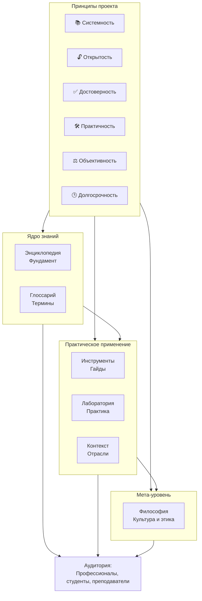

import ExternalPlayEmbed from '@site/src/components/ExternalPlayEmbed';


# Манифест

**"Вселенная IT"** — это долгосрочный, открытый и образовательный проект, направленный на систематизацию, унификацию и проверяемое хранение знаний в области информационных технологий. Его цель — создание единой, непротиворечивой и доступной базы знаний, охватывающей полный спектр IT-дисциплин: от фундаментальных основ до современных инженерных практик.

Под "Манифестом" подразумеваем описание правил, свойств и принципов работы ресурса.

> **📌 Внимание**  
> Как пользоваться базой знаний, что означают теги и прочее - ищите в разделе "О проекте".
---
<div class="callout callout--tip">
  <div class="callout-title">Как организована "Вселенная"?</div>

  <div class="callout-body">
В основе всего лежат принципы, которые мы должны учитывать.

С их учётом мы сначала знакомимся с "Энциклопедией" и "Глоссарием". Затем, в поисках развития и закрепления навыков, идём к "Инструментам", "Лаборатории" и "Контексту". А уже для рассуждений и размышлений обращаемся к "Философии". 

Всё это рассчитано практически на всех, но материал подаётся именно в формате научно-познавательной теории, так что не пугайтесь, если где-то будет тяжко. Ориентируйтесь по тегам - они предупредят о сложности, и не бойтесь новых знаний - просто нужно изучать всё постепенно, системно.
</div>
  </div>


<ExternalPlayEmbed example="about/manifest-principles-play" title="Manifest Principles" />

---




---

## Основные принципы проекта

### 1. **Систематизация**  

Систематизировать умеют не все. Порой вам может казаться, что "вы знаете лучше", но речь идёт об экспертизе в области структурирования. Знания в IT часто фрагментированы, противоречивы или избыточны. Проект устраняет эти недостатки за счёт логической декомпозиции, иерархической структуризации и строгой терминологической дисциплины. Каждый термин, концепция или практика включаются в контекст общей архитектуры знаний.

```

Иерархия, структурность, последовательность и системность материала.
```
   

---

### 2. **Доступность**  

Знания должны быть доступны всем. Материалы предоставляются бесплатно, без географических, финансовых или технических ограничений. Поддерживается возможность офлайн-использования и локального развёртывания, в том числе в образовательных учреждениях и корпоративной среде.

```
Бесплатность, открытость, гласность.
```
   
---

### 3. **Актуальность и верификация**  

Мы не доверяем единому источнику. Содержание регулярно обновляется на основе анализа изменений в стандартах, спецификациях, официальной документации и промышленных практиках. Все утверждения проходят кросс-валидацию по множеству источников: первичные (спецификации, исходный код, техническая документация), вторичные (научные публикации, экспертные анализы) и третичные (обобщающие ресурсы, при наличии подтверждения). В случае наличия спорных, устаревших или недостаточно подтверждённых данных это прямо указывается.

```
Постоянное обновление, проверка, улучшение.
```

---

### 4. **Практичность**  

Теоретические разделы дополняются примерами, архитектурными диаграммами, ссылками на спецификации и практическими кейсами. Акцент делается на объяснении логики, ограничений и контекста применения технологий.

```
Примеры кода, задачи, подборки решений.
```

---

### 5. **Нейтральность и объективность**  

Мы свободны от маркетингового влияния. Сравнения технологий проводятся на основе измеримых характеристик: производительности, совместимости, зрелости экосистемы, документированности и т.п. Предпочтения не высказываются без аргументации, основанной на независимых данных.

```
Отсутствие аффилированности, зависимости и инвестиций.
```
   
---

### 6. **Долгосрочность**

Материалы создаются с расчётом на использование в течение многих лет. Важнейшие фундаментальные концепции излагаются вне контекста краткосрочных трендов.

```
Обновления, указание об устаревших материалах, прогнозирование.
```

---

### 7. **Ответственность за качество**  

Автор не публикует информацию, не подтверждённую собственным опытом, анализом или надёжными источниками. Там, где используется генеративный ИИ (например, для чернового формулирования или перефразирования), проводится обязательная экспертная проверка, даже если в течение какого-то времени. Следы ИИ-генерации могут оставаться в черновиках — это признак текущей работы, а не финального состояния материала.

Нет ничего плохого в использовании ИИ, если это проверено, надёжно и во благо общества.

```
Открытые источники, образовательные некоммерческие цели.
```

---

## О чём важно знать читателям

- Проект не преследует коммерческих целей. Его единственная цель — передача знаний.
- Читайте без ограничений, рекламы и слежки. Пользуйтесь на здоровье. Никакого подвоха.
- Результатом изучения материалов является **ваше знание и понимание**, а не сертификат, диплом или иной формальный артефакт.
- Материалы структурированы так, чтобы поддерживать как краткосрочные запросы (например, поиск определения), так и систематическое обучение (через тематические дорожные карты и последовательное изучение разделов).
- Разделы, помеченные как "в разработке" или "на экспертизе", находятся в активной работе. Их незавершённость — часть процесса, а не недостаток.
- Автор не претендует на оригинальность общедоступных знаний. Вся информация публикуется исключительно в образовательных целях и не является присвоением чужих разработок или курсов. Мы уважаем авторство. Мы не присваиваем чужие идеи.
- Цели исключительно помогать и поддерживать через подачу знаний. Если вы считаете, что уже знаете материал лучше - значит, не стоит критиковать - лучше помочь с вариантом формулировок, идей для материалов или предложениями по улучшению.
- Никаких сроков для исправлений не ставится, так как работа на энтузиазме. К тому же, вы прекрасно понимаете, что совершенству нет предела, можно улучшать и улучшать.
- Раздел "Философия" может содержать рассуждения или выражение своего мнения, однако сразу договоримся - индифферентность к политике, идеологии, религии, и прочему.

---

## Позиция автора

Проект — часть профессиональной деятельности автора в роли технического писателя, аналитика и преподавателя. Его компетенция — в **систематизации знаний**, построении логических связей между дисциплинами и создании материалов, пригодных для долгосрочного использования.

Я не позиционирую себя как обалденный разработчик, инженер, аналитик или писатель. Систематизатор - возможно. Преподаватель - однозначно.

---

## Обратная связь и сотрудничество

Проект открыт к конструктивному диалогу с профессионалами, преподавателями, исследователями и студентами. Автор приветствует предложения по улучшению, сотрудничеству и экспертной оценке материалов.

Буду рад предложениям о работе в качестве технического писателя.

Также мне бы очень помогла финансовая помощь в виде добровольных пожерствований, если имеется возможность - подробности в разделе "Об авторе".

Критика без предложения альтернатив или вклада в развитие проекта не рассматривается — ресурсы автора ограничены, а задача — масштабна.

Попытки некорректного использования материалов (включая их некоммерческое копирование без указания источника или создание производных работ без взаимодействия с автором) противоречат духу проекта. Вместо этого предлагается инициировать сотрудничество: материалы требуют постоянной актуализации, и вклад сообщества может быть бесценен.

Официальных форумов для обсуждения данного ресурса нет. На текущий момент также не имеется планов для создания каких-либо групп, кроме официального канала в Telegram, поэтому любые совпадения или представители, выдающие себя за официальных - самозванцы.

Настоящий владелец - **Тагиров Тимур**, он же автор, редактор, корректор, эксперт и разработчик.

---
