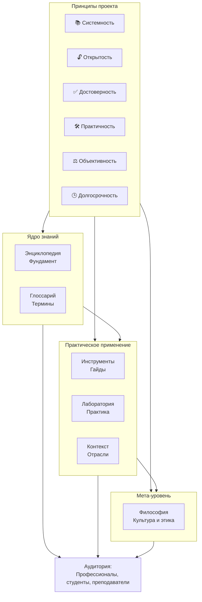

# Манифест и правила «Вселенной IT»

**«Вселенная IT»** — это долгосрочный, открытый и образовательный проект, направленный на систематизацию, унификацию и проверяемое хранение знаний в области информационных технологий. Его цель — создание единой, непротиворечивой и доступной базы знаний, охватывающей полный спектр IT-дисциплин: от фундаментальных основ до современных инженерных практик.

### Основные принципы проекта

1. **Систематизация**  
   Систематизировать умеют не все. Порой вам может казаться, что "вы знаете лучше", но речь идёт об экспертизе в области структурирования. Знания в IT часто фрагментированы, противоречивы или избыточны. Проект устраняет эти недостатки за счёт логической декомпозиции, иерархической структуризации и строгой терминологической дисциплины. Каждый термин, концепция или практика включаются в контекст общей архитектуры знаний.

2. **Доступность**  
   Знания должны быть доступны всем. Материалы предоставляются бесплатно, без географических, финансовых или технических ограничений. Поддерживается возможность офлайн-использования и локального развёртывания, в том числе в образовательных учреждениях и корпоративной среде.

3. **Актуальность и верификация**  
   Мы не доверяем единому источнику. Содержание регулярно обновляется на основе анализа изменений в стандартах, спецификациях, официальной документации и промышленных практиках. Все утверждения проходят кросс-валидацию по множеству источников: первичные (спецификации, исходный код, техническая документация), вторичные (научные публикации, экспертные анализы) и третичные (обобщающие ресурсы, при наличии подтверждения). В случае наличия спорных, устаревших или недостаточно подтверждённых данных это прямо указывается.

4. **Практичность**  
   Теоретические разделы дополняются примерами, архитектурными диаграммами, ссылками на спецификации и практическими кейсами. Акцент делается не на перечислении технологий, а на объяснении их логики, ограничений и контекста применения.

5. **Нейтральность и объективность**  
   Мы свободны от маркетингового влияния. Сравнения технологий проводятся на основе измеримых характеристик: производительности, совместимости, зрелости экосистемы, документированности и т.п. Предпочтения не высказываются без аргументации, основанной на независимых данных.

6. **Долгосрочность**  
   Материалы создаются с расчётом на использование в течение многих лет. Важнейшие фундаментальные концепции излагаются вне контекста краткосрочных трендов.

7. **Ответственность за качество**  
   Автор не публикует информацию, не подтверждённую собственным опытом, анализом или надёжными источниками. Там, где используется генеративный ИИ (например, для чернового формулирования или перефразирования), проводится обязательная экспертная проверка. Следы ИИ-генерации могут оставаться в черновиках — это признак текущей работы, а не финального состояния материала.

### О чём важно знать читателям

- Проект не преследует коммерческих целей. Его единственная цель — передача знаний.
- Результатом изучения материалов является **ваше знание и понимание**, а не сертификат, диплом или иной формальный артефакт.
- Материалы структурированы так, чтобы поддерживать как краткосрочные запросы (например, поиск определения), так и систематическое обучение (через тематические дорожные карты и последовательное изучение разделов).
- Разделы, помеченные как «в разработке» или «на экспертизе», находятся в активной работе. Их незавершённость — часть процесса, а не недостаток.
- Автор не претендует на оригинальность общедоступных знаний. Вся информация публикуется исключительно в образовательных целях и не является присвоением чужих разработок или курсов. Мы уважаем авторство. Мы не присваиваем чужие идеи.

### Позиция автора

Проект — часть профессиональной деятельности автора в роли технического писателя, аналитика и преподавателя. Его компетенция — не в реализации сложных инфраструктурных решений, а в **систематизации знаний**, построении логических связей между дисциплинами и создании материалов, пригодных для долгосрочного использования.

### Обратная связь и сотрудничество

Проект открыт к конструктивному диалогу с профессионалами, преподавателями, исследователями и студентами. Автор приветствует предложения по улучшению, сотрудничеству и экспертной оценке материалов.

Критика без предложения альтернатив или вклада в развитие проекта не рассматривается — ресурсы автора ограничены, а задача — масштабна.

Попытки некорректного использования материалов (включая их некоммерческое копирование без указания источника или создание производных работ без взаимодействия с автором) противоречат духу проекта. Вместо этого предлагается инициировать сотрудничество: материалы требуют постоянной актуализации, и вклад сообщества может быть бесценен.
