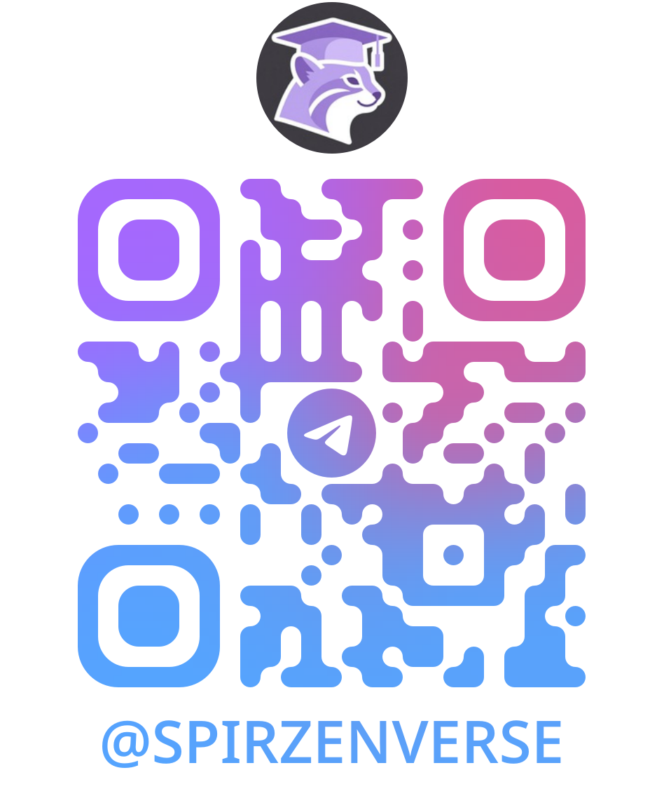

import DocCardList from '@theme/DocCardList';

# О проекте

<DocCardList />

## Вселенная IT

«Вселенная IT» — это масштабный проект по систематизации, унификации и долгосрочному хранению знаний в области информационных технологий. 

Материалы для сайта я пишу ещё с 2018 года. Сам сайт запущен в 2025 году. Именно благодаря многолетнему труду, здесь так много статей - более трёх тысяч.

Здесь:
- нет слежки;
- нет сбора данных;
- нет рекламы и платных услуг;
- нет пропаганды и скрытых целей.

Цель проекта — создание единой, непротиворечивой, проверяемой и доступной базы знаний, охватывающей всю широту IT-дисциплин, от фундаментальных основ до современных инженерных практик.

Если проще - дать вам, читателям, удобную возможность развиваться, читать и знать больше.

Материалы ориентированы на профессионалов, преподавателей, студентов и тех, кто начинает свой путь в IT. Каждый раздел проектируется с учётом научной строгости, практической применимости и доступности изложения.

Любите игры? Хотите улучшить компьютерную грамотность? Желаете выучить язык программирования? Ищете гайд для решения какой-то задачи? Не можете разобраться в какой-то теме?


<div class="callout callout--tip">
  <div class="callout-title">💡 Совет</div>
В каждой статье есть теги, рекомендую обращать внимание. 
Они определяют обязательность и целевую аудиторию статьи, к примеру, тег "В РАЗРАБОТКЕ" говорит о том, что работа ещё не окончена, и кидаться тухлыми помидорами не нужно.
</div>


<div class="article-tags">
  <span class="tag tag-inprogress">В РАЗРАБОТКЕ</span>
  <span class="tag tag-required">ОБЯЗАТЕЛЬНО</span>
  <span class="tag tag-notrequired">НЕ ОБЯЗАТЕЛЬНО</span>
  <span class="tag tag-beginner">ДЛЯ НОВИЧКОВ</span>
  <span class="tag tag-advanced">НЕ ДЛЯ НОВИЧКОВ</span>
</div>
<span class="complexity-badge">Разработчику</span>
<span class="complexity-badge">Аналитику</span>
<span class="complexity-badge">Тестировщику</span>  
<span class="complexity-badge">Архитектору</span>
<span class="complexity-badge">Инженеру</span>
<span class="complexity-badge">Руководителю</span>
<span class="complexity-badge">Родителям и детям</span>
<span class="complexity-badge">Всем</span>

```
Я стараюсь всегда приводить примеры кода. Можете копировать через кнопку справа в таких блоках. -->
```

Пользуйтесь **навигацией** - она разделяет всю "Вселенную" на разделы:
- О проекте
- Энциклопедия
- Инструменты
- Глоссарий
- Лаборатория
- Контекст
- Философия

Здесь есть всякое разное - списки игр, глоссарий терминов, подборка литературы и официальной документации, много интересных статей и теоретических основ.

> **📌 Внимание**  
> Правила и позиция проекта изложены в Манифесте.

---


## Цели проекта

### Основная цель
Формирование независимого, достоверного и устойчивого источника знаний, не подверженного коммерческому влиянию, временным трендам или региональным ограничениям. Проект стремится стать стандартом первичного обращения за информацией в русскоязычном IT-пространстве.

### Задачи
- **Систематизация знаний**: Устранение фрагментарности знаний через логическую декомпозицию и иерархическую структуризацию. Устранение дублирования, противоречий и терминологической неоднозначности.
- **Доступность**: Обеспечение свободного доступа к материалам без финансовых, географических или технических барьеров. Поддержка офлайн-использования и локального развёртывания.
- **Актуальность**: Регулярное обновление содержания на основе анализа изменений в стандартах, платформах и индустриальных практиках.
- **Практичность**: Интеграция теории с примерами использования, диаграммами архитектур, ссылками на спецификации и официальную документацию.
- **Нейтральность и объективность**: Исключение маркетингового влияния, сравнительный анализ технологий на основе измеримых характеристик.

---

## Принципы

Проект следует принципам **мультиисточности** (используется много источников информации для формирования полной картины), **нейтральности** (сравнение проводится объективно, без предвзятости), **долгосрочности** (чтобы материал можно было применять в течение многих лет), **профессионализма** - если что-то пишем, значит уже проверили сами. Поэтому верификация у нас происходит систематически по первичным и независимым источникам.

---

## Источники

Я провожу кросс-валидацию источников (я уже работал с факт-чекингом, так что разбираюсь в этой теме), и проверяю достоверность информации путём сопоставления данных из всех доступных источников - официальные, коммерческие, независимые и надёжные. К примеру, это может быть документация Microsoft, учебники и научная литература, статьи экспертов, мой личный опыт и практика, рекомендации коллег и знакомых профессионалов, проверка от ИИ-агентов (GPT, DeepSeek, Qwen, Яндекс).

Данные триангулируются (используются несколько методов или источников для подтверждения одного и того же факта).

Если данные спорные, устаревшие или ненадёжные - я прямо об этом скажу. Приоритет, конечно, отдаём оригинальным материалам - спецификациям, исходному коду, документации. Вторичные источники вроде блогов, статей или видео используются лишь как дополнение.

К сожалению, отметить какую-то конкретную литературу сложно - в основном курсы, учебники и прочие материалы преследуют коммерческую направленность, поэтому рассчитаны на узкое изучение с дальнейшим обращением к экспертам.

Но ведь мы с вами и так эксперты, не так ли? Чем вы отличаетесь от любого учёного? Тем, что он изучал чуть больше. Так станьте учёным и изучите!!!

---


## Структура базы знаний

Проект разработан на Docusaurus, и организован в **6 основных разделов**, и каждый из них имеет свои подразделы. Самый существенный для вас, наверное, это "Энциклопедия", поделённая на **9 подразделов**. Они условные и рассчитаны скорее на порядок и структурность ознакомления.

### 1. Основы
<span class="complexity-badge">Всем</span>

Фундаментальные знания о компьютерах, программном обеспечении и IT-сфере в целом, и таких основах, как двоичная система, ПО, лицензирование, типы приложений, история развития IT. Идеально подходит для новичков, так как фактически развивает компьютерную грамотность, вводя в вычислительные системы.

### 2. Система и сеть
<span class="complexity-badge">Разработчику</span>
<span class="complexity-badge">Аналитику</span>
<span class="complexity-badge">Тестировщику</span>  
<span class="complexity-badge">Архитектору</span>
<span class="complexity-badge">Инженеру</span>

Операционные системы (Windows, Linux, Unix-подобные), сетевые технологии, системное администрирование, процессы, потоки, файловые системы, сетевые модели (OSI, TCP/IP), маршрутизация, DNS, DHCP, VPN, базовая безопасность.

### 3. Данные и разметка
<span class="complexity-badge">Всем</span>

Работа с данными, базы данных, SQL, NoSQL, HTML, CSS, анализ информации и структуры данных, сериализация, форматы (JSON, XML, YAML), нормализация, транзакции, индексация.

### 4. Код и разработка
<span class="complexity-badge">Разработчику</span>
<span class="complexity-badge">Архитектору</span>
<span class="complexity-badge">Инженеру</span>

Программирование, алгоритмы, архитектура приложений, инструменты разработки и методологии, отладка, контроль версий, сборка, цикл разработки ПО.

### 5. Языки программирования
<span class="complexity-badge">Разработчику</span>
<span class="complexity-badge">Архитектору</span>

Глубокое изучение языков: C#, Python, Java, JavaScript/TypeScript, C++, PHP, Ruby, Rust, Lua, а также анализ старых и нишевых языков (например, COBOL, Pascal). Для каждого — семантика, runtime, особенности компиляции/интерпретации, экосистема.

### 6. Искусственный интеллект
<span class="complexity-badge">Разработчику</span>
<span class="complexity-badge">Архитектору</span>
<span class="complexity-badge">Инженеру</span>

Основы AI и машинного обучения, модели и инструменты, разработка и применение ИИ.

### 7. Управление проектами
<span class="complexity-badge">Разработчику</span>
<span class="complexity-badge">Аналитику</span>
<span class="complexity-badge">Тестировщику</span>  
<span class="complexity-badge">Архитектору</span>
<span class="complexity-badge">Руководителю</span>
<span class="complexity-badge">Техническому писателю</span>

Методологии (Agile, Scrum, Kanban, Waterfall), управление требованиями, метрики, командная работа, роль бизнес-аналитика, взаимодействие с заказчиком, карьерные траектории.

### 8. Инфраструктура и безопасность
<span class="complexity-badge">Разработчику</span>
<span class="complexity-badge">Архитектору</span>
<span class="complexity-badge">Инженеру</span>

DevOps-практики, контейнеризация (Docker), оркестрация (Kubernetes), облачные платформы (AWS, Azure, GCP), мониторинг (Prometheus, Grafana), логирование, шифрование, аутентификация, аудит.

### 9. Дополнительные темы
<span class="complexity-badge">Всем</span>

Блокчейн, IoT, мобильная разработка, игровые движки, IT-этика, энергоэффективность, влияние IT на общество. Также включает спин-офф материалы — например, исторический анализ технологий или культурные аспекты цифровизации.

Но полная информация имеется в содержании.

---

## Особенности проекта

Как можно понять, проект простой и держится на моём энтузиазме. Я не знаю точно, что мною движило - но я люблю писать, систематизировать и приводить всё в порядок. Сначала я вёл базу знаний для себя, а потом всё как-то разрослось, и я подумал - а почему бы не поделиться со всем миром?

### Открытость
- Все материалы **бесплатны** и доступны каждому, даже самым вредным товарищам))
- Проект имеет **открытую лицензию** и позволяет спокойно получать знания.
- Исходный код сайта и контента хранится в публичном репозитории на GitHub.
- Вы можете скачать себе и развернуть, но тогда книга потеряет главное свойство - актуальность. Лучше пользуйтесь этим сайтом - spirzen.ru

### Формат "книги-энциклопедии"
- Проект представляет собой **статический сайт**, собранный с помощью современного генератора документации.
- Пользователи могут **только читать** материалы - это гарантирует целостность и авторскую экспертизу.
- Ведётся также работа над форматом книги, так что однажды сможем почитать и оффлайн.

### Многоязычность
- Основной язык: **Русский**
- Параллельно ведётся адаптация ключевых разделов на английский.
- Архитектура сайта позволяет добавлять новые языковые ветки без перестройки структуры.

---

## Безопасность

### Почему только чтение?
- **Защита от вандализма**: Исключается риск намеренного искажения или удаления информации.
- **Стабильность**: Постоянные URL позволяют использовать материалы в курсах, статьях и цитатах.
- **Качество**: Все изменения проходят ревизию автора, что исключает распространение неточных формулировок.

### Как обновляется контент?
- Обновления производятся **только автором**
- Все изменения **тщательно проверяются**
- **Регулярные обновления** с учетом новых технологий
- **Обратная связь** от сообщества учитывается при обновлениях

## Статистика проекта

- **Шесть больших разделов**
- **2000+ статей** и материалов
- **15+ языков программирования**
- **100% бесплатно**
- **Постоянно обновляется**
- Выглядит так, будто я продаю что-то, не так ли? А вот и нет, всё открыто.

---

## Планы развития

### Краткосрочные планы
- Экспертиза и улучшение существующей информации
- Поиск, изучение и добавление нового материала
- Масштабирование разделов
- Добавление новых статей в существующие разделы
- Улучшение поиска и навигации
- Добавление интерактивных элементов

### Долгосрочные планы
- Расширение на другие языки
- Создание видео-материалов
- Разработка мобильного приложения
- Интеграция с образовательными платформами

---

## Сообщество

### Как принять участие?

Проект не является коллегиальным в части написания контента. Автор остаётся единственным редактором, гарантируя единство стиля, точность формулировок и качество контента. Однако он открыт для сотрудничества.

Хотя редактирование недоступно, вы можете:
- **Предлагать улучшения** через GitHub Issues
- **Сообщать об ошибках** в материалах
- **Предлагать новые темы** для статей
- **Помогать с переводами**

### Обратная связь
Ваше мнение важно для развития проекта! Свяжитесь с автором через:
- GitHub Issues
- Email: tim.tagirov@mail.ru
- Социальные сети: [https://t.me/spirzenverse](https://t.me/spirzenverse)



---

## Планы

Планируется расширение разделов, оптимизация производительности сайтов и постоянное добавление практических кейсов. Сначала разберёмся с теорией.

---

## Лицензия

Проект распространяется под открытой лицензией, которая позволяет свободно использовать материалы для обучения и некоммерческих целей.

---

*Создано с уважением и любовью для IT-сообщества*
